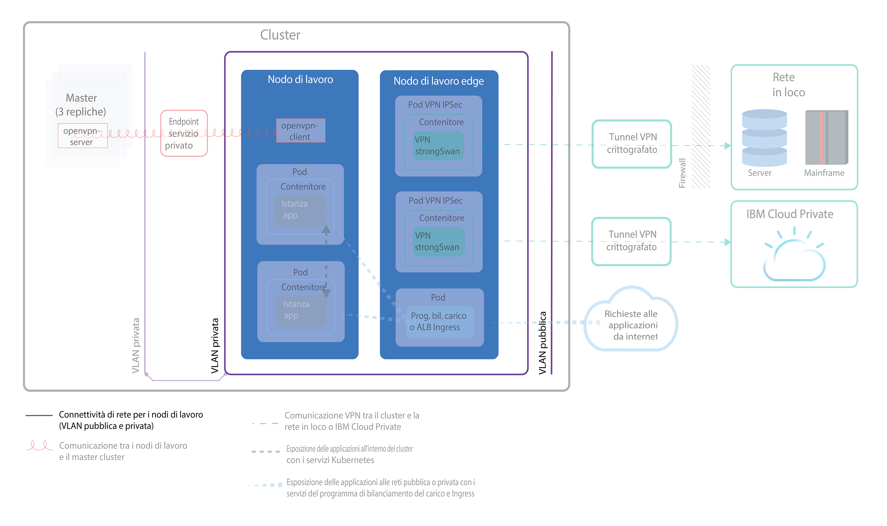
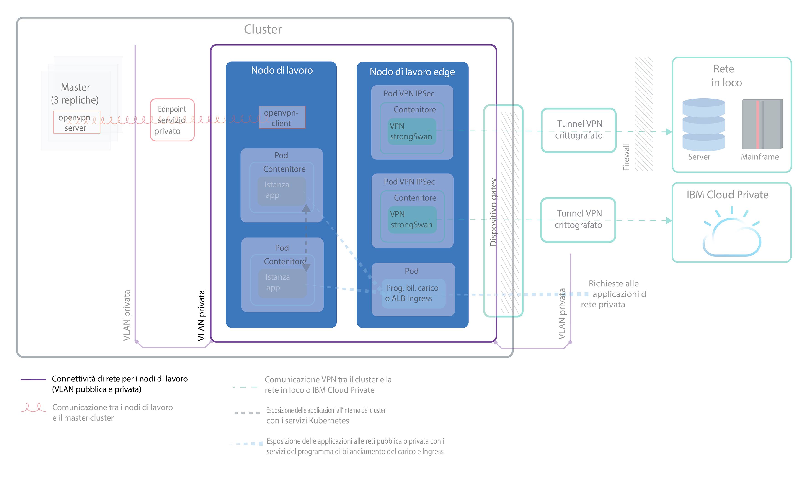
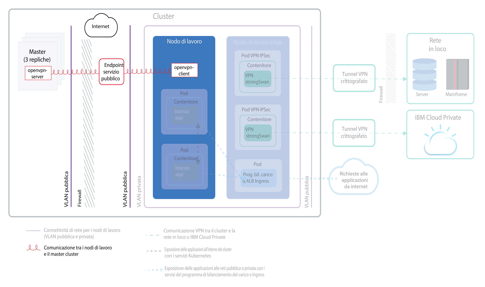
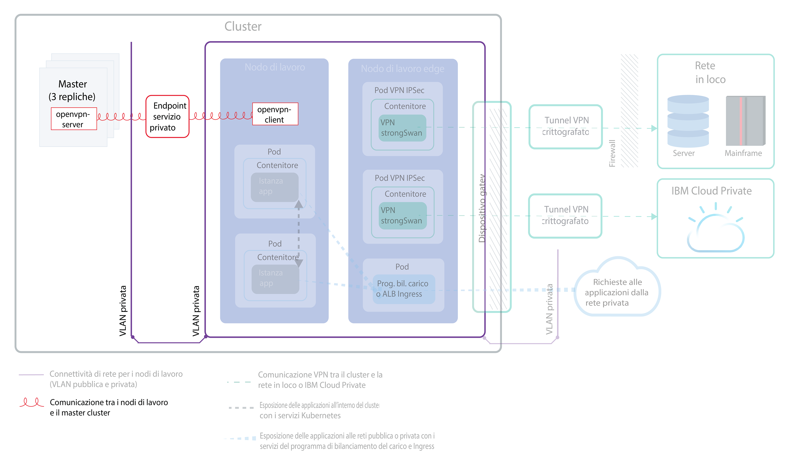
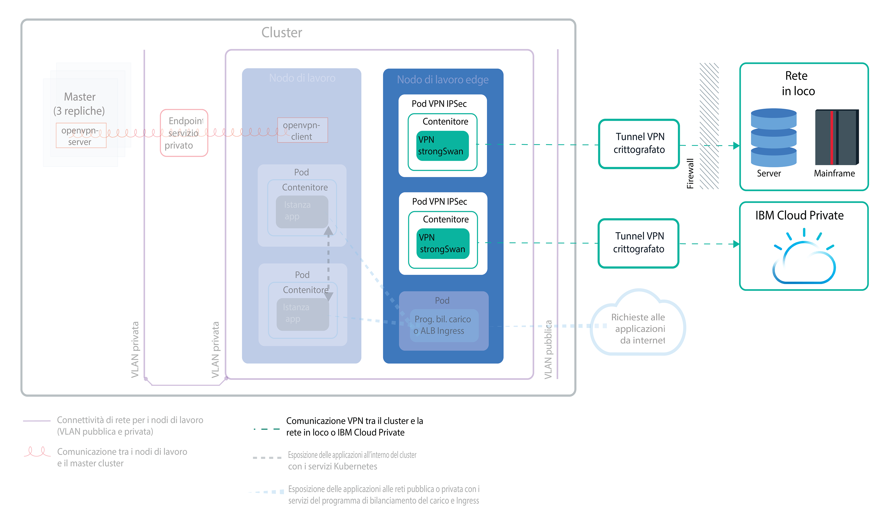
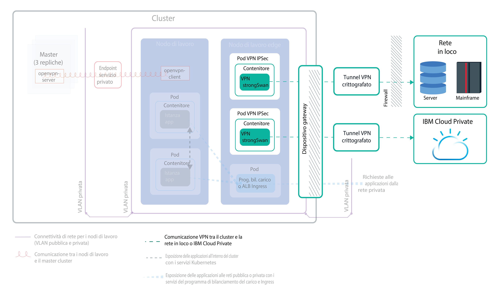

---

copyright:
  years: 2014, 2019
lastupdated: "2019-04-15"

---

{:new_window: target="_blank"}
{:shortdesc: .shortdesc}
{:screen: .screen}
{:pre: .pre}
{:table: .aria-labeledby="caption"}
{:codeblock: .codeblock}
{:tip: .tip}
{:note: .note}
{:important: .important}
{:deprecated: .deprecated}
{:download: .download}

# Pianificazione della rete del tuo cluster
{: #cs_network_ov}

Pianifica una configurazione di rete per il tuo cluster {{site.data.keyword.containerlong}}.
{: shortdesc}

Questa pagina ti aiuta a impostare la configurazione di rete del tuo cluster. Cerchi informazioni sulla configurazione della rete per la tua applicazione? Vedi [Pianificazione per esporre le tue applicazioni con reti in cluster e reti esterne](/docs/containers?topic=containers-cs_network_planning).
{: tip}

## Descrizione dei principi di base della rete {{site.data.keyword.containerlong_notm}}
{: #cs_network_ov_basics}

Prima di iniziare a configurare la rete del tuo cluster, è importante comprendere i concetti di base della rete nei cluster {{site.data.keyword.containerlong_notm}}.
{: shortdesc}

### Quali componenti cluster devono comunicare tra loro?
{: #cs_network_ov_basics_components}

Quando crei il tuo cluster, devi scegliere una configurazione di rete in modo che alcuni componenti cluster possano comunicare tra loro.
{: shortdesc}

* Tutti i nodi di lavoro devono essere connessi a una VLAN per poter comunicare tra loro e con il master Kubernetes. Per scegliere le VLAN, vedi [Pianificazione delle comunicazioni tra i nodi di lavoro](#cs_network_ov_worker).
* Le comunicazioni devono essere autorizzate su più VLAN private per consentire ai nodi di lavoro di connettersi tra loro e al master. Per abilitare una VRF (Virtual Router Function) o lo spanning della VLAN, vedi [In che modo vengono configurate le VLAN e le sottoreti per garantire la segmentazione di rete?](#cs_network_ov_basics_segmentation).
* I tuoi nodi di lavoro possono comunicare in modo sicuro con il master Kubernetes sulla rete pubblica o sulla rete privata. Per scegliere il canale di comunicazione tra nodi di lavoro e master, vedi [Pianificazione delle comunicazioni tra master e nodi di lavoro](#cs_network_ov_master).

### Come funziona la rete in {{site.data.keyword.containerlong_notm}}?
{: #cs_network_ov_basics_vlans}

{{site.data.keyword.containerlong_notm}} utilizza VLAN, sottoreti e indirizzi IP per fornire connettività di rete ai componenti cluster.
{: shortdesc}

**Cosa sono le VLAN? Quali tipi di VLAN offre {{site.data.keyword.containerlong_notm}}?** 

Quando crei un cluster, i nodi di lavoro del cluster vengono connessi automaticamente a una VLAN. Una VLAN configura un gruppo di nodi di lavoro e pod come se fossero collegati allo stesso cavo fisico e fornisce un canale per la connettività tra i nodi di lavoro e i pod.
{: shortdesc}

<dl>
<dt>VLAN per i cluster gratuiti</dt>
<dd>Per i cluster gratuiti, i nodi di lavoro del cluster sono connessi a una VLAN privata e a una VLAN pubblica di proprietà di IBM per impostazione predefinita. Poiché IBM controlla le VLAN, le sottoreti e gli indirizzi IP, non puoi creare dei cluster multizona o aggiungere sottoreti al tuo cluster e puoi solo utilizzare i servizi NodePort per esporre la tua applicazione.</dd>
<dt>VLAN per i cluster standard</dt>
<dd>Nei cluster standard, la prima volta che crei un cluster in una zona, viene automaticamente eseguito il provisioning di una VLAN pubblica e di una VLAN privata in tale zona per tuo conto nel tuo account dell'infrastruttura IBM Cloud (SoftLayer). Per ogni cluster successivo che crei in tale zona, devi specificare la coppia di VLAN che vuoi usare nella zona. Puoi riutilizzare le stesse VLAN pubbliche e private create per te, poiché le VLAN possono essere condivise da più cluster.  Puoi collegare i tuoi nodi di lavoro a una VLAN pubblica e alla VLAN privata o solo alla VLAN privata. Se vuoi collegare i tuoi nodi di lavoro solo a una VLAN privata, puoi utilizzare l'ID di una VLAN privata esistente o [creare una VLAN privata](/docs/cli/reference/ibmcloud?topic=cloud-cli-manage-classic-vlans#sl_vlan_create) e utilizzare l'ID durante la creazione del cluster.</dd></dl>

Per visualizzare le VLAN di cui viene eseguito il provisioning in ciascuna zona per il tuo account, esegui `ibmcloud ks vlans --zone <zone>.` Per visualizzare le VLAN di cui viene eseguito il provisioning su un singolo cluster, esegui `ibmcloud ks cluster-get --cluster <cluster_name_or_ID> --showResources` e cerca la sezione **Subnet VLANs**.

L'infrastruttura IBM Cloud (SoftLayer) gestisce le VLAN di cui viene eseguito automaticamente il provisioning quando crei il tuo primo cluster in una zona. Se lasci che una VLAN diventi inutilizzata, come ad esempio rimuovendo tutti i nodi di lavoro da essa, l'infrastruttura IBM Cloud (SoftLayer) la reclama. In seguito, se hai bisogno di una nuova VLAN, [contatta il supporto {{site.data.keyword.Bluemix_notm}}](/docs/infrastructure/vlans?topic=vlans-ordering-premium-vlans#ordering-premium-vlans).

**In che modo la mia scelta delle VLAN influisce sul mio cluster?** 

La tua scelta delle connessioni VLAN determina in che modo il master Kubernetes e i nodi di lavoro possono comunicare tra loro nel cluster. Per ulteriori informazioni, vedi [Pianificazione delle comunicazioni tra i nodi di lavoro e il master Kubernetes](/docs/containers?topic=containers-cs_network_ov#cs_network_ov_master).

La tua scelta delle connessioni VLAN determina anche la connettività di rete per le tue applicazioni. Per ulteriori informazioni, vedi [Pianificazione per esporre le tue applicazioni con reti in cluster e reti esterne](/docs/containers?topic=containers-cs_network_planning).

### Cosa sono le sottoreti? Quali tipi di sottoreti offre {{site.data.keyword.containerlong_notm}}?
{: #cs_network_ov_basics_subnets}

In aggiunta ai nodi di lavoro e ai pod, sulle VLAN viene eseguito automaticamente anche il provisioning delle sottoreti. Le sottoreti forniscono la connettività di rete ai tuoi componenti del cluster assegnando loro degli indirizzi IP.
{: shortdesc}

Delle seguenti reti viene eseguito automaticamente il provisioning sulle VLAN pubbliche e private predefinite:

**Sottoreti VLAN pubbliche**
* La sottorete pubblica primaria determina gli indirizzi IP pubblici che vengono assegnati ai nodi di lavoro durante la creazione del cluster. Più cluster sulla stessa VLAN possono condividere una sottorete pubblica primaria.
* La sottorete pubblica portatile è associata solo a un singolo cluster e fornisce al cluster 8 indirizzi IP pubblici. 3 IP sono riservati per le funzioni dell'infrastruttura Cloud IBM (SoftLayer). 1 IP viene utilizzato dall'ALB Ingress pubblico predefinito e 4 IP possono essere utilizzati per creare servizi NLB (network load balancer) pubblici. Gli IP pubblici portatili sono indirizzi IP fissi e permanenti che possono essere utilizzati per accedere agli NLB su Internet. Se hai bisogno di più di 4 IP per gli NLB, vedi [Aggiunta di indirizzi IP portatili](/docs/containers?topic=containers-subnets#adding_ips).

**Sottoreti VLAN private**
* La sottorete privata primaria determina gli indirizzi IP privati che vengono assegnati ai nodi di lavoro durante la creazione del cluster. Più cluster sulla stessa VLAN possono condividere una sottorete privata primaria.
* La sottorete privata portatile è associata solo a un singolo cluster e fornisce al cluster 8 indirizzi IP privati. 3 IP sono riservati per le funzioni dell'infrastruttura Cloud IBM (SoftLayer). 1 IP viene utilizzato dall'ALB Ingress privato predefinito e 4 IP possono essere utilizzati per creare servizi NLB (network load balancer) privati. Gli IP privati portatili sono indirizzi IP fissi e permanenti che possono essere utilizzati per accedere agli NLB su una rete privata. Se hai bisogno di più di 4 IP per gli NLB privati, vedi [Aggiunta di indirizzi IP portatili](/docs/containers?topic=containers-subnets#adding_ips).

Per visualizzare tutte le sottoreti di cui viene eseguito il provisioning nel tuo account, esegui `ibmcloud ks subnets`. Per visualizzare le sottoreti pubbliche e private portatili di cui viene eseguito il binding su un singolo cluster, puoi eseguire `ibmcloud ks cluster-get --cluster <cluster_name_or_ID> --showResources` e cercare la sezione **Subnet VLANs**.

In {{site.data.keyword.containerlong_notm}}, le VLAN hanno un limite di 40 sottoreti. Se raggiungi questo limite, controlla prima se puoi [riutilizzare le sottoreti nella VLAN per creare nuovi cluster](/docs/containers?topic=containers-subnets#subnets_custom). Se hai bisogno di una nuova VLAN, ordinane una [contattando il supporto {{site.data.keyword.Bluemix_notm}}](/docs/infrastructure/vlans?topic=vlans-ordering-premium-vlans#ordering-premium-vlans). Quindi [crea un cluster](/docs/containers?topic=containers-cs_cli_reference#cs_cluster_create) che utilizzi questa nuova VLAN.
{: note}

### In che modo vengono configurate le VLAN e le sottoreti per garantire la segmentazione di rete?
{: #cs_network_ov_basics_segmentation}

La segmentazione di rete descrive l'approccio di dividere una rete in più sottoreti. Le applicazioni eseguite in una sottorete non possono vedere o accedere alle applicazioni in un'altra sottorete. Per ulteriori informazioni sulle opzioni di segmentazione della rete e su come sono correlate alle VLAN, vedi [questo argomento sulla sicurezza del cluster](/docs/containers?topic=containers-security#network_segmentation).
{: shortdesc}

Tuttavia, in diverse situazioni, i componenti del tuo cluster devono essere autorizzati a comunicare su più VLAN private. Ad esempio, se vuoi creare un cluster multizona, hai più VLAN per un cluster o hai più sottoreti sulla stessa VLAN, i nodi di lavoro che si trovano su sottoreti diverse nella stessa VLAN o in VLAN diverse non possono comunicare automaticamente tra loro. Devi abilitare una VRF (Virtual Router Function) o lo spanning della VLAN per il tuo account dell'infrastruttura IBM Cloud (SoftLayer).

**Cosa sono le VRF (Virtual Router Function) e lo spanning della VLAN?** 

<dl>
<dt>[VRF (Virtual Router Function)](/docs/infrastructure/direct-link?topic=direct-link-overview-of-virtual-routing-and-forwarding-vrf-on-ibm-cloud#overview-of-virtual-routing-and-forwarding-vrf-on-ibm-cloud)</dt>
<dd>Una VRF consente a tutte le VLAN e sottoreti nel tuo account dell'infrastruttura di comunicare tra loro. Inoltre, una VRF è necessaria per consentire ai tuoi nodi di lavoro e al master di comunicare sull'endpoint del servizio privato. Per abilitare VRF, [contatta il tuo rappresentante dell'account dell'infrastruttura IBM Cloud (SoftLayer)](/docs/infrastructure/direct-link?topic=direct-link-overview-of-virtual-routing-and-forwarding-vrf-on-ibm-cloud#how-you-can-initiate-the-conversion). Nota che VRF elimina l'opzione di spanning VLAN per il tuo account, poiché tutte le VLAN sono in grado di comunicare a meno che non configuri un'applicazione gateway per gestire il traffico.</dd>
<dt>[Spanning della VLAN](/docs/infrastructure/vlans?topic=vlans-vlan-spanning#vlan-spanning)</dt>
<dd>Se non puoi o non vuoi abilitare VRF, abilita lo spanning della VLAN. Per eseguire questa azione, ti serve l'[autorizzazione dell'infrastruttura](/docs/containers?topic=containers-users#infra_access) **Rete > Gestisci il VLAN Spanning di rete** oppure puoi richiedere al proprietario dell'account di abilitarlo. Per controllare se lo spanning della VLAN è già abilitato, utilizza il [comando](/docs/containers?topic=containers-cs_cli_reference#cs_vlan_spanning_get) `ibmcloud ks vlan-spanning-get`. Nota che, se scegli di abilitare lo spanning della VLAN invece di una VRF, non puoi abilitare l'endpoint del servizio privato.</dd>
</dl>

**In che modo VRF o lo spanning della VLAN influiscono sulla segmentazione di rete?** 

Quando abiliti VRF o lo spanning della VLAN, qualsiasi sistema connesso a qualsiasi VLAN privata nello stesso account {{site.data.keyword.Bluemix_notm}} può comunicare con i nodi di lavoro. Puoi isolare il tuo cluster da altri sistemi sulla rete privata applicando delle [politiche di rete privata Calico](/docs/containers?topic=containers-network_policies#isolate_workers). {{site.data.keyword.containerlong_notm}} è inoltre compatibile con tutte le [offerte firewall dell'infrastruttura IBM Cloud (SoftLayer) ](https://www.ibm.com/cloud-computing/bluemix/network-security). Puoi configurare un firewall, ad esempio una [VRA (Virtual Router Appliance)](/docs/infrastructure/virtual-router-appliance?topic=virtual-router-appliance-about-the-vra), con politiche di rete personalizzate per fornire una sicurezza di rete dedicata per il tuo cluster standard e per rilevare e risolvere intrusioni di rete.

 

## Pianificazione delle comunicazioni tra i nodi di lavoro
{: #cs_network_ov_worker}

Tutti i nodi di lavoro devono essere connessi a una VLAN per avere un'interfaccia di rete. Questa interfaccia di rete consente a ciascun nodo di lavoro di inviare e ricevere informazioni da altri nodi di lavoro.
{: shortdesc}

### Quali sono le mie opzioni per la connettività VLAN dei nodi di lavoro?
{: #cs_network_ov_worker_options}

Quando crei il tuo cluster, puoi connettere i tuoi nodi di lavoro a una VLAN pubblica e a una VLAN privata o soltanto a una VLAN privata.
{: shortdesc}

**Perché potrei connettere il mio cluster a una VLAN pubblica e privata?** 

Nella maggior parte dei casi, puoi ottenere la flessibilità della rete creando un cluster connesso a una VLAN pubblica e a una VLAN privata. Ad esempio:
* Hai un'applicazione che deve essere accessibile all'Internet pubblico.
* Hai un'applicazione che vuoi esporre solo ai pod all'interno del cluster o in altri cluster connessi alla stessa VLAN privata. Sono disponibili diverse opzioni per proteggere la tua applicazione dall'interfaccia pubblica, come l'utilizzo delle politiche di rete Calico o l'isolamento del carico di lavoro della rete esterna sui nodi di lavoro edge.

La seguente immagine mostra la connettività di rete per i nodi di lavoro connessi a una VLAN pubblica e privata.

<figure>
 
 <figcaption>Connettività di rete per i nodi di lavoro connessi a una VLAN pubblica e privata</figcaption>
</figure>

Se vuoi creare un cluster multizona, hai più VLAN per un cluster o hai più sottoreti sulla stessa VLAN, i nodi di lavoro che si trovano su sottoreti diverse nella stessa VLAN o in VLAN diverse non possono comunicare automaticamente tra loro. Devi abilitare una [VRF o lo spanning della VLAN](#cs_network_ov_basics_segmentation) per il tuo account dell'infrastruttura IBM Cloud (SoftLayer). Scegli VRF per abilitare l'[endpoint del servizio privato per le comunicazioni tra master e nodi di lavoro](#cs_network_ov_master_private). Se non puoi o non vuoi abilitare VRF, abilita lo spanning della VLAN.

**Perché potrei connettere il mio cluster solo a una VLAN privata?** 

Crea un cluster con VLAN solo privata se hai requisiti di sicurezza specifici o hai bisogno di creare politiche di rete e regole di instradamento personalizzate per fornire una sicurezza di rete dedicata.
{: shortdesc}

La seguente immagine mostra la connettività di rete per i nodi di lavoro connessi solo a una VLAN privata.

<figure>
 
 <figcaption>Connettività di rete per i nodi di lavoro in una configurazione di rete privata</figcaption>
</figure>

Se vuoi creare un cluster multizona, hai più VLAN per un cluster o hai più sottoreti sulla stessa VLAN, i nodi di lavoro che si trovano su sottoreti diverse nella stessa VLAN o in VLAN diverse non possono comunicare automaticamente tra loro. Devi abilitare una [VRF o lo spanning della VLAN](#cs_network_ov_basics_segmentation) per il tuo account dell'infrastruttura IBM Cloud (SoftLayer). Scegli VRF per abilitare l'[endpoint del servizio privato per le comunicazioni tra master e nodi di lavoro](#cs_network_ov_master_private). Se non puoi o non vuoi abilitare VRF, abilita lo spanning della VLAN e configura inoltre un dispositivo gateway per le comunicazioni tra master e nodi di lavoro.

### Ho fatto la mia scelta per le connessioni VLAN. Come le configuro?
{: #cs_network_ov_worker_setup}

Puoi seguire i passi in [Configurazione della rete del cluster con una VLAN pubblica e una privata](/docs/containers?topic=containers-cs_network_cluster#both_vlans) o [Configurazione della rete del cluster con una VLAN solo privata](/docs/containers?topic=containers-cs_network_cluster#setup_private_vlan).
{: shortdesc}

### Posso cambiare la mia decisione riguardo alla VLAN in seguito? Gli indirizzi IP del mio nodo di lavoro cambiano?
{: #cs_network_ov_worker_change}

Puoi cambiare la tua configurazione della VLAN modificando i pool di nodi di lavoro nel tuo cluster. Per ulteriori informazioni, vedi [Modifica delle connessioni VLAN dei tuoi nodi di lavoro](/docs/containers?topic=containers-cs_network_cluster#change-vlans).
{: shortdesc}

Al tuo nodo di lavoro viene assegnato un indirizzo IP sulle VLAN pubbliche o private utilizzate dal tuo cluster. Una volta eseguito il provisioning del tuo nodo di lavoro, gli indirizzi IP restano immutati. Ad esempio, gli indirizzi IP del nodo di lavoro persistono attraverso le operazioni `reload`, `reboot` e `update`. Inoltre, l'indirizzo IP privato del nodo di lavoro viene utilizzato per l'identità di tale nodo nella maggior parte dei comandi `kubectl`. Se modifichi le VLAN utilizzate dal pool di nodi di lavoro, i nuovi nodi di lavoro di cui viene eseguito il provisioning in tale pool utilizzano le nuove VLAN per i propri indirizzi IP. Gli indirizzi IP
del nodo di lavoro esistente non cambiano, ma puoi scegliere di rimuovere i nodi di lavoro che utilizzano le vecchie VLAN.

 

## Pianificazione delle comunicazioni tra master e nodi di lavoro
{: #cs_network_ov_master}

Quando crei il tuo cluster, devi scegliere in che modo i nodi di lavoro e il master Kubernetes comunicano per orchestrare le configurazioni del tuo cluster.
{: shortdesc}

È necessario configurare un canale di comunicazione in modo che il master Kubernetes possa gestire i tuoi nodi di lavoro. Questa configurazione delle comunicazioni dipende da come imposti la connettività VLAN. Potresti essere in grado di consentire le comunicazioni tra i tuoi nodi di lavoro e il master Kubernetes abilitando endpoint del servizio solo pubblici, pubblici e privati o solo privati. Per determinare se puoi utilizzare gli endpoint del servizio, segui questa albero delle decisioni.

<map name="dt-image-map" id="dt-image-map">
  <area alt="Rete predefinita con endpoint del servizio pubblici, pubblici e privati o privati" title="Rete predefinita con endpoint del servizio pubblici, pubblici e privati o privati" href="#cs_network_ov_master_both" coords="0,296,195,354" shape="rect" />
  <area alt="Rete predefinita con solo un endpoint del servizio pubblico" title="Rete predefinita con solo un endpoint del servizio pubblico" href="#cs_network_ov_master_public" coords="220,295,353,352" shape="rect" />
  <area alt="Rete privata con solo un endpoint del servizio privato" title="Rete privata con solo un endpoint del servizio privato" href="#cs_network_ov_master_private" coords="393,294,524,356" shape="rect" />
  <area alt="Rete privata con un'applicazione gateway" title="Rete privata con un'applicazione gateway" href="#cs_network_ov_master_gateway" coords="579,294,697,354" shape="rect" />
</map>

Fai riferimento alle seguenti sezioni per ulteriori informazioni su ciascuna configurazione.

### Solo endpoint del servizio pubblico
{: #cs_network_ov_master_public}

Se i nodi di lavoro sono configurati con una VLAN privata e una pubblica, i tuoi nodi di lavoro possono connettersi automaticamente al master sulla rete pubblica attraverso l'endpoint del servizio pubblico. Non è richiesta una VRF nel tuo account {{site.data.keyword.Bluemix_notm}}.
{: shortdesc}

La seguente immagine mostra le comunicazioni tra i nodi di lavoro e il master Kubernetes tramite un endpoint del servizio pubblico.

<figure>
 
 <figcaption>Comunicazioni tra i nodi di lavoro e il master Kubernetes tramite un endpoint del servizio pubblico</figcaption>
</figure>

**Comunicazioni tra nodi di lavoro e master** 
Le comunicazioni vengono stabilite in modo sicuro sulla rete pubblica, attraverso l'endpoint del servizio pubblico. I nodi di lavoro comunicano in modo sicuro con il master attraverso i certificati TLS e il master comunica con i nodi di lavoro attraverso una connessione OpenVPN.

**Accesso al master** 
Il master è pubblicamente accessibile agli utenti del cluster autorizzati attraverso l'endpoint del servizio pubblico. Gli utenti del tuo cluster possono accedere in modo sicuro al tuo master Kubernetes su Internet per eseguire, ad esempio, i comandi `kubectl`.

Per configurare solo l'endpoint del servizio pubblico durante o dopo la creazione del cluster, segui la procedura in [Configurazione dell'endpoint del servizio pubblico](/docs/containers?topic=containers-cs_network_cluster#set-up-public-se).

### Solo endpoint del servizio privato
{: #cs_network_ov_master_private}

Per rendere il tuo master accessibile solo privatamente, puoi abilitare l'endpoint del servizio privato nei cluster che eseguono Kubernetes versione 1.11 o successive. È richiesta una VRF nel tuo account {{site.data.keyword.Bluemix_notm}}. Se il tuo cluster è connesso solo a una VLAN privata, un endpoint del servizio privato previene la necessità di un dispositivo gateway per connettersi in modo sicuro al master.
{: shortdesc}

La seguente immagine mostra le comunicazioni tra i nodi di lavoro e il master Kubernetes tramite un endpoint del servizio privato.

<figure>
 
 <figcaption>Comunicazioni tra i nodi di lavoro e il master Kubernetes tramite un endpoint del servizio privato</figcaption>
</figure>

**Comunicazioni tra nodi di lavoro e master** 
Le comunicazioni vengono stabilite sulla rete privata, attraverso l'endpoint del servizio privato.

**Accesso al master** 
Per accedere al master, gli utenti del tuo cluster devono trovarsi nella tua rete privata {{site.data.keyword.Bluemix_notm}} o connettersi alla rete privata
tramite una connessione VPN.

Per configurare solo l'endpoint del servizio privato durante o dopo la creazione del cluster, segui la procedura in [Configurazione dell'endpoint del servizio privato](/docs/containers?topic=containers-cs_network_cluster#set-up-private-se).

### Endpoint del servizio pubblici e privati
{: #cs_network_ov_master_both}

Per rendere il tuo master accessibile pubblicamente o privatamente agli utenti del cluster, puoi abilitare gli endpoint del servizio pubblici e privati nei cluster che eseguono Kubernetes versione 1.11 o successive. È richiesta una VRF nel tuo account {{site.data.keyword.Bluemix_notm}}.
{: shortdesc}

**Comunicazioni tra nodi di lavoro e master** 
Le comunicazioni vengono stabilite sulla rete privata attraverso l'endpoint del servizio privato e sulla rete pubblica attraverso l'endpoint del servizio pubblico. Instradando
metà del traffico nodo di lavoro-master sull'endpoint pubblico e metà sull'endpoint privato, le tue comunicazioni master-nodo di lavoro sono protette da eventuali interruzioni della rete pubblica o privata.

**Accesso al master** 
Il master è accessibile privatamente tramite l'endpoint del servizio privato se gli utenti del cluster autorizzati si trovano nella tua rete privata {{site.data.keyword.Bluemix_notm}} o sono connessi alla rete privata attraverso una connessione VPN. In caso contrario, il master è pubblicamente accessibile agli utenti del cluster autorizzati attraverso l'endpoint del servizio pubblico.

Per configurare gli endpoint del servizio pubblici e privati durante la creazione del cluster, segui la procedura in [Configurazione dell'endpoint del servizio privato](/docs/containers?topic=containers-cs_network_cluster#set-up-private-se). Dopo la creazione del cluster, puoi abilitare l'endpoint del servizio [pubblico](/docs/containers?topic=containers-cs_network_cluster#set-up-public-se) o [privato](/docs/containers?topic=containers-cs_network_cluster#set-up-private-se) singolarmente.

### Rete privata con un'applicazione gateway
{: #cs_network_ov_master_gateway}

Se i nodi di lavoro sono configurati solo con una VLAN privata e VRF non è abilitato nel tuo account {{site.data.keyword.Bluemix_notm}}, devi configurare una soluzione alternativa per la connettività di rete tra i tuoi nodi di lavoro e il master. Puoi configurare un firewall con politiche di rete personalizzate per fornire una sicurezza di rete dedicata per il tuo cluster standard e per rilevare e risolvere intrusioni di rete. Ad esempio, puoi scegliere di configurare un [Virtual Router Appliance](/docs/infrastructure/virtual-router-appliance?topic=virtual-router-appliance-about-the-vra) o un [Fortigate Security Appliance](/docs/services/vmwaresolutions/services?topic=vmware-solutions-fsa_considerations) in modo che funga da firewall e blocchi il traffico non desiderato. Quando configuri un firewall, devi anche [aprire le porte e gli indirizzi IP necessari](/docs/containers?topic=containers-firewall#firewall_outbound) per ogni regione in modo che il master e i nodi di lavoro possano comunicare.
{: shortdesc}

Se hai un'applicazione router esistente e aggiungi quindi un cluster, le nuove sottoreti portatili ordinate per il cluster non sono configurate sull'applicazione router. Per utilizzare i servizi di rete, devi abilitare l'instradamento tra le sottoreti sulla stessa VLAN [abilitando lo spanning delle VLAN](/docs/containers?topic=containers-subnets#vra-routing).
{: important}

## Pianificazione delle comunicazioni tra il cluster e la rete in loco o {{site.data.keyword.icpfull_notm}}
{: #cs_network_ov_vpn}

Connetti in modo sicuro i tuoi nodi di lavoro e le tue applicazioni a una rete in loco o a {{site.data.keyword.icpfull_notm}} configurando un servizio di connessione VPN strongSwan nel tuo cluster.
{: shortdesc}

### Impostazione di una connessione VPN per la configurazione di una VLAN pubblica e privata
{: #cs_network_ov_vpn_public}

<figure>
 
 <figcaption>Comunicazioni VPN tra un cluster e una rete in loco o {{site.data.keyword.icpfull_notm}} in una configurazione di rete predefinita</figcaption>
</figure>

Per connettere in modo sicuro i tuoi nodi di lavoro e le tue applicazioni a una rete in loco, puoi impostare un [servizio VPN IPSec strongSwan ](https://www.strongswan.org/about.html) direttamente nel tuo cluster. Il servizio VPN IPSec strongSwan fornisce un canale di comunicazione end-to-end protetto su Internet basato sulla suite di protocolli IPSec (Internet Protocol Security) standard del settore.
* Per configurare una connessione protetta tra il tuo cluster e una rete in loco, [configura e distribuisci il servizio VPN IPSec strongSwan](/docs/containers?topic=containers-vpn#vpn-setup) direttamente in un pod nel tuo cluster.
* Per configurare una connessione protetta tra il tuo cluster e un'istanza {{site.data.keyword.icpfull_notm}}, vedi [Connessione del tuo cloud pubblico e privato con la VPN strongSwan](/docs/containers?topic=containers-hybrid_iks_icp#hybrid_vpn).

### Impostazione di una connessione VPN per la configurazione di una VLAN solo privata
{: #cs_network_ov_vpn_private}

Se il tuo cluster è connesso solo a una VLAN privata, devi configurare un endpoint VPN IPSec su un dispositivo gateway VRA (Vyatta) o FSA. Quindi, puoi [configurare e distribuire il servizio VPN IPSec strongSwan](/docs/containers?topic=containers-vpn#vpn-setup) nel tuo cluster per utilizzare l'endpoint VPN sul tuo gateway. Se non vuoi utilizzare strongSwan, puoi [impostare la connettività VPN direttamente con VRA](/docs/containers?topic=containers-vpn#vyatta).
{: shortdesc}

<figure>
 
 <figcaption>Comunicazioni VPN tra un cluster e una rete in loco o {{site.data.keyword.icpfull_notm}} tramite un dispositivo gateway in una configurazione di rete privata</figcaption>
</figure>

