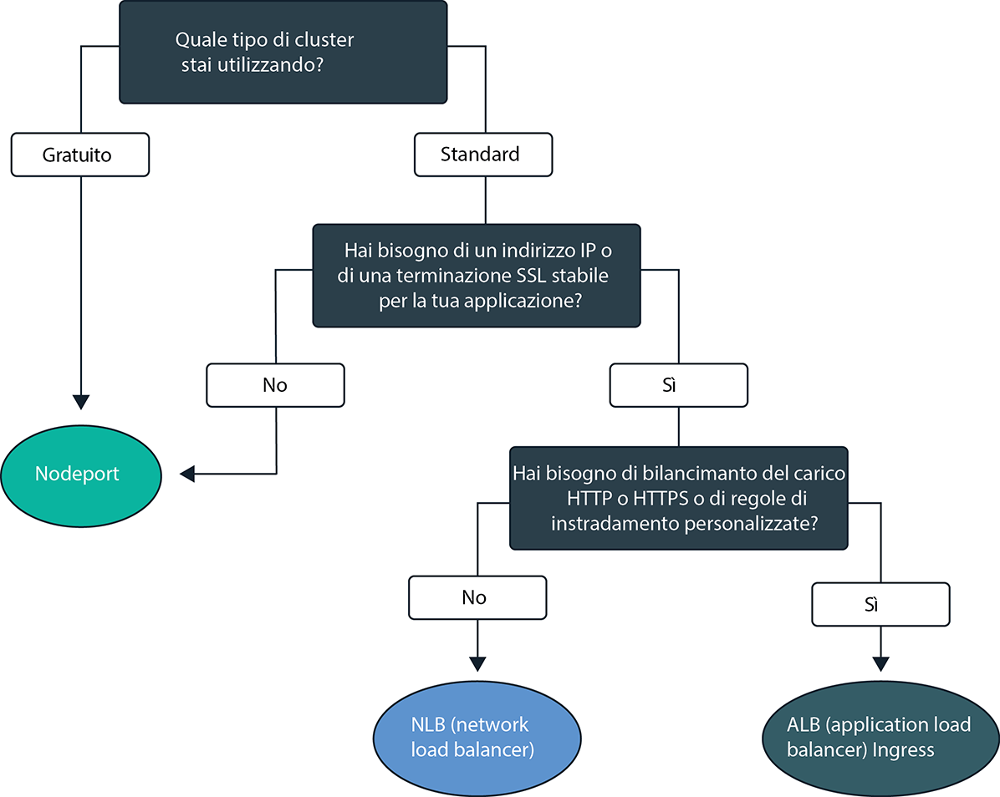
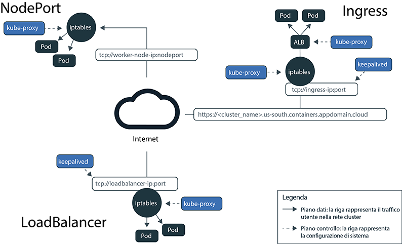
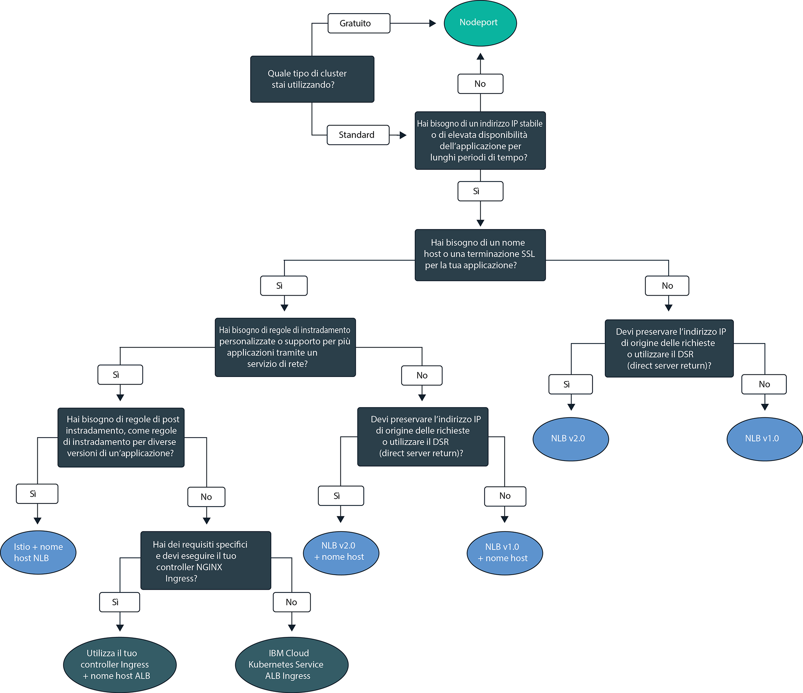

---

copyright:
  years: 2014, 2019
lastupdated: "2019-06-05"

keywords: kubernetes, iks

subcollection: containers

---

{:new_window: target="_blank"}
{:shortdesc: .shortdesc}
{:screen: .screen}
{:pre: .pre}
{:table: .aria-labeledby="caption"}
{:codeblock: .codeblock}
{:tip: .tip}
{:note: .note}
{:important: .important}
{:deprecated: .deprecated}
{:download: .download}
{:preview: .preview}

# Pianificazione della rete in cluster ed esterna per le applicazioni
{: #cs_network_planning}

Con {{site.data.keyword.containerlong}}, puoi gestire le reti in cluster ed esterne rendendo le applicazioni accessibili pubblicamente o privatamente.
{: shortdesc}

Per iniziare a utilizzare subito la rete dell'applicazione, segui questo albero delle decisioni e fai clic su un'opzione per visualizzare la documentazione sulla sua configurazione:

<map name="networking_map" id="networking_map">
<area target="" href="/docs/containers?topic=containers-nodeport" alt="Servizio NodePort" coords="52,254,78,260,93,270,101,285,92,302,72,314,49,318,19,309,0,281,18,263" shape="poly">
<area target="" href="/docs/containers?topic=containers-loadbalancer" alt="Servizio NLB (network load balancer) service" coords="288,405,324,414,348,434,350,455,327,471,295,477,246,471,222,446,237,417" shape="poly">
<area target="" href="/docs/containers?topic=containers-ingress" alt="Servizio ALB (application load balancer) Ingress" coords="532,405,568,410,593,427,600,448,582,468,554,477,508,476,467,463,454,441,474,419" shape="poly">
</map>

## Descrizione del bilanciamento del carico per le applicazioni tramite rilevamento dei servizi Kubernetes
{: #in-cluster}

Il rilevamento dei servizi Kubernetes fornisce alle applicazioni una connessione di rete attraverso servizi di rete e un proxy Kubernetes locale.
{: shortdesc}

**Servizi** 
A tutti i pod che vengono distribuiti in un nodo di lavoro viene assegnato un indirizzo IP privato nell'intervallo 172.30.0.0/16 e tali pod vengono instradati solo tra nodi di lavoro. Per evitare conflitti, non utilizzare questo intervallo di IP sui nodi che comunicano con i tuoi nodi di lavoro. I nodi di lavoro e i pod possono comunicare in modo sicuro sulla rete privata utilizzando indirizzi IP privati. Tuttavia, quando un pod ha un arresto anomalo o un nodo di lavoro deve essere ricreato, viene assegnato un nuovo
indirizzo IP.

Invece di cercare di tenere traccia di indirizzi IP privati mutevoli per applicazioni che devono essere ad alta disponibilità, puoi utilizzare le funzioni di rilevamento dei servizi Kubernetes integrate per esporre le applicazioni come servizi. Un servizio Kubernetes raggruppa un insieme di pod e fornisce una connessione di rete a questi pod. Il servizio seleziona i pod di destinazione a cui instrada il traffico tramite etichette.

Un servizio fornisce la connettività tra i pod delle tue applicazioni e altri servizi del cluster, senza esporre l'effettivo indirizzo IP privato di ciascun pod. Ai servizi viene assegnato un indirizzo IP interno al cluster, il `clusterIP`, accessibile solo all'interno del cluster. Questo indirizzo IP è collegato al servizio per tutta la sua durata e non viene modificato finché esiste il servizio.
* Cluster più recenti: nei cluster creati dopo febbraio 2018 nella zona dal13 o dopo ottobre 2017 in qualsiasi altra zona, ai servizi viene assegnato un IP tra i 65.000 IP compresi nell'intervallo 172.21.0.0/16.
* Cluster più vecchi: nei cluster creati prima di febbraio 2018 nella zona dal13 o prima di ottobre 2017 in qualsiasi altra zona, ai servizi viene assegnato un IP tra i 254 IP compresi nell'intervallo 10.10.10.0/24. Se hai raggiunto il limite di 254 e hai bisogno di altri servizi, devi creare un nuovo cluster.

Per evitare conflitti, non utilizzare questo intervallo di IP sui nodi che comunicano con i tuoi nodi di lavoro. Viene creata anche una voce di ricerca DNS per il servizio e viene memorizzata nel componente `kube-dns` del cluster. La voce DNS contiene il nome del servizio, lo spazio dei nomi in cui è stato creato il servizio e il link all'indirizzo IP in cluster assegnato.

**`kube-proxy`** 
Per fornire un bilanciamento del carico di base di tutto il traffico di rete TCP e UDP per i servizi, un proxy di rete Kubernetes locale, `kube-proxy`, viene eseguito come daemon su ciascun nodo di lavoro nello spazio dei nomi `kube-system`. `kube-proxy` utilizza le regole Iptables, una funzione kernel Linux, per indirizzare le richieste al pod sottostante un servizio in misura uguale, indipendentemente dagli indirizzi IP in cluster dei pod e dal nodo di lavoro su cui sono distribuiti.

Ad esempio, le applicazioni del cluster possono accedere a un pod sottostante un servizio cluster utilizzando l'indirizzo IP in cluster del servizio o inviando una richiesta a nome del servizio. Quando utilizzi il nome del servizio, `kube-proxy` ricerca il nome nel provider DNS del cluster e instrada la richiesta all'indirizzo IP in cluster del servizio.

Se utilizzi un servizio che fornisce sia un indirizzo IP del cluster interno che un indirizzo IP esterno, i client al di fuori del cluster possono inviare richieste all'indirizzo IP pubblico o privato esterno del servizio. `kube-proxy` inoltra le richieste all'indirizzo IP in cluster del servizio e bilancia il carico tra i pod dell'applicazione dietro il servizio.

La seguente immagine dimostra in che modo Kubernetes inoltra il traffico di rete pubblico tramite `kube-proxy` e i servizi NodePort, LoadBalancer o Ingress in {{site.data.keyword.containerlong_notm}}.

<figure>
 
 <figcaption>In che modo Kubernetes inoltra il traffico di rete pubblico attraverso i servizi NodePort, LoadBalancer e Ingress in {{site.data.keyword.containerlong_notm}}</figcaption>
</figure>

 

## Descrizione dei tipi di servizio Kubernetes
{: #external}

Kubernetes supporta quattro tipi di servizi di rete di base: `ClusterIP`, `NodePort`, `LoadBalancer` e `Ingress`. I servizi `ClusterIP` rendono le tue applicazioni accessibili internamente, per consentire le comunicazioni solo tra i pod del tuo cluster. I servizi `NodePort`, `LoadBalancer` e `Ingress` rendere accessibili esternamente le tue applicazioni dall'Internet pubblico o da una rete privata.
{: shortdesc}

<dl>
<dt>[ClusterIP](https://kubernetes.io/docs/concepts/services-networking/service/#defining-a-service)</dt>
<dd>Puoi esporre le applicazioni solo come servizi IP cluster sulla rete privata. Un servizio `clusterIP` fornisce un indirizzo IP in cluster accessibile solo da altri pod e servizi all'interno del cluster. Non viene creato alcun indirizzo IP esterno per l'applicazione. Per accedere a un pod sottostante a un servizio cluster, altre applicazioni del cluster possono usare l'indirizzo IP in cluster del servizio o inviare una richiesta utilizzando il nome del servizio. Quando viene raggiunto da richieste, il servizio ne esegue l'inoltro ai pod in misura uguale, indipendentemente dagli indirizzi IP in cluster dei pod e dal nodo di lavoro su cui sono distribuiti. Nota che se non specifichi un `type` in un file di configurazione YAML del servizio, viene creato per impostazione predefinita il tipo `ClusterIP`.</dd>

<dt>[NodePort](/docs/containers?topic=containers-nodeport)</dt>
<dd>Quando esponi le applicazioni con un servizio NodePort, al servizio vengono assegnati una NodePort compresa nell'intervallo 30000 - 32767 e un indirizzo IP del cluster interno. Per
accedere al servizio dall'esterno del cluster, si utilizza l'indirizzo IP pubblico o privato di un qualsiasi nodo di lavoro e la NodePort nel formato <code>&lt;IP_address&gt;:&lt;nodeport&gt;</code>. Tuttavia, gli indirizzi IP pubblici e privati del nodo di rete non sono permanenti. Quando un nodo di lavoro viene rimosso o ricreato, vengono assegnati al nodo di lavoro un nuovo indirizzo IP pubblico e uno nuovo privato. Le NodePort sono ideali per testare l'accesso pubblico o privato o fornire l'accesso solo per un breve periodo di tempo.</dd>

<dt>[LoadBalancer (NLB)](/docs/containers?topic=containers-loadbalancer)</dt>
<dd>Ogni cluster standard viene fornito con quattro indirizzi IP pubblici portatili e quattro indirizzi IP privati portatili che puoi utilizzare per creare un NLB (network load balancer) TCP/UDP di livello 4 per la tua applicazione. Puoi personalizzare il tuo NLB
esponendo una qualsiasi porta richiesta dalla tua applicazione. Gli indirizzi IP pubblici e privati portatili assegnati all'NLB sono permanenti e non cambiano quando un nodo di lavoro viene ricreato nel cluster. Puoi creare un nome host per la tua applicazione che registra gli indirizzi IP dell'NLB pubblici con una voce DNS. Puoi anche abilitare monitoraggi di controllo dell'integrità sugli IP dell'NLB per ciascun nome host.</dd>

<dt>[Ingress (ALB)](/docs/containers?topic=containers-ingress)</dt>
<dd>Esponi più applicazioni in un cluster creando un ALB (application load balancer) Ingress HTTP, HTTPS o TCP di livello 7. L'ALB usa un punto di ingresso pubblico o privato protetto e univoco, un dominio secondario Ingress, per instradare le richieste in entrata alle tue applicazioni. Puoi usare una rotta per esporre più applicazioni nel tuo cluster come servizi. Ingress è composto da tre componenti:<ul>
  <li>La risorsa Ingress definisce
le regole su come instradare e bilanciare il carico delle richieste in entrata per un'applicazione.</li>
  <li>L'ALB ascolta le richieste di servizio HTTP, HTTPS o TCP in entrata. Inoltra le richieste tra i pod delle applicazioni in base alle regole che hai definito nella risorsa Ingress.</li>
  <li>MZLB gestisce tutte le richieste in entrata nelle tue applicazioni e bilancia il carico delle richieste tra gli ALB nelle varie zone. Inoltre abilita i controlli dell'integrità sull'indirizzo IP ALB in ogni zona.</li></ul></dd>
</dl>

 
La seguente tabella confronta le funzioni di ciascun tipo di servizio di rete.

|Caratteristiche|ClusterIP|NodePort|LoadBalancer (NLB)|Ingress (ALB)|
|---------------|---------|--------|------------|-------|
|Cluster gratuiti||| | |
|Cluster standard|||||
|Accessibile dall'esterno| ||||
|IP esterno stabile| | |||
|Nome host esterno| | |||
|Terminazione SSL| | |||
|Bilanciamento del carico HTTP/HTTPS| | | ||
|Regole di instradamento personalizzate| | | ||
|Più applicazioni per servizio| | | ||
{: caption="Caratteristiche dei tipi di servizio di rete Kubernetes" caption-side="top"}

Per scegliere un modello di distribuzione per il bilanciamento del carico in base a uno o più di questi servizi di rete, vedi[Scelta di un pattern di distribuzione per il bilanciamento del carico esterno pubblico](#pattern_public) o [Scelta di un modello di distribuzione per il bilanciamento del carico esterno privato](#private_access).

 

## Pianificazione del bilanciamento del carico esterno pubblico
{: #public_access}

Esponi pubblicamente un'applicazione nel tuo cluster su Internet.
{: shortdesc}

Quando crei un cluster Kubernetes in {{site.data.keyword.containerlong_notm}}, puoi connettere il cluster a una VLAN pubblica. La VLAN pubblica determina l'indirizzo IP pubblico che viene assegnato a ciascun nodo di lavoro, che fornisce a ciascun nodo di lavoro un'interfaccia di rete pubblica. I servizi di rete pubblica si collegano a questa interfaccia di rete pubblica fornendo alla tua applicazione un indirizzo IP pubblico e, facoltativamente, un URL pubblico. Quando un'applicazione viene esposta pubblicamente, chiunque disponga dell'indirizzo IP del servizio pubblico o dell'URL che hai configurato per la tua applicazione può inviare una richiesta a tale applicazione. Per questo motivo, esponi meno applicazioni possibile. Esponi un'applicazione al pubblico solo se sei pronto ad accettare il traffico proveniente da utenti o client Web esterni.

L'interfaccia di rete pubblica per i nodi di rete è protetta dalle [impostazioni della politica di rete Calico predefinite](/docs/containers?topic=containers-network_policies#default_policy) configurate su ogni nodo di lavoro durante la creazione del cluster. Per impostazione predefinita, tutto il traffico di rete in uscita è consentito per tutti i nodi di lavoro. Il traffico di rete in entrata è bloccato, fatta eccezione per alcune porte. Queste porte sono aperte in modo che IBM possa monitorare il traffico di rete e installare automaticamente gli aggiornamenti di sicurezza per il master Kubernetes e per poter stabilire le connessioni ai servizi NodePort, LoadBalancer e Ingress. Per ulteriori informazioni su queste politiche, incluso su come modificarle, vedi [Politiche di rete](/docs/containers?topic=containers-network_policies#network_policies).

Per rendere un'applicazione pubblicamente disponibile su Internet, scegli un modello di distribuzione per il bilanciamento del carico che venga utilizzato dalla tua applicazione per creare servizi NodePort, LoadBalancer o Ingress pubblici.

### Scelta di un modello di distribuzione per il bilanciamento del carico esterno pubblico
{: #pattern_public}

Quando si tratta di esporre un'applicazione con un servizio di rete, puoi scegliere tra differenti modelli di distribuzione. Per iniziare subito, segui l'albero delle decisioni per scegliere un modello di distribuzione. Per ulteriori informazioni su ciascun modello di distribuzione, sul perché potresti utilizzarlo e su come configurarlo, vedi la tabella sottostante l'albero delle decisioni. Per le informazioni di base sui servizi di rete utilizzati da questi modelli di distribuzione, vedi [Descrizione dei tipi di servizio Kubernetes](#external).
{: shortdesc}

<figura>
  
  <figcaption>Utilizza questo albero delle decisioni per scegliere il migliore modello di distribuzione della rete per la tua applicazione. Consulta la tabella seguente per informazioni su ciascun modello di distribuzione.</figcaption>
</figure>

<table summary="Questa tabella indica da sinistra a destra il nome, le caratteristiche, i casi d'uso e le procedure di distribuzione dei modelli di distribuzione della rete pubblica.">
<caption>Caratteristiche dei modelli di distribuzione della rete pubblica in IBM Cloud Kubernetes Service</caption>
<col width="10%">
<col width="25%">
<col width="25%">
<thead>
<th>Nome</th>
<th>Metodo di bilanciamento del carico</th>
<th>Caso d'uso</th>
<th>Implementazione</th>
</thead>
<tbody>
<tr>
<td>NodePort</td>
<td>Porta di un nodo di lavoro che espone l'applicazione sull'indirizzo IP pubblico del nodo di lavoro</td>
<td>Verifica l'accesso pubblico a un'unica applicazione o fornisce l'accesso solo per un breve periodo di tempo.</td>
<td>[Crea un servizio NodePort pubblico](/docs/containers?topic=containers-nodeport#nodeport_config).</td>
</tr><tr>
<td>NLB v1.0 (+ nome host)</td>
<td>Bilanciamento del carico di base che espone l'applicazione con un indirizzo IP o un nome host</td>
<td>Esponi rapidamente un'applicazione al pubblico con un indirizzo IP o un nome host che supporta la terminazione SSL.</td>
<td><ol><li>Crea un NLB (network load balancer) 1.0 pubblico in un cluster [a zona singola](/docs/containers?topic=containers-loadbalancer#lb_config) o [multizona](/docs/containers?topic=containers-loadbalancer#multi_zone_config).</li><li>Facoltativamente, [registra](/docs/containers?topic=containers-loadbalancer#loadbalancer_hostname) un nome host e controlli di integrità.</li></ol></td>
</tr><tr>
<td>NLB v2.0 (+ nome host)</td>
<td>Bilanciamento del carico DSR che espone l'applicazione con un indirizzo IP o un nome host</td>
<td>Esponi un'applicazione che potrebbe ricevere livelli elevati di traffico per il pubblico con un indirizzo IP o un nome host che supporti la terminazione SSL.</td>
<td><ol><li>Completa i [prerequisiti](/docs/containers?topic=containers-loadbalancer#ipvs_provision).</li><li>Crea un NLB 2.0 pubblico in un cluster [a zona singola](/docs/containers?topic=containers-loadbalancer#ipvs_single_zone_config) o [multizona](/docs/containers?topic=containers-loadbalancer#ipvs_multi_zone_config).</li><li>Facoltativamente, [registra](/docs/containers?topic=containers-loadbalancer#loadbalancer_hostname) un nome host e controlli di integrità.</li></ol></td>
</tr><tr>
<td>Istio + nome host NLB</td>
<td>Bilanciamento del carico di base che espone l'applicazione con un nome host e utilizza le regole di instradamento Istio</td>
<td>Implementa le regole di post-instradamento Istio, quali le regole per le diverse versioni di un unico microservizio dell'applicaione, ed esponiun'applicazione gestita da Istio con un nome host pubblico.</li></ol></td>
<td><ol><li>Installa il [componente aggiuntivo gestito Istio](/docs/containers?topic=containers-istio#istio_install).</li><li>Includi la tua applicazione nella [rete di servizi Istio](/docs/containers?topic=containers-istio#istio_sidecar).</li><li>Registra il programma di bilanciamento del carico Istio predefinito con [un nome host](/docs/containers?topic=containers-istio#istio_expose_link).</li></ol></td>
</tr><tr>
<td>ALB Ingress</td>
<td>Bilanciamento del carico HTTPS che espone l'applicazione con un nome host e utilizza regole di instradamento personalizzate</td>
<td>Implementa le regole di instradamento personalizzate e la terminazione SSL per più applicazioni.</td>
<td><ol><li>Crea un [servizio Ingress](/docs/containers?topic=containers-ingress#ingress_expose_public) per l'ALB pubblico.</li><li>Personalizza
le regole di instradamento ALB con [annotazioni](/docs/containers?topic=containers-ingress_annotation).</li></ol></td>
</tr><tr>
<td>Usa il tuo controller Ingress + nome host ALB</td>
<td>Il bilanciamento del carico HTTPS con un controller Ingress personalizzato che espone l'applicazione con il nome host ALB fornito da IBM e utilizza regole di instradamento personalizzate</td>
<td>Implementa regole di instradamento personalizzate o altri requisiti specifici per l'ottimizzazione personalizzata per più applicazioni.</td>
<td>[Distribuisci il tuo controller Ingress e sfrutta il nome host ALB fornito da IBM](/docs/containers?topic=containers-ingress#user_managed).</td>
</tr>
</tbody>
</table>

Vuoi ancora maggiori dettagli sui modelli di distribuzione per il bilanciamento del carico disponibili in {{site.data.keyword.containerlong_notm}}? Consulta questo [post del blog ](https://www.ibm.com/blogs/bluemix/2018/10/ibm-cloud-kubernetes-service-deployment-patterns-for-maximizing-throughput-and-availability/).
{: tip}

 

## Pianificazione del bilanciamento del carico esterno privato
{: #private_access}

Esponi privatamente un'applicazione del tuo cluster solo sulla rete privata.
{: shortdesc}

Quando distribuisci un'applicazione in un cluster Kubernetes in {{site.data.keyword.containerlong_notm}}, potresti voler rendere l'applicazione accessibile solo agli utenti e ai servizi che si trovano sulla stessa rete privata del tuo cluster. Il bilanciamento del carico privato è ideale per rendere la tua applicazione disponibile alle richieste provenienti dall'esterno del cluster, senza esporre l'applicazione al pubblico generale. Puoi anche utilizzare il bilanciamento del carico privato per testare l'accesso, l'instradamento delle richieste e altre configurazioni della tua applicazione, prima di esporla al pubblico tramite servizi di rete pubblica.

Ad esempio, poni di aver creato un NLB privato per la tua applicazione. Questo NLB privato è accessibile da:
* Qualsiasi pod dello stesso cluster.
* Qualsiasi pod in qualsiasi cluster dello stesso account {{site.data.keyword.Bluemix_notm}}.
* Se hai [lo spanning della VLAN o VRF](/docs/containers?topic=containers-subnets#basics_segmentation) abilitati, qualsiasi sistema connesso a una qualsiasi delle VLAN private, nello stesso account {{site.data.keyword.Bluemix_notm}}.
* Qualsiasi sistema tramite una connessione VPN alla sottorete su cui si trova l'IP dell'NLB, se non sei nell'account {{site.data.keyword.Bluemix_notm}}, ma ancora dietro il firewall aziendale
* Qualsiasi sistema tramite una connessione VPN alla sottorete su cui si trova l'IP dell'NLB, se ti trovi in un account{{site.data.keyword.Bluemix_notm}} differente.

Per rendere un'applicazione disponibile solo su una rete privata, scegli un modello di distribuzione per il bilanciamento del carico in base alla configurazione della VLAN del cluster:
* [Configurazione della VLAN pubblica e privata](#private_both_vlans)
* [Configurazione solo VLAN privata](#plan_private_vlan)

### Configurazione del bilanciamento del carico privato per la configurazione di una VLAN pubblica e privata
{: #private_both_vlans}

Quando i tuoi nodi di lavoro sono connessi sia a una VLAN pubblica che a una VLAN privata, puoi rendere accessibile la tua applicazione solo da una rete privata creando dei servizi NodePort, LoadBalancer o Ingress privati. Puoi quindi creare delle politiche Calico per bloccare il traffico pubblico ai servizi.
{: shortdesc}

L'interfaccia di rete pubblica per i nodi di rete è protetta dalle [impostazioni della politica di rete Calico predefinite](/docs/containers?topic=containers-network_policies#default_policy) configurate su ogni nodo di lavoro durante la creazione del cluster. Per impostazione predefinita, tutto il traffico di rete in uscita è consentito per tutti i nodi di lavoro. Il traffico di rete in entrata è bloccato, fatta eccezione per alcune porte. Queste porte sono aperte in modo che IBM possa monitorare il traffico di rete e installare automaticamente gli aggiornamenti di sicurezza per il master Kubernetes e per poter stabilire le connessioni ai servizi NodePort, LoadBalancer e Ingress.

Poiché le politiche di rete Calico predefinite consentono il traffico pubblico in entrata a questi servizi, puoi creare politiche Calico per bloccare invece tutto il traffico pubblico verso i servizi. Ad esempio, un servizio NodePort apre una porta su un nodo di lavoro sia sull'indirizzo IP privato che su quello pubblico del nodo di lavoro. Un servizio NLB con un indirizzo IP privato portatile apre una NodePort pubblica su ciascun nodo di lavoro. Devi creare una [politica di rete preDNAT Calico](/docs/containers?topic=containers-network_policies#block_ingress) per bloccare le NodePort pubbliche.

Controlla i seguenti modelli di distribuzione per il bilanciamento del carico per la rete privata:

|Nome|Metodo di bilanciamento del carico|Caso d'uso|Implementazione|
|----|---------------------|--------|--------------|
|NodePort|Porta di un nodo di lavoro che espone l'applicazione sull'indirizzo IP privato del nodo di lavoro|Verifica l'accesso privato a un'unica applicazione o fornisce l'accesso solo per un breve periodo di tempo.|<ol><li>[Crea un servizio NodePort](/docs/containers?topic=containers-nodeport).</li><li>Un servizio NodePort apre una porta su un nodo di lavoro sia sull'indirizzo IP pubblico che in quello privato del nodo di lavoro. Devi usare una [politica di rete preDNAT Calico](/docs/containers?topic=containers-network_policies#block_ingress) per bloccare il traffico verso le NodePorts pubbliche.</li></ol>|
|NLB v1.0|Bilanciamento del carico di base che espone l'applicazione con un indirizzo IP privato|Esponi rapidamente un'applicazione su una rete privata con un indirizzo IP privato.|<ol><li>[Crea un servizio NLB privato](/docs/containers?topic=containers-loadbalancer).</li><li>Un NLB con un indirizzo IP privato portatile ha ancora una porta del nodo pubblica aperta per i nodi di lavoro. Crea una [politica di rete preDNAT Calico](/docs/containers?topic=containers-network_policies#block_ingress) per bloccare il traffico verso le NodePorts pubbliche.</li></ol>|
|NLB v2.0|Bilanciamento del carico DSR che espone l'applicazione con un indirizzo IP privato|Esponi un'applicazione che potrebbe ricevere livelli elevati di traffico verso una rete privata con un indirizzo IP.|<ol><li>[Crea un servizio NLB privato](/docs/containers?topic=containers-loadbalancer).</li><li>Un NLB con un indirizzo IP privato portatile ha ancora una porta del nodo pubblica aperta per i nodi di lavoro. Crea una [politica di rete preDNAT Calico](/docs/containers?topic=containers-network_policies#block_ingress) per bloccare il traffico verso le NodePorts pubbliche.</li></ol>|
|ALB Ingress|Bilanciamento del carico HTTPS che espone l'applicazione con un nome host e utilizza regole di instradamento personalizzate|Implementa le regole di instradamento personalizzate e la terminazione SSL per più applicazioni.|<ol><li>[Disabilita l'ALB pubblico.](/docs/containers?topic=containers-cli-plugin-kubernetes-service-cli#cs_alb_configure)</li><li>[Abilita l'ALB privato e crea una risorsa
Ingress](/docs/containers?topic=containers-ingress#ingress_expose_private).</li><li>Personalizza
le regole di instradamento ALB con [annotazioni](/docs/containers?topic=containers-ingress_annotation).</li></ol>|
{: caption="Caratteristiche dei modelli di distribuzione di rete per la configurazione di una VLAN pubblica e privata" caption-side="top"}

 

### Configurazione del bilanciamento del carico privato per la configurazione di una VLAN solo privata
{: #plan_private_vlan}

Quando i tuoi nodi di lavoro sono connessi solo a una VLAN privata, puoi rendere la tua applicazione accessibile esternamente da una rete privata solo creando dei servizi NodePort, LoadBalancer o Ingress privati.
{: shortdesc}

Se il tuo cluster è connesso solo a una VLAN privata e abiliti le comunicazioni tra il master e i nodi di lavoro tramite un endpoint servizio solo privato, non puoi esporre automaticamente le tue applicazioni a una rete privata. Devi configurare un dispositivo gateway, ad esempio [VRA (Vyatta)](/docs/infrastructure/virtual-router-appliance?topic=virtual-router-appliance-about-the-vra) o [FSA](/docs/services/vmwaresolutions/services?topic=vmware-solutions-fsa_considerations), in modo che funga da firewall e blocchi o consenta il traffico. Poiché i tuoi nodi di lavoro non sono connessi a una VLAN pubblica, ai servizi NodePort, LoadBalancer o Ingress non viene instradato alcun traffico pubblico. Tuttavia, devi aprire le porte e gli indirizzi IP richiesti nel tuo firewall del dispositivo gateway per consentire il traffico in entrata verso questi servizi.

Controlla i seguenti modelli di distribuzione per il bilanciamento del carico per la rete privata:

|Nome|Metodo di bilanciamento del carico|Caso d'uso|Implementazione|
|----|---------------------|--------|--------------|
|NodePort|Porta di un nodo di lavoro che espone l'applicazione sull'indirizzo IP privato del nodo di lavoro|Verifica l'accesso privato a un'unica applicazione o fornisce l'accesso solo per un breve periodo di tempo.|<ol><li>[Crea un servizio NodePort](/docs/containers?topic=containers-nodeport).</li><li>Nel tuo firewall privato, apri la porta che hai configurato quando hai distribuito il servizio agli indirizzi IP privati per tutti i nodi di lavoro verso cui consentire il traffico. Per trovare la porta, esegui `kubectl get svc`. La porta è compresa nell'intervallo 20000-32000.</li></ol>|
|NLB v1.0|Bilanciamento del carico di base che espone l'applicazione con un indirizzo IP privato|Esponi rapidamente un'applicazione su una rete privata con un indirizzo IP privato.|<ol><li>[Crea un servizio NLB privato](/docs/containers?topic=containers-loadbalancer).</li><li>Nel tuo firewall privato, apri la porta che hai configurato quando hai distribuito il servizio all'indirizzo IP privato dell'NLB.</li></ol>|
|NLB v2.0|Bilanciamento del carico DSR che espone l'applicazione con un indirizzo IP privato|Esponi un'applicazione che potrebbe ricevere livelli elevati di traffico verso una rete privata con un indirizzo IP.|<ol><li>[Crea un servizio NLB privato](/docs/containers?topic=containers-loadbalancer).</li><li>Nel tuo firewall privato, apri la porta che hai configurato quando hai distribuito il servizio all'indirizzo IP privato dell'NLB.</li></ol>|
|ALB Ingress|Bilanciamento del carico HTTPS che espone l'applicazione con un nome host e utilizza regole di instradamento personalizzate|Implementa le regole di instradamento personalizzate e la terminazione SSL per più applicazioni.|<ol><li>Configura un [servizio DNS che sia disponibile sulla rete privata ](https://kubernetes.io/docs/tasks/administer-cluster/dns-custom-nameservers/).</li><li>[Abilita l'ALB privato e crea una risorsa Ingress](/docs/containers?topic=containers-ingress#private_ingress).</li><li>Nel tuo firewall privato, apri la porta 80 per HTTP o la porta 443 per HTTPS per l'indirizzo IP relativo all'ALB privato.</li><li>Personalizza
le regole di instradamento ALB con [annotazioni](/docs/containers?topic=containers-ingress_annotation).</li></ol>|
{: caption="Caratteristiche dei modelli di distribuzione della rete per la configurazione di una VLAN solo privata" caption-side="top"}
