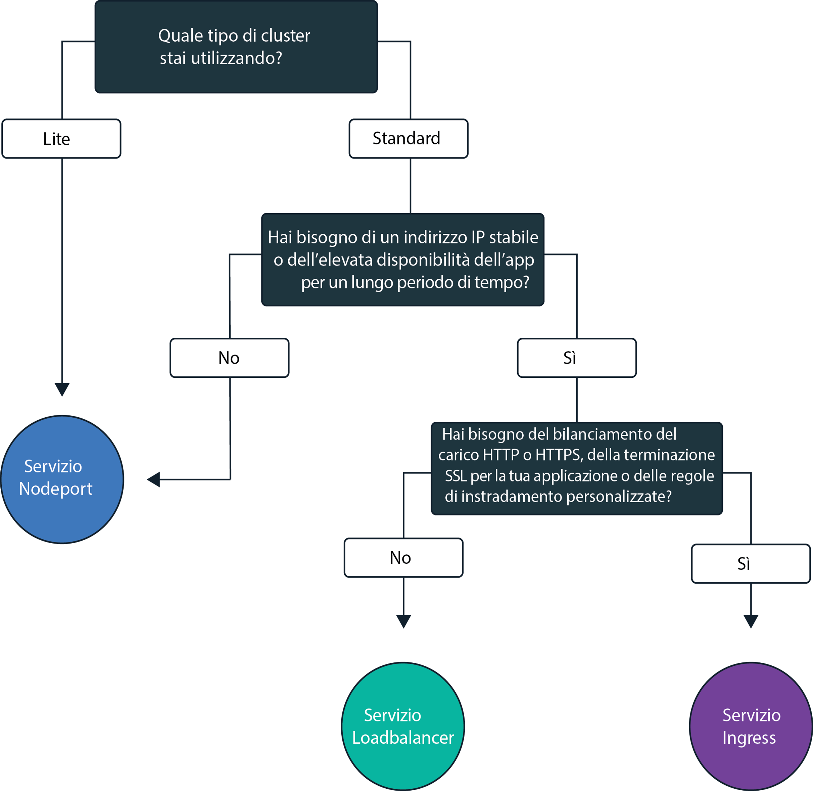
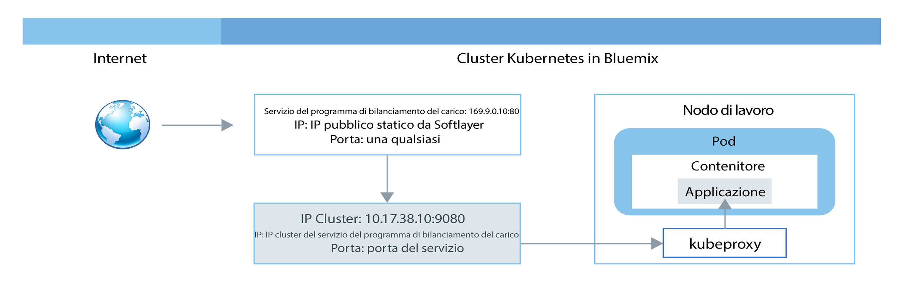
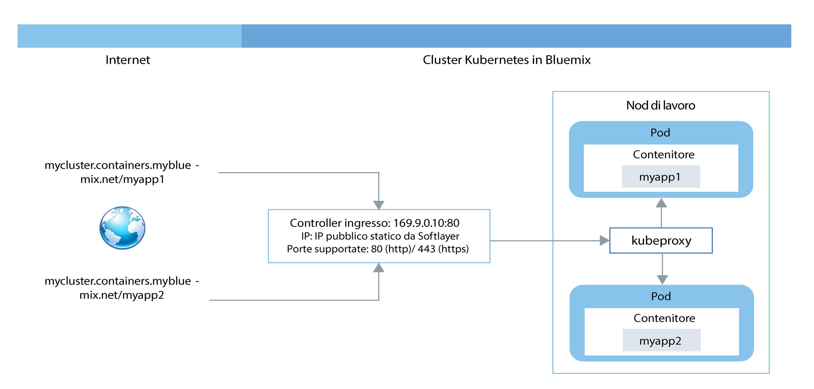

---

copyright:
  years: 2014, 2018
lastupdated: "2018-02-06"

---

{:new_window: target="_blank"}
{:shortdesc: .shortdesc}
{:screen: .screen}
{:pre: .pre}
{:table: .aria-labeledby="caption"}
{:codeblock: .codeblock}
{:tip: .tip}
{:download: .download}

# Pianificazione della rete esterna
{: #planning}

Quando crei un cluster, ogni cluster deve essere collegato a una VLAN pubblica. La VLAN pubblica
determina l'indirizzo IP pubblico assegnato a un nodo di lavoro durante la creazione del cluster.
{:shortdesc}

L'interfaccia di rete pubblica dei nodi di lavoro nei cluster gratuito e standard è protetta dalle politiche di rete Calico. Queste politiche bloccano la maggior parte del traffico in entrata per impostazione predefinita. Tuttavia, è consentito il traffico in entrata necessario al funzionamento di Kubernetes, così come le connessioni ai servizi NodePort, programma di bilanciamento del carico e Ingress. Per ulteriori informazioni su queste politiche, incluso il modo di modificarle, consulta [Politiche di rete](cs_network_policy.html#network_policies).

|Tipo di cluster|Gestore della VLAN pubblica del cluster|
|------------|------------------------------------------|
|Cluster gratuiti in {{site.data.keyword.Bluemix_notm}}|{{site.data.keyword.IBM_notm}}|
|Cluster standard in {{site.data.keyword.Bluemix_notm}}|Tu nel tuo account dell'infrastruttura IBM Cloud (SoftLayer)|
{: caption="Responsabilità di gestione della VLAN" caption-side="top"}

Per informazioni sulla comunicazione della rete in cluster tra i nodi di lavoro e i pod, consulta [Rete in cluster](cs_secure.html#in_cluster_network). Per informazioni sulle applicazioni che si collegano in modo sicuro in un cluster Kubernetes a una rete in loco o alle applicazioni che sono esterne al cluster, consulta [Configurazione della connettività VPN](cs_vpn.html).

## Consentire l'accesso pubblico alle applicazioni
{: #public_access}

Per rendere pubblicamente disponibile un'applicazione su Internet, devi aggiornare il tuo file di configurazione prima di distribuire l'applicazione in un cluster.
{:shortdesc}

*Piano di dati Kubernetes in {{site.data.keyword.containershort_notm}}*

Il diagramma mostra come Kubernetes esegue il traffico di rete dell'utente in {{site.data.keyword.containershort_notm}}. A seconda che il cluster da te creato sia gratuito o standard, esistono diversi modi per rendere la tua applicazione accessibile da Internet. 

<dl>
<dt><a href="#nodeport" target="_blank">Servizio NodePort</a> (cluster gratuito e standard)</dt>
<dd>
 <ul>
  <li>Esponi una porta pubblica su ogni nodo di lavoro e utilizza l'indirizzo IP pubblico di ognuno di questi nodi
per accedere pubblicamente al tuo servizio nel cluster.</li>
  <li>Le iptables sono una funzione kernel di Linux che bilanciano il carico delle richieste tra i pod dell'applicazione, forniscono elevate prestazioni di instradamento di rete e forniscono il controllo dell'accesso alla rete.</li>
  <li>L'indirizzo IP pubblico del nodo di lavoro non è
permanente. Quando un nodo di lavoro viene rimosso
o ricreato, a tale nodo viene assegnato un nuovo indirizzo IP pubblico.</li>
  <li>Il servizio NodePort è migliore per la verifica dell'accesso pubblico. Può anche essere utilizzato se devi soltanto accedere pubblicamente per un breve periodo di tempo.</li>
 </ul>
</dd>
<dt><a href="#loadbalancer" target="_blank">Servizio LoadBalancer</a> (solo cluster standard)</dt>
<dd>
 <ul>
  <li>Ogni cluster standard viene fornito con 4 indirizzi IP pubblici e privati portatili che puoi utilizzare per
creare un programma di bilanciamento del carico TCP/ UDP esterno per la tua applicazione.</li>
  <li>Le iptables sono una funzione kernel di Linux che bilanciano il carico delle richieste tra i pod dell'applicazione, forniscono elevate prestazioni di instradamento di rete e forniscono il controllo dell'accesso alla rete.</li>
  <li>L'indirizzo IP pubblico portatile che viene assegnato al programma di bilanciamento del carico è permanente
e non cambia quando un nodo di lavoro viene ricreato nel cluster.</li>
  <li>Puoi personalizzare il tuo programma di bilanciamento del carico
esponendo una qualsiasi porta richiesta dalla tua applicazione.</li></ul>
</dd>
<dt><a href="#ingress" target="_blank">Ingress</a> (solo cluster
standard)</dt>
<dd>
 <ul>
  <li>Esponi più applicazioni nel tuo cluster creando un programma di bilanciamento del carico HTTP o HTTPS
esterno che utilizza un punto di ingresso pubblico protetto e univoco per instradare le richieste
in entrata alle tue applicazioni.</li>
  <li>Puoi utilizzare una rotta pubblica per esporre più applicazioni nel tuo cluster come servizi. </li>
  <li>Ingress è costituito da due componenti principali: la risorsa Ingress e il programma di bilanciamento del carico dell'applicazione.
   <ul>
    <li>La risorsa Ingress definisce
le regole su come instradare e bilanciare il carico delle richieste in entrata per un'applicazione.</li>
    <li>Il programma di bilanciamento del carico dell'applicazione ascolta le richieste del servizio HTTP o HTTPS e inoltra le richieste tra i pod dell'applicazione in base alle regole definite per ogni risorsa Ingress. </li>
   </ul>
  <li>Utilizza Ingress se vuoi implementare il tuo proprio programma di bilanciamento del carico dell'applicazione con regole di instradamento personalizzate e se hai bisogno della terminazione SSL per le tue applicazioni. </li>
 </ul>
</dd></dl>

Per scegliere la migliore opzione di rete per la tua applicazione, segui questo albero delle decisioni: 

<map name="networking_map" id="networking_map">
<area href="/docs/containers/cs_nodeport.html#config" alt="Servizio Nodeport" shape="circle" coords="52, 283, 45"/>
<area href="/docs/containers/cs_loadbalancer.html#config" alt="Servizio programma di bilanciamento del carico" shape="circle" coords="247, 419, 44"/>
<area href="/docs/containers/cs_ingress.html#config" alt="Servizio Ingress" shape="circle" coords="445, 420, 45"/>
</map>

 

## Esponi un'applicazione a Internet utilizzando un servizio NodePort
{: #nodeport}

Esponi una porta pubblica sul tuo nodo di lavoro e utilizza l'indirizzo IP pubblico del nodo di lavoro per accedere al tuo servizio nel cluster pubblicamente da Internet.
{:shortdesc}

Quando esponi la tua applicazione creando un servizio Kubernetes del tipo NodePort, vengono assegnati al servizio
una NodePort nell'intervallo 30000 - 32767 e un indirizzo
IP del cluster interno. Il servizio
NodePort funge da punto di ingresso per le richieste in entrata per la tua applicazione. La NodePort assegnata è pubblicamente esposta nelle impostazioni kubeproxy di ogni nodo di lavoro nel
cluster. Ogni nodo di lavoro inizia ad ascoltare dalla NodePort assegnata per le richieste in entrata per il
servizio. Per accedere al servizio da internet, puoi utilizzare l'indirizzo IP pubblico di ogni nodo di lavoro
che è stato assegnato durante la creazione del cluster e la NodePort nel formato `<ip_address>:<nodeport>`. In aggiunta all'indirizzo IP pubblico, è disponibile un servizio NodePort nell'indirizzo IP privato di un nodo di lavoro.

Il seguente diagramma mostra come viene diretta la comunicazione da Internet a un'applicazione quando è configurato un servizio NodePort.

Come illustrato nel diagramma, quando una richiesta arriva al servizio NodePort, viene automaticamente inoltrata all'IP del cluster interno del servizio e quindi inoltrata dal componente `kube-proxy` all'indirizzo IP privato del pod in cui viene distribuita l'applicazione. L' IP del cluster
è accessibile soltanto all'interno del cluster. Se hai più repliche della tua applicazione in esecuzione in diversi pod, il componente `kube-proxy` bilancia il carico delle richieste in entrata tra tutte le repliche.

**Nota:** l'indirizzo IP pubblico del nodo di lavoro non è permanente. Quando un nodo di lavoro viene rimosso
o ricreato, a tale nodo viene assegnato un nuovo indirizzo IP pubblico. Puoi utilizzare NodePort per verificare l'accesso pubblico per la tua applicazione
o se l'accesso pubblico è richiesto solo per un breve periodo. Quando hai bisogno di un indirizzo IP pubblico stabile
e di una maggiore disponibilità per il tuo servizio, esponi la tua applicazione utilizzando un [Servizio LoadBalancer](#loadbalancer) o [Ingress](#ingress).

Per istruzioni su come creare un servizio del tipo NodePort con {{site.data.keyword.containershort_notm}}, consulta
[Configurazione dell'accesso pubblico a un'applicazione utilizzando il tipo di servizio NodePort](cs_nodeport.html#config). 

 

## Esponi un'applicazione a Internet utilizzando un servizio LoadBalancer
{: #loadbalancer}

Esponi una porta e utilizza un indirizzo IP pubblico o privato per il programma di bilanciamento del carico per accedere
all'applicazione.
{:shortdesc}

Quando crei un cluster standard, {{site.data.keyword.containershort_notm}} richiede automaticamente cinque indirizzi IP pubblici portatili e cinque privati portatili e li fornisce nel tuo account dell'infrastruttura IBM Cloud (SoftLayer) durante la creazione del cluster. Due degli indirizzi IP portatili, uno pubblico e uno privato, vengono utilizzati per i [programmi di bilanciamento del carico dell'applicazione Ingress](#ingress). Possono essere utilizzati quattro indirizzi IP privati e pubblici portatili per esporre le applicazioni creando un servizio del programma di bilanciamento del carico. 

Quando crei un servizio Kubernetes LoadBalancer in un cluster in una VLAN pubblica, viene creato
un programma di bilanciamento del carico esterno. Uno dei quattro indirizzi IP pubblici disponibili viene assegnato al programma di bilanciamento del carico. Se non è disponibile alcun indirizzo IP pubblico portatile,
è impossibile creare il tuo servizio LoadBalancer. Il servizio
LoadBalancer funge da punto di ingresso per le richieste in entrata per l'applicazione. A differenza dei servizi NodePort, puoi assegnare una qualsiasi porta al tuo programma di bilanciamento del carico
e non è associato a un dato intervallo di porte. L'indirizzo IP pubblico portatile assegnato al tuo servizio
LoadBalancer è permanente e non viene modificato quando un nodo di lavoro viene rimosso
o ricreato. Pertanto, il servizio LoadBalancer è più disponibile del servizio NodePort. Per accedere al servizio LoadBalancer da internet,
utilizza l'indirizzo IP pubblico del tuo programma di bilanciamento del carico e la porta assegnata nel formato `<ip_address>:<port>`.

Il seguente diagramma mostra come LoadBalancer dirige la comunicazione da Internet a un'applicazione:

Come illustrato nel diagramma, quando una richiesta arriva al servizio LoadBalancer, viene automaticamente inoltrata all'indirizzo IP del cluster interno che è stato assegnato al servizio LoadBalancer durante la creazione del servizio. L'indirizzo IP del cluster
è accessibile soltanto all'interno del cluster. Dall'indirizzo IP del cluster,
le richieste in entrata sono ulteriormente inoltrate al componente `kube-proxy` del tuo nodo di lavoro. Viene poi inoltrata all'indirizzo IP privato della cella dove l'applicazione è distribuita. Se hai più repliche della tua applicazione in esecuzione in diversi pod,
il componente `kube-proxy` bilancia il carico delle richieste in entrata tra tutte le repliche.

Se utilizzi un servizio LoadBalancer, è disponibile anche una porta del nodo per ogni indirizzo IP di ogni nodo di lavoro. Per bloccare l'accesso alla porta del nodo mentre stai utilizzando un servizio LoadBalancer, consulta [Blocco del traffico in entrata](cs_network_policy.html#block_ingress).

Le opzioni di indirizzi IP quando crei un servizio LoadBalancer sono le seguenti:

- Se il tuo cluster è su una VLAN pubblica, viene utilizzato un indirizzo IP pubblico portatile.
- Se il tuo cluster è disponibile solo su una VLAN privata, viene quindi utilizzato un indirizzo IP privato portatile.
- Puoi richiedere un indirizzo IP pubblico o privato portatile per un servizio LoadBalancer aggiungendo un'annotazione al file di configurazione: `service.kubernetes.io/ibm-load-balancer-cloud-provider-ip-type: <public_or_private>`.

Per istruzioni su come creare il servizio del programma di bilanciamento del carico con {{site.data.keyword.containershort_notm}}, consulta [Configurazione dell'accesso pubblico a un'applicazione utilizzando il tipo di servizio programma di bilanciamento del carico](cs_loadbalancer.html#config). 

 

## Esponi un'applicazione a Internet con Ingress
{: #ingress}

Ingress ti consente di esporre più servizi nel tuo cluster e di renderli pubblicamente disponibili
utilizzando un unico punto di ingresso pubblico.
{:shortdesc}

Anziché creare un servizio di bilanciamento del carico per ogni applicazione che vuoi esporre al pubblico,
Ingress fornisce una rotta pubblica univoca che ti consente di inoltrare richieste pubbliche ad applicazioni all'interno e
all'esterno del tuo cluster in base ai loro percorsi individuali. Ingress è costituito da due componenti principali. La
risorsa Ingress definisce le regole su come instradare le richieste in entrata per un'applicazione. Tutte le risorse Ingress
devono essere registrate con il programma di bilanciamento del carico dell'applicazione Ingress che è in ascolto delle richieste del servizio HTTP o HTTPS e inoltra le richieste in base alle regole definite per
ogni risorsa Ingress. 

Quando crei un cluster standard, {{site.data.keyword.containershort_notm}} crea automaticamente un programma di bilanciamento del carico dell'applicazione altamente disponibile
per il tuo cluster e gli assegna una rotta pubblica univoca con il formato` <cluster_name>.<region>.containers.mybluemix.net`. La rotta pubblica è collegata a un indirizzo IP pubblico portatile che viene fornito nel tuo account dell'infrastruttura IBM Cloud (SoftLayer) durante la creazione del cluster. Viene inoltre creato automaticamente un programma di bilanciamento del carico dell'applicazione privato, ma non viene abilitato automaticamente.

Il seguente diagramma mostra come Ingress dirige la comunicazione da Internet a un'applicazione:

Per esporre un'applicazione tramite Ingress, devi creare un servizio Kubernetes per la tua applicazione e registrare questo
servizio con il programma di bilanciamento del carico dell'applicazione definendo una risorsa Ingress. La risorsa Ingress specifica
il percorso che vuoi aggiungere alla rotta pubblica per formare un URL univoco per la tua applicazione esposta,
come ad esempio `mycluster.us-south.containers.mybluemix.net/myapp`. Quando immetti questa rotta nel tuo browser web, come illustrato nel diagramma, la richiesta viene inviata all'indirizzo IP pubblico portatile collegato del programma di bilanciamento del carico dell'applicazione. Il programma di bilanciamento del carico dell'applicazione verifica se esiste una regola di instradamento per il percorso `myapp`
nel cluster `mycluster`. Se viene trovata una regola corrispondente, la richiesta che include
il percorso individuale viene inoltrata al pod in cui viene distribuita l'applicazione, considerando le regole
che sono state definite nell'oggetto della risorsa Ingress originale. Per consentire all'applicazione di elaborare le richieste in entrata,
assicurati che la tua applicazione sia in ascolto nel percorso individuale definito nella risorsa Ingress.

Puoi configurare il programma di bilanciamento del carico dell'applicazione per gestire il traffico di rete in entrata per le tue applicazioni per i seguenti scenari: 

-   Utilizzare il dominio fornito da IBM senza la terminazione TLS
-   Utilizzare il dominio fornito da IBM con la terminazione TLS 
-   Utilizzare un dominio personalizzato con la terminazione TLS 
-   Utilizzare il dominio fornito da IBM o un dominio personalizzato con la terminazione TLS per accedere alle applicazioni all'esterno del tuo cluster 
-   Utilizzare un programma di bilanciamento del carico dell'applicazione e un dominio personalizzato senza la terminazione TLS 
-   Utilizzare un programma di bilanciamento del carico dell'applicazione e un dominio personalizzato con la terminazione TLS 
-   Aggiungi funzionalità al tuo programma di bilanciamento del carico dell'applicazione utilizzando le annotazioni 

Per istruzioni su come utilizzare Ingress con {{site.data.keyword.containershort_notm}}, consulta
[Configurazione dell'accesso pubblico a un'applicazione utilizzando Ingress](cs_ingress.html#ingress).

 

