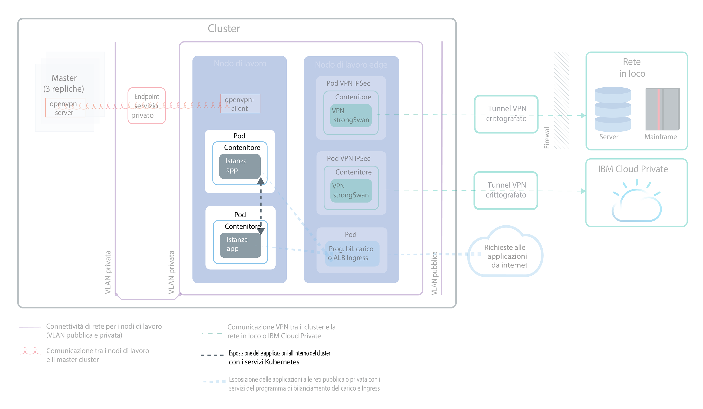
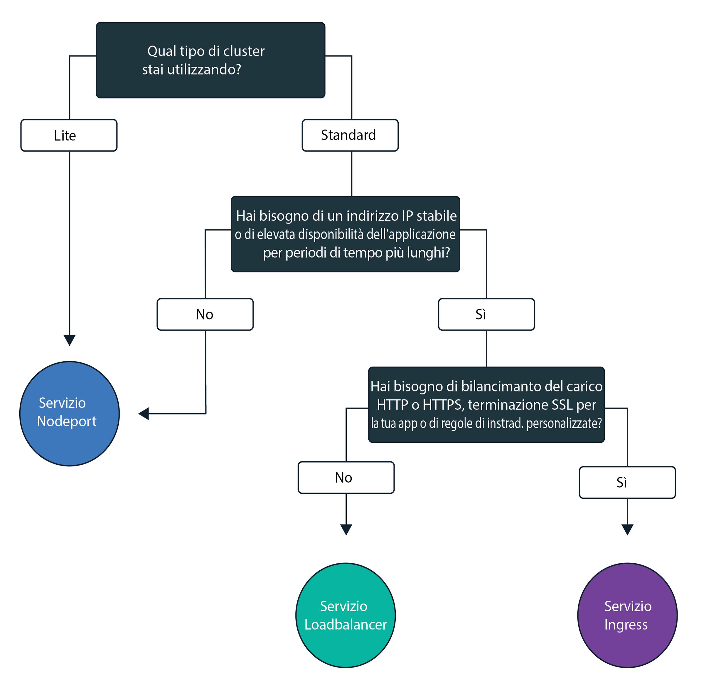
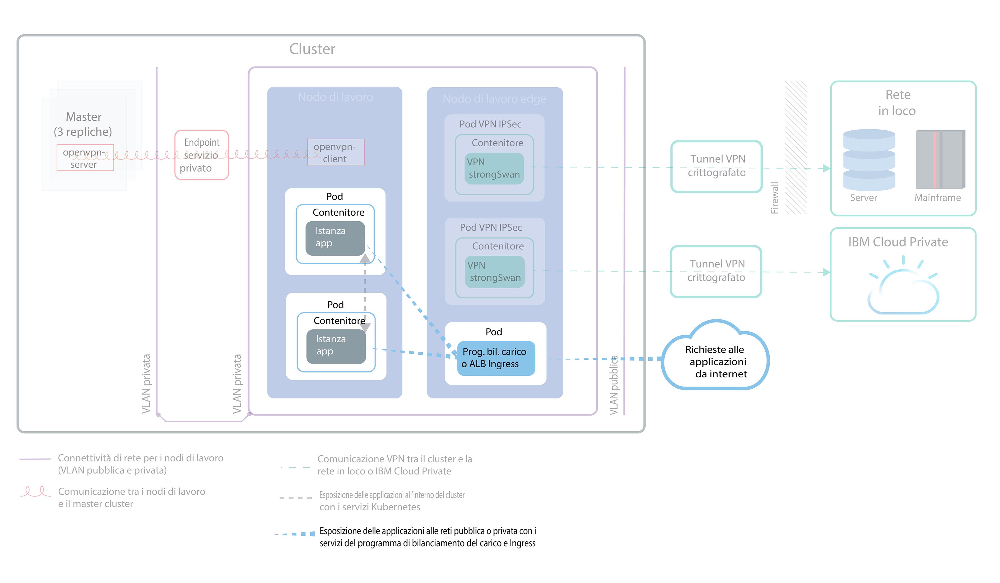
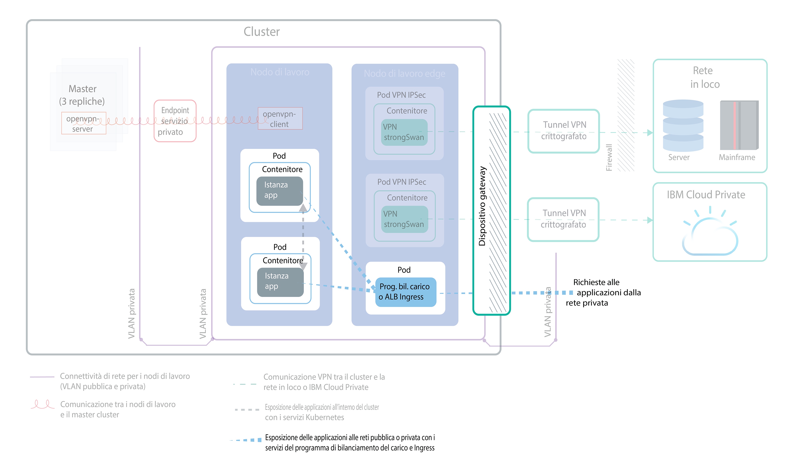

---

copyright:
  years: 2014, 2019
lastupdated: "2019-03-21"

keywords: kubernetes, iks

subcollection: containers

---

{:new_window: target="_blank"}
{:shortdesc: .shortdesc}
{:screen: .screen}
{:pre: .pre}
{:table: .aria-labeledby="caption"}
{:codeblock: .codeblock}
{:tip: .tip}
{:note: .note}
{:important: .important}
{:deprecated: .deprecated}
{:download: .download}

# Pianificazione per esporre le tue applicazioni con reti in cluster e reti esterne
{: #cs_network_planning}

Con {{site.data.keyword.containerlong}}, puoi gestire le reti in cluster ed esterne rendendo le applicazioni accessibili pubblicamente o privatamente.
{: shortdesc}

Questa pagina ti aiuta a pianificare le reti in cluster ed esterne per le tue applicazioni. Per informazioni sulla configurazione della rete per il tuo cluster, vedi [Configurazione della rete del tuo cluster](/docs/containers?topic=containers-cs_network_cluster).
{: tip}

## Esposizione delle applicazioni al traffico all'interno del cluster attraverso i servizi Kubernetes
{: #in-cluster}

Crea servizi di rilevamento Kubernetes per consentire le comunicazioni tra i pod nel tuo cluster.
{: shortdesc}

<figure>
 
 <figcaption>Esposizione delle applicazioni all'interno del cluster con i servizi Kubernetes</figcaption>
</figure>

A tutti i pod che vengono distribuiti in un nodo di lavoro viene assegnato un indirizzo IP privato nell'intervallo 172.30.0.0/16 e vengono instradati solo tra i nodi di lavoro. Per evitare conflitti, non utilizzare questo intervallo di IP sui nodi che comunicano con i tuoi nodi di lavoro. I nodi di lavoro e i pod possono comunicare in modo sicuro sulla rete privata utilizzando indirizzi IP privati. Tuttavia, quando un pod ha un arresto anomalo o un nodo di lavoro deve essere ricreato, viene assegnato un nuovo
indirizzo IP.

Per impostazione predefinita, è difficile tenere traccia degli indirizzi IP privati mutevoli per le applicazioni che devono essere ad alta disponibilità. Puoi invece utilizzare le funzioni di rilevamento integrate del servizio Kubernetes per esporre le applicazioni come servizi IP cluster sulla rete privata. Un servizio Kubernetes raggruppa un insieme di pod e fornisce una connessione di rete a questi pod. Questa connessione fornisce la connettività ad altri servizi nel cluster senza esporre l'effettivo indirizzo IP privato di ciascun pod. Ai servizi viene assegnato un indirizzo IP in cluster accessibile solo all'interno del cluster.
* Cluster più vecchi: nei cluster creati prima del febbraio 2018 nella zona dal13 o prima dell'ottobre 2017 in qualsiasi altra zona, ai servizi viene assegnato un IP tra i 254 IP nell'intervallo 10.10.10.0/24. Se hai raggiunto il limite di 254 e hai bisogno di altri servizi, devi creare un nuovo cluster.
* Cluster più recenti: nei cluster creati dopo il febbraio 2018 nella zona dal13 o dopo l'ottobre 2017 in qualsiasi altra zona, ai servizi viene assegnato un IP tra i 65.000 IP nell'intervallo 172.21.0.0/16.

Per evitare conflitti, non utilizzare questo intervallo di IP sui nodi che comunicano con i tuoi nodi di lavoro. Viene creata anche una voce di ricerca DNS per il servizio e viene memorizzata nel componente `kube-dns` del cluster. La voce DNS contiene il nome del servizio, lo spazio dei nomi in cui è stato creato il servizio e il link all'indirizzo IP in cluster assegnato.

Per accedere a un pod che si trova dietro un servizio cluster, le applicazioni possono usare l'indirizzo IP in cluster del servizio o inviare una richiesta utilizzando il nome del servizio. Quando usi il nome del servizio, il nome viene ricercato nel componente `kube-dns` e instradato all'indirizzo IP in cluster del servizio. Quando viene raggiunto da richieste, il servizio ne esegue l'inoltro ai pod in misura uguale, indipendentemente dagli indirizzi IP in cluster dei pod e dal nodo di lavoro su cui sono distribuiti.

 

## Scelta di un servizio NodePort, LoadBalancer o Ingress per esporre le applicazioni al traffico all'esterno del cluster
{: #external}

Per rendere accessibili esternamente le tue applicazioni da Internet pubblico o da una rete privata, {{site.data.keyword.containerlong_notm}} supporta tre servizi di rete.
{:shortdesc}

**[Servizio NodePort](/docs/containers?topic=containers-nodeport)** (cluster gratuito e standard)
* Esponi una porta su ogni nodo di lavoro e usa l'indirizzo IP pubblico o privato di qualsiasi nodo di lavoro per accedere al tuo servizio nel cluster.
* Iptables è una funzione del kernel Linux che bilancia il carico delle richieste tra i pod dell'applicazione, offre un instradamento di rete ad alte prestazioni e fornisce il controllo dell'accesso alla rete.
* Gli indirizzi IP pubblici e privati del nodo di rete non sono permanenti. Quando un nodo di lavoro viene rimosso o ricreato, vengono assegnati al nodo di lavoro un nuovo indirizzo IP pubblico e uno nuovo privato.
* Il servizio NodePort si rivela migliore per la verifica dell'accesso pubblico o privato. Può anche essere utilizzato se hai bisogno dell'accesso pubblico o privato solo per un breve periodo di tempo.

**[Servizio LoadBalancer](/docs/containers?topic=containers-loadbalancer)** (solo cluster standard)
* Ogni cluster standard viene fornito con quattro indirizzi IP pubblici portatili e quattro indirizzi IP privati portatili che puoi utilizzare per creare un programma di bilanciamento del carico TCP/UDP esterno per la tua applicazione. Puoi personalizzare il tuo programma di bilanciamento del carico
esponendo una qualsiasi porta richiesta dalla tua applicazione.
* Iptables è una funzione del kernel Linux che bilancia il carico delle richieste tra i pod dell'applicazione, offre un instradamento di rete ad alte prestazioni e fornisce il controllo dell'accesso alla rete.
* Gli indirizzi IP pubblici e privati portatili assegnati al programma di bilanciamento del carico sono permanenti e non cambiano quando un nodo di lavoro viene ricreato nel cluster.
* Puoi creare un nome host per la tua applicazione che registra gli indirizzi IP del programma di bilanciamento del carico pubblico con una voce DNS. Puoi anche abilitare monitoraggi di controllo dell'integrità sugli IP del programma di bilanciamento del carico per ciascun nome host.

**[Ingress](/docs/containers?topic=containers-ingress)** (solo cluster
standard)
* Esponi più applicazioni in un cluster creando un ALB (application load balancer) HTTP, HTTPS o TCP esterno. L'ALB usa un punto di ingresso pubblico o privato protetto e univoco, un dominio secondario Ingress, per instradare le richieste in entrata alle tue applicazioni.
* Puoi usare una rotta per esporre più applicazioni nel tuo cluster come servizi.
* Ingress è composto da tre componenti:
  * La risorsa Ingress definisce
le regole su come instradare e bilanciare il carico delle richieste in entrata per un'applicazione.
  * L'ALB ascolta le richieste di servizio HTTP, HTTPS o TCP in entrata. Inoltra le richieste tra i pod delle applicazioni in base alle regole che hai definito nella risorsa Ingress.
  * MZLB gestisce tutte le richieste in entrata nelle tue applicazioni e bilancia il carico delle richieste tra gli ALB nelle varie zone. Inoltre abilita i controlli dell'integrità sull'indirizzo IP ALB in ogni zona.
* Utilizza Ingress se devi implementare il tuo proprio ALB con regole di instradamento personalizzate e hai bisogno della terminazione SSL per le tue applicazioni.

Per scegliere il servizio di rete migliore per la tua applicazione, puoi seguire questa struttura ad albero delle decisioni e fare clic su una delle opzioni per iniziare.

<map name="networking_map" id="networking_map">
<area href="/docs/containers?topic=containers-nodeport" alt="Servizio Nodeport" shape="circle" coords="52, 283, 45"/>
<area href="/docs/containers?topic=containers-loadbalancer" alt="Servizio LoadBalancer" shape="circle" coords="247, 419, 44"/>
<area href="/docs/containers?topic=containers-ingress" alt="Servizio Ingress" shape="circle" coords="445, 420, 45"/>
</map>

Vuoi maggiori dettagli sui modelli di distribuzione del bilanciamento del carico disponibili in {{site.data.keyword.containerlong_notm}}? Consulta questo [post del blog ](https://www.ibm.com/blogs/bluemix/2018/10/ibm-cloud-kubernetes-service-deployment-patterns-for-maximizing-throughput-and-availability/).
{: tip}

 

## Pianificazione della rete esterna pubblica per la configurazione di una VLAN pubblica e privata
{: #public_access}

Quando crei un cluster Kubernetes in {{site.data.keyword.containerlong_notm}}, puoi connettere il cluster a una VLAN pubblica. La VLAN pubblica determina l'indirizzo IP pubblico che viene assegnato a ciascun nodo di lavoro, che fornisce a ciascun nodo di lavoro un'interfaccia di rete pubblica.
{:shortdesc}

<figure>
 
 <figcaption>Esposizione delle applicazioni a una rete pubblica in una configurazione di rete predefinita</figcaption>
</figure>

L'interfaccia di rete pubblica per i nodi di rete è protetta dalle [impostazioni della politica di rete Calico predefinite](/docs/containers?topic=containers-network_policies#default_policy) configurate su ogni nodo di lavoro durante la creazione del cluster.

Per impostazione predefinita, tutto il traffico di rete in uscita è consentito per tutti i nodi di lavoro. Il traffico di rete in entrata è bloccato, fatta eccezione per alcune porte. Queste porte sono aperte in modo che IBM possa monitorare il traffico di rete e installare automaticamente gli aggiornamenti di sicurezza per il master Kubernetes e per poter stabilire le connessioni ai servizi NodePort, LoadBalancer e Ingress. Per ulteriori informazioni su queste politiche, incluso su come modificarle, vedi [Politiche di rete](/docs/containers?topic=containers-network_policies#network_policies).

Per rendere pubblicamente disponibile un'applicazione su Internet, puoi creare un servizio NodePort, LoadBalancer o Ingress. Per confrontare ciascun servizio, vedi [Scelta di un servizio NodePort, LoadBalancer o Ingress](#external).

Il seguente diagramma mostra in che modo Kubernetes inoltra il traffico di rete pubblico in {{site.data.keyword.containerlong_notm}}.

 

## Pianificazione di una rete esterna privata per la configurazione di una VLAN pubblica e privata
{: #private_both_vlans}

Quando i tuoi nodi di lavoro sono connessi sia a una VLAN pubblica che a una VLAN privata, puoi rendere accessibile la tua applicazione solo da una rete privata creando dei servizi NodePort, LoadBalancer o Ingress privati. Puoi quindi creare delle politiche Calico per bloccare il traffico pubblico ai servizi.
{: shortdesc}

L'interfaccia di rete pubblica per i nodi di rete è protetta dalle [impostazioni della politica di rete Calico predefinite](/docs/containers?topic=containers-network_policies#default_policy) configurate su ogni nodo di lavoro durante la creazione del cluster. Per impostazione predefinita, tutto il traffico di rete in uscita è consentito per tutti i nodi di lavoro. Il traffico di rete in entrata è bloccato, fatta eccezione per alcune porte. Queste porte sono aperte in modo che IBM possa monitorare il traffico di rete e installare automaticamente gli aggiornamenti di sicurezza per il master Kubernetes e per poter stabilire le connessioni ai servizi NodePort, LoadBalancer e Ingress.

Se vuoi esporre le tue applicazioni solo su una rete privata, puoi creare dei servizi NodePort, a LoadBalancer o Ingress privati.

**NodePort**
* [Crea un servizio NodePort](/docs/containers?topic=containers-nodeport). In aggiunta all'indirizzo IP pubblico, è disponibile un servizio NodePort nell'indirizzo IP privato di un nodo di lavoro.
* Un servizio NodePort apre una porta su un nodo di lavoro sia sull'indirizzo IP pubblico che in quello privato del nodo di lavoro. Devi usare una [politica di rete preDNAT Calico](/docs/containers?topic=containers-network_policies#block_ingress) per bloccare le NodePorts pubbliche.

**LoadBalancer**
* [Crea un servizio LoadBalancer privato](/docs/containers?topic=containers-loadbalancer).
* Un servizio del programma di bilanciamento del carico con un indirizzo IP privato portatile dispone ancora di una porta del nodo pubblica aperta per i nodi di lavoro. Devi usare una [politica di rete preDNAT Calico](/docs/containers?topic=containers-network_policies#block_ingress) per bloccare le porte del nodo pubblico presenti su esso.

**Ingress**
* Quando crei un cluster, vengono creati automaticamente un ALB Ingress privato e uno pubblico. Poiché l'ALB pubblico viene abilitato e quello privato viene disabilitato per impostazione predefinita, devi [disabilitare l'ALB pubblico](/docs/containers?topic=containers-cs_cli_reference#cs_alb_configure) e [abilitare l'ALB privato](/docs/containers?topic=containers-ingress#private_ingress).
* Quindi, [crea un servizio Ingress privato](/docs/containers?topic=containers-ingress#ingress_expose_private).

Poiché le politiche di rete Calico predefinite consentono il traffico pubblico in entrata a questi servizi, puoi creare politiche Calico per bloccare invece tutto il traffico pubblico verso i servizi. Ad esempio, un servizio NodePort apre una porta su un nodo di lavoro sia sull'indirizzo IP privato che su quello pubblico del nodo di lavoro. Un servizio del programma di bilanciamento del carico con un indirizzo IP privato portatile apre un NodePort pubblico su ogni nodo di lavoro. Devi creare una [politica di rete preDNAT Calico](/docs/containers?topic=containers-network_policies#block_ingress) per bloccare le NodePort pubbliche.

Per fare un esempio, supponiamo che hai creato un servizio di programma di bilanciamento del carico privato. Hai anche creato una politica preDNAT Calico per impedire al traffico pubblico di raggiungere le NodePort pubbliche aperte dal programma di bilanciamento del carico. A questo programma di bilanciamento del carico privato possono accedere:
* Qualsiasi pod in quello stesso cluster
* Qualsiasi pod in qualsiasi cluster nello stesso account {{site.data.keyword.Bluemix_notm}}
* Se hai [abilitato lo spanning della VLAN](/docs/containers?topic=containers-subnets#subnet-routing), qualsiasi sistema connesso a una qualsiasi delle VLAN private nello stesso account {{site.data.keyword.Bluemix_notm}}
* Se non sei nell'account {{site.data.keyword.Bluemix_notm}} ma ancora dietro il firewall aziendale, qualsiasi sistema tramite una connessione VPN alla sottorete su cui si trova l'IP del programma di bilanciamento del carico
* Se sei in un account {{site.data.keyword.Bluemix_notm}} differente, qualsiasi sistema tramite una connessione VPN alla sottorete su cui si trova l'IP del programma di bilanciamento del carico.

 

## Pianificazione di una rete esterna privata per la configurazione di solo una VLAN privata
{: #plan_private_vlan}

Quando i tuoi nodi di lavoro sono connessi solo a una VLAN privata e abiliti le comunicazioni tra il master e i nodi di lavoro tramite [un dispositivo gateway](/docs/containers?topic=containers-cs_network_ov#cs_network_ov_master_gateway), puoi rendere accessibile la tua applicazione solo da una rete privata creando dei servizi NodePort, LoadBalancer o Ingress privati.
{: shortdesc}

<figure>
 
 <figcaption>Esposizione delle applicazioni a una rete privata in una configurazione di rete privata</figcaption>
</figure>

Poiché i tuoi nodi di lavoro non sono connessi a una VLAN pubblica, a questi servizi non viene instradato alcun traffico pubblico. Devi anche [aprire le porte e gli indirizzi IP richiesti](/docs/containers?topic=containers-firewall#firewall_inbound) del tuo firewall del dispositivo gateway per consentire il traffico in entrata verso questi servizi.

**NodePort**:
* [Crea un servizio NodePort privato](/docs/containers?topic=containers-nodeport). Il servizio è disponibile su un indirizzo IP privato di un nodo di lavoro.
* Nel tuo firewall privato, apri la porta che hai configurato quando hai distribuito il servizio agli indirizzi IP privati per tutti i nodi di lavoro verso cui consentire il traffico. Per trovare la porta, esegui `kubectl get svc`. La porta è compresa nell'intervallo 20000-32000.

**LoadBalancer**
* [Crea un servizio LoadBalancer privato](/docs/containers?topic=containers-loadbalancer). Se il tuo cluster è disponibile solo su una VLAN privata, viene utilizzato uno dei quattro indirizzi IP privati portatili disponibili.
* Nel tuo firewall privato, apri la porta che hai configurato quando hai distribuito il servizio all'indirizzo IP privato del servizio del programma di bilanciamento del carico.

**Ingress**:
* Devi configurare un [servizio DNS che sia disponibile sulla rete privata ](https://kubernetes.io/docs/tasks/administer-cluster/dns-custom-nameservers/).
* Quando crei un cluster, viene creato automaticamente un ALB Ingress privato ma non viene abilitato per impostazione predefinita. Devi [abilitare l'ALB privato](/docs/containers?topic=containers-ingress#private_ingress).
* Quindi, [crea un servizio Ingress privato](/docs/containers?topic=containers-ingress#ingress_expose_private).
* Nel tuo firewall privato, apri la porta 80 per HTTP o la porta 443 per HTTPS per l'indirizzo IP relativo all'ALB privato.

Se il tuo cluster è connesso solo a una VLAN privata e abiliti le comunicazioni tra il master e i nodi di lavoro tramite un endpoint del servizio solo privato, non puoi esporre le tue applicazioni a una rete privata. Devi configurare un dispositivo gateway, ad esempio [VRA](/docs/infrastructure/virtual-router-appliance?topic=virtual-router-appliance-about-the-vra) o [FSA](/docs/services/vmwaresolutions/services?topic=vmware-solutions-fsa_considerations) in modo che funga da firewall e blocchi il traffico non desiderato. Se non vuoi configurare un dispositivo gateway, puoi [creare un pool di nodi di lavoro](/docs/containers?topic=containers-clusters#add_pool) che sia connesso a VLAN pubbliche e private. Quindi, puoi etichettare questi nodi di lavoro come nodi edge e utilizzare le politiche Calico per bloccare tutto il traffico pubblico non desiderato. Per ulteriori informazioni, vedi [Isola i carichi di lavoro di rete nei nodi di lavoro edge](/docs/containers?topic=containers-cs_network_planning#both_vlans_private_edge).
{: note}

 

## Facoltativo: isolamento dei carichi di lavoro di rete nei nodi di lavoro edge
{: #both_vlans_private_edge}

I nodi di lavoro edge possono migliorare la sicurezza del tuo cluster consentendo a un minor numero di nodi di lavoro di essere accessibili esternamente e isolando il carico di lavoro della rete. Per assicurarti che i pod Ingress e del programma di bilanciamento del carico vengano distribuiti solo ai nodi di lavoro specificati, [etichetta i nodi di lavoro come nodi edge](/docs/containers?topic=containers-edge#edge_nodes). Per impedire anche l'esecuzione di altri carichi di lavoro sui nodi edge, [danneggia i nodi edge](/docs/containers?topic=containers-edge#edge_workloads).
{: shortdesc}

Se il tuo cluster è connesso a una VLAN pubblica ma vuoi bloccare il traffico verso le NodePort pubbliche sui nodi di lavoro edge, puoi anche utilizzare una [politica di rete preDNAT Calico](/docs/containers?topic=containers-network_policies#block_ingress). Il blocco delle porte del nodo assicura che i nodi di lavoro edge siano gli unici nodi di lavoro a gestire il traffico in entrata.

## Facoltativo: isolamento del tuo cluster sulla rete privata
{: #isolate}

Se hai un cluster multizona, più VLAN per un cluster a zona singola o più sottoreti sulla stessa VLAN, devi [abilitare lo spanning della VLAN](/docs/infrastructure/vlans?topic=vlans-vlan-spanning#vlan-spanning) o [VRF](/docs/infrastructure/direct-link?topic=direct-link-overview-of-virtual-routing-and-forwarding-vrf-on-ibm-cloud#customer-vrf-overview) in modo che i tuoi nodi di lavoro possano comunicare tra loro sulla rete privata. Tuttavia, quando è abilitato lo spanning della VLAN o VRF, qualsiasi sistema connesso a una qualsiasi delle VLAN private nello stesso account IBM Cloud può accedere ai tuoi nodi di lavoro. Puoi isolare il tuo cluster multizona da altri sistemi sulla rete privata utilizzando le [politiche di rete Calico](/docs/containers?topic=containers-network_policies#isolate_workers). Queste politiche consentono anche in traffico in entrata (ingress) e in uscita (egress) per gli intervalli IP privati e le porte che hai aperto nel tuo firewall privato.
{: shortdesc}
