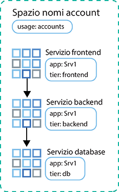
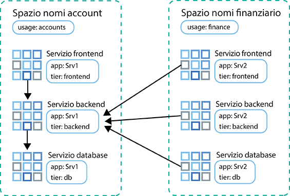

---

copyright:
  years: 2014, 2019
lastupdated: "2019-06-11"

keywords: kubernetes, iks

subcollection: containers

---

{:new_window: target="_blank"}
{:shortdesc: .shortdesc}
{:screen: .screen}
{:pre: .pre}
{:table: .aria-labeledby="caption"}
{:codeblock: .codeblock}
{:tip: .tip}
{:note: .note}
{:important: .important}
{:deprecated: .deprecated}
{:download: .download}
{:preview: .preview}


# Controllo del traffico con le politiche di rete
{: #network_policies}

Ogni cluster Kubernetes è configurato con un plugin di rete chiamato Calico. Le politiche di rete predefinite vengono configurate per proteggere l'interfaccia di rete pubblica di ogni nodo di lavoro in {{site.data.keyword.containerlong}}.
{: shortdesc}

Se hai dei requisiti di sicurezza univoci o hai un cluster multizona con lo spanning della VLAN abilitato, puoi utilizzare Calico e Kubernetes per creare le politiche di rete di un cluster. Con le politiche di rete Kubernetes, specifica il traffico di rete che vuoi consentire o bloccare da e verso un pod in un cluster. Per impostare politiche di rete più avanzate come il blocco del traffico in entrata (ingress) ai servizi NLB (network load balancer), utilizza le politiche di rete Calico.

<ul>
  <li>
  [Kubernetes network policies ](https://kubernetes.io/docs/concepts/services-networking/network-policies/): queste politiche specificano i pod che possono comunicare con altri pod e con gli endpoint esterni. A partire da Kubernetes versione 1.8, sia il traffico di rete in entrata che in uscita può essere consentito o bloccato in base al protocollo, la porta o gli indirizzi IP di origine e destinazione. Il traffico può inoltre essere filtrato in base alle etichette dello spazio dei nomi e del pod. Le politiche di rete Kubernetes vengono applicate utilizzando i comandi `kubectl` o le API Kubernetes. Quando queste politiche vengono applicate, vengono automaticamente convertite in politiche Calico e quindi Calico applica tali politiche.
  </li>
  <li>
  [Politiche di rete Calico ](https://docs.projectcalico.org/v3.3/getting-started/bare-metal/policy/): queste politiche sono un soprainsieme delle politiche di rete Kubernetes e vengono applicate utilizzando i comandi `calicoctl`. Le politiche Calico aggiungono le seguenti funzioni.
    <ul>
    <li>Consentire o bloccare il traffico di rete su interfacce di rete specifiche indipendentemente dall'indirizzo IP di destinazione o dall'origine del pod Kubernetes o dal CIDR</li>
    <li>Consentire o bloccare il traffico di rete per i pod tra gli spazi dei nomi.</li>
    <li>[Bloccare il traffico in entrata (ingress) ai servizi LoadBalancer o NodePort di Kubernetes](#block_ingress).</li>
    </ul>
  </li>
  </ul>

Calico applica queste politiche, incluse tutte le politiche di rete Kubernetes convertite automaticamente in politiche Calico, configurando le regole Iptables di Linux sui nodi di lavoro Kubernetes. Le regole iptables fungono da firewall
per il nodo di lavoro per definire le caratteristiche che il traffico di rete deve soddisfare per essere inoltrato
alla risorsa di destinazione.

Per utilizzare i servizi NLB (network load balancer) e ALB (application load balancer) Ingress, utilizza le politiche Calico e Kubernetes per gestire il traffico di rete in entrata e in uscita del tuo cluster. Non utilizzare i [gruppi di sicurezza](/docs/infrastructure/security-groups?topic=security-groups-about-ibm-security-groups#about-ibm-security-groups) dell'infrastruttura IBM Cloud (SoftLayer). I gruppi di sicurezza dell'infrastruttura IBM Cloud (SoftLayer) vengono applicati all'interfaccia di rete di un singolo server virtuale per filtrare il traffico a livello dell'hypervisor. Tuttavia, i gruppi di sicurezza non supportano il protocollo VRRP, che viene utilizzato da {{site.data.keyword.containerlong_notm}} per gestire gli indirizzi IP ALB e NLB. Se il protocollo VRRP non è presente per gestire l'IP, i servizi ALB e NLB non funzionano correttamente.
{: tip}

<br />


## Politiche di rete Kubernetes e Calico predefinite
{: #default_policy}

Quando si crea un cluster con una VLAN pubblica, viene creata automaticamente una risorsa `HostEndpoint` con l'etichetta `ibm.role: worker_public` per ogni nodo di lavoro e la relativa interfaccia di rete pubblica. Per proteggere l'interfaccia di rete pubblica di un nodo di lavoro, vengono applicate le politiche Calico predefinite per ogni endpoint host con l'etichetta `ibm.role: worker_public`.
{:shortdesc}

Queste politiche host Calico predefinite consentono tutto il traffico di rete in uscita e il traffico in entrata a componenti cluster specifici, come i servizi Kubernetes NodePort, LoadBalancer e Ingress. Tutto il rimanente traffico di rete in entrata da Internet ai tuoi nodi di lavoro che non è specificato nelle politiche predefinite viene bloccato. Le politiche predefinite non influiscono sul traffico tra i pod

Controlla le seguenti politiche host Calico predefinite che vengono automaticamente applicate al tuo cluster.

Non rimuovere le politiche applicate a un endpoint host a meno che tu non abbia compreso pienamente la politica. Assicurati di non aver bisogno del traffico che viene consentito dalla politica.
{: important}

 <table summary="La prima riga nella tabella si estende su entrambe le colonne. Leggi il resto delle righe da sinistra a destra, con la zona server nella colonna uno e gli indirizzi IP corrispondenti nella colonna due.">
 <caption>Politiche host Calico predefinite per ogni cluster</caption>
  <thead>
  <th colspan=2> Politiche host Calico predefinite per ogni cluster</th>
  </thead>
  <tbody>
    <tr>
      <td><code>allow-all-outbound</code></td>
      <td>Consente tutto il traffico in uscita.</td>
    </tr>
    <tr>
      <td><code>allow-bigfix-port</code></td>
      <td>Consente il traffico in entrata sulla porta 52311 nell'applicazione BigFix per consentire gli aggiornamenti necessari del nodo di lavoro.</td>
    </tr>
    <tr>
      <td><code>allow-icmp</code></td>
      <td>Consente i pacchetti ICMP in entrata (ping).</td>
     </tr>
    <tr>
      <td><code>allow-node-port-dnat</code></td>
      <td>Consente il traffico in entrata dei servizi NLB (network load balancer), ALB (application load balancer) Ingress e NodePort ai pod esposti da questi servizi. <strong>Nota</strong>: non hai bisogno di specificare le porte esposte perché Kubernetes utilizza la conversione dell'indirizzo di rete di destinazione (DNAT) per inoltrare le richieste di servizio ai pod corretti. L'inoltro avviene prima che le politiche dell'endpoint host vengano applicate in Iptables.</td>
   </tr>
   <tr>
      <td><code>allow-sys-mgmt</code></td>
      <td>Consente le connessioni in entrata per specifici sistemi dell'infrastruttura IBM Cloud (SoftLayer) utilizzati per gestire i nodi di lavoro.</td>
   </tr>
   <tr>
    <td><code>allow-vrrp</code></td>
    <td>Consente i pacchetti VRRP, utilizzati per monitorare e spostare gli indirizzi IP virtuali tra i nodi di lavoro.</td>
   </tr>
  </tbody>
</table>

Viene creata anche una politica Kubernetes predefinita che limita l'accesso al dashboard Kubernetes, Le politiche Kubernetes non vengono applicate all'endpoint host, ma invece al pod `kube-dashboard`. Questa politica si applica ai cluster collegati solo a una VLAN privata e ai cluster collegati a una VLAN privata e pubblica.

<table>
<caption>Politiche Kubernetes predefinite per ogni cluster</caption>
<thead>
<th colspan=2> Politiche Kubernetes predefinite per ogni cluster</th>
</thead>
<tbody>
 <tr>
  <td><code>kubernetes-dashboard</code></td>
  <td>Fornito nello spazio dei nomi <code>kube-system</code>: blocca a tutti i pod l'accesso al dashboard Kubernetes. Questa politica non influenza l'accesso al dashboard dalla console {{site.data.keyword.Bluemix_notm}} o tramite <code>kubectl proxy</code>. Se un pod necessita dell'accesso al dashboard, distribuiscilo in uno spazio dei nomi che ha un'etichetta <code>kubernetes-dashboard-policy: allow</code>.</td>
 </tr>
</tbody>
</table>

<br />


## Installazione e configurazione della CLI Calico
{: #cli_install}

Per visualizzare, gestire e aggiungere le politiche Calico, installare e configurare la CLI Calico.
{:shortdesc}

1. [Accedi al tuo account. Se applicabile, specifica il gruppo di risorse appropriato. Imposta il contesto per il tuo cluster.](/docs/containers?topic=containers-cs_cli_install#cs_cli_configure) Includi le opzioni `--admin` e `--network` con il comando `ibmcloud ks cluster-config`. `--admin` scarica le chiavi per accedere al tuo portfolio dell'infrastruttura ed eseguire i comandi Calico sui tuoi nodi di lavoro. `--network` scarica il file di configurazione Calico per eseguire tutti i comandi di Calico.

  ```
  ibmcloud ks cluster-config --cluster <cluster_name_or_ID> --admin --network
  ```
  {: pre}

3. Per gli utenti di OS X e Linux, completa la seguente procedura.
    1. Crea la directory `/etc/calico`.
        ```
        sudo mkdir /etc/calico
        ```
        {: pre}

    2. Sposta nella directory il file di configurazione Calico che hai scaricato precedentemente.
        ```
        sudo mv /Users/<user>/.bluemix/plugins/container-service/clusters/<cluster_name>-admin/calicoctl.cfg /etc/calico
        ```
        {: pre}

4. [Scarica la CLI Calico ](https://github.com/projectcalico/calicoctl/releases).

    Se stai utilizzando OS X, scarica la versione `-darwin-amd64`. Se stai utilizzando Windows, installa la CLI Calico nella stessa directory in cui si trova la CLI {{site.data.keyword.Bluemix_notm}}. Questa configurazione ti consente di ridurre le modifiche al percorso file quando esegui i comandi in un secondo momento. Assicurati di salvare il file come `calicoctl.exe`.
    {: tip}

5. Per gli utenti di OS X e Linux, completa la seguente procedura.
    1. Sposta il file eseguibile nella directory _/usr/local/bin_.
        - Linux:

          ```
          mv filepath/calicoctl /usr/local/bin/calicoctl
          ```
          {: pre}

        - OS
X:

          ```
          mv filepath/calicoctl-darwin-amd64 /usr/local/bin/calicoctl
          ```
          {: pre}

    2. Rendi il file eseguibile.

        ```
        chmod +x /usr/local/bin/calicoctl
        ```
        {: pre}

6. Se le politiche di rete aziendali utilizzano proxy o firewall che impediscono l'accesso dal tuo sistema locale agli endpoint pubblici, [consenti l'accesso TCP dei comandi Calico](/docs/containers?topic=containers-firewall#firewall).

7. Verifica che la configurazione di Calico funzioni correttamente.

    - Linux e OS X:

      ```
      calicoctl get nodes
      ```
      {: pre}

    - Windows: utilizza l'indicatore `--config` per puntare al file di configurazione di rete che hai ottenuto nel passo 1. Includi questo indicatore ogni volta che esegui un comando `calicoctl`.

      ```
      calicoctl get nodes --config=filepath/calicoctl.cfg
      ```
      {: pre}

      Output:

      ```
      NAME
              kube-dal10-crc21191ee3997497ca90c8173bbdaf560-w1.cloud.ibm
              kube-dal10-crc21191ee3997497ca90c8173bbdaf560-w2.cloud.ibm
              kube-dal10-crc21191ee3997497ca90c8173bbdaf560-w3.cloud.ibm
      ```
      {: screen}

<br />


## Visualizzazione delle politiche di rete
{: #view_policies}

Visualizza i dettagli per impostazione predefinita e tutte le politiche di rete aggiunte che vengono applicate al tuo cluster.
{:shortdesc}

Prima di iniziare:
1. [Installa e configura la CLI Calico.](#cli_install)
2. [Accedi al tuo account. Se applicabile, specifica il gruppo di risorse appropriato. Imposta il contesto per il tuo cluster.](/docs/containers?topic=containers-cs_cli_install#cs_cli_configure) Includi le opzioni `--admin` e `--network` con il comando `ibmcloud ks cluster-config`. `--admin` scarica le chiavi per accedere al tuo portfolio dell'infrastruttura ed eseguire i comandi Calico sui tuoi nodi di lavoro. `--network` scarica il file di configurazione Calico per eseguire tutti i comandi di Calico.

  ```
  ibmcloud ks cluster-config --cluster <cluster_name_or_ID> --admin --network
  ```
  {: pre}

**Per visualizzare le politiche di rete nei cluster**:

Gli utenti Linux e Mac non hanno bisogno di includere l'indicatore `--config=filepath/calicoctl.cfg` nei comandi `calicoctl`.
{: tip}

1. Visualizza l'endpoint host Calico.

    ```
    calicoctl get hostendpoint -o yaml --config=filepath/calicoctl.cfg
    ```
    {: pre}

2. Visualizza tutte le politiche di rete di Calico e Kubernetes che sono state create per il cluster. Questo elenco contiene politiche che potrebbero non essere ancora applicate a tutti i pod o gli host. Affinché una politica di rete venga applicata, deve essere trovata una risorsa Kubernetes che corrisponda al selettore definito nella politica di rete Calico.

    [Le politiche di rete ](https://docs.projectcalico.org/v3.3/reference/calicoctl/resources/networkpolicy) sono dedicate a spazi dei nomi specifici:
    ```
    calicoctl get NetworkPolicy --all-namespaces -o wide --config=filepath/calicoctl.cfg
    ```
    {:pre}

    [Le politiche di rete globali ](https://docs.projectcalico.org/v3.3/reference/calicoctl/resources/globalnetworkpolicy) non sono dedicate a spazi dei nomi specifici:
    ```
    calicoctl get GlobalNetworkPolicy -o wide --config=filepath/calicoctl.cfg
    ```
    {: pre}

3. Visualizza i dettagli per una politica di rete.

    ```
    calicoctl get NetworkPolicy -o yaml <policy_name> --namespace <policy_namespace> --config=filepath/calicoctl.cfg
    ```
    {: pre}

4. Visualizza i dettagli di tutte le politiche di rete globali per il cluster.

    ```
    calicoctl get GlobalNetworkPolicy -o yaml --config=filepath/calicoctl.cfg
    ```
    {: pre}

<br />


## Aggiunta di politiche di rete
{: #adding_network_policies}

Nella maggior parte dei casi, le politiche predefinite non devono essere modificate. Solo in scenari avanzati
potrebbero essere richieste delle modifiche. Se ritieni di dover apportare modifiche, puoi creare le tue politiche di rete.
{:shortdesc}

Per creare le politiche di rete Kubernetes, vedi la [documentazione della politica di rete Kubernetes ](https://kubernetes.io/docs/concepts/services-networking/network-policies/).

Per creare le politiche Calico, utilizza la seguente procedura.

1. [Installa e configura la CLI Calico.](#cli_install)
2. [Accedi al tuo account. Se applicabile, specifica il gruppo di risorse appropriato. Imposta il contesto per il tuo cluster.](/docs/containers?topic=containers-cs_cli_install#cs_cli_configure) Includi le opzioni `--admin` e `--network` con il comando `ibmcloud ks cluster-config`. `--admin` scarica le chiavi per accedere al tuo portfolio dell'infrastruttura ed eseguire i comandi Calico sui tuoi nodi di lavoro. `--network` scarica il file di configurazione Calico per eseguire tutti i comandi di Calico.

  ```
  ibmcloud ks cluster-config --cluster <cluster_name_or_ID> --admin --network
  ```
  {: pre}

3. Definisci la tua [politica di rete Calico ](https://docs.projectcalico.org/v3.3/reference/calicoctl/resources/networkpolicy) o [politica di rete globale Calico ](https://docs.projectcalico.org/v3.3/reference/calicoctl/resources/globalnetworkpolicy) creando uno script di configurazione (`.yaml`) con la sintassi delle politiche di Calico v3. Questi file di configurazione includono i selettori che descrivono a quali pod, spazi dei nomi o host vengono applicate queste politiche. Fai riferimento a queste [politiche Calico di esempio ](http://docs.projectcalico.org/v3.3/getting-started/kubernetes/tutorials/advanced-policy) per informazioni su come creare le tue proprie politiche.

4. Applica le politiche al cluster.
    - Linux e OS X:

      ```
      calicoctl apply -f policy.yaml
      ```
      {: pre}

    - Windows:

      ```
      calicoctl apply -f filepath/policy.yaml --config=filepath/calicoctl.cfg
      ```
      {: pre}

<br />


## Controllo del traffico in entrata ai servizi NLB o NodePort
{: #block_ingress}

[Per impostazione predefinita](#default_policy), i servizi Kubernetes NodePort e LoadBalancer sono progettati per rendere le tue applicazioni disponibili su tutte le interfacce del cluster private e pubbliche. Tuttavia, puoi usare le politiche di Calico per bloccare il traffico in entrata ai tuoi servizi in base all'origine o alla destinazione del traffico.
{:shortdesc}

Le politiche predefinite di Kubernetes e Calico sono difficili da applicare per la protezione dei servizi Kubernetes NodePort e LoadBalancer a causa delle regole Iptables DNAT generate per questi servizi. Tuttavia, le politiche pre-DNAT impediscono al traffico specificato di raggiungere le tue applicazioni perché generano e applicano le regole Iptables prima che Kubernetes utilizzi la DNAT regolare per inoltrare il traffico ai pod.

Alcuni utilizzi comuni per le politiche di rete pre-DNAT di Calico:

  - Blocca il traffico alle porte del nodo pubblico di un servizio NLB (network load balancer) privato. Un servizio NLB rende la tua applicazione disponibile sulla porta e l'indirizzo IP dell'NLB e la rende disponibile sulle porte del nodo del servizio. È possibile accedere alle porte del nodo da ogni indirizzo IP (pubblico e privato) di ogni nodo all'interno del cluster.
  - Blocca il traffico verso le porte del nodo pubblico sui cluster che eseguono i [nodi di lavoro edge](/docs/containers?topic=containers-edge#edge): il blocco delle porte del nodo assicura che i nodi di lavoro edge siano gli unici nodi di lavoro a gestire il traffico in entrata.
  - Blocca il traffico da determinati indirizzi IP di origine o CIDR (inserimento in blacklist)
  - Consenti il traffico solo da determinati indirizzi IP di origine o CIDR (inserimento in whitelist) e blocca tutto il resto del traffico

Per vedere come inserire in whitelist o in blacklist gli indirizzi IP di origine, prova l'[esercitazione Utilizzo delle politiche di rete Calico per bloccare il traffico](/docs/containers?topic=containers-policy_tutorial#policy_tutorial). Per ulteriori politiche di rete Calico di esempio che controllano il traffico verso o dal tuo cluster, puoi controllare la [demo della politica stars ](https://docs.projectcalico.org/v3.3/getting-started/kubernetes/tutorials/stars-policy/) e la [politica di rete avanzata ](https://docs.projectcalico.org/v3.3/getting-started/kubernetes/tutorials/advanced-policy).
{: tip}

Prima di iniziare:
1. [Installa e configura la CLI Calico.](#cli_install)
2. [Accedi al tuo account. Se applicabile, specifica il gruppo di risorse appropriato. Imposta il contesto per il tuo cluster.](/docs/containers?topic=containers-cs_cli_install#cs_cli_configure) Includi le opzioni `--admin` e `--network` con il comando `ibmcloud ks cluster-config`. `--admin` scarica le chiavi per accedere al tuo portfolio dell'infrastruttura ed eseguire i comandi Calico sui tuoi nodi di lavoro. `--network` scarica il file di configurazione Calico per eseguire tutti i comandi di Calico.

  ```
  ibmcloud ks cluster-config --cluster <cluster_name_or_ID> --admin --network
  ```
  {: pre}

Per creare una politica pre-DNAT:

1. Definisci una politica di rete pre-DNAT Calico per l'accesso in entrata (inbound traffic) ai servizi Kubernetes.
    * Utilizza [la sintassi delle politiche Calico v3 ](https://docs.projectcalico.org/v3.3/reference/calicoctl/resources/networkpolicy).
    * Se gestisci il traffico a un [NLB 2.0](/docs/containers?topic=containers-loadbalancer#planning_ipvs), devi includere i campi `applyOnForward: true` e `doNotTrack: true` nella sezione `spec` della politica.

        Risorsa di esempio che blocca tutte le porte del nodo:

        ```
        apiVersion: projectcalico.org/v3
        kind: GlobalNetworkPolicy
        metadata:
          name: deny-nodeports
        spec:
          applyOnForward: true
          preDNAT: true
          ingress:
          - action: Deny
            destination:
              ports:
              - 30000:32767
            protocol: TCP
            source: {}
          - action: Deny
            destination:
              ports:
              - 30000:32767
        protocol: UDP
        source: {}
      selector: ibm.role=='worker_public'
      order: 1100
      types:
          - Ingress
        ```
        {: codeblock}

        Risorsa di esempio che inserisce in whitelist il traffico solo da un CIDR di origine specificato a un NLB 2.0:

        ```
        apiVersion: projectcalico.org/v3
    kind: GlobalNetworkPolicy
    metadata:
      name: whitelist
    spec:
      applyOnForward: true
      doNotTrack: true
      ingress:
          - action: Allow
        destination:
          nets:
              - <loadbalancer_IP>/32
          ports:
              - 80
        protocol: TCP
        source:
          nets:
              - <client_address>/32
      selector: ibm.role=='worker_public'
      order: 500
      types:
          - Ingress
        ```
        {: codeblock}

        Risorsa di esempio che inserisce in whitelist il traffico solo da un CIDR di origine specificato a un NLB 1.0:

        ```
        apiVersion: projectcalico.org/v3
        kind: GlobalNetworkPolicy
        metadata:
          name: whitelist
        spec:
          applyOnForward: true
          preDNAT: true
          ingress:
          - action: Allow
        destination:
          nets:
              - <loadbalancer_IP>/32
          ports:
              - 80
        protocol: TCP
        source:
          nets:
              - <client_address>/32
      selector: ibm.role=='worker_public'
      order: 500
      types:
          - Ingress
        ```
        {: codeblock}

2. Applica la politica di rete preDNAT Calico. Serve circa 1 minuto
perché le modifiche alla politica vengano applicate nel cluster.

  - Linux e OS X:

    ```
    calicoctl apply -f deny-nodeports.yaml
    ```
    {: pre}

  - Windows:

    ```
    calicoctl apply -f filepath/deny-nodeports.yaml --config=filepath/calicoctl.cfg
    ```
    {: pre}

3. Facoltativo: nei cluster multizona, un MZLB (multizone load balancer) controlla l'integrità degli ALB (application load balancer) Ingress in ciascuna zona del tuo cluster e mantiene aggiornati i risultati della ricerca DNS in base a questi controlli di integrità. Se usi politiche pre-DNAT per bloccare tutto il traffico in entrata ai servizi Ingress, devi anche inserire in whitelist gli [IP IPv4 di Cloudflare ](https://www.cloudflare.com/ips/) usati per controllare l'integrità dei tuoi ALB. Per la procedura su come creare una politica Calico pre-DNAT per inserire in whitelist questi IP, vedi la Lezione 3 dell'[esercitazione della politica di rete Calico](/docs/containers?topic=containers-policy_tutorial#lesson3).

## Isolamento dei cluster sulla rete privata
{: #isolate_workers}

Se hai un cluster multizona, più VLAN per un cluster a zona singola o più sottoreti sulla stessa VLAN, devi abilitare lo spanning della VLAN o VRF in modo che i tuoi nodi di lavoro possano comunicare tra loro sulla rete privata. Tuttavia, quando lo spanning della VLAN o VRF sono abilitati, qualsiasi sistema connesso a qualsiasi VLAN privata nello stesso account {{site.data.keyword.Bluemix_notm}} può comunicare con i nodi di lavoro.
{: shortdesc}

Puoi isolare il tuo cluster da altri sistemi sulla rete privata applicando delle [politiche di rete privata Calico](https://github.com/IBM-Cloud/kube-samples/tree/master/calico-policies/private-network-isolation). Questa serie di politiche Calico ed endpoint host isola il traffico di rete privata di un cluster dalle altre risorse nella rete privata dell'account.

Le politiche sono mirate all'interfaccia privata del nodo di lavoro (eth0) e alla rete di pod di un cluster.

**Nodi di lavoro**

* L'uscita (egress) dell'interfaccia privata è consentita solo agli IP dei pod, ai nodi di lavoro in questo cluster e alla porta UPD/TCP 53 per l'accesso DNS, alla porta 2049 per le comunicazioni con i file server NFS e alle porte 443 e 3260 per le comunicazioni con l'archiviazione blocchi.
* L'entrata (ingress) dell'interfaccia privata è consentita solo dai nodi di lavoro nel cluster e solo a DNS, kubelet, ICMP e VRRP.

**Pod**

* Tutta l'entrata (ingress) ai pod è consentita dai nodi di lavoro nel cluster.
* L'uscita (egress) dai pod è limitata solo a IP pubblici, DNS, kubelet e altri pod nel cluster.

Prima di iniziare:
1. [Installa e configura la CLI Calico.](#cli_install)
2. [Accedi al tuo account. Se applicabile, specifica il gruppo di risorse appropriato. Imposta il contesto per il tuo cluster.](/docs/containers?topic=containers-cs_cli_install#cs_cli_configure) Includi le opzioni `--admin` e `--network` con il comando `ibmcloud ks cluster-config`. `--admin` scarica le chiavi per accedere al tuo portfolio dell'infrastruttura ed eseguire i comandi Calico sui tuoi nodi di lavoro. `--network` scarica il file di configurazione Calico per eseguire tutti i comandi di Calico.

  ```
  ibmcloud ks cluster-config --cluster <cluster_name_or_ID> --admin --network
  ```
  {: pre}

Per isolare il tuo cluster sulla rete privata utilizzando le politiche Calico:

1. Clona il repository `IBM-Cloud/kube-samples`.
    ```
    git clone https://github.com/IBM-Cloud/kube-samples.git
    ```
    {: pre}

2. Passa alla directory delle politiche private per la versione Calico con cui è compatibile la tua versione del cluster.
   ```
   cd <filepath>/IBM-Cloud/kube-samples/calico-policies/private-network-isolation/calico-v3
   ```
   {: pre}

3. Configura una politica per l'endpoint host privato.
    1. Apri la politica `generic-privatehostendpoint.yaml`.
    2. Sostituisci `<worker_name>` con il nome di un nodo di lavoro. **Importante**: alcuni nodi di lavoro devono seguire una struttura di denominazione diversa per le politiche Calico. Devi utilizzare il nome di un nodo di lavoro nel formato restituito dal seguente comando.
      ```
      calicoctl get nodes --config==filepath/calicoctl.cfg
      ```
      {: pre}
    3. Sostituisci `<worker-node-private-ip>` con l'indirizzo IP privato per il nodo di lavoro. Per visualizzare gli IP privati dei nodi di lavoro, esegui `ibmcloud ks workers --cluster <my_cluster>`.
    4. Ripeti questa serie di passi in una nuova sezione per ogni nodo di lavoro nel tuo cluster. **Nota**: ogni volta che aggiungi un nodo di lavoro a un cluster, devi aggiornare il file degli endpoint host con le nuove voci.

4. Applica tutte le politiche al tuo cluster.
    - Linux e OS X:

      ```
      calicoctl apply -f allow-all-workers-private.yaml
      calicoctl apply -f allow-ibm-ports-private.yaml
      calicoctl apply -f allow-egress-pods.yaml
      calicoctl apply -f allow-icmp-private.yaml
      calicoctl apply -f allow-vrrp-private.yaml
      calicoctl apply -f generic-privatehostendpoint.yaml
      ```
      {: pre}

    - Windows:

      ```
      calicoctl apply -f allow-all-workers-private.yaml --config=filepath/calicoctl.cfg
      calicoctl apply -f allow-ibm-ports-private.yaml --config=filepath/calicoctl.cfg
      calicoctl apply -f allow-egress-pods.yaml --config=filepath/calicoctl.cfg
      calicoctl apply -f allow-icmp-private.yaml --config=filepath/calicoctl.cfg
      calicoctl apply -f allow-vrrp-private.yaml --config=filepath/calicoctl.cfg
      calicoctl apply -f generic-privatehostendpoint.yaml --config=filepath/calicoctl.cfg
      ```
      {: pre}

## Controllo del traffico tra i pod
{: #isolate_services}

Le politiche di Kubernetes proteggono i pod dal traffico di rete interno. Puoi creare politiche di rete Kubernetes semplici per isolare tra loro i microservizi dell'applicazione all'interno di uno spazio dei nomi o tra spazi dei nomi.
{: shortdesc}

Per ulteriori informazioni su come le politiche di rete Kubernetes controllano il traffico da pod a pod e per ulteriori politiche di esempio, vedi la [documentazione Kubernetes ](https://kubernetes.io/docs/concepts/services-networking/network-policies/).
{: tip}

### Isolamento dei servizi dell'applicazione all'interno di uno spazio dei nomi
{: #services_one_ns}

Il seguente scenario dimostra come gestire il traffico tra i microservizi dell'applicazione all'interno di uno spazio dei nomi.

Un team Accounts distribuisce più servizi dell'applicazione in uno spazio dei nomi, ma devono essere isolati per consentire solo le comunicazioni necessarie tra i microservizi sulla rete pubblica. Per l'applicazione `Srv1`, il team ha servizi di front-end, back-end e database. Ogni servizio viene etichettato con l'etichetta `app: Srv1` e l'etichetta `tier: frontend`, `tier: backend` o `tier: db`.



Il team Accounts vuole consentire il traffico dal front-end al back-end e dal back-end al database. Usano le etichette nelle loro politiche di rete per indicare quali flussi di traffico sono consentiti tra i microservizi.

Innanzitutto, creano una politica di rete Kubernetes che consente il traffico dal front-end al back-end:

```
kind: NetworkPolicy
apiVersion: networking.k8s.io/v1
metadata:
  name: backend-allow
spec:
  podSelector:
    matchLabels:
      app: Srv1
      tier: backend
  ingress:
  - from:
    - podSelector:
        matchLabels:
          app: Srv1
          Tier: frontend
```
{: codeblock}

La sezione `spec.podSelector.matchLabels` elenca le etichette per il servizio di back-end Srv1 in modo che la politica sia applicata solo _a_ quei pod. La sezione `spec.ingress.from.podSelector.matchLabels` elenca le etichette per il servizio di front-end Srv1 in modo che l'ingresso sia consentito solo _da_ quei pod.

Quindi, creano una politica di rete Kubernetes simile che consente il traffico dal back-end al database:

```
kind: NetworkPolicy
apiVersion: networking.k8s.io/v1
metadata:
  name: db-allow
spec:
  podSelector:
    matchLabels:
      app: Srv1
      tier: db
  ingress:
  - from:
    - podSelector:
        matchLabels:
          app: Srv1
          Tier: backend
  ```
  {: codeblock}

La sezione `spec.podSelector.matchLabels` elenca le etichette per il servizio database Srv1 in modo che la politica venga applicata solo _a_ tali pod. La sezione `spec.ingress.from.podSelector.matchLabels` elenca le etichette per il servizio di back-end Srv1 in modo che l'ingresso sia consentito solo _da_ quei pod.

Il traffico può ora transitare dal front-end al back-end e dal back-end al database. Il database può rispondere al back-end e il back-end può rispondere al front-end, ma non è possibile stabilire connessioni di traffico inverso.

### Isolamento dei servizi dell'applicazione tra gli spazi dei nomi
{: #services_across_ns}

Il seguente scenario dimostra come gestire il traffico tra i microservizi dell'applicazione tra più spazi dei nomi.

I servizi di proprietà di diversi team secondari devono comunicare, ma sono distribuiti in spazi dei nomi diversi all'interno dello stesso cluster. Il team Accounts distribuisce i servizi di front-end, back-end e database per l'applicazione Srv1 nello spazio dei nomi accounts. Il team Finance distribuisce i servizi di front-end, back-end e database per l'applicazione Srv2 nello spazio dei nomi finance. Entrambi i team etichettano ciascun servizio con l'etichetta `app: Srv1` o `app: Srv2` e l'etichetta `tier: frontend`, `tier: backend` o `tier: db`. Etichettano anche gli spazi dei nomi con l'etichetta `usage: accounts` o `usage: finance`.



Srv2 del team Finance deve richiamare le informazioni dal back-end Srv1 del team Accounts. Quindi il team Accounts crea una politica di rete Kubernetes che usa le etichette per consentire tutto il traffico dallo spazio dei nomi finance al back-end Srv1 nello spazio dei nomi accounts. Il team specifica anche la porta 3111 per isolare l'accesso tramite solo tale porta.

```
kind: NetworkPolicy
apiVersion: networking.k8s.io/v1
metadata:
  Namespace: accounts
  name: accounts-allow
spec:
  podSelector:
    matchLabels:
      app: Srv1
      Tier: backend
  ingress:
  - from:
    - NamespaceSelector:
        matchLabels:
          usage: finance
      ports:
        port: 3111
```
{: codeblock}

La sezione `spec.podSelector.matchLabels` elenca le etichette per il servizio di back-end Srv1 in modo che la politica sia applicata solo _a_ quei pod. La sezione `spec.ingress.from.NamespaceSelector.matchLabels` elenca l'etichetta per lo spazio dei nomi finance in modo che l'ingresso sia consentito solo _dai_ servizi in tale spazio dei nomi.

Il traffico può ora transitare dai microservizi finance al back-end Srv1 accounts. Il back-end Srv1 accounts può rispondere ai microservizi finance, ma non può stabilire una connessione di traffico inverso.

In questo esempio, è consentito tutto il traffico proveniente da tutti i microservizi nello spazio dei nomi finance. Non puoi consentire il traffico da specifici pod dell'applicazione in un altro spazio dei nomi in quanto `podSelector` e `namespaceSelector` non possono essere combinati.

<br />


## Registrazione del traffico rifiutato
{: #log_denied}

Per registrare le richieste di traffico rifiutate per specifici pod nel tuo cluster, puoi creare una politica di rete di log Calico.
{: shortdesc}

Quando configuri le politiche di rete per limitare il traffico ai pod dell'applicazione, le richieste di traffico che non sono consentite da queste politiche vengono rifiutate ed eliminate. In alcuni scenari, potresti volere ulteriori informazioni sulle richieste di traffico rifiutate. Ad esempio, potresti notare del traffico insolito che viene continuamente rifiutato da una delle tue politiche di rete. Per monitorare la potenziale minaccia alla sicurezza, puoi impostare la registrazione nei log per eseguire una registrazione ogni volta che la politica rifiuta un'azione tentata su specifici pod dell'applicazione.

Questa sezione ti mostra come registrare il traffico rifiutato da una politica di rete Kubernetes. Per registrare il traffico rifiutato da una politica di rete Calico, vedi la [lezione 5 dell'esercitazione relativa alla politica di rete Calico](/docs/containers?topic=containers-policy_tutorial#lesson5).
{: tip}

Prima di iniziare:
1. [Installa e configura la CLI Calico.](#cli_install)
2. [Indirizza la CLI Kubernetes al
cluster](/docs/containers?topic=containers-cs_cli_install#cs_cli_configure). Includi l'opzione --admin con il comando ibmcloud ks
cluster-config`, che viene utilizzato per scaricare i file di autorizzazione e i certificati. Questo download include anche le chiavi per accedere al tuo portfolio dell'infrastruttura ed eseguire i comandi Calico sui tuoi nodi di lavoro.
    ```
    ibmcloud ks cluster-config --cluster <cluster_name> --admin
    ```
    {: pre}

Per registrare il traffico rifiutato:

1. Crea o utilizza una politica di rete Kubernetes esistente che blocca o limita il traffico in entrata.
  1. Crea una politica di rete Kubernetes. Ad esempio, per controllare il traffico tra i pod, potresti utilizzare la seguente politica Kubernetes di esempio denominata `access-nginx` che limita l'accesso a un'applicazione NGINX. Il traffico in entrata ai pod con etichetta "run=nginx" è consentito solo dai pod con l'etichetta "run=access". Tutto l'altro traffico in entrata ai pod dell'applicazione "run=nginx" viene bloccato.
    ```
    kind: NetworkPolicy
    apiVersion: networking.k8s.io/v1
    metadata:
      name: access-nginx
    spec:
      podSelector:
        matchLabels:
          run: nginx
      ingress:
        - from:
          - podSelector:
              matchLabels:
                run: access
    ```
    {: codeblock}

  2. Applica la politica.
    ```
    kubectl apply -f <policy_name>.yaml
    ```
    {: pre}

  3. La politica Kubernetes viene automaticamente convertita in una NetworkPolicy Calico in modo che Calico possa applicarla sotto forma di regole Iptables. Esamina la sintassi della politica Calico creata automaticamente e copia il valore del campo `spec.selector`.
    ```
    calicoctl get policy -o yaml <policy_name> --config=<filepath>/calicoctl.cfg
    ```
    {: pre}

    Ad esempio, dopo che la politica Kubernetes è stata applicata e convertita in una politica di rete (NetworkPolicy) Calico, la politica `access-nginx` ha la seguente sintassi Calico v3. Il campo `spec.selector` ha il valore `projectcalico.org/orchestrator == 'k8s' && run == 'nginx'`.
    ```
    apiVersion: projectcalico.org/v3
    kind: NetworkPolicy
    metadata:
      name: access-nginx
    spec:
      ingress:
      - action: Allow
        destination: {}
        source:
          selector: projectcalico.org/orchestrator == 'k8s' && run == 'access'
      order: 1000
      selector: projectcalico.org/orchestrator == 'k8s' && run == 'nginx'
      types:
      - Ingress
    ```
    {: screen}

2. Per registrare tutto il traffico rifiutato dalla politica che hai creato nel passo precedente, crea una politica di rete (NetworkPolicy) Calico denominata `log-denied-packets`. Ad esempio, la seguente politica di log utilizza lo stesso selettore di pod della politica Kubernetes `access-nginx` di esempio descritta al passo 1, che aggiunge questa politica alla catena di regole Iptables Calico. Utilizzando un numero di ordine più alto, come `3000`, puoi garantire che questa regola venga aggiunta alla fine della catena di regole Iptables. Qualsiasi pacchetto di richiesta dal pod con etichetta `run=access` che corrisponde alla regola della politica `access-nginx` viene accettato dai pod con etichetta `run=nginx`. Tuttavia, quando provano ad eseguire una messa in corrispondenza alla regola della politica `access-nginx` di basso ordine, i pacchetti da qualsiasi altra origine vengono rifiutati. Questi pacchetti provano quindi ad eseguire una messa in corrispondenza alla regola della politica `log-denied-packets` di alto ordine. `log-denied-packets` registra gli eventuali pacchetti che le arrivano e, quindi, vengono registrati solo i pacchetti che erano stati rifiutati dai pod con etichetta `run=nginx`. Dopo che i tentativi dei pacchetti sono stati registrati, i pacchetti vengono eliminati.
  ```
  apiVersion: projectcalico.org/v3
  kind: NetworkPolicy
  metadata:
    name: log-denied-packets
  spec:
    types:
    - Ingress
    ingress:
    - action: Log
      destination: {}
      source: {}
    selector: projectcalico.org/orchestrator == 'k8s' && run == 'nginx'
    order: 3000
  ```
  {: codeblock}

  <table>
  <caption>Descrizione dei componenti YAML della politica di log</caption>
  <thead>
  <th colspan=2> Descrizione dei componenti YAML della politica di log</th>
  </thead>
  <tbody>
  <tr>
   <td><code>types</code></td>
   <td>Questa politica <code>Ingress</code> si applica a tutte le richieste di traffico in entrata. Il valore <code>Ingress</code> è un termine generico per tutto il traffico in entrata e non fa riferimento al traffico solo dall'ALB Ingress IBM.</td>
  </tr>
   <tr>
    <td><code>ingress</code></td>
    <td><ul><li><code>action</code>: l'azione <code>Log</code> scrive una voce di log per qualsiasi richiesta che corrisponde a questa politica nel percorso `/var/log/syslog` nel nodo di lavoro.</li><li><code>destination</code>: non è specificata alcuna destinazione perché il <code>selector</code> applica questa politica a tutti i pod con una specifica etichetta.</li><li><code>source</code>: questa politica si applica alle richieste da qualsiasi origine.</li></ul></td>
   </tr>
   <tr>
    <td><code>selector</code></td>
    <td>Sostituire &lt;selector&gt; con lo stesso selettore nel campo `spec.selector` che hai utilizzato nella tua politica dal passo 1. Ad esempio, utilizzando il selettore <code>selector: projectcalico.org/orchestrator == 'k8s' && run == 'nginx'</code>, questa regola della politica viene aggiunta alla stessa catena Iptables della regola della politica di rete Kubernetes di esempio <code>access-nginx</code> nel passo 1. Questa politica si applica solo al traffico di rete in entrata ai pod che utilizzano la stessa etichetta di selettore.</td>
   </tr>
   <tr>
    <td><code>order</code></td>
    <td>Le politiche Calico hanno degli ordini che determinano quando vengono applicate ai pacchetti di richiesta in entrata. Le politiche con ordini più bassi, come <code>1000</code>, sono applicate per prime. Le politiche con ordini più alti sono applicate dopo le politiche con ordini più bassi. Ad esempio, una politica con un ordine molto alto, come <code>3000</code>, viene effettivamente applicata per ultima dopo che sono state applicate tutte le politiche con un ordine più basso.</br></br>I pacchetti di richiesta in entrata passano per la catena di regole Iptables e provano la messa in corrispondenza prima con le regole dalle politiche con l'ordine più basso. Se corrisponde a una qualsiasi regola, il pacchetto viene accettato. Tuttavia, se un pacchetto non corrisponde ad alcuna regola, arriva all'ultima regola nella catena di regole Iptables con l'ordine più alto. Per assicurarti che questa sia l'ultima politica nella catena, utilizza un ordine molto più alto, come <code>3000</code>, rispetto alla politica che hai creato nel passo 1.</td>
   </tr>
  </tbody>
  </table>

3. Applica la politica.
  ```
  calicoctl apply -f log-denied-packets.yaml --config=<filepath>/calicoctl.cfg
  ```
  {: pre}

4. Genera le voci di log inviando le richieste che non sono consentite dalla politica che hai creato al passo 1. Ad esempio, prova ad eseguire il ping del pod che è protetto dalla politica di rete da un pod o un indirizzo IP che non è consentito.

5. Controlla la presenza di voci di log scritte nel percorso `/var/log/syslog` . Nota che gli indirizzi IP DST (destinazione) o SRC (origine) nella voce di log potrebbero essere diversi da quelli previsti a causa di proxy, NAT (Network Address Translation) e altri processi di rete. La voce di log ha un aspetto simile al seguente:
  ```
  Sep 5 14:34:40 <worker_hostname> kernel: [158271.044316] calico-packet: IN=eth1 OUT= MAC=08:00:27:d5:4e:57:0a:00:27:00:00:00:08:00 SRC=192.XXX.XX.X DST=192.XXX.XX.XX LEN=60 TOS=0x00 PREC=0x00 TTL=64 ID=52866 DF PROTO=TCP SPT=42962 DPT=22 WINDOW=29200 RES=0x00 SYN URGP=0
  ```
  {: screen}

6. Facoltativo: [inoltra i log](/docs/containers?topic=containers-health#configuring) da `/var/log/syslog` a un server syslog esterno.
