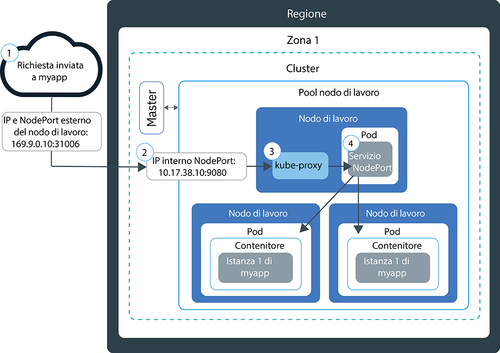

---

copyright:
  years: 2014, 2019
lastupdated: "2019-05-31"

keywords: kubernetes, iks

subcollection: containers

---

{:new_window: target="_blank"}
{:shortdesc: .shortdesc}
{:screen: .screen}
{:pre: .pre}
{:table: .aria-labeledby="caption"}
{:codeblock: .codeblock}
{:tip: .tip}
{:note: .note}
{:important: .important}
{:deprecated: .deprecated}
{:download: .download}
{:preview: .preview}


# Verifica dell'accesso alle applicazioni con le NodePort
{: #nodeport}

Rendi disponibile la tua applicazione inserita in un contenitore per l'accesso a Internet utilizzando l'indirizzo IP pubblico di qualsiasi nodo di lavoro in un cluster Kubernetes ed esponendo una NodePort. Utilizza questa opzione per la verifica in {{site.data.keyword.containerlong}} e per l'accesso pubblico a breve termine.
{:shortdesc}

## Gestione del traffico di rete utilizzando le NodePort
{: #nodeport_planning}

Esponi una porta pubblica sul tuo nodo di lavoro e utilizza l'indirizzo IP pubblico del nodo di lavoro per accedere al tuo servizio nel cluster pubblicamente da Internet.
{:shortdesc}

Quando esponi la tua applicazione creando un servizio Kubernetes del tipo NodePort, vengono assegnati al servizio
una NodePort nell'intervallo 30000 - 32767 e un indirizzo
IP del cluster interno. Il servizio
NodePort funge da punto di ingresso per le richieste in entrata per la tua applicazione. La NodePort assegnata è pubblicamente esposta nelle impostazioni `kubeproxy` di ogni nodo di lavoro nel cluster. Ogni nodo di lavoro inizia ad ascoltare dalla NodePort assegnata per le richieste in entrata per il
servizio. Per accedere al servizio da internet, è possibile utilizzare l'indirizzo IP pubblico di qualsiasi nodo di lavoro che è stato assegnato durante la creazione del cluster e il NodePort nel formato `<IP_address>:<nodeport>`. Se vuoi accedere al servizio sulla rete privata, usa l'indirizzo IP privato di qualsiasi nodo di lavoro invece dell'indirizzo IP pubblico.

Il seguente diagramma mostra come viene diretta la comunicazione da Internet a un'applicazione quando è configurato un servizio NodePort:



1. Viene inviata una richiesta alla tua applicazione utilizzando l'indirizzo IP pubblico del tuo nodo di lavoro e la NodePort sul nodo di lavoro.

2. La richiesta viene inoltrata automaticamente alla porta e all'indirizzo IP del cluster interno del servizio NodePort. L'indirizzo IP del cluster interno è accessibile solo all'interno del cluster.

3. `kube-proxy` instrada la richiesta al servizio NodePort Kubernetes per l'applicazione.

4. La richiesta viene inoltrata all'indirizzo IP privato del pod in cui è distribuita l'applicazione. Se nel cluster vengono distribuite più istanze dell'applicazione, il servizio NodePort instrada le richieste tra i pod dell'applicazione.

L'indirizzo IP pubblico del nodo di lavoro non è
permanente. Quando un nodo di lavoro viene rimosso
o ricreato, a tale nodo viene assegnato un nuovo indirizzo IP pubblico. Puoi utilizzare NodePort per testare l'accesso pubblico per la tua applicazione
o se l'accesso pubblico è richiesto solo per un breve periodo. Quando hai bisogno di un indirizzo IP pubblico stabile
e di una maggiore disponibilità per il tuo servizio, esponi la tua applicazione utilizzando un [Servizio NLB (network load balancer)](/docs/containers?topic=containers-loadbalancer) o [Ingress](/docs/containers?topic=containers-ingress).
{: note}

<br />


## Abilitazione dell'accesso a un'applicazione utilizzando un servizio NodePort
{: #nodeport_config}

Puoi esporre la tua applicazione come un servizio Kubernetes NodePort per i cluster gratuito o standard.
{:shortdesc}

Se ancora non hai un'applicazione pronta, puoi utilizzare un'applicazione di esempio Kubernetes denominata [Guestbook ](https://github.com/kubernetes/examples/blob/master/guestbook/all-in-one/guestbook-all-in-one.yaml).

1.  Nel file di configurazione della tua applicazione, definisci una sezione per il [servizio ](https://kubernetes.io/docs/concepts/services-networking/service/).

    Per l'esempio Guestbook, esiste una sezione del servizio di front-end nel file di configurazione. Per rendere l'applicazione Guestbook disponibile all'esterno, aggiungi il tipo di NodePort e una NodePort compresa nell'intervallo 30000 - 32767 alla sezione del servizio di frontend.
    {: tip}

    Esempio:

    ```
    apiVersion: v1
    kind: Service
    metadata:
      name: <my-nodeport-service>
      labels:
        <my-label-key>: <my-label-value>
    spec:
      selector:
        <my-selector-key>: <my-selector-value>
      type: NodePort
      ports:
       - port: <8081>
         # nodePort: <31514>

    ```
    {: codeblock}

    <table>
    <caption>Descrizione dei componenti del servizio NodePort</caption>
    <thead>
    <th colspan=2> Descrizione dei componenti della sezione del servizio NodePort</th>
    </thead>
    <tbody>
    <tr>
    <td><code>metadata.name</code></td>
    <td>Sostituisci <code><em>&lt;my-nodeport-service&gt;</em></code> con un nome per il tuo servizio NodePort.<p>Ulteriori informazioni sulla [protezione delle tue informazioni personali](/docs/containers?topic=containers-security#pi) quando utilizzi le risorse Kubernetes.</p></td>
    </tr>
    <tr>
    <td><code>metadata.labels</code></td>
    <td>Sostituisci <code><em>&lt;my-label-key&gt;</em></code> e <code><em>&lt;my-label-value&gt;</em></code> con l'etichetta che desideri utilizzare per il tuo servizio.</td>
    </tr>
    <tr>
      <td><code>spec.selector</code></td>
      <td>Sostituisci <code><em>&lt;my-selector-key&gt;</em></code> e <code><em>&lt;my-selector-value&gt;</em></code> con la coppia chiave/valore che hai utilizzato nella sezione <code>spec.template.metadata.labels</code> del tuo YAML di distribuzione. Per associare il servizio alla distribuzione, il selettore deve mettere in corrispondenza le etichette di distribuzione.
      </tr>
    <tr>
    <td><code>ports.port</code></td>
    <td>Sostituisci <code><em>&lt;8081&gt;</em></code> con la porta su cui è in ascolto il tuo servizio. </td>
     </tr>
     <tr>
     <td><code>ports.nodePort</code></td>
     <td>Facoltativo: sostituisci <code><em>&lt;31514&gt;</em></code> con un valore NodePort compreso tra 30000 e 32767. Non specificare una NodePort già utilizzata da un altro servizio. Se non assegni una NodePort, ne verrà assegnata una casuale automaticamente.<br><br>Per specificare una NodePort e vedere quali NodePort sono già in uso, immetti il seguente comando: <pre class="pre"><code>    kubectl get svc
    </code></pre><p>Ogni NodePort in utilizzo viene visualizzata nel campo **Porte**.</p></td>
     </tr>
     </tbody></table>

2.  Salva il file di configurazione aggiornato.

3.  Ripeti questi passi per creare un servizio NodePort per ogni applicazione che vuoi esporre su Internet.

**Operazioni successive:**

Quando l'applicazione viene distribuita, puoi utilizzare l'indirizzo IP pubblico di qualsiasi nodo di lavoro e la NodePort per formare l'URL pubblico per accedere all'applicazione da un browser. Se i tuoi nodi di lavoro sono connessi solo a una VLAN privata, è stato creato un servizio NodePort privato ed è possibile accedervi tramite l'indirizzo IP privato di un nodo di lavoro.

1.  Ottieni l'indirizzo IP pubblico per un nodo di lavoro nel cluster. Se vuoi accedere al nodo di lavoro su una rete privata, ottieni invece l'indirizzo IP privato.

    ```
    ibmcloud ks workers --cluster <cluster_name>
    ```
    {: pre}

    Output:

    ```
    ID                                                Public IP   Private IP    Size     State    Status
    prod-dal10-pa215dcf5bbc0844a990fa6b0fcdbff286-w1  192.0.2.23  10.100.10.10  u3c.2x4  normal   Ready
    prod-dal10-pa215dcf5bbc0844a990fa6b0fcdbff286-w2  192.0.2.27  10.100.10.15  u3c.2x4  normal   Ready
    ```
    {: screen}

2.  Se è stato assegnato un NodePort casuale, scopri quale è stato assegnato.

    ```
    kubectl describe service <service_name>
    ```
    {: pre}

    Output:

    ```
    Name:                   <service_name>
    Namespace:              default
    Labels:                 run=<deployment_name>
    Selector:               run=<deployment_name>
    Type:                   NodePort
    IP:                     10.10.10.8
    Port:                   <unset> 8080/TCP
    NodePort:               <unset> 30872/TCP
    Endpoints:              172.30.171.87:8080
    Session Affinity:       None
    No events.
    ```
    {: screen}

    In questo esempio, la NodePort è `30872`.

    Se la sezione **Endpoint** visualizza `<none>`, controlla `<selectorkey>` e `<selectorvalue>` da te utilizzati nella sezione `spec.selector` del servizio NodePort. Assicurati che siano gli stessi della coppia _chiave/valore_ che hai utilizzato nella sezione `spec.template.metadata.labels` del tuo YAML di distribuzione.
    {: note}

3.  Forma l'URL con uno degli indirizzi IP del nodo di lavoro e la NodePort. Esempio: `http://192.0.2.23:30872`
