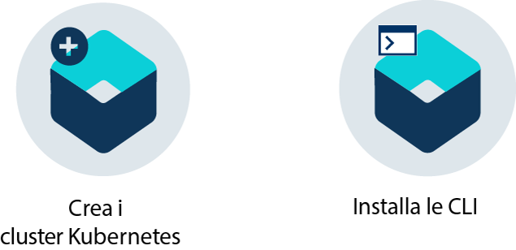
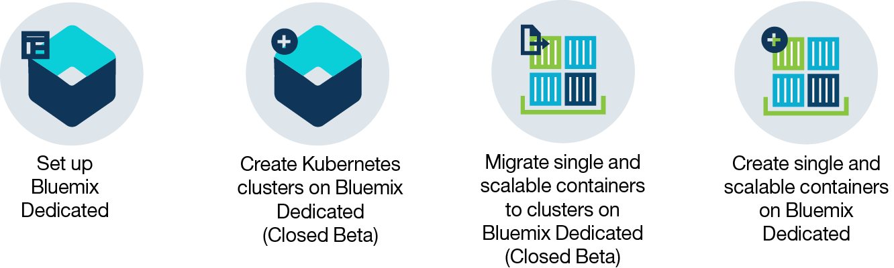

---

copyright:
  years: 2014, 2017
lastupdated: "2017-11-02"

---

{:new_window: target="_blank"}
{:shortdesc: .shortdesc}
{:screen: .screen}
{:pre: .pre}
{:table: .aria-labeledby="caption"}
{:codeblock: .codeblock}
{:tip: .tip}
{:download: .download}

# Informazioni su {{site.data.keyword.containerlong_notm}}
{: #cs_ov}

{{site.data.keyword.containershort}} offre potenti strumenti combinando le tecnologie Docker e Kubernetes, un'esperienza utente intuitiva e la sicurezza e l'isolamento integrati per automatizzare la distribuzione, il funzionamento, il ridimensionamento e il monitoraggio di applicazioni caricate nei contenitori in un cluster di host di calcolo indipendenti.
{:shortdesc}

 

## Contenitori Docker
{: #cs_ov_docker}

Docker è un progetto open che è stato rilasciato da dotCloud nel 2013. Basato sulle funzioni della tecnologia di contenitori Linux (LXC) esistente, Docker è diventato una piattaforma software per la creazione, il test, la distribuzione e il ridimensionamento delle applicazioni in modo rapido. Docker impacchetta il software in unità standardizzate, chiamate contenitori, che includono tutti gli elementi necessari per l'esecuzione di un'applicazione.
{:shortdesc}

Rivedi questi concetti per ulteriori informazioni sui concetti Docker di base.

<dl>
<dt>Contenitore</dt>
<dd>Un contenitore è un modo standard per impacchettare un'applicazione e tutte le sue dipendenze in modo che l'applicazione possa essere spostata tra gli ambienti ed eseguita senza modifiche. A differenza delle macchine virtuali, i contenitori non virtualizzano un dispositivo, il suo sistema operativo e l'hardware sottostante. Nel contenitore sono impacchettati solo il codice dell'applicazione, il runtime, gli strumenti di sistema, le librerie e le impostazioni. I contenitori vengono eseguiti come processi isolati su host di calcolo e condividono il sistema operativo host e le sue risorse hardware. Questo approccio rende un contenitore più leggero, portatile ed efficiente di una macchina virtuale.</dd>
<dt>Immagine</dt>
<dd>Ogni contenitore è basato su un'immagine Docker ed è considerato come un'istanza di un'immagine. Un'immagine viene creata da un Dockerfile, che contiene le istruzioni su come creare l'immagine e qualsiasi risorsa di build, come un'applicazione, la configurazione dell'applicazione e le relative dipendenze.</dd>
<dt>Registro</dt>
<dd>Un registro delle immagini è un luogo dove si archiviano, richiamano e condividono immagini Docker. Le immagini archiviate in un registro possono essere disponibili pubblicamente (registro pubblico)
o essere accessibili da un piccolo gruppo di utenti soltanto (registro privato). {{site.data.keyword.containershort_notm}} offre immagini pubbliche, come ibmliberty, che puoi utilizzare per creare la tua prima applicazione caricata in un contenitore. Quando si tratta di applicazioni aziendali, utilizza un registro privato come quello fornito in {{site.data.keyword.Bluemix_notm}} per proteggere le tue immagini da utilizzi e modifiche da parte di utenti non autorizzati.

  
Per distribuire un contenitore da un'immagine, assicurati che l'immagine sia memorizzata in un registro di immagini pubblico o privato. </dd>
</dl>

### Vantaggi chiave dell'utilizzo di contenitori
{: #container_benefits}

<dl>
<dt>I contenitori sono elementi agile</dt>
<dd>I contenitori semplificano la gestione del sistema, fornendo
ambienti standardizzato ai team di sviluppo e produzione. Il runtime leggero del motore consente un ridimensionamento rapido in risposta
al variare della domanda. Contribuiscono a eliminare
la complessità data dalla gestione di piattaforme di sistemi operativi differenti
e delle infrastrutture sottostanti. I contenitori ti aiutano a distribuire ed eseguire una qualsiasi applicazione su qualsiasi infrastruttura in modo rapido e affidabile.</dd>
<dt>I contenitori sono piccoli</dt>
<dd>Puoi sistemare più contenitori nella stessa quantità di spazio richiesta da una singola macchina virtuale.</dd>
<dt>I contenitori sono portabili</dt>
<dd>Crea un'immagine per un altro contenitore utilizzando un'altra immagine come base. Lascia che qualcun altro
faccia il grosso del lavoro su un'immagine e perfezionala prima di utilizzarla. Puoi anche effettuare rapidamente la migrazione del codice applicazione da un
ambiente di preparazione a un ambiente produttivo. Il processo di migrazione può essere automatizzato con gli strumenti di fornitura continua.</dd>
</dl>

 

## Principi di base di Kubernetes
{: #kubernetes_basics}

Kubernetes era stato sviluppato da Google come parte del progetto Borg e passato alla community
open source nel 2014. Kubernetes combina più di 15 anni di ricerche di Google nell'esecuzione
di un'infrastruttura inserita in un contenitore con carichi di lavoro di produzione, contributi open source e gli strumenti di gestione del contenitore Docker
per fornire una piattaforma dell'applicazione sicura e isolata, portatile,
estensibile e con l'autocorrezione nel caso di failover.
{:shortdesc}

Scopri le basi di come Kubernetes funziona con una terminologia limitata come mostrato nel seguente diagramma.

<dl>
<dt>Account</dt>
<dd>L'account fa riferimento al tuo account {{site.data.keyword.Bluemix_notm}}.</dd>

<dt>Cluster</dt>
<dd>Un cluster Kubernetes è formato da una o più macchine virtuali denominate
nodi di lavoro. Ogni nodo di lavoro rappresenta un host di calcolo dove puoi distribuire, eseguire e gestire
applicazioni inserite nel contenitore. I nodi di lavoro sono gestiti da un master Kubernetes che controlla e monitora in modo centralizzato tutte le risorse Kubernetes
nel cluster. Quando distribuisci un'applicazione inserita in un contenitore,
il master Kubernetes decide dove distribuire l'applicazione, tenendo conto dei requisiti di distribuzione e della capacità
disponibile nel cluster.</dd>

<dt>Servizio</dt>
<dd>Un servizio Kubernetes raggruppa un insieme di pod e fornisce connettività di rete a questi pod senza esporre l'effettivo indirizzo IP privato di ciascun pod. Puoi utilizzare un servizio per rendere la tua applicazione disponibile nel tuo cluster o pubblicamente su Internet.
  
Per ulteriori informazioni sulla terminologia Kubernetes, <a href="cs_tutorials.html#cs_cluster_tutorial" target="_blank">prova questa esercitazione</a>.</dd>

<dt>Distribuzione</dt>
<dd>Una distribuzione è una risorsa Kubernetes in cui puoi specificare i contenitori e altre informazioni necessarie per eseguire la tua applicazione, come l'archiviazione persistente, i servizi o le annotazioni. Dovrai documentare una distribuzione in un file YAML di configurazione e quindi applicarla al cluster. Il master Kubernetes configura la risorsa e distribuisce i contenitori nei pod su nodi di lavoro con capacità disponibile.
  
Definisci le strategie di aggiornamento per la tua applicazione, incluso il numero di pod che vuoi aggiungere durante un aggiornamento continuo e il numero di pod che possono non essere disponibili contemporaneamente. Quando esegui un aggiornamento continuo, la distribuzione controlla se l'aggiornamento funziona e interrompe il rollout quando vengono rilevati errori.</dd>

<dt>Pod</dt>
<dd>Ogni applicazione inserita in un contenitore che viene distribuita in un cluster Kubernetes viene distribuita, eseguita e gestita da un pod. I pod rappresentano piccole unità distribuibili in un cluster Kubernetes e vengono utilizzati per raggruppare i contenitori che devono essere trattati come una singola unità. Nella maggior parte dei casi, un
contenitore viene distribuito a un suo pod. Tuttavia, un'applicazione potrebbe richiedere un contenitore e altri contenitori helper per essere distribuita
in un pod, in modo che tali contenitori possano essere indirizzati utilizzando lo stesso indirizzo IP privato.</dd>

<dt>Applicazione</dt>
<dd>Un'applicazione fa riferimento a un'applicazione completa o a un componente di un'applicazione. Potresti distribuire i componenti della tua applicazione in pod separati o nodi di lavoro separati.</dd>

</dl>

 

## Vantaggi dell'utilizzo dei cluster
{: #cs_ov_benefits}

I cluster vengono distribuiti su macchine virtuali condivise o dedicate che forniscono funzionalità aggiunte di Kubernetes e {{site.data.keyword.IBM_notm}} native.
{:shortdesc}

|Vantaggi|Descrizione|
|-------|-----------|
|Cluster Kubernetes a singolo tenant con calcolo, rete e isolamento dell'infrastruttura di archiviazione|<ul><li>Crea la tua propria infrastruttura personalizzata che soddisfi i requisiti dell'ambiente
di sviluppo e di business.</li><li>Esegui il provisioning di un master Kubernetes sicuro e dedicato, dei nodi di lavoro, delle reti virtuali e dell'archiviazione utilizzando le risorse fornite dall'infrastruttura IBM Cloud (SoftLayer).</li><li>Archivia i dati persistenti, i dati condivisi tra i pod Kubernetes e ripristinali quando necessario
con il servizio del volume protetto e integrato.</li><li>Master Kubernetes completamente gestito e continuamente monitorato da {{site.data.keyword.IBM_notm}} per mantenere il tuo cluster disponibile.</li><li>Vantaggi del supporto completo per le API Kubernetes native.</li></ul>|
|Conformità della sicurezza dell'immagine con il Controllo vulnerabilità|<ul><li>Configura il tuo registro delle immagini privato Docker in cui le immagini vengono archiviate e condivise da tutti gli utenti
nell'organizzazione.</li><li>Vantaggi dalla scansione automatica delle immagini nel tuo registro {{site.data.keyword.Bluemix_notm}} privato.</li><li>Rivedi la raccomandazioni specifiche del sistema operativo utilizzato nell'immagine per risolvere le vulnerabilità potenziali.</li></ul>|
|Ridimensionamento automatico delle applicazioni|<ul><li>Definisci le politiche personalizzate per ridimensionare le applicazioni in base al consumo di memoria e CPU.</li></ul>|
|Monitoraggio continuo dell'integrità del cluster|<ul><li>Utilizza il dashboard del cluster per visualizzare e gestire rapidamente l'integrità del tuo cluster, dei nodi di lavoro e delle distribuzioni del contenitore.</li><li>Trova le metriche di consumo dettagliate utilizzando {{site.data.keyword.monitoringlong}} ed
espandi velocemente il tuo cluster per soddisfare i carichi di lavoro.</li><li>Esamina le informazioni di registrazione utilizzando {{site.data.keyword.loganalysislong}} per visualizzare le attività del cluster dettagliate.</li></ul>|
|Ripristino automatico dei contenitori non integri|<ul><li>Controlli di integrità continui sui contenitori distribuiti in un nodo di lavoro.</li><li>Ricreazione automatica dei contenitori in caso di errori.</li></ul>|
|Rilevamento e gestione del servizio|<ul><li>Servizi dell'applicazione registrati centralmente per renderli disponibili per altre applicazioni nel tuo cluster senza
esporli pubblicamente.</li><li>Rileva i servizi registrati senza tenere traccia della modifica degli indirizzi IP o degli ID del contenitore e
i vantaggi dell'instradamento automatico alle istanze disponibili.</li></ul>|
|Esposizione protetta dei servizi al pubblico|<ul><li>Reti di sovrapposizione private con il programma di bilanciamento del carico completo e il supporto Ingress per rendere i tuoi carichi di lavoro le tue applicazioni pubblicamente
disponibili tra più nodi di lavoro senza modificare gli indirizzi IP
nel tuo cluster.</li><li>Scegli tra un indirizzo IP pubblico, una rotta fornita da {{site.data.keyword.IBM_notm}} o il tuo proprio dominio personale per accedere
ai servizi nel tuo cluster da internet.</li></ul>|
|Integrazione servizio {{site.data.keyword.Bluemix_notm}}|<ul><li>Aggiungi ulteriori funzionalità alla tua applicazione tramite l'integrazione dei servizi {{site.data.keyword.Bluemix_notm}}, come le API Watson, Blockchain, i servizi dati o Internet of Things, e aiuta gli utenti del cluster a semplificare lo sviluppo dell'applicazione
e il processo di gestione del contenitore.</li></ul>|
{: caption="Tabella 1. Vantaggi dell'utilizzo dei cluster con {{site.data.keyword.containerlong_notm}}" caption-side="top"}

 

## Ambienti cloud
{: #cs_ov_environments}

Puoi scegliere l'ambiente cloud {{site.data.keyword.Bluemix_notm}} in cui distribuire cluster e contenitori.
{:shortdesc}

### {{site.data.keyword.Bluemix_notm}} pubblico
{: #public_environment}

Distribuisci i cluster nell'ambiente cloud pubblico ([https://console.bluemix.net ](https://console.bluemix.net)) e connettiti a un qualsiasi servizio nel catalogo {{site.data.keyword.Bluemix_notm}}.

Con i cluster
in {{site.data.keyword.Bluemix_notm}} pubblico, puoi scegliere il livello di isolamento hardware per i nodi di lavoro nel tuo cluster. Utilizza l'hardware dedicato affinché le risorse fisiche disponibili siano dedicate solo al tuo cluster oppure l'hardware condiviso per consentire la condivisione delle risorse fisiche con i cluster di altri clienti {{site.data.keyword.IBM_notm}}. Potresti scegliere un cluster dedicato nell'ambiente {{site.data.keyword.Bluemix_notm}} pubblico
se vuoi l'isolamento per il tuo cluster, ma non richiedi tale isolamento per gli altri
servizi {{site.data.keyword.Bluemix_notm}} che
utilizzi.

Fai clic su una delle seguenti opzioni per iniziare:

    <map name="public_options" id="public_options">
    <area href="container_index.html#clusters" alt="Introduzione ai cluster Kubernetes in {{site.data.keyword.Bluemix_notm}}
" title="Introduzione ai cluster Kubernetes in {{site.data.keyword.Bluemix_notm}}
" shape="rect" coords="-5, -6, 123, 154" />
    <area href="cs_classic.html#cs_classic" alt="Esecuzione di contenitori singoli e scalabili in {{site.data.keyword.containershort_notm}}" title="Esecuzione di contenitori singoli e scalabili in I{{site.data.keyword.containershort_notm}}" shape="rect" coords="181, -5, 320, 161" />
    </map>

### {{site.data.keyword.Bluemix_dedicated_notm}}
{: #dedicated_environment}

Distribuisci cluster (Chiuso beta) o i contenitori singoli e scalabili in un ambiente cloud dedicato
(`https://<my-dedicated-cloud-instance>.bluemix.net`)  e connettiti
con i servizi {{site.data.keyword.Bluemix_notm}} preselezionati che sono anche in esecuzione.

I cluster con {{site.data.keyword.Bluemix_dedicated_notm}} sono equivalenti ai cluster creati con l'hardware dedicato in {{site.data.keyword.Bluemix_notm}} pubblico. Le risorse fisiche
disponibili sono dedicate solo al tuo cluster e non vengono condivise con i cluster di altri clienti {{site.data.keyword.IBM_notm}}. Sia per l'ambiente pubblico che dedicato, viene utilizzato l'endpoint API
pubblico per creare i cluster. Tuttavia, con {{site.data.keyword.Bluemix_notm}} dedicato, le differenza più
significative sono le seguenti.

*   {{site.data.keyword.IBM_notm}} possiede e gestisce l'account dell'infrastruttura IBM Cloud (SoftLayer) in cui vengono distribuiti i nodi di lavoro, le VLAN e le sottoreti, anziché in un account di tua proprietà.
*   Le specifiche per tali VLAN e sottoreti vengono determinate quando viene creato l'ambiente dedicato
e non quando viene creato il cluster.

Potresti scegliere di configurare un ambiente {{site.data.keyword.Bluemix_dedicated_notm}} se vuoi l'isolamento per il tuo cluster e richiedi tale isolamento anche per gli altri servizi {{site.data.keyword.Bluemix_notm}} che utilizzi.

Fai clic su una delle seguenti opzioni per iniziare:

    <map name="dedicated_options" id="dedicated_options">
    <area href="#setup_dedicated" alt="Configurazione di {{site.data.keyword.containershort_notm}} su {{site.data.keyword.Bluemix_dedicated_notm}} (Beta chiusa)" title="Configurazione di {{site.data.keyword.containershort_notm}} su {{site.data.keyword.Bluemix_dedicated_notm}} (Beta chiusa)" shape="rect" coords="-5, -15, 100, 153" />
    <area href="container_index.html#dedicated" alt="Introduzione ai cluster Kubernetes in {{site.data.keyword.Bluemix_notm}} dedicato (Beta chiusa)" title="Introduzione ai cluster Kubernetes in {{site.data.keyword.Bluemix_dedicated_notm}} (Beta chiusa)" shape="rect" coords="153, -10, 276, 182" />
    <area href="cs_classic.html#cs_classic" alt="Esecuzione di contenitori singoli e scalabili in {{site.data.keyword.containershort_notm}}" title="Esecuzione di contenitori singoli e scalabili in {{site.data.keyword.containershort_notm}}" shape="rect" coords="317, -11, 436, 188" />
    <area href="container_ha.html#container_group_ui" alt="Esecuzione dei servizi a lungo termine come gruppi di contenitori dalla GUI {{site.data.keyword.Bluemix_notm}} " title="Esecuzione dei servizi a lungo termine come gruppi di contenitori dalla GUI {{site.data.keyword.Bluemix_notm}} " shape="rect" coords="485, -1, 600, 173" />
    </map>

### Differenze nella gestione dei cluster tra gli ambienti cloud
{: #env_differences}

|Area|{{site.data.keyword.Bluemix_notm}} pubblico|{{site.data.keyword.Bluemix_dedicated_notm}} (Beta chiusa)|
|--|--------------|--------------------------------|
|Creazione cluster|Crea un cluster lite o specifica i seguenti dettagli per un cluster standard:<ul><li>Tipo di cluster</li><li>Nome</li><li>Ubicazione</li><li>Tipo di macchina</li><li>Numero di nodi di lavoro</li><li>VLAN pubblica</li><li>VLAN privata</li><li>Hardware</li></ul>|Specifica i seguenti dettagli per un cluster standard:<ul><li>Nome</li><li>Versione Kubernetes</li><li>Tipo di macchina</li><li>Numero di nodi di lavoro</li></ul>
**Nota:** le impostazioni VLAN e Hardware vengono predefinite durante la creazione dell'ambiente {{site.data.keyword.Bluemix_notm}}.
|
|Hardware e proprietà del cluster|Nei cluster standard, l'hardware può essere condiviso da altri clienti {{site.data.keyword.IBM_notm}} o dedicato solo a te. Le VLAN pubbliche e private sono possedute e gestite da te nel tuo account dell'infrastruttura IBM Cloud (SoftLayer).|Nei cluster su {{site.data.keyword.Bluemix_dedicated_notm}}, l'hardware è sempre dedicato. Le VLAN pubbliche e private appartengono e gestite da IBM per te. L'ubicazione è predefinita per l'ambiente {{site.data.keyword.Bluemix_notm}}.|
|Bind del servizio con un cluster|Utilizza il comando [bx cs cluster-service-bind](cs_cluster.html#cs_cluster_service) per eseguire il bind di un segreto Kubernetes
al cluster.|Crea un [file della chiave JSON](cs_cluster.html#binding_dedicated) per le credenziali del servizio e quindi crea un segreto Kubernetes da tale file
per eseguire il bind al cluster.|
|Rete Programma di bilanciamento del carico e Ingress|Durante il provisioning dei cluster standard, si verificano automaticamente le seguenti azioni.<ul><li>Una sottorete portatile pubblica viene associata al tuo cluster e assegnata al tuo account dell'infrastruttura IBM Cloud (SoftLayer).</li><li>Viene utilizzato un indirizzo IP pubblico portatile per un controller Ingress altamente disponibile e viene assegnata una rotta pubblica univoca nel formato &lt;cluster_name&gt;.containers.mybluemix.net. Puoi utilizzare questa rotta per esporre più applicazioni pubblicamente.</li><li>Vengono assegnati al cluster quattro indirizzi IP che possono venire utilizzati per esporre le applicazioni pubblicamente tramite i servizi del programma di bilanciamento del carico. È possibile richiedere ulteriori sottoreti attraverso il tuo account dell'infrastruttura IBM Cloud (SoftLayer).</li></ul>|Quando crei il tuo account dedicato, prendi le seguenti decisioni:<ul><li>Il numero di sottoreti che desideri</li><li>Il tipo di sottorete che vuoi, programma di bilanciamento del carico o Ingress. {{site.data.keyword.IBM_notm}} crea le sottoreti e svolge attività
di gestione della rete per te. A seconda delle tue selezioni, potrebbe essere creato un controller Ingress e assegnata
una rotta pubblica. È possibile richiedere ulteriori sottoreti [aprendo un
ticket di supporto](/docs/support/index.html#contacting-support) per creare la sottorete e quindi utilizzare il comando
[`bx cs cluster-subnet-add`](cs_cli_reference.html#cs_cluster_subnet_add) per aggiungere la sottorete al cluster.|
|Rete NodePort|Esponi una porta pubblica nel tuo nodo di lavoro e utilizza l'indirizzo IP pubblico del nodo di lavoro
per accedere pubblicamente al tuo servizio nel cluster.|Tutti gli indirizzi IP dei nodi di lavoro vengono bloccati da un firewall. Tuttavia per i servizi
{{site.data.keyword.Bluemix_notm}} aggiunti al cluster, è possibile accedere alla porta del nodo tramite un indirizzo IP pubblico o privato.|
|Memoria persistente|Utilizza il [provisioning
dinamico](cs_apps.html#cs_apps_volume_claim) o il [provisioning
statico](cs_cluster.html#cs_cluster_volume_create) dei volumi.|Utilizza il [provisioning
dinamico](cs_apps.html) dei volumi.</li></ul>|
|URL del registro di immagini in {{site.data.keyword.registryshort_notm}}|<ul><li>Stati Uniti Sud e Stati Uniti Est: <code>registry.ng bluemix.net</code></li><li>Regno Unito Sud: <code>registry.eu-gb.bluemix.net</code></li><li>Europa centrale (Francoforte): <code>registry.eu-de.bluemix.net</code></li><li>Australia (Sydney): <code>registry.au-syd.bluemix.net</code></li></ul>|<ul><li>Per i nuovi spazi dei nomi, utilizza gli stessi registri basati su regione definiti per {{site.data.keyword.Bluemix_notm}} pubblico.</li><li>Per gli spazi dei nomi configurati per i contenitori singoli e scalabili in {{site.data.keyword.Bluemix_dedicated_notm}}, utilizza <code>registry.&lt;dedicated_domain&gt;</code></li></ul>|
|Accesso al registro|Consulta le opzioni in [Utilizzo dei registri di immagini pubblici e privati con {{site.data.keyword.containershort_notm}}](cs_cluster.html#cs_apps_images).|<ul><li>Per i nuovi spazi dei nomi, vedi le opzioni in [Utilizzo dei registri di immagini pubblici e privati con {{site.data.keyword.containershort_notm}}](cs_cluster.html#cs_apps_images).</li><li>Per gli spazi dei nomi configurati per i gruppi di contenitori singoli e scalabili, [utilizza un token e crea un segreto
Kubernetes](cs_dedicated_tokens.html#cs_dedicated_tokens) per l'autenticazione.</li></ul>|
{: caption="Tabella 2. Differenze delle funzioni tra {{site.data.keyword.Bluemix_notm}} pubblico e {{site.data.keyword.Bluemix_dedicated_notm}}" caption-side="top"}

### Configurazione di {{site.data.keyword.containershort_notm}} su {{site.data.keyword.Bluemix_dedicated_notm}} (Beta chiusa)
{: #setup_dedicated}

Gli amministratori devono aggiungere l'ID amministratore e gli utenti IBM
della tua organizzazione all'ambiente dedicato.

Prima di iniziare, [configura un ambiente {{site.data.keyword.Bluemix_dedicated_notm}}](/docs/dedicated/index.html#setupdedicated).

Per configurare l'ambiente dedicato per utilizzare i cluster:

1.  Aggiungi l'ID amministratore IBM fornito all'ambiente.
    1.  Seleziona il tuo account {{site.data.keyword.Bluemix_dedicated_notm}}.
    2.  Dalla barra dei menu, fai clic
su **Gestisci>Sicurezza>Identità e
accesso**. La finestra Utenti visualizza un elenco di utenti
con i relativi indirizzi e-mail e stati per l'account selezionato
    3.  Fai clic su **Invita utenti**.
    4.  In **Indirizzo e-mail o ID IBM esistente**, immetti il seguente indirizzo e-mail:
`cfsdl@us.ibm.com`.
    5.  Nella sezione **Accesso**, espandi **Servizi abilitati per l'accesso
e l'identità**.
    6.  Dall'elenco a discesa **Servizi**, seleziona **{{site.data.keyword.containershort_notm}}**.
    7.  Dall'elenco a discesa **Ruoli**, seleziona
**Amministratore**.
    8.  Fai clic su **Invita utenti**.
2.  [Crea gli ID IBM per gli utenti finali del tuo account {{site.data.keyword.Bluemix_notm}}. ](https://www.ibm.com/account/us-en/signup/register.html)
3.  [Aggiungi gli utenti dal passo precedente del tuo account {{site.data.keyword.Bluemix_notm}}.](cs_cluster.html#add_users)
4.  Accedi al tuo account {{site.data.keyword.Bluemix_dedicated_notm}} tramite la console dell'ambiente pubblico e inizia a creare i cluster.
    1.  Accedi alla console {{site.data.keyword.Bluemix_notm}} pubblico ([https://console.bluemix.net ](https://console.bluemix.net)) con il tuo ID IBM.
    2.  Dal menu Account, seleziona il tuo account {{site.data.keyword.Bluemix_dedicated_notm}}. La console viene aggiornata con i servizi e le informazioni per la tua istanza di {{site.data.keyword.Bluemix_dedicated_notm}}.
    3.  Dal catalogo della tua istanza di {{site.data.keyword.Bluemix_dedicated_notm}}, seleziona **Contenitori** e fai clic su **Cluster Kubernetes**.
    Per ulteriori informazioni sulla creazione di un cluster, vedi [Creazione di cluster Kubernetes dalla GUI in {{site.data.keyword.Bluemix_dedicated_notm}} (Beta chiusa)](cs_cluster.html#creating_ui_dedicated).
5. Se il tuo sistema locale o la tua rete aziendale controllano gli endpoint internet pubblici utilizzando i proxy o i firewall, consulta [Apertura delle porte e degli indirizzi IP necessari nel tuo firewall](cs_security.html#opening_ports) per ulteriori informazioni su come consentire il traffico in uscita.

 

## Architettura del servizio
{: #cs_ov_architecture}

Ogni nodo di lavoro è configurato con un Docker Engine gestito da {{site.data.keyword.IBM_notm}}, risorse di calcolo separate,
rete e servizio del volume, così come le funzioni di sicurezza integrate che forniscono l'isolamento,
le funzionalità di gestione della risorsa e la conformità di sicurezza dei nodi di lavoro. Il nodo di lavoro comunica con il master
utilizzando i certificati di sicurezza TLS e la connessione openVPN.
{:shortdesc}

*Figura 1. La rete e l'architettura Kubernetes in {{site.data.keyword.containershort_notm}}*

Il diagramma illustra cosa viene gestito da te e cosa da IBM in un cluster. Per ulteriori dettagli sulle attività di manutenzione, vedi [Responsabilità di gestione del cluster](cs_planning.html#responsibilities).

### {{site.data.keyword.Bluemix_dedicated_notm}}
{: #dedicated_architecture}

*Figura 2. La rete e l'architettura Kubernetes in {{site.data.keyword.Bluemix_dedicated_notm}}*

 

## Abuso dei contenitori
{: #cs_terms}

I clienti non possono usare impropriamente il {{site.data.keyword.containershort_notm}}.
{:shortdesc}

L'utilizzo improprio include:

*   Qualsiasi attività illegale
*   La distribuzione o l'esecuzione di malware
*   Il danneggiamento di {{site.data.keyword.containershort_notm}} o l'interferenza
con l'utilizzo di {{site.data.keyword.containershort_notm}}
*   Il danneggiamento o l'interferenza con l'utilizzo di qualsiasi altro servizio o sistema
*   L'accesso non autorizzato a qualsiasi servizio o sistema
*   La modifica non autorizzata a qualsiasi servizio o sistema
*   La violazione dei diritti altrui

Per i termini generali di utilizzo, consulta [Termini dei
servizi cloud](/docs/navigation/notices.html#terms).
