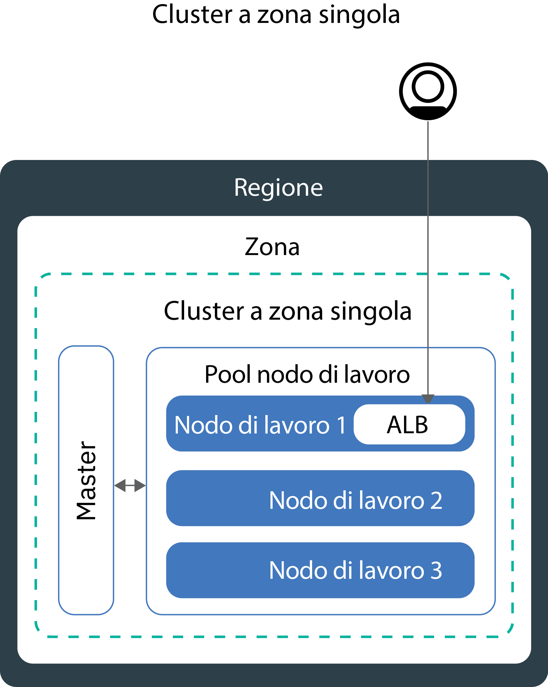
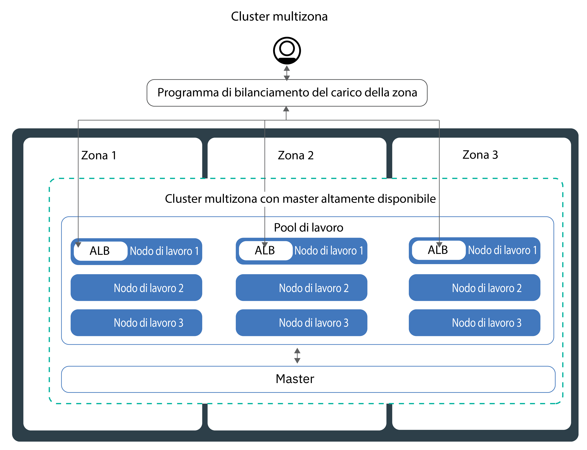
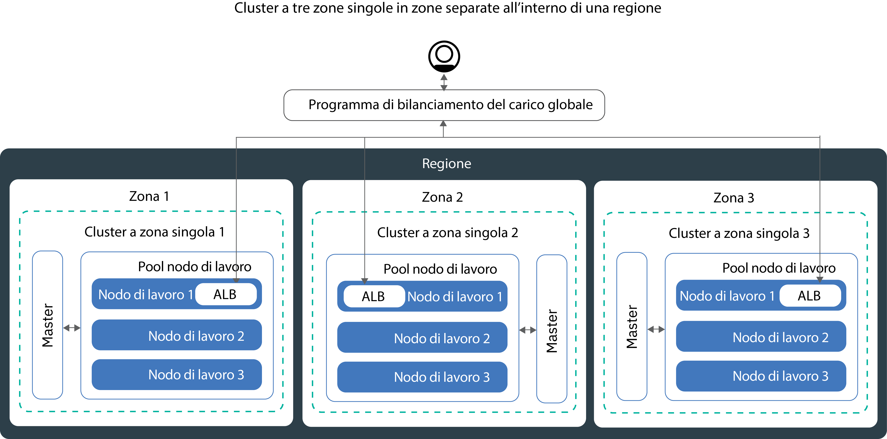

---

copyright:
  years: 2014, 2019
lastupdated: "2019-06-11"

keywords: kubernetes, iks, multi az, multi-az, szr, mzr

subcollection: containers

---

{:new_window: target="_blank"}
{:shortdesc: .shortdesc}
{:screen: .screen}
{:pre: .pre}
{:table: .aria-labeledby="caption"}
{:codeblock: .codeblock}
{:tip: .tip}
{:note: .note}
{:important: .important}
{:deprecated: .deprecated}
{:download: .download}
{:preview: .preview}


# Pianificazione del tuo cluster per l'alta disponibilità
{: #ha_clusters}

Progetta il tuo cluster standard per la massima capacità e disponibilità per la tua applicazione con {{site.data.keyword.containerlong}}.
{: shortdesc}

I tuoi utenti hanno meno probabilità di riscontrare tempi di inattività quando distribuisci le tue applicazioni tra più nodi di lavoro, zone e cluster. Le funzionalità integrate, come il bilanciamento del carico e l'isolamento, aumentano la resilienza nei confronti di
potenziali errori con host, reti o applicazioni. Rivedi la configurazione di questi cluster potenziali ordinati per gradi di disponibilità.


1. Un [cluster a zona singola](#single_zone) con più nodi di lavoro in un pool di nodi di lavoro.
2. Un [cluster multizona](#multizone) che estende i nodi di lavoro tra le zone all'interno di una regione.
3. Dei **cluster che sono connessi solo a VLAN pubbliche e private**: [più cluster](#multiple_clusters) configurati tra le zone o le regioni e che sono connessi tramite un programma di bilanciamento del carico globale.

## Cluster a zona singola
{: #single_zone}

Per migliorare la disponibilità per la tua applicazione e per consentire il failover nel caso in cui un nodo di lavoro non sia disponibile nel tuo cluster, aggiungi altri nodi di lavoro al tuo cluster a zona singola.
{: shortdesc}



Per impostazione predefinita, il tuo cluster a zona singola è impostato con un pool di nodi di lavoro denominato `default`. Il pool di nodi di lavoro raggruppa i nodi di lavoro con la stessa configurazione, ad esempio il tipo di macchina, che hai definito durante la creazione del cluster. Puoi aggiungere altri nodi di lavoro al tuo cluster [ridimensionando un pool di nodi di lavoro esistente](/docs/containers?topic=containers-add_workers#resize_pool) o [aggiungendo un nuovo pool di nodi di lavoro](/docs/containers?topic=containers-add_workers#add_pool).

Quando aggiungi più nodi di lavoro, le istanze dell'applicazione possono essere distribuite tra più nodi di lavoro. Se un nodo di lavoro si disattiva, le istanze dell'applicazione sui nodi di lavoro disponibili continueranno a funzionare. Kubernetes ripianifica automaticamente i pod dai nodi di lavoro non disponibili per garantire le prestazioni e la capacità della tua applicazione. Per assicurarti che i tuoi pod vengano distribuiti uniformemente tra i nodi di lavoro, implementa l'[affinità pod](https://kubernetes.io/docs/concepts/configuration/assign-pod-node/#inter-pod-affinity-and-anti-affinity-beta-feature).

**Posso convertire il mio cluster a zona singola in un cluster multizona?**</br>
Se il cluster si trova in una delle [località metropolitane multizona supportate](/docs/containers?topic=containers-regions-and-zones#zones), sì. Vedi [Aggiornamento dai nodi di lavoro autonomi ai pool di nodi di lavoro](/docs/containers?topic=containers-update#standalone_to_workerpool).


**Devo utilizzare i cluster multizona?**</br>
No. Puoi creare tutti i cluster a zona singola che desideri. In effetti, potresti preferire i cluster a zona singola per la gestione semplificata oppure se il tuo cluster deve risiedere in una specifica [città a zona singola](/docs/containers?topic=containers-regions-and-zones#zones).

**Posso avere un master altamente disponibile in una singola zona?**</br>
Sì. In una singola zona, il tuo master è altamente disponibile e include repliche su host fisici separati per il server API, etcd, il programma di pianificazione e il gestore controller Kubernetes per proteggerti in caso di interruzione, come durante un aggiornamento del master. Per proteggerti da un malfunzionamento della zona, puoi:
* [Creare un cluster in una zona che supporta il multizona](#multizone), dove il master viene distribuito tra le zone.
* [Creare più cluster che sono connessi alle VLAN pubbliche e private](#multiple_clusters) ed eseguirne la connessione a un programma di bilanciamento del carico globale.

## Cluster multizona
{: #multizone}

Con {{site.data.keyword.containerlong_notm}}, puoi creare cluster multizona. I tuoi utenti hanno meno probabilità di riscontrare tempi di inattività quando distribuisci le tue applicazioni tra più nodi di lavoro e zone utilizzando un pool di nodi di lavoro. Le funzionalità integrate, come ad esempio il bilanciamento del carico, aumentano la resilienza nei confronti di
potenziali malfunzionamenti della zona con host, reti o applicazioni. Se le risorse in una zona si disabilitano, i tuoi carichi di lavoro del cluster saranno ancora operativi nelle altre zone.
{: shortdesc}

**Cos'è un pool di nodi di lavoro?**</br>
Un pool di nodi di lavoro è una raccolta di nodi di lavoro con la stessa varietà, ad esempio tipo di macchina, CPU e memoria. Quando crei un cluster, viene automaticamente creato per tuo conto un pool di nodi di lavoro predefinito. Per distribuire i nodi di lavoro nel tuo pool tra le zone, aggiungere nodi di lavoro al pool o aggiornare i nodi di lavoro, puoi utilizzare i nuovi comandi `ibmcloud ks worker-pool`.

**Posso ancora utilizzare nodi di lavoro autonomi?**</br>
La configurazione cluster precedente dei nodi di lavoro autonomi è supportata ma obsoleta. Assicurati di [aggiungere un pool di nodi di lavoro al tuo cluster](/docs/containers?topic=containers-planning_worker_nodes#add_pool) e quindi di [utilizzare i pool di nodi di lavoro](/docs/containers?topic=containers-update#standalone_to_workerpool) per organizzare i tuoi nodi di lavoro anziché i nodi di lavoro autonomi.

**Posso convertire il mio cluster a zona singola in un cluster multizona?**</br>
Se il cluster si trova in una delle [località metropolitane multizona supportate](/docs/containers?topic=containers-regions-and-zones#zones), sì. Vedi [Aggiornamento dai nodi di lavoro autonomi ai pool di nodi di lavoro](/docs/containers?topic=containers-update#standalone_to_workerpool).


### Ulteriori informazioni sulla configurazione del cluster multizona
{: #mz_setup}



Puoi aggiungere ulteriori zone al tuo cluster per replicare i nodi di lavoro nei tuoi pool di nodi di lavoro tra più zone all'interno di una regione. I cluster multizona sono progettati per pianificare uniformemente i pod tra i nodi di lavoro e le zone per garantire la disponibilità e il ripristino in caso di malfunzionamento. Se i nodi di lavoro non vengono distribuiti uniformemente tra le zone o se la capacità di una delle zone non è sufficiente, il programma di pianificazione (scheduler) Kubernetes potrebbe non riuscire a pianificare tutti i pod richiesti. Di conseguenza, i pod potrebbero essere in uno stato di **In sospeso** fino a quando non sarà disponibile capacità sufficiente. Se vuoi modificare il comportamento predefinito in modo che il programma di pianificazione (scheduler) Kubernetes distribuisca i pod tra le zone con una distribuzione migliore, usa la [politica di affinità pod](https://kubernetes.io/docs/concepts/configuration/assign-pod-node/#inter-pod-affinity-and-anti-affinity-beta-feature) `preferredDuringSchedulingIgnoredDuringExecution`.

**Perché ho bisogno di nodi di lavoro in tre zone?** </br>
La distribuzione del tuo carico di lavoro tra tre zone garantisce l'alta disponibilità per la tua applicazione nel caso in cui una o due zone non siano disponibili, ma rende anche la configurazione del tuo cluster più efficiente. Ti chiedi per quale motivo? Di seguito troverai un esempio.

Supponiamo che hai bisogno di un nodo di lavoro con sei core per gestire il carico di lavoro per la tua applicazione. Per rendere il tuo cluster ancora più disponibile, hai le seguenti opzioni:

- **Duplica le tue risorse in un'altra zona:** questa opzione ti lascia con due nodi di lavoro, ciascuno con sei core in ogni zona per un totale di 12 core.</br>
- **Distribuisci le risorse tra tre zone:** con questa opzione, distribuisci tre core per zona, lasciandoti con una capacità totale di nove core. Per gestire il tuo carico di lavoro, è necessario che siano attive due zone alla volta. Se una zona non è disponibile, le altre due zone possono gestire il tuo carico di lavoro. Se due zone non sono disponibili, i tre core rimanenti sono attivi per gestire il tuo carico di lavoro. La distribuzione di tre core per zona comporta l'impiego di macchine più piccole e quindi una riduzione dei costi per te.</br>

**Come è configurato il mio master Kubernetes?** </br>
Quando crei un cluster multizona in una [località metropolitana multizona](/docs/containers?topic=containers-regions-and-zones#zones), viene distribuito automaticamente un master Kubernetes altamente disponibile e vengono distribuite tre repliche tra le zone della località metropolitana. Ad esempio, se il cluster si trova nelle zone `dal10`, `dal12` o `dal13`, le repliche del master Kubernetes vengono estese su ogni zona nella città metropolitana multizona di Dallas.

**Cosa accade se il master Kubernetes diventa non disponibile?** </br>
Il [master Kubernetes](/docs/containers?topic=containers-ibm-cloud-kubernetes-service-technology#architecture) è il componente principale che mantiene operativo il tuo cluster. Il master archivia le risorse del cluster e le loro configurazioni nel database etcd che funge da SPoT (single point of truth) per il tuo cluster. Il server API Kubernetes funge da punto di ingresso principale per tutte le richieste di gestione del cluster dai nodo di lavoro al master oppure quando vuoi interagire con le tue risorse cluster.<br><br>Se si verifica un malfunzionamento del master, i tuoi carichi di lavoro continuano a essere eseguiti sui nodi di lavoro ma non puoi utilizzare i comandi `kubectl` per gestire le tue risorse cluster o visualizzare l'integrità del cluster finché il server API Kubernetes nel master non torna a essere attivo. Se un pod viene disattivato durante l'interruzione del master, non è possibile ripianificarlo finché il nodo di lavoro non potrà raggiungere nuovamente il server API Kubernetes.<br><br>Durante un'interruzione del master, puoi continuare a eseguire i comandi `ibmcloud ks` sull'API {{site.data.keyword.containerlong_notm}} per gestire le tue risorse dell'infrastruttura, quali i nodi di lavoro o le VLAN. Se modifichi la configurazione del cluster corrente aggiungendo o rimuovendo nodi di lavoro nel cluster, le tue modifiche diventeranno effettive solo dopo che il master sarà tornato attivo.

Non riavviare un nodo di lavoro durante un'interruzione del master. Questa azione rimuove i pod dal tuo nodo di lavoro. Poiché il server API Kubernetes non è disponibile, i pod non possono essere ripianificati su altri nodi di lavoro nel cluster.
{: important}


Per proteggere il tuo cluster da un malfunzionamento del cluster Kubernetes o nelle regioni in cui non sono disponibili cluster multizona, puoi [configurare più cluster che sono connessi alle VLAN pubbliche e private e connetterli a un programma di bilanciamento del carico globale](#multiple_clusters).

**Devo fare qualcosa affinché il master possa comunicare con i nodi di lavoro tra zone?**</br>
Sì. Se hai più VLAN per un cluster, più sottoreti sulla stessa VLAN o un cluster multizona, devi abilitare una [VRF (Virtual Router Function)](/docs/infrastructure/direct-link?topic=direct-link-overview-of-virtual-routing-and-forwarding-vrf-on-ibm-cloud#overview-of-virtual-routing-and-forwarding-vrf-on-ibm-cloud) per il tuo account dell'infrastruttura IBM Cloud (SoftLayer) in modo che i tuoi nodi di lavoro possano comunicare tra loro sulla rete privata. Per abilitare VRF, [contatta il tuo rappresentante dell'account dell'infrastruttura IBM Cloud (SoftLayer)](/docs/infrastructure/direct-link?topic=direct-link-overview-of-virtual-routing-and-forwarding-vrf-on-ibm-cloud#how-you-can-initiate-the-conversion). Se non puoi o non vuoi abilitare VRF, abilita lo [spanning della VLAN](/docs/infrastructure/vlans?topic=vlans-vlan-spanning#vlan-spanning). Per eseguire questa azione, ti serve l'[autorizzazione dell'infrastruttura](/docs/containers?topic=containers-users#infra_access) **Rete > Gestisci il VLAN Spanning di rete** oppure puoi richiedere al proprietario dell'account di abilitarlo. Per controllare se lo spanning della VLAN è già abilitato, usa il [comando](/docs/containers?topic=containers-cli-plugin-kubernetes-service-cli#cs_vlan_spanning_get) `ibmcloud ks vlan-spanning-get --region <region>`.

**Come posso consentire ai miei utenti l'accesso alla mia applicazione da un Internet pubblico?**</br>
Puoi esporre le tue applicazioni utilizzando un ALB (application load balancer) Ingress o il servizio del programma di bilanciamento del carico.

- **ALB (application load balancer) Ingress:** per impostazione predefinita, gli ALB pubblici vengono creati e abilitati automaticamente in ciascuna zona del tuo cluster. Viene anche creato e distribuito automaticamente un programma di bilanciamento del carico multizona (MZLB) Cloudflare per il tuo cluster in modo che esista 1 MZLB per ogni regione. L'MZLB mette gli indirizzi IP dei tuoi ALB dietro lo stesso nome host e abilita i controlli dell'integrità su tali indirizzi IP per determinare se sono disponibili o meno. Ad esempio, se hai dei nodi di lavoro in 3 zone nella regione Stati Uniti Est, il nome host `yourcluster.us-east.containers.appdomain.cloud` ha 3 indirizzi IP ALB. L'MZLB controlla l'integrità dell'IP ALB pubblico in ciascuna zona di una regione e tiene i risultati della ricerca DNS aggiornati in base a tali controlli dell'integrità. Per ulteriori informazioni, vedi [Componenti e architettura di Ingress](/docs/containers?topic=containers-ingress#planning).

- **Servizi del programma di bilanciamento del carico:** i servizi del programma di bilanciamento del carico vengono configurati solo in una zona. Le richieste in entrata alla tua applicazione vengono instradate da tale zona a tutte le istanze dell'applicazione in altre zone. Se questa zona diventa non disponibile, la tua applicazione potrebbe non essere raggiungibile da Internet. Puoi impostare ulteriori servizi del programma di bilanciamento del carico nelle altre zone per tenere conto del malfunzionamento di una singola zona. Per ulteriori informazioni, vedi i [servizi del programma di bilanciamento del carico](/docs/containers?topic=containers-loadbalancer#multi_zone_config) ad alta disponibilità.

**Posso configurare l'archiviazione persistente per il mio cluster multizona?**</br>
Per l'archiviazione persistente altamente disponibile, usa un servizio cloud come [{{site.data.keyword.cloudant_short_notm}}](/docs/services/Cloudant?topic=cloudant-getting-started#getting-started) o [{{site.data.keyword.cos_full_notm}}](/docs/services/cloud-object-storage?topic=cloud-object-storage-about). Puoi anche provare una soluzione SDS (software-defined storage) come [Portworx](/docs/containers?topic=containers-portworx#portworx) che utilizza [macchine SDS](/docs/containers?topic=containers-planning_worker_nodes#sds). Per ulteriori informazioni, vedi [Confronto tra le opzioni di archiviazione persistente per i cluster multizona](/docs/containers?topic=containers-storage_planning#persistent_storage_overview).

L'archiviazione file e quella blocchi NFS non sono condivisibili tra le zone. I volumi persistenti possono essere utilizzati solo nella zona in cui si trova il dispositivo di archiviazione effettivo. Se nel tuo cluster hai dell'archiviazione blocchi o file NFS che vuoi continuare a utilizzare, devi applicare le etichette di regione e zona ai volumi persistenti esistenti. Queste etichette consentono al programma di pianificazione (scheduler) kube di determinare dove pianificare un'applicazione che utilizza il volume persistente. Esegui il seguente comando e sostituisci `<mycluster>` con il nome del tuo cluster.

```
bash <(curl -Ls https://raw.githubusercontent.com/IBM-Cloud/kube-samples/master/file-pv-labels/apply_pv_labels.sh) <mycluster>
```
{: pre}

**Ho creato il mio cluster multizona. Perché è presente ancora una sola zona? Come aggiungo zone al mio cluster?**</br>
Se [crei il tuo cluster multizona con la CLI](/docs/containers?topic=containers-clusters#clusters_ui), il cluster viene creato, ma devi aggiungere le zone al pool di nodi di lavoro per completare il processo. Per estendersi su più zone, il tuo cluster deve trovarsi in una [località metropolitana multizona](/docs/containers?topic=containers-regions-and-zones#zones). Per aggiungere una zona al tuo cluster ed estendere i nodi di lavoro tra le zone, vedi [Aggiunta di una zona al tuo cluster](/docs/containers?topic=containers-add_workers#add_zone).

### Quali sono alcuni cambiamenti rispetto a come gestisco attualmente i miei cluster?
{: #mz_new_ways}

Con l'introduzione dei pool di nodi di lavoro, puoi utilizzare una nuova serie di API e di comandi per gestire il tuo cluster. Puoi vedere questi nuovi comandi nella [pagina della documentazione della CLI](/docs/containers?topic=containers-cli-plugin-kubernetes-service-cli) oppure sul tuo terminale eseguendo `ibmcloud ks help`.
{: shortdesc}

La tabella riportata di seguito confronta i vecchi metodi con i nuovi per alcune azioni di gestione cluster comuni.
<table summary="La tabella mostra la descrizione del nuovo modo per eseguire i comandi multizona. Le righe devono essere lette da sinistra a destra, con la descrizione nella colonna uno, il vecchio modo nella colonna due e il nuovo modo multizona nella colonna tre.">
<caption>Nuovi metodi per i comandi del pool di nodi di lavoro multizona.</caption>
  <thead>
  <th>Descrizione</th>
  <th>Vecchi nodi di lavoro autonomi</th>
  <th>Nuovi pool di nodi di lavoro multizona</th>
  </thead>
  <tbody>
    <tr>
    <td>Aggiungi i nodi di lavoro al cluster.</td>
    <td><p class="deprecated"><code>ibmcloud ks worker-add</code> per aggiungere nodi di lavoro autonomi.</p></td>
    <td><ul><li>Per aggiungere tipi di macchina diversi rispetto al tuo pool esistente, crea un nuovo pool di nodi di lavoro: [comando](/docs/containers?topic=containers-cli-plugin-kubernetes-service-cli#cs_worker_pool_create) <code>ibmcloud ks worker-pool-create</code>.</li>
    <li>Per aggiungere nodi di lavoro ad un pool esistente, ridimensiona il numero di nodi per zona nel pool: [comando](/docs/containers?topic=containers-cli-plugin-kubernetes-service-cli#cs_worker_pool_resize) <code>ibmcloud ks worker-pool-resize</code>.</li></ul></td>
    </tr>
    <tr>
    <td>Rimuovi i nodi di lavoro dal cluster.</td>
    <td><code>ibmcloud ks worker-rm</code>, che puoi ancora utilizzare per eliminare un nodo di lavoro problematico dal tuo cluster.</td>
    <td><ul><li>Se il tuo pool di nodi di lavoro non è bilanciato, ad esempio dopo che hai rimosso un nodo di lavoro, ribilancialo: [comando](/docs/containers?topic=containers-cli-plugin-kubernetes-service-cli#cs_rebalance) <code>ibmcloud ks worker-pool-rebalance</code>.</li>
    <li>Per ridurre il numero di nodi di lavoro in un pool, ridimensiona il numero per zona (valore minimo pari a `1`)): [comando](/docs/containers?topic=containers-cli-plugin-kubernetes-service-cli#cs_worker_pool_resize) <code>ibmcloud ks worker-pool-resize</code>.</li></ul></td>
    </tr>
    <tr>
    <td>Usa una nuova VLAN per i nodi di lavoro.</td>
    <td><p class="deprecated">Aggiungi un nuovo nodo di lavoro che utilizza la nuova VLAN privata o pubblica: <code>ibmcloud ks worker-add</code>.</p></td>
    <td>Imposta il pool di nodi di lavoro per utilizzare una VLAN pubblica o privata diversa rispetto a quella utilizzata in precedenza: [comando](/docs/containers?topic=containers-cli-plugin-kubernetes-service-cli#cs_zone_network_set) <code>ibmcloud ks zone-network-set</code>.</td>
    </tr>
  </tbody>
  </table>

## Più cluster pubblici connessi a un programma di bilanciamento del carico globale
{: #multiple_clusters}

Per proteggere la tua applicazione da un malfunzionamento del master Kubernetes e per le regioni in cui non sono disponibili cluster multizona, puoi creare più cluster in zone diverse all'interno di una regione e collegarli con un programma di bilanciamento del carico globale.
{: shortdesc}

Per connettere più cluster a un programma di bilanciamento del carico globale, i cluster devono essere connessi alle VLAN pubbliche e private.
{: note}



Per bilanciare il carico di lavoro tra più cluster, devi configurare un programma di bilanciamento del carico globale e aggiungere gli indirizzi IP pubblici dei tuoi ALB (application load balancer) o dei tuoi servizi di programma di bilanciamento del carico al tuo dominio. Aggiungendo questi indirizzi IP, puoi instradare il traffico in entrata tra i tuoi cluster. Affinché il programma di bilanciamento del carico globale rilevi se uno dei tuoi cluster non è disponibile, prendi in considerazione di aggiungere il controllo dell'integrità basato su ping ad ogni indirizzo IP. Quando imposti questo controllo, il tuo provider DNS esegue regolarmente il ping degli indirizzi IP che hai aggiunto al tuo domino. Se uno degli indirizzi IP diventa non disponibile, il traffico non verrà più inviato a questo indirizzo IP. Tuttavia, Kubernetes non riavvia automaticamente i pod dal cluster non disponibile sui nodi di lavoro nei cluster disponibili. Se vuoi che Kubernetes riavvii automaticamente i pod nei cluster disponibili, prendi in considerazione di impostare un [cluster multizona](#multizone).

**Perché ho bisogno di 3 cluster in tre zone?** </br>
In modo analogo all'utilizzo di [3 zone in cluster multizona](#multizone), puoi fornire una maggiore disponibilità alla tua applicazione configurando tre cluster tra le zone. Puoi anche ridurre i costi acquistando macchine più piccole per gestire il tuo carico di lavoro.

**Se voglio impostare più cluster tra le regioni?** </br>
Puoi impostare più cluster in regioni diverse di una geolocalizzazione (ad esempio, Stati Uniti Sud e Stati Uniti Est) o tra geolocalizzazioni (ad esempio, Stati Uniti Sud ed Europa Centrale). Entrambe le configurazioni offrono lo stesso livello di disponibilità per la tua applicazione, ma aggiungono anche complessità quando si tratta di condivisione e di replica dei dati. Per la maggior parte dei casi, trovarsi all'interno della stessa geolocalizzazione si rivela sufficiente. Ma se hai utenti in tutto il mondo, sarebbe meglio configurare un cluster dove si trovano gli utenti, in questo modo questi ultimi non riscontreranno lunghi tempi di attesa quando invieranno una richiesta alla tua applicazione.

**Per impostare un programma di bilanciamento del carico globale per più cluster:**

1. [Crea i cluster](/docs/containers?topic=containers-clusters#clusters) in più zone o regioni.
2. Se hai più VLAN per un cluster, più sottoreti sulla stessa VLAN o un cluster multizona, devi abilitare una [VRF (Virtual Router Function)](/docs/infrastructure/direct-link?topic=direct-link-overview-of-virtual-routing-and-forwarding-vrf-on-ibm-cloud#overview-of-virtual-routing-and-forwarding-vrf-on-ibm-cloud) per il tuo account dell'infrastruttura IBM Cloud (SoftLayer) in modo che i tuoi nodi di lavoro possano comunicare tra loro sulla rete privata. Per abilitare VRF, [contatta il tuo rappresentante dell'account dell'infrastruttura IBM Cloud (SoftLayer)](/docs/infrastructure/direct-link?topic=direct-link-overview-of-virtual-routing-and-forwarding-vrf-on-ibm-cloud#how-you-can-initiate-the-conversion). Se non puoi o non vuoi abilitare VRF, abilita lo [spanning della VLAN](/docs/infrastructure/vlans?topic=vlans-vlan-spanning#vlan-spanning). Per eseguire questa azione, ti serve l'[autorizzazione dell'infrastruttura](/docs/containers?topic=containers-users#infra_access) **Rete > Gestisci il VLAN Spanning di rete** oppure puoi richiedere al proprietario dell'account di abilitarlo. Per controllare se lo spanning della VLAN è già abilitato, usa il [comando](/docs/containers?topic=containers-cli-plugin-kubernetes-service-cli#cs_vlan_spanning_get) `ibmcloud ks vlan-spanning-get --region <region>`.
3. In ciascun cluster, esponi la tua applicazione utilizzando un [ALB](/docs/containers?topic=containers-ingress#ingress_expose_public) o un [servizio del programma di bilanciamento del carico](/docs/containers?topic=containers-loadbalancer).
4. Per ciascun cluster, elenca gli indirizzi IP pubblici dei tuoi ALB o dei tuoi servizi del programma di bilanciamento del carico.
   - Per elencare l'indirizzo IP di tutti gli AL pubblici abilitati nel tuo cluster:
     ```
     ibmcloud ks albs --cluster <cluster_name_or_id>
     ```
     {: pre}

   - Per elencare l'indirizzo IP per il tuo servizio del programma di bilanciamento del carico:
     ```
     kubectl describe service <myservice>
     ```
     {: pre}

     L'indirizzo IP **Ingress programma di bilanciamento del carico** è l'indirizzo IP portatile che è stato assegnato al tuo servizio del programma di bilanciamento del carico.

4.  Imposta un programma di bilanciamento del carico globale utilizzando {{site.data.keyword.Bluemix_notm}} Internet Services (CIS) oppure imposta il tuo programma di bilanciamento del carico globale.

    **Per utilizzare un programma di bilanciamento del carico globale CIS**:
    1.  Configura il servizio seguendo i passi da 1 a 5 illustrati in [Introduzione a {{site.data.keyword.Bluemix_notm}} Internet Services (CIS)](/docs/infrastructure/cis?topic=cis-getting-started#getting-started). Questi passi ti guidano attraverso il provisioning dell'istanza del servizio, l'aggiunta del tuo dominio dell'applicazione, la configurazione dei tuoi server dei nomi e la creazione dei record DNS. Crea un record DNS per ciascun indirizzo IP ALB o del programma di bilanciamento del carico che hai raccolto. Questi record DNS associano il tuo dominio dell'applicazione a tutti i tuoi programmi di bilanciamento del carico o agli ALB del cluster e garantiscono che le richieste al tuo dominio dell'applicazione vengono inoltrate ai tuoi cluster in un ciclo round-robin.
    2. [Aggiungi i controlli dell'integrità](/docs/infrastructure/cis?topic=cis-set-up-and-configure-your-load-balancers#add-a-health-check) per gli ALB o i programmi di bilanciamento del carico. Puoi utilizzare lo stesso controllo dell'integrità per gli ALB o i programmi di bilanciamento del carico in tutti i tuoi cluster oppure creare controlli dell'integrità specifici da utilizzare per cluster specifici.
    3. [Aggiungi un pool di origine](/docs/infrastructure/cis?topic=cis-set-up-and-configure-your-load-balancers#add-a-pool) per ciascun cluster aggiungendo gli IP dell'ALB o del programma di bilanciamento del carico del cluster. Ad esempio, se hai 3 cluster che hanno due ALB ciascuno, crea tre pool di origine che hanno due indirizzi IP ALB ciascuno. Aggiungi un controllo dell'integrità a ciascun pool di origine che hai creato.
    4. [Aggiungi un programma di bilanciamento del carico globale](/docs/infrastructure/cis?topic=cis-set-up-and-configure-your-load-balancers#set-up-and-configure-your-load-balancers).

    **Per utilizzare un tuo programma di bilanciamento del carico globale**:
    1. Configura il tuo dominio per instradare il traffico in entrata al tuo ALB o ai servizi di bilanciamento del carico aggiungendo gli indirizzi IP di tutti gli ALB e di tutti i servizi del programma di bilanciamento del carico abilitati pubblici al tuo dominio.
    2. Per ciascun indirizzo IP, abilita il controllo dell'integrità basato su ping in modo che il tuo provider DNS possa rilevare gli indirizzi IP non integri. Se viene rilevato un indirizzo IP non integro, il traffico non verrà più instradato a questo indirizzo IP.
