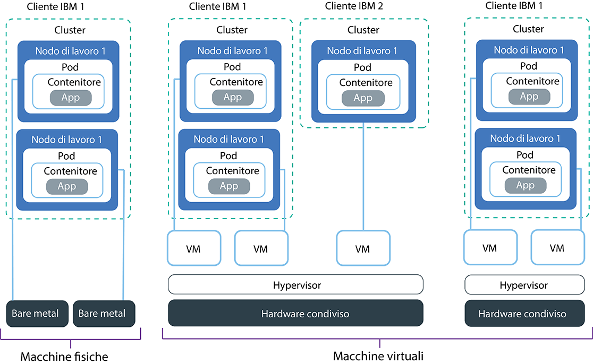

---

copyright:
  years: 2014, 2019
lastupdated: "2019-06-11"

keywords: kubernetes, iks, multi az, multi-az, szr, mzr

subcollection: containers

---

{:new_window: target="_blank"}
{:shortdesc: .shortdesc}
{:screen: .screen}
{:pre: .pre}
{:table: .aria-labeledby="caption"}
{:codeblock: .codeblock}
{:tip: .tip}
{:note: .note}
{:important: .important}
{:deprecated: .deprecated}
{:download: .download}
{:preview: .preview}

# Pianificazione della configurazione dei tuoi nodi di lavoro
{: #planning_worker_nodes}

Un cluster Kubernetes è costituito da nodi di lavoro raggruppati in pool di nodi di lavoro ed è monitorato e gestito centralmente dal master Kubernetes. Gli amministratori del cluster decidono come configurare il cluster di nodi di lavoro per garantire che gli utenti dispongano di tutte le risorse per distribuire ed eseguire applicazioni nel cluster.
{:shortdesc}

Quando crei un cluster standard, nell'infrastruttura IBM Cloud (SoftLayer) vengono ordinati per tuo conto i nodi di lavoro delle stesse specifiche di memoria, CPU e spazio su disco (varietà) e vengono aggiunti al pool di nodi di lavoro predefinito nel tuo cluster. A ogni nodo di lavoro viene
assegnato un ID e nome dominio univoco che non deve essere modificato dopo la creazione del cluster. Puoi scegliere tra server virtuali o fisici (bare metal). A seconda del livello di isolamento hardware che scegli, i nodi di lavoro virtuali possono essere configurati come nodi condivisi o dedicati. Per aggiungere delle varietà differenti al tuo cluster, [crea un altro pool di nodi di lavoro](/docs/containers?topic=containers-cli-plugin-kubernetes-service-cli#cs_worker_pool_create).

Kubernetes limita il numero massimo di nodi di lavoro che puoi avere in un cluster. Controlla [nodo di lavoro e quote pod ](https://kubernetes.io/docs/setup/cluster-large/) per ulteriori informazioni.

Vuoi essere sicuro di avere sempre abbastanza nodi di lavoro per gestire il tuo carico di lavoro? Prova [il cluster autoscaler](/docs/containers?topic=containers-ca#ca).
{: tip}

 

## Hardware disponibile per i nodi di lavoro
{: #shared_dedicated_node}

Quando crei un cluster standard in {{site.data.keyword.Bluemix_notm}}, scegli se i tuoi pool di nodi di lavoro sono costituiti da nodi di lavoro che sono macchine fisiche (bare metal) o macchine virtuali che vengono eseguite su hardware fisico. Puoi anche selezionare la varietà di nodo di lavoro oppure una combinazione di memoria, CPU e altre specifiche macchina quali l'archiviazione disco.
{:shortdesc}

Se vuoi più di una varietà di nodo di lavoro, devi creare un pool di nodi di lavoro per ciascuna varietà. Non puoi ridimensionare i nodi di lavoro esistenti per avere risorse diverse come CPU o memoria. Quando crei un cluster gratuito, viene eseguito automaticamente il provisioning del tuo nodo di lavoro come nodo virtuale condiviso nell'account dell'infrastruttura IBM Cloud (SoftLayer). Nei cluster standard, puoi scegliere il tipo di macchina più adatto al tuo carico di lavoro. Mentre pianifichi, considera le [riserve di risorse del nodo di lavoro](#resource_limit_node) sulla capacità totale di CPU e memoria.

Seleziona una delle seguenti opzioni per decidere quale tipo di pool di nodi di lavoro vuoi.
* [Macchine virtuali](#vm)
* [Macchine fisiche (bare metal)](#bm)
* [Macchine SDS (software-defined storage)](#sds)

## Macchine virtuali
{: #vm}

Con le VM, ottieni maggiore flessibilità, tempi di provisioning più veloci e ulteriori funzioni di scalabilità automatica rispetto ai bare metal, ad un prezzo più conveniente. Puoi utilizzare le VM per casi di utilizzo più generali, quali gli ambienti di sviluppo e test, di preparazione e di produzione, i microservizi e le applicazioni di business. Tuttavia, è un compromesso nelle prestazioni. Se hai bisogno di una potenza di calcolo ad elevate prestazioni per i carichi di lavoro con un utilizzo intensivo di RAM, dati o GPU, utilizza il [bare metal](#bm).
{: shortdesc}

**È meglio se utilizzo hardware condiviso o dedicato?** 
Quando crei un cluster virtuale standard, devi scegliere se desideri che l'hardware sottostante sia condiviso tra più clienti {{site.data.keyword.IBM_notm}} (più tenant) o che sia dedicato solo a te (tenant singolo).

* **In una configurazione di hardware condiviso a più tenant**: le risorse fisiche, quali CPU e memoria, sono condivise tra tutte le macchine virtuali distribuite allo stesso hardware fisico. Per assicurare che ogni macchina virtuale
possa essere eseguita indipendentemente, un monitoraggio della macchina virtuale, conosciuto anche come hypervisor,
divide le risorse fisiche in entità isolate e le alloca come risorse dedicate
a una macchina virtuale (isolamento hypervisor).
* **In una configurazione hardware dedicato a singolo tenant**: tutte le risorse fisiche sono dedicate soltanto a te. Puoi distribuire
più nodi di lavoro come macchine virtuali allo stesso host fisico. In modo analogo alla configurazione a più tenant, l'hypervisor assicura che ogni nodo di lavoro ottenga la propria quota di risorse fisiche disponibili.

I nodi condivisi sono generalmente più economici dei nodi dedicati perché i costi dell'hardware sottostante
sono condivisi tra più clienti. Tuttavia, quando decidi tra nodi condivisi e dedicati,
potresti voler verificare con il tuo dipartimento legale e discutere sul livello di conformità e isolamento dell'infrastruttura
che il tuo ambiente dell'applicazione necessita.

Alcune varietà sono disponibili per un solo tipo di configurazione di tenancy. Ad esempio, le VM `m3c` sono disponibili solo come configurazione di tenancy `shared`.
{: note}

**Quali sono le funzioni generali delle VM?** 
Le macchine virtuali utilizzano il disco locale anziché SAN (Storage Area Networking) per garantire l'affidabilità. I vantaggi dell'affidabilità includono una velocità di elaborazione più elevata durante la serializzazione dei byte sul disco locale e una riduzione del danneggiamento del file system dovuto a errori di rete. Ogni VM offre una velocità di rete di 1000 Mbps, 25 GB di archiviazione disco locale primaria per il file system del sistema operativo e 100 GB di archiviazione disco locale secondaria per dati quali il runtime del contenitore e il `kubelet`. L'archiviazione locale sul nodo di lavoro è solo per l'elaborazione a breve termine e i dischi primari e secondari vengono cancellati quando aggiorni o ricarichi il nodo di lavoro. Per le soluzioni di archiviazione persistente, vedi [Pianificazione di archiviazione persistente altamente disponibile](/docs/containers?topic=containers-storage_planning#storage_planning).

**Cosa succede se utilizzo tipi di macchina precedenti?** 
se il tuo cluster ha tipi di nodo di lavoro `x1c` o Ubuntu 16 `x2c` precedenti obsoleti, puoi[aggiornare il tuo cluster ai nodi di lavoro `x3c`
di Ubuntu 18 ](/docs/containers?topic=containers-update#machine_type).

**Quali tipi di macchina virtuale sono disponibili?** 
I tipi di nodo di lavoro variano in base alla zona. La seguente tabella include la versione più recente di un tipo, ad esempio i tipi di nodi di lavoro Ubuntu 18 `x3c`, invece dei tipi di nodi di lavoro Ubuntu 16 precedenti, `x2c`. Per vedere i tipi di macchina disponibili nella tua zona, esegui `ibmcloud ks machine-types <zone>`. Puoi anche riesaminare i tipi di macchina [bare metal](#bm) o [SDS](#sds) disponibili.

{: #vm-table}
<table>
<caption>Tipi di macchina virtuale disponibili in {{site.data.keyword.containerlong_notm}}.</caption>
<thead>
<th>Nome e caso di utilizzo</th>
<th>Core / Memoria</th>
<th>Disco primario / secondario</th>
<th>Velocità di rete</th>
</thead>
<tbody>
<tr>
<td><strong>Virtuale, u3c.2x4</strong>: utilizza questa VM di dimensione minima per il test rapido, le prove di concetto e altri carichi di lavoro leggeri.</td>
<td>2/4 GB</td>
<td>25/100 GB</td>
<td>1000 Mbps</td>
</tr>
<tr>
<td><strong>Virtuale, b3c.4x16</strong>: seleziona questa VM bilanciata per il test e lo sviluppo e altri carichi di lavoro leggeri.</td>
<td>4/16 GB</td>
<td>25/100 GB</td>
<td>1000 Mbps</td>
</tr>
<tr>
<td><strong>Virtuale, b3c.16x64</strong>: seleziona questa VM bilanciata per carichi di lavoro di dimensione media.</td></td>
<td>16/64 GB</td>
<td>25/100 GB</td>
<td>1000 Mbps</td>
</tr>
<tr>
<td><strong>Virtuale, b3c.32x128</strong>: seleziona questa VM bilanciata per carichi di lavoro medio-grandi, come un database e un sito Web dinamico con molti utenti simultanei.</td>
<td>32/128 GB</td>
<td>25/100 GB</td>
<td>1000 Mbps</td>
</tr>
<tr>
<td><strong>Virtuale, c3c.16x16</strong>: utilizza questo tipo quando vuoi un bilanciamento equilibrato delle risorse di elaborazione provenienti dal nodo di lavoro per carichi di lavoro leggeri.</td>
<td>16/16 GB</td>
<td>25/100 GB</td>
<td>1000 Mbps</td>
</tr><tr>
<td><strong>Virtuale, c3c.16x32</strong>: utilizza questo tipo quando vuoi un rapporto 1:2 tra le risorse di CPU e memoria del nodo di lavoro per carichi di lavoro leggeri o di medie dimensioni.</td>
<td>16/32 GB</td>
<td>25/100 GB</td>
<td>1000 Mbps</td>
</tr><tr>
<td><strong>Virtuale, c3c.32x32</strong>: utilizza questo tipo quando vuoi un bilanciamento equilibrato delle risorse di elaborazione provenienti dal nodo di lavoro per carichi di lavoro di medie dimensioni.</td>
<td>32/32 GB</td>
<td>25/100 GB</td>
<td>1000 Mbps</td>
</tr><tr>
<td><strong>Virtuale, c3c.32x64</strong>: utilizza questo tipo quando vuoi un rapporto 1:2 tra le risorse di CPU e memoria del nodo di lavoro per carichi di lavoro di medie dimensioni.</td>
<td>32/64 GB</td>
<td>25/100 GB</td>
<td>1000 Mbps</td>
</tr>
<tr>
<td><strong>Virtuale, m3c.8x64</strong>: utilizza questo tipo quando vuoi un rapporto 1:8 tra le risorse di CPU e memoria per carichi di lavoro leggeri o di medie dimensioni che richiedono più memoria, così come accade con i database {{site.data.keyword.Db2_on_Cloud_short}}. Disponibile solo a Dallas e come tenancy `--hardware shared`.</td>
<td>8/64 GB</td>
<td>25/100 GB</td>
<td>1000 Mbps</td>
</tr><tr>
<td><strong>Virtuale, m3c.16x128</strong>: utilizza questo tipo quando vuoi un rapporto 1:8 tra le risorse di CPU e memoria per carichi di lavoro di medie dimensioni che richiedono più memoria, così come accade con i database {{site.data.keyword.Db2_on_Cloud_short}}. Disponibile solo a Dallas e come tenancy `--hardware shared`.</td>
<td>16/128 GB</td>
<td>25/100 GB</td>
<td>1000 Mbps</td>
</tr><tr>
<td><strong>Virtuale, m3c.30x240</strong>: utilizza questo tipo quando vuoi un rapporto 1:8 tra le risorse di CPU e memoria per carichi di lavoro di dimensioni da medie a elevate che richiedono più memoria, così come accade con i database {{site.data.keyword.Db2_on_Cloud_short}}. Disponibile solo a Dallas e come tenancy `--hardware shared`.</td>
<td>30/240 GB</td>
<td>25/100 GB</td>
<td>1000 Mbps</td>
</tr>
<tr>
<td><strong>Virtuale, z1.2x4</strong>: utilizza questo tipo quando vuoi che venga creato un nodo di lavoro nei contenitori Hyper Protect sui sistemi IBM Z.</td>
<td>2/4 GB</td>
<td>25/100 GB</td>
<td>1000 Mbps</td>
</tr>
</tbody>
</table>

## Macchine fisiche (bare metal)
{: #bm}

Puoi eseguire il provisioning del tuo nodo di lavoro come server fisico a singolo tenant, indicato anche come bare metal.
{: shortdesc}

**In che modo il bare metal di differenzia dalle VM?** 
Bare metal ti dà accesso diretto alle risorse fisiche sulla macchina, come la memoria o la CPU. Questa configurazione elimina l'hypervisor della macchina virtuale che assegna risorse fisiche alle macchine virtuali eseguite sull'host. Invece, tutte le risorse di una macchina bare metal sono dedicate esclusivamente al nodo di lavoro, quindi non devi preoccuparti degli "elementi di disturbo" che condividono risorse o rallentano le prestazioni. I tipi di macchine fisiche hanno più archiviazione locale rispetto a quelle virtuali e alcune dispongono di RAID per aumentare la disponibilità dei dati. L'archiviazione locale sul nodo di lavoro è solo per l'elaborazione a breve termine e i dischi primari e secondari vengono cancellati quando aggiorni o ricarichi il nodo di lavoro. Per le soluzioni di archiviazione persistente, vedi [Pianificazione di archiviazione persistente altamente disponibile](/docs/containers?topic=containers-storage_planning#storage_planning).

**Oltre ad avere specifiche migliori per le prestazioni, posso fare qualcosa con bare metal che non posso fare con le macchine virtuali?** 
Sì. Con bare metal, puoi abilitare Trusted Compute per verificare possibili tentativi di manomissione dei tuoi nodi di lavoro. Se non abiliti l'attendibilità durante la creazione del cluster, ma vuoi farlo in seguito, puoi usare il [comando](/docs/containers?topic=containers-cli-plugin-kubernetes-service-cli#cs_cluster_feature_enable) `ibmcloud ks feature-enable`. Dopo aver abilitato l'attendibilità, non puoi disabilitarla successivamente. Puoi creare un nuovo cluster senza attendibilità. Per ulteriori informazioni su come funziona l'attendibilità durante il processo di avvio del nodo, vedi [{{site.data.keyword.containerlong_notm}} con Trusted Compute](/docs/containers?topic=containers-security#trusted_compute). Trusted Compute è disponibile per alcuni tipi di macchina bare metal. Quando esegui il [comando](/docs/containers?topic=containers-cli-plugin-kubernetes-service-cli#cs_machine_types) `ibmcloud ks machine-types <zone>`, puoi vedere quali macchine supportano l'attendibilità controllando il campo **Trustable**. Ad esempio, le varietà GPU `mgXc` non supportano Trusted Compute.

Oltre a Trusted Compute, puoi anche sfruttare {{site.data.keyword.datashield_full}} (Beta). {{site.data.keyword.datashield_short}} è integrato con la tecnologia di Intel® Software Guard Extensions (SGX) e Fortanix® in modo che il codice e i dati dei carichi di lavoro del tuo contenitore {{site.data.keyword.Bluemix_notm}} siano protetti durante l'utilizzo. Il codice e i dati dell'applicazione vengono eseguiti in enclavi con protezione avanzata della CPU, che sono aree di memoria attendibili sul nodo di lavoro che proteggono aspetti critici dell'applicazione, aiutando a mantenere il codice e i dati riservati e invariati. Se tu o la tua azienda richiedete la sensibilità dei dati a causa di politiche interne, regolamentazioni governative o requisiti di conformità del settore, questa soluzione potrebbe aiutarvi a passare al cloud. Casi di utilizzo di esempio includono istituzioni finanziarie e sanitarie o paesi con politiche governative che richiedono soluzioni cloud in loco.

**Bare metal sembra essere un'opzione estremamente valida. Cosa mi impedisce di ordinarne uno immediatamente?** 
I server bare metal sono più costosi di quelli virtuali e sono più adatti per le applicazioni ad alte prestazioni che richiedono più risorse e controllo host.

I server bare metal vengono fatturati mensilmente. Se annulli un server bare metal prima della fine del mese, ti viene addebitato il costo fino alla fine di quel mese. Dopo aver ordinato o annullato un server bare metal, il processo viene completato manualmente nel tuo account dell'infrastruttura IBM Cloud (SoftLayer). Pertanto, ci vuole più di un giorno lavorativo per completare questo processo.
{: important}

**Quali tipi di bare metal posso ordinare?** 
I tipi di nodo di lavoro variano in base alla zona. La seguente tabella include la versione più recente di un tipo, ad esempio i tipi di nodi di lavoro Ubuntu 18 `x3c`, invece dei tipi di nodi di lavoro Ubuntu 16 precedenti, `x2c`. Per vedere i tipi di macchina disponibili nella tua zona, esegui `ibmcloud ks machine-types <zone>`. Puoi anche riesaminare i tipi di macchina [VM](#vm) o [SDS](#sds) disponibili.

Le macchine bare metal sono ottimizzate per diversi casi d'uso quali i carichi di lavoro con un utilizzo intensivo di RAM, dati o GPU.

Scegli un tipo di macchina con la configurazione di archiviazione corretta per supportare il tuo carico di lavoro. Alcune varietà hanno una combinazione delle seguenti configurazioni di dischi e archiviazione. Ad esempio, alcune varietà possono avere un disco primario SATA con un disco secondario SSD raw.

* **SATA**: un dispositivo di archiviazione disco a rotazione magnetica che viene spesso utilizzato per il disco primario del nodo di lavoro che memorizza il file system del sistema operativo.
* **SSD**: un dispositivo di archiviazione SSD (solid state drive) per dati ad elevate prestazioni.
* **Raw**: il dispositivo di archiviazione non è formattato; tutta la capacità è disponibile per l'utilizzo.
* **RAID**: il dispositivo di archiviazione ha i dati distribuiti per la ridondanza e prestazioni che variano a seconda del livello RAID. Di conseguenza, la capacità del disco disponibile per l'utilizzo varia.

{: #bm-table}
<table>
<caption>Tipi di macchina bare metal disponibili in {{site.data.keyword.containerlong_notm}}.</caption>
<thead>
<th>Nome e caso di utilizzo</th>
<th>Core / Memoria</th>
<th>Disco primario / secondario</th>
<th>Velocità di rete</th>
</thead>
<tbody>
<tr>
<td><strong>Bare metal con RAM intensiva, mr3c.28x512</strong>: massimizza la disponibilità della RAM dei tuoi nodi di lavoro.</td>
<td>28/512 GB</td>
<td>SATA da 2 TB/SSD da 960 GB</td>
<td>10000 Mbps</td>
</tr>
<tr>
<td><strong>Bare metal GPU, mg3c.16x128</strong>: scegli questo tipo per i carichi di lavoro matematicamente complessi, quale il calcolo ad alte prestazioni, il machine learning o le applicazioni 3D. Questo tipo ha una scheda fisica Tesla K80 con due GPU (graphics processing unit) per scheda per un totale di due GPU.</td>
<td>16/128 GB</td>
<td>SATA da 2 TB/SSD da 960 GB</td>
<td>10000 Mbps</td>
</tr>
<tr>
<td><strong>Bare metal GPU, mg3c.28x256</strong>: scegli questo tipo per i carichi di lavoro matematicamente complessi, quale il calcolo ad alte prestazioni, il machine learning o le applicazioni 3D. Questo tipo ha due schede fisiche Tesla K80 con due GPU per scheda per un totale di quattro GPU.</td>
<td>28/256 GB</td>
<td>SATA da 2 TB/SSD da 960 GB</td>
<td>10000 Mbps</td>
</tr>
<tr>
<td><strong>Bare metal con uso intensivo di dati, md3c.16x64.4x4tb</strong>: utilizza questo tipo per una quantità significativa di archiviazione su disco locale, incluso RAID, per aumentare la disponibilità dei dati, per carichi di lavoro quali file system distribuiti, database di grandi dimensioni e analisi dei big data.</td>
<td>16/64 GB</td>
<td>RAID1 da 2x2 TB/RAID10 SATA da 4x4 TB</td>
<td>10000 Mbps</td>
</tr>
<tr>
<td><strong>Bare metal con uso intensivo di dati, md3c.28x512.4x4tb</strong>: utilizza questo tipo per una quantità significativa di archiviazione su disco locale, incluso RAID, per aumentare la disponibilità dei dati, per carichi di lavoro quali file system distribuiti, database di grandi dimensioni e analisi dei big data.</td>
<td>28/512 GB</td>
<td>RAID1 da 2x2 TB/RAID10 SATA da 4x4 TB</td>
<td>10000 Mbps</td>
</tr>
<tr>
<td><strong>Bare metal bilanciato, mb3c.4x32</strong>: utilizzalo per i carichi di lavoro bilanciati che richiedono risorse di calcolo superiori a quelle offerte dalle macchine virtuali. Questa varietà può anche essere abilitata per Intel® Software Guard Extensions (SGX) in modo che tu possa utilizzare <a href="/docs/services/data-shield?topic=data-shield-getting-started#getting-started" target="_blank">{{site.data.keyword.datashield_short}} (Beta)</a> per crittografare la tua memoria di dati.</td>
<td>4/32 GB</td>
<td>SATA da 2 TB/SATA da 2 TB</td>
<td>10000 Mbps</td>
</tr>
<tr>
<td><strong>Bare metal bilanciato, mb3c.16x64</strong>: utilizzalo per i carichi di lavoro bilanciati che richiedono risorse di calcolo superiori a quelle offerte dalle macchine virtuali.</td>
<td>16/64 GB</td>
<td>SATA da 2 TB/SSD da 960 GB</td>
<td>10000 Mbps</td>
</tr>
<tr>
</tbody>
</table>

## Macchine SDS (software-defined storage)
{: #sds}

Le varietà SDS (software-defined storage) sono macchine fisiche fornite con dischi non formattati aggiuntivi per l'archiviazione locale fisica. A differenza del disco locale primario e secondario, questi dischi non formattati non vengono cancellati durante l'aggiornamento o il ricaricamento del nodo di lavoro. Poiché i dati hanno la stessa ubicazione del nodo di calcolo, le macchine SDS sono adatte per i carichi di lavoro ad alte prestazioni.
{: shortdesc}

**Quando utilizzo i tipi SDS?** 
Di norma utilizzi le macchine SDS nei seguenti casi:
*  Se utilizzi un componente aggiuntivo SDS come [Portworx](/docs/containers?topic=containers-portworx#portworx) nel cluster, usa una macchina SDS.
*  Se la tua applicazione è uno [StatefulSet ](https://kubernetes.io/docs/concepts/workloads/controllers/statefulset/) che richiede l'archiviazione locale, puoi utilizzare le macchine SDS ed eseguire il provisioning di [volumi persistenti locali Kubernetes (beta)](https://kubernetes.io/blog/2018/04/13/local-persistent-volumes-beta/).
*  Potresti avere applicazioni personalizzate che richiedono ulteriore archiviazione locale non elaborata.

Per ulteriori soluzioni di archiviazione, vedi [Pianificazione di archiviazione persistente altamente disponibile](/docs/containers?topic=containers-storage_planning#storage_planning).

**Quali tipi di SDS posso ordinare?** 
I tipi di nodo di lavoro variano in base alla zona. La seguente tabella include la versione più recente di un tipo, ad esempio i tipi di nodi di lavoro Ubuntu 18 `x3c`, invece dei tipi di nodi di lavoro Ubuntu 16 precedenti, `x2c`. Per vedere i tipi di macchina disponibili nella tua zona, esegui `ibmcloud ks machine-types <zone>`. Puoi anche riesaminare i tipi di macchina [bare metal](#bm) o [VM](#vm) disponibili.

Scegli un tipo di macchina con la configurazione di archiviazione corretta per supportare il tuo carico di lavoro. Alcune varietà hanno una combinazione delle seguenti configurazioni di dischi e archiviazione. Ad esempio, alcune varietà possono avere un disco primario SATA con un disco secondario SSD raw.

* **SATA**: un dispositivo di archiviazione disco a rotazione magnetica che viene spesso utilizzato per il disco primario del nodo di lavoro che memorizza il file system del sistema operativo.
* **SSD**: un dispositivo di archiviazione SSD (solid state drive) per dati ad elevate prestazioni.
* **Raw**: il dispositivo di archiviazione non è formattato; tutta la capacità è disponibile per l'utilizzo.
* **RAID**: il dispositivo di archiviazione ha i dati distribuiti per la ridondanza e prestazioni che variano a seconda del livello RAID. Di conseguenza, la capacità del disco disponibile per l'utilizzo varia.

{: #sds-table}
<table>
<caption>Tipi di macchina SDS disponibili in {{site.data.keyword.containerlong_notm}}.</caption>
<thead>
<th>Nome e caso di utilizzo</th>
<th>Core / Memoria</th>
<th>Disco primario / secondario</th>
<th>Dischi non formattati aggiuntivi</th>
<th>Velocità di rete</th>
</thead>
<tbody>
<tr>
<td><strong>Bare metal con SDS, ms3c.4x32.1.9tb.ssd</strong>: se hai bisogno di archiviazione locale supplementare per motivi di prestazioni, utilizza questo tipo dotato di notevole capacità di disco che supporta l'SDS (software-defined storage).</td>
<td>4/32 GB</td>
<td>SATA da 2 TB/SSD da 960 GB</td>
<td>TB raw da 1,9 TB (percorso dispositivo: `/dev/sdc`)</td>
<td>10000 Mbps</td>
</tr>
<tr>
<td><strong>Bare metal con SDS, ms3c.16x64.1.9tb.ssd</strong>: se hai bisogno di archiviazione locale supplementare per motivi di prestazioni, utilizza questo tipo dotato di notevole capacità di disco che supporta l'SDS (software-defined storage).</td>
<td>16/64 GB</td>
<td>SATA da 2 TB/SSD da 960 GB</td>
<td>TB raw da 1,9 TB (percorso dispositivo: `/dev/sdc`)</td>
<td>10000 Mbps</td>
</tr>
<tr>
<td><strong>Bare metal con SDS, ms3c.28x256.3.8tb.ssd</strong>: se hai bisogno di archiviazione locale supplementare per motivi di prestazioni, utilizza questo tipo dotato di notevole capacità di disco che supporta l'SDS (software-defined storage).</td>
<td>28/256 GB</td>
<td>SATA da 2 TB/SSD da 1,9 TB</td>
<td>TB raw da 3,8 TB (percorso dispositivo: `/dev/sdc`)</td>
<td>10000 Mbps</td>
</tr>
<tr>
<td><strong>Bare metal con SDS, ms3c.28x512.4x3.8tb.ssd</strong>: se hai bisogno di archiviazione locale supplementare per motivi di prestazioni, utilizza questo tipo dotato di notevole capacità di disco che supporta l'SDS (software-defined storage).</td>
<td>28/512 GB</td>
<td>SATA da 2 TB/SSD da 1,9 TB</td>
<td>4 dischi, SSD raw da 3,8 TB (percorsi dispositivo: `/dev/sdc`, `/dev/sdd`, `/dev/sde`, `/dev/sdf`)</td>
<td>10000 Mbps</td>
</tr>
</tbody>
</table>

## Riserve di risorse del nodo di lavoro
{: #resource_limit_node}

{{site.data.keyword.containerlong_notm}} imposta riserve di risorse di calcolo che limitano le risorse di calcolo disponibili su ciascun nodo di lavoro. Le risorse di memoria e CPU riservate non possono essere utilizzate dai pod sul nodo di lavoro e riducono le risorse assegnabili su ciascun nodo di lavoro. Quando distribuisci inizialmente i pod, se il nodo di lavoro non dispone di sufficienti risorse assegnabili, la distribuzione non riesce. Inoltre, se i pod superano il limite di risorse del nodo di lavoro, i pod vengono rimossi. In Kubernetes, questo limite è chiamato [soglia di rimozione rigida](https://kubernetes.io/docs/tasks/administer-cluster/out-of-resource/#hard-eviction-thresholds).
{:shortdesc}

Se sono disponibili meno CPU o memoria rispetto alle riserve del nodo di lavoro, Kubernetes inizia a rimuovere i pod per ripristinare risorse di calcolo sufficienti. I pod vengono ripianificati su un altro nodo di lavoro, laddove disponibile. Se i tuoi pod vengono rimossi frequentemente, aggiungi più nodi di lavoro al tuo cluster o imposta i [limiti di risorsa ](https://kubernetes.io/docs/concepts/configuration/manage-compute-resources-container/#resource-requests-and-limits-of-pod-and-container) sui tuoi pod.

Le risorse che sono riservate sul tuo nodo di lavoro dipendono dalla quantità di CPU e memoria con cui viene fornito il tuo nodo di lavoro. {{site.data.keyword.containerlong_notm}} definisce i livelli di memoria e CPU come mostrato nelle seguenti tabelle. Se il tuo nodo di lavoro viene fornito con risorse di calcolo su più livelli, una percentuale delle tue risorse di CPU e memoria è riservata per ogni livello.

Per verificare quante risorse di calcolo sono attualmente utilizzate sul tuo nodo di lavoro, esegui [`kubectl top node` ](https://kubernetes.io/docs/reference/kubectl/overview/#top).
{: tip}

<table summary="Questa tabella mostra le riserve di memoria del nodo di lavoro per livello.">
<caption>Riserve di memoria del nodo di lavoro per livello.</caption>
<thead>
<tr>
  <th>Livello di memoria</th>
  <th>% o quantità riservata</th>
  <th>Esempio di nodo di lavoro `b3c.4x16` (16 GB)</th>
  <th>Esempio di nodo di lavoro `mg1c.28x256` (256 GB)</th>
</tr>
</thead>
<tbody>
<tr>
  <td>Primi 4 GB (0-4 GB)</td>
  <td>25% di memoria</td>
  <td>1 GB</td>
  <td>1 GB</td>
</tr>
<tr>
  <td>Successivi 4 GB (5-8 GB)</td>
  <td>20% di memoria</td>
  <td>0,8 GB</td>
  <td>0,8 GB</td>
</tr>
<tr>
  <td>Successivi 8 GB (9-16 GB)</td>
  <td>10% di memoria</td>
  <td>0,8 GB</td>
  <td>0,8 GB</td>
</tr>
<tr>
  <td>Successivi 112 GB (17-128 GB)</td>
  <td>6% di memoria</td>
  <td>N/D</td>
  <td>6,72 GB</td>
</tr>
<tr>
  <td>GB restanti (129 GB e oltre)</td>
  <td>2% di memoria</td>
  <td>N/D</td>
  <td>2,54 GB</td>
</tr>
<tr>
  <td>Riserva aggiuntiva per la [rimozione `kubelet` ](https://kubernetes.io/docs/tasks/administer-cluster/out-of-resource/)</td>
  <td>100 MB</td>
  <td>100 MB (quantità fissa)</td>
  <td>100 MB (quantità fissa)</td>
</tr>
<tr>
  <td>**Totale riservato**</td>
  <td>**(variabile)**</td>
  <td>**2,7 GB di 16 GB totali**</td>
  <td>**11,96 GB di 256 GB totali**</td>
</tr>
</tbody>
</table>

<table summary="Questa tabella mostra le riserve di CPU del nodo di lavoro per livello.">
<caption>Riserve di CPU del nodo di lavoro per livello.</caption>
<thead>
<tr>
  <th>Livello di CPU</th>
  <th>% riservata</th>
  <th>Esempio di nodo di lavoro `b3c.4x16` (4 core)</th>
  <th>Esempio di nodo di lavoro `mg1c.28x256` (28 core)</th>
</tr>
</thead>
<tbody>
<tr>
  <td>Primo core (Core 1)</td>
  <td>6% di core</td>
  <td>0,06 core</td>
  <td>0,06 core</td>
</tr>
<tr>
  <td>Successivi 2 core (Core 2-3)</td>
  <td>1% di core</td>
  <td>0,02 core</td>
  <td>0,02 core</td>
</tr>
<tr>
  <td>Successivi 2 core (Core 4-5)</td>
  <td>0.5% di core</td>
  <td>0,005 core</td>
  <td>0,01 core</td>
</tr>
<tr>
  <td>Core rimanenti (Core 6+)</td>
  <td>0,25% di core</td>
  <td>N/D</td>
  <td>0,0575 core</td>
</tr>
<tr>
  <td>**Totale riservato**</td>
  <td>**(variabile)**</td>
  <td>**0,085 core di 4 core totali**</td>
  <td>**0,1475 core di 28 core totali**</td>
</tr>
</tbody>
</table>
