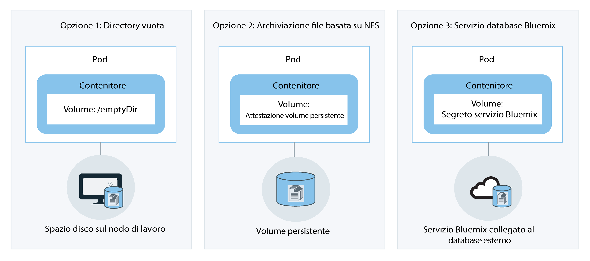

---

copyright:
  years: 2014, 2017
lastupdated: "2017-11-28"

---

{:new_window: target="_blank"}
{:shortdesc: .shortdesc}
{:screen: .screen}
{:pre: .pre}
{:table: .aria-labeledby="caption"}
{:codeblock: .codeblock}
{:tip: .tip}
{:download: .download}


# Pianificazione dei cluster e delle applicazioni
{: #cs_planning}

Scopri quali decisioni puoi prendere per configurare e personalizzare i cluster Kubernetes in {{site.data.keyword.containershort_notm}} e soddisfare i requisiti della tua organizzazione. Alcune di queste configurazioni non possono essere modificate dopo
la creazione di un cluster. Conoscere queste configurazioni in anticipo può garantire che le risorse, quali memoria, spazio su disco e indirizzi IP, siano disponibili per i team di sviluppo secondo necessità.
{:shortdesc}

<br />


## Confronto tra i cluster standard e lite
{: #cs_planning_cluster_type}

Puoi creare cluster lite o standard. Crea i cluster lite per acquisire familiarità e testare le funzionalità di Kubernetes o crea i cluster standard per utilizzare le funzionalità complete di Kubernetes per distribuire le applicazioni.
{:shortdesc}

|Caratteristiche|Cluster lite|Cluster standard|
|---------------|-------------|-----------------|
|[Disponibile in {{site.data.keyword.Bluemix_notm}} pubblico](cs_ov.html#cs_ov)|||
|[Rete in cluster](#cs_planning_private_network)|||
|[Accesso all'applicazione della rete pubblica tramite un servizio NodePort](#cs_nodeport)|||
|[Gestione degli accessi utente](cs_cluster.html#cs_cluster_user)|||
|[Accesso al servizio {{site.data.keyword.Bluemix_notm}} dal cluster e dalle applicazioni](cs_cluster.html#cs_cluster_service)|||
|[Spazio disco sul nodo di lavoro per l'archiviazione](#cs_planning_apps_storage)|||
|[Archiviazione basata sul file NFS persistente con i volumi](#cs_planning_apps_storage)| ||
|[Accesso all'applicazione della rete pubblica o privata tramite un servizio di bilanciamento del carico](#cs_loadbalancer)| ||
|[Accesso all'applicazione della rete pubblica tramite un servizio Ingress](#cs_ingress)| ||
|[Indirizzi IP pubblici portatili](cs_apps.html#cs_cluster_ip_subnet)| ||
|[Registrazione e monitoraggio](cs_cluster.html#cs_logging)| ||
|[Disponibile in {{site.data.keyword.Bluemix_dedicated_notm}} (Beta chiusa)](cs_ov.html#dedicated_environment)| ||
{: caption="Tabella 1. Differenze tra i cluster standard e lite" caption-side="top"}

<br />


## Configurazione del cluster
{: #cs_planning_cluster_config}

Utilizza i cluster standard per aumentare la disponibilità dell'applicazione. I tuoi utenti hanno meno probabilità di
riscontrare tempi di inattività quando distribuisci la configurazione su più nodi di lavoro e cluster. Le funzionalità integrate, come il bilanciamento del carico e l'isolamento, aumentano la resilienza nei confronti di
potenziali errori con host, reti o applicazioni.
{:shortdesc}

Rivedi la configurazione di questi cluster potenziali ordinati per gradi di disponibilità:


1.  Un cluster con più nodi di lavoro
2.  Due cluster in esecuzione in ubicazioni diverse nella stessa regione, ognuno con
più nodi di lavoro
3.  Due cluster in esecuzione in regioni diverse, ognuno con più nodi di lavoro

Ulteriori informazioni su come puoi utilizzare queste tecniche per incrementare la disponibilità del tuo cluster:

<dl>
<dt>Includi abbastanza nodi di lavoro per estendere le istanze dell'applicazione</dt>
<dd>L'elevata disponibilità consente ai tuoi sviluppatori dell'applicazione di estendere i loro contenitori tra più nodi di lavoro per
cluster. Tre nodi di lavoro permettono che si verifichi un tempo di inattività di un nodo di lavoro senza
interrompere l'utilizzo dell'applicazione. Puoi specificare quanti nodi di lavoro da includere quando
crei un cluster dalla GUI [{{site.data.keyword.Bluemix_notm}}](cs_cluster.html#cs_cluster_ui) o dalla CLI [](cs_cluster.html#cs_cluster_cli). Kubernetes limita il numero massimo di nodi di lavoro che puoi avere in un cluster. Controlla [nodo di lavoro e quote pod ](https://kubernetes.io/docs/admin/cluster-large/) per ulteriori informazioni.
<pre class="codeblock">
<code>bx cs cluster-create --location &lt;dal10&gt; --workers 3 --public-vlan &lt;my_public_vlan_id&gt; --private-vlan &lt;my_private_vlan_id&gt; --machine-type &lt;u2c.2x4&gt; --name &lt;my_cluster&gt;</code>
</pre>
</dd>
<dt>Espandi le applicazioni tra i cluster</dt>
<dd>Crea più cluster, ognuno con più nodi di lavoro. Se si verifica un'interruzione con un cluster,
gli utenti possono ancora accedere a un'applicazione che viene distribuita anche in un altro cluster.
<p>Cluster
1:</p>
<pre class="codeblock">
<code>bx cs cluster-create --location &lt;dal10&gt; --workers 3 --public-vlan &lt;my_public_vlan_id&gt; --private-vlan &lt;my_private_vlan_id&gt; --machine-type &lt;u2c.2x4&gt; --name &lt;my_cluster1&gt;</code>
</pre>
<p>Cluster
2:</p>
<pre class="codeblock">
<code>bx cs cluster-create --location &lt;dal12&gt; --workers 3 --public-vlan &lt;my_public_vlan_id&gt; --private-vlan &lt;my_private_vlan_id&gt; --machine-type &lt;u2c.2x4&gt;  --name &lt;my_cluster2&gt;</code>
</pre>
</dd>
<dt>Espandi le applicazioni tra i cluster in regioni differenti</dt>
<dd>Quando espandi le applicazioni tra i cluster in regioni differenti puoi permettere il bilanciamento del carico
basato sulla regione in cui è l'utente. Se il cluster, l'hardware o anche un'intera ubicazione in una regione vengono disattivati, il traffico viene instradato al contenitore distribuito in un'altra ubicazione.
<p><strong>Importante:</strong> dopo
aver configurato il tuo dominio personalizzato, puoi utilizzare questi comandi per creare i cluster.</p>
<p>Ubicazione
1:</p>
<pre class="codeblock">
<code>bx cs cluster-create --location &lt;dal10&gt; --workers 3 --public-vlan &lt;my_public_vlan_id&gt; --private-vlan &lt;my_private_vlan_id&gt; --machine-type &lt;u2c.2x4&gt; --name &lt;my_cluster1&gt;</code>
</pre>
<p>Ubicazione
2:</p>
<pre class="codeblock">
<code>bx cs cluster-create --location &lt;ams03&gt; --workers 3 --public-vlan &lt;my_public_vlan_id&gt; --private-vlan &lt;my_private_vlan_id&gt; --machine-type &lt;u2c.2x4&gt; --name &lt;my_cluster2&gt;</code>
</pre>
</dd>
</dl>

<br />


## Configurazione del nodo di lavoro
{: #cs_planning_worker_nodes}

Un cluster Kubernetes è costituito da nodi di lavoro della macchina virtuale ed è monitorato e gestito
centralmente dal master Kubernetes. Gli amministratori del cluster decidono come configurare il cluster dei nodi
di lavoro per garantire che gli utenti del cluster abbiano tutte le risorse per distribuire ed eseguire le applicazioni nel
cluster.
{:shortdesc}

Quando crei un cluster standard, i nodi di lavoro vengono ordinati nell'infrastruttura IBM Cloud (SoftLayer) e configurati in {{site.data.keyword.Bluemix_notm}}. A ogni nodo di lavoro viene
assegnato un ID e nome dominio univoco che non deve essere modificato dopo la creazione del cluster. A seconda del livello di isolamento hardware che hai scelto,
i nodi di lavoro possono essere configurati come nodi condivisi o dedicati. Viene eseguito il provisioning di ogni nodo di lavoro
con un tipo di macchina specifico che determina il numero di vCPU, memoria
e spazio su disco disponibili per i contenitori distribuiti al nodo di lavoro. Kubernetes limita il numero massimo di nodi di lavoro che puoi avere in un cluster. Controlla [nodo di lavoro e quote pod ](https://kubernetes.io/docs/admin/cluster-large/) per ulteriori informazioni.


### Hardware per i nodi di lavoro
{: #shared_dedicated_node}

Ogni nodo di lavoro è configurato come una macchina virtuale su un hardware fisico. Quando crei un
cluster standard in {{site.data.keyword.Bluemix_notm}} pubblico,
devi scegliere se desideri che l'hardware sottostante sia condiviso tra più clienti {{site.data.keyword.IBM_notm}}
(più tenant) o che sia dedicato solo a te (tenant singolo).
{:shortdesc}

In una configurazione a più tenant, le risorse fisiche, come ad esempio la CPU e la memoria, vengono condivise tra tutte le
macchine virtuali distribuite allo stesso hardware fisico. Per assicurare che ogni macchina virtuale
possa essere eseguita indipendentemente, un monitoraggio della macchina virtuale, conosciuto anche come hypervisor,
divide le risorse fisiche in entità isolate e le alloca come risorse dedicate
a una macchina virtuale (isolamento hypervisor).

In una configurazione a tenant singolo, tutte le risorse fisiche sono dedicate soltanto a te. Puoi distribuire
più nodi di lavoro come macchine virtuali allo stesso host fisico. In modo simile alla configurazione a più tenant,
l'hypervisor assicura che ogni nodo ottenga la propria condivisione di risorse
fisiche disponibili.

I nodi condivisi sono generalmente più economici dei nodi dedicati perché i costi dell'hardware sottostante
sono condivisi tra più clienti. Tuttavia, quando decidi tra nodi condivisi e dedicati,
potresti voler verificare con il tuo dipartimento legale e discutere sul livello di conformità e isolamento dell'infrastruttura
che il tuo ambiente dell'applicazione necessita.

Quando crei un cluster lite, viene automaticamente eseguito il provisioning del tuo nodo di lavoro come nodo condiviso nell'account dell'infrastruttura {{site.data.keyword.IBM_notm}} IBM Cloud (SoftLayer).

Quando crei un cluster in {{site.data.keyword.Bluemix_dedicated_notm}}, viene utilizzata solo una configurazione a tenant singolo e tutte le risorse fisiche sono dedicate soltanto a te. Puoi distribuire
più nodi di lavoro come macchine virtuali sullo stesso host fisico.

<br />


### Limiti di memoria dei nodi di lavoro
{: #resource_limit_node}

{{site.data.keyword.containershort_notm}} imposta un limite di memoria su ogni nodo di lavoro. Quando i pod in esecuzione sul nodo di lavoro superano questo limite di memoria, i pod vengono rimossi. In Kubernetes, questo limite è chiamato [soglia di rimozione rigida](https://kubernetes.io/docs/tasks/administer-cluster/out-of-resource/#hard-eviction-thresholds).

Se i tuoi pod vengono rimossi frequentemente, aggiungi più nodi di lavoro al tuo cluster o imposta i [limiti di risorsa ](https://kubernetes.io/docs/concepts/configuration/manage-compute-resources-container/#resource-requests-and-limits-of-pod-and-container) sui pod.

Ogni tipo di macchina ha una diversa capacità di memoria. Quando sul nodo di lavoro è disponibile meno memoria rispetto alla soglia minima consentita, Kubernetes rimuove immediatamente il pod. Il pod viene ripianificato su un altro nodo di lavoro, laddove disponibile.

|Capacità di memoria del nodo di lavoro|Soglia di memoria minima di un nodo di lavoro|
|---------------------------|------------|
|4 GB  | 256 MB |
|16 GB | 1024 MB |
|64 GB | 4096 MB |
|128 GB| 4096 MB |
|242 GB| 4096 MB |

Per verificare la quantità di memoria utilizzata sul tuo nodo di lavoro, esegui [kubectl top node ](https://kubernetes.io/docs/user-guide/kubectl/v1.8/#top).


## Responsabilità di gestione del cluster
{: #responsibilities}

Controlla le responsabilità che condividi con IBM per gestire i tuoi cluster. Per controllare le responsabilità per i cluster gestiti negli ambienti {{site.data.keyword.Bluemix_dedicated_notm}}, vedi invece [Differenze nella gestione dei cluster tra gli ambienti cloud](cs_ov.html#env_differences).
{:shortdesc}

**IBM è responsabile per:**

- Distribuzione del master, dei nodi di lavoro e della gestione dei componenti nel cluster, come il controller Ingress, al momento della creazione del cluster
- Gestione degli aggiornamenti, dei monitoraggi e del ripristino del master Kubernetes del cluster
- Monitoraggio dell'integrità dei nodi di lavoro e la fornitura dell'automazione dell'aggiornamento e del ripristino di tali nodi di lavoro
- Esecuzione delle attività di automazione nel tuo account dell'infrastruttura, inclusi l'aggiunta e la rimozione dei nodi di lavoro e la creazione di una sottorete predefinita
- Gestione, aggiornamento e ripristino dei componenti operativi nel cluster, come il controller Ingress e il plugin di archiviazione
- Provisioning di volumi di archiviazione quando richiesto dalle attestazioni del volume persistente
- Fornitura delle impostazioni di sicurezza per tutti i nodi di lavoro

<br />
**Tu sei responsabile per:**

- [Distribuzione e gestione delle risorse Kubernetes, come i pod, i servizi e le distribuzioni, all'interno del cluster](cs_apps.html#cs_apps_cli)
- [Utilizzo delle funzionalità del servizio e di Kubernetes per garantire l'elevata disponibilità alle applicazioni](cs_planning.html#highly_available_apps)
- [Aggiunta o rimozione della capacità di utilizzare la CLI per aggiungere o rimuovere i nodi di lavoro](cs_cli_reference.html#cs_worker_add)
- [Creazione delle VLAN pubblica e privata nell'infrastruttura IBM Cloud (SoftLayer) per l'isolamento di rete del tuo cluster ](https://knowledgelayer.softlayer.com/topic/vlans)
- [Verifica che tutti i nodi di lavoro dispongano di connettività di rete all'URL del master Kubernetes](cs_security.html#opening_ports) <p>**Nota**: se un nodo di lavoro ha sia una VLAN pubblica che privata, viene configurata la connettività di rete. Se il nodo di lavoro ha soltanto una rete privata configurata, è necessario un vyatta per fornire la connettività di rete.</p>
- [Aggiornamento di kube-apiserver master e dei nodi di lavoro quando sono disponibili gli aggiornamenti delle versioni principali o secondarie di Kubernetes](cs_cluster.html#cs_cluster_update)
- [Effettuare azioni per ripristinare i nodi di lavoro con problemi eseguendo i comandi `kubectl`, come `cordon` o `drain` ed eseguendo i comandi `bx cs`, come `reboot`, `reload` o `delete`](cs_cli_reference.html#cs_worker_reboot)
- [Aggiunta o rimozione di ulteriori sottoreti nell'infrastruttura IBM Cloud (SoftLayer) secondo necessità](cs_cluster.html#cs_cluster_subnet)
- [Backup e ripristino dei dati nell'archiviazione persistente nell'infrastruttura IBM Cloud (SoftLayer) ](../services/RegistryImages/ibm-backup-restore/index.html#ibmbackup_restore_starter)

<br />


## Distribuzioni
{: #highly_available_apps}

Più ampiamente distribuisci la tua configurazione su più nodi di lavoro e cluster, meno è probabile che
i tuoi utenti riscontrino tempi di inattività con la tua applicazione.
{:shortdesc}

Rivedi queste potenziali configurazioni delle applicazioni ordinate con diversi gradi di
disponibilità:


1.  Una distribuzione con n+2 pod gestiti da una serie di repliche.
2.  Una distribuzione con n+2 pod gestiti da una serie di repliche ed estesi a più nodi
(anti-affinità) nella stessa ubicazione.
3.  Una distribuzione con n+2 pod gestiti da una serie di repliche ed estesi a più nodi
(anti-affinità) in ubicazioni differenti.
4.  Una distribuzione con n+2 pod gestiti da una serie di repliche ed estesi a più nodi
(anti-affinità) in diverse regioni.

Ulteriori informazioni sulle tecniche per incrementare la disponibilità della tua applicazione:

<dl>
<dt>Utilizza le distribuzioni e le serie di repliche per distribuire la tua applicazione e le sue dipendenze.</dt>
<dd>Una distribuzione è una risorsa Kubernetes che puoi utilizzare per dichiarare tutti i componenti della tua applicazione e
le sue dipendenze. Descrivendo i singoli componenti anziché scrivere tutti i passi necessari e
il loro ordine di creazione, puoi concentrarti sull'aspetto che deve avere la tua applicazione quando è
in esecuzione.
</br></br>
Quando distribuisci più di un pod, viene creata automaticamente una serie di repliche per le tue
distribuzioni che monitora i pod e assicura che il numero di pod desiderato sia sempre in
esecuzione. In caso di interruzione di un pod, la serie di repliche sostituisce il pod inattivo con uno nuovo.
</br></br>
Puoi utilizzare una distribuzione per definire le strategie di aggiornamento per la tua applicazione incluso il numero di
pod da aggiungere durante un aggiornamento continuo e il numero di pod che possono non essere disponibili
in un determinato momento. Quando effettui un aggiornamento continuo, la distribuzione controlla che la revisione
funzioni e arresta il rollout quando vengono rilevati degli errori.
</br></br>
Le distribuzioni offrono anche la possibilità
di distribuire contemporaneamente più revisioni con indicatori diversi, per cui puoi, ad esempio, verificare una
distribuzione prima di decidere di metterla in produzione.
</br></br>
Ogni distribuzione tiene traccia delle
revisioni che sono state distribuite. Puoi utilizzare questa cronologia di revisioni per eseguire il rollback a una
versione precedente nel caso in cui riscontri che gli aggiornamenti non funzionano nel modo previsto.</dd>
<dt>Includi repliche sufficienti per il carico di lavoro della tua applicazione, più due</dt>
<dd>Per rendere la tua applicazione ancora più disponibile e più resiliente agli errori, valuta la possibilità di
includere delle repliche aggiuntive rispetto al numero minimo per gestire il carico di lavoro previsto. Le repliche aggiuntive possono gestire
il carico di lavoro se si verifica un arresto anomalo del pod e la serie di repliche non ha ancora ripristinato il pod arrestato. Per
la protezione da due errori simultanei, includi due ulteriori repliche. Questa configurazione è un modello N+2,
dove N è il numero di repliche per gestire il carico di lavoro in entrata e +2 sono le due repliche
aggiuntive. Puoi avere quanti pod desideri in un cluster, finché il cluster dispone di abbastanza spazio per essi.</dd>
<dt>Espandi i pod tra più nodi (anti-affinità)</dt>
<dd>Quando crei la tua distribuzione, ogni pod può essere distribuito allo stesso nodo di lavoro. Questa configurazione
in cui i pod sono presenti sullo stesso nodo di lavoro è nota come affinità o condivisione percorso. Per proteggere la tua applicazione
da un errore del nodo di lavoro, puoi implementare la tua distribuzione per espandere i pod tra più
nodi di lavoro utilizzando l'opzione <strong>podAntiAffinity</strong>. Questa opzione è disponibile solo
per i cluster standard.

</br></br>
<strong>Nota:</strong> il seguente file YAML definisce che ogni pod venga distribuito a un nodo di lavoro differente. Quando il numero di repliche definite è maggiore rispetto ai nodi di lavoro disponibili
nel tuo cluster, viene distribuito solo il numero di repliche che possa rispettare il requisito di
anti-affinità. Tutte le altre repliche rimangono in uno stato di attesa finché non vengono aggiunti ulteriori nodi di lavoro
al cluster.

<pre class="codeblock">
<code>apiVersion: extensions/v1beta1
kind: Deployment
metadata:
  name: wasliberty
spec:
  replicas: 3
  template:
    metadata:
      labels:
        app: wasliberty
    spec:
      affinity:
        podAntiAffinity:
          preferredDuringSchedulingIgnoredDuringExecution:
          - weight: 100
            podAffinityTerm:
              labelSelector:
                matchExpressions:
                - key: app
                  operator: In
                  values:
                  - wasliberty
              topologyKey: kubernetes.io/hostname
      containers:
      - name: wasliberty
        image: registry.&lt;region&gt;.bluemix.net/ibmliberty
        ports:
        - containerPort: 9080
---
apiVersion: v1
kind: Service
metadata:
  name: wasliberty
  labels:
    app: wasliberty
spec:
  ports:
    # the port that this service should serve on
  - port: 9080
  selector:
    app: wasliberty
  type: NodePort</code></pre>

</dd>
<dt>Distribuisci i pod tra più ubicazioni o regioni</dt>
<dd>Per proteggere la tua applicazione da un malfunzionamento di un'ubicazione o di una regione, puoi creare un secondo cluster in un'altra ubicazione o regione e utilizzare un YAML di distribuzione per distribuire una serie di repliche duplicata per la tua applicazione. Aggiungendo una rotta condivisa e un programma di bilanciamento del carico davanti ai tuoi cluster, puoi distribuire il tuo carico di lavoro tra le ubicazioni e regioni. Per ulteriori informazioni sulla condivisione di una rotta tra i cluster, vedi <a href="cs_cluster.html#cs_cluster" target="_blank">Elevata disponibilità dei cluster</a>.

Per ulteriori dettagli, riesamina le opzioni per le <a href="cs_planning.html#cs_planning_cluster_config" target="_blank">distribuzioni ad alta disponibilità</a>.</dd>
</dl>


### Distribuzione dell'applicazione minima
{: #minimal_app_deployment}

Una distribuzione di base dell'applicazione in un cluster lite o standard può includere i seguenti componenti.
{:shortdesc}


Per distribuire i componenti per un'applicazione minima come illustrato nel diagramma, puoi utilizzare un file di configurazione simile al seguente esempio:
```
apiVersion: extensions/v1beta1
kind: Deployment
metadata:
  name: ibmliberty
spec:
  replicas: 1
  template:
    metadata:
      labels:
        app: ibmliberty
    spec:
      containers:
      - name: ibmliberty
        image: registry.<region>.bluemix.net/ibmliberty:latest
---
apiVersion: v1
kind: Service
metadata:
  name: ibmliberty-service
  labels:
    app: ibmliberty
spec:
  selector:
    run: ibmliberty
  type: NodePort
  ports:
   - protocol: TCP
     port: 9080
```
{: codeblock}

Per ulteriori informazioni su ciascun componente, consulta i [Principi di base di Kubernetes](cs_ov.html#kubernetes_basics).

<br />


## Rete in cluster
{: #cs_planning_private_network}

La comunicazione di rete in cluster protetta tra i nodi di lavoro e i pod viene realizzata mediante le VLAN (virtual local area network) private. Una VLAN configura un gruppo di
nodi di lavoro come se fossero collegati con lo stesso cavo fisico.
{:shortdesc}

Quando crei un cluster, ogni cluster viene automaticamente collegato a una VLAN privata. La VLAN privata
determina l'indirizzo IP privato assegnato a un nodo di lavoro durante la creazione del cluster.

|Tipo di cluster|Gestore della VLAN privata del cluster|
|------------|-------------------------------------------|
|Cluster lite in {{site.data.keyword.Bluemix_notm}} pubblico|{{site.data.keyword.IBM_notm}}|
|Cluster standard {{site.data.keyword.Bluemix_notm}} pubblico|Tu nel tuo account dell'infrastruttura IBM Cloud (SoftLayer) <p>**Suggerimento:** per avere accesso a tutte le VLAN nel tuo account, attiva lo [Spanning della VLAN ](https://knowledgelayer.softlayer.com/procedure/enable-or-disable-vlan-spanning).</p>|
|Cluster standard in {{site.data.keyword.Bluemix_dedicated_notm}}|{{site.data.keyword.IBM_notm}}|
{: caption="Tabella 2. Responsabilità di gestione della VLAN privata" caption-side="top"}

A tutti i pod distribuiti a un nodo di lavoro viene assegnato anche un indirizzo IP privato. Ai pod viene assegnato
un IP nell'intervallo di indirizzi privati 172.30.0.0/16 e sono instradati solo tra i nodi di lavoro. Per evitare conflitti, non utilizzare questo intervallo di IP sui nodi che comunicheranno con i tuoi nodi di lavoro. I pod e i nodi di lavoro possono comunicare in modo sicuro nella rete privata utilizzando gli indirizzi IP
privati. Tuttavia, quando un pod ha un arresto anomalo o un nodo di lavoro deve essere ricreato, viene assegnato un nuovo
indirizzo IP.

Poiché è difficile tenere traccia degli indirizzi IP privati mutevoli per le applicazioni che devono essere ad alta disponibilità, puoi utilizzare le funzioni di rilevamento del servizio Kubernetes integrate ed esporre le applicazioni come servizi IP cluster sulla rete privata nel cluster. Un servizio Kubernetes raggruppa una serie
di pod e fornisce la connessione di rete a tali pod per altri servizi nel cluster senza
esporre l'indirizzo IP privato di ogni pod. Quando crei un servizio IP cluster, a esso viene assegnato un indirizzo IP privato dall'intervallo di
indirizzi privati 10.10.10.0/24. Analogamente all'intervallo di indirizzi privati del pod, non utilizzare questo intervallo di IP sui nodi che comunicheranno con i tuoi nodi di lavoro. Questo indirizzo IP è accessibile soltanto all'interno del cluster. Non puoi
accedere a questo indirizzo IP da internet. Contemporaneamente, viene creata una voce di ricerca DNS per il servizio
e archiviata nel componente kube-dns del cluster. La voce DNS contiene il nome del servizio,
lo spazio dei nomi in cui è stato creato il servizio e il link all'indirizzo IP del cluster privato assegnato.

Se un'applicazione nel cluster deve accedere a un pod che si trova dietro un servizio IP cluster,
può utilizzare l'indirizzo IP del cluster privato assegnato al servizio o inviare una richiesta utilizzando
il nome del servizio. Quando utilizzi il nome del servizio, il nome viene ricercato nel componente
kube-dns e instradato all'indirizzo IP del cluster privato del servizio. Quando una richiesta raggiunge il servizio,
questo si assicura che tutte le richieste siano ugualmente inoltrate ai pod,
indipendentemente dai loro indirizzi IP privati e che al nodo di lavoro a cui sono distribuiti.

Per ulteriori informazioni su come creare servizio del tipo di IP
cluster, consulta [Servizi Kubernetes ](https://kubernetes.io/docs/concepts/services-networking/service/#publishing-services---service-types).

<br />


## Rete pubblica
{: #cs_planning_public_network}

Quando crei un cluster, ogni cluster deve essere collegato a una VLAN pubblica. La VLAN pubblica
determina l'indirizzo IP pubblico assegnato a un nodo di lavoro durante la creazione del cluster.
{:shortdesc}

L'interfaccia di rete pubblica dei nodi di lavoro nei cluster lite e standard è protetta dalle politiche di rete Calico. Queste politiche bloccano la maggior parte del traffico in entrata per impostazione predefinita, incluso SSH. Tuttavia, è consentito il traffico in entrata necessario al funzionamento di Kubernetes, così come le connessioni ai servizi NodePort, Loadbalancer e Ingress. Per ulteriori informazioni su queste politiche, incluso il modo di modificarle, consulta [Politiche di rete](cs_security.html#cs_security_network_policies).

|Tipo di cluster|Gestore della VLAN pubblica del cluster|
|------------|------------------------------------------|
|Cluster lite in {{site.data.keyword.Bluemix_notm}} pubblico|{{site.data.keyword.IBM_notm}}|
|Cluster standard {{site.data.keyword.Bluemix_notm}} pubblico|Tu nel tuo account dell'infrastruttura IBM Cloud (SoftLayer) |
|Cluster standard in {{site.data.keyword.Bluemix_dedicated_notm}}|{{site.data.keyword.IBM_notm}}|
{: caption="Tabella 3. Responsabilità di gestione della VLAN" caption-side="top"}

A seconda che il cluster da te creato sia lite o standard,
puoi scegliere tra le seguenti opzioni per esporre un'applicazione al pubblico.

-   [Servizio NodePort](#cs_nodeport) (cluster lite e standard)
-   [Servizio LoadBalancer](#cs_loadbalancer) (solo cluster standard)
-   [Ingress](#cs_ingress) (solo cluster
standard)


### Esponi un'applicazione a Internet utilizzando un servizio NodePort
{: #cs_nodeport}

Esponi una porta pubblica sul tuo nodo di lavoro e utilizza l'indirizzo IP pubblico del nodo di lavoro per accedere al tuo servizio nel cluster pubblicamente da Internet.
{:shortdesc}

Quando esponi la tua applicazione creando un servizio Kubernetes del tipo NodePort, vengono assegnati al servizio
una NodePort nell'intervallo 30000 - 32767 e un indirizzo
IP del cluster interno. Il servizio
NodePort funge da punto di ingresso per le richieste in entrata per la tua applicazione. La NodePort assegnata è pubblicamente esposta nelle impostazioni kubeproxy di ogni nodo di lavoro nel
cluster. Ogni nodo di lavoro inizia ad ascoltare dalla NodePort assegnata per le richieste in entrata per il
servizio. Per accedere al servizio da internet, puoi utilizzare l'indirizzo IP pubblico di ogni nodo di lavoro
che è stato assegnato durante la creazione del cluster e la NodePort nel formato `<ip_address>:<nodeport>`. In aggiunta all'indirizzo IP pubblico, è disponibile un servizio NodePort nell'indirizzo IP privato di un nodo di lavoro.

Il seguente diagramma mostra come viene diretta la comunicazione da Internet a un'applicazione quando è configurato un servizio NodePort.


Come illustrato nel diagramma, quando una richiesta arriva al servizio NodePort, viene automaticamente inoltrata all'IP del cluster interno del servizio e quindi inoltrata dal componente `kube-proxy` all'indirizzo IP privato del pod in cui viene distribuita l'applicazione. L' IP del cluster
è accessibile soltanto all'interno del cluster. Se hai più repliche della tua applicazione in esecuzione in diversi pod, il componente `kube-proxy` bilancia il carico delle richieste in entrata tra tutte le repliche.

**Nota:** l'indirizzo IP pubblico del nodo di lavoro non è permanente. Quando un nodo di lavoro viene rimosso
o ricreato, a tale nodo viene assegnato un nuovo indirizzo IP pubblico. Puoi utilizzare NodePort per verificare l'accesso pubblico per la tua applicazione
o se l'accesso pubblico è richiesto solo per un breve periodo. Quando hai bisogno di un indirizzo IP pubblico stabile
e di una maggiore disponibilità per il tuo servizio, esponi la tua applicazione utilizzando un [Servizio LoadBalancer](#cs_loadbalancer) o [Ingress](#cs_ingress).

Per ulteriori informazioni su come creare servizio del tipo NodePort con {{site.data.keyword.containershort_notm}}, consulta
[Configurazione dell'accesso pubblico a un'applicazione utilizzando il tipo di servizio NodePort](cs_apps.html#cs_apps_public_nodeport).


### Esponi un'applicazione a Internet utilizzando un servizio LoadBalancer
{: #cs_loadbalancer}

Esponi una porta e utilizza un indirizzo IP pubblico o privato per il programma di bilanciamento del carico per accedere
all'applicazione.
{:shortdesc}


Quando crei un cluster standard, {{site.data.keyword.containershort_notm}} richiede automaticamente cinque indirizzi IP pubblici portatili e cinque privati portatili e li fornisce nel tuo account dell'infrastruttura IBM Cloud (SoftLayer) durante la creazione del cluster. Due degli indirizzi IP portatili, uno pubblico e uno privato, vengono utilizzati per il [controller Ingress](#cs_ingress). Possono essere utilizzati quattro indirizzi IP privati e pubblici portatili per esporre le applicazioni creando un servizio LoadBalancer.

Quando crei un servizio Kubernetes LoadBalancer in un cluster in una VLAN pubblica, viene creato
un programma di bilanciamento del carico esterno. Uno dei quattro indirizzi IP pubblici disponibili viene assegnato al programma di bilanciamento del carico. Se non è disponibile alcun indirizzo IP pubblico portatile,
è impossibile creare il tuo servizio LoadBalancer. Il servizio
LoadBalancer funge da punto di ingresso per le richieste in entrata per l'applicazione. A differenza dei servizi NodePort, puoi assegnare una qualsiasi porta al tuo programma di bilanciamento del carico
e non è associato a un dato intervallo di porte. L'indirizzo IP pubblico portatile assegnato al tuo servizio
LoadBalancer è permanente e non viene modificato quando un nodo di lavoro viene rimosso
o ricreato. Pertanto, il servizio LoadBalancer è più disponibile del servizio NodePort. Per accedere al servizio LoadBalancer da internet,
utilizza l'indirizzo IP pubblico del tuo programma di bilanciamento del carico e la porta assegnata nel formato `<ip_address>:<port>`.

Il seguente diagramma mostra come LoadBalancer dirige la comunicazione da Internet a un'applicazione:


Come illustrato nel diagramma, quando una richiesta arriva al servizio LoadBalancer, viene automaticamente inoltrata all'indirizzo IP del cluster interno che è stato assegnato al servizio LoadBalancer durante la creazione del servizio. L'indirizzo IP del cluster
è accessibile soltanto all'interno del cluster. Dall'indirizzo IP del cluster,
le richieste in entrata sono ulteriormente inoltrate al componente `kube-proxy` del tuo nodo di lavoro. Viene poi inoltrata all'indirizzo IP privato della cella dove l'applicazione è distribuita. Se hai più repliche della tua applicazione in esecuzione in diversi pod,
il componente `kube-proxy` bilancia il carico delle richieste in entrata tra tutte le repliche.

Se utilizzi un servizio LoadBalancer, è disponibile anche una porta del nodo per ogni indirizzo IP di ogni nodo di lavoro. Per bloccare l'accesso alla porta del nodo mentre stai utilizzando un servizio LoadBalancer, consulta [Blocco del traffico in entrata](cs_security.html#cs_block_ingress).

Le opzioni di indirizzi IP quando crei un servizio LoadBalancer sono le seguenti:

- Se il tuo cluster è su una VLAN pubblica, viene utilizzato un indirizzo IP pubblico portatile.
- Se il tuo cluster è disponibile solo su una VLAN privata, viene quindi utilizzato un indirizzo IP privato portatile.
- Puoi richiedere un indirizzo IP pubblico o privato portatile per un servizio LoadBalancer aggiungendo un'annotazione al file di configurazione: `service.kubernetes.io/ibm-load-balancer-cloud-provider-ip-type: <public_or_private>`.

Per ulteriori informazioni su come creare servizio LoadBalancer con {{site.data.keyword.containershort_notm}}, consulta [Configurazione dell'accesso pubblico a un'applicazione utilizzando il tipo di servizio LoadBalancer](cs_apps.html#cs_apps_public_load_balancer).

### Esponi un'applicazione a Internet con Ingress
{: #cs_ingress}

Ingress ti consente di esporre più servizi nel tuo cluster e di renderli pubblicamente disponibili
utilizzando un unico punto di ingresso pubblico.
{:shortdesc}

Anziché creare un servizio di bilanciamento del carico per ogni applicazione che vuoi esporre al pubblico,
Ingress fornisce una rotta pubblica univoca che ti consente di inoltrare richieste pubbliche ad applicazioni all'interno e
all'esterno del tuo cluster in base ai loro percorsi individuali. Ingress è costituito da due componenti principali. La
risorsa Ingress definisce le regole su come instradare le richieste in entrata per un'applicazione. Tutte le risorse Ingress
devono essere registrate con il controller Ingress che è in ascolto delle richieste del servizio HTTP o HTTPS e inoltra le richieste in base alle regole definite per
ogni risorsa Ingress.

Quando crei un cluster standard, {{site.data.keyword.containershort_notm}} crea automaticamente un controller Ingress altamente disponibile
per il tuo cluster e gli assegna una rotta pubblica univoca con il
formato `<cluster_name>.<region>.containers.mybluemix.net`. La rotta pubblica è collegata a un indirizzo IP pubblico portatile che viene fornito nel tuo account dell'infrastruttura IBM Cloud (SoftLayer) durante la creazione del cluster.

Il seguente diagramma mostra come Ingress dirige la comunicazione da Internet a un'applicazione:


Per esporre un'applicazione tramite Ingress, devi creare un servizio Kubernetes per la tua applicazione e registrare questo
servizio con il controller Ingress definendo una risorsa Ingress. La risorsa Ingress specifica
il percorso che vuoi aggiungere alla rotta pubblica per formare un URL univoco per la tua applicazione esposta,
come ad esempio: `mycluster.us-south.containers.mybluemix.net/myapp`. Quando immetti questa rotta nel tuo browser web, come illustrato nel diagramma, la richiesta viene inviata all'indirizzo IP pubblico portatile collegato del controller Ingress. Il controller Ingress verifica se esiste una regola di instradamento per il percorso `myapp`
nel cluster `mycluster`. Se viene trovata una regola corrispondente, la richiesta che include
il percorso individuale viene inoltrata al pod in cui viene distribuita l'applicazione, considerando le regole
che sono state definite nell'oggetto della risorsa Ingress originale. Per consentire all'applicazione di elaborare le richieste in entrata,
assicurati che la tua applicazione sia in ascolto nel percorso individuale definito nella risorsa Ingress.

Puoi configurare il controller Ingress per gestire il traffico di rete in entrata per le tue applicazioni per i seguenti
scenari:

-   Utilizzare il dominio fornito da IBM senza la terminazione TLS
-   Utilizzare il dominio fornito da IBM e il certificato TLS con la terminazione TLS
-   Utilizzare il dominio personalizzato e il certificato TLS per fornire la terminazione TLS
-   Utilizzare il dominio fornito da IBM o il dominio personalizzato e i certificati TLS per accedere alle applicazioni all'esterno del
tuo cluster
-   Aggiungi funzionalità al tuo controller Ingress utilizzando le annotazioni

Per ulteriori informazioni su come utilizzare Ingress con {{site.data.keyword.containershort_notm}}, consulta
[Configurazione dell'accesso pubblico a un'applicazione utilizzando il controller Ingress](cs_apps.html#cs_apps_public_ingress).

<br />


## Gestione degli accessi utente
{: #cs_planning_cluster_user}

Puoi concedere l'accesso a un cluster per altri utenti nella tua organizzazione per assicurarti che
solo gli utenti autorizzati possano utilizzare il cluster e distribuire le applicazioni al cluster.
{:shortdesc}

Per ulteriori informazioni, consulta [Gestione degli utenti e dell'accesso a un cluster in {{site.data.keyword.containershort_notm}}](cs_cluster.html#cs_cluster_user).

<br />


## Registri immagini
{: #cs_planning_images}

Un'immagine Docker è la base per ogni contenitore che crei. Un'immagine viene creata da un
Dockerfile, che è un file che contiene le istruzioni per creare l'immagine. Nelle sue istruzioni, un Dockerfile potrebbe
fare riferimento alle risorse di build che vengono memorizzate separatamente, quali ad esempio un'applicazione, la configurazione
dell'applicazione e le relative dipendenze.
{:shortdesc}

Le immagini normalmente vengono archiviate in un registro ed è possibile accedervi pubblicamente (registro pubblico)
o configurarle con un accesso limitato a un piccolo gruppo di utenti (registro privato). I registri pubblici,
come Docker Hub possono essere utilizzati come un'introduzione di Docker e Kubernetes per creare la tua prima
applicazione inserita in un contenitore in un cluster. Nel caso però di applicazioni aziendali, utilizza un registro privato,
come quello fornito in {{site.data.keyword.registryshort_notm}}, per proteggere le tue immagini dall'essere utilizzate e modificate da utenti non autorizzati. I registri privati
devono essere configurati dall'amministratore del cluster per assicurare che le credenziali di accesso al registro privato
siano disponibili agli utenti del cluster.

Puoi utilizzare più registri con {{site.data.keyword.containershort_notm}} per distribuire le applicazioni al tuo cluster.

|Registro|Descrizione|Vantaggi|
|--------|-----------|-------|
|[{{site.data.keyword.registryshort_notm}}](/docs/services/Registry/index.html)|Con questa opzione, puoi configurare il tuo proprio repository delle immagini Docker protetto in {{site.data.keyword.registryshort_notm}}
dove puoi archiviare e condividere le immagini in sicurezza tra gli utenti del cluster.|<ul><li>Gestisci l'accesso alle immagini nel tuo account.</li><li>Utilizza le applicazioni di esempio e le immagini fornite da
{{site.data.keyword.IBM_notm}}, come {{site.data.keyword.IBM_notm}} Liberty, come immagine principale e aggiungi il tuo proprio codice
ad esse.</li><li>Scansione automatica delle immagini per vulnerabilità potenziali dal Controllo vulnerabilità, incluse
le raccomandazioni di correzione specifiche del sistema operativo.</li></ul>|
|Ogni altro registro privato|Collega qualsiasi registro privato esistente al tuo cluster creando un [imagePullSecret ](https://kubernetes.io/docs/concepts/containers/images/). Il segreto viene utilizzato
per salvare in modo sicuro le tue credenziali e il tuo URL del registro in un segreto Kubernetes.|<ul><li>Utilizza i registri privati esistenti indipendentemente dalle loro origini (Docker Hub, registri di proprietà dell'organizzazione
o altri registri cloud privati).</li></ul>|
|Docker Hub pubblico|Utilizza questa opzione per utilizzare direttamente le immagini pubbliche esistenti da Docker Hub quando non è necessaria alcuna
modifica al Dockerfile. <p>**Nota:** tieni presente che questa opzione non rispetta i requisiti di sicurezza della tua organizzazione,
come la gestione dell'accesso, la scansione di vulnerabilità o la privacy dell'applicazione.</p>|<ul><li>Non è necessaria alcuna ulteriore configurazione per il tuo cluster.</li><li>Include varie applicazioni open source.</li></ul>|
{: caption="Tabella 4. Opzioni del registro delle immagini privato e pubblico" caption-side="top"}

Dopo che hai configurato un registro immagini, gli utenti del cluster possono utilizzare le immagini per le loro distribuzioni dell'applicazione al cluster.

Per ulteriori informazioni su come accedere al registro privato o pubblico e utilizzare un'immagine per creare
il tuo contenitore, consulta [Utilizzo dei registri di immagini pubblici e privati con {{site.data.keyword.containershort_notm}}](cs_cluster.html#cs_apps_images).

<br />


## Archivio di dati persistenti
{: #cs_planning_apps_storage}

Un contenitore è, come progettato, di breve durata. Tuttavia, come mostrato nel seguente diagramma, puoi scegliere diverse opzioni per conservare i dati nel caso di un failover del contenitore e per condividerli tra i contenitori.
{:shortdesc}



|Opzione|Descrizione|
|------|-----------|
|Opzione 1: Utilizza `/emptyDir` per conservare i dati utilizzando lo spazio su disco disponibile
nel nodo di lavoro<p>Questa funzione è disponibile i cluster lite e standard.</p>|Con questa opzione, puoi creare un volume vuoto nello spazio su disco del tuo nodo di lavoro assegnato
a un pod. Il contenitore in tale pod può leggere e scrivere in tale volume. Poiché il volume è assegnato
a un pod specifico, i dati non possono essere condivisi con altri pod in una serie di repliche.<p>Un volume `/emptyDir` e i relativi dati vengono rimossi quando il pod assegnato
viene eliminato definitivamente dal nodo di lavoro.</p><p>**Nota:** se il contenitore nel pod ha un arresto anomalo, i dati
nel volume sono ancora disponibili nel nodo di lavoro.</p><p>Per ulteriori informazioni, consulta [Volumi Kubernetes ](https://kubernetes.io/docs/concepts/storage/volumes/).</p>|
|Opzione 2: crea un'attestazione di un volume persistente per eseguire il provisioning dell'archivio persistente basato su NFS per la tua distribuzione<p>Questa funzione è disponibile solo per i cluster standard.</p>|Con questa opzione, disponi dell'archiviazione persistente dei dati del contenitore e dell'applicazione tramite un numero illimitato di volumi persistenti. Crea un'[attestazione di un volume persistente](cs_apps.html)
per inizializzare una richiesta per l'archivio file basato su NFS. {{site.data.keyword.containershort_notm}} fornisce classi di archiviazione predefinite che
definiscono l'intervallo di dimensioni dell'archivio, gli IOPS e le autorizzazioni di scrittura e lettura per il volume. Puoi
scegliere tra queste classi di archiviazione quando crei la tua attestazione del volume persistente. Dopo che hai inoltrato un'attestazione di volume persistente, {{site.data.keyword.containershort_notm}} esegue automaticamente il provisioning di un volume persistente
ospitato su un archivio file basato su NFS.[ Puoi montare
l'attestazione di volume persistente](cs_apps.html#cs_apps_volume_claim) come un volume sul tuo pod per consentire al contenitore nel tuo pod di scrivere nel volume e leggere da esso. I volumi persistenti
possono essere condivisi tra i pod nella stessa serie di repliche o con altri pod nello stesso cluster.<p>Quando un
contenitore ha un arresto anomalo o viene rimosso un pod da un nodo di lavoro, i dati non vengono rimossi ed è ancora possibile accedervi
da altri pod che montano il volume. Le attestazioni del volume persistente sono ospitate su un'archiviazione persistente ma non dispongono di backup. Se richiedi un backup
dei tuoi dati, crea un backup manuale.</p><p>**Nota:** l'archivio di condivisione file NFS
viene addebitato su base mensile. Se esegui il provisioning dell'archivio persistente del tuo cluster e lo rimuovi immediatamente,
devi comunque pagare l'addebito mensile per l'archiviazione persistente, anche se lo hai utilizzato
solo per un breve periodo di tempo.</p>|
|Opzione 3: eseguire il bind di un servizio di database {{site.data.keyword.Bluemix_notm}} al tuo pod<p>Questa funzione è disponibile i cluster lite e standard.</p>|Con questa opzione, puoi conservare i dati e accedervi utilizzando servizio cloud del database {{site.data.keyword.Bluemix_notm}}. Quando esegui il bind del servizio
{{site.data.keyword.Bluemix_notm}} a uno spazio dei nomi nel tuo
cluster, viene creato un segreto Kubernetes. Il segreto Kubernetes ospita informazioni confidenziali sul servizio,
come ad esempio l'URL del servizio, i tuoi nome utente e password. Puoi montare il segreto
come un volume segreto nel tuo pod e accedere al servizio utilizzando le credenziali nel segreto. Montando il volume segreto in altri pod, puoi inoltre condividere i dati tra i pod.<p>Quando un
contenitore ha un arresto anomalo o viene rimosso un pod da un nodo di lavoro, i dati non vengono rimossi ed è ancora possibile accedervi
da altri pod che montano il volume segreto.</p><p>Alcuni servizi database {{site.data.keyword.Bluemix_notm}} forniscono spazio su disco
per una piccola quantità di dati gratuitamente, in questo modo puoi verificarne le funzioni.</p><p>Per ulteriori informazioni su come eseguire il bind di un servizio {{site.data.keyword.Bluemix_notm}} a un pod, vedi [Aggiunta di servizi {{site.data.keyword.Bluemix_notm}} per le applicazioni in {{site.data.keyword.containershort_notm}}](cs_apps.html#cs_apps_service).</p>|
{: caption="Tabella 5. Opzioni di archivio di dati persistenti per le distribuzioni nei cluster Kubernetes" caption-side="top"}

<br />


## Integrazioni
{: #cs_planning_integrations}

Puoi utilizzare diversi servizi esterni e servizi nel catalogo {{site.data.keyword.Bluemix_notm}} con un cluster standard
in {{site.data.keyword.containershort_notm}}.
{:shortdesc}

<table summary="Riepilogo dell'accessibilità">
<caption>Tabella 6. Opzioni di integrazione per i cluster e le applicazioni in Kubernetes</caption>
<thead>
<tr>
<th>Servizio</th>
<th>Descrizione</th>
</tr>
</thead>
<tbody>
<tr>
<td>Blockchain</td>
<td>Distribuisci un ambiente di sviluppo pubblicamente per IBM Blockchain a un cluster Kubernetes in {{site.data.keyword.containerlong_notm}}. Utilizza questo ambiente per sviluppare e personalizzare la tua propria rete blockchain per distribuire le applicazioni che condividono un ledger immutabile per la registrazione della cronologia delle transazioni. Per ulteriori informazioni, consulta
<a href="https://ibm-blockchain.github.io" target="_blank">Sviluppa in un sandbox cloud della piattaforma
IBM Blockchain </a>. </td>
</tr>
<tr>
<td>Fornitura continua</td>
<td>Automatizza le creazioni delle tue applicazioni e le distribuzioni ai cluster Kubernetes utilizzando una toolchain. Per informazioni sulla configurazione, consulta il blog <a href="https://developer.ibm.com/recipes/tutorials/deploy-kubernetes-pods-to-the-bluemix-container-service-using-devops-pipelines/" target="_blank">Deploy Kubernetes pods to the {{site.data.keyword.containerlong_notm}} using DevOps Pipelines </a>. </td>
</tr>
<tr>
<td>Helm</td>
<td> <a href="https://helm.sh/" target="_blank">Helm </a> è un gestore del pacchetto Kubernetes. Crea i grafici Helm per definire, installare e aggiornare le applicazioni Kubernetes complesse in esecuzione nei cluster {{site.data.keyword.containerlong_notm}}. Ulteriori informazioni su come puoi <a href="https://developer.ibm.com/recipes/tutorials/increase-deployment-velocity-with-kubernetes-helm-charts/" target="_blank">aumentare la velocità di distribuzione con i grafici Kubernetes</a>. </td>
</tr>
<tr>
<td>Instana</td>
<td> <a href="https://www.instana.com/" target="_blank">Instana </a> fornisce il monitoraggio delle prestazioni di infrastruttura e applicazioni con una GUI che rileva e associa automaticamente le tue applicazioni. Inoltre, Istana cattura ogni richiesta alle tue applicazioni, che ti consente di risolvere i problemi ed eseguire l'analisi delle cause principali per evitare che i problemi si ripetano. Per ulteriori informazioni, controlla il post del blog relativo alla <a href="https://www.instana.com/blog/precise-visibility-applications-ibm-bluemix-container-service/" target="_blank">distribuzione di Istana in {{site.data.keyword.containershort_notm}} </a>. </td>
</tr>
<tr>
<td>Istio</td>
<td>Istio è un servizio open source che offre agli sviluppatori un modo per connettere, proteggere, gestire e monitorare una rete di microservizi, nota anche come rete (mesh) di servizi, su piattaforme di orchestrazione cloud come Kubernetes. Istio fornisce la funzionalità per gestire il traffico di rete, bilanciare il carico tra i microservizi, implementare politiche di accesso e verificare l'identità dei servizi sulla rete di servizi. Per installare Istio sul tuo cluster Kubernetes in {{site.data.keyword.containershort_notm}}, consulta
l'<a href="https://istio.io/docs/tasks/installing-istio.html" target="_blank">argomento di installazione </a> nella documentazione Istio. Per riesaminare l'esperienza di sviluppo di esempio su come utilizzare Istio con Kubernetes, consulta <a href="https://developer.ibm.com/code/journey/manage-microservices-traffic-using-istio/" target="_blank">Manage microservices traffic using Istio </a>.</td>
</tr>
<tr>
<td>Prometheus</td>
<td>Prometheus è uno strumento di avviso, registrazione e monitoraggio open source che è stato specificatamente progettato per
Kubernetes per richiamare le informazioni dettagliate sul cluster, sui nodi di lavoro e sull'integrità della distribuzione
in base alla informazioni di registrazione di Kubernetes. La CPU, la memoria, l'I/O e l'attività di rete
di tutti i contenitori in esecuzione in un cluster sono raccolti e possono essere utilizzati in query o avvisi personalizzati
per monitorare le prestazioni e i carichi di lavoro nel tuo cluster.
<p>Per utilizzare Prometheus:</p>
<ol>
<li>Installa Prometheus attenendoti <a href="https://github.com/coreos/prometheus-operator/tree/master/contrib/kube-prometheus" target="_blank">alle istruzioni CoreOS </a>.
<ol>
<li>Quando esegui il comando di esportazione, utilizza il tuo spazio dei nomi kube-system. <p><code>export NAMESPACE=kube-system hack/cluster-monitoring/deploy</code></p></li>
</ol>
</li>
<li>Dopo che Prometheus è stato distribuito nel tuo cluster, modifica l'origine dati Prometheus in Grafana per fare riferimento a <code>prometheus.kube-system:30900</code>.</li>
</ol>
</td>
</tr>
<tr>
<td>Weave Scope</td>
<td>Weave Scope fornisce un diagramma visivo delle risorse in un cluster Kubernetes,
inclusi i servizi, i pod, i contenitori, i processi, i nodi e altro. Scope fornisce metriche interattive
per la CPU e la memoria e inoltre fornisce strumenti per inserire ed eseguire in un contenitore.<p>Per ulteriori informazioni, consulta [Visualizzazione delle risorse del cluster Kubernetes con Weave Scope e {{site.data.keyword.containershort_notm}}](cs_cluster.html#cs_weavescope).</p></li></ol>
</td>
</tr>
</tbody>
</table>

<br />


## Accesso al portfolio dell'infrastruttura IBM Cloud (SoftLayer)
{: #cs_planning_unify_accounts}

Per creare un cluster Kubernetes standard, devi avere accesso al portfolio dell'infrastruttura IBM Cloud (SoftLayer). Questo accesso è necessario
per richiedere le risorse di infrastruttura a pagamento, quali i nodi di lavoro, gli indirizzi IP pubblici portatili o
l'archiviazione persistente per il tuo cluster.
{:shortdesc}

Gli account Pagamento a consumo di {{site.data.keyword.Bluemix_notm}} che sono stati creati dopo l'abilitazione del collegamento automatico degli account sono già configurati con l'accesso al portfolio dell'infrastruttura IBM Cloud (SoftLayer), pertanto puoi acquistare le risorse dell'infrastruttura per il tuo cluster senza ulteriori configurazioni.

Gli utenti con altri tipi di account {{site.data.keyword.Bluemix_notm}} o quelli che hanno un account dell'infrastruttura IBM Cloud (SoftLayer) esistente non collegato al loro account {{site.data.keyword.Bluemix_notm}}, devono configurare i propri account per creare i cluster standard.

Esamina la seguente tabella per trovare le opzioni disponibili per ogni tipo di account.

|Tipo di account|Descrizione|Opzioni disponibili per creare un cluster standard|
|------------|-----------|----------------------------------------------|
|Account Lite|Gli account Lite possono fornire solo 1 cluster lite con 2 CPU e 4 GB di RAM. <p>Per creare più cluster con diversi tipi di macchine, hai due opzioni. </p>|<ul><li>Opzione 1: [Aggiorna il tuo account Lite a un account Pagamento a consumo {{site.data.keyword.Bluemix_notm}}](/docs/pricing/billable.html#upgradetopayg) che viene configurato con l'accesso al portfolio dell'infrastruttura IBM Cloud (SoftLayer).</li><li>Opzione 2: [Collega il tuo account Lite a un account dell'infrastruttura IBM Cloud (SoftLayer) esistente](/docs/pricing/linking_accounts.html#unifyingaccounts).<p>Dopo aver collegato i due account, il tuo account Lite viene aggiornato automaticamente a un account Pagamento a consumo. Quando colleghi i tuoi account, ricevi la fattura attraverso {{site.data.keyword.Bluemix_notm}} sia per le risorse {{site.data.keyword.Bluemix_notm}} che per le risorse dell'infrastruttura IBM Cloud (SoftLayer).</p><p>**Nota:** l'account dell'infrastruttura IBM Cloud (SoftLayer) che colleghi deve essere configurato con le autorizzazioni di Superuser.</p></li></ul>|
|Account Pagamento a consumo precedenti|Gli account Pagamento a consumo che sono stati creati prima che fosse disponibile il collegamento automatico degli account, non venivano forniti con l'acceso al portfolio dell'infrastruttura IBM Cloud (SoftLayer).<p>Se hai un account dell'infrastruttura IBM Cloud (SoftLayer) esistente, non puoi collegarlo a un vecchio account Pagamento a consumo.</p>|<ul><li>Opzione 1: [Crea un nuovo account Pagamento a consumo](/docs/pricing/billable.html#billable) che viene configurato con l'accesso al portfolio dell'infrastruttura IBM Cloud (SoftLayer). Se scegli questa opzione,
hai due account e fatture {{site.data.keyword.Bluemix_notm}}
separati.<p>Se vuoi continuare a utilizzare il tuo vecchio account Pagamento a consumo per creare i cluster standard, puoi utilizzare il nuovo account Pagamento a consumo per generare una chiave API per accedere al portfolio dell'infrastruttura IBM Cloud (SoftLayer). Dovrai quindi impostare la chiave API
per il tuo vecchio account Pagamento a consumo. Per ulteriori informazioni, vedi [Generazione di
una chiave API per i vecchi account Pagamento a consumo e Sottoscrizione](#old_account). Ricorda che le risorse dell'infrastruttura IBM Cloud (SoftLayer) vengono fatturate attraverso il tuo nuovo account Pagamento a consumo.</p></li><li>Opzione 2: se hai già un account dell'infrastruttura IBM Cloud (SoftLayer) esistente che vuoi utilizzare, puoi [impostare le credenziali](cs_cli_reference.html#cs_credentials_set) per il tuo account {{site.data.keyword.Bluemix_notm}}.<p>Nota: l'account dell'infrastruttura IBM Cloud (SoftLayer) che utilizzi con il tuo account {{site.data.keyword.Bluemix_notm}} deve essere configurato con le autorizzazioni di Superuser.</p></li></ul>|
|Account Sottoscrizione|Gli account Sottoscrizione non sono configurati con l'accesso al portfolio dell'infrastruttura IBM Cloud (SoftLayer).|<ul><li>Opzione 1: [Crea un nuovo account Pagamento a consumo](/docs/pricing/billable.html#billable) che viene configurato con l'accesso al portfolio dell'infrastruttura IBM Cloud (SoftLayer). Se scegli questa opzione,
hai due account e fatture {{site.data.keyword.Bluemix_notm}}
separati.<p>Se vuoi continuare a utilizzare il tuo account Sottoscrizione per creare i cluster standard, puoi utilizzare il nuovo account Pagamento a consumo per generare una chiave API per accedere al portfolio dell'infrastruttura IBM Cloud (SoftLayer). Dovrai quindi impostare la chiave API
per il tuo account Sottoscrizione. Per ulteriori informazioni, vedi [Generazione di una chiave API per i vecchi account Pagamento a consumo e Sottoscrizione](#old_account). Ricorda che le risorse dell'infrastruttura IBM Cloud (SoftLayer) vengono fatturate attraverso il tuo nuovo account Pagamento a consumo. </p></li><li>Opzione 2: se hai già un account dell'infrastruttura IBM Cloud (SoftLayer) esistente che vuoi utilizzare, puoi [impostare le credenziali](cs_cli_reference.html#cs_credentials_set) per il tuo account {{site.data.keyword.Bluemix_notm}}.<p>**Nota:** l'account dell'infrastruttura IBM Cloud (SoftLayer) che utilizzi con il tuo account {{site.data.keyword.Bluemix_notm}} deve essere configurato con le autorizzazioni di Superuser.</p></li></ul>|
|Account dell'infrastruttura IBM Cloud (SoftLayer) , nessun account {{site.data.keyword.Bluemix_notm}}|Per creare un cluster standard, devi avere un account {{site.data.keyword.Bluemix_notm}}.|<ul><li>Opzione 1: [Crea un nuovo account Pagamento a consumo](/docs/pricing/billable.html#billable) che viene configurato con l'accesso al portfolio dell'infrastruttura IBM Cloud (SoftLayer). Se scegli questa opzione, viene creato per te un nuovo account dell'infrastruttura IBM Cloud (SoftLayer). Hai la fatturazione e due account dell'infrastruttura IBM Cloud (SoftLayer) separati.</li><li>Opzione 2: [Crea un account Lite](/docs/pricing/free.html#pricing) e [ collegalo al tuo account dell'infrastruttura IBM Cloud (SoftLayer) esistente](/docs/pricing/linking_accounts.html#unifyingaccounts). Dopo aver collegato i due account, il tuo account Lite viene aggiornato automaticamente a un account Pagamento a consumo. Quando colleghi i tuoi account, ricevi la fattura attraverso {{site.data.keyword.Bluemix_notm}}, sia per le risorse {{site.data.keyword.Bluemix_notm}} che per le risorse dell'infrastruttura IBM Cloud (SoftLayer).<p>**Nota:** l'account dell'infrastruttura IBM Cloud (SoftLayer) che colleghi deve essere configurato con le autorizzazioni di Superuser.</p></li></ul>|
{: caption="Tabella 7. Opzioni disponibili per creare cluster standard con gli account non collegati a un account dell'infrastruttura IBM Cloud (SoftLayer)" caption-side="top"}


### Generazione di una chiave API dell'infrastruttura IBM Cloud (SoftLayer) da utilizzare con gli account {{site.data.keyword.Bluemix_notm}}
{: #old_account}

Se vuoi continuare a utilizzare il tuo vecchio account Pagamento a consumo o Sottoscrizione per creare i cluster
standard, devi generare una chiave API con il tuo nuovo account Pagamento a consumo e impostare la chiave API
per il tuo vecchio account.
{:shortdesc}

Prima di iniziare, crea un account Pagamento a consumo {{site.data.keyword.Bluemix_notm}} che viene configurato automaticamente con l'accesso al portfolio dell'infrastruttura IBM Cloud (SoftLayer).

1.  Accedi al [portale dell'infrastruttura IBM Cloud (SoftLayer) ](https://control.softlayer.com/) utilizzando l'{{site.data.keyword.ibmid}} e la password che hai creato per il tuo nuovo account Pagamento a consumo. 
2.  Seleziona **Account** e quindi **Utenti**.
3.  Fai clic su **Genera** per generare una chiave API dell'infrastruttura IBM Cloud (SoftLayer) per il tuo nuovo account Pagamento a consumo.
4.  Copia la chiave API.
5.  Dalla CLI, accedi a {{site.data.keyword.Bluemix_notm}}
utilizzando {{site.data.keyword.ibmid}} e password del tuo vecchio account Pagamento a consumo o
Sottoscrizione.

  ```
  bx login
  ```
  {: pre}

6.  Imposta la chiave API creata in precedenza per accedere al portfolio dell'infrastruttura IBM Cloud (SoftLayer). Sostituisci `<API_KEY>` con la chiave API e `<USERNAME>` con {{site.data.keyword.ibmid}} del tuo nuovo account a a Pagamento a consumo.

  ```
  bx cs credentials-set --infrastructure-api-key <API_KEY> --infrastructure-username <USERNAME>
  ```
  {: pre}

7.  Inizia a [creare i cluster standard](cs_cluster.html#cs_cluster_cli).

**Nota:** per esaminare la tua chiave API dopo averla generata, segui i passi 1 e 2 e quindi, nella
sezione **Chiave API**, fai clic su **Visualizza** per visualizzare la chiave API
per il tuo ID utente.
