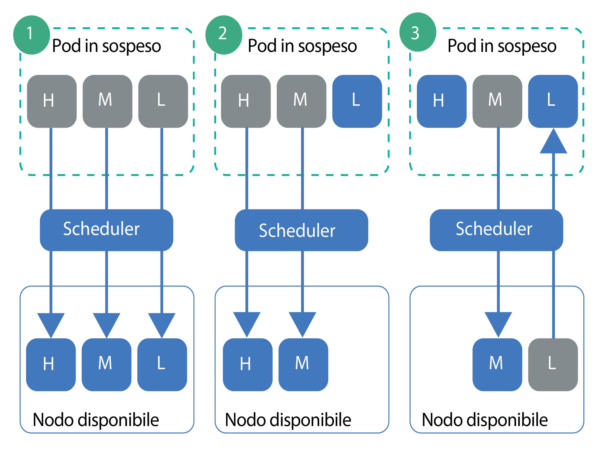

---

copyright:
  years: 2014, 2019
lastupdated: "2019-05-31"

keywords: kubernetes, iks

subcollection: containers

---

{:new_window: target="_blank"}
{:shortdesc: .shortdesc}
{:screen: .screen}
{:pre: .pre}
{:table: .aria-labeledby="caption"}
{:codeblock: .codeblock}
{:tip: .tip}
{:note: .note}
{:important: .important}
{:deprecated: .deprecated}
{:download: .download}
{:preview: .preview}


# Impostazione della priorità dei pod
{: #pod_priority}

Con la priorità e la prevenzione di pod Kubernetes, puoi configurare delle classi di priorità per indicare la priorità relativa di un pod. Il programma di pianificazione Kubernetes tiene conto della priorità di un pod e può anche prevenire (rimuovere) i pod con priorità più bassa per fare spazio su un nodo di lavoro ai pod con priorità più elevata. I tuoi cluster {{site.data.keyword.containerlong}} che eseguono Kubernetes versione 1.11.2 o successive supportano il controller di ammissione `Priority` che implementa tali classi.
{: shortdesc}

**Perché imposto la priorità dei pod?**</br>
Come amministratore del cluster, vuoi controllare quali pod sono più critici per il carico di lavoro del tuo cluster. Le classi di priorità possono aiutarti a controllare le decisioni del programma di pianificazione Kubernetes per favorire i pod con priorità più elevata rispetto a quelli con priorità più bassa. Il programma di pianificazione può anche prevenire (rimuovere) i pod con priorità più bassa che sono in esecuzione in modo da rendere possibile la pianificazione dei pod con priorità più elevata in sospeso.

Impostando la priorità dei pod, puoi aiutare a evitare che carichi di lavoro con priorità più bassa abbiano delle ripercussioni sui carichi di lavoro critici nel tuo cluster, in particolare nei casi in cui il cluster inizi a raggiungere la sua capacità di risorse.

Assicurati di avere [configurato un accesso utente appropriato](/docs/containers?topic=containers-users#users) al tuo cluster e, se applicabile, [le politiche di sicurezza dei pod](/docs/containers?topic=containers-psp#psp). Le politiche di sicurezza dei pod e di accesso possono aiutare a evitare che utenti non ritenuti attendibili distribuiscano pod con alta priorità che impediscono la pianificazione di altri pod.
{: tip}

{: #priority_scheduling}
**Come funzionano la pianificazione e la precedenza delle priorità?**</br>
In generale, i pod in sospeso che hanno una priorità più elevata sono pianificati prima dei pod a cui è stata data una priorità più bassa. Se le risorse residue nei tuoi nodi di lavoro non sono sufficienti, il programma di pianificazione può prevenire (rimuovere) i pod per liberare risorse a sufficienza per consentire la pianificazione dei pod a cui è stata data una priorità più elevata. La prevenzione è anche influenzata dai periodi di terminazione non forzata, dai PDB (Pod Disruption Budget) e dall'affinità dei nodi di lavoro.

Se non specifichi una priorità per la tua distribuzione dei pod, il valore predefinito viene impostato alla classe di priorità impostata come `globalDefault` . Se non hai una classe di priorità `globalDefault`, la priorità predefinita per tutti i pod è zero (`0`). Per impostazione predefinita, {{site.data.keyword.containerlong_notm}} non imposta un `globalDefault`, quindi la priorità predefinita dei pod è zero.

Per comprendere come la priorità dei pod e il programma di pianificazione funzionano insieme, considera gli scenari nella seguente figura. Devi posizionare i pod prioritari sui nodi di lavoro con le risorse disponibili. In caso contrario, i pod ad alta priorità nel cluster possono rimanere in sospeso nello stesso momento in cui vengono rimossi i pod esistenti, come nello scenario 3.

_Figura: scenari di priorità dei pod_


1.  Tre pod con priorità alta, media e bassa sono con la pianificazione in sospeso. Il programma di pianificazione trova un nodo di lavoro disponibile con spazio per tutti e 3 i pod e li pianifica in ordine di priorità con il pod con la priorità più alta pianificato per primo.
2.  Tre pod con priorità alta, media e bassa sono con la pianificazione in sospeso. Il programma di pianificazione trova un nodo di lavoro disponibile ma il nodo di lavoro ha solo risorse sufficienti a supportare i pod con priorità alta e media. Il pod con bassa priorità non viene pianificato e rimane in sospeso.
3.  Due pod con priorità alta e media sono in attesa di pianificazione. Un terzo pod con bassa priorità è presente su un nodo di lavoro disponibile. Tuttavia, il nodo di lavoro non ha risorse sufficienti per pianificare nessuno dei pod in sospeso. Il programma di pianificazione previene, o rimuove, il pod con bassa priorità, che riporta il pod a uno stato in sospeso. Quindi, il programma di pianificazione prova a pianificare il pod con alta priorità. Tuttavia, il nodo di lavoro non ha risorse sufficienti per pianificare il pod con alta priorità e pianifica invece il pod con media priorità.

**Per ulteriori informazioni**: vedi la documentazione di Kubernetes su [priorità e prevenzione di pod ](https://kubernetes.io/docs/concepts/configuration/pod-priority-preemption/).

**Posso disabilitare il controller di ammissione della priorità dei pod?**</br>
No. Se non vuoi utilizzare la priorità dei pod, non impostare un `globalDefault` o includere una classe di priorità nelle tue distribuzioni di pod. Ogni pod viene automaticamente impostato su zero, fatta eccezione per i pod critici per il cluster che IBM distribuisce con le [classi di priorità predefinite](#default_priority_class). Poiché la priorità dei pod è relativa, questa configurazione di base garantisce che ai pod critici per il cluster venga data una priorità per le risorse e pianifica qualsiasi altro pod rispettando le politiche di pianificazione esistenti implementate.

**In che modo le quote di risorse influiscono sulla priorità dei pod?**</br>
Puoi utilizzare la priorità dei pod in combinazione con le quote di risorse, compresi gli [ambiti di quota ](https://kubernetes.io/docs/concepts/policy/resource-quotas/#quota-scopes) per i cluster che eseguono Kubernetes 1.12 o versioni successive. Con gli ambiti quota, puoi configurare le quote di risorse per tenere conto della priorità dei pod. I pod con priorità più elevata possono consumare le risorse di sistema limitate dalla quota di risorse prima dei pod con priorità più bassa.

## Descrizione delle classi di priorità predefinite
{: #default_priority_class}

I tuoi cluster {{site.data.keyword.containerlong_notm}} sono dotati di alcune classi di priorità per impostazione predefinita.
{: shortdesc}

Non modificare le classi predefinite, che sono utilizzate per gestire in modo appropriato il tuo cluster. Puoi utilizzare queste classi nelle tue distribuzioni di applicazioni oppure [creare delle tue classi di priorità](#create_priority_class).
{: important}

La seguente tabella descrive le classi di priorità presenti nel tuo cluster per impostazione predefinita e perché sono utilizzate.

| Nome | Impostata da | Valore priorità | Scopo |
|---|---|---|
| `system-node-critical` | Kubernetes | 2000001000 | Pod selezionati che sono distribuiti nello spazio dei nomi `kube-system` quando crei il cluster utilizzano questa classe di priorità per proteggere la funzionalità critica per i nodi di lavoro, come ad esempio per i pod di metriche, monitoraggio, registrazione, archiviazione e rete. |
| `system-cluster-critical` | Kubernetes | 2000000000 | Pod selezionati che sono distribuiti nello spazio dei nomi `kube-system` quando crei il cluster utilizzano questa classe di priorità per proteggere la funzionalità critica per i cluster, come ad esempio per i pod di metriche, monitoraggio, registrazione, archiviazione e rete. |
| `ibm-app-cluster-critical` | IBM | 900000000 | Pod selezionati che sono distribuiti nello spazio dei nomi `ibm-system` quando crei il cluster utilizzano questa classe di priorità per proteggere la funzionalità critica per le applicazioni, come i pod di programma di bilanciamento del carico. |
{: caption="Classi di priorità predefinite che non devi modificare" caption-side="top"}

Puoi controllare quali pod utilizzano le classi di priorità eseguendo questo comando.

```
kubectl get pods --all-namespaces -o custom-columns=NAME:.metadata.name,PRIORITY:.spec.priorityClassName
```
{: pre}

## Creazione di una classe di priorità
{: #create_priority_class}

Per impostare la priorità dei pod, devi utilizzare una classe di priorità.
{: shortdesc}

Prima di iniziare:
* [Accedi al tuo account. Se applicabile, specifica il gruppo di risorse appropriato. Imposta il contesto per il tuo cluster.](/docs/containers?topic=containers-cs_cli_install#cs_cli_configure)
* Assicurati di disporre del [ruolo del servizio {{site.data.keyword.Bluemix_notm}} IAM **Scrittore** o **Gestore**](/docs/containers?topic=containers-users#platform) per lo spazio dei nomi `default`.
* [Crea](/docs/containers?topic=containers-clusters#clusters_ui) o [aggiorna](/docs/containers?topic=containers-update#update) il tuo cluster a Kubernetes versione 1.11 o successiva.

Per utilizzare una classe di priorità:

1.  Facoltativo: utilizza una classe di priorità esistente come template per la nuova classe.

    1.  Elenca le classi di priorità esistenti.

        ```
        kubectl get priorityclasses
        ```
        {: pre}

    2.  Scegli la classe di priorità che vuoi copiare e crea un file YAML locale.

        ```
        kubectl get priorityclass <priority_class> -o yaml > Downloads/priorityclass.yaml
        ```
        {: pre}

2.  Crea il tuo file YAML di classe di priorità.

    ```yaml
    apiVersion: scheduling.k8s.io/v1alpha1
    kind: PriorityClass
    metadata:
      name: <priority_class_name>
    value: <1000000>
    globalDefault: <false>
    description: "Use this class for XYZ service pods only."
    ```
    {: codeblock}

    <table>
    <caption>Descrizione dei componenti del file YAML</caption>
    <thead>
    <th colspan=2> Descrizione dei componenti del file YAML</th>
    </thead>
    <tbody>
    <tr>
    <td><code>metadata.name</code></td>
    <td>Obbligatorio: il nome della classe di priorità che vuoi creare.</td>
    </tr>
    <tr>
    <td><code>value</code></td>
    <td>Obbligatorio: immetti un numero intero inferiore o uguale a 1 miliardo (1000000000). Più è alto il valore e più è alta la priorità, I valori sono relativi ai valori delle altre classi di priorità nel cluster. Riserva i numeri molto alti per i pod critici per il sistema di cui non vuoi che venga indicata la prevenzione (rimozione). </br></br>Ad esempio, le [classi di priorità critiche per il cluster predefinite](#default_priority_class) hanno un valore compreso nell'intervallo 900000000-2000001000; immetti quindi un valore inferiore a questi numeri per le nuove classi di priorità in modo che nessun elemento abbia un'indicazione di priorità superiore a quella di questi pod.</td>
    </tr>
    <tr>
    <td><code>globalDefault</code></td>
    <td>Facoltativo: imposta il campo su `true` per rendere questa classe di priorità il valore predefinito globale che viene applicato a ogni pod che viene pianificato senza un valore `priorityClassName`. Solo la classe di priorità 1 nel tuo cluster può essere impostata come valore predefinito globale. Se non c'è alcun valore predefinito globale, i pod senza alcun `priorityClassName` specificato hanno una priorità pari a zero (`0`)</br></br>.
    Le [classi di priorità predefinite](#default_priority_class) non impostano un `globalDefault`. Se hai creato delle altri classi di priorità nel tuo cluster, puoi eseguire una verifica per assicurarti che non impostino un `globalDefault` eseguendo `kubectl describe priorityclass <name>`.</td>
    </tr>
    <tr>
    <td><code>description</code></td>
    <td>Facoltativo: indica agli utenti perché utilizzare questa classe di priorità. Racchiudi la stringa tra virgolette (`""`).</td>
    </tr></tbody></table>

3.  Crea la classe di priorità nel tuo cluster.

    ```
    kubectl apply -f filepath/priorityclass.yaml
    ```
    {: pre}

4.  Verifica che la classe di priorità venga creata.

    ```
    kubectl get priorityclasses
    ```
    {: pre}

Ottimo! Hai creato una classe di priorità. Lascia che i membri del tuo team sappiano della classe di priorità e quale eventuale classe di priorità devono utilizzare per le loro distribuzioni di pod.  

## Assegnazione di priorità ai tuoi pod
{: #prioritize}

Assegna una classe di priorità alla tua specifica di pod per impostare la priorità del pod all'interno del tuo cluster {{site.data.keyword.containerlong_notm}}. Se i tuoi pod esistevano prima che le classi di priorità divenissero disponibili con Kubernetes versione 1.11, devi modificare i file YAML di pod per assegnare una priorità ai pod.
{: shortdesc}

Prima di iniziare:
* [Accedi al tuo account. Se applicabile, specifica il gruppo di risorse appropriato. Imposta il contesto per il tuo cluster.](/docs/containers?topic=containers-cs_cli_install#cs_cli_configure)
* Assicurati di disporre del [ruolo del servizio {{site.data.keyword.Bluemix_notm}} IAM **Scrittore** o **Gestore**](/docs/containers?topic=containers-users#platform) nello spazio dei nomi in cui vuoi distribuire i pod.
* [Crea](/docs/containers?topic=containers-clusters#clusters_ui) o [aggiorna](/docs/containers?topic=containers-update#update) il tuo cluster a Kubernetes versione 1.11 o successiva.
* [Comprendi come funziona la pianificazione delle priorità](#priority_scheduling), poiché la priorità può prevenire i pod esistenti e influenzare il modo in cui vengono utilizzate le risorse del tuo cluster.

Per assegnare la priorità ai tuoi pod:

1.  Controlla l'importanza degli altri pod distribuiti in modo da poter scegliere la classe di priorità giusta per i tuoi pod in relazione a quanto è già distribuito.

    1.  Visualizza le classi di priorità utilizzate dagli altri pod nello spazio dei nomi.

        ```
        kubectl get pods -n <namespace> -o custom-columns=NAME:.metadata.name,PRIORITY:.spec.priorityClassName
        ```
        {: pre}

    2.  Ottieni i dettagli della classe di priorità e prendi nota del numero del **valore**. Per i pod con numeri più elevati è indicata una priorità che precede quella dei pod con numeri più bassi. Ripeti questo passo per ogni classe di priorità che vuoi esaminare.

        ```
        kubectl describe priorityclass <priorityclass_name>
        ```
        {: pre}

2.  Ottieni la classe di priorità che vuoi utilizzare oppure [crea la tua classe di priorità](#create_priority_class).

    ```
    kubectl get priorityclasses
    ```
    {: pre}

3.  Nella tua specifica del pod, aggiungi il campo `priorityClassName` con il nome della classe di priorità che hai richiamato nel passo precedente.

    ```yaml
    apiVersion: apps/v1
    kind: Deployment
    metadata:
      name: ibmliberty
    spec:
      replicas: 1
      selector:
        matchLabels:
          app: ibmliberty
      template:
        metadata:
          labels:
            app: ibmliberty
        spec:
          containers:
          - name: ibmliberty
            image: icr.io/ibmliberty:latest
            ports:
            - containerPort: 9080
          priorityClassName: <priorityclass_name>
    ```
    {: codeblock}

4.  Crea i pod con indicazione della priorità nello spazio di nomi in cui vuoi distribuirli.

    ```
    kubectl apply -f filepath/pod-deployment.yaml
    ```
    {: pre}
