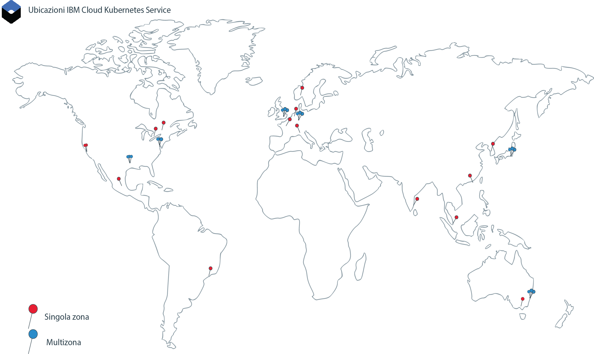

---

copyright:
  years: 2014, 2019
lastupdated: "2019-06-06"

keywords: kubernetes, iks

subcollection: containers

---

{:new_window: target="_blank"}
{:shortdesc: .shortdesc}
{:screen: .screen}
{:pre: .pre}
{:table: .aria-labeledby="caption"}
{:codeblock: .codeblock}
{:tip: .tip}
{:note: .note}
{:important: .important}
{:deprecated: .deprecated}
{:download: .download}
{:preview: .preview}

# Ubicazioni
{: #regions-and-zones}

Puoi distribuire i cluster {{site.data.keyword.containerlong}} in tutto il mondo. Quando crei un cluster Kubernetes, le sue risorse rimangono nell'ubicazione in cui hai distribuito il cluster. Puoi accedere a {{site.data.keyword.containerlong_notm}} tramite un endpoint API globale per lavorare con il tuo cluster.
{:shortdesc}



_Ubicazioni {{site.data.keyword.containerlong_notm}}_

Le risorse {{site.data.keyword.Bluemix_notm}} venivano di norma organizzate in regioni a cui si accedeva tramite [endpoint specifici per la regione](#bluemix_regions). Utilizza invece l'[endpoint globale](#endpoint).
{: deprecated}

## Ubicazioni {{site.data.keyword.containerlong_notm}}
{: #locations}

Le risorse {{site.data.keyword.Bluemix_notm}} sono organizzate in una gerarchia di ubicazioni geografiche. {{site.data.keyword.containerlong_notm}} è disponibile in un sottoinsieme di queste ubicazioni, incluse tutte e sei le regioni che supportano il multizona in tutto il mondo. I cluster gratuiti sono disponibili solo in determinate ubicazioni. Gli altri servizi {{site.data.keyword.Bluemix_notm}} potrebbero essere disponibili a livello globale o all'interno di un'ubicazione specifica.
{: shortdesc}

### Ubicazioni disponibili
{: #available-locations}

Per elencare le ubicazioni {{site.data.keyword.containerlong_notm}} disponibili, utilizza il comando `ibmcloud ks supported-locations`.
{: shortdesc}

La seguente immagine viene utilizzata come esempio per spiegare come sono organizzate le ubicazioni {{site.data.keyword.containerlong_notm}}.


<table summary="La tabella mostra l'organizzazione delle ubicazioni {{site.data.keyword.containerlong_notm}}. Le righe devono essere lette da sinistra a destra, con il tipo di ubicazione nella colonna uno, un esempio di tipo nella colonna due e la descrizione nella colonna tre.">
<caption>Organizzazione delle ubicazioni {{site.data.keyword.containerlong_notm}}.</caption>
  <thead>
  <th>Tipo</th>
  <th>Esempio</th>
  <th>Descrizione</th>
  </thead>
  <tbody>
    <tr>
      <td>Area geografica</td>
      <td>Nord America (`na`)</td>
      <td>Un raggruppamento organizzativo basato sui continenti geografici.</td>
    </tr>
    <tr>
      <td>Paese</td>
      <td>Canada (`ca`)</td>
      <td>Il paese dell'ubicazione all'interno dell'area geografica.</td>
    </tr>
    <tr>
      <td>Area metropolitana</td>
      <td>Città del Messico (`mex-cty`), Dallas (`dal`)</td>
      <td>Il nome di una città in cui sono ubicati 1 o più data center (zone). Un'area metropolitana può essere una zona che supporta il multizona e avere data center che supportano il multizona, come Dallas, o può avere solo data center a zona singola, come Città del Messico. Se crei un cluster in un'area metropolitana che supporta il multizona, il master Kubernetes e i nodi di lavoro possono essere estesi tra le zone per garantire l'alta disponibilità.</td>
    </tr>
    <tr>
      <td>Data center (zona)</td>
      <td>Dallas 12 (`dal12`)</td>
      <td>Un'ubicazione fisica dell'infrastruttura di calcolo, di rete e di archiviazione e dei relativi sistemi di raffreddamento e alimentazione che ospitano servizi e applicazioni cloud. I cluster possono essere estesi tra i data center, o zone, in un'architettura multizona per l'alta disponibilità. Le zone sono isolate l'una dall'altra, il che garantisce che non ci sia alcun singolo punto di malfunzionamento condiviso.</td>
    </tr>
  </tbody>
  </table>

### Ubicazioni a zona singola e multizona in {{site.data.keyword.containerlong_notm}}
{: #zones}

Le seguenti tabelle elencano le ubicazioni a zona singola e multizona in {{site.data.keyword.containerlong_notm}}. Nota che in alcune aree metropolitane, puoi eseguire il provisioning di un cluster come cluster a zona singola o cluster multizona. Inoltre, i cluster gratuiti sono disponibili solo in determinate aree geografiche e solo come cluster a zona singola con un unico nodo di lavoro.
{: shortdesc}

* **Multizona**: se crei un cluster in un'ubicazione metropolitana multizona, le repliche del tuo master Kubernetes altamente disponibile vengono estese tra le zone. Hai l'opzione di diffondere i tuoi nodi di lavoro tra le zone per proteggere le tue applicazioni dal malfunzionamento di una zona.
* **Zona singola**: se crei un cluster in un'ubicazione a singolo data center, puoi creare più nodi di lavoro, ma non puoi estenderli tra le zone. Il master altamente disponibile include tre repliche su host separati, ma non viene esteso tra le zone.

Per determinare rapidamente se una zona supporta il multizona, puoi eseguire `ibmcloud ks supported-locations` e cercare il valore nella colonna `Multizone Metro`.
{: tip}


Le risorse {{site.data.keyword.Bluemix_notm}} venivano di norma organizzate in regioni a cui si accedeva tramite [endpoint specifici per la regione](#bluemix_regions). Le tabelle elencano le regioni precedenti a scopo informativo. In futuro, puoi utilizzare l'[endpoint globale](#endpoint) per spostarti verso un'architettura senza regioni.
{: deprecated}

**Ubicazioni metropolitane multizona**

<table summary="La tabella mostra le ubicazioni metropolitane multizona disponibili in {{site.data.keyword.containerlong_notm}}. Le righe devono essere lette da sinistra a destra. La colonna uno indica l'area geografica in cui si trova l'ubicazione, la colonna due indica il paese dell'ubicazione, la colonna tre indica l'area metropolitana dell'ubicazione, la colonna quattro indica il data center e la colonna cinque indica la regione obsoleta in cui era organizzata l'ubicazione.">
<caption>Ubicazioni metropolitane multizona disponibili in {{site.data.keyword.containerlong_notm}}.</caption>
  <thead>
  <th>Area geografica</th>
  <th>Paese</th>
  <th>Area metropolitana</th>
  <th>Data center</th>
  <th>Regione obsoleta</th>
  </thead>
  <tbody>
    <tr>
      <td>Asia Pacifico</td>
      <td>Australia</td>
      <td>Sydney</td>
      <td>syd01, syd04, syd05</td>
      <td>Asia Pacifico Sud (`ap-south`, `au-syd`)</td>
    </tr>
    <tr>
      <td>Asia Pacifico</td>
      <td>Giappone</td>
      <td>Tokyo</td>
      <td>tok02, tok04, tok05</td>
      <td>Asia Pacifico Nord (`ap-north`, `jp-tok`)</td>
    </tr>
    <tr>
      <td>Europa</td>
      <td>Germania</td>
      <td>Francoforte</td>
      <td>fra02, fra04, fra05</td>
      <td>Europa Centrale (`eu-central`, `eu-de`)</td>
    </tr>
    <tr>
      <td>Europa</td>
      <td>Regno Unito</td>
      <td>Londra</td>
      <td>lon04, lon05`*`, lon06</td>
      <td>Regno Unito Sud (`uk-south`, `eu-gb`)</td>
    </tr>
    <tr>
      <td>Nord America</td>
      <td>Stati Uniti</td>
      <td>Dallas</td>
      <td>dal10, dal12, dal13</td>
      <td>Stati Uniti Sud (`us-south`)</td>
    </tr>
    <tr>
      <td>Nord America</td>
      <td>Stati Uniti</td>
      <td>Washington, D.C.</td>
      <td>wdc04, wdc06, wdc07</td>
      <td>Stati Uniti Est (`us-east`)</td>
    </tr>
  </tbody>
  </table>

**Ubicazioni data center a zona singola**

<table summary="La tabella mostra le ubicazioni data center a zona singola disponibili in {{site.data.keyword.containerlong_notm}}. Le righe devono essere lette da sinistra a destra. La colonna uno indica l'area geografica in cui si trova l'ubicazione, la colonna due indica il paese dell'ubicazione, la colonna tre indica l'area metropolitana dell'ubicazione, la colonna quattro indica il data center e la colonna cinque indica la regione obsoleta in cui era organizzata l'ubicazione.">
<caption>Ubicazioni a zona singola disponibili in {{site.data.keyword.containerlong_notm}}.</caption>
  <thead>
  <th>Area geografica</th>
  <th>Paese</th>
  <th>Area metropolitana</th>
  <th>Data center</th>
  <th>Regione obsoleta</th>
  </thead>
  <tbody>
    <tr>
      <td>Asia Pacifico</td>
      <td>Australia</td>
      <td>Melbourne</td>
      <td>mel01</td>
      <td>Asia Pacifico Sud (`ap-south`, `au-syd`)</td>
    </tr>
    <tr>
      <td>Asia Pacifico</td>
      <td>Australia</td>
      <td>Sydney</td>
      <td>syd01, syd04, syd05</td>
      <td>Asia Pacifico Sud (`ap-south`, `au-syd`)</td>
    </tr>
    <tr>
      <td>Asia Pacifico</td>
      <td>Cina</td>
      <td>Hong Kong<br>SAR della Repubblica popolare cinese</td>
      <td>hkg02</td>
      <td>Asia Pacifico Nord (`ap-north`, `jp-tok`)</td>
    </tr>
    <tr>
      <td>Asia Pacifico</td>
      <td>India</td>
      <td>Chennai</td>
      <td>che01</td>
      <td>Asia Pacifico Nord (`ap-north`, `jp-tok`)</td>
    </tr>
    <tr>
      <td>Asia Pacifico</td>
      <td>Giappone</td>
      <td>Tokyo</td>
      <td>tok02, tok04, tok05</td>
      <td>Asia Pacifico Nord (`ap-north`, `jp-tok`)</td>
    </tr>
    <tr>
      <td>Asia Pacifico</td>
      <td>Corea</td>
      <td>Seul</td>
      <td>seo01</td>
      <td>Asia Pacifico Nord (`ap-north`, `jp-tok`)</td>
    </tr>
    <tr>
      <td>Asia Pacifico</td>
      <td>Singapore</td>
      <td>Singapore</td>
      <td>sng01</td>
      <td>Asia Pacifico Nord (`ap-north`, `jp-tok`)</td>
    </tr>
    <tr>
      <td>Europa</td>
      <td>Francia</td>
      <td>Parigi</td>
      <td>par01</td>
      <td>Europa Centrale (`eu-central`, `eu-de`)</td>
    </tr>
    <tr>
      <td>Europa</td>
      <td>Germania</td>
      <td>Francoforte</td>
      <td>fra02, fra04, fra05</td>
      <td>Europa Centrale (`eu-central`, `eu-de`)</td>
    </tr>
    <tr>
      <td>Europa</td>
      <td>Italia</td>
      <td>Milano</td>
      <td>mil01</td>
      <td>Europa Centrale (`eu-central`, `eu-de`)</td>
    </tr>
    <tr>
      <td>Europa</td>
      <td>Paesi Bassi</td>
      <td>Amsterdam</td>
      <td>ams03</td>
      <td>Europa Centrale (`eu-central`, `eu-de`)</td>
    </tr>
    <tr>
      <td>Europa</td>
      <td>Norvegia</td>
      <td>Oslo</td>
      <td>osl</td>
      <td>Europa Centrale (`eu-central`, `eu-de`)</td>
    </tr>
    <tr>
      <td>Europa</td>
      <td>Regno Unito</td>
      <td>Londra</td>
      <td>lon02`*`, lon04, lon05`*`, lon06</td>
      <td>Regno Unito Sud (`uk-south`, `eu-gb`)</td>
    </tr>
    <tr>
      <td>Nord America</td>
      <td>Canada</td>
      <td>Montreal</td>
      <td>mon01</td>
      <td>Stati Uniti Est (`us-east`)</td>
    </tr>
    <tr>
      <td>Nord America</td>
      <td>Canada</td>
      <td>Toronto</td>
      <td>tor01</td>
      <td>Stati Uniti Est (`us-east`)</td>
    </tr>
    <tr>
      <td>Nord America</td>
      <td>Messico</td>
      <td>Città del Messico</td>
      <td>mex01</td>
      <td>Stati Uniti Sud (`us-south`)</td>
    </tr>
    <tr>
      <td>Nord America</td>
      <td>Stati Uniti</td>
      <td>Dallas</td>
      <td>dal10, dal12, dal13</td>
      <td>Stati Uniti Sud (`us-south`)</td>
    </tr>
    <tr>
      <td>Nord America</td>
      <td>Stati Uniti</td>
      <td>San Jose</td>
      <td>sjc03, sjc04</td>
      <td>Stati Uniti Sud (`us-south`)</td>
    </tr>
    <tr>
      <td>Nord America</td>
      <td>Stati Uniti</td>
      <td>Washington, D.C.</td>
      <td>wdc04, wdc06, wdc07</td>
      <td>Stati Uniti Est (`us-east`)</td>
    </tr>
    <tr>
      <td>Sud America</td>
      <td>Brasile</td>
      <td>São Paulo</td>
      <td>sao01</td>
      <td>Stati Uniti Sud (`us-south`)</td>
    </tr>
  </tbody>
  </table>

`*` lon05 sostituisce lon02. I nuovi cluster devono utilizzare lon05 e solo lon05 supporta i master altamente disponibili estesi tra le zone.
{: note}

### Cluster a zona singola
{: #regions_single_zone}

In un cluster a zona singola, le risorse del tuo cluster rimangono nella zona in cui viene distribuito il cluster. La seguente immagine evidenzia la relazione dei componenti del cluster a zona singola con un esempio dell'ubicazione di Toronto, Canada `tor01`.
{: shortdesc}


_Descrizione della posizione in cui risiedono le risorse del cluster a zona singola._

1.  Le risorse del cluster, inclusi il master e i nodi di lavoro, si trovano nello stesso data center in cui hai distribuito il cluster. Quando avvii azioni di orchestrazione del contenitore locale, come i comandi `kubectl`, le informazioni vengono scambiate tra i tuoi nodi master e di lavoro all'interno della stessa zona.

2.  Se configuri altre risorse del cluster, come archiviazione, rete, calcolo o applicazioni in esecuzione nei pod, le risorse e i loro dati rimangono nella zona in cui hai distribuito il tuo cluster.

3.  Quando avvii azioni di gestione del cluster, utilizzando ad esempio i comandi `ibmcloud ks`, le informazioni di base sul cluster (come nome, ID, utente, comando) vengono instradate attraverso un endpoint regionale tramite l'endpoint globale. Gli endpoint regionali si trovano nella zona metropolitana multizona più vicina. In questo esempio, la regione metropolitana è Washington, D.C.

### Cluster multizona
{: #regions_multizone}

In un cluster multizona, le risorse del tuo cluster vengono estese tra più zone per una maggiore disponibilità.
{: shortdesc}

1.  I nodi di lavoro vengono estesi tra più zone nell'ubicazione metropolitana per fornire una maggiore disponibilità per il tuo cluster. Anche le repliche del master Kubernetes vengono estese tra le zone. Quando avvii azioni di orchestrazione del contenitore locale, come i comandi `kubectl`, le informazioni vengono scambiate tra i tuoi nodi master e di lavoro tramite l'endpoint globale.

2.  La modalità di distribuzione nelle zone nel tuo cluster multizona di altre risorse del cluster, quali l'archiviazione, la rete, il calcolo o le applicazioni in esecuzione nei pod, varia. Per ulteriori informazioni, consulta questi argomenti:
    *   Configurazione di [archiviazione file](/docs/containers?topic=containers-file_storage#add_file) e [archiviazione blocchi](/docs/containers?topic=containers-block_storage#add_block) nei cluster multizona o [scelta di una soluzione di archiviazione persistente multizona](/docs/containers?topic=containers-storage_planning#persistent_storage_overview).
    *   [Abilitazione dell'accesso pubblico o privato a un'applicazione utilizzando un servizio NLB (network load balancer) in un cluster multizona](/docs/containers?topic=containers-loadbalancer#multi_zone_config).
    *   [Gestione del traffico di rete utilizzando Ingress](/docs/containers?topic=containers-ingress#planning).
    *   [Aumento della disponibilità della tua applicazione](/docs/containers?topic=containers-app#increase_availability).

3.  Quando avvii azioni di gestione del cluster, utilizzando ad esempio i [comandi `ibmcloud ks`](/docs/containers?topic=containers-cli-plugin-kubernetes-service-cli), le informazioni di base sul cluster (come nome, ID, utente, comando) vengono instradate attraverso l'endpoint globale.

### Cluster gratuiti
{: #regions_free}

I cluster gratuiti sono limitati a ubicazioni specifiche.
{: shortdesc}

**Creazione di un cluster gratuito nella CLI**: prima di creare un cluster gratuito, devi specificare una regione eseguendo `ibmcloud ks region-set`. Il tuo cluster viene creato in un'area metropolitana all'interno della regione che hai specificato: l'area metropolitana Sydney in `ap-south`, l'area metropolitana Francoforte in `eu-central`, l'area metropolitana Londra in `uk-south` o l'area metropolitana Dallas in `us-south`. Nota che non puoi specificare una zona all'interno dell'area metropolitana.

**Creazione di un cluster gratuito nella console {{site.data.keyword.Bluemix_notm}}**: quando utilizzi la console, puoi selezionare un'area geografica e un'ubicazione metropolitana di tale area. Puoi selezionare l'area metropolitana Dallas in Nord America, le aree metropolitane Francoforte o Londra in Europa o l'area metropolitana Sydney in Asia Pacifico. Il tuo cluster viene creato in una zona all'interno dell'area metropolitana da te scelta.

<br />


## Accesso all'endpoint globale
{: #endpoint}

Puoi organizzare le tue risorse tra i servizi {{site.data.keyword.Bluemix_notm}} utilizzando le ubicazioni {{site.data.keyword.Bluemix_notm}} (precedentemente chiamate regioni). Ad esempio, puoi creare un cluster Kubernetes utilizzando un'immagine Docker privata memorizzata nel tuo {{site.data.keyword.registryshort_notm}} della stessa ubicazione. Per accedere a queste risorse, puoi utilizzare gli endpoint globali e filtrare per ubicazione.
{:shortdesc}

### Accesso a {{site.data.keyword.Bluemix_notm}}
{: #login-ic}

Quando accedi alla riga di comando {{site.data.keyword.Bluemix_notm}} (`ibmcloud`), ti viene richiesto di selezionare una regione. Tuttavia, questa regione non influisce sull'endpoint del plugin {{site.data.keyword.containerlong_notm}} (`ibmcloud ks`), che utilizza ancora l'endpoint globale. Tieni presente che devi ancora specificare il gruppo di risorse in cui si trova il tuo cluster se non si trova nel gruppo di risorse predefinito.
{: shortdesc}

Per eseguire l'accesso all'endpoint API globale {{site.data.keyword.Bluemix_notm}} e specificare il gruppo di risorse in cui si trova il tuo cluster:
```
ibmcloud login -a https://cloud.ibm.com -g <nondefault_resource_group_name>
```
{: pre}

### Accesso a {{site.data.keyword.containerlong_notm}}
{: #login-iks}

Quando esegui l'accesso a {{site.data.keyword.Bluemix_notm}}, puoi accedere a {{site.data.keyword.containershort_notm}}. Per aiutarti a iniziare, controlla le seguenti risorse per l'utilizzo della CLI e dell'API {{site.data.keyword.containerlong_notm}}.
{: shortdesc}

**CLI {{site.data.keyword.containerlong_notm}}**:
* [Configura la tua CLI per utilizzare il plugin `ibmcloud ks`](/docs/containers?topic=containers-cs_cli_install#cs_cli_install).
* [Configura la tua CLI per connetterti a un particolare cluster ed eseguire comandi `kubectl`](/docs/containers?topic=containers-cs_cli_install#cs_cli_configure).

Per impostazione predefinita, sei collegato all'endpoint globale di {{site.data.keyword.containerlong_notm}}, `https://containers.cloud.ibm.com`.

Quando utilizzi la nuova funzionalità globale nella CLI {{site.data.keyword.containerlong_notm}}, considera le seguenti modifiche rispetto alla funzionalità basata su regione legacy.

* Elenco di risorse:
  * Quando elenchi le risorse, ad esempio con i comandi `ibmcloud ks clusters`, `ibmcloud ks subnets` o `ibmcloud ks zones`, vengono restituite le risorse presenti in tutte le ubicazioni. Per filtrare le risorse in base a un'ubicazione specifica, alcuni comandi includono un indicatore `--locations`. Ad esempio, se filtri i cluster per l'area metropolitana `dal`, vengono restituiti i cluster multizona e i cluster a zona singola nei data center (zone) all'interno di quell'area metropolitana. Se filtri i cluster per il data center (zona) `dal10`, vengono restituiti i cluster multizona che hanno un nodo di lavoro in quella zona e i cluster a zona singola in quella zona. Tieni presente che puoi passare un'ubicazione o un elenco di ubicazioni separate da virgole.
    Esempio di filtro per ubicazione:
    ```
    ibmcloud ks clusters --locations dal
    ```
    {: pre}
  * Altri comandi non restituiscono le risorse in tutte le ubicazioni. Per eseguire i comandi `credential-set/unset/get`, `api-key-reset` e `vlan-spanning-get`, devi specificare una regione in `--region`.

* Gestione delle risorse:
  * Quando utilizzi l'endpoint globale, puoi gestire le risorse per le quali disponi delle autorizzazioni di accesso in qualsiasi ubicazione, anche se imposti una regione eseguendo `ibmcloud ks region-set` e la risorsa che vuoi gestire si trova in un'altra regione.
  * Se hai dei cluster con lo stesso nome in regioni differenti, puoi utilizzare l'ID cluster quando esegui i comandi o impostare una regione con il comando `ibmcloud ks region-set` e utilizzare il nome cluster quando esegui i comandi.

* Funzionalità legacy:
  * Se devi elencare e gestire le risorse solo da una singola regione, puoi utilizzare il [comando ](/docs/containers?topic=containers-cli-plugin-kubernetes-service-cli#cs_init) `ibmcloud ks init` per specificare un endpoint regionale anziché l'endpoint globale.
    Esempio di indicazione dell'endpoint regionale Stati Uniti Sud:
    ```
    ibmcloud ks init --host https://us-south.containers.cloud.ibm.com
    ```
    {: pre}
  * Per utilizzare la funzionalità globale, puoi utilizzare nuovamente il comando `ibmcloud ks init` per specificare l'endpoint globale. Esempio per indicare nuovamente come destinazione l'endpoint globale:
    ```
    ibmcloud ks init --host https://containers.cloud.ibm.com
    ```
    {: pre}

</br></br>
**API {{site.data.keyword.containerlong_notm}}**:
* [Inizia a utilizzare l'API](/docs/containers?topic=containers-cs_cli_install#cs_api).
* [Visualizza la documentazione sui comandi API](https://containers.cloud.ibm.com/global/swagger-global-api/).
* Genera un client dell'API da utilizzare nell'automazione utilizzando l'[API `swagger.json`](https://containers.cloud.ibm.com/global/swagger-global-api/swagger.json).

Per interagire con l'API {{site.data.keyword.containerlong_notm}} globale, immetti il tipo di comando e aggiungi `global/v1/command` all'endpoint.

Esempio di API globale `GET /clusters`:
```
GET https://containers.cloud.ibm.com/global/v1/clusters
```
{: codeblock}

</br>

Se devi specificare una regione in una chiamata API, rimuovi il parametro `/global` dal percorso e passa il nome della regione nell'intestazione `X-Region`. Per elencare le regioni disponibili, esegui `ibmcloud ks regions`.

<br />


## Obsoleto: Precedente struttura di regioni e zone {{site.data.keyword.Bluemix_notm}}
{: #bluemix_regions}

In precedenza, le tue risorse {{site.data.keyword.Bluemix_notm}} erano organizzate in regioni. Le regioni sono uno strumento concettuale per organizzare le zone e possono includere zone (data center) in differenti paesi e aree geografiche. La seguente tabella associa le regioni {{site.data.keyword.Bluemix_notm}} precedenti, le regioni {{site.data.keyword.containerlong_notm}} e le zone {{site.data.keyword.containerlong_notm}}. Le zone che supportano il multizona sono in grassetto.
{: shortdesc}

Gli endpoint specifici per la regione sono stati dichiarati obsoleti. Utilizza invece l'[endpoint globale](#endpoint). Se devi utilizzare gli endpoint regionali, [imposta la variabile di ambiente `IKS_BETA_VERSION` nel plug-in {{site.data.keyword.containerlong_notm}} su `0.2`](/docs/containers-cli-plugin?topic=containers-cli-plugin-kubernetes-service-cli#cs_beta).
{: deprecated}

| Regione {{site.data.keyword.containerlong_notm}} | Regioni {{site.data.keyword.Bluemix_notm}} corrispondenti | Zone disponibili nella regione |
| --- | --- | --- |
| Asia Pacifico Nord (solo cluster standard) | Tokyo | che01, hkg02, seo01, sng01, **tok02, tok04, tok05** |
| Asia Pacifico Sud | Sydney | mel01, **syd01, syd04, syd05** |
| Europa Centrale | Francoforte | ams03, **fra02, fra04, fra05**, mil01, osl01, par01 |
| Regno Unito Sud | Londra | lon02, **lon04, lon05, lon06** |
| Stati Uniti Est (solo cluster standard) | Washington DC | mon01, tor01, **wdc04, wdc06, wdc07** |
| Stati Uniti Sud | Dallas | **dal10, dal12, dal13**, mex01, sjc03, sjc04, sao01 |
{: caption="Regioni {{site.data.keyword.containershort_notm}} e {{site.data.keyword.Bluemix_notm}} corrispondenti, con le zone. Le zone che supportano il multizona sono in grassetto." caption-side="top"}

Utilizzando le regioni {{site.data.keyword.containerlong_notm}}, puoi creare o accedere ai cluster Kubernetes in un'altra regione rispetto alla regione
{{site.data.keyword.Bluemix_notm}} in cui hai eseguito l'accesso. Gli endpoint della regione {{site.data.keyword.containerlong_notm}} fanno riferimento nello specifico a
{{site.data.keyword.containerlong_notm}}, non a {{site.data.keyword.Bluemix_notm}} nel suo insieme.

Potresti voler accedere a un'altra regione {{site.data.keyword.containerlong_notm}} per i seguenti motivi:
  * Hai creato i servizi {{site.data.keyword.Bluemix_notm}} o le immagini Docker private in una regione e desideri utilizzarle con {{site.data.keyword.containerlong_notm}} in un'altra regione.
  * Vuoi accedere a un cluster in una regione diversa dalla regione {{site.data.keyword.Bluemix_notm}} predefinita a cui hai eseguito l'accesso.

Per spostarti rapidamente tra le regioni, utilizza il [comando](/docs/containers?topic=containers-cli-plugin-kubernetes-service-cli#cs_region-set) `ibmcloud ks region-set`.
