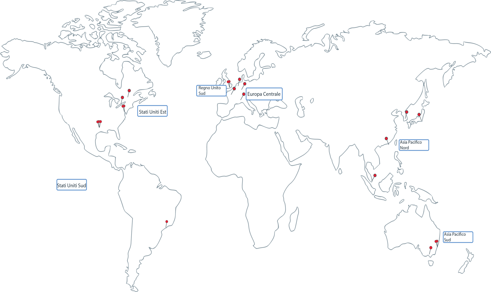

---

copyright:
  years: 2014, 2018
lastupdated: "2018-01-24"

---

{:new_window: target="_blank"}
{:shortdesc: .shortdesc}
{:screen: .screen}
{:pre: .pre}
{:table: .aria-labeledby="caption"}
{:codeblock: .codeblock}
{:tip: .tip}
{:download: .download}

# Regioni e ubicazioni
{{site.data.keyword.Bluemix}} è ospitato in tutto il mondo. Una regione è un'area geografica a cui è possibile accedere da un endpoint. Le ubicazioni sono data center all'interno della regione. I servizi in {{site.data.keyword.Bluemix_notm}} potrebbero essere disponibili globalmente o all'interno di una regione specifica.
{:shortdesc}

[Le regioni {{site.data.keyword.Bluemix_notm}}](#bluemix_regions) sono diverse dalle regioni [{{site.data.keyword.containershort_notm}}](#container_regions).



Figura 1. Regioni e data center {{site.data.keyword.containershort_notm}} 

Regioni {{site.data.keyword.containershort_notm}} supportate:
  * Asia Pacifico Nord
  * Asia Pacifico Sud
  * Europa Centrale
  * Regno Unito Sud
  * Stati Uniti Est
  * Stati Uniti Sud


## Endpoint API regione {{site.data.keyword.Bluemix_notm}}
{: #bluemix_regions}

Puoi organizzare le tue risorse con nei servizi {{site.data.keyword.Bluemix_notm}} utilizzando le regioni {{site.data.keyword.Bluemix_notm}}. Ad esempio, puoi creare un cluster Kubernetes utilizzando un'immagine Docker privata archiviata nel {{site.data.keyword.registryshort_notm}} della stessa regione.
{:shortdesc}

Per verificare in quale regione {{site.data.keyword.Bluemix_notm}} sei al momento, esegui `bx info` e controlla il campo **Regione**.

È possibile accedere alle regioni {{site.data.keyword.Bluemix_notm}} specificando l'endpoint API quando accedi. Se non specifici una regione, viene automaticamente fatto accesso alla regione a te più vicina.

Endpoint API della regione {{site.data.keyword.Bluemix_notm}} con i comandi di accesso di esempio: 

  * Stati Uniti Sud e Stati Uniti Est
      ```
      bx login -a api.ng.bluemix.net
      ```
      {: pre}

  * Sydney e Asia Pacifico Nord
      ```
      bx login -a api.au-syd.bluemix.net
      ```
      {: pre}

  * Germania
      ```
      bx login -a api.eu-de.bluemix.net
      ```
      {: pre}

  * Regno Unito
      ```
      bx login -a api.eu-gb.bluemix.net
      ```
      {: pre}


<br />


## Ubicazioni e endpoint API della regione {{site.data.keyword.containershort_notm}}
{: #container_regions}

Utilizzando le regioni {{site.data.keyword.containershort_notm}}, puoi creare o accedere ai cluster Kubernetes in un'altra regione rispetto alla regione
{{site.data.keyword.Bluemix_notm}} in cui hai eseguito l'accesso. Gli endpoint della regione {{site.data.keyword.containershort_notm}} fanno riferimento nello specifico a
{{site.data.keyword.containershort_notm}}, non a {{site.data.keyword.Bluemix_notm}} nel suo insieme.
{:shortdesc}

Puoi accedere a {{site.data.keyword.containershort_notm}} tramite un endpoint globale: `https://containers.bluemix.net/`.
* Per verificare in quale regione {{site.data.keyword.containershort_notm}} sei al momento, esegui `bx cs region`.
* Per richiamare un elenco di regioni disponibili e i relativi endpoint, esegui `bx cs regions`.

Per utilizzare l'API con l'endpoint globale, in tutte le richieste, trasmetti il nome della regione in un'intestazione `X-Region`.
{: tip}

### Accesso a una diversa regione del servizio del contenitore
{: #container_login_endpoints}

Potresti voler accedere a un'altra regione {{site.data.keyword.containershort_notm}} per i seguenti motivi:
  * Hai creato i servizi {{site.data.keyword.Bluemix_notm}} o le immagini Docker private in una regione e desideri utilizzarle con {{site.data.keyword.containershort_notm}} in un'altra regione.
  * Vuoi accedere a un cluster in una regione diversa dalla regione {{site.data.keyword.Bluemix_notm}} predefinita a cui hai eseguito l'accesso.

</br>

Per selezionare velocemente la regione, esegui `bx cs region-set`.

### Ubicazioni disponibili per il servizio del contenitore
{: #locations}

Le ubicazioni sono data center disponibili in una regione.

  | Regione | Ubicazione | Città |
  |--------|----------|------|
  | Asia Pacifico Nord | hkg02, seo01, sng01, tok02 | Hong Kong, Seoul, Singapore, Tokyo |
  | Asia Pacifico Sud     | mel01, syd01, syd04        | Melbourne, Sydney |
  | Europa Centrale     | ams03, fra02, mil01, par01        | Amsterdam, Francoforte, Milano, Parigi|
  | Regno Unito Sud      | lon02, lon04         | Londra |
  | Stati Uniti Est      | mon01, tor01, wdc06, wdc07        | Montreal, Toronto, Washington DC |
  | Stati Uniti Sud     | dal10, dal12, dal13, sao01       | Dallas, São Paolo |

**Nota**: Milano (mil01) è disponibile solo per i cluster gratuiti.

### Utilizzo dei comandi API del servizio del contenitore
{: #container_api}

Per interagire con l'API {{site.data.keyword.containershort_notm}}, immetti il tipo di comando e aggiungi `/v1/command` all'endpoint globale. 

Esempio di API `GET /clusters`: 
  ```
  GET https://containers.bluemix.net/v1/clusters
  ```
  {: codeblock}

</br>

Per utilizzare l'API con l'endpoint globale, in tutte le richieste, trasmetti il nome della regione in un'intestazione `X-Region`. Per elencare le regioni disponibili, esegui `bx cs regions`.
{: tip}

Per visualizzare la documentazione sui comandi API, vedi [https://containers.bluemix.net/swagger-api/](https://containers.bluemix.net/swagger-api/).
