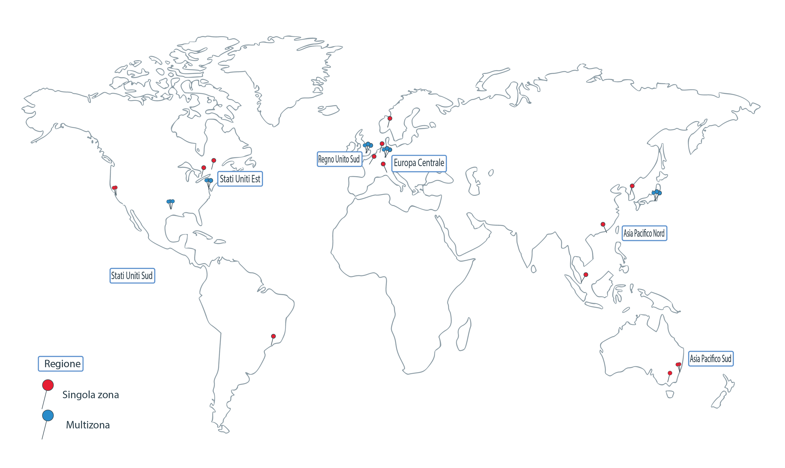

---

copyright:
  years: 2014, 2019
lastupdated: "2019-04-15"

keywords: kubernetes, iks

subcollection: containers

---

{:new_window: target="_blank"}
{:shortdesc: .shortdesc}
{:screen: .screen}
{:pre: .pre}
{:table: .aria-labeledby="caption"}
{:codeblock: .codeblock}
{:tip: .tip}
{:note: .note}
{:important: .important}
{:deprecated: .deprecated}
{:download: .download}


# Regioni e zone
{: #regions-and-zones}

Una regione è una specifica ubicazione geografica in cui puoi distribuire applicazioni, servizi e altre risorse {{site.data.keyword.Bluemix}}. [Le regioni {{site.data.keyword.Bluemix_notm}}](#bluemix_regions) sono diverse dalle [regioni {{site.data.keyword.containerlong}}](#container_regions). Le regioni sono costituite da una o più zone che sono data center fisici che ospitano le risorse di calcolo, rete e archiviazione, nonché il raffreddamento e l'alimentazione correlati, che ospitano i servizi e le applicazioni host. Le zone sono isolate l'una dall'altra, il che garantisce che non ci sia alcun singolo punto di malfunzionamento condiviso.
{:shortdesc}



_Regioni e zone {{site.data.keyword.containerlong_notm}}_

 {{site.data.keyword.Bluemix_notm}} è ospitato in tutto il mondo. I servizi in {{site.data.keyword.Bluemix_notm}} potrebbero essere disponibili globalmente o all'interno di una regione specifica. Quando crei un cluster Kubernetes in {{site.data.keyword.containerlong_notm}}, le sue risorse rimangono nella regione in cui hai distribuito il cluster.

 Puoi creare dei cluster standard in ogni regione {{site.data.keyword.containerlong_notm}} supportata. I cluster gratuiti sono disponibili solo in regioni selezionate.
{: note}

 | Regione {{site.data.keyword.containerlong_notm}} | Ubicazione {{site.data.keyword.Bluemix_notm}} corrispondente |
| --- | --- |
| Asia Pacifico Nord (solo cluster standard) | Tokyo |
| Asia Pacifico Sud | Sydney |
| Europa Centrale | Francoforte |
| Regno Unito Sud | Londra |
| Stati Uniti Est (solo cluster standard) | Washington DC |
| Stati Uniti Sud | Dallas |
{: caption="Regioni del servizio Kubernetes supportate e ubicazioni IBM Cloud corrispondenti." caption-side="top"}

 <br />


## Ubicazioni in {{site.data.keyword.Bluemix_notm}}
{: #bluemix_regions}

Puoi organizzare le tue risorse tra i servizi {{site.data.keyword.Bluemix_notm}} utilizzando le ubicazioni {{site.data.keyword.Bluemix_notm}}, chiamate anche regioni. Ad esempio, puoi creare un cluster Kubernetes utilizzando un'immagine Docker privata memorizzata nel tuo {{site.data.keyword.registryshort_notm}} della stessa ubicazione.
{:shortdesc}

Puoi specificare una regione {{site.data.keyword.Bluemix_notm}} quando esegui l'accesso all'endpoint API globale. Per elencare le regioni disponibili, esegui `ibmcloud regions`. Per verificare in quale ubicazione {{site.data.keyword.Bluemix_notm}} ti trovi attualmente, esegui `ibmcloud target` e controlla il campo **Regione**. Se non specifichi una regione, ti viene richiesto di selezionare una regione.

Ad esempio, per eseguire l'accesso all'endpoint API globale nella regione Dallas (`us-south`):
```
ibmcloud login -a https://cloud.ibm.com -r us-south
```
{: pre}

Per eseguire l'accesso all'endpoint API globale e selezionare una regione:
```
ibmcloud login -a https://cloud.ibm.com
```
{: pre}

Output di esempio:
```
API endpoint: cloud.ibm.com

Get One Time Code from https://identity-2.eu-central.iam.cloud.ibm.com/identity/passcode to proceed.
Open the URL in the default browser? [Y/n]> y
One Time Code >
Authenticating...
OK

Select an account:
1. MyAccount (00a11aa1a11aa11a1111a1111aaa11aa) <-> 1234567
2. TeamAccount (2bb222bb2b22222bbb2b2222bb2bb222) <-> 7654321
Enter a number> 2
Targeted account TeamAccount (2bb222bb2b22222bbb2b2222bb2bb222) <-> 7654321


Targeted resource group default

Select a region (or press enter to skip):
1. au-syd
2. jp-tok
3. eu-de
4. eu-gb
5. us-south
6. us-east
Enter a number> 5
Targeted region us-south


API endpoint:      https://cloud.ibm.com
Region:            us-south
User:              first.last@email.com
Account:           TeamAccount (2bb222bb2b22222bbb2b2222bb2bb222) <-> 7654321
Resource group:    default
CF API endpoint:
Org:
Space:

...
```
{: screen}

<br />


## Regioni in {{site.data.keyword.containerlong_notm}}
{: #container_regions}

Utilizzando le regioni {{site.data.keyword.containerlong_notm}}, puoi creare o accedere ai cluster Kubernetes in un'altra regione rispetto alla regione
{{site.data.keyword.Bluemix_notm}} in cui hai eseguito l'accesso. Gli endpoint della regione {{site.data.keyword.containerlong_notm}} fanno riferimento nello specifico a
{{site.data.keyword.containerlong_notm}}, non a {{site.data.keyword.Bluemix_notm}} nel suo insieme.
{:shortdesc}

Puoi creare dei cluster standard in ogni regione {{site.data.keyword.containerlong_notm}} supportata. I cluster gratuiti sono disponibili solo in regioni selezionate.
{: note}

 Regioni {{site.data.keyword.containerlong_notm}} supportate:
  * Asia Pacifico Nord (solo cluster standard)
  * Asia Pacifico Sud
  * Europa Centrale
  * Regno Unito Sud
  * Stati Uniti Est (solo cluster standard)
  * Stati Uniti Sud

Puoi accedere a {{site.data.keyword.containerlong_notm}} tramite un singolo endpoint globale: `https://containers.cloud.ibm.com/v1`.
* Per verificare in quale regione {{site.data.keyword.containerlong_notm}} sei al momento, esegui `ibmcloud ks region`.
* Per richiamare un elenco di regioni disponibili e i relativi endpoint, esegui `ibmcloud ks regions`.

Per utilizzare l'API con l'endpoint globale, in tutte le richieste, trasmetti il nome della regione nell'intestazione `X-Region`.
{: tip}

### Accesso a una regione {{site.data.keyword.containerlong_notm}} differente
{: #container_login_endpoints}

Puoi modificare le regioni utilizzando la CLI {{site.data.keyword.containerlong_notm}}.
{:shortdesc}

Potresti voler accedere a un'altra regione {{site.data.keyword.containerlong_notm}} per i seguenti motivi:
  * Hai creato i servizi {{site.data.keyword.Bluemix_notm}} o le immagini Docker private in una regione e desideri utilizzarle con {{site.data.keyword.containerlong_notm}} in un'altra regione.
  * Vuoi accedere a un cluster in una regione diversa dalla regione {{site.data.keyword.Bluemix_notm}} predefinita a cui hai eseguito l'accesso.

Per selezionare velocemente la regione, esegui [`ibmcloud ks region-set`](/docs/containers?topic=containers-cs_cli_reference#cs_region-set).

### Utilizzo dei comandi API {{site.data.keyword.containerlong_notm}}
{: #containers_api}

Per interagire con l'API {{site.data.keyword.containerlong_notm}}, immetti il tipo di comando e aggiungi `/v1/command` all'endpoint globale.
{:shortdesc}

 Esempio di API `GET /clusters`:
  ```
  GET https://containers.cloud.ibm.com/v1/clusters
  ```
  {: codeblock}

 </br>

Per utilizzare l'API con l'endpoint globale, in tutte le richieste, trasmetti il nome della regione nell'intestazione `X-Region`. Per elencare le regioni disponibili, esegui `ibmcloud ks regions`.
{: tip}

Per visualizzare la documentazione sui comandi API, vedi [https://containers.cloud.ibm.com/swagger-api/](https://containers.cloud.ibm.com/swagger-api/).

## Zone in {{site.data.keyword.containerlong_notm}}
{: #zones}

Le zone sono data center fisici che sono disponibili in una regione {{site.data.keyword.Bluemix_notm}}. Le regioni sono uno strumento concettuale per organizzare le zone e possono includere zone (data center) in diversi paesi. La seguente tabella visualizza le zone disponibili per regione.
{:shortdesc}

* **Ubicazione metropolitana multizona**: se crei un cluster in un'ubicazione metropolitana multizona, le repliche del tuo master Kubernetes altamente disponibile vengono distribuite automaticamente tra le zone. Hai l'opzione di diffondere i tuoi nodi di lavoro tra le zone per proteggere le tue applicazioni dal malfunzionamento di una zona.
* **Ubicazione a zona singola**: se crei un cluster in un'ubicazione a zona singola, puoi creare più nodi di lavoro ma non puoi distribuirli tra le zone. Il master altamente disponibile include tre repliche su host separati, ma non viene esteso tra le zone.

<table summary="La tabella mostra le zone disponibili in base alle regioni. Le righe devono essere lette da sinistra a destra; la colonna uno indica la regione, la colonna due le ubicazioni metropolitane multizona e la colonna tre le ubicazioni a zona singola.">
<caption>Zone singole e multizona disponibili per regione.</caption>
  <thead>
  <th>Regione</th>
  <th>Ubicazione metropolitana multizona</th>
  <th>Ubicazione zona singola</th>
  </thead>
  <tbody>
    <tr>
      <td>Asia Pacifico Nord</td>
      <td>Tokyo: tok02, tok04, tok05</td>
      <td><p>Chennai: che01</p>
      <p>Hong Kong S.A.R. della Repubblica Popolare Cinese: hkg02</p>
      <p>Seoul: seo01</p>
      <p>Singapore: sng01</p></td>
    </tr>
    <tr>
      <td>Asia Pacifico Sud</td>
      <td>Sydney: syd01, syd04, syd05</td>
      <td>Melbourne: mel01</td>
    </tr>
    <tr>
      <td>Europa Centrale</td>
      <td>Francoforte: fra02, fra04, fra05</td>
      <td><p>Amsterdam: ams03</p>
      <p>Milano: mil01</p>
      <p>Oslo: osl01</p>
      <p>Parigi: par01</p>
      </td>
    </tr>
    <tr>
      <td>Regno Unito Sud</td>
      <td>Londra: lon04, lon05`*`, lon06</td>
      <td></td>
    </tr>
    <tr>
      <td>Stati Uniti Est</td>
      <td>Washington DC: wdc04, wdc06, wdc07</td>
      <td><p>Montreal: mon01</p>
      <p>Toronto: tor01</p></td>
    </tr>
    <tr>
      <td>Stati Uniti Sud</td>
      <td>Dallas: dal10, dal12, dal13</td>
      <td><p>Messico: mex01</p><p>San Jose: sjc03, sjc04</p><p>São Paulo: sao01</p></td>
    </tr>
  </tbody>
</table>

`*` lon05 sostituisce lon02. I nuovi cluster devono utilizzare lon05 e solo lon05 supporta i master altamente disponibili estesi tra le zone.
{: note}

### Cluster a zona singola
{: #regions_single_zone}

In un cluster a zona singola, le risorse del tuo cluster rimangono nella zona in cui viene distribuito il cluster. La seguente immagine evidenzia la relazione dei componenti del cluster a zona singola in una regione di esempio degli Stati Uniti Est:


_Descrizione della posizione in cui risiedono le risorse del cluster a zona singola._

1.  Le risorse del tuo cluster, inclusi i nodi master e di lavoro, si trovano nella stessa zona in cui hai distribuito il cluster. Quando avvii azioni di orchestrazione del contenitore locale, come i comandi `kubectl`, le informazioni vengono scambiate tra i tuoi nodi master e di lavoro all'interno della stessa zona.

2.  Se configuri altre risorse del cluster, come archiviazione, rete, calcolo o applicazioni in esecuzione nei pod, le risorse e i loro dati rimangono nella zona in cui hai distribuito il tuo cluster.

3.  Quando avvii azioni di gestione del cluster, utilizzando ad esempio i comandi `ibmcloud ks`, le informazioni di base sul cluster (come nome, ID, utente, comando) vengono instradate tramite un endpoint regionale.

### Cluster multizona
{: #regions_multizone}

In un cluster multizona, il nodo master viene distribuito in una zona con supporto multizona e le risorse del tuo cluster vengono distribuite tra più zone.

1.  I nodi di lavoro vengono distribuiti tra più zone in una singola regione per fornire maggiore disponibilità per il tuo cluster. Il master rimane nella stessa zona con supporto multizona in cui avevi distribuito il cluster. Quando avvii le azioni di orchestrazione del contenitore locali, quali i comandi `kubectl`, le informazioni vengono scambiate tra i tuoi nodi master e di lavoro tramite un endpoint regionale.

2.  La modalità di distribuzione nelle zone nel tuo cluster multizona di altre risorse del cluster, quali l'archiviazione, la rete, il calcolo o le applicazioni in esecuzione nei pod, varia. Per ulteriori informazioni, consulta questi argomenti:
  * Configurazione di [archiviazione file](/docs/containers?topic=containers-file_storage#add_file) e [archiviazione blocco](/docs/containers?topic=containers-block_storage#add_block) nei cluster multizona.
  * [Abilitazione dell'accesso pubblico o privato a un'applicazione utilizzando un servizio LoadBalancer in un cluster multizona](/docs/containers?topic=containers-loadbalancer#multi_zone_config)
  * [Gestione del traffico di rete utilizzando Ingress](/docs/containers?topic=containers-ingress#planning)
  * [Aumento della disponibilità della tua applicazione](/docs/containers?topic=containers-app#increase_availability)

3.  Quando avvii azioni di gestione del cluster, utilizzando ad esempio i comandi [`ibmcloud ks`](/docs/containers?topic=containers-cs_cli_reference#cs_cli_reference), le informazioni di base sul cluster (come nome, ID, utente, comando) vengono instradate tramite un endpoint regionale.


