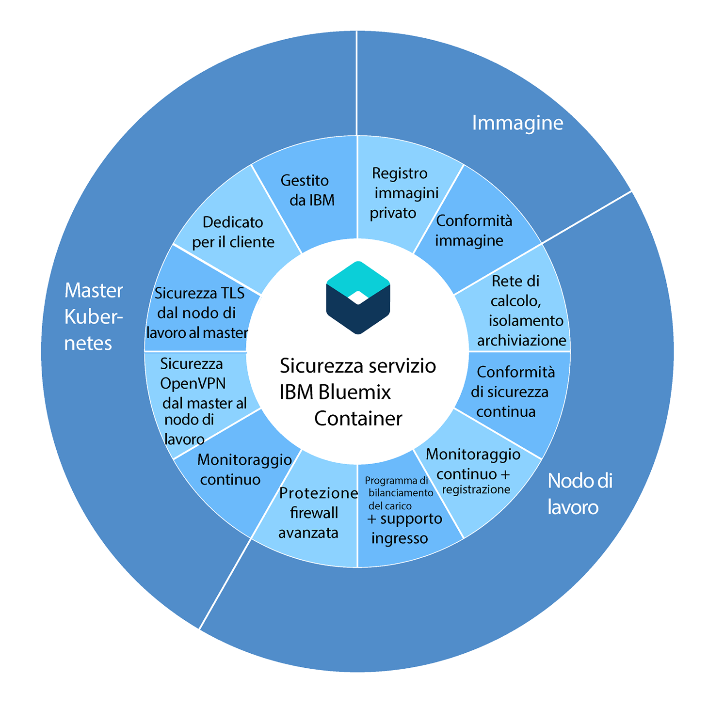

---

copyright:
  years: 2014, 2018
lastupdated: "2018-4-20"

---

{:new_window: target="_blank"}
{:shortdesc: .shortdesc}
{:screen: .screen}
{:pre: .pre}
{:table: .aria-labeledby="caption"}
{:codeblock: .codeblock}
{:tip: .tip}
{:download: .download}

# Sicurezza per {{site.data.keyword.containerlong_notm}}
{: #security}

Puoi utilizzare le funzioni di sicurezza integrate in {{site.data.keyword.containerlong}} per l'analisi dei rischi e la protezione di sicurezza. Queste funzioni ti aiutano a proteggere la tua infrastruttura cluster Kubernetes e le comunicazioni di rete, isolare le tue risorse di calcolo e garantire la conformità di sicurezza tra i componenti della tua infrastruttura e le distribuzioni del contenitore.
{: shortdesc}

## Sicurezza per componente del cluster
{: #cluster}

Ogni cluster {{site.data.keyword.containerlong_notm}} ha funzioni di sicurezza integrate nei propri nodi [master](#master) e [di lavoro](#worker).
{: shortdesc}

Se hai un firewall, devi accedere al bilanciamento del carico dall'esterno del cluster, oppure se vuoi eseguire i comandi `kubectl` dal tuo sistema locale quando le politiche di rete aziendale impediscono l'accesso agli endpoint internet pubblici, [apri le porte nel tuo firewall](cs_firewall.html#firewall). Se vuoi collegarti alle applicazioni su una rete in loco o ad altre applicazioni esterne al tuo cluster, [configura la connettività VPN](cs_vpn.html#vpn).

Nel seguente diagramma, puoi visualizzare le funzioni di sicurezza raggruppate per master Kubernetes, nodi di lavoro e immagini di contenitore.

<table summary="La prima riga nella tabella si estende su entrambe le colonne. Le restanti righe devono essere lette da sinistra a destra, con la posizione del server nella prima colonna e gli indirizzi IP corrispondenti nella seconda colonna.">
  <thead>
    <th colspan=2> Impostazioni di sicurezza cluster integrate in {{site.data.keyword.containershort_notm}}</th>
  </thead>
  <tbody>
    <tr>
      <td>Master Kubernetes</td>
      <td>Il master Kubernetes in ogni cluster viene gestito da IBM ed è altamente disponibile. Include le impostazioni di sicurezza {{site.data.keyword.containershort_notm}}
che assicurano la conformità di sicurezza e la comunicazione protetta dai/ai nodi
di lavoro. Gli aggiornamenti di sicurezza vengono eseguiti da IBM quando necessario. Il master Kubernetes dedicato controlla e monitora in modo centralizzato tutte le risorse Kubernetes
nel cluster. In base ai requisiti di distribuzione e alla capacità nel cluster, il master
Kubernetes automaticamente pianifica le tue applicazioni contenute nel contenitore per la distribuzione nei nodi
di lavoro disponibili. Per ulteriori informazioni, consulta [Sicurezza master Kubernetes](#master).</td>
    </tr>
    <tr>
      <td>Nodo di lavoro</td>
      <td>I contenitori sono distribuiti su nodi di lavoro dedicati a un cluster e assicurano
l'isolamento di calcolo, di rete e di archiviazione ai clienti IBM. {{site.data.keyword.containershort_notm}} fornisce funzioni di sicurezza integrate per
mantenere protetti i tuoi nodi di lavoro sulla rete pubblica e privata e per assicurare la conformità
di sicurezza del nodo di lavoro. Per ulteriori informazioni, consulta [Sicurezza nodo di lavoro](#worker). Inoltre, puoi aggiungere le [politiche di rete Calico](cs_network_policy.html#network_policies) per specificare ulteriormente il traffico di rete che vuoi consentire o bloccare da e verso un pod su un nodo di lavoro.</td>
    </tr>
    <tr>
      <td>Immagini</td>
      <td>Come amministratore del cluster, puoi configurare il tuo proprio repository delle immagini Docker
in {{site.data.keyword.registryshort_notm}} dove puoi archiviare e condividere le immagini
Docker tra i tuoi utenti del cluster. Per assicurare le distribuzioni del contenitore sicure, ogni immagine nel tuo registro privato viene scansionata dal
controllo vulnerabilità. Il controllo vulnerabilità è un componente di {{site.data.keyword.registryshort_notm}} che esegue le scansioni per le vulnerabilità potenziali,
effettua raccomandazioni di sicurezza e fornisce le istruzioni per risolvere le vulnerabilità. Per ulteriori informazioni, consulta [Sicurezza immagine in {{site.data.keyword.containershort_notm}}](#images).</td>
    </tr>
  </tbody>
</table>

 

## Master Kubernetes
{: #master}

Riesamina le funzioni di sicurezza del master Kubernetes integrate per proteggere il master Kubernetes
e la comunicazione di rete del cluster.
{: shortdesc}

<dl>
  <dt>Master Kubernetes dedicato completamente gestito</dt>
    <dd>Ogni cluster Kubernetes in {{site.data.keyword.containershort_notm}} è controllato da un master Kubernetes dedicato gestito da IBM in un account dell'infrastruttura IBM Cloud (SoftLayer) di proprietà di IBM. Il master Kubernetes è configurato con i seguenti componenti dedicati che non sono condivisi con altri clienti IBM.
      <ul><li>etcd data store: archivia tutte le risorse Kubernetes di un cluster, come servizi, distribuzioni e pod. Le mappe di configurazione e i segreti Kubernetes sono dati dell'applicazione che vengono archiviati come coppie chiave-valore in modo che possano essere utilizzati da un'applicazione che viene eseguita in un pod. I dati in etcd sono memorizzati su un disco crittografato gestito da IBM e sottoposto a backup giornaliero. Quando inviati a un pod, i dati vengono crittografati tramite TLS per garantire la protezione e l'integrità dei dati. </li>
      <li>kube-apiserver: funge da punto di ingresso principale per tutte le richieste dal nodo di lavoro al master
Kubernetes. kube-apiserver convalida ed elabora le richiese e può leggere e scrivere in
etcd data store.</li>
      <li>kube-scheduler: decide dove distribuire i pod, tenendo conto dei bisogni di prestazioni e capacità dell'account,
i vincoli della politica software, le specifiche dell'anti-affinità e i requisiti
del carico di lavoro. Se non è possibile trovare alcun nodo di lavoro che corrisponda ai requisiti, il pod
non viene distribuito nel cluster.</li>
      <li>kube-controller-manager: responsabile del monitoraggio delle serie di repliche e della creazione dei pod corrispondenti
per archiviare lo stato desiderato.</li>
      <li>OpenVPN: componente specifico di {{site.data.keyword.containershort_notm}}
per fornire la connettività di rete protetta per tutti i master Kubernetes alla comunicazione del nodo di lavoro.</li></ul></dd>
  <dt>Connettività di rete protetta TLS per tutti i nodi di lavoro alla comunicazione master Kubernetes</dt>
    <dd>Per proteggere la comunicazione di rete al master Kubernetes, {{site.data.keyword.containershort_notm}} genera certificati TLS che crittografano la comunicazione verso e dai componenti dell'archivio dati kube-apiserver e etcd per ogni cluster. Questi certificati non sono mai condivisi tra i cluster o tra i componenti master Kubernetes.</dd>
  <dt>Connettività di rete protetta OpenVPN per tutti i master Kubernetes alla comunicazione del nodo di lavoro</dt>
    <dd>Anche se Kubernetes protegge la comunicazione tra il master Kubernetes e i nodi di lavoro utilizzando il protocollo
`https`, non viene fornita alcuna autenticazione al nodo di lavoro per
impostazione predefinita. Per garantire questa comunicazione, {{site.data.keyword.containershort_notm}} configura automaticamente una connessione OpenVPN
tra il master Kubernetes e il nodo di lavoro quando viene creato il cluster.</dd>
  <dt>Monitoraggio della rete del master Kubernetes continuo</dt>
    <dd>Ogni master Kubernetes è continuamente monitorato da IBM per controllare e rimediare agli attacchi
DOS (Denial-Of-Service) al livello del processo.</dd>
  <dt>Conformità di sicurezza del nodo master Kubernetes</dt>
    <dd>{{site.data.keyword.containershort_notm}} esegue automaticamente la scansione di ogni nodo in cui viene distribuito il master Kubernetes alla ricerca di vulnerabilità trovate nelle correzioni di sicurezza specifiche del sistema operativo e di Kubernetes che devono essere applicate per garantire la protezione del nodo master. Se vengono trovate della vulnerabilità,
{{site.data.keyword.containershort_notm}} automaticamente applica le correzioni
e risolve le vulnerabilità per conto dell'utente.</dd>
</dl>

 

## Nodi di lavoro
{: #worker}

Riesamina le funzioni di sicurezza integrate dei nodi di lavoro per proteggere l'ambiente di tali nodi e per garantire l'isolamento delle risorse, della rete e dell'archiviazione.
{: shortdesc}

<dl>
  <dt>Proprietà del nodo di lavoro</dt>
    <dd>La proprietà dei nodi di lavoro dipende dal tipo di cluster che crei. 
 I nodi di lavoro nei cluster gratuiti sono forniti nell'account dell'infrastruttura di IBM Cloud (Softlayer) di proprietà di IBM. Gli utenti possono distribuire le applicazioni ai nodi di lavoro ma non possono configurare o installare ulteriore software nel nodo di lavoro.

    
I nodi di lavoro nei cluster standard sono forniti nell'account dell'infrastruttura di IBM Cloud (Softlayer) associato all'account IBM Cloud dedicato o pubblico del cliente. I nodi di lavoro sono di proprietà del cliente. I clienti possono scegliere di modificare le impostazioni di sicurezza o installare ulteriore software nei nodi di lavoro come fornito dal servizio IBM Cloud Container.
 </dd>
  <dt>Isolamento dell'infrastruttura di calcolo, di rete e di archiviazione</dt>
    <dd>
Quando crei un cluster, i nodi di lavoro sono forniti come macchine virtuali da IBM utilizzando il portfolio dell'infrastruttura IBM Cloud (SoftLayer). I nodi di lavoro sono dedicati a un cluster e non ospitano i carichi di lavoro di altri cluster.

    
 Ogni account {{site.data.keyword.Bluemix_notm}} è configurato con le VLAN dell'infrastruttura IBM Cloud (SoftLayer) per garantire prestazioni di rete di qualità e l'isolamento sui nodi di lavoro. Puoi anche designare i nodi di lavoro come privati collegandoli solo a una VLAN privata.
 
Per conservare i dati nel tuo cluster, puoi eseguire il provisioning dell'archivio file basato su NFS dedicato dall'infrastruttura IBM Cloud (SoftLayer) e utilizzare le funzioni di sicurezza dei dati integrate di questa piattaforma.
</dd>
  <dt>Configurazione di nodi di lavoro protetti</dt>
    <dd>
Ogni nodo di lavoro è configurato con un sistema operativo Ubuntu che non può essere modificato dal proprietario del nodo di lavoro. Poiché il sistema operativo del nodo di lavoro è Ubuntu, tutti i contenitori distribuiti sul nodo di lavoro devono utilizzare una distribuzione Linux che utilizza il kernel Ubuntu. Le distribuzioni Linux che devono comunicare con il kernel in un modo diverso non possono essere utilizzate. Per proteggere il sistema operativo dei nodi di lavoro da potenziali attacchi, ogni nodo di lavoro è configurato con delle impostazioni del firewall avanzate che sono implementate dalle regole iptable di Linux.

    
Tutti i contenitori in esecuzione su
Kubernetes sono protetti da impostazioni di rete Calico predefinite configurate su ogni nodo di lavoro durante
la creazione del cluster. Questa configurazione garantisce comunicazioni di rete sicure tra i nodi di lavoro e i pod.

    
L'accesso SSH è disabilitato sul nodo di lavoro. Se hai un cluster standard e vuoi installare delle funzioni aggiuntive sul nodo di lavoro, puoi utilizzare
le [serie daemon Kubernetes ](https://kubernetes.io/docs/concepts/workloads/controllers/daemonset) per tutto quello che vuoi eseguire su ogni nodo di lavoro oppure i [lavori Kubernetes ](https://kubernetes.io/docs/concepts/workloads/controllers/jobs-run-to-completion/) per qualsiasi azione a singola ricorrenza che vuoi eseguire.
</dd>
  <dt>Conformità di sicurezza del nodo di lavoro Kubernetes</dt>
    <dd>IBM collabora con team di sicurezza esterni e interni per risolvere le vulnerabilità di conformità di sicurezza potenziali. <b>Importante</b>: utilizza regolarmente il [comando](cs_cli_reference.html#cs_worker_update) `bx cs worker-update` (ad esempio mensilmente) per distribuire gli aggiornamenti e le patch di sicurezza al sistema operativo e per aggiornare la versione di Kubernetes. Quando gli aggiornamenti sono disponibili, riceverai una notifica quando visualizzerai le informazioni relative ai nodi di lavoro, ad esempio con il comando `bx cs workers <cluster_name>` o `bx cs worker-get <cluster_name> <worker_ID>`.</dd>
  <dt>Opzione per distribuire i nodi di lavoro sui server fisici (bare metal)</dt>
    <dd>Se scegli di eseguire il provisioning dei nodi di lavoro su server fisici bare metal (anziché sulle istanze di server virtuali), hai un ulteriore controllo sull'host di calcolo, ad esempio la memoria o la CPU. Questa configurazione elimina l'hypervisor della macchina virtuale che assegna risorse fisiche alle macchine virtuali eseguite sull'host. Invece, tutte le risorse di una macchina bare metal sono dedicate esclusivamente al nodo di lavoro, quindi non devi preoccuparti dei "vicini rumorosi" che condividono risorse o rallentano le prestazioni. I server bare metal sono dedicati a te, con tutte le sue risorse disponibili per l'utilizzo del cluster.</dd>
  <dt id="trusted_compute">{{site.data.keyword.containershort_notm}} con Trusted Compute</dt>
    <dd>
Se [distribuisci il tuo cluster su bare metal](cs_clusters.html#clusters_ui) che supporta Trusted Compute, puoi abilitare l'attendibilità. Il chip TPM (Trusted Platform Module) viene abilitato su ciascun nodo di lavoro bare metal nel cluster che supporta Trusted Compute (inclusi i futuri nodi che aggiungerai al cluster). Pertanto, dopo aver abilitato l'attendibilità, non puoi disabilitarla successivamente per il cluster. Un server di attendibilità viene distribuito sul nodo master e un agent di attendibilità viene distribuito come pod sul nodo di lavoro. All'avvio del nodo di lavoro, il pod dell'agent di attendibilità monitora ogni fase del processo.

    
Ad esempio, se un utente non autorizzato ottiene l'accesso al tuo sistema e modifica il kernel del sistema operativo con un'ulteriore logica per raccogliere i dati, l'agent di attendibilità lo rileva e modifica lo stato di attendibilità del nodo in modo che tu sappia che il nodo di lavoro non è più attendibile. Con il calcolo attendibile puoi verificare possibili tentativi di intrusione nei tuoi nodi di lavoro.

    </dd>
  <dt id="encrypted_disks">Codifica del disco</dt>
    <dd>
Per impostazione predefinita, {{site.data.keyword.containershort_notm}} fornisce due partizioni di dati codificate SSD locali per tutti i nodi di lavoro quando ne viene eseguito il provisioning. La prima partizione non è codificata e la seconda montata in _/var/lib/docker_ viene sbloccata utilizzando le chiavi di codifica LUKS. Ogni nodo di lavoro in ogni cluster Kubernetes ha la propria chiave di codifica LUKS, gestita da {{site.data.keyword.containershort_notm}}. Quando crei un cluster o aggiungi un nodo di lavoro a un cluster esistente, le chiavi vengono trasmesse in modo sicuro e quindi scartate dopo che il disco codificato viene sbloccato.

    
<b>Nota</b>: la codifica può influenzare le prestazioni I/O del disco. Per i carichi di lavoro che richiedono I/O del disco di elevate prestazioni, esegui il test di un cluster con la codifica sia abilitata che disabilitata per aiutarti a decidere se disattivarla.
</dd>
  <dt>Supporto per i firewall di rete dell'infrastruttura IBM Cloud (SoftLayer)</dt>
    <dd>{{site.data.keyword.containershort_notm}} è compatibile con tutte le [offerte firewall dell'infrastruttura IBM Cloud (SoftLayer) ](https://www.ibm.com/cloud-computing/bluemix/network-security). Su {{site.data.keyword.Bluemix_notm}} pubblico,
puoi configurare un firewall con politiche di rete personalizzate per fornire
una sicurezza di rete dedicata al tuo cluster standard e per rilevare e risolvere intrusioni di rete. Ad esempio, puoi scegliere di configurare [Vyatta ](https://knowledgelayer.softlayer.com/topic/vyatta-1) ad agire come tuo firewall e bloccare il traffico indesiderato. Quando configuri un firewall, [devi anche aprire le porte e gli indirizzi IP necessari](cs_firewall.html#firewall) per ogni regione in modo che il master e i nodi di lavoro possano comunicare.</dd>
  <dt>Mantieni i servizi privati o esponi selettivamente i sevizi e le applicazioni a internet pubblicamente</dt>
    <dd>Puoi scegliere di mantenere privati i tuoi servizi e le tue applicazioni e di utilizzare le funzioni di sicurezza integrate
descritte in questo argomento per garantire la comunicazione protetta tra i nodi di lavoro e i pod. Per esporre i servizi e le applicazioni pubblicamente su internet, puoi utilizzare il supporto Ingress e il programma di bilanciamento del carico per
rendere in modo sicuro i tuoi servizi pubblicamente disponibili.</dd>
  <dt>Collega in modo sicuro i tuoi nodi di lavoro e applicazioni a un data center in loco</dt>
    <dd>
Per collegare i tuoi nodi di lavoro e le tue applicazioni a un data center in loco, puoi configurare un endpoint IPSec VPN con un servizio strongSwan o con un'applicazione gateway Vyatta o un'applicazione Fortigate.

    <ul><li><b>Servizio VPN IPSec strongSwan</b>: puoi configurare un [Servizio VPN IPSec strongSwan](https://www.strongswan.org/) che collega in modo sicuro il tuo cluster Kubernetes a una rete in loco. Il servizio VPN IPSec strongSwan fornisce un canale di comunicazione end-to-end sicuro su Internet basato sulla suite di protocolli IPsec (Internet Protocol Security) standard del settore. Per configurare una connessione sicura tra il tuo cluster e una rete in loco, devi [installare un gateway VPN IPsec nel tuo data center in loco](/docs/infrastructure/iaas-vpn/set-up-ipsec-vpn.html#setting-up-an-ipsec-connection). Quindi, puoi [configurare e distribuire il servizio VPN IPSec strongSwan](cs_vpn.html#vpn-setup) in un pod Kubernetes.</li>
    <li><b>Applicazione gateway Vyatta o applicazione Fortigate</b>: se hai un cluster più grande, vuoi accedere a risorse non Kubernetes tramite VPN o vuoi accedere a più cluster su una singola VPN, potresti scegliere di configurare un'applicazione gateway Vyatta o un'applicazione Fortigate per configurare un endpoint VPN IPSec. Per configurare Vyatta, vedi [Configurazione della connettività VPN con Vyatta](cs_vpn.html#vyatta).</li></ul></dd>
  <dt>Registrazione e monitoraggio continuo dell'attività del cluster</dt>
    <dd>Per i cluster standard, tutti gli eventi correlati al cluster, come l'aggiunta di un nodo di lavoro, lo stato di avanzamento dell'aggiornamento in sequenza o le informazioni
sull'utilizzo della capacità possono essere registrati e monitorati da {{site.data.keyword.containershort_notm}} e inviati a
{{site.data.keyword.loganalysislong_notm}} e {{site.data.keyword.monitoringlong_notm}}. Per informazioni sulla configurazione della registrazione e del monitoraggio, consulta
[Configurazione della registrazione cluster](/docs/containers/cs_health.html#logging) e
[Configurazione del monitoraggio dei cluster](/docs/containers/cs_health.html#monitoring).</dd>
</dl>

 

## Immagini
{: #images}

Gestisci la sicurezza e l'integrità delle tue immagini con le funzioni di sicurezza integrate.
{: shortdesc}

<dl>
<dt>Repository delle immagini privato Docker sicuro in {{site.data.keyword.registryshort_notm}}</dt>
  <dd>Puoi configurare
il tuo proprio repository delle immagini Docker in un multi-tenant, altamente disponibile e il registro delle immagini privato scalabile
ospitato da IBM per creare, archiviare in modo sicuro e condividere le immagini
Docker tra più utenti del cluster.
  </dd>
<dt>Conformità della sicurezza dell'immagine</dt>
  <dd>Quando utilizzi {{site.data.keyword.registryshort_notm}},
puoi utilizzare la scansione di sicurezza integrata fornita dal Controllo vulnerabilità. Ogni immagine trasmessa al tuo spazio dei nomi
viene automaticamente scansionata alla ricerca di vulnerabilità
con un database di problemi CentOS, Debian, Red Hat e Ubuntu conosciuti. Se vengono trovate delle vulnerabilità,
il Controllo vulnerabilità fornisce le istruzioni su come risolverli per garantire la sicurezza e l'integrità dell'immagine.</dd>
</dl>

Per visualizzare la valutazione della vulnerabilità per le tue immagini, [consulta la documentazione del Controllo vulnerabilità](/docs/services/va/va_index.html#va_registry_cli).

 

## Rete in cluster
{: #in_cluster_network}

La comunicazione di rete in cluster protetta tra i nodi di lavoro e i pod viene realizzata mediante le VLAN (virtual local area network) private. Una VLAN configura un gruppo di
nodi di lavoro come se fossero collegati con lo stesso cavo fisico.
{:shortdesc}

Quando crei un cluster, ogni cluster viene automaticamente collegato a una VLAN privata. La VLAN privata
determina l'indirizzo IP privato assegnato a un nodo di lavoro durante la creazione del cluster.

|Tipo di cluster|Gestore della VLAN privata del cluster|
|------------|-------------------------------------------|
|Cluster gratuiti in {{site.data.keyword.Bluemix_notm}}|{{site.data.keyword.IBM_notm}}|
|Cluster standard in {{site.data.keyword.Bluemix_notm}}|Tu nel tuo account dell'infrastruttura IBM Cloud (SoftLayer) 
**Suggerimento:** per avere accesso a tutte le VLAN nel tuo account, attiva lo [Spanning della VLAN](/docs/infrastructure/vlans/vlan-spanning.html#enable-or-disable-vlan-spanning).
|

A tutti i pod distribuiti a un nodo di lavoro viene assegnato anche un indirizzo IP privato. Ai pod viene assegnato
un IP nell'intervallo di indirizzi privati 172.30.0.0/16 e sono instradati solo tra i nodi di lavoro. Per evitare conflitti, non utilizzare questo intervallo di IP sui nodi che comunicheranno con i tuoi nodi di lavoro. I pod e i nodi di lavoro possono comunicare in modo sicuro nella rete privata utilizzando gli indirizzi IP
privati. Tuttavia, quando un pod ha un arresto anomalo o un nodo di lavoro deve essere ricreato, viene assegnato un nuovo
indirizzo IP.

Poiché è difficile tenere traccia degli indirizzi IP privati mutevoli per le applicazioni che devono essere ad alta disponibilità, puoi utilizzare le funzioni di rilevamento del servizio Kubernetes integrate ed esporre le applicazioni come servizi IP cluster sulla rete privata nel cluster. Un servizio Kubernetes raggruppa un insieme di pod e fornisce una connessione di rete a questi pod per altri servizi nel cluster senza esporre l'effettivo indirizzo IP privato di ciascun pod. Quando crei un servizio IP cluster, a esso viene assegnato un indirizzo IP privato dall'intervallo di
indirizzi privati 10.10.10.0/24. Analogamente all'intervallo di indirizzi privati del pod, non utilizzare questo intervallo di IP sui nodi che comunicheranno con i tuoi nodi di lavoro. Questo indirizzo IP è accessibile soltanto all'interno del cluster. Non puoi
accedere a questo indirizzo IP da internet. Contemporaneamente, viene creata una voce di ricerca DNS per il servizio
e archiviata nel componente kube-dns del cluster. La voce DNS contiene il nome del servizio,
lo spazio dei nomi in cui è stato creato il servizio e il link all'indirizzo IP del cluster privato assegnato.

Se un'applicazione nel cluster deve accedere a un pod che si trova dietro un servizio IP cluster,
può utilizzare l'indirizzo IP del cluster privato assegnato al servizio o inviare una richiesta utilizzando
il nome del servizio. Quando utilizzi il nome del servizio, il nome viene ricercato nel componente
kube-dns e instradato all'indirizzo IP del cluster privato del servizio. Quando una richiesta raggiunge il servizio,
questo si assicura che tutte le richieste siano ugualmente inoltrate ai pod,
indipendentemente dai loro indirizzi IP privati e che al nodo di lavoro a cui sono distribuiti.

Per ulteriori informazioni su come creare servizio del tipo di IP
cluster, consulta [Servizi Kubernetes ](https://kubernetes.io/docs/concepts/services-networking/service/#publishing-services---service-types).

Per informazioni sulle applicazioni che si collegano in modo sicuro in un cluster Kubernetes a una rete in loco, consulta [Configurazione della connettività VPN](cs_vpn.html#vpn). Per informazioni sull'esposizione delle tue applicazioni per la comunicazione di rete esterna, vedi [Consentire l'accesso pubblico alle applicazioni](cs_network_planning.html#public_access).

## Attendibilità del cluster
{: cs_trust}

Per impostazione predefinita, {{site.data.keyword.containerlong_notm}} fornisce molte [funzioni per i tuoi componenti cluster](#cluster), quindi puoi distribuire le tue applicazioni inserite in un contenitore in ambiente altamente sicuro. Estendi il tuo livello di attendibilità nel tuo cluster per garantire ulteriormente che le operazioni che esegui all'interno del cluster sono effettivamente quelle che desideri eseguire. Puoi implementare l'attendibilità nel tuo cluster in diversi modi, come mostrato nel seguente diagramma.
{:shortdesc}

1.  **{{site.data.keyword.containerlong_notm}} con Trusted Compute**: sui cluster bare metal, puoi abilitare l'attendibilità. L'agent di attendibilità monitora il processo di avvio dell'hardware e riporta le modifiche in modo che tu possa verificare i tentativi di intrusione nei tuoi nodi di lavoro bare metal. Con Trusted Compute, puoi distribuire i tuoi contenitori su host bare metal verificati in modo che i tuoi carichi di lavoro vengano eseguiti su hardware attendibile. [Ulteriori informazioni su come funziona Trusted Compute](#trusted_compute).

2.  **Attendibilità dei contenuti per le tue immagini**: assicura l'integrità delle tue immagini abilitando l'attendibilità dei contenuti nel tuo {{site.data.keyword.registryshort_notm}}. Con i contenuti attendibili, puoi controllare chi firma le immagini come attendibili. Una volta che i firmatari attendibili inseriscono un'immagine nel tuo registro, gli utenti possono estrarre il contenuto firmato in modo che possano verificare l'origine dell'immagine. Per ulteriori informazioni, vedi [Firma le immagini per i contenuti attendibili](/docs/services/Registry/registry_trusted_content.html#registry_trustedcontent).

3.  **Container Image Security Enforcement (beta)**: crea un controller di ammissione con politiche personalizzate in modo che tu possa verificare le immagini del contenitore prima di distribuirle. Con Container Image Security Enforcement, controlli l'ubicazione da cui vengono distribuite le immagini e garantisci che soddisfano le politiche di [Controllo vulnerabilità](/docs/services/va/va_index.html) o i requisiti di [attendibilità dei contenuti](/docs/services/Registry/registry_trusted_content.html#registry_trustedcontent). Se una distribuzione non soddisfa le politiche che hai impostato, Security Enforcement impedisce le modifiche al tuo cluster. Per ulteriori informazioni, vedi [Applicazione della sicurezza dell'immagine del contenitore (beta)](/docs/services/Registry/registry_security_enforce.html#security_enforce).

4.  **Programma di scansione vulnerabilità del contenitore**: per impostazione predefinita, Controllo vulnerabilità esegue la scansione delle immagini memorizzate in {{site.data.keyword.registryshort_notm}}. Per controllare lo stato dei contenitori attivi in esecuzione nel tuo cluster, puoi installare il programma di scansione del contenitore. Per ulteriori informazioni, vedi [Installazione del programma di scansione del contenitore](/docs/services/va/va_index.html#va_install_livescan).

5.  **Analisi di rete con Security Advisor (anteprima)**: con {{site.data.keyword.Bluemix_notm}} Security Advisor, puoi centralizzare la sicurezza approfondita dai servizi {{site.data.keyword.Bluemix_notm}} come Controllo vulnerabilità e {{site.data.keyword.cloudcerts_short}}. Quando abiliti Security Advisor nel tuo cluster, puoi vedere i report relativi al traffico di rete sospetto in entrata e in uscita. Per ulteriori informazioni, vedi [Analisi di rete](/docs/services/security-advisor/network-analytics.html#network-analytics). Per eseguire l'installazione, vedi [Impostazione del monitoraggio degli IP server e dei client sospetti per un cluster Kubernetes](/docs/services/security-advisor/setup_cluster.html).

6.  **{{site.data.keyword.cloudcerts_long_notm}} (beta)**: se hai un cluster negli Stati Uniti Sud e desideri [esporre la tua applicazione utilizzando un dominio personalizzato con TLS](https://console.bluemix.net/docs/containers/cs_ingress.html#custom_domain_cert), puoi memorizzare il tuo certificato TLS in {{site.data.keyword.cloudcerts_short}}. Anche i certificati scaduti o che stanno per scadere possono essere riportati nel tuo Security Advisor. Per ulteriori informazioni, vedi [Introduzione a {{site.data.keyword.cloudcerts_short}}](/docs/services/certificate-manager/index.html#gettingstarted).

