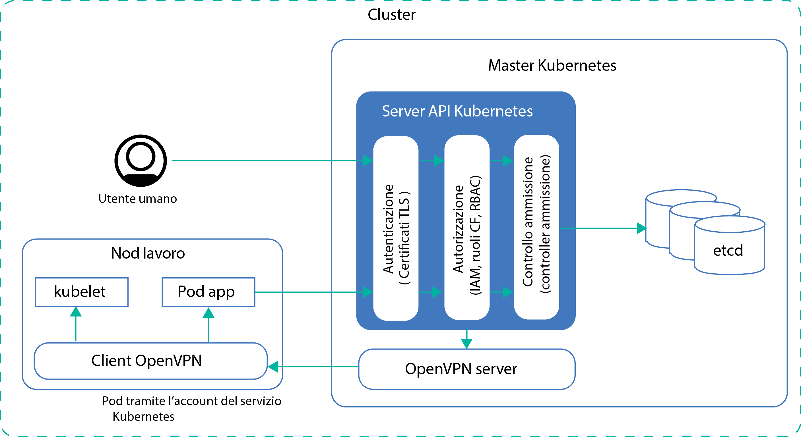
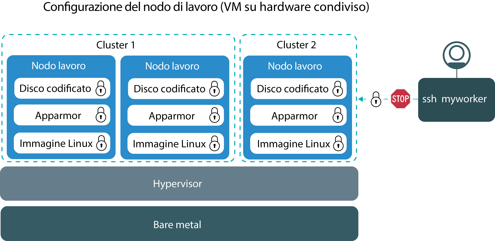
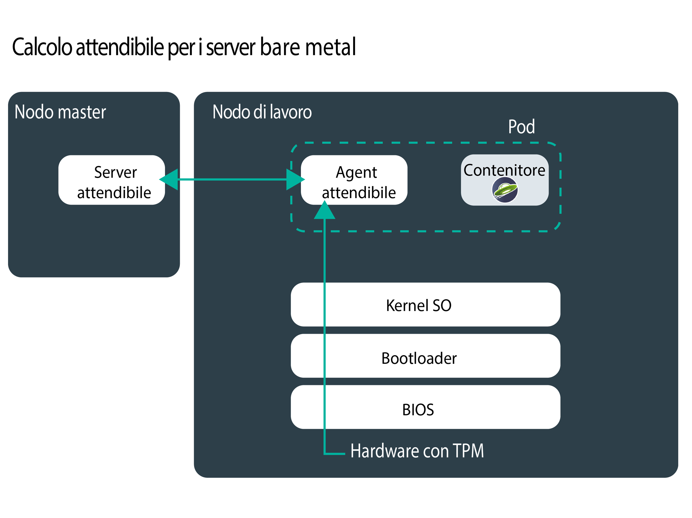
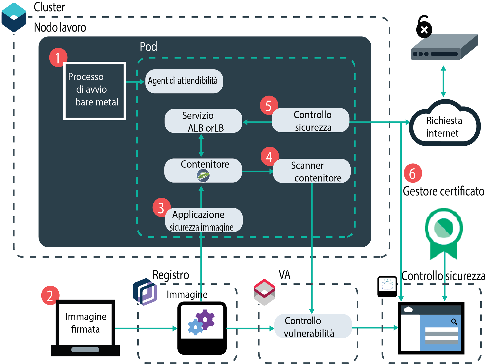
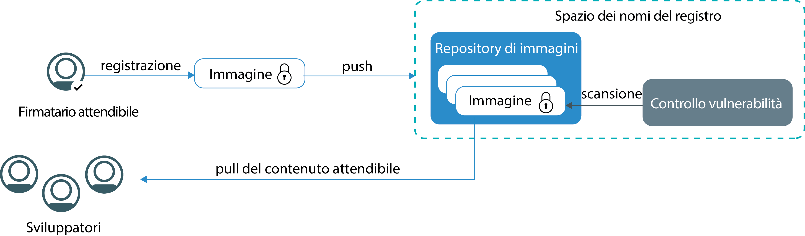
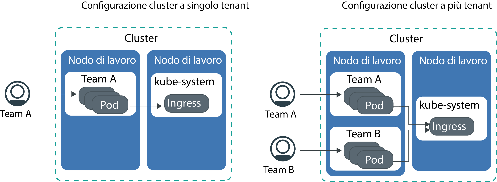

---

copyright:
  years: 2014, 2019
lastupdated: "2019-06-05"

keywords: kubernetes, iks

subcollection: containers

---

{:new_window: target="_blank"}
{:shortdesc: .shortdesc}
{:screen: .screen}
{:pre: .pre}
{:table: .aria-labeledby="caption"}
{:codeblock: .codeblock}
{:tip: .tip}
{:note: .note}
{:important: .important}
{:deprecated: .deprecated}
{:download: .download}
{:preview: .preview}

# Sicurezza per {{site.data.keyword.containerlong_notm}}
{: #security}

Puoi utilizzare le funzioni di sicurezza integrate in {{site.data.keyword.containerlong}} per l'analisi dei rischi e la protezione di sicurezza. Queste funzioni ti aiutano a proteggere la tua infrastruttura cluster Kubernetes e le comunicazioni di rete, isolare le tue risorse di calcolo e garantire la conformità di sicurezza tra i componenti della tua infrastruttura e le distribuzioni del contenitore.
{: shortdesc}

## Panoramica delle minacce alla sicurezza per il tuo cluster
{: #threats}

Per proteggere il tuo cluster da attacchi che potrebbero comprometterlo, devi comprendere i potenziali rischi per la sicurezza per il tuo cluster e cosa puoi fare per ridurre l'esposizione alle vulnerabilità.
{: shortdesc}

La sicurezza cloud e la protezione dei tuoi sistemi, della tua infrastruttura e dei tuoi dati da attacchi sono diventati fattori molto importanti nell'ultimo paio di anni poiché le aziende continuano a spostare i loro carichi di lavoro nel cloud pubblico. Un cluster è costituito da diversi componenti e ciascuno di essi può esporre il tuo ambiente ad attacchi dolosi. Per proteggere il tuo cluster da queste minacce alla sicurezza, ti devi assicurare di applicare le funzioni e gli aggiornamenti della sicurezza {{site.data.keyword.containerlong_notm}} e Kubernetes più recenti in tutti i componenti del cluster.

Questi componenti includono:
- [Server API Kubernetes e archivio dati etcd](#apiserver)
- [Nodi di lavoro](#workernodes)
- [Rete](#network)
- [Archiviazione persistente](#storage)
- [Monitoraggio e registrazione](#monitoring_logging)
- [Immagini e registro contenitore](#images_registry)
- [Isolamento e sicurezza contenitore](#container)
- [Informazioni personali](#pi)

 

## Server API Kubernetes ed etcd
{: #apiserver}

Il server API Kubernetes ed etcd sono i componenti più vulnerabili eseguiti nel tuo master Kubernetes. Se un utente o un sistema non autorizzati ottengono l'accesso al tuo server API Kubernetes, possono modificare le impostazioni e manipolare o assumere il controllo del tuo cluster, il che espone quest'ultimo al rischio di attacchi dolosi.
{: shortdesc}

Per proteggere il tuo server API Kubernetes e il tuo archivio dati etcd, devi proteggere e limitare l'accesso al tuo server API Kubernetes sia per gli utenti reali che per gli account di servizio Kubernetes.

**In che modo viene concesso l'accesso al mio server API Kubernetes?**  
Per impostazione predefinita, Kubernetes esige che ogni richiesta passi per diverse fasi prima che venga concesso l'accesso al server API:

<ol><li><strong>Autenticazione: </strong>convalida l'identità di un account utente o di servizio registrato.</li><li><strong>Autorizzazione: </strong>limita le autorizzazioni degli utenti e degli account di servizio autenticati per garantire che possano accedere e utilizzare solo i componenti cluster che tu vuoi.</li><li><strong>Controllo di ammissione: </strong>convalida o modifica le richieste prima che vengano elaborate dal server API Kubernetes. Per funzionare correttamente, molte funzioni Kubernetes richiedono i controller di ammissione.</li></ol>

**Cosa fa {{site.data.keyword.containerlong_notm}} per proteggere il mio server API Kubernetes e il mio archivio dati etcd?**  
La seguente immagine mostra le impostazioni di sicurezza del cluster predefinite che si occupano di autenticazione, autorizzazione, controllo di ammissione e connettività protetta tra i nodi master e di lavoro Kubernetes.

<table>
<caption>Sicurezza di server API Kubernetes ed etcd</caption>
  <thead>
  <th>Funzione di sicurezza</th>
  <th>Descrizione</th>
  </thead>
  <tbody>
    <tr>
      <td>Master Kubernetes dedicato completamente gestito</td>
      <td>
Ogni cluster Kubernetes in {{site.data.keyword.containerlong_notm}} è controllato da un master Kubernetes dedicato gestito da IBM in un account dell'infrastruttura IBM Cloud (SoftLayer) di proprietà di IBM. Il master Kubernetes è configurato con i seguenti componenti dedicati che non sono condivisi con altri clienti IBM.

        <ul><li><strong>archivio dati etcd</strong> memorizza tutte le risorse Kubernetes di un cluster, ad esempio `Servizi`, `Distribuzioni` e `Pod`. Le `Mappe di configurazione` e i `Segreti` di Kubernetes sono dati dell'applicazione che vengono memorizzati come coppie chiave-valore in modo che possano essere utilizzati da un'applicazione che viene eseguita in un pod. I dati in etcd sono memorizzati sul disco locale del master Kubernetes e ne viene eseguito il backup su {{site.data.keyword.cos_full_notm}}. I dati vengono crittografati durante il transito su {{site.data.keyword.cos_full_notm}} e quando inattivi. Puoi scegliere di abilitare la crittografia per i tuoi dati etcd sul disco locale del tuo master Kubernetes [abilitando la crittografia {{site.data.keyword.keymanagementservicelong_notm}}](/docs/containers?topic=containers-encryption#encryption) per il tuo cluster. I dati etcd per i cluster che eseguono una versione precedente di Kubernetes sono memorizzati su un disco crittografato gestito da IBM e sottoposto a backup giornaliero. Quando i dati etcd vengono inviati a un pod, i dati vengono crittografati tramite TLS per garantirne la protezione e l'integrità.</li>
          <li><strong>kube-apiserver:</strong> funge da punto di ingresso principale per tutte le richieste di gestione del cluster dal nodo di lavoro al master Kubernetes. kube-apiserver convalida ed elabora le richieste e può leggere e scrivere nell'archivio dati etcd.</li>
          <li><strong>kube-scheduler:</strong> decide dove distribuire i pod tenendo conto dei bisogni di prestazioni e capacità dell'account, dei vincoli della politica software, delle specifiche dell'anti-affinità e dei requisiti del carico di lavoro. Se non è possibile trovare alcun nodo di lavoro che corrisponda ai requisiti, il pod non viene distribuito nel cluster.</li>
          <li><strong>kube-controller-manager:</strong> responsabile del monitoraggio delle serie di repliche e della creazione dei pod corrispondenti per raggiungere lo stato specificato.</li>
          <li><strong>OpenVPN:</strong> componente specifico di {{site.data.keyword.containerlong_notm}} per fornire la connettività di rete protetta per tutte le comunicazioni tra master Kubernetes e i nodi di lavoro. Le comunicazioni tra master Kubernetes e nodi di lavoro vengono avviate dall'utente e includono i comandi <code>kubectl</code>, quali <code>logs</code>, <code>attach</code>, <code>exec</code> e <code>top</code>.</li></ul></td>
    </tr>
    <tr>
    <td>Monitoraggio continuo da parte dei Site Reliability Engineer (SRE) IBM</td>
    <td>Il master Kubernetes, incluse tutte le risorse di calcolo, di rete e di archiviazione del componente master, viene continuamente monitorato dagli SRE (Site Reliability Engineer) IBM. Gli SRE applicano i più recenti standard di sicurezza, rilevano e correggono le attività dannose e operano per garantire l'affidabilità e la disponibilità di {{site.data.keyword.containerlong_notm}}. </td>
    </tr>
    <tr>
      <td>Comunicazioni protette tramite TLS</td>
      <td>Per utilizzare {{site.data.keyword.containerlong_notm}} devi eseguire l'autenticazione presso il servizio utilizzando le tue credenziali. Quando vieni autenticato, {{site.data.keyword.containerlong_notm}} genera i certificati TLS che crittografano le comunicazioni verso e dal server API Kubernetes e verso e dall'archivio dati etcd per garantire comunicazioni end-to-end protette tra i nodi di lavoro e il master Kubernetes. Questi certificati non sono mai condivisi tra i cluster o tra i componenti master Kubernetes. </td>
    </tr>
    <tr>
      <td>Connettività OpenVPN ai nodi di lavoro</td>
      <td>Anche se Kubernetes protegge le comunicazioni tra il master Kubernetes e i nodi di lavoro utilizzando il protocollo
<code>https</code>, non viene fornita alcuna autenticazione al nodo di lavoro per
impostazione predefinita. Per proteggere queste comunicazioni, {{site.data.keyword.containerlong_notm}} configura automaticamente una connessione OpenVPN
tra il master Kubernetes e il nodo di lavoro quando viene creato il cluster.</td>
    </tr>
    <tr>
      <td>Controllo dell'accesso dettagliato</td>
      <td>In quanto amministratore dell'account, puoi [concedere l'accesso ad altri utenti per {{site.data.keyword.containerlong_notm}}](/docs/containers?topic=containers-users#users) utilizzando {{site.data.keyword.Bluemix_notm}} IAM (Identity and Access Management). {{site.data.keyword.Bluemix_notm}} IAM fornisce un'autenticazione sicura con la piattaforma {{site.data.keyword.Bluemix_notm}}, {{site.data.keyword.containerlong_notm}} e tutte le risorse nel tuo account. Configurare dei ruoli e delle autorizzazioni utente appropriati è un fattore chiave per limitare chi può accedere alle tue risorse e limitare il danno che un utente può arrecare quando vengono utilizzate in modo improprio delle autorizzazioni legittime.   Puoi selezionare dai seguenti ruoli utente predefiniti che determinano l'insieme di azioni che l'utente può eseguire: <ul><li><strong>Ruoli della piattaforma:</strong> determina le azioni correlate a cluster e nodi di lavoro che un utente può eseguire in {{site.data.keyword.containerlong_notm}}.</li><li><strong>Ruoli dell'infrastruttura:</strong> determinano le autorizzazioni per ordinare, aggiornare o rimuovere risorse dell'infrastruttura, quali nodi di lavoro, VLAN o sottoreti.</li><li><strong>Ruoli RBAC Kubernetes:</strong> determina i comandi `kubectl` che gli utenti possono eseguire quando sono autorizzati ad accedere a un cluster. I ruoli RBAC vengono configurati automaticamente per lo spazio dei nomi predefinito di un cluster. Per utilizzare gli stessi ruoli RBAC in altri spazi dei nomi, puoi copiare i ruoli RBAC dallo spazio dei nomi predefinito.  </li></ul>  Invece di utilizzare i ruoli utente predefiniti, puoi scegliere di [personalizzare le autorizzazioni dell'infrastruttura](/docs/containers?topic=containers-users#infra_access) o [configurare i tuoi ruoli RBAC](/docs/containers?topic=containers-users#rbac) per aggiungere un controllo dell'accesso più dettagliato. </td>
    </tr>
    <tr>
      <td>Controller di ammissione</td>
      <td>I controller di ammissione sono implementati per specifiche funzioni in Kubernetes e {{site.data.keyword.containerlong_notm}}. Con i controller di ammissione, puoi configurare le politiche nel tuo cluster che determinano se una specifica azione nel cluster è consentita o meno. Nella politica, puoi specificare le condizioni quando un utente non può eseguire un'azione, anche se tale azione fa parte delle autorizzazioni generali da te assegnate all'utente utilizzando RBAC. Pertanto, i controller di ammissione possono fornire un livello supplementare di sicurezza per il tuo cluster prima che una richiesta API venga elaborata dal server API Kubernetes.    Quando crei un cluster, {{site.data.keyword.containerlong_notm}} installa automaticamente i seguenti [controller di ammissione Kubernetes](https://kubernetes.io/docs/admin/admission-controllers/) nel master Kubernetes, che non possono essere modificati dall'utente. <ul>
      <li>`DefaultTolerationSeconds`</li>
      <li>`DefaultStorageClass`</li>
      <li>`GenericAdmissionWebhook`</li>
      <li>`Initializers` (Kubernetes 1.13 o versioni precedenti)</li>
      <li>`LimitRanger`</li>
      <li>`MutatingAdmissionWebhook`</li>
      <li>`NamespaceLifecycle`</li>
      <li>`NodeRestriction` (Kubernetes 1.14 o versioni successive)</li>
      <li>`PersistentVolumeLabel`</li>
      <li>[`PodSecurityPolicy`](/docs/containers?topic=containers-psp#ibm_psp)</li>
      <li>[`Priority`](/docs/containers?topic=containers-pod_priority#pod_priority) (Kubernetes 1.11 o versioni successive)</li>
      <li>`ResourceQuota`</li>
      <li>`ServiceAccount`</li>
      <li>`StorageObjectInUseProtection`</li>
      <li>`TaintNodesByCondition` (Kubernetes 1.12 o versioni successive)</li>
      <li>`ValidatingAdmissionWebhook`</li></ul> 
      Puoi [installare i tuoi controller di ammissione nel cluster ](https://kubernetes.io/docs/reference/access-authn-authz/extensible-admission-controllers/#admission-webhooks) oppure scegliere dai controller di ammissione facoltativi forniti da {{site.data.keyword.containerlong_notm}}. <ul><li><strong>[Container Image Security Enforcer](/docs/services/Registry?topic=registry-security_enforce#security_enforce):</strong> utilizza questo controller di ammissione per implementare le politiche del Controllo vulnerabilità nel tuo cluster per bloccare le distribuzioni da immagini vulnerabili.</li></ul> 
Se hai installato manualmente i controller di ammissione e non vuoi più usarli, assicurati di rimuoverli completamente. Se i controller di ammissione non vengono rimossi completamente, potrebbero bloccare tutte le azioni che vuoi eseguire sul cluster.
</td>
    </tr>
  </tbody>
</table>

**Cos'altro posso fare per proteggere il mio server API Kubernetes?** 

Se il tuo cluster è connesso a una VLAN privata e a una pubblica, {{site.data.keyword.containerlong_notm}} configura automaticamente una connessione OpenVPN protetta tra il master cluster e i nodi di lavoro tramite un endpoint del servizio pubblico. Se la VRF è abilitata nel tuo account {{site.data.keyword.Bluemix_notm}}, puoi consentire al tuo master cluster e ai tuoi nodi di lavoro di comunicare invece sulla rete privata mediante un endpoint del servizio privato.

Gli endpoint del servizio determinano il modo in cui i nodi di lavoro e gli utenti del cluster possono accedere al master cluster.
* Solo endpoint del servizio pubblico: una connessione OpenVPN sicura tra il master cluster e i nodi di lavoro viene stabilita sulla rete pubblica. Il master è pubblicamente accessibile ai tuoi utenti del cluster.
* Endpoint del servizio pubblico e privato: Le comunicazioni vengono stabilite sulla rete privata attraverso l'endpoint del servizio privato e sulla rete pubblica attraverso l'endpoint del servizio pubblico. Instradando
metà del traffico nodo di lavoro-master sull'endpoint pubblico e metà sull'endpoint privato, le tue comunicazioni master-nodo di lavoro sono protette da eventuali interruzioni della rete pubblica o privata. Il master è accessibile privatamente tramite l'endpoint del servizio privato se gli utenti del cluster autorizzati si trovano nella tua rete privata {{site.data.keyword.Bluemix_notm}} o sono connessi alla rete privata tramite una connessione VPN. In caso contrario, il master è pubblicamente accessibile agli utenti del cluster autorizzati attraverso l'endpoint del servizio pubblico.
* Solo endpoint del servizio privato: le comunicazioni tra il master e i nodi di lavoro vengono stabilite sulla rete privata. Per accedere al master, gli utenti del tuo cluster devono trovarsi nella tua rete privata {{site.data.keyword.Bluemix_notm}} o connettersi alla rete privata tramite una connessione VPN.

Per ulteriori informazioni sugli endpoint del servizio, vedi [Comunicazioni nodo di lavoro-master e utente-master](/docs/containers?topic=containers-plan_clusters#workeruser-master).

 

## Nodo di lavoro
{: #workernodes}

I nodi di lavoro contengono le distribuzioni e dei servizi che formano la tua applicazione. Quando ospiti dei carichi di lavoro nel cloud pubblico, vuoi assicurarti che la tua applicazione sia protetta da eventuali accessi, modifiche o monitoraggio da parte di utenti o software non autorizzati.
{: shortdesc}

**Chi possiede il nodo di lavoro ed è una mia responsabilità proteggerlo?**  
La proprietà di un nodo di lavoro dipende dal tipo di cluster che crei. I nodi di lavoro nei cluster gratuiti sono forniti nell'account dell'infrastruttura di IBM Cloud (SoftLayer) di proprietà di IBM. Puoi distribuire le applicazioni al nodo di lavoro ma non puoi modificare le impostazioni o installare ulteriore software nel nodo di lavoro. A causa della capacità limitata e delle funzioni {{site.data.keyword.containerlong_notm}} limitate, non eseguire carichi di lavoro di produzione sui cluster gratuiti. Considera l'utilizzo di cluster standard per i tuoi carichi di lavoro di produzione.

Il provisioning dei nodi di lavoro nei cluster standard viene eseguito nell'account dell'infrastruttura IBM Cloud (SoftLayer) associato al tuo account {{site.data.keyword.Bluemix_notm}} pubblico o dedicato. I nodi di lavoro sono dedicati al tuo account ed è una tua responsabilità richiedere degli aggiornamenti tempestivi ai nodi di lavoro per garantire che i componenti {{site.data.keyword.containerlong_notm}} e il sistema operativo dei nodi di lavoro siano applicati con gli aggiornamenti e le patch di sicurezza più recenti.

Utilizza il [comando](/docs/containers?topic=containers-cli-plugin-kubernetes-service-cli#cs_worker_update) `ibmcloud ks worker-update` regolarmente (ad esempio ogni mese) per distribuire gli aggiornamenti e le patch di sicurezza al sistema operativo e per aggiornare la versione di Kubernetes. Quando sono disponibili degli aggiornamenti, ricevi una notifica quando visualizzi le informazioni sui nodi master e di lavoro nella console o nella CLI {{site.data.keyword.Bluemix_notm}}, ad esempio con i comandi `ibmcloud ks clusters` o `ibmcloud ks workers --cluster <cluster_name>`. Gli aggiornamenti dei nodi di lavoro sono forniti da IBM come un'immagine del nodo di lavoro completa che include le patch di sicurezza più recenti. Per applicare gli aggiornamenti, è necessario ricercare l'immagine e ricaricare il nodo di lavoro con la nuova immagine. Le chiavi per l'utente root vengono ruotate automaticamente quando il nodo di lavoro viene ricaricato.
{: important}

**Come si presenta la mia configurazione dei nodi di lavoro?** 
La seguente immagine mostra i componenti configurati per ogni nodo di lavoro per proteggerli da attacchi dolosi.

L'immagine non include componenti che garantiscono comunicazioni end-to-end sicure da e verso il nodo di lavoro. Per ulteriori informazioni, vedi la sezione relativa alla [sicurezza di rete](#network).
{: note}

<table>
<caption>Configurazione della sicurezza dei nodi di lavoro</caption>
  <thead>
  <th>Funzione di sicurezza</th>
  <th>Descrizione</th>
  </thead>
  <tbody>
    <tr><td>Immagine Linux conforme a CIS</td><td>Ogni nodo di lavoro è configurato con un sistema operativo Ubuntu che implementa i benchmark pubblicati dal CIS (Center for Internet Security). Il sistema operativo Ubuntu non può essere modificato dall'utente o dal proprietario della macchina. Per controllare la versione attuale di Ubuntu, esegui <code>kubectl get nodes -o wide</code>. IBM collabora con team di sicurezza esterni e interni per risolvere le vulnerabilità di conformità di sicurezza potenziali. Gli aggiornamenti e le patch di sicurezza per il sistema operativo sono resi disponibili tramite {{site.data.keyword.containerlong_notm}} e devono essere installati dall'utente per mantenere protetto il nodo di lavoro.
{{site.data.keyword.containerlong_notm}} utilizza un kernel Linux Ubuntu per i nodi di lavoro. Puoi eseguire contenitori basati su qualsiasi distribuzione Linux in {{site.data.keyword.containerlong_notm}}. Verifica insieme al tuo fornitore dell'immagine contenitore se supporta l'immagine contenitore da eseguire sui kernel Linux Ubuntu.
</td></tr>
    <tr>
    <td>Monitoraggio continuo da parte dei Site Reliability Engineer (SRE) </td>
    <td>L'immagine Linux installata sui tuoi nodi di lavoro è continuamente monitorata dagli SRE (Site Reliability Engineer) IBM per rilevare vulnerabilità e problemi di conformità di sicurezza. Per affrontare le vulnerabilità, gli SRE creano patch di sicurezza e fix pack per i tuoi nodi di lavoro. Assicurati di applicare queste patch quando disponibili per garantire un ambiente sicuro per i tuoi nodi di lavoro e per le applicazioni eseguite su di essi.</td>
    </tr>
    <tr>
  <td>Isolamento di calcolo</td>
  <td>I nodi di lavoro sono dedicati a un cluster e non ospitano i carichi di lavoro di altri cluster. Quando crei un cluster standard, puoi scegliere di eseguire il provisioning dei tuoi nodi di lavoro come [macchine fisiche (bare metal) o come macchine virtuali](/docs/containers?topic=containers-planning_worker_nodes#planning_worker_nodes) eseguite su hardware fisico condiviso o dedicato. Il provisioning del nodo di lavoro in un cluster gratuito viene eseguito automaticamente come un nodo condiviso virtuale nell'account dell'infrastruttura IBM Cloud (SoftLayer) di proprietà di IBM.</td>
</tr>
<tr>
<td>Opzione per la distribuzione bare metal</td>
<td>Se scegli di eseguire il provisioning dei nodi di lavoro su server fisici bare metal (anziché sulle istanze di server virtuali), hai un ulteriore controllo sull'host di calcolo, ad esempio la memoria o la CPU. Questa configurazione elimina l'hypervisor della macchina virtuale che assegna risorse fisiche alle macchine virtuali eseguite sull'host. Invece, tutte le risorse di una macchina bare metal sono dedicate esclusivamente al nodo di lavoro, quindi non devi preoccuparti degli "elementi di disturbo" che condividono risorse o rallentano le prestazioni. I server bare metal sono dedicati a te, con tutte le sue risorse disponibili per l'utilizzo del cluster.</td>
</tr>
<tr>
  <td id="trusted_compute">Opzione per Trusted Compute</td>
    <td>Quando distribuisci il tuo cluster su bare metal che supporta Trusted Compute, puoi [abilitare l'attendibilità](/docs/containers?topic=containers-cli-plugin-kubernetes-service-cli#cs_cluster_feature_enable). Il chip TPM (Trusted Platform Module) viene abilitato su ciascun nodo di lavoro bare metal nel cluster che supporta Trusted Compute (inclusi i futuri nodi che aggiungerai al cluster). Pertanto, dopo aver abilitato l'attendibilità, non puoi disabilitarla successivamente per il cluster. Un server di attendibilità viene distribuito sul nodo master e un agent di attendibilità viene distribuito come pod sul nodo di lavoro. All'avvio del nodo di lavoro, il pod dell'agent di attendibilità monitora ogni fase del processo.
L'hardware è alla base dell'attendibilità, che invia le misurazioni utilizzando il TPM. TPM genera chiavi di crittografia utilizzate per proteggere la trasmissione dei dati di misurazione durante l'intero processo. L'agent di attendibilità trasferisce al server di attendibilità la misurazione di ciascun componente nel processo di avvio: dal firmware del BIOS che interagisce con l'hardware del TPM al kernel del sistema operativo e bootloader. Quindi, l'agent attendibile confronta queste misurazioni con i valori previsti nel server attendibile per attestare se l'avvio è stato valido. Il processo di calcolo attendibile non monitora altri pod nei tuoi nodi di lavoro, come ad esempio le applicazioni.

Ad esempio, se un utente non autorizzato ottiene l'accesso al tuo sistema e modifica il kernel del sistema operativo con un'ulteriore logica per raccogliere i dati, l'agent di attendibilità individua questa modifica e contrassegna il nodo come non attendibile. Con il calcolo attendibile puoi verificare possibili tentativi di intrusione nei tuoi nodi di lavoro.

    
Trusted Compute è disponibile per alcuni tipi di macchina bare metal selezionati. Ad esempio, le varietà GPU `mgXc` non supportano Trusted Compute.

    

</td>
  </tr>
    <tr>
  <td id="encrypted_disk">Dischi crittografati</td>
    <td>Per impostazione predefinita, il provisioning di ogni nodo di lavoro viene eseguito con due partizioni di dati SSD con crittografia AES a 256 bit locali. La prima partizione contiene l'immagine kernel utilizzata per avviare il nodo di lavoro e non è crittografata. La seconda partizione contiene il file system del contenitore ed è sbloccata utilizzando le chiavi di crittografia LUKS. Ogni nodo di lavoro in ogni cluster Kubernetes ha la propria chiave di crittografia LUKS, gestita da {{site.data.keyword.containerlong_notm}}. Quando crei un cluster o aggiungi un nodo di lavoro a un cluster esistente, le chiavi vengono trasmesse in modo sicuro e quindi scartate dopo che il disco codificato viene sbloccato. 
La crittografia può influire sulle prestazioni I/O del disco. Per i carichi di lavoro che richiedono I/O del disco di alte prestazioni, esegui il test di un cluster con la codifica sia abilitata che disabilitata per aiutarti a decidere se disattivarla.
</td>
      </tr>
    <tr>
      <td>Politiche AppArmor degli esperti</td>
      <td>Ogni nodo di lavoro è configurato con politiche di sicurezza e di accesso che vengono implementate da profili [AppArmor ](https://wiki.ubuntu.com/AppArmor) che vengono caricati nel nodo di lavoro durante il bootstrap. I profili AppArmor non possono essere modificati dall'utente o dal proprietario della macchina. </td>
    </tr>
    <tr>
      <td>SSH disabilitato</td>
      <td>Per impostazione predefinita, l'accesso SSH è disabilitato sul nodo di lavoro per proteggere il tuo cluster da attacchi dolosi. Quando l'accesso SSH è disabilitato, l'accesso al cluster viene forzato tramite il server API Kubernetes. Il server API Kubernetes richiede che ogni richiesta venga controllata rispetto alle politiche impostate nel modulo di autenticazione, autorizzazione e controllo di ammissione prima che la richiesta venga eseguita nel cluster.     Se hai un cluster standard e vuoi installare ulteriori funzioni sul tuo nodo di lavoro, puoi scegliere tra i componenti aggiuntivi forniti da {{site.data.keyword.containerlong_notm}} oppure utilizzare le [serie di daemon Kubernetes ](https://kubernetes.io/docs/concepts/workloads/controllers/daemonset/) per tutto quello che vuoi eseguire su ogni nodo di lavoro. Per qualsiasi azione monouso che devi eseguire, utilizza i [lavori Kubernetes ](https://kubernetes.io/docs/concepts/workloads/controllers/jobs-run-to-completion/).</td>
    </tr>
  </tbody>
  </table>

 

## Rete
{: #network}
L'approccio classico per proteggere una rete aziendale consiste nel configurare un firewall e bloccare tutto il traffico di rete indesiderato alle tue applicazioni. Anche se questo è ancora vero, la ricerca dimostra che molti attacchi dolosi provengono da persone interne o da utenti autorizzati che utilizzano in modo improprio le autorizzazioni ad essi assegnate.
{: shortdesc}

Per proteggere la tua rete e limitare la gamma di danni che un utente può produrre quando gli viene concesso l'accesso a una rete, devi assicurarti che i tuoi carichi di lavoro siano il più isolati possibile e di limitare il numero di applicazioni e nodi di lavoro esposti pubblicamente.

**Quale traffico di rete è consentito per il mio cluster, per impostazione predefinita?** 
Tutti i contenitori sono protetti dalle [impostazioni della politica di rete Calico predefinite](/docs/containers?topic=containers-network_policies#default_policy) che sono configurate su ogni nodo di lavoro durante la creazione del cluster. Per impostazione predefinita, tutto il traffico di rete in uscita è consentito per tutti i nodi di lavoro. Il traffico di rete in entrata è bloccato, fatta eccezione per alcune porte che sono aperte per consentire a IBM di monitorare il traffico di rete e di installare automaticamente aggiornamenti di sicurezza per il master Kubernetes. L'accesso dal master Kubernetes al kubelet del nodo di lavoro è protetto da un tunnel OpenVPN. Per ulteriori informazioni, vedi l'[architettura di {{site.data.keyword.containerlong_notm}}](/docs/containers?topic=containers-ibm-cloud-kubernetes-service-technology).

Se vuoi consentire il traffico di rete in entrata da internet, devi esporre le tue applicazioni con un [servizio NodePort, un NLB (network load balancer) o un ALB (application load balancer) Ingress](/docs/containers?topic=containers-cs_network_planning#external).  

{: #network_segmentation}
**Cos'è la segmentazione di rete e come posso configurarla per un cluster?**  
La segmentazione di rete descrive l'approccio di dividere una rete in più sottoreti. Puoi raggruppare le applicazioni e i dati correlati a cui deve avere accesso uno specifico gruppo nella tua organizzazione. Le applicazioni eseguite in una sottorete non possono vedere o accedere alle applicazioni in un'altra sottorete. La segmentazione di rete limita anche l'accesso fornito a una persona interna o a software di terze parti e può limitare la gamma di attività dolose.   

{{site.data.keyword.containerlong_notm}} fornisce delle VLAN dell'infrastruttura IBM Cloud (SoftLayer) che garantiscono delle prestazioni di rete di qualità e un isolamento della rete per i nodi di lavoro. Una VLAN configura un gruppo di
nodi di lavoro come se fossero collegati con lo stesso cavo fisico. Le VLAN sono dedicate al tuo account {{site.data.keyword.Bluemix_notm}} e non sono condivise tra i clienti IBM. Se hai più VLAN per un cluster, più sottoreti sulla stessa VLAN o un cluster multizona, devi abilitare una [VRF (Virtual Router Function)](/docs/infrastructure/direct-link?topic=direct-link-overview-of-virtual-routing-and-forwarding-vrf-on-ibm-cloud#overview-of-virtual-routing-and-forwarding-vrf-on-ibm-cloud) per il tuo account dell'infrastruttura IBM Cloud (SoftLayer) in modo che i tuoi nodi di lavoro possano comunicare tra loro sulla rete privata. Per abilitare VRF, [contatta il tuo rappresentante dell'account dell'infrastruttura IBM Cloud (SoftLayer)](/docs/infrastructure/direct-link?topic=direct-link-overview-of-virtual-routing-and-forwarding-vrf-on-ibm-cloud#how-you-can-initiate-the-conversion). Se non puoi o non vuoi abilitare VRF, abilita lo [spanning della VLAN](/docs/infrastructure/vlans?topic=vlans-vlan-spanning#vlan-spanning). Per eseguire questa azione, ti serve l'[autorizzazione dell'infrastruttura](/docs/containers?topic=containers-users#infra_access) **Rete > Gestisci il VLAN Spanning di rete** oppure puoi richiedere al proprietario dell'account di abilitarlo. Per controllare se lo spanning della VLAN è già abilitato, usa il [comando](/docs/containers?topic=containers-cli-plugin-kubernetes-service-cli#cs_vlan_spanning_get) `ibmcloud ks vlan-spanning-get --region <region>`.

Quando abiliti la VRF o lo spanning della VLAN per il tuo account, la segmentazione di rete viene rimossa per i tuoi cluster.

Esamina la seguente tabella per vedere le opzioni a tua disposizione relative a come ottenere la segmentazione di rete quando abiliti la VRF o lo spanning della VLAN per il tuo account.

|Funzione di sicurezza|Descrizione|
|-------|----------------------------------|
|Configura le politiche di rete personalizzate con Calico|Puoi utilizzare l'interfaccia Calico integrata per [configurare le politiche di rete Calico personalizzate](/docs/containers?topic=containers-network_policies#network_policies) per i tuoi nodi di lavoro. Ad esempio, puoi consentire o bloccare il traffico di rete su specifiche interfacce di rete e per specifici pod o servizi. Per configurare le politiche di rete personalizzate, devi [installare la CLI <code> calicoctl </code>](/docs/containers?topic=containers-network_policies#cli_install).|
|Supporto per i firewall di rete dell'infrastruttura IBM Cloud (SoftLayer)|{{site.data.keyword.containerlong_notm}} è compatibile con tutte le [offerte firewall dell'infrastruttura IBM Cloud (SoftLayer) ](https://www.ibm.com/cloud-computing/bluemix/network-security). Su {{site.data.keyword.Bluemix_notm}} pubblico,
puoi configurare un firewall con politiche di rete personalizzate per fornire
una sicurezza di rete dedicata al tuo cluster standard e per rilevare e risolvere intrusioni di rete. Ad esempio, puoi scegliere di configurare una [VRA (Virtual Router Appliance)](/docs/infrastructure/virtual-router-appliance?topic=virtual-router-appliance-about-the-vra) perché funga da tuo firewall e blocchi il traffico indesiderato. Quando configuri un firewall, [devi anche aprire le porte e gli indirizzi IP necessari](/docs/containers?topic=containers-firewall#firewall) per ogni regione in modo che il master e i nodi di lavoro possano comunicare.|
{: caption="Opzioni di segmentazione della rete" caption-side="top"}

**Cos'altro posso fare per ridurre l'area di esposizione ad attacchi esterni?** 
Maggiore è il numero di applicazioni o nodi di lavoro che esponi pubblicamente e più complessa diventa la procedura che devi implementare per evitare attacchi dolosi esterni. Esamina la seguente tabella per trovare le opzioni relative a come mantenere private le applicazioni e i nodi di lavoro.

|Funzione di sicurezza|Descrizione|
|-------|----------------------------------|
|Limita il numero di applicazioni esposte|Per impostazione predefinita, le tue applicazioni e i tuoi servizi eseguiti all'interno del cluster non sono raggiungibili su Internet pubblico. Puoi scegliere se vuoi esporre le tue applicazioni al pubblico o se desideri che le tue applicazioni e i tuoi servizi siano raggiungibili solo sulla rete privata. Quando mantieni le tue applicazioni e i tuoi servizi privati, puoi avvalerti delle funzioni di sicurezza integrate per garantire delle comunicazioni protette tra i nodi di lavoro e i pod. Per esporre i servizi e le applicazioni a internet pubblico, puoi avvalerti del [supporto NLB e ALB Ingress](/docs/containers?topic=containers-cs_network_planning#external) per rendere i tuoi servizi pubblicamente disponibili in modo sicuro. Assicurati che solo i servizi necessari siano esposti e rivisita l'elenco delle applicazioni esposte su base regolare per assicurarti che siano ancora valide. |
|Mantieni i nodi di lavoro privati|Quando crei un cluster, ogni cluster viene automaticamente collegato a una VLAN privata. La VLAN privata determina l'indirizzo IP privato che viene assegnato a un nodo di lavoro. Puoi scegliere di mantenere i tuoi nodi di lavoro privati connettendoli solo a una VLAN privata. Le VLAN private nei cluster gratuiti sono gestite da IBM e le VLAN private nei cluster standard sono gestite da te nel tuo account dell'infrastruttura IBM Cloud (SoftLayer).   <strong>Attenzione:</strong> tieni presente che per comunicare con il master Kubernetes, e perché {{site.data.keyword.containerlong_notm}} funzioni correttamente, devi configurare la connettività pubblica a [URL e indirizzi IP specifici](/docs/containers?topic=containers-firewall#firewall_outbound). Per configurare questa connettività pubblica, puoi configurare un firewall, come ad esempio una VRA ([Virtual Router Appliance)](/docs/infrastructure/virtual-router-appliance?topic=virtual-router-appliance-about-the-vra) davanti ai tuoi nodi di lavoro e abilitare il traffico di rete a questi URL e indirizzi IP.|
|Limita la connettività a Internet pubblico con i nodi edge|Per impostazione predefinita, ogni nodo di lavoro è configurato per accettare i pod dell'applicazione e il programma di bilanciamento del carico associato o i pod ingress. Puoi etichettare i nodi di lavoro come [nodi edge](/docs/containers?topic=containers-edge#edge) per forzare la distribuzione del programma di bilanciamento del carico e dei pod ingress solo a questi nodi di lavoro. Puoi inoltre [danneggiare i tuoi nodi di lavoro](/docs/containers?topic=containers-edge#edge_workloads) in modo che i pod dell'applicazione non possano eseguire pianificazioni sui nodi edge. Con i nodi edge, puoi isolare il carico di lavoro di rete su un numero inferiore di nodi di lavoro nel tuo cluster e mantenere privati gli altri nodi di lavoro nel cluster.|
{: caption="Servizi privati e opzioni del nodo di lavoro" caption-side="top"}

**Che devo fare se desidero connettere il mio cluster a un data center in loco?** 
Per connettere i tuoi nodi di lavoro e le tue applicazioni a un data center in loco, puoi configurare un [endpoint IPSec VPN con un servizio strongSwan, una VRA (Virtual Router Appliance) o con una FSA (Fortgate Security Appliance)](/docs/containers?topic=containers-vpn#vpn).

### Servizi LoadBalancer e Ingress
{: #network_lb_ingress}

Puoi utilizzare i servizi di rete NLB (network load balancer) e ALB (application load balancer) Ingress per connettere le tue applicazioni a internet pubblico oppure a reti private esterne. Esamina le seguenti impostazioni facoltative per NLB e ALB che puoi utilizzare per soddisfare i requisiti di sicurezza delle applicazioni di back-end o crittografare il traffico quando transita per il tuo cluster.
{: shortdesc}

**Posso utilizzare i gruppi di sicurezza per gestire il traffico di rete del mio cluster?**  
Per utilizzare i servizi NLB e ALB Ingress, utilizza le [politiche Calico e Kubernetes](/docs/containers?topic=containers-network_policies) per gestire il traffico di rete verso e dal tuo cluster. Non utilizzare i [gruppi di sicurezza](/docs/infrastructure/security-groups?topic=security-groups-about-ibm-security-groups#about-ibm-security-groups) dell'infrastruttura IBM Cloud (SoftLayer). I gruppi di sicurezza dell'infrastruttura IBM Cloud (SoftLayer) vengono applicati all'interfaccia di rete di un singolo server virtuale per filtrare il traffico a livello dell'hypervisor. Tuttavia, i gruppi di sicurezza non supportano il protocollo VRRP, che {{site.data.keyword.containerlong_notm}} utilizza per gestire l'indirizzo IP dell'NLB. Se il protocollo VRRP non è presente per gestire l'IP dell'NLB, i servizi NLB e ALB Ingress non funzionano correttamente. Se non stai utilizzando i servizi NLB e ALB Ingress e vuoi isolare completamente il tuo nodo di lavoro dal pubblico, puoi utilizzare i gruppi di sicurezza.

**Come posso proteggere l'IP di origine all'interno del cluster?**  
Negli NLB versione 2.0, l'indirizzo IP di origine della richiesta client viene conservato per impostazione predefinita. Tuttavia, negli NLB versione 1.0 e in tutti gli ALB Ingress, l'indirizzo IP di origine della richiesta client non viene conservato. Quando una richiesta client alla tua applicazione viene inviata al tuo cluster, la richiesta viene instradata a un pod per l'NLB 1.0 o l'ALB. Se sullo stesso nodo di lavoro del pod del servizio del programma di bilanciamento del carico non esiste un pod dell'applicazione, l'NLB o l'ALB inoltra la richiesta a un pod dell'applicazione su un nodo di lavoro diverso. L'indirizzo IP di origine del pacchetto viene modificato con l'indirizzo IP pubblico del nodo di lavoro su cui è in esecuzione il pod dell'applicazione.

La conservazione dell'IP del client è utile quando, ad esempio, i server delle applicazioni devono applicare le politiche di sicurezza e di controllo dell'accesso. Per conservare l'indirizzo IP di origine originale della richiesta client, puoi abilitare la conservazione dell'IP di origine per gli [NLB versione 1.0](/docs/containers?topic=containers-loadbalancer#node_affinity_tolerations) o gli [ALB Ingress](/docs/containers?topic=containers-ingress#preserve_source_ip).

**Come posso crittografare il traffico con TLS?**  
Il servizio Ingress offre la terminazione TLS in due punti nel flusso del traffico:
* [Decrittografa il pacchetto all'arrivo](/docs/containers?topic=containers-ingress#public_inside_2): per impostazione predefinita, l'ALB Ingress bilancia il carico del traffico di rete HTTP alle applicazioni nel tuo cluster. Per bilanciare anche il traffico delle connessioni HTTPS in entrata, puoi configurare l'ALB per decodificare il traffico di rete e inoltrare la richiesta decodificata alle applicazioni esposte nel tuo cluster. Se stai utilizzando il dominio secondario fornito da IBM, puoi utilizzare il certificato TLS fornito da IBM. Se stai utilizzando un dominio personalizzato, puoi utilizzare il tuo certificato TLS per gestire la terminazione TLS.
* [Crittografa nuovamente il pacchetto prima che venga inoltrato alle applicazioni upstream](/docs/containers?topic=containers-ingress_annotation#ssl-services): l'ALB decrittografa le richieste HTTPS prima di inoltrare il traffico alle tue applicazioni. Se hai delle applicazioni che richiedono HTTPS e hanno bisogno che il traffico venga crittografato prima di essere inoltrato a queste applicazioni upstream, puoi utilizzare l'annotazione `ssl-services`. Se le tue applicazioni upstream possono gestire TLS, puoi facoltativamente fornire un certificato che è contenuto in un segreto TLS unidirezionale o di autenticazione reciproca.

Per proteggere le comunicazioni tra i servizi, puoi utilizzare l'[autenticazione TLS reciproca di Istio](https://istio.io/docs/concepts/security/mutual-tls/). Istio è un servizio open source che offre agli sviluppatori un modo per connettere, proteggere, gestire e monitorare una rete di microservizi, nota anche come rete (mesh) di servizi, su piattaforme di orchestrazione cloud come Kubernetes.

 

## Archiviazione persistente
{: #storage}

Quando esegui il provisioning di archiviazione persistente per archiviare i dati nel tuo cluster, i dati vengono crittografati automaticamente e gratuitamente quando vengono archiviati nella tua archiviazione blocchi o condivisione file. La crittografia include le istantanee e l'archiviazione replicata.
{: shortdesc}

Per ulteriori informazioni sul modo in cui vengono crittografati i dati per lo specifico tipo di archiviazione, consulta i seguenti link.
- [Archiviazione file NFS](/docs/infrastructure/FileStorage?topic=FileStorage-encryption#encryption)
- [Archiviazione blocchi](/docs/infrastructure/BlockStorage?topic=BlockStorage-encryption#block-storage-encryption-at-rest)  

Puoi anche utilizzare un servizio di database {{site.data.keyword.Bluemix_notm}}, ad esempio [{{site.data.keyword.cloudant}} NoSQL DB](/docs/services/Cloudant?topic=cloudant-getting-started#getting-started), per mantenere i dati in un database gestito all'esterno del cluster. I dati che vengono archiviati con un servizio database cloud sono accessibili nei cluster, nelle zone e nelle regioni. Per le informazioni correlate alla sicurezza relative al database IBM Cloudant NoSQL, vedi la [documentazione del servizio](/docs/services/Cloudant/offerings?topic=cloudant-security#security).

 

## Monitoraggio e registrazione
{: #monitoring_logging}

La chiave per rilevare attacchi dolosi nel tuo cluster è il monitoraggio e la registrazione corretti delle metriche e di tutti gli eventi che si verificano nel cluster. Il monitoraggio e la registrazione possono inoltre aiutarti a comprendere la capacità del cluster e la disponibilità delle risorse per la tua applicazione in modo da poter pianificare di conseguenza per proteggere le tue applicazioni da un tempo di inattività.
{: shortdesc}

**IBM monitora il mio cluster?** 
Ogni master Kubernetes è continuamente monitorato da IBM per controllare e rimediare agli attacchi
DOS (Denial-Of-Service) al livello del processo. {{site.data.keyword.containerlong_notm}} esegue automaticamente la scansione di ogni nodo in cui viene distribuito il master Kubernetes alla ricerca di vulnerabilità trovate nelle correzioni di sicurezza specifiche del sistema operativo e di Kubernetes. Se vengono trovate delle vulnerabilità,
{{site.data.keyword.containerlong_notm}} automaticamente applica le correzioni
e risolve le vulnerabilità per conto dell'utente per garantire la protezione del nodo master.  

**Quali informazioni vengono registrate?** 
Per i cluster standard, puoi [configurare l'inoltro dei log](/docs/containers?topic=containers-health#logging) per tutti gli eventi correlati al cluster da origini differenti a {{site.data.keyword.loganalysislong_notm}} o a un altro server esterno in modo da poter filtrare e analizzare i tuoi log. Queste origini includono i log da:

- **Contenitori**: i log che vengono scritti in STDOUT o STDERR.
- **Applicazioni**: i log che vengono scritti in un percorso specifico all'interno della tua applicazione.
- **Nodi di lavoro**: i log dal sistema operativo Ubuntu che vengono inviati a /var/log/syslog e /var/log/auth.log.
- **Server API Kubernetes**: ogni azione correlata al cluster che viene inviata al server API Kubernetes viene registrata per motivi di controllo, inclusi la data/ora, l'utente e la risorsa interessata. Per ulteriori informazioni, consulta il documento relativo ai [log di controllo Kubernetes  ](https://kubernetes.io/docs/tasks/debug-application-cluster/audit/)
- **Componenti di sistema Kubernetes**: i log da `kubelet`, da `kube-proxy` e da altri componenti che vengono eseguiti nello spazio dei nomi `kube-system`.
- **Ingress**: i log per un ALB (application load balancer) Ingress che gestisce il traffico di rete in arrivo in un cluster.

Puoi scegliere quali eventi desideri registrare per il tuo cluster e la destinazione alla quale vuoi inoltrare i tuoi log. Per rilevare attività dolose e per verificare l'integrità del tuo cluster, devi analizzare continuamente i tuoi log.

**Come posso monitorare l'integrità e le prestazioni del mio cluster?** 
Puoi verificare la capacità e le prestazioni del tuo cluster monitorando i componenti e le risorse di calcolo del tuo cluster, come ad esempio l'utilizzo della CPU e della memoria. {{site.data.keyword.containerlong_notm}} invia automaticamente le metriche per i cluster standard a {{site.data.keyword.monitoringlong}} in modo da consentirti di [visualizzarle e analizzarle in Grafana](/docs/containers?topic=containers-health#view_metrics).

Puoi anche utilizzare gli strumenti integrati, quale la pagina dei dettagli di {{site.data.keyword.containerlong_notm}}, il dashboard Kubernetes oppure [configurare le integrazioni di terze parti](/docs/containers?topic=containers-supported_integrations#health_services), quali Prometheus, Sysdig, LogDNA, Weave Scope e altri.

Per configurare un HIDS (host-based intrusion detection system) e un SELM (security event log monitoring), installa gli strumenti di terze parti progettati per monitorare il tuo cluster e le applicazioni inserite in contenitori per rilevare intrusioni o usi impropri, ad esempio [Twistlock ](https://www.twistlock.com/) oppure il [protetto Sysdig Falco ](https://sysdig.com/opensource/falco/). Sysdig Falco è uno strumento separato e non è incluso se scegli di installare il [componente aggiuntivo Sysdig](/docs/services/Monitoring-with-Sysdig/tutorials?topic=Sysdig-kubernetes_cluster#kubernetes_cluster) fornito da IBM nel tuo cluster.  

**Come possono controllare gli eventi che si verificano nel mio cluster?** 
Puoi [configurare {{site.data.keyword.cloudaccesstraillong}} nel tuo cluster {{site.data.keyword.containerlong_notm}}](/docs/containers?topic=containers-at_events#at_events). Per ulteriori informazioni, visualizza la [documentazione di {{site.data.keyword.cloudaccesstrailshort}}](/docs/services/cloud-activity-tracker?topic=cloud-activity-tracker-activity_tracker_ov#activity_tracker_ov).

**Quali sono le mie opzioni per abilitare l'attendibilità nel mio cluster?**  
Per impostazione predefinita, {{site.data.keyword.containerlong_notm}} fornisce molte funzioni per i tuoi componenti cluster in modo da consentirti di distribuire le tue applicazioni inserite in un contenitore in un ambiente altamente sicuro. Estendi il tuo livello di attendibilità nel tuo cluster per garantire ulteriormente che le operazioni che esegui all'interno del cluster sono effettivamente quelle che desideri eseguire. Puoi implementare l'attendibilità nel tuo cluster in diversi modi, come mostrato nel seguente diagramma.

1.  **{{site.data.keyword.containerlong_notm}} con Trusted Compute**: suo nodi di lavoro bare metal, puoi abilitare l'attendibilità. L'agent di attendibilità monitora il processo di avvio dell'hardware e riporta le modifiche in modo che tu possa verificare i tentativi di intrusione nei tuoi nodi di lavoro bare metal. Con Trusted Compute, puoi distribuire i tuoi contenitori su host bare metal verificati in modo che i tuoi carichi di lavoro vengano eseguiti su hardware attendibile. Tieni presente che alcune macchine bare metal, come GPU, non supportano Trusted Compute. [Ulteriori informazioni su come funziona Trusted Compute](#trusted_compute).

2.  **Attendibilità dei contenuti per le tue immagini**: assicura l'integrità delle tue immagini abilitando l'attendibilità dei contenuti nel tuo {{site.data.keyword.registryshort_notm}}. Con i contenuti attendibili, puoi controllare chi firma le immagini come attendibili. Una volta che i firmatari attendibili inseriscono un'immagine nel tuo registro, gli utenti possono estrarre il contenuto firmato in modo che possano verificare l'origine dell'immagine. Per ulteriori informazioni, vedi [Firma le immagini per i contenuti attendibili](/docs/services/Registry?topic=registry-registry_trustedcontent#registry_trustedcontent).

3.  **Container Image Security Enforcement (beta)**: crea un controller di ammissione con politiche personalizzate in modo che tu possa verificare le immagini del contenitore prima di distribuirle. Con Container Image Security Enforcement, controlli l'ubicazione da cui vengono distribuite le immagini e garantisci che soddisfano le politiche di [Controllo vulnerabilità](/docs/services/va?topic=va-va_index) o i requisiti di [attendibilità dei contenuti](/docs/services/Registry?topic=registry-registry_trustedcontent#registry_trustedcontent). Se una distribuzione non soddisfa le politiche che hai impostato, Security Enforcement impedisce le modifiche al tuo cluster. Per ulteriori informazioni, vedi [Applicazione della sicurezza dell'immagine del contenitore (beta)](/docs/services/Registry?topic=registry-security_enforce#security_enforce).

4.  **Programma di scansione vulnerabilità del contenitore**: per impostazione predefinita, Controllo vulnerabilità esegue la scansione delle immagini memorizzate in {{site.data.keyword.registryshort_notm}}. Per controllare lo stato dei contenitori attivi in esecuzione nel tuo cluster, puoi installare il programma di scansione del contenitore. Per ulteriori informazioni, vedi [Installazione del programma di scansione del contenitore](/docs/services/va?topic=va-va_index#va_install_container_scanner).

5.  **Analisi di rete con il Security Advisor (anteprima)**: con {{site.data.keyword.Bluemix_notm}} Security Advisor, puoi centralizzare la sicurezza approfondita dai servizi {{site.data.keyword.Bluemix_notm}} come Controllo vulnerabilità e {{site.data.keyword.cloudcerts_short}}. Quando abiliti Security Advisor nel tuo cluster, puoi vedere i report relativi al traffico di rete sospetto in entrata e in uscita. Per ulteriori informazioni, vedi [Analisi di rete](/docs/services/security-advisor?topic=security-advisor-setup-network#setup-network). Per eseguire l'installazione, vedi [Impostazione del monitoraggio degli indirizzi IP server e dei client sospetti per un cluster Kubernetes](/docs/services/security-advisor?topic=security-advisor-setup-network#setup-network).

6.  **{{site.data.keyword.cloudcerts_long_notm}}**: se desideri [esporre la tua applicazione utilizzando un dominio personalizzato con TLS](/docs/containers?topic=containers-ingress#ingress_expose_public), puoi archiviare il tuo certificato TLS in {{site.data.keyword.cloudcerts_short}}. Certificati scaduti o prossimi alla scadenza possono anche essere segnalati nel tuo dashboard {{site.data.keyword.security-advisor_short}}. Per ulteriori informazioni, vedi [Introduzione a {{site.data.keyword.cloudcerts_short}}](/docs/services/certificate-manager?topic=certificate-manager-getting-started#getting-started).

 

## Immagine e registro
{: #images_registry}

Ogni distribuzione è basata su un'immagine che contiene le istruzioni su come effettuare lo spin-up del contenitore che esegue la tua applicazione. Queste istruzioni includono il sistema operativo all'interno del contenitore e del software extra che vuoi installare. Per proteggere la tua applicazione, devi proteggere l'immagine e stabilire dei controlli per garantire l'integrità dell'immagine.
{: shortdesc}

**Come uso un registro pubblico o privato per archiviare le mie immagini?**  
I registri pubblici, come ad esempio Docker Hub, possono essere utilizzati per iniziare a lavorare con le immagini Docker e Kubernetes per creare la tua prima applicazione inserita in un contenitore in un cluster. Quando si tratta però di applicazioni enterprise, evita i registri che non conosci o che non ritieni attendibili per proteggere il tuo cluster da immagini dolose. Tieni le tue immagini in un registro privato, come quello fornito in {{site.data.keyword.registryshort_notm}}, e assicurati di controllare l'accesso al registro e il contenuto dell'immagine di cui può essere eseguito il push.

**Perché è importante controllare le immagini rispetto alle vulnerabilità?**  
La ricerca mostra che la maggior parte degli attacchi dolosi sfrutta vulnerabilità software note e configurazioni di sistema deboli. Quando distribuisci un contenitore da un'immagine, il contenitore esegue lo spin-up con il sistema operativo e i file binari extra che hai descritto nell'immagine. Proprio come proteggi la tua macchina virtuale o fisica, devi eliminare le vulnerabilità note nel sistema operativo e nei file binari che usi all'interno del contenitore per proteggere la tua applicazione dall'accesso da parte di utenti non autorizzati.  

Per proteggere le tue applicazioni, considera di occuparti delle seguenti aree:

1. **Automatizza il processo di creazione e limita le autorizzazioni**:  
automatizza il processo di creazione della tua immagine del contenitore dal tuo codice sorgente per eliminare le variazioni e i difetti del codice sorgente. Integrando il processo di creazione nella tua pipeline CI/CD, puoi garantire che la tua immagine venga scansionata e creata solo se supera i controlli di sicurezza da te specificati. Per evitare che gli sviluppatori applichino degli hot fix a immagini sensibili, limita il numero di persone nella tua organizzazione che ha accesso al processo di creazione.

2. **Esegui la scansione delle immagini prima della loro distribuzione in produzione:**  
assicurati di eseguire la scansione di ogni immagine prima di distribuire un contenitore da essa. Ad esempio, se utilizzi {{site.data.keyword.registryshort_notm}}, tutte le immagini vengono automaticamente scansionate per rilevare eventuali vulnerabilità quando esegui il push dell'immagine al tuo spazio dei nomi. Se vengono rilevate delle vulnerabilità, considera di eliminare le vulnerabilità o di bloccare la distribuzione per tali immagini. Trova una persona o un team nella tua organizzazione che è responsabile del monitoraggio e della rimozione delle vulnerabilità. A seconda della struttura della tua organizzazione, questa persona potrebbe far parte di un team di sicurezza, operativo o di distribuzione. Utilizza i controller di ammissione, come ad esempio [Container Image Security Enforcement](/docs/services/Registry?topic=registry-security_enforce#security_enforce) per bloccare le distribuzioni da immagini che non hanno superato i controlli delle vulnerabilità e abilita l'[attendibilità del contenuto](/docs/services/Registry?topic=registry-registry_trustedcontent#registry_trustedcontent) in modo tale che le immagini debbano essere approvate da un firmatario ritenuto attendibile prima che ne venga eseguito il push al registro del contenitore.

3. **Esegui regolarmente la scansione dei contenitori in esecuzione.**  
anche se hai distribuito un contenitore da un'immagine che supera il controllo delle vulnerabilità, il sistema operativo o i file binari in esecuzione nel contenitore potrebbero diventare vulnerabili, nel corso del tempo. Per proteggere la tua applicazione, devi assicurarti che i contenitori in esecuzione vengano scansionati regolarmente in modo da poter rilevare e correggere le vulnerabilità. A seconda dell'applicazione, per aggiungere ulteriore sicurezza, puoi stabilire un processo che rimuove i contenitori vulnerabili dopo che questi sono stati rilevati.

**In che modo {{site.data.keyword.registryshort_notm}} può aiutarmi a proteggere le mie immagini e il processo di distribuzione?**  

<table>
<caption>Sicurezza per immagini e distribuzioni</caption>
  <thead>
    <th>Funzione di sicurezza</th>
    <th>Descrizione</th>
  </thead>
  <tbody>
    <tr>
      <td>Repository delle immagini privato Docker sicuro in {{site.data.keyword.registryshort_notm}}</td>
      <td>Configura il tuo [repository delle immagini](/docs/services/Registry?topic=registry-getting-started#getting-started) Docker in un registro delle immagini privato a più tenant, altamente disponibile e scalabile ospitato e gestito da IBM. Utilizzando il registro, puoi creare, archiviare in modo sicuro e condividere le immagini Docker tra più utenti del cluster.   Ulteriori informazioni sulla [protezione delle tue informazioni personali](/docs/containers?topic=containers-security#pi) quando utilizzi le immagini del contenitore.</td>
    </tr>
    <tr>
      <td>Push delle sole immagini con contenuto attendibile</td>
      <td>Garantisci l'integrità delle tue immagini abilitando l'[attendibilità dei contenuti](/docs/services/Registry?topic=registry-registry_trustedcontent#registry_trustedcontent) nel tuo repository delle immagini. Con il contenuto attendibile, puoi controllare chi firma le immagini come attendibili ed eseguire il push di immagini a uno specifico spazio dei nomi del registro. Dopo che i firmatari attendibili hanno eseguito il push di un'immagine a uno spazio di nomi del registro, gli utenti possono estrarre il contenuto firmato in modo da poter verificare l'editore e l'integrità dell'immagine.</td>
    </tr>
    <tr>
      <td>Scansioni delle vulnerabilità automatiche</td>
      <td>Quando utilizzi {{site.data.keyword.registryshort_notm}}, puoi avvalerti della scansione di sicurezza integrata fornita dal [Controllo vulnerabilità](/docs/services/va?topic=va-va_index#va_registry_cli). Ogni immagine di cui viene eseguito il push al tuo spazio dei nomi
del registro viene automaticamente scansionata per rilevare eventuali vulnerabilità
rispetto a un database di problemi CentOS, Debian, Red Hat e Ubuntu noti. Se vengono rilevate delle vulnerabilità,
il Controllo vulnerabilità fornisce le istruzioni su come risolverli per garantire la sicurezza e l'integrità dell'immagine.</td>
    </tr>
    <tr>
      <td>Blocco delle distribuzioni da immagini vulnerabili o utenti non attendibili</td>
      <td>Crea un controller di ammissione con politiche personalizzate in modo da poter verificare le immagini del contenitore prima di distribuirle. Con [Container Image Security Enforcement](/docs/services/Registry?topic=registry-security_enforce#security_enforce), controlli l'ubicazione da cui vengono distribuite le immagini e garantisci che soddisfano le politiche del Controllo vulnerabilità o i requisiti di attendibilità dei contenuti. Se una distribuzione non soddisfa le politiche da te impostate, il controller di ammissione blocca la distribuzione nel tuo cluster.</td>
    </tr>
    <tr>
      <td>Scansione live dei contenitori</td>
      <td>Per rilevare le vulnerabilità nei contenitori in esecuzione, puoi installare [ibmcloud-container-scanner](/docs/services/va?topic=va-va_index#va_install_container_scanner). In modo simile alle immagini, puoi configurare lo scanner del contenitore per monitorare i contenitori per rilevare eventuali vulnerabilità in tutti gli spazi dei nomi del cluster. Quando vengono rilevate delle vulnerabilità, aggiorna l'immagine di origine e ridistribuisci il contenitore.</td>
    </tr>
  </tbody>
  </table>

 

## Isolamento e sicurezza del contenitore
{: #container}

**Cos'è uno spazio dei nomi Kubernetes e perché dovrei usarlo?**  
Gli spazi dei nomi Kubernetes sono un modo per partizionare virtualmente un cluster e fornire l'isolamento per le tue distribuzioni e i gruppi di utenti che desiderano spostare il loro carico di lavoro nel cluster. Con gli spazi dei nomi, puoi organizzare le risorse nei nodi di lavoro e anche nelle zone nei cluster multizona.  

Ogni cluster è configurato con i seguenti spazi dei nomi:
- **default:** lo spazio dei nomi in cui viene distribuito tutto quanto non definisce uno spazio dei nomi specifico. Quando assegni il ruolo della piattaforma Visualizzatore, Editor oppure Operatore, l'utente può accedere allo spazio dei nomi default ma non agli spazi dei nomi `kube-system`, `ibm-system` o `ibm-cloud-cert`.
- **kube-system e ibm-system:** questo spazio dei nomi contiene le distribuzioni e i servizi richiesti per Kubernetes e {{site.data.keyword.containerlong_notm}} per gestire il cluster. Gli amministratori del cluster possono utilizzare questo spazio dei nomi per rendere una risorsa Kubernetes disponibile negli spazi dei nomi.
- **ibm-cloud-cert:** questo spazio dei nomi viene utilizzato per le risorse correlate a {{site.data.keyword.cloudcerts_long_notm}}.
- **kube-public:** a questo spazio dei nomi possono accedere tutti gli utenti, anche quelli non autenticati presso il cluster. Devi prestare attenzione a distribuire le risorse in questo spazio dei nomi poiché potresti esporre il tuo cluster al rischio di essere compromesso.

Gli amministratori del cluster possono configurare ulteriori spazi dei nomi nel cluster e personalizzarli in base alle loro esigenze.

Per ogni spazio dei nomi che hai nel cluster, assicurati di configurare le opportune [politiche RBAC](/docs/containers?topic=containers-users#rbac) per limitare l'accesso a questo spazio dei nomi e controllare cosa viene distribuito e di impostare le [quote di risorse ](https://kubernetes.io/docs/concepts/policy/resource-quotas/) e gli [intervalli di limiti ](https://kubernetes.io/docs/tasks/administer-cluster/memory-default-namespace/) adeguati.
{: important}

**Devo configurare un cluster a singolo tenant o a più tenant?**  
In un cluster a singolo tenant, crei un singolo cluster per ogni gruppo di persone che deve eseguire dei carichi di lavoro in un cluster. Di norma, questo team è responsabile della gestione del cluster e della sua adeguata configurazione e protezione. I cluster a più tenant utilizzano più spazi dei nomi per isolare i tenant e i loro carichi di lavoro.

I cluster a singolo tenant e a più tenant forniscono lo stesso livello di isolamento per i carichi di lavoro e vengono forniti più o meno con gli stessi costi. L'opzione giusta per te dipende dal numero di team che devono eseguire dei carichi di lavoro in un cluster, i loro requisiti di servizio e la dimensione del servizio.

Un cluster a singolo tenant potrebbe essere la tua opzione se hai molti team con servizi complessi e ciascuno di essi deve avere il controllo sul ciclo di vita del cluster. Ciò include la libertà di decidere quando viene aggiornato un cluster o quali risorse possono essere distribuite al cluster. Tieni presente che la gestione di un cluster richiede una conoscenza approfondita dell'infrastruttura e di Kubernetes per garantire la capacità e la sicurezza per le tue distribuzioni.  

I cluster a più tenant offrono il vantaggio che puoi usare lo stesso nome servizio in spazi dei nomi differenti, il che potrebbe tornare utile quando pianifichi di utilizzare lo spazio dei nomi per separare i tuoi ambienti di produzione, preparazione e sviluppo. Anche se di norma richiedono meno persone per gestire e amministrare il cluster, i cluster a più tenant spesso aggiungono maggiore complessità nelle seguenti aree:

- **Accesso:** quando configuri più spazi dei nomi, devi configurare le appropriate politiche RBAC per ogni spazio dei nomi per garantire l'isolamento delle risorse. Le politiche RBAC sono complesse e richiedono una conoscenza approfondita di Kubernetes.
- **Limitazione delle risorse di calcolo: ** per garantire che ogni team disponga delle risorse necessarie per distribuire i servizi ed eseguire le applicazioni nel cluster, devi configurare le [quote di risorse](https://kubernetes.io/docs/concepts/policy/resource-quotas/) per ogni spazio dei nomi. Le quote delle risorse determinano i vincoli di distribuzione per uno spazio dei nomi, come il numero di risorse Kubernetes che puoi distribuire e la quantità di CPU e memoria che può essere utilizzata da tali risorse. Dopo che hai impostato una quota, gli utenti devono includere le richieste di risorse e i limiti nelle loro distribuzioni.
- **Risorse cluster condivise:** se esegui più tenant in un singolo cluster, alcune risorse cluster, quali l'ALB (application load balancer) Ingress o gli indirizzi IP portatili disponibili, vengono condivise tra i tenant. I servizi più piccoli potrebbero avere difficoltà ad utilizzare le risorse condivise se devono competere con servizi di grandi dimensioni nel cluster.
- **Aggiornamenti:** puoi eseguire una sola versione API Kubernetes alla volta. Tutte le applicazioni che vengono eseguite in un cluster devono conformarsi alla versione API Kubernetes attuale, indipendentemente dal team proprietario dell'applicazione. Quando vuoi aggiornare un cluster, devi assicurarti che tutti i team siano pronti a passare a una nuova versione API Kubernetes e che le applicazioni vengano aggiornate per operare con tale nuova versione. Questo significa anche che i singoli team hanno meno controllo sulla versione API Kubernetes che vogliono eseguire.
- **Modifiche nella configurazione del cluster:** se vuoi modificare la configurazione del cluster o ripianificare i carichi di lavoro su nuovi nodi di lavoro, devi distribuire tale modifica tra i tenant. Questa distribuzione richiede più riconciliazione e test che in un cluster a singolo tenant.
- **Processo di comunicazione:** quando gestisci più tenant, considera l'impostazione di un processo di comunicazione per consentire ai tenant di sapere dove andare quando si verifica un problema con il cluster o quando hanno bisogno di più risorse per i loro servizi. Questo processo di comunicazione include anche l'informare i tuoi tenant delle modifiche nella configurazione del cluster o degli aggiornamenti pianificati.

**Cos'altro posso fare per proteggere il mio contenitore?**

|Funzione di sicurezza|Descrizione|
|-------|----------------------------------|
|Limita il numero di contenitori privilegiati|I contenitori vengono eseguiti come un processo Linux separato sull'host di calcolo che è isolato da altri processi. Sebbene gli utenti abbiano accesso root all'interno del contenitore, le autorizzazioni di tali utenti sono limitate al di fuori del contenitore per proteggere gli altri processi Linux, i file system host e i dispositivi host. Per una corretta esecuzione, alcune applicazioni richiedono l'accesso al file system host o delle autorizzazioni avanzate. Puoi eseguire i contenitori in modalità privilegiata per consentire al contenitore lo stesso accesso dei processi in esecuzione sull'host di calcolo.
Tieni presente che i contenitori privilegiati possono causare notevoli danni al cluster e all'host di calcolo sottostante se vengono compromessi. Prova a limitare il numero di contenitori che vengono eseguiti in modalità privilegiata e considera la modifica della configurazione per la tua applicazione in modo che l'applicazione possa essere eseguita senza autorizzazioni avanzate. Se vuoi bloccare l'esecuzione dei contenitori privilegiati nel tuo cluster, considera l'impostazione delle [politiche di sicurezza pod](/docs/containers?topic=containers-psp#customize_psp) personalizzate.
|
|Imposta i limiti di CPU e memoria per i contenitori|Ogni contenitore richiede una specifica quantità di CPU e memoria per un avvio corretto e per continuare l'esecuzione. Puoi definire i [limiti di risorse e le richieste di risorse Kubernetes ](https://kubernetes.io/docs/concepts/configuration/manage-compute-resources-container/) per i tuoi contenitori per limitare la quantità di CPU e memoria che il contenitore può utilizzare. Se non vengono impostati dei limiti per CPU e memoria, e il contenitore è occupato, il contenitore utilizza tutte le risorse disponibili. Questo elevato utilizzo di risorse potrebbe avere ripercussioni sugli altri contenuti nel nodo di lavoro che non dispongono di risorse sufficienti per un avvio o un'esecuzione appropriati ed espone il nodo di lavoro al rischio di attacchi DoS (denial-of-service).|
|Applica le impostazioni di sicurezza del sistema operativo ai pod|Puoi aggiungere la sezione [<code>securityContext</code> ](https://kubernetes.io/docs/tasks/configure-pod-container/security-context/) alla tua distribuzione del pod per applicare impostazioni della sicurezza specifiche per Linux al pod oppure a uno specifico contenitore all'interno del pod. Le impostazioni di sicurezza includono il controllo sull'ID utente e sull'ID gruppo che esegue gli script all'interno del contenitore, come ad esempio lo script entrypoint, sull'ID utente e sull'IP gruppo proprietario del percorso di montaggio del volume.   <strong>Suggerimento:</strong> se vuoi utilizzare <code>securityContext</code> per impostare l'ID utente <code>runAsUser</code> o l'ID gruppo <code>fsGroup</code>, considera l'utilizzo dell'archiviazione blocchi quando [crei l'archiviazione persistente](/docs/containers?topic=containers-block_storage#add_block). L'archiviazione NFS non supporta <code>fsGroup</code> e <code>runAsUser</code> deve essere impostato a livello del contenitore, non a livello del pod. |
|Implementa l'autenticazione controllata dalle politiche|Puoi aggiungere un'annotazione Ingress alle tue distribuzioni che ti consente di controllare l'accesso ai tuoi servizi e alle tue API. Utilizzando {{site.data.keyword.appid_short_notm}} e la sicurezza dichiarativa, puoi garantire l'autenticazione degli utenti e la convalida dei token. |
{: caption="Altre protezioni di sicurezza" caption-side="top"}

 

## Archiviazione delle informazioni personali
{: #pi}

Sei responsabile per la garanzia delle tue informazioni personali nelle immagini del contenitore e nelle risorse Kubernetes. Le informazioni personali includono i tuoi nome, indirizzo, numero di telefono, indirizzo email o altre informazioni che potrebbero identificare, contattare o individuare te, i tuoi clienti o chiunque altro.
{: shortdesc}

<dl>
  <dt>Utilizzo di un segreto Kubernetes per archiviare le informazioni personali</dt>
  <dd>Archivia solo le informazioni personali nelle risorse Kubernetes progettate per contenere le informazioni personali. Ad esempio, non utilizzare il tuo nome nel nome di uno spazio di lavoro, una distribuzione, un servizio o una mappa di configurazione Kubernetes. Per una protezione e una codifica adeguate, archivia invece le informazioni personali nei <a href="/docs/containers?topic=containers-encryption#secrets">segreti Kubernetes</a>.</dd>

  <dt>Utilizza un `imagePullSecret` Kubernetes per archiviare le credenziali del registro.</dt>
  <dd>Non archiviare le informazioni personali in immagini del contenitore o negli spazi dei nomi del registro. Per una protezione e una crittografia adeguate, archivia le credenziali del registro negli <a href="/docs/containers?topic=containers-images#other">`imagePullSecret`</a> Kubernetes e le altre informazioni personali invece nei <a href="/docs/containers?topic=containers-encryption#secrets">segreti Kubernetes</a>. Ricorda che se le informazioni personali sono archiviate in un livello precedente di un'immagine, l'eliminazione di un'immagine potrebbe non essere sufficiente per eliminare queste informazioni personali.</dd>
  </dl>

Per configurare la crittografia per i tuoi segreti, vedi [Crittografia dei segreti Kubernetes mediante {{site.data.keyword.keymanagementserviceshort}}](/docs/containers?topic=containers-encryption#keyprotect).

Sui nodi di lavoro bare metal abilitati a SGX, puoi crittografare i tuoi dati in uso utilizzando il [servizio {{site.data.keyword.datashield_short}} (Beta)](/docs/services/data-shield?topic=data-shield-getting-started#getting-started). Analogamente al modo in cui funziona la crittografia per i dati inattivi e per quelli in transito, la Fortanix Runtime Encryption integrata con {{site.data.keyword.datashield_short}} protegge le chiavi, i dati e le applicazioni da minacce esterne ed interne. Le minacce possono includere persone interne malintenzionate, provider cloud, attacchi informatici a livello del sistema operativo o intrusi di rete.

## Bollettini di sicurezza di Kubernetes
{: #security_bulletins}

Se vengono rilevate delle vulnerabilità in Kubernetes, quest'ultima rilascia delle CVE in bollettini di sicurezza per informare gli utenti e descrivere le azioni che devono eseguire per ovviare alla vulnerabilità. I bollettini di sicurezza di Kubernetes che interessano gli utenti {{site.data.keyword.containerlong_notm}} o la piattaforma {{site.data.keyword.Bluemix_notm}} sono pubblicati nei [Bollettini di sicurezza di {{site.data.keyword.Bluemix_notm}}](https://cloud.ibm.com/status?component=containers-kubernetes&selected=security).

Alcune CVE richiedono l'aggiornamento patch più recente per una versione Kubernetes che puoi installare come parte del regolare [processo di aggiornamento del cluster](/docs/containers?topic=containers-update#update) in {{site.data.keyword.containerlong_notm}}. Assicurati di applicare le patch di sicurezza in tempo per proteggere il tuo cluster da attacchi dolosi. Per informazioni su cosa è incluso in una patch di sicurezza, fai riferimento a [Changelog versione](/docs/containers?topic=containers-changelog#changelog).
