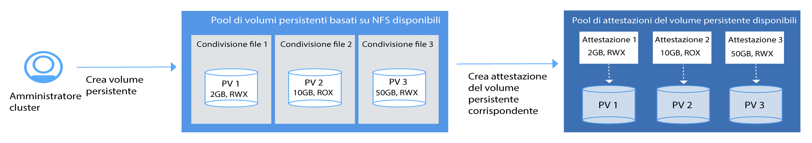

---

copyright:
  years: 2014, 2018
lastupdated: "2018-02-07"

---

{:new_window: target="_blank"}
{:shortdesc: .shortdesc}
{:screen: .screen}
{:pre: .pre}
{:table: .aria-labeledby="caption"}
{:codeblock: .codeblock}
{:tip: .tip}
{:download: .download}


# Salvataggio dei dati nel tuo cluster 
{: #storage}
Puoi conservare i dati nel caso che un componente nel tuo cluster abbia un malfunzionamento e per condividere i dati tra le istanze dell'applicazione.

## Pianificazione della memorizzazione altamente disponibile 
{: #planning}

In {{site.data.keyword.containerlong_notm}} puoi scegliere tra varie opzioni per memorizzare i tuoi dati dell'applicazione e condividerli tra i pod nel tuo cluster. Tuttavia, non tutte le opzioni di memorizzazione offrono lo stesso livello di persistenza e disponibilità nel caso di un malfunzionamento di un componente nel tuo cluster o dell'intero sito.
{: shortdesc}

### Opzioni di memorizzazione dati non persistente
{: #non_persistent}

Puoi utilizzare le opzioni di memorizzazione non persistente se i tuoi dati non richiedono di essere memorizzati in modo persistente, in modo che puoi recuperarli
dopo il malfunzionamento di un componente del cluster o se i dati non hanno bisogno di essere condivisi tra le istanze dell'applicazione. Le opzioni di memorizzazione
non persistente possono essere utilizzate anche per la verifica dell'unità dei tuoi componenti dell'applicazione o per provare nuove funzioni.
{: shortdesc}

La seguente immagine mostra le opzioni di memorizzazione dati non persistente disponibili in {{site.data.keyword.containerlong_notm}}. Queste opzioni sono disponibili per i cluster gratuito e standard. 
<p>
</p>

<table summary="La tabella mostra le opzioni di memorizzazione non persistente. Le righe devono essere lette da sinistra a destra, con il numero dell'opzione nella colonna uno, il titolo nella colonna due e una descrizione nella colonna tre." style="width: 100%">
<colgroup>
       <col span="1" style="width: 5%;"/>
       <col span="1" style="width: 20%;"/>
       <col span="1" style="width: 75%;"/>
    </colgroup>
  <thead>
  <th>#</th>
  <th>Opzione</th>
  <th>Descrizione</th>
  </thead>
  <tbody>
    <tr>
      <td>1</td>
      <td>All'interno del contenitore o del pod</td>
      <td>I contenitori e i pod sono, come progettati, di breve durata e possono avere un malfunzionamento imprevisto. Tuttavia, puoi scrivere i dati nel file system locale del contenitore per memorizzare i dati tramite il ciclo di vita di un contenitore. I dati all'interno di un contenitore non possono essere condivisi con altri contenitori o pod e vengono persi quando il contenitore ha un arresto anomalo o viene rimosso. Per ulteriori informazioni, consulta [Memorizzazione dei dati in un contenitore](https://docs.docker.com/storage/).</td>
    </tr>
  <tr>
    <td>2</td>
    <td>Nel nodo di lavoro</td>
    <td>Ogni nodo di lavoro è configurato con una memoria primaria e secondaria determinate dal tipo di macchina che selezioni dal tuo nodo di lavoro. La memoria primaria viene utilizzata per memorizzare i dati dal sistema operativo e l'utente non può accedervi. La memoria secondaria viene utilizzata per archiviare i dati in <code>/var/lib/docker</code>, la directory in cui vengono scritti tutti i dati del contenitore. <br/><br/>Per accedere alla memoria secondaria del nodo di lavoro, puoi creare un volume <code>/emptyDir</code>. Questo volume vuoto viene assegnato a un pod nel tuo cluster, in modo che i contenitori in tale pod possono leggere e scrivere in tale volume. Poiché il volume è assegnato
a un pod specifico, i dati non possono essere condivisi con altri pod in una serie di repliche.<br/><p>Un volume <code>/emptyDir</code> e i relativi dati vengono rimossi quando: <ul><li>Il pod assegnato
viene eliminato definitivamente dal nodo di lavoro. </li><li>Il pod assegnato viene pianificato su un altro nodo di lavoro.</li><li>Il nodo di lavoro viene ricaricato o aggiornato.</li><li>Il nodo di lavoro viene eliminato.</li><li>Il cluster viene eliminato.</li><li>L'account {{site.data.keyword.Bluemix_notm}} raggiunge uno stato sospeso. </li></ul></p><p><strong>Nota:</strong> se il contenitore nel pod ha un arresto anomalo, i dati
nel volume sono ancora disponibili nel nodo di lavoro.</p><p>Per ulteriori informazioni, consulta [Volumi Kubernetes ](https://kubernetes.io/docs/concepts/storage/volumes/).</p></td>
    </tr>
    </tbody>
    </table>

### Opzioni di memorizzazione dati persistente per l'elevata disponibilità
{: persistent}

La sfida principale quando crei le applicazioni con stato altamente disponibili è di conservare i dati tra più istanze dell'applicazione in più ubicazioni e mantenere i dati sempre sincronizzati. Per i dati altamente disponibili, vuoi assicurarti di avere un database master con più istanze che vengono suddivise tra più data center
o anche tra più regioni e che i dati in questo master vengano continuamente replicati. Tutte le istanze nel tuo cluster devono leggere e scrivere in questo database master. Nel caso un'istanza del master sia inattiva, le altre istanze possono sostenere il carico di lavoro, per cui non riscontri del tempo di inattività per le tue applicazioni.
{: shortdesc}

La seguente immagine mostra le opzioni che hai a disposizione in {{site.data.keyword.containerlong_notm}} per rendere i tuoi dati altamente disponibili in un cluster standard. L'opzione giusta per te dipende dai seguenti fattori:
  * **Il tuo tipo di applicazione:** ad esempio, potresti avere un'applicazione che deve memorizzare i dati su una base file rispetto che all'interno di un database.
  * **I requisiti legali su dove memorizzare e instradare i dati:** ad esempio, potresti essere obbligato a memorizzare e instradare i dati solo negli Stati Uniti e non poter utilizzare un servizio ubicato in Europa.
  * **Le opzioni di backup e ripristino:** ogni opzione di memorizzazione viene fornita con le funzionalità di backup e ripristino dei dati. Controlla che le opzioni di backup e ripristino disponibili soddisfano i tuoi requisiti del piano di ripristino di emergenza, come la frequenza dei backup o le funzionalità di archiviazione dei dati all'esterno del tuo data center primario.
  * **La replica globale:** per l'elevata disponibilità, potresti voler configurare più istanze di memorizzazione distribuite e replicate tra i data center globalmente.

<br/>


<table summary="La tabella mostra le opzioni di memorizzazione non persistente. Le righe devono essere lette da sinistra a destra, con il numero dell'opzione nella colonna uno, il titolo nella colonna due e una descrizione nella colonna tre.">
  <thead>
  <th>#</th>
  <th>Opzione</th>
  <th>Descrizione</th>
  </thead>
  <tbody>
  <tr>
  <td width="5%">1</td>
  <td width="20%">Archiviazione file NFS</td>
  <td width="75%">Con questa opzione, puoi conservare i dati del contenitore e dell'applicazione utilizzando i volumi persistenti Kubernetes. I volumi sono ospitati in [Endurance and Performance NFS-based file storage ](https://www.ibm.com/cloud/file-storage/details) che può essere utilizzato per le applicazioni che archiviano i dati su una base file rispetto che all'interno di un database. L'archiviazione file è codificata quando INATTIVA e inserita in cluster da IBM per fornire l'elevata disponibilità.<p>{{site.data.keyword.containershort_notm}} fornisce classi di archiviazione predefinite che
definiscono l'intervallo di dimensioni dell'archivio, gli IOPS, la politica di eliminazione e le autorizzazioni di scrittura e lettura per il volume. Per avviare una richiesta per l'archiviazione file basata su NFS, devi creare un'[attestazione del volume persistente](cs_storage.html#create). Dopo che hai inviato un'attestazione del volume persistente, {{site.data.keyword.containershort_notm}} esegue dinamicamente il provisioning di un volume persistente ospitato in un archivio file basato su NFS. [Puoi montare l'attestazione del volume persistente](cs_storage.html#app_volume_mount) come un volume nella tua distribuzione per consentire ai contenitori di leggere da e scrivere nel volume. </p><p>I volumi persistenti vengono forniti nel data center in cui è ubicato il nodo di lavoro. Puoi condividere i dati tra la stessa serie di repliche o con altre distribuzioni nello stesso cluster. Non puoi condividere i dati tra i cluster quando sono ubicati in differenti data center o regioni. </p><p>Per impostazione predefinita, non viene eseguito automaticamente il backup dell'archivio NFS. Puoi configurare un backup periodico del tuo cluster utilizzando i meccanismi di backup e ripristino forniti. Quando un
contenitore ha un arresto anomalo o viene rimosso un pod da un nodo di lavoro, i dati non vengono rimossi ed è ancora possibile accedervi da altre distribuzioni che montano il volume. </p><p><strong>Nota:</strong> l'archivio di condivisione file NFS
viene addebitato su base mensile. Se esegui il provisioning dell'archivio persistente del tuo cluster e lo rimuovi immediatamente,
paghi comunque l'addebito mensile per l'archiviazione persistente, anche se lo hai utilizzato solo per un breve periodo di tempo. </p></td>
  </tr>
  <tr>
    <td>2</td>
    <td>Servizio database cloud</td>
    <td>Con questa opzione, puoi conservare i dati utilizzando un servizio cloud database {{site.data.keyword.Bluemix_notm}},
come [IBM Cloudant NoSQL DB](/docs/services/Cloudant/getting-started.html#getting-started-with-cloudant). I dati che vengono archiviati con questa opzione sono accessibili nei cluster, nelle ubicazioni e nelle regioni. <p> Puoi scegliere di configurare una sola istanza database a cui possono accedere tutte le tue applicazioni o [configurare più istanze attraverso i data center e la replica](/docs/services/Cloudant/guides/active-active.html#configuring-cloudant-nosql-db-for-cross-region-disaster-recovery) tra le istanze per l'elevata disponibilità. Nel database IBM Cloudant NoSQL, non viene eseguito automaticamente il backup dei dati. Puoi utilizzare i [meccanismi di backup e ripristino](/docs/services/Cloudant/guides/backup-cookbook.html#cloudant-nosql-db-backup-and-recovery) forniti per proteggere i tuoi dati da un malfunzionamento del sito.</p> <p> Per utilizzare un servizio nel tuo cluster, devi [associare il servizio {{site.data.keyword.Bluemix_notm}}](cs_integrations.html#adding_app) a uno spazio dei nomi nel tuo cluster. Quando associ il servizio al cluster, viene creato un segreto Kubernetes. Il segreto Kubernetes ospita informazioni confidenziali sul servizio,
come ad esempio l'URL del servizio, i tuoi nome utente e password. Puoi montare il segreto
come un volume segreto nel tuo pod e accedere al servizio utilizzando le credenziali nel segreto. Montando il volume segreto in altri pod, puoi inoltre condividere i dati tra i pod. Quando un
contenitore ha un arresto anomalo o viene rimosso un pod da un nodo di lavoro, i dati non vengono rimossi ed è ancora possibile accedervi
da altri pod che montano il volume segreto. <p>Alcuni servizi database {{site.data.keyword.Bluemix_notm}} forniscono spazio su disco
per una piccola quantità di dati gratuitamente, in questo modo puoi verificarne le funzioni.</p></td>
  </tr>
  <tr>
    <td>3</td>
    <td>Database in loco</td>
    <td>Se i tuoi dati devono essere archiviati in loco per motivi legali, puoi [configurare una connessione VPN](cs_vpn.html#vpn) nel tuo database in loco e utilizzare l'archiviazione esistente, i meccanismi di backup e ripristino nel tuo data center.</td>
  </tr>
  </tbody>
  </table>

{: caption="Tabella. Opzioni di archivio di dati persistenti per le distribuzioni nei cluster Kubernetes " caption-side="top"}

<br />


## Utilizzo di condivisioni file NFS esistenti nei cluster
{: #existing}

Se hai già delle condivisioni file NFS esistenti nel tuo account dell'infrastruttura IBM Cloud (SoftLayer) che vuoi utilizzare con Kubernetes, puoi farlo creando dei volumi persistenti sulla tua condivisione file NFS esistente. Un
volume persistente è un pezzo di hardware effettivo che funge da risorsa cluster Kubernetes e può
essere utilizzato dall'utente del cluster.
{:shortdesc}

Kubernetes differenzia i volumi persistenti che rappresentano l'hardware effettivo e
le attestazioni del volume persistente che sono delle richieste di archiviazione normalmente avviate dall'utente del cluster. Il seguente diagramma illustra la relazione tra i volumi persistenti e le attestazioni del volume persistente.



 Come illustrato nel diagramma, per abilitare l'utilizzo delle condivisioni file NFS esistenti con Kubernetes, devi creare volumi persistenti con una determinata dimensione e modalità di accesso e creare un'attestazione del volume persistente che corrisponda alla specifica del volume persistente. Se il volume persistente e l'attestazione del volume persistente corrispondono, vengono
collegati tra loro. Solo le attestazioni del volume persistente collegate possono essere utilizzate dall'utente del cluster per montare
il volume in una distribuzione. Questo processo viene indicato come provisioning statico di archiviazione persistente.

Prima di iniziare, assicurati di avere una condivisione file NFS esistente da utilizzare per creare
il tuo volume persistente.

**Nota:** il provisioning statico di archiviazione persistente viene applicato solo alle condivisioni file NFS esistenti. Se non
disponi di condivisioni file NFS esistenti, gli utenti del cluster possono utilizzare il processo di [provisioning
dinamico](cs_storage.html#create) per aggiungere i volumi persistenti.

Per creare un volume persistente e un'attestazione del volume persistente corrispondente, segui la seguente procedura.

1.  Nel tuo account dell'infrastruttura IBM Cloud (SoftLayer), cerca l'ID e il percorso della condivisione file NFS in cui vuoi creare l'oggetto del volume persistente. In aggiunta, autorizza l'archiviazione file per le sottoreti nel cluster. Questa autorizzazione fornisce al tuo cluster l'accesso all'archivio.
    1.  Accedi al tuo account dell'infrastruttura IBM Cloud (SoftLayer).
    2.  Fai clic su **Archiviazione**.
    3.  Fai clic su **Archiviazione file** e dal menu **Azioni**, seleziona **Autorizza host**.
    4.  Fai clic su **Sottoreti**. Dopo l'autorizzazione, ogni nodo di lavoro nella sottorete ha accesso all'archiviazione file.
    5.  Seleziona la sottorete della VLAN pubblica del tuo cluster dal menu e fai clic su **Invia**. Se hai bisogno di trovare la sottorete, esegui `bx cs cluster-get <cluster_name> --showResources`.
    6.  Fai clic sul nome dell'archiviazione file.
    7.  Prendi nota del campo **Punto di montaggio**. Il campo viene visualizzato come `<server>:/<path>`.
2.  Crea un file di configurazione dell'archiviazione per il tuo volume persistente. Includi il server e il percorso dal campo **punto di montaggio** dell'archiviazione file.

    ```
    apiVersion: v1
    kind: PersistentVolume
    metadata:
     name: mypv
    spec:
     capacity:
       storage: "20Gi"
     accessModes:
       - ReadWriteMany
     nfs:
       server: "nfslon0410b-fz.service.networklayer.com"
       path: "/IBM01SEV8491247_0908"
    ```
    {: codeblock}

    <table>
    <caption>Tabella. Descrizione dei componenti del file YAML</caption>
    <thead>
    <th colspan=2> Descrizione dei componenti del file YAML</th>
    </thead>
    <tbody>
    <tr>
    <td><code>name</code></td>
    <td>Immetti il nome dell'oggetto del volume persistente che vuoi creare.</td>
    </tr>
    <tr>
    <td><code>storage</code></td>
    <td>Immetti la dimensione di archiviazione della condivisione file NFS esistente. La dimensione di archiviazione deve essere scritta
in gigabyte, ad esempio, 20Gi (20 GB) o 1000Gi (1 TB) e deve corrispondere alla dimensione
della condivisione file esistente.</td>
    </tr>
    <tr>
    <td><code>accessMode</code></td>
    <td>Le modalità di accesso definiscono il modo in cui l'attestazione del volume persistente può essere montata in un
nodo di lavoro.<ul><li>ReadWriteOnce (RWO): Il volume persistente può essere montato nelle distribuzioni solo in un nodo di lavoro. I contenitori nelle distribuzioni montati in questo volume persistente possono leggere e scrivere nel volume. </li><li>ReadOnlyMany (ROX): Il volume persistente può essere montato nelle distribuzioni
ospitate in più nodi di lavoro. Le distribuzioni montate in questo volume persistente possono solo leggere dal volume. </li><li>ReadWriteMany (RWX): Questo volume persistente può essere montato nelle distribuzioni
ospitate in più nodi di lavoro. Le distribuzioni montate in questo volume persistente possono leggere e scrivere nel volume. </li></ul></td>
    </tr>
    <tr>
    <td><code>server</code></td>
    <td>Immetti l'ID server della condivisione file NFS.</td>
    </tr>
    <tr>
    <td><code>path</code></td>
    <td>Immetti il percorso della condivisione file NFS in cui vuoi creare l'oggetto del volume persistente.</td>
    </tr>
    </tbody></table>

3.  Crea l'oggetto del volume persistente nel tuo cluster.

    ```
    kubectl apply -f <yaml_path>
    ```
    {: pre}

    Esempio

    ```
    kubectl apply -f deploy/kube-config/pv.yaml
    ```
    {: pre}

4.  Verifica che il volume persistente sia stato creato.

    ```
    kubectl get pv
    ```
    {: pre}

5.  Crea un altro file di configurazione per creare la tua attestazione del volume persistente. Affinché l'attestazione del volume persistente corrisponda all'oggetto del volume persistente creato
in precedenza, devi scegliere lo stesso valore per `storage` e
`accessMode`. Il campo `storage-class` deve essere vuoto. Se uno di questi
campi non corrisponde al volume persistente, verrà creato automaticamente un nuovo volume
persistente.

    ```
    kind: PersistentVolumeClaim
    apiVersion: v1
    metadata:
     name: mypvc
     annotations:
       volume.beta.kubernetes.io/storage-class: ""
    spec:
     accessModes:
       - ReadWriteMany
     resources:
       requests:
         storage: "20Gi"
    ```
    {: codeblock}

6.  Crea la tua attestazione del volume persistente.

    ```
    kubectl apply -f deploy/kube-config/mypvc.yaml
    ```
    {: pre}

7.  Verifica che la tua attestazione del volume persistente sia stata creata e collegata all'oggetto del volume persistente. Questo processo può richiedere qualche minuto.

    ```
    kubectl describe pvc mypvc
    ```
    {: pre}

    Il tuo output sarà simile al seguente.

    ```
    Name: mypvc
    Namespace: default
    StorageClass: ""
    Status:  Bound
    Volume:  pvc-0d787071-3a67-11e7-aafc-eef80dd2dea2
    Labels:  <none>
    Capacity: 20Gi
    Access Modes: RWX
    Events:
      FirstSeen LastSeen Count From        SubObjectPath Type  Reason   Message
      --------- -------- ----- ----        ------------- -------- ------   -------
      3m  3m  1 {ibm.io/ibmc-file 31898035-3011-11e7-a6a4-7a08779efd33 }   Normal  Provisioning  External provisioner is provisioning volume for claim "default/my-persistent-volume-claim"
      3m  1m  10 {persistentvolume-controller }       Normal  ExternalProvisioning cannot find provisioner "ibm.io/ibmc-file", expecting that a volume for the claim is provisioned either manually or via external software
      1m  1m  1 {ibm.io/ibmc-file 31898035-3011-11e7-a6a4-7a08779efd33 }   Normal  ProvisioningSucceeded Successfully provisioned volume pvc-0d787071-3a67-11e7-aafc-eef80dd2dea2
    ```
    {: screen}


Hai creato correttamente un oggetto del volume persistente e lo hai collegato a un'attestazione del
volume persistente. Gli utenti del cluster possono ora [montare l'attestazione del volume persistente](#app_volume_mount) nelle proprie distribuzioni e iniziare a leggere
e a scrivere sull'oggetto del volume persistente.

<br />


## Creazione di archiviazione persistente per le applicazioni 
{: #create}

Crea un'attestazione di un volume persistente (pvc) per eseguire il provisioning dell'archivio file NFS per il tuo cluster. Poi, monta questa attestazione in una distribuzione per assicurarti che i dati siano disponibili anche se i pod hanno un arresto anomalo o vengono spenti.
{:shortdesc}

L'archivio file NFS che ospita il volume persistente
viene inserito in cluster da IBM per fornire elevata disponibilità per i tuoi dati. Le classi di archiviazione descrivono i tipi di archiviazione offerti disponibili e definiscono gli aspetti come la politica di conservazione dei dati, la dimensione in gigabyte e gli IOPS quando crei il tuo volume persistente.

**Nota**: se hai un firewall, [consenti l'accesso in uscita](cs_firewall.html#pvc) agli intervalli di IP dell'infrastruttura IBM Cloud (SoftLayer) delle ubicazioni (data center) in cui si trovano i tuoi cluster, in modo che puoi creare le attestazioni del volume persistente.

1.  Rivedi le classi di archiviazione disponibili. {{site.data.keyword.containerlong}} fornisce otto
classi di archiviazione predefinite in modo che l'amministratore del cluster non debba creare tutte le classi
archiviazione. La classe di archiviazione `ibmc-file-bronze` è uguale a `default`.

    ```
    kubectl get storageclasses
    ```
    {: pre}

    ```
    $ kubectl get storageclasses
    NAME                         TYPE
    default                      ibm.io/ibmc-file   
    ibmc-file-bronze (default)   ibm.io/ibmc-file   
    ibmc-file-custom             ibm.io/ibmc-file
    ibmc-file-gold               ibm.io/ibmc-file   
    ibmc-file-retain-bronze      ibm.io/ibmc-file   
    ibmc-file-retain-custom      ibm.io/ibmc-file   
    ibmc-file-retain-gold        ibm.io/ibmc-file   
    ibmc-file-retain-silver      ibm.io/ibmc-file   
    ibmc-file-silver             ibm.io/ibmc-file
    ```
    {: screen}

2.  Decidi se vuoi salvare i tuoi dati e la condivisione del file NFS dopo che hai eliminato il pvc e richiamato la politica di ripristino. Se vuoi conservare i tuoi dati, scegli una classe di archiviazione `retain`. Se vuoi che i tuoi dati e la tua condivisione file vengano eliminati insieme al pvc, scegli una classe di archiviazione senza `retain`.

3.  Ottieni i dettagli per una classe di archiviazione. Controlla gli IOPS per gigabyte e l'intervallo di dimensioni nel campo **paramters** nel tuo output della CLI. 

    <ul>
      <li>Quando utilizzi le classi di archiviazione bronze, silver o gold storage, richiami [Endurance storage ](https://knowledgelayer.softlayer.com/topic/endurance-storage) che definisce gli IOPS per GB di ogni classe. Tuttavia, puoi determinare il totale di IOPS scegliendo la dimensione nell'intervallo disponibile. Ad esempio, se selezioni una dimensione di condivisione file di 1000Gi nella classe di archiviazione silver di 4 IOPS per GB, il tuo volume ha un totale di 4000 IOPS. Più IOPS ha il tuo volume persistente e più velocemente elabora le operazioni di input e output. <p>**Comando di esempio per descrivere la classe di archiviazione**:</p>

       <pre class="pre">kubectl describe storageclasses ibmc-file-silver</pre>

       Il campo **parametri** fornisce gli IOPS per GB associati alla classe di archiviazione
e le dimensioni disponibili in gigabyte.
       <pre class="pre">Parametri:	iopsPerGB=4,sizeRange=20Gi,40Gi,80Gi,100Gi,250Gi,500Gi,1000Gi,2000Gi,4000Gi,8000Gi,12000Gi</pre>
       
       </li>
      <li>Con le classi di archiviazione personalizzate, richiami [Performance storage ](https://knowledgelayer.softlayer.com/topic/performance-storage) e hai maggiore controllo nella scelta della combinazione di IOPS e dimensione. <p>**Comando di esempio per descrivere la classe di archiviazione personalizzata**:</p>

       <pre class="pre">kubectl describe storageclasses ibmc-file-retain-custom</pre>

       Il campo **parametri** fornisce gli IOPS associati alla classe di archiviazione
e le dimensioni disponibili in gigabyte. Ad esempio, un pvc 40Gi può selezionare IOPS che è un multiplo di 100 nell'intervallo 100 - 2000 IOPS.

       ```
       Parameters:	Note=IOPS value must be a multiple of 100,reclaimPolicy=Retain,sizeIOPSRange=20Gi:[100-1000],40Gi:[100-2000],80Gi:[100-4000],100Gi:[100-6000],1000Gi[100-6000],2000Gi:[200-6000],4000Gi:[300-6000],8000Gi:[500-6000],12000Gi:[1000-6000]
       ```
       {: screen}
       </li></ul>
4. Crea un file di configurazione per definire la tua attestazione del volume persistente
e salva la configurazione come un file `.yaml`.

    -  **Esempio di classi di archiviazione bronze, silver, gold**:
       

       ```
       apiVersion: v1
       kind: PersistentVolumeClaim
       metadata:
        name: mypvc
        annotations:
          volume.beta.kubernetes.io/storage-class: "ibmc-file-silver"
          
       spec:
        accessModes:
          - ReadWriteMany
        resources:
          requests:
            storage: 20Gi
        ```
        {: codeblock}

    -  **Esempio per le classi di archiviazione personalizzate**:
       

       ```
       apiVersion: v1
       kind: PersistentVolumeClaim
       metadata:
         name: mypvc
         annotations:
           volume.beta.kubernetes.io/storage-class: "ibmc-file-retain-custom"
         
       spec:
         accessModes:
           - ReadWriteMany
         resources:
           requests:
             storage: 40Gi
             iops: "500"
        ```
        {: codeblock}

        <table>
        <thead>
        <th colspan=2> Descrizione dei componenti del file YAML</th>
        </thead>
        <tbody>
        <tr>
        <td><code>metadata/name</code></td>
        <td>Immetti il nome dell'attestazione del volume persistente.</td>
        </tr>
        <tr>
        <td><code>metadata/annotations</code></td>
        <td>Specifica la classe di archiviazione del volume persistente:
          <ul>
          <li>ibmc-file-bronze / ibmc-file-retain-bronze : 2 IOPS per GB.</li>
          <li>ibmc-file-silver / ibmc-file-retain-silver: 4 IOPS per GB.</li>
          <li>ibmc-file-gold / ibmc-file-retain-gold: 10 IOPS per GB.</li>
          <li>ibmc-file-custom / ibmc-file-retain-custom: più valori di IOPS disponibili.</li>
          <p>Se non specifichi alcuna classe di archiviazione, il volume persistente viene creato con la classe di archiviazione bronze.</p></td>
        </tr>
        
        <tr>
        <td><code>spec/accessModes</code>
    <code>resources/requests/storage</code></td>
        <td>Se scegli una dimensione diversa da quella elencata, la dimensione viene arrotondata per eccesso. Se selezioni una dimensione superiore a quella più grande, la dimensione viene arrotondata per difetto.</td>
        </tr>
        <tr>
        <td><code>spec/accessModes</code>
    <code>resources/requests/iops</code></td>
        <td>Questa opzione è solo per le classi di archiviazione personalizzate (`ibmc-file-custom / ibmc-file-retain-custom`). Specifica il totale di IOPS per l'archiviazione. Per visualizzare tutte le opzioni, esegui `kubectl describe storageclasses ibmc-file-custom`. Se scegli un IOPS diverso da quello elencato, viene arrotondato per eccesso.</td>
        </tr>
        </tbody></table>

5.  Crea l'attestazione del volume persistente.

    ```
    kubectl apply -f <local_file_path>
    ```
    {: pre}

6.  Verifica che la tua attestazione del volume persistente sia stata creata e collegata al volume persistente. Questo processo può richiedere qualche minuto.

    ```
    kubectl describe pvc mypvc
    ```
    {: pre}

    Output di esempio:

    ```
    Name: mypvc
    Namespace: default
    StorageClass: ""
    Status:  Bound
    Volume:  pvc-0d787071-3a67-11e7-aafc-eef80dd2dea2
    Labels:  <none>
    Capacity: 20Gi
    Access Modes: RWX
    Events:
      FirstSeen LastSeen Count From        SubObjectPath Type  Reason   Message
      --------- -------- ----- ----        ------------- -------- ------   -------
      3m  3m  1 {ibm.io/ibmc-file 31898035-3011-11e7-a6a4-7a08779efd33 }   Normal  Provisioning  External provisioner is provisioning volume for claim "default/my-persistent-volume-claim"
      3m  1m  10 {persistentvolume-controller }       Normal  ExternalProvisioning cannot find provisioner "ibm.io/ibmc-file", expecting that a volume for the claim is provisioned either manually or via external software
      1m  1m  1 {ibm.io/ibmc-file 31898035-3011-11e7-a6a4-7a08779efd33 }   Normal  ProvisioningSucceeded Successfully provisioned volume pvc-0d787071-3a67-11e7-aafc-eef80dd2dea2

    ```
    {: screen}

6.  {: #app_volume_mount}Per montare l'attestazione del volume persistente nella tua distribuzione, crea un file di configurazione. Salva la configurazione come un file `.yaml` file.

    ```
    apiVersion: extensions/v1beta1
    kind: Deployment
    metadata:
     name: <deployment_name>
    replicas: 1
    template:
     metadata:
       labels:
         app: <app_name>
    spec:
     containers:
     - image: <image_name>
       name: <container_name>
       volumeMounts:
       - mountPath: /<file_path>
         name: <volume_name>
     volumes:
     - name: <volume_name>
       persistentVolumeClaim:
         claimName: <pvc_name>
    ```
    {: codeblock}

    <table>
    <thead>
    <th colspan=2> Descrizione dei componenti del file YAML</th>
    </thead>
    <tbody>
    <tr>
    <td><code>metadata/name</code></td>
    <td>Il nome della distribuzione. </td>
    </tr>
    <tr>
    <td><code>template/metadata/labels/app</code></td>
    <td>Un'etichetta per la distribuzione.</td>
    </tr>
    <tr>
    <td><code>spec/containers/image</code></td>
    <td>Il nome dell'immagine che vuoi utilizzare. Per elencare le immagini disponibili nel tuo account {{site.data.keyword.registryshort_notm}}, esegui `bx cr image-list`. </td>
    </tr>
    <tr>
    <td><code>spec/containers/name</code></td>
    <td>Il nome del contenitore che vuoi distribuire al tuo cluster.</td>
    </tr>
    <tr>
    <td><code>spec/containers/volumeMounts/mountPath</code></td>
    <td>Il percorso assoluto della directory in cui viene montato il volume nel contenitore.</td>
    </tr>
    <tr>
    <td><code>spec/containers/volumeMounts/name</code></td>
    <td>Il nome del volume per montare il tuo pod. </td>
    </tr>
    <tr>
    <td><code>volumes/name</code></td>
    <td>Il nome del volume per montare il tuo pod. Normalmente questo nome è lo stesso di
<code>volumeMounts/name</code>.</td>
    </tr>
    <tr>
    <td><code>volumes/persistentVolumeClaim/claimName</code></td>
    <td>Il nome dell'attestazione del volume persistente che desideri utilizzare per il tuo volume. Quando monti
il volume nel pod, Kubernetes identifica il volume persistente associato all'attestazione del volume persistente
e abilita l'utente a leggere e scrivere nel volume persistente.</td>
    </tr>
    </tbody></table>

8.  Crea la distribuzione e monta l'attestazione del volume persistente.

    ```
    kubectl apply -f <local_yaml_path>
    ```
    {: pre}

9.  Verifica che il volume sia stato correttamente montato. 

    ```
    kubectl describe deployment <deployment_name>
    ```
    {: pre}

    Il punto di montaggio è nel campo **Volume Mounts** e il volume nel campo **Volumes**.

    ```
     Volume Mounts:
          /var/run/secrets/kubernetes.io/serviceaccount from default-token-tqp61 (ro)
          /volumemount from myvol (rw)
    ...
    Volumes:
      myvol:
        Type: PersistentVolumeClaim (a reference to a PersistentVolumeClaim in the same namespace)
        ClaimName: mypvc
        ReadOnly: false

    ```
    {: screen}

<br />


## Aggiunta di accesso utente non root alla archiviazione persistente
{: #nonroot}

Gli utenti non root non dispongono dell'autorizzazione di scrittura nel percorso di montaggio del volume per l'archiviazione di backend NFS. Per concedere l'autorizzazione di scrittura,
devi modificare il Dockerfile dell'immagine per creare una directory nel percorso di montaggio con
l'autorizzazione corretta.
{:shortdesc}

Prima di iniziare, [indirizza la tua CLI](cs_cli_install.html#cs_cli_configure) al tuo cluster.

Se stai progettando un'applicazione con un utente non root che richiede l'autorizzazione di scrittura nel volume,
devi aggiungere i seguenti processi al tuo Dockerfile e al tuo script di punto di ingresso:

-   Creare un utente non root.
-   Aggiungere temporaneamente l'utente al gruppo root.
-   Creare una directory nel percorso di montaggio volume con le autorizzazioni utente corrette.

Per {{site.data.keyword.containershort_notm}}, il proprietario predefinito del percorso di montaggio del volume è `nobody`. Con l'archiviazione NFS, se il proprietario non esiste localmente nel pod, viene creato l'utente `nobody`. I volumi sono configurati per riconoscere
l'utente root nel contenitore, che per alcune applicazioni, è l'unico utente all'interno del contenitore. Tuttavia, molte applicazioni specificano un utente non root diverso da `nobody` che scrive nel percorso di montaggio del contenitore. Alcune applicazioni specificano che il volume deve essere di proprietà dell'utente root. In genere le applicazioni non utilizzano l'utente root a causa di problemi di sicurezza. Tuttavia, se la tua applicazione richiede un utente root, puoi contattare il [supporto {{site.data.keyword.Bluemix_notm}}](/docs/get-support/howtogetsupport.html#getting-customer-support) per assistenza.


1.  Creare un Dockerfile in una directory locale. Questo Dockerfile di esempio crea un utente non root denominato `myguest`.

    ```
    FROM registry.<region>.bluemix.net/ibmliberty:latest

    # Crea un gruppo e un utente con GID e UID 1010.
    # In questo caso stai creando un gruppo e un utente denominati myguest.
    # Il GUID e l'UID 1010 è improbabile che creino un conflitto con un GUID o un UID utente esistenti nell'immagine.
    # Il GUID e l'UID devono essere compresi tra 0 e 65536. Altrimenti, la creazione del contenitore ha esito negativo.
    RUN groupadd --gid 1010 myguest
    RUN useradd --uid 1010 --gid 1010 -m --shell /bin/bash myguest

    ENV MY_USER=myguest

    COPY entrypoint.sh /sbin/entrypoint.sh
    RUN chmod 755 /sbin/entrypoint.sh

    EXPOSE 22
    ENTRYPOINT ["/sbin/entrypoint.sh"]
    ```
    {: codeblock}

2.  Crea lo script di punto di ingresso nella stessa cartella locale del Dockerfile. Questo script di punto di ingresso di esempio specifica
`/mnt/myvol` come percorso di montaggio del volume.

    ```
    #!/bin/bash
    set -e

    #Questo è il punto di montaggio per il volume condiviso.
    #Per impostazione predefinita il punto di montaggio è gestito dall'utente root.
    MOUNTPATH="/mnt/myvol"
    MY_USER=${MY_USER:-"myguest"}

    # Questa funzione crea una directory secondaria gestita
    # dall'utente non root nel percorso di montaggio del volume condiviso.
    create_data_dir() {
      #Aggiungi l'utente non root al gruppo primario dell'utente root.
      usermod -aG root $MY_USER

      #Fornisci l'autorizzazione di lettura-scrittura-esecuzione al gruppo per il percorso di montaggio del volume condiviso.
      chmod 775 $MOUNTPATH

      # Crea una directory nel percorso condiviso gestito dall'utente non root myguest.
      su -c "mkdir -p ${MOUNTPATH}/mydata" -l $MY_USER
      su -c "chmod 700 ${MOUNTPATH}/mydata" -l $MY_USER
      ls -al ${MOUNTPATH}

      #Per sicurezza, rimuovi l'utente non root dal gruppo di utenti root.
      deluser $MY_USER root

      #Modifica il percorso di montaggio del volume condiviso con l'autorizzazione di lettura-scrittura-esecuzione originale.
      chmod 755 $MOUNTPATH
      echo "Created Data directory..."
    }

    create_data_dir

    #Questo comando crea un processo a esecuzione prolungata per lo scopo di questo esempio.
    tail -F /dev/null
    ```
    {: codeblock}

3.  Accedi a {{site.data.keyword.registryshort_notm}}.

    ```
    bx cr login
    ```
    {: pre}

4.  Crea l'immagine in locale. Ricorda di sostituire _&lt;mio_spazionomi&gt;_ con lo spazio dei nomi del tuo registro delle immagini
privato. Esegui `bx cr namespace-get` se devi trovare il tuo spazio dei nomi.

    ```
    docker build -t registry.<region>.bluemix.net/<my_namespace>/nonroot .
    ```
    {: pre}

5.  Invia l'immagine al tuo spazio dei nomi in {{site.data.keyword.registryshort_notm}}.

    ```
    docker push registry.<region>.bluemix.net/<my_namespace>/nonroot
    ```
    {: pre}

6.  Crea un'attestazione del volume persistente creando un file `.yaml` di configurazione. Questo esempio utilizza una classe di archiviazione delle prestazioni inferiore. Esegui `kubectl get storageclasses` per visualizzare le classi di archiviazione disponibili.

    ```
    apiVersion: v1
    kind: PersistentVolumeClaim
    metadata:
      name: mypvc
      annotations:
        volume.beta.kubernetes.io/storage-class: "ibmc-file-bronze"
    spec:
      accessModes:
        - ReadWriteMany
      resources:
        requests:
          storage: 20Gi
    ```
    {: codeblock}

7.  Crea l'attestazione del volume persistente.

    ```
    kubectl apply -f <local_file_path>
    ```
    {: pre}

8.  Crea un file di configurazione per montare il volume ed esegui il pod dall'immagine nonroot. Il percorso di montaggio del volume `/mnt/myvol` corrisponde al percorso di montaggio specificato nel
Dockerfile. Salva la configurazione come un file `.yaml` file.

    ```
    apiVersion: v1
    kind: Pod
    metadata:
     name: mypod
    spec:
     containers:
     - image: registry.<region>.bluemix.net/<my_namespace>/nonroot
       name: mycontainer
       volumeMounts:
       - mountPath: /mnt/myvol
         name: myvol
     volumes:
     - name: myvol
       persistentVolumeClaim:
         claimName: mypvc
    ```
    {: codeblock}

9.  Crea il pod e monta l'attestazione del volume persistente nel tuo pod.

    ```
    kubectl apply -f <local_yaml_path>
    ```
    {: pre}

10. Verifica che il volume sia stato correttamente montato nel tuo pod.

    ```
    kubectl describe pod mypod
    ```
    {: pre}

    Il punto di montaggio viene elencato nel campo
**Volume Mounts** e il volume nel campo
**Volumes**.

    ```
     Volume Mounts:
          /var/run/secrets/kubernetes.io/serviceaccount from default-token-tqp61 (ro)
          /mnt/myvol from myvol (rw)
    ...
    Volumes:
      myvol:
        Type: PersistentVolumeClaim (a reference to a PersistentVolumeClaim in the same namespace)
        ClaimName: mypvc
        ReadOnly: false

    ```
    {: screen}

11. Accedi al pod dopo che è in esecuzione.

    ```
    kubectl exec -it mypod /bin/bash
    ```
    {: pre}

12. Visualizza le autorizzazioni del tuo percorso di montaggio del volume.

    ```
    ls -al /mnt/myvol/
    ```
    {: pre}

    ```
    root@instance-006ff76b:/# ls -al /mnt/myvol/
    total 12
    drwxr-xr-x 3 root    root    4096 Jul 13 19:03 .
    drwxr-xr-x 3 root    root    4096 Jul 13 19:03 ..
    drwx------ 2 myguest myguest 4096 Jul 13 19:03 mydata
    ```
    {: screen}

    Questo output mostra che root dispone delle autorizzazioni di lettura, scrittura e esecuzione nel percorso di montaggio del volume
`mnt/myvol/`, ma che l'utente myguest non root dispone della autorizzazioni di
lettura e scrittura per la cartella `mnt/myvol/mydata`. Poiché queste autorizzazioni sono state aggiornate,
l'utente non root può ora scrivere dati nel volume persistente.


