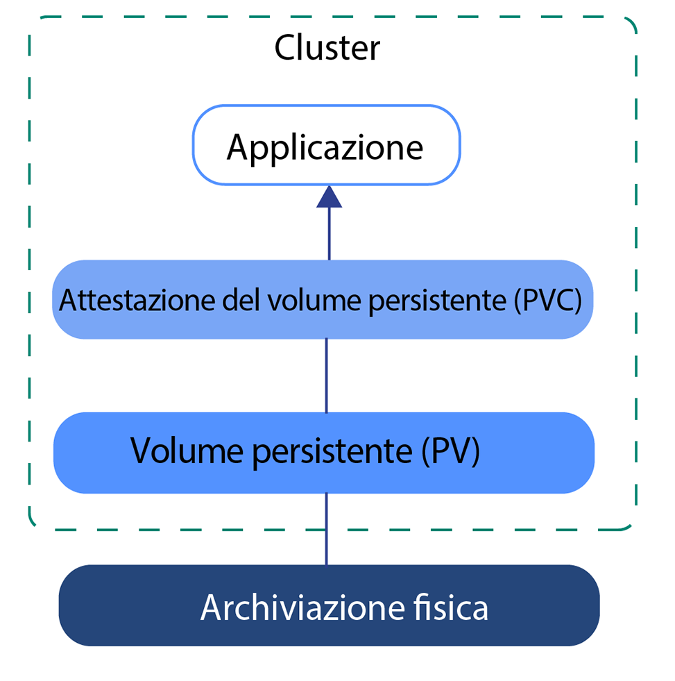
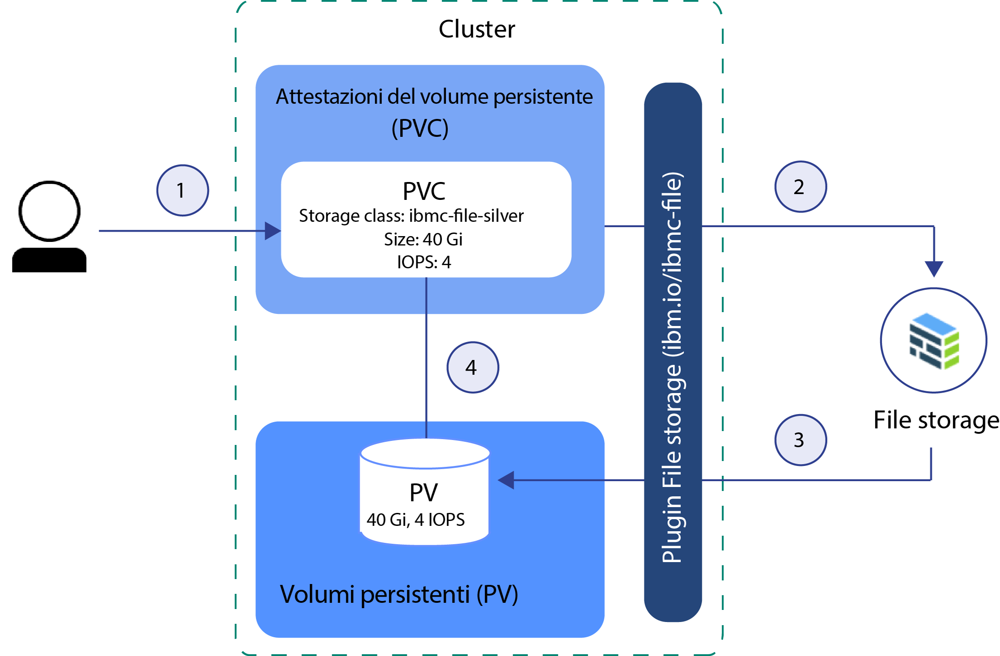
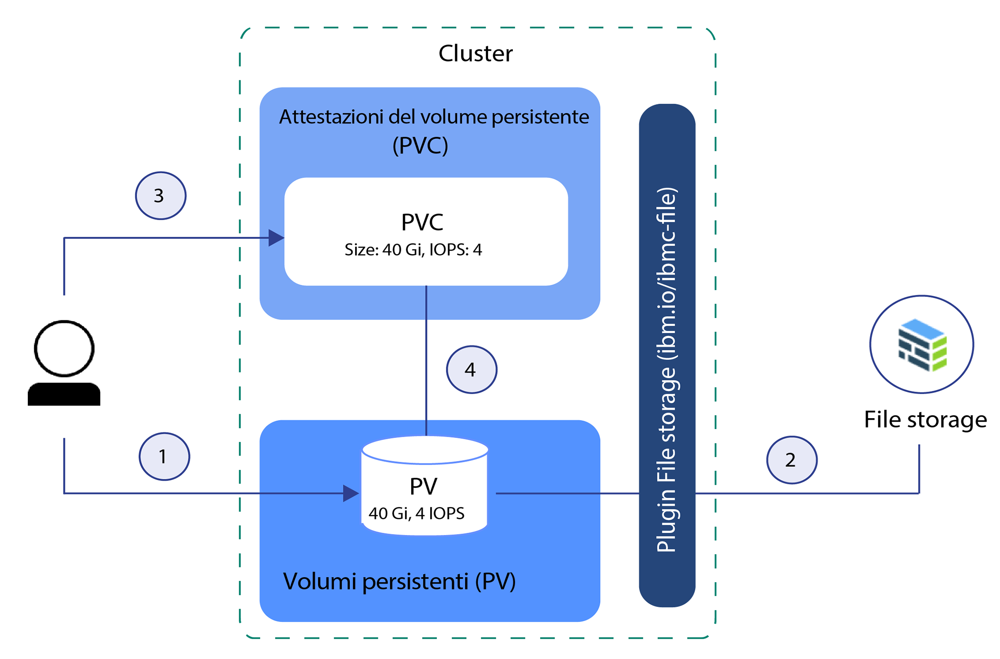

---

copyright:
  years: 2014, 2019
lastupdated: "2019-05-31"

keywords: kubernetes, iks

subcollection: containers

---

{:new_window: target="_blank"}
{:shortdesc: .shortdesc}
{:screen: .screen}
{:pre: .pre}
{:table: .aria-labeledby="caption"} 
{:codeblock: .codeblock}
{:tip: .tip}
{:note: .note}
{:important: .important}
{:deprecated: .deprecated}
{:download: .download}
{:preview: .preview}


# Descrizione dei principi di base dell'archiviazione Kubernetes
{: #kube_concepts}

## Volumi persistenti e attestazioni del volume persistente (o PVC, persistent volume claim)
{: #pvc_pv}

Prima di iniziare con il provisioning di archiviazione, è importante comprendere i concetti Kubernetes di volume persistente e di attestazione del volume persistente (o PVC, persistent volume claim) e come funzionano insieme in un cluster.
{: shortdesc}

La seguente immagine mostra i componenti di archiviazione in un cluster Kubernetes.



- **Cluster**</br> Per impostazione predefinita, ogni cluster è configurato con un plugin per [eseguire il provisioning di archiviazione file](/docs/containers?topic=containers-file_storage#add_file). Puoi scegliere di installare altri componenti aggiuntivi, come quello per l'[archiviazione blocchi](/docs/containers?topic=containers-block_storage). Per utilizzare l'archiviazione in un cluster, devi creare una attestazione del volume persistente (o PVC, persistent volume claim), un volume persistente e un'istanza di archiviazione fisica. Quando elimini il cluster, hai l'opzione di eliminare le istanze di archiviazione correlate.
- **Applicazione**</br> Per leggere dalla, e scrivere nella, tua istanza di archiviazione, devi montare l'attestazione del volume persistente (o PVC, persistent volume claim) nella tua applicazione. Tipi di archiviazione differenti hanno regole di lettura-scrittura differenti. Ad esempio, puoi montare più pod nella stessa PVC per l'archiviazione file. L'archiviazione blocchi è fornita con una modalità di accesso RWO (ReadWriteOnce) e quindi puoi montare l'archiviazione solo in un singolo pod.
- **Attestazione del volume persistente (o PVC, persistent volume claim)** </br> una PVC è una richiesta di eseguire il provisioning dell'archiviazione persistente con un tipo e a una configurazione specifici. Per specificare la varietà di archiviazione persistente che desideri, utilizzi le [classi di archiviazione Kubernetes](#storageclasses). L'amministratore del cluster può definire le classi di archiviazione oppure puoi scegliere da una delle classi di archiviazione predefinite in {{site.data.keyword.containerlong_notm}}. Quando crei una PVC, la richiesta viene inviata al provider di archiviazione {{site.data.keyword.Bluemix}}. A seconda della configurazione definita nella classe di archiviazione, il dispositivo di archiviazione fisico viene ordinato e ne viene eseguito il provisioning nel tuo account dell'infrastruttura IBM Cloud (SoftLayer). Se la configurazione richiesta non esiste, l'archiviazione non viene creata.
- **Volume persistente (o PV, Persistent Volume)** </br> un PV è un'istanza di archiviazione virtuale che viene aggiunta come un volume al cluster. Il PV punta a un dispositivo di archiviazione fisico nel tuo account dell'infrastruttura IBM Cloud (SoftLayer) e astrae l'API utilizzata per comunicare con il dispositivo di archiviazione. Per montare un PV in un'applicazione, devi disporre di una PVC corrispondente. I PV montati si presentano come una cartella all'interno del file system del contenitore.
- **Archiviazione fisica** </br> Un'istanza di archiviazione fisica che puoi utilizzare per conservare in modo persistente i tuoi dati. Degli esempi di archiviazione fisica in {{site.data.keyword.Bluemix_notm}} includono [File Storage](/docs/containers?topic=containers-file_storage#file_storage), [Block Storage](/docs/containers?topic=containers-block_storage#block_storage), [Object Storage](/docs/containers?topic=containers-object_storage#object_storage) e l'archiviazione di nodo di lavoro locale che puoi utilizzare come un'archiviazione SDS con [Portworx](/docs/containers?topic=containers-portworx#portworx). {{site.data.keyword.Bluemix_notm}} fornisce l'alta disponibilità per le istanze di archiviazione fisica. Tuttavia, dei dati archiviati in un'istanza di archiviazione fisica non viene eseguito il backup automaticamente. A seconda del tipo di archiviazione che usi, esistono metodi differenti per configurare le soluzioni di backup e ripristino.

Per ulteriori informazioni su come creare e utilizzare le PVC, i PV e il dispositivo di archiviazione fisica, consulta:
- [Provisioning dinamico](#dynamic_provisioning)
- [Provisioning statico](#static_provisioning)

## Provisioning dinamico
{: #dynamic_provisioning}

Utilizza il provisioning dinamico se vuoi concedere agli sviluppatori la libertà di eseguire il provisioning di archiviazione quando ne hanno bisogno.
{: shortdesc}

**Come funziona?**</br>

Il provisioning dinamico è una funzione nativa per Kubernetes che consente a uno sviluppatore di cluster di ordinare archiviazione con un tipo e una configurazione predefiniti senza conoscere tutti i dettagli relativi alla modalità di provisioning del dispositivo di archiviazione fisico. Per astrarre i dettagli per lo specifico tipo di archiviazione, l'amministratore del cluster deve creare delle [classi di archiviazione](#storageclasses), che possono essere utilizzate dallo sviluppatore, oppure utilizzare le classi di archiviazione fornite con i plugin di archiviazione {{site.data.keyword.Bluemix}}.

Per ordinare l'archiviazione, devi creare una PVC. La PVC determina la specifica per l'archiviazione di cui vuoi eseguire il provisioning. Dopo che la PVC è stata creata, il dispositivo di archiviazione e il PV vengono creati automaticamente per tuo conto.  

La seguente immagine mostra come viene eseguito il provisioning dinamico dell'archiviazione file in un cluster. Questo flusso di esempio funziona in modo simile agli altri tipi di archiviazione, come l'archiviazione blocchi.

**Flusso di esempio per il provisioning dinamico dell'archiviazione con la classe di archiviazione silver predefinita**



1. L'utente crea una attestazione del volume persistente (o PVC, persistent volume claim) che specifica il tipo di archiviazione, la classe di archiviazione, la dimensione in gigabyte, il numero di IOPS e il tipo di fatturazione. La classe di archiviazione determina il tipo di archiviazione di cui viene eseguito il provisioning e gli intervalli consentiti per dimensione e IOPS. La creazione di una PVC in un cluster attiva automaticamente il plugin di archiviazione per il tipo di archiviazione richiesto per eseguire il provisioning dell'archiviazione con la specifica fornita.
2. Il dispositivo di archiviazione viene ordinato e ne viene eseguito il provisioning automaticamente nel tuo account dell'infrastruttura IBM Cloud (SoftLayer). Viene avviato il ciclo di fatturazione per il tuo dispositivo di archiviazione.
3. Il plugin di archiviazione crea automaticamente un volume persistente (o PV, persistent volume) nel cluster, un dispositivo di archiviazione virtuale che punta al dispositivo di archiviazione effettivo nel tuo account dell'infrastruttura IBM Cloud (SoftLayer).
4. La PVC e il PC sono automaticamente connessi tra loro. Lo stato della PVC e del PV viene modificato in `Bound`. Puoi ora utilizzare la PVC per montare l'archiviazione persistente nella tua applicazione. Se elimini la PVC, vengono eliminati anche il PV e l'istanza di archiviazione correlata. </br>

**Quando utilizzo il provisioning dinamico?**</br>

Esamina i seguenti casi d'uso comuni per il provisioning dinamico.
1. **Esegui il provisioning dell'archiviazione quando necessario:** invece di pre-fornire l'archiviazione persistente per gli sviluppatori e pagare per archiviazione che non viene utilizzata, puoi concedere agli sviluppatori la libertà di eseguire il provisioning di archiviazione quando ne hanno bisogno. Per determinare il tipo di archiviazione di cui lo sviluppatore può eseguire il provisioning, puoi definire le [classi di archiviazione](#storageclasses).
2. **Automatizza la creazione di PVC, PV e dispositivo di archiviazione:** vuoi eseguire automaticamente il provisioning e l'annullamento del provisioning dell'archiviazione senza l'intervento manuale di un amministratore del cluster.
3. **Crea ed elimina l'archiviazione frequentemente:** hai un'applicazione oppure hai configurato una pipeline di fornitura continua che crea e rimuove regolarmente l'archiviazione persistente. L'archiviazione persistente di cui viene eseguito il provisioning in modo dinamico con una classe di archiviazione di non conservazione può essere rimossa eliminando la PVC.

Per ulteriori informazioni su come eseguire dinamicamente il provisioning dell'archiviazione persistente, vedi:
- [Archiviazione file](/docs/containers?topic=containers-file_storage#add_file)
- [Archiviazione blocchi](/docs/containers?topic=containers-block_storage#add_block)

## Provisioning statico
{: #static_provisioning}

Se hai un dispositivo di archiviazione persistente esistente nel tuo account dell'infrastruttura IBM Cloud (SoftLayer), puoi utilizzare il provisioning statico per rendere disponibile l'istanza di archiviazione per il tuo cluster.
{: shortdesc}

**Come funziona?**</br>

Il provisioning statico è una funzione nativa per Kubernetes che consente agli amministratori del cluster di rendere i dispositivi di archiviazione esistenti disponibili per un cluster. In qualità di amministratore del cluster, devi conoscere i dettagli del dispositivo di archiviazione, le sue configurazioni supportate e le opzioni di montaggio.  

Per rendere disponibile l'archiviazione esistente per un utente del cluster, devi creare manualmente il dispositivo di archiviazione, un PV e una PVC.  

La seguente immagine mostra come eseguire in modo statico il provisioning di archiviazione file in un cluster. Questo flusso di esempio funziona in modo simile agli altri tipi di archiviazione, come l'archiviazione blocchi.

**Flusso di esempio per il provisioning statico di archiviazione file**



1. L'amministratore del cluster raccoglie tutti i dettagli relativi al dispositivo di archiviazione esistente e crea un volume persistente (o PV, persistent volume) nel cluster.
2. In base ai dettagli di archiviazione nel PV, il plugin di archiviazione connette il PV al dispositivo di archiviazione nel tuo account dell'infrastruttura IBM Cloud (SoftLayer).
3. L'amministratore del cluster o uno sviluppatore creano una PVC. Poiché il PV e il dispositivo di archiviazione già esistono, non viene specificata alcuna classe di archiviazione nella PVC.
4. Dopo che la PVC è stata creata, il plugin di archiviazione prova a mettere in corrispondenza la PVC con un PV esistente. La PVC e il PV corrispondono quando in entrambi vengono utilizzati gli stessi valori per la dimensione, l'IOPS e la modalità di accesso. Quando la PVC e il PV corrispondono, lo stato della PVC e del PV viene modificato in `Bound`. Puoi ora utilizzare la PVC per montare l'archiviazione persistente nella tua applicazione. Quando elimini la PVC, il PV e l'istanza di archiviazione fisica non vengono rimossi. Devi rimuovere separatamente la PVC, il PV e l'istanza di archiviazione fisica. </br>

**Quando utilizzo il provisioning statico?**</br>

Esamina i seguenti casi di utilizzo comuni per il provisioning statico di archiviazione persistente:
1. **Rendi disponibili i dati conservati per il cluster:** hai eseguito il provisioning dell'archiviazione persistente con una classe di archiviazione retain utilizzando il provisioning dinamico. Hai rimosso la PVC ma il PV, l'archiviazione fisica nell'infrastruttura IBM Cloud (SoftLayer) e i dati continuano ad esistere. Vuoi accedere ai dati conservati da un'applicazione nel tuo cluster.
2. **Utilizza un dispositivo di archiviazione esistente:** hai eseguito il provisioning dell'archiviazione persistente direttamente nel tuo account dell'infrastruttura IBM Cloud (SoftLayer) e vuoi utilizzare questo dispositivo di archiviazione nel tuo cluster.
3. **Condividi l'archiviazione persistente tra i cluster nella stessa zona:** hai eseguito il provisioning dell'archiviazione persistente per il tuo cluster. Per condividere la stessa istanza di archiviazione persistente con altri cluster nella stessa zona, devi creare manualmente il PV e la PVC corrispondente nell'altro cluster. **Nota:** la condivisione dell'archiviazione persistente tra i cluster è disponibile solo se il cluster e l'istanza di archiviazione si trovano nella stessa zona.
4. **Condividi l'archiviazione persistente tra gli spazi dei nomi nello stesso cluster:** hai eseguito il provisioning dell'archiviazione persistente in uno spazio dei nomi del tuo cluster. Vuoi utilizzare la stessa istanza di archiviazione per un pod dell'applicazione distribuito in uno spazio dei nomi differente nel tuo cluster.

Per ulteriori informazioni su come eseguire il provisioning dell'archiviazione in modo statico, vedi:
- [Archiviazione file](/docs/containers?topic=containers-file_storage#file_predefined_storageclass)
- [Archiviazione blocchi](/docs/containers?topic=containers-block_storage#block_predefined_storageclass)

## Classi di archiviazione
{: #storageclasses}

Per eseguire il provisioning dell'archiviazione persistente in modo dinamico, devi definire il tipo e la configurazione dell'archiviazione che desideri.
{: shortdesc}

Una [classe di archiviazione Kubernetes](https://kubernetes.io/docs/concepts/storage/storage-classes/) viene utilizzata per astrarre la piattaforma di archiviazione sottostante supportata in {{site.data.keyword.Bluemix_notm}} in modo che non sia necessario conoscere tutti i dettagli relativi alle dimensioni, all'IOPS o alle politiche di conservazione supportati per eseguire correttamente il provisioning dell'archiviazione persistente in un cluster. {{site.data.keyword.containerlong_notm}} fornisce classi di archiviazione predefinite per ogni tipo di archiviazione supportato. Ogni classe di archiviazione è progettata per astrarre il livello di archiviazione supportato fornendoti al tempo stesso la possibilità di decidere la dimensione, l'IOPS e la politica di conservazione che desideri.

Per le specifiche della classe di archiviazione predefinite, vedi:
- [Archiviazione file](/docs/containers?topic=containers-file_storage#file_storageclass_reference)
- [Archiviazione blocchi](/docs/containers?topic=containers-block_storage#block_storageclass_reference)

Non trovi quello che stai cercando? Puoi anche creare la tua classe di archiviazione personalizzata per eseguire il provisioning del tipo di archiviazione che desideri.
{: tip}

### Personalizzazione di una classe di archiviazione
{: #customized_storageclass}

Se non puoi utilizzare una delle classi di archiviazione fornite, puoi creare una tua classe di archiviazione personalizzata. Potresti voler personalizzare una classe di archiviazione per specificare configurazioni quali le opzioni di zona, il tipo di file system, il tipo di server o la [modalità di esecuzione del bind dei volumi](https://kubernetes.io/docs/concepts/storage/storage-classes/#volume-binding-mode) (solo archiviazione blocchi).
{: shortdesc}

1. Crea una classe di archiviazione personalizzata. Puoi iniziare utilizzando una delle classi di archiviazione predefinite oppure controlla le nostre classi di archiviazione personalizzate di esempio.
   - Classi di archiviazione predefinite:
     - [Archiviazione file](/docs/containers?topic=containers-file_storage#file_storageclass_reference)
     - [Archiviazione blocchi](/docs/containers?topic=containers-block_storage#block_storageclass_reference)
   - Classi di archiviazione personalizzate di esempio:
     - [Archiviazione file](/docs/containers?topic=containers-file_storage#file_custom_storageclass)
     - [Archiviazione blocchi](/docs/containers?topic=containers-block_storage#block_custom_storageclass)

2. Crea la classe di archiviazione personalizzata.
   ```
   kubectl apply -f <local_file_path>
   ```
   {: pre}

3.  Verifica che la classe di archiviazione personalizzata venga creata.
    ```
    kubectl get storageclasses                                                        
    ```
    {: pre}

4. Crea un'attestazione del volume persistente (o PVC, persistent volume claim) per eseguire in modo dinamico il provisioning della tua classe di archiviazione personalizzata.
   - [Archiviazione file](/docs/containers?topic=containers-file_storage#add_file)
   - [Archiviazione blocchi](/docs/containers?topic=containers-block_storage#add_block)

5. Verifica che la tua PVC sia stata creata e associata a un volume persistente (o PV, persistent volume). Il completamento di questo processo potrebbe impiegare alcuni minuti.
   ```
   kubectl get pvc
   ```
   {: pre}

### Modifica o aggiornamento a una classe di archiviazione differente
{: #update_storageclass}

Quando esegui dinamicamente il provisioning dell'archiviazione persistente utilizzando una classe di archiviazione, esegui il provisioning dell'archiviazione persistente con una configurazione specifica. Non puoi modificare il nome della classe di archiviazione o il tipo di archiviazione di cui hai eseguito il provisioning. Tuttavia, hai la possibilità di ridimensionare la tua archiviazione come mostrato nella seguente tabella.
{: shortdesc}

<table>
<caption>Panoramica delle opzioni di ridimensionamento per le soluzioni di archiviazione {{site.data.keyword.containerlong_notm}}</caption>
<thead>
<th>Soluzione di archiviazione</th>
<th>Opzioni di ridimensionamento</th>
</thead>
<tbody>
<tr>
<td>Archiviazione file</td>
<td>Puoi aumentare la dimensione di archiviazione e l'IOPS assegnato [modificando il tuo volume esistente](/docs/containers?topic=containers-file_storage#file_change_storage_configuration). </td>
</tr>
<tr>
<td>Archiviazione blocchi</td>
<td>Puoi aumentare la dimensione di archiviazione e l'IOPS assegnato [modificando il tuo volume esistente](/docs/containers?topic=containers-block_storage#block_change_storage_configuration). </td>
</tr>
<tr>
<td>Archiviazione oggetti</td>
<td>Il tuo volume si ridimensiona automaticamente e ti viene addebitato in base al consumo effettivo. Tuttavia, non puoi modificare gli attributi di prestazioni del tuo volume poiché sono definiti nella classe di archiviazione che hai usato per creare il bucket in {{site.data.keyword.cos_full_notm}}. Per passare a una diversa classe di archiviazione, devi eseguire il provisioning di un nuovo bucket utilizzando la classe di archiviazione che desideri. Quindi, copia i dati dal vecchio al nuovo bucket. </td>
</tr>
</tbody>
</table>


## Preparazione dell'archiviazione esistente per l'utilizzo multizona con le etichette Kubernetes
{: #storage_multizone}

Se hai aggiornato il tuo cluster da un cluster a zona singola a un cluster multizona e avevi dei volumi persistenti (o PV, persistent volume) esistenti, aggiungi le etichette di zona e regione Kubernetes ai tuoi PV. Le etichette garantiscono che i pod che montano questa archiviazione vengano distribuiti nella zona in cui si trova l'archiviazione persistente.
{:shortdesc}

Questa procedura è necessaria solo se avevi dei PV esistenti che erano stati creati prima che fossero disponibili le funzionalità multizona. I PV che erano stati creati dopo la disponibilità del multizona già includono le etichette di regione e zona Kubernetes.
{: note}

Utilizza uno script per trovare tutti i PV nel tuo cluster e applicare le etichette `failure-domain.beta.kubernetes.io/region` e `failure-domain.beta.kubernetes.io/zone` Kubernetes. Se il PV già ha le etichette, lo script non sovrascrive i valori esistenti.

Prima di iniziare:
- [Indirizza la CLI Kubernetes al
cluster](/docs/containers?topic=containers-cs_cli_install#cs_cli_configure).
- Se hai più VLAN per un cluster, più sottoreti sulla stessa VLAN o un cluster multizona, devi abilitare una [VRF (Virtual Router Function)](/docs/infrastructure/direct-link?topic=direct-link-overview-of-virtual-routing-and-forwarding-vrf-on-ibm-cloud#overview-of-virtual-routing-and-forwarding-vrf-on-ibm-cloud) per il tuo account dell'infrastruttura IBM Cloud (SoftLayer) in modo che i tuoi nodi di lavoro possano comunicare tra loro sulla rete privata. Per abilitare VRF, [contatta il tuo rappresentante dell'account dell'infrastruttura IBM Cloud (SoftLayer)](/docs/infrastructure/direct-link?topic=direct-link-overview-of-virtual-routing-and-forwarding-vrf-on-ibm-cloud#how-you-can-initiate-the-conversion). Se non puoi o non vuoi abilitare VRF, abilita lo [spanning della VLAN](/docs/infrastructure/vlans?topic=vlans-vlan-spanning#vlan-spanning). Per eseguire questa azione, ti serve l'[autorizzazione dell'infrastruttura](/docs/containers?topic=containers-users#infra_access) **Rete > Gestisci il VLAN Spanning di rete** oppure puoi richiedere al proprietario dell'account di abilitarlo. Per controllare se lo spanning della VLAN è già abilitato, utilizza il [comando](/docs/containers?topic=containers-cs_cli_reference#cs_vlan_spanning_get) `ibmcloud ks vlan-spanning-get --region <region>`.


Per aggiornare i PV esistenti:

1.  Applica le etichette multizona ai tuoi PV eseguendo lo script.  Sostituisci <mycluster> con il nome del tuo cluster. Quando ti viene richiesto, conferma l'aggiornamento dei tuoi PV.

    ```
    bash <(curl -Ls https://raw.githubusercontent.com/IBM-Cloud/kube-samples/master/file-pv-labels/apply_pv_labels.sh) <mycluster>
    ```
    {: pre}

    **Output di esempio**:

    ```
    Retrieving cluster storage...
    OK

    Name:			mycluster
    ID:			  myclusterID1234
    State:			normal
    ...
    Addons
    Name                   Enabled
    storage-watcher-pod    true
    basic-ingress-v2       true
    customer-storage-pod   true
    us-south
    kube-config-dal10-storage.yml
    storage.yml
    dal10\n
    The persistent volumes which do not have region and zone labels will be updated with REGION=
    us-south and ZONE=dal10. Are you sure to continue (y/n)?y
    persistentvolume "pvc-ID-123456" labeled
    persistentvolume "pvc-ID-789101" labeled
    ['failure-domain.beta.kubernetes.io/region' already has a value (us-south), and --overwrite is false, 'failure-domain.beta.kubernetes.io/zone' already has a value (dal10), and --overwrite is false]
    ['failure-domain.beta.kubernetes.io/region' already has a value (us-south), and --overwrite is false, 'failure-domain.beta.kubernetes.io/zone' already has a value (dal10), and --overwrite is false]
    \nSuccessfully applied labels to persistent volumes which did not have region and zone labels.
    ```
    {: screen}

2.  Verifica che le etichette siano state applicate ai tuoi PV.

    1.  Cerca nell'output del comando precedente gli ID dei PV che erano stati etichettati.

        ```
        persistentvolume "pvc-ID-123456" labeled
        persistentvolume "pvc-ID-789101" labeled
        ```
        {: screen}

    2.  Esamina le etichette di regione e zona per i tuoi PV.

        ```
        kubectl describe pv pvc-ID-123456
        ```
        {: pre}

        **Output di esempio**:
        ```
        Name:		pvc-ID-123456
        Labels:		CapacityGb=4
        		Datacenter=dal10
            ...
        		failure-domain.beta.kubernetes.io/region=us-south
        		failure-domain.beta.kubernetes.io/zone=dal10
            ...
        ```
        {: screen}

**Operazioni successive**

Ora che hai etichettato i tuoi PV esistenti, puoi montare il PV al tuo cluster multizona. Per ulteriori informazioni, vedi i seguenti link.
- Utilizza l'[archiviazione file NFS esistente](/docs/containers?topic=containers-file_storage#existing_file)
- Utilizza l'[archiviazione blocchi esistente](/docs/containers?topic=containers-block_storage#existing_block)
