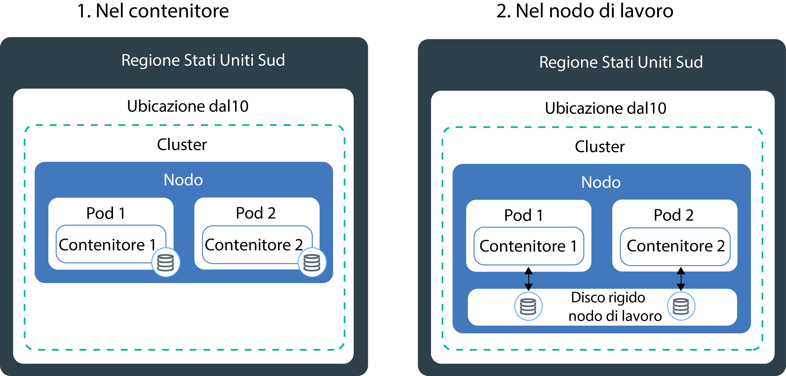
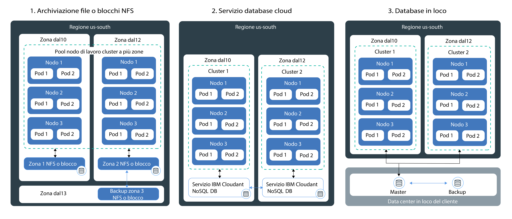

---

copyright:
  years: 2014, 2018
lastupdated: "2018-10-25"

---

{:new_window: target="_blank"}
{:shortdesc: .shortdesc}
{:screen: .screen}
{:pre: .pre}
{:table: .aria-labeledby="caption"}
{:codeblock: .codeblock}
{:tip: .tip}
{:download: .download}

# Pianificazione di archiviazione persistente altamente disponibile
{: #storage_planning}

## Scelta di una soluzione di archiviazione
{: #choose_storage_solution}

Prima di poter decidere quale tipo di archiviazione è la soluzione giusta per te, devi capire i tuoi requisiti applicativi, il tipo di dati che vuoi archiviare e con che frequenza vuoi accedere a tali dati. 
{: shortdesc}

1. Decidi se i tuoi dati devono essere archiviati in modo permanente o se possono essere rimossi in qualsiasi momento. 
   - **Archiviazione persistente:** i tuoi dati devono continuare a essere disponibili, anche se il contenitore, il nodo di lavoro o il cluster vengono rimossi. Utilizza l'archiviazione persistente nei seguenti scenari: 
       - Applicazioni con stato
       - Dati di business principali
       - Dati che devono essere disponibili a causa di requisiti legali, come ad esempio un periodo di conservazione definito
       - Controllo 
       - Dati a cui le istanze applicazione devono avere accesso e che devono condividere
   - **Archiviazione non persistente:** i tuoi dati possono essere rimossi quando il contenitore, il nodo di lavoro o il cluster vengono rimossi. L'archiviazione non persistente viene di norma utilizzata per le informazioni di registrazione, quali i log di sistema o i log del contenitore, l'attività di test di sviluppo o quando vuoi accedere ai dati dal file system dell'host. Per una panoramica delle opzioni di archiviazione non persistente disponibili, vedi [Confronto di opzioni di archiviazione non persistente](#non_persistent_overview). 

2. Se devi archiviare in modo persistente i tuoi dati, analizza se la tua applicazione richiede uno specifico tipo di archiviazione. Quando utilizzi un'applicazione esistente, essa potrebbe essere progettata per archiviare i dati in uno dei seguenti modi:  
   - **In un file system:** i dati possono essere archiviati come un file in una directory. Ad esempio, potresti archiviare questo file sul tuo disco rigido locale. Alcune applicazioni richiedono che i dati vengano archiviati in uno specifico file system, come `nfs` o `ext4`, per ottimizzare l'archiviazione dei dati e raggiungere gli obiettivi delle prestazioni. 
   - **In un database:** i dati devono essere archiviati in un database che segue uno specifico schema. Alcune applicazioni sono dotate di un'interfaccia di database che puoi utilizzare per archiviare i tuoi dati. Ad esempio, WordPress è ottimizzato per archiviare i dati in un database MySQL. In questi casi, il tipo di archiviazione è selezionato per te. 
   
3. Se la tua applicazione non ha una limitazione sul tipo di archiviazione che devi utilizzare, determina il tipo di dati che vuoi archiviare. 
   - **Dati strutturati:** dati che puoi archiviare in un database relazionale dove hai una tabella con colonne e righe. I dati nelle tabelle possono essere connessi utilizzando delle chiavi e sono di norma di facile accesso grazie al modello di dati predefinito. Degli esempi sono i numeri di telefono, i numeri di conto, i numeri di previdenza sociale o i CAP. 
   - **Dati semistrutturati:** dati che non si adattano a un database relazionale ma che sono dotati di alcune proprietà organizzative che puoi utilizzare per leggerli e analizzarli più facilmente. Degli esempi sono i file di linguaggio di markup quali CSV, XML o JSON.  
   - **Dati non strutturati:** dati che non seguono un pattern organizzativo e che sono così complessi che non è possibile archiviarli in un database relazionale con modelli di dati predefiniti. Per accedere a questi dati, hai bisogno di strumenti e software avanzati. Degli esempi sono i messaggi e-mail, i video, le foto, i file audio, le presentazioni, i dati dei social media o le pagine web. 

   Se hai dei dati strutturati e non strutturati, prova ad archiviare ciascun tipo di dati separatamente in una soluzione di archiviazione progettata per tale tipo di dati. Utilizzare una soluzione di archiviazione appropriata per il tuo tipo di dati facilita l'accesso ai tuoi dati e ti offre vantaggi in termini di prestazioni, scalabilità, durabilità e congruenza. 
   {: tip}
   
4. Analizza come vuoi accedere ai tuoi dati. Le soluzioni di archiviazione sono di norma progettate e ottimizzate per supportare le operazioni di lettura o scrittura.  
   - **Solo lettura:** i tuoi dati sono di sola lettura. Non vuoi scrivere o modificare i tuoi dati. 
   - **Lettura e scrittura:** vuoi leggere, scrivere e modificare i tuoi dati. Per i dati letti e scritti, è importante comprendere se le operazioni sono prevalentemente di lettura, prevalentemente di scrittura oppure bilanciate. 
   
4. Determina la frequenza con cui si accede ai tuoi dati. Comprendere la frequenza dell'accesso ai dati può aiutarti a comprendere le prestazioni di cui hai bisogno per la tua archiviazione. Ad esempio, i dati a cui si accede di frequente di norma si trovano nell'archiviazione veloce. 
   - **Dati hot:** dati a cui si accede frequentemente. I casi d'uso comuni sono le applicazioni web o mobili. 
   - **Dati cool o warm:** dati a cui si accede con scarsa frequenza, come ad esempio una volta al mese o meno. I casi d'uso comuni sono gli archivi, la conservazione di dati a breve termine o il ripristino d'emergenza. 
   - **Dati cold:** i dati a cui si accede raramente, se non per nulla. I casi d'uso comuni sono gli archivi, i backup a lungo termine, i dati cronologici. 
   - **Dati frozen:** i dati a cui non si accede e che è necessario conservare per motivi legali. 

   Se non puoi prevedere la frequenza oppure se essa non segue uno schema rigido, determina se i tuoi carichi di lavoro sono con un'elevata percentuale di lettura, un'elevata percentuale di scritture oppure bilanciati. Guarda quindi l'opzione di archiviazione adatta al tuo carico di lavoro e analizza quale livello di archiviazione ti dà la flessibilità di cui hai bisogno. Ad esempio, {{site.data.keyword.containerlong_notm}} fornisce una classe di archiviazione `flex` che valuta la frequenza con la quale si accede ai dati in un mese e tiene conto di tale misurazione per ottimizzare la tua fatturazione mensile. 
   {: tip}
 
5. Analizza se i tuoi dati devono essere condivisi tra più regioni, zone o istanze applicative. 
   - **Accesso tra i pod:** quando utilizzi i volumi persistenti Kubernetes per accedere alla tua archiviazione, puoi determinare il numero di pod che possono montare il volume contemporaneamente. Ad alcune soluzioni di archiviazione, come ad esempio l'archiviazione blocchi, può accedere un solo pod per volta. Altre soluzioni di archiviazione ti consentono di condividere lo stesso volume tra più pod. 
   - **Accesso tra zone e regioni:** potresti aver bisogno che i tuoi dati siano accessibili tra zone o regioni. Alcune soluzioni di archiviazione, come l'archiviazione file e blocchi, sono specifiche per i data center e non possono essere condivise tra zone in una configurazione del cluster multizona. 

6. Comprendi le altre caratteristiche di archiviazione che si ripercuotono sulla tua scelta. 
   - **Congruenza:** la garanzia che un'operazione di lettura restituisca la versione più recente di un file. Le soluzioni di archiviazione possono fornire una solida congruenza (`strong consistency`) quando ti viene garantito di ricevere sempre la versione più recente di un file oppure una eventuale congruenza (`eventual consistency`) quando l'operazione di lettura potrebbe non restituire la versione più recente. Trovi spesso un'eventuale congruenza nei sistemi geograficamente distribuiti in cui un'operazione di scrittura deve prima essere replicata su tutte le istanze. 
   - **Prestazioni:** il tempo impiegato per completare un'operazione di lettura o scrittura. 
   - **Durabilità:** la garanzia che un'operazione di scrittura di cui viene eseguito il commit alla tua archiviazione sopravviva permanentemente e non venga danneggiata né vada perduta, anche se nella tua archiviazione vengono scritti contemporaneamente gigabyte o terabyte di dati. 
   - **Resilienza:** la capacità di ripristino da una condizione di interruzione e di continuare le operazioni, anche se si è verificato il malfunzionamento di un componente hardware o software. Ad esempio, la tua archiviazione fisica subisce un'interruzione dell'alimentazione o di rete oppure viene distrutta dal verificarsi di un disastro naturale. 
   - **Disponibilità:** la capacità di fornire l'accesso ai tuoi dati, anche se un data center o una regione non sono disponibili. La disponibilità per i tuoi dati viene di solito ottenuta aggiungendo la ridondanza e configurando dei meccanismi di failover. 
   - **Scalabilità:** la capacità di estendere la capienza e di personalizzare le prestazioni in base alle tue esigenze. 
   - **Crittografia:** il mascheramento dei dati per evitare la visibilità quando un utente non autorizzato accede ai dati. 
   
7. [Esamina le soluzioni di archiviazione persistente disponibili](#persistent_storage_overview) e scegli la soluzione che risponde meglio ai tuoi requisiti applicativi e di dati. 

## Confronto di opzioni di archiviazione non persistente
{: #non_persistent_overview}

Puoi utilizzare le opzioni di archiviazione non persistente se per i tuoi dati non è necessaria un'archiviazione persistente oppure se vuoi eseguire uno unit-test dei tuoi componenti applicativi.
{: shortdesc}

La seguente immagine mostra le opzioni di archiviazione dati non persistente disponibili in {{site.data.keyword.containerlong_notm}}. Queste opzioni sono disponibili per i cluster gratuito e standard.

<table>
<thead>
<th style="text-align:left">Caratteristiche</th>
<th style="text-align:left">All'interno del contenitore</th>
<th style="text-align:left">Sul disco primario o secondario del nodo di lavoro</th>
</thead>
<tbody>
<tr>
<td style="text-align:left">Supporta il multizona</td>
<td style="text-align:left">No</td>
<td style="text-align:left">No</td>
</tr>
<tr>
<td style="text-align:left">Tipi di dati</td>
<td style="text-align:left">Tutti</td>
<td style="text-align:left">Tutti</td>
</tr>
<tr>
<td style="text-align:left">Capacità</td>
<td style="text-align:left">Limitata al disco secondario disponibile del nodo di lavoro. Per limitare la quantità di archiviazione secondaria utilizzata dal tuo pod, utilizza le richieste di risorse e i limiti per l'[archiviazione effimera ](https://kubernetes.io/docs/concepts/configuration/manage-compute-resources-container/#local-ephemeral-storage).</td>
<td style="text-align:left">Limitata allo spazio disponibile del nodo di lavoro sul disco primario (hostPath) o secondario (emptyDir). Per limitare la quantità di archiviazione secondaria utilizzata dal tuo pod, utilizza le richieste di risorse e i limiti per l'[archiviazione effimera ](https://kubernetes.io/docs/concepts/configuration/manage-compute-resources-container/#local-ephemeral-storage).</td>
</tr>
<tr>
<td style="text-align:left">Modello di accesso ai dati</td>
<td style="text-align:left">Operazioni di lettura e scrittura di qualsiasi frequenza</td>
<td style="text-align:left">Operazioni di lettura e scrittura di qualsiasi frequenza</td>
</tr>
<tr>
<td style="text-align:left">Accesso</td>
<td style="text-align:left">Tramite il file system locale del contenitore</td>
<td style="text-align:left"><ul style="margin:0px 0px 0px 20px; padding:0px"><li style="margin:0px; padding:0px">Tramite il volume [Kubernetes <code>hostPath</code> ](https://kubernetes.io/docs/concepts/storage/volumes/#hostpath) per l'accesso all'archiviazione primaria dei nodi di lavoro. </li><li style="margin:0px; padding:0px">Tramite il volume [Kubernetes <code>emptyDir</code> ](https://kubernetes.io/docs/concepts/storage/volumes/#emptydir) per l'accesso all'archivio secondario dei nodi di lavoro.</li></ul></td>
</tr>
<tr>
<td style="text-align:left">Prestazioni</td>
<td style="text-align:left">Elevata</td>
<td style="text-align:left">Elevate con latenza più bassa quando si utilizza SSD</td>
</tr>
<tr>
<td style="text-align:left">Congruenza</td>
<td style="text-align:left">Forte</td>
<td style="text-align:left">Forte</td>
</tr>
<tr>
<td style="text-align:left">Resilienza</td>
<td style="text-align:left">Bassa</td>
<td style="text-align:left">Bassa</td>
</tr>
<tr>
<td style="text-align:left">Disponibilità</td>
<td style="text-align:left">Specifica per il contenitore</td>
<td style="text-align:left">Specifica per il nodo di lavoro</td>
</tr>
<tr>
<td style="text-align:left">Scalabilità</td>
<td style="text-align:left">Difficile da estendere poiché limitata alla capacità del disco secondario del nodo di lavoro</td>
<td style="text-align:left">Difficile da estendere poiché limitata alla capacità del disco primario e secondario del nodo di lavoro</td>
</tr>
<tr>
<td style="text-align:left">Durabilità</td>
<td style="text-align:left">I dati vanno perduti quando si verifica un arresto anomalo del contenitore oppure quando esso viene rimosso. </td>
<td style="text-align:left">I dati nei volumi <code>hostPath</code> o <code>emptyDir</code> vanno perduti quando: <ul><li>Il nodo di lavoro viene eliminato.</li><li>Il nodo di lavoro viene ricaricato o aggiornato.</li><li>Il cluster viene eliminato.</li><li>L'account {{site.data.keyword.Bluemix_notm}} raggiunge uno stato sospeso. </li></ul>

Inoltre, i dati in un volume <code>emptyDir</code> vengono rimossi quando: <ul><li>Il pod assegnato
viene eliminato definitivamente dal nodo di lavoro.</li><li>Il pod assegnato viene pianificato su un altro nodo di lavoro.</li></ul>
</tr>
<tr>
<td style="text-align:left">Casi d'uso comuni</td>
<td style="text-align:left"><ul style="margin:0px 0px 0px 20px; padding:0px"><li style="margin:0px; padding:0px">Cache delle immagini locale</li><li style="margin:0px; padding:0px">Log del contenitore</li></ul></td>
<td style="text-align:left"><ul style="margin:0px 0px 0px 20px; padding:0px"><li style="margin:0px; padding:0px">Cache locale ad alte prestazioni</li><li style="margin:0px; padding:0px">Accedi ai file dal file system del nodo di lavoro</li><li style="margin:0px; padding:0px">Unit test</li></ul></td>
</tr>
<tr>
<td style="text-align:left">Casi d'uso non ideali</td>
<td style="text-align:left"><ul style="margin:0px 0px 0px 20px; padding:0px"><li style="margin:0px; padding:0px">Archiviazione dati persistente</li><li style="margin:0px; padding:0px">Condivisione dei dati tra i contenitori</li></ul></td>
<td style="text-align:left"><ul style="margin:0px 0px 0px 20px; padding:0px"><li style="margin:0px; padding:0px">Archiviazione dati persistente</li></ul></td>
</tr>
</tbody>
</table>

## Confronto delle opzioni di archiviazione persistente
{: #persistent_storage_overview}

Utilizza le opzioni di archiviazione persistente per i dati che vuoi conservare in modo permanente, anche nel caso in cui venissero rimossi il contenitore, il nodo di lavoro o il cluster. 
{: shortdesc}

**Nota:** le opzioni di archiviazione dati permanente sono disponibili solo per i cluster standard. 

Intendi invece connettere il tuo cluster a un database in loco? Vedi [Configurazione della connettività VPN al tuo cluster](cs_vpn.html#vpn).
{: tip}

La seguente immagine mostra le opzioni che hai in {{site.data.keyword.containerlong_notm}} per archiviare permanentemente i tuoi dati e rendere i tuoi dati altamente disponibili in un cluster.

<table>
<thead>
<th style="text-align:left">Caratteristiche</th>
<th style="text-align:left">File</th>
<th style="text-align:left">Blocco</th>
<th style="text-align:left">Oggetto</th>
<th style="text-align:left">DBaaS</th>
</thead>
<tbody>
<tr>
<td style="text-align:left">Con supporto multizona</td>
<td style="text-align:left">No, come specifico per un data center. I dati non possono essere condivisi tra le zone, a meno che non implementi la tua replica dei dati.</td>
<td style="text-align:left">No, come specifico per un data center. I dati non possono essere condivisi tra le zone, a meno che non implementi la tua replica dei dati.</td>
<td style="text-align:left">Sì</td>
<td style="text-align:left">Sì</td>
</tr>
<tr>
<td style="text-align:left">Tipi di dati ideali</td>
<td style="text-align:left">Tutti</td>
<td style="text-align:left">Tutti</td>
<td style="text-align:left">Dati semistrutturati e non strutturati</td>
<td style="text-align:left">Dipende dal DBaaS</td>
</tr>
<tr>
<td style="text-align:left">Modello di utilizzo dei dati</td>
<td style="text-align:left"><ul style="margin:0px 0px 0px 20px; padding:0px"><li style="margin:0px; padding:0px">Operazioni di lettura-scrittura casuali</li><li style="margin:0px; padding:0px">Operazioni di lettura-scrittura sequenziali</li></ul></td>
<td style="text-align:left"><ul style="margin:0px 0px 0px 20px; padding:0px"><li style="margin:0px; padding:0px">Operazioni di lettura-scrittura casuali</li><li style="margin:0px; padding:0px">Carichi di lavoro a scrittura intensiva</li></ul></td>
<td style="text-align:left"><ul style="margin:0px 0px 0px 20px; padding:0px"><li style="margin:0px; padding:0px">Carichi di lavoro a lettura intensiva</li><li style="margin:0px; padding:0px">Poche o zero operazioni di scrittura</li></ul></td>
<td style="text-align:left"><ul style="margin:0px 0px 0px 20px; padding:0px"><li style="margin:0px; padding:0px">Carichi di lavoro a lettura-scrittura intensiva</li></ul></td>
</tr>
<tr>
<td style="text-align:left">Accesso</td>
<td style="text-align:left">Tramite il file system sul volume montato</td>
<td style="text-align:left">Tramite il file system sul volume montato</td>
<td style="text-align:left">Tramite il file system sul volume montato (plug-in) oppure tramite l'API REST dalla tua applicazione</td>
<td style="text-align:left">Tramite l'API REST dalla tua applicazione</td>
</tr>
<tr>
<td style="text-align:left">Scritture di accesso Kubernetes supportate</td>
<td style="text-align:left"><ul style="margin:0px 0px 0px 20px; padding:0px"><li style="margin:0px; padding:0px">ReadWriteMany (RWX)</li><li style="margin:0px; padding:0px"> ReadOnlyMany (ROX)</li><li style="margin:0px; padding:0px">ReadWriteOnce (RWO)</li></ul></td>
<td style="text-align:left"><ul style="margin:0px 0px 0px 20px; padding:0px"><li style="margin:0px; padding:0px">ReadWriteOnce (RWO)</li></ul></td>
<td style="text-align:left"><ul style="margin:0px 0px 0px 20px; padding:0px"><li style="margin:0px; padding:0px">ReadWriteMany (RWX)</li><li style="margin:0px; padding:0px"> ReadOnlyMany (ROX)</li><li style="margin:0px; padding:0px">ReadWriteOnce (RWO)</li></ul></td>
<td style="text-align:left"><ul style="margin:0px 0px 0px 20px; padding:0px"><li style="margin:0px; padding:0px">N/D poiché l'accesso ad esso avviene dall'applicazione direttamente</li></ul></td>
</tr>
<tr>
<td style="text-align:left">Prestazioni</td>
<td style="text-align:left">Prevedibili per IOPS e dimensione assegnati. Gli IOPS sono condivisi tra i pod che accedono al volume.</td>
<td style="text-align:left">Prevedibili per IOPS e dimensione assegnati. Gli IOPS non sono condivisi tra i pod. </td>
<td style="text-align:left">Elevate per le operazioni di lettura. Non prevedibili per le operazioni di scrittura.</td>
<td style="text-align:left">Elevate in caso di distribuzione allo stesso data center della tua applicazione.</td>
</tr>
<tr>
<td style="text-align:left">Congruenza</td>
<td style="text-align:left">Forte</td>
<td style="text-align:left">Forte</td>
<td style="text-align:left">Eventuale</td>
<td style="text-align:left">Dipende dal DBaaS</td>
</tr>
<tr>
<td style="text-align:left">Durabilità</td>
<td style="text-align:left">Elevata</td>
<td style="text-align:left">Elevata</td>
<td style="text-align:left">Molto elevata poiché le porzioni di dati vengono distribuite in un cluster di nodi
di archiviazione. Ogni nodo memorizza solo una parte dei dati. </td>
<td style="text-align:left">Elevata</td>
</tr>
<tr>
<td style="text-align:left">Resilienza</td>
<td style="text-align:left">Media come specifico per un data center. Il server di archiviazione file è organizzato in cluster da IBM con la rete ridondante.</td>
<td style="text-align:left">Media come specifico per un data center. Il server di archiviazione blocchi è organizzato in cluster da IBM con la rete ridondante.</td>
<td style="text-align:left">Elevata poiché le porzioni di dati vengono distribuite in 3 zone o regioni. Media, se configurata solo in una singola zona.</td>
<td style="text-align:left">Dipende dal DBaaS e dalla tua configurazione. </td>
</tr>
<tr>
<td style="text-align:left">Disponibilità</td>
<td style="text-align:left">Media come specifico per un data center.</td>
<td style="text-align:left">Media come specifico per un data center.</td>
<td style="text-align:left">Elevata in ragione della distribuzione tra zone o regioni. </td>
<td style="text-align:left">Elevata se hai configurato più istanze. </td>
</tr>
<tr>
<td style="text-align:left">Scalabilità</td>
<td style="text-align:left">Difficile da estendere oltre il data center. Non puoi modificare un livello di archiviazione esistente. </td>
<td style="text-align:left">Difficile da estendere oltre il data center. Non puoi modificare un livello di archiviazione esistente.</td>
<td style="text-align:left">Facile da ridimensionare.</td>
<td style="text-align:left">Facile da ridimensionare.</td>
</tr>
<tr>
<td style="text-align:left">Crittografia</td>
<td style="text-align:left">Dati inattivi</td>
<td style="text-align:left">Dati inattivi</td>
<td style="text-align:left">In transito e inattivi</td>
<td style="text-align:left">Dati inattivi</td>
</tr>
<tr>
<td style="text-align:left">Casi d'uso comuni</td>
<td style="text-align:left"><ul style="margin:0px 0px 0px 20px; padding:0px"><li style="margin:0px; padding:0px">Archiviazione file singoli o di massa</li><li style="margin:0px; padding:0px">Condivisione file nell'ambito di un cluster a zona singola</li></ul></td>
<td style="text-align:left"><ul style="margin:0px 0px 0px 20px; padding:0px"><li style="margin:0px; padding:0px">Serie con stato</li><li style="margin:0px; padding:0px">Archiviazione di supporto quando esegui il tuo database</li><li style="margin:0px; padding:0px">Accesso ad elevate prestazioni per i singoli pod</li></ul></td>
<td style="text-align:left"><ul style="margin:0px 0px 0px 20px; padding:0px"><li style="margin:0px; padding:0px">Cluster multizona</li><li style="margin:0px; padding:0px">Dati distribuiti geograficamente</li><li style="margin:0px; padding:0px">Big Data statici</li><li style="margin:0px; padding:0px">Contenuto multimediale statico</li><li style="margin:0px; padding:0px">Applicazioni web</li><li style="margin:0px; padding:0px">Backup</li><li style="margin:0px; padding:0px">Archivi</li></ul></td>
<td style="text-align:left"><ul style="margin:0px 0px 0px 20px; padding:0px"><li style="margin:0px; padding:0px">Cluster multizona</li><li style="margin:0px; padding:0px">Database relazionali e non relazionali</li><li style="margin:0px; padding:0px">Dati distribuiti geograficamente</li></ul></td>
</tr>
<tr>
<td style="text-align:left">Casi d'uso non ideali</td>
<td style="text-align:left"><ul style="margin:0px 0px 0px 20px; padding:0px"><li style="margin:0px; padding:0px">Cluster multizona</li><li style="margin:0px; padding:0px">Dati distribuiti geograficamente</li></ul></td>
<td style="text-align:left"><ul style="margin:0px 0px 0px 20px; padding:0px"><li style="margin:0px; padding:0px">Cluster multizona</li><li style="margin:0px; padding:0px">Dati distribuiti geograficamente</li><li style="margin:0px; padding:0px">Condivisione dei dati tra più istanze dell'applicazione</li></ul></td>
<td style="text-align:left"><ul style="margin:0px 0px 0px 20px; padding:0px"><li style="margin:0px; padding:0px">Carichi di lavoro a scrittura intensiva</li><li style="margin:0px; padding:0px">Operazioni di scrittura casuali</li><li style="margin:0px; padding:0px">Aggiornamenti dei dati incrementali</li><li style="margin:0px; padding:0px">Database delle transazioni</li></ul></td>
<td style="text-align:left"><ul style="margin:0px 0px 0px 20px; padding:0px"><li style="margin:0px; padding:0px">Applicazione che è progettata per scrivere su un file system</li></ul></td>
</tr>
</tbody>
</table>
