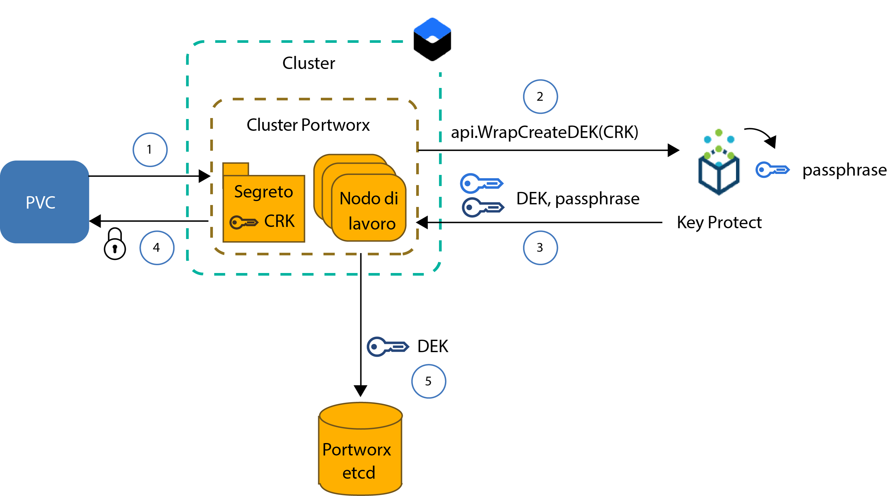
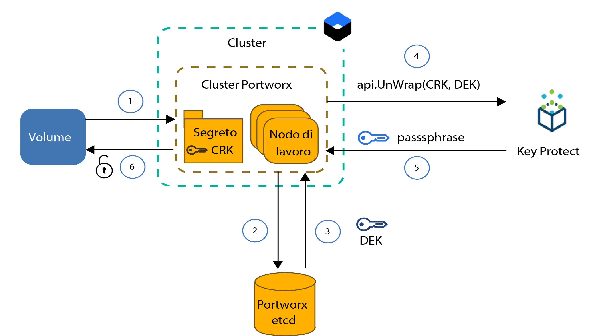

---

copyright:
  years: 2014, 2019
lastupdated: "2019-05-31"

keywords: kubernetes, iks, local persistent storage

subcollection: containers

---

{:new_window: target="_blank"}
{:shortdesc: .shortdesc}
{:screen: .screen}
{:pre: .pre}
{:table: .aria-labeledby="caption"}
{:codeblock: .codeblock}
{:tip: .tip}
{:note: .note}
{:important: .important}
{:deprecated: .deprecated}
{:download: .download}
{:preview: .preview}


# Archiviazione di dati su SDS (software-defined storage) con Portworx
{: #portworx}

[Portworx ](https://portworx.com/products/introduction/) è una soluzione SDS (software-defined storage) altamente disponibile che puoi utilizzare per gestire l'archiviazione persistente locale per i tuoi database inseriti nei contenitori e altre applicazioni con stato oppure per condividere dati tra i pod in più zone.
{: shortdesc}

**Cos'è SDS (software-defined storage)?** </br>
Una soluzione SDS astrae i dispositivi di archiviazione di vari tipi, diverse dimensioni o da fornitori differenti, che sono collegati ai nodi di lavoro nel tuo cluster. I nodi di lavoro con archiviazione disponibile sui dischi rigidi vengono aggiunti come un nodo a un cluster di archiviazione. In questo cluster, l'archiviazione fisica è virtualizzata e presentata come un pool di archiviazione virtuale all'utente. Il cluster di archiviazione è gestito dal software SDS. Se i dati devono essere memorizzati sul cluster di archiviazione, il software SDS decide dove archiviare i dati per la massima disponibilità. La tua archiviazione virtuale viene fornita con una serie comune di funzionalità e servizi di cui puoi avvalerti senza preoccuparti dell'effettiva architettura di archiviazione sottostante.

**Come funziona Portworx?** </br>
Portworx aggrega l'archiviazione disponibile che è collegata ai tuoi nodi di lavoro e crea un livello di archiviazione persistente unificato per i database inseriti nei contenitori o altre applicazioni con stato che desideri eseguire nel cluster. Utilizzando la replica di volume di ciascun volume a livello di contenitore su più nodi di lavoro, Portworx garantisce la persistenza dei dati e l'accessibilità dei dati nelle zone.

Portworx viene fornito anche con ulteriori funzioni che puoi utilizzare per le tue applicazioni con stato, come ad esempio le istantanee del volume, la crittografia dei volumi, l'isolamento e uno Storage Orchestrator for Kubernetes (Stork) integrato per garantire un posizionamento ottimale dei volumi nel cluster. Per ulteriori informazioni, vedi la [documentazione di Portworx](https://docs.portworx.com/).

**Quale tipo di nodo di lavoro in {{site.data.keyword.containerlong_notm}} è quello giusto per Portworx?** </br>
{{site.data.keyword.containerlong_notm}} fornisce dei tipi di nodo di lavoro bare metal che sono ottimizzati per l'[utilizzo SDS (software-defined storage)](/docs/containers?topic=containers-planning_worker_nodes#sds) e che sono forniti con uno o più dischi locali non elaborati, non formattati e non montati che puoi utilizzare per il tuo livello di archiviazione Portworx. Portworx offre delle prestazioni ottimali quando utilizzi le macchine di nodo di lavoro SDS fornite con una velocità di rete di 10Gbps.

**Cosa devo fare se voglio eseguire Portworx su nodi di lavoro non SDS?** </br>
Puoi installare Portworx su tipi di nodo di lavoro non SDS ma potresti non ottenere i vantaggi prestazionali richiesti dalla tua applicazione. I nodi di lavoro non SDS possono essere virtuali o bare metal. Se vuoi utilizzare le macchine virtuali, utilizza un tipo di nodo di lavoro `b2c.16x64` o migliore. Le macchine virtuali con un tipo `b3c.4x16` o `u3c.2x4` non forniscono le risorse necessarie perché Portworx funzioni correttamente. Tieni presente che le macchine virtuali sono fornite con 1000Mbps, che non è sufficiente per delle prestazioni ideali di Portworx. Le macchine bare metal sono fornite con risorse di calcolo e velocità di rete sufficienti per Portworx, ma devi [aggiungere dell'archiviazione blocchi non elaborata, non formattata e non montata](#create_block_storage) prima di poter utilizzare queste macchine.

**Come posso assicurarmi che i miei dati vengano archiviati in modo che siano altamente disponibili?** </br>
Hai bisogno di almeno 3 nodi di lavoro nel tuo cluster Portworx per consentire a Portworx di replicare i tuoi dati tra i nodi. Replicando i tuoi dati tra i nodi di lavoro, Portworx può garantire che la tua applicazione con stato possa essere ripianificata su un nodo di lavoro differente nel caso in cui si verificasse un malfunzionamento senza che si verifichi alcuna perdita di dati. Per una disponibilità ancora più elevata, utilizza un [cluster multizona](/docs/containers?topic=containers-ha_clusters#multizone) e replica i tuoi volumi tra i nodi di lavoro SDS in 3 o più zone.

**Quale topologia dei volumi offre le prestazioni migliori per i miei pod?** </br>
Una delle maggiori sfide quando si eseguono applicazioni con stato in un cluster consiste nell'assicurare che il tuo contenitore possa essere ripianificato su un altro host se si verifica un malfunzionamento del contenitore o dell'intero host. In Docker, quando un contenitore deve essere ripianificato su un host diverso, il volume non viene spostato al nuovo host. Portworx può essere configurato in modo da eseguire `hyper-converged` per garantire che le tue risorse di calcolo e l'archiviazione siano sempre posizionate sullo stesso nodo di lavoro. Quando la tua applicazione deve essere ripianificata, Portworx sposta la tua applicazione su un nodo di lavoro dove si trova una delle tue repliche di volume per garantire una velocità di accesso al disco locale e le prestazioni migliori per la tua applicazione con stato. L'esecuzione di `hyper-converged` offre le migliori prestazioni per i tuoi pod ma richiede che l'archiviazione sia disponibile su tutti i nodi di lavoro nel tuo cluster.

Puoi anche scegliere di utilizzare solo un sottoinsieme di nodi di lavoro per il tuo livello di archiviazione Portworx. Ad esempio, potresti avere un pool di nodi di lavoro con nodi di lavoro SDS che sono forniti con archiviazione blocchi non elaborata locale e un altro pool di nodi di lavoro con nodi di lavoro virtuali che non sono forniti con archiviazione locale. Quando installi Portworx, viene pianificato un pod Portworx su ogni nodo di lavoro nel tuo cluster come parte di una serie di daemon. Poiché i tuoi nodi di lavoro SDS hanno l'archiviazione locale, questi nodi di lavoro sono inclusi solo nel livello di archiviazione Portworx. I tuoi nodi di lavoro virtuali non sono inclusi come nodi di archiviazione perché manca l'archiviazione locale. Tuttavia, quando distribuisci un pod dell'applicazione al tuo nodo di lavoro virtuale, questo pod può ancora accedere ai dati archiviati fisicamente su un nodo di lavoro SDS utilizzando il pod della serie di daemon Portworx, Questa configurazione viene indicata come `storage-heavy` e offre delle prestazioni leggermente più lente rispetto alla configurazione `hyper-converged` perché il nodo di lavoro virtuale deve comunicare con il nodo di lavoro SDS sulla rete privata per accedere ai dati.

**Cosa mi serve per eseguire il provisioning di Portworx?** </br>
{{site.data.keyword.containerlong}} fornisce dei tipi di nodo di lavoro che sono ottimizzati per l'utilizzo SDS e che sono forniti con uno o più dischi locali non elaborati, non formattati e non montati che puoi utilizzare per archiviare i tuoi dati. Portworx offre delle prestazioni ottimali quando utilizzi le [macchine di nodo di lavoro SDS](/docs/containers?topic=containers-planning_worker_nodes#sds) fornite con la velocità di rete di 10Gbps. Puoi tuttavia installare Portworx su tipi di nodo di lavoro non SDS ma potresti non ottenere i vantaggi prestazionali richiesti dalla tua applicazione. I requisiti minimi di un nodo di lavoro per eseguire correttamente Portworx includono:
- 4 core CPU
- 4GB di memoria
- 128GB di archiviazione non elaborata e non formattata
- Una velocità di rete di 10Gbps

**Quali limitazioni devo prevedere?** </br>
Portworx è disponibile per i cluster standard configurati con la connettività di rete pubblica. Se il tuo cluster non può accedere alla rete pubblica, ad esempio un cluster privato dietro un firewall o un cluster con solo l'endpoint del servizio privato abilitato, non puoi utilizzare Portworx nel tuo cluster a meno che tu non apra tutto il traffico di rete in uscita sulla porta TCP 443 o abiliti l'endpoint del servizio pubblico.


Sei pronto? Iniziamo [creando un cluster con un pool di nodi di lavoro SDS di almeno 3 nodi di lavoro](/docs/containers?topic=containers-clusters#clusters_ui). Se vuoi includere dei nodi di lavoro non SDS nel tuo cluster Portworx, [aggiungi l'archiviazione blocchi non elaborata](#create_block_storage) a ciascun nodo di lavoro. Una volta preparato il tuo cluster, [installa il grafico Helm di Portworx](#install_portworx) nel tuo cluster e crea il tuo primo cluster di archiviazione iperconvergente.  

## Creazione di archiviazione blocchi non elaborata, non formattata e non montata per nodi di lavoro non SDS
{: #create_block_storage}

Portworx viene eseguito in modo ottimale quando utilizzi dei tipi di nodo di lavoro ottimizzati per l'[utilizzo SDS (software-defined storage)](/docs/containers?topic=containers-planning_worker_nodes#sds). Tuttavia, se non puoi o non vuoi utilizzare dei nodi di lavoro SDS, puoi scegliere di installare Portworx su tipi di nodo di lavoro non SDS. Tieni presente che i nodi di lavoro non SDS non sono ottimizzati per Portworx e potrebbero non offrire i vantaggi prestazionali richiesti dalla tua applicazione.
{: shortdesc}

Per includere dei nodi di lavoro non SDS nel tuo cluster Portworx, devi aggiungere dei dispositivi di archiviazione blocchi non elaborati, non formattati e non montati ai tuoi nodi di lavoro utilizzando il plugin {{site.data.keyword.Bluemix_notm}} Block Volume Attacher. Non è possibile eseguire il provisioning di archiviazione blocchi non elaborata utilizzando le attestazioni del volume persistente (o PVC, persistent volume claim) poiché il dispositivo di archiviazione blocchi viene formattato automaticamente da {{site.data.keyword.containerlong_notm}}. Portworx supporta solo l'archiviazione blocchi. I nodi di lavoro non SDS che montano archiviazione file o blocchi non possono essere utilizzati per il livello di dati Portworx.

Se hai dei tipi di nodo di lavoro SDS nel tuo cluster e vuoi utilizzare tali nodi di lavoro solo per creare il tuo livello di archiviazione Portworx, puoi tralasciare del tutto questo passo e continuare con [Configurazione del tuo database Portworx](#portworx_database).
{: note}

1. [Installa il plugin {{site.data.keyword.Bluemix_notm}} Block Volume Attacher](/docs/containers?topic=containers-utilities#block_storage_attacher).
2. Se vuoi aggiungere dell'archiviazione blocchi con la stessa configurazione a tutti i nodi di lavoro, [aggiungi automaticamente l'archiviazione blocchi](/docs/containers?topic=containers-utilities#automatic_block) con il plugin {{site.data.keyword.Bluemix_notm}} Block Volume Attacher. Per aggiungere dell'archiviazione blocchi con una configurazione differente, aggiungere l'archiviazione blocchi solo a un sottoinsieme dei nodi di lavoro oppure per avere maggior controllo sul processo di provisioning, [aggiungi manualmente l'archiviazione blocchi](/docs/containers?topic=containers-utilities#manual_block).
3. [Collega l'archiviazione blocchi](/docs/containers?topic=containers-utilities#attach_block) ai tuoi nodi di lavoro.

## Ottenimento di una licenza Portworx
{: #portworx_license}

Quando [installi Portworx con un grafico Helm](#install_portworx), ottieni l'edizione `px-enterprise` di Portworx come una versione di prova. La versione di prova ti offre la piena funzionalità di Portworx che puoi testare per 30 giorni. Una volta scaduta la versione di prova, devi acquistare una licenza di Portworx per continuare a utilizzare il tuo cluster Portworx.
{: shortdesc}

Per ulteriori informazioni sui tipi di licenza disponibili e su come eseguire l'upgrade della tua licenza di prova, vedi [Portworx Licensing ](https://docs.portworx.com/reference/knowledge-base/px-licensing/). I dipendenti IBM devono ordinare una licenza Portworx attenendosi a [questa procedura](https://github.ibm.com/alchemy-containers/armada-storage/blob/master/portworx/px-license.md).

## Configurazione di un database per i metadati Portworx
{: #portworx_database}

Configura un servizio di database {{site.data.keyword.Bluemix_notm}}, che ad esempio [Databases for etcd](#databaseetcd) o [{{site.data.keyword.composeForEtcd}}](#compose) per creare un archivio chiave-valore per i metadati del cluster Portworx.
{: shortdesc}

L'archivio chiave-valore Portworx funge da SSOT (single source of truth) per il tuo cluster Portworx. Se l'archivio chiave-valore non è disponibile, non puoi lavorare con il tuo cluster Portworx per accedere ai tuoi dati o archiviarli. I dati esistenti non vengono modificati o rimossi quando il database Portworx non è disponibile.

### Configurazione di un'istanza del servizio Databases for etcd
{: #databaseetcd}

Databases for etcd è un servizio etcd gestito che archivia e replica in modo protetto i tuoi dati tra tre istanze di archiviazione per fornire alta disponibilità e resilienza per i tuoi dati. Per ulteriori informazioni, vedi [Esercitazione introduttiva a Databases for etcd](/docs/services/databases-for-etcd?topic=databases-for-etcd-getting-started#getting-started).

La seguente procedura mostra come eseguire il provisioning e come configurare un'istanza del servizio Databases for etcd per Portworx.

1. Assicurati di disporre del ruolo di accesso della piattaforma [`Amministratore` in {{site.data.keyword.Bluemix_notm}} IAM (Identity and Access Management)](/docs/iam?topic=iam-iammanidaccser#iammanidaccser) per il servizio Databases for etcd.  

2. Esegui il provisioning della tua istanza del servizio Databases for etcd.
   1. Apri la [pagina del catalogo Databases for etcd](https://cloud.ibm.com/catalog/services/databases-for-etcd)
   2. Immetti un nome per la tua istanza del servizio, come ad esempio `px-etcd`.
   3. Seleziona la regione dove desideri distribuire la tua istanza del servizio. Per prestazioni ottimali, scegli la regione in cui si trova il tuo cluster.
   4. Seleziona lo stesso gruppo di risorse in cui si trova il tuo cluster.
   5. Utilizza le impostazioni predefinite per l'assegnazione di memoria e disco iniziali.
   6. Scegli se vuoi utilizzare l'istanza del servizio {{site.data.keyword.keymanagementserviceshort}} predefinita oppure la tua.
   5. Esamina il piano dei prezzi.
   6. Fai clic su **Crea** per iniziare a configurare la tua istanza del servizio. Il completamento della configurazione potrebbe richiedere qualche minuto.
3. Crea le credenziali del servizio per la tua istanza del servizio Databases for etcd.
   1. Nella navigazione nella pagina dei dettagli del servizio, fai clic su **Credenziali del servizio**.
   2. Fai clic su **Nuove credenziali**.
   3. Immetti un nome per le tue credenziali del servizio e fai clic su **Aggiungi**.
4. {: #databases_credentials}Richiama le tue credenziali del servizio e il tuo certificato.
   1. Dalla colonna **Azioni** nella tabella delle credenziali del servizio, fai clic su **Visualizza credenziali**.
   2. Trova la sezione `grp.authentication` delle tue credenziali del servizio e annota nome utente (**`username`**) e **`password`**.
      Output di esempio per nome utente e password:
      ```
      "grpc": {
      "authentication": {
        "method": "direct",
        "password": "123a4567ab89cde09876vaa543a2bc2a10a123456bcd123456f0a7895aab1de",
        "username": "ibm_cloud_1abd2e3f_g12h_3bc4_1234_5a6bc7890ab"
      }
      ```
      {: screen}
   3. Trova la sezione `composed` delle tue credenziali del servizio e annota il valore di **`--endpoints`** di etcd.  
      Output di esempio per `--endpoints`:
      ```
      --endpoints=https://1ab234c5-12a1-1234-a123-123abc45cde1.123456ab78cd9ab1234a456740ab123c.databases.appdomain.cloud:32059
      ```
      {: screen}

   4. Trova la sezione `certificate` delle tue credenziali del servizio e annota la **`certificate_base64`**.
      Output di esempio per `certificate`
      ```
      "certificate": {
        "certificate_base64": "AB0cAB1CDEaABcCEFABCDEF1ACB3ABCD1ab2AB0cAB1CDEaABcCEFABCDEF1ACB3ABCD1ab2AB0cAB1CDEaABcCEFABCDEF1ACB3ABCD1ab2..."
      ```
      {: screen}

5. Crea un segreto Kubernetes per il tuo certificato.
   1. Crea un file di configurazione per il tuo segreto.
      ```
      apiVersion: v1
      kind: Secret
      metadata:
        name: px-etcd-certs
        namespace: kube-system
      type: Opaque
      data:
        ca.pem: <certificate_base64>
        client-key.pem: ""
        client.pem: ""
      ```
      {: codeblock}

   2. Crea il segreto nel tuo cluster.
      ```
      kubectl apply -f secret.yaml
      ```

6. [Installa Portworx nel tuo cluster](#install_portworx).


### Configurazione di un'istanza del servizio Compose for etcd
{: #compose}

{{site.data.keyword.composeForEtcd}} viene fornito con l'opzione di configurare il tuo database come parte di un cluster di archiviazione cloud che offre alta disponibilità e resilienza in caso di un malfunzionamento di una zona. Per ulteriori informazioni, vedi l'[Esercitazione introduttiva](/docs/services/ComposeForEtcd?topic=compose-for-etcd-getting-started-tutorial#getting-started-tutorial) di {{site.data.keyword.composeForEtcd}}.
{: shortdesc}

La seguente procedura mostra come eseguire il provisioning e la configurazione del servizio database {{site.data.keyword.composeForEtcd}} per Portworx.

1. Assicurati di disporre del ruolo Cloud Foundry di sviluppatore ([`Developer`) per lo spazio](/docs/iam?topic=iam-mngcf#mngcf) dove desideri creare il tuo servizio database {{site.data.keyword.composeForEtcd}}.

2. Esegui il provisioning di un'istanza del servizio {{site.data.keyword.composeForEtcd}}.
   1. Apri la pagina del catalogo [{{site.data.keyword.composeForEtcd}}](https://cloud.ibm.com/catalog/services/compose-for-etcd)
   2. Immetti un nome per la tua istanza del servizio, come ad esempio `px-etcd`.
   3. Seleziona la regione dove desideri distribuire la tua istanza del servizio. Per prestazioni ottimali, scegli la regione in cui si trova il tuo cluster.
   4. Seleziona un'organizzazione e uno spazio Cloud Foundry.
   5. Esamina i piani dei prezzi e seleziona quello che desideri.
   6. Fai clic su **Crea** per iniziare a configurare la tua istanza del servizio. Una volta terminata la configurazione, viene aperta la pagina dei dettagli del servizio.
3. {: #etcd_credentials}Richiama le credenziali del servizio {{site.data.keyword.composeForEtcd}}.
   1. Nella navigazione nella pagina dei dettagli del servizio, fai clic su **Gestisci**.
   2. Vai alla scheda **Panoramica**.
   3. Nella sezione **Stringhe di connessione**, seleziona **Riga di comando**.
   4. Annota il valore dei parametri `--endpoints` e `--user`.
      Output di esempio per `--endpoints`:
      ```
      --endpoints=https://portal-ssl123-34.bmix-dal-yp-12a23b5c-123a-12ab-a1b2-1a2bc3d34567.1234567890.composedb.com:12345,https://portal-ssl123-35.bmix-dal-yp-12a23b5c-123a-12ab-a1b2-1a2bc3d34567.1234567890.composedb.com:12345
      ```
      {: screen}

      Example output for `--user`:
      ```
      --user=root:ABCDEFGHIJKLMNOP
      ```
      {: screen}
   5. Utilizza queste credenziali del servizio quando [installi Portworx nel tuo cluster](#install_portworx).


## Installazione di Portworx nel tuo cluster
{: #install_portworx}

Installa Portworx con un grafico Helm. Il grafico Helm distribuisce una versione di prova di Portworx enterprise edition `px-enterprise` che puoi usare per 30 giorni. Viene inoltre installato anche [Stork ](https://docs.portworx.com/portworx-install-with-kubernetes/storage-operations/stork/) sul tuo cluster Kubernetes. Stork è il programma di pianificazione dell'archiviazione Portworx e ti consente di co-ubicare i pod con i loro dati e creare e ripristinare istantanee dei volumi Portworx.
{: shortdesc}

Stai cercando le istruzioni su come aggiornare o rimuovere Portworx? Vedi [Aggiornamento di Portworx](#update_portworx) e [Rimozione di Portworx](#remove_portworx).
{: tip}

Prima di iniziare:
- [Crea o utilizza un cluster esistente](/docs/containers?topic=containers-clusters#clusters_ui).
- Se vuoi utilizzare dei nodi di lavoro non SDS per il tuo livello di archiviazione Portworx, [aggiungi un dispositivo di archiviazione blocchi non formattato al tuo nodo di lavoro non SDS](#create_block_storage).
- Crea un'[istanza del servizio {{site.data.keyword.composeForEtcd}}](#portworx_database) per archiviare la configurazione e i metadati di Portworx.
- Decidi se vuoi crittografare i tuoi volumi Portworx con {{site.data.keyword.keymanagementservicelong_notm}}. Per crittografare i tuoi volumi, devi [configurare un'istanza del servizio {{site.data.keyword.keymanagementservicelong_notm}} e archiviare le tue informazioni sul servizio in un segreto Kubernetes](#encrypt_volumes).
- [Accedi al tuo account. Se applicabile, specifica il gruppo di risorse appropriato. Imposta il contesto per il tuo cluster.](/docs/containers?topic=containers-cs_cli_install#cs_cli_configure)

Per installare Portworx:

1.  [Attieniti alle istruzioni](/docs/containers?topic=containers-helm#public_helm_install) per installare il client Helm sulla tua macchina locale e installare il server Helm (tiller) con un account di servizio nel tuo cluster.

2.  Verifica che tiller sia installato con un account di servizio.

    ```
    kubectl get serviceaccount -n kube-system tiller
    ```
    {: pre}

    Output di esempio:

    ```
    NAME                                 SECRETS   AGE
    tiller                               1         2m
    ```
    {: screen}

3. Richiama l'endpoint etcd, il nome utente e la password del database Portworx che hai configurato in precedenza. A seconda del tipo di servizio database che hai utilizzato, vedi [{{site.data.keyword.composeForEtcd}}](#etcd_credentials) oppure [Databases for etcd](#databases_credentials).

4. Scarica il grafico Helm Portworx.
   ```
   git clone https://github.com/portworx/helm.git
   ```
   {: pre}

5. Apri il file `values.yaml` con il tuo editor preferito. Questo esempio utilizza l'editor `nano`.
   ```
   nano helm/charts/portworx/values.yaml
   ```
   {: pre}

6. Aggiorna i seguenti valori e salva le tue modifiche.
   - **`etcdEndPoint`**: aggiungi l'endpoint alla tua istanza del servizio {{site.data.keyword.composeForEtcd}} che hai richiamato in precedenza nel formato `"etcd:<etcd_endpoint1>;etcd:<etcd_endpoint2>"`.: Se hai più di un endpoint, includi tutti gli endpoint e separali con un carattere punto e virgola )`;`).
    - **`imageVersion`**: immetti la versione più recente del grafico Helm di Portworx. Per trovare la versione più recente, fai riferimento alle [note sulla release](https://docs.portworx.com/reference/release-notes/) di Portworx.
   - **`clusterName`**: immetti il nome del cluster dove vuoi installare Portworx.
   - **`usedrivesAndPartitions`**: immetti `true` per lasciare che Portworx trovi le partizioni e le unità disco rigido non montate.
   - **`usefileSystemDrive`**: immetti `true` per lasciare che Portworx trovi le unità disco rigido non montate, anche se sono formattate.
   - **`drives`**: immetti `none` per lasciare che Portworx trovi le unità disco rigido non montate e non formattate.
   - **`etcd.credentials`**: immetti il nome utente e la password della tua istanza del servizio {{site.data.keyword.composeForEtcd}} che hai richiamato in precedenza nel formato `<user_name>:<password>`.
   - **`etcd.certPath`**: immetti il percorso dove viene archiviato il certificato per la tua istanza del servizio database. Se configuri un'istanza del servizio Databases for etcd, immetti `/etc/pwx/etcdcerts`. Per {{site.data.keyword.composeForEtcd}}, immetti `none`.
   - **`etcd.ca`**: immetti il percorso al file dell'Autorità di certificazione (CA, Certificate Authority). Se configuri un'istanza del servizio Databases for etcd, immetti `/etc/pwx/etcdcerts/ca.pem`. Per {{site.data.keyword.composeForEtcd}}, immetti `none`.

   Per un elenco completo dei parametri supportati, vedi la [documentazione del grafico Helm di Portworx ](https://github.com/portworx/helm/blob/master/charts/portworx/README.md#configuration).

   File `values.yaml` di esempio per Databases for etcd:
   ```
   # Please uncomment and specify values for these options as per your requirements.

   deploymentType: oci                     # accepts "oci" or "docker"
   imageType: none                         #
   imageVersion: 2.0.2                   # Version of the PX Image.

   openshiftInstall: false                 # Defaults to false for installing Portworx on Openshift .
   isTargetOSCoreOS: false                 # Is your target OS CoreOS? Defaults to false.
   pksInstall: false                       # installation on PKS (Pivotal Container Service)
   AKSorEKSInstall: false                  # installation on AKS or EKS.
   etcdEndPoint: "etcd:<etcd_endpoint1>;etcd:<etcd_endpoint2>"
                                         # the default value is empty since it requires to be explicity set using either the --set option of -f values.yaml.
   clusterName: <cluster_name>                # This is the default. please change it to your cluster name.
   usefileSystemDrive: true             # true/false Instructs PX to use an unmounted Drive even if it has a file system.
   usedrivesAndPartitions: true          # Defaults to false. Change to true and PX will use unmounted drives and partitions.
   secretType: none                      # Defaults to None, but can be AWS / KVDB / Vault.
   drives: none                          # NOTE: This is a ";" seperated list of drives. For eg: "/dev/sda;/dev/sdb;/dev/sdc" Defaults to use -A switch.
   dataInterface: none                   # Name of the interface <ethX>
   managementInterface: none             # Name of the interface <ethX>
   envVars: none                         # NOTE: This is a ";" seperated list of environment variables. For eg: MYENV1=myvalue1;MYENV2=myvalue2

   stork: true                           # Use Stork https://docs.portworx.com/portworx-install-with-kubernetes/storage-operations/stork/ for hyperconvergence.
   storkVersion: 1.1.3

   customRegistryURL:
   registrySecret:

   lighthouse: false
   lighthouseVersion: 1.4.0

   journalDevice:

   deployOnMaster:  false                # For POC only
   csi: false                            # Enable CSI

   internalKVDB: false                   # internal KVDB
   etcd:
     credentials: <username>:<password>  # Username and password for ETCD authentication in the form user:password
     certPath: /etc/pwx/etcdcerts                      # Base path where the certificates are placed. (example: if the certificates ca,crt and the key are in /etc/pwx/etcdcerts the value should be provided as /etc/pwx/$
     ca: /etc/pwx/etcdcerts/ca.pem                            # Location of CA file for ETCD authentication. Should be /path/to/server.ca
     cert: none                          # Location of certificate for ETCD authentication. Should be /path/to/server.crt
     key: none                           # Location of certificate key for ETCD authentication Should be /path/to/servery.key
   consul:
     token: none                           # ACL token value used for Consul authentication. (example: 398073a8-5091-4d9c-871a-bbbeb030d1f6)

   serviceAccount:
     hook:
       create: true
       name:
   ```
   {: codeblock}

7. Installa il grafico Helm Portworx.
   ```
   helm install ./helm/charts/portworx/ --debug --name portworx
   ```
   {: pre}

   Output di esempio:
   ```
   LAST DEPLOYED: Mon Sep 17 16:33:01 2018
   NAMESPACE: default
   STATUS: DEPLOYED

   RESOURCES:
   ==> v1/Pod(related)
   NAME                             READY  STATUS             RESTARTS  AGE
   portworx-594rw                   0/1    ContainerCreating  0         1s
   portworx-rn6wk                   0/1    ContainerCreating  0         1s
   portworx-rx9vf                   0/1    ContainerCreating  0         1s
   stork-6b99cf5579-5q6x4           0/1    ContainerCreating  0         1s
   stork-6b99cf5579-slqlr           0/1    ContainerCreating  0         1s
   stork-6b99cf5579-vz9j4           0/1    ContainerCreating  0         1s
   stork-scheduler-7dd8799cc-bl75b  0/1    ContainerCreating  0         1s
   stork-scheduler-7dd8799cc-j4rc9  0/1    ContainerCreating  0         1s
   stork-scheduler-7dd8799cc-knjwt  0/1    ContainerCreating  0         1s

   ==> v1/ConfigMap
   NAME          DATA  AGE
   stork-config  1     1s

   ==> v1/ClusterRoleBinding
   NAME                          AGE
   node-role-binding             1s
   stork-scheduler-role-binding  1s
   stork-role-binding            1s

   ==> v1/ServiceAccount
   NAME                     SECRETS  AGE
   px-account               1        1s
   stork-account            1        1s
   stork-scheduler-account  1        1s

   ==> v1/ClusterRole
   NAME                    AGE
   node-get-put-list-role  1s
   stork-scheduler-role    1s
   stork-role              1s

   ==> v1/Service
   NAME              TYPE       CLUSTER-IP     EXTERNAL-IP  PORT(S)   AGE
   portworx-service  ClusterIP  172.21.50.26   <none>       9001/TCP  1s
   stork-service     ClusterIP  172.21.132.84  <none>       8099/TCP  1s

   ==> v1beta1/DaemonSet
   NAME      DESIRED  CURRENT  READY  UP-TO-DATE  AVAILABLE  NODE SELECTOR  AGE
   portworx  3        3        0      3           0          <none>         1s

   ==> v1beta1/Deployment
   NAME             DESIRED  CURRENT  UP-TO-DATE  AVAILABLE  AGE
   stork            3        3        3           0          1s
   stork-scheduler  3        3        3           0          1s

   ==> v1/StorageClass
   NAME                                    PROVISIONER                    AGE
   px-sc-repl3-iodb-512blk-snap60-15snaps  kubernetes.io/portworx-volume  1s
   px-sc-repl3-iodb-snap60-15snaps         kubernetes.io/portworx-volume  1s

   ==> v1/StorageClass
   stork-snapshot-sc  stork-snapshot  1s

   NOTES:

   Your Release is named "portworx"
   Portworx Pods should be running on each node in your cluster.

   Portworx would create a unified pool of the disks attached to your Kubernetes nodes.
   No further action should be required and you are ready to consume Portworx Volumes as part of your application data requirements.

   For further information on usage of the Portworx in creating Volumes please refer
       https://docs.portworx.com/scheduler/kubernetes/preprovisioned-volumes.html

   For dynamically provisioning volumes for your Stateful applications as they run on Kubernetes please refer
       https://docs.portworx.com/scheduler/kubernetes/dynamic-provisioning.html

   Want to use Storage Orchestration for hyperconvergence, Please look at STork here. (NOTE: This isnt currently deployed as part of the Helm chart)
       https://docs.portworx.com/portworx-install-with-kubernetes/storage-operations/stork/

   Refer application solutions such as Cassandra, Kafka etcetera.
       https://docs.portworx.com/portworx-install-with-kubernetes/application-install-with-kubernetes/cassandra/
       https://docs.portworx.com/portworx-install-with-kubernetes/application-install-with-kubernetes/kafka-with-zookeeper/

   For options that you could provide while installing Portworx on your cluster head over to the README.md
   ```
   {: screen}

8. Verifica che Portworx sia stato installato correttamente.
   1. Elenca i pod Portworx nel tuo spazio dei nomi `kube-system`.
      ```
      kubectl get pods -n kube-system | grep 'portworx\|stork'
      ```
      {: pre}

      Output di esempio:
      ```
      portworx-594rw                          1/1       Running     0          20h
      portworx-rn6wk                          1/1       Running     0          20h
      portworx-rx9vf                          1/1       Running     0          20h
      stork-6b99cf5579-5q6x4                  1/1       Running     0          20h
      stork-6b99cf5579-slqlr                  1/1       Running     0          20h
      stork-6b99cf5579-vz9j4                  1/1       Running     0          20h
      stork-scheduler-7dd8799cc-bl75b         1/1       Running     0          20h
      stork-scheduler-7dd8799cc-j4rc9         1/1       Running     0          20h
      stork-scheduler-7dd8799cc-knjwt         1/1       Running     0          20h
      ```
      {: screen}

      L'installazione ha avuto esito positivo quando vedi uno o più pod `portworx`, `stork` e `stork-scheduler`. Il numero di pod `portworx`, `stork` e `stork-scheduler` è uguale al numero di nodi di lavoro inclusi nel tuo cluster Portworx. Tutti i pod devono essere in uno stato **In esecuzione**.

9. Verifica che il tuo cluster Portworx sia configurato correttamente.      
   1. Esegui l'accesso a uno dei tuoi pod `portworx` ed elenca lo stato del tuo cluster Portworx.
      ```
      kubectl exec <portworx_pod> -it -n kube-system -- /opt/pwx/bin/pxctl status
      ```
      {: pre}

      Output di esempio:
      ```
      Status: PX is operational
      License: Trial (expires in 30 days)
      Node ID: 10.176.48.67
	      IP: 10.176.48.67
 	      Local Storage Pool: 1 pool
	      POOL	IO_PRIORITY	RAID_LEVEL	USABLE	USED	STATUS	ZONE	REGION
      	0	LOW		raid0		20 GiB	3.0 GiB	Online	dal10	us-south
      	Local Storage Devices: 1 device
      	Device	Path						Media Type		Size		Last-Scan
       	0:1	/dev/mapper/3600a09803830445455244c4a38754c66	STORAGE_MEDIUM_MAGNETIC	20 GiB		17 Sep 18 20:36 UTC
      	total							-			20 GiB
      Cluster Summary
	      Cluster ID: multizona
	      Cluster UUID: a0d287ba-be82-4aac-b81c-7e22ac49faf5
	      Scheduler: kubernetes
	      Nodes: 2 node(s) with storage (2 online), 1 node(s) without storage (1 online)
	      IP		ID		StorageNode	Used	Capacity	Status	StorageStatus	Version		Kernel			OS
	      10.184.58.11	10.184.58.11	Yes		3.0 GiB	20 GiB		Online	Up		1.5.0.0-bc1c580	4.4.0-133-generic	Ubuntu 16.04.5 LTS
	      10.176.48.67	10.176.48.67	Yes		3.0 GiB	20 GiB		Online	Up (This node)	1.5.0.0-bc1c580	4.4.0-133-generic	Ubuntu 16.04.5 LTS
	      10.176.48.83	10.176.48.83	No		0 B	0 B		Online	No Storage	1.5.0.0-bc1c580	4.4.0-133-generic	Ubuntu 16.04.5 LTS
      Global Storage Pool
	      Total Used    	:  6.0 GiB
	      Total Capacity	:  40 GiB
      ```
      {: screen}

   2. Verifica che tutti i nodi di lavoro che volevi includere nel tuo cluster Portworx siano inclusi esaminando la colonna **`StorageNode`** nella sezione **Cluster Summary** del tuo output della CLI. Se un nodo di lavoro è incluso come un nodo di archiviazione nel cluster Portworx, questo nodo di lavoro visualizza **Yes** nella colonna **`StorageNode`**. Se un nodo di lavoro non è incluso nel cluster Portworx, Portworx non ha potuto trovare il dispositivo di archiviazione blocchi non elaborata e non formattata collegato al tuo nodo di lavoro.

      Poiché Portworx viene eseguito come una serie di daemon nel tuo cluster, i nuovi nodi di lavoro che aggiungi al tuo cluster vengono ispezionati automaticamente per rilevare l'archiviazione blocchi non elaborata e vengono aggiunti al livello di dati Portworx.
      {: note}

   3. Verifica che ogni nodo di archiviazione sia elencato con la quantità corretta di archiviazione blocchi non elaborata esaminando la colonna **Capacity** nella sezione **Cluster Summary** del tuo output della CLI.

   4. Esamina la classificazione I/O di Portworx che era stata assegnata ai dischi che fanno parte del cluster Portworx. Durante la configurazione del tuo cluster Portworx, ogni disco viene ispezionato per determinare il profilo delle prestazioni del dispositivo. La classificazione del profilo dipende da quanto è rapida la rete a cui è connesso il tuo nodo di lavoro e dal tipo di dispositivo di archiviazione di cui disponi. I dischi dei nodi di lavoro SDS sono classificati come `high`. Se colleghi manualmente dei dischi a un nodo di lavoro virtuale, questi dischi vengono classificati come `low` a causa della minore velocità di rete fornita con i nodi di lavoro virtuali.

      ```
      kubectl exec -it <portworx_pod> -n kube-system -- /opt/pwx/bin/pxctl cluster provision-status
      ```
      {: pre}

      Output di esempio:
      ```
      NODE		NODE STATUS	POOL	POOL STATUS	IO_PRIORITY	SIZE	AVAILABLE	USED	PROVISIONED	RESERVEFACTOR	ZONE	REGION		RACK
      10.184.58.11	Up		0	Online		LOW		20 GiB	17 GiB		3.0 GiB	0 B		0		dal12	us-south	default
      10.176.48.67	Up		0	Online		LOW		20 GiB	17 GiB		3.0 GiB	0 B		0		dal10	us-south	default
      10.176.48.83	Up		0	Online		HIGH		3.5 TiB	3.5 TiB		10 GiB	0 B		0		dal10	us-south	default
      ```
      {: screen}

Ottimo! Ora che hai configurato il tuo cluster Portworx, puoi procedere all'[aggiunta di archiviazione dal tuo cluster alle tue applicazioni](#add_portworx_storage).

### Aggiornamento di Portworx nel tuo cluster
{: #update_portworx}

Puoi eseguire un upgrade di Portworx alla versione più recente.
{: shortdesc}

1. Esegui i passi da 2 a 5 in [Installazione di Portworx sul tuo cluster](#install_portworx).

2. Trova il nome di installazione del tuo grafico Helm di Portworx.
   ```
   helm list | grep portworx
   ```
   {: pre}

   Output di esempio:
   ```
   <helm_chart_name>            1       	Mon Sep 17 16:33:01 2018	DEPLOYED	portworx-1.0.0     default     
   ```
   {: screen}

3. Aggiorna il tuo grafico Helm di Portworx.
   ```
   helm upgrade <helm_chart_name> ./helm/charts/portworx/
   ```
   {: pre}

### Rimozione di Portworx dal tuo cluster
{: #remove_portworx}

Se non vuoi utilizzare Portworx nel tuo cluster, puoi disinstallare il grafico Helm.
{: shortdesc}

1. Trova il nome di installazione del tuo grafico Helm di Portworx.
   ```
   helm list | grep portworx
   ```
   {: pre}

   Output di esempio:
   ```
   <helm_chart_name>            1       	Mon Sep 17 16:33:01 2018	DEPLOYED	portworx-1.0.0     default     
   ```
   {: screen}

2. Elimina Portworx rimuovendo il grafico Helm.
   ```
   helm delete --purge <helm_chart_name>
   ```
   {: pre}

3. Verifica che i pod Portworx siano stati rimossi.
   ```
   kubectl get pod -n kube-system | grep 'portworx\|stork'
   ```
   {: pre}

   La rimozione dei pod è riuscita se nel tuo output CLI non vengono visualizzati pod.

## Crittografia dei volumi Portworx con {{site.data.keyword.keymanagementservicelong_notm}}
{: #encrypt_volumes}

Per proteggere i tuoi dati in un volume Portworx, puoi scegliere di proteggere i tuoi volumi con {{site.data.keyword.keymanagementservicelong_notm}}.
{: shortdesc}

{{site.data.keyword.keymanagementservicelong_notm}} ti aiuta ad eseguire il provisioning di chiavi crittografate che sono protette da HSM (hardware security module) basati sul cloud con certificazione FIPS 140-2 Level 2. Puoi utilizzare queste chiavi per proteggere in modo sicuro i tuoi dati da utenti non autorizzati. Puoi scegliere di utilizzare una chiave di crittografia per crittografare tutti i tuoi volumi in un cluster o di utilizzare invece una chiave di crittografia per ciascun volume. Portworx utilizza questa chiave per crittografare i dati inattivi e in fase di transito quando vengono inviati a un altro nodo di lavoro. Per ulteriori informazioni, vedi [Volume encryption ](https://docs.portworx.com/portworx-install-with-kubernetes/storage-operations/create-pvcs/create-encrypted-pvcs/#volume-encryption). Per una sicurezza maggiore, configura una crittografia per ogni singolo volume.

Esamina le seguenti informazioni:
- Panoramica del [flusso di lavoro di crittografia dei volumi Portworx](#px_encryption) con {{site.data.keyword.keymanagementservicelong_notm}} per la crittografia per ogni singolo volume
- Panoramica del [flusso di lavoro di decrittografia dei volumi Portworx](#decryption) con {{site.data.keyword.keymanagementservicelong_notm}} per la crittografia per ogni singolo volume
- [Configurazione della crittografia per ogni singolo volume](#setup_encryption) per i tuoi volumi Portworx.

### Flusso di lavoro della crittografia per ogni singolo volume di Portworx
{: #px_encryption}

La seguente immagine illustra il flusso di lavoro di crittografia in Portworx con {{site.data.keyword.keymanagementservicelong_notm}} quando configuri la crittografia per ogni singolo volume.
{: shortdesc}



1. L'utente crea una PVC on una classe di archiviazione Portworx e richiede che l'archiviazione sia crittografata.
2. Portworx richiama il comando `WrapCreateDEK` dell'API {{site.data.keyword.keymanagementservicelong_notm}} API per creare una passphrase utilizzando la CRK (customer root key) archiviata nel segreto Kubernetes.
3. L'istanza del servizio {{site.data.keyword.keymanagementservicelong_notm}} genera una password a 256 bit ed esegue il wrapping della passphrase nella DEK. La DEK viene restituita al cluster Portworx.
4. Il cluster Portworx utilizza la passphrase per crittografare il volume.
5. Il cluster Portworx archivia la DEK in testo semplice nel database etcd di Portworx, associa l'ID volume alla DEK e rimuove la passphrase dalla sua memoria.

### Flusso di lavoro della decrittografia per ogni singolo volume di Portworx
{: #decryption}

La seguente immagine illustra il flusso di lavoro di decrittografia in Portworx con {{site.data.keyword.keymanagementservicelong_notm}} quando configuri la crittografia per ogni singolo volume.



1. Kubernetes invia una richiesta di decrittografare un volume crittografato.
2. La Portworx richiede la DEK per il volume dal database etcd di Portworx.
3. L'etcd di Portworx ricerca la DEK e la restituisce al cluster Portworx.
4. Il cluster Portworx richiama il comando `UnWrapDEK` dell'API {{site.data.keyword.keymanagementservicelong_notm}} fornendo la DEK e la chiave root (CRK) archiviata nel segreto Portworx.
5. {{site.data.keyword.keymanagementservicelong_notm}} annulla il wrapping della DEK per estrarre la passphrase e restituisce quest'ultima al cluster Portworx.
6. Il cluster Portworx utilizza la passphrase per decrittografare il volume. Dopo che il volume è stato decrittografato, la passphrase viene rimossa dal cluster Portworx.  

### Configurazione della crittografia per ogni singolo volume per i tuoi volumi Portworx
{: #setup_encryption}

Attieniti alla seguente procedura per configurare la crittografia per i tuoi volumi Portworx con {{site.data.keyword.keymanagementservicelong_notm}}.
{: shortdesc}

1. Assicurati che ti sia stato [assegnato il ruolo di accesso della piattaforma `Editor` e il ruolo di accesso del servizio di scrittore (`Writer`)](/docs/services/key-protect?topic=key-protect-manage-access#manage-access) in {{site.data.keyword.Bluemix_notm}} Identity and Access Management for {{site.data.keyword.keymanagementservicelong_notm}}.

2. Crea un'istanza del servizio {{site.data.keyword.keymanagementservicelong_notm}}.
   1. Apri la [pagina del catalogo {{site.data.keyword.keymanagementservicelong_notm}}](https://cloud.ibm.com/catalog/services/key-protect).
   2. Nel campo **Nome servizio**, immetti un nome per la tua istanza di servizio.
   3. Seleziona la regione dove desideri distribuire la tua istanza del servizio. Per prestazioni ottimali, scegli la regione in cui si trova il tuo cluster.
   4. Seleziona il gruppo di risorse in cui si trova il tuo cluster.
   5. Esamina il piano dei prezzi.
   6. Fai clic su **Crea** per creare la tua istanza del servizio. Una volta terminata la creazione, viene aperta la pagina dei dettagli del servizio.

3. Crea una chiave root {{site.data.keyword.keymanagementservicelong_notm}}.
   1. Dalla pagina dei dettagli del servizio, seleziona **Gestisci**.
   2. Fai clic su **Aggiungi chiave**.
   3. Immetti il **Nome** della tua chiave e seleziona **Chiave root** dall'elenco a discesa **Tipo di chiave**.
   4. Fai clic su **Crea chiave**.
   5. Annota l'ID della chiave root che hai creato.

4. Richiama il **GUID** della tua istanza del servizio.
   ```
   ibmcloud resource service-instance <service_instance_name_or_ID>
   ```
   {: pre}

   Output di esempio:
   ```
   Retrieving service instance portworx in resource group default under account IBM as nspies@us.ibm.com...
   OK

   Name:                  portworx
   ID:                    crn:v1:bluemix:public:kms:us-south:a/1ab123ab3c456789cde1f1234ab1cd123:a1a2b345-1d12-12ab-a12a-1abc2d3e1234::
   GUID:                  a1a2b345-1d12-12ab-a12a-1abc2d3e1234
   Location:              us-south
   Service Name:          kms
   Service Plan Name:     tiered-pricing
   Resource Group Name:   default
   State:                 active
   Type:                  service_instance
   Sub Type:
   Tags:
   Created at:            2018-10-30T20:24:54Z
   Updated at:            2018-10-30T20:24:54Z  
   ```
   {: screen}

5. [Crea un ID servizio per il tuo account](/docs/iam?topic=iam-serviceids#serviceids).  

6. [Assegna le tue autorizzazioni di ID servizio](/docs/iam?topic=iam-serviceidpolicy#serviceidpolicy) alla tua istanza del servizio {{site.data.keyword.keymanagementservicelong_notm}}.

7. [Crea una chiave API per il tuo ID servizio](/docs/iam?topic=iam-serviceidapikeys#serviceidapikeys). Questa chiave API viene utilizzata da Portworx per accedere all'API {{site.data.keyword.keymanagementservicelong_notm}}.

8. [Richiama l'endpoint API {{site.data.keyword.keymanagementservicelong_notm}}](/docs/services/key-protect?topic=key-protect-regions#regions) per la regione dove hai creato la tua istanza del servizio. Assicurati di annotare il tuo endpoint API nel formato `https://<api_endpoint>`.

9. Codifica il GUID {{site.data.keyword.keymanagementservicelong_notm}}, la chiave API, la chiave root e l'endpoint API {{site.data.keyword.keymanagementservicelong_notm}} in base64 e annota tutti i valori con codifica base64. Ripeti questo comando per ciascun parametro per richiamare il valore con codifica base64.
   ```
   echo -n "<value>" | base64
   ```
   {: pre}

10. Crea uno spazio dei nomi nel tuo cluster denominato `portworx` e consenti a Portworx di accedere a tutti i segreti Kubernetes archiviati in questo spazio dei nomi.
    ```
    apiVersion: v1
    kind: Namespace
    metadata:
      name: portworx
    ---
    # Role to access Kubernetes secrets in the portworx namespace only
    kind: Role
    apiVersion: rbac.authorization.k8s.io/v1
    metadata:
      name: px-role
      namespace: portworx
    rules:
    - apiGroups: [""]
      resources: ["secrets"]
      verbs: ["get", "list", "create", "update", "patch"]
    ---
    # Allow portworx service account to access the secrets in the portworx namespace
    kind: RoleBinding
    apiVersion: rbac.authorization.k8s.io/v1
    metadata:
      name: px-role-binding
      namespace: portworx
    subjects:
    - kind: ServiceAccount
      name: px-account
      namespace: kube-system
    roleRef:
      kind: Role
      name: px-role
      apiGroup: rbac.authorization.k8s.io
    ```
    {: codeblock}

11. Crea un segreto Kubernetes denominato `px-ibm` nello spazio dei nomi `portworx` del tuo cluster per archiviare le tue informazioni {{site.data.keyword.keymanagementservicelong_notm}}.
   1. Crea un file di configurazione per il tuo segreto Kubernetes con il seguente contenuto.
      ```
      apiVersion: v1
      kind: Secret
      metadata:
        name: px-ibm
        namespace: portworx
      type: Opaque
      data:
        IBM_SERVICE_API_KEY: <base64_apikey>
        IBM_INSTANCE_ID: <base64_guid>
        IBM_CUSTOMER_ROOT_KEY: <base64_rootkey>
	    IBM_BASE_URL: <base64_kp_api_endpoint>
      ```
      {: codeblock}

      <table>
      <caption>Descrizione dei componenti del file YAML</caption>
      <thead>
      <th colspan=2> Descrizione dei componenti del file YAML</th>
      </thead>
      <tbody>
      <tr>
      <td><code>metadata.name</code></td>
      <td>Immetti <code>px-ibm</code> come nome per il tuo segreto Kubernetes. Se utilizzi un nome diverso, Portworx non riconosce il segreto durante l'installazione. </td>
      </tr>
      <tr>
      <td><code>data.IBM_SERVICE_API_KEY</code></td>
      <td>Immetti la chiave API {{site.data.keyword.keymanagementservicelong_notm}} con codifica base64 che hai richiamato in precedenza. </td>
      </tr>
      <tr>
      <td><code>data.IBM_INSTANCE_ID</code></td>
      <td>Immetti il GUID {{site.data.keyword.keymanagementservicelong_notm}} con codifica base64 che hai richiamato in precedenza. </td>
      </tr>
      <tr>
      <td><code>data.IBM_CUSTOMER_ROOT_KEY</code></td>
      <td>Immetti la chiave root {{site.data.keyword.keymanagementservicelong_notm}} con codifica base64 che hai richiamato in precedenza. </td>
      </tr>
      <tr>
      <td><code>data.IBM_BASE_URL</code></td>
      <td>Immetti l'endpoint API con codifica base64 della tua istanza del servizio {{site.data.keyword.keymanagementservicelong_notm}}. </td>
      </tr>
      </tbody>
      </table>

   2. Crea il segreto nello spazio dei nomi `portworx` del tuo cluster.
      ```
      kubectl apply -f secret.yaml
      ```
      {: pre}

   3. Verifica che il segreto sia stato creato correttamente.
      ```
      kubectl get secrets -n portworx
      ```
      {: pre}

12. Se hai configurato la crittografia prima di avere installato Portworx, puoi ora [installare Portworx nel tuo cluster](#add_portworx_storage). Per aggiungere la crittografia al tuo cluster dopo che hai installato Portworx, aggiorna la serie di daemon Portworx per aggiungere `"-secret_type"` e `"ibm-kp"` come argomenti aggiuntivi alla definizione del contenitore Portworx.
   1. Aggiorna la serie di daemon Portworx.
      ```
      kubectl edit daemonset portworx -n kube-system
      ```
      {: pre}

      Serie di daemon aggiornata di esempio:
      ```
      containers:
       - args:
       - -c
       - testclusterid
       - -s
       - /dev/sdb
       - -x
       - kubernetes
       - -secret_type
       - ibm-kp
       name: portworx
      ```
      {: codeblock}

      Dopo che hai modificato la serie di daemon, i pod Portworx vengono riavviati e aggiornano automaticamente il file `config.json` sul nodo di lavoro per riflettere tale modifica.

   2. Elenca i pod Portworx nel tuo spazio dei nomi `kube-system`.
      ```
      kubectl get pods -n kube-system | grep portworx
      ```
      {: pre}

   3. Esegui l'accesso a uno dei pod Portworx.
      ```
      kubectl exec -it <pod_name> -it -n kube-system
      ```
      {: pre}

   4. Vai alla directory `pwx`.
      ```
      cd etc/pwx
      ```
      {: pre}

   5. Esamina il file `config.json` per verificare che `"secret_type": "ibm-kp"` sia stato aggiunto alla sezione **secret** del tuo output della CLI.
      ```
      cat config.json
      ```
      {: pre}

      Output di esempio:
      ```
      {
      "alertingurl": "",
      "clusterid": "px-kp-test",
      "dataiface": "",
      "kvdb": [
          "etcd:https://portal-ssl748-34.bmix-dal-yp-12a2312v5-123a-44ac-b8f7-5d8ce1d123456.123456789.composedb.com:56963",
          "etcd:https://portal-ssl735-35.bmix-dal-yp-12a2312v5-123a-44ac-b8f7-5d8ce1d123456.12345678.composedb.com:56963"
      ],
      "mgtiface": "",
      "password": "ABCDEFGHIJK",
      "scheduler": "kubernetes",
      "secret": {
         "cluster_secret_key": "",
         "secret_type": "ibm-kp"
      },
      "storage": {
        "devices": [
         "/dev/sdc1"
        ],
        "journal_dev": "",
        "max_storage_nodes_per_zone": 0,
        "system_metadata_dev": ""
      },
      "username": "root",
      "version": "1.0"
      }
      ```
      {: screen}

   6. Esci dal pod.

Controlla come [crittografare i segreti nel tuo cluster Kubernetes](/docs/containers?topic=containers-encryption#keyprotect), compreso il segreto in cui hai archiviato la tua CRK {{site.data.keyword.keymanagementserviceshort}} per il tuo cluster di archiviazione Portworx.
{: tip}

## Aggiunta di archiviazione dal tuo cluster Portworx alle applicazioni
{: #add_portworx_storage}

Ora che il tuo cluster Portworx è pronto, puoi iniziare a creare i volumi Portworx utilizzando il [provisioning dinamico di Kubernetes](/docs/containers?topic=containers-kube_concepts#dynamic_provisioning).
{: shortdesc}

### Passo 1: Creazione o utilizzo di una classe di archiviazione esistente per la tua PVC
{: #create_storageclass}

Per richiedere l'archiviazione dal tuo cluster Portworx e utilizzarla nella tua applicazione, devi iniziare creando o cercando una classe di archiviazione che puoi utilizzare per eseguire il provisioning di un volume Portworx.
{: shortdesc}

1. Elenca le classi di archiviazione disponibili nel tuo cluster e controlla se puoi utilizzare una classe di archiviazione Portworx esistente. Portworx viene fornito con una serie di classi di archiviazione predefinite che sono ottimizzate per l'utilizzo del database per condividere i dati tra i pod.
   ```
   kubectl get storageclasses | grep portworx
   ```
   {: pre}

   Per visualizzare i dettagli di una classe di archiviazione, esegui `kubectl describe storageclass <storageclass_name>`.
   {: tip}

2. Se non vuoi utilizzare una classe di archiviazione esistente, crea un file di configurazione per la tua nuova classe di archiviazione.

   Per un elenco completo delle opzioni supportate che puoi specificare nella tua classe di archiviazione, vedi [Utilizzo del provisioning dinamico ](https://docs.portworx.com/portworx-install-with-kubernetes/storage-operations/create-pvcs/dynamic-provisioning/#using-dynamic-provisioning)

   ```
   kind: StorageClass
   apiVersion: storage.k8s.io/v1
   metadata:
       name: <storageclass_name>
   provisioner: kubernetes.io/portworx-volume
   parameters:
      repl: "<replication_factor>"
      secure: "<true_or_false>"
      priority_io: "<io_priority>"
      shared: "<true_or_false>"
   ```
   {: codeblock}

   <table>
   <caption>Descrizione dei componenti del file YAML</caption>
   <thead>
   <th colspan=2> Descrizione dei componenti del file YAML</th>
   </thead>
   <tbody>
   <tr>
   <td><code>metadata.name</code></td>
   <td>Immetti un nome per la tua classe di archiviazione. </td>
   </tr>
   <tr>
   <td><code>parameters.repl</code></td>
   <td>Immetti il numero di repliche per i tuoi dati che vuoi archiviare in diversi nodi di lavoro. I numeri consentiti sono `1`,`2` o `3`. Ad esempio, se immetti `3`, i tuoi dati vengono replicati su 3 diversi nodi di lavoro nel tuo cluster Portworx. Per archiviare i tuoi dati in modo che siano altamente disponibili, utilizza un cluster multizona e replica i tuoi dati su 3 nodi di lavoro in zone differenti. <strong>Nota: </strong>devi disporre di un numero sufficiente di nodi di lavoro per soddisfare il tuo requisito di replica. Ad esempio, se hai due nodi di lavoro ma specifichi tre repliche, la creazione della PVC con questa classe di archiviazione non riesce. </td>
   </tr>
   <tr>
   <td><code>parameters.secure</code></td>
   <td>Specifica se vuoi crittografare i dati nel tuo volume con {{site.data.keyword.keymanagementservicelong_notm}}. Scegli tra le seguenti opzioni: <ul><li><strong>true</strong>: immetti <code>true</code> per abilitare la crittografia per i tuoi volumi Portworx. Per crittografare i volumi, devi disporre di un'istanza del servizio {{site.data.keyword.keymanagementservicelong_notm}} e di un segreto Kubernetes che contiene la tua CRK (customer root key). Per ulteriori informazioni su come configurare la crittografia per i volumi Portworx, vedi [Crittografia dei tuoi volumi Portworx](#encrypt_volumes). </li><li><strong>false</strong>: quando immetti <code>false</code>, i tuoi volumi Portworx non sono crittografati. </li></ul> Se non specifichi questa opzione, i tuoi volumi Portworx non sono crittografati per impostazione predefinita. <strong>Nota:</strong> puoi scegliere di abilitare la crittografia dei volumi nella tua PVC, anche se hai disabilitato la crittografia nella tua classe di archiviazione. L'impostazione che specifichi nella PVC ha la precedenza sulle impostazioni nella classe di archiviazione.  </td>
   </tr>
   <tr>
   <td><code>parameters.priority_io</code></td>
   <td>Immetti la priorità dell'I/O di Portworx che desideri richiedere per i tuoi dati. Le opzioni disponibili sono `high`, `medium` e `low`. Durante la configurazione del tuo cluster Portworx, ogni disco viene ispezionato per determinare il profilo delle prestazioni del dispositivo. La classificazione del profilo dipende dalla larghezza di banda di rete del tuo nodo di lavoro e dal tipo di dispositivo di archiviazione di cui disponi. I dischi dei nodi di lavoro SDS sono classificati come `high`. Se colleghi manualmente dei dischi a un nodo di lavoro virtuale, questi dischi vengono classificati come `low` a causa della minore velocità di rete fornita con i nodi di lavoro virtuali. </br><br> Quando crei una PVC con una classe di archiviazione, il numero di repliche che specifichi in <code>parameters/repl</code> ha la precedenza sulla priorità dell'I/O. Ad esempio, quando specifichi 3 repliche che vuoi archiviare su dischi ad alta velocità, ma hai solo un singolo nodo di lavoro con un disco ad alta velocità nel tuo cluster, la tua creazione della PVC riesce comunque. I tuoi dati vengono replicati sia sui dischi ad alta velocità che su quelli a bassa velocità. </td>
   </tr>
   <tr>
   <td><code>parameters.shared</code></td>
   <td>Definisci se vuoi consentire a più pod di accedere allo stesso volume. Scegli tra le seguenti opzioni: <ul><li><strong>true: </strong>se imposti questa opzione su <code>true</code>, puoi accedere allo stesso volume da più pod distribuiti sui nodi di lavoro in zone differenti. </li><li><strong>false: </strong>se imposti questa opzione su <code>false</code>, puoi accedere al volume da più pod solo se i pod sono distribuiti sul nodo di lavoro che si collega il disco fisico che supporta il volume. Se il tuo pod è distribuito su un nodo di lavoro differente, il pod non può accedere al volume.</li></ul></td>
   </tr>
   </tbody>
   </table>

3. Crea la classe di archiviazione.
   ```
   kubectl apply -f storageclass.yaml
   ```
   {: pre}

4. Verifica che la tua classe di archiviazione sia stata creata.
   ```
   kubectl get storageclasses
   ```
   {: pre}

### Passo 2: Creazione della tua attestazione del volume persistente (o PVC, persistent volume claim)
{: #create_dynamic_pvc}

Quando crei la PVC specificando la classe di archiviazione che hai creato in precedenza, esegui dinamicamente il provisioning del volume persistente (PV, persistent volume) e del volume Portworx che blocca lo spazio sui dischi del tuo cluster Portworx.
{: shortdesc}

1. Crea un file di configurazione per la tua PVC.
   ```
   kind: PersistentVolumeClaim
   apiVersion: v1
   metadata:
      name: mypvc
   spec:
      accessModes:
        - <access_mode>
      resources:
        requests:
          storage: <size>
      storageClassName: portworx-shared-sc
    ```
    {: codeblock}

    <table>
    <caption>Descrizione dei componenti del file YAML</caption>
    <thead>
    <th colspan=2> Descrizione dei componenti del file YAML</th>
    </thead>
    <tbody>
    <tr>
    <td><code>metadata.name</code></td>
    <td>Immetti un nome per la tua PVC, come ad esempio <code>mypvc</code>. </td>
    </tr>
    <tr>
    <td><code>spec.accessModes</code></td>
    <td>Immetti la [modalità di accesso Kubernetes ](https://kubernetes.io/docs/concepts/storage/persistent-volumes/#access-modes) che vuoi utilizzare. </td>
    </tr>
    <tr>
    <td><code>resources.requests.storage</code></td>
    <td>Immetti la quantità di archiviazione in gigabyte che desideri assegnare dal tuo cluster Portworx. Ad esempio, per assegnare 2 gigabyte dal tuo cluster Portworx, immetti `2Gi`. La quantità di archiviazione che puoi specificare è limitata dalla quantità di archiviazione disponibile nel tuo cluster Portworx. Se hai specificato un fattore di replica nella tua [classe di archiviazione](#create_storageclass) superiore a 1, la quantità di archiviazione che specifichi nella tua PVC è riservata su più nodi di lavoro.   </td>
    </tr>
    <tr>
    <td><code>spec.storageClassName</code></td>
    <td>Immetti il nome della classe di archiviazione che hai scelto o creato in precedenza e che vuoi utilizzare per eseguire il provisioning del tuo PV. Il file YAML di esempio utilizza la classe di archiviazione <code>portworx-shared-sc</code>. </td>
    </tr>
    </tbody>
    </table>

2. Crea la tua PVC.
   ```
   kubectl apply -f pvc.yaml
   ```
   {: pre}

3. Verifica che la tua PVC sia stata creata e associata a un volume persistente (o PV, persistent volume). Questo processo potrebbe richiedere alcuni minuti.
   ```
   kubectl get pvc
   ```
   {: pre}

### Passo 3: Montaggio della PVC sulla tua applicazione
{: #mount_pvc}

Per accedere all'archiviazione dalla tua applicazione, devi montare la PVC sulla tua applicazione.
{: shortdesc}

1. Crea un file di configurazione per una distribuzione che monta la PVC.

   Per suggerimenti relativi a come distribuire una serie con stato con Portworx, vedi [StatefulSets ](https://docs.portworx.com/portworx-install-with-kubernetes/application-install-with-kubernetes/cassandra/). La documentazione di Portworx include anche degli esempi di come distribuire [Cassandra ](https://docs.portworx.com/portworx-install-with-kubernetes/application-install-with-kubernetes/cassandra/), [Kafka ](https://docs.portworx.com/portworx-install-with-kubernetes/application-install-with-kubernetes/kafka-with-zookeeper/), [ElasticSearch con Kibana ](https://docs.portworx.com/portworx-install-with-kubernetes/application-install-with-kubernetes/elastic-search-and-kibana/) e [WordPress con MySQL ](https://docs.portworx.com/portworx-install-with-kubernetes/application-install-with-kubernetes/wordpress/).
   {: tip}

   ```
   apiVersion: apps/v1
   kind: Deployment
   metadata:
     name: <deployment_name>
     labels:
       app: <deployment_label>
   spec:
     selector:
       matchLabels:
         app: <app_name>
     template:
       metadata:
         labels:
           app: <app_name>
       spec:
         schedulerName: stork
         containers:
         - image: <image_name>
           name: <container_name>
	   securityContext:
             fsGroup: <group_ID>
           volumeMounts:
           - name: <volume_name>
             mountPath: /<file_path>
         volumes:
         - name: <volume_name>
           persistentVolumeClaim:
             claimName: <pvc_name>
   ```
   {: codeblock}

   <table>
    <caption>Descrizione dei componenti del file YAML</caption>
    <thead>
    <th colspan=2> Descrizione dei componenti del file YAML</th>
    </thead>
    <tbody>
        <tr>
    <td><code>metadata.labels.app</code></td>
    <td>Un'etichetta per la distribuzione.</td>
      </tr>
      <tr>
        <td><code>spec.selector.matchLabels.app</code> <br/> <code>spec.template.metadata.labels.app</code></td>
        <td>Un'etichetta per la tua applicazione.</td>
      </tr>
    <tr>
    <td><code>template.metadata.labels.app</code></td>
    <td>Un'etichetta per la distribuzione.</td>
      </tr>
    <tr>
    <td><code>spec.schedulerName</code></td>
    <td>Utilizza [Stork ](https://docs.portworx.com/portworx-install-with-kubernetes/storage-operations/stork/) come programma di pianificazione per il tuo cluster Portworx. Stork ti consente di co-ubicare i pod con i loro dati, fornisce una migrazione dei pod senza soluzione di continuità in caso di errori di archiviazione e rende più facile creare e ripristinare istantanee di volumi Portworx. </td>
    </tr>
    <tr>
    <td><code>spec.containers.image</code></td>
    <td>Il nome dell'immagine che vuoi utilizzare. Per elencare le immagini disponibili nel tuo account {{site.data.keyword.registryshort_notm}}, esegui <code>ibmcloud cr image-list</code>.</td>
    </tr>
    <tr>
    <td><code>spec.containers.name</code></td>
    <td>Il nome del contenitore che vuoi distribuire al tuo cluster.</td>
    </tr>
    <tr>
    <td><code>spec.containers.securityContext.fsGroup</code></td>
    <td>Facoltativo; per accedere alla tua archiviazione con un utente non root, specifica il [contesto di sicurezza](https://kubernetes.io/docs/tasks/configure-pod-container/security-context/) per il tuo pod e definisci la serie di utenti a cui vuoi concedere l'accesso nella sezione `fsGroup` nel tuo YAML di distribuzione. Per ulteriori informazioni, vedi il documento relativo all'[accesso ai volumi Portworx con un utente non root](https://docs.portworx.com/portworx-install-with-kubernetes/storage-operations/create-pvcs/access-via-non-root-users/). </td>
    </tr>
    <tr>
    <td><code>spec.containers.volumeMounts.mountPath</code></td>
    <td>Il percorso assoluto della directory in cui viene montato il volume nel contenitore. Se vuoi condividere un volume tra diverse applicazioni, puoi specificare i [percorsi secondari di volume ](https://kubernetes.io/docs/concepts/storage/volumes/#using-subpath) per ciascuna delle tue applicazioni.</td>
    </tr>
    <tr>
    <td><code>spec.containers.volumeMounts.name</code></td>
    <td>Il nome del volume per montare il tuo pod.</td>
    </tr>
    <tr>
    <td><code>volumes.name</code></td>
    <td>Il nome del volume per montare il tuo pod. Normalmente questo nome è lo stesso di <code>volumeMounts/name</code>.</td>
    </tr>
    <tr>
    <td><code>volumes.persistentVolumeClaim.claimName</code></td>
    <td>Il nome della PVC che esegue il bind del PV che vuoi utilizzare. </td>
    </tr>
    </tbody></table>

2. Crea la tua distribuzione.
   ```
   kubectl apply -f deployment.yaml
   ```
   {: pre}

3. Verifica che il PV sia stato montato correttamente nella tua applicazione.

   ```
   kubectl describe deployment <deployment_name>
   ```
   {: pre}

   Il punto di montaggio è nel campo **Montaggi volume** e il volume nel campo **Volumi**.

   ```
    Volume Mounts:
          /var/run/secrets/kubernetes.io/serviceaccount from default-token-tqp61 (ro)
          /volumemount from myvol (rw)
   ...
   Volumes:
      myvol:
        Type: PersistentVolumeClaim (a reference to a PersistentVolumeClaim in the same namespace)
        ClaimName: mypvc
        ReadOnly: false
   ```
   {: screen}

4. Verifica di poter scrivere i dati nel tuo cluster Portworx.
   1. Accedi al pod che monta il tuo PV.
      ```
      kubectl exec <pod_name> -it bash
      ```
      {: pre}

   2. Vai al tuo percorso di montaggio del volume che hai definito nella distribuzione della tua applicazione.
   3. Crea un file di testo.
      ```
      echo "This is a test" > test.txt
      ```
      {: pre}

   4. Leggi il file che hai creato.
      ```
      cat test.txt
      ```
      {: pre}


## Esplorazione di altre funzioni di Portworx
{: #features}

<dl>
<dt>Utilizzo dei volumi Portworx esistenti</dt>
<dd>Se hai un volume Portworx esistente che hai creato manualmente o che non era stato eliminato automaticamente quando hai eliminato la PVC, puoi eseguire staticamente il provisioning del PV e della PVC corrispondenti e utilizzare questo volume con la tua applicazione. Per ulteriori informazioni, vedi il documento relativo all'[utilizzo dei volumi esistenti ](https://docs.portworx.com/portworx-install-with-kubernetes/storage-operations/create-pvcs/using-preprovisioned-volumes/#using-the-portworx-volume). </dd>
<dt>Esecuzione di serie con stato su Portworx</dt>
<dd>Se hai un'applicazione con stato che vuoi distribuire come una serie con stato nel tuo cluster, puoi configurare la tua serie con stato per utilizzare l'archiviazione dal tuo cluster Portworx. Per ulteriori informazioni, vedi il documento relativo alla [creazione di una serie con stato (StatefulSet) MySQL ](https://docs.portworx.com/portworx-install-with-kubernetes/application-install-with-kubernetes/cassandra/#create-a-mysql-statefulset). </dd>
<dt>Esecuzione dei tuoi pod iperconvergenti</dt>
<dd>Puoi configurare il tuo cluster Portworx per pianificare i pod sullo stesso nodo di lavoro dove si trova il volume del pod. Questa configurazione viene indicata anche come `hyperconverged` (iperconvergente) e può migliorare le prestazioni dell'archiviazione di dati. Per ulteriori informazioni, vedi il documento relativo all'[esecuzione di pod sullo stesso host di un volume  ](https://docs.portworx.com/portworx-install-with-kubernetes/storage-operations/hyperconvergence/).</dd>
<dt>Creazione di istantanee dei tuoi volumi Portworx</dt>
<dd>Puoi salvare lo stato corrente di un volume e i suoi dati creando un'istantanea Portworx. Le istantanee possono essere archiviate sul tuo cluster Portworx locale o nel cloud. Per ulteriori informazioni, vedi il documento relativo alla [creazione e utilizzo delle istantanee locali ](https://docs.portworx.com/portworx-install-with-kubernetes/storage-operations/create-snapshots/). </dd>
	<dt>Monitoraggio e gestione del tuo cluster Portworx con Lighthouse</dt>
	<dd>[Lighthouse ](https://docs.portworx.com/reference/lighthouse/) è uno strumento grafico molto facile da utilizzare per aiutarti a gestire e monitorare le tue istantanee di volume e i tuoi cluster Portworx. Con Lighthouse, puoi visualizzare lo stato del tuo cluster Portworx, compresi il numero di nodi di archiviazione disponibili, i volumi e la capacità disponibile e analizzare i tuoi dati in Prometheus, Grafana o Kibana. </dd>
</dl>

## Ripulitura dei tuoi volumi e del tuo cluster Portworx
{: #portworx_cleanup}

Rimuovi un [volume Portworx](#remove_pvc), un [nodo di archiviazione](#remove_storage_node_cluster) oppure l'[intero cluster Portworx](#remove_storage_node_cluster) se non ne hai più bisogno.
{: shortdesc}

### Rimozione dei volumi di Portworx dalle applicazioni
{: #remove_pvc}

Dopo aver aggiunto l'archiviazione dal tuo cluster Portworx alla tua applicazione, hai tre componenti principali: l'attestazione del volume persistente (o PVC, persistent volume claim) Kubernetes che ha richiesto l'archiviazione, il volume persistente (PV, persistent volume) che viene montato sul tuo pod e viene descritto nella PVC e il volume Portworx che blocca lo spazio sui dischi fisici del tuo cluster Portworx. Per rimuovere l'archiviazione dalla tua applicazione, devi rimuovere tutti i componenti.
{: shortdesc}

1. Elenca le PVC nel tuo cluster e annota il nome (**NAME**) della PVC e il nome del PV che è associato alla PVC ed è visualizzato come **VOLUME**.
    ```
    kubectl get pvc
    ```
    {: pre}

    Output di esempio:
    ```
    NAME                  STATUS    VOLUME                                     CAPACITY   ACCESSMODES   STORAGECLASS            AGE
    px-pvc		  Bound     pvc-06886b77-102b-11e8-968a-f6612bb731fb   20Gi       RWO           px-high                 78d
    ```
    {: screen}

2. Esamina **`ReclaimPolicy`** per la classe di archiviazione.
   ```
   kubectl describe storageclass <storageclass_name>
   ```
   {: pre}

   Se la politica di riacquisizione indica `Delete`, il tuo PV e i dati sulla tua archiviazione fisica nel tuo cluster Portworx vengono rimossi quando rimuovi la PVC. Se la politica di riacquisizione indica `Retain`, o se hai eseguito il provisioning della tua archiviazione senza una classe di archiviazione, il tuo PV e i tuoi dati non vengono rimossi quando rimuovi la PVC. Devi rimuovere la PVC, il PV e i dati separatamente.

3. Rimuovi gli eventuali pod che montano la PVC.
   1. Elenca i pod che montano la PVC.
      ```
      kubectl get pods --all-namespaces -o=jsonpath='{range .items[*]}{"\n"}{.metadata.name}{":\t"}{range .spec.volumes[*]}{.persistentVolumeClaim.claimName}{" "}{end}{end}' | grep "<pvc_name>"
      ```
      {: pre}

      Output di esempio:
      ```
      blockdepl-12345-prz7b:	claim1-block-bronze  
      ```
      {: screen}

      Se non viene restituito alcun pod nel tuo output della CLI, non hai alcun pod che utilizza la PVC.

   2. Rimuovi il pod che utilizza la PVC.

      Se il pod fa parte di una distribuzione, rimuovi la distribuzione.
      {: tip}

      ```
      kubectl delete pod <pod_name>
      ```
      {: pre}

   3. Verifica che il pod venga rimosso.
      ```
      kubectl get pods
      ```
      {: pre}

4. Rimuovi la PVC.
   ```
   kubectl delete pvc <pvc_name>
   ```
   {: pre}

5. Esamina lo stato del tuo PV. Utilizza il nome del PV che hai richiamato in precedenza come **VOLUME**.
   ```
   kubectl get pv <pv_name>
   ```
   {: pre}

   Quando rimuovi la PVC, il PV ad essa associato viene rilasciato. A seconda di come hai eseguito il provisioning della tua archiviazione, il tuo PV passa a uno stato di `Deleting`, se il PV viene eliminato automaticamente, oppure a uno stato di `Released`, se devi eliminarlo manualmente. **Nota:**: per i PV eliminati automaticamente, lo stato potrebbe brevemente indicare `Released` prima che venga eliminato. Riesegui il comando dopo qualche minuto per appurare se il PV viene rimosso.

6. Se il tuo PV non viene eliminato, rimuovilo manualmente.
   ```
   kubectl delete pv <pv_name>
   ```
   {: pre}

7. Verifica che il PV venga rimosso.
   ```
   kubectl get pv
   ```
   {: pre}

8. Verifica che il volume Portworx venga rimosso. Esegui l'accesso a uno dei tuoi pod Portworx nel tuo cluster per elencare i tuoi volumi. Per trovare i pod Portworx disponibili, esegui `kubectl get pods -n kube-system | grep portworx`.
   ```
   kubectl exec <portworx-pod>  -it -n kube-system -- /opt/pwx/bin/pxctl volume list
   ```
   {: pre}

9. Se il tuo volume Portworx non viene rimosso, rimuovi manualmente il volume.
   ```
   kubectl exec <portworx-pod>  -it -n kube-system -- /opt/pwx/bin/pxctl volume delete <volume_ID>
   ```
   {: pre}

### Rimozione di un nodo di lavoro dal tuo cluster Portworx o dell'intero cluster Portworx
{: #remove_storage_node_cluster}

Puoi escludere i nodi di lavoro dal tuo cluster Portworx o rimuovere l'intero cluster Portworx se non vuoi più utilizzare Portworx.
{: shortdesc}

La rimozione del tuo cluster Portworx rimuove tutti i dati dal tuo cluster Portworx. Assicurati di [creare un'istantanea per i tuoi dati e di salvare questa istantanea sul cloud
](https://docs.portworx.com/portworx-install-with-kubernetes/storage-operations/create-snapshots/).
{: important}

- **Rimuovi un nodo di lavoro dal cluster Portworx: ** se vuoi rimuovere un nodo di lavoro che esegue Portworx e archivia i dati nel tuo cluster Portworx, devi migrare i pod esistenti ai restanti nodi di lavoro e disinstallare quindi Portworx dal nodo. Per ulteriori informazioni, vedi il documento relativo alla [rimozione di un nodo Portworx in Kubernetes ](https://docs.portworx.com/portworx-install-with-kubernetes/operate-and-maintain-on-kubernetes/uninstall/decommission-a-node/)
- **Rimuovi l'intero cluster Portworx:** puoi rimuovere un cluster Portworx utilizzando il comando [`kubectl exec <portworx-pod>  -it -n kube-system -- /opt/pwx/bin/pxctl cluster-delete` ](https://docs.portworx.com/reference/cli/#pxctl-cluster-delete) oppure [disinstallando il grafico Helm di Portworx](#remove_portworx).

## Come ottenere aiuto e supporto
{: #portworx_help}

Se riscontri un problema con l'utilizzo di Portworx o se vuoi comunicare mediante chat in merito alle configurazioni di Portworx per il tuo specifico caso d'utilizzo, pubblica una domanda nel canale `portworx-on-iks` in [{{site.data.keyword.containerlong_notm}} Slack ](https://ibm-container-service.slack.com/). Esegui l'accesso a Slack utilizzando il tuo ID IBM. Se non utilizzi un ID IBM per il tuo account {{site.data.keyword.Bluemix_notm}}, [richiedi un invito a questo Slack ](https://bxcs-slack-invite.mybluemix.net/).
