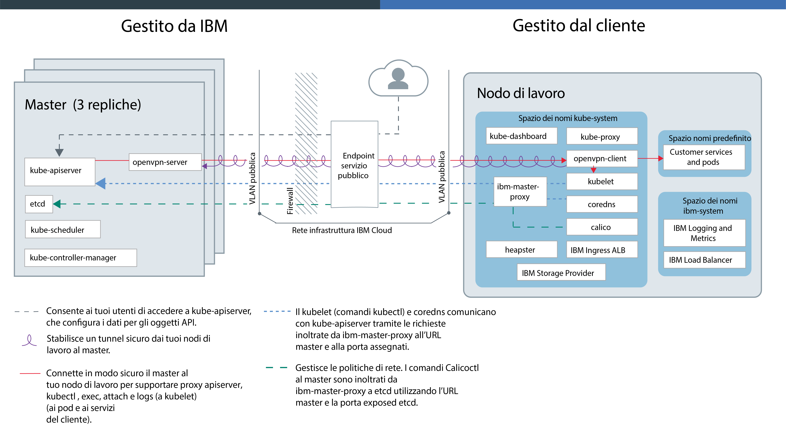
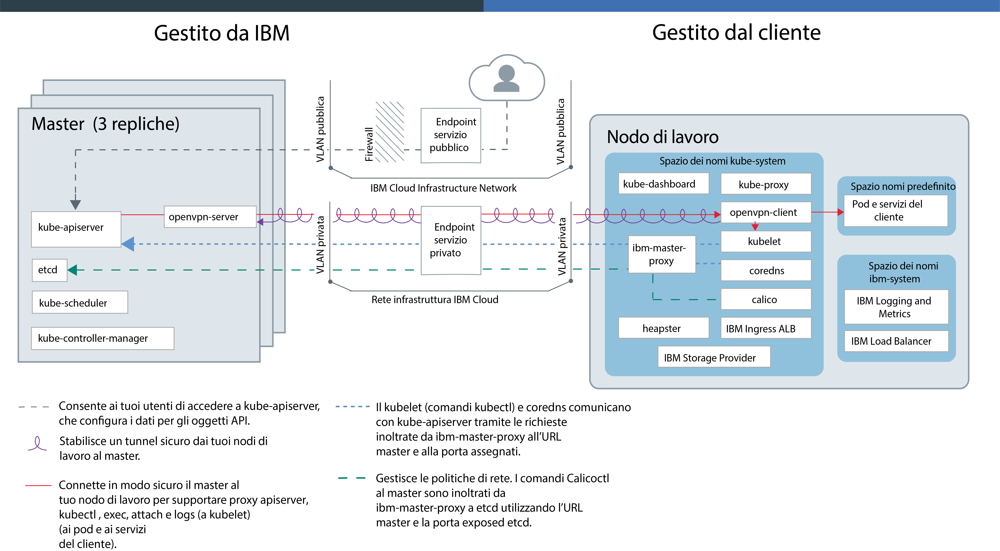

---

copyright:
  years: 2014, 2019
lastupdated: "2019-06-12"

keywords: kubernetes, iks, docker

subcollection: containers

---

{:new_window: target="_blank"}
{:shortdesc: .shortdesc}
{:screen: .screen}
{:pre: .pre}
{:table: .aria-labeledby="caption"}
{:codeblock: .codeblock}
{:tip: .tip}
{:note: .note}
{:important: .important}
{:deprecated: .deprecated}
{:download: .download}
{:preview: .preview}

# Tecnologia {{site.data.keyword.containerlong_notm}}

Scopri di più sulla tecnologia che sta dietro {{site.data.keyword.containerlong}}.
{:shortdesc}

## Contenitori Docker
{: #docker_containers}

Sviluppato sulla tecnologia dei contenitori Linux (LXC) esistente, il progetto open source denominato Docker ha definito del template relativi a come assemblare software in unità standardizzate, denominate contenitori, che includono tutti gli elementi che occorrono a un'applicazione per l'esecuzione {{site.data.keyword.containerlong_notm}} utilizza `containerd` come il runtime del contenitore per distribuire i contenitori da immagini del contenitore Docker nel tuo cluster.
{:shortdesc}

Ulteriori informazioni sui concetti Docker di base:

<dl>
<dt>Immagine</dt>
<dd>Un'immagine del contenitore è la base per ogni contenitore che vuoi eseguire. Le immagini contenitore vengono sviluppate da un Dockerfile, un file di testo che definisce come creare l'immagine e quali risorse di build includere in essa, come ad esempio l'applicazione, la configurazione dell'applicazione e le relative dipendenze. Le immagini vengono sempre create da altre immagini, rendendole veloci da configurare. Lascia che qualcun altro faccia il grosso del lavoro su un'immagine e perfezionala prima di utilizzarla.</dd>
<dt>Registro</dt>
<dd>Un registro delle immagini è un luogo dove si archiviano, richiamano e condividono immagini contenitore. Le immagini archiviate in un registro possono essere disponibili pubblicamente (registro pubblico)
o essere accessibili da un piccolo gruppo di utenti (registro privato). {{site.data.keyword.containerlong_notm}} offre immagini pubbliche, come ibmliberty, che puoi utilizzare per creare la tua prima applicazione caricata in un contenitore. Quando si tratta di applicazioni aziendali, utilizza un registro privato come quello fornito in {{site.data.keyword.Bluemix_notm}} per proteggere le tue immagini da utilizzi da parte di utenti non autorizzati.
</dd>
<dt>Contenitore</dt>
<dd>Ogni contenitore viene creato da un'immagine. Un contenitore è un'applicazione in pacchetto con tutte le sue dipendenze in modo che l'applicazione possa essere spostata tra gli ambienti ed eseguita senza modifiche. A differenza delle macchine virtuali, i contenitori non virtualizzano un dispositivo, il suo sistema operativo e l'hardware sottostante. Nel contenitore sono impacchettati solo il codice dell'applicazione, il runtime, gli strumenti di sistema, le librerie e le impostazioni. I contenitori sono eseguiti come processi isolati su host di calcolo Ubuntu e condividono il sistema operativo host e le sue risorse hardware. Questo approccio rende un contenitore più leggero, portatile ed efficiente di una macchina virtuale.</dd>
</dl>

### Vantaggi chiave dell'utilizzo di contenitori
{: #container_benefits}

<dl>
<dt>I contenitori sono elementi agile</dt>
<dd>I contenitori semplificano la gestione del sistema, fornendo
ambienti standardizzati alle distribuzioni di sviluppo e produzione. Il runtime leggero consente un ridimensionamento rapido delle distribuzioni. Rimuovi la complessità della gestione di piattaforme di sistemi operativi differenti e le relative infrastrutture sottostanti utilizzando i contenitori che ti aiutano a distribuire ed eseguire una qualsiasi applicazione su qualsiasi infrastruttura in modo rapido e affidabile.</dd>
<dt>I contenitori sono piccoli</dt>
<dd>Puoi sistemare molti contenitori nella stessa quantità di spazio richiesta da una singola macchina virtuale.</dd>
<dt>I contenitori sono portatili</dt>
<dd>
<ul>
  <li>Riutilizza le parti delle immagini per creare i contenitori. </li>
  <li>Sposta velocemente il codice dell'applicazione dall'ambiente in fase di preparazione a quello di produzione.</li>
  <li>Automatizza i tuoi processi con gli strumenti di fornitura continua.</li>
  </ul>
  </dd>

Ulteriori informazioni sulla [protezione delle tue informazioni personali](/docs/containers?topic=containers-security#pi) quando utilizzi le immagini del contenitore.

Pronto per approfondire le informazioni su Docker? <a href="https://developer.ibm.com/courses/all/docker-essentials-a-developer-introduction/" target="_blank">Impara come Docker e {{site.data.keyword.containerlong_notm}} funzionano insieme completando questo corso.</a>

</dl>

 

## Cluster Kubernetes
{: #kubernetes_basics}

Il progetto open source denominato Kubernetes combina l'esecuzione di un'infrastruttura inserita in un contenitore con carichi di lavoro di produzione, contributi open source e strumenti di gestione dei contenitori Docker. L'infrastruttura Kubernetes fornisce una piattaforma applicativa isolata e sicura per la gestione dei contenitori che è portatile, estensibile e con riparazione automatica in caso di failover.
{:shortdesc}

Ulteriori informazioni su alcuni concetti Kubernetes di base sono mostrate nel seguente diagramma.

<dl>
<dt>Account</dt>
<dd>L'account fa riferimento al tuo account {{site.data.keyword.Bluemix_notm}}.</dd>

<dt>Cluster</dt>
<dd>Un cluster Kubernetes è formato da uno o più host di calcolo denominati
nodi di lavoro. I nodi di lavoro sono gestiti da un master Kubernetes che controlla e monitora in modo centralizzato tutte le risorse Kubernetes
nel cluster. Per cui quando distribuisci le risorse di un'applicazione inserita in un contenitore, il master Kubernetes decide a quale nodo di lavoro distribuire quelle risorse,
tenendo conto dei requisiti di distribuzione e della capacità disponibile nel cluster. Le risorse Kubernetes includono i servizi, le distribuzioni e i pod.</dd>

<dt>Servizio</dt>
<dd>Un servizio è una risorsa Kubernetes che raggruppa un insieme di pod e fornisce connettività di rete a questi pod senza esporre indirizzo IP privato effettivo di ciascun pod. Puoi utilizzare un servizio per rendere la tua applicazione disponibile nel tuo cluster o pubblicamente su Internet.
</dd>

<dt>Distribuzione</dt>
<dd>Una distribuzione è una risorsa Kubernetes in cui puoi specificare le informazioni sulle altre risorse o sulle funzionalità necessarie per eseguire la tua applicazione,
come i servizi, l'archiviazione persistente o le annotazioni. Dovrai documentare una distribuzione in un file YAML di configurazione e quindi applicarla al cluster. Il master Kubernetes configura le risorse e distribuisce i contenitori nei pod su nodi di lavoro con capacità disponibile.
  
Definisci le strategie di aggiornamento per la tua applicazione, incluso il numero di pod che vuoi aggiungere durante un aggiornamento continuo e il numero di pod che può non essere disponibile contemporaneamente. Quando esegui un aggiornamento continuo, la distribuzione controlla se l'aggiornamento funziona e interrompe il rollout quando vengono rilevati errori.</dd>

<dt>Pod</dt>
<dd>Ogni applicazione inserita in un contenitore che viene distribuita in un cluster viene distribuita, eseguita e gestita da una risorsa Kubernetes denominata pod. I pod rappresentano piccole unità distribuibili in un cluster Kubernetes e vengono utilizzati per raggruppare i contenitori che devono essere trattati come una singola unità. Nella maggior parte dei casi, ogni contenitore viene distribuito nel suo pod. Tuttavia, un'applicazione potrebbe richiedere un contenitore e altri contenitori helper per essere distribuita
in un pod, in modo che tali contenitori possano essere indirizzati utilizzando lo stesso indirizzo IP privato.</dd>

<dt>Applicazione</dt>
<dd>Un'applicazione può far riferimento a un'applicazione completa o a un componente di un'applicazione. Potresti distribuire i componenti di un'applicazione in pod o nodi di lavoro separati.</dd>

Ulteriori informazioni sulla [protezione delle tue informazioni personali](/docs/containers?topic=containers-security#pi) quando utilizzi le risorse Kubernetes.

Pronto per approfondire le informazioni su Kubernetes?

<ul><li><a href="/docs/containers?topic=containers-cs_cluster_tutorial#cs_cluster_tutorial" target="_blank">Amplia la tua conoscenza della terminologia con l'esercitazione Creazione dei cluster</a>.</li>
<li><a href="https://developer.ibm.com/courses/all/container-kubernetes-essentials-with-ibm-cloud/" target="_blank">Impara come Kubernetes e {{site.data.keyword.containerlong_notm}} funzionano insieme completando questo corso.</a></li></ul>

</dl>

 

## Architettura del servizio
{: #architecture}

In un cluster Kubernetes eseguito su {{site.data.keyword.containerlong_notm}}, le tue applicazioni inserite in un contenitore sono ospitate su host di calcolo denominati nodi di lavoro. Per essere più specifici, le applicazioni vengono eseguite nei pod e i pod sono ospitati sui nodi di lavoro. I nodi di lavoro sono gestiti dal master Kubernetes. La configurazione delle comunicazioni tra il master Kubernetes e i nodi di lavoro dipende da come configuri la tua infrastruttura IBM Cloud (SoftLayer): un account con un endpoint del servizio pubblico o un account abilitato a VRF con endpoint del servizio pubblico e di servizio privato.
{: shortdesc}

La seguente immagine mostra i componenti del tuo cluster e come interagiscono in un account quando è [abilitato un endpoint del servizio pubblico](/docs/containers?topic=containers-plan_clusters#workeruser-master) solamente.

<figure>
 
 <figcaption>Architettura di {{site.data.keyword.containerlong_notm}} quando è abilitato solo l'endpoint del servizio pubblico</figcaption> </figure>

La seguente immagine mostra i componenti del tuo cluster e come interagiscono in un account abilitato a VRF quando [sono abilitati gli endpoint del servizio pubblico e di servizio privato](/docs/containers?topic=containers-plan_clusters#workeruser-master).

<figure>
 
 <figcaption>Architettura di {{site.data.keyword.containerlong_notm}} quando sono abilitati gli endpoint del servizio pubblico e di servizio privato</figcaption> </figure>

Qual è la differenza tra il master Kubernetes e un nodo di lavoro? Grazie di averlo chiesto.

<dl>
  <dt>Master Kubernetes</dt>
    <dd>Il master Kubernetes ha il compito di gestire tutte le risorse di calcolo, rete e archiviazione nel cluster. Il master Kubernetes garantisce che le applicazioni inserite in un contenitore e i servizi siano distribuiti equamente nei nodi di lavoro nel cluster. A seconda di come configuri la tua applicazione e i tuoi servizi, il master determina il nodo di lavoro che dispone di risorse sufficienti per soddisfare i requisiti dell'applicazione.  La seguente tabella descrive i componenti del master Kubernetes.
    <table>
    <caption>Componenti del master Kubernetes</caption>
    <thead>
    <th>Componente master</th>
    <th>Descrizione</th>
    </thead>
    <tbody>
    <tr>
    <td>kube-apiserver</td>
    <td>Il server API Kubernetes funge da punto di ingresso principale per tutte le richieste di gestione del cluster dal nodo di lavoro al master Kubernetes. Il server API Kubernetes convalida e elabora le richieste che modificano lo stato delle risorse Kubernetes, come i pod o i servizi, e archivia questo stato in etcd.</td>
    </tr>
    <tr>
    <td>openvpn-server</td>
    <td>Il server OpenVPN funziona con il client OpenVPN per connettere in modo protetto il master al nodo di lavoro. Questa connessione supporta le chiamate `apiserver proxy` ai tuoi pod e servizi e le chiamate `kubectl exec`, `attach` e `logs` a kubelet.</td>
    </tr>
    <tr>
    <td>etcd</td>
    <td>etcd è un archivio di valori chiave altamente disponibile che archivia lo stato di tutte le risorse Kubernetes di un cluster, quali servizi, distribuzioni e pod. I dati in etcd sono sottoposti a backup su un'istanza di archiviazione crittografata gestita da IBM.</td>
    </tr>
    <tr>
    <td>kube-scheduler</td>
    <td>Il programma di pianificazione (scheduler) Kubernetes controlla se sono presenti dei pod di nuova creazione e decide dove distribuirli in base a capacità, esigenze di prestazioni, vincoli delle politiche, specifiche di anti-affinità e requisiti di carico di lavoro. Se non è possibile trovare alcun nodo di lavoro che corrisponda ai requisiti, il pod non viene distribuito nel cluster.</td>
    </tr>
    <tr>
    <td>kube-controller-manager</td>
    <td>Il gestore controller Kubernetes è un daemon che controlla lo stato delle risorse del cluster, quali le serie di repliche. Quando lo stato di una risorsa viene modificato, ad esempio se si verifica un'interruzione di un pod in una serie di repliche, il gestore controller avvia le azioni correttive per raggiungere lo stato richiesto.</td>
    </tr>
    </tbody></table></dd>
  <dt>Nodo di lavoro</dt>
    <dd>Ogni nodo di lavoro è una macchina fisica (bare metal) o una macchina virtuale che viene eseguita su hardware fisico nell'ambiente cloud. Quando esegui il provisioning di un nodo di lavoro, determini le risorse disponibili per i contenitori ospitati su quel nodo di lavoro. Per impostazione predefinita, i tuoi nodi di lavoro sono configurati con un motore Docker gestito da {{site.data.keyword.IBM_notm}}, risorse di calcolo separate, collegamento di rete e un servizio di volume. Le funzioni di sicurezza integrate forniscono isolamento, funzionalità di gestione delle risorse e conformità di sicurezza dei nodi di lavoro.  
La modifica dei componenti di nodo di lavoro predefiniti come ad esempio `kubelet` non è supportata e potrebbe causare dei risultati imprevisti.
La seguente tabella descrive i componenti di un nodo di lavoro.
    <table>
    <caption>Componenti dei nodi di lavoro</caption>
    <thead>
    <th>Componente del nodo di lavoro</th>
    <th>Spazio dei nomi</th>
    <th>Descrizione</th>
    </thead>
    <tbody>
    <tr>
    <td>`ibm-master-proxy`</td>
    <td>kube-system</td>
    <td>L'`ibm-master-proxy` inoltra le richieste dal nodo di lavoro agli indirizzi IP delle repliche master altamente disponibili. Nei cluster a zona singola, il master ha tre repliche su host separati con un indirizzo IP e un nome di dominio del master. Per i cluster che si trovano in una zona che supporta il multizona, il master ha tre repliche che vengono estese tra le zone. In quanto tale, ogni master ha il proprio indirizzo IP registrato con DNS, con un nome di dominio per l'intero master del cluster.</td>
    </tr>
    <tr>
    <td>`openvpn-client`</td>
    <td>kube-system</td>
    <td>Il client OpenVPN funziona con il server OpenVPN per connettere in modo protetto il master al nodo di lavoro. Questa connessione supporta le chiamate `apiserver proxy` ai tuoi pod e servizi e le chiamate `kubectl exec`, `attach` e `logs` a kubelet.</td>
    </tr>
    <tr>
    <td>`kubelet`</td>
    <td>kube-system</td>
    <td>Il kubelet è un pod che viene eseguito su ogni nodo di lavoro ed è responsabile del monitoraggio dell'integrità dei pod in esecuzione sul nodo di lavoro e del controllo degli eventi inviati dal server API Kubernetes. In base agli eventi, il kubelet crea o rimuove i pod, garantisce i probe di attività e disponibilità e segnala in risposta lo stato dei pod al server API Kubernetes.</td>
    </tr>
    <tr>
    <td>`coredns`</td>
    <td>kube-system</td>
    <td>Per impostazione predefinita, Kubernetes pianifica un pod CoreDNS (o un pod KubeDNS nella versione 1.12 e precedenti) e il servizio sul cluster. I contenitori utilizzano automaticamente l'IP del servizio DNS per risolvere i nomi DNS nelle loro ricerche di altri pod e servizi.</td>
    </tr>
    <tr>
    <td>`calico`</td>
    <td>kube-system</td>
    <td>Calico gestisce le politiche di rete per il tuo cluster e comprende alcuni componenti come i seguenti.
    <ul>
    <li>**`calico-cni`**: la CNI (container network interface) Calico gestisce la connettività di rete dei contenitori e rimuove le risorse assegnate quando un contenitore viene eliminato.</li>
    <li>**`calico-ipam`**: l'IPAM Calico gestisce l'assegnazione degli indirizzi IP per i contenitori.</li>
    <li>**`calico-node`**: il nodo Calico è un contenitore che riunisce i vari componenti necessari per i contenitori di rete con Calico.</li>
    <li>**`calico-policy-controller`**: il controller politiche Calico controlla il traffico di rete in entrata e in uscita per la conformità alle politiche di rete impostate. Se il traffico non è consentito nel cluster, l'accesso al cluster viene bloccato. Il controller politiche Calico viene inoltre utilizzato per creare e impostare le politiche di rete per un cluster.</li></ul></td>
    </tr>
    <tr>
    <td>`kube-proxy`</td>
    <td>kube-system</td>
    <td>Il proxy di rete Kubernetes è un daemon che viene eseguito su ogni nodo di lavoro e che inoltra o che bilancia il carico del traffico di rete TCP e UDP per i servizi eseguiti nel cluster.</td>
    </tr>
    <tr>
    <td>`kube-dashboard`</td>
    <td>kube-system</td>
    <td>Il dashboard Kubernetes è una GUI basata sul web che consente agli utenti di gestire e risolvere i problemi relativi al cluster e alle applicazioni in esecuzione nel cluster.</td>
    </tr>
    <tr>
    <td>`heapster`</td>
    <td>kube-system</td>
    <td>Heapster è un aggregatore a livello di cluster di dati di monitoraggio e di evento. Il pod Heapster rileva tutti i nodi nel cluster e interroga le informazioni sull'utilizzo dal kubelet di ciascun nodo. Puoi trovare i grafici di utilizzo nel dashboard Kubernetes.</td>
    </tr>
    <tr>
    <td>ALB Ingress</td>
    <td>kube-system</td>
    <td>Ingress è un servizio Kubernetes che puoi utilizzare per bilanciare i carichi di lavoro del traffico di rete nel tuo cluster inoltrando le richieste pubbliche o private a più applicazioni nel tuo cluster. Per esporre le tue applicazioni sulla rete pubblica o privata, devi creare una risorsa Ingress per registrare le tue applicazioni con il programma di bilanciamento del carico (ALB - application load balancer) Ingress. È quindi possibile accedere a più applicazioni utilizzando un singolo URL o indirizzo IP.</td>
    </tr>
    <tr>
    <td>Provider di archiviazione</td>
    <td>kube-system</td>
    <td>Ogni cluster è configurato con un plugin per eseguire il provisioning dell'archiviazione file. Puoi scegliere di installare altri componenti aggiuntivi, come ad esempio l'archiviazione blocchi.</td>
    </tr>
    <tr>
    <td>Registrazione e metriche</td>
    <td>ibm-system</td>
    <td>Puoi utilizzare i servizi {{site.data.keyword.loganalysislong_notm}} e {{site.data.keyword.monitoringlong_notm}} integrati per espandere le tue funzionalità di raccolta e conservazione quando lavori con log e metriche.</td>
    </tr>
    <tr>
    <td>Programma di bilanciamento del carico</td>
    <td>ibm-system</td>
    <td>Un programma di bilanciamento del carico è un servizio Kubernetes che può essere utilizzato per bilanciare i carichi di lavoro del traffico di rete nel tuo cluster inoltrando richieste pubbliche o private a un'applicazione.</td>
    </tr>
    <tr>
    <td>Servizi e pod dell'applicazione</td>
    <td>default</td>
    <td>Nello spazio dei nomi <code>default</code> o negli spazi dei nomi che crei, puoi distribuire le applicazioni in pod e servizi per comunicare con tali pod.</td>
    </tr>
    </tbody></table></dd>
</dl>

Vuoi vedere in che modo {{site.data.keyword.containerlong_notm}} può essere utilizzato con altri prodotti e servizi? Controlla alcune delle [integrazioni](/docs/containers?topic=containers-supported_integrations#supported_integrations).
{: tip}

## Limitazioni del servizio
{: #tech_limits}

{{site.data.keyword.containerlong_notm}} e il progetto open source Kubernetes sono forniti con le limitazioni e con le impostazioni di servizio predefinite per garantire la sicurezza, la convenienza e la funzionalità di base. Potresti essere in grado di modificare alcune delle limitazioni, laddove indicato. Se prevedi di raggiungere le seguenti limitazioni {{site.data.keyword.containerlong_notm}}, contatta il team IBM nello [Slack interno ](https://ibm-argonauts.slack.com/messages/C4S4NUCB1) o [esterno ](https://ibm-container-service.slack.com).
{: shortdesc}

<table summary="Questa tabella contiene informazioni sulle limitazioni di {{site.data.keyword.containerlong_notm}}. Le colonne si leggono da sinistra a destra. La prima colonna contiene il tipo di limitazione e la seconda colonna contiene la descrizione della limitazione.">
<caption>Limitazioni di {{site.data.keyword.containerlong_notm}}</caption>
<thead>
  <tr>
    <th>Tipo</th>
    <th>Descrizione</th>
  </tr>
</thead>
<tbody>
  <tr>
    <td>Limiti di velocità API</td>
    <td>100 richieste per ogni 10 secondi all'API {{site.data.keyword.containerlong_notm}} per ogni indirizzo IP di origine univoco.</td>
  </tr>
  <tr>
    <td>Capacità del nodo di lavoro</td>
    <td>I nodi di lavoro sono disponibili in [specifiche caratteristiche](/docs/containers?topic=containers-planning_worker_nodes#shared_dedicated_node) di risorse di calcolo.</td>
  </tr>
  <tr>
    <td>Accesso host dei nodi di lavoro</td>
    <td>Per sicurezza, non puoi eseguire l'SSH nell'host di calcolo dei nodi di lavoro.</td>
  </tr>
  <tr>
    <td>Numero massimo di nodi di lavoro</td>
    <td> Se intendi superare quota 900 per ogni cluster, contatta prima il team IBM nello [Slack interno ](https://ibm-argonauts.slack.com/messages/C4S4NUCB1) o [esterno ](https://ibm-container-service.slack.com).  Se vedi un limite della capacità dell'infrastruttura IBM Cloud (SoftLayer) sul numero di istanze per ogni data center o che viene ordinato ogni mese, contatta il tuo rappresentante dell'infrastruttura IBM Cloud (SoftLayer).</td>
  </tr>
  <tr>
    <td>Numero massimo di pod</td>
    <td>110 per ogni nodo di lavoro.  Il numero di pod include i pod `kube-system` e `ibm-system` che vengono eseguiti sul nodo di lavoro. Per prestazioni migliorate, considera la limitazione del numero di pod che esegui per ogni core di calcolo in modo da non utilizzare in modo eccessivo il nodo di lavoro. Ad esempio, su un nodo di lavoro con una caratteristica `b3c.4x16` potresti eseguire 10 pod per ogni core che utilizzano non più del 75% della capacità totale del nodo di lavoro.</td>
  </tr>
  <tr>
    <td>Numero massimo di servizi Kubernetes</td>
    <td>65.000 IP per ogni cluster nell'intervallo 172.21.0.0/16 che puoi assegnare ai servizi Kubernetes all'interno del cluster.</td>
  </tr>
  <tr>
    <td>Traffico ALB (application load balancer) in entrata</td>
    <td>32.768 connessioni al secondo.  Se il tuo traffico in entrata supera questo numero, [amplia il numero di repliche ALB](/docs/containers?topic=containers-ingress#scale_albs) nel tuo cluster per gestire il carico di lavoro aumentato.</td>
  </tr>
  <tr>
    <td>Volumi di archiviazione</td>
    <td>Un totale combinato pari a 250 volumi delle istanze di archiviazione file e blocchi dell'infrastruttura IBM Cloud (SoftLayer) per ogni account.  Se monti una quantità superiore a questa indicata, potresti vedere un messaggio di "capacità esaurita" quando esegui il provisioning di volumi persistenti e devi contattare il tuo rappresentante dell'infrastruttura IBM Cloud (SoftLayer). Per ulteriori domande frequenti (FAQ), vedi la documentazione relativa all'archiviazione [file](/docs/infrastructure/FileStorage?topic=FileStorage-file-storage-faqs#how-many-volumes-can-i-provision-) e [blocchi](/docs/infrastructure/BlockStorage?topic=BlockStorage-block-storage-faqs#how-many-instances-can-share-the-use-of-a-block-storage-volume-).</td>
  </tr>
</tbody>
</table>
