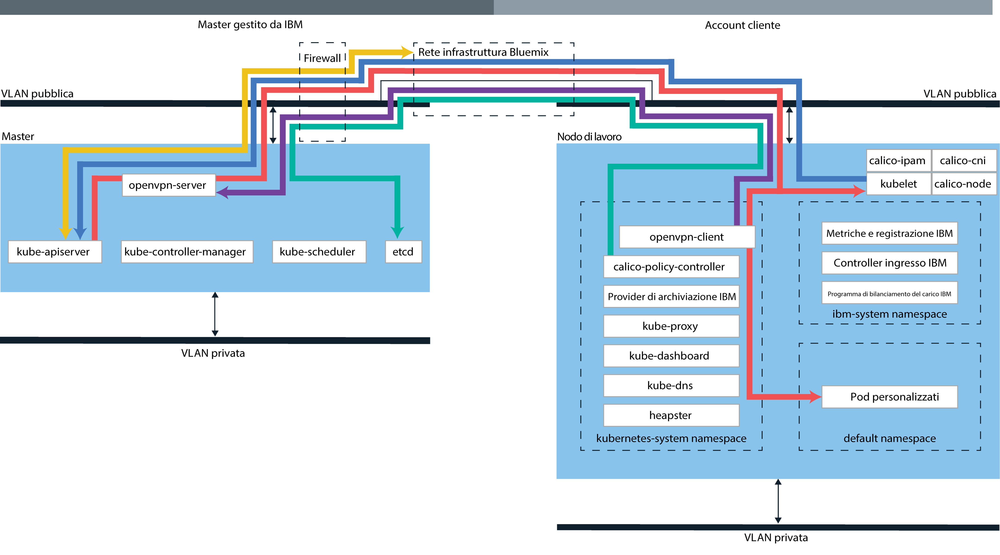

---

copyright:
  years: 2014, 2018
lastupdated: "2018-4-20"

---

{:new_window: target="_blank"}
{:shortdesc: .shortdesc}
{:screen: .screen}
{:pre: .pre}
{:table: .aria-labeledby="caption"}
{:codeblock: .codeblock}
{:tip: .tip}
{:download: .download}

# Tecnologia {{site.data.keyword.containerlong_notm}}

Scopri di più sulla tecnologia che sta dietro {{site.data.keyword.containerlong}}.
{:shortdesc}

## Contenitori Docker
{: #docker_containers}

Basato sulla tecnologia dei contenitori Linux esistente (LXC), il progetto open source denominato Docker è diventato una piattaforma software per la creazione, il test, la distribuzione e il ridimensionamento rapido delle applicazioni. Docker impacchetta il software in unità standardizzate, chiamate contenitori, che includono tutti gli elementi necessari per l'esecuzione di un'applicazione.
{:shortdesc}

Ulteriori informazioni sui concetti Docker di base:

<dl>
<dt>Immagine</dt>
<dd>Un'immagine Docker viene creata da un Dockerfile, un file di testo che definisce come creare l'immagine e in quali risorse di build includerla, come ad esempio l'applicazione, la configurazione dell'applicazione e le relative dipendenze. Le immagini vengono sempre create da altre immagini, rendendole veloci da configurare. Lascia che qualcun altro faccia il grosso del lavoro su un'immagine e perfezionala prima di utilizzarla.</dd>
<dt>Registro</dt>
<dd>Un registro delle immagini è un luogo dove si archiviano, richiamano e condividono immagini Docker. Le immagini archiviate in un registro possono essere disponibili pubblicamente (registro pubblico)
o essere accessibili da un piccolo gruppo di utenti (registro privato). {{site.data.keyword.containershort_notm}} offre immagini pubbliche, come ibmliberty, che puoi utilizzare per creare la tua prima applicazione caricata in un contenitore. Quando si tratta di applicazioni aziendali, utilizza un registro privato come quello fornito in {{site.data.keyword.Bluemix_notm}} per proteggere le tue immagini da utilizzi da parte di utenti non autorizzati.
</dd>
<dt>Contenitore</dt>
<dd>Ogni contenitore viene creato da un'immagine. Un contenitore è un'applicazione in pacchetto con tutte le sue dipendenze in modo che l'applicazione possa essere spostata tra gli ambienti ed eseguita senza modifiche. A differenza delle macchine virtuali, i contenitori non virtualizzano un dispositivo, il suo sistema operativo e l'hardware sottostante. Nel contenitore sono impacchettati solo il codice dell'applicazione, il runtime, gli strumenti di sistema, le librerie e le impostazioni. I contenitori sono eseguiti come processi isolati su host di calcolo Ubuntu e condividono il sistema operativo host e le sue risorse hardware. Questo approccio rende un contenitore più leggero, portatile ed efficiente di una macchina virtuale.</dd>
</dl>

### Vantaggi chiave dell'utilizzo di contenitori
{: #container_benefits}

<dl>
<dt>I contenitori sono elementi agile</dt>
<dd>I contenitori semplificano la gestione del sistema, fornendo
ambienti standardizzati alle distribuzioni di sviluppo e produzione. Il runtime leggero consente un ridimensionamento rapido delle distribuzioni. Rimuovi la complessità della gestione di piattaforme di sistemi operativi differenti e le relative infrastrutture sottostanti utilizzando i contenitori che ti aiutano a distribuire ed eseguire una qualsiasi applicazione su qualsiasi infrastruttura in modo rapido e affidabile.</dd>
<dt>I contenitori sono piccoli</dt>
<dd>Puoi sistemare molti contenitori nella stessa quantità di spazio richiesta da una singola macchina virtuale.</dd>
<dt>I contenitori sono portabili</dt>
<dd>
<ul>
  <li>Riutilizza le parti delle immagini per creare i contenitori. </li>
  <li>Sposta velocemente il codice dell'applicazione dall'ambiente in fase di preparazione a quello di produzione.</li>
  <li>Automatizza i tuoi processi con gli strumenti di fornitura continua.</li>
  </ul>
  </dd>

  

Pronto per approfondire le informazioni su Docker? <a href="https://developer.ibm.com/courses/all/docker-essentials-extend-your-apps-with-containers/" target="_blank">Impara come Docker e {{site.data.keyword.containershort_notm}} funzionano insieme completando questo corso.</a>

</dl>

 

## Cluster Kubernetes
{: #kubernetes_basics}

Il progetto open source denominato Kubernetes combina l'esecuzione di un'infrastruttura inserita in un contenitore con carichi di lavoro di produzione, contributi open source e strumenti di gestione dei contenitori Docker. L'infrastruttura Kubernetes fornisce una piattaforma applicativa isolata e sicura per la gestione dei contenitori che è portatile, estensibile e con riparazione automatica in caso di failover.
{:shortdesc}

Ulteriori informazioni su alcuni concetti Kubernetes di base sono mostrate nel seguente diagramma.

<dl>
<dt>Account</dt>
<dd>L'account fa riferimento al tuo account {{site.data.keyword.Bluemix_notm}}.</dd>

<dt>Cluster</dt>
<dd>Un cluster Kubernetes è formato da uno o più host di calcolo denominati
nodi di lavoro. I nodi di lavoro sono gestiti da un master Kubernetes che controlla e monitora in modo centralizzato tutte le risorse Kubernetes
nel cluster. Per cui quando distribuisci le risorse di un'applicazione inserita in un contenitore, il master Kubernetes decide a quale nodo di lavoro distribuire quelle risorse,
tenendo conto dei requisiti di distribuzione e della capacità disponibile nel cluster. Le risorse Kubernetes includono i servizi, le distribuzioni e i pod.</dd>

<dt>Servizio</dt>
<dd>Un servizio è una risorsa Kubernetes che raggruppa un insieme di pod e fornisce connettività di rete a questi pod senza esporre indirizzo IP privato effettivo di ciascun pod. Puoi utilizzare un servizio per rendere la tua applicazione disponibile nel tuo cluster o pubblicamente su Internet.
</dd>

<dt>Distribuzione</dt>
<dd>Una distribuzione è una risorsa Kubernetes in cui puoi specificare le informazioni sulle altre risorse o sulle funzionalità necessarie per eseguire la tua applicazione,
come i servizi, l'archiviazione persistente o le annotazioni. Dovrai documentare una distribuzione in un file YAML di configurazione e quindi applicarla al cluster. Il master Kubernetes configura le risorse e distribuisce i contenitori nei pod su nodi di lavoro con capacità disponibile.
  
Definisci le strategie di aggiornamento per la tua applicazione, incluso il numero di pod che vuoi aggiungere durante un aggiornamento continuo e il numero di pod che possono non essere disponibili contemporaneamente. Quando esegui un aggiornamento continuo, la distribuzione controlla se l'aggiornamento funziona e interrompe il rollout quando vengono rilevati errori.</dd>

<dt>Pod</dt>
<dd>Ogni applicazione inserita in un contenitore che viene distribuita in un cluster viene distribuita, eseguita e gestita da una risorsa Kubernetes denominata pod. I pod rappresentano piccole unità distribuibili in un cluster Kubernetes e vengono utilizzati per raggruppare i contenitori che devono essere trattati come una singola unità. Nella maggior parte dei casi, ogni contenitore viene distribuito nel suo pod. Tuttavia, un'applicazione potrebbe richiedere un contenitore e altri contenitori helper per essere distribuita
in un pod, in modo che tali contenitori possano essere indirizzati utilizzando lo stesso indirizzo IP privato.</dd>

<dt>Applicazione</dt>
<dd>Un'applicazione può far riferimento a un'applicazione completa o a un componente di un'applicazione. Potresti distribuire i componenti di un'applicazione in pod o nodi di lavoro separati.</dd>

  

Pronto per approfondire le informazioni su Kubernetes? 

<ul><li><a href="cs_tutorials.html#cs_cluster_tutorial" target="_blank">Amplia la tua conoscenza della terminologia con l'esercitazione Creazione dei cluster</a>.</li>
<li><a href="https://developer.ibm.com/courses/all/get-started-kubernetes-ibm-cloud-container-service/" target="_blank">Impara come Kubernetes e {{site.data.keyword.containershort_notm}} funzionano insieme completando questo corso.</a></li></ul>

</dl>

 

## Architettura del servizio
{: #architecture}

In un cluster Kubernetes eseguito su {{site.data.keyword.containershort_notm}}, le tue applicazioni inserite in un contenitore sono ospitate su host di calcolo denominati nodi di lavoro. Per essere più specifici, le applicazioni vengono eseguite nei pod e i pod sono ospitati sui nodi di lavoro. I nodi di lavoro sono gestiti dal master Kubernetes. Il master Kubernetes e i nodi di lavoro comunicano tra loro tramite certificati TLS protetti e una connessione openVPN per orchestrare le configurazioni del tuo cluster.
{: shortdesc}

Qual è la differenza tra il master Kubernetes e un nodo di lavoro? Grazie di averlo chiesto.

<dl>
  <dt>Master Kubernetes</dt>
    <dd>Il master Kubernetes ha il compito di gestire tutte le risorse di calcolo, rete e archiviazione nel cluster. Il master Kubernetes garantisce che le applicazioni inserite in un contenitore e i servizi siano distribuiti equamente nei nodi di lavoro nel cluster. A seconda del modo in cui configuri l'applicazione e i servizi, il master determina il nodo di lavoro che dispone di risorse sufficienti per soddisfare i requisiti dell'applicazione.</dd>
  <dt>Nodo di lavoro</dt>
    <dd>Ogni nodo di lavoro è una macchina fisica (bare metal) o una macchina virtuale che viene eseguita su hardware fisico nell'ambiente cloud. Quando esegui il provisioning di un nodo di lavoro, determini le risorse disponibili per i contenitori ospitati su quel nodo di lavoro. Per impostazione predefinita, i tuoi nodi di lavoro sono configurati con un motore Docker gestito da {{site.data.keyword.IBM_notm}}, risorse di calcolo separate, collegamento di rete e un servizio di volume. Le funzioni di sicurezza integrate forniscono isolamento, funzionalità di gestione delle risorse e conformità di sicurezza dei nodi di lavoro.</dd>
</dl>

Figura. Architettura {{site.data.keyword.containershort_notm}}

Vuoi vedere in che modo {{site.data.keyword.containerlong_notm}} può essere utilizzato con altri prodotti e servizi? Controlla alcune delle [integrazioni](cs_integrations.html#integrations).

 

