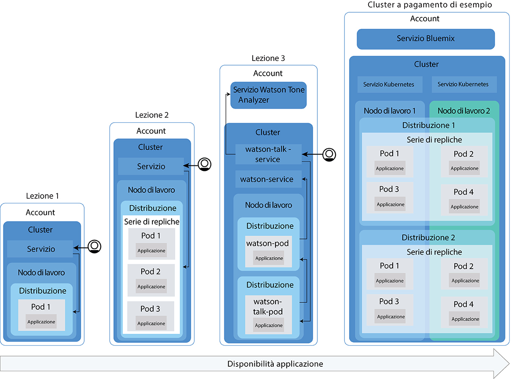
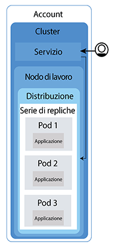
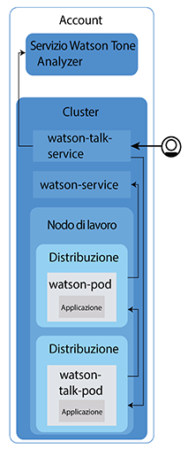

---

copyright:
  years: 2014, 2018
lastupdated: "2017-02-05"

---

{:new_window: target="_blank"}
{:shortdesc: .shortdesc}
{:screen: .screen}
{:pre: .pre}
{:table: .aria-labeledby="caption"}
{:codeblock: .codeblock}
{:tip: .tip}
{:download: .download}


# Esercitazione: distribuzione delle applicazioni nei cluster
{: #cs_apps_tutorial}

Puoi imparare ad utilizzare {{site.data.keyword.containershort_notm}} per distribuire un'applicazione
inserita nel contenitore che si avvale di {{site.data.keyword.watson}} {{site.data.keyword.toneanalyzershort}}.
{: shortdesc}

In questo scenario, una fittizia agenzia di PR
utilizza il servizio {{site.data.keyword.Bluemix_notm}} per analizzare i propri comunicati stampa e ricevere feedback sul tono dei propri messaggi.

Utilizzando il cluster Kubernetes creato nell'ultima esercitazione, lo sviluppatore dell'applicazione dell'agenzia di PR distribuisce una versione Hello World dell'applicazione. Completando ogni lezione in questa esercitazione, lo sviluppatore dell'applicazione distribuisce progressivamente versioni più complicate della stessa applicazione. Il seguente diagramma mostra i componenti di ogni distribuzione per lezione.



Come illustrato nel diagramma, Kubernetes utilizza diversi tipi di risorse per rendere operative le tue applicazioni nei cluster. In Kubernetes, le distribuzioni e i servizi lavorano insieme. Le distribuzioni includono le definizioni per
l'applicazione; ad esempio l'immagine da utilizzare per il contenitore e quale porta deve essere esposta per l'applicazione. Quando crei una distribuzione, viene creato un pod Kubernetes per ogni contenitore che definisci nella
distribuzione. Per una maggiore resilienza della tua applicazione, puoi definire più istanze della stessa applicazione
nella distribuzione e consentire a Kubernetes di creare automaticamente una serie di repliche. La serie di repliche
monitora i pod e assicura che il numero di pod desiderato sia sempre in esecuzione. Se uno dei
pod smette di rispondere, il pod viene ricreato automaticamente.

I servizi raggruppano una serie di pod e forniscono la connessione di rete a tali pod per gli altri servizi nel
cluster senza esporre il reale indirizzo IP privato di ogni pod. Puoi utilizzare i servizi Kubernetes
per rendere disponibile un'applicazione agli altri pod all'interno del cluster o per esporre un'applicazione
a Internet. In questa esercitazione, utilizzerai un servizio Kubernetes per accedere alla tua applicazione in esecuzione
da Internet utilizzando un indirizzo IP pubblico, che viene assegnato automaticamente a un nodo di lavoro, e una porta
pubblica.

Per rendere la tua applicazione ancora più disponibile, nei cluster standard, puoi creare più nodi di lavoro
per eseguire ancora più repliche della tua applicazione. Questa attività non è trattata in questa esercitazione, ma tieni
a mente questo concetto per futuri miglioramenti alla disponibilità di un'applicazione.

Solo una delle lezioni include l'integrazione di un servizio {{site.data.keyword.Bluemix_notm}} in un'applicazione, ma puoi utilizzarle con un'applicazione tanto semplice come complessa.

## Obiettivi

* Comprendere la terminologia Kubernetes di base
* Eseguire il push di un'immagine al tuo spazio dei nomi del registro in {{site.data.keyword.registryshort_notm}}
* Rendere pubblicamente accessibile un'applicazione
* Distribuire una singola istanza di un'applicazione in un cluster utilizzando un comando Kubernetes e uno script
* Distribuire più istanze di un'applicazione in contenitori che vengono ricreati durante i controlli di integrità
* Distribuire un'applicazione che utilizza funzionalità da un servizio {{site.data.keyword.Bluemix_notm}}

## Tempo richiesto

40 minuti

## Destinatari

Sviluppatori software e amministratori di rete che non hanno mai distribuito un'applicazione in un cluster
Kubernetes.

## Prerequisiti

* [Esercitazione: Creazione dei cluster Kubernetes in {{site.data.keyword.containershort_notm}}](cs_tutorials.html#cs_cluster_tutorial).

## Lezione 1: distribuzione di singole applicazioni dell'istanza ai cluster Kubernetes
{: #cs_apps_tutorial_lesson1}

Nell'esercitazione precedente, hai creato un cluster con un nodo di lavoro. In questa lezione, configura una distribuzione e distribuisci una sola istanza dell'applicazione in un pod Kubernetes nel nodo di lavoro. Il seguente diagramma include i componenti che distribuisci completando questa lezione.
{:shortdesc}


Per distribuire l'applicazione: 

1.  Clona il codice di origine per l'[applicazione Hello world ](https://github.com/IBM/container-service-getting-started-wt) nella tua directory home utente. Il repository contiene diverse versioni di un'applicazione simile nelle cartelle, ognuna delle quali inizia con `Lab`. Ogni versione contiene i seguenti file:
    * `Dockerfile`: le definizioni di build dell'immagine.
    * `app.js`: l'applicazione Hello world.
    * `package.json`: i metadati dell'applicazione.

    ```
    git clone https://github.com/IBM/container-service-getting-started-wt.git
    ```
    {: pre}

2.  Passa alla directory `Lab 1`.

    ```
    cd 'container-service-getting-started-wt/Lab 1'
    ```
    {: pre}

3. Accedi alla CLI {{site.data.keyword.Bluemix_notm}}. Immetti le tue credenziali
{{site.data.keyword.Bluemix_notm}} quando richiesto. Per specificare una regione {{site.data.keyword.Bluemix_notm}}, [includi l'endpoint API](cs_regions.html#bluemix_regions).
  ```
  bx login [--sso]
  ```
  {: pre}

  **Nota**: se il comando di accesso ha esito negativo, potresti avere un ID federato. Tenta aggiungendo l'indicatore `--sso` al comando. Utilizza l'URL fornito nell'output della CLI per richiamare la passcode monouso. 

4. Configura il contesto del cluster nella tua CLI.
    1. Richiama il comando per impostare la variabile di ambiente e scaricare i file di configurazione Kubernetes.

        ```
        bx cs cluster-config <pr_firm_cluster>
        ```
        {: pre}

        Quando il download dei file di configurazione è terminato, viene visualizzato un comando che puoi utilizzare per impostare il percorso al file di configurazione di Kubernetes locale come una variabile di ambiente.
    2.  Copia e incolla l'output per impostare la variabile di ambiente `KUBECONFIG`.

        Esempio per OS X:

        ```
        export KUBECONFIG=/Users/<user_name>/.bluemix/plugins/container-service/clusters/<pr_firm_cluster>/kube-config-prod-dal10-pr_firm_cluster.yml
        ```
        {: screen}

5.  Accedi alla CLI {{site.data.keyword.registryshort_notm}}. **Nota**: assicurati di avere il plugin container-registry [installato](/docs/services/Registry/index.html#registry_cli_install).

    ```
    bx cr login
    ```
    {: pre}
    -   Se hai dimenticato il tuo spazio dei nomi in {{site.data.keyword.registryshort_notm}},
esegui il seguente comando.

        ```
        bx cr namespace-list
        ```
        {: pre}

6. Avvia Docker.
    * Se stai utilizzando Docker CE, non è necessaria alcuna azione.
    * Se stai utilizzando Linux, segui la [Documentazione Docker ](https://docs.docker.com/engine/admin/) per trovare le istruzioni su come avviare Docker in base alla distribuzione Linux che utilizzi.
    * Se stai utilizzando Docker Toolbox su Windows o OSX, puoi utilizzare il Docker Quickstart Terminal,
che avvia Docker per te. Utilizza il Docker Quickstart Terminal per i prossimi pochi passi per eseguire i comandi
Docker e quindi ritorna alla CLI in cui hai configurato la variabile della sessione `KUBECONFIG`.

7.  Crea un'immagine Docker che include i file dell'applicazione della directory `Lab 1`. Se hai bisogno di effettuare una modifica all'applicazione in futuro, ripeti questi passi per creare un'altra versione
dell'immagine.

    1.  Crea l'immagine in locale. Specifica il nome e la tag che vuoi utilizzare. Assicurati di utilizzare lo spazio dei nomi che hai creato in {{site.data.keyword.registryshort_notm}} nella precedente esercitazione. L'inserimento di tag nell'immagine con le informazioni dello spazio dei nomi indica a Docker dove eseguire il push
dell'immagine in una fase successiva. Utilizza caratteri alfanumerici minuscoli o di sottolineatura (`_`) solo nei nomi di immagine. Non dimenticare il punto (`.`) alla fine del comando. Il punto indica a Docker di cercare all'interno della
directory corrente per il Dockerfile e delle risorse di build da creare nell'immagine.

        ```
        docker build -t registry.<region>.bluemix.net/<namespace>/hello-world:1 .
        ```
        {: pre}

        Quando la creazione è completa, verifica di ricevere il seguente messaggio di esito positivo: 
        ```
        Successfully built <image_id>
        Successfully tagged <image_tag>
        ```
        {: screen}

    2.  Invia l'immagine al tuo spazio dei nomi del registro.

        ```
        docker push registry.<region>.bluemix.net/<namespace>/hello-world:1
        ```
        {: pre}

        Output:

        ```
        The push refers to a repository [registry.<region>.bluemix.net/<namespace>/hello-world]
        ea2ded433ac8: Pushed
        894eb973f4d3: Pushed
        788906ca2c7e: Pushed
        381c97ba7dc3: Pushed
        604c78617f34: Pushed
        fa18e5ffd316: Pushed
        0a5e2b2ddeaa: Pushed
        53c779688d06: Pushed
        60a0858edcd5: Pushed
        b6ca02dfe5e6: Pushed
        1: digest: sha256:0d90cb73288113bde441ae9b8901204c212c8980d6283fbc2ae5d7cf652405
        43 size: 2398
        ```
        {: screen}

8.  Le distribuzioni sono utilizzate per gestire i pod, che includono le istanze inserite nel contenitore di un'applicazione. Il seguente comando distribuisce l'applicazione in un solo pod. Per gli scopi di questa esercitazione, la distribuzione viene denominata hello-world-deployment, ma puoi fornirle qualsiasi nome tu voglia. Se hai utilizzato il terminale Docker Quickstart per eseguire i comandi Docker, assicurati di ritornare alla CLI che hai utilizzato per impostare la variabile della sessione `KUBECONFIG`.

    ```
    kubectl run hello-world-deployment --image=registry.<region>.bluemix.net/<namespace>/hello-world:1
    ```
    {: pre}

    Output:

    ```
    deployment "hello-world-deployment" created
    ```
    {: screen}

9.  Rendi la tua applicazione accessibile al mondo esponendo la distribuzione come un servizio NodePort. Così come puoi esporre una porta per un'applicazione Cloud Foundry, la NodePort esposta è la porta su cui il nodo di lavoro è in ascolto per il traffico. 

    ```
    kubectl expose deployment/hello-world-deployment --type=NodePort --port=8080 --name=hello-world-service --target-port=8080
    ```
    {: pre}

    Output:

    ```
    service "hello-world-service" exposed
    ```
    {: screen}

    <table>
    <table summary=“Information about the expose command parameters.”>
    <caption>Tabella 1. Parametri del comando</caption>
    <thead>
    <th colspan=2> Ulteriori informazioni sui parametri di esposizione</th>
    </thead>
    <tbody>
    <tr>
    <td><code>expose</code></td>
    <td>Esponi una risorsa come un servizio Kubernetes e rendila disponibile pubblicamente agli utenti.</td>
    </tr>
    <tr>
    <td><code>deployment/<em>&lt;hello-world-deployment&gt;</em></code></td>
    <td>Il nome e il tipo della risorsa da esporre con questo servizio.</td>
    </tr>
    <tr>
    <td><code>--name=<em>&lt;hello-world-service&gt;</em></code></td>
    <td>Il nome del servizio.</td>
    </tr>
    <tr>
    <td><code>--port=<em>&lt;8080&gt;</em></code></td>
    <td>La porta che il servizio utilizza.</td>
    </tr>
    <tr>
    <td><code>--type=NodePort</code></td>
    <td>Il tipo di servizio da creare.</td>
    </tr>
    <tr>
    <td><code>--target-port=<em>&lt;8080&gt;</em></code></td>
    <td>La porta su cui il servizio gestisce il traffico. In questa istanza, la porta di destinazione è la stessa porta,
ma per altre applicazioni che hai creato potrebbe essere diverso.</td>
    </tr>
    </tbody></table>

10. Ora che tutto il lavoro di distribuzione è stato effettuato, puoi verificare la tua applicazione in un browser. Ottieni i dettagli dal formato dell'URL.
    1.  Ottieni le informazioni sul servizio per visualizzare quale NodePort è stata assegnata.

        ```
        kubectl describe service <hello-world-service>
        ```
        {: pre}

        Output:

        ```
        Name:                   hello-world-service
        Namespace:              default
        Labels:                 run=hello-world-deployment
        Selector:               run=hello-world-deployment
        Type:                   NodePort
        IP:                     10.10.10.8
        Port:                   <unset> 8080/TCP
        NodePort:               <unset> 30872/TCP
        Endpoints:              172.30.171.87:8080
        Session Affinity:       None
        No events.
        ```
        {: screen}

        Le
NodePort sono assegnate casualmente quando vengono generate con il comando `expose`,
ma comprese nell'intervallo 30000-32767. In questo esempio, la NodePort è 30872.

    2.  Ottieni l'indirizzo IP pubblico per il nodo di lavoro nel cluster.

        ```
        bx cs workers <pr_firm_cluster>
        ```
        {: pre}

        Output:

        ```
        Listing cluster workers...
        OK
        ID                                            Public IP        Private IP      Machine Type   State      Status
        dal10-pa10c8f571c84d4ac3b52acbf50fd11788-w1   169.47.227.138   10.171.53.188   free           normal    Ready
        ```
        {: screen}

11. Apri un browser e controlla l'applicazione con il seguente URL: `http://<IP_address>:<NodePort>`. Con i valori di esempio, l'URL è `http://169.47.227.138:30872`. Quando immetti tale URL
in un browser, puoi visualizzare il seguente
testo.

    ```
    Hello world! La tua applicazione è attiva e in esecuzione in un cluster!
    ```
    {: screen}

    Puoi dare questo URL
a un collaboratore come prova o immetterlo nel browser del cellulare, in modo da poter controllare che l'applicazione Hello
World sia realmente disponibile pubblicamente.

12. [Avvia il dashboard Kubernetes](cs_app.html#cli_dashboard). Tieni presente che i passi sono diversi a seconda della tua versione di Kubernetes.

13. Nella scheda **Carichi di lavoro**, puoi visualizzare le risorse che hai creato. Quando hai terminato di controllare il dashboard Kubernetes, utilizza CTRL+C
per uscire dal comando `proxy`.

Congratulazioni! Hai distribuito la tua prima versione dell'applicazione.

Troppi comandi in questa lezione? D'accordo. Come l'utilizzo di uno script di configurazione
può fare del lavoro al tuo posto? Per utilizzare uno script di configurazione per la seconda versione dell'applicazione e per creare
elevata disponibilità distribuendo più istanze di tale applicazione, continua con la prossima lezione.

<br />


## Lezione 2: distribuzione e aggiornamento delle applicazioni con elevata disponibilità
{: #cs_apps_tutorial_lesson2}

In questa lezione, distribuisci tre istanze dell'applicazione Hello World in un
cluster per una maggiore disponibilità della prima versione dell'applicazione. La maggiore disponibilità significa che l'accesso utente
è diviso tra le tre istanze. Quando troppi utenti stanno tentando di accedere alla stessa istanza dell'applicazione,
potrebbero ravvisare tempi di risposta lenti. Più istanze possono voler dire tempi di risposta più veloci per i tuoi
utenti. In questa lezione, imparerai anche come i controlli di integrità e gli aggiornamenti della distribuzione possono funzionare con
Kubernetes.
{:shortdesc}

Il seguente diagramma include i componenti che distribuisci completando questa lezione.



Nell'esercitazione precedente, hai creato il tuo account e un cluster con un nodo di lavoro. In questa lezione, configura una distribuzione e distribuisci tre istanze dell'applicazione Hello World. Ogni istanza viene distribuita in un pod Kubernetes come parte di una serie di repliche nel nodo di lavoro. Per renderla pubblicamente disponibile, crea anche un servizio Kubernetes.

Come definito nello script di configurazione, Kubernetes può utilizzare un controllo di disponibilità per visualizzare se
un contenitore in un pod è in esecuzione o meno. Ad esempio, questi controlli potrebbero individuare dei deadlock,
dove un'applicazione è in esecuzione, ma non possono fare progressi. Riavviare un contenitore in questa condizione può aiutare
a rendere l'applicazione più disponibile nonostante i bug. Quindi, Kubernetes utilizza il controllo di disponibilità per conoscere
quando un contenitore è pronto per iniziare ad accettare nuovamente il traffico. Un pod è considerato pronto quanto il suo contenitore
è pronto. Quando il pod è pronto, viene riavviato. In questa versione dell'applicazione, ogni 15 secondi va in timeout. Con un controllo di integrità configurato nello script di configurazione, i contenitori vengono ricreati se
il controllo di integrità trova un problema con l'applicazione.

1.  In una CLI, passa alla directory `Lab 2`.

  ```
  cd 'container-service-getting-started-wt/Lab 2'
  ```
  {: pre}

2.  Se hai avviato una nuova sessione della CLI, accedi e configura il contenuto del cluster.

3.  Crea e contrassegna con tag la seconda versione dell'applicazione localmente come un'immagine. Nuovamente, non dimenticare il punto (`.`) alla fine del comando.

  ```
  docker build -t registry.<region>.bluemix.net/<namespace>/hello-world:2 .
  ```
  {: pre}

  Verifica di poter visualizzare il messaggio di esito positivo.

  ```
  Successfully built <image_id>
  ```
  {: screen}

4.  Trasmetti la seconda versione dell'immagine al tuo spazio dei nomi del registro. Attendi che l'immagine sia stata trasmessa prima di continuare con il passo successivo.

  ```
  docker push registry.<region>.bluemix.net/<namespace>/hello-world:2
  ```
  {: pre}

  Output:

  ```
  The push refers to a repository [registry.<region>.bluemix.net/<namespace>/hello-world]
  ea2ded433ac8: Pushed
  894eb973f4d3: Pushed
  788906ca2c7e: Pushed
  381c97ba7dc3: Pushed
  604c78617f34: Pushed
  fa18e5ffd316: Pushed
  0a5e2b2ddeaa: Pushed
  53c779688d06: Pushed
  60a0858edcd5: Pushed
  b6ca02dfe5e6: Pushed
  1: digest: sha256:0d90cb73288113bde441ae9b8901204c212c8980d6283fbc2ae5d7cf652405
  43 size: 2398
  ```
  {: screen}

5.  Apri il file `healthcheck.yml`, nella directory `Lab 2`, con un editor di testo. Questo script di configurazione combina alcuni passi dalla lezione precedente per creare una distribuzione
e un servizio contemporaneamente. Gli sviluppatori dell'applicazione dell'agenzia di PR possono utilizzare questi script quando effettuano degli aggiornamenti
o per risolvere i problemi ricreando i pod.
    1. Aggiorna i dettagli dell'immagine nel tuo spazio dei nomi del registro privato.

        ```
        image: "registry.<region>.bluemix.net/<namespace>/hello-world:2"
        ```
        {: pre}

    2.  Nella sezione **Distribuzione**, prendi nota di `replicas`. Le repliche
sono il numero di istanze della tua applicazione. Eseguire tre istanze rende l'applicazione più disponibile
rispetto a una sola istanza.

        ```
        replicas: 3
        ```
        {: pre}

    3.  Nota che l'analisi di attività HTTP controlla l'integrità del contenitore ogni 5 secondi.

        ```
        livenessProbe:
                    httpGet:
                      path: /healthz
                      port: 8080
                    initialDelaySeconds: 5
                    periodSeconds: 5
        ```
        {: codeblock}

    4.  Nella sezione **Servizio**, prendi nota di `NodePort`. Invece di generare una NodePort casuale come hai fatto nella precedente lezione, puoi specificare
una porta nell'intervallo 30000 - 32767. Questo esempio utilizza 30072.

6.  Ritorna alla CLI che hai utilizzato per configurare il tuo contesto del cluster ed esegui lo script di configurazione. Una volta creati la distribuzione e il servizio, l'applicazione è disponibile per la visualizzazione da parte degli utenti
dell'agenzia di PR.

  ```
  kubectl apply -f healthcheck.yml
  ```
  {: pre}

  Output:

  ```
  deployment "hw-demo-deployment" created
  service "hw-demo-service" created
  ```
  {: screen}

7.  Ora che il lavoro di distribuzione è stato effettuato puoi aprire un browser e controllare l'applicazione. Per creare l'URL, prendi lo stesso indirizzo IP pubblico che
hai utilizzato nella lezione precedente per il tuo nodo di lavoro e combinalo con la NodePort specificata nello script di configurazione. Per ottenere l'indirizzo IP pubblico per il nodo di lavoro:

  ```
  bx cs workers <pr_firm_cluster>
  ```
  {: pre}

  Con i valori di esempio, l'URL è `http://169.47.227.138:30072`. In un
browser, potresti visualizzare il seguente testo. Se non visualizzi questo testo, non ti preoccupare. Questa applicazione è progettata
per essere attiva e disattiva.

  ```
  Hello world! Ottimo lavoro per aver reso la seconda fase attiva e in esecuzione!
  ```
  {: screen}

  Puoi anche controllare `http://169.47.227.138:30072/healthz` per lo stato.

  Per i primi 10 - 15 secondi, viene restituito un messaggio 200, in modo che puoi sapere se l'applicazione
è in esecuzione correttamente. Dopo questi 15 secondi, viene visualizzato un messaggio di timeout. Questo è un comportamento previsto. 

  ```
  {
    "error": "Timeout, Health check error!"
  }
  ```
  {: screen}

8.  [Avvia il dashboard Kubernetes](cs_app.html#cli_dashboard). Tieni presente che i passi sono diversi a seconda della tua versione di Kubernetes.

9. Nella scheda **Carichi di lavoro**, puoi visualizzare le risorse che hai creato. Da questa scheda, puoi continuamente aggiornare e visualizzare che il controllo di integrità stia funzionando. Nella sezione
**Pod**, puoi visualizzare quante volte i pod sono riavviati quando
i contenitori in essi vengono ricreati. Se ti capita di ricevere il seguente errore nel dashboard,
questo messaggio indica che il controllo di integrità ha rilevato un problema. Attendi alcuni minuti e aggiorna di nuovo. Vedrai il numero di riavvio delle modifiche per ogni
pod.

    ```
    Liveness probe failed: HTTP probe failed with statuscode: 500
    Back-off restarting failed docker container
    Error syncing pod, skipping: failed to "StartContainer" for "hw-container" with CrashLoopBackOff: "Back-off 1m20s restarting failed container=hw-container pod=hw-demo-deployment-3090568676-3s8v1_default(458320e7-059b-11e7-8941-56171be20503)"
    ```
    {: screen}

    Quando hai terminato di controllare il dashboard Kubernetes, nella tua CLI, immetti CTRL+C per uscire dal comando `proxy`.


Congratulazioni! Hai distribuito la seconda versione dell'applicazione. Hai dovuto utilizzare pochi comandi,
hai imparato come funzionano i controlli di integrità e modificato una distribuzione, il che è fantastico! L'applicazione Hello world
ha superato il test per l'agenzia di PR. Ora, puoi distribuire un'applicazione più utile per l'agenzia di PR per iniziare l'analisi dei comunicati stampa. 

Pronto a eliminare quello che hai precedentemente creato prima di continuare? Questa volta, puoi utilizzare lo stesso script di configurazione per eliminare le risorse che hai creato. 

  ```
  kubectl delete -f healthcheck.yml
  ```
  {: pre}

  Output:

  ```
  deployment "hw-demo-deployment" deleted
service "hw-demo-service" deleted
  ```
  {: screen}

<br />


## Lezione 3: distribuzione e aggiornamento dell'applicazione Watson Tone Analyzer
{: #cs_apps_tutorial_lesson3}

Nelle precedenti lezioni, le applicazioni sono state distribuite come singoli componenti in un nodo di lavoro. In questa lezione, puoi distribuire due componenti di un'applicazione in un cluster che utilizza il servizio {{site.data.keyword.watson}} {{site.data.keyword.toneanalyzershort}}. Separare i componenti in contenitori differenti ti assicura di poterne aggiornare uno
senza influenzare gli altri. Quindi, aggiornerai l'applicazione per scalarla con più repliche per renderla
altamente disponibile.
{:shortdesc}

Il seguente diagramma include i componenti che distribuisci completando questa lezione.



Dall'esercitazione precedente, hai il tuo account e un cluster con un nodo di lavoro. In questa lezione, crea un'istanza del servizio {{site.data.keyword.watson}} {{site.data.keyword.toneanalyzershort}} nel tuo account {{site.data.keyword.Bluemix_notm}} e configura due distribuzioni, una per ogni componente dell'applicazione. Ogni componente viene distribuito in un pod Kubernetes nel nodo di lavoro. Per rendere entrambi questi componenti pubblicamente disponibili, crea anche un servizio Kubernetes per ogni componente.


### Lezione 3a: distribuzione dell'applicazione {{site.data.keyword.watson}} {{site.data.keyword.toneanalyzershort}} 
{: #lesson3a}

1.  In una CLI, passa alla directory `Lab 3`.

  ```
  cd 'container-service-getting-started-wt/Lab 3'
  ```
  {: pre}

2.  Se hai avviato una nuova sessione della CLI, accedi e configura il contenuto del cluster.

3.  Crea la prima immagine {{site.data.keyword.watson}}.

    1.  Passa alla directory `watson`.

        ```
        cd watson
        ```
        {: pre}

    2.  Crea e contrassegna con tag la prima parte dell'applicazione localmente come un'immagine. Nuovamente, non dimenticare il punto (`.`) alla fine del comando. Se stai utilizzando il terminale Docker Quickstart per eseguire i comandi Docker, assicurati di spostarti tra le CLI. 

        ```
        docker build -t registry.<region>.bluemix.net/<namespace>/watson .
        ```
        {: pre}

        Verifica di poter visualizzare il messaggio di esito positivo.

        ```
        Successfully built <image_id>
        ```
        {: screen}

    3.  Trasmetti la prima parte dell'applicazione con un'immagine al tuo spazio dei nomi del registro privato. Attendi che l'immagine sia stata trasmessa prima di continuare con il passo successivo.

        ```
        docker push registry.<region>.bluemix.net/<namespace>/watson
        ```
        {: pre}

3.  Crea l'immagine {{site.data.keyword.watson}}-talk.

    1.  Passa alla directory `watson-talk`.

        ```
        cd 'container-service-getting-started-wt/Lab 3/watson-talk'
        ```
        {: pre}

    2.  Crea e contrassegna con tag la seconda parte dell'applicazione localmente come un'immagine. Nuovamente, non dimenticare il punto (`.`) alla fine del comando.

        ```
        docker build -t registry.<region>.bluemix.net/<namespace>/watson-talk .
        ```
        {: pre}

        Verifica di poter visualizzare il messaggio di esito positivo.

        ```
        Successfully built <image_id>
        ```
        {: screen}

    3.  Trasmetti la seconda parte dell'applicazione al tuo spazio dei nomi del registro privato. Attendi che l'immagine sia stata trasmessa prima di continuare con il passo successivo.

        ```
        docker push registry.<region>.bluemix.net/<namespace>/watson-talk
        ```
        {: pre}

4.  Verifica che le immagini siano state correttamente aggiunte al tuo spazio dei nomi del registro. Se hai utilizzato il terminale Docker Quickstart per eseguire i comandi Docker, assicurati di ritornare alla CLI che hai utilizzato per impostare la variabile della sessione `KUBECONFIG`.

    ```
    bx cr images
    ```
    {: pre}

    Output:

    ```
    Listing images...

    REPOSITORY                                  NAMESPACE  TAG            DIGEST         CREATED         SIZE     VULNERABILITY STATUS
    registry.<region>.bluemix.net/namespace/hello-world   namespace  1              0d90cb732881   40 minutes ago  264 MB   OK
    registry.<region>.bluemix.net/namespace/hello-world   namespace  2              c3b506bdf33e   20 minutes ago  264 MB   OK
    registry.<region>.bluemix.net/namespace/watson        namespace  latest         fedbe587e174   3 minutes ago   274 MB   OK
    registry.<region>.bluemix.net/namespace/watson-talk   namespace  latest         fedbe587e174   2 minutes ago   274 MB   OK
    ```
    {: screen}

5.  Apri il file `watson-deployment.yml`, nella directory `Lab 3`, con un editor di testo. Questo script di configurazione include una distribuzione e un servizio per entrambi i componenti
watson e watson-talk dell'applicazione.

    1.  Aggiorna i dettagli dell'immagine nel tuo spazio dei nomi del registro per entrambe le distribuzioni.

        watson:

        ```
        image: "registry.<region>.bluemix.net/namespace/watson"
        ```
        {: codeblock}

        watson-talk:

        ```
        image: "registry.<region>.bluemix.net/namespace/watson-talk"
        ```
        {: codeblock}

    2.  Nella sezione volumes della distribuzione watson, aggiorna il nome del segreto {{site.data.keyword.watson}} {{site.data.keyword.toneanalyzershort}} creato nell'esercitazione precedente. Montando il segreto Kubernetes come un volume alla tua distribuzione, rendi le credenziali del servizio {{site.data.keyword.Bluemix_notm}} disponibili al contenitore che è in esecuzione nel tuo pod. I componenti dell'applicazione {{site.data.keyword.watson}} in questa esercitazione sono configurati per cercare le credenziali del servizio utilizzando il percorso di montaggio del volume.

        ```
        volumes:
                - name: service-bind-volume
                  secret:
                    defaultMode: 420
                    secretName: binding-<mytoneanalyzer>
        ```
        {: codeblock}

        Se hai dimenticato come hai denominato il segreto, immetti il seguente comando. 

        ```
        kubectl get secrets --namespace=default
        ```
        {: pre}

    3.  Nella sezione del servizio watson-talk, prendi nota del valore impostato per la
`NodePort`. Questo esempio utilizza 30080.

6.  Esegui lo script di configurazione.

  ```
  kubectl apply -f watson-deployment.yml
  ```
  {: pre}

7.  Facoltativo: verifica che il segreto {{site.data.keyword.watson}} {{site.data.keyword.toneanalyzershort}} sia montato come un volume al pod.

    1.  Per ottenere il nome di un pod watson, esegui il seguente comando.

        ```
        kubectl get pods
        ```
        {: pre}

        Output:

        ```
        NAME                                 READY     STATUS    RESTARTS  AGE
        watson-pod-4255222204-rdl2f          1/1       Running   0         13h
        watson-talk-pod-956939399-zlx5t      1/1       Running   0         13h
        ```
        {: screen}

    2.  Ottieni i dettagli relativi al pod e cerca il nome del segreto.

        ```
        kubectl describe pod <pod_name>
        ```
        {: pre}

        Output:

        ```
        Volumes:
          service-bind-volume:
            Type:       Secret (a volume populated by a Secret)
            SecretName: binding-mytoneanalyzer
          default-token-j9mgd:
            Type:       Secret (a volume populated by a Secret)
            SecretName: default-token-j9mgd
        ```
        {: codeblock}

8.  Apri un browser e analizza del testo. Il formato dell'URL è `http://<worker_node_IP_address>:<watson-talk-nodeport>/analyze/"<text_to_analyze>"`.

    Esempio:

    ```
    http://169.47.227.138:30080/analyze/"Today is a beautiful day"
    ```
    {: screen}

    In
un browser, puoi visualizzare la risposta JSON per il testo che hai immesso.

9.  [Avvia il dashboard Kubernetes](cs_app.html#cli_dashboard). Tieni presente che i passi sono diversi a seconda della tua versione di Kubernetes.

10. Nella scheda **Carichi di lavoro**, puoi visualizzare le risorse che hai creato. Quando hai terminato di controllare il dashboard Kubernetes, utilizza CTRL+C
per uscire dal comando `proxy`.

### Lezione 3b. Aggiornamento ed esecuzione della distribuzione Watson Tone Analyzer
{: #lesson3b}

Mentre una distribuzione è in esecuzione, puoi modificare la distribuzione per modificare i valori nel template di pod. Questa lezione include l'aggiornamento dell'immagine utilizzata. L'agenzia di PR vuole modificare l'applicazione nella distribuzione.

Cambia il nome dell'immagine: 

1.  Apri i dettagli della configurazione per la distribuzione in esecuzione. 

    ```
    kubectl edit deployment/watson-talk-pod
    ```
    {: pre}

    A seconda del tuo sistema operativo,
si apre un editor vi o un editor di testo.

2.  Cambia il nome dell'immagine all'immagine ibmliberty.

    ```
    spec:
              containers:
              - image: registry.<region>.bluemix.net/ibmliberty:latest
    ```
    {: codeblock}

3.  Salva le modifiche e esci dall'editor.

4.  Applica le modifiche alla distribuzione in esecuzione. 

    ```
    kubectl rollout status deployment/watson-talk-pod
    ```
    {: pre}

    Attendi la conferma che la
distribuzione iniziale sia completa.

    ```
    deployment "watson-talk-pod" successfully rolled out
    ```
    {: screen}

    Quando distribuisci una modifica, un altro pod viene
creato e testato da Kubernetes. Quando il test ha esito positivo, il vecchio pod viene rimosso.

[Verifica la tua conoscenza e fai un quiz! ](https://ibmcloud-quizzes.mybluemix.net/containers/apps_tutorial/quiz.php)

Congratulazioni! Hai distribuito l'applicazione {{site.data.keyword.watson}} {{site.data.keyword.toneanalyzershort}}. L'agenzia di PR può definitamente iniziare ad utilizzare questa distribuzione dell'applicazione per iniziare l'analisi dei propri comunicati stampa. 

Pronto a eliminare quello che hai precedentemente creato? Puoi utilizzare lo script di configurazione per eliminare le risorse che hai
creato.

  ```
  kubectl delete -f watson-deployment.yml
  ```
  {: pre}

  Output:

  ```
  deployment "watson-pod" deleted
deployment "watson-talk-pod" deleted
service "watson-service" deleted
service "watson-talk-service" deleted
  ```
  {: screen}

  Se non lo vuoi conservare, puoi eliminare anche il cluster.

  ```
  bx cs cluster-rm <pr_firm_cluster>
  ```
  {: pre}

## Operazioni successive
{: #next}

Ora che hai acquisito le basi, puoi passare ad attività più avanzate. Prendi in considerazione di provarne una delle seguenti:

- Completa un lab più complicato nel repository
- Ridimensiona automaticamente le tue applicazioni con {{site.data.keyword.containershort_notm}}](cs_app.html#app_scaling)
- Esplora il percorso di orchestrazione del contenitore in [developerWorks ](https://developer.ibm.com/code/journey/category/container-orchestration/)
