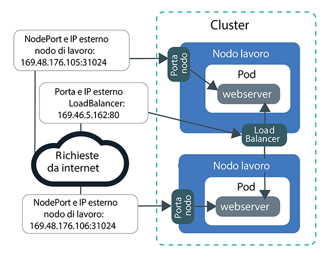
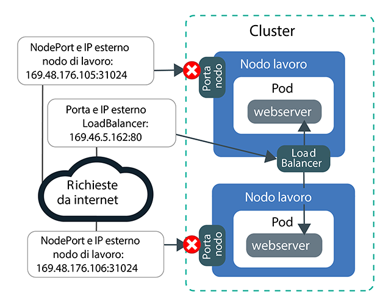
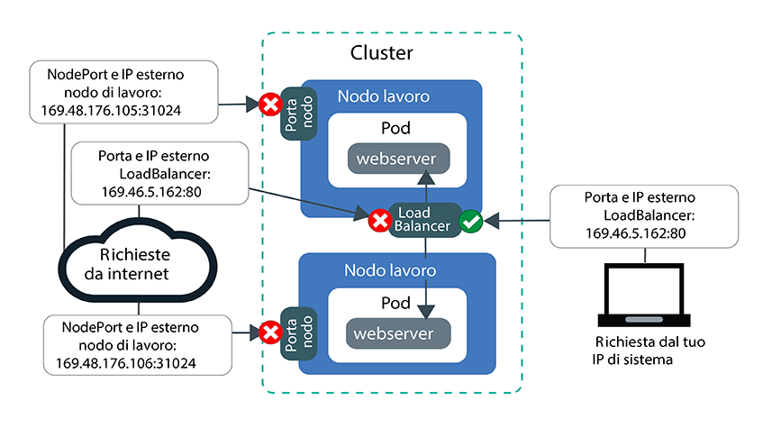
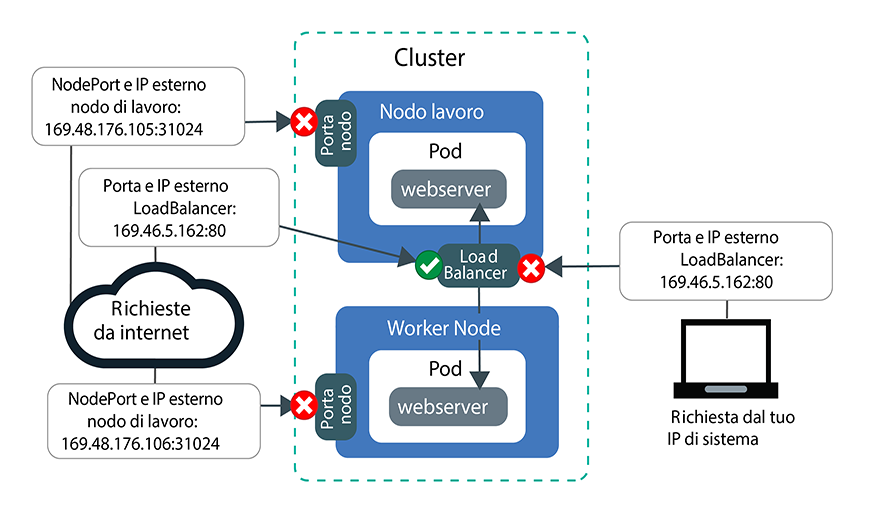

---

copyright:
  years: 2014, 2019
lastupdated: "2019-06-11"

keywords: kubernetes, iks

subcollection: containers

---

{:new_window: target="_blank"}
{:shortdesc: .shortdesc}
{:screen: .screen}
{:pre: .pre}
{:table: .aria-labeledby="caption"}
{:codeblock: .codeblock}
{:tip: .tip}
{:note: .note}
{:important: .important}
{:deprecated: .deprecated}
{:download: .download}
{:preview: .preview}


# Esercitazione: Utilizzo delle politiche di rete Calico per bloccare il traffico
{: #policy_tutorial}

Per impostazione predefinita, i servizi Ingress, LoadBalancer e NodePort Kubernetes rendono la tua applicazione disponibile su tutte le interfacce di rete cluster private e pubbliche. La politica Calico predefinita `allow-node-port-dnat` consente il traffico in entrata dai servizi NodePort, NLB (network load balancer) e ALB (application load balancer) Ingress ai pod dell'applicazione esposti da questi servizi. Kubernetes utilizza la conversione degli indirizzi di rete di destinazione (o DNAT, destination network address translation) per inoltrare le richieste di servizio ai pod corretti.
{: shortdesc}

Tuttavia, per motivi di sicurezza, potresti dover consentire il traffico ai servizi di rete solo da specifici indirizzi IP di origine. Puoi utilizzare le [politiche pre-DNAT Calico ](https://docs.projectcalico.org/v3.1/getting-started/bare-metal/policy/pre-dnat) per inserire in whitelist o in blacklist il traffico da o verso specifici indirizzi IP. Le politiche pre-DNAT impediscono al traffico specificato di raggiungere le tue applicazioni perché vengono applicate prima che Kubernetes utilizzi la DNAT regolare per inoltrare il traffico ai pod. Quando crei delle politiche pre-DNAT Calico, scegli se inserire in whitelist o in blacklist gli indirizzi IP di origine. Per la maggior parte degli scenari, l'inserimento in whitelist fornisce la configurazione più sicura perché viene bloccato tutto il traffico tranne quello da indirizzi IP di origine noti e consentiti. L'inserimento in blacklist è di norma utile solo negli scenari in cui, ad esempio, si intende evitare un attacco da un piccolo insieme di indirizzi IP.

In questo scenario, hai il ruolo di amministratore di rete per una società di PR e noti del traffico insolito verso le tue applicazioni. Le lezioni in questa esercitazione ti guidano nella creazione di un'applicazione server web di esempio, nell'esposizione dell'applicazione utilizzando un servizio NLB (network load balancer) e nella protezione dell'applicazione da traffico insolito e indesiderato con entrambe le politiche Calico di whitelist e blacklist.

## Obiettivi
{: #policies_objectives}

- Impara a bloccare tutto il traffico in entrata per tutte le porte del nodo creando una politica pre-DNAT di ordine superiore.
- Impara a consentire agli indirizzi IP di origine inseriti in whitelist l'accesso all'IP e alla porta pubblici dell'NLB creando una politica pre-DNAT di ordine inferiore. Le politiche di ordine inferiore sovrascrivono le politiche di ordine superiore.
- Impara a bloccare per gli indirizzi IP di origine inseriti in blacklist l'accesso all'IP e alla porta pubblici dell'NLB creando una politica pre-DNAT di ordine inferiore.

## Tempo richiesto
{: #policies_time}

1 ora

## Destinatari
{: #policies_audience}

Questa esercitazione è destinata agli sviluppatori di software e agli amministratori di rete che vogliono gestire il traffico di rete a un'applicazione.

## Prerequisiti
{: #policies_prereqs}

- [Crea un
cluster](/docs/containers?topic=containers-clusters#clusters_ui).
- [Indirizza la tua CLI al cluster](/docs/containers?topic=containers-cs_cli_install#cs_cli_configure).
- [Installa e configura la CLI Calico](/docs/containers?topic=containers-network_policies#cli_install).
- Assicurati di disporre delle seguenti politiche di accesso {{site.data.keyword.Bluemix_notm}} IAM per {{site.data.keyword.containerlong_notm}}:
    - [Qualsiasi ruolo della piattaforma](/docs/containers?topic=containers-users#platform)
    - [Il ruolo del servizio **Scrittore** o **Gestore**](/docs/containers?topic=containers-users#platform)

<br />


## Lezione 1: Distribuisci un'applicazione ed esponila utilizzando un NLB
{: #lesson1}

La prima lezione ti mostra in che modo la tua applicazione viene esposta da molteplici indirizzi IP e porte e da dove proviene il traffico pubblico nel tuo cluster.
{: shortdesc}

Inizia distribuendo un'applicazione webserver di esempio da utilizzare in tutta l'esercitazione. Il server web `echoserver` mostra i dati sulla connessione che si sta stabilendo al cluster dal client e puoi testare l'accesso al cluster della società di PR. Esponi quindi l'applicazione creando un servizio NLB (network load balancer) 1.0. Un servizio NLB 1.0 rende la tua applicazione disponibile sia sull'indirizzo IP dell'NLB che sulle porte del nodo dei nodi di lavoro.

Vuoi utilizzare un ALB (application load balancer) Ingress? Invece di creare un NLB nei passi 3 e 4, [crea un servizio per ciascuna applicazione server web](/docs/containers?topic=containers-ingress#public_inside_1) e [crea una risorsa Ingress per l'applicazione server web](/docs/containers?topic=containers-ingress#public_inside_4). Ottieni quindi gli IP pubblici dei tuoi ALB eseguendo `ibmcloud ks albs --cluster <cluster_name>` e utilizza questi IP in tutta l'esercitazione al posto di `<loadbalancer_IP>.`
{: tip}

La seguente immagine mostra in che modo l'applicazione server web è esposta a internet dalla porta del nodo pubblico e dall'NLB pubblico alla fine della Lezione 1:



1. Distribuisci l'applicazione webserver di esempio. Quando viene stabilita una connessione all'applicazione webserver, essa risponde con le intestazioni HTTP che aveva ricevuto nella connessione.
    ```
    kubectl run webserver --image=k8s.gcr.io/echoserver:1.10 --replicas=3
    ```
    {: pre}

2. Verifica che i pod dell'applicazione webserver abbiano una condizione (**STATUS**) di `Running`.
    ```
    kubectl get pods -o wide
    ```
    {: pre}

    Output di esempio:
    ```
    NAME                         READY     STATUS    RESTARTS   AGE       IP               NODE
    webserver-855556f688-6dbsn   1/1       Running   0          1m        172.30.xxx.xxx   10.176.48.78
    webserver-855556f688-76rkp   1/1       Running   0          1m        172.30.xxx.xxx   10.176.48.78
    webserver-855556f688-xd849   1/1       Running   0          1m        172.30.xxx.xxx   10.176.48.78
    ```
    {: screen}

3. Per esporre l'applicazione a internet pubblico, crea un file di configurazione del servizio NLB 1.0 denominato `webserver-lb.yaml` in un editor di testo.
    ```
    apiVersion: v1
    kind: Service
    metadata:
      labels:
        run: webserver
      name: webserver-lb
    spec:
      type: LoadBalancer
      selector:
        run: webserver
      ports:
      - name: webserver-port
        port: 80
        protocol: TCP
        targetPort: 8080
    ```
    {: codeblock}

4. Distribuisci l'NLB.
    ```
    kubectl apply -f filepath/webserver-lb.yaml
    ```
    {: pre}

5. Verifica di poter accedere pubblicamente all'applicazione esposta dall'NLB dal tuo computer.

    1. Ottieni l'indirizzo **EXTERNAL-IP** pubblico dell'NLB.
        ```
        kubectl get svc -o wide
        ```
        {: pre}

        Output di esempio:
        ```
        NAME           CLUSTER-IP       EXTERNAL-IP        PORT(S)        AGE       SELECTOR
        webserver-lb   172.21.xxx.xxx   169.xx.xxx.xxx     80:31024/TCP   2m        run=webserver
        ```
        {: screen}

    2. Crea un file di testo di scheda di riferimento e copia in esso l'IP dell'NLB. La scheda di riferimento ti aiuta a usare più rapidamente i valori nelle lezioni successive.

    3. Verifica di poter accedere pubblicamente all'IP esterno per l'NLB.
        ```
        curl --connect-timeout 10 <loadbalancer_IP>:80
        ```
        {: pre}

        Il seguente output di esempio conferma che l'NLB espone la tua applicazione sull'indirizzo IP dell'NLB pubblico `169.1.1.1`. Il pod dell'applicazione `webserver-855556f688-76rkp` ha ricevuto la richiesta curl:
        ```
        Hostname: webserver-855556f688-76rkp
        Pod Information:
            -no pod information available-
        Server values:
            server_version=nginx: 1.13.3 - lua: 10008
        Request Information:
            client_address=1.1.1.1
            method=GET
            real path=/
            query=
            request_version=1.1
            request_scheme=http
            request_uri=http://169.1.1.1:8080/
        Request Headers:
            accept=*/*
            host=169.1.1.1
            user-agent=curl/7.54.0
        Request Body:
            -no body in request-
        ```
        {: screen}

6. Verifica di poter accedere pubblicamente all'applicazione esposta dalla porta del nodo dal tuo computer. Un servizio NLB rende la tua applicazione disponibile sia sull'indirizzo IP del servizio NLB che sulle porte del nodo dei nodi di lavoro.

    1. Ottieni la porta del nodo che l'NLB ha assegnato ai nodi di lavoro. La porta del nodo è compresa nell'intervallo 30000 - 32767.
        ```
        kubectl get svc -o wide
        ```
        {: pre}

        Nel seguente output di esempio, la porta del nodo è `31024`:
        ```
        NAME           CLUSTER-IP       EXTERNAL-IP        PORT(S)        AGE       SELECTOR
        webserver-lb   172.21.xxx.xxx   169.xx.xxx.xxx     80:31024/TCP   2m        run=webserver
        ```
        {: screen}  

    2. Ottieni l'indirizzo **Public IP** di un nodo di lavoro.
        ```
        ibmcloud ks workers --cluster <cluster_name>
        ```
        {: pre}

        Output di esempio:
        ```
        ID                                                 Public IP        Private IP     Machine Type        State    Status   Zone    Version   
        kube-dal10-cr18e61e63c6e94b658596ca93d087eed9-w1   169.xx.xxx.xxx   10.176.48.67   u3c.2x4.encrypted   normal   Ready    dal10   1.13.6_1513*   
        kube-dal10-cr18e61e63c6e94b658596ca93d087eed9-w2   169.xx.xxx.xxx   10.176.48.79   u3c.2x4.encrypted   normal   Ready    dal10   1.13.6_1513*   
        kube-dal10-cr18e61e63c6e94b658596ca93d087eed9-w3   169.xx.xxx.xxx   10.176.48.78   u3c.2x4.encrypted   normal   Ready    dal10   1.13.6_1513*   
        ```
        {: screen}

    3. Copia l'IP pubblico del nodo di lavoro e la porta del nodo nella tua scheda di riferimento testuale per un utilizzo nelle lezioni successive.

    4. Verifica di poter accedere all'indirizzo IP pubblico del nodo di lavoro tramite la porta del nodo.
        ```
        curl  --connect-timeout 10 <worker_IP>:<NodePort>
        ```
        {: pre}

        Il seguente output di esempio conferma che la richiesta alla tua applicazione è arrivata tramite l'indirizzo IP privato `10.1.1.1` per il nodo di lavoro e la porta del nodo `31024`. Il pod dell'applicazione `webserver-855556f688-xd849` ha ricevuto la richiesta curl:
        ```
        Hostname: webserver-855556f688-xd849
        Pod Information:
            -no pod information available-
        Server values:
            server_version=nginx: 1.13.3 - lua: 10008
        Request Information:
            client_address=1.1.1.1
            method=GET
            real path=/
            query=
            request_version=1.1
            request_scheme=http
            request_uri=http://10.1.1.1:8080/
        Request Headers:
            accept=*/*
            host=10.1.1.1:31024
            user-agent=curl/7.60.0
        Request Body:
            -no body in request-
        ```
        {: screen}

A questo punto, la tua applicazione è esposta a molteplici indirizzi IP e porte. La maggior parte di questi IP è interna al cluster ed è possibile accedervi solo sulla rete privata. Solo la porta del nodo pubblico e la porta dell'NLB pubblico sono esposte a internet pubblico.

Puoi quindi iniziare a creare ed applicare politiche Calico per bloccare il traffico pubblico.

## Lezione 2: Blocca tutto il traffico in entrata verso tutte le porte del nodo
{: #lesson2}

Per proteggere il cluster dell'agenzia di PR, devi bloccare l'accesso pubblico sia al servizio NLB che alle porte del nodo che stanno esponendo la tua applicazione. Inizia bloccando l'accesso alle porte del nodo.
{: shortdesc}

La seguente immagine mostra come viene consentito il traffico all'NLB ma non alle porte del nodo alla fine della Lezione 2:



1. In un editor di testo, crea una politica pre-DNAT di ordine superiore denominata `deny-nodeports.yaml` per negare il traffico TCP e UDP in entrata da qualsiasi IP di origine a tutte le porte del nodo.
    ```
    apiVersion: projectcalico.org/v3
    kind: GlobalNetworkPolicy
    metadata:
      name: deny-nodeports
    spec:
      applyOnForward: true
      preDNAT: true
      ingress:
      - action: Deny
            destination:
              ports:
          - 30000:32767
            protocol: TCP
            source: {}
      - action: Deny
            destination:
              ports:
          - 30000:32767
        protocol: UDP
        source: {}
      selector: ibm.role=='worker_public'
      order: 1100
      types:
      - Ingress
    ```
    {: codeblock}

2. Applica la politica.
    - Linux:

      ```
      calicoctl apply -f filepath/deny-nodeports.yaml
      ```
      {: pre}

    - Windows e OS X:

      ```
      calicoctl apply -f filepath/deny-nodeports.yaml --config=filepath/calicoctl.cfg
      ```
      {: pre}
  Output di esempio:
  ```
  Successfully applied 1 'GlobalNetworkPolicy' resource(s)
  ```
  {: screen}

3. Utilizzando i valori dalla tua scheda di riferimento, verifica di non poter accedere pubblicamente alla porta del nodo e all'indirizzo IP pubblico del nodo di lavoro.
    ```
    curl  --connect-timeout 10 <worker_IP>:<NodePort>
    ```
    {: pre}

    La connessione va in timeout perché la politica Calico da te creata sta bloccando il traffico alle porte del nodo.
    ```
    curl: (28) Connection timed out after 10016 milliseconds
    ```
    {: screen}

4. Modifica la externalTrafficPolicy del LoadBalancer che hai creato nella lezione precedente da `Cluster` in `Local`. `Local` garantisce che l'IP di origine del tuo sistema venga preservato quando esegui il curl dell'IP esterno del LoadBalancer nel passo successivo.
    ```
    kubectl patch svc webserver -p '{"spec":{"externalTrafficPolicy":"Local"}}'
    ```
    {: pre}

5. Utilizzando il valore dalla tua scheda di riferimento, verifica di potere ancora accedere pubblicamente all'indirizzo IP esterno dell'NLB.
    ```
    curl --connect-timeout 10 <loadbalancer_IP>:80
    ```
    {: pre}

    Output di esempio:
    ```
    Hostname: webserver-855556f688-76rkp
    Pod Information:
        -no pod information available-
    Server values:
        server_version=nginx: 1.13.3 - lua: 10008
    Request Information:
        client_address=1.1.1.1
        method=GET
        real path=/
        query=
        request_version=1.1
        request_scheme=http
        request_uri=http://<loadbalancer_IP>:8080/
    Request Headers:
        accept=*/*
        host=<loadbalancer_IP>
        user-agent=curl/7.54.0
    Request Body:
        -no body in request-
    ```
    {: screen}
    Nella sezione `Request Information` dell'output, l'indirizzo IP di origine è, ad esempio, `client_address=1.1.1.1`. L'indirizzo IP di origine è l'IP pubblico del sistema che stai utilizzando per eseguire curl. Altrimenti, se ti stai collegando a Internet tramite un proxy o una VPN, è possibile che questi ultimi stiano oscurando l'indirizzo IP effettivo del tuo sistema. In entrambi i casi, l'NLB vede l'indirizzo IP di origine del tuo sistema come indirizzo IP del client.

6. Copia l'indirizzo IP di origine del sistema (`client_address=1.1.1.1` nell'output del passo precedente) nella tua scheda di riferimento per utilizzarlo nelle lezioni successive.

Ottimo! A questo punto, la tua applicazione è esposta a internet pubblico solo dalla porta dell'NLB pubblico. Il traffico alle porte del nodo pubblico è bloccato. Il tuo cluster è parzialmente bloccato al traffico indesiderato.

Ora puoi creare e applicare le politiche Calico per inserire in whitelist il traffico da specifici IP di origine.

## Lezione 3: Consenti il traffico in entrata da un IP inserito in whitelist all'NLB
{: #lesson3}

Ora decidi di bloccare completamente il traffico al cluster dell'agenzia di PR e di testare l'accesso inserendo in whitelist solo l'indirizzo IP del tuo computer.
{: shortdesc}

Per prima cosa, oltre alle NodePort, devi bloccare tutto il traffico in entrata all'NLB che espone l'applicazione. Puoi quindi creare una politica che inserisce in whitelist l'indirizzo IP del tuo sistema. Alla fine della Lezione 3, tutto il traffico all'NLB e alle porte del nodo pubblici sarà bloccato e sarà consentito solo il traffico dal tuo IP di sistema inserito in whitelist:



1. In un editor di testo, crea una politica pre-DNAT di ordine superiore denominata `deny-lb-port-80.yaml` per negare tutto il traffico TCP e UDP in entrata da qualsiasi IP di origine all'indirizzo IP e alla porta dell'NLB. Sostituisci `<loadbalancer_IP>` con l'indirizzo IP pubblico dell'NLB dalla tua scheda di riferimento.

    ```
    apiVersion: projectcalico.org/v3
    kind: GlobalNetworkPolicy
    metadata:
      name: deny-lb-port-80
    spec:
      applyOnForward: true
      preDNAT: true
      ingress:
      - action: Deny
        destination:
          nets:
          - <loadbalancer_IP>/32
          ports:
          - 80
        protocol: TCP
        source: {}
      - action: Deny
        destination:
          nets:
          - <loadbalancer_IP>/32
          ports:
          - 80
        protocol: UDP
        source: {}
      selector: ibm.role=='worker_public'
      order: 800
      types:
      - Ingress
    ```
    {: codeblock}

2. Applica la politica.
    - Linux:

      ```
      calicoctl apply -f filepath/deny-lb-port-80.yaml
      ```
      {: pre}

    - Windows e OS X:

      ```
      calicoctl apply -f filepath/deny-lb-port-80.yaml --config=filepath/calicoctl.cfg
      ```
      {: pre}

3. Utilizzando il valore dalla tua scheda di riferimento, verifica che ora non puoi accedere all'indirizzo IP dell'NLB pubblico. La connessione va in timeout perché la politica Calico da te creata sta bloccando il traffico all'NLB.
    ```
    curl --connect-timeout 10 <loadbalancer_IP>:80
    ```
    {: pre}

4. In un editor di testo, crea una politica pre-DNAT di ordine inferiore denominata `whitelist.yaml` per consentire il traffico dall'IP del tuo sistema all'indirizzo IP e alla porta dell'NLB. Utilizzando i valori dalla tua scheda di riferimento, sostituisci `<loadbalancer_IP>` con l'indirizzo IP pubblico dell'NLB e `<client_address>` con l'indirizzo IP pubblico dell'IP di origine del tuo sistema. Se non riesci a ricordarti il tuo IP di sistema, puoi eseguire `curl ifconfig.co`.
    ```
    apiVersion: projectcalico.org/v3
    kind: GlobalNetworkPolicy
    metadata:
      name: whitelist
    spec:
      applyOnForward: true
      preDNAT: true
      ingress:
      - action: Allow
        destination:
          nets:
          - <loadbalancer_IP>/32
          ports:
          - 80
        protocol: TCP
        source:
          nets:
          - <client_address>/32
      selector: ibm.role=='worker_public'
      order: 500
      types:
      - Ingress
    ```
    {: codeblock}

5. Applica la politica.
    - Linux:

      ```
      calicoctl apply -f filepath/whitelist.yaml
      ```
      {: pre}

    - Windows e OS X:

      ```
      calicoctl apply -f filepath/whitelist.yaml --config=filepath/calicoctl.cfg
      ```
      {: pre}
  L'indirizzo IP del tuo sistema è ora inserito in whitelist.

6. Utilizzando il valore dalla tua scheda di riferimento, verifica che ora puoi accedere all'indirizzo IP dell'NLB pubblico.
    ```
    curl --connect-timeout 10 <loadbalancer_IP>:80
    ```
    {: pre}

7. Se hai accesso a un altro sistema che ha un indirizzo IP differente, prova ad accedere all'NLB da tale sistema.
    ```
    curl --connect-timeout 10 <loadbalancer_IP>:80
    ```
    {: pre}
    La connessione va in timeout perché l'indirizzo IP del sistema non è inserita in whitelist.

A questo punto, tutto il traffico all'NLB e alle porte del nodo pubblici è bloccato. È consentito solo il traffico dal tuo IP di sistema inserito in whitelist.

## Lezione 4: Nega il traffico in entrata da IP inseriti in blacklist all'NLB
{: #lesson4}

Nella lezione precedente, hai bloccato tutto il traffico e inserito in whitelist solo alcuni IP. Tale scenario funziona bene per scopi di test quando vuoi limitare l'accesso solo a pochi indirizzi IP di origine controllati. Tuttavia, l'agenzia di PR ha delle applicazioni che devono essere ampiamente disponibili per il pubblico. Devi assicurarti che sia consentito tutto il traffico, fatta eccezione per il traffico insolito che vedi da qualche indirizzo IP. L'inserimento in blacklist è utile in uno scenario come questo perché può aiutare ad evitare un attacco da un piccolo insieme di indirizzi IP,
{: shortdesc}

In questa lezione, farai un test dell'inserimento in blacklist bloccando il traffico dall'indirizzo IP di origine del tuo sistema. Alla fine della Lezione 4, tutto il traffico alle porte del nodo pubblico sarà bloccato e tutto il traffico all'NLB pubblico sarà consentito. Sarà bloccato solo il traffico dal tuo IP di sistema inserito in blacklist all'NLB:



1. Elimina le politiche di whitelist che hai creato nella lezione precedente.
    - Linux:
      ```
      calicoctl delete GlobalNetworkPolicy deny-lb-port-80
      ```
      {: pre}
      ```
      calicoctl delete GlobalNetworkPolicy whitelist
      ```
      {: pre}

    - Windows e OS X:
      ```
      calicoctl delete GlobalNetworkPolicy deny-lb-port-80 --config=filepath/calicoctl.cfg
      ```
      {: pre}
      ```
      calicoctl delete GlobalNetworkPolicy whitelist --config=filepath/calicoctl.cfg
      ```
      {: pre}

    Ora tutto il traffico TCP e UDP in entrata da qualsiasi IP di origine all'indirizzo IP e alla porta dell'NLB è nuovamente consentito.

2. Per negare tutto il traffico TCP e UDP in entrata dall'indirizzo IP di origine del tuo sistema all'indirizzo IP e alla porta dell'NLB, crea una politica pre-DNAT di ordine inferiore denominata `blacklist.yaml` in un editor di testo. Utilizzando i valori dalla tua scheda di riferimento, sostituisci `<loadbalancer_IP>` con l'indirizzo IP pubblico dell'NLB e `<client_address>` con l'indirizzo IP pubblico dell'IP di origine del tuo sistema.
  ```
  apiVersion: projectcalico.org/v3
  kind: GlobalNetworkPolicy
  metadata:
    name: blacklist
  spec:
    applyOnForward: true
    preDNAT: true
    ingress:
    - action: Deny
      destination:
        nets:
        - <loadbalancer_IP>/32
        ports:
        - 80
      protocol: TCP
      source:
        nets:
        - <client_address>/32
    - action: Deny
      destination:
        nets:
        - <loadbalancer_IP>/32
        ports:
        - 80
      protocol: UDP
      source:
        nets:
        - <client_address>/32
    selector: ibm.role=='worker_public'
    order: 500
    types:
    - Ingress
  ```
  {: codeblock}

3. Applica la politica.
    - Linux:

      ```
      calicoctl apply -f filepath/blacklist.yaml
      ```
      {: pre}

    - Windows e OS X:

      ```
      calicoctl apply -f filepath/blacklist.yaml --config=filepath/calicoctl.cfg
      ```
      {: pre}
  L'indirizzo IP del tuo sistema è ora inserito in blacklist.

4. Utilizzando il valore dalla tua scheda di riferimento, verifica dal tuo sistema che non puoi accedere all'IP dell'NLB perché l'IP del tuo sistema è stato inserito in blacklist.
    ```
    curl --connect-timeout 10 <loadbalancer_IP>:80
    ```
    {: pre}
    A questo punto, tutto il traffico alle porte del nodo pubblico è bloccato e tutto il traffico all'NLB pubblico è consentito. Viene bloccato solo il traffico dal tuo IP di sistema inserito in blacklist all'NLB.

Ottimo lavoro! Hai controllato con successo il traffico nella tua applicazione utilizzando le politiche pre-DNAT Calico per inserire in blacklist gli IP origine.

## Lezione 5: Registrazione del traffico bloccato dagli IP inseriti in blacklist all'NLB
{: #lesson5}

Nella lezione precedente, hai inserito in blacklist il traffico dal tuo IP di sistema all'NLB. In questa lezione, puoi imparare a registrare le richieste di traffico rifiutate.
{: shortdesc}

Nel nostro scenario di esempio, l'agenzia di PR per cui lavori desidera configurare una traccia di registrazione per tutto il traffico insolito che viene continuamente rifiutato da una delle tue politiche di rete. Per monitorare la potenziale minaccia alla sicurezza, configuri la registrazione nei log per eseguire una registrazione ogni volta che la politica di blacklist rifiuta un'azione tentata sull'IP dell'NLB.

1. Crea una NetworkPolicy Calico denominata `log-denied-packets`. Questa politica di log utilizza lo stesso selettore della politica `blacklist`, che aggiunge questa politica alla catena di regole Iptables Calico. Utilizzando un numero di ordine più basso, come `300`, puoi assicurarti che questa regola venga aggiunta alla catena di regole Iptables prima della politica di blacklist. I pacchetti dal tuo IP vengono registrati da questa politica prima che provino la messa in corrispondenza alla regola della politica `blacklist` e vengano rifiutati.
  ```
  apiVersion: projectcalico.org/v3
  kind: GlobalNetworkPolicy
  metadata:
    name: log-denied-packets
  spec:
    applyOnForward: true
    preDNAT: true
    ingress:
    - action: Log
      destination:
        nets:
        - <loadbalancer_IP>/32
        ports:
        - 80
      protocol: TCP
      source:
        nets:
        - <client_address>/32
    - action: Deny
      destination:
        nets:
        - <loadbalancer_IP>/32
        ports:
        - 80
      protocol: UDP
      source:
        nets:
        - <client_address>/32
    selector: ibm.role=='worker_public'
    order: 300
    types:
    - Ingress
  ```
  {: codeblock}

2. Applica la politica.
  ```
  calicoctl apply -f log-denied-packets.yaml --config=<filepath>/calicoctl.cfg
  ```
  {: pre}

3. Genera le voci di log inviando le richieste dal tuo IP di sistema all'IP dell'NLB. Questi pacchetti di richiesta vengono registrati prima di essere rifiutati.
  ```
  curl --connect-timeout 10 <loadbalancer_IP>:80
  ```
  {: pre}

4. Controlla la presenza di voci di log scritte nel percorso `/var/log/syslog` . La voce di log ha un aspetto simile al seguente:
  ```
  Sep 5 14:34:40 <worker_hostname> kernel: [158271.044316] calico-packet: IN=eth1 OUT= MAC=08:00:27:d5:4e:57:0a:00:27:00:00:00:08:00 SRC=192.XXX.XX.X DST=192.XXX.XX.XX LEN=60 TOS=0x00 PREC=0x00 TTL=64 ID=52866 DF PROTO=TCP SPT=42962 DPT=22 WINDOW=29200 RES=0x00 SYN URGP=0
  ```
  {: screen}

Ottimo! Hai configurato la registrazione in modo che il traffico inserito in blacklist possa essere monitorato più facilmente.

Se desideri ripulire la blacklist e le politiche di log:
1. Ripulisci la politica di blacklist.
    - Linux:
      ```
      calicoctl delete GlobalNetworkPolicy blacklist
      ```
      {: pre}

    - Windows e OS X:
      ```
      calicoctl delete GlobalNetworkPolicy blacklist --config=filepath/calicoctl.cfg
      ```
      {: pre}

2. Ripulisci la politica di log.
    - Linux:
      ```
      calicoctl delete GlobalNetworkPolicy log-denied-packets
      ```
      {: pre}

    - Windows e OS X:
      ```
      calicoctl delete GlobalNetworkPolicy log-denied-packets --config=filepath/calicoctl.cfg
      ```
      {: pre}

## Operazioni successive
{: #whats_next}

* Leggi ulteriori informazioni sul [controllo del traffico con le politiche di rete](/docs/containers?topic=containers-network_policies).
* Per ulteriori politiche di rete Calico di esempio che controllano il traffico verso o dal tuo cluster, puoi controllare la [demo della politica stars ](https://docs.projectcalico.org/v3.1/getting-started/kubernetes/tutorials/stars-policy/) e la [politica di rete avanzata ](https://docs.projectcalico.org/v3.1/getting-started/kubernetes/tutorials/advanced-policy).
