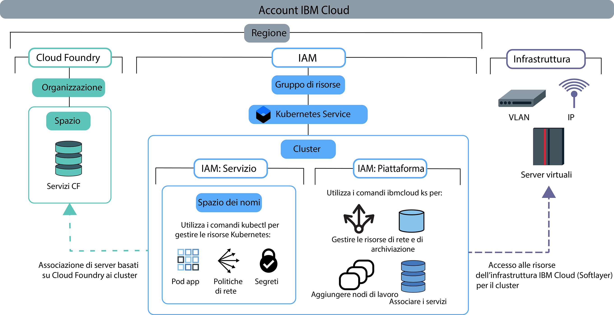

---

copyright:
  years: 2014, 2019
lastupdated: "2019-06-12"

keywords: kubernetes, iks

subcollection: containers

---

{:new_window: target="blank"}
{:shortdesc: .shortdesc}
{:screen: .screen}
{:pre: .pre}
{:table: .aria-labeledby="caption"}
{:codeblock: .codeblock}
{:tip: .tip}
{:note: .note}
{:important: .important}
{:deprecated: .deprecated}
{:download: .download}
{:preview: .preview}


# Assegnazione dell'accesso al cluster
{: #users}

Come amministratore del cluster, puoi definire le politiche di accesso per il tuo cluster {{site.data.keyword.containerlong}} per creare diversi livelli di accesso per i vari utenti. Ad esempio, puoi autorizzare determinati utenti a lavorare con le risorse dell'infrastruttura cluster e altri a distribuire solo i contenitori.
{: shortdesc}

A partire dal 30 gennaio 2019, {{site.data.keyword.containerlong_notm}} ha introdotto un nuovo modo di autorizzare gli utenti con {{site.data.keyword.Bluemix_notm}} IAM: [i ruoli di accesso del servizio](/docs/containers?topic=containers-access_reference#service). Questi ruoli del servizio vengono utilizzati per concedere l'accesso alle risorse all'interno del cluster, come gli spazi dei nomi Kubernetes. Per ulteriori informazioni, consulta il blog [Introducing service roles and namespaces in IAM for more granular control of cluster access ](https://www.ibm.com/blogs/bluemix/2019/02/introducing-service-roles-and-namespaces-in-iam-for-more-granular-control-of-cluster-access/).
{: note}

## Descrizione delle politiche e dei ruoli di accesso
{: #access_policies}

Le politiche di accesso determinano il livello di accesso che gli utenti del tuo account {{site.data.keyword.Bluemix_notm}} devono avere alle risorse sulla piattaforma {{site.data.keyword.Bluemix_notm}}. Una politica assegna a un utente uno o più ruoli che definiscono l'ambito di accesso a un singolo servizio o a un insieme di servizi e risorse organizzati insieme in un gruppo di risorse. Ogni servizio in {{site.data.keyword.Bluemix_notm}} potrebbe richiedere la propria serie di politiche di accesso.
{: shortdesc}

Man mano che sviluppi il piano per gestire l'accesso degli utenti, considera i seguenti passi generali:
1.  [Scegli la politica e il ruolo di accesso appropriati per i tuoi utenti](#access_roles)
2.  [Assegna ruoli di accesso a singoli o gruppi di utenti in {{site.data.keyword.Bluemix_notm}} IAM](#iam_individuals_groups)
3.  [Delimita l'ambito dell'accesso utente a istanze cluster, spazi dei nomi Kubernetes o gruppi di risorse](#resource_groups)

Dopo aver compreso come poter gestire ruoli, utenti e risorse nel tuo account, consulta [Configurazione dell'accesso al tuo cluster](#access-checklist) per un elenco di controllo su come configurare l'accesso.

### Scegli la politica e il ruolo di accesso appropriati per i tuoi utenti
{: #access_roles}

Devi definire le politiche di accesso per ogni utente che lavora con {{site.data.keyword.containerlong_notm}}. L'ambito di una politica di accesso si basa sul ruolo o sui ruoli definiti dell'utente, che determinano le azioni che l'utente può eseguire. Alcune politiche sono predefinite ma altre possono essere personalizzate. Si applica la stessa politica se l'utente esegue la richiesta dalla console {{site.data.keyword.containerlong_notm}} o tramite la CLI, anche quando le azioni vengono completate nell'infrastruttura IBM Cloud (SoftLayer).
{: shortdesc}

La seguente immagine mostra i diversi tipi di autorizzazioni e ruoli, quali ruoli possono eseguire gli specifici tipi di azioni e in che modo i ruoli si correlano tra loro



Per visualizzare le autorizzazioni {{site.data.keyword.containerlong_notm}} specifiche per ogni ruolo, controlla l'argomento di riferimento [Autorizzazioni di accesso utente](/docs/containers?topic=containers-access_reference).
{: tip}

<dl>
<dt>Ruoli del servizio e della piattaforma <a href="#platform">{{site.data.keyword.Bluemix_notm}} IAM</a></dt>
<dd>{{site.data.keyword.containerlong_notm}} utilizza i ruoli del servizio e della piattaforma {{site.data.keyword.Bluemix_notm}} IAM (Identity and Access Management) per concedere agli utenti l'accesso al cluster.
<ul><li>**Piattaforma**: i ruoli della piattaforma determinano le azioni che gli utenti possono eseguire sull'infrastruttura del cluster utilizzando CLI, console e API {{site.data.keyword.containerlong_notm}} (`ibmcloud ks`). I ruoli della piattaforma non concedono l'accesso all'API Kubernetes. Puoi impostare le politiche per questi ruoli in base a gruppo di risorse, regione o istanza del cluster. Anche se ti autorizzano a eseguire azioni dell'infrastruttura sul cluster, i ruoli della piattaforma IAM non concedono l'accesso alle risorse dell'infrastruttura IBM Cloud (SoftLayer). L'accesso alle risorse dell'infrastruttura IBM Cloud (SoftLayer) è determinato dalla [chiave API impostata per la regione](#api_key). Le azioni di esempio consentite dai ruoli della piattaforma sono la creazione o la rimozione di cluster, il bind di servizi a un cluster, la gestione di risorse di rete e archiviazione o l'aggiunta di nodi di lavoro supplementari.<br><br>Se assegni loro solo ruoli della piattaforma, gli utenti non possono interagire con le risorse Kubernetes all'interno del cluster. Possono tuttavia ancora eseguire il [comando](/docs/containers?topic=containers-cli-plugin-kubernetes-service-cli#cs_cluster_config) `ibmcloud ks cluster-config`. Puoi quindi autorizzare gli utenti a eseguire azioni Kubernetes selezionate utilizzando le [politiche RBAC personalizzate](/docs/containers?topic=containers-users#role-binding). Potresti eseguire questa operazione se la tua organizzazione attualmente utilizza politiche RBAC personalizzate per controllare l'accesso Kubernetes e intendi continuare a utilizzare i ruoli RBAC personalizzati invece dei ruoli del servizio.</li>
<li>**Servizio**: i ruoli del servizio concedono le politiche RBAC Kubernetes corrispondenti che vengono date a un utente all'interno di un cluster. In quanto tali, i ruoli del servizio concedono l'accesso alla CLI, al dashboard e all'API Kubernetes (`kubectl`). Puoi delimitare l'ambito della politica per i ruoli del servizio in base a gruppo di risorse, regione o istanza del cluster. Puoi inoltre delimitare l'ambito dei ruoli del servizio agli spazi dei nomi Kubernetes che si trovano in tutti i cluster, in singoli cluster o nei cluster a livello della regione. Quando delimiti l'ambito di un ruolo del servizio a uno spazio dei nomi, non puoi applicare la politica a un gruppo di risorse o assegnare un ruolo della piattaforma contemporaneamente, Le azioni di esempio consentite in base ai ruoli del servizio sono la creazione di distribuzioni di applicazioni, l'aggiunta di spazi dei nomi o l'impostazione di mappe di configurazione.<br><br>Se assegni solo ruoli del servizio agli utenti, questi non possono visualizzare le risorse {{site.data.keyword.containerlong_notm}} o interagire con esse. Per consentire agli utenti di accedere al cluster e utilizzare le risorse Kubernetes del cluster, devi dare agli utenti il nome e l'ID del cluster in modo che possano eseguire il [comando](/docs/containers?topic=containers-cli-plugin-kubernetes-service-cli#cs_cluster_config) `ibmcloud ks cluster-config` e, quindi, [avviare il dashboard Kubernetes dalla CLI](/docs/containers?topic=containers-app#db_cli). Se vuoi che questi utenti possano comunque accedere alla console dei cluster {{site.data.keyword.containerlong_notm}} ed elencare i cluster e altre risorse dell'infrastruttura dalla CLI, concedi loro il ruolo **Visualizzatore** della piattaforma.</li></ul></dd>
<dt><a href="#role-binding">RBAC</a></dt>
<dd>In Kubernetes, l'RBAC (role-based access control) è un modo per proteggere le risorse all'interno del tuo cluster. I ruoli RBAC determinano le azioni Kubernetes che gli utenti possono eseguire su quelle risorse. A ogni utente a cui viene assegnato un ruolo del servizio viene automaticamente assegnato un ruolo cluster RBAC corrispondente. Questo ruolo cluster RBAC viene applicato in uno specifico spazio dei nomi o in tutti gli spazi dei nomi, a seconda del fatto che tu delimiti l'ambito della politica a uno spazio dei nomi. </br></br>
Le azioni di esempio consentite dai ruoli RBAC sono la creazione di oggetti come i pod o la lettura dei log dei pod.</dd>
<dt><a href="#api_key">Infrastruttura</a></dt>
<dd>I ruoli dell'infrastruttura consentono l'accesso alle tue risorse dell'infrastruttura IBM Cloud (SoftLayer). Configura un utente con il ruolo dell'infrastruttura **Super utente** e memorizza le credenziali dell'infrastruttura di questo utente in una chiave API. Quindi, imposta la chiave API in ogni regione in cui vuoi creare i cluster. Dopo aver impostato la chiave API, gli altri utenti a cui concedi l'accesso a {{site.data.keyword.containerlong_notm}} non necessitano di ruoli dell'infrastruttura poiché la chiave API viene condivisa per tutti gli utenti all'interno della regione. Invece, i ruoli della piattaforma {{site.data.keyword.Bluemix_notm}} IAM determinano le azioni dell'infrastruttura che gli utenti possono eseguire. Se non configuri la chiave API con il ruolo dell'infrastruttura completo <strong>Super utente</strong> o se devi concedere agli utenti l'accesso specifico al dispositivo, puoi [personalizzare le autorizzazioni di infrastruttura](#infra_access).</br></br>
Le azioni di esempio consentite dai ruoli dell'infrastruttura sono la visualizzazione dei dettagli delle macchine del nodo di lavoro del cluster o la modifica delle risorse di rete e archiviazione.</dd>
<dt>Cloud Foundry</dt>
<dd>Non tutti i servizi possono essere gestiti con {{site.data.keyword.Bluemix_notm}} IAM. Se utilizzi uno di questi servizi, puoi continuare a usare i ruoli utente Cloud Foundry per controllare l'accesso a tali servizi. I ruoli di Cloud Foundry concedono l'accesso a organizzazioni e spazi all'interno dell'account. Per visualizzare l'elenco dei servizi basati su Cloud Foundry in {{site.data.keyword.Bluemix_notm}}, esegui <code>ibmcloud service list</code> </br></br>
.
Le azioni di esempio consentite dai ruoli Cloud Foundry sono la creazione di una nuova istanza del servizio Cloud Foundry o il bind di un'istanza del servizio Cloud Foundry a un cluster. Per ulteriori informazioni, vedi i [ruoli disponibili per l'organizzazione e lo spazio](/docs/iam?topic=iam-cfaccess) o la procedura per la [gestione dell'accesso a Cloud Foundry](/docs/iam?topic=iam-mngcf) nella documentazione di {{site.data.keyword.Bluemix_notm}} IAM.</dd>
</dl>

### Assegna ruoli di accesso a singoli o gruppi di utenti in {{site.data.keyword.Bluemix_notm}} IAM
{: #iam_individuals_groups}

Quando imposti le politiche {{site.data.keyword.Bluemix_notm}} IAM, puoi assegnare ruoli a un singolo utente o a un gruppo di utenti.
{: shortdesc}

<dl>
<dt>Singoli utenti</dt>
<dd>Potresti avere un utente specifico che ha bisogno di più o meno autorizzazioni rispetto al resto del tuo team. Puoi personalizzare le autorizzazioni su base individuale in modo che ogni persona disponga delle autorizzazioni necessarie per completare le proprie attività. Puoi assegnare più di un ruolo {{site.data.keyword.Bluemix_notm}} IAM a ogni utente.</dd>
<dt>Più utenti in un gruppo di accesso</dt>
<dd>Puoi creare un gruppo di utenti e quindi assegnare le autorizzazioni a tale gruppo. Ad esempio, puoi raggruppare tutti i team leader e assegnare al gruppo l'accesso come amministratore. Quindi, puoi raggruppare tutti gli sviluppatori e assegnare a quel gruppo solo l'accesso in scrittura. Puoi assegnare più di un ruolo {{site.data.keyword.Bluemix_notm}} IAM a ogni gruppo di accesso. Quando assegni le autorizzazioni a un gruppo, viene interessato qualsiasi utente aggiunto o rimosso da quel gruppo. Se aggiungi un utente al gruppo, anch'egli ha l'accesso aggiuntivo. Se viene rimosso, il suo accesso viene revocato.</dd>
</dl>

I ruoli {{site.data.keyword.Bluemix_notm}} IAM non possono essere assegnati a un account di servizio. Puoi invece [assegnare i ruoli RBAC agli account di servizio](#rbac).
{: tip}

Devi inoltre specificare se gli utenti hanno accesso a un cluster in un gruppo di risorse, a tutti i cluster in un gruppo di risorse o a tutti i cluster in tutti i gruppi di risorse nel tuo account.

### Delimita l'ambito dell'accesso utente a istanze cluster, spazi dei nomi o gruppi di risorse
{: #resource_groups}

In {{site.data.keyword.Bluemix_notm}} IAM, puoi assegnare ruoli di accesso utente alle istanze della risorsa, agli spazi dei nomi Kubernetes o ai gruppi di risorse.
{: shortdesc}

Quando crei il tuo account {{site.data.keyword.Bluemix_notm}}, il gruppo di risorse predefinito viene creato automaticamente. Se non specifichi un gruppo di risorse quando crei la risorsa, le istanze della risorsa (i cluster) appartengono al gruppo di risorse predefinito. In {{site.data.keyword.Bluemix_notm}} IAM, uno spazio dei nomi Kubernetes è un tipo di risorsa di un'istanza della risorsa (cluster). Se vuoi aggiungere un gruppo di risorse nel tuo account, vedi [Procedure consigliate per la configurazione del tuo account](/docs/account?topic=account-account_setup) e [Configurazione dei tuoi gruppi di risorse](/docs/resources?topic=resources-bp_resourcegroups#setuprgs).

<dl>
<dt>Istanza della risorsa</dt>
  <dd><p>Ogni servizio {{site.data.keyword.Bluemix_notm}} nel tuo account è una risorsa che ha delle istanze. L'istanza differisce in base al servizio. Ad esempio, in {{site.data.keyword.containerlong_notm}}, l'istanza è un cluster, ma in {{site.data.keyword.cloudcerts_long_notm}}, l'istanza è un certificato. Per impostazione predefinita, le risorse appartengono anche al gruppo di risorse predefinito nel tuo account. Puoi assegnare agli utenti un ruolo di accesso a un'istanza della risorsa per i seguenti scenari.
  <ul><li>Tutti i servizi {{site.data.keyword.Bluemix_notm}} IAM nel tuo account, inclusi tutti i cluster in {{site.data.keyword.containerlong_notm}} e le immagini in {{site.data.keyword.registrylong_notm}}.</li>
  <li>Tutte le istanze all'interno di un servizio, ad esempio tutti i cluster in {{site.data.keyword.containerlong_notm}}.</li>
  <li>Tutte le istanze all'interno di una regione di un servizio, ad esempio tutti i cluster presenti nella regione **Stati Uniti Sud** di {{site.data.keyword.containerlong_notm}}.</li>
  <li>A una singola istanza, come ad esempio un cluster.</li></ul></dd>
<dt>Spazio dei nomi Kubernetes</dt>
  <dd><p>Come parte delle istanze di risorsa cluster in {{site.data.keyword.Bluemix_notm}} IAM, puoi assegnare gli utenti con i ruoli di accesso del servizio agli spazi dei nomi Kubernetes all'interno dei tuoi cluster.</p>
  <p>Quando assegni l'accesso a uno spazio dei nomi, la politica si applica a tutte le istanze correnti e future dello spazio dei nomi in tutti i cluster che tu autorizzi. Poniamo, ad esempio, che vuoi che un gruppo di utenti `dev` possa distribuire risorse Kubernetes in uno spazio dei nomi `test` in tutti i tuoi cluster in Asia Pacifico Nord. Se assegni al gruppo di accesso `dev` il ruolo di accesso del servizio di **Scrittore** per lo spazio di nomi Kubernetes test in tutti i cluster nella regione Asia Pacifico Nord all'interno del gruppo di risorse `default`, il gruppo `dev` può accedere allo spazio dei nomi `test` in qualsiasi cluster di Asia Pacifico Nord nel gruppo di risorse `default` che attualmente ha, o che eventualmente ha, uno spazio dei nomi test.</p>
  <p class="important">Se delimiti l'ambito di un ruolo del servizio a uno spazio dei nomi, non puoi applicare la politica a un gruppo di risorse o assegnare un ruolo della piattaforma contemporaneamente.</p></dd>
<dt>Gruppo di risorse</dt>
  <dd><p>Puoi organizzare le risorse del tuo account in raggruppamenti personalizzabili in modo da poter assegnare rapidamente a singoli o a gruppi di utenti l'accesso a più di una risorsa alla volta. I gruppi di risorse possono aiutare gli operatori e gli amministratori a filtrare le risorse per visualizzarne l'utilizzo corrente, risolvere i problemi e gestire i team.</p>
  <p class="important">Un cluster può essere creato in un solo gruppo di risorse che non puoi modificare in seguito. Se crei un cluster nel gruppo di risorse non corretto, devi eliminare il cluster e crearlo nuovamente nel gruppo di risorse corretto. Inoltre, se hai bisogno di utilizzare il [comando](/docs/containers-cli-plugin?topic=containers-cli-plugin-kubernetes-service-cli#cs_cluster_service_bind) `ibmcloud ks cluster-service-bind` per l'[integrazione con un servizio {{site.data.keyword.Bluemix_notm}}](/docs/containers?topic=containers-service-binding#bind-services), tale servizio deve appartenere allo stesso gruppo di risorse del cluster. I servizi che non utilizzano i gruppi di risorse come {{site.data.keyword.registrylong_notm}} o che non hanno bisogno di bind del servizio come {{site.data.keyword.la_full_notm}} funzionano anche se il cluster si trova in un gruppo di risorse differente.</p>
  <p>Se intendi utilizzare [{{site.data.keyword.monitoringlong_notm}} per le metriche](/docs/containers?topic=containers-health#view_metrics), considera la possibilità di assegnare ai cluster nomi univoci tra i gruppi di risorse e le regioni nel tuo account per evitare conflitti di denominazione delle metriche. Non puoi rinominare un cluster.</p>
  <p>Puoi assegnare agli utenti un ruolo di accesso a un gruppo di risorse per i seguenti scenari. Tieni presente che, a differenza delle istanze della risorsa, non puoi concedere l'accesso a una singola istanza all'interno di un gruppo di risorse.</p>
  <ul><li>Tutti i servizi {{site.data.keyword.Bluemix_notm}} IAM nel gruppo di risorse, inclusi tutti i cluster in {{site.data.keyword.containerlong_notm}} e le immagini in {{site.data.keyword.registrylong_notm}}.</li>
  <li>Tutte le istanze all'interno di un servizio nel gruppo di risorse, ad esempio tutti i cluster in {{site.data.keyword.containerlong_notm}}.</li>
  <li>Tutte le istanze all'interno di una regione di un servizio nel gruppo di risorse, ad esempio tutti i cluster presenti nella regione **Stati Uniti Sud** di {{site.data.keyword.containerlong_notm}}.</li></ul></dd>
</dl>

<br />


## Configurazione dell'accesso al tuo cluster
{: #access-checklist}

Dopo aver [compreso come poter gestire ruoli, utenti e risorse nel tuo account](#access_policies), utilizza il seguente elenco di controllo per configurare l'accesso utente nel tuo cluster.
{: shortdesc}

<p class="tip">Non assegnare i ruoli della piattaforma {{site.data.keyword.Bluemix_notm}} IAM contemporaneamente a un ruolo del servizio. Devi assegnare i ruoli della piattaforma e del servizio separatamente.</p>

1. [Imposta la chiave API](#api_key) per tutte le regioni e tutti i gruppi di risorse in cui vuoi creare i cluster.
2. Invita gli utenti al tuo account e [assegna loro i ruoli {{site.data.keyword.Bluemix_notm}} IAM](#platform) per {{site.data.keyword.containerlong_notm}}. 
3. Per consentire agli utenti di eseguire il bind dei servizi al cluster o di visualizzare i log inoltrati dalle configurazioni di registrazione del cluster, [concedi loro i ruoli Cloud Foundry](/docs/iam?topic=iam-mngcf) per l'organizzazione e lo spazio in cui vengono distribuiti i servizi o in cui vengono raccolti i log.
4. Se utilizzi gli spazi dei nomi Kubernetes per isolare le risorse all'interno del cluster, concedi l'accesso agli spai dei nomi [assegnando agli utenti i ruoli del servizio {{site.data.keyword.Bluemix_notm}} IAM per gli spazi dei nomi](#platform).
5. Per tutti gli strumenti di automazione, come quelli nella tua pipeline CI/CD, configura gli account di servizio e [assegna le autorizzazioni RBAC Kubernetes agli account di servizio](#rbac).
6. Per altre configurazioni avanzate per controllare l'accesso alle tue risorse del cluster a livello di pod, vedi [Configurazione della sicurezza del pod](/docs/containers?topic=containers-psp).

</br>

Per ulteriori informazioni sulla configurazione del tuo account e delle risorse, prova questa esercitazione sulle [procedure consigliate per organizzare utenti, team e applicazioni](/docs/tutorials?topic=solution-tutorials-users-teams-applications).
{: tip}

<br />


## Configurazione della chiave API per consentire l'accesso al portfolio dell'infrastruttura
{: #api_key}

Per eseguire correttamente il provisioning e la gestione dei cluster, devi assicurarti che il tuo account {{site.data.keyword.Bluemix_notm}} sia configurato correttamente per accedere al portfolio dell'infrastruttura IBM Cloud (SoftLayer) in ogni gruppo di risorse e regione in cui si trovano i tuoi cluster.
{: shortdesc}

**Nella maggior parte dei casi**: il tuo account Pagamento a consumo {{site.data.keyword.Bluemix_notm}} ha già accesso al portfolio dell'infrastruttura IBM Cloud (SoftLayer). Per configurare {{site.data.keyword.containerlong_notm}} per l'accesso al portfolio, il **proprietario dell'account** deve impostare la chiave API per la regione e il gruppo di risorse.

1. Accedi al terminale come proprietario dell'account.
    ```
    ibmcloud login [--sso]
    ```
    {: pre}

2. Specifica il gruppo di risorse in cui vuoi impostare la chiave API. Se non specifichi un gruppo di risorse, la chiave API viene impostata per il gruppo di risorse predefinito. Per elencare i gruppi di risorse disponibili esegui `ibmcloud resource groups`.
    ```
    ibmcloud target -g <resource_group_name>
    ```
    {:pre}

3. Imposta la chiave API per la regione e il gruppo di risorse.
    ```
    ibmcloud ks api-key-reset --region <region>
    ```
    {: pre}    

4. Verifica che la chiave API sia impostata.
    ```
    ibmcloud ks api-key-info --cluster <cluster_name_or_ID>
    ```
    {: pre}

5. Ripeti per ogni regione e gruppo di risorse in cui vuoi creare i cluster.

**Opzioni alternative e ulteriori informazioni**: per i diversi modi per accedere al portfolio dell'infrastruttura IBM Cloud (SoftLayer), controlla le seguenti sezioni.
* Se non sei sicuro che il tuo account abbia già accesso al portfolio dell'infrastruttura IBM Cloud (SoftLayer), vedi [Informazioni sull'accesso al portfolio dell'infrastruttura IBM Cloud (SoftLayer)](#understand_infra).
* Se il proprietario dell'account non imposta la chiave API, [assicurati che l'utente che imposta la chiave API disponga delle autorizzazioni corrette](#owner_permissions).
* Per ulteriori informazioni sull'utilizzo del tuo account predefinito per impostare la chiave API, vedi [Accesso al portfolio dell'infrastruttura con il tuo account Pagamento a consumo {{site.data.keyword.Bluemix_notm}} predefinito](#default_account).
* Se non hai un account Pagamento a consumo predefinito o devi utilizzare un diverso account dell'infrastruttura IBM Cloud (SoftLayer), vedi [Accesso a un diverso account dell'infrastruttura IBM Cloud (SoftLayer)](#credentials).

### Informazioni sull'accesso al portfolio dell'infrastruttura IBM Cloud (SoftLayer)
{: #understand_infra}

Determina se il tuo account ha accesso al portfolio dell'infrastruttura IBM Cloud (SoftLayer) e scopri come {{site.data.keyword.containerlong_notm}} utilizza la chiave API per accedere al portfolio.
{: shortdesc}

**Il mio account ha già accesso al portfolio dell'infrastruttura IBM Cloud (SoftLayer)?**</br>

Per accedere al portfolio dell'infrastruttura IBM Cloud (SoftLayer), utilizzi un account Pagamento a consumo {{site.data.keyword.Bluemix_notm}}. Se hai un diverso tipo di account, visualizza le opzioni nella seguente tabella.

<table summary="La tabella mostra le opzioni di creazione del cluster standard per tipo di account. Le righe devono essere lette da sinistra a destra, con la descrizione dell'account nella colonna uno e le opzioni per creare un cluster standard nella colonna due.">
<caption>Opzioni di creazione del cluster standard per tipo di account</caption>
  <thead>
  <th>Descrizione dell'account</th>
  <th>Opzioni per creare un cluster standard</th>
  </thead>
  <tbody>
    <tr>
      <td>Gli **account Lite** non possono eseguire il provisioning dei cluster.</td>
      <td>[Esegui l'upgrade del tuo account Lite a un account Pagamento a consumo {{site.data.keyword.Bluemix_notm}}](/docs/account?topic=account-accounts#paygo).</td>
    </tr>
    <tr>
      <td>Gli account **Pagamento a consumo** vengono forniti con l'accesso al portfolio dell'infrastruttura.</td>
      <td>Puoi creare dei cluster standard. Utilizza una chiave API per configurare le autorizzazioni di infrastruttura per i tuoi cluster.</td>
    </tr>
    <tr>
      <td>**Gli account Sottoscrizione** non sono configurati con l'accesso al portfolio dell'infrastruttura IBM Cloud (SoftLayer).</td>
      <td><p><strong>Opzione 1: </strong> [Crea un nuovo account Pagamento a consumo](/docs/account?topic=account-accounts#paygo) che è configurato con l'accesso al portfolio dell'infrastruttura IBM Cloud (SoftLayer). Se scegli questa opzione, hai due account e fatture {{site.data.keyword.Bluemix_notm}} separati.</p><p>Se vuoi continuare a utilizzare il tuo account Sottoscrizione, puoi utilizzare il nuovo account Pagamento a consumo per generare una chiave API nell'infrastruttura IBM Cloud (SoftLayer). Devi quindi impostare manualmente la chiave API dell'infrastruttura IBM Cloud (SoftLayer) per il tuo account Sottoscrizione. Ricorda che le risorse dell'infrastruttura IBM Cloud (SoftLayer) vengono fatturate attraverso il tuo nuovo account Pagamento a consumo.</p><p><strong>Opzione 2:</strong> se hai già un account dell'infrastruttura IBM Cloud (SoftLayer) esistente che vuoi utilizzare, puoi impostare manualmente le credenziali dell'infrastruttura IBM Cloud (SoftLayer) per il tuo account {{site.data.keyword.Bluemix_notm}}.</p><p class="note">Quando colleghi manualmente un account dell'infrastruttura IBM Cloud (SoftLayer), le credenziali vengono utilizzate per ogni azione specifica dell'infrastruttura IBM Cloud (SoftLayer) nel tuo account {{site.data.keyword.Bluemix_notm}}. Devi assicurarti che la chiave API che hai inviato abbia [autorizzazioni dell'infrastruttura sufficienti](/docs/containers?topic=containers-users#infra_access) in modo che gli utenti possano creare e utilizzare i cluster.</p></td>
    </tr>
    <tr>
      <td>**Account dell'infrastruttura IBM Cloud (SoftLayer)**, nessun account {{site.data.keyword.Bluemix_notm}}</td>
      <td><p>[Crea un account Pagamento a consumo {{site.data.keyword.Bluemix_notm}}](/docs/account?topic=account-accounts#paygo). Hai la fatturazione e due account dell'infrastruttura IBM Cloud (SoftLayer) separati.</p><p>Per impostazione predefinita, il tuo nuovo account {{site.data.keyword.Bluemix_notm}} utilizza il nuovo account dell'infrastruttura. Per continuare a utilizzare il vecchio account dell'infrastruttura, imposta manualmente le credenziali.</p></td>
    </tr>
  </tbody>
  </table>

**Ora che il mio portfolio dell'infrastruttura è configurato, in che modo {{site.data.keyword.containerlong_notm}} accede al portfolio?**</br>

{{site.data.keyword.containerlong_notm}} accede al portfolio dell'infrastruttura IBM Cloud (SoftLayer) utilizzando una chiave API. La chiave API memorizza le credenziali di un utente con accesso a un account dell'infrastruttura IBM Cloud (SoftLayer). Le chiavi API sono impostate per regione all'interno di un gruppo di risorse e sono condivise dagli utenti in quella regione.
 
Per consentire a tutti gli utenti di accedere al portfolio dell'infrastruttura IBM Cloud (SoftLayer), l'utente di cui sono state memorizzate le credenziali nella chiave API deve avere [il ruolo dell'infrastruttura **Super utente** e il ruolo della piattaforma **Amministratore** per {{site.data.keyword.containerlong_notm}} e per {{site.data.keyword.registryshort_notm}}](#owner_permissions) nel tuo account {{site.data.keyword.Bluemix_notm}}. Quindi, lascia che quell'utente esegua la prima azione di amministrazione in una regione e in un gruppo di risorse. Le credenziali dell'infrastruttura dell'utente vengono memorizzate in una chiave API per tale regione e gruppo di risorse.

Altri utenti all'interno dell'account condividono la chiave API per accedere all'infrastruttura. Quando gli utenti accedono all'account {{site.data.keyword.Bluemix_notm}}, un token {{site.data.keyword.Bluemix_notm}} IAM basato sulla chiave API viene generato per la sessione della CLI e consente di eseguire i comandi relativi all'infrastruttura in un cluster.

Per visualizzare il token {{site.data.keyword.Bluemix_notm}} IAM per una sessione della CLI, puoi eseguire `ibmcloud iam oauth-tokens`. I token {{site.data.keyword.Bluemix_notm}} IAM possono essere utilizzati anche per [effettuare chiamate direttamente all'API {{site.data.keyword.containerlong_notm}}](/docs/containers?topic=containers-cs_cli_install#cs_api).
{: tip}

**Se gli utenti hanno accesso al portfolio tramite un token {{site.data.keyword.Bluemix_notm}} IAM, come limito i comandi che un utente può eseguire?**

Dopo aver configurato l'accesso al portfolio per gli utenti nel tuo account, puoi controllare quali azioni dell'infrastruttura possono essere eseguite dagli utenti assegnando il [ruolo della piattaforma](#platform) appropriato. Assegnando i ruoli {{site.data.keyword.Bluemix_notm}} IAM agli utenti, limiti i comandi che essi possono eseguire in un cluster. Ad esempio, poiché il proprietario della chiave API ha il ruolo dell'infrastruttura **Super utente**, tutti i comandi relativi all'infrastruttura possono essere eseguiti in un cluster. Tuttavia, a seconda del ruolo {{site.data.keyword.Bluemix_notm}} IAM assegnato a un utente, l'utente può eseguire solo alcuni di questi comandi relativi all'infrastruttura.

Ad esempio, se vuoi creare un cluster in una nuova regione, assicurati che il primo cluster sia stato creato da un utente con il ruolo dell'infrastruttura **Super utente**, ad esempio il proprietario dell'account. Successivamente, puoi invitare singoli utenti o utenti nei gruppi di accesso {{site.data.keyword.Bluemix_notm}} IAM a quella regione impostando per loro le politiche di gestione della piattaforma in tale regione. Un utente con il ruolo della piattaforma **Visualizzatore** non è autorizzato ad aggiungere un nodo di lavoro. Pertanto, l'azione `worker-add` non riesce, anche se la chiave API ha le autorizzazioni dell'infrastruttura corrette. Se modifichi il ruolo della piattaforma dell'utente in **Operatore**, l'utente sarà autorizzato ad aggiungere un nodo di lavoro. L'azione `worker-add` riesce perché l'utente è autorizzato e la chiave API è impostata correttamente. Non dovrai modificare le autorizzazioni dell'infrastruttura IBM Cloud (SoftLayer) dell'utente.

Per controllare le azioni eseguite dagli utenti nel tuo account, puoi utilizzare [{{site.data.keyword.cloudaccesstrailshort}}](/docs/containers?topic=containers-at_events) per visualizzare tutti gli eventi correlati al cluster.
{: tip}

**Cosa succede se non voglio assegnare al proprietario della chiave API o al proprietario delle credenziali il ruolo dell'infrastruttura Super utente?**</br>

Per motivi di conformità, sicurezza o fatturazione, potresti non voler assegnare il ruolo dell'infrastruttura **Super utente** all'utente che imposta la chiave API o di cui vengono impostate le credenziali con il comando `ibmcloud ks credential-set`. Tuttavia, se questo utente non ha il ruolo **Super utente**, le azioni correlate all'infrastruttura, come la creazione di un cluster o il ricaricamento di un nodo di lavoro, possono avere esito negativo. Invece di utilizzare i ruoli della piattaforma {{site.data.keyword.Bluemix_notm}} IAM per controllare l'accesso all'infrastruttura degli utenti, devi [impostare specifiche autorizzazioni dell'infrastruttura IBM Cloud (SoftLayer)](#infra_access) per gli utenti.

**Cosa succede se l'utente che imposta la chiave API per una regione e un gruppo di risorse lascia l'azienda?**

Se l'utente lascia la tua organizzazione, il proprietario dell'account {{site.data.keyword.Bluemix_notm}} può rimuovere le autorizzazioni di quell'utente. Tuttavia, prima di rimuovere le autorizzazioni di accesso specifiche di un utente o di rimuovere completamente un utente dal tuo account, devi reimpostare la chiave API con le credenziali di infrastruttura di un altro utente. In caso contrario, gli altri utenti nell'account potrebbero perdere l'accesso al portale dell'infrastruttura IBM Cloud (SoftLayer) e i comandi relativi all'infrastruttura potrebbero non riuscire. Per ulteriori informazioni, vedi [Rimozione delle autorizzazioni utente](#removing).

**Come posso bloccare il mio cluster se la mia chiave API viene compromessa?**

Se una chiave API impostata per una regione e per un gruppo di risorse nel tuo cluster viene compromessa, [eliminala](/docs/iam?topic=iam-userapikey#delete_user_key) in modo che non possano essere effettuate ulteriori chiamate utilizzando la chiave API come autenticazione. Per ulteriori informazioni sulla protezione dell'accesso al server API Kubernetes, vedi l'argomento sulla sicurezza del [Server API Kubernetes ed etcd](/docs/containers?topic=containers-security#apiserver).

**Come posso configurare la chiave API per il mio cluster?**</br>

Dipende dal tipo di account che stai utilizzando per accedere al portfolio dell'infrastruttura IBM Cloud (SoftLayer):
* [Un account Pagamento a consumo {{site.data.keyword.Bluemix_notm}} predefinito](#default_account)
* [Un altro account dell'infrastruttura IBM Cloud (SoftLayer) che non è collegato al tuo account Pagamento a consumo {{site.data.keyword.Bluemix_notm}} predefinito](#credentials)

### Garanzia che il proprietario della chiave API o delle credenziali dell'infrastruttura disponga delle autorizzazioni corrette
{: #owner_permissions}

Per garantire che tutte le azioni correlate all'infrastruttura possano essere completate correttamente nel cluster, l'utente di cui vuoi impostare le credenziali per la chiave API deve disporre delle autorizzazioni appropriate.
{: shortdesc}

1. Accedi alla [console {{site.data.keyword.Bluemix_notm}} ](https://cloud.ibm.com/).

2. Per garantire che tutte le azioni correlate all'account possano essere eseguite correttamente, verifica che l'utente disponga dei ruoli della piattaforma {{site.data.keyword.Bluemix_notm}} IAM corretti.
    1. Dalla barra dei menu, seleziona **Gestisci > Accesso (IAM)** e fai quindi clic sulla pagina **Utenti**.
    2. Fai clic sul nome dell'utente per cui vuoi impostare la chiave API o di cui vuoi impostare le credenziali per la chiave API e fai quindi clic sulla scheda **Politiche di accesso**.
    3. Se l'utente non ha il ruolo della piattaforma **Amministratore** per tutti i cluster {{site.data.keyword.containerlong_notm}} in tutte le regioni, [assegna all'utente questo ruolo della piattaforma](#platform).
    4. Se l'utente non ha almeno il ruolo della piattaforma **Visualizzatore** per il gruppo di risorse in cui vuoi impostare la chiave API, [assegna all'utente questo ruolo del gruppo di risorse](#platform).
    5. Per creare i cluster, l'utente ha anche bisogno del ruolo della piattaforma **Amministratore** per {{site.data.keyword.registrylong_notm}} a livello di account. Non limitare le politiche per {{site.data.keyword.registryshort_notm}} al livello del gruppo di risorse.

3. Per garantire che tutte le azioni correlate all'infrastruttura nel tuo cluster possano essere eseguite correttamente, verifica che l'utente disponga delle corrette politiche di accesso all'infrastruttura.
    1.  Dalla barra dei menu, seleziona **Gestisci > Accesso (IAM)**.
    2.  Seleziona la scheda **Utenti** e fai clic sull'utente.
    3. Nel riquadro **Chiavi API**, verifica che l'utente abbia una **Chiave API infrastruttura classica** oppure fa clic su **Crea una chiave API IBM Cloud**. Per ulteriori informazioni, vedi [Gestione delle chiavi API dell'infrastruttura classica](/docs/iam?topic=iam-classic_keys#classic_keys).
    4. Fai clic sulla scheda **Infrastruttura classica** e fai quindi clic sulla scheda **Autorizzazioni**.
    5. Se l'utente non ha ciascuna categoria selezionata, puoi utilizzare l'elenco a discesa **Serie di autorizzazioni** per assegnare il ruolo **Super utente**. In alternativa, puoi espandere ciascuna categoria e dare all'utente le [autorizzazioni dell'infrastruttura](/docs/containers?topic=containers-access_reference#infra) richieste.

### Accesso al portfolio dell'infrastruttura con il tuo account Pagamento a consumo {{site.data.keyword.Bluemix_notm}} predefinito
{: #default_account}

Se hai un account Pagamento a consumo {{site.data.keyword.Bluemix_notm}}, per impostazione predefinita hai accesso a un portfolio dell'infrastruttura IBM Cloud (SoftLayer) collegato. La chiave API viene utilizzata per ordinare le risorse di infrastruttura da questo portfolio dell'infrastruttura IBM Cloud (SoftLayer), come nuovi nodi di lavoro o nuove VLAN.
{: shortdec}

Puoi trovare il proprietario della chiave API corrente eseguendo [`ibmcloud ks api-key-info --cluster <cluster>`](/docs/containers?topic=containers-cli-plugin-kubernetes-service-cli#cs_api_key_info). Se ritieni di dover aggiornare la chiave API memorizzata per una regione, puoi farlo eseguendo il comando [`ibmcloud ks api-key-reset --region <region>`](/docs/containers?topic=containers-cli-plugin-kubernetes-service-cli#cs_api_key_reset). Questo comando richiede la politica di accesso come amministratore {{site.data.keyword.containerlong_notm}} e memorizza la chiave API dell'utente che esegue questo comando nell'account.

Assicurati di voler reimpostare la chiave e di comprenderne l'impatto sulla tua applicazione. La chiave viene utilizzata in diversi punti e può causare modifiche improvvise se viene modificata senza che sia necessario.
{: note}

**Prima di iniziare**:
- Se il proprietario dell'account non imposta la chiave API, [assicurati che l'utente che imposta la chiave API disponga delle autorizzazioni corrette](#owner_permissions).
- [Accedi al tuo account. Se applicabile, specifica il gruppo di risorse appropriato. Imposta il contesto per il tuo cluster:](/docs/containers?topic=containers-cs_cli_install#cs_cli_configure)

Per impostare la chiave API per accedere al portfolio dell'infrastruttura IBM Cloud (SoftLayer):

1.  Imposta la chiave API per la regione e il gruppo di risorse in cui si trova il cluster.
    1.  Accedi al terminale con l'utente di cui vuoi utilizzare le autorizzazioni di infrastruttura.
    2.  Specifica il gruppo di risorse in cui vuoi impostare la chiave API. Se non specifichi un gruppo di risorse, la chiave API viene impostata per il gruppo di risorse predefinito.
        ```
        ibmcloud target -g <resource_group_name>
        ```
        {:pre}
    4.  Imposta la chiave API dell'utente per la regione.
        ```
        ibmcloud ks api-key-reset --region <region>
        ```
        {: pre}    
    5.  Verifica che la chiave API sia impostata.
        ```
        ibmcloud ks api-key-info --cluster <cluster_name_or_ID>
        ```
        {: pre}

2. [Crea un
cluster](/docs/containers?topic=containers-clusters). Per creare il cluster, vengono utilizzate le credenziali della chiave API impostate per la regione e il gruppo di risorse.

### Accesso a un diverso account dell'infrastruttura IBM Cloud (SoftLayer)
{: #credentials}

Invece di utilizzare l'account dell'infrastruttura IBM Cloud (SoftLayer) collegato predefinito per ordinare l'infrastruttura per i cluster all'interno di una regione, potresti voler utilizzare un altro account dell'infrastruttura IBM Cloud (SoftLayer) di cui già disponi. Puoi collegare questo account dell'infrastruttura al tuo account {{site.data.keyword.Bluemix_notm}} utilizzando il comando [`ibmcloud ks credential-set`](/docs/containers?topic=containers-cli-plugin-kubernetes-service-cli#cs_credentials_set). Vengono utilizzate le credenziali dell'infrastruttura IBM Cloud (SoftLayer) al posto delle credenziali dell'account Pagamento a consumo predefinito memorizzate per la regione.
{: shortdesc}

Le credenziali dell'infrastruttura IBM Cloud (SoftLayer) impostate dal comando `ibmcloud ks credential-set` vengono conservate al termine della sessione. Se rimuovi le credenziali dell'infrastruttura IBM Cloud (SoftLayer) che erano state impostate manualmente con il comando [`ibmcloud ks credential-unset --region <region>`](/docs/containers?topic=containers-cli-plugin-kubernetes-service-cli#cs_credentials_unset), vengono utilizzate le credenziali dell'account Pagamento a consumo predefinite. Tuttavia, questa modifica delle credenziali dell'account dell'infrastruttura potrebbe causare [cluster orfani](/docs/containers?topic=containers-cs_troubleshoot_clusters#orphaned).
{: important}

**Prima di iniziare**:
- Se non utilizzi le credenziali del proprietario dell'account, [assicurati che l'utente di cui vuoi impostare le credenziali per la chiave API disponga delle autorizzazioni corrette](#owner_permissions).
- [Accedi al tuo account. Se applicabile, specifica il gruppo di risorse appropriato. Imposta il contesto per il tuo cluster:](/docs/containers?topic=containers-cs_cli_install#cs_cli_configure)

Per impostare le credenziali dell'account dell'infrastruttura per accedere al portfolio dell'infrastruttura IBM Cloud (SoftLayer):

1. Ottieni l'account dell'infrastruttura che vuoi utilizzare per accedere al portfolio dell'infrastruttura IBM Cloud (SoftLayer). Hai diverse opzioni che dipendono dal tuo [tipo di account corrente](#understand_infra).

2.  Imposta le credenziali dell'API dell'infrastruttura con l'utente per l'account corretto.

    1.  Ottieni le credenziali dell'API dell'infrastruttura dell'utente. Nota che le credenziali sono diverse dall'ID IBM.

        1.  Dalla console [{{site.data.keyword.Bluemix_notm}} ](https://cloud.ibm.com/), seleziona la tabella **Gestisci** > **Accesso (IAM)** > **Utenti** e fai clic sul nome utente.

        2.  Nella sezione **Chiavi API**, trova o crea una chiave API dell'infrastruttura classica.   

    2.  Imposta le credenziali API dell'infrastruttura da utilizzare.
        ```
        ibmcloud ks credential-set --infrastructure-username <infrastructure_API_username> --infrastructure-api-key <infrastructure_API_authentication_key> --region <region>
        ```
        {: pre}

    3. Verifica che siano impostate le credenziali corrette.
        ```
        ibmcloud ks credential-get --region <region>
        ```
        Output di esempio:
        ```
        Infrastructure credentials for user name user@email.com set for resource group default.
        ```
        {: screen}

3. [Crea un
cluster](/docs/containers?topic=containers-clusters). Per creare il cluster, vengono utilizzate le credenziali dell'infrastruttura impostate per la regione e il gruppo di risorse.

4. Verifica che il tuo cluster utilizzi le credenziali dell'account dell'infrastruttura che hai impostato.
  1. Apri la [console {{site.data.keyword.containerlong_notm}} ](https://cloud.ibm.com/kubernetes/clusters) e seleziona il tuo cluster. 
  2. Nella scheda Panoramica, cerca il campo **Utente infrastruttura**. 
  3. Se vedi tale campo, non utilizzare le credenziali dell'infrastruttura predefinite fornite con il tuo account Pagamento a consumo in questa regione. La regione è impostata invece per utilizzare le diverse credenziali dell'account dell'infrastruttura che hai impostato.

<br />


## Concessione dell'accesso utente al tuo cluster tramite {{site.data.keyword.Bluemix_notm}} IAM
{: #platform}

Imposta le politiche di accesso del servizio e di gestione della piattaforma {{site.data.keyword.Bluemix_notm}} IAM nella [console {{site.data.keyword.Bluemix_notm}}](#add_users) o nella [CLI](#add_users_cli) in modo che gli utenti possano lavorare con i cluster in {{site.data.keyword.containerlong_notm}}. Prima di iniziare, consulta [Descrizione delle politiche e dei ruoli di accesso](#access_policies) per esaminare quali sono le politiche, a chi è possibile assegnarle e a quali risorse possono essere concesse.
{: shortdesc}

I ruoli {{site.data.keyword.Bluemix_notm}} IAM non possono essere assegnati a un account di servizio. Puoi invece [assegnare i ruoli RBAC agli account di servizio](#rbac).
{: tip}

### Assegnazione dei ruoli {{site.data.keyword.Bluemix_notm}} IAM con la console
{: #add_users}

Concedi agli utenti l'accesso ai tuoi cluster assegnando i ruoli di accesso del servizio e di gestione della piattaforma {{site.data.keyword.Bluemix_notm}} IAM con la console {{site.data.keyword.Bluemix_notm}}.
{: shortdesc}

<p class="tip">Non assegnare i ruoli della piattaforma contemporaneamente a un ruolo del servizio. Devi assegnare i ruoli della piattaforma e del servizio separatamente.</p>

Prima di iniziare, verifica che ti sia stato assegnato il ruolo della piattaforma **Amministratore** per l'account {{site.data.keyword.Bluemix_notm}} in cui stai lavorando.

1. Accedi alla [console {{site.data.keyword.Bluemix_notm}} ](https://cloud.ibm.com/). Dalla barra dei menu, seleziona **Gestisci > Accesso (IAM)**.

2. Seleziona gli utenti individualmente o crea un gruppo di accesso di utenti.
    * **Per assegnare i ruoli a un singolo utente**:
      1. Nella navigazione a sinistra, fai clic sulla pagina **Utenti** e fai quindi clic sul nome dell'utente per cui vuoi impostare le autorizzazioni. Se l'utente non viene visualizzato, fai clic su **Invita utenti** per aggiungerlo all'account.
      2. Fai clic sulla scheda **Politiche di accesso** e fai quindi clic su **Assegna accesso**.
    * **Per assegnare ruoli a più utenti in un gruppo di accesso**:
      1. Nella navigazione a sinistra, fai clic sulla pagina **Gruppi di accesso**.
      2. Fai clic su **Crea** e dai al tuo gruppo un **Nome** e una **Descrizione**. Fai clic su **Crea**.
      3. Fai clic su **Aggiungi utenti** per aggiungere persone al tuo gruppo di accesso. Viene visualizzato un elenco degli utenti che hanno accesso al tuo account.
      4. Seleziona la casella accanto agli utenti che vuoi aggiungere al gruppo. Viene visualizzata una finestra di dialogo.
      5. Fai clic su **Aggiungi al gruppo**.
      6. Fai clic sulla scheda **Politiche di accesso**.
      7. Fai clic su **Assegna accesso**.

3. Assegna una politica, per i gruppi di risorse o per le istanze della risorsa. Se vuoi delimitare l'ambito della politica a uno spazio dei nomi, devi assegnare la politica alle istanze della risorsa (non ai gruppi di risorse).
  * **Per i gruppi di risorse**:
    1. Fai clic su **Assegna l'accesso in un gruppo di risorse**.
    2. Seleziona il nome del gruppo di risorse.
    3. Nell'elenco a discesa **Assegna accesso a un gruppo di risorse**, scegli quale livello di autorizzazione concedere all'utente per il gruppo di risorse stesso (non per le risorse all'interno del gruppo). Ad esempio, per consentire agli utenti di visualizzare i cluster a cui hanno accesso in più gruppi di risorse, concedi loro il ruolo di **Visualizzatore** per ciascun gruppo di risorse.
    4. Dall'elenco **Servizi**, seleziona **{{site.data.keyword.containershort_notm}}**.
    5. Dall'elenco **Regione**, seleziona una o tutte le regioni.
    6. Seleziona un ruolo per la politica.
       * **Ruolo di accesso della piattaforma**: concede l'accesso a {{site.data.keyword.containerlong_notm}} in modo che gli utenti possano gestire risorse dell'infrastruttura quali i cluster, i nodi di lavoro, i pool di nodi di lavoro, gli ALB (application load balancer) Ingress e l'archiviazione. Per trovare un elenco delle azioni supportate per ogni ruolo, vedi la [pagina di riferimento ai ruoli della piattaforma](/docs/containers?topic=containers-access_reference#iam_platform).
       * **Ruolo di accesso del servizio**: concede l'accesso a Kubernetes come accesso dall'interno di un cluster in modo che gli utenti possano gestire risorse Kubernetes come i pod, le distribuzioni, i servizi e gli spazi dei nomi. Per trovare un elenco delle azioni supportate per ogni ruolo, vedi la [pagina di riferimento dei ruoli del servizio](/docs/containers?topic=containers-access_reference#service).<p class="note">Non puoi delimitare l'ambito di un ruolo di accesso del servizio a uno spazio dei nomi se assegni il ruolo a livello di gruppo di risorse. Assegna invece l'accesso a un'istanza della risorsa. Inoltre, non assegnare un ruolo della piattaforma contemporaneamente a quando assegni un ruolo del servizio.</p>
    7. Fai clic su **Assegna**.
    8. **Facoltativo**: se hai assegnato solo un ruolo del servizio agli utenti, devi dare loro il nome e l'ID del cluster in modo che possano eseguire il [comando](/docs/containers?topic=containers-cli-plugin-kubernetes-service-cli#cs_cluster_config) `ibmcloud ks cluster-config` e quindi [avviare il dashboard Kubernetes dalla CLI](/docs/containers?topic=containers-app#db_cli) o interagire in altro modo con l'API Kubernetes. Se vuoi che questi utenti possano comunque accedere alla console dei cluster {{site.data.keyword.containerlong_notm}} ed elencare i cluster e altre risorse dell'infrastruttura dalla CLI, ripeti questa procedura per concedere agli utenti il ruolo **Visualizzatore** della piattaforma.
  * **Per le istanze della risorsa negli o tra i gruppi di risorse**:
    1. Fai clic su **Assegna l'accesso alle risorse**.
    2. Dall'elenco **Servizi**, seleziona **{{site.data.keyword.containershort_notm}}**.
    3. Dall'elenco **Regione**, seleziona una o tutte le regioni.
    4. Dall'elenco **Cluster**, seleziona una o tutte le istanze del cluster.
    5. Nel campo **Spazio dei nomi**, immetti il nome dello spazio dei nomi Kubernetes a cui vuoi delimitare l'ambito della politica di _accesso del servizio_. Nota: non puoi delimitare l'ambito di una politica di _accesso della piattaforma_ a uno spazio dei nomi. La politica concede l'accesso agli spazi dei nomi in tutti i cluster da te selezionati precedentemente, come ad esempio tutti i cluster all'interno di una regione. Se vuoi concedere l'accesso a tutti gli spazi dei nomi, puoi lasciare vuoto il campo dello spazio dei nomi.
    6. Seleziona un ruolo per la politica.
       *  **Ruolo di accesso della piattaforma**: concede l'accesso a {{site.data.keyword.containerlong_notm}} in modo che gli utenti possano gestire risorse dell'infrastruttura quali i cluster, i nodi di lavoro, i pool di nodi di lavoro, gli ALB (application load balancer) Ingress e l'archiviazione. Per trovare un elenco delle azioni supportate per ogni ruolo, vedi la [pagina di riferimento ai ruoli della piattaforma](/docs/containers?topic=containers-access_reference#iam_platform).
          * Se assegni a un utente il ruolo della piattaforma **Amministratore** solo per un cluster, devi assegnargli anche il ruolo della piattaforma **Visualizzatore** per tutti i cluster in quella regione nel gruppo di risorse.
          * Se hai delimitato l'ambito della politica a uno spazio dei nomi, non puoi anche assegnare il ruolo della piattaforma contemporaneamente. Se vuoi anche che l'utente abbia un ruolo ella piattaforma, ripeti questi passi lasciando però vuoto il campo dello spazio dei nomi e assegna solo un ruolo della piattaforma (non assegnare nuovamente un ruolo di accesso del servizio).
       * **Ruolo di accesso del servizio**: concede l'accesso a Kubernetes come se l'accesso fosse eseguito dall'interno di un cluster in modo che gli utenti possano gestire risorse Kubernetes come i pod, le distribuzioni, i servizi e gli spazi dei nomi. Per trovare un elenco delle azioni supportate per ogni ruolo, vedi la [pagina di riferimento dei ruoli del servizio](/docs/containers?topic=containers-access_reference#service).
    7. Fai clic su **Assegna**.
    8. **Facoltativo**: se hai assegnato solo ruoli del servizio agli utenti, devi dare loro il nome e l'ID del cluster in modo che possano eseguire il [comando](/docs/containers?topic=containers-cli-plugin-kubernetes-service-cli#cs_cluster_config) `ibmcloud ks cluster-config` e quindi [avviare il dashboard Kubernetes dalla CLI](/docs/containers?topic=containers-app#db_cli) o interagire in altro modo con l'API Kubernetes. Se vuoi che questi utenti possano comunque accedere alla console dei cluster {{site.data.keyword.containerlong_notm}} ed elencare i cluster e altre risorse dell'infrastruttura dalla CLI, ripeti questa procedura per concedere agli utenti il ruolo **Visualizzatore** della piattaforma.

4.  Facoltativo: se vuoi che gli utenti siano in grado di lavorare con i cluster in un gruppo di risorse diverso da quello predefinito, questi utenti necessitano di un accesso aggiuntivo ai gruppi di risorse in cui si trovano i cluster. Puoi assegnare a questi utenti almeno il ruolo della piattaforma **Visualizzatore** per i gruppi di risorse, se non lo avevi fatto in precedenza.
    1.  Fai clic su **Assegna l'accesso in un gruppo di risorse**.
    2.  Seleziona il nome del gruppo di risorse.
    3.  Dall'elenco **Assegna accesso a un gruppo di risorse**, seleziona il ruolo **Visualizzatore**. Questo ruolo consente agli utenti di accedere al gruppo di risorse stesso, ma non alle risorse all'interno del gruppo.
    4.  Fai clic su **Assegna**.

5.  Perché l'utente venga aggiunto, le autorizzazioni RBAC devono essere sincronizzate al cluster. L'utente a cui è concesso l'accesso deve [avviare il dashboard Kubernetes](/docs/containers?topic=containers-app#db_gui) per iniziare la sincronizzazione. Le autorizzazioni RBAC sono memorizzate in cache e la sincronizzazione potrebbe non essere istantanea.

### Assegnazione dei ruoli {{site.data.keyword.Bluemix_notm}} IAM con la CLI
{: #add_users_cli}

Concedi agli utenti l'accesso ai tuoi cluster assegnando ruolo di accesso del servizio e di gestione della piattaforma {{site.data.keyword.Bluemix_notm}} IAM con la CLI.
{: shortdesc}

**Prima di iniziare**:

- Verifica che ti sia stato assegnato il ruolo della piattaforma {{site.data.keyword.Bluemix_notm}} IAM `cluster-admin` per l'account {{site.data.keyword.Bluemix_notm}} in cui stai lavorando.
- Verifica che l'utente sia stato aggiunto all'account. Se non è stato aggiunto, invita l'utente al tuo account eseguendo `ibmcloud account user-invite <user@email.com>`.
- [Accedi al tuo account. Se applicabile, specifica il gruppo di risorse appropriato. Imposta il contesto per il tuo cluster:](/docs/containers?topic=containers-cs_cli_install#cs_cli_configure)
- Decidi se assegnare i ruoli di [accesso della piattaforma o del servizio](/docs/containers?topic=containers-users#access_policies). I passi della CLI variano in base a quale ruolo di accesso desideri assegnare:
  * [Assegna i ruoli della piattaforma dalla CLI](#add_users_cli_platform)
  * [Assegna i ruoli del servizio dalla CLI](#add_users_cli_service)

**Per assegnare i ruoli della _piattaforma_ {{site.data.keyword.Bluemix_notm}} dalla CLI:**
{: #add_users_cli_platform}

1.  Crea una politica di accesso {{site.data.keyword.Bluemix_notm}} IAM per impostare le autorizzazioni per {{site.data.keyword.containerlong_notm}} (**`--service-name containers-kubernetes`**). Definisci l'ambito della politica di accesso in base a quello a cui vuoi assegnare l'accesso.

    <table summary="La tabella descrive le aree di accesso a cui puoi delimitare l'ambito della politica utilizzando gli indicatori della CLI. Le righe devono essere lette da sinistra a destra, con l'ambito nella colonna uno, l'indicatore della CLI nella colonna due e la descrizione nella colonna tre.">
    <caption>Opzioni per delimitare l'ambito della politica di accesso</caption>
      <thead>
      <th>Ambito</th>
      <th>Indicatore della CLI</th>
      <th>Descrizione</th>
      </thead>
      <tbody>
        <tr>
        <td>Utente</td>
        <td>N/D</td>
        <td>Puoi assegnare la politica a un singolo utente o a un gruppo di utenti. Colloca questo argomento posizionale immediatamente dopo il comando.
        <ul><li>**Singolo utente**: Immetti l'indirizzo email dell'utente.</li>
        <li>**Gruppo di accesso**: immetti il nome del gruppo di accesso degli utenti. Puoi creare un gruppo di accesso con il comando `ibmcloud iam access-group-create`. Per elencare i gruppi di accesso disponibili, esegui `ibmcloud iam access-groups`. Per aggiungere un utente a un gruppo di accesso, esegui `ibmcloud iam access-group-user-add <access_group_name> <user_email>`.</li></ul></td>
        </tr>
        <tr>
        <td>Gruppo di risorse</td>
        <td>`--resource-group-name`</td>
        <td>Puoi concedere una politica per un gruppo di risorse. Se non specifichi un gruppo di risorse o un ID cluster specifico, la politica si applica a tutti i cluster per tutti i gruppi di risorse. Per elencare i gruppi di risorse disponibili esegui `ibmcloud resource groups`.</td>
        </tr>
        <tr>
        <td>Cluster</td>
        <td>`--service-instance`</td>
        <td>Puoi limitare la politica a un singolo cluster. Per elencare i tuoi ID cluster, esegui `ibmcloud ks clusters`. **Nota**: se assegni a un utente il ruolo della piattaforma **Amministratore** solo per un cluster, devi assegnargli anche il ruolo della piattaforma **Visualizzatore** per tutti i cluster nella regione all'interno del gruppo di risorse.</td>
        </tr>
        <tr>
        <td>Regione</td>
        <td>`--region`</td>
        <td>Puoi delimitare l'ambito della politica per l'applicazione ai cluster all'interno di una specifica regione. Se non specifichi una regione o un ID cluster specifico, la politica si applica a tutti i cluster per tutte le regioni. Per elencare le regioni disponibili, esegui `ibmcloud ks regions` e utilizza il valore nella colonna **Region Alias**.</td>
        </tr>
        <tr>
        <td>Ruolo</td>
        <td>`--role`</td>
        <td>Scegli il [ruolo della piattaforma](/docs/containers?topic=containers-access_reference#iam_platform) che desideri assegnare. I valori possibili sono: `Administrator`, `Operator`, `Editor` o `Viewer`.</td>
        </tr>
      </tbody>
      </table>

    **Comandi di esempio**:

    *  Assegna a un singolo utente il ruolo della piattaforma **Visualizzatore** a un cluster nel gruppo di risorse predefinito e nella regione Stati Uniti Est:
       ```
       ibmcloud iam user-policy-create user@email.com --resource-group-name default --service-name containers-kubernetes --region us-east --service-instance clusterID-1111aa2b2bb22bb3333c3c4444dd4ee5 --roles Viewer
       ```
       {: pre}

    *  Assegna a un singolo utente l'accesso della piattaforma **Administrator** a tutti i cluster in un gruppo di risorse `HR`:
       ```
       ibmcloud iam user-policy-create user@email.com --resource-group-name HR --service-name containers-kubernetes [--region <region>] --roles Administrator
       ```
       {: pre}

    *  Assegna a un gruppo di utenti `auditors` il ruolo della piattaforma **Visualizzatore** a tutti i cluster in tutti i gruppi di risorse:
       ```
       ibmcloud iam access-group-policy-create auditors --service-name containers-kubernetes --roles Viewer
       ```
       {: pre}

2. Se vuoi che gli utenti siano in grado di lavorare con i cluster in un gruppo di risorse diverso da quello predefinito, questi utenti necessitano di un accesso aggiuntivo ai gruppi di risorse in cui si trovano i cluster. Puoi assegnare a questi utenti almeno il ruolo **Visualizzatore** per i gruppi di risorse. Puoi trovare l'ID del gruppo di risorse eseguendo `ibmcloud resource group <resource_group_name> --id`.
    *   Per i singoli utenti:
        ```
        ibmcloud iam user-policy-create <user@email.com> --resource-type resource-group --resource <resource_group_ID> --roles Viewer
        ```
        {: pre}
    *   Per i gruppi di accesso:
        ```
        ibmcloud iam access-group-policy-create <access_group> --resource-type resource-group --resource <resource_group_ID> --roles Viewer
        ```
        {: pre}

3.  Verifica che il nome o il gruppo di accesso abbiano il ruolo della piattaforma assegnato.
    *   Per i singoli utenti:
        ```
        ibmcloud iam user-policies <user@email.com>
        ```
        {: pre}
    *   Per i gruppi di accesso:
        ```
        ibmcloud iam access-group-policies <access_group>
        ```
        {: pre}

<br>
<br>

**Per assegnare i ruoli del _servizio_ {{site.data.keyword.Bluemix_notm}} dalla CLI:**
{: #add_users_cli_service}

1.  Ottieni le informazioni utente relative a singolo utente o gruppo di accesso a cui desideri assegnare il ruolo del servizio.

    1.  Ottieni il tuo **ID account**.
        ```
        ibmcloud account show
        ```
        {: pre}
    2.  Per un singolo utente, ottieni i relativi ID utente (**userID**) e ID univoco IBM (**ibmUniqueId**).
        ```
        ibmcloud account users --account-id <account_ID> --output JSON
        ```
        {: pre}
    3.  Per i gruppi di accesso, ottieni nome (**Name**) e **ID**.
        ```
        ibmcloud iam access-groups
        ```
        {: pre}

2.  Crea un file `policy.json` che delimita l'ambito del ruolo di accesso del servizio a uno spazio dei nomi Kubernetes nel tuo cluster.

    ```
    {
        "subjects": [
            {
                "attributes": [
                    {
                        "name": "(iam_id|access_group_id)",
                        "value": "<user_or_group_ID>"
                    }
                ]
            }
        ],
        "roles": [
            {
                "role_id": "crn:v1:bluemix:public:iam::::serviceRole:<(Manager|Writer|Reader)>"
            }
        ],
        "resources": [
            {
                "attributes": [
                    {
                        "name": "accountId",
                        "value": "<account_ID>"
                    },
                    {
                        "name": "serviceName",
                        "value": "containers-kubernetes"
                    },
                    {
                        "name": "serviceInstance",
                        "value": "<cluster_ID1,cluster_ID2>"
                    },
                    {
                        "name": "namespace",
                        "value": "<namespace_name>"
                    }
                ]
            }
        ]
    }
    ```
    {: codeblock}

    <table summary="La tabella descrive i campi da compilare per il file JSON. Le righe sono da leggere da sinistra a destra; la colonna uno contiene l'ambito, la colonna due contiene l'indicatore CLI e la colonna tre contiene la descrizione.">
    <caption>Descrizione dei componenti del file JSON</caption>
      <thead>
      <th colspan=2>Descrizione dei componenti del file JSON</th>
      </thead>
      <tbody>
        <tr>
        <td>`subjects.attributes`</td>
        <td>Immetti i dettagli di {{site.data.keyword.Bluemix_notm}} IAM per il singolo utente o gruppo di accesso che hai richiamato in precedenza.
        <ul><li>Per i singoli utenti, imposta `iam_id` per il campo `name`. Immetti l'ID univoco IBM (**ibmUniqueId**) richiamato in precedenza per il campo`value`.</li>
        <li>Per i gruppi di accesso, imposta `access_group_id` per il campo `name`. Immetti l'**ID** richiamato in precedenza per il campo `value`.</li></ul></td>
        </tr>
        <tr>
        <td>`roles.role_id`</td>
        <td>Scegli il [ruolo di accesso del servizio IAM](/docs/containers?topic=containers-access_reference#service) che vuoi assegnare. I valori possibili sono:
        <ul><li>`crn:v1:bluemix:public:iam::::serviceRole:Manager`</li>
        <li>`crn:v1:bluemix:public:iam::::serviceRole:Writer`</li>
        <li>`crn:v1:bluemix:public:iam::::serviceRole:Reader`</li></ul></td>
        </tr>
        <tr>
        <td>`resources.attributes`</td>
        <td>Configura l'ambito della politica sul tuo account, cluster e spazio dei nomi. Lascia il campo `"name"` così come viene fornito nell'esempio e immetti specifici campi `"value"` nel seguente modo.
        <ul><li>**Per `"accountId"`**: immetti il tuo ID account {{site.data.keyword.Bluemix_notm}} che hai richiamato in precedenza</li>
        <li>**Per `"serviceName"`**: lascia il nome del servizio così come viene fornito: `containers-kubernetes`.</li>
        <li>**Per `"serviceInstance"`**: immetti il tuo ID cluster. Per più cluster, usa la virgola come separatore. Per ottenere il tuo ID del cluster, esegui `ibmcloud ks clusters`.</li>
        <li>**Per `"namespace"`**: immetti uno spazio dei nomi Kubernetes nel tuo cluster. Per elencare gli spazi dei nomi nel tuo cluster, esegui `kubectl get namespaces`. <p class="note">Per assegnare la politica di accesso a tutti gli spazi dei nomi in un cluster, rimuovi l'intera voce `{"name": "namespace", "value": "<namespace_name"}`.</p></li></td>
        </tr>
      </tbody>
      </table>

3.  Applica la politica IAM {{site.data.keyword.Bluemix_notm}} a un singolo utente o gruppo di accesso.
    *   Per i singoli utenti:
        ```
        ibmcloud iam user-policy-create <user@email.com> --file <filepath>/policy.json
        ```
        {: pre}
    *   Per i gruppi di accesso:
        ```
        ibmcloud iam access-group-policy-create <access_group> --file <filepath>/policy.json
        ```
        {: pre}

4.  Se hai assegnato solo ruoli del servizio agli utenti, devi dare loro il nome e l'ID del cluster in modo che possano eseguire il [comando](/docs/containers?topic=containers-cli-plugin-kubernetes-service-cli#cs_cluster_config) `ibmcloud ks cluster-config` e quindi [avviare il dashboard Kubernetes dalla CLI](/docs/containers?topic=containers-app#db_cli) o interagire in altro modo con l'API Kubernetes. Se vuoi che questi utenti possano comunque accedere alla console dei cluster {{site.data.keyword.containerlong_notm}} ed elencare i cluster e altre risorse dell'infrastruttura dalla CLI, [concedi loro il ruolo **Visualizzatore** della piattaforma](#add_users_cli_platform).

5.  Perché le modifiche diventino effettive, l'utente a cui è concesso l'accesso deve aggiornare la configurazione del cluster. Gli utenti non vengono aggiunti ai bind del ruolo finché non aggiornano individualmente la configurazione del cluster, anche se hai aggiunto più utenti contemporaneamente. Gli utenti non sono inoltre aggiunti a un bind del ruolo se dispongono di un'autorizzazione superiore. Ad esempio, se gli utenti hanno un ruolo cluster e sono in un bind del ruolo cluster, non vengono aggiunti anche a ogni singolo bind del ruolo dello spazio dei nomi.
    ```
    ibmcloud ks cluster-config --cluster <cluster_name_or_id>
    ```
    {: pre}

6.  **Facoltativo**: verifica che l'utente venga aggiunto al [bind del ruolo RBAC o bind del ruolo cluster](#role-binding) corrispondente. Nota: devi essere un amministratore del cluster (ruolo del servizio **Gestore** in tutti gli spazi dei nomi) per controllare i bind del ruolo e quelli del ruolo cluster.
    Controlla il bind del ruolo o quello del ruolo cluster per il ruolo.
    *   Lettore:
        ```
        kubectl get rolebinding ibm-view -o yaml -n <namespace>
        ```
        {: pre}
    *   Scrittore:
        ```
        kubectl get rolebinding ibm-edit -o yaml -n <namespace>
        ```
        {: pre}
    *   Gestore, con ambito delimitato a uno spazio dei nomi:
        ```
        kubectl get rolebinding ibm-operate -o yaml -n <namespace>
        ```
        {: pre}
    *   Gestore, tutti gli spazi dei nomi:
        ```
        kubectl get clusterrolebinding ibm-admin -o yaml
        ```
        {: pre}

    **Output di esempio**: ottieni il seguente output di esempio se assegni all'utente `user@email.com` e al gruppo di accesso `team1` il ruolo del servizio **Lettore** ed esegui quindi `kubectl get rolebinding ibm-view -o yaml -n default`.

    ```
    apiVersion: rbac.authorization.k8s.io/v1
    kind: RoleBinding
    metadata:
      creationTimestamp: 2018-05-23T14:34:24Z
      name: ibm-view
      namespace: default
      resourceVersion: "8192510"
      selfLink: /apis/rbac.authorization.k8s.io/v1/namespaces/default/rolebindings/ibm-view
      uid: 63f62887-5e96-11e8-8a75-b229c11ba64a
    roleRef:
      apiGroup: rbac.authorization.k8s.io
      kind: ClusterRole
      name: view
    subjects:
    - apiGroup: rbac.authorization.k8s.io
      kind: User
      name: IAM#user@email.com
    - apiGroup: rbac.authorization.k8s.io
      kind: group
      name: team1
    ```
    {: screen}

<br />


## Assegnazione delle autorizzazioni RBAC
{: #role-binding}

Utilizza i ruoli RBAC per definire le azioni che un utente può eseguire per lavorare con le risorse Kubernetes nel tuo cluster.
{: shortdesc}

**Cosa sono i ruoli RBAC e i ruoli cluster?**</br>
I ruoli RBAC e i ruoli cluster definiscono una serie di autorizzazioni per il modo in cui gli utenti possono interagire con le risorse Kubernetes nel tuo cluster. L'ambito di un ruolo è delimitato alle risorse all'interno di uno spazio dei nomi specifico, come una distribuzione. L'ambito di un ruolo cluster è delimitato alle risorse a livello di cluster, come i nodi di lavoro, o alle risorse con ambito delimitato agli spazi dei nomi che possono essere trovate in ognuno di questi spazi, come i pod.

**Cosa sono i bind del ruolo RBAC e i bind del ruolo cluster?**</br>
I bind del ruolo applicano i ruoli RBAC o i ruoli cluster a uno specifico spazio dei nomi. Quando utilizzi un bind del ruolo per applicare un ruolo, fornisci a un utente l'accesso a una risorsa specifica in uno specifico spazio dei nomi. Quando utilizzi un bind del ruolo per applicare un ruolo cluster, fornisci a un utente l'accesso alle risorse con ambito delimitato agli spazi dei nomi che possono essere trovate in ognuno di questi spazi, come i pod, ma solo all'interno di uno spazio dei nomi specifico.

I bind del ruolo cluster applicano i ruoli cluster RBAC a tutti gli spazi dei nomi nel cluster. Quando utilizzi un bind del ruolo cluster per applicare un ruolo cluster, fornisci a un utente l'accesso alle risorse a livello di cluster, come i nodi di lavoro, o alle risorse con ambito delimitato agli spazi dei nomi in ogni spazio dei nomi, come i pod.

**Come si presentano questi ruoli nel mio cluster?**</br>
Se vuoi che gli utenti possano interagire con le risorse Kubernetes dall'interno di un cluster, devi assegnare l'accesso utente a uno o più spazi dei nomi tramite i [ruoli del servizio {{site.data.keyword.Bluemix_notm}} IAM](#platform). A ogni utente a cui viene assegnato un ruolo del servizio viene automaticamente assegnato un ruolo cluster RBAC corrispondente. Questi ruoli cluster RBAC sono predefiniti e consentono agli utenti di interagire con le risorse Kubernetes nel tuo cluster. Inoltre, viene creato un bind del ruolo per applicare il ruolo cluster a uno specifico spazio dei nomi o un bind del ruolo cluster per applicare il ruolo cluster a tutti gli spazi dei nomi.

Per ulteriori informazioni sulle azioni consentite da ogni ruolo RBAC, controlla l'argomento di riferimento [Ruoli del servizio {{site.data.keyword.Bluemix_notm}} IAM](/docs/containers?topic=containers-access_reference#service). Per visualizzare le autorizzazioni concesse da ciascun ruolo RBAC a singole risorse Kubernetes, consulta [Autorizzazioni delle risorse Kubernetes per ogni ruolo RBAC](/docs/containers?topic=containers-access_reference#rbac_ref).
{: tip}

**Posso creare ruoli o ruoli cluster personalizzati?**
I ruoli cluster `view`, `edit`, `admin` e `cluster-admin` sono ruoli predefiniti che vengono creati automaticamente quando assegni a un utente il ruolo del servizio {{site.data.keyword.Bluemix_notm}} IAM corrispondente. Per concedere altre autorizzazioni Kubernetes, puoi [creare autorizzazioni RBAC personalizzate](#rbac). I ruoli RBAC personalizzati sono in aggiunta ai ruoli RBAC che ti potrebbero essere stati assegnati con i ruoli di accesso del servizio e non li modificano né li sovrascrivono. Nota: per creare le autorizzazioni RBAC personalizzate, devi disporre del ruolo di accesso del servizio IAM **Gestore**, che ti concede il ruolo RBAC Kubernetes `cluster-admin`. Gli altri utenti, tuttavia, non hanno bisogno di un ruolo di accesso del servizio IAM se tu gestisci i tuoi ruoli RBAC Kubernetes personalizzati.

Stai creando delle tue politiche RBAC personalizzate? Assicurati di non modificare i bind del ruolo IBM esistenti che si trovano nel cluster o di denominare i nuovi bind del ruolo con lo stesso nome. Eventuali modifiche ai bind del ruolo RBAC forniti da IBM vengono sovrascritte periodicamente. Crea invece dei tuoi bind del ruolo.
{: tip}

**Quando devo utilizzare i bind del ruolo cluster e i bind del ruolo non legati alle autorizzazioni {{site.data.keyword.Bluemix_notm}} che ho impostato?**
Potresti voler autorizzare chi può creare e aggiornare i pod nel tuo cluster. Con le [politiche di sicurezza pod](/docs/containers?topic=containers-psp#psp), puoi utilizzare i bind del ruolo cluster esistenti forniti con il tuo cluster o crearne di tuoi.

Potresti anche voler integrare componenti aggiuntivi al tuo cluster. Ad esempio, quando [configuri Helm nel tuo cluster](/docs/containers?topic=containers-helm#public_helm_install), devi creare un account di servizio per Tiller nello spazio dei nomi `kube-system` e un bind del ruolo cluster RBAC Kubernetes per il pod `tiller-deploy`.

### Creazione di autorizzazioni RBAC personalizzate per utenti, gruppi o account di servizio
{: #rbac}

I ruoli cluster `view`, `edit`, `admin` e `cluster-admin` vengono creati automaticamente quando assegni il ruolo di gestione del servizio {{site.data.keyword.Bluemix_notm}} IAM corrispondente. Ha bisogno che le tue politiche di accesso al cluster siano più dettagliate di quelle permesse dalle autorizzazioni predefinite? Nessun problema! Puoi creare ruoli RBAC e ruoli cluster personalizzati.
{: shortdesc}

Puoi assegnare ruoli RBAC e ruoli cluster personalizzati a singoli utenti, gruppi di utenti (nei cluster che eseguono Kubernetes v1.11 o successiva) o account di servizio. Quando viene creato, un bind per un gruppo influenza qualsiasi utente aggiunto a, o rimosso da, tale gruppo. Quando aggiungi utenti a un gruppo, questi ottengono i diritti di accesso del gruppo oltre a eventuali singoli diritti di accesso che concedi loro. Se viene rimosso, il suo accesso viene revocato. Nota: non puoi aggiungere account di servizio ai gruppi di accesso.

Se vuoi assegnare l'accesso a un processo che viene eseguito nei pod, come una toolchain di fornitura continua, puoi utilizzare i [Kubernetes `ServiceAccount`` ](https://kubernetes.io/docs/reference/access-authn-authz/service-accounts-admin/). Per seguire un'esercitazione che illustra come configurare gli account di servizio per Travis e Jenkins e per assegnare ruoli RBAC personalizzati agli account di servizio, vedi il post del blog [Kubernetes `ServiceAccounts` per l'utilizzo nei sistemi automatizzati ](https://medium.com/@jakekitchener/kubernetes-serviceaccounts-for-use-in-automated-systems-515297974982).

Per evitare modifiche improvvise, non modificare i ruoli cluster predefiniti `view`, `edit`, `admin` e `cluster-admin`. I ruoli RBAC personalizzati sono in aggiunta ai ruoli RBAC che ti potrebbero essere stati assegnati con i ruoli di accesso del servizio {{site.data.keyword.Bluemix_notm}} IAM e non li modificano né li sovrascrivono.
{: important}

**Creo un ruolo o un ruolo cluster? Lo applico con un bind del ruolo o un bind del ruolo cluster?**

* **Accesso allo spazio dei nomi**: per consentire a un utente, gruppo di accesso o account di servizio di accedere a una risorsa all'interno di uno specifico spazio dei nomi, scegli una delle seguenti combinazioni:
  * Crea un ruolo e applicalo con un bind del ruolo. Questa opzione è utile per controllare l'accesso a un'unica risorsa presente solo in uno spazio dei nomi, come una distribuzione dell'applicazione.
  * Crea un ruolo cluster e applicalo con un bind del ruolo. Questa opzione è utile per controllare l'accesso a risorse generali in uno spazio dei nomi, come i pod.
* **Accesso a livello di cluster**: per consentire a un utente o a un gruppo di accesso di accedere a risorse a livello di cluster o a risorse in tutti gli spazi dei nomi, crea un ruolo cluster e applicalo con un bind del ruolo cluster. Questa opzione è utile per controllare l'accesso alle risorse che non rientrano nell'ambito degli spazi dei nomi, come i nodi di lavoro, o alle risorse in tutti gli spazi dei nomi nel tuo cluster, come i pod in ogni spazio dei nomi.

**Prima di iniziare**:

- Indirizza la [CLI Kubernetes](/docs/containers?topic=containers-cs_cli_install#cs_cli_configure) al tuo cluster.
- Assicurati di disporre del [ruolo del servizio {{site.data.keyword.Bluemix_notm}} IAM **Gestore**](/docs/containers?topic=containers-users#platform) per tutti gli spazi dei nomi.
- Per assegnare l'accesso a singoli utenti o a utenti in un gruppo di accesso, assicurati che all'utente o al gruppo sia stato assegnato almeno un [ruolo della piattaforma {{site.data.keyword.Bluemix_notm}} IAM](#platform) a livello di servizio {{site.data.keyword.containerlong_notm}}.

**Per creare le autorizzazioni RBAC personalizzate**:

1. Crea il ruolo o il ruolo cluster con l'accesso che vuoi assegnare.

    1. Crea un file `.yaml` per definire il ruolo o il ruolo cluster.

        ```
        kind: Role
        apiVersion: rbac.authorization.k8s.io/v1
        metadata:
          namespace: default
          name: my_role
        rules:
        - apiGroups: [""]
          resources: ["pods"]
          verbs: ["get", "watch", "list"]
        - apiGroups: ["apps", "extensions"]
          resources: ["daemonsets", "deployments"]
          verbs: ["get", "list", "watch", "create", "update", "patch", "delete"]
        ```
        {: codeblock}

        <table>
        <caption>Descrizione dei componenti YAML</caption>
          <thead>
            <th colspan=2> Descrizione dei componenti YAML</th>
          </thead>
          <tbody>
            <tr>
              <td><code>kind</code></td>
              <td>Utilizza `Role` per concedere l'accesso alle risorse all'interno di uno specifico spazio dei nomi. Utilizza `ClusterRole` per concedere l'accesso alle risorse a livello di cluster, come i nodi di lavoro, o alle risorse con ambito delimitato agli spazi dei nomi, come i pod, in tutti gli spazi dei nomi.</td>
            </tr>
            <tr>
              <td><code>apiVersion</code></td>
              <td><ul><li>Per i cluster che eseguono Kubernetes 1.8 o successive, utilizza `rbac.authorization.k8s.io/v1`. </li><li>Per le versioni precedenti, utilizza `apiVersion: rbac.authorization.k8s.io/v1beta1`.</li></ul></td>
            </tr>
            <tr>
              <td><code>metadata.namespace</code></td>
              <td>Solo per il tipo `Role`: specifica lo spazio dei nomi Kubernetes a cui è concesso l'accesso.</td>
            </tr>
            <tr>
              <td><code>metadata.name</code></td>
              <td>Fornisci un nome per il ruolo o il ruolo cluster.</td>
            </tr>
            <tr>
              <td><code>rules.apiGroups</code></td>
              <td>Specifica i [gruppi di API ](https://kubernetes.io/docs/reference/using-api/api-overview/#api-groups) Kubernetes con i quali gli utenti potranno interagire, ad esempio `"apps"`, `"batch"` o `"extensions"`. Per l'accesso al gruppo API principale nel percorso REST `api/v1`, lascia il gruppo vuoto: `[""]`.</td>
            </tr>
            <tr>
              <td><code>rules.resources</code></td>
              <td>Specifica i [tipi di risorsa ](https://kubernetes.io/docs/reference/kubectl/cheatsheet/) Kubernetes a cui vuoi concedere l'accesso, ad esempio `"daemonsets"`, `"deployments"`, `"events"` o `"ingresses"`. Se specifichi `"nodes"`, il tipo deve essere `ClusterRole`.</td>
            </tr>
            <tr>
              <td><code>rules.verbs</code></td>
              <td>Specifica i tipi di [azioni ](https://kubectl.docs.kubernetes.io/) che vuoi che gli utenti siano in grado di eseguire, ad esempio `"get"`, `"list"`, `"describe"`, `"create"` o `"delete"`.</td>
            </tr>
          </tbody>
        </table>

    2. Crea il ruolo o il ruolo cluster nel tuo cluster.

        ```
        kubectl apply -f my_role.yaml
        ```
        {: pre}

    3. Verifica che il ruolo o il ruolo cluster sia stato creato.
      * Ruolo:
          ```
          kubectl get roles -n <namespace>
          ```
          {: pre}

      * Ruolo cluster:
          ```
          kubectl get clusterroles
          ```
          {: pre}

2. Esegui il bind degli utenti al ruolo o al ruolo cluster.

    1. Crea un file `.yaml` per eseguire il bind degli utenti al ruolo o al ruolo cluster. Nota l'URL univoco da utilizzare per il nome di ogni soggetto.

        ```
        kind: RoleBinding
        apiVersion: rbac.authorization.k8s.io/v1
        metadata:
          name: my_role_binding
          namespace: default
        subjects:
        - kind: User
          name: IAM#user1@example.com
          apiGroup: rbac.authorization.k8s.io
        - kind: Group
          name: team1
          apiGroup: rbac.authorization.k8s.io
        - kind: ServiceAccount
          name: <service_account_name>
          namespace: <kubernetes_namespace>
        roleRef:
          kind: Role
          name: my_role
          apiGroup: rbac.authorization.k8s.io
        ```
        {: codeblock}

        <table>
        <caption>Descrizione dei componenti YAML</caption>
          <thead>
            <th colspan=2> Descrizione dei componenti YAML</th>
          </thead>
          <tbody>
            <tr>
              <td><code>kind</code></td>
              <td><ul><li>Specifica `RoleBinding` per un `Role` o `ClusterRole` specifico dello spazio dei nomi.</li><li>Specifica `ClusterRoleBinding` per un `ClusterRole` a livello di cluster.</li></ul></td>
            </tr>
            <tr>
              <td><code>apiVersion</code></td>
              <td><ul><li>Per i cluster che eseguono Kubernetes 1.8 o successive, utilizza `rbac.authorization.k8s.io/v1`. </li><li>Per le versioni precedenti, utilizza `apiVersion: rbac.authorization.k8s.io/v1beta1`.</li></ul></td>
            </tr>
            <tr>
              <td><code>metadata.namespace</code></td>
              <td><ul><li>Per il tipo `RoleBinding`: specifica lo spazio dei nomi Kubernetes a cui è concesso l'accesso.</li><li>Per il tipo `ClusterRoleBinding`: non utilizzare il campo `namespace`.</li></ul></td>
            </tr>
            <tr>
              <td><code>metadata.name</code></td>
              <td>Fornisci un nome per il bind del ruolo o il bind del ruolo cluster.</td>
            </tr>
            <tr>
              <td><code>subjects.kind</code></td>
              <td>Specifica il tipo come uno dei seguenti:
              <ul><li>`User`: esegui il bind del ruolo RBAC o del ruolo cluster a un singolo utente nel tuo account.</li>
              <li>`Group`: per i cluster che eseguono Kubernetes 1.11 o versioni successive, esegui il bind del ruolo RBAC o del ruolo cluster a un [{{site.data.keyword.Bluemix_notm}}gruppo di accesso IAM](/docs/iam?topic=iam-groups#groups) nel tuo account.</li>
              <li>`ServiceAccount`: esegui il bind del ruolo RBAC o del ruolo cluster a un account di servizio in uno spazio dei nomi nel tuo cluster.</li></ul></td>
            </tr>
            <tr>
              <td><code>subjects.name</code></td>
              <td><ul><li>Per `User`: accoda l'indirizzo email del singolo utente a `IAM#` nel seguente modo: <code>IAM#user@email.com</code>.</li>
              <li>Per `Group`: per i cluster che eseguono Kubernetes 1.11 o versioni successive, specifica il nome del [gruppo di accesso {{site.data.keyword.Bluemix_notm}} IAM](/docs/iam?topic=iam-groups#groups) nel tuo account.</li>
              <li>Per `ServiceAccount`: specifica il nome dell'account di servizio.</li></ul></td>
            </tr>
            <tr>
              <td><code>subjects.apiGroup</code></td>
              <td><ul><li>Per `User` o `Group`: utilizza `rbac.authorization.k8s.io`.</li>
              <li>Per `ServiceAccount`: non includere questo campo.</li></ul></td>
            </tr>
            <tr>
              <td><code>subjects.namespace</code></td>
              <td>Solo per `ServiceAccount`: specifica il nome dello spazio dei nomi Kubernetes in cui è distribuito l'account di servizio.</td>
            </tr>
            <tr>
              <td><code>roleRef.kind</code></td>
              <td>Immetti lo stesso valore del `kind` nel file `.yaml` del ruolo: `Role` o `ClusterRole`.</td>
            </tr>
            <tr>
              <td><code>roleRef.name</code></td>
              <td>Immetti il nome del file `.yaml` del ruolo.</td>
            </tr>
            <tr>
              <td><code>roleRef.apiGroup</code></td>
              <td>Utilizza `rbac.authorization.k8s.io`.</td>
            </tr>
          </tbody>
        </table>

    2. Crea la risorsa di bind del ruolo o bind del ruolo cluster nel tuo cluster.

        ```
        kubectl apply -f my_role_binding.yaml
        ```
        {: pre}

    3.  Verifica che il bind sia stata creato.

        ```
        kubectl get rolebinding -n <namespace>
        ```
        {: pre}

3. Facoltativo: per applicare lo stesso livello di accesso utente in altri spazi dei nomi, puoi copiare i bind del ruolo per quei ruoli o ruoli cluster negli altri spazi dei nomi.
    1. Copia il bind del ruolo da uno spazio dei nomi a un altro spazio dei nomi.
        ```
        kubectl get rolebinding <role_binding_name> -o yaml | sed 's/<namespace_1>/<namespace_2>/g' | kubectl -n <namespace_2> create -f -
        ```
        {: pre}

        Ad esempio, per copiare il bind del ruolo `custom-role` dallo spazio dei nomi `default` allo spazio dei nomi `testns`:
        ```
        kubectl get rolebinding custom-role -o yaml | sed 's/default/testns/g' | kubectl -n testns create -f -
        ```
        {: pre}

    2. Verifica che il bind del ruolo sia stato copiato. Se hai aggiunto un gruppo di accesso {{site.data.keyword.Bluemix_notm}} IAM al bind del ruolo, ogni utente in quel gruppo viene aggiunto singolarmente, non come un ID di gruppo di accesso.
        ```
        kubectl get rolebinding -n <namespace_2>
        ```
        {: pre}

Ora che hai creato e associato un ruolo RBAC o un ruolo cluster Kubernetes personalizzato, occupati degli utenti. Chiedi loro di testare un'azione per la quale dispongono dell'autorizzazione grazie al ruolo, come l'eliminazione di un pod.

### Estensione delle autorizzazioni esistenti aggregando i ruoli del cluster 
{: #rbac_aggregate}

Puoi estendere le autorizzazioni esistenti dei tuoi utenti aggregando o combinando i ruoli cluster con altri ruoli cluster. Quando assegni a un utente il ruolo del servizio {{site.data.keyword.Bluemix_notm}}, l'utente viene aggiunto a un [ruolo cluster RBAC Kubernetes corrispondente](/docs/containers?topic=containers-access_reference#service). Tuttavia, potresti voler consentire a specifici utenti di eseguire delle operazioni aggiuntive.
{: shortdesc}

Ad esempio, un utente con il ruolo cluster `admin` con ambito delimitato agli spazi dei nomi non può utilizzare il comando `kubectl top pods` per visualizzare le metriche di pod per tutti i pod nello spazio dei nomi. Puoi aggregare un ruolo cluster in modo che gli utenti nel ruolo cluster `admin` siano autorizzati a eseguire il comando `top pods`. Per ulteriori informazioni, [vedi la documentazione di Kubernetes ](https://kubernetes.io/docs/reference/access-authn-authz/rbac/#aggregated-clusterroles).

**Quali sono alcune operazioni comuni per cui potrei volere estendere le autorizzazioni per un ruolo cluster predefinito?**<br>
Esamina [le operazioni consentite da ogni ruolo cluster RBAC predefinito](/docs/containers?topic=containers-access_reference#rbac_ref) per comprendere cosa possono fare gli utenti e confronta quindi le operazioni consentite a quello che tu desideri siano in grado di fare.

Se i tuoi utenti nello stesso ruolo cluster riscontrano degli errori simili ai seguenti per lo stesso tipo di operazione, potresti voler estendere il ruolo cluster per includere questa operazione.

```
Error from server (Forbidden): pods.metrics.k8s.io is forbidden: User "IAM#myname@example.com" cannot list resource "pods" in API group "metrics.k8s.io" in the namespace "mynamespace"
```
{: screen}

**Per aggregare i ruoli cluster**:

Prima di iniziare: [accedi al tuo account. Se applicabile, specifica il gruppo di risorse appropriato. Imposta il contesto per il tuo cluster.](/docs/containers?topic=containers-cs_cli_install#cs_cli_configure)

1.  Crea un file YAML di ruolo cluster. Nella sezione `labels`, specifica il ruolo cluster esistente a cui vuoi aggregare le autorizzazioni. Il seguente esempio estende il ruolo cluster `admin` predefinito per consentire agli utenti di eseguire `kubectl top pods`. Per ulteriori esempi, [vedi la documentazione di Kubernetes ](https://kubernetes.io/docs/reference/access-authn-authz/rbac/#aggregated-clusterroles).
    ```
    apiVersion: rbac.authorization.k8s.io/v1
    kind: ClusterRole
    metadata:
      name: view-pod-metrics
      labels:
        rbac.authorization.k8s.io/aggregate-to-admin: "true"
    rules:
    - apiGroups:
      - "metrics.k8s.io"
      resources:
      - pods
      verbs:
      - list
    ```
    {: codeblock}
    
    <table>
    <caption>Descrizione dei componenti YAML</caption>
      <thead>
        <th colspan=2> Descrizione dei componenti YAML</th>
      </thead>
      <tbody>
        <tr>
          <td><code>metadata.name</code></td>
          <td>Immetti un nome per il ruolo cluster. **Non** utilizzare i nomi di ruolo del cluster predefiniti: `view`, `edit`, `admin` e `cluster-admin`.</td>
        </tr>
        <tr>
          <td><code>metadata.labels</code></td>
          <td>Aggiungi un'etichetta che corrisponda al ruolo del cluster a cui vuoi eseguire l'aggregazione nel formato `rbac.authorization.k8s.io/aggregate-to-<cluster_role>:"true"`. Le etichette per i ruoli del cluster predefiniti sono le seguenti,<ul>
          <li>Ruolo del servizio **Gestore** IAM, con ambito delimitato a uno spazio dei nomi: `rbac.authorization.k8s.io/aggregate-to-admin: "true"`</li>
          <li>Ruolo del servizio **Scrittore** IAM: `rbac.authorization.k8s.io/aggregate-to-edit: "true"`</li>
          <li>Ruolo del servizio **Lettore** IAM: `rbac.authorization.k8s.io/aggregate-to-view: "true"`</li></ul></td>
        </tr>
        <tr>
          <td><code>rules.apiGroups</code></td>
          <td>Specifica i [gruppi di API ](https://kubernetes.io/docs/reference/using-api/api-overview/#api-groups) Kubernetes con i quali gli utenti potranno interagire, ad esempio `"apps"`, `"batch"` o `"extensions"`. Per l'accesso al gruppo API principale nel percorso REST `api/v1`, lascia il gruppo vuoto: `[""]`.</td>
        </tr>
        <tr>
          <td><code>rules.resources</code></td>
          <td>Specifica i [tipi di risorsa ](https://kubernetes.io/docs/reference/kubectl/cheatsheet/) Kubernetes a cui vuoi concedere l'accesso, ad esempio `"daemonsets"`, `"deployments"`, `"events"` o `"ingresses"`.</td>
        </tr>
        <tr>
          <td><code>rules.verbs</code></td>
          <td>Specifica i tipi di [azioni ](https://kubectl.docs.kubernetes.io/) che vuoi che gli utenti siano in grado di eseguire, ad esempio `"get"`, `"list"`, `"describe"`, `"create"` o `"delete"`.</td>
        </tr>
      </tbody>
    </table>
2.  Crea il ruolo del cluster nel tuo cluster. Tutti gli utenti che hanno un bind del ruolo al ruolo cluster `admin` ora hanno le autorizzazioni aggiuntive dal ruolo cluster `view-pod-metrics`.
    ```
    kubectl apply -f <cluster_role_file.yaml>
    ```
    {: pre}
3.  Tieniti in contatto con gli utenti che hanno il ruolo cluster `admin`. Chiedi loro di [aggiornare la loro configurazione cluster](/docs/containers?topic=containers-cs_cli_install#cs_cli_configure) e di testare l'azione, come ad esempio `kubectl top pods`.


<br />


## Personalizzazione delle autorizzazioni di infrastruttura
{: #infra_access}

Quando assegni il ruolo dell'infrastruttura **Super utente** all'amministratore che imposta la chiave API o di cui vengono impostate le credenziali di infrastruttura, gli altri utenti all'interno dell'account condividono la chiave API o le credenziali per eseguire azioni dell'infrastruttura. Puoi quindi controllare quali azioni dell'infrastruttura possono essere eseguite dagli utenti assegnando il [ruolo della piattaforma {{site.data.keyword.Bluemix_notm}} IAM](#platform) appropriato. Non dovrai modificare le autorizzazioni dell'infrastruttura IBM Cloud (SoftLayer) dell'utente.
{: shortdesc}

Per motivi di conformità, sicurezza o fatturazione, potresti non voler assegnare il ruolo dell'infrastruttura **Super utente** all'utente che imposta la chiave API o di cui vengono impostate le credenziali con il comando `ibmcloud ks credential-set`. Tuttavia, se questo utente non ha il ruolo **Super utente**, le azioni correlate all'infrastruttura, come la creazione di un cluster o il ricaricamento di un nodo di lavoro, possono avere esito negativo. Invece di utilizzare i ruoli della piattaforma {{site.data.keyword.Bluemix_notm}} IAM per controllare l'accesso all'infrastruttura degli utenti, devi impostare specifiche autorizzazioni dell'infrastruttura IBM Cloud (SoftLayer) per gli utenti.

Ad esempio, se il tuo account non è abilitato alla VRF, il tuo proprietario dell'account dell'infrastruttura IBM Cloud (SoftLayer) deve attivare lo spanning della VLAN. Il proprietario dell'account può anche assegnare a un utente l'autorizzazione **Rete > Gestisci il VLAN Spanning di rete** in modo che l'utente possa abilitare lo spanning della VLAN. Per ulteriori informazioni, vedi [Spanning della VLAN per le comunicazioni tra VLAN](/docs/containers?topic=containers-subnets#basics_segmentation).

<p class="tip">Già hai impostato le credenziali dell'infrastruttura utilizzando il comando `ibmcloud ks credential-set`? Puoi controllare se alle credenziali mancano le autorizzazioni dell'infrastruttura consigliate od obbligatorie eseguendo il [comando `ibmcloud ks infra-permissions-get --region <region>`](/docs/containers?topic=containers-cli-plugin-kubernetes-service-cli#infra_permissions_get). Nell'output, se manca qualcuna delle autorizzazioni consigliate od obbligatorie, puoi utilizzare la procedura indicata in questa sezione per assegnare l'accesso richiesto.</p>

Prima di iniziare, assicurati di essere il proprietario dell'account o di avere il ruolo di **Super utente** e l'accesso a tutti i dispositivi. Non puoi concedere a un utente un accesso che non hai.

1. Accedi alla [console {{site.data.keyword.Bluemix_notm}} ](https://cloud.ibm.com). Dalla barra dei menu, seleziona **Gestisci > Accesso (IAM)**.

2. Fai clic sulla pagina **Utenti** e fai quindi clic sul nome dell'utente per cui vuoi impostare le autorizzazioni.

3. Fai clic sulla scheda **Infrastruttura classica** e fai quindi clic sulla scheda **Autorizzazioni**.

4. Personalizza l'accesso dell'utente. Le autorizzazioni necessarie agli utenti dipendono dalle risorse di infrastruttura che devono utilizzare. Hai due opzioni per assegnare l'accesso:
    * Utilizza l'elenco a discesa **Serie di autorizzazioni** per assegnare uno dei seguenti ruoli predefiniti. Dopo aver selezionato un ruolo, fai clic su **Imposta**.
        * **Solo visualizzazione** concede all'utente le autorizzazioni a visualizzare solo i dettagli dell'infrastruttura.
        * **Utente di base** fornisce all'utente alcune, ma non tutte le autorizzazioni di infrastruttura.
        * **Super utente** fornisce all'utente tutte le autorizzazioni di infrastruttura.
    * Seleziona le singole autorizzazioni per ogni categoria. Per riesaminare le autorizzazioni necessarie per eseguire attività comuni in {{site.data.keyword.containerlong_notm}}, vedi [Autorizzazioni di accesso utente](/docs/containers?topic=containers-access_reference#infra).

5.  Fai clic su **Salva**.

6.  Nella scheda **Dispositivo**, seleziona i dispositivi a cui concedere l'accesso.

    * Nel gruppo **Seleziona tipo**, puoi concedere l'accesso a tutti i server bare metal, dedicati e virtuali in modo che gli utenti possano lavorare con tutti i [tipi di macchina per i nodi di lavoro](/docs/containers?topic=containers-planning_worker_nodes#planning_worker_nodes).
    * Nel gruppo **Abilita accesso futuro**, puoi concedere all'utente l'accesso a tutti i server bare metal, dedicati e virtuali futuri.
    * Nella tabella dei dispositivi, assicurati che siano selezionati i dispositivi appropriati.

7. Per salvare le tue modifiche, fai clic su **Imposta**.

8. **Importante**: se stai assegnando le autorizzazioni in modo che un utente possa gestire i cluster e i nodi di lavoro, devi assegnare all'utente l'accesso per gestire i casi di supporto.
  1. Fai clic sulla scheda **Politiche di accesso** e fai quindi clic su **Assegna accesso**.
  2. Fai clic sulla scheda **Assegna l'accesso ai servizi di gestione dell'account**.
  3. Seleziona **Centro di supporto**.
  4. Per consentire all'utente di visualizzare, aggiungere e modificare casi d'uso, seleziona **Amministratore**.
  5. Fai clic su **Assegna**.

Downgrade delle autorizzazioni? Per il completamento dell'azione, potrebbero essere necessari alcuni minuti.
{: tip}

<br />


## Rimozione delle autorizzazioni utente
{: #removing}

Se un utente non ha più bisogno di autorizzazioni di accesso specifiche, o se l'utente lascia la tua organizzazione, il proprietario dell'account {{site.data.keyword.Bluemix_notm}} può rimuovere le autorizzazioni di quell'utente.
{: shortdesc}

Prima di rimuovere le autorizzazioni di accesso specifiche di un utente o di rimuovere completamente un utente dal tuo account, assicurati che le credenziali di infrastruttura dell'utente non vengano utilizzate per impostare la chiave API o per il comando `ibmcloud ks credential-set`. In caso contrario, gli altri utenti nell'account potrebbero perdere l'accesso al portale dell'infrastruttura IBM Cloud (SoftLayer) e i comandi relativi all'infrastruttura potrebbero non riuscire.
{: important}

1. Indirizza il tuo contesto della CLI a una regione e a un gruppo di risorse in cui hai i cluster.
    ```
    ibmcloud target -g <resource_group_name> -r <region>
    ```
    {: pre}

2. Verifica il proprietario della chiave API o delle credenziali dell'infrastruttura impostate per tale regione e gruppo di risorse.
    * Se utilizzi la [chiave API per accedere al portfolio dell'infrastruttura IBM Cloud (SoftLayer)](#default_account):
        ```
        ibmcloud ks api-key-info --cluster <cluster_name_or_id>
        ```
        {: pre}
    * Se imposti le [credenziali dell'infrastruttura per accedere al portfolio dell'infrastruttura IBM Cloud (SoftLayer)](#credentials):
        ```
        ibmcloud ks credential-get --region <region>
        ```
        {: pre}

3. Se viene restituito il nome utente dell'utente, utilizza le credenziali di un altro utente per impostare la chiave API o le credenziali dell'infrastruttura.

  Se il proprietario dell'account non imposta la chiave API o se tu non imposti le credenziali di infrastruttura del proprietario dell'account, [assicurati che l'utente che imposta la chiave API o di cui imposti le credenziali disponga delle autorizzazioni corrette](#owner_permissions).
  {: note}

    * Per reimpostare la chiave API:
        ```
        ibmcloud ks api-key-reset --region <region>
        ```
        {: pre}
    * Per reimpostare le credenziali dell'infrastruttura:
        ```
        ibmcloud ks credential-set --infrastructure-username <infrastructure_API_username> --infrastructure-api-key <infrastructure_API_authentication_key> --region <region>
        ```
        {: pre}

4. Ripeti questi passi per ogni combinazione di gruppi di risorse e regioni in cui hai i cluster.

### Rimozione di un utente da un account
{: #remove_user}

Se un utente nel tuo account lascia la tua organizzazione, devi rimuovere con attenzione le autorizzazioni per tale utente per assicurarti di non rendere orfani i cluster o le altre risorse. Successivamente, puoi rimuovere l'utente dal tuo account {{site.data.keyword.Bluemix_notm}}.
{: shortdesc}

Prima di iniziare:
- [Assicurati che le credenziali di infrastruttura dell'utente non siano utilizzate per impostare la chiave API o per il comando `ibmcloud ks credential-set`](#removing).
- Se nel tuo account {{site.data.keyword.Bluemix_notm}} hai altre istanze del servizio di cui l'utente potrebbe aver eseguito il provisioning, controlla la documentazione di tali servizi per verificare tutti i passi che devi completare prima di rimuovere l'utente dall'account.

Prima che l'utente se ne vada, il proprietario dell'account {{site.data.keyword.Bluemix_notm}} deve completare i seguenti passi per impedire modifiche improvvise in {{site.data.keyword.containerlong_notm}}.

1. Determina quali cluster sono stati creati dall'utente.
    1.  Accedi alla [console {{site.data.keyword.containerlong_notm}} ](https://cloud.ibm.com/kubernetes/clusters).
    2.  Dalla tabella, seleziona il tuo cluster.
    3.  Nella scheda **Panoramica**, cerca il campo **Proprietario**.

2. Per ogni cluster creato dall'utente, segui questi passi:
    1. Verifica quale account dell'infrastruttura ha utilizzato l'utente per eseguire il provisioning del cluster.
        1.  Nella scheda **Nodi di lavoro**, seleziona un nodo di lavoro e prendi nota del suo **ID**.
        2.  Apri il menu  e fai clic su **Infrastruttura classica**.
        3.  Dal riquadro di navigazione dell'infrastruttura, fai clic su **Dispositivi > Elenco dispositivi**.
        4.  Cerca l'ID nodo di lavoro di cui hai precedentemente preso nota.
        5.  Se non trovi l'ID nodo di lavoro, il nodo di lavoro non è fornito in questo account dell'infrastruttura. Passa a un altro account dell'infrastruttura e riprova.
    2. Determina cosa succede all'account dell'infrastruttura utilizzato dall'utente per eseguire il provisioning dei cluster dopo che l'utente se ne va.
        * Se l'utente non possiede l'account dell'infrastruttura, gli altri utenti hanno accesso a questo account dell'infrastruttura che persiste dopo che l'utente se ne è andato. Puoi continuare a lavorare con questi cluster nel tuo account. Assicurati che almeno un altro utente abbia il [ruolo della piattaforma **Amministratore**](#platform) per i cluster.
        * Se l'utente possiede l'account dell'infrastruttura, l'account dell'infrastruttura viene eliminato una volta che l'utente se ne è andato. Non puoi continuare a lavorare con questi cluster. Per impedire che il cluster diventi orfano, l'utente deve eliminare i cluster prima di andarsene. Se l'utente se ne è andato ma i cluster non sono stati eliminati, devi utilizzare il comando `ibmcloud ks credential-set` per modificare le tue credenziali dell'infrastruttura sull'account in cui è stato eseguito il provisioning dei nodi di lavoro del cluster ed eliminare il cluster. Per ulteriori informazioni, vedi [Impossibile modificare o eliminare l'infrastruttura in un cluster orfano](/docs/containers?topic=containers-cs_troubleshoot_clusters#orphaned).

3. Rimuovi l'utente dall'account {{site.data.keyword.Bluemix_notm}}.
    1. Dalla barra dei menu, seleziona **Gestisci > Accesso (IAM)**. Fai quindi clic sulla pagina **Utenti**.
    2. Fai clic sul nome utente dell'utente.
    3. Nella voce di tabella per l'utente, fai clic sul **menu Azione**  **> Rimuovi utente**. Quando rimuovi un utente, i ruoli della piattaforma {{site.data.keyword.Bluemix_notm}} IAM, i ruoli Cloud Foundry e i ruoli dell'infrastruttura IBM Cloud (SoftLayer) assegnati all'utente vengono rimossi automaticamente.

4.  Quando vengono rimosse le autorizzazioni della piattaforma {{site.data.keyword.Bluemix_notm}} IAM, le autorizzazioni dell'utente vengono rimosse automaticamente anche dai ruoli RBAC predefiniti associati. Tuttavia, se hai creato ruoli RBAC o ruoli cluster personalizzati, [rimuovi l'utente da quei bind del ruolo RBAC o bind del ruolo cluster](#remove_custom_rbac).<p class="note">Il processo di rimozione dell'autorizzazione {{site.data.keyword.Bluemix_notm}} IAM è sincrono e il suo completamento può richiedere del tempo.</p>


### Rimozione di autorizzazioni specifiche
{: #remove_permissions}

Se vuoi rimuovere autorizzazioni specifiche per un utente, puoi rimuovere le singole politiche di accesso che sono state assegnate all'utente.
{: shortdesc}

Prima di iniziare, [assicurati che le credenziali di infrastruttura dell'utente non siano utilizzate per impostare la chiave API o per il comando `ibmcloud ks credential-set`](#removing). Successivamente, puoi rimuovere:
* [un utente da un gruppo di accesso](#remove_access_group)
* [le autorizzazioni della piattaforma {{site.data.keyword.Bluemix_notm}} IAM e le autorizzazioni RBAC associate di un utente](#remove_iam_rbac)
* [le autorizzazioni RBAC personalizzate di un utente](#remove_custom_rbac)
* [le autorizzazioni Cloud Foundry di un utente](#remove_cloud_foundry)
* [le autorizzazioni dell'infrastruttura di un utente](#remove_infra)

#### Rimuovi un utente da un gruppo di accesso
{: #remove_access_group}

1. Esegui l'accesso alla console [{{site.data.keyword.Bluemix_notm}} ](https://cloud.ibm.com/) Dalla barra dei menu, seleziona **Gestisci > Accesso (IAM)**.
2. Fai clic sulla pagina **Utenti** e fai quindi clic sul nome dell'utente da cui vuoi rimuovere le autorizzazioni.
3. Fai clic sulla scheda **Gruppo di accesso**.
4. Nella voce di tabella per il gruppo di accesso, fai clic sul **menu Azioni**  **> Rimuovi utente**. Quando l'utente viene rimosso, tutti i ruoli che sono stati assegnati al gruppo di accesso vengono rimossi dall'utente.

#### Rimuovi le autorizzazioni della piattaforma {{site.data.keyword.Bluemix_notm}} IAM e le autorizzazioni RBAC predefinite associate
{: #remove_iam_rbac}

1. Accedi alla [console {{site.data.keyword.Bluemix_notm}} ](https://cloud.ibm.com/). Dalla barra dei menu, seleziona **Gestisci > Accesso (IAM)**.
2. Fai clic sulla pagina **Utenti** e fai quindi clic sul nome dell'utente da cui vuoi rimuovere le autorizzazioni.
3. Nella voce di tabella per l'utente, fai clic sul **menu Azioni**  **> Rimuovi utente**.
5. Quando vengono rimosse le autorizzazioni della piattaforma {{site.data.keyword.Bluemix_notm}} IAM, le autorizzazioni dell'utente vengono rimosse automaticamente anche dai ruoli RBAC predefiniti associati. Per aggiornare i ruoli RBAC con le modifiche, esegui `ibmcloud ks cluster-config`. Tuttavia, se hai creato [ruoli RBAC o ruoli cluster personalizzati](#rbac), devi rimuovere l'utente dai file `.yaml` per quei bind del ruolo RBAC o bind del ruolo cluster. Vedi i passi per rimuovere le autorizzazioni RBAC personalizzate qui di seguito.

#### Rimuovi le autorizzazioni RBAC personalizzate
{: #remove_custom_rbac}

Se non hai più bisogno delle autorizzazioni RBAC personalizzate, puoi rimuoverle.
{: shortdesc}

1. Apri il file `.yaml` per il bind del ruolo o il bind del ruolo cluster che hai creato.
2. Nella sezione `subjects`, rimuovi la sezione relativa all'utente.
3. Salva il file.
4. Applica le modifiche nella risorsa di bind del ruolo o di bind del ruolo cluster nel tuo cluster.
    ```
    kubectl apply -f my_role_binding.yaml
    ```
    {: pre}

#### Rimuovi le autorizzazioni Cloud Foundry
{: #remove_cloud_foundry}

Per rimuovere tutte le autorizzazioni Cloud Foundry di un utente, puoi rimuovere i ruoli dell'organizzazione dell'utente. Se vuoi rimuovere solo la capacità di un utente, ad esempio, di eseguire il bind dei servizi in un cluster, rimuovi solo i ruoli dello spazio dell'utente.
{: shortdesc}

1. Accedi alla [console {{site.data.keyword.Bluemix_notm}}](https://cloud.ibm.com/). Dalla barra dei menu, seleziona **Gestisci > Accesso (IAM)**.
2. Fai clic sulla pagina **Utenti** e fai quindi clic sul nome dell'utente da cui vuoi rimuovere le autorizzazioni.
3. Fai clic sulla scheda **Accesso Cloud Foundry**.
    * Per rimuovere il ruolo dello spazio dell'utente:
        1. Espandi la voce di tabella relativa all'organizzazione in cui si trova lo spazio.
        2. Nella voce di tabella per il ruolo dello spazio, fai clic sul menu delle azioni e seleziona **Modifica ruolo spazio**.
        3. Elimina un ruolo facendo clic sul pulsante di chiusura.
        4. Per rimuovere tutti i ruoli dello spazio, seleziona **Nessun ruolo spazio** nell'elenco a discesa.
        5. Fai clic su **Salva ruolo**.
    * Per rimuovere il ruolo dell'organizzazione dell'utente:
        1. Nella voce di tabella per il ruolo dell'organizzazione, fai clic sul menu delle azioni e seleziona **Modifica ruolo organizzazione**.
        3. Elimina un ruolo facendo clic sul pulsante di chiusura.
        4. Per rimuovere tutti i ruoli dell'organizzazione, seleziona **Nessun ruolo organizzazione** nell'elenco a discesa.
        5. Fai clic su **Salva ruolo**.

#### Rimuovi le autorizzazioni dell'infrastruttura IBM Cloud (SoftLayer)
{: #remove_infra}

Puoi rimuovere le autorizzazioni dell'infrastruttura IBM Cloud (SoftLayer) per un utente utilizzando la console {{site.data.keyword.Bluemix_notm}}.
{: shortdesc}

1. Accedi alla [console {{site.data.keyword.Bluemix_notm}} ](https://cloud.ibm.com/). Dalla barra dei menu, seleziona **Gestisci > Accesso (IAM)**.
2. Fai clic sulla pagina **Utenti** e fai quindi clic sul nome dell'utente da cui vuoi rimuovere le autorizzazioni.
4. Fai clic sulla scheda **Infrastruttura classica** e fai quindi clic sulle schede **Autorizzazioni, Dispositivo o Sottoreti VPN**.
5. In ogni scheda, deseleziona le autorizzazioni specifiche.
6. Per salvare le tue modifiche, fai clic su **Imposta** e **Salva**. Il downgrade delle autorizzazioni viene completato dopo pochi minuti.
