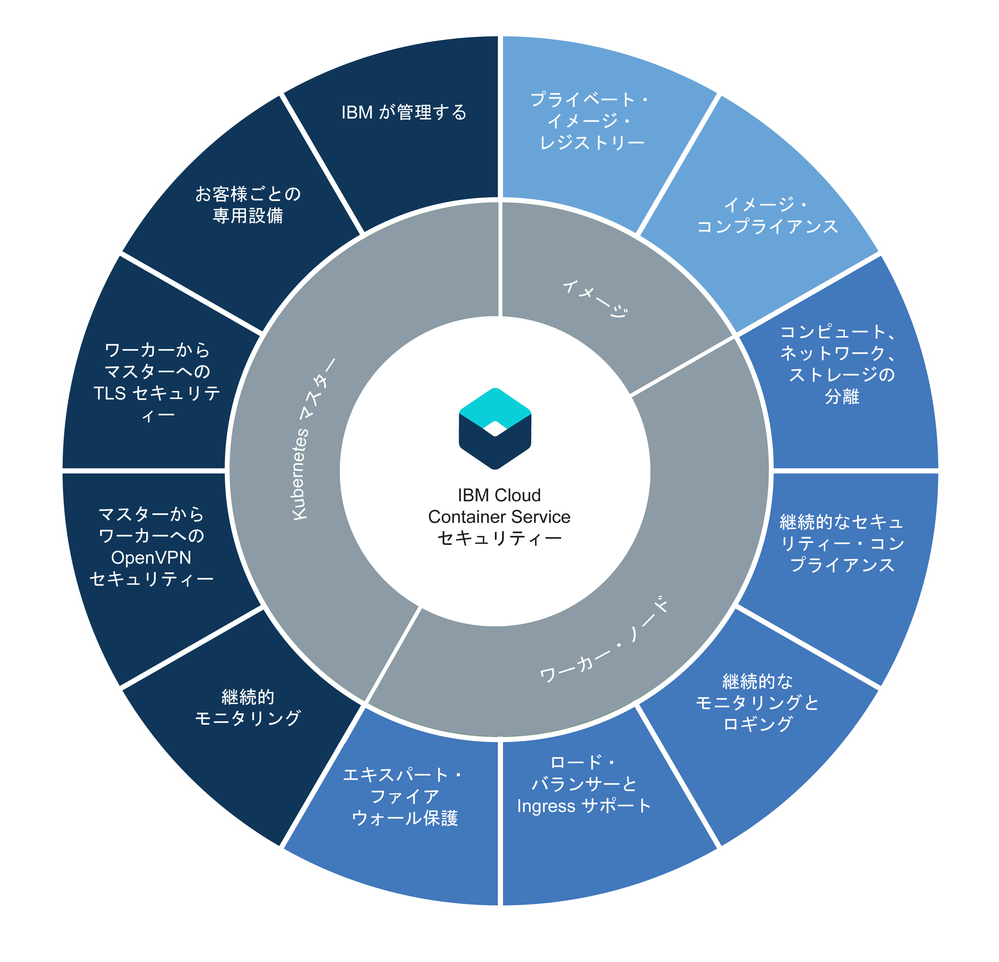

---

copyright:
  years: 2014, 2017
lastupdated: "2017-11-16"

---

{:new_window: target="_blank"}
{:shortdesc: .shortdesc}
{:screen: .screen}
{:pre: .pre}
{:table: .aria-labeledby="caption"}
{:codeblock: .codeblock}
{:tip: .tip}
{:download: .download}


# {{site.data.keyword.containerlong_notm}}のセキュリティー
{: #cs_security}

標準装備のセキュリティー・フィーチャーをリスク分析とセキュリティー保護に使用できます。
これらのフィーチャーは、クラスター・インフラストラクチャーとネットワーク通信を保護し、コンピュート・リソースを分離し、インフラストラクチャー・コンポーネントとコンテナー・デプロイメントにおけるセキュリティー・コンプライアンスを確保するためのものです。
{: shortdesc}

次の図には、セキュリティー・フィーチャーが、Kubernetes マスター、ワーカー・ノード、コンテナー・イメージのグループ別に示されています。  



  <table summary="表の 1 行目は 2 列にまたがっています。残りの行は左から右に読みます。1 列目はサーバーの場所、2 列目は対応する IP アドレスです。">
  <caption>セキュリティー・フィーチャー</caption>
  <thead>
  <th colspan=2> {{site.data.keyword.containershort_notm}} での組み込みのクラスター・セキュリティー設定</th>
  </thead>
  <tbody>
    <tr>
      <td>Kubernetes マスター</td>
      <td>各クラスターの Kubernetes マスターは IBM によって管理され、高い可用性を備えています。マスターには、セキュリティー・コンプライアンスを確保し、ワーカー・ノードとの間の通信を保護するための {{site.data.keyword.containershort_notm}} セキュリティー設定が含まれています。
更新は IBM が必要に応じて行います。専用 Kubernetes マスターは、クラスター内のすべての Kubernetes リソースを一元的に制御してモニターします。デプロイメント要件とクラスターの容量に基づき、Kubernetes マスターは、コンテナー化されたアプリが使用可能なワーカー・ノードにデプロイされるように自動的にスケジュール設定します。詳しくは、[Kubernetes マスターのセキュリティー](#cs_security_master)を参照してください。
</td>
    </tr>
    <tr>
      <td>ワーカー・ノード</td>
      <td>コンテナーはワーカー・ノードにデプロイされます。ワーカー・ノードは特定の 1 つのクラスターのために専用で使用されるので、IBM のお客様に提供されるコンピュート、ネットワーク、およびストレージがそれぞれ分離されます。
{{site.data.keyword.containershort_notm}} が備える組み込みセキュリティー機能により、プライベート・ネットワークとパブリック・ネットワークのワーカー・ノードのセキュリティーを維持し、ワーカー・ノードのセキュリティー・コンプライアンスを遵守できます。
詳しくは、[ワーカー・ノードのセキュリティー](#cs_security_worker)を参照してください。
さらに、[Calico ネットワーク・ポリシー](#cs_security_network_policies)を追加して、ワーカー・ノード上のポッドを出入りするネットワーク・トラフィックのどれを許可し、どれをブロックするかを指定することができます。</td>
     </tr>
     <tr>
      <td>イメージ</td>
      <td>クラスター管理者は、保護された独自の Docker イメージ・リポジトリーを {{site.data.keyword.registryshort_notm}} にセットアップできます。このレジストリーに Docker イメージを保管してクラスター・ユーザー間で共有することができます。安全にコンテナー・デプロイメントを行うために、プライベート・レジストリー内のすべてのイメージが Vulnerability Advisor によってスキャンされます。
Vulnerability Advisor は {{site.data.keyword.registryshort_notm}}のコンポーネントであり、潜在的な脆弱性がないかスキャンし、セキュリティーに関する推奨を行い、脆弱性を解決するための方法を提示します。詳しくは、[{{site.data.keyword.containershort_notm}} のイメージ・セキュリティー](#cs_security_deployment) を参照してください。</td>
    </tr>
  </tbody>
</table>

<br />


## Kubernetes マスター
{: #cs_security_master}

Kubernetes マスターを保護し、クラスター・ネットワーク通信をセキュリティーで保護するための Kubernetes マスターの組み込みセキュリティー機能について説明します。
{: shortdesc}

<dl>
  <dt>完全に管理される専用 Kubernetes マスター</dt>
    <dd>{{site.data.keyword.containershort_notm}} に含まれる Kubernetes クラスターはすべて、IBM が所有する IBM Cloud インフラストラクチャー (SoftLayer) アカウントで、IBM が管理する専用 Kubernetes マスターにより制御されます。Kubernetes マスターは、他の IBM のお客様とは共用されない、以下の専用コンポーネントを使用してセットアップされます。
<ul><li>etcd データ・ストア: サービス、デプロイメント、ポッドなどのクラスターのすべての Kubernetes リソースを保管します。
Kubernetes ConfigMaps および Secrets は、ポッドで実行されるアプリで使用できるように、キー値ペアとして保管されるアプリ・データです。
etcd のデータは IBM によって管理される暗号化ディスクに保管され、ポッドに送信されるときには TLS で暗号化されるので、データの保護と完全性が確保されます。
</li>
    <li>kube-apiserver: ワーカー・ノードから Kubernetes マスターへのすべての要求のメインエントリー・ポイントとなります。
kube-apiserver は要求を検証して処理し、etcd データ・ストアに対する読み取り/書き込みを行うことができます。
</li>
    <li>kube-scheduler: ポッドをどこにデプロイするかを決定します。このとき、キャパシティーとパフォーマンスのニーズ、ハードウェアとソフトウェアのポリシー制約、アンチアフィニティー仕様、およびワークロード要件が考慮されます。
要件に合致するワーカー・ノードが見つからなければ、ポッドはクラスターにデプロイされません。
</li>
    <li>kube-controller-manager: レプリカ・セットをモニターし、対応するポッドを作成して目的の状態を実現するためのコンポーネントです。
</li>
    <li>OpenVPN: {{site.data.keyword.containershort_notm}} 固有のコンポーネントであり、Kubernetes マスターからワーカー・ノードへのすべての通信のためのセキュア・ネットワーク接続を提供します。</li></ul></dd>
  <dt>ワーカー・ノードから Kubernetes マスターへのすべての通信のための TLS セキュア・ネットワーク接続</dt>
    <dd>Kubernetes マスターへのネットワーク通信を保護するために、{{site.data.keyword.containershort_notm}} によって TLS 証明書がクラスターごとに生成されます。これを使って kube-apiserver コンポーネントおよび etcd データ・ストア・コンポーネントとの間でやり取りされる通信が暗号化されます。
これらの証明書は、クラスター間で共有されたり、Kubernetes マスター・コンポーネント間で共有されたりすることはありません。
</dd>
  <dt>Kubernetes マスターからワーカー・ノードへのすべての通信のための OpenVPN セキュア・ネットワーク接続</dt>
    <dd>Kubernetes は、`https` プロトコルを使用して Kubernetes マスターとワーカー・ノードの間の通信を保護しますが、デフォルトでは、ワーカー・ノードで認証は行われません。
この通信を保護するために、{{site.data.keyword.containershort_notm}} は、クラスターの作成時に、Kubernetes マスターとワーカー・ノードの間の OpenVPN 接続を自動的にセットアップします。
</dd>
  <dt>継続的な Kubernetes マスター・ネットワーク・モニタリング</dt>
    <dd>どの Kubernetes マスターも IBM によって継続的にモニターされ、処理レベルのサービス妨害 (DOS) 攻撃を制御して対処します。
</dd>
  <dt>Kubernetes マスター・ノードのセキュリティー・コンプライアンス</dt>
    <dd>{{site.data.keyword.containershort_notm}} は、Kubernetes マスターがデプロイされたすべてのノードにおいて、マスター・ノードを確実に保護するために適用する必要がある Kubernetes と OS 固有のセキュリティー修正の対象となる脆弱性を自動的にスキャンします。
脆弱性が検出されると、{{site.data.keyword.containershort_notm}} はユーザーに代わって自動的に修正を適用し、脆弱性を解決します。
</dd>
</dl>

<br />


## ワーカー・ノード
{: #cs_security_worker}

ワーカー・ノード環境を保護し、リソース、ネットワーク、ストレージの分離を保証する組み込みのワーカー・ノード・セキュリティー機能について説明します。
{: shortdesc}

<dl>
  <dt>コンピュート、ネットワーク、およびストレージ・インフラストラクチャーの分離</dt>
    <dd>クラスターを作成すると、お客様の IBM Cloud インフラストラクチャー (SoftLayer) アカウントまたは IBM 提供の IBM Cloud インフラストラクチャー (SoftLayer) 専用アカウントに、仮想マシンがワーカー・ノードとしてプロビジョンされます。ワーカー・ノードは特定のクラスターの専用であり、他のクラスターのワークロードをホストすることはありません。</br>
ワーカー・ノードのネットワーク・パフォーマンスと分離の品質を保証するために、すべての {{site.data.keyword.Bluemix_notm}} アカウントには、IBM Cloud インフラストラクチャー (SoftLayer) VLAN がセットアップされます。</br>クラスターにデータを保持する場合は、IBM Cloud インフラストラクチャー (SoftLayer) の NFS ベースの専用ファイル・ストレージをプロビジョンし、このプラットフォームの組み込みデータ・セキュリティー機能を利用することができます。</dd>
  <dt>保護されたワーカー・ノードのセットアップ</dt>
    <dd>すべてのワーカー・ノードは Ubuntu オペレーティング・システムを使用してセットアップされ、ユーザーが変更することはできません。
ワーカー・ノードのオペレーティング・システムを潜在的な攻撃から保護するために、すべてのワーカー・ノードに、Linux iptable ルールによって適用されるエキスパート・ファイアウォール設定が構成されます。
</br> Kubernetes 上で実行されるコンテナーはすべて、定義済みの Calico ネットワーク・ポリシー設定で保護されます。この設定は、クラスター作成時にワーカー・ノードごとに構成されます。このようなセットアップにより、ワーカー・ノードとポッドの間のセキュア・ネットワーク通信が確保されます。コンテナーがワーカー・ノード上で実行できるアクションをさらに制限するために、ユーザーは、ワーカー・ノードについて [AppArmor ポリシー ](https://kubernetes.io/docs/tutorials/clusters/apparmor/) を構成することを選択できます。</br> デフォルトでは、ワーカー・ノード上の root ユーザーへの SSH アクセスは無効になっています。ワーカー・ノードに追加機能をインストールする場合、すべてのワーカー・ノードで実行するすべてのアクションについて [Kubernetes デーモン・セット ](https://kubernetes.io/docs/concepts/workloads/controllers/daemonset) を使用できます。また、1 回限りのアクションについては、[Kubernetes ジョブ ](https://kubernetes.io/docs/concepts/workloads/controllers/jobs-run-to-completion/) を使用できます。</dd>
  <dt>Kubernetes ワーカー・ノードのセキュリティー・コンプライアンス</dt>
    <dd>IBM は、社内と社外のセキュリティー顧問チームと協力して、セキュリティー・コンプライアンスにおける潜在的な脆弱性と取り組んでいます。オペレーティング・システムに更新プログラムやセキュリティー・パッチをデプロイするために、IBM はワーカー・ノードへの SSH アクセスを維持しています。</br> <b>重要</b>: ワーカー・ノードを定期的にリブートして、オペレーティング・システムに自動的にデプロイされた更新プログラムとセキュリティー・パッチがインストールされるようにします。ワーカー・ノードが IBM によってリブートされることはありません。</dd>
  <dt>IBM Cloud インフラストラクチャー (SoftLayer) ネットワーク・ファイアウォールのサポート</dt>
    <dd>{{site.data.keyword.containershort_notm}} は、すべての [ IBM Cloud インフラストラクチャー (SoftLayer) ファイアウォール・オファリング ](https://www.ibm.com/cloud-computing/bluemix/network-security) に対応しています。{{site.data.keyword.Bluemix_notm}} Public では、カスタム・ネットワーク・ポリシーをファイアウォールにセットアップして、
クラスターのための専用ネットワーク・セキュリティーを設定し、ネットワーク侵入を検出して対処することができます。例えば、ファイアウォールとして不要なトラフィックをブロックするように [Vyatta ](https://knowledgelayer.softlayer.com/topic/vyatta-1) をセットアップすることを選択できます。ファイアウォールをセットアップする場合は、マスター・ノードとワーカー・ノードが通信できるように、地域ごとに[必要なポートと IP アドレスを開く](#opening_ports)必要もあります。{{site.data.keyword.Bluemix_dedicated_notm}} では、ファイアウォール、DataPower、Fortigate、DNS が、標準の専用環境デプロイメントの一部として既に構成されています。</dd>
  <dt>サービスをプライベートにしておくか、サービスとアプリを選択的に公共のインターネットに公開する</dt>
    <dd>サービスとアプリをプライベートにして、このトピックで説明した組み込みのセキュリティー機能を利用して、ワーカー・ノードとポッドの間のセキュアな通信を確保することができます。
サービスとアプリを公共のインターネットに公開する場合は、Ingress とロード・バランサーのサポートを活用してサービスを安全に公開することができます。
</dd>
  <dt>ワーカー・ノードとアプリをオンプレミス・データ・センターにセキュアに接続する</dt>
    <dd>Vyatta Gateway Appliance または Fortigate Appliance をセットアップして、Kubernetes クラスターをオンプレミス・データ・センターに接続する IPSec VPN エンドポイントを構成できます。暗号化されたトンネルを介して、Kubernetes クラスターで実行されるすべてのサービスは、ユーザー・ディレクトリー、データベース、メインフレームなどのオンプレミス・アプリとセキュアに通信できます。詳しくは、[オンプレミス・データ・センターへのクラスターの接続 ](https://www.ibm.com/blogs/bluemix/2017/07/kubernetes-and-bluemix-container-based-workloads-part4/) を参照してください。</dd>
  <dt>クラスター・アクティビティーの継続的なモニタリングとロギング</dt>
    <dd>標準クラスターの場合、ワーカー・ノードの追加、ローリング更新の進行状況、キャパシティー使用状況情報などのすべてのクラスター関連イベントは、{{site.data.keyword.containershort_notm}} によってログに記録されてモニターされ、IBM のモニタリング・サービスとロギング・サービスに送られます。</dd>
</dl>

### ファイアウォールで必要なポートと IP アドレスを開く
{: #opening_ports}

ご使用のファイアウォールで特定のポートと IP アドレスを開く必要が生じる可能性のある、以下の状況を検討してください。
* ワーカー・ノードに対してファイアウォールがセットアップされているとき、またはファイアウォール設定が IBM Cloud インフラストラクチャー (SoftLayer) アカウント内でカスタマイズされたときに、Kubernetes マスターとワーカー・ノード間の通信を可能にする
* クラスターの外部からロード・バランサーまたは Ingress コントローラーにアクセスする
* プロキシーまたはファイアウォール経由の公共のインターネットのエンドポイントへのアクセスが企業ネットワーク・ポリシーによって禁止されているときに、ローカル・システムから `kubectl` コマンドを実行する

  1.  以下を実行して、クラスター内のすべてのワーカー・ノードのパブリック IP アドレスをメモします。

      ```
    bx cs workers <cluster_name_or_id>
    ```
      {: pre}

  2.  ファイアウォールで、ワーカー・ノードからのアウトバウンド接続として、ソース・ワーカー・ノードから、`<each_worker_node_publicIP>` の宛先 TCP/UDP ポート範囲 (20000 から 32767 まで) およびポート 443 への発信ネットワーク・トラフィック、および以下の IP アドレスとネットワーク・グループへの発信ネットワーク・トラフィックを許可します。
      - **重要**: ブートストラッピング・プロセスの際にロードのバランスを取るため、地域内のすべてのロケーションのために、ポート 443 への発信トラフィックを許可する必要があります。例えば、クラスターが米国南部にある場合、ポート 443 からすべてのロケーションの IP アドレス (dal10、dal12、dal13) へのトラフィックを許可する必要があります。
      <p>
  <table summary="表の 1 行目は 2 列にまたがっています。残りの行は左から右に読みます。1 列目はサーバーの場所、2 列目は対応する IP アドレスです。">
    <thead>
      <th>地域</th>
      <th>ロケーション</th>
      <th>IP アドレス</th>
      </thead>
    <tbody>
      <tr>
        <td>北アジア太平洋地域</td>
        <td>hkg02<br>tok02</td>
        <td><code>169.56.132.234</code><br><code>161.202.126.210</code></td>
       </tr>
      <tr>
         <td>南アジア太平洋地域</td>
         <td>mel01<br>syd01
<br>syd04</td>
         <td><code>168.1.97.67</code><br><code>168.1.8.195</code><br><code>130.198.64.19</code></td>
      </tr>
      <tr>
         <td>中欧</td>
         <td>ams03<br>fra02<br>par01</td>
         <td><code>169.50.169.110</code><br><code>169.50.56.174</code><br><code>159.8.86.149</code></td>
        </tr>
      <tr>
        <td>英国南部</td>
        <td>lon02<br>lon04</td>
        <td><code>159.122.242.78</code><br><code>158.175.65.170</code></td>
      </tr>
      <tr>
        <td>米国東部</td>
         <td>tor01<br>wdc06<br>wdc07</td>
         <td><code>169.53.167.50</code><br><code>169.60.73.142</code><br><code>169.61.83.62</code></td>
      </tr>
      <tr>
        <td>米国南部</td>
        <td>dal10<br>dal12<br>dal13</td>
        <td><code>169.46.7.238</code><br><code>169.47.70.10</code><br><code>169.60.128.2</code></td>
      </tr>
      </tbody>
    </table>
</p>

  3.  ワーカー・ノードから {{site.data.keyword.registrylong_notm}} への発信ネットワーク・トラフィックを許可します。
      - `TCP port 443 FROM <each_worker_node_publicIP> TO <registry_publicIP>`
      - <em>&lt;registry_publicIP&gt;</em> は、トラフィックを許可するレジストリー地域のすべてのアドレスに置き換えます。
        <p>
<table summary="表の 1 行目は 2 列にまたがっています。残りの行は左から右に読みます。1 列目はサーバーの場所、2 列目は対応する IP アドレスです。">
    <thead>
        <th>コンテナー地域</th>
        <th>レジストリー・アドレス</th>
        <th>レジストリー IP アドレス</th>
      </thead>
      <tbody>
        <tr>
          <td>北アジア太平洋地域、南アジア太平洋地域</td>
          <td>registry.au-syd.bluemix.net</td>
          <td><code>168.1.45.160/27</code></br><code>168.1.139.32/27</code></td>
        </tr>
        <tr>
          <td>中欧</td>
          <td>registry.eu-de.bluemix.net</td>
          <td><code>169.50.56.144/28</code></br><code>159.8.73.80/28</code></td>
         </tr>
         <tr>
          <td>英国南部</td>
          <td>registry.eu-gb.bluemix.net</td>
          <td><code>159.8.188.160/27</code></br><code>169.50.153.64/27</code></td>
         </tr>
         <tr>
          <td>米国東部、米国南部</td>
          <td>registry.ng.bluemix.net</td>
          <td><code>169.55.39.112/28</code></br><code>169.46.9.0/27</code></br><code>169.55.211.0/27</code></td>
         </tr>
        </tbody>
      </table>
</p>

  4.  オプション: ワーカー・ノードから {{site.data.keyword.monitoringlong_notm}} サービスと {{site.data.keyword.loganalysislong_notm}} サービスへの発信ネットワーク・トラフィックを許可します。
      - `TCP port 443, port 9095 FROM <each_worker_node_publicIP> TO <monitoring_publicIP>`
      - <em>&lt;monitoring_publicIP&gt;</em> は、トラフィックを許可するモニタリング地域のすべてのアドレスに置き換えます。
        <p><table summary="表の 1 行目は 2 列にまたがっています。残りの行は左から右に読みます。1 列目はサーバーの場所、2 列目は対応する IP アドレスです。">
    <thead>
        <th>コンテナー地域</th>
        <th>モニタリング・アドレス</th>
        <th>モニタリング IP アドレス</th>
        </thead>
      <tbody>
        <tr>
         <td>中欧</td>
         <td>metrics.eu-de.bluemix.net</td>
         <td><code>159.122.78.136/29</code></td>
        </tr>
        <tr>
         <td>英国南部</td>
         <td>metrics.eu-gb.bluemix.net</td>
         <td><code>169.50.196.136/29</code></td>
        </tr>
        <tr>
          <td>米国東部、米国南部、北アジア太平洋地域</td>
          <td>metrics.ng.bluemix.net</td>
          <td><code>169.47.204.128/29</code></td>
         </tr>
         
        </tbody>
      </table>
</p>
      - `TCP port 443, port 9091 FROM <each_worker_node_publicIP> TO <logging_publicIP>`
      - <em>&lt;logging_publicIP&gt;</em> は、トラフィックを許可するロギング地域のすべてのアドレスに置き換えます。
        <p><table summary="表の 1 行目は 2 列にまたがっています。残りの行は左から右に読みます。1 列目はサーバーの場所、2 列目は対応する IP アドレスです。">
    <thead>
        <th>コンテナー地域</th>
        <th>ロギング・アドレス</th>
        <th>ロギング IP アドレス</th>
        </thead>
      <tbody>
        <tr>
         <td>中欧</td>
         <td>ingest.logging.eu-de.bluemix.net</td>
         <td><code>169.50.25.125</code></td>
        </tr>
        <tr>
         <td>英国南部</td>
         <td>ingest.logging.eu-gb.bluemix.net</td>
         <td><code>169.50.115.113</code></td>
        </tr>
        <tr>
          <td>米国東部、米国南部、北アジア太平洋地域</td>
          <td>ingest.logging.ng.bluemix.net</td>
          <td><code>169.48.79.236</code><br><code>169.46.186.113</code></td>
         </tr>
        </tbody>
      </table>
</p>

  5. プライベート・ファイアウォールでは、IBM Cloud インフラストラクチャー (SoftLayer) のプライベート IP のために適切な範囲を許可します。[このリンク](https://knowledgelayer.softlayer.com/faq/what-ip-ranges-do-i-allow-through-firewall)の **Backend (private) Network** で始まるセクションを参照してください。
      - 使用している[地域内のロケーション](cs_regions.html#locations)をすべて追加します
      - dal01 のロケーション (データ・センター) を追加する必要があることに注意してください
      - ポート 80 および 443 を開いて、クラスターのブートストラッピング処理を可能にします

  6. オプション: VLAN の外部からロード・バランサーにアクセスするには、そのロード・バランサーの特定の IP アドレスで、着信ネットワーク・トラフィックのためのポートを開きます。

  7. オプション: VLAN の外部から Ingress コントローラーにアクセスするには、その Ingress コントローラーの特定の IP アドレスで、着信ネットワーク・トラフィックのためのポート 80 または 443 を開きます (どちらのポートを構成したかに応じて異なります)。

## ネットワーク・トラフィックをエッジ・ワーカー・ノードに制限する
{: #cs_edge}

クラスター内の複数のノードに `dedicated=edge` ラベルを追加して、Ingress とロード・バランサーがそれらのワーカー・ノードにのみデプロイされるようにします。

エッジ・ワーカー・ノードを使用すると、外部的にアクセスされるワーカー・ノードの数を減らし、ネットワーキングのワークロードを分離することができるので、クラスターのセキュリティーが改善されます。これらのワーカー・ノードがネットワーキング専用としてマーク付けされると、他のワークロードはワーカー・ノードの CPU やメモリーを消費してネットワーキングに干渉することがなくなります。

開始前に、以下のことを行います。

- [標準クラスターを作成します。](cs_cluster.html#cs_cluster_cli)
- クラスターに 1 つ以上のパブリック VLAN があることを確認してください。エッジ・ワーカー・ノードは、プライベート VLAN だけがあるクラスターには使用できません。
- [クラスターを Kubernetes CLI のターゲットとして設定](cs_cli_install.html#cs_cli_configure)します。


1. クラスター内のすべてのワーカー・ノードをリストします。**NAME** 列からプライベート IP アドレスを使用して、ノードを識別します。エッジ・ワーカー・ノードとするワーカー・ノードを 2 つ以上選択します。2 つ以上のワーカー・ノードを使用することにより、ネットワーキング・リソースの可用性が向上します。

  ```
  kubectl get nodes -L publicVLAN,privateVLAN,dedicated
  ```
  {: pre}

2. `dedicated=edge` により、ワーカー・ノードにラベルを付けます。`dedicated=edge` によりワーカー・ノードにマークが付けられると、すべての後続の Ingress とロード・バランサーは、エッジ・ワーカー・ノードにデプロイされます。

  ```
  kubectl label nodes <node_name> <node_name2> dedicated=edge
  ```
  {: pre}

3. クラスター内にあるすべての既存のロード・バランサー・サービスを検索します。

  ```
  kubectl get services --all-namespaces -o jsonpath='{range .items[*]}kubectl get service -n {.metadata.namespace} {.metadata.name} -o yaml | kubectl apply -f - :{.spec.type},{end}' | tr "," "\n" | grep "LoadBalancer" | cut -d':' -f1
  ```
  {: pre}

  出力:


  ```
  kubectl get service -n <namespace> <name> -o yaml | kubectl apply -f
  ```
  {: screen}

4. 直前のステップからの出力を使用して、それぞれの `kubectl get service` 行をコピーして貼り付けます。このコマンドは、ロード・バランサーをエッジ・ワーカー・ノードに再デプロイします。再デプロイする必要があるのは、パブリック・ロード・バランサーだけです。

  出力:


  ```
  service "<name>" configured
  ```
  {: screen}

`dedicated=edge` によりワーカー・ノードにラベルを付け、すべての既存のロード・バランサーと Ingress をエッジ・ワーカー・ノードに再デプロイしました。次に、他の[ワークロードがエッジ・ワーカー・ノードで実行されないように](#cs_edge_workloads)、そして[ワーカー・ノード上のノード・ポートへのインバウンド・トラフィックをブロックするように](#cs_block_ingress)します。

### ワークロードがエッジ・ワーカー・ノード上で実行されないようにする
{: #cs_edge_workloads}

エッジ・ワーカー・ノードの利点の 1 つは、これらのワーカー・ノードが、ネットワーク・サービスだけを実行するように指定できることです。`dedicated=edge` 耐障害性の使用は、すべてのロード・バランサーと Ingress サービスが、ラベルの付けられたワーカー・ノードにのみデプロイされることを意味します。ただし、他のワークロードがエッジ・ワーカー・ノード上で実行されてワーカー・ノードのリソースを消費することがないようにするため、[Kubernetes テイント ](https://kubernetes.io/docs/concepts/configuration/taint-and-toleration/) を使用する必要があります。

1. `edge` ラベルのあるすべてのワーカー・ノードをリストします。

  ```
  kubectl get nodes -L publicVLAN,privateVLAN,dedicated -l dedicated=edge
  ```
  {: pre}

2. テイントを各ワーカー・ノードに適用します。このテイントは、ポッドがワーカー・ノード上で実行されるのを防ぎ、`edge` ラベルのないポッドをワーカー・ノードから削除します。削除されるポッドは、容量のある他のワーカー・ノードに再デプロイされます。

  ```
  kubectl taint node <node_name> dedicated=edge:NoSchedule dedicated=edge:NoExecute
  ```

これで、`dedicated=edge` 耐障害性のあるポッドだけがエッジ・ワーカー・ノードにデプロイされます。

<br />


## ネットワーク・ポリシー
{: #cs_security_network_policies}

Kubernetes クラスターはそれぞれ、Calico と呼ばれるネットワーク・プラグインを使用してセットアップされます。各ワーカー・ノードのパブリック・ネットワーク・インターフェースを保護するために、デフォルトのネットワーク・ポリシーがセットアップされます。

固有のセキュリティー要件があるときには、Calico および Kubernetes のネイティブ機能を使用してクラスター用のネットワーク・ポリシーをさらに構成できます。
これらのネットワーク・ポリシーは、クラスター内のポッドを出入りするネットワーク・トラフィックのどれを許可し、どれをブロックするかを指定します。
{: shortdesc}

Calico と Kubernetes のネイティブ機能のいずれかを選んで、ご使用のクラスター用のネットワーク・ポリシーを作成することができます。
手始めには Kubernetes のネットワーク・ポリシーを使用することができますが、より堅牢な機能が必要であれば Calico のネットワーク・ポリシーを使用してください。

<ul>
  <li>[Kubernetes ネットワーク・ポリシー ](https://kubernetes.io/docs/concepts/services-networking/network-policies/): 相互通信できるポッドを指定するなど、いくつかの基本的なオプションが用意されています。特定のプロトコルとポートにおいて、着信ネットワーク・トラフィックを許可またはブロックできます。このトラフィックは、他のポッドに接続しようとしているポッドのラベルと Kubernetes 名前空間に基づいて、フィルターに掛けることができます。</br>これらのポリシーは
`kubectl` コマンドまたは Kubernetes API を使用して適用できます。これらのポリシーが適用されると、Calico ネットワーク・ポリシーに変換され、Calico がこれらのポリシーを実施します。</li>
  <li>[Calico ネットワーク・ポリシー ](http://docs.projectcalico.org/v2.4/getting-started/kubernetes/tutorials/advanced-policy): これらのポリシーは Kubernetes ネットワーク・ポリシーのスーパーセットであり、Kubernetes のネイティブ機能に以下の機能を追加して拡張したものです。
</li>
    <ul><ul><li>Kubernetes ポッドのトラフィックだけではなく、特定のネットワーク・インターフェース上のネットワーク・トラフィックを許可またはブロックします。
</li>
    <li>着信 (ingress) および発信 (egress) ネットワーク・トラフィックを許可またはブロックします。</li>
    <li>[LoadBalancer サービスまたは NodePort Kubernetes サービスへの着信 (ingress) トラフィックをブロックします](#cs_block_ingress)。</li>
    <li>送信元または宛先 IP アドレスまたは CIDR に基づき、トラフィックを許可またはブロックします。</li></ul></ul></br>

これらのポリシーは `calicoctl` コマンドを使用して適用されます。Calico は Kubernetes ワーカー・ノード上に Linux iptables 規則をセットアップすることによって、これらのポリシーを実施しますが、これには Calico ポリシーに変換された Kubernetes ネットワーク・ポリシーも含まれます。
iptables 規則はワーカー・ノードのファイアウォールとして機能し、ネットワーク・トラフィックがターゲット・リソースに転送されるために満たさなければならない特性を定義します。
</ul>


### デフォルト・ポリシーの構成
{: #concept_nq1_2rn_4z}

クラスターの作成時には、各ワーカー・ノードのパブリック・ネットワーク・インターフェース用のデフォルトのネットワーク・ポリシーが自動的にセットアップされ、パブリック・インターネットからのワーカー・ノードの着信トラフィックを制限します。
これらのポリシーはポッド間のトラフィックには影響せず、Kubernetes ノードポート、ロード・バランサー、入口サービスへのアクセスを許可するためにセットアップされます。

デフォルト・ポリシーはポッドに直接、適用されるわけではありません。Calico host エンドポイント を使用して、ワーカー・ノードのパブリック・ネットワーク・インターフェースに適用されます。ホストのエンドポイントが Calico に作成されると、そのワーカー・ノードのネットワーク・インターフェースを出入りするトラフィックは、ポリシーによってそのトラフィックが許可されていない限り、すべてブロックされます。


SSH を許可するポリシーは存在せず、そのため、パブリック・ネットワーク・インターフェースによる SSH アクセスはブロックされることに気を付けてください。これはポートを開くためのポリシーを持たない、他のすべてのポートも同様です。
SSH アクセスと他のアクセスは、各ワーカー・ノードのプライベート・ネットワーク・インターフェースで使用可能です。


**重要:** ポリシーを十分に理解していない限り、かつ、ポリシーにより許可されるトラフィックが必要ないと判断できるのでない限り、ホストのエンドポイントに適用されるポリシーを削除しないでください。


 <table summary="表の 1 行目は 2 列にまたがっています。残りの行は左から右に読みます。1 列目はサーバーの場所、2 列目は対応する IP アドレスです。">
    <thead>
  <th colspan=2> 各クラスターのデフォルト・ポリシー</th>
  </thead>
  <tbody>
    <tr>
      <td><code>allow-all-outbound</code></td>
      <td>すべてのアウトバウンド・トラフィックを許可します。</td>
    </tr>
    <tr>
      <td><code>allow-bixfix-port</code></td>
      <td>必要なワーカー・ノードの更新が可能になるように、bigfix アプリへの着信トラフィックをポート 52311 で許可します。</td>
    </tr>
    <tr>
      <td><code>allow-icmp</code></td>
      <td>すべての着信 icmp パケット (ping) を許可します。</td>
     </tr>
    <tr>
      <td><code>allow-node-port-dnat</code></td>
      <td>着信ノードポート、ロード・バランサー、およびサービスが公開されるポッドへの入口サービス・トラフィックを許可します。
Kubernetes ではサービス要求を正しいポッドに転送するために宛先ネットワーク・アドレス変換 (DNAT) を使用するため、それらのサービスがパブリック・インターフェースで公開されるポートは指定する必要がないことに気を付けてください。
ホストのエンドポイント・ポリシーが iptables で適用される前に、その転送が実行されます。</td>
   </tr>
   <tr>
      <td><code>allow-sys-mgmt</code></td>
      <td>ワーカー・ノードを管理するために使用される特定の IBM Cloud インフラストラクチャー (SoftLayer) システムの着信接続を許可します。</td>
   </tr>
   <tr>
    <td><code>allow-vrrp</code></td>
    <td>ワーカー・ノード間の仮想 IP アドレスのモニターと移動に使用される vrrp パケットを許可します。
</td>
   </tr>
  </tbody>
</table>


### ネットワーク・ポリシーの追加
{: #adding_network_policies}

ほとんどの場合、デフォルト・ポリシーは変更する必要がありません。拡張シナリオのみ、変更が必要な場合があります。
変更が必要であるとわかった場合は、Calico CLI をインストールし、独自のネットワーク・ポリシーを作成します。


開始前に、以下のことを行います。

1.  [{{site.data.keyword.containershort_notm}} および Kubernetes CLI をインストールします。](cs_cli_install.html#cs_cli_install)
2.  [ライト・クラスターまたは標準クラスターを作成します。](cs_cluster.html#cs_cluster_ui)
3.  [クラスターを Kubernetes CLI のターゲットとして設定](cs_cli_install.html#cs_cli_configure)します。`bx cs cluster-config` コマンドで `--admin` オプションを指定します。これは、証明書および許可ファイルのダウンロードに使用されます。
このダウンロードには、Calico コマンドの実行に必要なスーパーユーザー役割の鍵も含まれています。

  ```
  bx cs cluster-config <cluster_name> --admin
  ```
  {: pre}

  **注**: Calico CLI バージョン 1.6.1 がサポートされています。

ネットワーク・ポリシーを追加するには、以下のようにします。
1.  Calico CLI をインストールします。
    1.  [Calico CLI ](https://github.com/projectcalico/calicoctl/releases/tag/v1.6.1) をダウンロードします。

        **ヒント:** Windows を使用している場合、Calico CLI を {{site.data.keyword.Bluemix_notm}} CLI と同じディレクトリーにインストールします。このようにセットアップすると、後でコマンドを実行するとき、ファイル・パスの変更を行う手間がいくらか少なくなります。


    2.  OSX と Linux のユーザーは、以下の手順を実行してください。

        1.  実行可能ファイルを /usr/local/bin ディレクトリーに移動します。
            -   Linux:


              ```
mv /<path_to_file>/calicoctl /usr/local/bin/calicoctl```
              {: pre}

            -   OS X:

              ```
              mv /<path_to_file>/calicoctl-darwin-amd64 /usr/local/bin/calicoctl
              ```
              {: pre}

        2.  ファイルを実行可能にします。

            ```
chmod +x /usr/local/bin/calicoctl```
            {: pre}

    3.  Calico CLI クライアントのバージョンを調べて、`calico` コマンドが正常に実行されたことを確認します。

        ```
calicoctl version```
        {: pre}

2.  Calico CLI を構成します。

    1.  Linux および OS X の場合、`/etc/calico` ディレクトリーを作成します。Windows の場合は、どのディレクトリーを使用しても構いません。

      ```
      sudo mkdir -p /etc/calico/
      ```
      {: pre}

    2.  `calicoctl.cfg` ファイルを作成します。
        -   Linux および OS X:

          ```
sudo vi /etc/calico/calicoctl.cfg```
          {: pre}

        -   Windows の場合: テキスト・エディターでファイルを作成します。

    3.  <code>calicoctl.cfg</code> ファイルに次の情報を入力します。

        ```
      apiVersion: v1
      kind: calicoApiConfig
      metadata:
      spec:
          etcdEndpoints: <ETCD_URL>
          etcdKeyFile: <CERTS_DIR>/admin-key.pem
          etcdCertFile: <CERTS_DIR>/admin.pem
          etcdCACertFile: <CERTS_DIR>/<ca-*pem_file>
      ```
        {: codeblock}

        1.  `<ETCD_URL>` を取得します。このコマンドが `calico-config not found` エラーで失敗した場合は、この[トラブルシューティング・トピック](cs_troubleshoot.html#cs_calico_fails)を参照してください。

          -   Linux および OS X:

              ```
              kubectl get cm -n kube-system calico-config -o yaml | grep "etcd_endpoints:" | awk '{ print $2 }'
              ```
              {: pre}

          -   出力例:

              ```
https://169.1.1.1:30001```
              {: screen}

          -   Windows:<ol>
            <li>calico 構成値を構成マップから取得します。</br><pre class="codeblock"><code>kubectl get cm -n kube-system calico-config -o yaml</code></pre></br>
            <li>`data` セクションで、etcd_endpoints 値を見つけます。例: <code>https://169.1.1.1:30001</code>
            </ol>

        2.  `<CERTS_DIR>` (Kubernetes 証明書をダウンロードしたディレクトリー) を取得します。

            -   Linux および OS X:

              ```
dirname $KUBECONFIG```
              {: pre}

                出力例:

              ```
              /home/sysadmin/.bluemix/plugins/container-service/clusters/<cluster_name>-admin/
              ```
              {: screen}

            -   Windows:

              ```
              ECHO %KUBECONFIG%
              ```
              {: pre}

                出力例:

              ```
              C:/Users/<user>/.bluemix/plugins/container-service/<cluster_name>-admin/kube-config-prod-<location>-<cluster_name>.yml
              ```
              {: screen}

            **注**: ディレクトリー・パスを取得するには、出力の最後からファイル名 `kube-config-prod-<location>-<cluster_name>.yml` を除きます。

        3.  
<code>ca-*pem_file<code> を取得します。

            -   Linux および OS X:

              ```
              ls `dirname $KUBECONFIG` | grep "ca-"
              ```
              {: pre}

            -   Windows:<ol><li>最後のステップで取得したディレクトリーを開きます。</br><pre class="codeblock"><code>C:\Users\<user>\.bluemix\plugins\container-service\&lt;cluster_name&gt;-admin\</code></pre>
              <li> <code>ca-*pem_file</code> ファイルを見つけます。</ol>

        4.  Calico 構成が正常に動作していることを確認します。


            -   Linux および OS X:

              ```
calicoctl get nodes```
              {: pre}

            -   Windows:

              ```
              calicoctl get nodes --config=<path_to_>/calicoctl.cfg
              ```
              {: pre}

              出力:


              ```
              NAME
              kube-dal10-crc21191ee3997497ca90c8173bbdaf560-w1.cloud.ibm
              kube-dal10-crc21191ee3997497ca90c8173bbdaf560-w2.cloud.ibm
              kube-dal10-crc21191ee3997497ca90c8173bbdaf560-w3.cloud.ibm
              ```
              {: screen}

3.  既存のネットワーク・ポリシーを調査します。

    -   Calico ホスト・エンドポイントを表示します。


      ```
calicoctl get hostendpoint -o yaml```
      {: pre}

    -   そのクラスター用に作成されたすべての Calico および Kubernetes ネットワーク・ポリシーを表示します。
このリストにはどのポッドやホストにもまだ適用されていない可能性のあるポリシーも含まれています。ネットワーク・ポリシーを実施するには、
Calico ネットワーク・ポリシーで定義されたセレクターに一致する Kubernetes リソースを見つける必要があります。

      ```
calicoctl get policy -o wide```
      {: pre}

    -   ネットワーク・ポリシーの詳細を表示します。


      ```
      calicoctl get policy -o yaml <policy_name>
      ```
      {: pre}

    -   そのクラスター用のすべてのネットワーク・ポリシーの詳細を表示します。


      ```
calicoctl get policy -o yaml```
      {: pre}

4.  トラフィックを許可またはブロックする Calico ネットワーク・ポリシーを作成します。

    1.  構成スクリプト (.yaml) を作成して、独自の [Calico ネットワーク・ポリシー ](http://docs.projectcalico.org/v2.1/reference/calicoctl/resources/policy) を定義します。これらの構成ファイルにはどのポッド、名前空間、またはホストにこれらのポリシーを適用するかを説明するセレクターが含まれます。独自のポリシーを作成するときには、こちらの[サンプル Calico ポリシー ](http://docs.projectcalico.org/v2.0/getting-started/kubernetes/tutorials/advanced-policy) を参考にしてください。

    2.  ポリシーをクラスターに適用します。
        -   Linux および OS X:

          ```
          calicoctl apply -f <policy_file_name.yaml>
          ```
          {: pre}

        -   Windows:

          ```
          calicoctl apply -f <path_to_>/<policy_file_name.yaml> --config=<path_to_>/calicoctl.cfg
          ```
          {: pre}

### LoadBalancer サービスまたは NodePort サービスへの着信トラフィックをブロックします。
{: #cs_block_ingress}

デフォルトで、Kubernetes の `NodePort` サービスと `LoadBalancer` サービスは、パブリックとプライベートのすべてのクラスター・インターフェースでアプリを利用可能にするために設計されています。ただし、トラフィックのソースや宛先に基づいて、サービスへの着信トラフィックをブロックすることもできます。トラフィックをブロックするには、Calico `preDNAT` ネットワーク・ポリシーを作成します。

Kubernetes の LoadBalancer サービスは NodePort サービスでもあります。LoadBalancer サービスにより、ロード・バランサーの IP アドレスとポート上でアプリが利用可能になり、サービスのノード・ポート上でアプリが利用可能になります。ノード・ポートは、クラスター内のすべてのノードのすべての IP アドレス (パブリックとプライベート) でアクセス可能です。

クラスター管理者は、Calico `preDNAT` ネットワーク・ポリシーを使用して以下のものをブロックできます。

  - NodePort サービスへのトラフィック。LoadBalancer サービスへのトラフィックは許可されます。
  - ソース・アドレスまたは CIDR に基づくトラフィック。

Calico `preDNAT` ネットワーク・ポリシーのいくつかの一般的な使用方法:

  - プライベート LoadBalancer サービスのパブリック・ノード・ポートへのトラフィックをブロックする。
  - [エッジ・ワーカー・ノード](#cs_edge)を実行しているクラスター上のパブリック・ノード・ポートへのトラフィックをブロックする。ノード・ポートをブロックすることにより、エッジ・ワーカー・ノードだけが着信トラフィックを扱うワーカー・ノードとなります。

`preDNAT` ネットワーク・ポリシーは便利なポリシーです。なぜなら、デフォルトの Kubernetes ポリシーと Calico ポリシーでは、保護する Kubernetes の NodePort サービスと LoadBalancer サービスに対して生成された DNAT iptables 規則があるために、それらのサービスに対してポリシーを適用するのが困難であるためです。

Calico `preDNAT` ネットワーク・ポリシーは、[Calico ネットワーク・ポリシー・リソース ](https://docs.projectcalico.org/v2.4/reference/calicoctl/resources/policy) に基づいて、iptables 規則を生成します。


1. Kubernetes サービスへの ingress アクセスのための、Calico `preDNAT` ネットワーク・ポリシーを定義します。

  すべてのノード・ポートをブロックする例:

  ```
  apiVersion: v1
  kind: policy
  metadata:
    name: deny-kube-node-port-services
  spec:
    preDNAT: true
    selector: ibm.role in { 'worker_public', 'master_public' }
    ingress:
    - action: deny
      protocol: tcp
      destination:
        ports:
        - 30000:32767
    - action: deny
      protocol: udp
      destination:
        ports:
        - 30000:32767
  ```
  {: codeblock}

2. Calico preDNAT ネットワーク・ポリシーを適用します。ポリシーの変更内容がクラスター全体に適用されるまでには約 1 分かかります。


  ```
  calicoctl apply -f deny-kube-node-port-services.yaml
  ```
  {: pre}

<br />


## イメージ
{: #cs_security_deployment}

標準装備のセキュリティー・フィーチャーを使用して、イメージのセキュリティーと保全性を管理します。
{: shortdesc}

### {{site.data.keyword.registryshort_notm}} の保護された Docker プライベート・イメージ・リポジトリー:

 IBM がホストおよび管理するマルチテナントで可用性が高く拡張可能なプライベート・イメージ・レジストリー内に独自の Docker イメージ・リポジトリーをセットアップし、Docker イメージを作成して安全に保管し、クラスター・ユーザー間で共有することができます。

### イメージのセキュリティー・コンプライアンス:

{{site.data.keyword.registryshort_notm}}を使用する際、Vulnerability Advisor に標準装備のセキュリティー・スキャンを利用できます。名前空間にプッシュされるどのイメージも、CentOS、Debian、Red Hat、および Ubuntu の既知の問題のデータベースに基づいて、脆弱性が自動的にスキャンされます。脆弱性が検出されると、それらを解決してイメージの保全性とセキュリティーを確保する方法を Vulnerability Advisor が提示します。


イメージの脆弱性評価を表示する方法については、[Vulnerability Advisor の文書を参照してください](/docs/services/va/va_index.html#va_registry_cli)。
