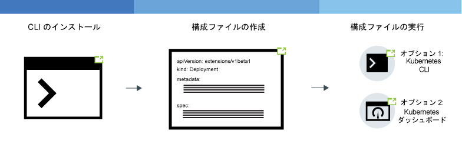

---

copyright:
  years: 2014, 2019
lastupdated: "2019-06-11"

keywords: kubernetes, iks, node.js, js, java, .net, go, flask, react, python, swift, rails, ruby, spring boot, angular

subcollection: containers

---

{:new_window: target="_blank"}
{:shortdesc: .shortdesc}
{:screen: .screen}
{:pre: .pre}
{:table: .aria-labeledby="caption"}
{:codeblock: .codeblock}
{:tip: .tip}
{:note: .note}
{:important: .important}
{:deprecated: .deprecated}
{:download: .download}
{:preview: .preview}


# Kubernetes ネイティブ・アプリをクラスターにデプロイする
{: #app}

{{site.data.keyword.containerlong}} で Kubernetes の技法を利用して、アプリをコンテナーにデプロイし、それらのアプリを常に稼働させることができます。 例えば、ダウン時間なしでローリング更新とロールバックを実行できます。 Kubernetes は、特定の言語またはアプリに依存しない、拡張可能なコンテナー・オーケストレーション・プラットフォームです。そのため、任意の言語で作成されたステートレス・アプリ、ステートフル・アプリ、データ処理アプリなど、さまざまなワークロードを実行できます。
{: shortdesc}

次のイメージの領域をクリックして、アプリをデプロイするための一般的な手順を確認してください。 基礎を最初に学びますか? [アプリのデプロイ・チュートリアル](/docs/containers?topic=containers-cs_apps_tutorial#cs_apps_tutorial)をお試しください。


<map name="d62e18" id="d62e18">
<area href="/docs/containers?topic=containers-cs_cli_install" target="_blank" alt="CLI をインストールします。" title="CLI をインストールします。" shape="rect" coords="30, 69, 179, 209" />
<area href="https://kubernetes.io/docs/concepts/configuration/overview/" target="_blank" alt="アプリの構成ファイルを作成します。Kubernetes のベスト・プラクティスを確認します。" title="アプリの構成ファイルを作成します。Kubernetes のベスト・プラクティスを確認します。" shape="rect" coords="254, 64, 486, 231" />
<area href="#app_cli" target="_blank" alt="オプション 1: Kubernetes CLI から構成ファイルを実行します。" title="オプション 1: Kubernetes CLI から構成ファイルを実行します。" shape="rect" coords="544, 67, 730, 124" />
<area href="#cli_dashboard" target="_blank" alt="オプション 2: Kubernetes ダッシュボードをローカルで開始し、構成ファイルを実行します。" title="オプション 2: Kubernetes ダッシュボードをローカルで開始し、構成ファイルを実行します。" shape="rect" coords="544, 141, 728, 204" />
</map>

<br />


## クラスターでアプリを実行する計画
{: #plan_apps}

アプリを {{site.data.keyword.containerlong_notm}} クラスターにデプロイする前に、アプリの適切な利用を可能にして、アプリと {{site.data.keyword.Bluemix_notm}} の他のサービスの統合も可能にするセットアップを決定しておく必要があります。
{:shortdesc}

### どのようなタイプの Kubernetes オブジェクトをアプリ用に作成できますか?
{: #object}

アプリ YAML ファイルを準備するとき、アプリの可用性、パフォーマンス、セキュリティーを高めるための多くの選択肢があります。 例えば、1 つのポッドを用意する代わりに、Kubernetes コントローラー・オブジェクトを使用してレプリカ・セット、ジョブ、デーモン・セットなどのワークロードを管理できます。 ポッドとコントローラーについて詳しくは、[Kubernetes の資料 ](https://kubernetes.io/docs/concepts/workloads/pods/pod-overview/) を参照してください。 ポッドのレプリカ・セットを管理するデプロイメントは、アプリの一般的なユース・ケースです。
{: shortdesc}

例えば、`kind: Deployment` オブジェクトは、アプリ・ポッドをデプロイするための良い選択です。このオブジェクトを使用すると、ポッドの可用性を高めたい場合にレプリカ・セットを指定できるからです。

次の表は、Kubernetes ワークロード・オブジェクトを作成する場合にそのタイプはさまざまである理由を示しています。

| オブジェクト | 説明 |
| --- | --- |
| [`Pod` ](https://kubernetes.io/docs/concepts/workloads/pods/pod/) | ポッドはワークロードの最小デプロイ可能単位であり、単一または複数のコンテナーを保持できます。 コンテナーと同様、ポッドは処分できるように設計されており、アプリ機能の単体テストによく使用されます。 アプリのダウン時間を回避するために、デプロイメントなどの Kubernetes コントローラーを使用してポッドをデプロイすることを検討してください。 デプロイメントは、複数のポッド、レプリカ、ポッド・スケーリング、ロールアウトなどの管理に役立ちます。 |
| [`ReplicaSet` ](https://kubernetes.io/docs/concepts/workloads/controllers/replicaset/) | レプリカ・セットは、ポッドの複数のレプリカが実行されるようにして、ポッドがダウンした場合にポッドをスケジュール変更します。 ポッドのスケジューリングの動作をテストするためにレプリカ・セットを作成することもできますが、アプリの更新、ロールアウト、スケーリングを管理するには、代わりにデプロイメントを作成してください。 |
| [`Deployment` ](https://kubernetes.io/docs/concepts/workloads/controllers/deployment/) | デプロイメントは、ポッド、またはポッド・テンプレートの[レプリカ・セット ](https://kubernetes.io/docs/concepts/workloads/controllers/replicaset/) を管理するコントローラーです。 デプロイメントなしでポッドまたはレプリカ・セットを作成してアプリ機能をテストすることもできます。 実動レベルのセットアップでは、デプロイメントを使用して、アプリの更新、ロールアウト、スケーリングを管理してください。 |
| [`StatefulSet` ](https://kubernetes.io/docs/concepts/workloads/controllers/statefulset/) | デプロイメントと同様、ステートフル・セットはポッドのレプリカ・セットを管理するコントローラーです。 デプロイメントと違って、ステートフル・セットでは、スケジュール変更後も状態を維持する固有のネットワーク ID がポッドに設定されます。 クラウドでワークロードを実行する場合は、[ステートレスになるようにアプリを設計](/docs/containers?topic=containers-strategy#cloud_workloads)するようにしてください。こうすることで、サービス・インスタンスが相互に独立して実行され、障害が発生してもサービスが中断されなくなります。 ただし、データベースなど、アプリによってはステートフルでなければならないものもあります。 そのような場合は、ステートフル・セットを作成し、ステートフル・セットの永続ストレージとして[ファイル](/docs/containers?topic=containers-file_storage#file_statefulset)・ストレージ、[ブロック](/docs/containers?topic=containers-block_storage#block_statefulset)・ストレージ、または[オブジェクト](/docs/containers?topic=containers-object_storage#cos_statefulset)・ストレージを使用することを検討してください。 また、ベアメタル・ワーカー・ノード上に [Portworx](/docs/containers?topic=containers-portworx) をインストールし、高可用性のソフトウェア定義ストレージ・ソリューションとして Portworx を使用して、ステートフル・セット用の永続ストレージを管理することができます。 |
| [`DaemonSet` ](https://kubernetes.io/docs/concepts/workloads/controllers/daemonset/) | クラスター内のどのワーカー・ノードでも同じポッドを実行する必要がある場合は、デーモン・セットを使用します。 クラスターにワーカー・ノードが追加されると、デーモン・セットによって管理されるポッドが自動的にスケジュールされます。 代表的なユース・ケースとしては、`logstash` や `prometheus` などのログ・コレクターがあります。これらのログ・コレクターは、各ワーカー・ノードからログを収集して、クラスターまたはアプリの正常性に関する洞察を提供します。 |
| [`Job` ](https://kubernetes.io/docs/concepts/workloads/controllers/jobs-run-to-completion/) | ジョブは、1 つ以上のポッドが完了まで正常に実行されるようにします。 キューやバッチ・ジョブのためのジョブを使用して、別々に分かれてはいても関連しているワークアイテム (例えば、レンダリングする一定数のフレーム、送信する E メール、変換するファイルなど) の並列処理をサポートすることもできます。 特定の時刻に実行されるようにジョブをスケジュールするには、[`CronJob` ](https://kubernetes.io/docs/concepts/workloads/controllers/cron-jobs/) を使用します。|
{: caption="作成できる Kubernetes ワークロード・オブジェクトのタイプ。" caption-side="top"}

### どうすれば Kubernetes アプリ構成に機能を追加できますか?
デプロイメントに何を含めることができるかについては、[YAML ファイルでのアプリ要件の指定](#app_yaml)を参照してください。 例として、以下が挙げられます。
* [レプリカ・セット](#replicaset)
* [ラベル](#label)
* [アフィニティー](#affinity)
* [イメージ・ポリシー](#image)
* [ポート](#port)
* [リソースの要求と制限](#resourcereq)
* [Liveness Probe と Readiness Probe](#probe)
* アプリ・サービスをポートで公開するための[サービス](#app-service)
* コンテナー環境変数を設定するための[構成マップ](#configmap)
* コンテナー環境変数を設定するための[シークレット](#secret)
* ストレージのコンテナーにマウントされる[永続ボリューム](#pv)

### Kubernetes アプリ構成で変数を使用するにはどうすればよいですか? 変数を YAML に追加するには、どのようにすればいいですか?
{: #variables}

YAML ファイルにデータをハードコーディングするのではなくデプロイメントに変数情報を追加するには、Kubernetes の [`ConfigMap` ](https://kubernetes.io/docs/tasks/configure-pod-container/configure-pod-configmap/) または [`Secret` ](https://kubernetes.io/docs/concepts/configuration/secret/) オブジェクトを使用します。
{: shortdesc}

構成マップまたはシークレットを取り込むには、それをポッドにマウントする必要があります。 構成マップまたはシークレットは、ポッドが実行される直前にポッドと結合されます。 デプロイメントの仕様とイメージを多くのアプリで再利用できますが、その後、カスタマイズした構成マップとシークレットをスワップアウトすることもできます。 特にシークレットはローカル・ノード上のストレージを大量に専有する場合があるため、適宜計画してください。

どちらのリソースでもキーと値のペアが定義されますが、状況に応じて使い分けてください。

<dl>
<dt>構成マップ</dt>
<dd>デプロイメントで指定されたワークロードに機密性の高くない構成情報を提供します。 主に 3 つの方法で構成マップを使用できます。
<ul><li><strong>ファイル・システム</strong>: ファイル全体または変数セットをポッドにマウントできます。 値に設定されたファイルのキー名の内容に基づいて、エントリーごとにファイルが作成されます。</li>
<li><strong>環境変数</strong>: コンテナー仕様の環境変数を動的に設定します。</li>
<li><strong>コマンド・ライン引数</strong>: コンテナー仕様で使用されるコマンド・ライン引数を設定します。</li></ul></dd>

<dt>秘密鍵</dt>
<dd>以下のような機密情報をワークロードに提供します。 クラスターの他のユーザーがシークレットに対するアクセス権限を持っている場合があるため、シークレット情報はそれらのユーザーと共有される可能性があることを知っておいてください。
<ul><li><strong>個人情報 (PII)</strong>: E メール・アドレスなどの機密情報や、企業コンプライアンスや政府規制に必要な他のタイプの情報をシークレットに保管します。</li>
<li><strong>資格情報</strong>: 偶発的機密漏れのリスクを軽減するために、パスワード、鍵、トークンなどの資格情報をシークレットに入れます。 例えば、クラスターに[サービスをバインドする](/docs/containers?topic=containers-service-binding#bind-services)と、シークレットに資格情報が保管されます。</li></ul></dd>
</dl>

シークレットをさらに保護したいですか? クラスター管理者に連絡してクラスター内の [{{site.data.keyword.keymanagementservicefull}} を有効にして](/docs/containers?topic=containers-encryption#keyprotect)もらい、新しいシークレットと既存のシークレットを暗号化します。
{: tip}

### どうすれば Watson などの IBM サービスをアプリに追加できますか?
[アプリへのサービスの追加](/docs/containers?topic=containers-service-binding#adding_app)を参照してください。

### どうすれば正しいリソースをアプリで得られますか?
[アプリ YAML ファイルを指定する](#app_yaml)ときに、正しいリソースをアプリが取得できるようにする Kubernetes 機能をアプリ構成に追加できます。 特に、YAML ファイルで定義されたコンテナーごとに、[リソースの制限と要求を設定 ](https://kubernetes.io/docs/concepts/configuration/manage-compute-resources-container/) してください。
{: shortdesc}

さらに、アプリ・デプロイメントに影響を与える可能性がある以下のようなリソース制御をクラスター管理者がセットアップすることもできます。
*  [リソース割り当て量 ](https://kubernetes.io/docs/concepts/policy/resource-quotas/)
*  [ポッドの優先度](/docs/containers?topic=containers-pod_priority#pod_priority)

### どうすればアプリにアクセスできますか?
[`clusterIP` サービスを使用する](/docs/containers?topic=containers-cs_network_planning#in-cluster)ことによって、クラスター内のアプリにプライベートでアクセスできます。
{: shortdesc}

アプリをパブリックに公開する場合は、クラスター・タイプに依存するいくつかのオプションがあります。
*  **フリー・クラスター**: [NodePort サービス](/docs/containers?topic=containers-nodeport#nodeport)を使用することによって、アプリを公開できます。
*  **標準クラスター**: [NodePort サービス、ロード・バランサー・サービス、または Ingress サービス](/docs/containers?topic=containers-cs_network_planning#external)を使用することによって、アプリを公開できます。
*  **Calico を使用してプライベートになったクラスター**: [NodePort サービス、ロード・バランサー・サービス、または Ingressサービス](/docs/containers?topic=containers-cs_network_planning#private_both_vlans)を使用することによって、アプリを公開できます。 同時に、パブリック・ノード・ポートをブロックするために、Calico preDNAT ネットワーク・ポリシーを使用する必要もあります。
*  **プライベート VLAN 専用標準クラスター**: [NodePort サービス、ロード・バランサー・サービス、または Ingress サービス ](/docs/containers?topic=containers-cs_network_planning#plan_private_vlan)を使用することによって、アプリを公開できます。 同時に、ファイアウォールで、サービスのプライベート IP アドレス用のポートを開く必要もあります。

### アプリをデプロイした後、どうすればその正常性をモニターできますか?
クラスターの {{site.data.keyword.Bluemix_notm}} [ロギングおよびモニタリング](/docs/containers?topic=containers-health#health)をセットアップできます。 サード・パーティーの[ロギング・サービスまたはモニタリング・サービス](/docs/containers?topic=containers-supported_integrations#health_services)と統合することを選択することもできます。
{: shortdesc}

### どうすればアプリを最新の状態にしておくことができますか?
ワークロード使用状況に応じてアプリを動的に追加したり削除したりするには、[アプリのスケーリング](/docs/containers?topic=containers-app#app_scaling)を参照してください。
{: shortdesc}

アプリの更新を管理したい場合は、[ローリング・デプロイメントの管理](/docs/containers?topic=containers-app#app_rolling)を参照してください。

### どうすればアプリ・デプロイメントにアクセスできるユーザーを制御できますか?
アカウント管理者とクラスター管理者は、さまざまなレベル (クラスター、Kubernetes 名前空間、ポッド、コンテナー) でアクセス権限を制御できます。
{: shortdesc}

{{site.data.keyword.Bluemix_notm}} IAM を使用すれば、個々のユーザー、グループ、またはサービス・アカウントに、クラスター・インスタンス・レベルで許可を割り当てることができます。  クラスター内の特定の名前空間にユーザーを制限することによって、クラスター・アクセス権限の適用範囲をさらに絞り込むことができます。 詳しくは、[クラスター・アクセス権限の割り当て](/docs/containers?topic=containers-users#users)を参照してください。

ポッド・レベルでアクセス権限を制御するには、[Kubernetes RBAC でポッドのセキュリティー・ポリシーを構成](/docs/containers?topic=containers-psp#psp)します。

アプリ・デプロイメント YAML 内に、ポッドまたはコンテナーのセキュリティー・コンテキストを設定できます。 詳しくは、[Kubernetes の資料 ](https://kubernetes.io/docs/tasks/configure-pod-container/security-context/) を確認してください。

アプリケーション・レベルでアクセスを制御する必要がありますか? アプリのコードを変更せずにいつでも更新可能なサインオン・フローを作成するには、[{{site.data.keyword.appid_long_notm}}](/docs/services/appid?topic=appid-getting-started) を使用してみてください。
{: tip}

<br />


## 可用性の高いデプロイメントの計画
{: #highly_available_apps}

セットアップ時に複数のワーカー・ノードとクラスターを分散させる範囲を広くすればするほど、各ユーザーがアプリのダウン時間を経験する可能性は低くなります。
{: shortdesc}

アプリのセットアップ方法を以下にまとめます。下に行くほど可用性が高くなります。


1.  n+2 個のポッドを、単一のゾーン・クラスターの単一のノード内でレプリカ・セットによって管理するデプロイメント。
2.  n+2 個のポッドをレプリカ・セットによって管理し、単一のゾーン・クラスター内の複数のノードに分散させる (アンチアフィニティー) デプロイメント。
3.  n+2 個のポッドをレプリカ・セットによって管理し、複数のゾーンにまたがる複数ゾーン・クラスター内の複数のノードに分散させる (アンチアフィニティー) デプロイメント。

また、[グローバル・ロード・バランサーを使用して異なる地域にある複数のクラスターを接続](/docs/containers?topic=containers-ha_clusters#multiple_clusters)して、高可用性を向上させることもできます。

### アプリの可用性の向上
{: #increase_availability}

アプリの可用性を向上させるには、以下の選択肢を検討してください。
{: shortdesc}

<dl>
  <dt>デプロイメントとレプリカ・セットを使用してアプリとその依存項目をデプロイする</dt>
    <dd><p>デプロイメントとは、アプリのすべてのコンポーネントとその依存項目を宣言するために使用できる Kubernetes リソースのことです。 デプロイメントでは、すべての手順を記述する必要はなく、アプリに集中できます。</p>
    <p>複数のポッドをデプロイすると、デプロイメントのレプリカ・セットが自動的に作成されます。そのレプリカ・セットによってポッドがモニターされ、いつでも指定された数のポッドが稼働状態になります。 ポッドがダウンすると、応答しなくなったポッドがレプリカ・セットによって新しいポッドに置き換えられます。</p>
    <p>デプロイメントを使用して、ローリング更新中に追加するポッドの数や、一度に使用不可にできるポッドの数など、アプリの更新戦略を定義できます。ローリング更新の実行時には、デプロイメントによって、リビジョンが動作しているかどうかが確認され、障害が検出されるとロールアウトが停止されます。</p>
    <p>デプロイメントでは、異なるフラグを使用して同時に複数のリビジョンをデプロイできます。例えば、実稼働環境にプッシュする前に、デプロイメントをテストすることができます。</p>
    <p>デプロイメントを使用することによって、デプロイしたリビジョンを追跡できます。更新が期待どおりに機能しない場合に、この履歴を使用して以前のバージョンにロールバックすることができます。</p></dd>
  <dt>アプリのワークロードに十分なレプリカ数、プラス 2 を組み込む</dt>
    <dd>アプリの可用性と耐障害性を高めるために、予想されるワークロードを処理する最低限の数のレプリカに加えて予備のレプリカを組み込むことを検討してください。 ポッドがクラッシュし、そのポッドがレプリカ・セットによってリカバリーされなかった場合に、予備のレプリカでワークロードを処理できます。2 つが同時に障害を発生した場合に対応できるようにするには、2 つ余分にレプリカを組み込みます。 この構成は N+2 パターンです。N は着信ワークロードを処理するレプリカの数、+2 は追加の 2 つのインスタンスです。 クラスターに十分なスペースがある限り、必要な数のポッドを作成できます。</dd>
  <dt>複数のノードにポッドを分散させる (アンチアフィニティー)</dt>
    <dd><p>デプロイメントを作成するときに、各ポッドを同じワーカー・ノードにデプロイすることもできます。 これは、アフィニティーまたはコロケーションとして知られています。 ワーカー・ノードの障害からアプリを保護するには、標準クラスターで <code>podAntiAffinity</code> オプションを使用して、複数のワーカー・ノードにポッドを分散させるようにデプロイメントを構成します。 「優先」と「必須」という 2 つのタイプのポッド・アンチアフィニティーを定義できます。
      <p>詳しくは、Kubernetes の資料 <a href="https://kubernetes.io/docs/concepts/configuration/assign-pod-node/" rel="external" target="_blank" title="(新しいタブまたはウィンドウで開く)">Assigning Pods to Nodes</a> を参照してください。</p>
      <p>アプリ・デプロイメント内のアフィニティーの例については、[アプリ・デプロイメント YAML ファイルの作成](#app_yaml)を参照してください。</p>
      </dd>
    </dd>
<dt>複数のゾーンまたは地域にポッドを分散させる</dt>
  <dd><p>ゾーン障害からアプリを保護するには、別々のゾーンに複数のクラスターを作成するか、または複数ゾーン・クラスター内のワーカー・プールにゾーンを追加することができます。 複数ゾーン・クラスターは、[特定のメトロ領域](/docs/containers?topic=containers-regions-and-zones#zones) (ダラスなど) でのみ使用可能です。 複数のクラスターを別々のゾーンに作成する場合は、[グローバル・ロード・バランサーをセットアップする](/docs/containers?topic=containers-ha_clusters#multiple_clusters)必要があります。</p>
  <p>レプリカ・セットを使用し、ポッドのアンチアフィニティーを指定すると、Kubernetes はアプリ・ポッドをノード間で分散させます。 複数のゾーンにノードがある場合、ポッドはゾーン間で分散され、アプリの可用性が向上します。 アプリを 1 つのゾーンのみで実行するように制限する場合は、ポッドのアフィニティーを構成するか、または 1 つのゾーン内にワーカー・プールを作成してラベル付けすることができます。 詳しくは、[複数ゾーン・クラスターの高可用性](/docs/containers?topic=containers-ha_clusters#ha_clusters)を参照してください。</p>
  <p><strong>複数ゾーン・クラスター・デプロイメントでは、アプリ・ポッドはノード間で均等に分散されますか?</strong></p>
  <p>ポッドはゾーン間で均等に分散されますが、ノード間では必ずしも均等になるとは限りません。 例えば、3 つの各ゾーンにノードが 1 つずつあるクラスターがある場合、6 つのポッドからなるレプリカ・セットをデプロイすると、ポッドは各ノードに 2 つずつ配分されます。 しかし、3 つの各ゾーンにノードが 2 つずつあるクラスターの場合は、6 つのポッドからなるレプリカ・セットをデプロイすると、各ゾーンに 2 つのポッドがスケジュールされますが、必ずしもノードごとに 1 つのポッドがスケジュールされるとは限りません。スケジューリングをより細かく制御するには、[ポッドのアフィニティーを設定 ](https://kubernetes.io/docs/concepts/configuration/assign-pod-node) することができます。</p>
  <p><strong>あるゾーンがダウンした場合、ポッドは他のゾーンにある残りのノードにどのようにスケジュール変更されますか?</strong></br>それはデプロイメントに使用されているスケジューリング・ポリシーによって異なります。 [ノード固有のポッド・アフィニティー ](https://kubernetes.io/docs/concepts/configuration/assign-pod-node/#node-affinity-beta-feature) を組み込んだ場合、ポッドはスケジュール変更されません。 そうしていない場合、ポッドは他のゾーンの使用可能なワーカー・ノード上に作成されますが、バランスが取れていない可能性があります。 例えば、2 つのポッドが使用可能な 2 つのノードに分散される場合もあれば、使用可能な容量がある 1 つのノードに両方のポッドがスケジュールされる場合もあります。 同様に、使用不可になっていたゾーンが回復した場合も、ポッドが自動的に削除されて、ノード間でリバランスされるわけではありません。 ゾーンが回復した後に、ゾーン間でポッドをリバランスする場合は、[Kubernetes デスケジューラー ](https://github.com/kubernetes-incubator/descheduler) の使用を検討してください。</p>
  <p><strong>ヒント</strong>: 複数ゾーン・クラスターでは、ワーカー・ノードの容量をゾーン当たり 50% に保ち、ゾーン障害時にクラスターを保護するために十分な容量が確保されるようにしてください。</p>
  <p><strong>アプリを複数の地域に分散させるにはどうすればよいですか?</strong></br>地域の障害からアプリを保護するには、別の地域に 2 番目のクラスターを作成し、[グローバル・ロード・バランサーをセットアップ](/docs/containers?topic=containers-ha_clusters#multiple_clusters)してクラスター同士を接続し、デプロイメント YAML を使用して、アプリ用に[ポッドのアンチアフィニティー ](https://kubernetes.io/docs/concepts/configuration/assign-pod-node/) を設定した複製レプリカ・セットをデプロイします。</p>
  <p><strong>アプリに永続ストレージが必要な場合はどうすればよいですか?</strong></p>
  <p>[{{site.data.keyword.cloudant_short_notm}}](/docs/services/Cloudant?topic=cloudant-getting-started#getting-started) や [{{site.data.keyword.cos_full_notm}}](/docs/services/cloud-object-storage?topic=cloud-object-storage-about)などのクラウド・サービスを使用します。</p></dd>
</dl>

## YAML ファイルでのアプリ要件の指定
{: #app_yaml}

Kubernetes では、Kubernetes オブジェクトの構成を宣言する YAML ファイルにアプリを記述します。 その後 Kubernetes API サーバーは、その YAML ファイルを処理し、オブジェクトの構成と必要な状態を etcd データ・ストアに保管します。 Kubernetes スケジューラーがクラスター内のワーカー・ノードにワークロードをスケジュールします。このとき、YAML ファイル内の仕様、管理者が設定するクラスター・ポリシー、使用可能なクラスター・キャパシティーが考慮されます。
{: shortdesc}

[完全な YAML ファイル](https://raw.githubusercontent.com/IBM-Cloud/kube-samples/master/deploy-apps-clusters/deploy_wasliberty.yaml)のコピーを確認してください。 その後、以下のセクションを確認して、どのようにすればアプリ・デプロイメントを拡張できるかを理解してください。

* [レプリカ・セット](#replicaset)
* [ラベル](#label)
* [アフィニティー](#affinity)
* [イメージ・ポリシー](#image)
* [ポート](#port)
* [リソースの要求と制限](#resourcereq)
* [Liveness Probe と Readiness Probe](#probe)
* アプリ・サービスをポートで公開するための[サービス](#app-service)
* コンテナー環境変数を設定するための[構成マップ](#configmap)
* コンテナー環境変数を設定するための[シークレット](#secret)
* ストレージのコンテナーにマウントされる[永続ボリューム](#pv)
* [次のステップ](#nextsteps)
* [完全な YAML の例](#yaml-example)

<dl>
<dt>基本デプロイメント・メタデータ</dt>
  <dd><p>デプロイする [Kubernetes オブジェクトの種類](#object)に適した API バージョンを使用してください。 Kubernetes オブジェクトに対してサポートされる機能のうち使用できる機能は、API バージョンによって決まります。 メタデータで指定する名前はオブジェクトの名前であり、ラベルではありません。 例えば `kubectl get deployment <name>`のように、オブジェクトとの対話作業をするときに名前を使用します。</p>
  <p><pre class="codeblock"><code>apiVersion: apps/v1
kind: Deployment
metadata:
  name: wasliberty</code></pre></p></dd>

<dt id="replicaset">レプリカ・セット</dt>
  <dd><p>アプリの可用性を高めるために、デプロイメントでレプリカ・セットを指定することができます。 レプリカ・セットで、デプロイするアプリ・インスタンスの数を定義します。 レプリカ・セットは Kubernetes デプロイメントによって管理され、モニターされます。 あるアプリ・インスタンスがダウンすると、Kubernetes は新しいアプリ・インスタンスを自動的に開始して、指定された数のアプリ・インスタンスを維持します。</p>
  <p><pre class="codeblock"><code>spec:
  replicas: 3</pre></code></p></dd>

<dt id="label">ラベル</dt>
  <dd><p>[ラベル](/docs/containers?topic=containers-strategy#deploy_organize)を使用すると、クラスター内のさまざまなタイプのリソースに同じ `key: value` ペアのマークを付けることができます。 その後、このラベルに突き合わせるセレクターを指定することによって、これらの他のリソースに基づいて処理を進めることができます。 アプリをパブリックに公開することを計画している場合は、サービスで指定するセレクターと一致するラベルを使用する必要があります。 例では、ラベル `app: wasliberty` と一致するテンプレートがデプロイメント仕様で使用されています。</p>
  <p>クラスター内のラベル付きオブジェクトを取得して、`staging` コンポーネントや `production` コンポーネントを調べるなどの作業を行うことができます。 例えば、クラスター内のすべての名前空間における `env: production` ラベルの付いたリソースをすべてリストします。 <strong>注:</strong> このコマンドを実行するには、すべての名前空間に対するアクセス権限が必要です。<pre class="pre"><code>kubectl get all -l env=production --all-namespaces</code></pre></p>
  <ul><li>ラベルについて詳しくは、[Kubernetes の資料 ](https://kubernetes.io/docs/concepts/overview/working-with-objects/labels/) を参照してください。</li>
  <li>ワーカー・ノードにラベルを適用するには、ラベルを使用して[ワーカー・プールを作成](/docs/containers?topic=containers-add_workers#add_pool)するか、または[既存のワーカー・プールを更新](/docs/containers?topic=containers-add_workers#worker_pool_labels)します。</li>
  <li>より詳しい例については、[ラベルを使用した特定のワーカー・ノードへのアプリのデプロイ](/docs/containers?topic=containers-app#node_affinity)を参照してください。</li></ul>
  <p><pre class="codeblock"><code>selector:
  matchLabels:
    app: wasliberty
template:
  metadata:
    labels:
      app: wasliberty</pre></code></p></dd>

<dt id="affinity">アフィニティー</dt>
  <dd><p>ポッドがスケジュールされるワーカー・ノードをより詳細に制御したい場合は、アフィニティー (コロケーション) を指定します。 アフィニティーはスケジューリング時にのみポッドに影響を与えます。例えば、同じノードにポッドがスケジュールされるようにするのではなく、各ワーカー・ノード全体にデプロイメントを分散させるには、標準クラスターで <code>podAntiAffinity</code> オプションを使用します。 「優先」と「必須」という 2 つのタイプのポッド・アンチアフィニティーを定義できます。</p>
  <p>詳しくは、Kubernetes の資料 <a href="https://kubernetes.io/docs/concepts/configuration/assign-pod-node/" rel="external" target="_blank" title="(新しいタブまたはウィンドウで開く)">Assigning Pods to Nodes</a> を参照してください。</p>
  <ul><li><strong>必須アンチアフィニティー</strong>: ワーカー・ノードと同数のレプリカのみをデプロイできます。例えば、クラスターに 3 つのワーカー・ノードがある場合は、YAML ファイルに 5 つのレプリカを定義しても、3 つのレプリカしかデプロイされません。 各レプリカは異なるワーカー・ノード上に存在します。 残りの 2 つのレプリカは保留中のままです。 別のワーカー・ノードをクラスターに追加すると、残りのレプリカのうち 1 つが新しいワーカー・ノードに自動的にデプロイされます。 ワーカー・ノードに障害が発生しても、アフィニティー・ポリシーが必要になるため、ポッドはスケジュール変更されません。 必須が定義された YAML の例については、<a href="https://github.com/IBM-Cloud/kube-samples/blob/master/deploy-apps-clusters/liberty_requiredAntiAffinity.yaml" rel="external" target="_blank" title="(新しいタブまたはウィンドウで開く)">必須のポッド・アンチアフィニティーを使用する Liberty アプリ</a>を参照してください。</li>
  <li><strong>優先アンチアフィニティー</strong>: 使用可能なキャパシティーを備えたノードにポッドをデプロイできるので、ワークロードの柔軟性が向上します。 ポッドはそれぞれ、できるだけ異なるワーカー・ノードにスケジュールされます。 例えば、十分なキャパシティーを備えたワーカー・ノードがクラスターに 3 つある場合は、これらのノード全体に 5 つのレプリカ・ポッドをスケジュールできます。 ただし、さらに 2 つのワーカー・ノードをクラスターに追加しても、既存のノードで実行されている 2 つの余分なポッドがアフィニティー・ルールによって強制的にフリー・ノードにスケジュール変更されることはありません。</li>
  <li><strong>ワーカー・ノード・アフィニティー</strong>: ベアメタルなどの特定のワーカー・ノードでのみ実行されるようにデプロイメントを構成できます。 詳しくは、[ラベルを使用した特定のワーカー・ノードへのアプリのデプロイ](/docs/containers?topic=containers-app#node_affinity)を参照してください。</li></ul>
  <p>優先アンチアフィニティーの例</p>
  <p><pre class="codeblock"><code>spec:
  affinity:
    podAntiAffinity:
      preferredDuringSchedulingIgnoredDuringExecution:
      - weight: 100
            podAffinityTerm:
              labelSelector:
                matchExpressions:
            - key: app
                  operator: In
                  values:
              - wasliberty
          topologyKey: kubernetes.io/hostname</pre></code></p></dd>

<dt id="image">コンテナー・イメージ</dt>
  <dd>
  <p>コンテナーに使用するイメージ、イメージのロケーション、イメージ・プル・ポリシーを指定します。 イメージ・タグを指定しなかった場合は、`latest` というタグの付いたイメージがデフォルトでプルされます。</p>
  <p>**注意**: 実動ワークロードに latest タグを使用するのは避けてください。 Docker Hub や {{site.data.keyword.registryshort_notm}} などのパブリック・リポジトリーまたは共有リポジトリーを使用している場合は、ワークロードを最新イメージでテストしていない可能性があります。</p>
  <p>例えば、パブリック IBM イメージのタグをリストするには、以下のようにします。</p>
  <ol><li>グローバル・レジストリー地域に切り替えます。<pre class="pre"><code>ibmcloud cr region-set global</code></pre></li>
  <li>IBM イメージをリストします。<pre class="pre"><code>ibmcloud cr images --include-ibm</code></pre></li></ol>
  <p>デフォルトの `imagePullPolicy` が `IfNotPresent` に設定され、ローカルに存在しない場合のみイメージがプルされるようになります。 コンテナーが開始されるたびにイメージがプルされるようにするには、`imagePullPolicy: Always` を指定します。</p>
  <p><pre class="codeblock"><code>containers:
- name: wasliberty
  image: icr.io/ibmliberty:webProfile8
  imagePullPolicy: Always</pre></code></p></dd>

<dt id="port">アプリのサービス用のポート</dt>
  <dd><p>アプリのサービスを開くために使用するコンテナー・ポートを選択します。 どのポートを開く必要があるかを確認するには、アプリ仕様または Dockerfile を参照してください。 プライベート・ネットワークからポートにアクセスできますが、パブリック・ネットワーク接続からはアクセスできません。 アプリをパブリックに公開するには、NodePort サービス、ロード・バランサー・サービス、または Ingress サービスを作成する必要があります。 [`Service` オブジェクトを作成する](#app-service)ときは、これと同じポート番号を使用します。</p>
  <p><pre class="codeblock"><code>ports:
- containerPort: 9080</pre></code></p></dd>

<dt id="resourcereq">リソースの要求と制限</dt>
  <dd><p>クラスター管理者は、クラスター内の Kubernetes 名前空間ごとに [<code>ResourceQuota</code> オブジェクト ](https://kubernetes.io/docs/concepts/policy/resource-quotas/) を作成することによって、クラスターを共有するチームがコンピュート・リソース (メモリーと CPU) をフェア・シェアを超えて専有することがないようにすることができます。 クラスター管理者がコンピュート・リソース割り当て量を設定した場合は、デプロイメント・テンプレート内のコンテナーごとに、メモリーと CPU に関するリソースの要求と制限を指定する必要があります。そうしないと、ポッド作成は失敗します。</p>
  <p><ol><li>　名前空間にリソース割り当て量が設定されているかどうかを確認します。<pre class="pre"><code>kubectl get quota --namespace=<namespace></code></pre></li>
  <li>割り当て量制限を調べます。<pre class="pre"><code>kubectl describe quota <quota_name> --namespace=<namespace></code></pre></li></ol></p>
  <p>リソース割り当て量が設定されていなくても、デプロイメントにリソースの要求と制限を含めることによって、ワーカー・ノード・リソースの管理を改善することができます。</p><p class="note">コンテナーがその制限を超えた場合、コンテナーは再始動するか障害が起こる可能性があります。 コンテナーが要求を超えた場合、ワーカー・ノードが、制限を超えているそのリソースを使い尽くすと、コンテナーのポッドが強制除去される可能性があります。 トラブルシューティングについて詳しくは、[ポッドの再始動が繰り返し失敗するまたはポッドが予期せず除去される](/docs/containers?topic=containers-cs_troubleshoot_clusters#pods_fail)を参照してください。</p>
  <p>**要求**: スケジューラーがコンテナー用に予約する最小リソース量。 この量が制限に等しい場合、要求は保証されます。 この量が制限より少ない場合、やはり要求は保証されますが、スケジューラーは要求と制限の差を使用して、他のコンテナーのリソースを充足させることができます。</p>
  <p>**制限**: コンテナーが消費できる最大リソース量。 各コンテナー全体で使用される合計リソース量がワーカー・ノード上の使用可能量を超えると、スペースを解放するためにコンテナーが強制除去されることがあります。 強制除去が行われないようにするには、リソース要求をコンテナーの制限と同じに設定します。 制限が指定されない場合のデフォルトは、ワーカー・ノードのキャパシティーです。</p>
  <p>詳しくは、[Kubernetes の資料 ](https://kubernetes.io/docs/concepts/configuration/manage-compute-resources-container/) を参照してください。</p>
  <p><pre class="codeblock"><code>resources:
  requests:
    memory: "512Mi"
    cpu: "500m"
  limits:
    memory: "1024Mi"
    cpu: "1000m"</pre></code></p></dd>

<dt id="probe">Liveness Probe と Readiness Probe</dt>
  <dd><p>デフォルトでは、Kubernetes はポッド内のすべてのコンテナーの開始後にトラフィックをアプリ・ポッドに送信し、コンテナーが異常終了するとコンテナーを再始動します。 ただし、サービス・トラフィック・ルーティングの頑強性を向上させるために、ヘルス・チェックを設定できます。 例えば、アプリの起動が遅い場合があります。 アプリ全体の準備が完全に整う前にアプリ・プロセスが開始する場合があります。これは、特に多数のインスタンスにわたるスケールアップ時に、応答に影響を与えることがあります。 ヘルス・チェックを使用すれば、アプリが実行中で要求を受け取る準備ができているかどうかをシステムに知らせることができます。 これらのプローブを設定すると、アプリの[ローリング更新](#app_rolling)を実行するときにダウン時間を回避するのにも役立ちます。 Liveness Probe と Readiness Probe の 2 つのタイプのヘルス・チェックを設定できます。</p>
  <p>**Liveness Probe**: コンテナーが実行中であるかどうかを検査するには、Liveness Probe をセットアップします。 プローブが失敗した場合、コンテナーは再始動します。 コンテナーで Liveness Probe が指定されていなくても、プローブは成功します。コンテナーは **Running** 状況のときは活動状態であると見なされるからです。</p>
  <p>**Readiness Probe**: コンテナーが要求と外部トラフィックを受け取る準備ができているかどうかを検査するには、Readiness Probe をセットアップします。 プローブが失敗した場合、ポッドに対応するサービスの使用可能 IP アドレスであるポッドの IP アドレスが削除されますが、コンテナーは再始動しません。 Readiness Probe に初期遅延を設定することは、アプリの開始に時間がかかる場合は特に重要です。 初期遅延より前にプローブが開始することはないので、コンテナーに起動時間が与えられます。 コンテナーで Readiness Probe が指定されていなくても、プローブは成功します。コンテナーは **Running** 状況のときは活動状態であると見なされるからです。</p>
  <p>コマンド、HTTP 要求、または TCP ソケットとしてプローブをセットアップできます。 例では、HTTP 要求を使用しています。 Liveness Probe の時間設定は Readiness Probe より長くしてください。 詳しくは、[Kubernetes の資料 ](https://kubernetes.io/docs/tasks/configure-pod-container/configure-liveness-readiness-probes/) を参照してください。</p>
  <p><pre class="codeblock"><code>livenessProbe:
  httpGet:
    path: /
    port: 9080
  initialDelaySeconds: 300
  periodSeconds: 15
readinessProbe:
  httpGet:
    path: /
    port: 9080
  initialDelaySeconds: 45
  periodSeconds: 5</pre></code></p></dd>

<dt id="app-service">アプリ・サービスの公開</dt>
  <dd><p>アプリを公開するサービスを作成できます。 `spec` セクションで、`port` とラベルの値を、デプロイメントで使用した値と一致させておきます。 サービスは、ラベル (次の例では `app: wasliberty`) と一致するオブジェクトを公開します。</p>
  <ul><li>デフォルトでは、サービスは [`ClusterIP ` ](https://kubernetes.io/docs/tutorials/kubernetes-basics/expose/expose-intro/) を使用します。この設定は、クラスター外ではなくクラスター内でのみサービスにアクセスできるようにします。</li>
  <li>NodePort サービス、ロード・バランサー・サービス、または Ingress サービスを作成することで、アプリをパブリックに公開できます。 これらのサービスには 2 つの IP (1 つは外部 IP、1 つは内部 IP) があります。 トラフィックが外部 IP で受信されると、内部クラスター IP に転送されます。 次に、内部クラスター IP からアプリのコンテナー IP にトラフィックがルーティングされます。</li>
  <li>この例では、`NodePort` を使用して、クラスター外にサービスを公開します。 外部アクセスのセットアップ方法について詳しくは、[NodePort サービス、ロード・バランサー・サービス、または Ingress サービスの選択](/docs/containers?topic=containers-cs_network_planning#external)を参照してください。</li></ul>
  <p><pre class="codeblock"><code>apiVersion: v1
kind: Service
metadata:
  name: wasliberty
  labels:
    app: wasliberty
spec:
  ports:
  - port: 9080
  selector:
    app: wasliberty
  type: NodePort</pre></code></p></dd>

<dt id="configmap">コンテナー環境変数のための構成マップ</dt>
<dd><p>構成マップは、デプロイメント・ワークロードの非機密構成情報を提供します。 次の例は、デプロイメント YAML のコンテナー仕様セクションで、構成マップの値を環境変数として参照する方法を示しています。 構成マップの値を参照することにより、その構成情報をデプロイメントから分離して、コンテナー化アプリをポータブルにしておくことができます。<ul><li>[変数に Kubernetes の `ConfigMap` オブジェクトを使用するか `Secret` オブジェクトを使用するかの判断方法](#variables)。</li>
<li>構成マップのその他の使用方法については、[Kubernetes の資料 ](https://kubernetes.io/docs/tasks/configure-pod-container/configure-pod-configmap/) を参照してください。</li></ul></p>
<p><pre class="codeblock"><code>apiVersion: apps/v1
kind: Deployment
metadata:
  name: wasliberty
spec:
  replicas: 3
  template:
    ...
    spec:
      ...
      containers:
      - name: wasliberty
        ...
        env:
          - name: VERSION
            valueFrom:
              configMapKeyRef:
                name: wasliberty
                key: VERSION
          - name: LANGUAGE
            valueFrom:
              configMapKeyRef:
                name: wasliberty
                key: LANGUAGE
        ...
---
apiVersion: v1
kind: ConfigMap
metadata:
  name: wasliberty
  labels:
    app: wasliberty
data:
  VERSION: "1.0"
  LANGUAGE: en</pre></code></p></dd>

  <dt id="secret">コンテナー環境変数のためのシークレット</dt>
  <dd><p>シークレットは、デプロイメント・ワークロードのパスワードなどの機密構成情報を提供します。 次の例は、デプロイメント YAML のコンテナー仕様セクションで、シークレットの値を環境変数として参照する方法を示しています。 ボリュームとしてシークレットをマウントすることもできます。 シークレットの値を参照することにより、その構成情報をデプロイメントから分離して、コンテナー化アプリをポータブルにしておくことができます。<ul><li>[変数に ConfigMap を使用するか Secret を使用するかの判断方法](#variables)。</li>
  <li>詳しくは、[シークレットを使用するケースについて](/docs/containers?topic=containers-encryption#secrets)を参照してください。</li></ul></p>
  <p><pre class="codeblock"><code>apiVersion: apps/v1
  kind: Deployment
  metadata:
    name: wasliberty
  spec:
    replicas: 3
    template:
      ...
      spec:
        ...
        containers:
        - name: wasliberty
        ...
          env:
          - name: username
            valueFrom:
              secretKeyRef:
                name: wasliberty
                key: username
          - name: password
            valueFrom:
              secretKeyRef:
                name: wasliberty
                key: password
          ...
  ---
  apiVersion: v1
  kind: Secret
  metadata:
    name: wasliberty
    labels:
      app: wasliberty
  type: Opaque
  data:
    username: dXNlcm5hbWU=
    password: cGFzc3dvcmQ=</pre></code></p></dd>

<dt id="pv">コンテナー・ストレージ用永続ボリューム</dt>
<dd><p>永続ボリューム (PV) は、物理ストレージとインターフェースをとり、コンテナー・ワークロード用の永続データ・ストレージを提供します。 次の例は、アプリに永続ストレージを追加する方法を示しています。 永続ストレージをプロビジョンするには、永続ボリューム請求 (PVC) を作成して、用意するファイル・ストレージのタイプとサイズを記述します。 PVC の作成後、[動的プロビジョニング](/docs/containers?topic=containers-kube_concepts#dynamic_provisioning)を使用することによって、永続ボリュームと物理ストレージが自動的に作成されます。 デプロイメント YAML で PVC を参照することで、アプリ・ポッドにストレージが自動的にマウントされます。 ポッド内のコンテナーが `/test` マウント・パス・ディレクトリーにデータを書き込むと、データは NFS ファイル・ストレージ・インスタンスに保管されます。</p><ul><li>詳しくは、[Kubernetes ストレージの基本について](/docs/containers?topic=containers-kube_concepts#kube_concepts)を参照してください。</li><li>プロビジョンできるその他のタイプのストレージのオプションについては、[可用性の高い永続ストレージの計画](/docs/containers?topic=containers-storage_planning#storage_planning)を参照してください。</li></ul>
<p><pre class="codeblock"><code>apiVersion: apps/v1
kind: Deployment
metadata:
  name: wasliberty
spec:
  replicas: 3
  template:
    ...
    spec:
      ...
      containers:
      - name: wasliberty
        ...
        volumeMounts:
        - name: pvmount
          mountPath: /test
      volumes:
      - name: pvmount
        persistentVolumeClaim:
          claimName: wasliberty
        ...
---
apiVersion: v1
kind: PersistentVolumeClaim
metadata:
  name: wasliberty
  annotations:
    volume.beta.kubernetes.io/storage-class: "ibmc-file-bronze"
  labels:
    billingType: "hourly"
    app: wasliberty
spec:
  accessModes:
    - ReadWriteMany
         resources:
           requests:
             storage: 24Gi</pre></code></p></dd>

<dt id="nextsteps">アプリをデプロイする準備ができましたか?</dt>
<dd><ul><li>[始めるためのテンプレートとして、完全な YAML のコピーを使用します](https://raw.githubusercontent.com/IBM-Cloud/kube-samples/master/deploy-apps-clusters/deploy_wasliberty.yaml)。</li>
<li>[Kubernetes ダッシュボードからアプリをデプロイします](/docs/containers?topic=containers-app#app_ui)。</li>
<li>[CLI からアプリをデプロイします](/docs/containers?topic=containers-app#app_cli)。</li></ul></dd>

</dl>

### 完全なデプロイメント YAML の例
{: #yaml-example}

以下の例は、[既にセクションごとに解説](#app_yaml)されているデプロイメント YAML のコピーです。[GitHub から YAML をダウンロードする](https://raw.githubusercontent.com/IBM-Cloud/kube-samples/master/deploy-apps-clusters/deploy_wasliberty.yaml)こともできます。
{: shortdesc}

YAML を適用するには、以下のようにします。

```
kubectl apply -f file.yaml [-n <namespace>]
```
{: pre}

YAML の例:

```yaml
apiVersion: apps/v1
kind: Deployment
metadata:
  name: wasliberty
spec:
  replicas: 3
  selector:
    matchLabels:
      app: wasliberty
  template:
    metadata:
      labels:
        app: wasliberty
    spec:
      affinity:
        podAntiAffinity:
          preferredDuringSchedulingIgnoredDuringExecution:
          - weight: 100
            podAffinityTerm:
              labelSelector:
                matchExpressions:
                - key: app
                  operator: In
                  values:
                  - wasliberty
              topologyKey: kubernetes.io/hostname
      containers:
      - name: wasliberty
        image: icr.io/ibmliberty
        env:
          - name: VERSION
            valueFrom:
              configMapKeyRef:
                name: wasliberty
                key: VERSION
          - name: LANGUAGE
            valueFrom:
              configMapKeyRef:
                name: wasliberty
                key: LANGUAGE
          - name: username
            valueFrom:
              secretKeyRef:
                name: wasliberty
                key: username
          - name: password
            valueFrom:
              secretKeyRef:
                name: wasliberty
                key: password
        ports:
          - containerPort: 9080
        resources:
          requests:
            memory: "512Mi"
            cpu: "500m"
          limits:
            memory: "1024Mi"
            cpu: "1000m"
        livenessProbe:
          httpGet:
            path: /
            port: 9080
          initialDelaySeconds: 300
          periodSeconds: 15
        readinessProbe:
          httpGet:
            path: /
            port: 9080
          initialDelaySeconds: 45
          periodSeconds: 5
        volumeMounts:
        - name: pvmount
          mountPath: /test
      volumes:
      - name: pvmount
        persistentVolumeClaim:
          claimName: wasliberty
---
apiVersion: v1
kind: Service
metadata:
  name: wasliberty
  labels:
    app: wasliberty
spec:
  ports:
  - port: 9080
  selector:
    app: wasliberty
  type: NodePort
---
apiVersion: v1
kind: ConfigMap
metadata:
  name: wasliberty
  labels:
    app: wasliberty
data:
  VERSION: "1.0"
  LANGUAGE: en
---
apiVersion: v1
kind: Secret
metadata:
  name: wasliberty
  labels:
    app: wasliberty
type: Opaque
data:
  username: dXNlcm5hbWU=
  password: cGFzc3dvcmQ=
---
apiVersion: v1
kind: PersistentVolumeClaim
metadata:
  name: wasliberty
  annotations:
    volume.beta.kubernetes.io/storage-class: "ibmc-file-bronze"
  labels:
    billingType: "hourly"
    app: wasliberty
spec:
  accessModes:
    - ReadWriteMany
  resources:
    requests:
      storage: 24Gi
```
{: codeblock}

<br />


## Kustomize を使用した、複数環境での再利用のための Kubernetes 構成ファイルの管理
{: #kustomize}

[Twelve-Factor ](https://12factor.net/) クラウド・ネイティブ・アプリの一部として、共通のバージョン管理されたコードベース・ソースを使用する、継続的な開発とデリバリーのパイプラインをセットアップすることにより、開発と本番の一致を維持します。コードベース・リポジトリーには、Kubernetes リソース構成マニフェスト・ファイルが、多くの場合、YAML 形式で保管されます。Kubernetes プロジェクト [Kustomize ](https://kustomize.io/) を使用すると、デプロイメントを複数の環境にわたって標準化したりカスタマイズしたりできます。
{: shortdesc}

例えば、基本 `kustomization` YAML をセットアップして、開発環境、テスト環境、および実稼働環境で共有される、デプロイメントや PVC などの Kubernetes オブジェクトを宣言できます。次に、実稼働環境のレプリカをテスト環境よりも多くするなど、環境ごとに構成をカスタマイズした別個の `kustomization` YAML をセットアップできます。これらのカスタマイズ YAML は、共有される基本 YAML をオーバーレイすることも、基本 YAML を基にして作成することもでき、ソース制御するいくつかのオーバーレイ構成の相違点を除いて、ほとんど同じ環境を管理できます。用語集や FAQ など、Kustomize について詳しくは、[Kustomize 資料 ](https://github.com/kubernetes-sigs/kustomize/tree/master/docs) を参照してください。

開始前に、以下のことを行います。
*   Kubernetes バージョン 1.14 以降を実行するクラスターを[作成](/docs/containers?topic=containers-clusters#clusters_ui)するか、またはそのバージョンに[更新](/docs/containers?topic=containers-update)します。
*   [`kubectl` バージョン](/docs/containers?topic=containers-cs_cli_install#kubectl)がクラスターのバージョンと一致することを確認します。
*   [アカウントにログインします。 該当する場合は、適切なリソース・グループをターゲットにします。 クラスターのコンテキストを設定します。](/docs/containers?topic=containers-cs_cli_install#cs_cli_configure)

Kustomize を使用して構成ファイルをセットアップするには、以下のようにします。
1.  [`kustomize` ツール  をインストールします](https://github.com/kubernetes-sigs/kustomize/blob/master/docs/INSTALL.md)。
    *   MacOS の場合、`brew` パッケージ・マネージャーを使用できます。
        ```
        brew install kustomize
        ```
        {: pre}
    *   Windows の場合、`chocolatey` パッケージ・マネージャーを使用できます。
        ```
        choco install kustomize
        ```
        {: pre}
2.  Git などのバージョン管理システムにアプリ用のディレクトリーを作成します。
    ```
    git init ~/<my_app>
    ```
    {: pre}
3.  `kustomize` の [`base` ](https://github.com/kubernetes-sigs/kustomize/blob/master/docs/glossary.md#base) ディレクトリー、[`overlay`](https://github.com/kubernetes-sigs/kustomize/blob/master/docs/glossary.md#overlay) ディレクトリー、およびステージングや実動などの環境ディレクトリーのためのリポジトリー構造を作成します。以降のステップでは、`kustomize` で使用するこれらのリポジトリーをセットアップします。
    ```
    mkdir -p ~/<my_app>/base &&
    mkdir -p ~/<my_app>/overlay &&
    mkdir -p ~/<my_app>/overlay/staging &&
    mkdir -p ~/<my_app>/overlay/prod
    ```
    {: pre}
    
    リポジトリー構造の例:
    ```
    .
    ├── base
    └── overlay
        ├── prod
        └── staging
    ```
    {: screen}
4.  `base` リポジトリーをセットアップします。
    1.  base リポジトリーに移動します。
        ```
        cd ~/<my_app>/base
        ```
        {: pre}
    2.  アプリ・デプロイメント用の Kubernetes 構成 YAML ファイルの初期セットを作成します。`wasliberty` [YAML サンプル](#yaml-example)を使用して、デプロイメント、サービス、構成マップ、および永続ボリューム請求を作成できます。
    3.  環境全体に適用される基本構成を指定する [`kustomization` ファイル ](https://github.com/kubernetes-sigs/kustomize/blob/master/docs/kustomization.yaml) を作成します。`kustomization` ファイルには、同じ `base` リポジトリーに保管されている Kubernetes リソース構成 YAML のリストが含まれている必要があります。`kustomization` ファイルでは、すべてのリソース名に追加される接頭部や接尾部、ラベル、すべてのリソースが作成される既存の名前空間、シークレット、構成マップなど、base リポジトリー内のすべてのリソース YAML に適用される構成を追加することもできます。
        ```
        apiVersion: kustomize.config.k8s.io/v1beta1
        kind: Kustomization
        namespace: wasliberty
        namePrefix: kustomtest-
        nameSuffix: -v2
        commonLabels:
          app: kustomized-wasliberty
        resources:
        - deployment.yaml
        - service.yaml
        - pvc.yaml
        - configmap.yaml
        - secret.yaml
        ```
        {: codeblock}
        
        `resources` YAML の名前は、`base` リポジトリー内の他のファイルの名前と一致する必要があります。同じファイルに複数の構成を含める場合もありますが、この例では、構成は `deployment.yaml`、`service.yaml`、`pvc.yaml` などのファイルに分離されています。
        
    4.  `kustomization` 基本 YAML ファイルで定義した構成を使用して、リソース YAML ファイルを作成します。リソースは、`kustomization` YAML とリソース YAML の構成を結合して作成されます。結合された YAML ファイルは、端末出力の `stdout` に返されます。新規ラベルを追加するなど、`kustomization` YAML に行う以降の変更は、この同じコマンドを使用して作成します。
        ```
        kustomize build
        ```
        {: pre}
5.  ステージングや実動などの環境ごとに、固有の `kustomization` YAML ファイルを使用して overlay リポジトリーをセットアップします。
    1.  staging リポジトリーに `kustomization.yaml` ファイルを作成します。ラベル、イメージ・タグ、テストする新規コンポーネントの YAML など、ステージングに固有の構成を追加します。
        ```
        apiVersion: kustomize.config.k8s.io/v1beta1
        kind: Kustomization
        namePrefix: staging-
        commonLabels:
          env: staging
          owner: TeamA
        bases:
        - ../../base
        patchesStrategicMerge:
        - configmap.yaml
        - new_staging_resource.yaml
        resources:
        - new_staging_resource.yaml
        ```
        {: codeblock}
        <table summary="1 列目で YAML ファイル・フィールド、2 列目でこれらのフィールドの入力方法について説明する表。">
        <caption>YAML コンポーネント</caption>
        <thead>
        <th colspan=2> YAML ファイルの構成要素について</th>
        </thead>
        <tbody>
        <tr>
        <td><code>namePrefix</code></td>
        <td>ステージングの `kustomization` ファイルで作成する各リソースの名前に付加する接頭部を指定します (`staging-` など)。</td>
        </tr>
        <tr>
        <td><code>commonLabels</code></td>
        <td>ステージング環境や担当チームなど、ステージング・オブジェクトに固有のラベルを追加します。</td>
        </tr>
        <tr>
        <td><code>bases</code></td>
        <td>基本 `kustomization` ファイルを含むリモート・リポジトリーのディレクトリーまたは URL への相対パスを追加します。この例では、相対パスは、前に作成した `base` リポジトリー内の基本 `kustomization` ファイルを指しています。このフィールドは、オーバーレイ `kustomization` では必須です。</td>
        </tr>
        <tr>
        <td><code>patchesStrategicMerge</code></td>
        <td>基本 `kustomization` にマージするリソース構成 YAML ファイルをリストします。また、これらのファイルは、`kustomization` ファイルと同じリポジトリー (`overlay/staging` など) に追加する必要があります。これらのリソース構成ファイルには、パッチと同じ名前の基本構成ファイルにマージされる少量の変更を含めることができます。リソースには、`base` 構成ファイルにあるすべてのコンポーネントと、`overlay` 構成ファイルで指定する追加のコンポーネントが取得されます。<br><br>構成が base 内にない新規ファイルの場合は、`resources` フィールドにファイル名も追加する必要があります。</td>
        </tr>
        <tr>
        <td><code>リソース</code></td>
        <td>staging リポジトリーに固有で、base リポジトリーに含まれていないリソース構成 YAML ファイルをすべてリストします。これらのファイルは、`patchesStrategicMerge` フィールドにも含め、`kustomization` ファイルと同じリポジトリー (`overlay/staging` など) にも追加する必要があります。</td>
        </tr>
        <tr>
        <td>その他の設定可能な構成</td>
        <td>ファイルに追加できるその他の構成については、[`kustomization` YAML の例 ](https://github.com/kubernetes-sigs/kustomize/blob/master/docs/kustomization.yaml) を参照してください。</td>
        </tr>
        </tbody></table>
    2.  ステージングのオーバーレイ構成ファイルを作成します。
        ```
        kustomize build overlay/staging
        ```
        {: pre}
    3.  これらのステップを繰り返して、実動のオーバーレイ `kustomization` およびその他の構成 YAML ファイルを作成します。例えば、`deployment.yaml` でレプリカの数を増やすと、実稼働環境でより多くのユーザー要求を処理できます。
    4.  `kustomize` リポジトリー構造を調べて、すべての必要な YAML 構成ファイルが含まれていることを確認します。構造は、以下の例のようになります。
        ```
        ├── base
        │   ├── configmap.yaml
        │   ├── deployment.yaml
        │   ├── kustomization.yaml
        │   ├── pvc.yaml
        │   ├── secret.yaml
        │   └── service.yaml
        └── overlay
            ├── prod
            │   ├── deployment.yaml
            │   ├── kustomization.yaml
            │   └── new_prod_resource.yaml
            └── staging
                ├── configmap.yaml
                ├── kustomization.yaml
                └── new_staging_resource.yaml
        ```
        {: screen}
6.  デプロイする環境の Kubernetes リソースを適用します。以下の例では、staging リポジトリーを使用します。
    1.  ステージングのオーバーレイ・ディレクトリーに移動します。前のステップでリソースを作成していない場合は、ここで作成します。
        ```
        cd overlay/staging && kustomize build
        ```
        {: pre}
    2.  クラスターに Kubernetes リソースを適用します。`-k` フラグと、`kustomization` ファイルがあるディレクトリーを含めます。例えば、既にステージング・ディレクトリーで作業している場合は、`../staging` を含めてディレクトリーへのパスをマークします。
        ```
        kubectl apply -k ../staging
        ```
        {: pre}
        出力例:
        ```
        configmap/staging-kustomtest-configmap-v2 created
        secret/staging-kustomtest-secret-v2 created
        service/staging-kustomtest-service-v2 created
        deployment.apps/staging-kustomtest-deployment-v2 created
        job.batch/staging-pi created
        persistentvolumeclaim/staging-kustomtest-pvc-v2 created
        ```
    3.  ステージング固有の変更が適用されていることを確認します。例えば、`staging-` 接頭部を追加した場合、作成されるポッドおよびその他のリソースの名前にはこの接頭部が含まれます。
        ```
        kubectl get -k ../staging
        ```
        {: pre}
        出力例:
        ```
        NAME                                        DATA   AGE
        configmap/staging-kustomtest-configmap-v2   2      90s

        NAME                                  TYPE     DATA   AGE
        secret/staging-kustomtest-secret-v2   Opaque   2      90s

        NAME                                    TYPE       CLUSTER-IP      EXTERNAL-IP   PORT(S)          AGE
        service/staging-kustomtest-service-v2   NodePort   172.21.xxx.xxx   <none>        9080:30200/TCP   90s

        NAME                                               READY   UP-TO-DATE   AVAILABLE   AGE
        deployment.apps/staging-kustomtest-deployment-v2   0/3     3            0           91s

        NAME                   COMPLETIONS   DURATION   AGE
        job.batch/staging-pi   1/1           41s        2m37s

        NAME                                              STATUS    VOLUME   CAPACITY   ACCESS MODES   STORAGECLASS       AGE
        persistentvolumeclaim/staging-kustomtest-pvc-v2   Pending                                      ibmc-file-bronze   90s
        ```
        {: screen}
    4.  作成する環境ごとにこれらのステップを繰り返します。
7.  **オプション**: Kustomize で適用したすべてのリソースを削除して、環境をクリーンアップします。
    ```
    kubectl delete -k <directory>
    ```
    {: pre}
    出力例:
    ```
    configmap "staging-kustomtest-configmap-v2" deleted
    secret "staging-kustomtest-secret-v2" deleted
    service "staging-kustomtest-service-v2" deleted
    deployment.apps "staging-kustomtest-deployment-v2" deleted
    job.batch "staging-pi" deleted
    persistentvolumeclaim "staging-kustomtest-pvc-v2" deleted
    ```
    {: screen}

## Kubernetes ダッシュボードの起動
{: #cli_dashboard}

ローカル・システムで Kubernetes ダッシュボードを開くと、クラスターとそのすべてのワーカー・ノードに関する情報が表示されます。 [{{site.data.keyword.Bluemix_notm}} コンソールでは](#db_gui)、便利なワンクリック・ボタンでダッシュボードにアクセスできます。 [CLI を使用すると](#db_cli)、ダッシュボードにアクセスしたり、CI/CD パイプラインなどの自動化プロセスのステップを使用したりできます。
{:shortdesc}

クラスター内のリソースやユーザーが多すぎて Kubernetes ダッシュボードが少し遅くなっていますか? Kubernetes バージョン 1.12 以降を実行するクラスターの場合、クラスター管理者は `kubectl -n kube-system scale deploy kubernetes-dashboard --replicas=3` を実行して `kubernetes-dashboard` デプロイメントをスケーリングできます。
{: tip}

開始前に、以下のことを行います。
* Kubernetes リソースを処理できる適切な Kubernetes RBAC 役割を付与する、[サービス役割](/docs/containers?topic=containers-users#platform)が自分に割り当てられていることを確認します。
* [コンソールから Kubernetes ダッシュボードを起動](#db_gui)するには、[プラットフォーム役割](/docs/containers?topic=containers-users#platform)が割り当てられている必要があります。 サービス役割のみが割り当てられていて、プラットフォーム役割が割り当てられていない場合は、[CLI から Kubernetes ダッシュボードを起動](#db_cli)してください。
* [アカウントにログインします。 該当する場合は、適切なリソース・グループをターゲットにします。 クラスターのコンテキストを設定します。](/docs/containers?topic=containers-cs_cli_install#cs_cli_configure)

クラスターの Kubernetes ダッシュボードを起動するために、デフォルトのポートを使用するか、独自のポートを設定できます。

**{{site.data.keyword.Bluemix_notm}} コンソールからの Kubernetes ダッシュボードの起動**
{: #db_gui}

1.  [{{site.data.keyword.Bluemix_notm}} コンソール](https://cloud.ibm.com/) にログインします。
2.  メニュー・バーから、使用するアカウントを選択します。
3.  メニュー  から、**「Kubernetes」**をクリックします。
4.  **「クラスター」**ページで、アクセスするクラスターをクリックします。
5.  クラスターの詳細ページで、**「Kubernetes Dashboard」**ボタンをクリックします。

</br>
</br>

**CLI からの Kubernetes ダッシュボードの起動**
{: #db_cli}

1.  Kubernetes の資格情報を取得します。

    ```
    kubectl config view -o jsonpath='{.users[0].user.auth-provider.config.id-token}'
    ```
    {: pre}

2.  出力に示された **id-token** 値をコピーします。

3.  デフォルトのポート番号でプロキシーを設定します。

    ```
    kubectl proxy
    ```
    {: pre}

    出力例:

    ```
    Starting to serve on 127.0.0.1:8001
    ```
    {: screen}

4.  ダッシュボードにサインインします。

  1.  ブラウザーで、次の URL に移動します。

      ```
      http://localhost:8001/api/v1/namespaces/kube-system/services/https:kubernetes-dashboard:/proxy/
      ```
      {: codeblock}

  2.  サインオン・ページで、**トークン**認証方式を選択します。

  3.  次に、先ほどコピーした **id-token** 値を **Token** フィールドに貼り付けて、**「SIGN IN」**をクリックします。

Kubernetes ダッシュボードでの作業が完了したら、`CTRL+C` を使用して `proxy` コマンドを終了します。 終了した後は、Kubernetes ダッシュボードを使用できなくなります。 Kubernetes ダッシュボードを再始動するには、`proxy` コマンドを実行します。

[次に、ダッシュボードから構成ファイルを実行できます。](#app_ui)

<br />


## Kubernetes ダッシュボードでアプリをデプロイする方法
{: #app_ui}

Kubernetes ダッシュボードを使用してアプリをクラスターにデプロイすると、デプロイメント・リソースが、クラスター内にポッドを自動的に作成し、更新および管理します。 ダッシュボードの使用方法について詳しくは、[Kubernetes の資料 ](https://kubernetes.io/docs/tasks/access-application-cluster/web-ui-dashboard/) を参照してください。
{:shortdesc}

クラスター内のリソースやユーザーが多すぎて Kubernetes ダッシュボードが少し遅くなっていますか? Kubernetes バージョン 1.12 以降を実行するクラスターの場合、クラスター管理者は `kubectl -n kube-system scale deploy kubernetes-dashboard --replicas=3` を実行して `kubernetes-dashboard` デプロイメントをスケーリングできます。
{: tip}

開始前に、以下のことを行います。

-   [必要な CLI をインストールします](/docs/containers?topic=containers-cs_cli_install#cs_cli_install)。
-   [アカウントにログインします。 該当する場合は、適切なリソース・グループをターゲットにします。 クラスターのコンテキストを設定します。](/docs/containers?topic=containers-cs_cli_install#cs_cli_configure)
-   Kubernetes リソースを処理できる適切な Kubernetes RBAC 役割を付与する、[サービス役割](/docs/containers?topic=containers-users#platform)が自分に割り当てられていることを確認します。
-   [コンソールから Kubernetes ダッシュボードを起動](#db_gui)するには、[プラットフォーム役割](/docs/containers?topic=containers-users#platform)が割り当てられている必要があります。 サービス役割のみが割り当てられていて、プラットフォーム役割が割り当てられていない場合は、[CLI から Kubernetes ダッシュボードを起動](#db_cli)してください。

アプリをデプロイするには、以下の手順で行います。

1.  Kubernetes [ダッシュボード](#cli_dashboard)を開き、**「+ 作成」**をクリックします。
2.  2 つの方法のいずれかでアプリの詳細を入力します。
  * **「以下にアプリの詳細を指定する (Specify app details below)」**を選択し、詳細を入力します。
  * **「YAML ファイルまたは JSON ファイルをアップロードする (Upload a YAML or JSON file)」**を選択して、アプリの[構成ファイル ](https://kubernetes.io/docs/tasks/inject-data-application/define-environment-variable-container/) をアップロードします。

  構成ファイルのヘルプが必要な場合は、 この [YAML ファイルのサンプル ](https://github.com/IBM-Cloud/kube-samples/blob/master/deploy-apps-clusters/deploy-ibmliberty.yaml) を確認してください。 この例では、コンテナーは米国南部地域の **ibmliberty** イメージからデプロイされます。 Kubernetes リソースを処理する際の[個人情報の保護](/docs/containers?topic=containers-security#pi)の詳細を確認してください。
  {: tip}

3.  以下のいずれかの方法でアプリを正常にデプロイしたことを確認します。
  * Kubernetes ダッシュボードで、**「デプロイメント」**をクリックします。 正常なデプロイメントのリストが表示されます。
  * アプリが[公開](/docs/containers?topic=containers-cs_network_planning#public_access)されている場合は、{{site.data.keyword.containerlong}} ダッシュボードのクラスター概要ページにナビゲートします。 クラスター概要セクションにあるサブドメインをコピーし、ブラウザーに貼り付けてアプリを表示します。

<br />


## CLI でアプリをデプロイする方法
{: #app_cli}

クラスターを作成したら、Kubernetes CLI を使用してそのクラスターにアプリをデプロイできます。
{:shortdesc}

開始前に、以下のことを行います。

-   必要な [CLI](/docs/containers?topic=containers-cs_cli_install#cs_cli_install) をインストールします。
-   [アカウントにログインします。 該当する場合は、適切なリソース・グループをターゲットにします。 クラスターのコンテキストを設定します。](/docs/containers?topic=containers-cs_cli_install#cs_cli_configure)
-   名前空間内の Kubernetes リソースを処理できる適切な Kubernetes RBAC 役割を付与する、[サービス役割](/docs/containers?topic=containers-users#platform)が自分に割り当てられていることを確認します。

アプリをデプロイするには、以下の手順で行います。

1.  [Kubernetes のベスト・プラクティス ](https://kubernetes.io/docs/concepts/configuration/overview/) に基づいて構成ファイルを作成します。 基本的に、構成ファイルには、Kubernetes で作成する各リソースの構成の詳細情報が格納されます。 スクリプトに以下のセクションを 1 つ以上追加できます。

    -   [Deployment ](https://kubernetes.io/docs/concepts/workloads/controllers/deployment/): ポッドとレプリカ・セットの作成を定義します。 1 つのポッドにコンテナー化アプリを 1 つ組み込み、レプリカ・セットによってポッドの複数インスタンスを制御します。

    -   [Service ](https://kubernetes.io/docs/concepts/services-networking/service/): ワーカー・ノードまたはロード・バランサーのパブリック IP アドレス、あるいは Ingress のパブリック経路を使用して、ポッドへのフロントエンド・アクセスを提供します。

    -   [Ingress ](https://kubernetes.io/docs/concepts/services-networking/ingress/): アプリをだれでも利用できるようにする経路を提供するロード・バランサーのタイプを指定します。

    Kubernetes リソースを処理する際の[個人情報の保護](/docs/containers?topic=containers-security#pi)の詳細を確認してください。

2.  クラスターのコンテキストで構成ファイルを実行します。

    ```
    kubectl apply -f config.yaml
    ```
    {: pre}

3.  ノード・ポート・サービス、ロード・バランサー・サービス、または Ingress を使用して、アプリをだれでも利用できるようにした場合は、アプリにアクセスできることを確認します。

<br />


## ラベルを使用した特定のワーカー・ノードへのアプリのデプロイ
{: #node_affinity}

アプリをデプロイすると、アプリ・ポッドが、クラスター内のさまざまなワーカー・ノードに無差別にデプロイされます。 場合に応じて、アプリ・ポッドがデプロイされるワーカー・ノードを制限することもできます。 例えば、特定のワーカー・プールのワーカー・ノードがベア・メタル・マシン上にあるため、これらのワーカー・ノードにのみアプリ・ポッドがデプロイされるようにしたいとします。 アプリ・ポッドをデプロイするワーカー・ノードを指定するには、アプリのデプロイメントにアフィニティー・ルールを追加します。
{:shortdesc}

開始前に、以下のことを行います。
*   [アカウントにログインします。 該当する場合は、適切なリソース・グループをターゲットにします。 クラスターのコンテキストを設定します。](/docs/containers?topic=containers-cs_cli_install#cs_cli_configure)
*   名前空間内の Kubernetes リソースを処理できる適切な Kubernetes RBAC 役割を付与する、[サービス役割](/docs/containers?topic=containers-users#platform)が自分に割り当てられていることを確認します。

特定のワーカー・ノードにアプリをデプロイするには、以下のようにします。

1.  アプリ・ポッドをデプロイするワーカー・プールの ID を取得します。
    ```
    ibmcloud ks worker-pools --cluster <cluster_name_or_ID>
    ```
    {: pre}

2.  ワーカー・プールにあるワーカー・ノードをリストし、**プライベート IP** アドレスの 1 つをメモします。
    ```
    ibmcloud ks workers --cluster <cluster_name_or_ID> --worker-pool <worker_pool_name_or_ID>
    ```
    {: pre}

3.  ワーカー・ノードの説明を表示します。 **Labels** 出力で、ワーカー・プール ID ラベル `ibm-cloud.kubernetes.io/worker-pool-id` をメモします。

    <p class="tip">このトピックで示す手順では、ワーカー・プール ID を使用して、そのワーカー・プール内のワーカー・ノードにのみアプリ・ポッドをデプロイします。 別のラベルを使用して特定のワーカー・ノードにアプリ・ポッドをデプロイするには、代わりにそのラベルをメモしてください。 例えば、特定のプライベート VLAN 上にあるワーカー・ノードにのみアプリ・ポッドをデプロイするには、`privateVLAN=` ラベルを使用します。</p>

    ```
    kubectl describe node <worker_node_private_IP>
    ```
    {: pre}

    出力例:
    ```
    Name:               10.xxx.xx.xxx
    Roles:              <none>
    Labels:             arch=amd64
                        beta.kubernetes.io/arch=amd64
                        beta.kubernetes.io/instance-type=b3c.4x16.encrypted
                        beta.kubernetes.io/os=linux
                        failure-domain.beta.kubernetes.io/region=us-south
                        failure-domain.beta.kubernetes.io/zone=dal10
                        ibm-cloud.kubernetes.io/encrypted-docker-data=true
                        ibm-cloud.kubernetes.io/ha-worker=true
                        ibm-cloud.kubernetes.io/iaas-provider=softlayer
                        ibm-cloud.kubernetes.io/machine-type=b3c.4x16.encrypted
                        ibm-cloud.kubernetes.io/sgx-enabled=false
                        ibm-cloud.kubernetes.io/worker-pool-id=00a11aa1a11aa11a1111a1111aaa11aa-11a11a
                        ibm-cloud.kubernetes.io/worker-version=1.13.6_1534
                        kubernetes.io/hostname=10.xxx.xx.xxx
                        privateVLAN=1234567
                        publicVLAN=7654321
    Annotations:        node.alpha.kubernetes.io/ttl=0
    ...
    ```
    {: screen}

4. [ワーカー・プール ID ラベルのアフィニティー・ルール ](https://kubernetes.io/docs/concepts/configuration/assign-pod-node/#node-affinity-beta-feature) をアプリのデプロイメントに追加します。

    YAML の例:

    ```
    apiVersion: apps/v1
    kind: Deployment
    metadata:
      name: with-node-affinity
    spec:
      template:
        spec:
          affinity:
            nodeAffinity:
              requiredDuringSchedulingIgnoredDuringExecution:
                nodeSelectorTerms:
                - matchExpressions:
                  - key: ibm-cloud.kubernetes.io/worker-pool-id
                    operator: In
                    values:
                    - <worker_pool_ID>
    ...
    ```
    {: codeblock}

    YAML の例の **affinity** セクションでは、`ibm-cloud.kubernetes.io/worker-pool-id` が `key`、`<worker_pool_ID>` が `value` です。

5. 更新したデプロイメント構成ファイルを適用します。
    ```
    kubectl apply -f with-node-affinity.yaml
    ```
    {: pre}

6. アプリ・ポッドが、正しいワーカー・ノードにデプロイされたことを確認します。

    1. クラスター内のポッドをリストします。
        ```
        kubectl get pods -o wide
        ```
        {: pre}

        出力例:
        ```
        NAME                   READY     STATUS              RESTARTS   AGE       IP               NODE
        cf-py-d7b7d94db-vp8pq  1/1       Running             0          15d       172.30.xxx.xxx   10.176.48.78
        ```
        {: screen}

    2. 出力で、アプリのポッドを確認します。 ポッドがあるワーカー・ノードの **NODE** プライベート IP アドレスをメモします。

        前述の出力例で、アプリ・ポッド `cf-py-d7b7d94db-vp8pq` は、IP アドレス `10.xxx.xx.xxx` のワーカー・ノード上にあります。

    3. アプリのデプロイメントに指定したワーカー・プール内にあるワーカー・ノードをリストします。

        ```
        ibmcloud ks workers --cluster <cluster_name_or_ID> --worker-pool <worker_pool_name_or_ID>
        ```
        {: pre}

        出力例:

        ```
        ID                                                 Public IP       Private IP     Machine Type      State    Status  Zone    Version
        kube-dal10-crb20b637238bb471f8b4b8b881bbb4962-w7   169.xx.xxx.xxx  10.176.48.78   b3c.4x16          normal   Ready   dal10   1.8.6_1504
        kube-dal10-crb20b637238bb471f8b4b8b881bbb4962-w8   169.xx.xxx.xxx  10.176.48.83   b3c.4x16          normal   Ready   dal10   1.8.6_1504
        kube-dal12-crb20b637238bb471f8b4b8b881bbb4962-w9   169.xx.xxx.xxx  10.176.48.69   b3c.4x16          normal   Ready   dal12   1.8.6_1504
        ```
        {: screen}

        別の要因に基づいてアプリのアフィニティー・ルールを作成した場合は、代わりにその値を取得してください。 例えば、特定の VLAN 上のワーカー・ノードにデプロイされたアプリ・ポッドを検証するには、`ibmcloud ks worker-get --cluster <cluster_name_or_ID> --worker <worker_ID>` を実行して、そのワーカー・ノードがある VLAN を表示します。
        {: tip}

    4. 出力で、前のステップで指定したプライベート IP アドレスを持つワーカー・ノードがこのワーカー・プールにデプロイされていることを確認します。

<br />


## GPU マシンへのアプリのデプロイ
{: #gpu_app}

[ベア・メタル・グラフィックス処理装置 (GPU) マシン・タイプ](/docs/containers?topic=containers-planning_worker_nodes#planning_worker_nodes)がある場合は、数理計算主体のワークロードをワーカー・ノードにスケジュールできます。 例えば、Compute Unified Device Architecture (CUDA) プラットフォームを使用する 3D アプリを実行して GPU と CPU 間で処理負荷を分担し、パフォーマンスを向上させることができます。
{:shortdesc}

以下のステップは、GPU を必要とするワークロードをデプロイする方法を示しています。 GPU と CPU の両方にわたってワークロードを処理する必要はない[アプリをデプロイする](#app_ui)こともできます。 後で、[この Kubernetes デモ ](https://github.com/pachyderm/pachyderm/tree/master/examples/ml/tensorflow) を使用して、[TensorFlow ](https://www.tensorflow.org/) 機械学習フレームワークなどの数理計算主体のワークロードを試してみることをお勧めします。

開始前に、以下のことを行います。
* [ベア・メタル GPU マシン・タイプを作成します](/docs/containers?topic=containers-clusters#clusters_ui)。 この処理は、完了するまでに 1 営業日以上かかる場合があります。
* 名前空間内の Kubernetes リソースを処理できる適切な Kubernetes RBAC 役割を付与する、[サービス役割](/docs/containers?topic=containers-users#platform)が自分に割り当てられていることを確認します。

GPU マシンでワークロードを実行するには、以下のようにします。
1.  YAML ファイルを作成します。 この例では、`Job` YAML は、短期的なポッドを作成することによって、一種のバッチのようなワークロードを管理します。このポッドは、その完了がスケジュールされたコマンドが正常に終了するまで実行されます。

    GPU ワークロードの場合は、YAML 仕様で必ず `resources: limits: nvidia.com/gpu` フィールドを指定する必要があります。
    {: note}

    ```yaml
    apiVersion: batch/v1
    kind: Job
    metadata:
      name: nvidia-smi
      labels:
        name: nvidia-smi
    spec:
      template:
        metadata:
          labels:
            name: nvidia-smi
        spec:
          containers:
          - name: nvidia-smi
            image: nvidia/cuda:9.1-base-ubuntu16.04
            command: [ "/usr/test/nvidia-smi" ]
            imagePullPolicy: IfNotPresent
            resources:
              limits:
                nvidia.com/gpu: 2
            volumeMounts:
            - mountPath: /usr/test
              name: nvidia0
          volumes:
            - name: nvidia0
              hostPath:
                path: /usr/bin
          restartPolicy: Never
    ```
    {: codeblock}

    <table summary="1 列目で YAML ファイル・フィールド、2 列目でこれらのフィールドの入力方法について説明する表。">
    <caption>YAML コンポーネント</caption>
    <thead>
    <th colspan=2> YAML ファイルの構成要素について</th>
    </thead>
    <tbody>
    <tr>
    <td>メタデータとラベルの名前</td>
    <td>ジョブの名前とラベルを指定し、ファイルのメタデータと `spec template` メタデータの両方で同じ名前を使用します。 例えば、`nvidia-smi` と指定します。</td>
    </tr>
    <tr>
    <td><code>containers.image</code></td>
    <td>実行中インスタンスとなっているコンテナーが属するイメージを指定します。 この例では、DockerHub CUDA イメージ <code>nvidia/cuda:9.1-base-ubuntu16.04</code> を使用するように値が設定されています</td>
    </tr>
    <tr>
    <td><code>containers.command</code></td>
    <td>コンテナーで実行するコマンドを指定します。 この例では、<code>[ "/usr/test/nvidia-smi" ]</code> コマンドは GPU マシン上のバイナリー・ファイルを参照するので、ボリューム・マウントもセットアップする必要があります。</td>
    </tr>
    <tr>
    <td><code>containers.imagePullPolicy</code></td>
    <td>イメージが現在ワーカー・ノード上にない場合にのみ新規イメージをプルする場合は、<code>IfNotPresent</code> を指定します。</td>
    </tr>
    <tr>
    <td><code>resources.limits</code></td>
    <td>GPU マシンの場合は、リソース制限を指定する必要があります。 Kubernetes [デバイス・プラグイン ](https://kubernetes.io/docs/concepts/cluster-administration/device-plugins/) は、制限に合うようにデフォルトのリソース要求を設定します。
    <ul><li>キーとして <code>nvidia.com/gpu</code> を指定する必要があります。</li>
    <li>要求する GPU の数を整数 (<code>2</code> など) で入力します。<strong>注</strong>: コンテナー・ポッドは GPU を共有しません。また、GPU をオーバーコミットすることはできません。 例えば、`mg1c.16x128` マシンが 1 台のみの場合、そのマシンには GPU が 2 つしかないため、指定できるのは最大で `2` つです。</li></ul></td>
    </tr>
    <tr>
    <td><code>volumeMounts</code></td>
    <td>コンテナーにマウントされるボリュームに <code>nvidia0</code> などの名前を付けます。 そのボリュームのコンテナーで <code>mountPath</code> を指定します。 この例では、パス <code>/usr/test</code> は、ジョブ・コンテナー・コマンドで使用されるパスと一致します。</td>
    </tr>
    <tr>
    <td><code>volumes</code></td>
    <td>ジョブ・ボリュームに <code>nvidia0</code> などの名前を付けます。 GPU ワーカー・ノードの <code>hostPath</code> で、ホスト上のボリュームの <code>path</code> (この例では <code>/usr/bin</code>) を指定します。 コンテナー <code>mountPath</code> はホスト・ボリューム <code>path</code> にマップされます。これにより、このジョブは、コンテナー・コマンドを実行するために、GPU ワーカー・ノード上の NVIDIA バイナリーにアクセスできます。</td>
    </tr>
    </tbody></table>

2.  YAML ファイルを適用します。 以下に例を示します。

    ```
    kubectl apply -f nvidia-smi.yaml
    ```
    {: pre}

3.  `nvidia-sim` ラベルでポッドをフィルタリングして、ジョブ・ポッドを検査します。 **STATUS** が **Completed** であることを確認します。

    ```
    kubectl get pod -a -l 'name in (nvidia-sim)'
    ```
    {: pre}

    出力例:
    ```
    NAME                  READY     STATUS      RESTARTS   AGE
    nvidia-smi-ppkd4      0/1       Completed   0          36s
    ```
    {: screen}

4.  ポッドに describe を実行して、GPU デバイス・プラグインがポッドをどのようにスケジュールしたかを確認します。
    * `Limits` フィールドと `Requests` フィールドで、指定したリソース制限とデバイス・プラグインが自動的に設定した要求とが一致していることを確認します。
    * イベントで、ポッドが GPU ワーカー・ノードに割り当てられていることを確認します。

    ```
    kubectl describe pod nvidia-smi-ppkd4
    ```
    {: pre}

    出力例:
    ```
    Name:           nvidia-smi-ppkd4
    Namespace:      default
    ...
    Limits:
     nvidia.com/gpu:  2
    Requests:
     nvidia.com/gpu:  2
    ...
    Events:
    Type    Reason                 Age   From                     Message
    ----    ------                 ----  ----                     -------
    Normal  Scheduled              1m    default-scheduler        Successfully assigned nvidia-smi-ppkd4 to 10.xxx.xx.xxx
    ...
    ```
    {: screen}

5.  ジョブが GPU を使用してそのワークロードの計算を実行したことを検証するには、ログを確認します。 ジョブからの `["/usr/test/nvidia-smi"]` コマンドが、GPU ワーカー・ノード上の GPU デバイス状態を照会しました。

    ```
    kubectl logs nvidia-sim-ppkd4
    ```
    {: pre}

    出力例:
    ```
    +-----------------------------------------------------------------------------+
    | NVIDIA-SMI 390.12                 Driver Version: 390.12                    |
    |-------------------------------+----------------------+----------------------+
    | GPU  Name        Persistence-M| Bus-Id        Disp.A | Volatile Uncorr. ECC |
    | Fan  Temp  Perf  Pwr:Usage/Cap|         Memory-Usage | GPU-Util  Compute M. |
    |===============================+======================+======================|
    |   0  Tesla K80           Off  | 00000000:83:00.0 Off |                  Off |
    | N/A   37C    P0    57W / 149W |      0MiB / 12206MiB |      0%      Default |
    +-------------------------------+----------------------+----------------------+
    |   1  Tesla K80           Off  | 00000000:84:00.0 Off |                  Off |
    | N/A   32C    P0    63W / 149W |      0MiB / 12206MiB |      1%      Default |
    +-------------------------------+----------------------+----------------------+

    +-----------------------------------------------------------------------------+
    | Processes:                                                       GPU Memory |
    |  GPU       PID   Type   Process name                             Usage      |
    |=============================================================================|
    |  No running processes found                                                 |
    +-----------------------------------------------------------------------------+
    ```
    {: screen}

    この例では、両方の GPU がワーカー・ノードでスケジュールされたため、両方の GPU がジョブの実行に使用されたことが分かります。 制限を 1 に設定した場合は、GPU が 1 つだけ示されます。

## アプリのスケーリング
{: #app_scaling}

Kubernetes では、[ポッドの自動水平スケーリング ](https://kubernetes.io/docs/tasks/run-application/horizontal-pod-autoscale/) を有効にして、CPU に基づいてアプリのインスタンス数を自動的に増減できます。
{:shortdesc}

Cloud Foundry アプリケーションのスケーリングに関する情報をお探しですか? [IBM Auto-Scaling for {{site.data.keyword.Bluemix_notm}}](/docs/services/Auto-Scaling?topic=Auto-Scaling%20-get-started) を確認してください。 ポッドではなく、ワーカー・ノードのスケーリングが必要ですか? [cluster autoscaler](/docs/containers?topic=containers-ca#ca) を確認してください。
{: tip}

開始前に、以下のことを行います。
- [アカウントにログインします。 該当する場合は、適切なリソース・グループをターゲットにします。 クラスターのコンテキストを設定します。](/docs/containers?topic=containers-cs_cli_install#cs_cli_configure)
- 自動スケーリングするクラスターに Heapster モニターをデプロイする必要があります。
- 名前空間内の Kubernetes リソースを処理できる適切な Kubernetes RBAC 役割を付与する、[サービス役割](/docs/containers?topic=containers-users#platform)が自分に割り当てられていることを確認します。

手順:

1.  CLI を使用して、アプリをクラスターにデプロイします。 アプリをデプロイする時に、CPU を要求する必要があります。

    ```
    kubectl run <app_name> --image=<image> --requests=cpu=<cpu> --expose --port=<port_number>
    ```
    {: pre}

    <table summary="1 列目で Kubectl コマンド・オプション、2 列目でこれらのオプションの入力方法について説明する表。">
    <caption>`kubectl run` のコマンド構成要素</caption>
    <thead>
    <th colspan=2> このコマンドの構成要素について</th>
    </thead>
    <tbody>
    <tr>
    <td><code>--image</code></td>
    <td>デプロイするアプリケーション。</td>
    </tr>
    <tr>
    <td><code>--request=cpu</code></td>
    <td>コンテナーで必要な CPU。ミリコア単位で指定します。 例えば、<code>--requests=200m</code> のように指定します。</td>
    </tr>
    <tr>
    <td><code>--expose</code></td>
    <td>外部サービスを作成する場合は、true にします。</td>
    </tr>
    <tr>
    <td><code>--port</code></td>
    <td>外部からアプリを使用するためのポート。</td>
    </tr></tbody></table>

    デプロイメントがかなり複雑になる場合は、[構成ファイル](#app_cli)を作成する必要があります。
    {: tip}

2.  自動スケーリング機能を作成し、ポリシーを定義します。 `kubectl autoscale` コマンドの使い方について詳しくは、[Kubernetes の資料 ](https://kubernetes.io/docs/reference/generated/kubectl/kubectl-commands#autoscale) を参照してください。

    ```
    kubectl autoscale deployment <deployment_name> --cpu-percent=<percentage> --min=<min_value> --max=<max_value>
    ```
    {: pre}

    <table summary="1 列目で Kubectl コマンド・オプション、2 列目でこれらのオプションの入力方法について説明する表。">
    <caption>`kubectl autoscale` のコマンド構成要素</caption>
    <thead>
    <th colspan=2> このコマンドの構成要素について</th>
    </thead>
    <tbody>
    <tr>
    <td><code>--cpu-percent</code></td>
    <td>水平ポッド自動スケーリング機能で維持する CPU 使用率の平均値。パーセントで指定します。</td>
    </tr>
    <tr>
    <td><code>--min</code></td>
    <td>指定した CPU 使用率を維持するために使用するデプロイ済みのポッドの最小数。</td>
    </tr>
    <tr>
    <td><code>--max</code></td>
    <td>指定した CPU 使用率を維持するために使用するデプロイ済みのポッドの最大数。</td>
    </tr>
    </tbody></table>


<br />


## アプリを更新するためのローリング・デプロイメントの管理
{: #app_rolling}

ポッド・テンプレート (デプロイメントなど) を使用するワークロードの場合、自動化されて制御された方法で、アプリ変更のロールアウトを管理できます。 ロールアウトがプランに従ったものでない場合、デプロイメントを以前のリビジョンにロールバックできます。
{:shortdesc}

ローリング更新中のダウン時間を回避したいですか? [デプロイメントで Readiness Probe](#probe) を指定してください。こうすることで、ロールアウトは、最後に更新されたポッドの準備完了後に、次のアプリ・ポッドに進むようになります。
{: tip}

開始前に、以下のことを行います。
*   [アカウントにログインします。 該当する場合は、適切なリソース・グループをターゲットにします。 クラスターのコンテキストを設定します。](/docs/containers?topic=containers-cs_cli_install#cs_cli_configure)
*   [デプロイメント](#app_cli)を作成します。
*   名前空間内の Kubernetes リソースを処理できる適切な Kubernetes RBAC 役割を付与する、[サービス役割](/docs/containers?topic=containers-users#platform)を持っていることを確認します。

アプリのローリング更新を管理するには、以下のようにします。
1.  コンテナーが実行中で、かつ要求に対処する準備が整っている場合にのみ、デプロイメントに準備完了のマークが付けられるようにするには、[デプロイメントに Liveness Probe と Readiness Probe](#probe) を追加します。

2.  ローリング更新中の急増ポッドと使用不可ポッドの最大数またはポッドのパーセンテージを指定するローリング更新戦略が組み込まれるように、デプロイメントを更新します。

    ```
    apiVersion: apps/v1
    kind: Deployment
    metadata:  
      name: nginx-test
    spec:
      replicas: 10
      selector:
        matchLabels:
          service: http-server
      minReadySeconds: 5
      progressDeadlineSeconds: 600
      strategy: 
        type: RollingUpdate  
        rollingUpdate:    
          maxUnavailable: 50%
          maxSurge: 2
    ...
    ```
    {: codeblock}

    <table summary="1 列目で YAML ファイル・フィールド、2 列目でこれらのフィールドの入力方法について説明する表。">
    <caption>YAML コンポーネント</caption>
    <thead>
    <th colspan=2> YAML ファイルの構成要素について</th>
    </thead>
    <tbody>
    <tr>
    <td><code>spec.minReadySeconds</code></td>
    <td>デフォルトでは、デプロイメントはポッドに `ready` のマークが付くまで待機してからロールアウトを続行します。 最新のポッドのアプリの準備が整っていないにもかかわらず、デプロイメントによるポッドの作成が続行する場合は、このフィールドを使用して、デプロイメントのロールアウトをスローダウンします。 例えば、`5` を指定すると、デプロイメントは、ポッドが `ready` になった後 5 秒待機してから次のポッドを作成します。</td>
    </tr>
    <tr>
    <td><code>spec.progressDeadlineSeconds</code></td>
    <td>デプロイメントが失敗したと見なされてタイムアウトになるまでの秒数を設定します。 例えば、タイムアウトを設定しないと、アプリの新規バージョンがバグにより即時に停止した場合、ポッドが `ready` 状態にならないため、ロールアウトを続行できません。 このタイムアウトを `600` 秒に設定して、ロールアウトのいずれかの段階で 10 分間進行がない場合、デプロイメントには失敗のマークが付けられ、ロールアウトは停止します。</td>
    </tr>
    <tr>
    <td><code>spec.strategy.type</code></td>
    <td>`RollingUpdate` 戦略タイプを指定します。</td>
    </tr>
    <tr>
    <td><code>spec.strategy.rollingUpdate.maxUnavailable</code></td>
    <td>更新中に使用不可になってもよいポッドの最大数を数値 (`2`) またはパーセンテージ (`50%`) で設定します。通常、ロールアウトで一度に使用不可にできるポッドを 1 つのみに制限する場合を除き、後でレプリカの数を変更したときにこの数値を覚えていて更新しなくてもよいように、パーセンテージを使用します。 100% のキャパシティーを下回らないようにする場合は、この値を `0%` に設定して、`spec.strategy.type.rollingUpdate.maxSurge` パラメーターを指定します。</td>
    </tr>
    <tr>
    <td><code>spec.strategy.rollingUpdate.maxSurge</code></td>
    <td>ロールアウト中にデプロイメントで使用できる追加のリソース数を数値 (`2`) またはパーセンテージ (`50%`) で設定します。例えば、`10` レプリカが指定されたデプロイメントで、`maxSurge` を `2` に設定した場合、ロールアウト中に 2 つの新規レプリカが作成されます。この時点で、12 のレプリカ (既存 10、新規 2) があります。 2 つの新規レプリカの準備が整うと、指定された 10 レプリカに合わせて、デプロイメントがスケール・ダウンして、古いレプリカが 8 つになります。 このプロセスは、ロールアウトが完了して、10 レプリカすべてが新規バージョンで実行されるまで続きます。<p class="tip">blue-green 即時切り替えスタイルの更新を実行する場合は、`maxSurge` を `100%` に設定します。デプロイメントでは、すべての新規必須レプリカを作成した後、古いバージョンのレプリカを 0 にスケール・ダウンします。</p></td>
    </tr>
    </tbody></table>

3.  変更を[ロールアウト ](https://kubernetes.io/docs/concepts/workloads/controllers/deployment/#updating-a-deployment) します。 例えば、初期デプロイメントで使用したイメージを変更することができます。

    1.  デプロイメント名を取得します。

        ```
        kubectl get deployments
        ```
        {: pre}

    2.  ポッド名を取得します。

        ```
        kubectl get pods
        ```
        {: pre}

    3.  ポッドで実行しているコンテナーの名前を取得します。

        ```
        kubectl describe pod <pod_name>
        ```
        {: pre}

    4.  使用するデプロイメントの新しいイメージを設定します。

        ```
        kubectl set image deployment/<deployment_name><container_name>=<image_name>
        ```
        {: pre}

    コマンドを実行すると、変更がすぐに適用され、ロールアウトの履歴にログが記録されます。

4.  デプロイメントの状況を確認します。

    ```
    kubectl rollout status deployments/<deployment_name>
    ```
    {: pre}

    状況の中に、詳しく調べるために時間が必要な個所がある場合は、以下のコマンドを使用して、ロールアウトを一時停止したり再開したりできます。

    ```
    kubectl rollout pause deployment <deployment_name>
    ```
    {: pre}

    ```
    kubectl rollout resume deployment <deployment_name>
    ```
    {: pre}

5.  変更をロールバックします。
    1.  デプロイメントのロールアウト履歴を参照し、最後のデプロイメントのリビジョン番号を確認します。

        ```
        kubectl rollout history deployment/<deployment_name>
        ```
        {: pre}

        **ヒント:** 特定のリビジョンの詳細を表示するには、リビジョン番号を指定します。

        ```
        kubectl rollout history deployment/<deployment_name> --revision=<number>
        ```
        {: pre}

    2.  以前のバージョンにロールバックするか、またはリビジョンを指定します。 以前のバージョンにロールバックするには、次のコマンドを使用します。

        ```
        kubectl rollout undo deployment/<depoyment_name> --to-revision=<number>
        ```
        {: pre}

<br />

