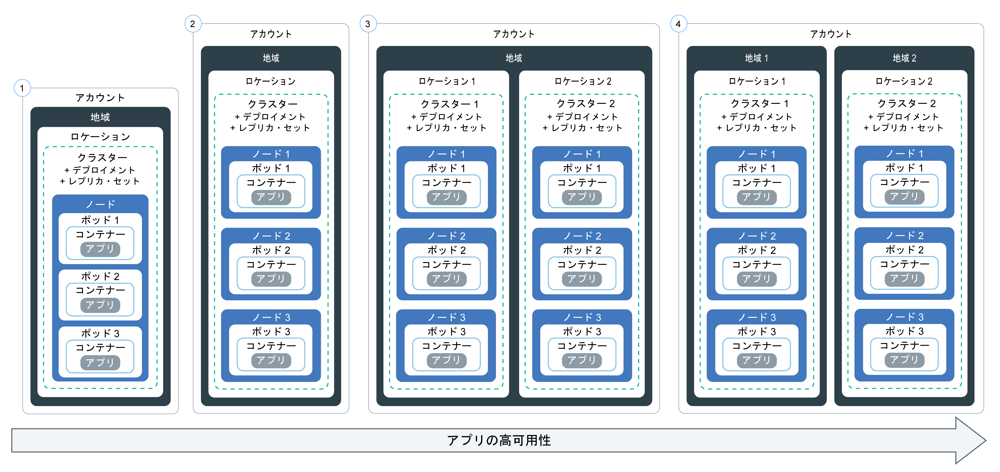

---

copyright:
  years: 2014, 2018
lastupdated: "2018-05-24"

---

{:new_window: target="_blank"}
{:shortdesc: .shortdesc}
{:screen: .screen}
{:pre: .pre}
{:table: .aria-labeledby="caption"}
{:codeblock: .codeblock}
{:tip: .tip}
{:download: .download}


# アプリをクラスターにデプロイする
{: #app}

{{site.data.keyword.containerlong}} で Kubernetes の技法を利用して、アプリをコンテナーにデプロイし、それらのアプリを常に稼働させることができます。 例えば、ダウン時間なしでローリング更新とロールバックを実行できます。
{: shortdesc}

次のイメージの領域をクリックして、アプリをデプロイするための一般的な手順を確認してください。


<map name="d62e18" id="d62e18">
<area href="cs_cli_install.html" target="_blank" alt="CLI をインストールします。" title="CLI をインストールします。" shape="rect" coords="30, 69, 179, 209" />
<area href="https://kubernetes.io/docs/concepts/configuration/overview/" target="_blank" alt="アプリの構成ファイルを作成します。Kubernetes のベスト・プラクティスを確認します。" title="アプリの構成ファイルを作成します。Kubernetes のベスト・プラクティスを確認します。" shape="rect" coords="254, 64, 486, 231" />
<area href="#app_cli" target="_blank" alt="オプション 1: Kubernetes CLI から構成ファイルを実行します。" title="オプション 1: Kubernetes CLI から構成ファイルを実行します。" shape="rect" coords="544, 67, 730, 124" />
<area href="#cli_dashboard" target="_blank" alt="オプション 2: Kubernetes ダッシュボードをローカルで開始し、構成ファイルを実行します。" title="オプション 2: Kubernetes ダッシュボードをローカルで開始し、構成ファイルを実行します。" shape="rect" coords="544, 141, 728, 204" />
</map>


<br />


## 可用性の高いデプロイメントの計画
{: #highly_available_apps}

セットアップ時に複数のワーカー・ノードとクラスターを分散させる範囲を広くすればするほど、各ユーザーがアプリのダウン時間を経験する可能性は低くなります。
{: shortdesc}

アプリのセットアップ方法を以下にまとめます。下に行くほど可用性が高くなります。



1.  n+2 個のポッドをレプリカ・セットで管理するデプロイメント。
2.  n+2 個のポッドをレプリカ・セットで管理し、同じ場所の複数のノードに分散させる (アンチアフィニティー) デプロイメント。
3.  n+2 個のポッドをレプリカ・セットで管理し、別々の場所に存在する複数のノードに分散させる (アンチアフィニティー) デプロイメント。
4.  n+2 個のポッドをレプリカ・セットで管理し、別々の地域に存在する複数のノードに分散させる (アンチアフィニティー) デプロイメント。


### アプリの可用性の向上
{: #increase_availability}

<dl>
  <dt>デプロイメントとレプリカ・セットを使用してアプリとその依存項目をデプロイする</dt>
    <dd><p>デプロイメントとは、アプリのすべてのコンポーネントとその依存項目を宣言するために使用できる Kubernetes リソースのことです。デプロイメントでは、すべての手順を記述する必要はなく、アプリに集中できます。</p>
    <p>複数のポッドをデプロイすると、デプロイメントのレプリカ・セットが自動的に作成されます。そのレプリカ・セットによってポッドがモニターされ、いつでも望ましい数のポッドが稼働状態になります。 ポッドがダウンすると、応答しなくなったポッドがレプリカ・セットによって新しいポッドに置き換えられます。</p>
    <p>デプロイメントを使用して、ローリング更新中に追加するポッドの数や、1 度に使用不可にできるポッドの数など、アプリの更新戦略を定義できます。 ローリング更新の実行時には、デプロイメントによって、リビジョンが動作しているかどうかが確認され、障害が検出されるとロールアウトが停止されます。</p>
    <p>デプロイメントでは、異なるフラグを使用して同時に複数のリビジョンをデプロイできます。 例えば、実稼働環境にプッシュする前に、デプロイメントをテストすることができます。</p>
    <p>デプロイメントでは、デプロイしたリビジョンを追跡できます。 更新が期待どおりに機能しない場合に、この履歴を使用して以前のバージョンにロールバックすることができます。</p></dd>
  <dt>アプリのワークロードに十分なレプリカ数、プラス 2 を組み込む</dt>
    <dd>アプリの可用性と耐障害性を高めるために、予想されるワークロードを処理する最低限の数のレプリカに加えて予備のレプリカを組み込むことを検討してください。 ポッドがクラッシュし、そのポッドがレプリカ・セットによってまだリカバリーされていない状況でも、予備のレプリカでワークロードを処理できます。 2 つが同時に障害を発生した場合に対応できるようにするには、2 つ余分にレプリカを組み込みます。 この構成は N+2 パターンです。N は着信ワークロードを処理するレプリカの数、+2 は追加の 2 つのインスタンスです。 クラスターに十分なスペースがある限り、必要な数のポッドを作成できます。</dd>
  <dt>複数のノードにポッドを分散させる (アンチアフィニティー)</dt>
    <dd><p>デプロイメントを作成するときに、各ポッドを同じワーカー・ノードにデプロイすることもできます。 これは、アフィニティーまたはコロケーションとして知られています。 ワーカー・ノードの障害からアプリを保護するには、標準クラスターで <em>podAntiAffinity</em> オプションを使用して、複数のワーカー・ノードにポッドを分散させるようにデプロイメントを構成します。 「優先」と「必須」という 2 つのタイプのポッド・アンチアフィニティーを定義できます。 詳しくは、Kubernetes の資料 <a href="https://kubernetes.io/docs/concepts/configuration/assign-pod-node/" rel="external" target="_blank" title="(新しいタブまたはウィンドウで開く)">Assigning Pods to Nodes</a> を参照してください。</p>
    <p><strong>注</strong>: 「必須」のアンチアフィニティーでは、ワーカー・ノードの数しかレプリカをデプロイできません。 例えば、クラスターに 3 つのワーカー・ノードがある場合は、YAML ファイルに 5 つのレプリカを定義しても、3 つのレプリカしかデプロイされません。 各レプリカは異なるワーカー・ノード上に存在します。 残りの 2 つのレプリカは保留中のままです。 別のワーカー・ノードをクラスターに追加すると、残りのレプリカのうち 1 つが新しいワーカー・ノードに自動的にデプロイされます。<p>
    <p><strong>デプロイメント YAML ファイルのサンプル</strong>:<ul>
    <li><a href="https://raw.githubusercontent.com/IBM-Cloud/kube-samples/master/deploy-apps-clusters/nginx_preferredAntiAffinity.yaml" rel="external" target="_blank" title="(新しいタブまたはウィンドウで開く)">優先のポッド・アンチアフィニティーを使用する Nginx アプリ。</a></li>
    <li><a href="https://raw.githubusercontent.com/IBM-Cloud/kube-samples/master/deploy-apps-clusters/liberty_requiredAntiAffinity.yaml" rel="external" target="_blank" title="(新しいタブまたはウィンドウで開く)">必須のポッド・アンチアフィニティーを使用する IBM® WebSphere® Application Server Liberty アプリ。</a></li></ul></p>
    </dd>
<dt>複数のゾーンまたは領域にポッドを分散させる</dt>
  <dd>ある場所や領域の障害からアプリを保護するために、別の場所の 2 つ目のクラスターを作成し、デプロイメントの YAML を使用してアプリの重複レプリカ・セットをデプロイできます。 クラスターの前に共有ルートとロード・バランサーを追加して、複数の場所や領域にワークロードを分散させることもできます。 詳しくは、[クラスターの高可用性](cs_clusters.html#clusters)を参照してください。
  </dd>
</dl>


### 最小限のアプリのデプロイメント
{: #minimal_app_deployment}

フリー・クラスターまたは標準クラスターへの基本的なアプリのデプロイメントには、一般には以下の構成要素が含まれます。
{: shortdesc}


図に示すように、最小限のアプリ用にコンポーネントをデプロイするには、次の例のような構成ファイルを使用します。
```
apiVersion: apps/v1beta1
kind: Deployment
metadata:
  name: ibmliberty
spec:
  replicas: 1
  template:
    metadata:
      labels:
        app: ibmliberty
    spec:
      containers:
      - name: ibmliberty
        image: registry.bluemix.net/ibmliberty:latest
        ports:
        - containerPort: 9080        
---
apiVersion: v1
kind: Service
metadata:
  name: ibmliberty-service
  labels:
    app: ibmliberty
spec:
  selector:
    app: ibmliberty
  type: NodePort
  ports:
   - protocol: TCP
     port: 9080
```
{: codeblock}

**注:** サービスを公開するには、サービスの `spec.selector` セクションで使用するキー/値のペアが、デプロイメント YAML の `spec.template.metadata.labels` セクションで使用したキー/値のペアと同じであることを確認してください。
各コンポーネントについて詳しくは、[Kubernetes の基本](cs_tech.html#kubernetes_basics)を参照してください。

<br />


## Kubernetes ダッシュボードの起動
{: #cli_dashboard}

ローカル・システムで Kubernetes ダッシュボードを開くと、クラスターとそのすべてのワーカー・ノードに関する情報が表示されます。 [GUI では](#db_gui)、便利なワンクリック・ボタンでダッシュボードにアクセスできます。[CLI を使用すると](#db_cli)、ダッシュボードにアクセスしたり、CI/CD パイプラインなどの自動化プロセスのステップを使用したりできます。
{:shortdesc}

始めに、[CLI のターゲット](cs_cli_install.html#cs_cli_configure)を自分のクラスターに設定してください。 このタスクには、[管理者アクセス・ポリシー](cs_users.html#access_policies)が必要です。 現在の[アクセス・ポリシー](cs_users.html#infra_access)を確認してください。

クラスターの Kubernetes ダッシュボードを起動するために、デフォルトのポートを使用するか、独自のポートを設定できます。

**GUI からの Kubernetes ダッシュボードの起動**
{: #db_gui}

1.  [{{site.data.keyword.Bluemix_notm}} GUI](https://console.bluemix.net/) にログインします。
2.  メニュー・バーのプロファイルから、使用するアカウントを選択します。
3.  メニューから、**「コンテナー」**をクリックします。
4.  **「クラスター」**ページで、アクセスするクラスターをクリックします。
5.  クラスターの詳細ページで、**「Kubernetes Dashboard」**ボタンをクリックします。

**CLI からの Kubernetes ダッシュボードの起動**
{: #db_cli}

*  バージョン 1.7.16 以前の Kubernetes マスターを使用するクラスターの場合は、以下のようにします。

    1.  デフォルトのポート番号でプロキシーを設定します。

        ```
        kubectl proxy
        ```
        {: pre}

        出力:

        ```
        Starting to serve on 127.0.0.1:8001
        ```
        {: screen}

    2.  Web ブラウザーで Kubernetes ダッシュボードを開きます。

        ```
        http://localhost:8001/ui
        ```
        {: codeblock}

*  バージョン 1.8.2 以降の Kubernetes マスターを使用するクラスターの場合は、以下のようにします。

    1.  Kubernetes の資格情報を取得します。

        ```
        kubectl config view -o jsonpath='{.users[0].user.auth-provider.config.id-token}'
        ```
        {: pre}

    2.  出力に示された **id-token** 値をコピーします。

    3.  デフォルトのポート番号でプロキシーを設定します。

        ```
        kubectl proxy
        ```
        {: pre}

        出力例:

        ```
        Starting to serve on 127.0.0.1:8001
        ```
        {: screen}

    4.  ダッシュボードにサインインします。

      1.  ブラウザーで、次の URL に移動します。

          ```
          http://localhost:8001/api/v1/namespaces/kube-system/services/https:kubernetes-dashboard:/proxy/
          ```
          {: codeblock}

      2.  サインオン・ページで、**トークン**認証方式を選択します。

      3.  次に、先ほどコピーした **id-token** 値を **Token** フィールドに貼り付けて、**「SIGN IN」**をクリックします。

Kubernetes ダッシュボードでの作業が完了したら、`CTRL+C` を使用して `proxy` コマンドを終了します。 終了した後は、Kubernetes ダッシュボードを使用できなくなります。 Kubernetes ダッシュボードを再始動するには、`proxy` コマンドを実行します。

[次に、ダッシュボードから構成ファイルを実行できます。](#app_ui)


<br />


## シークレットの作成
{: #secrets}

Kubernetes シークレットは、機密情報 (ユーザー名、パスワード、鍵など) を安全に保管するための手段です。
{:shortdesc}

<table>
<caption>シークレットに保管する必須ファイル (タスク別)</caption>
<thead>
<th>タスク</th>
<th>シークレットに保管する必要があるファイル</th>
</thead>
<tbody>
<tr>
<td>クラスターにサービスを追加する</td>
<td>なし。 サービスをクラスターにバインドすると、シークレットが自動的に作成されます。</td>
</tr>
<tr>
<td>オプション: Ingress シークレットを使用しない場合は、Ingress サービスに TLS を構成します。 <p><b>注</b>: TLS はデフォルトで既に有効になっていて、TLS 接続用のシークレットが既に作成されています。

デフォルトの TLS シークレットを表示するには、次のようにします。
<pre>
bx cs cluster-get &lt;cluster_name_or_ID&gt; | grep "Ingress secret"
</pre>
</p>
代わりに独自のものを作成するには、このトピックの手順を実行してください。</td>
<td>サーバーの証明書と鍵: <code>server.crt</code> と <code>server.key</code></td>
<tr>
<td>相互認証アノテーションを作成します。</td>
<td>CA 証明書: <code>ca.crt</code></td>
</tr>
</tbody>
</table>

シークレットに保管できるものについて詳しくは、[Kubernetes の資料](https://kubernetes.io/docs/concepts/configuration/secret/)を参照してください。


証明書を含んだシークレットを作成するには、以下のようにします。

1. 証明書プロバイダーから認証局 (CA) の証明書と鍵を生成します。 独自のドメインがある場合は、ご使用のドメインの正式な TLS 証明書を購入してください。 テストが目的であれば、自己署名証明書を生成できます。

 **重要**: 証明書ごとに異なる [CN](https://support.dnsimple.com/articles/what-is-common-name/) を使用してください。

 クライアント証明書とクライアント鍵は、トラステッド・ルート証明書 (この場合は CA 証明書) まで検証する必要があります。次に例を示します。

 ```
 Client Certificate: issued by Intermediate Certificate
 Intermediate Certificate: issued by Root Certificate
 Root Certificate: issued by itself
 ```
 {: codeblock}

2. 証明書を Kubernetes シークレットとして作成します。

   ```
   kubectl create secret generic <secret_name> --from-file=<cert_file>=<cert_file>
   ```
   {: pre}

   例:
   - TLS 接続:

     ```
     kubectl create secret tls <secret_name> --from-file=tls.crt=server.crt --from-file=tls.key=server.key
     ```
     {: pre}

   - 相互認証アノテーション:

     ```
     kubectl create secret generic <secret_name> --from-file=ca.crt=ca.crt
     ```
     {: pre}

<br />


## GUI でアプリをデプロイする方法
{: #app_ui}

Kubernetes ダッシュボードを使用してアプリをクラスターにデプロイすると、デプロイメント・リソースが、クラスター内にポッドを自動的に作成し、更新および管理します。
{:shortdesc}

開始前に、以下のことを行います。

-   必要な [CLI](cs_cli_install.html#cs_cli_install) をインストールします。
-   [CLI のターゲットを](cs_cli_install.html#cs_cli_configure)自分のクラスターに設定します。

アプリをデプロイするには、以下の手順で行います。

1.  Kubernetes [ダッシュボード](#cli_dashboard)を開き、**「+ 作成」**をクリックします。
2.  2 つの方法のいずれかでアプリの詳細を入力します。
  * **「以下にアプリの詳細を指定する (Specify app details below)」**を選択し、詳細を入力します。
  * **「YAML ファイルまたは JSON ファイルをアップロードする (Upload a YAML or JSON file)」**を選択して、アプリの[構成ファイル ](https://kubernetes.io/docs/tasks/inject-data-application/define-environment-variable-container/) をアップロードします。

  構成ファイルのヘルプが必要な場合は、 この [YAML ファイルのサンプル ](https://github.com/IBM-Cloud/kube-samples/blob/master/deploy-apps-clusters/deploy-ibmliberty.yaml) を確認してください。 この例では、コンテナーは米国南部地域の **ibmliberty** イメージからデプロイされます。 Kubernetes リソースを処理する際の[個人情報の保護](cs_secure.html#pi)の詳細を確認してください。{: tip}

3.  以下のいずれかの方法でアプリを正常にデプロイしたことを確認します。
  * Kubernetes ダッシュボードで、**「デプロイメント」**をクリックします。 正常なデプロイメントのリストが表示されます。
  * アプリが[公開](cs_network_planning.html#public_access)されている場合は、{{site.data.keyword.containerlong}} ダッシュボードのクラスター概要ページにナビゲートします。 クラスター概要セクションにあるサブドメインをコピーし、ブラウザーに貼り付けてアプリを表示します。

<br />


## CLI でアプリをデプロイする方法
{: #app_cli}

クラスターを作成したら、Kubernetes CLI を使用してそのクラスターにアプリをデプロイできます。
{:shortdesc}

開始前に、以下のことを行います。

-   必要な [CLI](cs_cli_install.html#cs_cli_install) をインストールします。
-   [CLI のターゲットを](cs_cli_install.html#cs_cli_configure)自分のクラスターに設定します。

アプリをデプロイするには、以下の手順で行います。

1.  [Kubernetes のベスト・プラクティス ](https://kubernetes.io/docs/concepts/configuration/overview/) に基づいて構成ファイルを作成します。 基本的に、構成ファイルには、Kubernetes で作成する各リソースの構成の詳細情報が格納されます。 スクリプトに以下のセクションを 1 つ以上追加できます。

    -   [Deployment ](https://kubernetes.io/docs/concepts/workloads/controllers/deployment/): ポッドとレプリカ・セットの作成を定義します。 1 つのポッドにコンテナー化アプリを 1 つ組み込み、レプリカ・セットによってポッドの複数インスタンスを制御します。

    -   [Service ](https://kubernetes.io/docs/concepts/services-networking/service/): ワーカー・ノードまたはロード・バランサーのパブリック IP アドレス、あるいは Ingress のパブリック経路を使用して、ポッドへのフロントエンド・アクセスを提供します。

    -   [Ingress ](https://kubernetes.io/docs/concepts/services-networking/ingress/): アプリをだれでも利用できるようにする経路を提供するロード・バランサーのタイプを指定します。

    Kubernetes リソースを処理する際の[個人情報の保護](cs_secure.html#pi)の詳細を確認してください。

2.  クラスターのコンテキストで構成ファイルを実行します。

    ```
    kubectl apply -f config.yaml
    ```
    {: pre}

3.  ノード・ポート・サービス、ロード・バランサー・サービス、または Ingress を使用して、アプリをだれでも利用できるようにした場合は、アプリにアクセスできることを確認します。

<br />


## GPU マシンへのアプリのデプロイ
{: #gpu_app}

[ベア・メタル・グラフィックス処理装置 (GPU) マシン・タイプ](cs_clusters.html#shared_dedicated_node)がある場合は、数理計算主体のワークロードをワーカー・ノードにスケジュールできます。例えば、Compute Unified Device Architecture (CUDA) プラットフォームを使用する 3D アプリを実行して GPU と CPU 間で処理負荷を分担し、パフォーマンスを向上させることができます。
{:shortdesc}

以下のステップは、GPU を必要とするワークロードをデプロイする方法を示しています。GPU と CPU の両方でワークロードを処理する必要はない[アプリをデプロイする](#app_ui)こともできます。後で、[この Kubernetes デモ ](https://github.com/pachyderm/pachyderm/tree/master/doc/examples/ml/tensorflow) を使用して、[TensorFlow ](https://www.tensorflow.org/) 機械学習フレームワークなどの数理計算主体のワークロードを試してみることをお勧めします。

開始前に、以下のことを行います。
* [ベア・メタル GPU マシン・タイプを作成します](cs_clusters.html#clusters_cli)。このプロセスは、完了までに 1 営業日より長くかかる場合があることに注意してください。
* クラスター・マスターと GPU ワーカー・ノードは、Kubernetes バージョン 1.10 以降を実行する必要があります。

GPU マシンでワークロードを実行するには、以下のようにします。
1.  YAML ファイルを作成します。 この例では、`Job` YAML は、短期的なポッドを作成することによって、一種のバッチのようなワークロードを管理します。このポッドは、その完了がスケジュールされたコマンドが正常に終了するまで実行されます。

    **重要 **: GPU ワークロードの場合は、YAML 仕様で必ず `resources: limits: nvidia.com/gpu` フィールドを指定する必要があります。

    ```yaml
    apiVersion: batch/v1
    kind: Job
    metadata:
      name: nvidia-smi
      labels:
        name: nvidia-smi
    spec:
      template:
        metadata:
          labels:
            name: nvidia-smi
        spec:
          containers:
          - name: nvidia-smi
            image: nvidia/cuda:9.1-base-ubuntu16.04
            command: [ "/usr/test/nvidia-smi" ]
            imagePullPolicy: IfNotPresent
            resources:
              limits:
                nvidia.com/gpu: 2
            volumeMounts:
            - mountPath: /usr/test
              name: nvidia0
          volumes:
            - name: nvidia0
              hostPath:
                path: /usr/bin
          restartPolicy: Never
    ```
    {: codeblock}

    <table>
    <caption>YAML コンポーネント</caption>
    <thead>
    <th colspan=2> YAML ファイルの構成要素について</th>
    </thead>
    <tbody>
    <tr>
    <td>メタデータとラベルの名前</td>
    <td>ジョブの名前とラベルを指定し、ファイルのメタデータと `spec template` メタデータの両方で同じ名前を使用します。例えば、`nvidia-smi` と指定します。</td>
    </tr>
    <tr>
    <td><code>containers/image</code></td>
    <td>実行中インスタンスとなっているコンテナーが属するイメージを指定します。この例では、DockerHub CUDA イメージ <code>nvidia/cuda:9.1-base-ubuntu16.04</code> を使用するように値が設定されています</td>
    </tr>
    <tr>
    <td><code>containers/command</code></td>
    <td>コンテナーで実行するコマンドを指定します。この例では、<code>[ "/usr/test/nvidia-smi" ]</code> コマンドは GPU マシン上のバイナリーを参照するので、ボリューム・マウントもセットアップする必要があります。</td>
    </tr>
    <tr>
    <td><code>containers/imagePullPolicy</code></td>
    <td>イメージが現在ワーカー・ノード上にない場合にのみ新規イメージをプルする場合は、<code>IfNotPresent</code> を指定します。</td>
    </tr>
    <tr>
    <td><code>resources/limits</code></td>
    <td>GPU マシンの場合は、リソース制限を指定する必要があります。Kubernetes [デバイス・プラグイン ](https://kubernetes.io/docs/concepts/cluster-administration/device-plugins/) は、制限に合うようにデフォルトのリソース要求を設定します。
<ul><li>キーとして <code>nvidia.com/gpu</code> を指定する必要があります。</li>
    <li>要求する GPU の数を整数 (<code>2</code> など) で入力します。<strong>注</strong>: コンテナー・ポッドは GPU を共有しません。また、GPU をオーバーコミットすることはできません。例えば、`mg1c.16x128` マシンが 1 台のみの場合、そのマシンには GPU が 2 つしかないため、指定できるのは最大で `2` つです。</li></ul></td>
    </tr>
    <tr>
    <td><code>volumeMounts</code></td>
    <td>コンテナーにマウントされるボリュームに <code>nvidia0</code> などの名前を付けます。そのボリュームのコンテナーで <code>mountPath</code> を指定します。この例では、パス <code>/usr/test</code> は、ジョブ・コンテナー・コマンドで使用されるパスと一致します。</td>
    </tr>
    <tr>
    <td><code>volumes</code></td>
    <td>ジョブ・ボリュームに <code>nvidia0</code> などの名前を付けます。GPU ワーカー・ノードの <code>hostPath</code> で、ホスト上のボリュームの <code>path</code> (この例では <code>/usr/bin</code>) を指定します。コンテナー <code>mountPath</code> はホスト・ボリューム <code>path</code> にマップされます。これにより、このジョブは、コンテナー・コマンドを実行するために、GPU ワーカー・ノード上の NVIDIA バイナリーにアクセスできます。</td>
    </tr>
    </tbody></table>

2.  YAML ファイルを適用します。以下に例を示します。

    ```
    kubectl apply -f nvidia-smi.yaml
    ```
    {: pre}

3.  `nvidia-sim` ラベルでポッドをフィルタリングして、ジョブ・ポッドを検査します。**STATUS** が **Completed** であることを確認します。

    ```
    kubectl get pod -a -l 'name in (nvidia-sim)'
    ```
    {: pre}

    出力例:
    ```
    NAME                  READY     STATUS      RESTARTS   AGE
    nvidia-smi-ppkd4      0/1       Completed   0          36s
    ```
    {: screen}

4.  ポッドを describe して、GPU デバイス・プラグインがポッドをどのようにスケジュールしたかを確認します。
    * `Limits` フィールドと `Requests` フィールドで、指定したリソース制限とデバイス・プラグインが自動的に設定した要求が一致していることを確認します。
    * イベントで、ポッドが GPU ワーカー・ノードに割り当てられていることを確認します。

    ```
    kubectl describe pod nvidia-smi-ppkd4
    ```
    {: pre}

    出力例:
    ```
    Name:           nvidia-smi-ppkd4
    Namespace:      default
    ...
    Limits:
     nvidia.com/gpu:  2
    Requests:
     nvidia.com/gpu:  2
    ...
    Events:
    Type    Reason                 Age   From                     Message
    ----    ------                 ----  ----                     -------
    Normal  Scheduled              1m    default-scheduler        Successfully assigned nvidia-smi-ppkd4 to 10.xxx.xx.xxx
    ...
    ```
    {: screen}

5.  ジョブが GPU を使用してそのワークロードの計算を実行したことを検証するには、ログを確認します。ジョブからの `["/usr/test/nvidia-smi"]` コマンドが、GPU ワーカー・ノード上の GPU デバイス状態を照会しました。

    ```
    kubectl logs nvidia-sim-ppkd4
    ```
    {: pre}

    出力例:
    ```
    +-----------------------------------------------------------------------------+
    | NVIDIA-SMI 390.12                 Driver Version: 390.12                    |
    |-------------------------------+----------------------+----------------------+
    | GPU  Name        Persistence-M| Bus-Id        Disp.A | Volatile Uncorr. ECC |
    | Fan  Temp  Perf  Pwr:Usage/Cap|         Memory-Usage | GPU-Util  Compute M. |
    |===============================+======================+======================|
    |   0  Tesla K80           Off  | 00000000:83:00.0 Off |                  Off |
    | N/A   37C    P0    57W / 149W |      0MiB / 12206MiB |      0%      Default |
    +-------------------------------+----------------------+----------------------+
    |   1  Tesla K80           Off  | 00000000:84:00.0 Off |                  Off |
    | N/A   32C    P0    63W / 149W |      0MiB / 12206MiB |      1%      Default |
    +-------------------------------+----------------------+----------------------+

    +-----------------------------------------------------------------------------+
    | Processes:                                                       GPU Memory |
    |  GPU       PID   Type   Process name                             Usage      |
    |=============================================================================|
    |  No running processes found                                                 |
    +-----------------------------------------------------------------------------+
    ```
    {: screen}

    この例では、両方の GPU がワーカー・ノードでスケジュールされたため、両方の GPU がジョブの実行に使用されたことが分かります。制限を 1 に設定した場合は、GPU が 1 つだけ示されます。

## アプリのスケーリング 
{: #app_scaling}

Kubernetes では、[ポッドの自動水平スケーリング ](https://kubernetes.io/docs/tasks/run-application/horizontal-pod-autoscale/) を有効にして、CPU に基づいてアプリのインスタンス数を自動的に増減できます。
{:shortdesc}

Cloud Foundry アプリケーションのスケーリングに関する情報をお探しですか? [IBM Auto-Scaling for {{site.data.keyword.Bluemix_notm}}](/docs/services/Auto-Scaling/index.html) を参照してください。 
{: tip}

開始前に、以下のことを行います。
- [CLI のターゲットを](cs_cli_install.html#cs_cli_configure)自分のクラスターに設定します。
- 自動スケーリングするクラスターに Heapster モニターをデプロイする必要があります。

手順:

1.  CLI を使用して、アプリをクラスターにデプロイします。 アプリをデプロイする時に、CPU を要求する必要があります。

    ```
    kubectl run <app_name> --image=<image> --requests=cpu=<cpu> --expose --port=<port_number>
    ```
    {: pre}

    <table>
    <caption>kubectl run のコマンド構成要素</caption>
    <thead>
    <th colspan=2> このコマンドの構成要素について</th>
    </thead>
    <tbody>
    <tr>
    <td><code>--image</code></td>
    <td>デプロイするアプリケーション。</td>
    </tr>
    <tr>
    <td><code>--request=cpu</code></td>
    <td>コンテナーで必要な CPU。ミリコア単位で指定します。 例えば、<code>--requests=200m</code> のように指定します。</td>
    </tr>
    <tr>
    <td><code>--expose</code></td>
    <td>外部サービスを作成する場合は、true にします。</td>
    </tr>
    <tr>
    <td><code>--port</code></td>
    <td>外部からアプリを使用するためのポート。</td>
    </tr></tbody></table>

    デプロイメントがかなり複雑になる場合は、[構成ファイル](#app_cli)を作成する必要があります。
    {: tip}

2.  自動スケーリング機能を作成し、ポリシーを定義します。 `kubectl autoscale` コマンドの使い方について詳しくは、[Kubernetes の資料 ](https://v1-8.docs.kubernetes.io/docs/reference/generated/kubectl/kubectl-commands#autoscale) を参照してください。

    ```
    kubectl autoscale deployment <deployment_name> --cpu-percent=<percentage> --min=<min_value> --max=<max_value>
    ```
    {: pre}

    <table>
    <caption>kubectl autoscale のコマンド構成要素</caption>
    <thead>
    <th colspan=2> このコマンドの構成要素について</th>
    </thead>
    <tbody>
    <tr>
    <td><code>--cpu-percent</code></td>
    <td>水平ポッド自動スケーリング機能で維持する CPU 使用率の平均値。パーセントで指定します。</td>
    </tr>
    <tr>
    <td><code>--min</code></td>
    <td>指定した CPU 使用率を維持するために使用するデプロイ済みのポッドの最小数。</td>
    </tr>
    <tr>
    <td><code>--max</code></td>
    <td>指定した CPU 使用率を維持するために使用するデプロイ済みのポッドの最大数。</td>
    </tr>
    </tbody></table>


<br />


## ローリング・デプロイメントの管理
{: #app_rolling}

変更のロールアウトを自動化され制御された方法で管理できます。 ロールアウトがプランに従ったものでない場合、デプロイメントを以前のリビジョンにロールバックできます。
{:shortdesc}

開始する前に、[デプロイメント](#app_cli)を作成します。

1.  変更を[ロールアウト ](https://kubernetes.io/docs/concepts/workloads/controllers/deployment/#updating-a-deployment) します。 例えば、初期デプロイメントで使用したイメージを変更することができます。

    1.  デプロイメント名を取得します。

        ```
        kubectl get deployments
        ```
        {: pre}

    2.  ポッド名を取得します。

        ```
        kubectl get pods
        ```
        {: pre}

    3.  ポッドで実行しているコンテナーの名前を取得します。

        ```
        kubectl describe pod <pod_name>
        ```
        {: pre}

    4.  使用するデプロイメントの新しいイメージを設定します。

        ```
        kubectl set image deployment/<deployment_name><container_name>=<image_name>
        ```
        {: pre}

    コマンドを実行すると、変更がすぐに適用され、ロールアウトの履歴にログが記録されます。

2.  デプロイメントの状況を確認します。

    ```
    kubectl rollout status deployments/<deployment_name>
    ```
    {: pre}

3.  変更をロールバックします。
    1.  デプロイメントのロールアウト履歴を参照し、最後のデプロイメントのリビジョン番号を確認します。

        ```
        kubectl rollout history deployment/<deployment_name>
        ```
        {: pre}

        **ヒント:** 特定のリビジョンの詳細を表示するには、リビジョン番号を指定します。

        ```
        kubectl rollout history deployment/<deployment_name> --revision=<number>
        ```
        {: pre}

    2.  以前のバージョンにロールバックするか、またはリビジョンを指定します。 以前のバージョンにロールバックするには、次のコマンドを使用します。

        ```
        kubectl rollout undo deployment/<depoyment_name> --to-revision=<number>
        ```
        {: pre}

<br />

