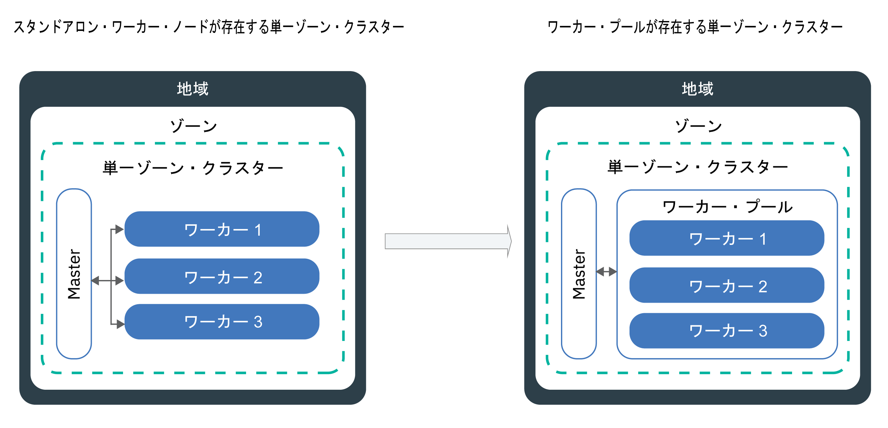

---

copyright:
  years: 2014, 2019
lastupdated: "2019-06-12"

keywords: kubernetes, iks

subcollection: containers

---

{:new_window: target="_blank"}
{:shortdesc: .shortdesc}
{:screen: .screen}
{:pre: .pre}
{:table: .aria-labeledby="caption"}
{:codeblock: .codeblock}
{:tip: .tip}
{:note: .note}
{:important: .important}
{:deprecated: .deprecated}
{:download: .download}
{:preview: .preview}


# クラスター、ワーカー・ノード、クラスター・コンポーネントの更新
{: #update}

更新をインストールして、{{site.data.keyword.containerlong}} の Kubernetes クラスターを最新に保つことができます。
{:shortdesc}

## Kubernetes マスターの更新
{: #master}

Kubernetes は、定期的に[メジャー、マイナー、またはパッチの更新](/docs/containers?topic=containers-cs_versions#version_types)をリリースしています。 更新は、Kubernetes API サーバーのバージョンや Kubernetes マスター内の他のコンポーネントに影響を与える可能性があります。 パッチ・バージョンの更新は IBM が行いますが、マスターのメジャー・バージョンとマイナー・バージョンの更新は自分で行う必要があります。
{:shortdesc}

**マスターの更新が必要になったことがわかる方法はありますか?**</br>
更新プログラムが利用可能になると、{{site.data.keyword.Bluemix_notm}} コンソールと CLI で通知されます。また、[サポートされるバージョン](/docs/containers?topic=containers-cs_versions)のページをチェックすることもできます。

**マスターのバージョンは最新のバージョンよりいくつ古いものまでサポートされますか?**</br>
一般に IBM は同時に 3 つの Kubernetes バージョンをサポートします。Kubernetes API サーバーは、最大で現行バージョンより 2 つ先のバージョンに更新できます。

例えば、現在の Kubernetes API サーバーのバージョンが 1.11 の場合に、1.14に更新するためには、まず 1.12 に更新する必要があります。

クラスターで、サポートされない Kubernetes バージョンが実行されている場合は、[バージョン・アーカイブの説明](/docs/containers?topic=containers-cs_versions#k8s_version_archive)に従ってください。サポートされない状態や動作上の影響を回避するには、クラスターを最新状態に保ってください。

**ワーカー・ノードをマスターよりも新しいバージョンにすることはできますか?**</br>
ワーカー・ノードは、マスターより新しい `major.minor` Kubernetes バージョンを実行することはできません。 まずは、[マスターを更新](#update_master)して最新の Kubernetes バージョンにしてください。 その後に、クラスター内の[ワーカー・ノードを更新](#worker_node)してください。

ワーカー・ノードは、セキュリティー更新プログラム用のワーカー・ノードに固有のパッチ・バージョンなど、マスターより新しいパッチ・バージョンを実行できます。

**パッチの更新はどのように適用されますか?**</br>
デフォルトでは、マスターのパッチ更新は数日にわたって自動的に適用されます。そのため、まだマスターに適用されていないパッチ・バージョンが、使用可能なバージョンとして表示されることがあります。 また、更新の自動化では、正常な状態でないクラスターや現在進行中の操作があるクラスターはスキップされます。 必要に応じて、IBM は特定のマスターのフィックスパック (マスターが 1 つ前のマイナー・バージョンから更新される場合にのみ必要なパッチなど) に対して、自動更新を無効にする場合があります。 どのような場合でも、[バージョンの変更ログを参照](/docs/containers?topic=containers-changelog)して影響がないか確認したら、自動更新が適用されるのを待たずに、`ibmcloud ks cluster-update` [コマンド](/docs/containers?topic=containers-cli-plugin-kubernetes-service-cli#cs_cluster_update)を適切に使用してお客様自身で更新することができます。

マスターとは異なり、ワーカーはパッチ・バージョンごとに更新する必要があります。

**マスターの更新中はどのような状況になりますか?**</br>
Kubernetes バージョン 1.11 以降を実行するクラスターのマスターは、レプリカ・マスター・ポッドが 3 つあるので高可用性です。 使用不可のマスター・ポッドが一度に 1 つだけになるようにローリング更新が行われます。 2 つのインスタンスが稼働しているので、更新中もクラスターにアクセスして変更することができます。 ワーカー・ノード、アプリ、リソースは実行され続けます。

これより前のバージョンの Kubernetes を実行するクラスターの場合は、Kubernetes API サーバーを更新するときに、API サーバーが 5 分から 10 分ほどダウンします。 更新中、クラスターにアクセスすることも変更することもできません。 ただし、クラスター・ユーザーがデプロイしたワーカー・ノード、アプリ、リソースは変更されず、引き続き実行されます。

**更新はロールバックできますか?**</br>
いいえ。更新プロセスが開始されたら、クラスターを前のバージョンにロールバックすることはできません。 必ず、テスト・クラスターを使用し、手順に従って潜在する問題に対処してから、実動マスターを更新してください。

**マスターの更新は、どのようなプロセスで行えますか?**</br>
以下の図は、マスターを更新するときに行えるプロセスを示しています。


図 1. Kubernetes マスター更新プロセスの図

{: #update_master}
始める前に、[**オペレーター**または**管理者**の {{site.data.keyword.Bluemix_notm}} IAM プラットフォーム役割](/docs/containers?topic=containers-users#platform)があることを確認してください。

Kubernetes マスターの_メジャー_・バージョンまたは_マイナー_・バージョンを更新するには、次のようにします。

1.  [Kubernetes の変更点](/docs/containers?topic=containers-cs_versions)を確認し、『_マスターの前に行う更新_』というマークのある更新を実行します。

2.  [{{site.data.keyword.Bluemix_notm}} コンソール](https://cloud.ibm.com/login)を使用するか CLI `ibmcloud ks cluster-update` [コマンド](/docs/containers?topic=containers-cli-plugin-kubernetes-service-cli#cs_cluster_update)を実行して、Kubernetes API サーバーと、関連する Kubernetes マスター・コンポーネントを更新します。

3.  数分待ってから、更新が完了したことを確認します。 {{site.data.keyword.Bluemix_notm}} クラスター・ダッシュボードで Kubernetes API サーバーのバージョンを確認するか、`ibmcloud ks clusters` を実行します。

4.  Kubernetes マスターで実行されている Kubernetes API サーバーと同じバージョンの [`kubectl cli`](/docs/containers?topic=containers-cs_cli_install#kubectl) をインストールします。 サーバーのバージョンと比べて 2 バージョン以上新しいか古い `kubectl` クライアント・バージョンは、[Kubernetes ではサポートされていません ](https://kubernetes.io/docs/setup/version-skew-policy/)。

Kubernetes API サーバーの更新が完了したら、ワーカー・ノードを更新できます。

<br />


## ワーカー・ノードの更新
{: #worker_node}

ワーカー・ノードの更新を促す通知を受信する場合があります。 これは何を意味しているでしょうか。 セキュリティー更新とパッチが Kubernetes API サーバーと他の Kubernetes マスター・コンポーネントに適用されたので、ワーカー・ノードを同期する必要があります。
{: shortdesc}

**更新中、アプリはどのような状況になりますか?**</br>
更新対象のワーカー・ノード上でデプロイメントの一部として実行しているアプリは、クラスター内のその他のワーカー・ノードにスケジュール変更されます。 別のワーカー・プール内のワーカー・ノードにスケジュールされたり、スタンドアロン・ワーカー・ノードがある場合はそのノードにアプリがスケジュールされたりすることもあります。 アプリのダウン時間を回避するには、ワークロードに対応できるだけの十分な容量がクラスター内になければなりません。

**更新中、一度に停止するワーカー・ノード数を制御するにはどうしたらよいですか?**</br>
すべてのワーカー・ノードを稼働状態にする必要がある場合は、[ワーカー・プールをサイズ変更](/docs/containers?topic=containers-cli-plugin-kubernetes-service-cli#cs_worker_pool_resize)するか、[スタンドアロン・ワーカー・ノードを追加](/docs/containers?topic=containers-cli-plugin-kubernetes-service-cli#cs_worker_add)して、ワーカー・ノードを追加することを検討してください。 追加したワーカー・ノードは、更新が完了したら削除できます。

また、Kubernetes 構成マップを作成して、更新中に一度に使用不可にできるワーカー・ノードの最大数を指定することもできます。 ワーカー・ノードは、ワーカー・ノード・ラベルで識別されます。 IBM 提供のラベルも、ワーカー・ノードに追加したカスタム・ラベルも使用できます。

**構成マップを定義しない場合はどうなりますか?**</br>
構成マップを定義しない場合は、デフォルトが使用されます。 デフォルトでは、更新処理中、クラスターごとに全ワーカー・ノードの最大 20% が使用不可になります。

**始める前に**:
- [アカウントにログインします。 該当する場合は、適切なリソース・グループをターゲットにします。 クラスターのコンテキストを設定します。](/docs/containers?topic=containers-cs_cli_install#cs_cli_configure)
- [Kubernetes マスターを更新します](#master)。 ワーカー・ノードの Kubernetes バージョンを、Kubernetes マスターで実行される Kubernetes API サーバーのバージョンより高くすることはできません。
- [Kubernetes の変更](/docs/containers?topic=containers-cs_versions)の『_マスターの後に行う更新_』に記載されている変更作業を行います。
- パッチの更新を適用する場合は、[Kubernetes バージョンの変更ログ](/docs/containers?topic=containers-changelog#changelog)を確認してください。
- [**オペレーター**または**管理者**の {{site.data.keyword.Bluemix_notm}} IAM プラットフォーム役割](/docs/containers?topic=containers-users#platform)があることを確認してください。 </br>

ワーカー・ノードを更新すると、アプリとサービスにダウン時間が発生する可能性があります。 ワーカー・ノード・マシンが再イメージ化されるので、[ポッドの外部に保管](/docs/containers?topic=containers-storage_planning#persistent_storage_overview)していないデータは削除されます。
{: important}

{: #worker-up-configmap}
**構成マップを作成してワーカー・ノードを更新するには、以下のようにします。**

1.  使用可能なワーカー・ノードのリストを表示し、それらのプライベート IP アドレスをメモします。

    ```
    ibmcloud ks workers --cluster <cluster_name_or_ID>
    ```
    {: pre}

2. ワーカー・ノードのラベルを表示します。 ワーカー・ノード・ラベルは、CLI 出力の **Labels** セクションにあります。 ラベルはすべて `NodeSelectorKey` と `NodeSelectorValue` で構成されます。
   ```
   kubectl describe node <private_worker_IP>
   ```
   {: pre}

   出力例:
   ```
   Name:               10.184.58.3
   Roles:              <none>
   Labels:             arch=amd64
                    beta.kubernetes.io/arch=amd64
                    beta.kubernetes.io/os=linux
                    failure-domain.beta.kubernetes.io/region=us-south
                    failure-domain.beta.kubernetes.io/zone=dal12
                    ibm-cloud.kubernetes.io/encrypted-docker-data=true
                    ibm-cloud.kubernetes.io/iaas-provider=softlayer
                    ibm-cloud.kubernetes.io/machine-type=u3c.2x4.encrypted
                    kubernetes.io/hostname=10.123.45.3
                    privateVLAN=2299001
                    publicVLAN=2299012
   Annotations:        node.alpha.kubernetes.io/ttl=0
                    volumes.kubernetes.io/controller-managed-attach-detach=true
   CreationTimestamp:  Tue, 03 Apr 2018 15:26:17 -0400
   Taints:             <none>
   Unschedulable:      false
   ```
   {: screen}

3. 構成マップを作成し、ワーカー・ノードの非可用性ルールを定義します。 以下の例は、`zonecheck.json`、`regioncheck.json`、`defaultcheck.json`、チェック・テンプレートの 4 つのチェックを示します。 これらのチェックの例を使用して、特定のゾーン (`zonecheck.json`) または地域 (`regioncheck.json`) 内のワーカー・ノードや、構成マップ内に定義したチェックと一致しないすべてのワーカー・ノード (`defaultcheck.json`) に対するルールを定義できます。 独自のチェックを作成するには、チェック・テンプレートを使用します。 どのチェックでも、ワーカー・ノードを指定するには、前述の手順で取得したワーカー・ノード・ラベルのいずれかを選択する必要があります。  

   どのチェックでも、<code>NodeSelectorKey</code> と <code>NodeSelectorValue</code> に値を 1 つだけ設定できます。 複数の地域、ゾーン、またはその他のワーク・ノード・ラベルに対するルールを設定する場合は、新しいチェックを作成します。 構成マップ内に最大 10 個のチェックを定義します。 それ以上チェックを追加しても無視されます。
   {: note}

   例:
   ```
   apiVersion: v1
    kind: ConfigMap
    metadata:
      name: ibm-cluster-update-configuration
      namespace: kube-system
    data:
     drain_timeout_seconds: "120"
     zonecheck.json: |
       {
        "MaxUnavailablePercentage": 30,
        "NodeSelectorKey": "failure-domain.beta.kubernetes.io/zone",
        "NodeSelectorValue": "dal13"
      }
    regioncheck.json: |
       {
        "MaxUnavailablePercentage": 20,
        "NodeSelectorKey": "failure-domain.beta.kubernetes.io/region",
        "NodeSelectorValue": "us-south"
      }
    defaultcheck.json: |
       {
        "MaxUnavailablePercentage": 20
      }
    <check_name>: |
      {
        "MaxUnavailablePercentage": <value_in_percentage>,
        "NodeSelectorKey": "<node_selector_key>",
        "NodeSelectorValue": "<node_selector_value>"
      }
   ```
   {: codeblock}

   <table summary="表の 1 行目は 2 列にまたがっています。残りの行は左から右に読みます。1 列目はパラメーター、2 列目は対応する説明です。">
   <caption>ConfigMap コンポーネント</caption>
    <thead>
      <th colspan=2> 構成要素について </th>
    </thead>
    <tbody>
      <tr>
        <td><code>drain_timeout_seconds</code></td>
        <td> オプション: [排出 ](https://kubernetes.io/docs/tasks/administer-cluster/safely-drain-node/) が完了するまで待機するタイムアウト(秒単位)。 ワーカー・ノードの排出を行うと、そのワーカー・ノードから既存のポッドがすべて安全に削除され、クラスター内のその他のワーカー・ノード上にスケジュール変更されます。 指定可能な値は、1 から 180 の範囲の整数です。デフォルト値は	30 です。</td>
      </tr>
      <tr>
        <td><code>zonecheck.json</code></br><code>regioncheck.json</code></td>
        <td>指定した <code>NodeSelectorKey</code> と <code>NodeSelectorValue</code> で識別できる一連のワーカー・ノードに対するルールを定義する 2 つのチェック。 <code>zonecheck.json</code> はゾーン・ラベルに基づいてワーカー・ノードを識別し、<code>regioncheck.json</code> はプロビジョニング中に各ワーカー・ノードに追加される地域ラベルを使用します。 この例では、ゾーン・ラベルが <code>dal13</code> のワーカー・ノードの 30% と <code>us-south</code> 内のワーカー・ノードの 20% を更新中に使用不可にできます。</td>
      </tr>
      <tr>
        <td><code>defaultcheck.json</code></td>
        <td>構成マップを作成しない場合や、マップの構成が正しくない場合は、Kubernetes のデフォルトが適用されます。 デフォルトでは、同時に使用不可にできるのは、クラスターのワーカー・ノードの 20% のみです。デフォルトのチェックを構成マップに追加して、このデフォルト値をオーバーライドできます。 この例では、ゾーンのチェック (<code>dal13</code>) でも地域のチェック (<code>us-south</code>) でも指定されていないすべてのワーカー・ノードが更新中に使用不可になることができます。 </td>
      </tr>
      <tr>
        <td><code>MaxUnavailablePercentage</code></td>
        <td>指定したラベルのキーと値について使用不可にできるノードの最大数 (パーセンテージで指定)。ワーカー・ノードが使用不可になるのは、デプロイ、再ロード、またはプロビジョニングのプロセス中です。定義した使用不可ノードの最大パーセンテージを超える場合、待機中のワーカー・ノードの更新はブロックされます。 </td>
      </tr>
      <tr>
        <td><code>NodeSelectorKey</code></td>
        <td>ルールを設定するワーカー・ノードのラベル・キー。 IBM 提供のデフォルト・ラベルと、自分で作成したワーカー・ノード・ラベルにルールを設定できます。 <ul><li>1 つのワーカー・プールに属するワーカー・ノードに対するルールを追加する場合は、<code>ibm-cloud.kubernetes.io/machine-type</code> ラベルを使用できます。 </li><li> 同じマシン・タイプのワーカー・プールが複数ある場合は、カスタム・ラベルを使用します。 </li></ul></td>
      </tr>
      <tr>
        <td><code>NodeSelectorValue</code></td>
        <td>定義したルールの対象になるワーカー・ノードのラベル値。 </td>
      </tr>
    </tbody>
   </table>

4. クラスター内に構成マップを作成します。
   ```
   kubectl apply -f <filepath/configmap.yaml>
   ```
   {: pre}

5.  構成マップが作成されたことを確認します。
    ```
    kubectl get configmap --namespace kube-system
    ```
    {: pre}

6.  ワーカー・ノードを更新します。

    ```
    ibmcloud ks worker-update --cluster <cluster_name_or_ID> --workers <worker_node1_ID> <worker_node2_ID>
    ```
    {: pre}

7. オプション: 構成マップによってトリガーされたイベントと、発生した検証エラーを確認します。 これらのイベントは、CLI 出力内の **Events** セクションで確認できます。
   ```
   kubectl describe -n kube-system cm ibm-cluster-update-configuration
   ```
   {: pre}

8. ワーカー・ノードの Kubernetes バージョンを確認して、更新が完了したことを確認します。  
   ```
   kubectl get nodes
   ```
   {: pre}

9. ワーカー・ノードが重複していないことを確認します。 場合によっては、更新後に古いクラスターで、**`NotReady`** 状況の重複したワーカー・ノードがリスト表示されることがあります。 重複を削除するには、[トラブルシューティング](/docs/containers?topic=containers-cs_troubleshoot_clusters#cs_duplicate_nodes)を参照してください。

次のステップ:
-   他のワーカー・プールで更新処理を繰り返します。
-   クラスターで作業を行う開発者に、`kubectl` CLI を Kubernetes マスターのバージョンに更新するように伝えます。
-   Kubernetes ダッシュボードに使用状況グラフが表示されない場合は、[`kube-dashboard` ポッドを削除](/docs/containers?topic=containers-cs_troubleshoot_health#cs_dashboard_graphs)します。


### コンソールでのワーカー・ノードの更新
{: #worker_up_console}

構成マップを初めてセットアップした後に、{{site.data.keyword.Bluemix_notm}} コンソールを使用してワーカー・ノードを更新できます。
{: shortdesc}

開始前に、以下のことを行います。
*   [構成マップをセットアップ](#worker_node)して、ワーカー・ノードの更新方法を制御します。
*   [Kubernetes マスターを更新します](#master)。 ワーカー・ノードの Kubernetes バージョンを、Kubernetes マスターで実行される Kubernetes API サーバーのバージョンより高くすることはできません。
*   [Kubernetes の変更](/docs/containers?topic=containers-cs_versions)の『_マスターの後に行う更新_』に記載されている変更作業を行います。
*   パッチの更新を適用する場合は、[Kubernetes バージョンの変更ログ](/docs/containers?topic=containers-changelog#changelog)を確認してください。
*   [**オペレーター**または**管理者**の {{site.data.keyword.Bluemix_notm}} IAM プラットフォーム役割](/docs/containers?topic=containers-users#platform)があることを確認してください。 </br>

ワーカー・ノードを更新すると、アプリとサービスにダウン時間が発生する可能性があります。 ワーカー・ノード・マシンが再イメージ化されるので、[ポッドの外部に保管](/docs/containers?topic=containers-storage_planning#persistent_storage_overview)していないデータは削除されます。
{: important}

コンソールからワーカー・ノードを更新するには、以下のようにします。
1.  [{{site.data.keyword.Bluemix_notm}} コンソール](https://cloud.ibm.com/)のメニュー で、**「Kubernetes」**をクリックします。
2.  **「クラスター」**ページから、クラスターを選択します。
3.  **「ワーカー・ノード」**タブから、更新する各ワーカー・ノードのチェック・ボックスを選択します。 アクション・バーがテーブル・ヘッダー行の上に表示されます。
4.  アクション・バーで**「Kubernetes の更新」**をクリックします。

<br />


## マシン・タイプの更新
{: #machine_type}

ワーカー・ノードのマシン・タイプを更新するには、新しいワーカー・ノードを追加し、古いワーカー・ノードを削除します。 例えば、クラスターに非推奨の `x1c` や古い Ubuntu 16 `x2c` といったワーカー・ノード・フレーバーがある場合、名前に `x3c` を含むマシン・タイプを使用する Ubuntu 18 ワーカー・ノードを作成します。
{: shortdesc}

開始前に、以下のことを行います。
- [アカウントにログインします。 該当する場合は、適切なリソース・グループをターゲットにします。 クラスターのコンテキストを設定します。](/docs/containers?topic=containers-cs_cli_install#cs_cli_configure)
- ワーカー・ノードにデータを保管している場合、[ワーカー・ノードの外部に保管](/docs/containers?topic=containers-storage_planning#persistent_storage_overview)されていなければデータは削除されます。
- [**オペレーター**または**管理者**の {{site.data.keyword.Bluemix_notm}} IAM プラットフォーム役割](/docs/containers?topic=containers-users#platform)があることを確認してください。

マシン・タイプを更新するには、以下のようにします。

1. 使用可能なワーカー・ノードのリストを表示し、それらのプライベート IP アドレスをメモします。
   - **ワーカー・プール内のワーカー・ノードの場合**:
     1. クラスターで使用可能なワーカー・プールをリストします。
        ```
        ibmcloud ks worker-pools --cluster <cluster_name_or_ID>
        ```
        {: pre}

     2. ワーカー・プール内のワーカー・ノードをリストします。
        ```
        ibmcloud ks workers --cluster <cluster_name_or_ID> --worker-pool <pool_name>
        ```
        {: pre}

     3. ワーカー・ノードの詳細を取得し、ゾーン、プライベート VLAN ID、パブリック VLAN ID をメモします。
        ```
        ibmcloud ks worker-get --cluster <cluster_name_or_ID> --worker <worker_ID>
        ```
        {: pre}

   - **非推奨: スタンドアロン・ワーカー・ノードの場合**:
     1. 使用可能なワーカー・ノードのリストを表示します。
        ```
        ibmcloud ks workers --cluster <cluster_name_or_ID>
        ```
        {: pre}

     2. ワーカー・ノードの詳細を取得し、ゾーン、プライベート VLAN ID、パブリック VLAN ID をメモします。
        ```
        ibmcloud ks worker-get --cluster <cluster_name_or_ID> --worker <worker_ID>
        ```
        {: pre}

2. ゾーンで使用可能なマシン・タイプをリストします。
   ```
   ibmcloud ks machine-types <zone>
   ```
   {: pre}

3. 新しいマシン・タイプのワーカー・ノードを作成します。
   - **ワーカー・プール内のワーカー・ノードの場合**:
     1. 置き換えるワーカー・ノードと同じ数のワーカー・ノードを含むワーカー・プールを作成します。
        ```
        ibmcloud ks worker-pool-create --name <pool_name> --cluster <cluster_name_or_ID> --machine-type <machine_type> --size-per-zone <number_of_workers_per_zone>
        ```
        {: pre}

     2. ワーカー・プールが作成されたことを確認します。
        ```
        ibmcloud ks worker-pools --cluster <cluster_name_or_ID>
        ```
        {: pre}

     3. 前の手順で取得したワーカー・プールにゾーンを追加します。 ゾーンを追加すると、ワーカー・プールに定義したワーカー・ノードがそのゾーンにプロビジョンされ、今後のワークロード・スケジュールの対象に含められます。 ワーカー・ノードを複数のゾーン間に分散させる場合は、[複数ゾーン対応ゾーン](/docs/containers?topic=containers-regions-and-zones#zones)を選択します。
        ```
        ibmcloud ks zone-add --zone <zone> --cluster <cluster_name_or_ID> --worker-pools <pool_name> --private-vlan <private_VLAN_ID> --public-vlan <public_VLAN_ID>
        ```
        {: pre}

   - **非推奨: スタンドアロン・ワーカー・ノードの場合**:
       ```
       ibmcloud ks worker-add --cluster <cluster_name> --machine-type <machine_type> --workers <number_of_worker_nodes> --private-vlan <private_VLAN_ID> --public-vlan <public_VLAN_ID>
       ```
       {: pre}

4. ワーカー・ノードがデプロイされるまで待ちます。
   ```
   ibmcloud ks workers --cluster <cluster_name_or_ID>
   ```
   {: pre}

   ワーカー・ノードの状態が**「正常」**に変わったら、デプロイメントは終了です。

5. 古いワーカー・ノードを削除します。 **注**: 月次で請求されるマシン・タイプ (ベア・メタルなど) を削除する場合は、その月全体の料金を請求されます。
   - **ワーカー・プール内のワーカー・ノードの場合**:
     1. 古いマシン・タイプのワーカー・プールを削除します。 ワーカー・プールを削除すると、そのプールのすべてのゾーンのすべてのワーカー・ノードが削除されます。 このプロセスは、完了まで数分かかることがあります。
        ```
        ibmcloud ks worker-pool-rm --worker-pool <pool_name> --cluster <cluster_name_or_ID>
        ```
        {: pre}

     2. ワーカー・プールが削除されたことを確認します。
        ```
        ibmcloud ks worker-pools --cluster <cluster_name_or_ID>
        ```
        {: pre}

   - **非推奨: スタンドアロン・ワーカー・ノードの場合**:
      ```
      ibmcloud ks worker-rm --cluster <cluster_name> --worker <worker_node>
      ```
      {: pre}

6. ワーカー・ノードがクラスターから削除されたことを確認します。
   ```
   ibmcloud ks workers --cluster <cluster_name_or_ID>
   ```
   {: pre}

7. 上記の手順を繰り返して、他のワーカー・プールまたはスタンドアロン・ワーカー・ノードを別のマシン・タイプに更新します。

## クラスター・コンポーネントの更新
{: #components}

{{site.data.keyword.containerlong_notm}} クラスターにはロギング用の Fluentd などのコンポーネントが付属していて、クラスターのプロビジョン時に自動的にインストールされます。 デフォルトでは、これらのコンポーネントは IBM によって自動的に更新されます。 ただし、一部のコンポーネントは、自動更新を無効にして、マスター・ノードおよびワーカー・ノードとは別に手動で更新することができます。
{: shortdesc}

**クラスターと別に更新できるデフォルトのコンポーネントは何ですか?**</br>
必要に応じて、以下のコンポーネントの自動更新を無効にできます。
* [ロギング用の Fluentd](#logging-up)
* [Ingress アプリケーション・ロード・バランサー (ALB)](#alb)

**クラスターと別には更新できないコンポーネントはありますか?**</br>

はい。 クラスターは以下の管理対象コンポーネントと関連リソースと共にデプロイされます。パフォーマンス上の特定の効果を目的としてポッドをスケーリングする場合や構成マップを編集する場合を除き、これらを変更することはできません。 これらのデプロイメント・コンポーネントのいずれかを変更しようとした場合、それらのオリジナル設定が定期的な間隔でリストアされます。

* `coredns`
* `coredns-autoscaler`
* `heapster`
* `ibm-file-plugin`
* `ibm-storage-watcher`
* `ibm-keepalived-watcher`
* `kube-dns-amd64`
* `kube-dns-autoscaler`
* `kubernetes-dashboard`
* `metrics-server`
* `vpn`

これらのリソースは、`addonmanager.kubernetes.io/mode: Reconcile` ラベルを使用することで表示できます。 以下に例を示します。

```
kubectl get deployments --all-namespaces -l addonmanager.kubernetes.io/mode=Reconcile
```
{: pre}

**デフォルト・コンポーネント以外のプラグインやアドオンをインストールできますか?**</br>
はい。 {{site.data.keyword.containerlong_notm}} では、クラスターに機能を追加するために選択できる他のプラグインやアドオンが提供されます。例えば、[Helm チャートを使用](/docs/containers?topic=containers-helm#public_helm_install)して [ブロック・ストレージ・プラグイン](/docs/containers?topic=containers-block_storage#install_block)や [strongSwan VPN](/docs/containers?topic=containers-vpn#vpn-setup) をインストールできます。または、[Istio](/docs/containers?topic=containers-istio) や [Knative](/docs/containers?topic=containers-serverless-apps-knative) などの IBM 管理のアドオンをクラスター内で有効にすることもできます。Helm チャートの README の指示に従うか、[管理対象アドオンを更新](/docs/containers?topic=containers-managed-addons#updating-managed-add-ons)するための手順に従って、これらの Helm チャートとアドオンを別個に更新する必要があります。

### Fluentd の自動更新の管理
{: #logging-up}

ロギングやフィルターの構成を変更するには、Fluentd コンポーネントが最新バージョンである必要があります。デフォルトでは、このコンポーネントに対する自動更新は有効になっています。
{: shortdesc}

Fluentd コンポーネントの自動更新は、以下の方法で管理できます。**注**: 以下のコマンドを実行するには、クラスターに対する[**管理者**の {{site.data.keyword.Bluemix_notm}} IAM プラットフォーム役割](/docs/containers?topic=containers-users#platform)が必要です。

* `ibmcloud ks logging-autoupdate-get --cluster <cluster_name_or_ID>` [コマンド](/docs/containers?topic=containers-cli-plugin-kubernetes-service-cli#cs_log_autoupdate_get)を実行して、自動更新が有効になっているかどうかを確認します。
* `ibmcloud ks logging-autoupdate-disable` [コマンド](/docs/containers?topic=containers-cli-plugin-kubernetes-service-cli#cs_log_autoupdate_disable)を実行して、自動更新を無効にします。
* 自動更新が無効になっている場合に、構成を変更する必要がある場合は、以下の 2 つのオプションがあります。
    * Fluentd ポッドの自動更新をオンにします。
        ```
        ibmcloud ks logging-autoupdate-enable --cluster <cluster_name_or_ID>
        ```
        {: pre}
    * `--force-update` オプションを指定したロギング・コマンドを使用して、一回限りの更新を強制実行します。 **注**: ポッドが最新バージョンの Fluentd コンポーネントに更新されますが、それ以降、Fluentd が自動更新されることはありません。
        コマンド例:

        ```
        ibmcloud ks logging-config-update --cluster <cluster_name_or_ID> --id <log_config_ID> --type <log_type> --force-update
        ```
        {: pre}

### Ingress ALB の自動更新の管理
{: #alb}

Ingress アプリケーション・ロード・バランサー (ALB) コンポーネントを更新するタイミングを制御してください。
{: shortdesc}

Ingress ALB コンポーネントが更新されると、すべての ALB ポッド内の `nginx-ingress` と `ingress-auth` のコンテナーが最新のビルド・バージョンに更新されます。デフォルトでは、ALB に対する自動更新は有効になっています。更新はローリング方式で行われるので、Ingress ALB にダウン時間は発生しません。

自動更新を無効にした場合は、お客様が ALB を更新する必要があります。更新プログラムが利用可能になると、`ibmcloud ks albs` コマンドまたは `alb-autoupdate-get` コマンドを実行したときに CLI で通知されます。

お客様がクラスターの Kubernetes のメジャー・バージョンまたはマイナー・バージョンを更新した場合、IBM は Ingress デプロイメントに対して必要な変更を自動的に行いますが、Ingress ALB のビルド・バージョンは変更しません。 お客様が、最新の Kubernetes バージョンと Ingress ALB イメージの互換性を確認する必要があります。
{: note}

開始前に、以下のことを行います。

1. ALB が実行中であることを確認します。
    ```
    ibmcloud ks albs
    ```
    {: pre}

2. Ingress ALB コンポーネントの自動更新の状況を確認します。
    ```
    ibmcloud ks alb-autoupdate-get --cluster <cluster_name_or_ID>
    ```
    {: pre}

    自動更新が有効になっている場合の出力例:
    ```
    Retrieving automatic update status of application load balancer (ALB) pods in cluster mycluster...
    OK
    Automatic updates of the ALB pods are enabled in cluster mycluster
    ALBs are at the latest version in cluster mycluster
    ```
    {: screen}

    自動更新が無効になっている場合の出力例:
    ```
    Retrieving automatic update status of application load balancer (ALB) pods in cluster mycluster...
    OK
    Automatic updates of the ALB pods are disabled in cluster mycluster
    ALBs are not at the latest version in cluster mycluster. To view the current version, run 'ibmcloud ks albs'.
    ```
    {: screen}

3. ALB ポッドの現在の **ビルド**・バージョンを確認します。
    ```
    ibmcloud ks albs --cluster <cluster_name_or_ID>
    ```
    {: pre}

    出力例:
    ```
    ALB ID                                            Enabled   Status     Type      ALB IP          Zone    Build                           ALB VLAN ID
    private-crdf253b6025d64944ab99ed63bb4567b6-alb2   false     disabled   private   10.xxx.xx.xxx   dal10   ingress:411/ingress-auth:315*   2234947
    public-crdf253b6025d64944ab99ed63bb4567b6-alb2    true      enabled    public    169.xx.xxx.xxx  dal10   ingress:411/ingress-auth:315*   2234945

    * An update is available for the ALB pods. Review any potentially disruptive changes for the latest version before you update: https://cloud.ibm.com/docs/containers?topic=containers-update#alb
    ```
    {: screen}

Ingress ALB コンポーネントの自動更新は、以下の方法で管理できます。**注**: 以下のコマンドを実行するには、クラスターに対する[**エディター**または**管理者**の {{site.data.keyword.Bluemix_notm}} IAM プラットフォーム役割](/docs/containers?topic=containers-users#platform)が必要です。
* 自動更新を無効にします。
    ```
    ibmcloud ks alb-autoupdate-disable --cluster <cluster_name_or_ID>
    ```
    {: pre}
* Ingress ALB を手動で更新します。
    1. 更新プログラムが利用可能である場合に ALB を更新するには、まず、[最新バージョンの Ingress ALB コンポーネントの変更ログ](/docs/containers?topic=containers-cluster-add-ons-changelog#alb_changelog)を参照し、障害をもたらす可能性のある変更がないか確認します。
    2. 一回限りの ALB ポッド更新を強制実行します。 クラスター内のすべての ALB ポッドが最新のビルド・バージョンに更新されます。 個々の ALB を更新したり、どのビルドに ALB を更新するかを選択したりすることはできません。自動更新は無効のままです。
        ```
        ibmcloud ks alb-update --cluster <cluster_name_or_ID>
        ```
        {: pre}
* ALB ポッドが最近更新されたが、ALB のカスタム構成が最新ビルドの影響を受けているという場合は、ALB ポッドが以前実行していたビルドに更新をロールバックできます。 **注**: 更新をロールバックした後、ALB ポッドの自動更新は無効になります。
    ```
    ibmcloud ks alb-rollback --cluster <cluster_name_or_ID>
    ```
    {: pre}
* 自動更新を再び有効にします。 次のビルドが使用可能になるたびに、ALB ポッドは自動的に最新ビルドに更新されます。
    ```
    ibmcloud ks alb-autoupdate-enable --cluster <cluster_name_or_ID>
    ```
    {: pre}

<br />


## 管理対象アドオンの更新
{: #addons}

管理対象 {{site.data.keyword.containerlong_notm}} アドオンを使用すると、Istio や Knative などのオープン・ソース機能を使用してクラスターを簡単に強化できます。クラスターに追加するオープン・ソース・ツールのバージョンは、IBM によってテストされて、{{site.data.keyword.containerlong_notm}} で使用することが承認されています。 クラスター内で有効にした管理対象アドオンを最新バージョンに更新するには、[管理対象アドオンの更新](/docs/containers?topic=containers-managed-addons#updating-managed-add-ons)を参照してください。

## スタンドアロン・ワーカー・ノードからワーカー・プールへの更新
{: #standalone_to_workerpool}

複数ゾーン・クラスターを導入すると、同じ構成 (マシン・タイプなど) のワーカー・ノードがワーカー・プール内でグループ化されます。 新しいクラスターを作成すると、`default` という名前のワーカー・プールが自動的に作成されます。
{: shortdesc}

ワーカー・プールを使用すると、ワーカー・ノードをゾーン間に均等に分散させて、バランスが取れたクラスターを構築できます。 バランスが取れたクラスターは、可用性と障害に対する回復力が高くなります。 ゾーンからワーカー・ノードを削除した場合は、ワーカー・プールのバランスを再調整し、そのゾーンに新しいワーカー・ノードを自動的にプロビジョンできます。 ワーカー・プールを使用して、すべてのワーカー・ノードに Kubernetes バージョン更新をインストールすることもできます。  

複数ゾーン・クラスターが使用可能になる前にクラスターを作成した場合、ワーカー・ノードはスタンドアロンのままです。自動的にワーカー・プールにグループ化されることはありません。 ワーカー・プールを使用するには、これらのクラスターを更新しなければなりません。 更新しないと、単一ゾーン・クラスターを複数ゾーン・クラスターに変更できません。
{: important}

以下の図に、スタンドアロン・ワーカー・ノードからワーカー・プールに移行した場合のクラスターのセットアップの変化を示しています。



開始前に、以下のことを行います。
- クラスターに対する[**オペレーター**または**管理者**の {{site.data.keyword.Bluemix_notm}} IAM プラットフォーム役割](/docs/containers?topic=containers-users#platform)があることを確認してください。
- [アカウントにログインします。 該当する場合は、適切なリソース・グループをターゲットにします。 クラスターのコンテキストを設定します。](/docs/containers?topic=containers-cs_cli_install#cs_cli_configure)

スタンドアロン・ワーカー・ノードをワーカー・プールに更新するには、以下のようにします。

1. クラスター内の既存のスタンドアロン・ワーカー・ノードをリストし、**ID**、**マシン・タイプ**、**プライベート IP** をメモします。
   ```
   ibmcloud ks workers --cluster <cluster_name_or_ID>
   ```
   {: pre}

2. ワーカー・プールを作成し、このプールに追加するワーカー・ノードのマシン・タイプと数を決めます。
   ```
   ibmcloud ks worker-pool-create --name <pool_name> --cluster <cluster_name_or_ID> --machine-type <machine_type> --size-per-zone <number_of_workers_per_zone>
   ```
   {: pre}

3. 使用可能なゾーンをリストし、ワーカー・プール内のワーカー・ノードをプロビジョンする場所を決めます。 スタンドアロン・ワーカー・ノードがプロビジョンされているゾーンを表示するには、`ibmcloud ks cluster-get --cluster <cluster_name_or_ID>` を実行します。 ワーカー・ノードを複数のゾーン間に分散させる場合は、[複数ゾーン対応ゾーン](/docs/containers?topic=containers-regions-and-zones#zones)を選択します。
   ```
   ibmcloud ks zones
   ```
   {: pre}

4. 前の手順で選択したゾーンの使用可能な VLAN をリストします。 そのゾーン内にまだ VLAN がない場合は、そのゾーンをワーカー・プールに追加したときに VLAN が自動的に作成されます。
   ```
   ibmcloud ks vlans --zone <zone>
   ```
   {: pre}

5. ゾーンをワーカー・プールに追加します。 ゾーンをワーカー・プールに追加すると、ワーカー・プールで定義されているワーカー・ノードがそのゾーンにプロビジョンされ、それ以降のワークロード・スケジュールの対象に含められます。 {{site.data.keyword.containerlong}} により、地域を表す `failure-domain.beta.kubernetes.io/region` ラベルと、ゾーンを表す `failure-domain.beta.kubernetes.io/zone` ラベルが各ワーク・ノードに自動的に追加されます。 Kubernetes スケジューラーは、これらのラベルを使用して、同じ地域内のゾーン間にポッドを分散させます。
   1. **1 つのゾーンを 1 つのワーカー・プールに追加する場合**:  `<pool_name>` をワーカー・プールの名前に置き換え、クラスター ID、ゾーン、VLAN に事前に取得した情報を入力します。 そのゾーンにプライベート VLAN もパブリック VLAN もない場合は、このオプションを指定しないでください。 プライベート VLAN とパブリック VLAN は自動的に作成されます。

      ワーカー・プールごとに別の VLAN を使用する場合は、このコマンドを VLAN とその対応するワーカー・プールごとに繰り返します。 指定した VLAN に新しいワーカー・ノードが追加されますが、既存のワーカー・ノードの VLAN は変更されません。
      ```
      ibmcloud ks zone-add --zone <zone> --cluster <cluster_name_or_ID> --worker-pools <pool_name> --private-vlan <private_VLAN_ID> --public-vlan <public_VLAN_ID>
      ```
      {: pre}

   2. **1 つのゾーンを複数のワーカー・プールに追加する場合**: 複数のワーカー・プールを `ibmcloud ks zone-add` コマンドに追加します。 複数のワーカー・プールを 1 つのゾーンに追加するには、そのゾーン内に既存のプライベート VLAN とパブリック VLAN がなければなりません。 そのゾーン内にパブリック VLAN もプライベート VLAN もない場合は、まず 1 つのワーカー・プールにそのゾーンを追加して、パブリック VLAN とプライベート VLAN が作成されるようにしてください。 そうすると、そのゾーンを他のワーカー・プールに追加できます。 </br></br>ゾーン間でクラスターのバランスが取れるように、すべてのワーカー・プールのワーカー・ノードをすべてのゾーンにプロビジョンすることが重要です。 ワーカー・プールごとに別の VLAN を使用する場合は、ワーカー・プールで使用する VLAN を指定してこのコマンドを繰り返します。 1 つのクラスターに複数の VLAN がある場合、同じ VLAN 上に複数のサブネットがある場合、または複数ゾーン・クラスターがある場合は、IBM Cloud インフラストラクチャー (SoftLayer) アカウントに対して[仮想ルーター機能 (VRF)](/docs/infrastructure/direct-link?topic=direct-link-overview-of-virtual-routing-and-forwarding-vrf-on-ibm-cloud#overview-of-virtual-routing-and-forwarding-vrf-on-ibm-cloud) を有効にして、ワーカー・ノードがプライベート・ネットワーク上で相互に通信できるようにする必要があります。 VRF を有効にするには、[IBM Cloud インフラストラクチャー (SoftLayer) のアカウント担当者に連絡してください](/docs/infrastructure/direct-link?topic=direct-link-overview-of-virtual-routing-and-forwarding-vrf-on-ibm-cloud#how-you-can-initiate-the-conversion)。 VRF の有効化が不可能または不要な場合は、[VLAN スパンニング](/docs/infrastructure/vlans?topic=vlans-vlan-spanning#vlan-spanning)を有効にしてください。 この操作を実行するには、**「ネットワーク」>「ネットワーク VLAN スパンニングの管理」**で設定する[インフラストラクチャー権限](/docs/containers?topic=containers-users#infra_access)が必要です。ない場合は、アカウント所有者に対応を依頼してください。 VLAN スパンニングが既に有効になっているかどうかを確認するには、`ibmcloud ks vlan-spanning-get<region>` [コマンド](/docs/containers?topic=containers-cli-plugin-kubernetes-service-cli#cs_vlan_spanning_get)を使用します。
      ```
      ibmcloud ks zone-add --zone <zone> --cluster <cluster_name_or_ID> --worker-pools <pool_name1,pool_name2,pool_name3> --private-vlan <private_VLAN_ID> --public-vlan <public_VLAN_ID>
      ```
      {: pre}

   3. **複数のゾーンを複数のワーカー・プールに追加する場合**: 別のゾーンを指定して `ibmcloud ks zone-add` コマンドを繰り返し、そのゾーンにプロビジョンするワーカー・プールを指定します。 クラスターにゾーンを追加すると、クラスターが単一ゾーン・クラスターから[複数ゾーン・クラスター](/docs/containers?topic=containers-ha_clusters#multizone)に変わります。

6. 各ゾーンにワーカー・ノードがデプロイされるまで待ちます。
   ```
   ibmcloud ks workers --cluster <cluster_name_or_ID>
   ```
   {: pre}
   ワーカー・ノードの状態が**「正常」**に変わったら、デプロイメントは終了です。

7. スタンドアロン・ワーカー・ノードを削除します。 複数のスタンドアロン・ワーカー・ノードがある場合は、一度に 1 つずつ削除します。
   1. クラスター内のワーカー・ノードをリストし、このコマンドの実行結果のプライベート IP アドレスを、初めに取得したプライベート IP アドレスと比較して、スタンドアロン・ワーカー・ノードを見つけます。
      ```
      kubectl get nodes
      ```
      {: pre}
   2. 閉鎖と呼ばれるプロセスで、ワーカー・ノードにスケジュール不能のマークを付けます。 閉鎖したワーカー・ノードは、それ以降のポッドのスケジューリングに使用できなくなります。 `kubectl get nodes` コマンドで返される `name` を使用します。
      ```
      kubectl cordon <worker_name>
      ```
      {: pre}
   3. ワーカー・ノードでポッドのスケジューリングが無効になっていることを確認します。
      ```
      kubectl get nodes
      ```
      {: pre}
      状況に **`SchedulingDisabled`** と表示された場合、ワーカー・ノードのポッドのスケジューリングは無効になっています。
   4. ポッドをスタンドアロン・ワーカー・ノードから強制的に削除し、閉鎖されていない他のスタンドアロン・ワーカー・ノードやワーカー・プール内のワーカー・ノードにスケジュールを変更します。
      ```
      kubectl drain <worker_name> --ignore-daemonsets
      ```
      {: pre}
      この処理には数分かかる場合があります。

   5. スタンドアロン・ワーカー・ノードを削除します。 `ibmcloud ks workers --cluster <cluster_name_or_ID>` コマンドを使用して取得したワーカー・ノードの ID を使用します。
      ```
      ibmcloud ks worker-rm --cluster <cluster_name_or_ID> --worker <worker_ID>
      ```
      {: pre}
   6. すべてのスタンドアロン・ワーカー・ノードが削除されるまで、この手順を繰り返します。


**次の作業** </br>
ワーカー・プールを使用するようにクラスターを更新したので、クラスターにさらにゾーンを追加して可用性を向上させることができます。 クラスターに追加するゾーンの数を増やすと、クラスターが単一ゾーン・クラスターから[複数ゾーン・クラスター](/docs/containers?topic=containers-ha_clusters#ha_clusters)に変更されます。 単一ゾーン・クラスターを複数ゾーン・クラスターに変更すると、Ingress ドメインが `<cluster_name>.<region>.containers.mybluemix.net` から `<cluster_name>.<region_or_zone>.containers.appdomain.cloud` に変更されます。 既存の Ingress ドメインはまだ有効で、要求をアプリに送信するのに使用できます。

<br />

