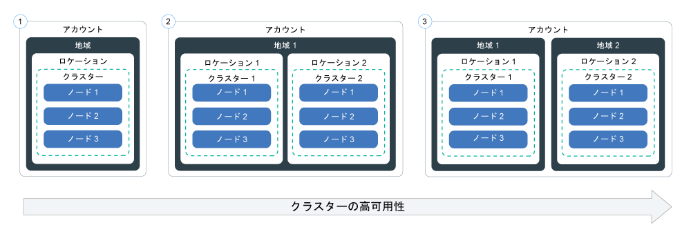

---

copyright:
  years: 2014, 2018
lastupdated: "2018-4-20"

---

{:new_window: target="_blank"}
{:shortdesc: .shortdesc}
{:screen: .screen}
{:pre: .pre}
{:table: .aria-labeledby="caption"}
{:codeblock: .codeblock}
{:tip: .tip}
{:download: .download}


# クラスターのセットアップ
{: #clusters}

{{site.data.keyword.containerlong}} を使用して、コンテナーの可用性と能力が最大になるように Kubernetes クラスターのセットアップを設計します。
{:shortdesc}

## クラスター構成の計画
{: #planning_clusters}

標準クラスターを使用してアプリの可用性を向上させることができます。
{:shortdesc}

セットアップを複数のワーカー・ノードとクラスターに分散させると、ユーザーがダウン時間を経験する可能性が低くなります。 負荷分散や負荷分離などの組み込み機能により、ホスト、ネットワーク、アプリで想定される障害に対する回復力を強化できます。

クラスターのセットアップ方法を以下にまとめます。下に行くほど可用性が高くなります。



1.  複数のワーカー・ノードを配置した 1 つのクラスター
2.  同じ地域内の別々のロケーションで実行される 2 つのクラスター (ロケーションごとに複数のワーカー・ノードを配置)
3.  別々の地域で実行される 2 つのクラスター (地域ごとに複数のワーカー・ノードを配置)

以下の技法を利用すると、クラスターの可用性を高めることができます。

<dl>
<dt>複数のワーカー・ノードにアプリを分散させる</dt>
<dd>開発者が作業するときのために、クラスターごとに複数のワーカー・ノードにコンテナー内のアプリを分散できるようにしておきます。 3 つのワーカー・ノード内に 1 つずつアプリ・インスタンスがあれば、1 つのワーカー・ノードの故障時にも、アプリの使用が中断されることはありません。 [{{site.data.keyword.Bluemix_notm}} GUI](cs_clusters.html#clusters_ui) または [CLI](cs_clusters.html#clusters_cli) からクラスターを作成するときに、含めるワーカー・ノードの数を指定できます。 Kubernetes では、1 つのクラスター内に作成できるワーカー・ノードの最大数に制限があるので、[ワーカー・ノードとポッドの割り当て量 ](https://kubernetes.io/docs/admin/cluster-large/) に留意してください。
<pre class="codeblock">
<code>bx cs cluster-create --location dal10 --workers 3 --public-vlan &lt;public_VLAN_ID&gt; --private-vlan &lt;private_VLAN_ID&gt; --machine-type &lt;u2c.2x4&gt; --name &lt;cluster_name_or_ID&gt;</code>
</pre>
</dd>
<dt>複数のクラスターにアプリを分散させる</dt>
<dd>それぞれに複数のワーカー・ノードを配置した複数のクラスターを作成します。 1 つのクラスターで障害が発生した場合でも、各ユーザーは別のクラスターにデプロイされているアプリにアクセスできます。
<p>クラスター 1:</p>
<pre class="codeblock">
<code>bx cs cluster-create --location dal10 --workers 3 --public-vlan &lt;public_VLAN_ID&gt; --private-vlan &lt;private_VLAN_ID&gt; --machine-type &lt;u2c.2x4&gt; --name &lt;cluster_name_or_ID&gt;</code>
</pre>
<p>クラスター 2:</p>
<pre class="codeblock">
<code>bx cs ccluster-create --location dal12 --workers 3 --public-vlan &lt;public_VLAN_ID&gt; --private-vlan &lt;private_VLAN_ID&gt; --machine-type &lt;u2c.2x4&gt; --name &lt;cluster_name_or_ID&gt;</code>
</pre>
</dd>
<dt>異なる地域にある複数のクラスターにアプリを分散させる</dt>
<dd>アプリをそれぞれ異なる地域にある複数のクラスターに分散させた場合は、ユーザーのいる地域に基づいてロード・バランシングを行うことができます。 ある地域でクラスター、ハードウェア、またはロケーション全体がダウンした場合は、別のロケーションにデプロイされているコンテナーにトラフィックが転送されます。
<p><strong>重要:</strong> カスタム・ドメインを構成した後、以下のコマンドを使用してクラスターを作成できます。</p>
<p>ロケーション 1:</p>
<pre class="codeblock">
<code>bx cs cluster-create --location dal10 --workers 3 --public-vlan &lt;public_VLAN_ID&gt; --private-vlan &lt;private_VLAN_ID&gt; --machine-type &lt;u2c.2x4&gt; --name &lt;cluster_name_or_ID&gt;</code>
</pre>
<p>ロケーション 2:</p>
<pre class="codeblock">
<code>bx cs cluster-create --location ams03 --workers 3 --public-vlan &lt;public_VLAN_ID&gt; --private-vlan &lt;private_VLAN_ID&gt; --machine-type &lt;u2c.2x4&gt; --name &lt;cluster_name_or_ID&gt;</code>
</pre>
</dd>
</dl>

<br />


## ワーカー・ノード構成の計画
{: #planning_worker_nodes}

Kubernetes クラスターは、ワーカー・ノードで構成され、Kubernetes マスターによって一元的にモニターされて管理されます。 クラスター管理者は、ワーカー・ノードのクラスターをどのようにセットアップするかを決定して、クラスター内のアプリをデプロイして実行するためのすべてのリソースをクラスター・ユーザーのために用意します。
{:shortdesc}

標準クラスターを作成すると、自動的にワーカー・ノードが IBM Cloud インフラストラクチャー (SoftLayer) で注文され、クラスター内のデフォルトのワーカー・ノード・プールに追加されます。 すべてのワーカー・ノードには、固有のワーカー・ノード ID とドメイン名が割り当てられます。それらをクラスターの作成後に変更してはいけません。

仮想サーバーと物理 (ベア・メタル) サーバーのどちらにするかを選択できます。 選択したハードウェア分離レベルに応じて、仮想ワーカー・ノードを共有ノードまたは専用ノードとしてセットアップできます。 また、ワーカー・ノードをパブリック VLAN とプライベート VLAN に接続するか、プライベート VLAN だけに接続するかも選択できます。 それぞれのワーカー・ノードは特定のマシン・タイプでプロビジョンされ、ワーカー・ノードにデプロイされるコンテナーが使用できる vCPU の数、メモリー、ディスク・スペースがそのタイプによって決まります。 Kubernetes では、1 つのクラスター内に作成できるワーカー・ノードの最大数に制限があります。 詳しくは、[ワーカー・ノードとポッドの割り当て量 ](https://kubernetes.io/docs/admin/cluster-large/) を参照してください。


### ワーカー・ノード用のハードウェア
{: #shared_dedicated_node}

{{site.data.keyword.Bluemix_notm}} で標準クラスターを作成するときには、ワーカー・ノードを物理マシン (ベア・メタル) としてプロビジョンするか、物理ハードウェア上で稼働する仮想マシンとしてプロビジョンするかを選択します。 フリー・クラスターを作成した場合、ワーカー・ノードは IBM Cloud インフラストラクチャー (SoftLayer) アカウントに仮想の共有ノードとして自動的にプロビジョンされます。
{:shortdesc}


<dl>
<dt>物理マシン (ベア・メタル)</dt>
<dd>ワーカー・ノードは、単一テナントの物理サーバー (ベア・メタルとも呼ばれる) としてプロビジョンできます。 ベア・メタルを使用すると、メモリーや CPU など、マシン上の物理リソースに直接アクセスできます。 このセットアップには、ホスト上で稼働する仮想マシンに物理リソースを割り振る仮想マシン・ハイパーバイザーは含まれません。 むしろ、ベア・メタル・マシンのすべてのリソースがこのワーカーの専用であるため、リソースを共有したりパフォーマンスを低下させたりする「ノイジー・ネイバー」について心配する必要がありません。
<p><strong>月単位の請求</strong>: ベア・メタル・サーバーは仮想サーバーよりも費用がかかりますが、多くのリソースとホスト制御を必要とする高性能アプリに最適です。 ベア・メタル・サーバーは月単位で請求されます。 月末前にベア・メタル・サーバーを解約しても、その月の終わりまでの金額が請求されます。 ベア・メタル・サーバーの注文およびキャンセルは、IBM Cloud インフラストラクチャー (SoftLayer) アカウントを使用した手動プロセスです。完了するまでに 1 営業日以上かかる場合があります。</p>
<p><strong>トラステッド・コンピューティングを有効にするオプション</strong>: トラステッド・コンピューティングを有効にして、ワーカー・ノードが改ざんされていないことを検証できます。クラスターの作成時にトラストを有効にしなかった場合に、後で有効にするには、`bx cs feature-enable` [コマンド](cs_cli_reference.html#cs_cluster_feature_enable)を使用します。 トラストを有効にした後に無効にすることはできません。 トラストなしで新規クラスターを作成できます。ノードの始動プロセス中のトラストの動作について詳しくは、[トラステッド・コンピューティングを使用する {{site.data.keyword.containershort_notm}}](cs_secure.html#trusted_compute) を参照してください。 トラステッド・コンピューティングは、Kubernetes バージョン 1.9 以降を実行する特定のベア・メタル・マシン・タイプのクラスターで使用可能です。`bx cs machine-types <location>` [コマンド](cs_cli_reference.html#cs_machine_types)を実行し、`Trustable` フィールドを参照して、トラストをサポートしているマシンを確認できます。</p>
<p><strong>ベア・メタル・マシン・タイプのグループ</strong>: ベア・メタルのマシン・タイプは、アプリのニーズを満たすためにさまざまなコンピュート・リソースを選択できるグループに属しています。 物理マシン・タイプは、ローカル・ストレージが仮想マシン・タイプより大きく、一部のタイプはローカル・データをバックアップするための RAID を備えています。さまざまなタイプのベア・メタル・オファリングについては、`bx cs machine-type` [コマンド](cs_cli_reference.html#cs_machine_types)を参照してください。
<ul><li>`mb1c.4x32`: RAM またはデータを大量に消費するリソースが不要な場合は、このタイプを選択して、ワーカー・ノード用にバランスの取れた物理マシン・リソース構成を実現できます。4 コア、32 GB メモリー、1 TB SATA 1 次ディスク、2 TB SATA 2 次ディスク、10 Gbps ボンディング・ネットワークを備えたバランス型です。</li>
<li>`mb1c.16x64`: RAM またはデータを大量に消費するリソースが不要な場合は、このタイプを選択して、ワーカー・ノード用にバランスの取れた物理マシン・リソース構成を実現できます。16 コア、64 GB メモリー、1 TB SATA 1 次ディスク、1.7 TB SSD 2 次ディスク、10 Gbps ボンディング・ネットワークを備えたバランス型です。</li>
<li>`mr1c.28x512`: ワーカー・ノードに使用可能な RAM を最大化するには、このタイプを選択します。 28 コア、512 GB メモリー、1 TB SATA 1 次ディスク、1.7 TB SSD 2 次ディスク、10 Gbps ボンディング・ネットワークを備えた RAM 重視型です。</li>
<li>`md1c.16x64.4x4tb`: ワーカー・ノードに大量のローカル・ディスク・ストレージ (マシンにローカルに保管されるデータをバックアップするための RAID を含む) が必要な場合は、このタイプを選択します。 1 TB の 1 次ストレージ・ディスクには RAID1 が構成され、4 TB の 2 次ストレージ・ディスクには RAID10 が構成されます。 28 コア、512 GB メモリー、2 x 1 TB RAID1 1 次ディスク、4 x 4 TB SATA RAID10 2 次ディスク、10 Gbps ボンディング・ネットワークを備えたデータ重視型を使用します。</li>
<li>`md1c.28x512.4x4tb`: ワーカー・ノードに大量のローカル・ディスク・ストレージ (マシンにローカルに保管されるデータをバックアップするための RAID を含む) が必要な場合は、このタイプを選択します。 1 TB の 1 次ストレージ・ディスクには RAID1 が構成され、4 TB の 2 次ストレージ・ディスクには RAID10 が構成されます。 16 コア、64 GB メモリー、2 x 1 TB RAID1 1 次ディスク、4 x 4 TB SATA RAID10 2 次ディスク、10 Gbps ボンディング・ネットワークを備えたデータ重視型です。</li>

</ul></p></dd>
<dt>仮想マシン</dt>
<dd>標準の仮想クラスターを作成する場合は、基礎ハードウェアを {{site.data.keyword.IBM_notm}} の複数のお客様と共有する (マルチテナンシー) か、自分専用にする (単一テナンシー) かを選択する必要があります。
<p>マルチテナント・セットアップの場合、CPU やメモリーなどの物理リソースは、同じ物理ハードウェアにデプロイされたすべての仮想マシン間で共有されます。 各仮想マシンが独立して実行できるようにするため、仮想マシン・モニター (ハイパーバイザーとも呼ばれる) が物理リソースを個別のエンティティーにセグメント化し、それらを専用リソースとして仮想マシンに割り振ります (ハイパーバイザー分離)。</p>
<p>単一テナント・セットアップの場合は、すべての物理リソースがユーザー専用になります。 同じ物理ホスト上に複数のワーカー・ノードを仮想マシンとしてデプロイできます。 マルチテナント・セットアップと同様、各ワーカー・ノードには、使用可能な物理リソースがハイパーバイザーによって割り振られます。</p>
<p>共有ノードは通常、専用ノードよりも安価です。基盤となるハードウェアのコストを複数のお客様が共同で分担するからです。ただし、共有ノードにするか専用ノードにするかを決定する際は、社内の法務部門に相談して、アプリ環境で必要になるインフラストラクチャーの分離とコンプライアンスのレベルを検討することをお勧めします。</p>
<p><strong>`u2c` または `b2c` の仮想マシン・タイプ</strong>: これらのマシンは、信頼性を確保するためにストレージ・エリア・ネットワーク (SAN) ではなくローカル・ディスクを使用します。 信頼性が高いと、ローカル・ディスクへのバイトのシリアライズ時のスループットが向上し、ネットワーク障害が原因のファイル・システムのパフォーマンス低下が軽減されます。 これらのマシン・タイプには、OS ファイル・システム用の 1 次ローカル・ディスク・ストレージ 25 GB と、すべてのコンテナー・データが書き込まれる `/var/lib/docker` ディレクトリー用の 2 次ローカル・ディスク・ストレージ 100 GB があります。</p>
<p><strong>非推奨のマシン・タイプ `u1c` または `b1c`</strong>: `u2c` および `b2c` マシン・タイプの使用を開始するために、[ワーカー・ノードを追加してマシン・タイプを更新してください](cs_cluster_update.html#machine_type)。</p></dd>
</dl>


使用可能な物理マシンと仮想マシンのタイプは、クラスターをデプロイするロケーションによって異なります。 詳しくは、`bx cs machine-type` [コマンド](cs_cli_reference.html#cs_machine_types)を参照してください。 クラスターは、[コンソール UI](#clusters_ui) または [CLI](#clusters_cli) を使用してデプロイできます。

### ワーカー・ノードの VLAN 接続
{: #worker_vlan_connection}

クラスターを作成すると、すべてのクラスターは、IBM Cloud インフラストラクチャー (SoftLayer) のアカウントの VLAN に自動的に接続されます。
{:shortdesc}

VLAN では、ワーカー・ノードとポッドをまとめたグループが同じ物理ワイヤーに接続されているかのように構成されます。 クラスターの作成時にワーカー・ノードに割り当てられるプライベート IP アドレスはプライベート VLAN によって決まり、クラスター作成時にワーカー・ノードに割り当てられるパブリック IP アドレスはパブリック VLAN によって決まります。

フリー・クラスターの場合、デフォルトでは、クラスターのワーカー・ノードはクラスターの作成時に IBM 所有のパブリック VLAN とプライベート VLAN に接続されます。 標準クラスターの場合は、ワーカー・ノードをプライベート VLAN に接続する必要があります。 ワーカー・ノードをパブリック VLAN とパブリック VLAN の両方に接続することも、プライベート VLAN だけに接続することもできます。 ワーカー・ノードをプライベート VLAN だけに接続する場合は、クラスター作成時に既存のプライベート VLAN の ID を指定するか、[プライベート VLAN を作成します](/docs/cli/reference/softlayer/index.html#sl_vlan_create)。 ワーカー・ノードにプライベート VLAN だけをセットアップする場合は、代わりのネットワーク接続ソリューションを構成する必要があります。詳しくは、[ワーカー・ノードの VLAN 接続](cs_clusters.html#worker_vlan_connection)を参照してください。

**注**: 1 つのクラスターに複数の VLAN がある場合、または同じ VLAN 上に複数のサブネットがある場合は、VLAN スパンニングをオンにして、ワーカー・ノードがプライベート・ネットワーク上で相互に通信できるようにする必要があります。 手順については、[VLAN スパンの有効化または無効化](/docs/infrastructure/vlans/vlan-spanning.html#enable-or-disable-vlan-spanning)を参照してください。

### ワーカー・ノードのメモリー制限
{: #resource_limit_node}

{{site.data.keyword.containershort_notm}} は、各ワーカー・ノードにメモリー制限を設定します。 ワーカー・ノードで実行中のポッドがこのメモリー制限を超えると、ポッドは削除されます。 Kubernetes では、この制限を[ハード・エビクションしきい値](https://kubernetes.io/docs/tasks/administer-cluster/out-of-resource/#hard-eviction-thresholds) と呼びます。
{:shortdesc}

ポッドが頻繁に削除される場合は、クラスターにさらにワーカー・ノードを追加するか、ポッドに[リソース制限](https://kubernetes.io/docs/concepts/configuration/manage-compute-resources-container/#resource-requests-and-limits-of-pod-and-container) を設定します。

メモリー容量はマシン・タイプごとに異なります。 ワーカー・ノードで使用可能なメモリーが最小しきい値より少ない場合、Kubernetes はすぐにポッドを削除します。 別のワーカー・ノードが使用可能である場合、そのポッドはそのワーカー・ノードにスケジュール変更されます。

|ワーカー・ノードのメモリー容量|ワーカー・ノードの最小メモリーしきい値|
|---------------------------|------------|
|4 GB  | 256 MB |
|16 GB | 1024 MB |
|64 GB | 4096 MB |
|128 GB| 4096 MB |
|242 GB| 4096 MB |

ワーカー・ノードで使用されているメモリーの量を調べるには、[kubectl top node ](https://kubernetes.io/docs/reference/generated/kubectl/kubectl-commands#top) を実行します。

### ワーカー・ノードの自動リカバリー
`Docker`、`kubelet`、`kube-proxy`、および `calico` は、Kubernetes ワーカー・ノードを正常に保つために稼働していなければならない重要なコンポーネントです。 時間の経過とともに、これらのコンポーネントが中断し、ワーカー・ノードが機能しない状態になることがあります。 機能しない状態のワーカー・ノードがあると、クラスターの合計処理能力が減少し、アプリにダウン時間が生じる可能性があります。

[ワーカー・ノードのヘルス・チェックを構成し、Autorecovery を有効にする](cs_health.html#autorecovery)ことができます。 Autorecovery は、構成された検査に基づいて正常でないワーカー・ノードを検出すると、ワーカー・ノードの OS の再ロードのような修正アクションをトリガーします。 Autorecovery の仕組みについて詳しくは、[Autorecovery のブログ ](https://www.ibm.com/blogs/bluemix/2017/12/autorecovery-utilizes-consistent-hashing-high-availability/) を参照してください。

<br />


## GUI でのクラスターの作成
{: #clusters_ui}

Kubernetes クラスターの目的は、アプリの高い可用性を維持する一連のリソース、ノード、ネットワーク、およびストレージ・デバイスを定義することです。 アプリをデプロイするには、その前にクラスターを作成して、そのクラスター内にワーカー・ノードの定義を設定する必要があります。
{:shortdesc}

開始する前に、従量制課金またはサブスクリプションの [{{site.data.keyword.Bluemix_notm}} アカウント](https://console.bluemix.net/registration/)が必要です。 いくつかの機能を試すために、21 日後に有効期限が切れるフリー・クラスターを作成できます。フリー・クラスターは一度に 1 つしか作成できません。

フリー・クラスターはいつでも削除できますが、21 日後にはフリー・クラスターとそのデータが削除され、復元できなくなります。必ずデータをバックアップしてください。
{: tip}

ハードウェアの分離、場所、API のバージョンなどを選択してクラスターを完全にカスタマイズするには、標準クラスターを作成します。

クラスターを作成するには、以下のようにします。

1. カタログで、**「Kubernetes クラスター」**を選択します。

2. クラスターをデプロイする地域を選択します。

3. クラスター・プランのタイプを選択します。 **「フリー」**または**「標準」**のいずれかを選択できます。 標準クラスターでは、複数ワーカー・ノードなどの機能を利用して、可用性の高い環境を実現できます。

4. クラスターの詳細を構成します。 作成するクラスターのタイプに適用される手順を実行します。

    1. **フリーおよび標準**: クラスターに名前を付けます。 名前は先頭が文字でなければならず、文字、数字、およびハイフン (-) を使用できます。35 文字以内でなければなりません。Ingress サブドメインの完全修飾ドメイン・ネームは、クラスター名と、クラスターをデプロイした地域で形成されることに注意してください。Ingress サブドメインを地域内で固有にするために、クラスター名が切り捨てられ、Ingress ドメイン・ネームにランダムな値が付加されることがあります。

    2. **標準**: クラスターをデプロイする場所を選択します。最高のパフォーマンスを得るために、物理的に最も近いロケーションを選択してください。 国外のロケーションを選択する場合は、その国にデータを物理的に保管する前に法的な許可を得なければならないことがあります。

    3. **標準**: クラスター・マスター・ノードの Kubernetes API サーバーのバージョンを選択します。

    4. **標準**: ハードウェア分離のタイプを選択します。 仮想マシンは時間単位で請求され、ベア・メタル・マシンは月単位で請求されます。

        - **仮想 - 専用**: ワーカー・ノードはお客様のアカウント専用のインフラストラクチャーでホストされます。 物理リソースは完全に分離されます。

        - **仮想 - 共有**: ハイパーバイザーや物理ハードウェアなどのインフラストラクチャー・リソースはお客様と IBM の他の利用者の間で共有されます。ただし、各ワーカー・ノードにはお客様だけがアクセスできます。 ほとんどの場合はこの安価なオプションで十分ですが、企業ポリシーに照らしてパフォーマンスとインフラストラクチャーの要件を確認する必要があります。

        - **ベア・メタル**: ベア・メタル・サーバーは月単位で課金され、IBM Cloud インフラストラクチャー (SoftLayer) との人同士のやりとりによりプロビジョンされるので、完了するのに 1 営業日以上かかることがあります。 多くのリソースとホスト制御を必要とする高性能アプリケーションには、ベア・メタルが最適です。 

        ベア・メタル・マシンは、必ず確認してからプロビジョンしてください。 月単位で課金されるので、誤って注文した後にすぐに解約しても、1 カ月分の料金が課金されます。
        {:tip}

    5.  **標準**: マシン・タイプを選択します。各ワーカー・ノードにセットアップされ、コンテナーで使用できるようになる仮想 CPU、メモリー、ディスク・スペースの量は、マシン・タイプによって決まります。 使用可能なベア・メタル・マシンと仮想マシンのタイプは、クラスターをデプロイするロケーションによって異なります。 クラスターを作成した後、ノードをクラスターに追加して別のマシン・タイプを追加できます。

    6. **標準**: クラスターに必要なワーカー・ノードの数を指定します。

    7. **標準**: パブリック VLAN (オプション) とプライベート VLAN (必須) を IBM Cloud インフラストラクチャー (SoftLayer) アカウントから選択します。 どちらの VLAN もワーカー・ノード間で通信を行いますが、パブリック VLAN は IBM 管理の Kubernetes マスターとも通信を行います。 複数のクラスターで同じ VLAN を使用できます。
        **注**: ワーカー・ノードにプライベート VLAN だけをセットアップする場合は、代わりのネットワーク接続ソリューションを構成する必要があります。詳しくは、[ワーカー・ノードの VLAN 接続](cs_clusters.html#worker_vlan_connection)を参照してください。

    8. デフォルトでは、**「ローカル・ディスクの暗号化 (Encrypt local disk)」**が選択されます。 このチェック・ボックスをクリアした場合、ホストの Docker データは暗号化されません。 [暗号化について詳しくは、こちらを参照してください](cs_secure.html#encrypted_disks)。

4. **「クラスターの作成」**をクリックします。 **「ワーカー・ノード」**タブでワーカー・ノードのデプロイメントの進行状況を確認できます。 デプロイが完了すると、クラスターが**「概要」**タブに準備されていることが分かります。
    **注:** ワーカー・ノードごとに、固有のワーカー・ノード ID とドメイン名が割り当てられます。クラスターが作成された後にこれらを手動で変更してはいけません。 ID またはドメイン名を変更すると、Kubernetes マスターがクラスターを管理できなくなります。

**次の作業**

クラスターが稼働状態になったら、以下の作業について検討できます。


-   [CLI をインストールして、クラスターでの作業を開始します。](cs_cli_install.html#cs_cli_install)
-   [クラスターにアプリをデプロイします。](cs_app.html#app_cli)
-   [独自のプライベート・レジストリーを {{site.data.keyword.Bluemix_notm}} でセットアップし、Docker イメージを保管して他のユーザーと共有します。](/docs/services/Registry/index.html)
- 1 つのクラスターに複数の VLAN がある場合、または同じ VLAN 上に複数のサブネットがある場合は、[VLAN スパンニングをオンにして](/docs/infrastructure/vlans/vlan-spanning.html#enable-or-disable-vlan-spanning)、ワーカー・ノードがプライベート・ネットワーク上で相互に通信できるようにする必要があります。
- ファイアウォールがある場合、[必要なポートを開く](cs_firewall.html#firewall)必要が生じることがあります。例えば、コマンド `bx`、`kubectl`、または `calicotl` を使用する場合、クラスターからのアウトバウンド・トラフィックを許可する場合、ネットワーク・サービスのインバウンド・トラフィックを許可する場合などです。

<br />


## CLI でのクラスターの作成
{: #clusters_cli}

Kubernetes クラスターの目的は、アプリの高い可用性を維持する一連のリソース、ノード、ネットワーク、およびストレージ・デバイスを定義することです。 アプリをデプロイするには、その前にクラスターを作成して、そのクラスター内にワーカー・ノードの定義を設定する必要があります。
{:shortdesc}

開始前に、以下のことを行います。
- 従量制課金またはサブスクリプションの [{{site.data.keyword.Bluemix_notm}} アカウント](https://console.bluemix.net/registration/) が必要です。 フリー・クラスターを 1 つ作成して機能を 21 日間試すことも、ハードウェア分離を選択して完全にカスタマイズ可能な標準クラスターを作成することもできます。
- [標準クラスターをプロビジョンするために必要な最小限の権限が IBM Cloud インフラストラクチャー (SoftLayer) にあることを確認します](cs_users.html#infra_access)。

クラスターを作成するには、以下のようにします。

1.  {{site.data.keyword.Bluemix_notm}} CLI と [{{site.data.keyword.containershort_notm}} プラグイン](cs_cli_install.html#cs_cli_install)をインストールします。

2.  {{site.data.keyword.Bluemix_notm}} CLI にログインします。 プロンプトが出されたら、{{site.data.keyword.Bluemix_notm}} 資格情報を入力します。

    ```
    bx login
    ```
    {: pre}

    **注:** フェデレーテッド ID がある場合は、`bx login --sso` を使用して、{{site.data.keyword.Bluemix_notm}} CLI にログインします。 ユーザー名を入力し、CLI 出力に示された URL を使用して、ワンタイム・パスコードを取得してください。 `--sso` なしではログインに失敗し、`--sso` オプションを指定すると成功する場合、フェデレーテッド ID があることがわかります。

3. 複数の {{site.data.keyword.Bluemix_notm}} アカウントがある場合は、Kubernetes クラスターを作成するアカウントを選択します。

4.  前に選択した {{site.data.keyword.Bluemix_notm}} 地域以外の地域で Kubernetes クラスターの作成とアクセスを行う場合は、`bx cs region-set` を実行します。

6.  クラスターを作成します。

    1.  **標準クラスター**: 使用可能なロケーションを確認します。 表示される場所は、ログインしている {{site.data.keyword.containershort_notm}} 地域によって異なります。

        ```
        bx cs locations
        ```
        {: pre}

        CLI 出力が[コンテナー地域のロケーション](cs_regions.html#locations)に一致します。

    2.  **標準クラスター**: ロケーションを選択して、そのロケーションで使用できるマシン・タイプを確認します。 マシン・タイプの指定によって、各ワーカー・ノードで使用可能な仮想コンピュート・ホストまたは物理コンピュート・ホストが決まります。

        -  **「サーバー・タイプ」**フィールドを表示して、仮想マシンと物理 (ベア・メタル) マシンのどちらにするかを選択します。
        -  **仮想**: 仮想マシンは時間単位で課金され、共有ハードウェアまたは専用ハードウェア上にプロビジョンされます。
        -  **物理**: ベア・メタル・サーバーは月単位で課金され、IBM Cloud インフラストラクチャー (SoftLayer) との人同士のやりとりによりプロビジョンされるので、完了するのに 1 営業日以上かかることがあります。 多くのリソースとホスト制御を必要とする高性能アプリケーションには、ベア・メタルが最適です。
        - **トラステッド・コンピューティングを使用する物理マシン**: Kubernetes バージョン 1.9 以降を実行するベア・メタル・クラスターの場合は、ベア・メタル・ワーカー・ノードが改ざんされていないことを検証するために、[トラステッド・コンピューティング](cs_secure.html#trusted_compute)を有効にすることも選択できます。 クラスターの作成時にトラストを有効にしなかった場合に、後で有効にするには、`bx cs feature-enable` [コマンド](cs_cli_reference.html#cs_cluster_feature_enable)を使用します。 トラストを有効にした後に無効にすることはできません。
        -  **マシン・タイプ**: デプロイするマシン・タイプを決定するには、コア、メモリー、ストレージの組み合わせについて検討したり、`bx cs machine-types` [コマンドについての説明](cs_cli_reference.html#cs_machine_types)を参照したりしてください。 クラスターを作成した後、`bx cs worker-add` [コマンド](cs_cli_reference.html#cs_worker_add) を使用して、別の物理または仮想のマシン・タイプを追加できます。

           ベア・メタル・マシンは、必ず確認してからプロビジョンしてください。 月単位で課金されるので、誤って注文した後にすぐに解約しても、1 カ月分の料金が課金されます。
           {:tip}

        ```
        bx cs machine-types <location>
        ```
        {: pre}

    3.  **標準クラスター**: このアカウントの IBM Cloud インフラストラクチャー (SoftLayer) にパブリック VLAN とプライベート VLAN が既に存在しているかどうかを確認します。

        ```
        bx cs vlans <location>
        ```
        {: pre}

        ```
        ID        Name                Number   Type      Router  
        1519999   vlan   1355     private   bcr02a.dal10  
        1519898   vlan   1357     private   bcr02a.dal10 
        1518787   vlan   1252     public   fcr02a.dal10 
        1518888   vlan   1254     public    fcr02a.dal10
        ```
        {: screen}

        パブリック VLAN およびプライベート VLAN が既に存在する場合、対応するルーターをメモに取ります。 必ず、プライベート VLAN ルーターの先頭は <code>bcr</code> (バックエンド・ルーター)、パブリック VLAN ルーターの先頭は <code>fcr</code> (フロントエンド・ルーター) になります。 クラスターを作成し、パブリック VLAN とプライベート VLAN を指定するときには、それらの接頭部の後の番号と文字の組み合わせが一致する必要があります。このサンプル出力では、すべてのルーターに
`02a.dal10` が含まれているため、これらのプライベート VLAN とパブリック VLAN はどの組み合わせでも使用できます。

        ワーカー・ノードはプライベート VLAN に接続する必要があります。オプションで、ワーカー・ノードをパブリック VLAN に接続できます。**注**: ワーカー・ノードにプライベート VLAN だけをセットアップする場合は、代わりのネットワーク接続ソリューションを構成する必要があります。詳しくは、[ワーカー・ノードの VLAN 接続](cs_clusters.html#worker_vlan_connection)を参照してください。

    4.  **フリー・クラスターおよび標準クラスター**: `cluster-create` コマンドを実行します。 vCPU 2 つと 4GB のメモリーでセットアップされた 1 つのワーカー・ノードが含まれており、21 日後に自動的に削除されるフリー・クラスターのなかから選択できます。標準クラスターを作成する場合、デフォルトでは、ワーカー・ノードのディスクは暗号化され、そのハードウェアは IBM の複数のお客様によって共有され、使用時間に応じて課金されます。 </br>標準クラスターの例。 次のようにクラスターのオプションを指定します。

        ```
        bx cs cluster-create --location dal10 --machine-type u2c.2x4 --hardware <shared_or_dedicated> --public-vlan <public_VLAN_ID> --private-vlan <private_VLAN_ID> --workers 3 --name <cluster_name> --kube-version <major.minor.patch> [--disable-disk-encrypt] [--trusted]
        ```
        {: pre}

        フリー・クラスターの例。 次のようにクラスター名を指定します。

        ```
        bx cs cluster-create --name my_cluster
        ```
        {: pre}

        <table>
        <thead>
        <th colspan=2> このコマンドの構成要素について</th>
        </thead>
        <tbody>
        <tr>
        <td><code>cluster-create</code></td>
        <td>{{site.data.keyword.Bluemix_notm}} 組織内にクラスターを作成するためのコマンド。</td>
        </tr>
        <tr>
        <td><code>--location <em>&lt;location&gt;</em></code></td>
        <td>**標準クラスター**: <em>&lt;location&gt;</em> を、クラスターを作成する {{site.data.keyword.Bluemix_notm}} 場所の ID に置き換えます。 [使用可能なロケーション](cs_regions.html#locations)は、ログインしている {{site.data.keyword.containershort_notm}} 地域によって異なります。</td>
        </tr>
        <tr>
        <td><code>--machine-type <em>&lt;machine_type&gt;</em></code></td>
        <td>**標準クラスター**: マシン・タイプを選択します。 ワーカー・ノードは、共有または専用ハードウェア上に仮想マシンとしてデプロイすることも、ベア・メタル上に物理マシンとしてデプロイすることもできます。 使用可能な物理マシンと仮想マシンのタイプは、クラスターをデプロイするロケーションによって異なります。 詳しくは、`bx cs machine-type` [コマンド](cs_cli_reference.html#cs_machine_types)についての説明を参照してください。 フリー・クラスターの場合、マシン・タイプを定義する必要はありません。</td>
        </tr>
        <tr>
        <td><code>--hardware <em>&lt;shared_or_dedicated&gt;</em></code></td>
        <td>**標準クラスター、仮想のみ**: ワーカー・ノードのハードウェア分離のレベル。 使用可能な物理リソースを自分専用にする場合は dedicated を使用し、IBM の他のお客様と物理リソースを共有することを許可する場合は shared を使用します。 デフォルトは shared です。 この値は、標準クラスターではオプションで、フリー・クラスターでは使用できません。</td>
        </tr>
        <tr>
        <td><code>--public-vlan <em>&lt;public_vlan_id&gt;</em></code></td>
        <td><ul>
          <li>**フリー・クラスター**: パブリック VLAN を定義する必要はありません。 フリー・クラスターは IBM 所有のパブリック VLAN に自動的に接続されます。</li>
          <li>**標準クラスター**: IBM Cloud インフラストラクチャー (SoftLayer) アカウントでそのロケーション用にパブリック VLAN を既にセットアップしている場合には、そのパブリック VLAN の ID を入力します。 ワーカー・ノードをプライベート VLAN だけに接続する場合は、このオプションを指定しないでください。 **注**: ワーカー・ノードにプライベート VLAN だけをセットアップする場合は、代わりのネットワーク接続ソリューションを構成する必要があります。詳しくは、[ワーカー・ノードの VLAN 接続](cs_clusters.html#worker_vlan_connection)を参照してください。<br/><br/>
          <strong>注</strong>: プライベート VLAN ルーターは常に先頭が <code>bcr</code> (バックエンド・ルーター) となり、パブリック VLAN ルーターは常に先頭が <code>fcr</code> (フロントエンド・ルーター) となります。 クラスターを作成し、パブリック VLAN とプライベート VLAN を指定するときには、それらの接頭部の後の番号と文字の組み合わせが一致する必要があります。</li>
        </ul></td>
        </tr>
        <tr>
        <td><code>--private-vlan <em>&lt;private_vlan_id&gt;</em></code></td>
        <td><ul><li>**フリー・クラスター**: プライベート VLAN を定義する必要はありません。 フリー・クラスターは IBM 所有のプライベート VLAN に自動的に接続されます。</li><li>**標準クラスター**: IBM Cloud インフラストラクチャー (SoftLayer) アカウントでそのロケーション用にプライベート VLAN を既にセットアップしている場合には、そのプライベート VLAN の ID を入力します。 ご使用のアカウントでプライベート VLAN がない場合は、このオプションを指定しないでください。 {{site.data.keyword.containershort_notm}} が自動的にプライベート VLAN を作成します。<br/><br/><strong>注</strong>: プライベート VLAN ルーターは常に先頭が <code>bcr</code> (バックエンド・ルーター) となり、パブリック VLAN ルーターは常に先頭が <code>fcr</code> (フロントエンド・ルーター) となります。 クラスターを作成し、パブリック VLAN とプライベート VLAN を指定するときには、それらの接頭部の後の番号と文字の組み合わせが一致する必要があります。</li></ul></td>
        </tr>
        <tr>
        <td><code>--name <em>&lt;name&gt;</em></code></td>
        <td>**フリー・クラスターおよび標準クラスター**: <em>&lt;name&gt;</em> をクラスターの名前に置き換えます。 名前は先頭が文字でなければならず、文字、数字、およびハイフン (-) を使用できます。35 文字以内でなければなりません。Ingress サブドメインの完全修飾ドメイン・ネームは、クラスター名と、クラスターをデプロイした地域で形成されることに注意してください。Ingress サブドメインを地域内で固有にするために、クラスター名が切り捨てられ、Ingress ドメイン・ネームにランダムな値が付加されることがあります。</td>
        </tr>
        <tr>
        <td><code>--workers <em>&lt;number&gt;</em></code></td>
        <td>**標準クラスター**: クラスターに含めるワーカー・ノードの数。 <code>--workers</code> オプションが指定されていない場合は、ワーカー・ノードが 1 つ作成されます。</td>
        </tr>
        <tr>
          <td><code>--kube-version <em>&lt;major.minor.patch&gt;</em></code></td>
          <td>**標準クラスター**: クラスター・マスター・ノードの Kubernetes のバージョン。 この値はオプションです。 バージョンを指定しなかった場合、クラスターは、サポートされるデフォルトの Kubernetes バージョンを使用して作成されます。 使用可能なバージョンを確認するには、<code>bx cs kube-versions</code> を実行します。
</td>
        </tr>
        <tr>
        <td><code>--disable-disk-encrypt</code></td>
        <td>**フリー・クラスターおよび標準クラスター**: ワーカー・ノードには、デフォルトでディスク暗号化の機能があります。[詳しくはこちらを参照してください](cs_secure.html#encrypted_disks)。 暗号化を無効にする場合は、このオプションを組み込みます。</td>
        </tr>
        <tr>
        <td><code>--trusted</code></td>
        <td>**標準のベア・メタル・クラスター**: [トラステッド・コンピューティング](cs_secure.html#trusted_compute)を有効にして、ベア・メタル・ワーカー・ノードが改ざんされていないことを検証します。 クラスターの作成時にトラストを有効にしなかった場合に、後で有効にするには、`bx cs feature-enable` [コマンド](cs_cli_reference.html#cs_cluster_feature_enable)を使用します。 トラストを有効にした後に無効にすることはできません。</td>
        </tr>
        </tbody></table>

7.  クラスターの作成が要求されたことを確認します。

    ```
    bx cs clusters
    ```
    {: pre}

    **注:** 仮想マシンの場合、ワーカー・ノード・マシンの注文と、アカウントへのクラスターのセットアップとプロビジョンには、数分かかります。 ベア・メタル物理マシンは、IBM Cloud インフラストラクチャー (SoftLayer) との人同士のやりとりによりプロビジョンされるので、完了するのに 1 営業日以上かかることがあります。

    クラスターのプロビジョニングが完了すると、クラスターの状況が **deployed** に変わります。

    ```
    Name         ID                                   State      Created          Workers   Location   Version
    my_cluster   paf97e8843e29941b49c598f516de72101   deployed   20170201162433   1         mil01      1.8.11
    ```
    {: screen}

8.  ワーカー・ノードの状況を確認します。

    ```
    bx cs workers <cluster_name_or_ID>
    ```
    {: pre}

    ワーカー・ノードの準備が完了すると、状態が **normal** に変わり、状況が **Ready** になります。 ノードの状況が**「Ready」**になったら、クラスターにアクセスできます。

    **注:** ワーカー・ノードごとに、固有のワーカー・ノード ID とドメイン名が割り当てられます。クラスターが作成された後にこれらを手動で変更してはなりません。 ID またはドメイン名を変更すると、Kubernetes マスターがクラスターを管理できなくなります。

    ```
    ID                                                 Public IP       Private IP      Machine Type   State    Status   Location   Version
    kube-mil01-paf97e8843e29941b49c598f516de72101-w1   169.xx.xxx.xxx  10.xxx.xx.xxx   free           normal   Ready    mil01      1.8.11
    ```
    {: screen}

9. 作成したクラスターを、このセッションのコンテキストとして設定します。 次の構成手順は、クラスターの操作時に毎回行ってください。
    1.  環境変数を設定して Kubernetes 構成ファイルをダウンロードするためのコマンドを取得します。

        ```
        bx cs cluster-config <cluster_name_or_ID>
        ```
        {: pre}

        構成ファイルのダウンロードが完了すると、そのローカルの Kubernetes 構成ファイルのパスを環境変数として設定するために使用できるコマンドが表示されます。

        OS X の場合の例:

        ```
        export KUBECONFIG=/Users/<user_name>/.bluemix/plugins/container-service/clusters/mycluster/kube-config-prod-dal10-mycluster.yml
        ```
        {: screen}

    2.  `KUBECONFIG` 環境変数を設定するためのコマンドとしてターミナルに表示されたものを、コピーして貼り付けます。
    3.  `KUBECONFIG` 環境変数が適切に設定されたことを確認します。

        OS X の場合の例:

        ```
        echo $KUBECONFIG
        ```
        {: pre}

        出力:

        ```
        /Users/<user_name>/.bluemix/plugins/container-service/clusters/mycluster/kube-config-prod-dal10-mycluster.yml

        ```
        {: screen}

10. デフォルトのポート `8001` で Kubernetes ダッシュボードを起動します。
    1.  デフォルトのポート番号でプロキシーを設定します。

        ```
        kubectl proxy
        ```
        {: pre}

        ```
        Starting to serve on 127.0.0.1:8001
        ```
        {: screen}

    2.  Web ブラウザーで以下の URL を開いて、Kubernetes ダッシュボードを表示します。

        ```
        http://localhost:8001/ui
        ```
        {: codeblock}


**次の作業**


-   [クラスターにアプリをデプロイします。](cs_app.html#app_cli)
-   [`kubectl` コマンド・ラインを使用してクラスターを管理します。](https://kubernetes.io/docs/user-guide/kubectl/)
-   [独自のプライベート・レジストリーを {{site.data.keyword.Bluemix_notm}} でセットアップし、Docker イメージを保管して他のユーザーと共有します。](/docs/services/Registry/index.html)
- 1 つのクラスターに複数の VLAN がある場合、または同じ VLAN 上に複数のサブネットがある場合は、[VLAN スパンニングをオンにして](/docs/infrastructure/vlans/vlan-spanning.html#enable-or-disable-vlan-spanning)、ワーカー・ノードがプライベート・ネットワーク上で相互に通信できるようにする必要があります。
- ファイアウォールがある場合、[必要なポートを開く](cs_firewall.html#firewall)必要が生じることがあります。例えば、コマンド `bx`、`kubectl`、または `calicotl` を使用する場合、クラスターからのアウトバウンド・トラフィックを許可する場合、ネットワーク・サービスのインバウンド・トラフィックを許可する場合などです。

<br />


## クラスターの状態の表示
{: #states}

Kubernetes クラスターの状態を確認して、クラスターの可用性と容量、発生した可能性のある問題に関する情報を取得します。
{:shortdesc}

特定のクラスターに関する情報 (ロケーション、マスター URL、Ingress サブドメイン、バージョン、ワーカー、所有者、モニター・ダッシュボードなど) を表示するには、`bx cs cluster-get <cluster_name_or_ID>` [コマンド](cs_cli_reference.html#cs_cluster_get)を使用します。 `--showResources` フラグを指定すると、ストレージ・ポッドのアドオンやパブリック IP とプライベート IP のサブネット VLAN など、さらに多くのクラスター・リソースを表示できます。

現在のクラスターの状態を確認するには、`bx cs clusters` コマンドを実行して **State** フィールドを見つけます。 クラスターとワーカー・ノードのトラブルシューティングを行うには、[クラスターのトラブルシューティング ](cs_troubleshoot.html#debug_clusters)を参照してください。

<table summary="表の行はすべて左から右に読みます。1 列目はクラスターの状態、2 列目は説明です。">
   <thead>
   <th>クラスターの状態</th>
   <th>説明</th>
   </thead>
   <tbody>
<tr>
   <td>Aborted</td>
   <td>Kubernetes マスターがデプロイされる前にユーザーからクラスターの削除が要求されました。 クラスターの削除が完了すると、クラスターはダッシュボードから除去されます。 クラスターが長時間この状態になっている場合は、[{{site.data.keyword.Bluemix_notm}} サポート・チケット](cs_troubleshoot.html#ts_getting_help)を開いてください。</td>
   </tr>
 <tr>
     <td>Critical</td>
     <td>Kubernetes マスターにアクセスできないか、クラスター内のワーカー・ノードがすべてダウンしています。 </td>
    </tr>
   <tr>
     <td>Delete failed</td>
     <td>Kubernetes マスターまたは 1 つ以上のワーカー・ノードを削除できません。  </td>
   </tr>
   <tr>
     <td>Deleted</td>
     <td>クラスターは削除されましたが、まだダッシュボードからは除去されていません。 クラスターが長時間この状態になっている場合は、[{{site.data.keyword.Bluemix_notm}} サポート・チケット](cs_troubleshoot.html#ts_getting_help)を開いてください。 </td>
   </tr>
   <tr>
   <td>Deleting</td>
   <td>クラスターの削除とクラスター・インフラストラクチャーの破棄を実行中です。 クラスターにアクセスできません。  </td>
   </tr>
   <tr>
     <td>Deploy failed</td>
     <td>Kubernetes マスターのデプロイメントを完了できませんでした。 この状態はお客様には解決できません。 [{{site.data.keyword.Bluemix_notm}} サポート・チケット](cs_troubleshoot.html#ts_getting_help)を開いて、IBM Cloud サポートに連絡してください。</td>
   </tr>
     <tr>
       <td>Deploying</td>
       <td>Kubernetes マスターがまだ完全にデプロイされていません。 クラスターにアクセスできません。 クラスターが完全にデプロイされるまで待ってからクラスターの正常性を確認してください。</td>
      </tr>
      <tr>
       <td>Normal</td>
       <td>クラスター内のすべてのワーカー・ノードが稼働中です。 クラスターにアクセスし、アプリをクラスターにデプロイできます。 この状態は正常と見なされるので、アクションは必要ありません。 **注**: ワーカー・ノードは正常であっても、[ネットワーキング](cs_troubleshoot_network.html)や[ストレージ](cs_troubleshoot_storage.html)などの他のインフラストラクチャー・リソースには注意が必要な可能性もあります。</td>
    </tr>
      <tr>
       <td>Pending</td>
       <td>Kubernetes マスターはデプロイされています。 ワーカー・ノードはプロビジョン中であるため、まだクラスターでは使用できません。 クラスターにはアクセスできますが、アプリをクラスターにデプロイすることはできません。  </td>
     </tr>
   <tr>
     <td>Requested</td>
     <td>クラスターを作成し、Kubernetes マスターとワーカー・ノードのインフラストラクチャーを注文するための要求が送信されました。 クラスターのデプロイメントが開始されると、クラスターの状態は「<code>Deploying</code>」に変わります。 クラスターが長時間「<code>Requested</code>」状態になっている場合は、[{{site.data.keyword.Bluemix_notm}} サポート・チケット](cs_troubleshoot.html#ts_getting_help)を開いてください。 </td>
   </tr>
   <tr>
     <td>Updating</td>
     <td>Kubernetes マスターで実行される Kubernetes API サーバーが、新しい Kubernetes API バージョンに更新されています。 更新中、クラスターにアクセスすることも変更することもできません。 ユーザーがデプロイしたワーカー・ノード、アプリ、リソースは変更されず、引き続き実行されます。 更新が完了するまで待ってから、クラスターの正常性を確認してください。 </td>
   </tr>
    <tr>
       <td>Warning</td>
       <td>クラスター内の 1 つ以上のワーカー・ノードが使用不可です。ただし、他のワーカー・ノードが使用可能であるため、ワークロードを引き継ぐことができます。 </td>
    </tr>
   </tbody>
 </table>


<br />


## クラスターの削除
{: #remove}

従量課金 (PAYG) アカウントで作成したフリー・クラスターと標準クラスターは、不要になったら手動で削除して、リソースがそれ以上消費されないようにする必要があります。
{:shortdesc}

**警告:**
  - 永続ストレージ内のクラスターやデータのバックアップは作成されません。 クラスターまたは永続ストレージを削除すると永久に削除されます。元に戻すことはできません。
  - クラスターを削除するときには、クラスターの作成時に自動的にプロビジョニングされたサブネットと、`bx cs cluster-subnet-create` コマンドを使用して作成したサブネットもすべて削除します。ただし、`bx cs cluster-subnet-add コマンド`を使用して既存のサブネットをクラスターに手動で追加した場合、これらのサブネットは IBM Cloud インフラストラクチャー (SoftLayer) アカウントから削除されず、他のクラスターで再利用できます。

クラスターを削除するには、以下のようにします。

-   {{site.data.keyword.Bluemix_notm}} GUI から
    1.  クラスターを選択して、**「その他のアクション...」**メニューから**「削除」**をクリックします。

-   {{site.data.keyword.Bluemix_notm}} CLI から
    1.  使用可能なクラスターをリストします。

        ```
        bx cs clusters
        ```
        {: pre}

    2.  クラスターを削除します。

        ```
        bx cs cluster-rm <cluster_name_or_ID>
        ```
        {: pre}

    3.  プロンプトに従って、コンテナー、ポッド、バインドされたサービス、永続ストレージ、およびシークレットを含むクラスター・リソースを削除するかどうかを選択します。
      - **永続ストレージ**: 永続ストレージでは、データの高可用性を確保できます。[既存のファイル共有](cs_storage.html#existing)を使用して永続ボリューム請求を作成した場合は、クラスターを削除するときにファイル共有を削除できません。 このファイル共有は後で IBM Cloud インフラストラクチャー (SoftLayer) ポートフォリオから手動で削除する必要があります。

          **注**: 毎月の課金サイクルの規定で、永続ボリューム請求を月の最終日に削除することはできません。 永続ボリューム請求を月の末日に削除した場合、削除は翌月初めまで保留状態になります。

次のステップ:
- 削除したクラスターの名前は、`bx cs clusters` コマンドを実行しても使用可能なクラスターのリストに表示されなくなったら、再利用できます。
- サブネットを残した場合は、[それらを新しいクラスターで再利用](cs_subnets.html#custom)することも、後で IBM Cloud インフラストラクチャー (SoftLayer) ポートフォリオから手動で削除することもできます。
- 永続ストレージを残した場合は、後で {{site.data.keyword.Bluemix_notm}} GUI の IBM Cloud インフラストラクチャー (SoftLayer) ダッシュボードを使用してストレージを削除できます。

