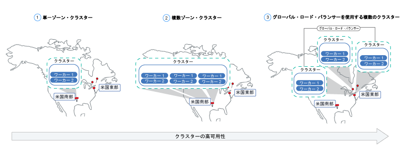
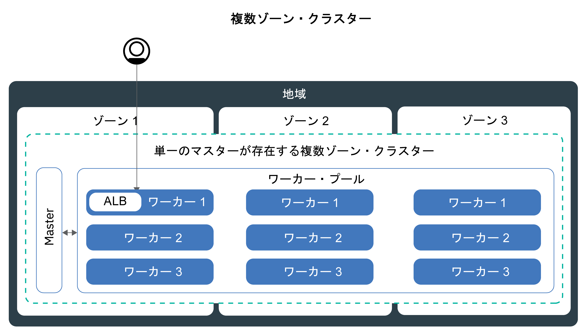

---

copyright:
  years: 2014, 2018
lastupdated: "2018-10-25"

---

{:new_window: target="_blank"}
{:shortdesc: .shortdesc}
{:screen: .screen}
{:pre: .pre}
{:table: .aria-labeledby="caption"}
{:codeblock: .codeblock}
{:tip: .tip}
{:download: .download}


# クラスターおよびワーカー・ノードのセットアップの計画
{: #plan_clusters}
{{site.data.keyword.containerlong}} を使用して、アプリの可用性と容量を最大化できるように標準クラスターを設計します。

## 可用性の高いクラスター
{: #ha_clusters}

アプリを複数のワーカー・ノード、ゾーン、クラスターに分散させると、ユーザーがダウン時間を経験する可能性が低くなります。 ロード・バランシングや負荷の分離などの組み込み機能により、ホスト、ネットワーク、アプリで想定される障害に対する回復力を強化できます。
{: shortdesc}

クラスターのセットアップ方法を以下にまとめます。下に行くほど可用性が高くなります。



1. 1 つのワーカー・プール内に複数のワーカー・ノードがある[単一ゾーン・クラスター ](#single_zone)。
2. ワーカー・ノードが 1 つの地域内の複数のゾーン間に分散させる[複数ゾーン・クラスター](#multizone)。
3. 複数のゾーンまたは地域をまたいでセットアップされ、グローバル・ロード・バランサーを介して接続される[複数クラスター](#multiple_clusters)。

## 単一ゾーン・クラスター
{: #single_zone}

アプリの可用性を向上させ、クラスター内で 1 つのワーカー・ノードが使用できない場合にフェイルオーバーできるようにするには、単一ゾーン・クラスターに追加のワーカー・ノードを付加します。
{: shortdesc}


デフォルトでは、単一ゾーン・クラスターには、`default` という名前のワーカー・プールがセットアップされます。 このワーカー・プールに、クラスターの作成時に定義した同じ構成 (マシン・タイプなど) のワーカー・ノードがグループ化されています。 [既存のワーカー・プールのサイズを変更](cs_clusters.html#resize_pool)するか、[新しいワーカー・プールを追加](cs_clusters.html#add_pool)して、クラスターにワーカー・ノードを追加できます。

ワーカー・ノードをさらに追加すると、複数のワーカー・ノード間でアプリ・インスタンスを分散できます。 1 つのワーカー・ノードがダウンしても、使用可能なワーカー・ノード上のアプリ・インスタンスは実行を継続します。 Kubernetes が、使用不可のワーカー・ノード内のポッドのスケジュールを自動的に変更して、アプリのパフォーマンスと容量を確保します。 ポッドがワーカー・ノード間に均等に分散されるようにするには、[ポッド・アフィニティー](https://kubernetes.io/docs/concepts/configuration/assign-pod-node/#inter-pod-affinity-and-anti-affinity-beta-feature)を実装します。

**単一ゾーン・クラスターを複数ゾーン・クラスターに変換できますか?**</br>
はい。クラスターが[サポートされている複数ゾーンの大都市](cs_regions.html#zones)のいずれかにある場合は可能です。 [スタンドアロン・ワーカー・ノードからワーカー・プールへの更新](cs_cluster_update.html#standalone_to_workerpool)を参照してください。


**複数ゾーン・クラスターを使用しなければなりませんか?**</br>
いいえ。好きなだけ単一ゾーン・クラスターを作成できます。 実際に、管理をシンプルにしたい場合や、クラスターを特定の[単一ゾーンの都市](cs_regions.html#zones)に置く必要があるという場合は、単一ゾーン・クラスターを使用するほうが良いでしょう。


## 複数ゾーン・クラスター
{: #multizone}

{{site.data.keyword.containerlong}} では、複数ゾーン・クラスターを作成できます。 ワーカー・プールを使用してアプリを複数のワーカー・ノードとゾーンに分散させると、ユーザーがダウン時間を経験する可能性が低くなります。 負荷分散などの組み込み機能により、ホスト、ネットワーク、アプリで想定されるゾーンの障害に対する回復力を高められます。 あるゾーンのリソースがダウンしても、他のゾーンでクラスター・ワークロードは動作し続けます。 **注**: {{site.data.keyword.Bluemix_dedicated_notm}} インスタンスでは、単一ゾーン・クラスターのみ使用できます。
{: shortdesc}

**ワーカー・プールとは何ですか?**</br>
ワーカー・プールとは、マシン・タイプ、CPU、メモリーなど、フレーバーが同じワーカー・ノードの集合のことです。 クラスターを作成すると、デフォルトのワーカー・プールが自動的に作成されます。 複数のゾーンにまたがるプールにワーカー・ノードを分散させたり、ワーカー・ノードをプールに追加したり、ワーカー・ノードを更新したりするために、新しい `ibmcloud ks worker-pool` コマンドを使用できます。

**スタンドアロン・ワーカー・ノードはまだ使用できますか?**</br>
スタンドアロン・ワーカー・ノードで構成された従来のクラスター・セットアップは、サポートされますが、非推奨です。 スタンドアロン・ワーカー・ノードを使用するのではなく、[ワーカー・プールをクラスターに追加](cs_clusters.html#add_pool)し、[ワーカー・プールを使用するようにマイグレーション](cs_cluster_update.html#standalone_to_workerpool)して、ワーカー・ノードを編成してください。

**単一ゾーン・クラスターを複数ゾーン・クラスターに変換できますか?**</br>
はい。クラスターが[サポートされている複数ゾーンの大都市](cs_regions.html#zones)のいずれかにある場合は可能です。 [スタンドアロン・ワーカー・ノードからワーカー・プールへの更新](cs_cluster_update.html#standalone_to_workerpool)を参照してください。


### 複数ゾーン・クラスターのセットアップの詳細
{: #mz_setup}




ゾーンをクラスターに追加して、ワーカー・プール内のワーカー・ノードを 1つの地域内の複数のゾーンに複製できます。 複数ゾーン・クラスターは、可用性と障害復旧を保証するために、ワーカー・ノード間やゾーン間に均等にポッドをスケジュールするように設計されています。 ワーカー・ノードがゾーン間に均等に分散されていない場合や、いずれかのゾーンの容量が十分でない場合は、Kubernetes スケジューラーが、要求されたポッドを一部スケジュールできないことがあります。 その結果、十分な容量が使用可能になるまで、ポッドが**保留中**の状態になる可能性があります。 Kubernetes スケジューラーがベスト・エフォート分散でゾーン間にポッドを分散させるように、デフォルトの動作を変更する場合は、`preferredDuringSchedulingIgnoredDuringExecution` [ポッド・アフィニティー・ポリシー ](https://kubernetes.io/docs/concepts/configuration/assign-pod-node/#inter-pod-affinity-and-anti-affinity-beta-feature)を使用します。

**3 つのゾーン内にワーカー・ノードが必要なのはなぜですか?** </br>
ワークロードを 3 つのゾーン間に分散させると、1 つまたは 2 つのゾーンが使用できなくなってもアプリの高可用性が確保されるうえに、クラスターのセットアップのコスト効率も向上します。 なぜでしょうか? 以下に例を示します。

アプリのワークロードを処理するのに、コアを 6 つ搭載したワーカー・ノードが 1 台必要であるとします。 クラスターの可用性を高めるには、次の方法があります。

- **もう 1 つのゾーンにリソースを複製する:** この方法では、ワーカー・ノードが 2 つになります。各ゾーンに 6 コアあるので、合計で 12 コアになります。 </br>
- **3 つのゾーン間にリソースを分散させる:**  この方法では、各ゾーンに 3 コアがデプロイされるので、合計容量は 9 コアになります。 ワークロードを処理するには、同時に 2 つのゾーンが稼働している必要があります。 1 つのゾーンが使用不可になった場合は、別の 2 つのゾーンでワークロードを処理できます。 2 つのゾーンが使用不可になった場合は、残りの 3 コアが稼働してワークロードを処理します。 ゾーンあたり 3 コアをデプロイするということは、マシンが小規模になるので、コストが削減されることになります。</br>

**Kubernetes マスターはどのようにセットアップされますか?** </br>
複数ゾーン・クラスターには、単一の Kubernetes マスターがセットアップされ、これはワーカーと同じ大都市圏にプロビジョンされます。 例えば、`dal10`、`dal12`、または `dal13` ゾーンのうち 1 つまたは複数にワーカーがある場合、マスターは複数ゾーンの大都市のダラスにあります。

**Kubernetes マスターが使用不可の場合にどのような状況になりますか?** </br>
[Kubernetes マスター](cs_tech.html#architecture)は、クラスターを稼働状態に保つための主要なコンポーネントです。 マスターは、クラスターの真実の単一点 (Single Point of Truth) として機能する etcd データベースに、クラスター・リソースとその構成を保管します。 Kubernetes API サーバーは、ワーカー・ノードからマスターへのすべてのクラスター管理要求、またはクラスター・リソースと対話する場合のメインエントリー・ポイントです。<br><br>マスターに障害が発生した場合、ワークロードは引き続きワーカー・ノードで実行されますが、`kubectl` コマンドを使用してクラスター・リソースを操作したり、マスターの Kubernetes API サーバーがバックアップされるまでクラスターの正常性を表示したりすることはできません。 マスターの障害時にポッドがダウンすると、ワーカー・ノードが再び Kubernetes API サーバーに到達できるまで、ポッドをスケジュール変更することはできません。<br><br>マスターの障害時にも、`ibmcloud ks` コマンドを {{site.data.keyword.containerlong_notm}} API に対して実行して、ワーカー・ノードや VLAN などのインフラストラクチャー・リソースを操作することができます。 クラスターに対してワーカー・ノードを追加または削除して現在のクラスター構成を変更する場合、マスターがバックアップされるまで変更は行われません。 **注**: マスターの障害時はワーカー・ノードを再始動またはリブートしないでください。 このアクションにより、ワーカー・ノードからポッドが削除されます。 Kubernetes API サーバーが使用不可のため、ポッドをクラスター内の他のワーカー・ノードにスケジュール変更することはできません。


Kubernetes マスターの障害からクラスターを保護したい場合や、複数ゾーン・クラスターを使用できない地域の場合は、[複数のクラスターをセットアップし、グローバル・ロード・バランサーを使用して接続する](#multiple_clusters)ことができます。

**複数のゾーンにまたがるワーカーとマスター間の通信を可能にするために何かする必要がありますか?**</br>
はい。 1 つのクラスターに複数の VLAN がある場合、同じ VLAN 上に複数のサブネットがある場合、または複数ゾーン・クラスターがある場合は、IBM Cloud インフラストラクチャー (SoftLayer) アカウントに対して [VLAN スパンニング](/docs/infrastructure/vlans/vlan-spanning.html#vlan-spanning)を有効にして、ワーカー・ノードがプライベート・ネットワーク上で相互に通信できるようにする必要があります。 この操作を実行するには、**「ネットワーク」>「ネットワーク VLAN スパンニングの管理」**で設定する[インフラストラクチャー権限](cs_users.html#infra_access)が必要です。ない場合は、アカウント所有者に対応を依頼してください。 VLAN スパンニングが既に有効になっているかどうかを確認するには、`ibmcloud ks vlan-spanning-get` [コマンド](/docs/containers/cs_cli_reference.html#cs_vlan_spanning_get)を使用します。 {{site.data.keyword.BluDirectLink}} を使用している場合は、代わりに[仮想ルーター機能 (VRF)](/docs/infrastructure/direct-link/subnet-configuration.html#more-about-using-vrf) を使用する必要があります。 VRF を有効にするには、IBM Cloud インフラストラクチャー (SoftLayer) のアカウント担当者に連絡してください。

**公共のインターネットからユーザーがアプリにアクセスするにはどうしたらよいですか?**</br>
Ingress アプリケーション・ロード・バランサー (ALB) またはロード・バランサー・サービスを使用して、アプリケーションを公開できます。

- **Ingress アプリケーション・ロード・バランサー (ALB):** デフォルトでは、パブリック ALB がクラスター内の各ゾーンに自動的に作成されて有効になります。地域ごとに 1 つの MZLB が存在するように、クラスター用の Cloudflare 複数ゾーン・ロード・バランサー (MZLB) も自動的に作成され、デプロイされます。 MZLB は、ALB の IP アドレスを同じホスト名の背後に配置し、これらの IP アドレスが使用可能かどうかを判別するためにこれらのアドレスに対してヘルス・チェックを有効にします。 例えば、米国東部地域の 3 つのゾーンにワーカー・ノードがある場合、ホスト名 `yourcluster.us-east.containers.appdomain.cloud` には 3 つの ALB IP アドレスがあります。 MZLB は、地域の各ゾーンのパブリック ALB IP をヘルス・チェックし、そのヘルス・チェックに基づいて DNS 参照の結果を最新の状態に保ちます。 詳しくは、[Ingress のコンポーネントとアーキテクチャー](cs_ingress.html#planning)を参照してください。

- **ロード・バランサー・サービス:** ロード・バランサー・サービスは、1 つのゾーンにのみセットアップされます。アプリに対する着信要求は、この 1 つのゾーンから他のゾーンのすべてのアプリ・インスタンスに転送されます。 このゾーンが使用不可になると、インターネットからアプリにアクセスできなくなる可能性があります。 他のゾーンに追加のロード・バランサー・サービスをセットアップすることで、単一ゾーンの障害に対応できます。 詳しくは、可用性の高い[ロード・バランサー・サービス](cs_loadbalancer.html#multi_zone_config)を参照してください。

**複数ゾーン・クラスターの永続ストレージはセットアップできますか?**</br>
可用性の高い永続ストレージの場合は、[{{site.data.keyword.cloudant_short_notm}}](/docs/services/Cloudant/getting-started.html#getting-started-with-cloudant) や [{{site.data.keyword.cos_full_notm}}](/docs/services/cloud-object-storage/about-cos.html#about-ibm-cloud-object-storage) などのクラウド・サービスを使用します。

NFS ファイルおよびブロック・ストレージは、ゾーン間で共有できません。 永続ボリュームは、実際のストレージ・デバイスが存在するゾーンでのみ使用できます。 使用を継続するクラスター内に既存の NFS ファイルまたはブロック・ストレージがある場合は、地域とゾーンのラベルを既存の永続ボリュームに適用する必要があります。 これらのラベルにより、kube-scheduler は永続ボリュームを使用するアプリのスケジュール先を決定できます。 `<mycluster>` をクラスター名に置き換えて、以下のコマンドを実行します。

```
bash <(curl -Ls https://raw.githubusercontent.com/IBM-Cloud/kube-samples/master/file-pv-labels/apply_pv_labels.sh) <mycluster>
```
{: pre}

**複数ゾーン・クラスターを作成しました。 まだゾーンが 1 つだけなのはなぜですか? どのようにしてクラスターにゾーンを追加するのですか?**</br>
[CLI で複数ゾーン・クラスターを作成](cs_clusters.html#clusters_cli)すると、クラスターは作成されますが、ゾーンをワーカー・プールに追加しないと処理は完了しません。 複数のゾーンに広げるには、クラスターが[複数ゾーンの大都市](cs_regions.html#zones)に存在していなければなりません。 クラスターにゾーンを追加してワーカー・ノードをゾーン間に分散させるには、[ゾーンをクラスターに追加する](cs_clusters.html#add_zone)手順を参照してください。

### 現在のクラスターの管理方法はどのように変わりますか?
{: #mz_new_ways}

ワーカー・プールを導入すると、新しい一連の API とコマンドを使用してクラスターを管理できます。 これらの新しいコマンドは、[CLI 資料のページ](cs_cli_reference.html#cs_cli_reference)を参照するか、`ibmcloud ks help` を実行して端末に表示できます。

以下の表は、いくつかの一般的なクラスター管理操作の古い方式と新しい方式を比較しています。
<table summary="この表は、複数ゾーン・コマンドを実行する新しい方法の説明を示しています。行は左から右に読みます。1 列目は説明、2 列目は古い方法、3 列目は新しい複数ゾーンの方法です。">
<caption>新しい複数ゾーン・ワーカー・プール・コマンド方式。</caption>
  <thead>
  <th>説明</th>
  <th>古いスタンドアロン・ワーカー・ノード</th>
  <th>新しい複数ゾーン・ワーカー・プール</th>
  </thead>
  <tbody>
    <tr>
    <td>ワーカー・ノードをクラスターに追加します。</td>
    <td><strong>非推奨</strong>: <code>ibmcloud ks worker-add</code> でスタンドアロン・ワーカー・ノードを追加します。</td>
    <td><ul><li>既存のプールと異なるマシン・タイプを追加するには、<code>ibmcloud ks worker-pool-create</code> [コマンド](cs_cli_reference.html#cs_worker_pool_create)で新しいワーカー・プールを作成します。</li>
    <li>ワーカー・ノードを既存のプールに追加するには、<code>ibmcloud ks worker-pool-resize</code> [コマンド](cs_cli_reference.html#cs_worker_pool_resize)で、プール内のゾーンあたりのノード数をサイズ変更します。</li></ul></td>
    </tr>
    <tr>
    <td>ワーカー・ノードをクラスターから削除します。</td>
    <td>まだ <code>ibmcloud ks worker-rm</code> を使用して、クラスターから問題のあるワーカー・ノードを削除できます。</td>
    <td><ul><li>ワーカー・プールがアンバランスになっている場合 (ワーカー・ノードの削除後など)、<code>ibmcloud ks worker-pool-rebalance</code> [コマンド](cs_cli_reference.html#cs_rebalance)でバランスを再調整します。</li>
    <li>プール内のワーカー・ノードの数を減らすには、<code>ibmcloud ks worker-pool-resize</code> [コマンド](cs_cli_reference.html#cs_worker_pool_resize)で、ゾーンあたりの数をサイズ変更します (最小値は 1)。</li></ul></td>
    </tr>
    <tr>
    <td>ワーカー・ノードに新しい VLAN を使用します。</td>
    <td><strong>非推奨</strong>: <code>ibmcloud ks worker-add</code> で新しいプライベート VLAN またはパブリック VLAN を使用する新しいワーカー・ノードを追加します。</td>
    <td><code>ibmcloud ks zone-network-set</code> [コマンド](cs_cli_reference.html#cs_zone_network_set)で、これまで使用していたものとは別のパブリック VLAN またはプライベート VLAN を使用するように、ワーカー・プールを設定します。</td>
    </tr>
  </tbody>
  </table>

## グローバル・ロード・バランサーを使用して接続した複数のクラスター
{: #multiple_clusters}

Kubernetes マスターの障害からアプリを保護したい場合や、複数ゾーン・クラスターを使用できない地域の場合は、1 つの地域のさまざまなゾーンに複数のクラスターを作成し、グローバル・ロード・バランサーを使用してそれらを接続できます。
{: shortdesc}


複数のクラスター間でワークロードのバランスを取るには、グローバル・ロード・バランサーをセットアップし、アプリケーション・ロード・バランサー (ALB) またはロード・バランサー・サービスの IP アドレスをドメインに追加する必要があります。 これらの IP アドレスを追加すると、クラスター間で着信トラフィックを転送できます。 グローバル・ロード・バランサーが、使用不可になったクラスターを検出できるように、すべての IP アドレスに ping ベースのヘルス・チェックを追加することを検討してください。 このチェックをセットアップすると、ドメインに追加した IP アドレスが DNS プロバイダーによって定期的に ping されます。 いずれかの IP アドレスが使用不可になった場合、その IP アドレスにはトラフィックが送信されなくなります。 ただし、Kubernetes は、使用不可になったクラスターのポッドを、使用可能なクラスターのワーカー・ノード上で自動的に再始動しません。 使用可能なクラスターで Kubernetes がポッドを自動的に再始動するようにしたい場合は、[複数ゾーン・クラスター](#multizone)のセットアップを検討してください。

**3 つのゾーンに 3 つのクラスターが必要なのはなぜですか?** </br>
[複数ゾーン・クラスターで 3 つのゾーン](#multizone)を使用する場合と同様に、ゾーン間で 3 つのクラスターをセットアップすると、アプリの可用性を向上させることができます。 また、ワークロードを処理するために購入するマシンが小規模なものになるので、コストを削減できます。

**地域間で複数のクラスターをセットアップするとどうなりますか?** </br>
複数のクラスターは、1 つの地理位置情報に属する複数の地域 (米国南部と米国東部など) にセットアップすることも、複数の地理位置情報の地域 (米国南部と中欧など) にセットアップすることもできます。 どちらのセットアップもアプリの可用性のレベルは同じですが、データ共有とデータ複製については複雑さが増します。 ほとんどの場合は、同じ地理位置情報の地域内で十分です。 しかし、ユーザーが世界中にいる場合は、ユーザーがいる場所にクラスターをセットアップして、ユーザーがアプリに要求を送信したときの待ち時間が長くならないようにするほうが良いこともあります。

**複数のクラスターに対してグローバル・ロード・バランサーをセットアップするには、以下のようにします。**

1. 複数のゾーンまたは地域で[クラスターを作成](cs_clusters.html#clusters)します。
2. 1 つのクラスターに複数の VLAN がある場合、同じ VLAN 上に複数のサブネットがある場合、または複数ゾーン・クラスターがある場合は、IBM Cloud インフラストラクチャー (SoftLayer) アカウントに対して [VLAN スパンニング](/docs/infrastructure/vlans/vlan-spanning.html#vlan-spanning)を有効にして、ワーカー・ノードがプライベート・ネットワーク上で相互に通信できるようにする必要があります。 この操作を実行するには、**「ネットワーク」>「ネットワーク VLAN スパンニングの管理」**で設定する[インフラストラクチャー権限](cs_users.html#infra_access)が必要です。ない場合は、アカウント所有者に対応を依頼してください。 VLAN スパンニングが既に有効になっているかどうかを確認するには、`ibmcloud ks vlan-spanning-get` [コマンド](/docs/containers/cs_cli_reference.html#cs_vlan_spanning_get)を使用します。 {{site.data.keyword.BluDirectLink}} を使用している場合は、代わりに[仮想ルーター機能 (VRF)](/docs/infrastructure/direct-link/subnet-configuration.html#more-about-using-vrf) を使用する必要があります。 VRF を有効にするには、IBM Cloud インフラストラクチャー (SoftLayer) のアカウント担当者に連絡してください。
3. 各クラスターで、[アプリケーション・ロード・バランサー (ALB)](cs_ingress.html#ingress_expose_public) または[ロード・バランサー・サービス](cs_loadbalancer.html#config)を使用して、アプリを公開します。
4. クラスターごとに、ALB またはロード・バランサー・サービスのパブリック IP アドレスをリストします。
   - クラスター内のすべてのパブリック対応 ALB の IP アドレスをリストするには、以下のようにします。
     ```
     ibmcloud ks albs --cluster <cluster_name_or_id>
     ```
     {: pre}

   - ロード・バランサー・サービスの IP アドレスをリストするには、以下のようにします。
     ```
     kubectl describe service <myservice>
     ```
     {: pre}

     **Load Balancer Ingress** IP アドレスが、ロード・バランサー・サービスに割り当てられたポータブル・パブリック IP アドレスです。

4.  {{site.data.keyword.Bluemix_notm}} Internet Services (CIS) を使用してグローバル・ロード・バランサーをセットアップするか、独自のグローバル・ロード・バランサーをセットアップします。

    **CIS グローバル・ロード・バランサーを使用するには、以下のようにします**。
    1.  [{{site.data.keyword.Bluemix_notm}} Internet Services (CIS) の概説](/docs/infrastructure/cis/getting-started.html#getting-started-with-ibm-cloud-internet-services-cis-)のステップ 1 から 4 に従って、サービスをセットアップします。
        *  ステップ 1 から 3 で、サービス・インスタンスをプロビジョニングし、アプリ・ドメインを追加し、ネーム・サーバーを構成します。
        * ステップ 4 で、DNS レコードを作成します。 集めた ALB またはロード・バランサーの IP アドレスごとに DNS レコードを作成します。 これらの DNS レコードにより、アプリ・ドメインをクラスターの ALB またはロード・バランサーのすべてにマップし、アプリ・ドメインへの要求がラウンドロビン・サイクルでクラスターに転送されるようになります。
    2. ALB またはロード・バランサーの[ヘルス・チェックを追加](/docs/infrastructure/cis/glb-setup.html#add-a-health-check)します。 すべてのクラスター内の ALB またはロード・バランサーに同じヘルス・チェックを使用することも、特定のクラスターで使用する特定のヘルス・チェックを作成することもできます。
    3. 各クラスターの ALB またはロード・バランサーの IP を追加して、クラスターごとに[起点プールを追加](/docs/infrastructure/cis/glb-setup.html#add-a-pool)します。 例えば、3 つのクラスターがあり、各クラスターに 2 つの ALB がある場合、それぞれ 2 つの ALB IP アドレスを含む起点プールを 3 つ作成します。 作成した起点プールごとにヘルス・チェックを追加します。
    4. [グローバル・ロード・バランサーを追加](/docs/infrastructure/cis/glb-setup.html#set-up-and-configure-your-load-balancers)します。

    **独自のグローバル・ロード・バランサーを使用するには、以下のようにします**。
    1. すべてのパブリック対応の ALB やロード・バランサー・サービスの IP アドレスをドメインに追加して、着信トラフィックを ALB またはロード・バランサー・サービスに転送するようにドメインを構成します。
    2. DNS プロバイダーが正常でない IP アドレスを検出できるように、IP アドレスごとに ping ベースのヘルス・チェックを有効にします。 正常でない IP アドレスが検出されると、トラフィックはその IP アドレスに転送されなくなります。

## プライベート・クラスター
{: #private_clusters}

デフォルトでは、{{site.data.keyword.containerlong_notm}} は、プライベート VLAN およびパブリック VLAN にアクセスできるクラスターをセットアップします。 プライベート VLAN により、各ワーカー・ノードに割り当てられるプライベート IP アドレスが決まり、各ワーカー・ノードにプライベート・ネットワーク・インターフェースが提供されます。 パブリック VLAN により、ワーカー・ノードは自動的かつ安全にマスターに接続できます。

クラスターをロックダウンして、プライベート VLAN 経由のプライベート・トラフィックを許可する一方でパブリック VLAN 経由のパブリック・トラフィックをブロックする場合は、[Calico ネットワーク・ポリシーでクラスターをパブリック・アクセスから保護](cs_network_cluster.html#both_vlans_private_services)することができます。これらの Calico ネットワーク・ポリシーでは、ワーカー・ノードとマスターとの通信はブロックされません。[ネットワーキングのワークロードをエッジ・ワーカー・ノードだけに隔離](cs_edge.html)することによって、パブリック・トラフィックをロックダウンせずにクラスター内の脆弱性の面を制限することもできます。

プライベート VLAN へのアクセス権限のみを持つクラスターを作成する場合、単一ゾーンまたは複数ゾーンのプライベート・クラスターを作成できます。 ただし、ワーカー・ノードがプライベート VLAN にのみ接続されている場合、ワーカー・ノードは自動的にはマスターに接続できません。 ワーカー・ノードとマスターの間のネットワーク接続を提供するために、ゲートウェイ・アプライアンスを構成する必要があります。
**注**: パブリック VLAN とプライベート VLAN に接続されているクラスターを変換してプライベート専用クラスターにすることはできません。 クラスターからすべてのパブリック VLAN を削除すると、複数のクラスター・コンポーネントが作業を停止します。 以下のステップを実行して、新規クラスターを作成する必要があります。

プライベート VLAN へのアクセス権限のみを持つクラスターを作成する場合は、以下のようにします。

1.  [プライベート専用クラスター・ネットワーキングの計画](cs_network_cluster.html#private_vlan)を確認します。
2.  ゲートウェイ・アプライアンスをネットワーク接続用に構成します。 ファイアウォールで[必要なポートと IP アドレスを開いて](cs_firewall.html#firewall_outbound)、サブネットの [VLAN スパンニングを有効にする](cs_subnets.html#vra-routing)必要があることに注意してください。
3.  `--private-only` フラグを組み込み、[CLI を使用してクラスターを作成します](cs_clusters.html#clusters_cli)。
4.  プライベートの NodePort、ロード・バランサー、または Ingress サービスを使用してプライベート・ネットワークにアプリを公開する場合は、[プライベート VLAN セットアップ専用のプライベート外部ネットワーキングの計画](cs_network_planning.html#private_vlan)を確認します。 サービスはプライベート IP アドレスでのみアクセス可能であり、プライベート IP アドレスを使用するようにファイアウォールのポートを構成する必要があります。


## ワーカー・プールとワーカー・ノード
{: #planning_worker_nodes}

Kubernetes クラスターは、ワーカー・ノード・プールでグループ化されたワーカー・ノードで構成され、Kubernetes マスターによって一元的にモニターされて管理されます。 クラスター管理者は、ワーカー・ノードのクラスターをどのようにセットアップするかを決定して、クラスター内のアプリをデプロイして実行するためのすべてのリソースをクラスター・ユーザーのために用意します。
{:shortdesc}

標準クラスターを作成すると、自動的に同じメモリー、CPU、およびディスク・スペースの仕様 (フレーバー) のワーカー・ノードが IBM Cloud インフラストラクチャー (SoftLayer) で注文され、クラスター内のデフォルトのワーカー・ノード・プールに追加されます。 すべてのワーカー・ノードには、固有のワーカー・ノード ID とドメイン名が割り当てられます。それらをクラスターの作成後に変更してはいけません。 仮想サーバーと物理 (ベア・メタル) サーバーのどちらにするかを選択できます。 選択したハードウェア分離レベルに応じて、仮想ワーカー・ノードを共有ノードまたは専用ノードとしてセットアップできます。 別のフレーバーをクラスターに追加するには、[別のワーカー・プールを作成](cs_cli_reference.html#cs_worker_pool_create)します。

Kubernetes では、1 つのクラスター内に作成できるワーカー・ノードの最大数に制限があります。 詳しくは、[ワーカー・ノードとポッドの割り当て量 ](https://kubernetes.io/docs/setup/cluster-large/) を参照してください。


## ワーカー・ノードに使用可能なハードウェア
{: #shared_dedicated_node}

{{site.data.keyword.Bluemix_notm}} で標準クラスターを作成する場合、ワーカー・プールを、物理マシン (ベア・メタル) のワーカー・ノードによる構成にするか、または物理ハードウェア上で実行される仮想マシンのワーカー・ノードによる構成にするかを選択します。 また、ワーカー・ノードのフレーバー、つまり、メモリー、CPU、ディスク・ストレージなどのその他のマシン仕様の組み合わせを選択します。
{:shortdesc}


ワーカー・ノードに複数のフレーバーを使用する場合、フレーバーごとにワーカー・プールを作成する必要があります。 フリー・クラスターを作成した場合、ワーカー・ノードは IBM Cloud インフラストラクチャー (SoftLayer) アカウントに仮想の共有ノードとして自動的にプロビジョンされます。 計画時には、[ワーカー・ノード制限の最小しきい値](#resource_limit_node)が、合計メモリー量の 10% であることを考慮してください。

クラスターは、[コンソール UI](cs_clusters.html#clusters_ui) または [CLI](cs_clusters.html#clusters_cli) を使用してデプロイできます。

必要なワーカー・プールのタイプを決定するには、以下のオプションのいずれかを選択します。
* [仮想マシン](#vm)
* [物理マシン (ベア・メタル)](#bm)
* [ソフトウェア定義ストレージ (SDS) マシン](#sds)

### 仮想マシン
{: #vm}

VM を使用すると、ベア・メタルと比較して、柔軟性が高く、プロビジョニング時間が短く、自動スケーラビリティー機能が多く、コスト対費用効果が上がります。 テスト環境と開発環境、ステージング環境と実稼働環境、マイクロサービス、ビジネス・アプリなど、ほとんどの汎用ユース・ケースに VM を使用できます。 ただし、パフォーマンスの面でトレードオフがあります。 RAM、データ、または GPU を集中的に使用するワークロードにハイパフォーマンス・コンピューティングが必要な場合は、[ベア・メタル](#bm)を使用してください。
{: shortdesc}

**共有ハードウェアまたは専用ハードウェアのどちらを使用しますか?**</br>
標準の仮想クラスターを作成する場合は、基礎ハードウェアを {{site.data.keyword.IBM_notm}} の複数のお客様で共有する (マルチテナンシー) か、自分専用にする (単一テナンシー) かを選択する必要があります。

* **マルチテナントの共有ハードウェア・セットアップの場合**: CPU やメモリーなどの物理リソースは、同じ物理ハードウェアにデプロイされたすべての仮想マシン間で共有されます。 各仮想マシンが独立して実行できるようにするため、仮想マシン・モニター (ハイパーバイザーとも呼ばれる) が物理リソースを個別のエンティティーにセグメント化し、それらを専用リソースとして仮想マシンに割り振ります (ハイパーバイザー分離)。
* **単一テナントの専用ハードウェア・セットアップの場合**: すべての物理リソースがユーザー専用になります。 同じ物理ホスト上に複数のワーカー・ノードを仮想マシンとしてデプロイできます。 マルチテナント・セットアップと同様、各ワーカー・ノードには、使用可能な物理リソースがハイパーバイザーによって割り振られます。

共有ノードは通常、専用ノードよりも安価です。基盤となるハードウェアのコストを複数のお客様が共同で分担するからです。 ただし、共有ノードにするか専用ノードにするかを決定する際は、社内の法務部門に相談して、アプリ環境で必要になるインフラストラクチャーの分離とコンプライアンスのレベルを検討することをお勧めします。

**VM の一般的な特徴は何ですか?**</br>
仮想マシンでは、信頼性を確保するために、ストレージ・エリア・ネットワーク (SAN) ではなくローカル・ディスクが使用されます。 信頼性が高いと、ローカル・ディスクへのバイトのシリアライズ時のスループットが向上し、ネットワーク障害が原因のファイル・システムのパフォーマンス低下が軽減されます。 すべての VM には、ネットワーキング速度 1000Mbps、OS ファイル・システム用の 1 次ローカル・ディスク・ストレージ 25 GB、コンテナー・ランタイムや `kubelet` などのデータ用の 2 次ローカル・ディスク・ストレージ 100 GB があります。 ワーカー・ノード上のローカル・ストレージは短期処理専用で、ワーカー・ノードを更新したり再ロードしたりすると、1 次ディスクと 2 次ディスクはワイプされます。永続ストレージのソリューションについては、[可用性の高い永続ストレージの計画](cs_storage_planning.html#storage_planning)を参照してください。

**非推奨のマシン・タイプ `u1c` または `b1c` があったらどうなりますか?**</br>
マシン・タイプ `u2c` と `b2c` の使用を開始するには、[ワーカー・ノードを追加してマシン・タイプを更新してください](cs_cluster_update.html#machine_type)。

**どのような仮想マシン・フレーバーが使用可能ですか?**</br>
マシン・タイプはゾーンによって異なります。 ご使用のゾーンで使用可能なマシン・タイプを確認するには、`ibmcloud ks machine-types <zone>` を実行してください。 使用可能な[ベア・メタル](#bm)や [SDS](#sds) のマシン・タイプを確認することもできます。

<table>
<caption>{{site.data.keyword.containerlong_notm}} で使用可能な仮想マシン・タイプ。</caption>
<thead>
<th>名前とユース・ケース</th>
<th>コア数/メモリー</th>
<th>1 次/2 次ディスク</th>
<th>ネットワーク速度</th>
</thead>
<tbody>
<tr>
<td><strong>仮想、u2c.2x4</strong>: この最小サイズの VM は、迅速なテストや PoC (概念検証) などの軽いワークロードに使用します。</td>
<td>2 / 4GB</td>
<td>25GB / 100GB</td>
<td>1000Mbps</td>
</tr>
<tr>
<td><strong>仮想、b2c.4x16</strong>: このバランス型 VM は、テストや開発などの軽いワークロードに使用します。</td>
<td>4 / 16GB</td>
<td>25GB / 100GB</td>
<td>1000Mbps</td>
</tr>
<tr>
<td><strong>仮想、b2c.16x64</strong>: このバランス型 VM は、中規模のワークロードに使用します。</td></td>
<td>16 / 64GB</td>
<td>25GB / 100GB</td>
<td>1000Mbps</td>
</tr>
<tr>
<td><strong>仮想、b2c.32x128</strong>: このバランス型 VM は、データベースや、同時ユーザー数の多い動的 Web サイトなど、中規模から大規模のワークロードに使用します。</td></td>
<td>32 / 128GB</td>
<td>25GB / 100GB</td>
<td>1000Mbps</td>
</tr>
<tr>
<td><strong>仮想、b2c.56x242</strong>: このバランス型 VM は、データベースや、同時ユーザー数の多い複数のアプリなど、大規模のワークロードに使用します。</td></td>
<td>56 / 242GB</td>
<td>25GB / 100GB</td>
<td>1000Mbps</td>
</tr>
<tr>
<td><strong>仮想、c2c.16x16</strong>: このフレーバーは、軽いワークロードの際にワーカー・ノードのコンピュート・リソースを均等なバランスにする場合に使用します。</td></td>
<td>16 / 16GB</td>
<td>25GB / 100GB</td>
<td>1000Mbps</td>
</tr><tr>
<td><strong>仮想、c2c.16x32</strong>: このフレーバーは、小規模から中規模のワークロードの際にワーカー・ノードの CPU とメモリーのリソースを 1:2 の比率にする場合に使用します。</td></td>
<td>16 / 32GB</td>
<td>25GB / 100GB</td>
<td>1000Mbps</td>
</tr><tr>
<td><strong>仮想、c2c.32x32</strong>: このフレーバーは、中規模のワークロードの際にワーカー・ノードのコンピュート・リソースを均等なバランスにする場合に使用します。</td></td>
<td>32 / 32GB</td>
<td>25GB / 100GB</td>
<td>1000Mbps</td>
</tr><tr>
<td><strong>仮想、c2c.32x64</strong>: このフレーバーは、中規模のワークロードの際にワーカー・ノードの CPU とメモリー・リソースを 1:2 の比率にする場合に使用します。</td></td>
<td>32 / 64GB</td>
<td>25GB / 100GB</td>
<td>1000Mbps</td>
</tr>
</tbody>
</table>

### 物理マシン (ベア・メタル)
{: #bm}

ワーカー・ノードを単一テナントの物理サーバー (ベア・メタルとも呼ばれる) としてプロビジョンできます。
{: shortdesc}

**ベア・メタルと VM にはどのような違いがありますか?**</br>
ベア・メタルを使用すると、メモリーや CPU など、マシン上の物理リソースに直接アクセスできます。 このセットアップには、ホスト上で稼働する仮想マシンに物理リソースを割り振る仮想マシン・ハイパーバイザーは含まれません。 むしろ、ベア・メタル・マシンのすべてのリソースがこのワーカーの専用であるため、リソースを共有したりパフォーマンスを低下させたりする「ノイジー・ネイバー」について心配する必要がありません。 物理マシン・タイプは、ローカル・ストレージが仮想マシン・タイプより大きく、一部のタイプはデータの可用性を向上させるための RAID を備えています。ワーカー・ノード上のローカル・ストレージは短期処理専用で、ワーカー・ノードを更新したり再ロードしたりすると、1 次ディスクと 2 次ディスクはワイプされます。永続ストレージのソリューションについては、[可用性の高い永続ストレージの計画](cs_storage_planning.html#storage_planning)を参照してください。

**より良い仕様でパフォーマンスが向上すること以外に、VM ではできないことをベア・メタルで実行できますか?**</br>
はい。 ベア・メタルでは、ワーカー・ノードが改ざんされていないことを検証するためのトラステッド・コンピュートを有効にするオプションがあります。 クラスターの作成時にトラストを有効にしなかった場合に、後で有効にするには、`ibmcloud ks feature-enable` [コマンド](cs_cli_reference.html#cs_cluster_feature_enable)を使用します。 トラストを有効にした後に無効にすることはできません。 トラストなしで新規クラスターを作成できます。 ノードの始動プロセス中のトラストの動作について詳しくは、[トラステッド・コンピューティングを使用する {{site.data.keyword.containerlong_notm}}](cs_secure.html#trusted_compute) を参照してください。 トラステッド・コンピューティングは、Kubernetes バージョン 1.9 以降を実行する特定のベア・メタル・マシン・タイプのクラスターで使用可能です。 `ibmcloud ks machine-types <zone>` [コマンド](cs_cli_reference.html#cs_machine_types)を実行し、**Trustable** フィールドを参照して、トラストをサポートしているマシンを確認できます。 例えば、`mgXc` GPU フレーバーではトラステッド・コンピューティングはサポートされません。

**ベア・メタルは素晴らしいです。 今すぐ注文しない理由はありますか?**</br>
ベア・メタル・サーバーは仮想サーバーよりも費用がかかりますが、多くのリソースとホスト制御を必要とする高性能アプリに最適です。

**重要**: ベア・メタル・サーバーは月単位で請求されます。 月末前にベア・メタル・サーバーを解約しても、その月の終わりまでの金額が請求されます。 ベア・メタル・サーバーの注文およびキャンセルは、IBM Cloud インフラストラクチャー (SoftLayer) アカウントを使用した手動プロセスです。 完了するまでに 1 営業日以上かかる場合があります。

**注文できるベア・メタル・フレーバーにはどのようなものがありますか?**</br>
マシン・タイプはゾーンによって異なります。 ご使用のゾーンで使用可能なマシン・タイプを確認するには、`ibmcloud ks machine-types <zone>` を実行してください。 使用可能な [VM](#vm) や [SDS](#sds) のマシン・タイプを確認することもできます。

ベア・メタル・マシンは、RAM 集中型、データ集中型、または GPU 集中型のワークロードなど、さまざまなユース・ケース用に最適化されています。

該当のワークロードに対応する適切なストレージ構成を持つマシン・タイプを選択してください。 一部のフレーバーは、以下のようなディスクとストレージ構成の混合になっています。 例えば、一部のフレーバーにはロー SSD 2 次ディスクを持つ SATA 1 次ディスクがあるなどです。

* **SATA**: OS ファイル・システムを保管するワーカー・ノードの 1 次ディスクによく使用される磁気スピン・ディスク・ストレージ・デバイス。
* **SSD**: ハイパフォーマンス・データ向けのソリッド・ステート・ドライブ・ストレージ・デバイス。
* **ロー**: ストレージ・デバイスはフォーマットされていないため、全容量が使用可能です。
* **RAID**: ストレージ・デバイスでは、データは、RAID レベルに応じて異なる冗長性とパフォーマンスのために分散されています。 このため、使用可能なディスク容量はさまざまです。


<table>
<caption>{{site.data.keyword.containerlong_notm}} で使用可能なベア・メタル・マシン・タイプ。</caption>
<thead>
<th>名前とユース・ケース</th>
<th>コア数/メモリー</th>
<th>1 次/2 次ディスク</th>
<th>ネットワーク速度</th>
</thead>
<tbody>
<tr>
<td><strong>RAM 集中型ベア・メタル、mr1c.28x512</strong>: ワーカー・ノードで使用できる RAM を最大化します。</td>
<td>28 / 512GB</td>
<td>2TB SATA / 960GB SSD</td>
<td>10000Mbps</td>
</tr>
<tr>
<td><strong>GPU ベア・メタル、mg1c.16x128</strong>: このタイプは、ハイパフォーマンス・コンピューティング、機械学習、3D アプリケーションなど、数理計算主体のワークロードの場合に選択します。 このフレーバーは Tesla K80 物理カードを 1 つ備えています。カード当たり 2 つのグラフィックス処理装置 (GPU) が搭載されており、合計 2 つの GPU を備えています。</td>
<td>16 / 128GB</td>
<td>2TB SATA / 960GB SSD</td>
<td>10000Mbps</td>
</tr>
<tr>
<td><strong>GPU ベア・メタル、mg1c.28x256</strong>: このタイプは、ハイパフォーマンス・コンピューティング、機械学習、3D アプリケーションなど、数理計算主体のワークロードの場合に選択します。 このフレーバーは Tesla K80 物理カードを 2 つ備えています。カード当たり 2 つの GPU が搭載されており、合計 4 つの GPU を備えています。</td>
<td>28 / 256GB</td>
<td>2TB SATA / 960GB SSD</td>
<td>10000Mbps</td>
</tr>
<tr>
<td><strong>データ集中型ベアメタル、md1c.16x64.4x4tb</strong>: このタイプは、分散ファイル・システム、大規模データベース、ビッグデータ分析などのワークロードの場合に、大容量ローカル・ディスク・ストレージ用に使用します (データの可用性を向上させるための RAID を含む)。</td>
<td>16 / 64GB</td>
<td>2x2TB RAID1 / 4x4TB SATA RAID10</td>
<td>10000Mbps</td>
</tr>
<tr>
<td><strong>データ集中型ベアメタル、md1c.28x512.4x4tb</strong>: このタイプは、分散ファイル・システム、大規模データベース、ビッグデータ分析などのワークロードの場合に、大容量ローカル・ディスク・ストレージ用に使用します (データの可用性を向上させるための RAID を含む)。</td>
<td>28 / 512 GB</td>
<td>2x2TB RAID1 / 4x4TB SATA RAID10</td>
<td>10000Mbps</td>
</tr>
<tr>
<td><strong>バランス型ベア・メタル、mb1c.4x32</strong>: 仮想マシンが提供するより多くのコンピュート・リソースを必要とするバランス型ワークロードに使用します。</td>
<td>4 / 32GB</td>
<td>2TB SATA / 2TB SATA</td>
<td>10000Mbps</td>
</tr>
<tr>
<td><strong>バランス型ベア・メタル、mb1c.16x64</strong>: 仮想マシンが提供するより多くのコンピュート・リソースを必要とするバランス型ワークロードに使用します。</td>
<td>16 / 64GB</td>
<td>2TB SATA / 960GB SSD</td>
<td>10000Mbps</td>
</tr>
<tr>
</tbody>
</table>

### ソフトウェア定義ストレージ (SDS) マシン
{: #sds}

ソフトウェア定義ストレージ (SDS) フレーバーは、物理ローカル・ストレージ用の追加のロー・ディスクがプロビジョンされた物理マシンです。これらのロー・ディスクは、1 次ローカル・ディスクや 2 次ローカル・ディスクとは異なり、ワーカー・ノードの更新時や再ロード時にワイプされません。データはコンピュート・ノードと同じ場所に配置されるため、SDS マシンはハイパフォーマンス・ワークロードに適しています。
{: shortdesc}

**SDS フレーバーはどのような場合に使用しますか?**</br>
通常、以下の場合に SDS マシンを使用します。
*  クラスターに SDS アドオンを使用する場合、SDS マシンを使用する必要があります。
*  アプリが、ローカル・ストレージを必要とする [StatefulSet ](https://kubernetes.io/docs/concepts/workloads/controllers/statefulset/) である場合、SDS マシンを使用して、[Kubernetes ローカル永続ボリューム (ベータ) ](https://kubernetes.io/blog/2018/04/13/local-persistent-volumes-beta/) をプロビジョンできます。
*  SDS やローカル・ストレージを必要とする、カスタム・アプリやクラスター・アドオンを使用する可能性があります。 例えば、logDNA を使用する予定の場合は、SDS マシン・タイプを使用する必要があります。

その他のストレージのソリューションについては、[可用性の高い永続ストレージの計画](cs_storage_planning.html#storage_planning)を参照してください。

**どのような SDS フレーバーを注文できますか?**</br>
マシン・タイプはゾーンによって異なります。 ご使用のゾーンで使用可能なマシン・タイプを確認するには、`ibmcloud ks machine-types <zone>` を実行してください。 使用可能な[ベア・メタル](#bm)や [VM](#vm) のマシン・タイプを確認することもできます。

該当のワークロードに対応する適切なストレージ構成を持つマシン・タイプを選択してください。 一部のフレーバーは、以下のようなディスクとストレージ構成の混合になっています。 例えば、一部のフレーバーにはロー SSD 2 次ディスクを持つ SATA 1 次ディスクがあるなどです。

* **SATA**: OS ファイル・システムを保管するワーカー・ノードの 1 次ディスクによく使用される磁気スピン・ディスク・ストレージ・デバイス。
* **SSD**: ハイパフォーマンス・データ向けのソリッド・ステート・ドライブ・ストレージ・デバイス。
* **ロー**: ストレージ・デバイスはフォーマットされていないため、全容量が使用可能です。
* **RAID**: ストレージ・デバイスでは、データは、RAID レベルに応じて異なる冗長性とパフォーマンスのために分散されています。 このため、使用可能なディスク容量はさまざまです。


<table>
<caption>{{site.data.keyword.containerlong_notm}} で使用可能な SDS マシン・タイプ。</caption>
<thead>
<th>名前とユース・ケース</th>
<th>コア数/メモリー</th>
<th>1 次/2 次ディスク</th>
<th>追加のロー・ディスク</th>
<th>ネットワーク速度</th>
</thead>
<tbody>
<tr>
<td><strong>SDS 付きベア・メタル、ms2c.4x32.1.9tb.ssd</strong>: パフォーマンスのために追加のローカル・ストレージが必要な場合、ソフトウェア定義ストレージ (SDS) がサポートされて、大量のディスクを使用するこのフレーバーを使用します。</td>
<td>4 / 32GB</td>
<td>2TB SATA / 960GB SSD</td>
<td>1.9TB ロー SSD</td>
<td>10000Mbps</td>
</tr>
<tr>
<td><strong>SDS 付きベア・メタル、ms2c.16x64.1.9tb.ssd</strong>: パフォーマンスのために追加のローカル・ストレージが必要な場合、ソフトウェア定義ストレージ (SDS) がサポートされて、大量のディスクを使用するこのフレーバーを使用します。</td>
<td>16 / 64GB</td>
<td>2TB SATA / 960GB SSD</td>
<td>1.9TB ロー SSD</td>
<td>10000Mbps</td>
</tr>
<tr>
<td><strong>SDS 付きベア・メタル、ms2c.28x256.3.8tb.ssd</strong>: パフォーマンスのために追加のローカル・ストレージが必要な場合、ソフトウェア定義ストレージ (SDS) がサポートされて、大量のディスクを使用するこのフレーバーを使用します。</td>
<td>28 / 256GB</td>
<td>2TB SATA / 1.9TB SSD</td>
<td>3.8TB ロー SSD</td>
<td>10000Mbps</td>
</tr>
<tr>
<td><strong>SDS 付きベア・メタル、ms2c.28x512.4x3.8tb.ssd</strong>: パフォーマンスのために追加のローカル・ストレージが必要な場合、ソフトウェア定義ストレージ (SDS) がサポートされて、大量のディスクを使用するこのフレーバーを使用します。</td>
<td>28 / 512GB</td>
<td>2TB SATA / 1.9TB SSD</td>
<td>4 ディスク、3.8TB ロー SSD</td>
<td>10000Mbps</td>
</tr>
</tbody>
</table>

## ワーカー・ノードのメモリー制限
{: #resource_limit_node}

{{site.data.keyword.containerlong_notm}} は、各ワーカー・ノードにメモリー制限を設定します。 ワーカー・ノードで実行中のポッドがこのメモリー制限を超えると、ポッドは削除されます。 Kubernetes では、この制限を[ハード・エビクションしきい値](https://kubernetes.io/docs/tasks/administer-cluster/out-of-resource/#hard-eviction-thresholds) と呼びます。
{:shortdesc}

ポッドが頻繁に削除される場合は、クラスターにさらにワーカー・ノードを追加するか、ポッドに[リソース制限](https://kubernetes.io/docs/concepts/configuration/manage-compute-resources-container/#resource-requests-and-limits-of-pod-and-container) を設定します。

**各マシンには、合計メモリー量の 10% に相当する最小しきい値があります**。 ワーカー・ノードで使用可能なメモリーが最小しきい値より少ない場合、Kubernetes はすぐにポッドを削除します。 別のワーカー・ノードが使用可能である場合、そのポッドはそのワーカー・ノードにスケジュール変更されます。 例えば、`b2c.4x16` 仮想マシンを使用している場合、その合計メモリー量は 16GB です。 使用可能なメモリー容量が 1600MB (10%) 未満の場合、新規ポッドはそのワーカー・ノードにスケジュールできず、別のワーカー・ノードにスケジュールされます。 他に使用可能なワーカー・ノードがない場合、新規ポッドはスケジュールされない状態になります。

ワーカー・ノードで使用されているメモリーの量を調べるには、[`kubectl top node ` ](https://kubernetes.io/docs/reference/kubectl/overview/#top) を実行します。

## ワーカー・ノードの自動リカバリー
{: #autorecovery}

`containerd`、`kubelet`、`kube-proxy`、および `calico` などの重要なコンポーネントは、Kubernetes ワーカー・ノードを正常に保つために適切に機能している必要があります。 時間の経過とともに、これらのコンポーネントが中断し、ワーカー・ノードが機能しない状態になることがあります。 機能しない状態のワーカー・ノードがあると、クラスターの合計処理能力が減少し、アプリにダウン時間が生じる可能性があります。
{:shortdesc}

[ワーカー・ノードのヘルス・チェックを構成し、Autorecovery を有効にする](cs_health.html#autorecovery)ことができます。 Autorecovery は、構成された検査に基づいて正常でないワーカー・ノードを検出すると、ワーカー・ノードの OS の再ロードのような修正アクションをトリガーします。 Autorecovery の仕組みについて詳しくは、[Autorecovery のブログ ](https://www.ibm.com/blogs/bluemix/2017/12/autorecovery-utilizes-consistent-hashing-high-availability/) を参照してください。

<br />

