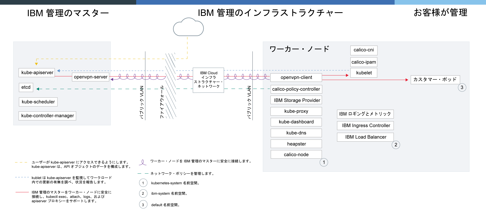

---

copyright:
  years: 2014, 2019
lastupdated: "2019-06-07"

keywords: kubernetes, iks

subcollection: containers

---

{:new_window: target="blank"}
{:shortdesc: .shortdesc}
{:screen: .screen}
{:pre: .pre}
{:table: .aria-labeledby="caption"}
{:codeblock: .codeblock}
{:tip: .tip}
{:note: .note}
{:important: .important}
{:deprecated: .deprecated}
{:download: .download}
{:preview: .preview}


# 非推奨: 専用クラウド
{: #dedicated}

{{site.data.keyword.Bluemix_dedicated_notm}} での {{site.data.keyword.containerlong}} が非推奨になりました。 {{site.data.keyword.Bluemix_dedicated_notm}} 環境では、クラスターを作成することはできません。 {{site.data.keyword.Bluemix_notm}} Public でクラスターを作成するには、[{{site.data.keyword.containerlong_notm}} 概説](/docs/containers?topic=containers-getting-started)を参照してください。
{: deprecated}

{{site.data.keyword.Bluemix_dedicated_notm}} アカウントがある場合、Kubernetes クラスターを専用クラウド環境 (`https://<my-dedicated-cloud-instance>.bluemix.net`) にデプロイし、同じくそこで実行されている事前選択された {{site.data.keyword.Bluemix_notm}} サービスに接続することができます。
{:shortdesc}

{{site.data.keyword.Bluemix_dedicated_notm}} アカウントがない場合、{{site.data.keyword.Bluemix_notm}} Public アカウントを使用して [{{site.data.keyword.containerlong_notm}} を開始](/docs/containers?topic=containers-getting-started)できます。

## Dedicated クラウド環境について
{: #dedicated_environment}

{{site.data.keyword.Bluemix_dedicated_notm}} アカウントを使用するとき、使用可能な物理リソースはお客様のクラスター専用であり、{{site.data.keyword.IBM_notm}} の他のお客様のクラスターと共有されません。 クラスターの分離が必要であり、使用する他の {{site.data.keyword.Bluemix_notm}} サービスに分離が必要な場合は、{{site.data.keyword.Bluemix_dedicated_notm}} 環境をセットアップすることも選択できます。 Dedicated アカウントがない場合は、[{{site.data.keyword.Bluemix_notm}} Public で専用ハードウェアを使用してクラスターを作成](/docs/containers?topic=containers-clusters#clusters_ui)できます。
{: shortdesc}

{{site.data.keyword.Bluemix_dedicated_notm}} では、Dedicated コンソール内のカタログから、または {{site.data.keyword.containerlong_notm}} CLI を使用することにより、クラスターを作成することができます。 Dedicated コンソールを使用するには、IBM ID を使用して Dedicated と Public の両方のアカウントに同時にログインします。 この二重ログインにより、Dedicated コンソールを使用してパブリック・クラスターにアクセスすることができます。 CLI を使用するには、Dedicated エンドポイント (`api.<my-dedicated-cloud-instance>.bluemix.net.`) を使用してログインします。 次に、Dedicated 環境に関連付けられたパブリック地域の {{site.data.keyword.containerlong_notm}} API エンドポイントをターゲットにします。

{{site.data.keyword.Bluemix_notm}} Public と Dedicated の間の最も大きな違いは以下の点です。

*   {{site.data.keyword.Bluemix_dedicated_notm}} では、ワーカー・ノード、VLAN、サブネットがデプロイされた IBM Cloud インフラストラクチャー (SoftLayer) アカウントを {{site.data.keyword.IBM_notm}} が所有および管理します。 {{site.data.keyword.Bluemix_notm}} Public では、お客様が IBM Cloud infrastructure (SoftLayer) アカウントを所有します。
*   {{site.data.keyword.Bluemix_dedicated_notm}} では、{{site.data.keyword.IBM_notm}} 管理の IBM Cloud インフラストラクチャー (SoftLayer) アカウントの VLAN およびサブネットの仕様は、Dedicated 環境が有効化されるときに決まります。 {{site.data.keyword.Bluemix_notm}} Public では、VLAN とサブネットの仕様は、クラスターの作成時に決まります。

### クラウド環境間のクラスター管理の違い
{: #dedicated_env_differences}

<table>
<caption>クラスター管理の違い</caption>
<col width="20%">
<col width="40%">
<col width="40%">
 <thead>
 <th>Area</th>
 <th>{{site.data.keyword.Bluemix_notm}} Public</th>
 <th>{{site.data.keyword.Bluemix_dedicated_notm}}</th>
 </thead>
 <tbody>
 <tr>
 <td>クラスター作成</td>
 <td>フリー・クラスターまたは標準クラスターを作成します。</td>
 <td>標準クラスターを作成します。</td>
 </tr>
 <tr>
 <td>クラスターのハードウェアと所有権</td>
 <td>標準クラスターでは、ハードウェアは {{site.data.keyword.IBM_notm}} の他のお客様と共有することも、お客様専用にすることもできます。 パブリック VLAN とプライベート VLAN は、お客様の IBM Cloud インフラストラクチャー (SoftLayer) アカウントでお客様が所有して管理します。</td>
 <td>{{site.data.keyword.Bluemix_dedicated_notm}} のクラスターでは、ハードウェアは常に専用です。 クラスター作成に使用できるパブリック VLAN とプライベート VLAN は、{{site.data.keyword.Bluemix_dedicated_notm}} 環境のセットアップ時に事前定義されており、IBM が所有および管理しています。 クラスター作成中に使用可能なゾーンも、{{site.data.keyword.Bluemix_notm}} 環境用に事前定義されています。</td>
 </tr>
 <tr>
 <td>ロード・バランサーと Ingress ネットワーキング</td>
 <td>標準クラスターのプロビジョニング時には、以下のアクションが自動的に行われます。<ul><li>1 つのポータブル・パブリック・サブネットと 1 つのポータブル・プライベート・サブネットがクラスターにバインドされて、IBM Cloud インフラストラクチャー (SoftLayer) アカウントに割り当てられます。 IBM Cloud インフラストラクチャー (SoftLayer) アカウントで、さらにサブネットを要求できます。</li></li><li>1 つのポータブル・パブリック IP アドレスが高可用性の Ingress アプリケーション・ロード・バランサー (ALB) に使用され、固有のパブリック経路が <code>&lt;cluster_name&gt;. containers.appdomain.cloud</code> の形式で割り当てられます。 この経路を使用して、複数のアプリをパブリックに公開できます。 1 つのポータブル・プライベート IP アドレスが専用 ALB のために使用されます。</li><li>ロード・バランサー・サービスに使用できる、4 つのポータブル・パブリック IP アドレスと 4 つのポータブル・プライベート IP アドレスがクラスターに割り当てられます。</ul></td>
 <td>Dedicated アカウントを作成するときには、クラスター・サービスの公開方法とアクセス方法に関する接続の決定を行います。 独自のエンタープライズ IP 範囲 (ユーザー管理の IP) を使用するには、それらを [{{site.data.keyword.Bluemix_dedicated_notm}} 環境のセットアップ](/docs/dedicated?topic=dedicated-dedicated#setupdedicated)時に指定する必要があります。 <ul><li>デフォルトでは、ポータブル・パブリック・サブネットは Dedicated アカウントに作成したクラスターにバインドされません。 代わりに、エンタープライズに最適な接続モデルを柔軟に選択できます。</li><li>クラスターを作成した後に、バインドするサブネットのタイプを選択して、ロード・バランサーまたは Ingress 接続のためにクラスターで使用します。<ul><li>パブリック・ポータブル・サブネットまたはプライベート・ポータブル・サブネットでは、[サブネットをクラスターに追加](/docs/containers?topic=containers-subnets#subnets)できます</li><li>Dedicated での開発時に IBM に提供したユーザー管理の IP アドレスでは、[ユーザー管理のサブネットをクラスターに追加](#dedicated_byoip_subnets)することができます。</li></ul></li><li>サブネットをクラスターにバインドした後に、Ingress ALB が作成されます。 ポータブル・パブリック・サブネットを使用した場合にのみパブリック Ingress ルートが作成されます。</li></ul></td>
 </tr>
 <tr>
 <td>NodePort ネットワーキング</td>
 <td>ワーカー・ノードのパブリック・ポートを公開し、ワーカー・ノードのパブリック IP アドレスを使用して、クラスター内のサービスにパブリック・アクセスを行います。</td>
 <td>ワーカー・ノードのすべてのパブリック IP アドレスがファイアウォールによってブロックされます。 ただし、クラスターに追加された {{site.data.keyword.Bluemix_notm}} サービスでは、パブリック IP アドレスまたはプライベート IP アドレスを使用して NodePort にアクセスできます。</td>
 </tr>
 <tr>
 <td>永続ストレージ</td>
 <td>ボリュームの[動的プロビジョニング](/docs/containers?topic=containers-kube_concepts#dynamic_provisioning)または[静的プロビジョニング](/docs/containers?topic=containers-kube_concepts#static_provisioning)を使用します。</td>
 <td>ボリュームの[動的プロビジョニング](/docs/containers?topic=containers-kube_concepts#dynamic_provisioning)を使用します。 ボリュームのバックアップの要求、ボリュームからのリストアの要求、その他のストレージ機能の実行のためには、[サポート・ケースを開きます](/docs/get-support?topic=get-support-getting-customer-support)。</li></ul></td>
 </tr>
 <tr>
 <td>{{site.data.keyword.registryshort_notm}} のイメージ・レジストリー URL</td>
 <td><ul><li>米国南部と米国東部: <code>registry.ng bluemix.net</code></li><li>英国南部: <code>registry.eu-gb.bluemix.net</code></li><li>中欧 (フランクフルト): <code>registry.eu-de.bluemix.net</code></li><li>オーストラリア (シドニー): <code>registry.au-syd.bluemix.net</code></li></ul></td>
 <td><ul><li>新しい名前空間には、{{site.data.keyword.Bluemix_notm}} パブリックに対して定義されたものと同じ地域をベースとするレジストリーを使用してください。</li><li>{{site.data.keyword.Bluemix_dedicated_notm}} で単一コンテナーとスケーラブル・コンテナー用にセットアップされた名前空間の場合は、<code>registry.&lt;dedicated_domain&gt;</code> を使用します。</li></ul></td>
 </tr>
 <tr>
 <td>レジストリーへのアクセス</td>
 <td>[{{site.data.keyword.containerlong_notm}} でのプライベートとパブリックのイメージ・レジストリーの使用](/docs/containers?topic=containers-images)にあるオプションを参照してください。</td>
 <td><ul><li>新しい名前空間の場合は、[{{site.data.keyword.containerlong_notm}} でのプライベートとパブリックのイメージ・レジストリーの使用](/docs/containers?topic=containers-images)にあるオプションを参照してください。</li><li>単一グループとスケーラブル・グループ用にセットアップされた名前空間の場合は、[トークンを使用し、Kubernetes シークレットを作成](#cs_dedicated_tokens)して認証を受けます。</li></ul></td>
 </tr>
 <tr>
 <td>複数ゾーン・クラスター</td>
 <td>ワーカー・プールにさらにゾーンを追加して、[複数ゾーン・クラスター](/docs/containers?topic=containers-ha_clusters#multizone)を作成します。</td>
 <td>[単一ゾーン・クラスター](/docs/containers?topic=containers-ha_clusters#single_zone)を作成します。 {{site.data.keyword.Bluemix_dedicated_notm}} 環境がセットアップされている場合、使用可能なゾーンが事前定義されています。 デフォルトでは、単一ゾーン・クラスターには、`default` という名前のワーカー・プールがセットアップされています。 このワーカー・プールに、クラスターの作成時に定義した同じ構成 (マシン・タイプなど) のワーカー・ノードがグループ化されています。 [既存のワーカー・プールのサイズを変更](/docs/containers?topic=containers-add_workers#resize_pool)するか、[新しいワーカー・プールを追加](/docs/containers?topic=containers-add_workers#add_pool)して、クラスターにワーカー・ノードを追加できます。ワーカー・プールを追加した場合は、ワーカー・ノードをゾーンにデプロイできるように、使用可能なゾーンをワーカー・プールに追加する必要があります。 ただし、他のゾーンをワーカー・プールに追加することはできません。</td>
 </tr>
</tbody></table>
{: caption="{{site.data.keyword.Bluemix_notm}} パブリックと {{site.data.keyword.Bluemix_dedicated_notm}} のフィーチャーの相違点" caption-side="top"}

<br />


### サービス・アーキテクチャー
{: #dedicated_ov_architecture}

各ワーカー・ノードには、個々のコンピュート・リソース、ネットワーキング、ボリューム・サービスがセットアップされます。
{:shortdesc}

標準装備のセキュリティー機能は、分離機能、リソース管理機能、そしてワーカー・ノードのセキュリティー・コンプライアンスを提供します。 ワーカー・ノードは、機密保護機能のある TLS 証明書と OpenVPN 接続を使用してマスターと通信します。


*{{site.data.keyword.Bluemix_dedicated_notm}} での Kubernetes アーキテクチャーとネットワーキング*



<br />


## Dedicated での {{site.data.keyword.containerlong_notm}} のセットアップ
{: #dedicated_setup}

各 {{site.data.keyword.Bluemix_dedicated_notm}} 環境には、{{site.data.keyword.Bluemix_notm}} 内にパブリック、クライアント所有、そして企業のアカウントがあります。 Dedicated 環境のユーザーがクラスターを作成するためには、管理者がそのユーザーをパブリック企業アカウントに追加する必要があります。
{:shortdesc}

開始前に、以下のことを行います。
  * [{{site.data.keyword.Bluemix_dedicated_notm}} 環境をセットアップします](/docs/dedicated?topic=dedicated-dedicated#setupdedicated)。
  * ローカル・システムまたは企業ネットワークがプロキシーまたはファイアウォールを使用して公共のインターネットのエンドポイントを制御する場合、[ファイアウォールで必要なポートと IP アドレスを開く](/docs/containers?topic=containers-firewall#firewall)必要があります。
  * [Cloud Foundry CLI をダウンロードします ](https://github.com/cloudfoundry/cli/releases)。

{{site.data.keyword.Bluemix_dedicated_notm}} ユーザーがクラスターにアクセスできるようにするには、以下のようにします。

1.  {{site.data.keyword.Bluemix_notm}} Public アカウントの所有者は API キーを生成する必要があります。
    1.  {{site.data.keyword.Bluemix_dedicated_notm}} インスタンス のパブリック・エンドポイントにログインします。 Public アカウント所有者の {{site.data.keyword.Bluemix_notm}} 資格情報を入力し、プロンプトが出されたらアカウントを選択します。

        ```
        ibmcloud login -a api.<my-dedicated-cloud-instance>.<region>.bluemix.net
        ```
        {: pre}

        フェデレーテッド ID がある場合は、`ibmcloud login -a api.<my-dedicated-cloud-instance>.<region>.bluemix.net --sso` を使用して、{{site.data.keyword.Bluemix_notm}} CLI にログインします。 ユーザー名を入力し、CLI 出力に示された URL を使用して、ワンタイム・パスコードを取得してください。 `--sso` なしではログインに失敗し、`--sso` オプションを指定すると成功する場合、フェデレーテッド ID があることがわかります。
        {: tip}

    2.  ユーザーを Public アカウントに招待するための API キーを生成します。 API キーの値をメモします。Dedicated アカウント管理者は次のステップでこの値を使用する必要があります。

        ```
        ibmcloud iam api-key-create <key_name> -d "Key to invite users to <dedicated_account_name>"
        ```
        {: pre}

    3.  ユーザーを招待する Public アカウント組織の GUID をメモします。Dedicated アカウント管理者は次のステップでこの値を使用する必要があります。

        ```
        ibmcloud account orgs
        ```
        {: pre}

2.  {{site.data.keyword.Bluemix_dedicated_notm}} アカウントの所有者は、単一または複数のユーザーを Public アカウントに招待できます。
    1.  {{site.data.keyword.Bluemix_dedicated_notm}} インスタンス のパブリック・エンドポイントにログインします。 Dedicated アカウント所有者の {{site.data.keyword.Bluemix_notm}} 資格情報を入力し、プロンプトが出されたらアカウントを選択します。

        ```
        ibmcloud login -a api.<my-dedicated-cloud-instance>.<region>.bluemix.net
        ```
        {: pre}

        フェデレーテッド ID がある場合は、`ibmcloud login -a api.<my-dedicated-cloud-instance>.<region>.bluemix.net --sso` を使用して、{{site.data.keyword.Bluemix_notm}} CLI にログインします。 ユーザー名を入力し、CLI 出力に示された URL を使用して、ワンタイム・パスコードを取得してください。 `--sso` なしではログインに失敗し、`--sso` オプションを指定すると成功する場合、フェデレーテッド ID があることがわかります。
        {: tip}

    2.  ユーザーを Public アカウントに招待します。
        * 単一のユーザーを招待するには、以下のようにします。

            ```
            ibmcloud cf bluemix-admin invite-users-to-public -userid=<user_email> -apikey=<public_API_key> -public_org_id=<public_org_ID>
            ```
            {: pre}

            <em>&lt;user_IBMid&gt;</em> を招待するユーザーの E メールに、<em>&lt;public_API_key&gt;</em> を直前のステップで生成した API キーに、<em>&lt;public_org_ID&gt;</em> を Public アカウント組織の GUID に置き換えます。 

        * 現在 Dedicated アカウント組織に含まれているすべてのユーザーを招待するには、以下のようにします。

            ```
            ibmcloud cf bluemix-admin invite-users-to-public -organization=<dedicated_org_ID> -apikey=<public_API_key> -public_org_id=<public_org_ID>
            ```

            <em>&lt;dedicated_org_ID&gt;</em> を Dedicated アカウント組織の ID に、<em>&lt;public_API_key&gt;</em> を直前のステップで生成した API キーに、<em>&lt;public_org_ID&gt;</em> を Public アカウント組織の GUID に置き換えます。 

    3.  ユーザーに IBM ID がある場合、そのユーザーは Public アカウント内の指定された組織に自動的に追加されます。 ユーザーに IBM ID が存在しない場合、ユーザーの E メール・アドレスに招待が送信されます。 ユーザーが招待を受け入れると、そのユーザーの IBM ID が作成されて、そのユーザーは Public アカウント内の指定された組織に追加されます。

    4.  ユーザーがアカウントに追加されたことを確認します。

        ```
        ibmcloud cf bluemix-admin invite-users-status -apikey=<public_API_key>
        ```
        {: pre}

        招待されたユーザーが既存の IBM ID を持っている場合、そのユーザーの状況は `ACTIVE` になります。 招待されたユーザーが既存の IBMid を持っていなかった場合、そのユーザーは、招待を受け入れるまでは `PENDING` の状況、招待を受け入れた後は `ACTIVE` の状況になります。

3.  ユーザーがクラスター作成特権を必要とする場合は、そのユーザーに管理者役割を付与する必要があります。

    1.  パブリック・コンソールのメニュー・バーで、**「管理」>「セキュリティー」>「ID およびアクセス」**の順にクリックしてから、**「ユーザー」**をクリックします。

    2.  アクセス権限を割り当てる対象のユーザーの行で、**「アクション」**メニューを選択し、**「アクセス権限の割り当て」**をクリックします。

    3.  **「リソースへのアクセス権限の割り当て」**を選択します。

    4.  **「サービス」**リストから、**「{{site.data.keyword.containerlong}}」**を選択します。

    5.  **「地域」**リストから、**「すべての現行地域」**または特定の地域を選択します (プロンプトが出された場合)。

    6. **「役割の選択」**で、「管理者」を選択します。

    7. **「割り当て」**をクリックします。

4.  ユーザーは Dedicated アカウント・エンドポイントにログインしてクラスターの作成を開始できるようになりました。

    1.  {{site.data.keyword.Bluemix_dedicated_notm}} インスタンス のパブリック・エンドポイントにログインします。 プロンプトが出されたら、IBM ID を入力します。

        ```
        ibmcloud login -a api.<my-dedicated-cloud-instance>.<region>.bluemix.net
        ```
        {: pre}

        フェデレーテッド ID がある場合は、`ibmcloud login -a api.<my-dedicated-cloud-instance>.<region>.bluemix.net --sso` を使用して、{{site.data.keyword.Bluemix_notm}} CLI にログインします。 ユーザー名を入力し、CLI 出力に示された URL を使用して、ワンタイム・パスコードを取得してください。 `--sso` なしではログインに失敗し、`--sso` オプションを指定すると成功する場合、フェデレーテッド ID があることがわかります。
        {: tip}

    2.  初めてログインする場合は、プロンプトが出されたら Dedicated ユーザー ID とパスワードを入力します。 Dedicated アカウントが認証され、Dedicated アカウントと Public アカウントがリンクされます。 この初回のログインの後は、毎回のログインで IBM ID だけを使用します。 詳しくは、[専用 ID とパブリック IBM ID との接続](/docs/iam?topic=iam-connect_dedicated_id#connect_dedicated_id)を参照してください。

        クラスターを作成するには、Dedicated アカウントと Public アカウントの両方にログインする必要があります。 Dedicated アカウントにログインするだけの場合は、Dedicated エンドポイントにログインする際に `--no-iam` フラグを使用します。
        {: note}

    3.  専用環境でクラスターを作成したりクラスターにアクセスしたりするためには、その環境に関連付ける地域を設定する必要があります。 **注**: `default` 以外のリソース・グループにクラスターを作成することはできません。

        ```
        ibmcloud ks region-set
        ```
        {: pre}

5.  アカウントをリンク解除する場合、IBM ID を Dedicated ユーザー ID から切断することができます。 詳しくは、[専用 ID のパブリック IBM ID からの切断](/docs/iam?topic=iam-connect_dedicated_id#disconnect_id)を参照してください。

    ```
    ibmcloud iam dedicated-id-disconnect
    ```
    {: pre}

<br />


## クラスターの作成
{: #dedicated_administering}

可用性と能力が最大になるように {{site.data.keyword.Bluemix_dedicated_notm}} クラスターのセットアップを設計します。
{:shortdesc}

### {{site.data.keyword.Bluemix_notm}} コンソールでのクラスターの作成
{: #dedicated_creating_ui}

1. Dedicated コンソールを開きます。これは `https://<my-dedicated-cloud-instance>.bluemix.net` にあります。

2. **「Bluemix Public にもログインする (Also log in to {{site.data.keyword.Bluemix_notm}} Public)」**チェック・ボックスを選択して、**「ログイン」**をクリックします。

3. プロンプトに従い、IBM ID を使用してログインします。 Dedicated アカウントに初めてログインする場合は、プロンプトに従って {{site.data.keyword.Bluemix_dedicated_notm}} にログインしてください。

4. カタログから**「コンテナー」**を選択して、**「Kubernetes クラスター」**をクリックします。

5. クラスターの詳細を構成します。

    1. **クラスター名**を入力します。 名前は先頭が文字でなければならず、文字、数字、およびハイフン (-) を使用できます。35 文字以内でなければなりません。 地域をまたいで固有の名前を使用します。Ingress サブドメインの完全修飾ドメイン・ネームは、クラスター名と、クラスターがデプロイされる地域で形成されます。 Ingress サブドメインを地域内で固有にするために、クラスター名が切り捨てられ、Ingress ドメイン・ネームにランダムな値が付加されることがあります。

    2. クラスターをデプロイする**ゾーン**を選択します。 {{site.data.keyword.Bluemix_dedicated_notm}} 環境がセットアップされている場合、使用可能なゾーンが事前定義されています。

    3. クラスター・マスター・ノードの Kubernetes API サーバーのバージョンを選択します。

    4. ハードウェア分離のタイプを選択します。 仮想マシンは時間単位で請求され、ベア・メタル・マシンは月単位で請求されます。

        - **仮想 - 専用**: ワーカー・ノードはお客様のアカウント専用のインフラストラクチャーでホストされます。 物理リソースは完全に分離されます。

        - **ベアメタル**: 月単位で課金されるベアメタル・サーバーは、お客様が注文した後に IBM Cloud インフラストラクチャー (SoftLayer) によって手動でプロビジョンされます。完了するまでに 1 営業日以上かかることがあります。 多くのリソースとホスト制御を必要とする高性能アプリケーションには、ベア・メタルが最適です。 マシン・タイプの選択では、ワーカー・ノードが改ざんされていないことを検証するために、[トラステッド・コンピューティング](/docs/containers?topic=containers-security#trusted_compute)を有効にすることもできます。クラスターの作成時にトラストを有効にしなかった場合に、後で有効にするには、`ibmcloud ks feature-enable` [コマンド](/docs/containers?topic=containers-cli-plugin-kubernetes-service-cli#cs_cluster_feature_enable)を使用します。 トラストを有効にした後に無効にすることはできません。

        ベア・メタル・マシンは、必ず確認してからプロビジョンしてください。 月単位で課金されるので、誤って注文した後にすぐに解約しても、1 カ月分の料金が課金されます。
        {:tip}

    5. **マシン・タイプ**を選択します。 各ワーカー・ノードにセットアップされ、コンテナーで使用できるようになる仮想 CPU、メモリー、ディスク・スペースの量は、マシン・タイプによって決まります。 使用可能なベア・メタル・マシンと仮想マシンのタイプは、クラスターをデプロイするゾーンによって異なります。 詳しくは、`ibmcloud ks machine-type` [コマンド](/docs/containers?topic=containers-cli-plugin-kubernetes-service-cli#cs_machine_types)の資料を参照してください。クラスターを作成した後、ワーカー・ノードをクラスターに追加して別のマシン・タイプを追加できます。

    6. 必要な**ワーカー・ノードの数**を選択します。 `3` を選択して、クラスターの高可用性を確保します。

    7. **パブリック VLAN** (オプション) と**プライベート VLAN** (必須) を選択します。 使用可能なパブリック VLAN とプライベート VLAN は、{{site.data.keyword.Bluemix_dedicated_notm}} 環境のセットアップ時に事前定義されています。 どちらの VLAN もワーカー・ノード間で通信を行いますが、パブリック VLAN は IBM 管理の Kubernetes マスターとも通信を行います。 複数のクラスターで同じ VLAN を使用できます。
        プライベート VLAN のみを使用してワーカー・ノードをセットアップする場合は、[プライベート・サービス・エンドポイントを有効にする](/docs/containers?topic=containers-cs_network_cluster#set-up-private-se)か、[ゲートウェイ・デバイスを構成する](/docs/containers?topic=containers-plan_clusters#workeruser-master)ことによって、ワーカー・ノードとクラスター・マスターが通信できるようにする必要があります。
        {: note}

    8. デフォルトでは、**「ローカル・ディスクの暗号化 (Encrypt local disk)」**が選択されます。 チェック・ボックスをクリアした場合、ホストのコンテナー・ランタイムのデータは暗号化されません。 [暗号化について詳しくは、こちらをご覧ください](/docs/containers?topic=containers-security#encrypted_disk)。

6. **「クラスターの作成」**をクリックします。 **「ワーカー・ノード」**タブでワーカー・ノードのデプロイメントの進行状況を確認できます。 デプロイメントが完了すると、クラスターが**「概要」**タブに準備されていることが分かります。
    ワーカー・ノードごとに、固有のワーカー・ノード ID とドメイン名が割り当てられます。クラスターが作成された後にこれらを手動で変更してはいけません。 ID またはドメイン名を変更すると、Kubernetes マスターがクラスターを管理できなくなります。
    {: important}

### CLI でのクラスターの作成
{: #dedicated_creating_cli}

1.  {{site.data.keyword.Bluemix_notm}} CLI と [{{site.data.keyword.containerlong_notm}} プラグイン](/docs/containers?topic=containers-cs_cli_install#cs_cli_install)をインストールします。
2.  {{site.data.keyword.Bluemix_dedicated_notm}} インスタンス のパブリック・エンドポイントにログインします。 {{site.data.keyword.Bluemix_notm}} 資格情報を入力し、プロンプトが出されたらアカウントを選択します。

    ```
    ibmcloud login -a api.<my-dedicated-cloud-instance>.<region>.bluemix.net
    ```
    {: pre}

    フェデレーテッド ID がある場合は、`ibmcloud login -a api.<my-dedicated-cloud-instance>.<region>.bluemix.net --sso` を使用して、{{site.data.keyword.Bluemix_notm}} CLI にログインします。 ユーザー名を入力し、CLI 出力に示された URL を使用して、ワンタイム・パスコードを取得してください。 `--sso` なしではログインに失敗し、`--sso` オプションを指定すると成功する場合、フェデレーテッド ID があることがわかります。
    {: tip}

3.  地域エンドポイントをターゲットとします。以下の地域エンドポイントがサポートされています。
  * ダラス (米国南部、us-south): `https://us-south.containers.cloud.ibm.com`
  * フランクフルト (中欧、eu-de): `https://eu-de.containers.cloud.ibm.com`
  * ロンドン (英国南部、eu-gb): `https://eu-gb.containers.cloud.ibm.com`
  * シドニー (南アジア太平洋地域、au-syd): `https://au-syd.containers.cloud.ibm.com`
  * 東京 (北アジア太平洋地域、jp-tok): `https://jp-tok.containers.cloud.ibm.com`
  * ワシントン D.C. (米国東部、us-east): `https://us-east.containers.cloud.ibm.com`
  ```
  ibmcloud ks init --host <endpoint>
  ```
  {: pre}
  グローバル・エンドポイント `https://containers.cloud.ibm.com` は使用できません。地域内のクラスターを作成または処理するには、地域エンドポイントをターゲットにする必要があります。
  {: important}

4.  `cluster-create` コマンドを使用してクラスターを作成します。 標準クラスターを作成する場合、ワーカー・ノードのハードウェアは、使用時間に応じて課金されます。

    例:

    ```
    ibmcloud ks cluster-create --zone <zone> --machine-type <machine_type> --name <cluster_name> --workers <number>
    ```
    {: pre}

    <table>
    <caption>このコマンドの構成要素について</caption>
    <thead>
    <th colspan=2> このコマンドの構成要素について</th>
    </thead>
    <tbody>
    <tr>
    <td><code>cluster-create</code></td>
    <td>{{site.data.keyword.Bluemix_notm}} 組織内にクラスターを作成するためのコマンド。</td>
    </tr>
    <tr>
    <td><code>--zone <em>&lt;zone&gt;</em></code></td>
    <td>Dedicated 環境で使用するように構成されている {{site.data.keyword.Bluemix_notm}} のゾーン ID を入力します。</td>
    </tr>
    <tr>
    <td><code>--machine-type <em>&lt;machine_type&gt;</em></code></td>
    <td>マシン・タイプを入力します。 ワーカー・ノードは、専用ハードウェア上に仮想マシンとしてデプロイすることも、ベア・メタル上に物理マシンとしてデプロイすることもできます。 使用可能な物理マシンと仮想マシンのタイプは、クラスターをデプロイするゾーンによって異なります。 詳しくは、`ibmcloud ks machine-type` [コマンド](/docs/containers?topic=containers-cli-plugin-kubernetes-service-cli#cs_machine_types)の資料を参照してください。 </td>
    </tr>
    <tr>
    <td><code>--public-vlan <em>&lt;machine_type&gt;</em></code></td>
    <td>Dedicated 環境で使用されるように構成されているパブリック VLAN の ID を入力します。 ワーカー・ノードをプライベート VLAN だけに接続する場合は、このオプションを指定しないでください。<p class="note">プライベート VLAN のみを使用してワーカー・ノードをセットアップする場合は、[プライベート・サービス・エンドポイントを有効にする](/docs/containers?topic=containers-cs_network_cluster#set-up-private-se)か、[ゲートウェイ・デバイスを構成する](/docs/containers?topic=containers-plan_clusters#workeruser-master)ことによって、ワーカー・ノードとクラスター・マスターが通信できるようにする必要があります。</p></td>
    </tr>
    <tr>
    <td><code>--private-vlan <em>&lt;machine_type&gt;</em></code></td>
    <td>Dedicated 環境で使用されるように構成されているプライベート VLAN の ID を入力します。</td>
    </tr>  
    <tr>
    <td><code>--name <em>&lt;name&gt;</em></code></td>
    <td>クラスターの名前を入力します。 名前は先頭が文字でなければならず、文字、数字、およびハイフン (-) を使用できます。35 文字以内でなければなりません。 地域をまたいで固有の名前を使用します。Ingress サブドメインの完全修飾ドメイン・ネームは、クラスター名と、クラスターがデプロイされる地域で形成されます。 Ingress サブドメインを地域内で固有にするために、クラスター名が切り捨てられ、Ingress ドメイン・ネームにランダムな値が付加されることがあります。
</td>
    </tr>
    <tr>
    <td><code>--workers <em>&lt;number&gt;</em></code></td>
    <td>クラスターに含めるワーカー・ノードの数を入力します。 <code>--workers</code> オプションが指定されていない場合は、ワーカー・ノードが 1 つ作成されます。</td>
    </tr>
    <tr>
    <td><code>--kube-version <em>&lt;major.minor.patch&gt;</em></code></td>
    <td>クラスター・マスター・ノードの Kubernetes のバージョン。 この値はオプションです。 バージョンを指定しなかった場合、クラスターは、サポートされるデフォルトの Kubernetes バージョンを使用して作成されます。 使用可能なバージョンを確認するには、<code>ibmcloud ks versions</code> を実行します。
</td>
    </tr>
    <tr>
    <td><code>--disable-disk-encrypt</code></td>
    <td>ワーカー・ノードには、デフォルトで AES 256 ビット・[ディスク暗号化](/docs/containers?topic=containers-security#encrypted_disk)の機能があります。 暗号化を無効にする場合は、このオプションを組み込みます。</td>
    </tr>
    <tr>
    <td><code>--trusted</code></td>
    <td>[トラステッド・コンピューティング](/docs/containers?topic=containers-security#trusted_compute)を有効にして、ベア・メタル・ワーカー・ノードが改ざんされていないことを検証します。 クラスターの作成時にトラストを有効にしなかった場合に、後で有効にするには、`ibmcloud ks feature-enable` [コマンド](/docs/containers?topic=containers-cli-plugin-kubernetes-service-cli#cs_cluster_feature_enable)を使用します。 トラストを有効にした後に無効にすることはできません。</td>
    </tr>
    </tbody></table>

5.  クラスターの作成が要求されたことを確認します。

    ```
    ibmcloud ks clusters
    ```
    {: pre}

    * 仮想マシンの場合、ワーカー・ノード・マシンの注文と、アカウントへのクラスターのセットアップとプロビジョンには、数分かかります。 ベア・メタル物理マシンは、IBM Cloud インフラストラクチャー (SoftLayer) との人同士のやりとりによりプロビジョンされるので、完了するのに 1 営業日以上かかることがあります。
    * 次のエラー・メッセージが表示された場合は、[サポート・ケースを開いてください](/docs/get-support?topic=get-support-getting-customer-support)。
        ```
        {{site.data.keyword.Bluemix_notm}} Infrastructure Exception: Could not place order. There are insufficient resources behind router 'router_name' to fulfill the request for the following guests: 'worker_id'.
        ```

    クラスターのプロビジョニングが完了すると、クラスターの状況が **deployed** に変わります。

    ```
    Name         ID                                   State      Created          Workers   Zone       Version     Resource Group Name
    my_cluster   paf97e8843e29941b49c598f516de72101   deployed   20170201162433   1         mil01      1.13.6      Default
    ```
    {: screen}

6.  ワーカー・ノードの状況を確認します。

    ```
    ibmcloud ks workers --cluster <cluster_name_or_ID>
    ```
    {: pre}

    ワーカー・ノードの準備が完了すると、状態が **normal** に変わり、状況が **Ready** になります。 ノードの状況が**「Ready」**になったら、クラスターにアクセスできます。

    どのワーカー・ノードにも固有のワーカー・ノード ID とドメイン名が割り当てられます。それらをクラスター作成後に手動で変更してはいけません。 ID またはドメイン名を変更すると、Kubernetes マスターがクラスターを管理できなくなります。
    {: important}

    ```
    ID                                                 Public IP       Private IP       Machine Type   State    Status   Zone   Version
    kube-mil01-paf97e8843e29941b49c598f516de72101-w1   169.xx.xxx.xxx  10.xxx.xx.xxx    free           normal   Ready    mil01      1.13.6
    ```
    {: screen}

7.  作成したクラスターを、このセッションのコンテキストとして設定します。 次の構成手順は、クラスターの操作時に毎回行ってください。

    1.  環境変数を設定して Kubernetes 構成ファイルをダウンロードするためのコマンドを取得します。

        ```
        ibmcloud ks cluster-config --cluster <cluster_name_or_ID>
        ```
        {: pre}

        構成ファイルのダウンロードが完了すると、そのローカルの Kubernetes 構成ファイルのパスを環境変数として設定するために使用できるコマンドが表示されます。

        OS X の場合の例:

        ```
        export KUBECONFIG=/Users/<user_name>/.bluemix/plugins/container-service/clusters/<cluster_name>/kube-config-prod-dal10-<cluster_name>.yml
        ```
        {: screen}

    2.  出力内の `KUBECONFIG` 環境変数を設定するためのコマンドをコピーして貼り付けます。
    3.  `KUBECONFIG` 環境変数が適切に設定されたことを確認します。

        OS X の場合の例:

        ```
        echo $KUBECONFIG
        ```
        {: pre}

        出力:

        ```
        /Users/<user_name>/.bluemix/plugins/container-service/clusters/<cluster_name>/kube-config-prod-dal10-<cluster_name>.yml

        ```
        {: screen}

8.  デフォルトのポート 8001 で Kubernetes ダッシュボードにアクセスします。
    1.  デフォルトのポート番号でプロキシーを設定します。

        ```
        kubectl proxy
        ```
        {: pre}

        ```
        Starting to serve on 127.0.0.1:8001
        ```
        {: screen}

    2.  Web ブラウザーで以下の URL を開いて、Kubernetes ダッシュボードを表示します。

        ```
        http://localhost:8001/ui
        ```
        {: codeblock}

### ワーカー・ノードの追加
{: #add_workers_dedicated}

{{site.data.keyword.Bluemix_dedicated_notm}} では、[単一ゾーン・クラスター](/docs/containers?topic=containers-ha_clusters#single_zone)のみ作成できます。 デフォルトでは、単一ゾーン・クラスターには、`default` という名前のワーカー・プールがセットアップされています。 このワーカー・プールに、クラスターの作成時に定義した同じ構成 (マシン・タイプなど) のワーカー・ノードがグループ化されています。 [既存のワーカー・プールのサイズを変更](/docs/containers?topic=containers-add_workers#resize_pool)するか、[新しいワーカー・プールを追加](/docs/containers?topic=containers-add_workers#add_pool)して、クラスターにワーカー・ノードを追加できます。ワーカー・プールを追加した場合は、ワーカー・ノードをゾーンにデプロイできるように、使用可能なゾーンをワーカー・プールに追加する必要があります。 ただし、他のゾーンをワーカー・プールに追加することはできません。
{: shortdesc}

### プライベートとパブリックのイメージ・レジストリーの使用
{: #dedicated_images}

コンテナー・イメージを使用する際の[個人情報の保護](/docs/containers?topic=containers-security#pi)の詳細を確認してください。

新しい名前空間の場合は、[{{site.data.keyword.containerlong_notm}} でのプライベートとパブリックのイメージ・レジストリーの使用](/docs/containers?topic=containers-images)にあるオプションを参照してください。 単一グループとスケーラブル・グループ用にセットアップされた名前空間の場合は、[トークンを使用し、Kubernetes シークレットを作成](#cs_dedicated_tokens)して認証を受けます。

### クラスターへのサブネットの追加
{: #dedicated_cluster_subnet}

クラスターにサブネットを追加して、使用可能なポータブル・パブリック IP アドレスのプールを変更します。 詳しくは、[クラスターへのサブネットの追加](/docs/containers?topic=containers-subnets#subnets)を参照してください。 サブネットを Dedicated クラスターに追加する操作に関する以下の差異を検討してください。
{: shortdesc}

#### ユーザー管理サブネットと IP アドレスを Kubernetes クラスターにさらに追加する
{: #dedicated_byoip_subnets}

{{site.data.keyword.containerlong_notm}} にアクセスするために使用するオンプレミス・ネットワークに属するユーザー独自のサブネットをさらに指定します。 それらのサブネットにあるプライベート IP アドレスを、Kubernetes クラスター内の Ingress サービスとロード・バランサー・サービスに追加できます。 ユーザー管理のサブネットは、使用するサブネットのフォーマットに応じて、2 つの方法のいずれかにより構成されます。
{: shortdesc}

要件:
- ユーザー管理のサブネットを追加できるのは、プライベート VLAN のみです。
- サブネットの接頭部の長さの限度は /24 から /30 です。 例えば、`203.0.113.0/24` は 253 個の使用可能なプライベート IP アドレスを示し、`203.0.113.0/30` は 1 つの使用可能なプライベート IP アドレスを示します。
- サブネットの最初の IP アドレスは、サブネットのゲートウェイとして使用する必要があります。

始める前に、ユーザー管理のサブネットを使用する {{site.data.keyword.Bluemix_dedicated_notm}} ネットワークとエンタープライズ・ネットワークとの間のネットワーク・トラフィックの出入りのルーティングを構成します。

1. 独自のサブネットを使用するには、[サポート・ケースを開き](/docs/get-support?topic=get-support-getting-customer-support)、使用するサブネット CIDR のリストを指定します。 **注**: オンプレミスと内部アカウント接続のために ALB とロード・バランサーを管理する方法は、サブネット CIDR のフォーマットによって異なります。 構成の違いについては、最後のステップを参照してください。

2. {{site.data.keyword.IBM_notm}} がユーザー管理のサブネットをプロビジョンした後に、Kubernetes クラスターでそのサブネットを使用できるようにします。

    ```
    ibmcloud ks cluster-user-subnet-add --cluster <cluster_name> --subnet-cidr <subnet_CIDR> --private-vlan <private_VLAN>
    ```
    {: pre}
    <em>&lt;cluster_name&gt;</em> をクラスターの名前または ID に置き換え、<em>&lt;subnet_CIDR&gt;</em> を、サポート・ケースに指定したいずれかのサブネット CIDR に置き換え、<em>&lt;private_VLAN&gt;</em> を使用可能なプライベート VLAN ID に置き換えます。 使用可能なプライベート VLAN の ID は、`ibmcloud ks vlans` を実行することによって見つけることができます。

3. サブネットがクラスターに追加されたことを確認します。 ユーザー提供のサブネットの **User-managed** フィールドは _`true`_ です。

    ```
    ibmcloud ks cluster-get --showResources <cluster_name>
    ```
    {: pre}

    ```
    Subnet VLANs
    VLAN ID   Subnet CIDR         Public       User-managed
    1555503   169.xx.xxx.xxx/24   true         false
    1555505   10.xxx.xx.xxx/24    false        false
    1555505   10.xxx.xx.xxx/24    false        true
    ```
    {: screen}

4. **重要**: 1 つのクラスターに複数の VLAN がある場合、同じ VLAN 上に複数のサブネットがある場合、または複数ゾーン・クラスターがある場合は、IBM Cloud インフラストラクチャー (SoftLayer) アカウントに対して[仮想ルーター機能 (VRF)](/docs/infrastructure/direct-link?topic=direct-link-overview-of-virtual-routing-and-forwarding-vrf-on-ibm-cloud#overview-of-virtual-routing-and-forwarding-vrf-on-ibm-cloud) を有効にして、ワーカー・ノードがプライベート・ネットワーク上で相互に通信できるようにする必要があります。 VRF を有効にするには、[IBM Cloud インフラストラクチャー (SoftLayer) のアカウント担当者に連絡してください](/docs/infrastructure/direct-link?topic=direct-link-overview-of-virtual-routing-and-forwarding-vrf-on-ibm-cloud#how-you-can-initiate-the-conversion)。 VRF の有効化が不可能または不要な場合は、[VLAN スパンニング](/docs/infrastructure/vlans?topic=vlans-vlan-spanning#vlan-spanning)を有効にしてください。 この操作を実行するには、**「ネットワーク」>「ネットワーク VLAN スパンニングの管理」**で設定する[インフラストラクチャー権限](/docs/containers?topic=containers-users#infra_access)が必要です。ない場合は、アカウント所有者に対応を依頼してください。 VLAN スパンニングが既に有効になっているかどうかを確認するには、`ibmcloud ks vlan-spanning-get<region>` [コマンド](/docs/containers?topic=containers-cli-plugin-kubernetes-service-cli#cs_vlan_spanning_get)を使用します。

5. オンプレミスと内部アカウントの接続を構成するには、以下のオプションの間から選択します。
  - サブネットに 10.x.x.x プライベート IP アドレス範囲を使用した場合、その範囲にある有効な IP を使用して、Ingress とロード・バランサーによるオンプレミスと内部アカウントの接続を構成します。 詳しくは、[NodePort サービス、ロード・バランサー・サービス、または Ingress サービスを使用したネットワーキングの計画](/docs/containers?topic=containers-cs_network_planning#external)を参照してください。
  - サブネットに 10.x.x.x プライベート IP アドレス範囲を使用していない場合、その範囲にある有効な IP を使用して、Ingress とロード・バランサーによるオンプレミスの接続を構成します。 詳しくは、[NodePort サービス、ロード・バランサー・サービス、または Ingress サービスを使用したネットワーキングの計画](/docs/containers?topic=containers-cs_network_planning#external)を参照してください。 ただし、IBM Cloud インフラストラクチャー (SoftLayer) のポータブル・プライベート・サブネットを使用して、クラスターと他の Cloud Foundry ベースのサービスの間に内部アカウントの接続を構成する必要があります。 ポータブル・プライベート・サブネットは、[`ibmcloud ks cluster-subnet-add`](/docs/containers?topic=containers-cli-plugin-kubernetes-service-cli#cs_cluster_subnet_add) コマンドによって作成できます。 このシナリオでは、クラスターに、オンプレミス接続のためのユーザー管理のサブネットと、内部アカウント接続のための IBM Cloud インフラストラクチャー (SoftLayer) のポータブル・プライベート・サブネットの両方があります。

### その他のクラスター構成
{: #dedicated_other}

その他のクラスター構成については、以下のオプションを検討してください。
  * [クラスター・アクセス権限の管理](/docs/containers?topic=containers-users#access_policies)
  * [Kubernetes マスターの更新](/docs/containers?topic=containers-update#master)
  * [ワーカー・ノードの更新](/docs/containers?topic=containers-update#worker_node)
  * [クラスター・ロギングの構成](/docs/containers?topic=containers-health#logging)。 ログの有効化は Dedicated エンドポイントからはサポートされていません。 ログの転送を有効にするには、パブリックな {{site.data.keyword.cloud_notm}} エンドポイントにログインして、パブリックな組織とスペースをターゲットにする必要があります。
  * [クラスター・モニタリングの構成](/docs/containers?topic=containers-health#view_metrics)。 `ibm-monitoring` クラスターは各 {{site.data.keyword.Bluemix_dedicated_notm}} アカウント内にあります。 このクラスターは、Dedicated 環境での {{site.data.keyword.containerlong_notm}} の正常性を継続的にモニターし、環境の安定度と接続性を検査します。 このクラスターは環境から除去しないでください。
  * [クラスターの削除](/docs/containers?topic=containers-remove)

<br />


## アプリをクラスターにデプロイする
{: #dedicated_apps}

Kubernetes の技法を利用して、アプリを {{site.data.keyword.Bluemix_dedicated_notm}} クラスターにデプロイし、アプリを常に稼働状態にすることができます。
{:shortdesc}

アプリをクラスターにデプロイするには、[アプリを {{site.data.keyword.Bluemix_notm}} パブリック・クラスターにデプロイする](/docs/containers?topic=containers-app#app)ための指示に従うことができます。 {{site.data.keyword.Bluemix_dedicated_notm}} クラスターに関する以下の差異を検討してください。

Kubernetes リソースを処理する際の[個人情報の保護](/docs/containers?topic=containers-security#pi)の詳細を確認してください。

### アプリへのパブリック・アクセスを許可する方法
{: #dedicated_apps_public}

{{site.data.keyword.Bluemix_dedicated_notm}} 環境の場合、パブリック・プライマリー IP アドレスはファイアウォールでブロックされます。 アプリを誰でも利用できるようにするには、[ロード・バランサー・サービス](#dedicated_apps_public_load_balancer)または [Ingress](#dedicated_apps_public_ingress) を NodePort サービスの代わりに使用してください。 ポータブル・パブリック IP がアドレス指定するロード・バランサー・サービスまたは Ingress へのアクセス権限が必要な場合、サービスの開発時に企業ファイアウォール・ホワイトリストを IBM に提出してください。
{: shortdesc}

#### ロード・バランサー・タイプのサービスを使用してアプリへのアクセスを構成する方法
{: #dedicated_apps_public_load_balancer}

ロード・バランサーにパブリック IP アドレスを使用する場合、企業ファイアウォール・ホワイトリストが IBM に提出されていることを確認するか、[サポート・ケースを開いて](/docs/get-support?topic=get-support-getting-customer-support)ファイアウォール・ホワイトリストを構成します。 その後、[ネットワーク・ロード・バランサー (NLB) を使用した基本ロード・バランシングと DSR ロード・バランシング](/docs/containers?topic=containers-loadbalancer)の手順に従います。
{: shortdesc}

#### Ingress を使用してアプリへのパブリック・アクセスを構成する方法
{: #dedicated_apps_public_ingress}

Ingress ALB にパブリック IP アドレスを使用する場合、企業ファイアウォール・ホワイトリストが IBM に提出されていることを確認するか、[サポート・ケースを開いて](/docs/get-support?topic=get-support-getting-customer-support)ファイアウォール・ホワイトリストを構成します。 その後、[パブリックにアプリを公開する](/docs/containers?topic=containers-ingress#ingress_expose_public)の手順に従います。
{: shortdesc}

### 永続ストレージの作成
{: #dedicated_apps_volume_claim}

永続ストレージを作成するためのオプションを確認するには、[高可用性のための永続データ・ストレージのオプション](/docs/containers?topic=containers-storage_planning#persistent_storage_overview)を参照してください。ボリュームのバックアップ、ボリュームからのリストア、ボリュームの削除、またはファイル・ストレージの定期的なスナップショットを要求するには、[サポート・ケースを開く](/docs/get-support?topic=get-support-getting-customer-support)必要があります。
{: shortdesc}

[ファイル・ストレージ](/docs/containers?topic=containers-file_storage#file_predefined_storageclass)のプロビジョンを選択する場合は、非保存のストレージ・クラスを選択します。 非保存のストレージ・クラスを選択すると、IBM Cloud インフラストラクチャー (SoftLayer) 内の孤立永続ストレージ・インスタンスの発生を防止できます。このインスタンスは、サポート・ケースを開くことによってのみ削除できます。

## {{site.data.keyword.Bluemix_dedicated_notm}} イメージ・レジストリー用の {{site.data.keyword.registryshort_notm}} トークンの作成
{: #cs_dedicated_tokens}

{{site.data.keyword.containerlong}} 内のクラスターで単一グループとスケーラブル・グループに使用したイメージ・レジストリー用の無期限トークンを作成します。
{:shortdesc}

1.  現行セッションの永続レジストリー・トークンを要求します。 このトークンは、現在の名前空間内のイメージへのアクセス権限を付与します。
    ```
    ibmcloud cr token-add --description "<description>" --non-expiring -q
    ```
    {: pre}

2.  Kubernetes シークレットを確認します。

    ```
    kubectl describe secrets
    ```
    {: pre}

    このシークレットにより、{{site.data.keyword.containerlong}} を使用することができます。

3.  トークン情報を保管する Kubernetes シークレットを作成します。

    ```
    kubectl --namespace <kubernetes_namespace> create secret docker-registry <secret_name>  --docker-server=<registry_url> --docker-username=token --docker-password=<token_value> --docker-email=<docker_email>
    ```
    {: pre}

    <table>
    <caption>このコマンドの構成要素について</caption>
    <thead>
    <th colspan=2> このコマンドの構成要素について</th>
    </thead>
    <tbody>
    <tr>
    <td><code>--namespace &lt;kubernetes_namespace&gt;</code></td>
    <td>必須。 シークレットを使用してコンテナーをデプロイする、クラスターの Kubernetes 名前空間。 クラスター内の名前空間をすべてリストするには、<code>kubectl get namespaces</code> を実行します。</td>
    </tr>
    <tr>
    <td><code>&lt;secret_name&gt;</code></td>
    <td>必須。 イメージ・プル・シークレットに使用する名前。</td>
    </tr>
    <tr>
    <td><code>--docker-server=&lt;registry_url&gt;</code></td>
    <td>必須。 名前空間がセットアップされているイメージ・レジストリーの URL: <code>registry.&lt;dedicated_domain&gt;</code></li></ul></td>
    </tr>
    <tr>
    <td><code>--docker-username=token</code></td>
    <td>必須。 この値を変更しないでください。</td>
    </tr>
    <tr>
    <td><code>--docker-password=&lt;token_value&gt;</code></td>
    <td>必須。 以前に取得したレジストリー・トークンの値。</td>
    </tr>
    <tr>
    <td><code>--docker-email=&lt;docker-email&gt;</code></td>
    <td>必須。 Docker E メール・アドレスがある場合は、その値を入力します。 ない場合は、例えば a@b.c のような架空の E メール・アドレスを入力します。 この E メールは、Kubernetes シークレットを作成する際には必須ですが、作成後は使用されません。</td>
    </tr>
    </tbody></table>

4.  イメージ・プル・シークレットを参照するポッドを作成します。

    1.  任意のテキスト・エディターを開き、`mypod.yaml` という名前のポッド構成スクリプトを作成します。
    2.  レジストリーへのアクセスに使用するポッドとイメージ・プル・シークレットを定義します。 名前空間からプライベート・イメージを使用するには、次のようにします。

        ```
        apiVersion: v1
        kind: Pod
        metadata:
          name: <pod_name>
        spec:
          containers:
            - name: <container_name>
              image: registry.<dedicated_domain>/<my_namespace>/<my_image>:<tag>
          imagePullSecrets:
            - name: <secret_name>
        ```
        {: codeblock}

        <table>
        <caption>YAML ファイルの構成要素について</caption>
        <thead>
        <th colspan=2> YAML ファイルの構成要素について</th>
        </thead>
        <tbody>
        <tr>
        <td><code>&lt;pod_name&gt;</code></td>
        <td>作成するポッドの名前。</td>
        </tr>
        <tr>
        <td><code>&lt;container_name&gt;</code></td>
        <td>クラスターにデプロイするコンテナーの名前。</td>
        </tr>
        <tr>
        <td><code>&lt;my_namespace&gt;</code></td>
        <td>イメージが保管されている名前空間。 使用可能な名前空間をリストするには、`ibmcloud cr namespace-list` を実行します。</td>
        </tr>
        <td><code>&lt;my_image&gt;</code></td>
        <td>使用するイメージの名前。 {{site.data.keyword.Bluemix_notm}} アカウント内の使用可能なイメージをリストするには、<code>ibmcloud cr image-list</code> を実行します。</td>
        </tr>
        <tr>
        <td><code>&lt;tag&gt;</code></td>
        <td>使用するイメージのバージョン。 タグを指定しないと、デフォルトでは <strong>latest</strong> のタグが付いたイメージが使用されます。</td>
        </tr>
        <tr>
        <td><code>&lt;secret_name&gt;</code></td>
        <td>以前に作成したイメージ・プル・シークレットの名前。</td>
        </tr>
        </tbody></table>

    3.  変更を保存します。

    4.  クラスター内にデプロイメントを作成します。

          ```
          kubectl apply -f mypod.yaml -n <namespace>
          ```
          {: pre}
