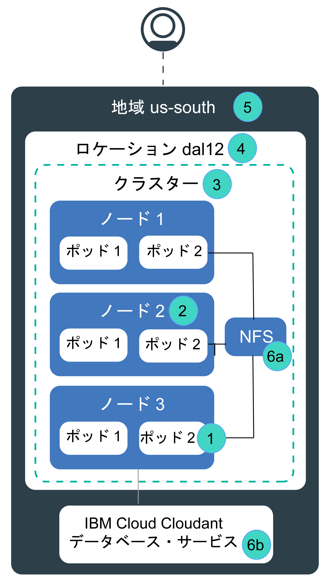

---

copyright:
  years: 2014, 2019
lastupdated: "2019-06-05"

keywords: kubernetes, iks, disaster recovery, dr, ha, hadr

subcollection: containers

---

{:new_window: target="_blank"}
{:shortdesc: .shortdesc}
{:screen: .screen}
{:pre: .pre}
{:table: .aria-labeledby="caption"}
{:codeblock: .codeblock}
{:tip: .tip}
{:note: .note}
{:important: .important}
{:deprecated: .deprecated}
{:download: .download}
{:preview: .preview}

# {{site.data.keyword.containerlong_notm}} の高可用性
{: #ha}

組み込みの Kubernetes 機能と {{site.data.keyword.containerlong}} 機能を使用してクラスターの可用性を高め、クラスター内のコンポーネントに障害が発生した場合にアプリでダウン時間が生じないように保護することができます。
{: shortdesc}

高可用性とは、サイトの一部または全体に障害が発生した後でもアプリを稼働状態に保つための、IT インフラストラクチャーの中核分野です。 高可用性の主な目的は、IT インフラストラクチャー内の潜在的な障害点を除去することです。 例えば、冗長性を追加してフェイルオーバー・メカニズムをセットアップすることで、1 つのシステムの障害に備えることができます。

高可用性は、IT インフラストラクチャーのさまざまなレベルで、また、クラスターのさまざまなコンポーネント内で実現できます。 どのレベルの可用性が適しているかは、ビジネス要件、顧客と合意したサービス・レベル・アグリーメント、予算など、いくつかの要因によって決まります。

## {{site.data.keyword.containerlong_notm}} の潜在的な障害点の概要
{: #fault_domains}

{{site.data.keyword.containerlong_notm}} のアーキテクチャーとインフラストラクチャーは、信頼性を確保し、処理待ち時間を短く、サービスの実行可能時間を最大にするように設計されています。 ただし、障害が発生する可能性はあります。 {{site.data.keyword.Bluemix_notm}} でホストするサービスによっては、たとえ数分の障害であっても障害を許容できないものがあります。
{: shortdesc}

{{site.data.keyword.containerlong_notm}} には、冗長性とアンチアフィニティーを追加してクラスターの可用性を向上させる方法がいくつか用意されています。 以下の図を参照して、潜在的な障害点とその除去方法を確認してください。

<dl>
<dt> 1. コンテナーまたはポッドの障害。</dt>
  <dd>
設計上、コンテナーやポッドの存続期間は短く、予期せぬ障害が起こることがあります。 例えば、アプリでエラーが発生した場合、コンテナーやポッドが異常終了する可能性があります。 アプリの可用性を高くするには、ワークロードを処理できる十分な数のアプリ・インスタンスに加えて、障害時用の追加インスタンスを用意しておく必要があります。 ワーカー・ノードの障害からアプリを保護するために、これらのインスタンスを複数のワーカー・ノードに分散させるのが理想的です。

  
[可用性の高いアプリのデプロイ](/docs/containers?topic=containers-app#highly_available_apps)を参照してください。
</dd>
<dt> 2. ワーカー・ノードの障害。</dt>
  <dd>
ワーカー・ノードは、物理ハードウェアの上で実行される VM です。 ワーカー・ノードの障害には、電源、冷却、ネットワーキングなどのハードウェア障害と VM 自体の問題が含まれます。 クラスター内に複数のワーカー・ノードをセットアップすることで、ワーカー・ノードの障害に備えられます。

1 つのゾーンに複数のワーカー・ノードを作成しても、それらが別々の物理コンピュート・ホストに置かれる保証はありません。 例えば、3 つのワーカー・ノードを持つクラスターがあるとしても、3 つのワーカー・ノードのすべてが IBM ゾーンの同じ物理コンピュート・ホスト上に作成されている場合があります。 その物理コンピュート・ホストがダウンした場合、すべてのワーカー・ノードがダウンします。 このような障害から保護するには、複数の異なるゾーンで、[複数ゾーン・クラスターをセットアップするか複数の単一ゾーン・クラスターを作成](/docs/containers?topic=containers-ha_clusters#ha_clusters)する必要があります。

  
[複数のワーカー・ノードを持つクラスターの作成](/docs/containers?topic=containers-cli-plugin-kubernetes-service-cli#cs_cluster_create)を参照してください。
</dd>
<dt> 3. クラスターの障害。</dt>
  <dd>
[Kubernetes マスター](/docs/containers?topic=containers-ibm-cloud-kubernetes-service-technology#architecture)は、クラスターを稼働状態に保つための主要なコンポーネントです。 マスターは、クラスターの真実の単一点 (Single Point of Truth) として機能する etcd データベースに、クラスター・リソースとその構成を保管します。 Kubernetes API サーバーは、ワーカー・ノードからマスターへのすべてのクラスター管理要求、またはクラスター・リソースと対話する場合のメインエントリー・ポイントです。  マスターに障害が発生した場合、ワークロードは引き続きワーカー・ノードで実行されますが、`kubectl` コマンドを使用してクラスター・リソースを操作したり、マスターの Kubernetes API サーバーがバックアップされるまでクラスターの正常性を表示したりすることはできません。 マスターの障害時にポッドがダウンすると、ワーカー・ノードが再び Kubernetes API サーバーに到達できるまで、ポッドをスケジュール変更することはできません。  マスターの障害時にも、`ibmcloud ks` コマンドを {{site.data.keyword.containerlong_notm}} API に対して実行して、ワーカー・ノードや VLAN などのインフラストラクチャー・リソースを操作することができます。 クラスターに対してワーカー・ノードを追加または削除して現在のクラスター構成を変更する場合、マスターがバックアップされるまで変更は行われません。

マスターの障害時はワーカー・ノードを再始動またはリブートしないでください。 このアクションにより、ワーカー・ノードからポッドが削除されます。 Kubernetes API サーバーが使用不可のため、ポッドをクラスター内の他のワーカー・ノードにスケジュール変更することはできません。
{: important}
 クラスターのマスターは高可用性です。マスター更新時などの停止を防ぐために、Kubernetes API サーバー、etcd、スケジューラー、コントローラー・マネージャーのレプリカが各ホスト上に配置されます。

クラスター・マスターをゾーン障害から保護するには、以下のようにします。 <ul><li>[複数ゾーンの大都市ロケーション](/docs/containers?topic=containers-regions-and-zones#zones)にクラスターを作成して、マスターを複数ゾーンに分散させます。</li><li>別のゾーンに 2 つ目のクラスターをセットアップします。</li></ul>

  
[可用性の高いクラスターのセットアップ](/docs/containers?topic=containers-ha_clusters#ha_clusters)を参照してください。
</dd>
<dt> 4. ゾーンの障害。</dt>
  <dd>
ゾーンの障害は、すべての物理コンピュート・ホストおよび NFS ストレージに影響します。 この障害には、電力、冷却、ネットワーキング、ストレージの故障と自然災害 (洪水、地震、ハリケーンなど) が含まれます。 ゾーンの障害から保護するには、2 つの異なるゾーンにクラスターを作成し、それらを外部ロード・バランサーでロード・バランシングする必要があります。

  
[可用性の高いクラスターのセットアップ](/docs/containers?topic=containers-ha_clusters#ha_clusters)を参照してください。
</dd>    
<dt> 5. 地域の障害。</dt>
  <dd>
すべての地域に、その地域に固有の API エンドポイントからアクセスできる高可用性ロード・バランサーがセットアップされています。 このロード・バランサーが、着信要求と発信要求を、その地域の各ゾーンにある複数のクラスターにルーティングします。 ある地域全体で障害が発生する可能性はごくわずかです。 それでも、このような障害に備えるには、複数のクラスターを別々の地域にセットアップし、それらを外部ロード・バランサーを使用して接続します。 ある地域全体で障害が発生した場合は、他の地域のクラスターがワークロードを引き継ぐことができます。

複数地域にまたがるクラスターには複数のクラウド・リソースが必要になるので、アプリによっては複雑でコストがかかる場合があります。 複数地域のセットアップが必要かどうか、あるいは、潜在的なサービスの中断に対応できるかどうかを確認してください。 複数地域にまたがるクラスターをセットアップする場合は、アプリとデータが別の地域でもホスト可能であること、また、アプリがグローバルなデータ複製に対応できることを確認してください。

  
[可用性の高いクラスターのセットアップ](/docs/containers?topic=containers-ha_clusters#ha_clusters)を参照してください。
</dd>   
<dt> 6a、6b. ストレージの障害。</dt>
  <dd>
ステートフルなアプリでは、データが、アプリを稼働状態に保つために重要な役割を果たします。 潜在的な障害からリカバリーできるように、データの可用性は必ず高くなるようにしてください。 {{site.data.keyword.containerlong_notm}} では、データを保持する方法を複数の選択肢から選択できます。 例えば、Kubernetes ネイティブ永続ボリュームを使用して NFS ストレージをプロビジョンしたり、{{site.data.keyword.Bluemix_notm}} データベース・サービスを使用してデータを保管したりできます。

  
[可用性の高いデータの計画](/docs/containers?topic=containers-storage_planning#persistent_storage_overview)を参照してください。
</dd>
</dl>
