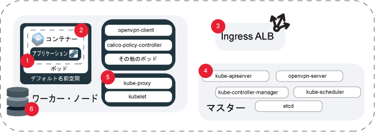

---

copyright:
  years: 2014, 2019
lastupdated: "2019-06-11"

keywords: kubernetes, iks, logmet, logs, metrics

subcollection: containers

---

{:new_window: target="_blank"}
{:shortdesc: .shortdesc}
{:screen: .screen}
{:pre: .pre}
{:table: .aria-labeledby="caption"}
{:codeblock: .codeblock}
{:tip: .tip}
{:note: .note}
{:important: .important}
{:deprecated: .deprecated}
{:download: .download}
{:preview: .preview}


# ロギングとモニタリング
{: #health}

{{site.data.keyword.containerlong}} でロギングとモニタリングをセットアップすると、問題のトラブルシューティングや、Kubernetes クラスターとアプリの正常性とパフォーマンスの改善に役立ちます。
{: shortdesc}

継続的なモニタリングとロギングは、クラスターへの攻撃を検出し、問題が発生したときに問題をトラブルシューティングするために重要です。 クラスターを継続的にモニターすることによって、クラスターの容量、およびアプリで使用可能なリソースの可用性をよく把握することができます。 この情報があれば、アプリのダウン時間の発生を防ぐために準備できます。 **注**: ロギングとモニタリングを構成するには、{{site.data.keyword.containerlong_notm}} で標準クラスターを使用する必要があります。

## ロギング・ソリューションの選択
{: #logging_overview}

デフォルトでは、{{site.data.keyword.containerlong_notm}} クラスター・コンポーネント (ワーカー・ノード、コンテナー、アプリケーション、永続ストレージ、Ingress アプリケーション・ロード・バランサー、Kubernetes API、`kube-system` 名前空間) のすべてのログは、ローカルで生成され、書き込まれます。 これらのログを収集し、転送して表示するために提供されているロギング・ソリューションが複数あります。
{: shortdesc}

ロギング・ソリューションは、ログを収集するクラスター・コンポーネントに応じて選択できます。 一般的には、分析機能やインターフェース機能に基づいて好みのロギング・サービス ({{site.data.keyword.loganalysisfull}}、{{site.data.keyword.la_full}}、サード・パーティー・サービスなど) を選択します。 それから、{{site.data.keyword.cloudaccesstrailfull}} を使用して、クラスター内のユーザー・アクティビティーを監査したり、クラスターのマスター・ログを {{site.data.keyword.cos_full}} にバックアップしたりします。 **注**: ロギングを構成するには、標準 Kubernetes クラスターを使用する必要があります。

<dl>

<dt>{{site.data.keyword.la_full_notm}}</dt>
<dd>サード・パーティー・サービスとして LogDNA をクラスターにデプロイして、ポッド・コンテナーのログを管理します。 {{site.data.keyword.la_full_notm}} を使用するには、クラスター内のすべてのワーカー・ノードにロギング・エージェントをデプロイする必要があります。 このエージェントは、`kube-system` などのすべての名前空間から、ポッドの `/var/log` ディレクトリーに保管されている拡張子のないファイルと拡張子が `*.log` のログを収集します。 そして、それらのログを {{site.data.keyword.la_full_notm}} サービスに転送します。 このサービスについて詳しくは、[{{site.data.keyword.la_full_notm}}](/docs/services/Log-Analysis-with-LogDNA?topic=LogDNA-about) の資料を参照してください。 始めに、[{{site.data.keyword.loganalysisfull_notm}} with LogDNA による Kubernetes クラスター・ログの管理](/docs/services/Log-Analysis-with-LogDNA/tutorials?topic=LogDNA-kube#kube)を参照してください。
</dd>

<dt>Fluentd と {{site.data.keyword.loganalysisfull_notm}} の組み合わせ</dt>
<dd><p class="deprecated">以前は、Fluentd クラスター・コンポーネントによって収集されたログを {{site.data.keyword.loganalysisfull_notm}} に転送するためのロギング構成を作成できました。2019 年 4 月 30 日をもって、新しい {{site.data.keyword.loganalysisshort_notm}} インスタンスをプロビジョンできなくなり、すべてのライト・プラン・インスタンスは削除されます。 既存のプレミアム・プラン・インスタンスは 2019 年 9 月 30 日までサポートされます。 クラスターのログの収集を継続するには、{{site.data.keyword.la_full_notm}} をセットアップするか、ログを外部サーバーに転送するように構成を変更する必要があります。</p>
</dd>

<dt>Fluentd と外部サーバーの組み合わせ</dt>
<dd>クラスター・コンポーネントのログの収集、転送、表示のために、Fluentd を使用してロギング構成を作成できます。 ロギング構成を作成すると、[Fluentd ](https://www.fluentd.org/) クラスター・コンポーネントが、指定されたソースのパスからログを収集します。その後 Fluentd は、syslog プロトコルを受け入れる外部サーバーにこれらのログを転送できます。始めに、[クラスターとアプリのログの syslog への転送について](#logging)を参照してください。
</dd>

<dt>{{site.data.keyword.cloudaccesstrailfull_notm}}</dt>
<dd>クラスター内でユーザーによって開始された管理アクティビティーをモニターするには、監査ログを収集して {{site.data.keyword.cloudaccesstrailfull_notm}} に転送します。 クラスターでは、2 種類の {{site.data.keyword.cloudaccesstrailshort}} イベントが生成されます。
<ul><li>クラスター管理イベントは自動的に生成され、{{site.data.keyword.cloudaccesstrailshort}} に転送されます。</li>
<li>Kubernetes API サーバー監査イベントは自動的に生成されますが、そのログを Fluentd で {{site.data.keyword.cloudaccesstrailshort}} に転送するには、[ロギング構成を作成](#api_forward)する必要があります。</li></ul>
追跡できる {{site.data.keyword.containerlong_notm}} イベントのタイプについて詳しくは、[Activity Tracker イベント](/docs/containers?topic=containers-at_events)を参照してください。 このサービスについて詳しくは、[Activity Tracker](/docs/services/cloud-activity-tracker?topic=cloud-activity-tracker-getting-started) の資料を参照してください。
  <p class="note">{{site.data.keyword.containerlong_notm}} は現在 {{site.data.keyword.at_full}} を使用するように構成されていません。クラスター管理イベントと Kubernetes API 監査ログを管理するには、引き続き {{site.data.keyword.cloudaccesstrailfull_notm}} を LogAnalysis と組み合わせて使用します。</p>
</dd>

<dt>{{site.data.keyword.cos_full_notm}}</dt>
<dd>クラスターの Kubernetes マスターのログを収集し、転送して表示するために、任意の時点のマスター・ログのスナップショットを取得して {{site.data.keyword.cos_full_notm}} バケット内に収集することができます。 このスナップショットには、ポッドのスケジューリング、デプロイメント、RBAC ポリシーなどの、API サーバー経由で送信されるすべてのものが含まれます。 始めに、[マスター・ログの収集](#collect_master)を参照してください。</dd>

<dt>サード・パーティー・サービス</dt>
<dd>特別な要件がある場合は、独自のロギング・ソリューションをセットアップできます。 クラスターに追加できるサード・パーティー・ロギング・サービスを[ロギングとモニタリングの統合](/docs/containers?topic=containers-supported_integrations#health_services)で確認してください。 `/var/log/pods/` パスからコンテナー・ログを収集できます。</dd>

</dl>

<br />


## クラスターとアプリのログの {{site.data.keyword.la_full_notm}} への転送
{: #logdna}

サード・パーティー・サービスとして LogDNA をクラスターにデプロイして、ポッド・コンテナーのログを管理します。
{: shortdesc}

{{site.data.keyword.la_full_notm}} を使用するには、クラスター内のすべてのワーカー・ノードにロギング・エージェントをデプロイする必要があります。 このエージェントは、`kube-system` などのすべての名前空間から、ポッドの `/var/log` ディレクトリーに保管されている拡張子のないファイルと拡張子が `*.log` のログを収集します。 そして、それらのログを {{site.data.keyword.la_full_notm}} サービスに転送します。 このサービスについて詳しくは、[{{site.data.keyword.la_full_notm}}](/docs/services/Log-Analysis-with-LogDNA?topic=LogDNA-about) の資料を参照してください。 始めに、[{{site.data.keyword.loganalysisfull_notm}} with LogDNA による Kubernetes クラスター・ログの管理](/docs/services/Log-Analysis-with-LogDNA/tutorials?topic=LogDNA-kube#kube)を参照してください。

<br />


## 非推奨: クラスターとアプリのログおよび Kubernetes API 監査ログの {{site.data.keyword.loganalysisfull_notm}} への転送
{: #loga}

以前は、Fluentd クラスター・コンポーネントによって収集されたログを {{site.data.keyword.loganalysisfull_notm}} に転送するためのロギング構成を作成できました。2019 年 4 月 30 日をもって、{{site.data.keyword.loganalysisfull_notm}} は非推奨になりました。新しい {{site.data.keyword.loganalysisshort_notm}} インスタンスをプロビジョンできなくなり、すべてのライト・プラン・インスタンスは削除されます。 既存のプレミアム・プラン・インスタンスは 2019 年 9 月 30 日までサポートされます。
{: deprecated}

クラスターのログの収集を継続するには、以下のオプションがあります。
* {{site.data.keyword.la_full_notm}} をセットアップします。詳しくは、[{{site.data.keyword.la_full_notm}} への移行](/docs/services/CloudLogAnalysis?topic=cloudloganalysis-transition)を参照してください。
* [ログを外部サーバーに転送するように構成を変更](#configuring)します。

既存の {{site.data.keyword.loganalysisshort_notm}} インスタンスについて詳しくは、[{{site.data.keyword.loganalysisshort_notm}} の資料](/docs/services/CloudLogAnalysis?topic=cloudloganalysis-containers_kube_other_logs)を参照してください。

<br />


## クラスターとアプリのログおよび Kubernetes API 監査ログの外部サーバーへの転送
{: #configuring}

{{site.data.keyword.containerlong_notm}} の標準クラスターから外部サーバーへのログ転送を構成します。
{: shortdesc}

### 外部サーバーへのログ転送について
{: #logging}

デフォルトでは、ログはクラスター内の [Fluentd ](https://www.fluentd.org/) アドオンによって収集されます。 クラスター内のソース (コンテナーなど) に対してロギング構成を作成すると、Fluentd によってそのソースのパスから収集されたログは外部サーバーに転送されます。ソースからロギング・サービスの取り込みポートへのトラフィックは暗号化されます。
{: shortdesc}

**ログ転送を構成できるソースは何ですか?**

ロギングを構成できるソースのロケーションは、以下の図のとおりです。



1. `ワーカー`: ユーザーがワーカー・ノードに指定したインフラストラクチャー構成に固有の情報。 ワーカー・ログは syslog に取り込まれ、オペレーティング・システムのイベントが含まれます。 `auth.log` には、OS に対して行われた認証要求に関する情報が含まれます。</br>**パス**:
    * `/var/log/syslog`
    * `/var/log/auth.log`

2. `container`: 実行中のコンテナーによってログに記録される情報。</br>**Paths**: `STDOUT` または `STDERR` に出力される任意の情報。

3. `アプリケーション`: アプリケーション・レベルで発生するイベントに関する情報。 これは、ログインの成功、ストレージに関する警告、アプリ・レベルで実行できるその他の操作などのイベントが発生したという通知である可能性があります。</br>**パス**: ログの転送先にするパスを設定できます。ただし、ログを送信するには、ロギング構成で絶対パスを使用する必要があります。そうしないとログは読み取られません。 パスがワーカー・ノードにマウントされている場合は、シンボリック・リンクが作成されている可能性があります。 例: 指定されたパスが `/usr/local/spark/work/app-0546/0/stderr` であるのに、実際にはログが `/usr/local/spark-1.0-hadoop-1.2/work/app-0546/0/stderr` に送信されている場合、ログは読み取れません。

4. `ストレージ`: クラスター内にセットアップされた永続ストレージに関する情報。 ストレージ・ログは、DevOps パイプラインおよび製品リリースの一部として問題判別ダッシュボードおよびアラートをセットアップするのに役立ちます。 `注**: パス **/var/log/kubelet.log` および `/var/log/syslog` にもストレージ・ログが含まれていますが、これらのパスにあるログは `kubernetes` および `worker` ログ・ソースによって収集されます。</br>**パス**:
    * `/var/log/ibmc-s3fs.log`
    * `/var/log/ibmc-block.log`

  **ポッド**:
    * `portworx-***`
    * `ibmcloud-block-storage-attacher-***`
    * `ibmcloud-block-storage-driver-***`
    * `ibmcloud-block-storage-plugin-***`
    * `ibmcloud-object-storage-plugin-***`

5. `kubernetes`: ワーカー・ノードの kube-system 名前空間内で発生する kubelet、kube-proxy、その他の Kubernetes イベントからの情報。</br>**パス**:
    * `/var/log/kubelet.log`
    * `/var/log/kube-proxy.log`
    * `/var/log/event-exporter/1..log`

6. `kube-audit`: Kubernetes API サーバーに送信されるクラスター関連アクションに関する情報。時間、ユーザー、および影響を受けるリソースを含みます。

7. `ingress`: Ingress ALB を介してクラスターに伝送されるネットワーク・トラフィックに関する情報。</br>**パス**:
    * `/var/log/alb/ids/*.log`
    * `/var/log/alb/ids/*.err`
    * `/var/log/alb/customerlogs/*.log`
    * `/var/log/alb/customerlogs/*.err`

</br>

**構成オプションにはどのようなものがありますか?**

ロギングを構成する際に使用できる各種オプションとその説明は、次の表のとおりです。

<table>
<caption> ロギング構成オプションについて</caption>
  <thead>
    <th>オプション</th>
    <th>説明</th>
  </thead>
  <tbody>
    <tr>
      <td><code><em>&lt;cluster_name_or_ID&gt;</em></code></td>
      <td>クラスターの名前または ID。</td>
    </tr>
    <tr>
      <td><code><em>--log_source</em></code></td>
      <td>ログの転送元になるソース。 指定可能な値は、<code>container</code>、<code>application</code>、<code>worker</code>、<code>kubernetes</code>、<code>ingress</code>、<code>storage</code>、および <code>kube-audit</code> です。 この引数では、構成に適用するログ・ソースのコンマ区切りのリストを使用できます。 ログ・ソースを指定しない場合は、<code>container</code> と <code>ingress</code> のログ・ソースのロギング構成が作成されます。</td>
    </tr>
    <tr>
      <td><code><em>--type syslog</em></code></td>
      <td><code>syslog</code> という値を指定することで、ログが外部サーバーに転送されます。</p>
      </dd></td>
    </tr>
    <tr>
      <td><code><em>--namespace</em></code></td>
      <td>オプション: ログの転送元になる Kubernetes 名前空間。 ログ転送は、Kubernetes 名前空間 <code>ibm-system</code> と <code>kube-system</code> ではサポートされていません。 この値は、<code>container</code> ログ・ソースについてのみ有効です。 名前空間を指定しないと、クラスター内のすべての名前空間でこの構成が使用されます。</td>
    </tr>
    <tr>
      <td><code><em>--hostname</em></code></td>
      <td><p>{{site.data.keyword.loganalysisshort_notm}} の場合は、[取り込み URL](/docs/services/CloudLogAnalysis?topic=cloudloganalysis-log_ingestion#log_ingestion_urls)を使用します。 取り込み URL を指定しない場合、クラスターを作成した地域のエンドポイントが使用されます。</p>
      <p>syslog の場合は、ログ・コレクター・サービスのホスト名または IP アドレスを指定します。</p></td>
    </tr>
    <tr>
      <td><code><em>--port</em></code></td>
      <td>取り込みポート。 ポートを指定しないと、標準ポート <code>9091</code> が使用されます。
      <p>syslog の場合は、ログ・コレクター・サーバーのポートを指定します。 ポートを指定しないと、標準ポート <code>514</code> が使用されます。</td>
    </tr>
    <tr>
      <td><code><em>--app-containers</em></code></td>
      <td>オプション: アプリのログを転送するには、アプリが含まれているコンテナーの名前を指定します。 コンマ区切りのリストを使用して複数のコンテナーを指定できます。 コンテナーを指定しない場合は、指定したパスが入っているすべてのコンテナーのログが転送されます。</td>
    </tr>
    <tr>
      <td><code><em>--app-paths</em></code></td>
      <td>アプリがログを書き込むコンテナー上のパス。 ソース・タイプが <code>application</code> のログを転送するには、パスを指定する必要があります。 複数のパスを指定するには、コンマ区切りリストを使用します。 例: <code>/var/log/myApp1/*,/var/log/myApp2/*</code></td>
    </tr>
    <tr>
      <td><code><em>--syslog-protocol</em></code></td>
      <td>ロギング・タイプが <code>syslog</code> の場合は、トランスポート層プロトコル。 `udp`、`tls`、または `tcp` の各プロトコルを使用できます。 <code>udp</code> プロトコルを使用して rsyslog サーバーに転送する場合、1KB を超えるログは切り捨てられます。</td>
    </tr>
    <tr>
      <td><code><em>--ca-cert</em></code></td>
      <td>必須: ロギング・タイプが <code>syslog</code> で、プロトコルが <code>tls</code> である場合、認証局証明書を含む Kubernetes シークレット名。</td>
    </tr>
    <tr>
      <td><code><em>--verify-mode</em></code></td>
      <td>ロギング・タイプが <code>syslog</code> で、プロトコルが <code>tls</code> である場合、検証モード。 サポートされる値は <code>verify-peer</code> で、デフォルトは <code>verify-none</code>。</td>
    </tr>
    <tr>
      <td><code><em>--skip-validation</em></code></td>
      <td>オプション: 組織名とスペース名が指定されている場合にそれらの検証をスキップします。 検証をスキップすると処理時間は短縮されますが、ロギング構成が無効な場合、ログは正しく転送されません。</td>
    </tr>
  </tbody>
</table>

**Fluentd は自分で更新し続ける必要がありますか?**

ロギングやフィルターの構成を変更するには、Fluentd ロギング・アドオンが最新バージョンである必要があります。デフォルトでは、このアドオンに対する自動更新が有効になっています。 自動更新を使用不可にするには、[クラスターのアドオンの更新: ロギング用の Fluentd](/docs/containers?topic=containers-update#logging-up)を参照してください。

**クラスター内の 1 つのソースから、一部のログだけを転送し、その他のログは転送しないようにすることは可能ですか?**

はい。 例えば、特にログ量の多いポッドがある場合に、そのポッドのログでログ・ストレージ・スペースが占有されないようにして、他のポッドのログを転送したいことがあります。 特定のポッドのログを転送しないようにする方法については、[ログのフィルタリング](#filter-logs)を参照してください。

<br />


### クラスターとアプリのログの転送
{: #enable-forwarding}

クラスターとアプリのロギングの構成を作成します。フラグを使用することによって、異なるロギング・オプションを区別できます。
{: shortdesc}

**`udp` または `tcp` プロトコルを介してユーザー自身のサーバーにログを転送する**

1. [**エディター**または**管理者**の {{site.data.keyword.Bluemix_notm}} IAM プラットフォーム役割](/docs/containers?topic=containers-users#platform)があることを確認してください。

2. ログ・ソースがあるクラスターの場合: [アカウントにログインします。 該当する場合は、適切なリソース・グループをターゲットにします。 クラスターのコンテキストを設定します。](/docs/containers?topic=containers-cs_cli_install#cs_cli_configure)

3. 以下の 2 つの方法のいずれかで、syslog プロトコルを受け入れるサーバーをセットアップします。
  * 独自のサーバーをセットアップして管理するか、プロバイダーが管理するサーバーを使用します。 プロバイダーがサーバーを管理する場合は、ロギング・プロバイダーからロギング・エンドポイントを取得します。

  * コンテナーから syslog を実行します。 例えば、この[デプロイメント .yaml ファイル ](https://github.com/IBM-Cloud/kube-samples/blob/master/deploy-apps-clusters/deploy-syslog-from-kube.yaml) を使用して、クラスター内のコンテナーで実行されている Docker パブリック・イメージをフェッチできます。 このイメージは、パブリック・クラスター IP アドレスのポート `514` を公開し、このパブリック・クラスター IP アドレスを使用して syslog ホストを構成します。

  syslog 接頭部を削除することによって、有効な JSON としてログを表示できます。 これを行うには、rsyslog サーバーが稼働している環境の <code>etc/rsyslog.conf</code> ファイルの先頭に次のコードを追加します。 <code>$template customFormat,"%msg%\n"</br>$ActionFileDefaultTemplate customFormat</code>
  {: tip}

4. ログ転送構成を作成します。
    ```
    ibmcloud ks logging-config-create --cluster <cluster_name_or_ID> --logsource <log_source> --namespace <kubernetes_namespace> --hostname <log_server_hostname_or_IP> --port <log_server_port> --type syslog --app-containers <containers> --app-paths <paths_to_logs> --syslog-protocol <protocol> --skip-validation
    ```
    {: pre}

</br></br>

**`tls` プロトコルを介してユーザー自身のサーバーにログを転送する**

以下のステップは、一般的な説明です。 実稼働環境でコンテナーを使用する前に、必要なセキュリティー条件を満たしていることを確認してください。
{: tip}

1. 以下の [{{site.data.keyword.Bluemix_notm}} IAM 役割](/docs/containers?topic=containers-users#platform)があることを確認します。
    * クラスターに対する**エディター**または**管理者**のプラットフォーム役割
    * `kube-system` 名前空間に対する**ライター**または**管理者**のサービス役割

2. ログ・ソースがあるクラスターの場合: [アカウントにログインします。 該当する場合は、適切なリソース・グループをターゲットにします。 クラスターのコンテキストを設定します。](/docs/containers?topic=containers-cs_cli_install#cs_cli_configure)

3. 以下の 2 つの方法のいずれかで、syslog プロトコルを受け入れるサーバーをセットアップします。
  * 独自のサーバーをセットアップして管理するか、プロバイダーが管理するサーバーを使用します。 プロバイダーがサーバーを管理する場合は、ロギング・プロバイダーからロギング・エンドポイントを取得します。

  * コンテナーから syslog を実行します。 例えば、この[デプロイメント .yaml ファイル ](https://github.com/IBM-Cloud/kube-samples/blob/master/deploy-apps-clusters/deploy-syslog-from-kube.yaml) を使用して、クラスター内のコンテナーで実行されている Docker パブリック・イメージをフェッチできます。 このイメージは、パブリック・クラスター IP アドレスのポート `514` を公開し、このパブリック・クラスター IP アドレスを使用して syslog ホストを構成します。 関連する認証局証明書およびサーバー・サイド証明書を注入し、`syslog.conf` を更新して、サーバー上で `tls` を有効にする必要があります。

4. 認証局証明書を `ca-cert` という名前のファイルに保存します。この名前のとおりでなければなりません。

5. `ca-cert` ファイル用のシークレットを `kube-system` 名前空間に作成します。 ロギング構成を作成するときは、`--ca-cert` フラグにこのシークレット名を使用します。
    ```
    kubectl -n kube-system create secret generic --from-file=ca-cert
    ```
    {: pre}

6. ログ転送構成を作成します。
    ```
    ibmcloud ks logging-config-create --cluster <cluster name or id> --logsource <log source> --type syslog --syslog-protocol tls --hostname <ip address of syslog server> --port <port for syslog server, 514 is default> --ca-cert <secret name> --verify-mode <defaults to verify-none>
    ```
    {: pre}

### Kubernetes API 監査ログの転送
{: #audit_enable}

Kubernetes API サーバーを通過するすべてのイベントを監査するには、イベントを外部サーバーに転送するための構成を作成します。
{: shortdesc}

Kubernetes 監査ログについて詳しくは、Kubernetes 資料の<a href="https://kubernetes.io/docs/tasks/debug-application-cluster/audit/" target="blank">監査トピック </a> を参照してください。

* 現在は、このロギング構成のすべてのクラスターで、デフォルトの監査ポリシーが使用されます。
* 現在、フィルターはサポートされていません。
* クラスターごとに 1 つの `kube-audit` 構成しか設定できませんが、ロギング構成と Webhook を作成することで、{{site.data.keyword.cloudaccesstrailshort}} と外部サーバーにログを転送できます。
* クラスターに対する[**管理者**の {{site.data.keyword.Bluemix_notm}} IAM プラットフォーム役割](/docs/containers?topic=containers-users#platform)が必要です。

**始める前に**

1. ログを転送できるリモート・ロギング・サーバーをセットアップします。 例えば、[Logstash と Kubernetes を使用して ](https://kubernetes.io/docs/tasks/debug-application-cluster/audit/#use-logstash-to-collect-and-distribute-audit-events-from-webhook-backend)、監査イベントを収集できます。

2. API サーバー監査ログの収集元にするクラスターの場合: [アカウントにログインします。 該当する場合は、適切なリソース・グループをターゲットにします。 クラスターのコンテキストを設定します。](/docs/containers?topic=containers-cs_cli_install#cs_cli_configure)

Kubernetes API 監査ログを転送するには、以下のようにします。

1. Webhook をセットアップします。 どのフラグにも情報を指定しない場合、デフォルトの構成が使用されます。

    ```
    ibmcloud ks apiserver-config-set audit-webhook <cluster_name_or_ID> --remoteServer <server_URL_or_IP> --caCert <CA_cert_path> --clientCert <client_cert_path> --clientKey <client_key_path>
    ```
    {: pre}

  <table>
  <caption>このコマンドの構成要素について</caption>
    <thead>
      <th colspan=2> このコマンドの構成要素について</th>
    </thead>
    <tbody>
      <tr>
        <td><code><em>&lt;cluster_name_or_ID&gt;</em></code></td>
        <td>クラスターの名前または ID。</td>
      </tr>
      <tr>
        <td><code><em>&lt;server_URL&gt;</em></code></td>
        <td>ログの送信先となるリモート・ロギング・サービスの URL または IP アドレス。 非セキュアなサーバー URL を指定すると、証明書は無視されます。</td>
      </tr>
      <tr>
        <td><code><em>&lt;CA_cert_path&gt;</em></code></td>
        <td>リモート・ロギング・サービスの検証に使用される CA 証明書のファイル・パス。</td>
      </tr>
      <tr>
        <td><code><em>&lt;client_cert_path&gt;</em></code></td>
        <td>リモート・ロギング・サービスに対する認証に使用されるクライアント証明書のファイル・パス。</td>
      </tr>
      <tr>
        <td><code><em>&lt;client_key_path&gt;</em></code></td>
        <td>リモート・ロギング・サービスへの接続に使用される、対応するクライアント・キーのファイル・パス。</td>
      </tr>
    </tbody>
  </table>

2. リモート・ロギング・サービスの URL を参照して、ログ転送が有効化されていることを確認します。

    ```
    ibmcloud ks apiserver-config-get audit-webhook <cluster_name_or_ID>
    ```
    {: pre}

    出力例:
    ```
    OK
    Server:			https://8.8.8.8
    ```
    {: screen}

3. Kubernetes マスターを再始動して、構成の更新を適用します。

    ```
    ibmcloud ks apiserver-refresh --cluster <cluster_name_or_ID>
    ```
    {: pre}

4. オプション: 監査ログの転送を停止するには、構成を無効にします。
    1. API サーバー監査ログの収集を停止するクラスターの場合: [アカウントにログインします。 該当する場合は、適切なリソース・グループをターゲットにします。 クラスターのコンテキストを設定します。](/docs/containers?topic=containers-cs_cli_install#cs_cli_configure)
    2. クラスターの API サーバーの Web フック・バックエンド構成を無効にします。

        ```
        ibmcloud ks apiserver-config-unset audit-webhook <cluster_name_or_ID>
        ```
        {: pre}

    3. Kubernetes マスターを再始動して、構成の更新を適用します。

        ```
        ibmcloud ks apiserver-refresh --cluster <cluster_name_or_ID>
        ```
        {: pre}

### 転送されるログのフィルタリング
{: #filter-logs}

一定期間における特定のログをフィルターで除外することで、外部サーバーに転送するログを選択できます。フラグを使用することによって、異なるフィルター操作オプションを区別できます。
{: shortdesc}

<table>
<caption>ログ・フィルター操作のオプションについて</caption>
  <thead>
    <th colspan=2> ログ・フィルター操作オプションについて</th>
  </thead>
  <tbody>
    <tr>
      <td>&lt;cluster_name_or_ID&gt;</td>
      <td>必須: ログをフィルターに掛けるクラスターの名前または ID。</td>
    </tr>
    <tr>
      <td><code>&lt;log_type&gt;</code></td>
      <td>フィルターを適用するログのタイプ。 現在、<code>all</code>、<code>container</code>、<code>host</code> がサポートされています。</td>
    </tr>
    <tr>
      <td><code>&lt;configs&gt;</code></td>
      <td>オプション: ロギング構成 ID のコンマ区切りのリスト。 指定しない場合、フィルターに渡されたすべてのクラスター・ロギング構成にフィルターが適用されます。 フィルターと一致するログ構成を表示するには、<code>--show-matching-configs</code> オプションを使用します。</td>
    </tr>
    <tr>
      <td><code>&lt;kubernetes_namespace&gt;</code></td>
      <td>オプション: ログの転送元になる Kubernetes 名前空間。 このフラグは、ログ・タイプ <code>container</code> を使用している場合にのみ、適用されます。</td>
    </tr>
    <tr>
      <td><code>&lt;container_name&gt;</code></td>
      <td>オプション: ログをフィルタリングするコンテナーの名前。</td>
    </tr>
    <tr>
      <td><code>&lt;logging_level&gt;</code></td>
      <td>オプション: 指定したレベル以下のログをフィルターで除外します。 指定できる値は、規定の順に <code>fatal</code>、<code>error</code>、<code>warn/warning</code>、<code>info</code>、<code>debug</code>、<code>trace</code> です。 例えば、<code>info</code> レベルのログをフィルタリングした場合、<code>debug</code> と <code>trace</code> もフィルタリングされます。 **注**: このフラグは、ログ・メッセージが JSON 形式で、レベル・フィールドを含んでいる場合にのみ使用できます。 JSON 形式でメッセージを表示するには、<code>--json</code> フラグをコマンドに付加します。</td>
    </tr>
    <tr>
      <td><code>&lt;メッセージ&gt;</code></td>
      <td>オプション: 正規表現で記述された指定メッセージが含まれるログをフィルターで除外します。</td>
    </tr>
    <tr>
      <td><code>&lt;filter_ID&gt;</code></td>
      <td>オプション: ログ・フィルターの ID。</td>
    </tr>
    <tr>
      <td><code>--show-matching-configs</code></td>
      <td>オプション: 各フィルターが適用されるロギング構成を表示します。</td>
    </tr>
    <tr>
      <td><code>--all</code></td>
      <td>オプション: すべてのログ転送フィルターを削除します。</td>
    </tr>
  </tbody>
</table>

1. ロギング・フィルターを作成します。
  ```
  ibmcloud ks logging-filter-create --cluster <cluster_name_or_ID> --type <log_type> --logging-configs <configs> --namespace <kubernetes_namespace> --container <container_name> --level <logging_level> --regex-message <message>
  ```
  {: pre}

2. 作成したログ・フィルターを表示します。

  ```
  ibmcloud ks logging-filter-get --cluster <cluster_name_or_ID> --id <filter_ID> --show-matching-configs
  ```
  {: pre}

3. 作成したログ・フィルターを更新します。
  ```
  ibmcloud ks logging-filter-update --cluster <cluster_name_or_ID> --id <filter_ID> --type <server_type> --logging-configs <configs> --namespace <kubernetes_namespace --container <container_name> --level <logging_level> --regex-message <message>
  ```
  {: pre}

4. 作成したログ・フィルターを削除します。

  ```
  ibmcloud ks logging-filter-rm --cluster <cluster_name_or_ID> --id <filter_ID> [--all]
  ```
  {: pre}

### ログ転送構成の確認、更新、および削除
{: #verifying-log-forwarding}

**確認**</br>
以下の 2 つのいずれかの方法で、構成が正しくセットアップされていることを確認できます。

* クラスター内のすべてのロギング構成をリスト表示する場合には、以下のようにします。
  ```
  ibmcloud ks logging-config-get --cluster <cluster_name_or_ID>
  ```
  {: pre}

* 1 つのタイプのログ・ソースのロギング構成をリストする場合には、以下のようにします。
  ```
  ibmcloud ks logging-config-get --cluster <cluster_name_or_ID> --logsource <source>
  ```
  {: pre}

**更新**</br>
既に作成したロギング構成を更新できます。
```
ibmcloud ks logging-config-update --cluster <cluster_name_or_ID> --id <log_config_id> --namespace <namespace> --type <server_type> --syslog-protocol <protocol> --logsource <source> --hostname <hostname_or_ingestion_URL> --port <port> --space <cluster_space> --org <cluster_org> --app-containers <containers> --app-paths <paths_to_logs>
```
{: pre}

**削除**</br>
クラスターの 1 つまたはすべてのロギング構成を削除することにより、ログの転送を停止できます。

* 1 つのロギング構成を削除するには、以下のようにします。
  ```
  ibmcloud ks logging-config-rm --cluster <cluster_name_or_ID> --id <log_config_ID>
  ```
  {: pre}

* すべてのロギング構成を削除するには、以下のようにします。
  ```
  ibmcloud ks logging-config-rm --cluster <my_cluster> --all
  ```
  {: pre}

<br />


## Kubernetes API 監査ログの {{site.data.keyword.cloudaccesstrailfull_notm}} への転送
{: #api_forward}

Kubernetes は、Kubernetes API サーバーを通るすべてのイベントを自動的に監査します。 これらのイベントを {{site.data.keyword.cloudaccesstrailfull_notm}} に転送できます。
{: shortdesc}

Kubernetes 監査ログについて詳しくは、Kubernetes 資料の<a href="https://kubernetes.io/docs/tasks/debug-application-cluster/audit/" target="blank">監査トピック </a> を参照してください。

* 現在は、このロギング構成のすべてのクラスターで、デフォルトの監査ポリシーが使用されます。
* 現在、フィルターはサポートされていません。
* クラスターごとに 1 つの `kube-audit` 構成しか設定できませんが、ロギング構成と Webhook を作成することで、{{site.data.keyword.cloudaccesstrailshort}} と外部サーバーにログを転送できます。
* クラスターに対する[**管理者**の {{site.data.keyword.Bluemix_notm}} IAM プラットフォーム役割](/docs/containers?topic=containers-users#platform)が必要です。

{{site.data.keyword.containerlong_notm}} は現在 {{site.data.keyword.at_full}} を使用するように構成されていません。Kubernetes API 監査ログを管理するには、引き続き {{site.data.keyword.cloudaccesstrailfull_notm}} を LogAnalysis と組み合わせて使用します。
{: note}

**始める前に**

1. 権限を確認してください。 クラスターの作成時にスペースを指定した場合は、アカウント所有者と {{site.data.keyword.containerlong_notm}} 鍵所有者の両方に、そのスペース内の管理者権限、開発者権限、または監査員権限が必要です。

2. API サーバー監査ログの収集元にするクラスターの場合: [アカウントにログインします。 該当する場合は、適切なリソース・グループをターゲットにします。 クラスターのコンテキストを設定します。](/docs/containers?topic=containers-cs_cli_install#cs_cli_configure)

**ログの転送**

1. ロギング構成を作成します。

    ```
    ibmcloud ks logging-config-create --cluster <cluster_name_or_ID> --logsource kube-audit --space <cluster_space> --org <cluster_org> --hostname <ingestion_URL> --type ibm
    ```
    {: pre}

    コマンドと出力の例:

    ```
    ibmcloud ks logging-config-create --cluster myCluster --logsource kube-audit
    Creating logging configuration for kube-audit logs in cluster myCluster...
    OK
    Id                                     Source      Namespace   Host                                   Port     Org    Space   Server Type   Protocol  Application Containers   Paths
    14ca6a0c-5bc8-499a-b1bd-cedcf40ab850   kube-audit    -         ingest-au-syd.logging.bluemix.net✣    9091✣     -       -         ibm          -              -                  -

    ✣ Indicates the default endpoint for the {{site.data.keyword.loganalysisshort_notm}} service.

    ```
    {: screen}

    <table>
    <caption>このコマンドの構成要素について</caption>
      <thead>
        <th colspan=2> このコマンドの構成要素について</th>
      </thead>
      <tbody>
        <tr>
          <td><code><em>&lt;cluster_name_or_ID&gt;</em></code></td>
          <td>クラスターの名前または ID。</td>
        </tr>
        <tr>
          <td><code><em>&lt;ingestion_URL&gt;</em></code></td>
          <td>ログの転送先となるエンドポイント。 [取り込み URL](/docs/services/CloudLogAnalysis?topic=cloudloganalysis-log_ingestion#log_ingestion_urls) を指定しない場合、クラスターを作成した地域のエンドポイントが使用されます。</td>
        </tr>
        <tr>
          <td><code><em>&lt;cluster_space&gt;</em></code></td>
          <td>オプション: ログの送信先となる Cloud Foundry スペースの名前。 ログを {{site.data.keyword.loganalysisshort_notm}} に転送するとき、スペースと組織は取り込みポイントで指定されます。 スペースを指定しない場合、ログはアカウント・レベルに送信されます。</td>
        </tr>
        <tr>
          <td><code><em>&lt;cluster_org&gt;</em></code></td>
          <td>このスペースが属する Cloud Foundry 組織の名前。 この値は、スペースを指定した場合には必須です。</td>
        </tr>
      </tbody>
    </table>

2. クラスター・ロギング構成を表示して、意図したとおりに実装されたことを確認します。

    ```
    ibmcloud ks logging-config-get --cluster <cluster_name_or_ID>
    ```
    {: pre}

    コマンドと出力の例:
    ```
    ibmcloud ks logging-config-get --cluster myCluster
    Retrieving cluster myCluster logging configurations...
    OK
    Id                                     Source        Namespace   Host                                 Port    Org   Space   Server Type  Protocol  Application Containers   Paths
    a550d2ba-6a02-4d4d-83ef-68f7a113325c   container     *           ingest-au-syd.logging.bluemix.net✣  9091✣   -     -         ibm           -          -              -
    14ca6a0c-5bc8-499a-b1bd-cedcf40ab850   kube-audit    -           ingest-au-syd.logging.bluemix.net✣  9091✣   -     -         ibm           -          -              -       
    ```
    {: screen}

3. 転送する Kubernetes API 監査イベントを表示するには、以下のようにします。
  1. {{site.data.keyword.Bluemix_notm}} アカウントにログインします。
  2. カタログから、{{site.data.keyword.containerlong_notm}} のインスタンスと同じアカウントで、{{site.data.keyword.cloudaccesstrailshort}} サービスのインスタンスをプロビジョンします。
  3. {{site.data.keyword.cloudaccesstrailshort}} ダッシュボードの**「管理」**タブで、アカウント・ドメインまたはスペース・ドメインを選択します。
    * **アカウント・ログ**: クラスター管理イベントと Kubernetes API サーバー監査イベントは、イベントが生成される {{site.data.keyword.Bluemix_notm}} 地域の**アカウント・ドメイン**で参照できます。
    * **スペース・ログ**: ステップ 2 でロギング構成を構成したときにスペースを指定した場合は、{{site.data.keyword.cloudaccesstrailshort}} サービスがプロビジョンされている Cloud Foundry スペースに関連付けられた**スペース・ドメイン**で、これらのイベントを参照できます。
  4. **「Kibana で表示」**をクリックします。
  5. ログを表示する時間フレームを設定します。 デフォルトは 24 時間です。
  6. 検索を絞り込むには、`ActivityTracker_Account_Search_in_24h` の編集アイコンをクリックして、**「使用可能なフィールド」**列にフィールドを追加します。

  他のユーザーがアカウントとスペースのイベントを表示できるようにするには、[Granting permissions to see account events](/docs/services/cloud-activity-tracker/how-to?topic=cloud-activity-tracker-grant_permissions#grant_permissions) を参照してください。
  {: tip}

<br />


## {{site.data.keyword.cos_full_notm}} バケット内のマスター・ログの収集
{: #collect_master}

{{site.data.keyword.containerlong_notm}} の使用時に、任意の時点でマスター・ログのスナップショットを取得して、{{site.data.keyword.cos_full_notm}} バケット内に収集できます。 このスナップショットには、ポッドのスケジューリング、デプロイメント、RBAC ポリシーなどの、API サーバー経由で送信されるすべてのものが含まれます。
{: shortdesc}

Kubernetes API サーバー・ログは自動的にストリーミングされるので、自動的に削除されて新しいログのための余地が設けられます。 特定の時点のログのスナップショットを保持すると、問題のトラブルシューティング、使用状況の違いの調査、パターンの検出を改善できるので、アプリケーションの安全性を高めて保守するために役立ちます。

**始める前に**

* {{site.data.keyword.Bluemix_notm}} カタログから {{site.data.keyword.cos_short}} の[インスタンスをプロビジョンします](/docs/services/cloud-object-storage/basics?topic=cloud-object-storage-gs-dev)。
* クラスターに対する[**管理者**の {{site.data.keyword.Bluemix_notm}} IAM プラットフォーム役割](/docs/containers?topic=containers-users#platform)があることを確認してください。

**スナップショットの作成**

1. [この入門チュートリアル](/docs/services/cloud-object-storage?topic=cloud-object-storage-getting-started#gs-create-buckets)に従って、{{site.data.keyword.Bluemix_notm}} コンソールを使用して Object Storage バケットを作成します。

2. 作成したバケット内で [HMAC サービス資格情報](/docs/services/cloud-object-storage/iam?topic=cloud-object-storage-service-credentials)を生成します。
  1. {{site.data.keyword.cos_short}} ダッシュボードの**「サービス資格情報」**タブで、**「新規資格情報」**をクリックします。
  2. HMAC 資格情報に`ライター`のサービス役割を付与します。
  3. **「インラインの構成パラメーターの追加」**フィールドで `{"HMAC":true}` を指定します。

3. CLI を使用して、マスター・ログのスナップショットに関する要求を行います。

  ```
  ibmcloud ks logging-collect --cluster <cluster name or ID> --cos-bucket <COS_bucket_name> --cos-endpoint <location_of_COS_bucket> --hmac-key-id <HMAC_access_key_ID> --hmac-key <HMAC_access_key>
  ```
  {: pre}

  <table>
  <caption>このコマンドの構成要素について</caption>
    <thead>
      <th colspan=2> このコマンドの構成要素について</th>
    </thead>
    <tbody>
      <tr>
        <td><code>--cluster <em>&lt;cluster_name_or_ID&gt;</em></code></td>
        <td>クラスターの名前または ID。</td>
      </tr>
      <tr>
        <td><code>--cos-bucket <em>&lt;COS_bucket_name&gt;</em></code></td>
        <td>ログの保管先となる {{site.data.keyword.cos_short}} バケットの名前。</td>
      </tr>
      <tr>
        <td><code>--cos-endpoint <em>&lt;location_of_COS_bucket&gt;</em></code></td>
        <td>ログの保管場所となるバケットの {{site.data.keyword.cos_short}} エンドポイント (地域のエンドポイント、複数の地域にまたがるエンドポイント、または単一データ・センターのエンドポイント)。使用可能なエンドポイントについては、{{site.data.keyword.cos_short}} の資料で [Endpoints and storage locations](/docs/services/cloud-object-storage/basics?topic=cloud-object-storage-endpoints) を参照してください。</td>
      </tr>
      <tr>
        <td><code>--hmac-key-id <em>&lt;HMAC_access_key_ID&gt;</em></code></td>
        <td>{{site.data.keyword.cos_short}} インスタンスの HMAC 資格情報の固有の ID。</td>
      </tr>
      <tr>
        <td><code>--hmac-key <em>&lt;HMAC_access_key&gt;</em></code></td>
        <td>{{site.data.keyword.cos_short}} インスタンスの HMAC 鍵。</td>
      </tr>
    </tbody>
  </table>

  コマンドと応答の例:

  ```
  ibmcloud ks logging-collect --cluster mycluster --cos-bucket mybucket --cos-endpoint s3-api.us-geo.objectstorage.softlayer.net --hmac-key-id e2e7f5c9fo0144563c418dlhi3545m86 --hmac-key c485b9b9fo4376722f692b63743e65e1705301ab051em96j
  There is no specified log type. The default master will be used.
  Submitting log collection request for master logs for cluster mycluster...
  OK
  The log collection request was successfully submitted. To view the status of the request run ibmcloud ks logging-collect-status mycluster.
  ```
  {: screen}

4. 要求の状況を確認します。 スナップショットが完了するまでには多少時間を要することがありますが、要求が正常に完了するかどうかを確認できます。 マスター・ログが含まれるファイルの名前が応答の中で見つかります。{{site.data.keyword.Bluemix_notm}} コンソールを使用してこのファイルをダウンロードできます。

  ```
  ibmcloud ks logging-collect-status --cluster <cluster_name_or_ID>
  ```
  {: pre}

  出力例:

  ```
  ibmcloud ks logging-collect-status --cluster mycluster
  Getting the status of the last log collection request for cluster mycluster...
  OK
  State     Start Time             Error   Log URLs
  success   2018-09-18 16:49 PDT   - s3-api.us-geo.objectstorage.softlayer.net/mybucket/master-0-0862ae70a9ae6c19845ba3pc0a2a6o56-1297318756.tgz
  s3-api.us-geo.objectstorage.softlayer.net/mybucket/master-1-0862ae70a9ae6c19845ba3pc0a2a6o56-1297318756.tgz
  s3-api.us-geo.objectstorage.softlayer.net/mybucket/master-2-0862ae70a9ae6c19845ba3pc0a2a6o56-1297318756.tgz
  ```
  {: screen}

<br />


## モニタリング・ソリューションの選択
{: #view_metrics}

メトリックは、クラスターの正常性とパフォーマンスをモニターするのに役立ちます。 Kubernetes とコンテナー・ランタイムの標準機能を使用して、クラスターとアプリの正常性をモニターできます。 **注**: モニタリングは標準クラスターでのみサポートされています。
{:shortdesc}

**IBM は個々の利用者のクラスターをモニターしますか?**

Kubernetes マスターはすべて IBM によって継続的にモニターされます。 {{site.data.keyword.containerlong_notm}} は、Kubernetes マスターがデプロイされたすべてのノードにおいて、Kubernetes および OS 固有のセキュリティー修正で検出された脆弱性を自動的にスキャンします。 脆弱性が見つかった場合、{{site.data.keyword.containerlong_notm}} はユーザーに代わって自動的に修正を適用し、脆弱性を解決して、マスター・ノードが確実に保護されるようにします。 残りのクラスター・コンポーネントのログのモニターと分析は、お客様が行う必要があります。

メトリック・サービスの使用時に競合を回避するには、リソース・グループと地域の間でクラスターの名前が固有であることを確認してください。
{: tip}

<dl>
  <dt>{{site.data.keyword.mon_full_notm}}</dt>
    <dd>Sysdig をサード・パーティー・サービスとしてワーカー・ノードにデプロイし、メトリックを {{site.data.keyword.monitoringlong}} に転送することで、アプリのパフォーマンスと正常性を可視化して運用することができます。 詳しくは、[Kubernetes クラスターにデプロイされたアプリのメトリックの分析方法](/docs/services/Monitoring-with-Sysdig/tutorials?topic=Sysdig-kubernetes_cluster#kubernetes_cluster)を参照してください。</dd>

  <dt>Kubernetes ダッシュボード</dt>
    <dd>Kubernetes ダッシュボードは、ワーカー・ノードの正常性の確認、Kubernetes リソースの検索、コンテナー化アプリのデプロイ、ロギングとモニタリング情報を使用したアプリのトラブルシューティングを行える管理 Web インターフェースです。 Kubernetes ダッシュボードにアクセスする方法について詳しくは、[{{site.data.keyword.containerlong_notm}} での Kubernetes ダッシュボードの起動](/docs/containers?topic=containers-app#cli_dashboard)を参照してください。</dd>

  <dt>非推奨: {{site.data.keyword.Bluemix_notm}} コンソールのクラスター概要ページ内および <code>ibmcloud ks cluster-get</code> の出力内のメトリック・ダッシュボード</dt>
    <dd>{{site.data.keyword.containerlong_notm}} には、クラスターの正常性と能力、そしてクラスター・リソースの使用方法に関する情報が表示されます。 このコンソールを使用して、クラスターのスケールアウト、永続ストレージの作業、{{site.data.keyword.Bluemix_notm}} サービス・バインディングによるクラスターへの機能の追加を行うことができます。 メトリックを表示するには、**「Kubernetes」**>**「クラスター」**ダッシュボードに移動して、クラスターを選択して、**「メトリック」**リンクをクリックします。
<p class="deprecated">{{site.data.keyword.Bluemix_notm}} コンソールのクラスター概要ページ内および `ibmcloud ks cluster-get` の出力内のメトリック・ダッシュボードへのリンクは非推奨になりました。2019 年 5 月 4 日以降に作成されたクラスターは、メトリック・ダッシュボード・リンク付きでは作成されません。 2019 年 5 月 3 日以前に作成されたクラスターには、引き続きメトリック・ダッシュボードへのリンクが含まれます。</p></dd>

  <dt>{{site.data.keyword.monitoringlong_notm}}</dt>
    <dd><p>標準クラスターのメトリックは、Kubernetes クラスターを作成したときにログインした {{site.data.keyword.Bluemix_notm}} アカウントにあります。 クラスターの作成時に {{site.data.keyword.Bluemix_notm}} スペースを指定した場合、メトリックはそのスペースに配置されます。 コンテナーのメトリックはクラスターにデプロイされたすべてのコンテナーについて自動的に収集されます。 これらのメトリックが送信され、Grafana で使用できるようになります。 メトリックについて詳しくは、[{{site.data.keyword.containerlong_notm}}　のモニター](/docs/services/cloud-monitoring/containers?topic=cloud-monitoring-monitoring_bmx_containers_ov#monitoring_bmx_containers_ov)を参照してください。</p>
    <p>Grafana ダッシュボードにアクセスするには、以下のいずれかの URL にアクセスし、クラスターを作成した {{site.data.keyword.Bluemix_notm}} アカウントまたはスペースを選択します。</p>
    <table summary="表の 1 行目は両方の列にまたがっています。残りの行は左から右に読みます。1 列目はサーバー・ゾーン、2 列目は対応する IP アドレスです。">
      <caption>モニター・トラフィック用に開く IP アドレス</caption>
            <thead>
            <th>{{site.data.keyword.containerlong_notm}} 地域</th>
            <th>モニタリング・アドレス</th>
            <th>モニタリング・サブネット</th>
            </thead>
          <tbody>
            <tr>
             <td>中欧</td>
             <td><code>metrics.eu-de.bluemix.net</code></td>
             <td><code>158.177.65.80/30</code></td>
            </tr>
            <tr>
             <td>英国南部</td>
             <td><code>metrics.eu-gb.bluemix.net</code></td>
             <td><code>169.50.196.136/29</code></td>
            </tr>
            <tr>
              <td>米国東部、米国南部、北アジア太平洋地域、南アジア太平洋地域</td>
              <td><code>metrics.ng.bluemix.net</code></td>
              <td><code>169.47.204.128/29</code></td>
             </tr>
            </tbody>
          </table> </dd>
</dl>

### その他のヘルス・モニター・ツール
{: #health_tools}

他のツールを構成してモニター機能を追加することができます。
<dl>
  <dt>Prometheus</dt>
    <dd>Prometheus は、Kubernetes のために設計されたモニタリング、ロギング、アラートのためのオープン・ソースのツールです。 このツールは、Kubernetes のロギング情報に基づいてクラスター、ワーカー・ノード、デプロイメントの正常性に関する詳細情報を取得します。 セットアップについて詳しくは、[CoreOS の説明 ](https://github.com/coreos/prometheus-operator/tree/master/contrib/kube-prometheus) を参照してください。</dd>
</dl>

<br />


## クラスターの状態の表示
{: #states}

Kubernetes クラスターの状態を確認して、そのクラスターの可用性と容量、発生する可能性のある問題に関する情報を取得します。
{:shortdesc}

特定のクラスターに関する情報 (そのクラスターのゾーン、サービス・エンドポイント URL、Ingress サブドメイン、バージョン、所有者など) を表示するには、`ibmcloud ks cluster-get --cluster <cluster_name_or_ID>` [コマンド](/docs/containers?topic=containers-cli-plugin-kubernetes-service-cli#cs_cluster_get)を使用します。`--showResources` フラグを指定すると、ストレージ・ポッドのアドオンやパブリック IP とプライベート IP のサブネット VLAN など、さらに多くのクラスター・リソースを表示できます。

クラスター全体、IBM 管理のマスター、およびワーカー・ノードに関する情報を確認できます。クラスターとワーカー・ノードのトラブルシューティングを行うには、[クラスターのトラブルシューティング ](/docs/containers?topic=containers-cs_troubleshoot#debug_clusters)を参照してください。

### クラスターの状態
{: #states_cluster}

現在のクラスターの状態を確認するには、`ibmcloud ks clusters` コマンドを実行して **State** フィールドを見つけます。 
{: shortdesc}

<table summary="表の行はすべて左から右に読みます。1 列目はクラスターの状態、2 列目は説明です。">
<caption>クラスターの状態</caption>
   <thead>
   <th>クラスターの状態</th>
   <th>説明</th>
   </thead>
   <tbody>
<tr>
   <td>`Aborted`</td>
   <td>Kubernetes マスターがデプロイされる前にユーザーからクラスターの削除が要求されました。 クラスターの削除が完了すると、クラスターはダッシュボードから除去されます。 クラスターが長時間この状態になっている場合は、[{{site.data.keyword.Bluemix_notm}} サポート・ケース](/docs/containers?topic=containers-cs_troubleshoot#ts_getting_help)を開いてください。</td>
   </tr>
 <tr>
     <td>`Critical`</td>
     <td>Kubernetes マスターにアクセスできないか、クラスター内のワーカー・ノードがすべてダウンしています。 </td>
    </tr>
   <tr>
     <td>`Delete failed`</td>
     <td>Kubernetes マスターまたは 1 つ以上のワーカー・ノードを削除できません。  </td>
   </tr>
   <tr>
     <td>`Deleted`</td>
     <td>クラスターは削除されましたが、まだダッシュボードからは除去されていません。 クラスターが長時間この状態になっている場合は、[{{site.data.keyword.Bluemix_notm}} サポート・ケース](/docs/containers?topic=containers-cs_troubleshoot#ts_getting_help)を開いてください。 </td>
   </tr>
   <tr>
   <td>`Deleting`</td>
   <td>クラスターの削除とクラスター・インフラストラクチャーの破棄を実行中です。 クラスターにアクセスできません。  </td>
   </tr>
   <tr>
     <td>`Deploy failed`</td>
     <td>Kubernetes マスターのデプロイメントを完了できませんでした。 この状態はお客様には解決できません。 [{{site.data.keyword.Bluemix_notm}} サポート・ケース](/docs/containers?topic=containers-cs_troubleshoot#ts_getting_help)を開いて、IBM Cloud サポートに連絡してください。</td>
   </tr>
     <tr>
       <td>`Deploying`</td>
       <td>Kubernetes マスターがまだ完全にデプロイされていません。 クラスターにアクセスできません。 クラスターが完全にデプロイされるまで待ってからクラスターの正常性を確認してください。</td>
      </tr>
      <tr>
       <td>`Normal`</td>
       <td>クラスター内のすべてのワーカー・ノードが稼働中です。 クラスターにアクセスし、アプリをクラスターにデプロイできます。 この状態は正常と見なされるので、アクションは必要ありません。<p class="note">ワーカー・ノードは正常であっても、[ネットワーキング](/docs/containers?topic=containers-cs_troubleshoot_network)や[ストレージ](/docs/containers?topic=containers-cs_troubleshoot_storage)などの他のインフラストラクチャー・リソースには注意が必要な可能性もあります。 クラスターの作成直後は、Ingress シークレットやレジストリー・イメージ・プル・シークレットなど、他のサービスによって使用されるクラスターの一部が、まだ処理中である場合があります。</p></td>
    </tr>
      <tr>
       <td>`Pending`</td>
       <td>Kubernetes マスターはデプロイされています。 ワーカー・ノードはプロビジョン中であるため、まだクラスターでは使用できません。 クラスターにはアクセスできますが、アプリをクラスターにデプロイすることはできません。  </td>
     </tr>
   <tr>
     <td>`Requested`</td>
     <td>クラスターを作成し、Kubernetes マスターとワーカー・ノードのインフラストラクチャーを注文するための要求が送信されました。 クラスターのデプロイメントが開始されると、クラスターの状態は「<code>Deploying</code>」に変わります。 クラスターが長時間「<code>Requested</code>」状態になっている場合は、[{{site.data.keyword.Bluemix_notm}} サポート・ケース](/docs/containers?topic=containers-cs_troubleshoot#ts_getting_help)を開いてください。 </td>
   </tr>
   <tr>
     <td>`Updating`</td>
     <td>Kubernetes マスターで実行される Kubernetes API サーバーが、新しい Kubernetes API バージョンに更新されています。 更新中、クラスターにアクセスすることも変更することもできません。 ユーザーがデプロイしたワーカー・ノード、アプリ、リソースは変更されず、引き続き実行されます。 更新が完了するまで待ってから、クラスターの正常性を確認してください。 </td>
   </tr>
   <tr>
    <td>`Unsupported`</td>
    <td>クラスターで実行される [Kubernetes バージョン](/docs/containers?topic=containers-cs_versions#cs_versions)はサポートされなくなりました。クラスターの正常性は、アクティブにモニターされなくなり、報告もされなくなりました。また、ワーカー・ノードを追加したり再ロードしたりすることはできません。重要なセキュリティー更新およびサポートを引き続き受けるには、クラスターを更新する必要があります。[バージョン更新の準備アクション](/docs/containers?topic=containers-cs_versions#prep-up)を確認してから、サポートされている Kubernetes バージョンに[クラスターを更新](/docs/containers?topic=containers-update#update)します。<br><br><p class="note">最も古いサポート対象バージョンより 3 バージョン以上古いバージョンのクラスターを更新することはできません。この状況を回避するには、現行バージョンより 1 バージョンまたは 2 バージョンだけ新しい Kubernetes バージョンに (1.12 から 1.14 へなど) クラスターを更新します。さらに、クラスターでバージョン 1.5、1.7、または 1.8 が実行されている場合、そのバージョンは古すぎるため更新できません。代わりに、[クラスターを作成](/docs/containers?topic=containers-clusters#clusters)して、そのクラスターに[アプリをデプロイ](/docs/containers?topic=containers-app#app)する必要があります。</p></td>
   </tr>
    <tr>
       <td>`Warning`</td>
       <td>クラスター内の 1 つ以上のワーカー・ノードが使用不可です。ただし、他のワーカー・ノードが使用可能であるため、ワークロードを引き継ぐことができます。 </td>
    </tr>
   </tbody>
 </table>


### Master state
{: #states_master}

{{site.data.keyword.containerlong_notm}} には可用性の高いレプリカを備えた IBM 管理のマスターが含まれ、このマスターには、セキュリティー・パッチ更新を自動的に適用する機能と、インシデントの発生時に自動的にリカバリーする機能があります。このクラスター・マスターの正常性、状況、および状態を確認するには、`ibmcloud ks cluster-get --cluster <cluster_name_or_ID>` を実行します。
{: shortdesc} 

**Master Health**<br>
**Master Health** にはマスター・コンポーネントの状態が反映され、対処が必要な場合に通知します。health (正常性) は次のいずれかになります。
*   `error`: マスターは作動不可です。IBM は自動的に通知を受け、この問題を解決するためのアクションを実行します。マスターが `normal` になるまで、正常性のモニタリングを続行できます。
*   `normal`: マスターは作動可能で、正常です。アクションは不要です。
*   `unavailable`: マスターがアクセス不能になっている可能性があります。その場合は、ワーカー・プールのサイズ変更などのいくつかのアクションを一時的に実行できません。IBM は自動的に通知を受け、この問題を解決するためのアクションを実行します。マスターが `normal` になるまで、正常性のモニタリングを続行できます。 
*   `unsupported`: マスターでは、サポートされないバージョンの Kubernetes が実行されています。マスターの正常性を `normal` に戻すには、[クラスターを更新](/docs/containers?topic=containers-update)する必要があります。

**Master Status (状況) と Master State (状態)**<br>
**Master Status** には、master state からどの操作が進行中であるかについて、詳細が示されます。この status (状況) には、マスターが同じ state (状態) で保たれた期間を示すタイム・スタンプが含まれます (例: `Ready (1 month ago)`)。**Master State** には、マスター上で実行できる操作 (デプロイ、更新、削除など) のライフサイクルが反映されます。次の表では、各状態について説明しています。

<table summary="表の行はすべて左から右に読みます。1 列目は master state、2 列目は説明です。">
<caption>Master state</caption>
   <thead>
   <th>Master state</th>
   <th>説明</th>
   </thead>
   <tbody>
<tr>
   <td>`deployed`</td>
   <td>マスターは正常にデプロイされています。状況をチェックして、マスターが `Ready` であることを確認するか、更新を利用可能かどうかを確認します。</td>
   </tr>
 <tr>
     <td>`deploying`</td>
     <td>マスターは現在デプロイ中です。クラスターに対するワーカー・ノードの追加などの操作は、状態が `deployed` になった後に行ってください。</td>
    </tr>
   <tr>
     <td>`deploy_failed`</td>
     <td>マスターをデプロイできませんでした。IBM サポートが通知を受けて、問題の解決に取り組みます。**Master Status** フィールドで詳細情報を確認するか、状態が `deployed` になるまで待ちます。</td>
   </tr>
   <tr>
   <td>`deleting`</td>
   <td>クラスターを削除したため、マスターは現在削除中です。削除を元に戻すことはできません。クラスターを削除すると、クラスターは完全に除去されるため、マスターの状態を確認できなくなります。</td>
   </tr>
     <tr>
       <td>`delete_failed`</td>
       <td>マスターを削除できませんでした。IBM サポートが通知を受けて、問題の解決に取り組みます。クラスターの再削除を試行しても、この問題を解決することはできません。代わりに、**Master Status** フィールドで詳細情報を確認するか、クラスターの削除を待ちます。</td>
      </tr>
      <tr>
       <td>`updating`</td>
       <td>マスターの Kubernetes バージョンを更新中です。この更新は、自動的に適用されるパッチ更新であるか、クラスターを更新することで手動で適用したマイナー・バージョンまたはメジャー・バージョンである可能性があります。この更新中に、高可用性マスターは要求の処理を続行でき、アプリのワークロードとワーカー・ノードは引き続き実行されます。マスターの更新が完了したら、[ワーカー・ノードを更新](/docs/containers?topic=containers-update#worker_node)できます。<br><br>
       更新が失敗すると、マスターは `deployed` 状態に戻り、前のバージョンの実行を続行します。IBM サポートが通知を受けて、問題の解決に取り組みます。**Master Status** フィールドで、更新が失敗したかどうかを確認できます。</td>
    </tr>
   </tbody>
 </table>


### ワーカー・ノードの状態
{: #states_workers}

現在のワーカー・ノードの状態を確認するには、`ibmcloud ks workers --cluster <cluster_name_or_ID` コマンドを実行して **State** と **Status** の各フィールドを見つけます。
{: shortdesc}

<table summary="表の行はすべて左から右に読みます。1 列目はクラスターの状態、2 列目は説明です。">
<caption>ワーカー・ノードの状態</caption>
  <thead>
  <th>ワーカー・ノードの状態</th>
  <th>説明</th>
  </thead>
  <tbody>
<tr>
    <td>`Critical`</td>
    <td>ワーカー・ノードは、次のようなさまざまな理由で Critical 状態になることがあります。 <ul><li>閉鎖と排出を行わずに、ワーカー・ノードのリブートを開始した。。 ワーカー・ノードをリブートすると、<code>containerd</code>、<code>kubelet</code>、<code>kube-proxy</code>、および <code>calico</code> でデータ破損が発生する可能性があります。 </li>
    <li>ワーカー・ノードにデプロイしたポッドが、[メモリー ](https://kubernetes.io/docs/tasks/configure-pod-container/assign-memory-resource/) と [CPU ](https://kubernetes.io/docs/tasks/configure-pod-container/assign-cpu-resource/) のリソース制限を使用していない。 リソース制限を使用しないと、ポッドが、使用可能なリソースをすべて使い果たして、このワーカー・ノード上の他のポッドを実行するためのリソースがなくなる可能性があります。 この過剰なワークロードにより、ワーカー・ノードに障害が発生します。 </li>
    <li>数百、数千ものコンテナーを長時間実行した後、<code>containerd</code>、<code>kubelet</code>、または <code>calico</code> がリカバリー不能な状態になった。 </li>
    <li>ワーカー・ノード用にセットアップした Virtual Router Appliance が停止したために、ワーカー・ノードと Kubernetes マスターの間の通信が切断された。 </li><li> {{site.data.keyword.containerlong_notm}} または IBM Cloud インフラストラクチャー (SoftLayer) の現在のネットワーキングの問題によって、ワーカー・ノードと Kubernetes マスターが通信できなくなっている。</li>
    <li>ワーカー・ノードが容量を使い尽くした。 ワーカー・ノードの <strong>Status</strong> に <strong>Out of disk</strong> または <strong>Out of memory</strong> と表示されていないか確認します。 ワーカー・ノードが容量を使い尽くしている場合は、ワーカー・ノードのワークロードを減らすか、ワークロードの負荷を分散できるようにクラスターにワーカー・ノードを追加してください。</li>
    <li>デバイスが [{{site.data.keyword.Bluemix_notm}} コンソールのリソース・リスト ](https://cloud.ibm.com/resources) で電源オフにされた。 リソース・リストを開き、**「デバイス」**リストでワーカー・ノード ID を見つけます。 アクション・メニューで、**「パワーオン」**をクリックします。</li></ul>
    多くの場合、ワーカー・ノードを[再ロードする](/docs/containers?topic=containers-cli-plugin-kubernetes-service-cli#cs_worker_reload)と問題を解決できます。 ワーカー・ノードを再ロードすると、最新の[パッチ・バージョン](/docs/containers?topic=containers-cs_versions#version_types)がワーカー・ノードに適用されます。 メジャー・バージョンとマイナー・バージョンは変更されません。 必ず、ワーカー・ノードを再ロードする前に、ワーカー・ノードを閉鎖して排出してください。これにより、既存のポッドが正常終了し、残りのワーカー・ノードに再スケジュールされます。 </br></br> ワーカー・ノードを再ロードしても問題が解決しない場合は、次の手順に進み、ワーカー・ノードのトラブルシューティングを続けてください。 </br></br><strong>ヒント:</strong> [ワーカー・ノードのヘルス・チェックを構成し、Autorecovery を有効にする](/docs/containers?topic=containers-health#autorecovery)ことができます。 Autorecovery は、構成された検査に基づいて正常でないワーカー・ノードを検出すると、ワーカー・ノードの OS の再ロードのような修正アクションをトリガーします。 Autorecovery の仕組みについて詳しくは、[Autorecovery のブログ ](https://www.ibm.com/blogs/bluemix/2017/12/autorecovery-utilizes-consistent-hashing-high-availability/) を参照してください。
    </td>
   </tr>
   <tr>
   <td>`Deployed`</td>
   <td>更新はワーカー・ノードに正常にデプロイされました。 更新がデプロイされた後、{{site.data.keyword.containerlong_notm}} によって、ワーカー・ノードでヘルス・チェックが開始されます。 ヘルス・チェックが正常に完了したら、ワーカー・ノードは <code>Normal</code> 状態になります。 <code>Deployed</code> 状態のワーカー・ノードは、通常、ワークロードを受信する準備ができています。これをチェックするには、<code>kubectl get nodes</code> を実行して状態に <code>Normal</code> が表示されることを確認します。 </td>
   </tr>
    <tr>
      <td>`Deploying`</td>
      <td>ワーカー・ノードの Kubernetes バージョンを更新する際には、更新をインストールするためにワーカー・ノードが再デプロイされます。 ワーカー・ノードを再ロードまたはリブートすると、ワーカー・ノードが再デプロイされて、最新のパッチ・バージョンが自動的にインストールされます。 ワーカー・ノードが長時間この状態になっている場合は、次のステップに進み、デプロイメント中に問題が発生したかどうかを調べてください。 </td>
   </tr>
      <tr>
      <td>`Normal`</td>
      <td>ワーカー・ノードは完全にプロビジョンされ、クラスターで使用できる状態です。 この状態は正常と見なされるので、ユーザーのアクションは必要ありません。 **注**: ワーカー・ノードは正常であっても、[ネットワーキング](/docs/containers?topic=containers-cs_troubleshoot_network)や[ストレージ](/docs/containers?topic=containers-cs_troubleshoot_storage)などの他のインフラストラクチャー・リソースには注意が必要な可能性もあります。</td>
   </tr>
 <tr>
      <td>`Provisioning`</td>
      <td>ワーカー・ノードはプロビジョン中であるため、まだクラスターでは使用できません。 CLI 出力の <strong>Status</strong> 列で、プロビジョニングのプロセスをモニターできます。 ワーカー・ノードが長時間この状態になっている場合は、次のステップに進み、プロビジョニング中に問題が発生したかどうかを調べてください。</td>
    </tr>
    <tr>
      <td>`Provision_failed`</td>
      <td>ワーカー・ノードをプロビジョンできませんでした。 次のステップに進んで、障害に関する詳細を調べてください。</td>
    </tr>
 <tr>
      <td>`Reloading`</td>
      <td>ワーカー・ノードは再ロード中であるため、クラスターでは使用できません。 CLI 出力の <strong>Status</strong> 列で、再ロードのプロセスをモニターできます。 ワーカー・ノードが長時間この状態になっている場合は、次のステップに進み、再ロード中に問題が発生したかどうかを調べてください。</td>
     </tr>
     <tr>
      <td>`Reloading_failed`</td>
      <td>ワーカー・ノードを再ロードできませんでした。 次のステップに進んで、障害に関する詳細を調べてください。</td>
    </tr>
    <tr>
      <td>`Reload_pending `</td>
      <td>ワーカー・ノードの Kubernetes バージョンを再ロードまたは更新する要求が送信されました。 ワーカー・ノードが再ロードされると、状態は「<code>Reloading</code>」に変わります。 </td>
    </tr>
    <tr>
     <td>`Unknown`</td>
     <td>次のいずれかの理由で、Kubernetes マスターにアクセスできません。<ul><li>Kubernetes マスターの更新を要求しました。 更新中は、ワーカー・ノードの状態を取得できません。 Kubernetes マスターが正常に更新された後でもワーカー・ノードが長期間この状態のままである場合は、ワーカー・ノードの[再ロード](/docs/containers?topic=containers-cli-plugin-kubernetes-service-cli#cs_worker_reload)を試行してください。</li><li>ワーカー・ノードを保護している別のファイアウォールが存在するか、最近ファイアウォールの設定を変更した可能性があります。 {{site.data.keyword.containerlong_notm}} では、ワーカー・ノードと Kubernetes マスター間で通信を行うには、特定の IP アドレスとポートが開いている必要があります。 詳しくは、[ファイアウォールがあるためにワーカー・ノードが接続しない](/docs/containers?topic=containers-cs_troubleshoot_clusters#cs_firewall)を参照してください。</li><li>Kubernetes マスターがダウンしています。 [{{site.data.keyword.Bluemix_notm}} サポート・ケース](/docs/containers?topic=containers-cs_troubleshoot#ts_getting_help)を開いて、{{site.data.keyword.Bluemix_notm}} サポートに連絡してください。</li></ul></td>
</tr>
   <tr>
      <td>`Warning`</td>
      <td>ワーカー・ノードが、メモリーまたはディスク・スペースの限度に達しています。 ワーカー・ノードのワークロードを減らすか、またはワークロードを分散できるようにクラスターにワーカー・ノードを追加してください。</td>
</tr>
  </tbody>
</table>


## Autorecovery を使用したワーカー・ノードの正常性モニタリングの構成
{: #autorecovery}

Autorecovery システムは、さまざまな検査機能を使用してワーカー・ノードの正常性状況を照会します。 Autorecovery は、構成された検査に基づいて正常でないワーカー・ノードを検出すると、ワーカー・ノードの OS の再ロードのような修正アクションをトリガーします。 修正アクションは、一度に 1 つのワーカー・ノードに対してのみ実行されます。 1 つのワーカー・ノードの修正アクションが正常に完了してからでないと、別のワーカー・ノードの修正アクションは実行されません。 詳しくは、[Autorecovery に関するブログ投稿 ](https://www.ibm.com/blogs/bluemix/2017/12/autorecovery-utilizes-consistent-hashing-high-availability/) を参照してください。
{: shortdesc}

Autorecovery が正常に機能するためには、1 つ以上の正常なノードが必要です。 Autorecovery でのアクティブな検査は、複数のワーカー・ノードが存在するクラスターでのみ構成します。
{: note}

開始前に、以下のことを行います。
- 以下の [{{site.data.keyword.Bluemix_notm}} IAM 役割](/docs/containers?topic=containers-users#platform)があることを確認します。
    - クラスターに対する**管理者**のプラットフォーム役割
    - `kube-system` 名前空間に対する**ライター**または**管理者**のサービス役割
- [アカウントにログインします。 該当する場合は、適切なリソース・グループをターゲットにします。 クラスターのコンテキストを設定します。](/docs/containers?topic=containers-cs_cli_install#cs_cli_configure)

自動リカバリーを構成するには、以下のようにします。

1.  [手順に従って](/docs/containers?topic=containers-helm#public_helm_install)、ローカル・マシンに Helm クライアントをインストールし、サービス・アカウントで Helm サーバー (tiller) をインストールし、{{site.data.keyword.Bluemix_notm}} Helm リポジトリーを追加します。

2.  tiller がサービス・アカウントでインストールされていることを確認します。
    ```
    kubectl get serviceaccount -n kube-system | grep tiller
    ```
    {: pre}

    出力例:
    ```
    NAME                                 SECRETS   AGE
    tiller                               1         2m
    ```
    {: screen}

3. 検査を JSON 形式で定義する構成マップ・ファイルを作成します。 例えば、次の YAML ファイルでは、3 つの検査 (1 つの HTTP 検査と 2 つの Kubernetes API サーバー検査) を定義しています。 この 3 種類の検査とそれらの検査の個々の構成要素については、YAML ファイルの例に続く表を参照してください。
</br>
   **ヒント:** 構成マップの `data` セクションに、各検査を固有キーとして定義します。

   ```
   kind: ConfigMap
   apiVersion: v1
   metadata:
     name: ibm-worker-recovery-checks
     namespace: kube-system
   data:
     checknode.json: |
       {
         "Check":"KUBEAPI",
          "Resource":"NODE",
          "FailureThreshold":3,
          "CorrectiveAction":"RELOAD",
          "CooloffSeconds":1800,
          "IntervalSeconds":180,
          "TimeoutSeconds":10,
          "Enabled":true
        }
      checkpod.json: |
        {
         "Check":"KUBEAPI",
         "Resource":"POD",
         "PodFailureThresholdPercent":50,
         "FailureThreshold":3,
         "CorrectiveAction":"RELOAD",
         "CooloffSeconds":1800,
         "IntervalSeconds":180,
         "TimeoutSeconds":10,
         "Enabled":true
       }
     checkhttp.json: |
       {
         "Check":"HTTP",
         "FailureThreshold":3,
         "CorrectiveAction":"REBOOT",
         "CooloffSeconds":1800,
         "IntervalSeconds":180,
         "TimeoutSeconds":10,
         "Port":80,
         "ExpectedStatus":200,
         "Route":"/myhealth",
         "Enabled":false
       }
   ```
   {:codeblock}

   <table summary="構成マップの構成要素について">
   <caption>構成マップの構成要素について</caption>
   <thead>
   <th colspan=2>構成マップの構成要素について</th>
   </thead>
   <tbody>
   <tr>
   <td><code>name</code></td>
   <td>構成名 <code>ibm-worker-recovery-checks</code> は定数であり、変更することはできません。</td>
   </tr>
   <tr>
   <td><code>namespace</code></td>
   <td><code>kube-system</code> 名前空間は定数であり、変更することはできません。</td>
   </tr>
   <tr>
   <td><code>checknode.json</code></td>
   <td>各ワーカー・ノードが <code>Ready</code> 状態であるかどうかを検査する Kubernetes API ノード検査を定義します。 特定のワーカー・ノードが<code>Ready</code> 状態でない場合、そのワーカー・ノードの検査結果は失敗となります。 サンプル YAML では、検査が 3 分ごとに実行されます。 連続して 3 回失敗すると、ワーカー・ノードは再ロードされます。 この操作は、<code>ibmcloud ks worker-reload</code> を実行することと同等です。<br></br><b>「有効」</b>フィールドを <code>false</code> に設定するか、または検査を除去するまで、ノード検査は有効になります。</td>
   </tr>
   <tr>
   <td><code>checkpod.json</code></td>
   <td>
   ワーカー・ノード上の <code>NotReady</code> ポッドの合計パーセンテージを、そのワーカー・ノードに割り当てられた合計ポッド数に基づいて検査する、Kubernetes API ポッド検査を定義します。 <code>NotReady</code> ポッドの合計パーセンテージが、定義済みの <code>PodFailureThresholdPercent</code> より大きい場合、そのワーカー・ノードの検査結果は失敗となります。 サンプル YAML では、検査が 3 分ごとに実行されます。 連続して 3 回失敗すると、ワーカー・ノードは再ロードされます。 この操作は、<code>ibmcloud ks worker-reload</code> を実行することと同等です。 例えば、デフォルトの <code>PodFailureThresholdPercent</code> は 50% です。<code>NotReady</code> ポッドの割合が連続 3 回 50% を超えると、ワーカー・ノードが再ロードされます。 <br></br>デフォルトでは、すべての名前空間のポッドが検査されます。 指定した名前空間内のポッドのみに検査を限定するには、<code>「名前空間」</code>フィールドを検査に追加します。 <b>「有効」</b>フィールドを <code>false</code> に設定するか、または検査を除去するまで、ポッド検査は有効になります。
   </td>
   </tr>
   <tr>
   <td><code>checkhttp.json</code></td>
   <td>ワーカー・ノードで稼働している HTTP サーバーが正常かどうかを検査する HTTP 検査を定義します。 この検査を使用するには、[デーモン・セット ](https://kubernetes.io/docs/concepts/workloads/controllers/daemonset/) を使用して、クラスター内のすべてのワーカー・ノードに HTTP サーバーをデプロイする必要があります。 HTTP サーバーが正常かどうかを検証できるヘルス・チェックを、<code>/myhealth</code> パスで利用できるように実装する必要があります。 他のパスを定義するには、<code>Route</code> パラメーターを変更します。 HTTP サーバーが正常である場合は、<code>ExpectedStatus</code> で定義されている HTTP 応答コードを返す必要があります。 HTTP サーバーは、ワーカー・ノードのプライベート IP アドレスで listen するように構成する必要があります。 プライベート IP アドレスを調べるには、<code>kubectl get nodes</code> ノードを実行します。<br></br>
   例えば、プライベート IP アドレスが 10.10.10.1 および 10.10.10.2 の 2 つのノードがクラスターにあるとします。 この例では、<code>http://10.10.10.1:80/myhealth</code> および <code>http://10.10.10.2:80/myhealth</code> の 2 つのルートの 200 HTTP 応答を検査します。
   サンプル YAML では、検査が 3 分ごとに実行されます。 連続して 3 回失敗すると、ワーカー・ノードはリブートされます。 この操作は、<code>ibmcloud ks worker-reboot</code> を実行することと同等です。<br></br><b>「有効」</b>フィールドを <code>true</code> に設定するまで、HTTP 検査は無効になります。</td>
   </tr>
   </tbody>
   </table>

   <table summary="検査の個々の構成要素について">
   <caption>検査の個々の構成要素について</caption>
   <thead>
   <th colspan=2>検査の個々の構成要素について </th>
   </thead>
   <tbody>
   <tr>
   <td><code>Check</code></td>
   <td>Autorecovery で使用する検査のタイプを入力します。 <ul><li><code>HTTP</code>: Autorecovery は、各ノードで稼働する HTTP サーバーを呼び出して、ノードが正常に稼働しているかどうかを判別します。</li><li><code>KUBEAPI</code>: Autorecovery は、Kubernetes API サーバーを呼び出し、ワーカー・ノードによって報告された正常性状況データを読み取ります。</li></ul></td>
   </tr>
   <tr>
   <td><code>リソース</code></td>
   <td>検査タイプが <code>KUBEAPI</code> である場合は、Autorecovery で検査するリソースのタイプを入力します。 受け入れられる値は <code>NODE</code> または <code>POD</code> です。</td>
   </tr>
   <tr>
   <td><code>FailureThreshold</code></td>
   <td>検査の連続失敗数のしきい値を入力します。 このしきい値に達すると、Autorecovery が、指定された修正アクションをトリガーします。 例えば、値が 3 である場合に、Autorecovery で構成された検査が 3 回連続して失敗すると、Autorecovery は検査に関連付けられている修正アクションをトリガーします。</td>
   </tr>
   <tr>
   <td><code>PodFailureThresholdPercent</code></td>
   <td>リソース・タイプが <code>POD</code> である場合は、[<strong><code>NotReady </code></strong> ](https://kubernetes.io/docs/tasks/configure-pod-container/configure-liveness-readiness-probes/#define-readiness-probes) 状態になることができるワーカー・ノード上のポッドのしきい値 (パーセンテージ) を入力します。 このパーセンテージは、ワーカー・ノードにスケジュールされているポッドの合計数に基づきます。 検査の結果、正常でないポッドのパーセンテージがしきい値を超えていることが判別されると、1 回の失敗としてカウントされます。</td>
   </tr>
   <tr>
   <td><code>CorrectiveAction</code></td>
   <td>失敗しきい値に達したときに実行するアクションを入力します。 修正アクションは、他のワーカーが修復されておらず、しかもこのワーカー・ノードが以前のアクション実行時のクールオフ期間にないときにのみ実行されます。 <ul><li><code>REBOOT</code>: ワーカー・ノードをリブートします。</li><li><code>RELOAD</code>: ワーカー・ノードに必要な構成をすべて、クリーンな OS から再ロードします。</li></ul></td>
   </tr>
   <tr>
   <td><code>CooloffSeconds</code></td>
   <td>既に修正アクションが実行されたノードに対して別の修正アクションを実行するために Autorecovery が待機する必要がある秒数を入力します。 クールオフ期間は、修正アクションが実行された時点から始まります。</td>
   </tr>
   <tr>
   <td><code>IntervalSeconds</code></td>
   <td>連続する検査の間隔の秒数を入力します。 例えば、値が 180 である場合、Autorecovery は 3 分ごとに各ノードで検査を実行します。</td>
   </tr>
   <tr>
   <td><code>TimeoutSeconds</code></td>
   <td>データベースに対する検査の呼び出しの最大秒数を入力します。この秒数が経過すると、Autorecovery は呼び出し動作を終了します。 <code>TimeoutSeconds</code> の値は、<code>IntervalSeconds</code> の値より小さくする必要があります。</td>
   </tr>
   <tr>
   <td><code>ポート</code></td>
   <td>検査タイプが <code>HTTP</code> である場合は、HTTP サーバーがワーカー・ノードにバインドする必要があるポートを入力します。 このポートは、クラスター内のすべてのワーカー・ノードの IP で公開されている必要があります。 Autorecovery がサーバーを検査するためには、すべてのノードで一定のポート番号を使用する必要があります。 カスタム・サーバーをクラスターにデプロイする場合は、[デーモン・セット ](https://kubernetes.io/docs/concepts/workloads/controllers/daemonset/) を使用します。</td>
   </tr>
   <tr>
   <td><code>ExpectedStatus</code></td>
   <td>検査タイプが <code>HTTP</code> である場合は、検査で返されることが予期される HTTP サーバー状況を入力します。 例えば、値 200 は、サーバーからの応答として <code>OK</code> を予期していることを示します。</td>
   </tr>
   <tr>
   <td><code>Route</code></td>
   <td>検査タイプが <code>HTTP</code> である場合は、HTTP サーバーから要求されたパスを入力します。 この値は通常、すべてのワーカー・ノードで実行されているサーバーのメトリック・パスです。</td>
   </tr>
   <tr>
   <td><code>Enabled</code></td>
   <td>検査を有効にするには <code>true</code>、検査を無効にするには <code>false</code> を入力します。</td>
   </tr>
   <tr>
   <td><code>Namespace</code></td>
   <td> オプション: ある名前空間内のポッドのみを検査するように <code>checkpod.json</code> を制限するには、<code>Namespace</code> フィールドを追加してその名前空間を入力します。</td>
   </tr>
   </tbody>
   </table>

4. クラスター内に構成マップを作成します。
    ```
    kubectl apply -f ibm-worker-recovery-checks.yaml
    ```
    {: pre}

5. 適切な検査を実行して、`kube-system` 名前空間内に `ibm-worker-recovery-checks` という名前の構成マップが作成されていることを確認します。
    ```
    kubectl -n kube-system get cm ibm-worker-recovery-checks -o yaml
    ```
    {: pre}

6. `ibm-worker-recovery` Helm チャートをインストールして、クラスターに Autorecovery をデプロイします。
    ```
    helm install --name ibm-worker-recovery iks-charts/ibm-worker-recovery  --namespace kube-system
    ```
    {: pre}

7. 数分後に、次のコマンドの出力にある `Events` セクションを確認して、Autorecovery のデプロイメントのアクティビティーを確認できます。
    ```
    kubectl -n kube-system describe deployment ibm-worker-recovery
    ```
    {: pre}

8. Autorecovery デプロイメントでアクティビティーが表示されない場合は、Autorecovery チャート定義に含まれているテストを実行して、Helm デプロイメントを確認することができます。
    ```
    helm test ibm-worker-recovery
    ```
    {: pre}
