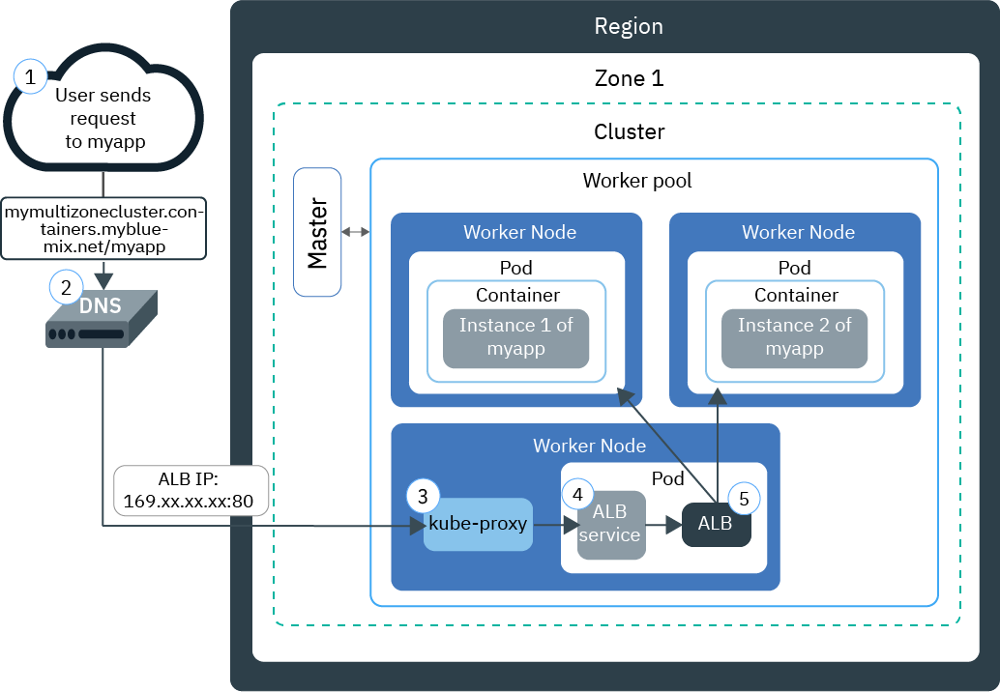

---

copyright:
  years: 2014, 2018
lastupdated: "2018-4-20"

---

{:new_window: target="_blank"}
{:shortdesc: .shortdesc}
{:screen: .screen}
{:pre: .pre}
{:table: .aria-labeledby="caption"}
{:codeblock: .codeblock}
{:tip: .tip}
{:download: .download}


# Ingress を使用してアプリを公開する
{: #ingress}

{{site.data.keyword.containerlong}} で、IBM 提供のアプリケーション・ロード・バランサーで管理される Ingress リソースを作成して、Kubernetes クラスター内の複数のアプリを公開します。
{:shortdesc}

## Ingress を使用してネットワーク・トラフィックを管理する
{: #planning}

Ingress は、パブリック要求またはプライベート要求をアプリに転送して、クラスター内のネットワーク・トラフィック・ワークロードを負荷分散する Kubernetes サービスです。Ingress を利用すると、固有のパブリック経路またはプライベート経路を使用して複数のアプリ・サービスをパブリック・ネットワークまたはプライベート・ネットワークに公開できます。
{:shortdesc}

Ingress は、以下の 2 つのコンポーネントで構成されています。
<dl>
<dt>アプリケーション・ロード・バランサー</dt>
<dd>アプリケーション・ロード・バランサー (ALB) は、着信 HTTP、HTTPS、TCP、または UDP サービス要求を listen し、適切なアプリ・ポッドに要求を転送する外部ロード・バランサーです。 標準クラスターを作成すると、{{site.data.keyword.containershort_notm}} がそのクラスター用に可用性の高い ALB を自動で作成し、固有のパブリック経路を割り当てます。 パブリック経路は、クラスター作成時にお客様の IBM Cloud インフラストラクチャー (SoftLayer) アカウントにプロビジョンされたポータブル・パブリック IP アドレスにリンクされます。 デフォルトのプライベート ALB も自動的に作成されますが、自動的に有効になるわけではありません。</dd>
<dt>Ingress リソース</dt>
<dd>Ingress を使用してアプリを公開するには、アプリ用に Kubernetes サービスを作成し、Ingress リソースを定義してそのサービスを ALB に登録する必要があります。Ingress リソースは、アプリに対する着信要求を転送する方法についてのルールを定義する Kubernetes リソースです。また、Ingress リソースによってアプリ・サービスへのパスも指定します。このパスがパブリック経路に付加されて、アプリの固有 URL が形成されます。例えば、`mycluster.us-south.containers.mybluemix.net/myapp` のようになります。</dd>
</dl>

次の図は、Ingress がインターネットからアプリへの通信をどのように誘導するかを示しています。



1. ユーザーがアプリの URL にアクセスしてアプリに要求を送信します。 この URL は、Ingress リソース・パスが付加された公開アプリのパブリック URL です (例: `mycluster.us-south.containers.mybluemix.net/myapp`)。

2. グローバル・ロード・バランサーとして機能する DNS システム・サービスが、その URL を、クラスター内のデフォルトのパブリック ALB のポータブル・パブリック IP アドレスに解決します。

3. `kube-proxy` が、要求をアプリの Kubernetes ALB サービスにルーティングします。

4. Kubernetes サービスが、要求を ALB にルーティングします。

5. ALB は、クラスター内の `myapp` パスのルーティング・ルールが存在するかどうかを検査します。 一致するルールが見つかった場合、要求は、Ingress リソースで定義したルールに従って、アプリがデプロイされているポッドに転送されます。 複数のアプリ・インスタンスがクラスターにデプロイされている場合、ALB は、アプリ・ポッド間で要求のロード・バランシングを行います。


**注:** Ingress は標準クラスター専用であり、高可用性を確保して定期的更新を適用するためにはクラスター内に 2 つ以上のワーカー・ノードを必要とします。 Ingress のセットアップには、[管理者アクセス・ポリシー](cs_users.html#access_policies)が必要です。 現在の[アクセス・ポリシー](cs_users.html#infra_access)を確認してください。

Ingress に最適な構成を選択するために、以下のデシジョン・ツリーに従うことができます。


<map name="ingress_map" id="ingress_map">
<area href="/docs/containers/cs_ingress.html#private_ingress_no_tls" alt="TLS なしでカスタム・ドメインを使用してアプリをプライベートに公開する" shape="rect" coords="25, 246, 187, 294"/>
<area href="/docs/containers/cs_ingress.html#private_ingress_tls" alt="TLS ありでカスタム・ドメインを使用してアプリをプライベートに公開する" shape="rect" coords="161, 337, 309, 385"/>
<area href="/docs/containers/cs_ingress.html#external_endpoint" alt="TLS ありで IBM 提供ドメインまたはカスタム・ドメインを使用してクラスターの外部にあるアプリをパブリックに公開する" shape="rect" coords="313, 229, 466, 282"/>
<area href="/docs/containers/cs_ingress.html#custom_domain_cert" alt="TLS ありでカスタム・ドメインを使用してアプリをパブリックに公開する" shape="rect" coords="365, 415, 518, 468"/>
<area href="/docs/containers/cs_ingress.html#ibm_domain" alt="TLS なしで IBM 提供ドメインを使用してアプリをパブリックに公開する" shape="rect" coords="414, 629, 569, 679"/>
<area href="/docs/containers/cs_ingress.html#ibm_domain_cert" alt="TLS ありで IBM 提供ドメインを使用してアプリをパブリックに公開する" shape="rect" coords="563, 711, 716, 764"/>
</map>

<br />


## パブリックにアプリを公開する
{: #ingress_expose_public}

標準クラスターを作成すると、IBM 提供のアプリケーション・ロード・バランサーが自動的に有効になり、ポータブル・パブリック IP アドレス 1 つとパブリック経路 1 つが割り当てられます。
{:shortdesc}

Ingress でパブリックに公開するすべてのアプリに、パブリック経路に付加する固有のパスが割り当てられるので、クラスター内のアプリに、固有の URL を使用してパブリックにアクセスできるようになります。 パブリックにアプリを公開するために、以下のシナリオに応じて Ingress を構成できます。

-   [TLS なしで IBM 提供ドメインを使用してアプリをパブリックに公開する](#ibm_domain)
-   [TLS ありで IBM 提供ドメインを使用してアプリをパブリックに公開する](#ibm_domain_cert)
-   [TLS ありでカスタム・ドメインを使用してアプリをパブリックに公開する](#custom_domain_cert)
-   [TLS ありで IBM 提供ドメインまたはカスタム・ドメインを使用してクラスターの外部にあるアプリをパブリックに公開する](#external_endpoint)

### TLS なしで IBM 提供ドメインを使用してアプリをパブリックに公開する
{: #ibm_domain}

クラスター内のアプリへの着信 HTTP ネットワーク・トラフィックをロード・バランシングするようにアプリケーション・ロード・バランサーを構成し、IBM 提供ドメインを使用してインターネットからアプリにアクセスすることができます。
{:shortdesc}

開始前に、以下のことを行います。

-   標準クラスターがまだない場合は、[標準クラスターを作成します](cs_clusters.html#clusters_ui)。
-   対象のクラスターに対して `kubectl` コマンドを実行するように [CLI のターゲット設定を行います](cs_cli_install.html#cs_cli_configure)。

IBM 提供のドメインを使用してアプリを公開するには、以下のようにします。

1.  [アプリをクラスターにデプロイします](cs_app.html#app_cli)。 構成ファイルの metadata セクションで、デプロイメントにラベルを追加しておく必要があります (例えば、`app: code`)。このラベルは、アプリが実行されるすべてのポッドを識別して、それらのポットが Ingress ロード・バランシングに含められるようにするために必要です。

2.   公開するアプリの Kubernetes サービスを作成します。 アプリをクラスター ALB の Ingress ロード・バランシングに含めるには、Kubernetes サービスを介してアプリを公開する必要があります。
      1.  任意のエディターを開き、`myalbservice.yaml` などの名前のサービス構成ファイルを作成します。
      2.  ALB でパブリックに公開するアプリのサービスを定義します。

          ```
          apiVersion: v1
          kind: Service
          metadata:
            name: myalbservice
          spec:
            selector:
              <selector_key>: <selector_value>
            ports:
             - protocol: TCP
               port: 8080
          ```
          {: codeblock}

          <table>
          <caption>ALB サービス・ファイルの構成要素について</caption>
          <thead>
          <th colspan=2> YAML ファイルの構成要素について</th>
          </thead>
          <tbody>
          <tr>
          <td><code>selector</code></td>
          <td>アプリが実行されるポッドをターゲットにするために使用する、ラベル・キー (<em>&lt;selector_key&gt;</em>) と値 (<em>&lt;selector_value&gt;</em>) のペアを入力します。 ポッドをターゲットにして、サービス・ロード・バランシングに含めるには、<em>&lt;selector_key&gt;</em> および <em>&lt;selector_value&gt;</em> が、デプロイメント yaml の <code>spec.template.metadata.labels</code> セクションで使用したキー/値のペアと同じであることを確認します。</td>
           </tr>
           <tr>
           <td><code>port</code></td>
           <td>サービスが listen するポート。</td>
           </tr>
           </tbody></table>
      3.  変更を保存します。
      4.  クラスター内にサービスを作成します。

          ```
          kubectl apply -f myalbservice.yaml
          ```
          {: pre}
      5.  公開するアプリごとに、上記のステップを繰り返します。

3. クラスターの詳細を取得して、IBM 提供ドメインを表示します。 _&lt;cluster_name_or_ID&gt;_ を、公開する対象のアプリがデプロイされているクラスターの名前に置き換えます。

    ```
    bx cs cluster-get <cluster_name_or_ID>
    ```
    {: pre}

    出力例:

    ```
    Name:                   mycluster
    ID:                     18a61a63c6a94b658596ca93d087aad9
    State:                  normal
    Created:                2018-01-12T18:33:35+0000
    Location:               dal10
    Master URL:             https://169.xx.xxx.xxx:26268
    Ingress Subdomain:      mycluster-12345.us-south.containers.mybluemix.net
    Ingress Secret:         <tls_secret>
    Workers:                3
    Version:                1.8.11
    Owner Email:            owner@email.com
    Monitoring Dashboard:   <dashboard_URL>
    ```
    {: screen}

    IBM 提供ドメインは、**「Ingress サブドメイン (Ingress subdomain)」**フィールドに示されます。
4.  Ingress リソースを作成します。 Ingress リソースは、アプリ用に作成した Kubernetes サービスのルーティング・ルールを定義するもので、着信ネットワーク・トラフィックをサービスにルーティングするために ALB によって使用されます。 複数のアプリをクラスター内の 1 つの Kubernetes サービスで公開する場合は、1 つの Ingress リソースを使用してすべてのアプリのルーティング・ルールを定義する必要があります。
    1.  任意のエディターを開き、`myingressresource.yaml` などの名前の Ingress 構成ファイルを作成します。
    2.  IBM 提供ドメインを使用して着信ネットワーク・トラフィックを作成済みのサービスにルーティングするように、Ingress リソースを構成ファイル内に定義します。

        ```
        apiVersion: extensions/v1beta1
        kind: Ingress
        metadata:
          name: myingressresource
        spec:
          rules:
          - host: <ibm_domain>
            http:
              paths:
              - path: /<service1_path>
                backend:
                  serviceName: <service1>
                  servicePort: 80
              - path: /<service2_path>
                backend:
                  serviceName: <service2>
                  servicePort: 80
        ```
        {: codeblock}

        <table>
        <thead>
        <th colspan=2> YAML ファイルの構成要素について</th>
        </thead>
        <tbody>
        <tr>
        <td><code>host</code></td>
        <td><em>&lt;ibm_domain&gt;</em> を、前述のステップにある IBM 提供の<strong>「Ingress サブドメイン (Ingress subdomain)」</strong>の名前に置き換えます。

        </br></br>
        <strong>注:</strong> Ingress 作成時の失敗を回避するため、ホストに * を使用したり、ホスト・プロパティーを空のままにしたりしないでください。</td>
        </tr>
        <tr>
        <td><code>path</code></td>
        <td><em>&lt;service1_path&gt;</em> をスラッシュか、アプリが listen する固有のパスに置き換えて、ネットワーク・トラフィックをアプリに転送できるようにします。

        </br>
        Kubernetes サービスごとに、IBM 提供ドメインに付加する個別のパスを定義して、アプリへの固有のパス (例えば <code>ibm_domain/service1_path</code>) を作成することができます。この経路を Web ブラウザーに入力すると、ネットワーク・トラフィックが ALB にルーティングされます。 ALB は、関連付けられたサービスを検索し、ネットワーク・トラフィックをそのサービスに送信します。そして、サービスが、アプリを実行しているポッドにトラフィックを転送します。着信ネットワーク・トラフィックを受け取るには、このパスを listen するようにアプリをセットアップする必要があります。

        </br></br>
        多くのアプリは、特定のパスで listen するのではなく、ルート・パスと特定のポートを使用します。 この場合、ルート・パスを <code>/</code> として定義します。アプリ用の個別のパスは指定しないでください。
        </br>
        例: <ul><li><code>http://ibm_domain/</code> の場合、<code>/</code> をパスとして入力します。</li><li><code>http://ibm_domain/service1_path</code> の場合、<code>/service1_path</code> をパスとして入力します。</li></ul>
        </br>
        <strong>ヒント:</strong> アプリが listen するパスとは異なるパスを listen するように Ingress を構成するには、[再書き込みアノテーション](cs_annotations.html#rewrite-path)を使用してアプリへの適切なルーティングを設定します。</td>
        </tr>
        <tr>
        <td><code>serviceName</code></td>
        <td><em>&lt;service1&gt;</em> を、アプリ用に Kubernetes サービスを作成したときに使用したサービスの名前に置き換えます。</td>
        </tr>
        <tr>
        <td><code>servicePort</code></td>
        <td>サービスが listen するポート。 アプリ用に Kubernetes サービスを作成したときに定義したものと同じポートを使用します。</td>
        </tr>
        </tbody></table>

    3.  クラスターの Ingress リソースを作成します。

        ```
        kubectl apply -f myingressresource.yaml
        ```
        {: pre}
5.   Ingress リソースが正常に作成されたことを確認します。

      ```
      kubectl describe ingress myingressresource
      ```
      {: pre}

      1. イベント内のメッセージにリソース構成のエラーが示された場合は、リソース・ファイル内の値を変更して、リソースのファイルを再適用してください。

6.   Web ブラウザーに、アクセスするアプリ・サービスの URL を入力します。

      ```
      https://<ibm_domain>/<service1_path>
      ```
      {: codeblock}


<br />


### TLS ありで IBM 提供ドメインを使用してアプリをパブリックに公開する
{: #ibm_domain_cert}

アプリに対する着信 TLS 接続を管理し、IBM 提供の TLS 証明書を使用してネットワーク・トラフィックを暗号化解除し、暗号化解除した要求をクラスター内の公開アプリに転送するように、Ingress ALB を構成することができます。
{:shortdesc}

開始前に、以下のことを行います。

-   標準クラスターがまだない場合は、[標準クラスターを作成します](cs_clusters.html#clusters_ui)。
-   対象のクラスターに対して `kubectl` コマンドを実行するように [CLI のターゲット設定を行います](cs_cli_install.html#cs_cli_configure)。

TLS ありで IBM 提供のドメインを使用してアプリを公開するには、以下のようにします。

1.  [アプリをクラスターにデプロイします](cs_app.html#app_cli)。 構成ファイルの metadata セクションで、デプロイメントにラベルを追加しておく必要があります (例えば、`app: code`)。このラベルは、アプリが実行されるすべてのポッドを識別して、それらのポットが Ingress ロード・バランシングに含められるようにするために必要です。

2.   公開するアプリの Kubernetes サービスを作成します。 アプリをクラスター ALB の Ingress ロード・バランシングに含めるには、Kubernetes サービスを介してアプリを公開する必要があります。
      1.  任意のエディターを開き、`myalbservice.yaml` などの名前のサービス構成ファイルを作成します。
      2.  ALB でパブリックに公開するアプリのサービスを定義します。

          ```
          apiVersion: v1
          kind: Service
          metadata:
            name: myalbservice
          spec:
            selector:
              <selector_key>: <selector_value>
            ports:
             - protocol: TCP
               port: 8080
          ```
          {: codeblock}

          <table>
          <caption>ALB サービス・ファイルの構成要素について</caption>
          <thead>
          <th colspan=2> YAML ファイルの構成要素について</th>
          </thead>
          <tbody>
          <tr>
          <td><code>selector</code></td>
          <td>アプリが実行されるポッドをターゲットにするために使用する、ラベル・キー (<em>&lt;selector_key&gt;</em>) と値 (<em>&lt;selector_value&gt;</em>) のペアを入力します。 ポッドをターゲットにして、サービス・ロード・バランシングに含めるには、<em>&lt;selector_key&gt;</em> および <em>&lt;selector_value&gt;</em> が、デプロイメント yaml の <code>spec.template.metadata.labels</code> セクションで使用したキー/値のペアと同じであることを確認します。</td>
           </tr>
           <tr>
           <td><code>port</code></td>
           <td>サービスが listen するポート。</td>
           </tr>
           </tbody></table>
      3.  変更を保存します。
      4.  クラスター内にサービスを作成します。

          ```
          kubectl apply -f myalbservice.yaml
          ```
          {: pre}
      5.  公開するアプリごとに、上記のステップを繰り返します。

3.   IBM 提供ドメインと TLS 証明書を表示します。 _&lt;cluster_name_or_ID&gt;_ を、アプリがデプロイされているクラスターの名前に置き換えます。

      ```
      bx cs cluster-get <cluster_name_or_ID>
      ```
      {: pre}

      出力例:

      ```
      Name:                   mycluster
      ID:                     18a61a63c6a94b658596ca93d087aad9
      State:                  normal
      Created:                2018-01-12T18:33:35+0000
      Location:               dal10
      Master URL:             https://169.xx.xxx.xxx:26268
      Ingress Subdomain:      mycluster-12345.us-south.containers.mybluemix.net
      Ingress Secret:         <ibm_tls_secret>
      Workers:                3
      Version:                1.8.11
      Owner Email:            owner@email.com
      Monitoring Dashboard:   <dashboard_URL>
      ```
      {: screen}

      IBM 提供ドメインが**「Ingress サブドメイン (Ingress subdomain)」**フィールドに示され、IBM 提供の証明書が**「Ingress シークレット (Ingress secret)」**フィールドに示されます。

4.  Ingress リソースを作成します。 Ingress リソースは、アプリ用に作成した Kubernetes サービスのルーティング・ルールを定義するもので、着信ネットワーク・トラフィックをサービスにルーティングするために ALB によって使用されます。 複数のアプリをクラスター内の 1 つの Kubernetes サービスで公開する場合は、1 つの Ingress リソースを使用してすべてのアプリのルーティング・ルールを定義する必要があります。
    1.  任意のエディターを開き、`myingressresource.yaml` などの名前の Ingress 構成ファイルを作成します。
    2.  IBM 提供ドメインを使用して着信ネットワーク・トラフィックを作成済みのサービスに転送し、カスタム証明書を使用して TLS 終端を管理するように、Ingress リソースを構成ファイル内に定義します。

        ```
        apiVersion: extensions/v1beta1
        kind: Ingress
        metadata:
          name: myingressresource
        spec:
          tls:
          - hosts:
            - <ibm_domain>
            secretName: <ibm_tls_secret>
          rules:
          - host: <ibm_domain>
            http:
              paths:
              - path: /<service1_path>
                backend:
                  serviceName: <service1>
                  servicePort: 80
              - path: /<service2_path>
                backend:
                  serviceName: <service2>
                  servicePort: 80
        ```
        {: codeblock}

        <table>
        <thead>
        <th colspan=2> YAML ファイルの構成要素について</th>
        </thead>
        <tbody>
        <tr>
        <td><code>tls/hosts</code></td>
        <td><em>&lt;ibm_domain&gt;</em> を、前述のステップにある IBM 提供の<strong>「Ingress サブドメイン (Ingress subdomain)」</strong>の名前に置き換えます。 このドメインは TLS 終端用に構成されます。

        </br></br>
        <strong>注:</strong> Ingress 作成時の失敗を回避するため、ホストに &ast; を使用したり、ホスト・プロパティーを空のままにしたりしないでください。</td>
        </tr>
        <tr>
        <td><code>tls/secretName</code></td>
        <td><em>&lt;<ibm_tls_secret>&gt;</em> を、前述のステップにある IBM 提供の<strong>「Ingress シークレット (Ingress secret)」</strong>の名前に置き換えます。 この証明書で TLS 終端を管理します。
        </tr>
        <tr>
        <td><code>host</code></td>
        <td><em>&lt;ibm_domain&gt;</em> を、前述のステップにある IBM 提供の<strong>「Ingress サブドメイン (Ingress subdomain)」</strong>の名前に置き換えます。 このドメインは TLS 終端用に構成されます。

        </br></br>
        <strong>注:</strong> Ingress 作成時の失敗を回避するため、ホストに &ast; を使用したり、ホスト・プロパティーを空のままにしたりしないでください。</td>
        </tr>
        <tr>
        <td><code>path</code></td>
        <td><em>&lt;service1_path&gt;</em> をスラッシュか、アプリが listen する固有のパスに置き換えて、ネットワーク・トラフィックをアプリに転送できるようにします。

        </br>
        Kubernetes サービスごとに、IBM 提供ドメインに付加する個別のパスを定義して、アプリへの固有のパスを作成できます。 この経路を Web ブラウザーに入力すると、ネットワーク・トラフィックが ALB にルーティングされます。 ALB は、関連付けられたサービスを検索し、ネットワーク・トラフィックをそのサービスに送信します。 そして、サービスが、アプリを実行しているポッドにトラフィックを転送します。着信ネットワーク・トラフィックを受け取るには、このパスを listen するようにアプリをセットアップする必要があります。

        </br>
        多くのアプリは、特定のパスで listen するのではなく、ルート・パスと特定のポートを使用します。 この場合、ルート・パスを <code>/</code> として定義します。アプリ用の個別のパスは指定しないでください。

        </br>
        例: <ul><li><code>http://ibm_domain/</code> の場合、<code>/</code> をパスとして入力します。</li><li><code>http://ibm_domain/service1_path</code> の場合、<code>/service1_path</code> をパスとして入力します。</li></ul>
        <strong>ヒント:</strong> アプリが listen するパスとは異なるパスを listen するように Ingress を構成するには、[再書き込みアノテーション](cs_annotations.html#rewrite-path)を使用してアプリへの適切なルーティングを設定します。</td>
        </tr>
        <tr>
        <td><code>serviceName</code></td>
        <td><em>&lt;service1&gt;</em> を、アプリ用に Kubernetes サービスを作成したときに使用したサービスの名前に置き換えます。</td>
        </tr>
        <tr>
        <td><code>servicePort</code></td>
        <td>サービスが listen するポート。 アプリ用に Kubernetes サービスを作成したときに定義したものと同じポートを使用します。</td>
        </tr>
        </tbody></table>

    3.  クラスターの Ingress リソースを作成します。

        ```
        kubectl apply -f myingressresource.yaml
        ```
        {: pre}
5.   Ingress リソースが正常に作成されたことを確認します。

      ```
      kubectl describe ingress myingressresource
      ```
      {: pre}

      1. イベント内のメッセージにリソース構成のエラーが示された場合は、リソース・ファイル内の値を変更して、リソースのファイルを再適用してください。

6.   Web ブラウザーに、アクセスするアプリ・サービスの URL を入力します。

      ```
      https://<ibm_domain>/<service1_path>
      ```
      {: codeblock}


<br />


### TLS ありでカスタム・ドメインを使用してアプリをパブリックに公開する
{: #custom_domain_cert}

IBM 提供ドメインではなくカスタム・ドメインを使用する場合でも、着信ネットワーク・トラフィックをクラスター内のアプリに転送し、独自の TLS 証明書を使用して TLS 終端を管理するように、ALB を構成することができます。
{:shortdesc}

開始前に、以下のことを行います。

-   標準クラスターがまだない場合は、[標準クラスターを作成します](cs_clusters.html#clusters_ui)。
-   対象のクラスターに対して `kubectl` コマンドを実行するように [CLI のターゲット設定を行います](cs_cli_install.html#cs_cli_configure)。

TLS ありでカスタム・ドメインを使用してアプリを公開するには、以下のようにします。

1.  カスタム・ドメインを作成します。 カスタム・ドメインを作成するには、Domain Name Service (DNS) プロバイダーまたは [{{site.data.keyword.Bluemix_notm}} ](/docs/infrastructure/dns/getting-started.html#getting-started-with-dns)を使用してカスタム・ドメインを登録します。
2.  着信ネットワーク・トラフィックを IBM 提供の ALB にルーティングするようにドメインを構成します。 以下の選択肢があります。
    -   IBM 提供ドメインを正規名レコード (CNAME) として指定することで、カスタム・ドメインの別名を定義します。 IBM 提供の Ingress ドメインを確認するには、`bx cs cluster-get <cluster_name>` を実行し、**「Ingress サブドメイン (Ingress subdomain)」**フィールドを見つけます。
    -   カスタム・ドメインを IBM 提供の ALB のポータブル・パブリック IP アドレスにマップします。これは、IP アドレスをレコードとして追加して行います。 ALB のポータブル・パブリック IP アドレスを見つけるには、`bx cs alb-get <public_alb_ID>` を実行します。
3.  TLS 証明書とキー・シークレットをインポートまたは作成します。
    * 使用する TLS 証明書が {{site.data.keyword.cloudcerts_long_notm}} に保管されている場合は、それに関連付けられたシークレットを、以下のコマンドを実行してクラスター内にインポートできます。

      ```
      bx cs alb-cert-deploy --secret-name <secret_name> --cluster <cluster_name_or_ID> --cert-crn <certificate_crn>
      ```
      {: pre}

    * TLS 証明書の準備ができていない場合は、以下の手順に従ってください。
        1. PEM 形式でエンコードされた TLS 証明書と鍵を、当該ドメインのために作成します。
        2. TLS 証明書と鍵を使用するシークレットを作成します。 <em>&lt;tls_secret_name&gt;</em> を Kubernetes シークレットの名前に、<em>&lt;tls_key_filepath&gt;</em> をカスタム TLS 鍵ファイルへのパスに、<em>&lt;tls_cert_filepath&gt;</em> をカスタム TLS 証明書ファイルへのパスに置き換えます。

            ```
            kubectl create secret tls <tls_secret_name> --key <tls_key_filepath> --cert <tls_cert_filepath>
            ```
            {: pre}
4.  [アプリをクラスターにデプロイします](cs_app.html#app_cli)。 構成ファイルの metadata セクションで、デプロイメントにラベルを追加しておく必要があります (例えば、`app: code`)。このラベルは、アプリが実行されるすべてのポッドを識別して、それらのポットが Ingress ロード・バランシングに含められるようにするために必要です。

5.   公開するアプリの Kubernetes サービスを作成します。 アプリをクラスター ALB の Ingress ロード・バランシングに含めるには、Kubernetes サービスを介してアプリを公開する必要があります。
      1.  任意のエディターを開き、`myalbservice.yaml` などの名前のサービス構成ファイルを作成します。
      2.  ALB でパブリックに公開するアプリのサービスを定義します。

          ```
          apiVersion: v1
          kind: Service
          metadata:
            name: myalbservice
          spec:
            selector:
              <selector_key>: <selector_value>
            ports:
             - protocol: TCP
               port: 8080
          ```
          {: codeblock}

          <table>
          <caption>ALB サービス・ファイルの構成要素について</caption>
          <thead>
          <th colspan=2> YAML ファイルの構成要素について</th>
          </thead>
          <tbody>
          <tr>
          <td><code>selector</code></td>
          <td>アプリが実行されるポッドをターゲットにするために使用する、ラベル・キー (<em>&lt;selector_key&gt;</em>) と値 (<em>&lt;selector_value&gt;</em>) のペアを入力します。 ポッドをターゲットにして、サービス・ロード・バランシングに含めるには、<em>&lt;selector_key&gt;</em> および <em>&lt;selector_value&gt;</em> が、デプロイメント yaml の <code>spec.template.metadata.labels</code> セクションで使用したキー/値のペアと同じであることを確認します。</td>
           </tr>
           <tr>
           <td><code>port</code></td>
           <td>サービスが listen するポート。</td>
           </tr>
           </tbody></table>
      3.  変更を保存します。
      4.  クラスター内にサービスを作成します。

          ```
          kubectl apply -f myalbservice.yaml
          ```
          {: pre}
      5.  公開するアプリごとに、上記のステップを繰り返します。

6.  Ingress リソースを作成します。 Ingress リソースは、アプリ用に作成した Kubernetes サービスのルーティング・ルールを定義するもので、着信ネットワーク・トラフィックをサービスにルーティングするために ALB によって使用されます。 複数のアプリをクラスター内の 1 つの Kubernetes サービスで公開する場合は、1 つの Ingress リソースを使用してすべてのアプリのルーティング・ルールを定義する必要があります。
    1.  任意のエディターを開き、`myingressresource.yaml` などの名前の Ingress 構成ファイルを作成します。
    2.  カスタム・ドメインを使用して着信ネットワーク・トラフィックを対象サービスにルーティングし、カスタム証明書を使用して TLS 終端を管理するように、Ingress リソースを構成ファイル内に定義します。

        ```
        apiVersion: extensions/v1beta1
        kind: Ingress
        metadata:
          name: myingressresource
        spec:
          tls:
          - hosts:
            - <custom_domain>
            secretName: <tls_secret_name>
          rules:
          - host: <custom_domain>
            http:
              paths:
              - path: /<service1_path>
                backend:
                  serviceName: <service1>
                  servicePort: 80
              - path: /<service2_path>
                backend:
                  serviceName: <service2>
                  servicePort: 80
        ```
        {: codeblock}

        <table>
        <thead>
        <th colspan=2> YAML ファイルの構成要素について</th>
        </thead>
        <tbody>
        <tr>
        <td><code>tls/hosts</code></td>
        <td><em>&lt;custom_domain&gt;</em> を、TLS 終端のために構成するカスタム・ドメインに置き換えます。

        </br></br>
        <strong>注:</strong> Ingress 作成時の失敗を回避するため、ホストに &ast; を使用したり、ホスト・プロパティーを空のままにしたりしないでください。</td>
        </tr>
        <tr>
        <td><code>tls/secretName</code></td>
        <td><em>&lt;tls_secret_name&gt;</em> を、先ほど作成した、カスタム TLS 証明書と鍵を保持するシークレットの名前に置き換えます。 {{site.data.keyword.cloudcerts_short}} から証明書をインポートする場合、<code>bx cs alb-cert-get --cluster <cluster_name_or_ID> --cert-crn <certificate_crn></code> を実行して、TLS 証明書に関連付けられたシークレットを確認できます。
        </tr>
        <tr>
        <td><code>host</code></td>
        <td><em>&lt;custom_domain&gt;</em> を、TLS 終端のために構成するカスタム・ドメインに置き換えます。

        </br></br>
        <strong>注:</strong> Ingress 作成時の失敗を回避するため、ホストに &ast; を使用したり、ホスト・プロパティーを空のままにしたりしないでください。
        </td>
        </tr>
        <tr>
        <td><code>path</code></td>
        <td><em>&lt;service1_path&gt;</em> をスラッシュか、アプリが listen する固有のパスに置き換えて、ネットワーク・トラフィックをアプリに転送できるようにします。

        </br>
        サービスごとに、カスタム・ドメインに付加する個別のパスを定義して、アプリへの固有のパスを作成できます。 この経路を Web ブラウザーに入力すると、ネットワーク・トラフィックが ALB にルーティングされます。 ALB は、関連付けられたサービスを検索し、ネットワーク・トラフィックをそのサービスに送信します。 そして、サービスが、アプリを実行しているポッドにトラフィックを転送します。着信ネットワーク・トラフィックを受け取るには、このパスを listen するようにアプリをセットアップする必要があります。

        </br>
        多くのアプリは、特定のパスで listen するのではなく、ルート・パスと特定のポートを使用します。 この場合、ルート・パスを <code>/</code> として定義します。アプリ用の個別のパスは指定しないでください。

        </br></br>
        例: <ul><li><code>https://custom_domain/</code> の場合、<code>/</code> をパスとして入力します。</li><li><code>https://custom_domain/service1_path</code> の場合、<code>/service1_path</code> をパスとして入力します。</li></ul>
        <strong>ヒント:</strong> アプリが listen するパスとは異なるパスを listen するように Ingress を構成するには、[再書き込みアノテーション](cs_annotations.html#rewrite-path)を使用してアプリへの適切なルーティングを設定します。
        </td>
        </tr>
        <tr>
        <td><code>serviceName</code></td>
        <td><em>&lt;service1&gt;</em> を、アプリ用に Kubernetes サービスを作成したときに使用したサービスの名前に置き換えます。</td>
        </tr>
        <tr>
        <td><code>servicePort</code></td>
        <td>サービスが listen するポート。 アプリ用に Kubernetes サービスを作成したときに定義したものと同じポートを使用します。</td>
        </tr>
        </tbody></table>

    3.  変更を保存します。
    4.  クラスターの Ingress リソースを作成します。

        ```
        kubectl apply -f myingressresource.yaml
        ```
        {: pre}
7.   Ingress リソースが正常に作成されたことを確認します。

      ```
      kubectl describe ingress myingressresource
      ```
      {: pre}

      1. イベント内のメッセージにリソース構成のエラーが示された場合は、リソース・ファイル内の値を変更して、リソースのファイルを再適用してください。

8.   Web ブラウザーに、アクセスするアプリ・サービスの URL を入力します。

      ```
      https://<custom_domain>/<service1_path>
      ```
      {: codeblock}


<br />


### TLS ありで IBM 提供ドメインまたはカスタム・ドメインを使用してクラスターの外部にあるアプリをパブリックに公開する
{: #external_endpoint}

クラスターの外部に配置されたアプリを含めるように、ALB を構成することができます。 IBM 提供ドメインまたはカスタム・ドメインでの着信要求は、自動的に外部アプリに転送されます。
{:shortdesc}

開始前に、以下のことを行います。

-   標準クラスターがまだない場合は、[標準クラスターを作成します](cs_clusters.html#clusters_ui)。
-   対象のクラスターに対して `kubectl` コマンドを実行するように [CLI のターゲット設定を行います](cs_cli_install.html#cs_cli_configure)。
-   クラスター・ロード・バランシングに含めようとしている外部アプリに、パブリック IP アドレスを使用してアクセスできることを確認します。

IBM 提供ドメインへの着信ネットワーク・トラフィックを、クラスターの外部に配置されたアプリに転送することができます。 代わりにカスタム・ドメインと TLS 証明書を使用する場合は、IBM 提供ドメインと TLS 証明書を[カスタムのドメインと TLS 証明書](#custom_domain_cert)に置き換えてください。

1.  作成する外部エンドポイントに着信要求を転送する Kubernetes サービスをクラスターに作成します。
    1.  任意のエディターを開き、`myexternalservice.yaml` などの名前のサービス構成ファイルを作成します。
    2.  ALB サービスを定義します。

        ```
        apiVersion: v1
        kind: Service
        metadata:
          name: myexternalservice
        spec:
          ports:
           - protocol: TCP
             port: 8080
        ```
        {: codeblock}

        <table>
        <caption>ALB サービス・ファイルの構成要素について</caption>
        <thead>
        <th colspan=2> YAML ファイルの構成要素について</th>
        </thead>
        <tbody>
        <tr>
        <td><code>metadata/name</code></td>
        <td><em>&lt;myexternalservice&gt;</em> をサービスの名前に置き換えます。</td>
        </tr>
        <tr>
        <td><code>port</code></td>
        <td>サービスが listen するポート。</td>
        </tr></tbody></table>

    3.  変更を保存します。
    4.  クラスターの Kubernetes サービスを作成します。

        ```
        kubectl apply -f myexternalservice.yaml
        ```
        {: pre}
2.  クラスター・ロード・バランシングに含める外部のアプリの場所を定義する、Kubernetes エンドポイントを構成します。
    1.  任意のエディターを開き、`myexternalendpoint.yaml` などの名前のエンドポイント構成ファイルを作成します。
    2.  外部エンドポイントを定義します。 外部アプリにアクセスするために使用可能な、すべてのパブリック IP アドレスとポートを含めます。

        ```
        kind: Endpoints
        apiVersion: v1
        metadata:
          name: myexternalendpoint
        subsets:
          - addresses:
              - ip: <external_IP1>
              - ip: <external_IP2>
            ports:
              - port: <external_port>
        ```
        {: codeblock}

        <table>
        <thead>
        <th colspan=2> YAML ファイルの構成要素について</th>
        </thead>
        <tbody>
        <tr>
        <td><code>name</code></td>
        <td><em>&lt;myexternalendpoint&gt;</em> を、先ほど作成した Kubernetes サービスの名前に置き換えます。</td>
        </tr>
        <tr>
        <td><code>ip</code></td>
        <td><em>&lt;external_IP&gt;</em> を、外部アプリに接続するためのパブリック IP アドレスに置き換えます。</td>
         </tr>
         <td><code>port</code></td>
         <td><em>&lt;external_port&gt;</em> を、外部アプリが listen するポートに置き換えます。</td>
         </tbody></table>

    3.  変更を保存します。
    4.  クラスターの Kubernetes エンドポイントを作成します。

        ```
        kubectl apply -f myexternalendpoint.yaml
        ```
        {: pre}
3.   IBM 提供ドメインと TLS 証明書を表示します。 _&lt;cluster_name_or_ID&gt;_ を、アプリがデプロイされているクラスターの名前に置き換えます。

      ```
      bx cs cluster-get <cluster_name_or_ID>
      ```
      {: pre}

      出力例:

      ```
      Name:                   mycluster
      ID:                     18a61a63c6a94b658596ca93d087aad9
      State:                  normal
      Created:                2018-01-12T18:33:35+0000
      Location:               dal10
      Master URL:             https://169.xx.xxx.xxx:26268
      Ingress Subdomain:      mycluster-12345.us-south.containers.mybluemix.net
      Ingress Secret:         <ibm_tls_secret>
      Workers:                3
      Version:                1.8.11
      Owner Email:            owner@email.com
      Monitoring Dashboard:   <dashboard_URL>
      ```
      {: screen}

      IBM 提供ドメインが**「Ingress サブドメイン (Ingress subdomain)」**フィールドに示され、IBM 提供の証明書が**「Ingress シークレット (Ingress secret)」**フィールドに示されます。

4.  Ingress リソースを作成します。 Ingress リソースは、アプリ用に作成した Kubernetes サービスのルーティング・ルールを定義するもので、着信ネットワーク・トラフィックをサービスにルーティングするために ALB によって使用されます。 すべてのアプリがクラスター内の Kubernetes サービスによってアプリの外部エンドポイントとともに公開されていれば、1 つの Ingress リソースを使用して複数の外部アプリのルーティング・ルールを定義できます。
    1.  任意のエディターを開き、`myexternalingress.yaml` などの名前の Ingress 構成ファイルを作成します。
    2.  IBM 提供ドメインと TLS 証明書を使用し、定義済みの外部エンドポイントを使用して着信ネットワーク・トラフィックを外部アプリにルーティングするように、Ingress リソースを構成ファイル内に定義します。

        ```
        apiVersion: extensions/v1beta1
        kind: Ingress
        metadata:
          name: myexternalingress
        spec:
          tls:
          - hosts:
            - <ibm_domain>
            secretName: <ibm_tls_secret>
          rules:
          - host: <ibm_domain>
            http:
              paths:
              - path: /<external_service1_path>
                backend:
                  serviceName: <external_service1>
                  servicePort: 80
              - path: /<external_service2_path>
                backend:
                  serviceName: <external_service2>
                  servicePort: 80
        ```
        {: codeblock}

        <table>
        <thead>
        <th colspan=2> YAML ファイルの構成要素について</th>
        </thead>
        <tbody>
        <tr>
        <td><code>tls/hosts</code></td>
        <td><em>&lt;ibm_domain&gt;</em> を、前述のステップにある IBM 提供の<strong>「Ingress サブドメイン (Ingress subdomain)」</strong>の名前に置き換えます。 このドメインは TLS 終端用に構成されます。

        </br></br>
        <strong>注:</strong> Ingress 作成時の失敗を回避するため、ホストに &ast; を使用したり、ホスト・プロパティーを空のままにしたりしないでください。</td>
        </tr>
        <tr>
        <td><code>tls/secretName</code></td>
        <td><em>&lt;ibm_tls_secret&gt;</em> を、前述のステップにある IBM 提供の<strong>「Ingress シークレット (Ingress secret)」</strong>に置き換えます。 この証明書で TLS 終端を管理します。</td>
        </tr>
        <tr>
        <td><code>rules/host</code></td>
        <td><em>&lt;ibm_domain&gt;</em> を、前述のステップにある IBM 提供の<strong>「Ingress サブドメイン (Ingress subdomain)」</strong>の名前に置き換えます。 このドメインは TLS 終端用に構成されます。

        </br></br>
        <strong>注:</strong> Ingress 作成時の失敗を回避するため、ホストに &ast; を使用したり、ホスト・プロパティーを空のままにしたりしないでください。</td>
        </tr>
        <tr>
        <td><code>path</code></td>
        <td><em>&lt;external_service_path&gt;</em> をスラッシュか、外部アプリが listen する固有のパスに置き換えて、ネットワーク・トラフィックをアプリに転送できるようにします。

        </br>
        サービスごとに、カスタム・ドメインに付加する個別のパスを定義して、アプリへの固有のパス (例えば、<code>http://ibm_domain/external_service_path</code> または <code>http://custom_domain/</code>) を作成することができます。 この経路を Web ブラウザーに入力すると、ネットワーク・トラフィックが ALB にルーティングされます。 ALB は、関連付けられたサービスを検索し、ネットワーク・トラフィックをそのサービスに送信します。 サービスは、トラフィックを外部アプリに転送します。着信ネットワーク・トラフィックを受け取るには、このパスを listen するようにアプリをセットアップする必要があります。

        </br></br>
        多くのアプリは、特定のパスで listen するのではなく、ルート・パスと特定のポートを使用します。 この場合、ルート・パスを <code>/</code> として定義します。アプリ用の個別のパスは指定しないでください。

        </br></br>
        <strong>ヒント:</strong> アプリが listen するパスとは異なるパスを listen するように Ingress を構成するには、[再書き込みアノテーション](cs_annotations.html#rewrite-path)を使用してアプリへの適切なルーティングを設定します。</td>
        </tr>
        <tr>
        <td><code>serviceName</code></td>
        <td><em>&lt;external_service&gt;</em> を、外部アプリ用に Kubernetes サービスを作成したときに使用したサービスの名前に置き換えます。</td>
        </tr>
        <tr>
        <td><code>servicePort</code></td>
        <td>サービスが listen するポート。</td>
        </tr>
        </tbody></table>

    3.  変更を保存します。
    4.  クラスターの Ingress リソースを作成します。

        ```
        kubectl apply -f myexternalingress.yaml
        ```
        {: pre}
5.   Ingress リソースが正常に作成されたことを確認します。

      ```
      kubectl describe ingress myingressresource
      ```
      {: pre}

      1. イベント内のメッセージにリソース構成のエラーが示された場合は、リソース・ファイル内の値を変更して、リソースのファイルを再適用してください。

6.   Web ブラウザーに、アクセスするアプリ・サービスの URL を入力します。

      ```
      https://<ibm_domain>/<service1_path>
      ```
      {: codeblock}


<br />


## プライベート・ネットワークにアプリを公開する
{: #ingress_expose_private}

標準クラスターを作成すると、IBM 提供のアプリケーション・ロード・バランサー (ALB) が作成され、ポータブル・プライベート IP アドレス 1 つとプライベート経路 1 つが割り当てられます。 ただし、デフォルトのプライベート ALB は自動的には有効になりません。
{:shortdesc}

プライベート・ネットワークにアプリを公開するには、まず[デフォルトのプライベート・アプリケーション・ロード・バランサーを有効にします](#private_ingress)。

その後、以下のシナリオで Ingress を構成できます。
-   [外部 DNS プロバイダーを使用して、TLS なしでカスタム・ドメインを使用してアプリをプライベートに公開する](#private_ingress_no_tls)
-   [外部 DNS プロバイダーを使用して、TLS ありでカスタム・ドメインを使用してアプリをプライベートに公開する](#private_ingress_tls)
-   [オンプレミスの DNS サービスを使用して、アプリをプライベートに公開する](#private_ingress_onprem_dns)

### デフォルトのプライベート・アプリケーション・ロード・バランサーを有効にする
{: #private_ingress}

デフォルトのプライベート ALB を使用する前に、IBM 提供のポータブル・プライベート IP アドレスを使用するか、独自のポータブル・プライベート IP アドレスを使用して、プライベート ALB を有効にする必要があります。
{:shortdesc}

**注**: クラスターを作成したときに `--no-subnet` フラグを使用した場合、プライベート ALB を有効にするには、その前にポータブル・プライベート・サブネットまたはユーザー管理サブネットを追加する必要があります。 詳しくは、[クラスターのその他のサブネットの要求](cs_subnets.html#request)を参照してください。

開始前に、以下のことを行います。

-   標準クラスターがまだない場合は、[標準クラスターを作成します](cs_clusters.html#clusters_ui)。
-   [CLI のターゲットを](cs_cli_install.html#cs_cli_configure)自分のクラスターに設定します。

IBM 提供の事前割り当てポータブル・プライベート IP アドレスを使用してプライベート ALB を有効にするには、以下のようにします。

1. クラスター内で使用可能な ALB をリスト表示して、プライベート ALB の ID を取得します。 <em>&lt;cluser_name&gt;</em> を、公開するアプリがデプロイされているクラスターの名前に置き換えます。

    ```
    bx cs albs --cluster <cluser_name>
    ```
    {: pre}

    プライベート ALB の**「Status」**フィールドは_「disabled」_になっています。
    ```
    ALB ID                                            Enabled   Status     Type      ALB IP
    private-cr6d779503319d419ea3b4ab171d12c3b8-alb1   false     disabled   private   -
    public-cr6d779503319d419ea3b4ab171d12c3b8-alb1    true      enabled    public    169.xx.xxx.xxx
    ```
    {: screen}

2. プライベート ALB を有効にします。 <em>&lt;private_ALB_ID&gt;</em> を、前のステップの出力にあるプライベート ALB の ID に置き換えます。

   ```
   bx cs alb-configure --albID <private_ALB_ID> --enable
   ```
   {: pre}


独自のポータブル・プライベート IP アドレスを使用してプライベート ALB を有効にするには、以下のようにします。

1. ご使用のクラスターのプライベート VLAN 上でトラフィックをルーティングするように、選択した IP アドレスのユーザー管理サブネットを構成します。 <em>&lt;cluser_name&gt;</em> を、公開するアプリがデプロイされているクラスターの名前または ID に置き換えます。<em>&lt;subnet_CIDR&gt;</em> をユーザー管理サブネットの CIDR に置き換え、<em>&lt;private_VLAN_ID&gt;</em> を使用可能プライベート VLAN ID に置き換えます。 使用可能なプライベート VLAN の ID は、`bx cs vlans` を実行することによって見つけることができます。

   ```
   bx cs cluster-user-subnet-add <cluster_name> <subnet_CIDR> <private_VLAN_ID>
   ```
   {: pre}

2. クラスター内で使用可能な ALB をリスト表示して、プライベート ALB の ID を取得します。

    ```
    bx cs albs --cluster <cluster_name>
    ```
    {: pre}

    プライベート ALB の**「Status」**フィールドは_「disabled」_になっています。
    ```
    ALB ID                                            Enabled   Status     Type      ALB IP
    private-cr6d779503319d419ea3b4ab171d12c3b8-alb1   false     disabled   private   -
    public-cr6d779503319d419ea3b4ab171d12c3b8-alb1    true      enabled    public    169.xx.xxx.xxx
    ```
    {: screen}

3. プライベート ALB を有効にします。 <em>&lt;private_ALB_ID&gt;</em> を、前のステップの出力にあるプライベート ALB の ID に置き換えます。<em>&lt;user_IP&gt;</em> を、使用するユーザー管理サブネットからの IP アドレスに置き換えます。

   ```
   bx cs alb-configure --albID <private_ALB_ID> --enable --user-ip <user_IP>
   ```
   {: pre}

<br />


### 外部 DNS プロバイダーを使用して、TLS なしでカスタム・ドメインを使用してアプリをプライベートに公開する
{: #private_ingress_no_tls}

カスタム・ドメインを使用して着信ネットワーク・トラフィックをクラスター内のアプリにルーティングするように、プライベート ALB を構成できます。
{:shortdesc}

開始前に、以下のことを行います。
* [プライベート・アプリケーションのロード・バランサーを有効にします](#private_ingress)。
* プライベート・ワーカー・ノードがあり、外部 DNS プロバイダーを使用する場合、[パブリック・アクセスのあるエッジ・ノードを構成](cs_edge.html#edge)し、[Vyatta Gateway Appliance を構成 ](https://www.ibm.com/blogs/bluemix/2017/07/kubernetes-and-bluemix-container-based-workloads-part4/) する必要があります。プライベート・ネットワークのみに限定する場合は、代わりに[オンプレミスの DNS サービスを使用して、アプリをプライベートに公開する](#private_ingress_onprem_dns)を参照してください。

外部 DNS プロバイダーを使用して、TLS なしでカスタム・ドメインを使用してアプリをプライベートに公開するには、以下のようにします。

1.  カスタム・ドメインを作成します。 カスタム・ドメインを作成するには、Domain Name Service (DNS) プロバイダーまたは [{{site.data.keyword.Bluemix_notm}} ](/docs/infrastructure/dns/getting-started.html#getting-started-with-dns)を使用してカスタム・ドメインを登録します。
2.  カスタム・ドメインを IBM 提供のプライベート ALB のポータブル・プライベート IP アドレスにマップします。これは、IP アドレスをレコードとして追加して行います。 プライベート ALB のポータブル・プライベート IP アドレスを見つけるには、`bx cs albs --cluster<cluster_name>` を実行します。
3.  [アプリをクラスターにデプロイします](cs_app.html#app_cli)。 構成ファイルの metadata セクションで、デプロイメントにラベルを追加しておく必要があります (例えば、`app: code`)。このラベルは、アプリが実行されるすべてのポッドを識別して、それらのポットが Ingress ロード・バランシングに含められるようにするために必要です。

4.   公開するアプリの Kubernetes サービスを作成します。 アプリをクラスター ALB の Ingress ロード・バランシングに含めるには、Kubernetes サービスを介してアプリを公開する必要があります。
      1.  任意のエディターを開き、`myalbservice.yaml` などの名前のサービス構成ファイルを作成します。
      2.  ALB によってプライベート・ネットワークに公開するアプリの、サービスを定義します。

          ```
          apiVersion: v1
          kind: Service
          metadata:
            name: myalbservice
          spec:
            selector:
              <selector_key>: <selector_value>
            ports:
             - protocol: TCP
               port: 8080
          ```
          {: codeblock}

          <table>
          <caption>ALB サービス・ファイルの構成要素について</caption>
          <thead>
          <th colspan=2> YAML ファイルの構成要素について</th>
          </thead>
          <tbody>
          <tr>
          <td><code>selector</code></td>
          <td>アプリが実行されるポッドをターゲットにするために使用する、ラベル・キー (<em>&lt;selector_key&gt;</em>) と値 (<em>&lt;selector_value&gt;</em>) のペアを入力します。 ポッドをターゲットにして、サービス・ロード・バランシングに含めるには、<em>&lt;selector_key&gt;</em> および <em>&lt;selector_value&gt;</em> が、デプロイメント yaml の <code>spec.template.metadata.labels</code> セクションで使用したキー/値のペアと同じであることを確認します。</td>
           </tr>
           <tr>
           <td><code>port</code></td>
           <td>サービスが listen するポート。</td>
           </tr>
           </tbody></table>
      3.  変更を保存します。
      4.  クラスター内にサービスを作成します。

          ```
          kubectl apply -f myalbservice.yaml
          ```
          {: pre}
      5.  プライベート・ネットワークに公開するアプリごとに、これらのステップを繰り返します。

5.  Ingress リソースを作成します。 Ingress リソースは、アプリ用に作成した Kubernetes サービスのルーティング・ルールを定義するもので、着信ネットワーク・トラフィックをサービスにルーティングするために ALB によって使用されます。 複数のアプリをクラスター内の 1 つの Kubernetes サービスで公開する場合は、1 つの Ingress リソースを使用してすべてのアプリのルーティング・ルールを定義する必要があります。
    1.  任意のエディターを開き、`myingressresource.yaml` などの名前の Ingress 構成ファイルを作成します。
    2.  カスタム・ドメインを使用して着信ネットワーク・トラフィックをサービスにルーティングする Ingress リソースを構成ファイルで定義します。

        ```
        apiVersion: extensions/v1beta1
        kind: Ingress
        metadata:
          name: myingressresource
          annotations:
            ingress.bluemix.net/ALB-ID: "<private_ALB_ID>"
        spec:
          rules:
          - host: <custom_domain>
            http:
              paths:
              - path: /<service1_path>
                backend:
                  serviceName: <service1>
                  servicePort: 80
              - path: /<service2_path>
                backend:
                  serviceName: <service2>
                  servicePort: 80
        ```
        {: codeblock}

        <table>
        <thead>
        <th colspan=2> YAML ファイルの構成要素について</th>
        </thead>
        <tbody>
        <tr>
        <td><code>ingress.bluemix.net/ALB-ID</code></td>
        <td><em>&lt;private_ALB_ID&gt;</em> を、プライベート ALB の ID に置き換えます。 ALB ID を見つけるには、<code>bx cs albs --cluster <my_cluster></code> を実行します。 この Ingress アノテーションについて詳しくは、[プライベート・アプリケーションのロード・バランサーのルーティング](cs_annotations.html#alb-id)を参照してください。</td>
        </tr>
        <td><code>host</code></td>
        <td><em>&lt;custom_domain&gt;</em> をカスタム・ドメインに置き換えます。

        </br></br>
        <strong>注:</strong> Ingress 作成時の失敗を回避するため、ホストに &ast; を使用したり、ホスト・プロパティーを空のままにしたりしないでください。
        </td>
        </tr>
        <tr>
        <td><code>path</code></td>
        <td><em>&lt;service1_path&gt;</em> をスラッシュか、アプリが listen する固有のパスに置き換えて、ネットワーク・トラフィックをアプリに転送できるようにします。

        </br>

        サービスごとに、カスタム・ドメインに付加する個別のパスを定義して、アプリへの固有のパスを作成できます。 この経路を Web ブラウザーに入力すると、ネットワーク・トラフィックが ALB にルーティングされます。 ALB は、関連付けられたサービスを検索し、ネットワーク・トラフィックをそのサービスに送信します。 そして、サービスが、アプリを実行しているポッドにトラフィックを転送します。着信ネットワーク・トラフィックを受け取るには、このパスを listen するようにアプリをセットアップする必要があります。

        </br>
        多くのアプリは、特定のパスで listen するのではなく、ルート・パスと特定のポートを使用します。 この場合、ルート・パスを <code>/</code> として定義します。アプリ用の個別のパスは指定しないでください。

        </br></br>
        例: <ul><li><code>https://custom_domain/</code> の場合、<code>/</code> をパスとして入力します。</li><li><code>https://custom_domain/service1_path</code> の場合、<code>/service1_path</code> をパスとして入力します。</li></ul>
        <strong>ヒント:</strong> アプリが listen するパスとは異なるパスを listen するように Ingress を構成するには、[再書き込みアノテーション](cs_annotations.html#rewrite-path)を使用してアプリへの適切なルーティングを設定します。
        </td>
        </tr>
        <tr>
        <td><code>serviceName</code></td>
        <td><em>&lt;service1&gt;</em> を、アプリ用に Kubernetes サービスを作成したときに使用したサービスの名前に置き換えます。</td>
        </tr>
        <tr>
        <td><code>servicePort</code></td>
        <td>サービスが listen するポート。 アプリ用に Kubernetes サービスを作成したときに定義したものと同じポートを使用します。</td>
        </tr>
        </tbody></table>

    3.  変更を保存します。
    4.  クラスターの Ingress リソースを作成します。

        ```
        kubectl apply -f myingressresource.yaml
        ```
        {: pre}
6.   Ingress リソースが正常に作成されたことを確認します。

      ```
      kubectl describe ingress myingressresource
      ```
      {: pre}

      1. イベント内のメッセージにリソース構成のエラーが示された場合は、リソース・ファイル内の値を変更して、リソースのファイルを再適用してください。

7.   Web ブラウザーに、アクセスするアプリ・サービスの URL を入力します。

      ```
      https://<custom_domain>/<service1_path>
      ```
      {: codeblock}


<br />


### 外部 DNS プロバイダーを使用して、TLS ありでカスタム・ドメインを使用してアプリをプライベートに公開する
{: #private_ingress_tls}

プライベート ALB を使用して、着信ネットワーク・トラフィックをクラスター内のアプリにルーティングできます。 また、カスタム・ドメインを使用しながら、独自の TLS 証明書を使用して TLS 終端を管理できます。
{:shortdesc}

開始前に、以下のことを行います。
* [プライベート・アプリケーションのロード・バランサーを有効にします](#private_ingress)。
* プライベート・ワーカー・ノードがあり、外部 DNS プロバイダーを使用する場合、[パブリック・アクセスのあるエッジ・ノードを構成](cs_edge.html#edge)し、[Vyatta Gateway Appliance を構成 ](https://www.ibm.com/blogs/bluemix/2017/07/kubernetes-and-bluemix-container-based-workloads-part4/) する必要があります。プライベート・ネットワークのみに限定する場合は、代わりに[オンプレミスの DNS サービスを使用して、アプリをプライベートに公開する](#private_ingress_onprem_dns)を参照してください。

外部 DNS プロバイダーを使用して、TLS ありでカスタム・ドメインを使用してアプリをプライベートに公開するには、以下のようにします。

1.  カスタム・ドメインを作成します。 カスタム・ドメインを作成するには、Domain Name Service (DNS) プロバイダーまたは [{{site.data.keyword.Bluemix_notm}} ](/docs/infrastructure/dns/getting-started.html#getting-started-with-dns)を使用してカスタム・ドメインを登録します。
2.  カスタム・ドメインを IBM 提供のプライベート ALB のポータブル・プライベート IP アドレスにマップします。これは、IP アドレスをレコードとして追加して行います。 プライベート ALB のポータブル・プライベート IP アドレスを見つけるには、`bx cs albs --cluster<cluster_name>` を実行します。
3.  TLS 証明書とキー・シークレットをインポートまたは作成します。
    * 使用する TLS 証明書が {{site.data.keyword.cloudcerts_long_notm}} に保管されている場合は、それに関連付けられたシークレットを、`bx cs alb-cert-deploy --secret-name <secret_name> --cluster <cluster_name_or_ID> --cert-crn <certificate_crn>` を実行してクラスター内にインポートできます。
    * TLS 証明書の準備ができていない場合は、以下の手順に従ってください。
        1. PEM 形式でエンコードされた TLS 証明書と鍵を、当該ドメインのために作成します。
        2. TLS 証明書と鍵を使用するシークレットを作成します。 <em>&lt;tls_secret_name&gt;</em> を Kubernetes シークレットの名前に、<em>&lt;tls_key_filepath&gt;</em> をカスタム TLS 鍵ファイルへのパスに、<em>&lt;tls_cert_filepath&gt;</em> をカスタム TLS 証明書ファイルへのパスに置き換えます。

            ```
            kubectl create secret tls <tls_secret_name> --key <tls_key_filepath> --cert <tls_cert_filepath>
            ```
            {: pre}
4.  [アプリをクラスターにデプロイします](cs_app.html#app_cli)。 構成ファイルの metadata セクションで、デプロイメントにラベルを追加しておく必要があります (例えば、`app: code`)。このラベルは、アプリが実行されるすべてのポッドを識別して、それらのポットが Ingress ロード・バランシングに含められるようにするために必要です。

5.   公開するアプリの Kubernetes サービスを作成します。 アプリをクラスター ALB の Ingress ロード・バランシングに含めるには、Kubernetes サービスを介してアプリを公開する必要があります。
      1.  任意のエディターを開き、`myalbservice.yaml` などの名前のサービス構成ファイルを作成します。
      2.  ALB によってプライベート・ネットワークに公開するアプリの、サービスを定義します。

          ```
          apiVersion: v1
          kind: Service
          metadata:
            name: myalbservice
          spec:
            selector:
              <selector_key>: <selector_value>
            ports:
             - protocol: TCP
               port: 8080
          ```
          {: codeblock}

          <table>
          <caption>ALB サービス・ファイルの構成要素について</caption>
          <thead>
          <th colspan=2> YAML ファイルの構成要素について</th>
          </thead>
          <tbody>
          <tr>
          <td><code>selector</code></td>
          <td>アプリが実行されるポッドをターゲットにするために使用する、ラベル・キー (<em>&lt;selector_key&gt;</em>) と値 (<em>&lt;selector_value&gt;</em>) のペアを入力します。 ポッドをターゲットにして、サービス・ロード・バランシングに含めるには、<em>&lt;selector_key&gt;</em> および <em>&lt;selector_value&gt;</em> が、デプロイメント yaml の <code>spec.template.metadata.labels</code> セクションで使用したキー/値のペアと同じであることを確認します。</td>
           </tr>
           <tr>
           <td><code>port</code></td>
           <td>サービスが listen するポート。</td>
           </tr>
           </tbody></table>
      3.  変更を保存します。
      4.  クラスター内にサービスを作成します。

          ```
          kubectl apply -f myalbservice.yaml
          ```
          {: pre}
      5.  プライベート・ネットワークに公開するアプリごとに、これらのステップを繰り返します。

6.  Ingress リソースを作成します。 Ingress リソースは、アプリ用に作成した Kubernetes サービスのルーティング・ルールを定義するもので、着信ネットワーク・トラフィックをサービスにルーティングするために ALB によって使用されます。 複数のアプリをクラスター内の 1 つの Kubernetes サービスで公開する場合は、1 つの Ingress リソースを使用してすべてのアプリのルーティング・ルールを定義する必要があります。
    1.  任意のエディターを開き、`myingressresource.yaml` などの名前の Ingress 構成ファイルを作成します。
    2.  カスタム・ドメインを使用して着信ネットワーク・トラフィックを対象サービスにルーティングし、カスタム証明書を使用して TLS 終端を管理するように、Ingress リソースを構成ファイル内に定義します。

          ```
          apiVersion: extensions/v1beta1
          kind: Ingress
          metadata:
            name: myingressresource
            annotations:
              ingress.bluemix.net/ALB-ID: "<private_ALB_ID>"
          spec:
            tls:
            - hosts:
              - <custom_domain>
              secretName: <tls_secret_name>
            rules:
            - host: <custom_domain>
              http:
                paths:
                - path: /<service1_path>
                  backend:
                    serviceName: <service1>
                    servicePort: 80
                - path: /<service2_path>
                  backend:
                    serviceName: <service2>
                    servicePort: 80
           ```
           {: pre}

           <table>
          <thead>
          <th colspan=2> YAML ファイルの構成要素について</th>
          </thead>
          <tbody>
          <tr>
          <td><code>ingress.bluemix.net/ALB-ID</code></td>
          <td><em>&lt;private_ALB_ID&gt;</em> を、プライベート ALB の ID に置き換えます。 ALB ID を見つけるには、<code>bx cs albs --cluster <cluster_name></code> を実行します。 この Ingress アノテーションについて詳しくは、[プライベート・アプリケーションのロード・バランサーのルーティング (ALB-ID)](cs_annotations.html#alb-id) を参照してください。</td>
          </tr>
          <tr>
          <td><code>tls/hosts</code></td>
          <td><em>&lt;custom_domain&gt;</em> を、TLS 終端のために構成するカスタム・ドメインに置き換えます。

          </br></br>
          <strong>注:</strong> Ingress 作成時の失敗を回避するため、ホストに &ast; を使用したり、ホスト・プロパティーを空のままにしたりしないでください。</td>
          </tr>
          <tr>
          <td><code>tls/secretName</code></td>
          <td><em>&lt;tls_secret_name&gt;</em> を、先ほど作成した、カスタム TLS 証明書と鍵を保持するシークレットの名前に置き換えます。{{site.data.keyword.cloudcerts_short}} から証明書をインポートする場合、<code>bx cs alb-cert-get --cluster <cluster_name_or_ID> --cert-crn <certificate_crn></code> を実行して、TLS 証明書に関連付けられたシークレットを確認できます。
          </tr>
          <tr>
          <td><code>host</code></td>
          <td><em>&lt;custom_domain&gt;</em> を、TLS 終端のために構成するカスタム・ドメインに置き換えます。

          </br></br>
          <strong>注:</strong> Ingress 作成時の失敗を回避するため、ホストに &ast; を使用したり、ホスト・プロパティーを空のままにしたりしないでください。
          </td>
          </tr>
          <tr>
          <td><code>path</code></td>
          <td><em>&lt;service1_path&gt;</em> をスラッシュか、アプリが listen する固有のパスに置き換えて、ネットワーク・トラフィックをアプリに転送できるようにします。

          </br>
          サービスごとに、カスタム・ドメインに付加する個別のパスを定義して、アプリへの固有のパスを作成できます。 この経路を Web ブラウザーに入力すると、ネットワーク・トラフィックが ALB にルーティングされます。 ALB は、同じパスを使用して、関連付けられたサービスを検索し、ネットワーク・トラフィックをそのサービスに送信し、アプリが実行されているポッドに送信します。 着信ネットワーク・トラフィックを受け取るには、このパスを listen するようにアプリをセットアップする必要があります。

          </br>
          多くのアプリは、特定のパスで listen するのではなく、ルート・パスと特定のポートを使用します。 この場合、ルート・パスを <code>/</code> として定義します。アプリ用の個別のパスは指定しないでください。

          </br></br>
          例: <ul><li><code>https://custom_domain/</code> の場合、<code>/</code> をパスとして入力します。</li><li><code>https://custom_domain/service1_path</code> の場合、<code>/service1_path</code> をパスとして入力します。</li></ul>
          <strong>ヒント:</strong> アプリが listen するパスとは異なるパスを listen するように Ingress を構成するには、[再書き込みアノテーション](cs_annotations.html#rewrite-path)を使用してアプリへの適切なルーティングを設定します。
          </td>
          </tr>
          <tr>
          <td><code>serviceName</code></td>
          <td><em>&lt;service1&gt;</em> を、アプリ用に Kubernetes サービスを作成したときに使用したサービスの名前に置き換えます。</td>
          </tr>
          <tr>
          <td><code>servicePort</code></td>
          <td>サービスが listen するポート。 アプリ用に Kubernetes サービスを作成したときに定義したものと同じポートを使用します。</td>
          </tr>
           </tbody></table>

    3.  変更を保存します。
    4.  クラスターの Ingress リソースを作成します。

        ```
        kubectl apply -f myingressresource.yaml
        ```
        {: pre}
7.   Ingress リソースが正常に作成されたことを確認します。

      ```
      kubectl describe ingress myingressresource
      ```
      {: pre}

      1. イベント内のメッセージにリソース構成のエラーが示された場合は、リソース・ファイル内の値を変更して、リソースのファイルを再適用してください。

8.   Web ブラウザーに、アクセスするアプリ・サービスの URL を入力します。

      ```
      https://<custom_domain>/<service1_path>
      ```
      {: codeblock}


プライベート ALB と TLS を使用してクラスター全体でマイクロサービス間通信を保護する方法を学ぶ包括的なチュートリアルを、[このブログの投稿 ](https://medium.com/ibm-cloud/secure-microservice-to-microservice-communication-across-kubernetes-clusters-using-a-private-ecbe2a8d4fe2) で確認してください。

<br />


### オンプレミスの DNS サービスを使用して、アプリをプライベートに公開する
{: #private_ingress_onprem_dns}

カスタム・ドメインを使用して着信ネットワーク・トラフィックをクラスター内のアプリにルーティングするように、プライベート ALB を構成できます。 プライベート・ワーカー・ノードがあり、プライベート・ネットワークのみに限定する場合は、プライベートのオンプレミス DNS を使用して、アプリへの URL 要求を解決できます。
{:shortdesc}

1. [プライベート・アプリケーションのロード・バランサーを有効にします](#private_ingress)。
2. プライベート・ワーカー・ノードが Kubernetes マスターと通信できるようにするために、[VPN 接続をセットアップします](cs_vpn.html)。
3. [DNS サービスを構成します ](https://kubernetes.io/docs/tasks/administer-cluster/dns-custom-nameservers/)。
4. カスタム・ドメインを作成し、それを DNS サービスに登録します。
5.  カスタム・ドメインを IBM 提供のプライベート ALB のポータブル・プライベート IP アドレスにマップします。これは、IP アドレスをレコードとして追加して行います。 プライベート ALB のポータブル・プライベート IP アドレスを見つけるには、`bx cs albs --cluster<cluster_name>` を実行します。
6.  [アプリをクラスターにデプロイします](cs_app.html#app_cli)。 構成ファイルの metadata セクションで、デプロイメントにラベルを追加しておく必要があります (例えば、`app: code`)。このラベルは、アプリが実行されるすべてのポッドを識別して、それらのポットが Ingress ロード・バランシングに含められるようにするために必要です。

7.   公開するアプリの Kubernetes サービスを作成します。 アプリをクラスター ALB の Ingress ロード・バランシングに含めるには、Kubernetes サービスを介してアプリを公開する必要があります。
      1.  任意のエディターを開き、`myalbservice.yaml` などの名前のサービス構成ファイルを作成します。
      2.  ALB によってプライベート・ネットワークに公開するアプリの、サービスを定義します。

          ```
          apiVersion: v1
          kind: Service
          metadata:
            name: myalbservice
          spec:
            selector:
              <selector_key>: <selector_value>
            ports:
             - protocol: TCP
               port: 8080
          ```
          {: codeblock}

          <table>
          <caption>ALB サービス・ファイルの構成要素について</caption>
          <thead>
          <th colspan=2> YAML ファイルの構成要素について</th>
          </thead>
          <tbody>
          <tr>
          <td><code>selector</code></td>
          <td>アプリが実行されるポッドをターゲットにするために使用する、ラベル・キー (<em>&lt;selector_key&gt;</em>) と値 (<em>&lt;selector_value&gt;</em>) のペアを入力します。 ポッドをターゲットにして、サービス・ロード・バランシングに含めるには、<em>&lt;selector_key&gt;</em> および <em>&lt;selector_value&gt;</em> が、デプロイメント yaml の <code>spec.template.metadata.labels</code> セクションで使用したキー/値のペアと同じであることを確認します。</td>
           </tr>
           <tr>
           <td><code>port</code></td>
           <td>サービスが listen するポート。</td>
           </tr>
           </tbody></table>
      3.  変更を保存します。
      4.  クラスター内にサービスを作成します。

          ```
          kubectl apply -f myalbservice.yaml
          ```
          {: pre}
      5.  プライベート・ネットワークに公開するアプリごとに、これらのステップを繰り返します。

8.  Ingress リソースを作成します。 Ingress リソースは、アプリ用に作成した Kubernetes サービスのルーティング・ルールを定義するもので、着信ネットワーク・トラフィックをサービスにルーティングするために ALB によって使用されます。 複数のアプリをクラスター内の 1 つの Kubernetes サービスで公開する場合は、1 つの Ingress リソースを使用してすべてのアプリのルーティング・ルールを定義する必要があります。
  1.  任意のエディターを開き、`myingressresource.yaml` などの名前の Ingress 構成ファイルを作成します。
  2.  カスタム・ドメインを使用して着信ネットワーク・トラフィックをサービスにルーティングする Ingress リソースを構成ファイルで定義します。

    **注**: TLS を使用しない場合は、以下の例から `tls` セクションを削除してください。

    ```
    apiVersion: extensions/v1beta1
    kind: Ingress
    metadata:
      name: myingressresource
      annotations:
        ingress.bluemix.net/ALB-ID: "<private_ALB_ID>"
    spec:
      tls:
      - hosts:
        - <custom_domain>
        secretName: <tls_secret_name>
      rules:
      - host: <custom_domain>
        http:
          paths:
          - path: /<service1_path>
            backend:
              serviceName: <service1>
              servicePort: 80
          - path: /<service2_path>
            backend:
              serviceName: <service2>
              servicePort: 80
     ```
     {: codeblock}

    <table>
    <thead>
    <th colspan=2> YAML ファイルの構成要素について</th>
    </thead>
    <tbody>
    <tr>
    <td><code>ingress.bluemix.net/ALB-ID</code></td>
    <td><em>&lt;private_ALB_ID&gt;</em> を、プライベート ALB の ID に置き換えます。 ALB ID を見つけるには、<code>bx cs albs --cluster <my_cluster></code> を実行します。 この Ingress アノテーションについて詳しくは、[プライベート・アプリケーションのロード・バランサーのルーティング (ALB-ID)](cs_annotations.html#alb-id) を参照してください。</td>
    </tr>
    <tr>
    <td><code>tls/hosts</code></td>
    <td>`tls` セクションを使用する場合は、<em>&lt;custom_domain&gt;</em> を、TLS 終端を構成するカスタム・ドメインに置き換えます。
    </br></br>
    <strong>注:</strong> Ingress 作成時の失敗を回避するため、ホストに &ast; を使用したり、ホスト・プロパティーを空のままにしたりしないでください。 </td>
    </tr>
    <tr>
    <td><code>tls/secretName</code></td>
    <td>`tls` セクションを使用する場合は、<em>&lt;tls_secret_name&gt;</em> を、先ほど作成した、カスタム TLS 証明書と鍵を保持するシークレットの名前に置き換えます。{{site.data.keyword.cloudcerts_short}} から証明書をインポートする場合、<code>bx cs alb-cert-get --cluster <cluster_name_or_ID> --cert-crn <certificate_crn></code> を実行して、TLS 証明書に関連付けられたシークレットを確認できます。
    </tr>
    <tr>
    <td><code>host</code></td>
    <td><em>&lt;custom_domain&gt;</em> を、TLS 終端のために構成するカスタム・ドメインに置き換えます。
    </br></br>
    <strong>注:</strong> Ingress 作成時の失敗を回避するため、ホストに &ast; を使用したり、ホスト・プロパティーを空のままにしたりしないでください。
    </td>
    </tr>
    <tr>
    <td><code>path</code></td>
    <td><em>&lt;service1_path&gt;</em> をスラッシュか、アプリが listen する固有のパスに置き換えて、ネットワーク・トラフィックをアプリに転送できるようにします。
    </br>
    サービスごとに、カスタム・ドメインに付加する個別のパスを定義して、アプリへの固有のパスを作成できます。 この経路を Web ブラウザーに入力すると、ネットワーク・トラフィックが ALB にルーティングされます。 ALB は、同じパスを使用して、関連付けられたサービスを検索し、ネットワーク・トラフィックをそのサービスに送信し、アプリが実行されているポッドに送信します。 着信ネットワーク・トラフィックを受け取るには、このパスを listen するようにアプリをセットアップする必要があります。
    </br>
    多くのアプリは、特定のパスで listen するのではなく、ルート・パスと特定のポートを使用します。 この場合、ルート・パスを <code>/</code> として定義します。アプリ用の個別のパスは指定しないでください。
    </br></br>
    例: <ul><li><code>https://custom_domain/</code> の場合、<code>/</code> をパスとして入力します。</li><li><code>https://custom_domain/service1_path</code> の場合、<code>/service1_path</code> をパスとして入力します。</li></ul>
    <strong>ヒント:</strong> アプリが listen するパスとは異なるパスを listen するように Ingress を構成するには、[再書き込みアノテーション](cs_annotations.html#rewrite-path)を使用してアプリへの適切なルーティングを設定します。
    </td>
    </tr>
    <tr>
    <td><code>serviceName</code></td>
    <td><em>&lt;service1&gt;</em> を、アプリ用に Kubernetes サービスを作成したときに使用したサービスの名前に置き換えます。</td>
    </tr>
    <tr>
    <td><code>servicePort</code></td>
    <td>サービスが listen するポート。 アプリ用に Kubernetes サービスを作成したときに定義したものと同じポートを使用します。</td>
    </tr>
    </tbody></table>

  3.  変更を保存します。
  4.  クラスターの Ingress リソースを作成します。

      ```
      kubectl apply -f myingressresource.yaml
      ```
      {: pre}
9.   Ingress リソースが正常に作成されたことを確認します。

      ```
      kubectl describe ingress myingressresource
      ```
      {: pre}

      1. イベント内のメッセージにリソース構成のエラーが示された場合は、リソース・ファイル内の値を変更して、リソースのファイルを再適用してください。

10.   Web ブラウザーに、アクセスするアプリ・サービスの URL を入力します。

      ```
      https://<custom_domain>/<service1_path>
      ```
      {: codeblock}


<br />


## オプションのアプリケーション・ロード・バランサー構成
{: #configure_alb}

以下のオプションを使用して、アプリケーション・ロード・バランサーをさらに構成することができます。

-   [Ingress アプリケーション・ロード・バランサーでポートを開く](#opening_ingress_ports)
-   [HTTP レベルで SSL プロトコルと SSL 暗号を構成する](#ssl_protocols_ciphers)
-   [Ingress ログのフォーマットをカスタマイズする](#ingress_log_format)
-   [アノテーションを使用してアプリケーション・ロード・バランサーをカスタマイズする](cs_annotations.html)
{: #ingress_annotation}


### Ingress アプリケーション・ロード・バランサーでポートを開く
{: #opening_ingress_ports}

デフォルトでは、Ingress ALB で公開されるのはポート 80 とポート 443 のみです。 他のポートを公開するには、`ibm-cloud-provider-ingress-cm` 構成マップ・リソースを編集します。
{:shortdesc}

1. `ibm-cloud-provider-ingress-cm` 構成マップ・リソースに対応するローカル・バージョンの構成ファイルを作成して開きます。

    ```
    kubectl edit cm ibm-cloud-provider-ingress-cm -n kube-system
    ```
    {: pre}

2. <code>data</code> セクションを追加し、パブリック・ポート `80` および `443` と、公開する他のポートをセミコロン (;) で区切って指定します。

    **注**: ポートを指定する際、それらのポートを開いたままにしておくためには 80 と 443 も含める必要があります。 指定しないポートは閉じられます。

    ```
    apiVersion: v1
 data:
   public-ports: "80;443;<port3>"
 kind: ConfigMap
 metadata:
   name: ibm-cloud-provider-ingress-cm
   namespace: kube-system
    ```
    {: codeblock}

    例:
    ```
    apiVersion: v1
 data:
   public-ports: "80;443;9443"
 kind: ConfigMap
 metadata:
   name: ibm-cloud-provider-ingress-cm
   namespace: kube-system
    ```
    {: screen}

3. 構成ファイルを保存します。

4. 構成マップの変更が適用されたことを確認します。

 ```
 kubectl get cm ibm-cloud-provider-ingress-cm -n kube-system -o yaml
 ```
 {: pre}

 出力:
 ```
 Name:        ibm-cloud-provider-ingress-cm
 Namespace:    kube-system
 Labels:        <none>
 Annotations:    <none>

 Data
 ====

  public-ports: "80;443;9443"
 ```
 {: screen}

構成マップ・リソースについて詳しくは、[Kubernetes の資料](https://kubernetes-v1-4.github.io/docs/user-guide/configmap/)を参照してください。

### HTTP レベルで SSL プロトコルと SSL 暗号を構成する
{: #ssl_protocols_ciphers}

`ibm-cloud-provider-ingress-cm` 構成マップを編集して、グローバル HTTP レベルで SSL プロトコルと暗号を有効にします。
{:shortdesc}


**注**: すべてのホストで有効なプロトコルを指定する場合、TLSv1.1 および TLSv1.2 パラメーター (1.1.13、1.0.12) は、OpenSSL 1.0.1 以上が使用されている場合にのみ使用できます。 TLSv1.3 パラメーター (1.13.0) は、TLSv1.3 対応版の OpenSSL 1.1.1 が使用されている場合にのみ使用できます。

構成マップを編集して SSL プロトコルおよび暗号を有効にするには、以下のようにします。

1. `ibm-cloud-provider-ingress-cm` 構成マップ・リソースに対応するローカル・バージョンの構成ファイルを作成して開きます。

    ```
    kubectl edit cm ibm-cloud-provider-ingress-cm -n kube-system
    ```
    {: pre}

2. SSL プロトコルおよび暗号を追加します。 [OpenSSL library cipher list format ](https://www.openssl.org/docs/man1.0.2/apps/ciphers.html) に従って暗号の形式を設定します。

   ```
   apiVersion: v1
 data:
   ssl-protocols: "TLSv1 TLSv1.1 TLSv1.2"
   ssl-ciphers: "HIGH:!aNULL:!MD5"
 kind: ConfigMap
 metadata:
   name: ibm-cloud-provider-ingress-cm
   namespace: kube-system
   ```
   {: codeblock}

3. 構成ファイルを保存します。

4. 構成マップの変更が適用されたことを確認します。

   ```
   kubectl get cm ibm-cloud-provider-ingress-cm -n kube-system -o yaml
   ```
   {: pre}

   出力:
   ```
   Name:        ibm-cloud-provider-ingress-cm
 Namespace:    kube-system
 Labels:        <none>
 Annotations:    <none>

   Data
 ====

    ssl-protocols : "TLSv1 TLSv1.1 TLSv1.2"
ssl-ciphers : "HIGH:!aNULL:!MD5"
   ```
   {: screen}

### Ingress ログの内容とフォーマットをカスタマイズする
{: #ingress_log_format}

Ingress ALB に関して収集されるログの内容とフォーマットをカスタマイズすることができます。
{:shortdesc}

デフォルトでは、Ingress ログは JSON 形式にフォーマットされ、一般的なログ・フィールドが示されます。しかし、カスタム・ログ・フォーマットを作成することもできます。転送するログの構成要素と、それらをログ出力に配置する方法を選択するには、以下のようにします。

1. `ibm-cloud-provider-ingress-cm` 構成マップ・リソースに対応するローカル・バージョンの構成ファイルを作成して開きます。

    ```
    kubectl edit cm ibm-cloud-provider-ingress-cm -n kube-system
    ```
    {: pre}

2. <code>data</code> セクションを追加します。`log-format` フィールドと、オプションで `log-format-escape-json` フィールドを追加します。

    ```
    apiVersion: v1
    data:
      log-format: '{<key1>: <log_variable1>, <key2>: <log_variable2>, <key3>: <log_variable3>}'
      log-format-escape-json: "true"
    kind: ConfigMap
    metadata:
      name: ibm-cloud-provider-ingress-cm
      namespace: kube-system
    ```
    {: pre}

    <table>
    <thead>
    <th colspan=2> log-format の構成について</th>
    </thead>
    <tbody>
    <tr>
    <td><code>log-format</code></td>
    <td><code>&lt;key&gt;</code> を、ログの構成要素の名前に置き換えます。<code>&lt;log_variable&gt;</code> を、ログ・エントリーに収集する、ログの構成要素の変数に置き換えます。ストリング値を囲む引用符や、ログの構成要素を区切るコンマなど、ログ・エントリーに含めたいテキストと句読点を指定できます。例えば、<code>request: "$request",</code> のように構成要素をフォーマットすると、<code>request: "GET / HTTP/1.1",</code> がログ・エントリーに生成されます。使用できるすべての変数のリストについては、<a href="http://nginx.org/en/docs/varindex.html">Nginx の変数の索引</a>を参照してください。<br><br><em>x-custom-ID</em> などの追加ヘッダーをログに記録するには、次のキー/値ペアをカスタム・ログの内容に追加します。<br><pre class="pre"><code>customID: $http_x_custom_id</code></pre> <br>ハイフン (<code>-</code>) は下線 (<code>_</code>) に変換されること、また <code>$http_</code> をカスタム・ヘッダー名の先頭に付加する必要があることに留意してください。</td>
    </tr>
    <tr>
    <td><code>log-format-escape-json</code></td>
    <td>オプション: デフォルトでは、ログはテキスト形式で生成されます。ログを JSON 形式で生成するには、<code>log-format-escape-json</code> フィールドを追加し、値 <code>true</code> を使用します。</td>
    </tr>
    </tbody></table>
    </dd>
    </dl>

    例えば、ログ・フォーマットに以下の変数が含まれるとします。
    ```
    apiVersion: v1
    data:
      log-format: '{remote_address: $remote_addr, remote_user: "$remote_user",
                    time_date: [$time_local], request: "$request",
                    status: $status, http_referer: "$http_referer",
                    http_user_agent: "$http_user_agent",
                    request_id: $request_id}'
    kind: ConfigMap
    metadata:
      name: ibm-cloud-provider-ingress-cm
      namespace: kube-system
    ```
    {: screen}

    このフォーマットに基づいたログ・エントリーは、以下のようになります。
    ```
    remote_address: 127.0.0.1, remote_user: "dbmanager", time_date: [30/Mar/2018:18:52:17 +0000], request: "GET / HTTP/1.1", status: 401, http_referer: "-", http_user_agent: "Mozilla/5.0 (X11; Ubuntu; Linux x86_64; rv:47.0) Gecko/20100101 Firefox/47.0", request_id: a02b2dea9cf06344a25611c1d7ad72db
    ```
    {: screen}

    ALB ログのデフォルト・フォーマットに基づいたカスタム・ログ・フォーマットを作成するには、以下のセクションを構成マップに追加し、必要に応じて変更します。
    ```
    apiVersion: v1
    data:
      log-format: '{"time_date": "$time_iso8601", "client": "$remote_addr",
                    "host": "$http_host", "scheme": "$scheme",
                    "request_method": "$request_method", "request_uri": "$uri",
                    "request_id": "$request_id", "status": $status,
                    "upstream_addr": "$upstream_addr", "upstream_status":
                    $upstream_status, "request_time": $request_time,
                    "upstream_response_time": $upstream_response_time,
                    "upstream_connect_time": $upstream_connect_time,
                    "upstream_header_time": $upstream_header_time}'
      log-format-escape-json: "true"
    kind: ConfigMap
    metadata:
      name: ibm-cloud-provider-ingress-cm
      namespace: kube-system
    ```
    {: codeblock}

4. 構成ファイルを保存します。

5. 構成マップの変更が適用されたことを確認します。

 ```
 kubectl get cm ibm-cloud-provider-ingress-cm -n kube-system -o yaml
 ```
 {: pre}

 出力例:
 ```
 Name:        ibm-cloud-provider-ingress-cm
 Namespace:    kube-system
 Labels:        <none>
 Annotations:    <none>

 Data
 ====

  log-format: '{remote_address: $remote_addr, remote_user: "$remote_user", time_date: [$time_local], request: "$request", status: $status, http_referer: "$http_referer", http_user_agent: "$http_user_agent", request_id: $request_id}'
  log-format-escape-json: "true"
 ```
 {: screen}

4. Ingress ALB ログを表示するには、クラスターで [Ingress サービスのロギング構成を作成します](cs_health.html#logging)。

<br />


