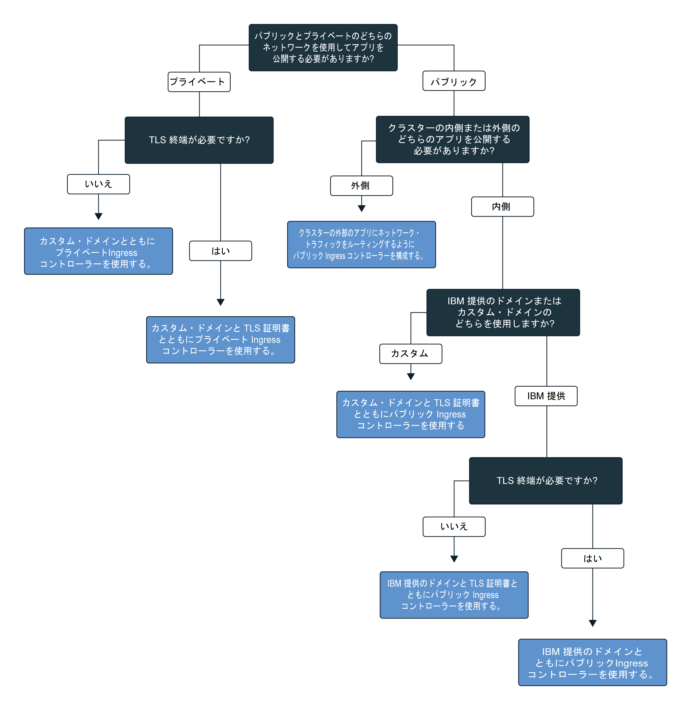

---

copyright:
  years: 2014, 2018
lastupdated: "2018-01-12"

---

{:new_window: target="_blank"}
{:shortdesc: .shortdesc}
{:screen: .screen}
{:pre: .pre}
{:table: .aria-labeledby="caption"}
{:codeblock: .codeblock}
{:tip: .tip}
{:download: .download}


# Ingress サービスのセットアップ
{: #ingress}

## Ingress を使用してアプリへのアクセスを構成する方法
{: #config}

IBM 提供の Ingress コントローラーにより管理される Ingress リソースを作成することによって、クラスター内の複数のアプリを公します。 Ingress コントローラーは、アプリケーション・ロード・バランサーを使用するために必要なリソースを作成します。 アプリケーション・ロード・バランサーは、HTTP または HTTPS のいずれかの外部ロード・バランサーです。このロード・バランサーは、保護された固有のパブリック・エントリー・ポイントまたはプライベート・エントリー・ポイントを使用して、着信要求をクラスター内外のアプリにルーティングします。

**注:** Ingress は標準クラスター専用であり、高可用性を確保して定期的更新を適用するためにはクラスター内に 2 つ以上のワーカー・ノードを必要とします。 Ingress のセットアップには、[管理者アクセス・ポリシー](cs_users.html#access_policies)が必要です。 現在の[アクセス・ポリシー](cs_users.html#infra_access)を確認してください。

標準クラスターを作成すると、ポータブル・パブリック IP アドレスとパブリック経路が割り当てられたアプリケーション・ロード・バランサーが Ingress コントローラーによって自動的に作成されて有効になります。 ポータブル・プライベート IP アドレスとプライベート経路が割り当てられたアプリケーション・ロード・バランサーも自動的に作成されますが、自動的に有効になるわけではありません。 これらのアプリケーション・ロード・バランサーを構成し、パブリック・ネットワークまたはプライベート・ネットワークに公開するアプリごとに個々のルーティング・ルールを定義することができます。 Ingress によってパブリックに公開される各アプリに対して、パブリック経路に付加される固有のパスが割り当てられるので、固有の URL を使用して、クラスター内のアプリにパブリックにアクセスできるようになります。

パブリックにアプリを公開するために、以下のシナリオに応じてパブリック・アプリケーションのロード・バランサーを構成できます。

-   [TLS なしで IBM 提供ドメインを使用してアプリをパブリックに公開する](#ibm_domain)
-   [TLS ありで IBM 提供ドメインを使用してアプリをパブリックに公開する](#ibm_domain_cert)
-   [TLS ありでカスタム・ドメインを使用してアプリをパブリックに公開する](#custom_domain_cert)
-   [TLS ありで IBM 提供ドメインまたはカスタム・ドメインを使用してクラスターの外部にあるアプリをパブリックに公開する](#external_endpoint)

プライベート・ネットワークにアプリを公開するには、まず[プライベート・アプリケーションのロード・バランサーを有効にします](#private_ingress)。 その後、以下のシナリオに応じてプライベート・アプリケーションのロード・バランサーを構成できます。

-   [TLS なしでカスタム・ドメインを使用してアプリをプライベートに公開する](#private_ingress_no_tls)
-   [TLS ありでカスタム・ドメインを使用してアプリをプライベートに公開する](#private_ingress_tls)

アプリをパブリックまたはプライベートに公開した後に、以下のオプションによって、アプリケーション・ロード・バランサーをさらに構成できます。

-   [Ingress アプリケーション・ロード・バランサーでポートを開く](#opening_ingress_ports)
-   [HTTP レベルで SSL プロトコルと SSL 暗号を構成する](#ssl_protocols_ciphers)
-   [アノテーションを使用してアプリケーション・ロード・バランサーをカスタマイズする](cs_annotations.html)
{: #ingress_annotation}

Ingress に最適な構成を選択するために、以下のデシジョン・ツリーに従うことができます。


<map name="ingress_map" id="ingress_map">
<area href="/docs/containers/cs_ingress.html#private_ingress_no_tls" alt="TLS なしでカスタム・ドメインを使用してアプリをプライベートに公開する" shape="rect" coords="25, 246, 187, 294"/>
<area href="/docs/containers/cs_ingress.html#private_ingress_tls" alt="TLS ありでカスタム・ドメインを使用してアプリをプライベートに公開する" shape="rect" coords="161, 337, 309, 385"/>
<area href="/docs/containers/cs_ingress.html#external_endpoint" alt="TLS ありで IBM 提供ドメインまたはカスタム・ドメインを使用してクラスターの外部にあるアプリをパブリックに公開する" shape="rect" coords="313, 229, 466, 282"/>
<area href="/docs/containers/cs_ingress.html#custom_domain_cert" alt="TLS ありでカスタム・ドメインを使用してアプリをパブリックに公開する" shape="rect" coords="365, 415, 518, 468"/>
<area href="/docs/containers/cs_ingress.html#ibm_domain" alt="TLS なしで IBM 提供ドメインを使用してアプリをパブリックに公開する" shape="rect" coords="414, 609, 569, 659"/>
<area href="/docs/containers/cs_ingress.html#ibm_domain_cert" alt="TLS ありで IBM 提供ドメインを使用してアプリをパブリックに公開する" shape="rect" coords="563, 681, 716, 734"/>
</map>

<br />


## TLS なしで IBM 提供ドメインを使用してアプリをパブリックに公開する
{: #ibm_domain}

クラスター内のアプリ用の HTTP ロード・バランサーとしてアプリケーション・ロード・バランサーを構成し、IBM 提供ドメインを使用してインターネットからアプリにアクセスします。

開始前に、以下のことを行います。

-   標準クラスターがまだない場合は、[標準クラスターを作成します](cs_clusters.html#clusters_ui)。
-   対象のクラスターに対して `kubectl` コマンドを実行するように [CLI のターゲット設定を行います](cs_cli_install.html#cs_cli_configure)。

アプリケーション・ロード・バランサーを構成するには、以下のようにします。

1.  [アプリをクラスターにデプロイします](cs_app.html#app_cli)。 アプリをクラスターにデプロイする際に、コンテナー内のアプリを実行するポッドが 1 つ以上自動的に作成されます。 構成ファイルの metadata セクションで、デプロイメントにラベルを追加しておく必要があります。 このラベルは、アプリが実行されるすべてのポッドを識別して、それらのポットが Ingress ロード・バランシングに含められるようにするために必要です。
2.  公開するアプリ用に、Kubernetes サービスを作成します。 Ingress コントローラーが Ingress ロード・バランシングにアプリを含めることができるのは、クラスター内の Kubernetes サービスによってアプリが公開されている場合のみです。
    1.  任意のエディターを開き、`myservice.yaml` などの名前のサービス構成ファイルを作成します。
    2.  パブリックに公開するアプリのアプリケーション・ロード・バランサー・サービスを定義します。

        ```
        apiVersion: v1
        kind: Service
        metadata:
          name: <myservice>
        spec:
          selector:
            <selectorkey>: <selectorvalue>
          ports:
           - protocol: TCP
             port: 8080
        ```
        {: codeblock}

        <table>
        <caption>アプリケーション・ロード・バランサーのサービス・ファイルの構成要素について</caption>
        <thead>
        <th colspan=2> YAML ファイルの構成要素について</th>
        </thead>
        <tbody>
        <tr>
        <td><code>name</code></td>
        <td><em>&lt;myservice&gt;</em> を、アプリケーション・ロード・バランサー・サービスの名前に置き換えます。</td>
        </tr>
        <tr>
        <td><code>selector</code></td>
        <td>アプリが実行されるポッドをターゲットにするために使用する、ラベル・キー (<em>&lt;selectorkey&gt;</em>) と値 (<em>&lt;selectorvalue&gt;</em>) のペアを入力します。 例えば、<code>app: code</code> というセレクターを使用した場合、メタデータにこのラベルがあるすべてのポッドが、ロード・バランシングに含められます。 アプリをクラスターにデプロイするときに使用したものと同じラベルを入力してください。 </td>
         </tr>
         <tr>
         <td><code>port</code></td>
         <td>サービスが listen するポート。</td>
         </tr>
         </tbody></table>
    3.  変更を保存します。
    4.  クラスター内にサービスを作成します。

        ```
        kubectl apply -f myservice.yaml
        ```
        {: pre}
    5.  公開するアプリごとに、上記のステップを繰り返します。
3.  クラスターの詳細を取得して、IBM 提供ドメインを表示します。 _&lt;mycluster&gt;_ を、公開する対象のアプリがデプロイされているクラスターの名前に置き換えます。

    ```
    bx cs cluster-get <mycluster>
    ```
    {: pre}

    CLI 出力は、以下のようになります。

    ```
    Retrieving cluster <mycluster>...
    OK
    Name:    <mycluster>
    ID:    b9c6b00dc0aa487f97123440b4895f2d
    Created:  2017-04-26T19:47:08+0000
    State:    normal
    Master URL:  https://169.57.40.165:1931
    Ingress subdomain:  <ibmdomain>
    Ingress secret:  <ibmtlssecret>
    Workers:  3
    ```
    {: screen}

    IBM 提供ドメインは、**「Ingress サブドメイン (Ingress subdomain)」**フィールドに示されます。
4.  Ingress リソースを作成します。 Ingress リソースは、アプリ用に作成した Kubernetes サービスのルーティング・ルールを定義するもので、着信ネットワーク・トラフィックをサービスにルーティングするためにアプリケーション・ロード・バランサーによって使用されます。 すべてのアプリがクラスター内の Kubernetes サービスによって公開されていれば、1 つの Ingress リソースを使用して複数のアプリのルーティング・ルールを定義できます。
    1.  任意のエディターを開き、`myingress.yaml` などの名前の Ingress 構成ファイルを作成します。
    2.  IBM 提供ドメインを使用して着信ネットワーク・トラフィックを作成済みのサービスにルーティングするように、Ingress リソースを構成ファイル内に定義します。

        ```
        apiVersion: extensions/v1beta1
        kind: Ingress
        metadata:
          name: <myingressname>
        spec:
          rules:
          - host: <ibmdomain>
            http:
              paths:
              - path: /<myservicepath1>
                backend:
                  serviceName: <myservice1>
                  servicePort: 80
              - path: /<myservicepath2>
                backend:
                  serviceName: <myservice2>
                  servicePort: 80
        ```
        {: codeblock}

        <table>
        <caption>Ingress リソース・ファイルの構成要素について</caption>
        <thead>
        <th colspan=2> YAML ファイルの構成要素について</th>
        </thead>
        <tbody>
        <tr>
        <td><code>name</code></td>
        <td><em>&lt;myingressname&gt;</em> を Ingress リソースの名前に置き換えます。</td>
        </tr>
        <tr>
        <td><code>host</code></td>
        <td><em>&lt;ibmdomain&gt;</em> を、前述のステップにある IBM 提供の<strong>「Ingress サブドメイン (Ingress subdomain)」</strong>の名前に置き換えます。

        </br></br>
        <strong>注:</strong> Ingress 作成時の失敗を回避するため、ホストに * を使用したり、ホスト・プロパティーを空のままにしたりしないでください。</td>
        </tr>
        <tr>
        <td><code>path</code></td>
        <td><em>&lt;myservicepath1&gt;</em> をスラッシュか、アプリが listen する固有のパスに置き換えて、ネットワーク・トラフィックをアプリに転送できるようにします。

        </br>
        Kubernetes サービスごとに、IBM 提供ドメインに付加する個別のパスを定義して、アプリへの固有のパス (例えば <code>ingress_domain/myservicepath1</code>) を作成できます。 この経路を Web ブラウザーに入力すると、ネットワーク・トラフィックがアプリケーション・ロード・バランサーにルーティングされます。 アプリケーション・ロード・バランサーは、同じパスを使用して、関連付けられたサービスを検索し、ネットワーク・トラフィックをそのサービスに送信し、アプリが実行されているポッドに送信します。 着信ネットワーク・トラフィックを受け取るには、このパスを listen するようにアプリをセットアップする必要があります。

        </br></br>
        多くのアプリは、特定のパスで listen するのではなく、ルート・パスと特定のポートを使用します。 この場合、ルート・パスを <code>/</code> として定義します。アプリ用の個別のパスは指定しないでください。
        </br>
        例: <ul><li><code>http://ingress_host_name/</code> の場合、<code>/</code> をパスとして入力します。</li><li><code>http://ingress_host_name/myservicepath</code> の場合、<code>/myservicepath</code> をパスとして入力します。</li></ul>
        </br>
        <strong>ヒント:</strong> アプリが listen するパスとは別のパスを listen するように Ingress を構成する場合は、[再書き込みアノテーション](cs_annotations.html#rewrite-path)を使用してアプリへの適切なルーティングを設定します。</td>
        </tr>
        <tr>
        <td><code>serviceName</code></td>
        <td><em>&lt;myservice1&gt;</em> を、アプリ用に Kubernetes サービスを作成したときに使用したサービスの名前に置き換えます。</td>
        </tr>
        <tr>
        <td><code>servicePort</code></td>
        <td>サービスが listen するポート。アプリ用に Kubernetes サービスを作成したときに定義したものと同じポートを使用します。</td>
        </tr>
        </tbody></table>

    3.  クラスターの Ingress リソースを作成します。

        ```
        kubectl apply -f myingress.yaml
        ```
        {: pre}

5.  Ingress リソースが正常に作成されたことを確認します。_&lt;myingressname&gt;_ を、先ほど作成した Ingress リソースの名前に置き換えます。

    ```
    kubectl describe ingress <myingressname>
    ```
    {: pre}

  **注:** Ingress リソースが作成され、公共のインターネット上でアプリが使用可能になるまでに数分かかることがあります。
6.  Web ブラウザーに、アクセスするアプリ・サービスの URL を入力します。

    ```
    http://<ibmdomain>/<myservicepath1>
    ```
    {: codeblock}

<br />


## TLS ありで IBM 提供ドメインを使用してアプリをパブリックに公開する
{: #ibm_domain_cert}

アプリのために着信 TLS 接続を管理し、IBM 提供の TLS 証明書を使用してネットワーク・トラフィックを暗号化解除し、暗号化されていない要求をクラスター内の公開されたアプリに向けて転送するように、アプリケーション・ロード・バランサーを構成することができます。

開始前に、以下のことを行います。

-   標準クラスターがまだない場合は、[標準クラスターを作成します](cs_clusters.html#clusters_ui)。
-   対象のクラスターに対して `kubectl` コマンドを実行するように [CLI のターゲット設定を行います](cs_cli_install.html#cs_cli_configure)。

アプリケーション・ロード・バランサーを構成するには、以下のようにします。

1.  [アプリをクラスターにデプロイします](cs_app.html#app_cli)。 構成ファイルの metadata セクションで、デプロイメントにラベルを追加しておく必要があります。 このラベルにより、アプリが実行されるすべてのポッドが識別され、それらのポッドが Ingress ロード・バランシングに含められます。
2.  公開するアプリ用に、Kubernetes サービスを作成します。 アプリケーション・ロード・バランサーが Ingress ロード・バランシングにアプリを含めることができるのは、クラスター内の Kubernetes サービスによってアプリが公開されている場合のみです。
    1.  任意のエディターを開き、`myservice.yaml` などの名前のサービス構成ファイルを作成します。
    2.  パブリックに公開するアプリのアプリケーション・ロード・バランサー・サービスを定義します。

        ```
        apiVersion: v1
        kind: Service
        metadata:
          name: <myservice>
        spec:
          selector:
            <selectorkey>: <selectorvalue>
          ports:
           - protocol: TCP
             port: 8080
        ```
        {: codeblock}

        <table>
        <caption>アプリケーション・ロード・バランサーのサービス・ファイルの構成要素について</caption>
        <thead>
        <th colspan=2> YAML ファイルの構成要素について</th>
        </thead>
        <tbody>
        <tr>
        <td><code>name</code></td>
        <td><em>&lt;myservice&gt;</em> を、アプリケーション・ロード・バランサー・サービスの名前に置き換えます。</td>
        </tr>
        <tr>
        <td><code>selector</code></td>
        <td>アプリが実行されるポッドをターゲットにするために使用する、ラベル・キー (<em>&lt;selectorkey&gt;</em>) と値 (<em>&lt;selectorvalue&gt;</em>) のペアを入力します。 例えば、<code>app: code</code> というセレクターを使用した場合、メタデータにこのラベルがあるすべてのポッドが、ロード・バランシングに含められます。 アプリをクラスターにデプロイするときに使用したものと同じラベルを入力してください。 </td>
         </tr>
         <tr>
         <td><code>port</code></td>
         <td>サービスが listen するポート。</td>
         </tr>
         </tbody></table>

    3.  変更を保存します。
    4.  クラスター内にサービスを作成します。

        ```
        kubectl apply -f myservice.yaml
        ```
        {: pre}

    5.  公開するアプリごとに、上記のステップを繰り返します。

3.  IBM 提供ドメインと TLS 証明書を表示します。 _&lt;mycluster&gt;_ を、アプリがデプロイされているクラスターの名前に置き換えます。

    ```
    bx cs cluster-get <mycluster>
    ```
    {: pre}

    CLI 出力は、以下のようになります。

    ```
    bx cs cluster-get <mycluster>
    Retrieving cluster <mycluster>...
    OK
    Name:    <mycluster>
    ID:    b9c6b00dc0aa487f97123440b4895f2d
    Created:  2017-04-26T19:47:08+0000
    State:    normal
    Master URL:  https://169.57.40.165:1931
    Ingress subdomain:  <ibmdomain>
    Ingress secret:  <ibmtlssecret>
    Workers:  3
    ```
    {: screen}

    IBM 提供ドメインが**「Ingress サブドメイン (Ingress subdomain)」**フィールドに示され、IBM 提供の証明書が**「Ingress シークレット (Ingress secret)」**フィールドに示されます。

4.  Ingress リソースを作成します。 Ingress リソースは、アプリ用に作成した Kubernetes サービスのルーティング・ルールを定義するもので、着信ネットワーク・トラフィックをサービスにルーティングするためにアプリケーション・ロード・バランサーによって使用されます。 すべてのアプリがクラスター内の Kubernetes サービスによって公開されていれば、1 つの Ingress リソースを使用して複数のアプリのルーティング・ルールを定義できます。
    1.  任意のエディターを開き、`myingress.yaml` などの名前の Ingress 構成ファイルを作成します。
    2.  IBM 提供ドメインを使用して着信ネットワーク・トラフィックを対象サービスにルーティングし、IBM 提供の証明書を使用して TLS 終端を管理するように、Ingress リソースを構成ファイル内に定義します。 サービスごとに、IBM 提供ドメインに付加する個別のパスを定義して、アプリへの固有のパス (例えば、`https://ingress_domain/myapp`) を作成することができます。 この経路を Web ブラウザーに入力すると、ネットワーク・トラフィックがアプリケーション・ロード・バランサーにルーティングされます。 アプリケーション・ロード・バランサーは、関連付けられたサービスを検索し、ネットワーク・トラフィックをそのサービスに送信し、さらに、アプリが実行されているポッドに送信します。

        **注:** Ingress リソースに定義されたパスでアプリが listen していなければなりません。 そうでない場合、ネットワーク・トラフィックをそのアプリに転送できません。大多数のアプリは特定のパスで listen するのではなく、ルート・パスと特定のポートを使用します。 この場合、ルート・パスを `/` として定義します。アプリ用の個別のパスは指定しないでください。

        ```
        apiVersion: extensions/v1beta1
        kind: Ingress
        metadata:
          name: <myingressname>
        spec:
          tls:
          - hosts:
            - <ibmdomain>
            secretName: <ibmtlssecret>
          rules:
          - host: <ibmdomain>
            http:
              paths:
              - path: /<myservicepath1>
                backend:
                  serviceName: <myservice1>
                  servicePort: 80
              - path: /<myservicepath2>
                backend:
                  serviceName: <myservice2>
                  servicePort: 80
        ```
        {: codeblock}

        <table>
        <caption>Ingress リソース・ファイルの構成要素について</caption>
        <thead>
        <th colspan=2> YAML ファイルの構成要素について</th>
        </thead>
        <tbody>
        <tr>
        <td><code>name</code></td>
        <td><em>&lt;myingressname&gt;</em> を Ingress リソースの名前に置き換えます。</td>
        </tr>
        <tr>
        <td><code>tls/hosts</code></td>
        <td><em>&lt;ibmdomain&gt;</em> を、前述のステップにある IBM 提供の<strong>「Ingress サブドメイン (Ingress subdomain)」</strong>の名前に置き換えます。 このドメインは TLS 終端用に構成されます。

        </br></br>
        <strong>注:</strong> Ingress 作成時の失敗を回避するため、ホストに &ast; を使用したり、ホスト・プロパティーを空のままにしたりしないでください。</td>
        </tr>
        <tr>
        <td><code>tls/secretName</code></td>
        <td><em>&lt;ibmtlssecret&gt;</em> を、前述のステップにある IBM 提供の<strong>「Ingress シークレット (Ingress secret)」</strong>の名前に置き換えます。 この証明書で TLS 終端を管理します。
        </tr>
        <tr>
        <td><code>host</code></td>
        <td><em>&lt;ibmdomain&gt;</em> を、前述のステップにある IBM 提供の<strong>「Ingress サブドメイン (Ingress subdomain)」</strong>の名前に置き換えます。 このドメインは TLS 終端用に構成されます。

        </br></br>
        <strong>注:</strong> Ingress 作成時の失敗を回避するため、ホストに &ast; を使用したり、ホスト・プロパティーを空のままにしたりしないでください。</td>
        </tr>
        <tr>
        <td><code>path</code></td>
        <td><em>&lt;myservicepath1&gt;</em> をスラッシュか、アプリが listen する固有のパスに置き換えて、ネットワーク・トラフィックをアプリに転送できるようにします。

        </br>
        Kubernetes サービスごとに、IBM 提供ドメインに付加する個別のパスを定義して、アプリへの固有のパス (例えば <code>ingress_domain/myservicepath1</code>) を作成できます。 この経路を Web ブラウザーに入力すると、ネットワーク・トラフィックがアプリケーション・ロード・バランサーにルーティングされます。 アプリケーション・ロード・バランサーは、同じパスを使用して、関連付けられたサービスを検索し、ネットワーク・トラフィックをそのサービスに送信し、アプリが実行されているポッドに送信します。 着信ネットワーク・トラフィックを受け取るには、このパスを listen するようにアプリをセットアップする必要があります。

        </br>
        多くのアプリは、特定のパスで listen するのではなく、ルート・パスと特定のポートを使用します。 この場合、ルート・パスを <code>/</code> として定義します。アプリ用の個別のパスは指定しないでください。

        </br>
        例: <ul><li><code>http://ingress_host_name/</code> の場合、<code>/</code> をパスとして入力します。</li><li><code>http://ingress_host_name/myservicepath</code> の場合、<code>/myservicepath</code> をパスとして入力します。</li></ul>
        <strong>ヒント:</strong> アプリが listen するパスとは別のパスを listen するように Ingress を構成する場合は、[再書き込みアノテーション](cs_annotations.html#rewrite-path)を使用してアプリへの適切なルーティングを設定します。</td>
        </tr>
        <tr>
        <td><code>serviceName</code></td>
        <td><em>&lt;myservice1&gt;</em> を、アプリ用に Kubernetes サービスを作成したときに使用したサービスの名前に置き換えます。</td>
        </tr>
        <tr>
        <td><code>servicePort</code></td>
        <td>サービスが listen するポート。アプリ用に Kubernetes サービスを作成したときに定義したものと同じポートを使用します。</td>
        </tr>
        </tbody></table>

    3.  クラスターの Ingress リソースを作成します。

        ```
        kubectl apply -f myingress.yaml
        ```
        {: pre}

5.  Ingress リソースが正常に作成されたことを確認します。_&lt;myingressname&gt;_ を、先ほど作成した Ingress リソースの名前に置き換えます。

    ```
    kubectl describe ingress <myingressname>
    ```
    {: pre}

    **注:** Ingress リソースが適切に作成され、公共のインターネット上でアプリが使用可能になるまでに数分かかることがあります。
6.  Web ブラウザーに、アクセスするアプリ・サービスの URL を入力します。

    ```
    https://<ibmdomain>/<myservicepath1>
    ```
    {: codeblock}

<br />


## TLS ありでカスタム・ドメインを使用してアプリをパブリックに公開する
{: #custom_domain_cert}

IBM 提供ドメインではなくカスタム・ドメインを使用する場合でも、着信ネットワーク・トラフィックをクラスター内のアプリに転送し、独自の TLS 証明書を使用して TLS 終端を管理するように、アプリケーション・ロード・バランサーを構成することができます。
{:shortdesc}

開始前に、以下のことを行います。

-   標準クラスターがまだない場合は、[標準クラスターを作成します](cs_clusters.html#clusters_ui)。
-   対象のクラスターに対して `kubectl` コマンドを実行するように [CLI のターゲット設定を行います](cs_cli_install.html#cs_cli_configure)。

アプリケーション・ロード・バランサーを構成するには、以下のようにします。

1.  カスタム・ドメインを作成します。 カスタム・ドメインを作成するには、ドメイン・ネーム・サービス (DNS) プロバイダーを使用してカスタム・ドメインを登録します。
2.  着信ネットワーク・トラフィックを IBM 提供のアプリケーション・ロード・バランサーにルーティングするようにドメインを構成します。 以下の選択肢があります。
    -   IBM 提供ドメインを正規名レコード (CNAME) として指定することで、カスタム・ドメインの別名を定義します。 IBM 提供の Ingress ドメインを確認するには、`bx cs cluster-get <mycluster>` を実行し、**「Ingress サブドメイン (Ingress subdomain)」**フィールドを見つけます。
    -   カスタム・ドメインを IBM 提供のアプリケーション・ロード・バランサーのポータブル・パブリック IP アドレスにマップします。これは、IP アドレスをレコードとして追加して行います。 アプリケーション・ロード・バランサーのポータブル・パブリック IP アドレスを見つけるには、`bx cs alb-get <public_alb_ID>` を実行します。
3.  TLS 証明書とキー・シークレットをインポートまたは作成します。
    * 使用する TLS 証明書が {{site.data.keyword.cloudcerts_long_notm}} に既に保管されている場合、それに関連付けられたシークレットを、以下のコマンドを実行してクラスター内にインポートできます。

          ```
          bx cs alb-cert-deploy --secret-name <secret_name> --cluster <cluster_name_or_ID> --cert-crn <certificate_crn>
          ```
          {: pre}
    * TLS 証明書の準備ができていない場合は、以下の手順に従ってください。
        1. PEM 形式でエンコードされた TLS 証明書と鍵を、当該ドメインのために作成します。
        2.  任意のエディターを開き、`mysecret.yaml` などの名前の Kubernetes シークレット構成ファイルを作成します。
        3.  TLS 証明書と鍵を使用するシークレットを定義します。 <em>&lt;mytlssecret&gt;</em> を Kubernetes シークレットの名前に、<em>&lt;tls_key_filepath&gt;</em> をカスタム TLS 鍵ファイルへのパスに、<em>&lt;tls_cert_filepath&gt;</em> をカスタム TLS 証明書ファイルへのパスに置き換えます。

            ```
            kubectl create secret tls <mytlssecret> --key <tls_key_filepath> --cert <tls_cert_filepath>
            ```
            {: pre}

        4.  構成ファイルを保存します。
        5.  クラスターの TLS シークレットを作成します。

            ```
            kubectl apply -f mysecret.yaml
            ```
            {: pre}

4.  [アプリをクラスターにデプロイします](cs_app.html#app_cli)。 アプリをクラスターにデプロイする際に、コンテナー内のアプリを実行するポッドが 1 つ以上自動的に作成されます。 構成ファイルの metadata セクションで、デプロイメントにラベルを追加しておく必要があります。 このラベルは、アプリが実行されるすべてのポッドを識別して、それらのポットが Ingress ロード・バランシングに含められるようにするために必要です。

5.  公開するアプリ用に、Kubernetes サービスを作成します。 アプリケーション・ロード・バランサーが Ingress ロード・バランシングにアプリを含めることができるのは、クラスター内の Kubernetes サービスによってアプリが公開されている場合のみです。

    1.  任意のエディターを開き、`myservice.yaml` などの名前のサービス構成ファイルを作成します。
    2.  パブリックに公開するアプリのアプリケーション・ロード・バランサー・サービスを定義します。

        ```
        apiVersion: v1
        kind: Service
        metadata:
          name: <myservice>
        spec:
          selector:
            <selectorkey>: <selectorvalue>
          ports:
           - protocol: TCP
             port: 8080
        ```
       {: codeblock}

        <table>
        <caption>アプリケーション・ロード・バランサーのサービス・ファイルの構成要素について</caption>
        <thead>
        <th colspan=2> YAML ファイルの構成要素について</th>
        </thead>
        <tbody>
        <tr>
        <td><code>name</code></td>
        <td><em>&lt;myservice1&gt;</em> を、アプリケーション・ロード・バランサー・サービスの名前に置き換えます。</td>
        </tr>
        <tr>
        <td><code>selector</code></td>
        <td>アプリが実行されるポッドをターゲットにするために使用する、ラベル・キー (<em>&lt;selectorkey&gt;</em>) と値 (<em>&lt;selectorvalue&gt;</em>) のペアを入力します。 例えば、<code>app: code</code> というセレクターを使用した場合、メタデータにこのラベルがあるすべてのポッドが、ロード・バランシングに含められます。 アプリをクラスターにデプロイするときに使用したものと同じラベルを入力してください。 </td>
         </tr>
         <td><code>port</code></td>
         <td>サービスが listen するポート。</td>
         </tbody></table>

    3.  変更を保存します。
    4.  クラスター内にサービスを作成します。

        ```
        kubectl apply -f myservice.yaml
        ```
        {: pre}

    5.  公開するアプリごとに、上記のステップを繰り返します。
6.  Ingress リソースを作成します。 Ingress リソースは、アプリ用に作成した Kubernetes サービスのルーティング・ルールを定義するもので、着信ネットワーク・トラフィックをサービスにルーティングするためにアプリケーション・ロード・バランサーによって使用されます。 すべてのアプリがクラスター内の Kubernetes サービスによって公開されていれば、1 つの Ingress リソースを使用して複数のアプリのルーティング・ルールを定義できます。
    1.  任意のエディターを開き、`myingress.yaml` などの名前の Ingress 構成ファイルを作成します。
    2.  カスタム・ドメインを使用して着信ネットワーク・トラフィックを対象サービスにルーティングし、カスタム証明書を使用して TLS 終端を管理するように、Ingress リソースを構成ファイル内に定義します。 サービスごとに、カスタム・ドメインに付加する個別のパスを定義して、アプリへの固有のパス (例えば、`https://mydomain/myapp`) を作成することができます。 この経路を Web ブラウザーに入力すると、ネットワーク・トラフィックがアプリケーション・ロード・バランサーにルーティングされます。 アプリケーション・ロード・バランサーは、関連付けられたサービスを検索し、ネットワーク・トラフィックをそのサービスに送信し、さらに、アプリが実行されているポッドに送信します。

        **注:** Ingress リソースに定義されたパスでアプリが listen していることが重要です。 そうでない場合、ネットワーク・トラフィックをそのアプリに転送できません。大多数のアプリは特定のパスで listen するのではなく、ルート・パスと特定のポートを使用します。 この場合、ルート・パスを `/` として定義します。アプリ用の個別のパスは指定しないでください。

        ```
        apiVersion: extensions/v1beta1
        kind: Ingress
        metadata:
          name: <myingressname>
        spec:
          tls:
          - hosts:
            - <mycustomdomain>
            secretName: <mytlssecret>
          rules:
          - host: <mycustomdomain>
            http:
              paths:
              - path: /<myservicepath1>
                backend:
                  serviceName: <myservice1>
                  servicePort: 80
              - path: /<myservicepath2>
                backend:
                  serviceName: <myservice2>
                  servicePort: 80
        ```
        {: codeblock}

        <table>
        <caption>Ingress リソース・ファイルの構成要素について</caption>
        <thead>
        <th colspan=2> YAML ファイルの構成要素について</th>
        </thead>
        <tbody>
        <tr>
        <td><code>name</code></td>
        <td><em>&lt;myingressname&gt;</em> を Ingress リソースの名前に置き換えます。</td>
        </tr>
        <tr>
        <td><code>tls/hosts</code></td>
        <td><em>&lt;mycustomdomain&gt;</em> を、TLS 終端のために構成するカスタム・ドメインに置き換えます。

        </br></br>
        <strong>注:</strong> Ingress 作成時の失敗を回避するため、ホストに &ast; を使用したり、ホスト・プロパティーを空のままにしたりしないでください。</td>
        </tr>
        <tr>
        <td><code>tls/secretName</code></td>
        <td><em>&lt;mytlssecret&gt;</em> を、先ほど作成した、カスタム TLS 証明書と鍵を保持するシークレットの名前に置き換えます。{{site.data.keyword.cloudcerts_short}} から証明書をインポートする場合、<code>bx cs alb-cert-get --cluster <cluster_name_or_ID> --cert-crn <certificate_crn></code> を実行して、TLS 証明書に関連付けられたシークレットを確認できます。
        </tr>
        <tr>
        <td><code>host</code></td>
        <td><em>&lt;mycustomdomain&gt;</em> を、TLS 終端のために構成するカスタム・ドメインに置き換えます。

        </br></br>
        <strong>注:</strong> Ingress 作成時の失敗を回避するため、ホストに &ast; を使用したり、ホスト・プロパティーを空のままにしたりしないでください。
        </td>
        </tr>
        <tr>
        <td><code>path</code></td>
        <td><em>&lt;myservicepath1&gt;</em> をスラッシュか、アプリが listen する固有のパスに置き換えて、ネットワーク・トラフィックをアプリに転送できるようにします。

        </br>
        Kubernetes サービスごとに、IBM 提供ドメインに付加する個別のパスを定義して、アプリへの固有のパス (例えば <code>ingress_domain/myservicepath1</code>) を作成できます。 この経路を Web ブラウザーに入力すると、ネットワーク・トラフィックがアプリケーション・ロード・バランサーにルーティングされます。 アプリケーション・ロード・バランサーは、同じパスを使用して、関連付けられたサービスを検索し、ネットワーク・トラフィックをそのサービスに送信し、アプリが実行されているポッドに送信します。 着信ネットワーク・トラフィックを受け取るには、このパスを listen するようにアプリをセットアップする必要があります。

        </br>
        多くのアプリは、特定のパスで listen するのではなく、ルート・パスと特定のポートを使用します。 この場合、ルート・パスを <code>/</code> として定義します。アプリ用の個別のパスは指定しないでください。

        </br></br>
        例: <ul><li><code>https://mycustomdomain/</code> の場合、<code>/</code> をパスとして入力します。</li><li><code>https://mycustomdomain/myservicepath</code> の場合、<code>/myservicepath</code> をパスとして入力します。</li></ul>
        <strong>ヒント:</strong> アプリが listen するパスとは別のパスを listen するように Ingress を構成する場合は、[再書き込みアノテーション](cs_annotations.html#rewrite-path)を使用してアプリへの適切なルーティングを設定します。
        </td>
        </tr>
        <tr>
        <td><code>serviceName</code></td>
        <td><em>&lt;myservice1&gt;</em> を、アプリ用に Kubernetes サービスを作成したときに使用したサービスの名前に置き換えます。</td>
        </tr>
        <tr>
        <td><code>servicePort</code></td>
        <td>サービスが listen するポート。アプリ用に Kubernetes サービスを作成したときに定義したものと同じポートを使用します。</td>
        </tr>
        </tbody></table>

    3.  変更を保存します。
    4.  クラスターの Ingress リソースを作成します。

        ```
        kubectl apply -f myingress.yaml
        ```
        {: pre}

7.  Ingress リソースが正常に作成されたことを確認します。_&lt;myingressname&gt;_ を、先ほど作成した Ingress リソースの名前に置き換えます。

    ```
    kubectl describe ingress <myingressname>
    ```
    {: pre}

    **注:** Ingress リソースが適切に作成され、公共のインターネット上でアプリが使用可能になるまでに数分かかることがあります。

8.  インターネットからアプリにアクセスします。
    1.  任意の Web ブラウザーを開きます。
    2.  アクセスするアプリ・サービスの URL を入力します。

        ```
        https://<mycustomdomain>/<myservicepath1>
        ```
        {: codeblock}

<br />


## TLS ありで IBM 提供ドメインまたはカスタム・ドメインを使用してクラスターの外部にあるアプリをパブリックに公開する
{: #external_endpoint}

クラスターの外部に配置されたアプリをクラスター・ロード・バランシングに含めるように、アプリケーション・ロード・バランサーを構成することができます。 IBM 提供ドメインまたはカスタム・ドメインでの着信要求は、自動的に外部アプリに転送されます。

開始前に、以下のことを行います。

-   標準クラスターがまだない場合は、[標準クラスターを作成します](cs_clusters.html#clusters_ui)。
-   対象のクラスターに対して `kubectl` コマンドを実行するように [CLI のターゲット設定を行います](cs_cli_install.html#cs_cli_configure)。
-   クラスター・ロード・バランシングに含めようとしている外部アプリに、パブリック IP アドレスを使用してアクセスできることを確認します。

IBM 提供ドメインへの着信ネットワーク・トラフィックを、クラスターの外部に配置されたアプリに転送するようにアプリケーション・ロード・バランサーを構成することができます。 代わりにカスタム・ドメインと TLS 証明書を使用する場合は、IBM 提供ドメインと TLS 証明書を[カスタムのドメインと TLS 証明書](#custom_domain_cert)に置き換えてください。

1.  クラスター・ロード・バランシングに含める外部のアプリの場所を定義する、Kubernetes エンドポイントを構成します。
    1.  任意のエディターを開き、`myexternalendpoint.yaml` などの名前のエンドポイント構成ファイルを作成します。
    2.  外部エンドポイントを定義します。 外部アプリにアクセスするために使用可能な、すべてのパブリック IP アドレスとポートを含めます。

        ```
        kind: Endpoints
        apiVersion: v1
        metadata:
          name: <myendpointname>
        subsets:
          - addresses:
              - ip: <externalIP1>
              - ip: <externalIP2>
            ports:
              - port: <externalport>
        ```
        {: codeblock}

        <table>
        <thead>
        <th colspan=2> YAML ファイルの構成要素について</th>
        </thead>
        <tbody>
        <tr>
        <td><code>name</code></td>
        <td><em>&lt;myendpointname&gt;</em> を Kubernetes エンドポイントの名前に置き換えます。</td>
        </tr>
        <tr>
        <td><code>ip</code></td>
        <td><em>&lt;externalIP&gt;</em> を、外部アプリに接続するためのパブリック IP アドレスに置き換えます。</td>
         </tr>
         <td><code>port</code></td>
         <td><em>&lt;externalport&gt;</em> を、外部アプリが listen するポートに置き換えます。</td>
         </tbody></table>

    3.  変更を保存します。
    4.  クラスターの Kubernetes エンドポイントを作成します。

        ```
        kubectl apply -f myexternalendpoint.yaml
        ```
        {: pre}

2.  クラスターのために Kubernetes サービスを作成します。そして、作成済みの外部エンドポイントに着信要求を転送するようにそのサービスを構成します。
    1.  任意のエディターを開き、`myexternalservice.yaml` などの名前のサービス構成ファイルを作成します。
    2.  アプリケーション・ロード・バランサー・サービスを定義します。

        ```
        apiVersion: v1
        kind: Service
        metadata:
          name: <myexternalservice>
          labels:
              name: <myendpointname>
        spec:
          ports:
           - protocol: TCP
             port: 8080
        ```
        {: codeblock}

        <table>
        <caption>アプリケーション・ロード・バランサーのサービス・ファイルの構成要素について</caption>
        <thead>
        <th colspan=2> YAML ファイルの構成要素について</th>
        </thead>
        <tbody>
        <tr>
        <td><code>metadata/name</code></td>
        <td><em>&lt;myexternalservice&gt;</em> を、アプリケーション・ロード・バランサー・サービスの名前に置き換えます。</td>
        </tr>
        <tr>
        <td><code>labels/name</code></td>
        <td><em>&lt;myendpointname&gt;</em> を、先ほど作成した Kubernetes エンドポイントの名前に置き換えます。</td>
        </tr>
        <tr>
        <td><code>port</code></td>
        <td>サービスが listen するポート。</td>
        </tr></tbody></table>

    3.  変更を保存します。
    4.  クラスターの Kubernetes サービスを作成します。

        ```
        kubectl apply -f myexternalservice.yaml
        ```
        {: pre}

3.  IBM 提供ドメインと TLS 証明書を表示します。 _&lt;mycluster&gt;_ を、アプリがデプロイされているクラスターの名前に置き換えます。

    ```
    bx cs cluster-get <mycluster>
    ```
    {: pre}

    CLI 出力は、以下のようになります。

    ```
    Retrieving cluster <mycluster>...
    OK
    Name:    <mycluster>
    ID:    b9c6b00dc0aa487f97123440b4895f2d
    Created:  2017-04-26T19:47:08+0000
    State:    normal
    Master URL:  https://169.57.40.165:1931
    Ingress subdomain:  <ibmdomain>
    Ingress secret:  <ibmtlssecret>
    Workers:  3
    ```
    {: screen}

    IBM 提供ドメインが**「Ingress サブドメイン (Ingress subdomain)」**フィールドに示され、IBM 提供の証明書が**「Ingress シークレット (Ingress secret)」**フィールドに示されます。

4.  Ingress リソースを作成します。 Ingress リソースは、アプリ用に作成した Kubernetes サービスのルーティング・ルールを定義するもので、着信ネットワーク・トラフィックをサービスにルーティングするためにアプリケーション・ロード・バランサーによって使用されます。 すべてのアプリがクラスター内の Kubernetes サービスによってアプリの外部エンドポイントとともに公開されていれば、1 つの Ingress リソースを使用して複数の外部アプリのルーティング・ルールを定義できます。
    1.  任意のエディターを開き、`myexternalingress.yaml` などの名前の Ingress 構成ファイルを作成します。
    2.  IBM 提供ドメインと TLS 証明書を使用し、定義済みの外部エンドポイントを使用して着信ネットワーク・トラフィックを外部アプリにルーティングするように、Ingress リソースを構成ファイル内に定義します。 サービスごとに、カスタム・ドメインに付加する個別のパスを定義して、アプリへの固有のパス (例えば、`https://ingress_domain/myapp`) を作成することができます。 この経路を Web ブラウザーに入力すると、ネットワーク・トラフィックがアプリケーション・ロード・バランサーにルーティングされます。 アプリケーション・ロード・バランサーは、関連付けられたサービスを検索し、ネットワーク・トラフィックをそのサービスに、さらに外部アプリに送信します。

        **注:** Ingress リソースに定義されたパスでアプリが listen していることが重要です。 そうでない場合、ネットワーク・トラフィックをそのアプリに転送できません。大多数のアプリは特定のパスで listen するのではなく、ルート・パスと特定のポートを使用します。 この場合、ルート・パスを / として定義します。アプリ用の個別のパスは指定しないでください。

        ```
        apiVersion: extensions/v1beta1
        kind: Ingress
        metadata:
          name: <myingressname>
        spec:
          tls:
          - hosts:
            - <ibmdomain>
            secretName: <ibmtlssecret>
          rules:
          - host: <ibmdomain>
            http:
              paths:
              - path: /<myexternalservicepath1>
                backend:
                  serviceName: <myservice1>
                  servicePort: 80
              - path: /<myexternalservicepath2>
                backend:
                  serviceName: <myexternalservice2>
                  servicePort: 80
        ```
        {: codeblock}

        <table>
        <caption>Ingress リソース・ファイルの構成要素について</caption>
        <thead>
        <th colspan=2> YAML ファイルの構成要素について</th>
        </thead>
        <tbody>
        <tr>
        <td><code>name</code></td>
        <td><em>&lt;myingressname&gt;</em> を Ingress リソースの名前に置き換えます。</td>
        </tr>
        <tr>
        <td><code>tls/hosts</code></td>
        <td><em>&lt;ibmdomain&gt;</em> を、前述のステップにある IBM 提供の<strong>「Ingress サブドメイン (Ingress subdomain)」</strong>の名前に置き換えます。 このドメインは TLS 終端用に構成されます。

        </br></br>
        <strong>注:</strong> Ingress 作成時の失敗を回避するため、ホストに &ast; を使用したり、ホスト・プロパティーを空のままにしたりしないでください。</td>
        </tr>
        <tr>
        <td><code>tls/secretName</code></td>
        <td><em>&lt;ibmtlssecret&gt;</em> を、前述のステップにある IBM 提供の<strong>「Ingress シークレット (Ingress secret)」</strong>に置き換えます。 この証明書で TLS 終端を管理します。</td>
        </tr>
        <tr>
        <td><code>rules/host</code></td>
        <td><em>&lt;ibmdomain&gt;</em> を、前述のステップにある IBM 提供の<strong>「Ingress サブドメイン (Ingress subdomain)」</strong>の名前に置き換えます。 このドメインは TLS 終端用に構成されます。

        </br></br>
        <strong>注:</strong> Ingress 作成時の失敗を回避するため、ホストに &ast; を使用したり、ホスト・プロパティーを空のままにしたりしないでください。</td>
        </tr>
        <tr>
        <td><code>path</code></td>
        <td><em>&lt;myexternalservicepath&gt;</em> をスラッシュか、外部アプリが listen する固有のパスに置き換えて、ネットワーク・トラフィックをアプリに転送できるようにします。

        </br>
        Kubernetes サービスごとに、ドメインに付加する個別のパスを定義して、アプリへの固有のパス (例えば、<code>https://ibmdomain/myservicepath1</code>) を作成することができます。 この経路を Web ブラウザーに入力すると、ネットワーク・トラフィックがアプリケーション・ロード・バランサーにルーティングされます。 アプリケーション・ロード・バランサーは、同じパスを使用して、関連付けられたサービスを検索し、ネットワーク・トラフィックを外部アプリに送信します。 着信ネットワーク・トラフィックを受け取るには、このパスを listen するようにアプリをセットアップする必要があります。

        </br></br>
        多くのアプリは、特定のパスで listen するのではなく、ルート・パスと特定のポートを使用します。 この場合、ルート・パスを <code>/</code> として定義します。アプリ用の個別のパスは指定しないでください。

        </br></br>
        <strong>ヒント:</strong> アプリが listen するパスとは別のパスを listen するように Ingress を構成する場合は、[再書き込みアノテーション](cs_annotations.html#rewrite-path)を使用してアプリへの適切なルーティングを設定します。</td>
        </tr>
        <tr>
        <td><code>serviceName</code></td>
        <td><em>&lt;myexternalservice&gt;</em> を、外部アプリ用に Kubernetes サービスを作成したときに使用したサービスの名前に置き換えます。</td>
        </tr>
        <tr>
        <td><code>servicePort</code></td>
        <td>サービスが listen するポート。</td>
        </tr>
        </tbody></table>

    3.  変更を保存します。
    4.  クラスターの Ingress リソースを作成します。

        ```
        kubectl apply -f myexternalingress.yaml
        ```
        {: pre}

5.  Ingress リソースが正常に作成されたことを確認します。_&lt;myingressname&gt;_ を、先ほど作成した Ingress リソースの名前に置き換えます。

    ```
    kubectl describe ingress <myingressname>
    ```
    {: pre}

    **注:** Ingress リソースが適切に作成され、公共のインターネット上でアプリが使用可能になるまでに数分かかることがあります。

6.  外部アプリにアクセスします。
    1.  任意の Web ブラウザーを開きます。
    2.  外部アプリにアクセスするための URL を入力します。

        ```
        https://<ibmdomain>/<myexternalservicepath>
        ```
        {: codeblock}

<br />


## プライベート・アプリケーションのロード・バランサーを有効にする
{: #private_ingress}

標準クラスターを作成すると、プライベート・アプリケーション・ロード・バランサーが Ingress コントローラーによって自動的に作成されますが、自動的には有効になりません。 これを使用するには、IBM 提供の事前割り当てポータブル・プライベート IP アドレスを使用するか、独自のポータブル・プライベート IP アドレスを使用して、プライベート・アプリケーションのロード・バランサーを有効にしておく必要があります。 **注**: クラスターを作成したときに `--no-subnet` フラグを使用した場合、プライベート・アプリケーションのロード・バランサーを有効にするには、その前にポータブル・プライベート・サブネットまたはユーザー管理サブネットを追加する必要があります。 詳しくは、[クラスターのその他のサブネットの要求](cs_subnets.html#request)を参照してください。

開始前に、以下のことを行います。

-   標準クラスターがまだない場合は、[標準クラスターを作成します](cs_clusters.html#clusters_ui)。
-   [CLI のターゲットを](cs_cli_install.html#cs_cli_configure)自分のクラスターに設定します。

IBM 提供の事前割り当てポータブル・プライベート IP アドレスを使用してプライベート・アプリケーションのロード・バランサーを有効にするには、以下のようにします。

1. クラスター内で使用可能なアプリケーション・ロード・バランサーをリスト表示して、プライベート・アプリケーションのロード・バランサーの ID を取得します。 <em>&lt;cluser_name&gt;</em> を、公開するアプリがデプロイされているクラスターの名前に置き換えます。

    ```
    bx cs albs --cluster <my_cluster>
    ```
    {: pre}

    プライベート・アプリケーションのロード・バランサーの**「Status」**フィールドは_「disabled」_になっています。
    ```
    ALB ID                                            Enabled   Status     Type      ALB IP
    private-cr6d779503319d419ea3b4ab171d12c3b8-alb1   false     disabled   private   -
    public-cr6d779503319d419ea3b4ab171d12c3b8-alb1    true      enabled    public    169.46.63.150
    ```
    {: screen}

2. プライベート・アプリケーションのロード・バランサーを有効にします。 <em>&lt;private_ALB_ID&gt;</em> を、前のステップの出力にあるプライベート・アプリケーションのロード・バランサーの ID に置き換えます。

   ```
   bx cs bx cs alb-configure --albID <private_ALB_ID> --enable
   ```
   {: pre}


独自のポータブル・プライベート IP アドレスを使用してプライベート・アプリケーションのロード・バランサーを有効にするには、以下のようにします。

1. ご使用のクラスターのプライベート VLAN 上でトラフィックをルーティングするように、選択した IP アドレスのユーザー管理サブネットを構成します。 <em>&lt;cluser_name&gt;</em> を、公開するアプリがデプロイされているクラスターの名前または ID に置き換えます。<em>&lt;subnet_CIDR&gt;</em> をユーザー管理サブネットの CIDR に置き換え、<em>&lt;private_VLAN&gt;</em> を使用可能プライベート VLAN ID に置き換えます。 使用可能なプライベート VLAN の ID は、`bx cs vlans` を実行することによって見つけることができます。

   ```
   bx cs cluster-user-subnet-add <cluster_name> <subnet_CIDR> <private_VLAN>
   ```
   {: pre}

2. クラスター内で使用可能なアプリケーション・ロード・バランサーをリスト表示して、プライベート・アプリケーションのロード・バランサーの ID を取得します。

    ```
    bx cs albs --cluster <my_cluster>
    ```
    {: pre}

    プライベート・アプリケーションのロード・バランサーの**「Status」**フィールドは_「disabled」_になっています。
    ```
    ALB ID                                            Enabled   Status     Type      ALB IP
    private-cr6d779503319d419ea3b4ab171d12c3b8-alb1   false     disabled   private   -
    public-cr6d779503319d419ea3b4ab171d12c3b8-alb1    true      enabled    public    169.46.63.150
    ```
    {: screen}

3. プライベート・アプリケーションのロード・バランサーを有効にします。 <em>&lt;private_ALB_ID&gt;</em> を、前のステップの出力にあるプライベート・アプリケーションのロード・バランサーの ID に置き換えます。<em>&lt;user_ip&gt;</em> を、使用するユーザー管理サブネットからの IP アドレスに置き換えます。

   ```
   bx cs bx cs alb-configure --albID <private_ALB_ID> --enable --user-ip <user_ip>
   ```
   {: pre}

<br />


## TLS なしでカスタム・ドメインを使用してアプリをプライベートに公開する
{: #private_ingress_no_tls}

カスタム・ドメインを使用して着信ネットワーク・トラフィックをクラスター内のアプリにルーティングするように、プライベート・アプリケーションのロード・バランサーを構成できます。
{:shortdesc}

始めに、[プライベート・アプリケーションのロード・バランサーを有効にします](#private_ingress)。

プライベート・アプリケーションのロード・バランサーを構成するには、以下のようにします。

1.  カスタム・ドメインを作成します。 カスタム・ドメインを作成するには、ドメイン・ネーム・サービス (DNS) プロバイダーを使用してカスタム・ドメインを登録します。

2.  カスタム・ドメインを IBM 提供のプライベート・アプリケーションのロード・バランサーのポータブル・プライベート IP アドレスにマップします。これは、IP アドレスをレコードとして追加して行います。 プライベート・アプリケーションのロード・バランサーのポータブル・プライベート IP アドレスを見つけるには、`bx cs albs --cluster<cluster_name>` を実行します。

3.  [アプリをクラスターにデプロイします](cs_app.html#app_cli)。 アプリをクラスターにデプロイする際に、コンテナー内のアプリを実行するポッドが 1 つ以上自動的に作成されます。 構成ファイルの metadata セクションで、デプロイメントにラベルを追加しておく必要があります。 このラベルは、アプリが実行されるすべてのポッドを識別して、それらのポットが Ingress ロード・バランシングに含められるようにするために必要です。

4.  公開するアプリ用に、Kubernetes サービスを作成します。 プライベート・アプリケーションのロード・バランサーが Ingress ロード・バランシングにアプリを含めることができるのは、クラスター内の Kubernetes サービスによってアプリが公開されている場合のみです。

    1.  任意のエディターを開き、`myservice.yaml` などの名前のサービス構成ファイルを作成します。
    2.  パブリックに公開するアプリのアプリケーション・ロード・バランサー・サービスを定義します。

        ```
        apiVersion: v1
        kind: Service
        metadata:
          name: <myservice>
        spec:
          selector:
            <selectorkey>: <selectorvalue>
          ports:
           - protocol: TCP
             port: 8080
        ```
       {: codeblock}

        <table>
        <caption>アプリケーション・ロード・バランサーのサービス・ファイルの構成要素について</caption>
        <thead>
        <th colspan=2> YAML ファイルの構成要素について</th>
        </thead>
        <tbody>
        <tr>
        <td><code>name</code></td>
        <td><em>&lt;myservice1&gt;</em> を、アプリケーション・ロード・バランサー・サービスの名前に置き換えます。</td>
        </tr>
        <tr>
        <td><code>selector</code></td>
        <td>アプリが実行されるポッドをターゲットにするために使用する、ラベル・キー (<em>&lt;selectorkey&gt;</em>) と値 (<em>&lt;selectorvalue&gt;</em>) のペアを入力します。 例えば、<code>app: code</code> というセレクターを使用した場合、メタデータにこのラベルがあるすべてのポッドが、ロード・バランシングに含められます。 アプリをクラスターにデプロイするときに使用したものと同じラベルを入力してください。 </td>
         </tr>
         <td><code>port</code></td>
         <td>サービスが listen するポート。</td>
         </tbody></table>

    3.  変更を保存します。
    4.  クラスター内に Kubernetes サービスを作成します。

        ```
        kubectl apply -f myservice.yaml
        ```
        {: pre}

    5.  プライベート・ネットワークに公開するアプリごとに、これらのステップを繰り返します。
7.  Ingress リソースを作成します。 Ingress リソースは、アプリ用に作成した Kubernetes サービスのルーティング・ルールを定義するもので、着信ネットワーク・トラフィックをサービスにルーティングするためにアプリケーション・ロード・バランサーによって使用されます。 すべてのアプリがクラスター内の Kubernetes サービスによって公開されていれば、1 つの Ingress リソースを使用して複数のアプリのルーティング・ルールを定義できます。
    1.  任意のエディターを開き、`myingress.yaml` などの名前の Ingress 構成ファイルを作成します。
    2.  カスタム・ドメインを使用して着信ネットワーク・トラフィックをサービスにルーティングする Ingress リソースを構成ファイルで定義します。 サービスごとに、カスタム・ドメインに付加する個別のパスを定義して、アプリへの固有のパス (例えば、`https://mydomain/myapp`) を作成することができます。 この経路を Web ブラウザーに入力すると、ネットワーク・トラフィックがアプリケーション・ロード・バランサーにルーティングされます。 アプリケーション・ロード・バランサーは、関連付けられたサービスを検索し、ネットワーク・トラフィックをそのサービスに送信し、さらに、アプリが実行されているポッドに送信します。

        **注:** Ingress リソースに定義されたパスでアプリが listen していることが重要です。 そうでない場合、ネットワーク・トラフィックをそのアプリに転送できません。大多数のアプリは特定のパスで listen するのではなく、ルート・パスと特定のポートを使用します。 この場合、ルート・パスを `/` として定義します。アプリ用の個別のパスは指定しないでください。

        ```
        apiVersion: extensions/v1beta1
        kind: Ingress
        metadata:
          name: <myingressname>
          annotations:
            ingress.bluemix.net/ALB-ID: "<private_ALB_ID>"
        spec:
          rules:
          - host: <mycustomdomain>
            http:
              paths:
              - path: /<myservicepath1>
                backend:
                  serviceName: <myservice1>
                  servicePort: 80
              - path: /<myservicepath2>
                backend:
                  serviceName: <myservice2>
                  servicePort: 80
        ```
        {: codeblock}

        <table>
        <caption>Ingress リソース・ファイルの構成要素について</caption>
        <thead>
        <th colspan=2> YAML ファイルの構成要素について</th>
        </thead>
        <tbody>
        <tr>
        <td><code>name</code></td>
        <td><em>&lt;myingressname&gt;</em> を Ingress リソースの名前に置き換えます。</td>
        </tr>
        <tr>
        <td><code>ingress.bluemix.net/ALB-ID</code></td>
        <td><em>&lt;private_ALB_ID&gt;</em> を、プライベート Ingress コントローラーの ALB ID に置き換えます。 ALB ID を見つけるには、<code>bx cs albs --cluster <my_cluster></code> を実行します。 この Ingress アノテーションについて詳しくは、[プライベート・アプリケーションのロード・バランサーのルーティング](cs_annotations.html#alb-id)を参照してください。</td>
        </tr>
        <td><code>host</code></td>
        <td><em>&lt;mycustomdomain&gt;</em> をカスタム・ドメインに置き換えます。

        </br></br>
        <strong>注:</strong> Ingress 作成時の失敗を回避するため、ホストに &ast; を使用したり、ホスト・プロパティーを空のままにしたりしないでください。
        </td>
        </tr>
        <tr>
        <td><code>path</code></td>
        <td><em>&lt;myservicepath1&gt;</em> をスラッシュか、アプリが listen する固有のパスに置き換えて、ネットワーク・トラフィックをアプリに転送できるようにします。

        </br>
        Kubernetes サービスごとに、カスタム・ドメインに付加する個別のパスを定義して、アプリへの固有のパス (例えば <code>custom_domain/myservicepath1</code>) を作成できます。 この経路を Web ブラウザーに入力すると、ネットワーク・トラフィックがアプリケーション・ロード・バランサーにルーティングされます。 アプリケーション・ロード・バランサーは、同じパスを使用して、関連付けられたサービスを検索し、ネットワーク・トラフィックをそのサービスに送信し、アプリが実行されているポッドに送信します。 着信ネットワーク・トラフィックを受け取るには、このパスを listen するようにアプリをセットアップする必要があります。

        </br>
        多くのアプリは、特定のパスで listen するのではなく、ルート・パスと特定のポートを使用します。 この場合、ルート・パスを <code>/</code> として定義します。アプリ用の個別のパスは指定しないでください。

        </br></br>
        例: <ul><li><code>https://mycustomdomain/</code> の場合、<code>/</code> をパスとして入力します。</li><li><code>https://mycustomdomain/myservicepath</code> の場合、<code>/myservicepath</code> をパスとして入力します。</li></ul>
        <strong>ヒント:</strong> アプリが listen するパスとは別のパスを listen するように Ingress を構成する場合は、[再書き込みアノテーション](cs_annotations.html#rewrite-path)を使用してアプリへの適切なルーティングを設定します。
        </td>
        </tr>
        <tr>
        <td><code>serviceName</code></td>
        <td><em>&lt;myservice1&gt;</em> を、アプリ用に Kubernetes サービスを作成したときに使用したサービスの名前に置き換えます。</td>
        </tr>
        <tr>
        <td><code>servicePort</code></td>
        <td>サービスが listen するポート。アプリ用に Kubernetes サービスを作成したときに定義したものと同じポートを使用します。</td>
        </tr>
        </tbody></table>

    3.  変更を保存します。
    4.  クラスターの Ingress リソースを作成します。

        ```
        kubectl apply -f myingress.yaml
        ```
        {: pre}

8.  Ingress リソースが正常に作成されたことを確認します。<em>&lt;myingressname&gt;</em> を、前のステップで作成した Ingress リソースの名前に置き換えます。

    ```
    kubectl describe ingress <myingressname>
    ```
    {: pre}

    **注:** Ingress リソースが適切に作成され、アプリが使用可能になるまでに数秒かかることがあります。

9.  インターネットからアプリにアクセスします。
    1.  任意の Web ブラウザーを開きます。
    2.  アクセスするアプリ・サービスの URL を入力します。

        ```
        http://<mycustomdomain>/<myservicepath1>
        ```
        {: codeblock}

<br />


## TLS ありでカスタム・ドメインを使用してアプリをプライベートに公開する
{: #private_ingress_tls}

カスタム・ドメインを使用して、着信ネットワーク・トラフィックをクラスター内のアプリにルーティングし、独自の TLS 証明書を使用して TLS 終端を管理するように、プライベート・アプリケーションのロード・バランサーを構成できます。
{:shortdesc}

始めに、[プライベート・アプリケーションのロード・バランサーを有効にします](#private_ingress)。

アプリケーション・ロード・バランサーを構成するには、以下のようにします。

1.  カスタム・ドメインを作成します。 カスタム・ドメインを作成するには、ドメイン・ネーム・サービス (DNS) プロバイダーを使用してカスタム・ドメインを登録します。

2.  カスタム・ドメインを IBM 提供のプライベート・アプリケーションのロード・バランサーのポータブル・プライベート IP アドレスにマップします。これは、IP アドレスをレコードとして追加して行います。 プライベート・アプリケーションのロード・バランサーのポータブル・プライベート IP アドレスを見つけるには、`bx cs albs --cluster<cluster_name>` を実行します。

3.  TLS 証明書とキー・シークレットをインポートまたは作成します。
    * 使用する TLS 証明書が {{site.data.keyword.cloudcerts_long_notm}} に既に保管されている場合、それに関連付けられたシークレットを、`bx cs alb-cert-deploy --secret-name <secret_name> --cluster <cluster_name_or_ID> --cert-crn <certificate_crn>` を実行してクラスター内にインポートできます。
    * TLS 証明書の準備ができていない場合は、以下の手順に従ってください。
        1. PEM 形式でエンコードされた TLS 証明書と鍵を、当該ドメインのために作成します。
        2.  任意のエディターを開き、`mysecret.yaml` などの名前の Kubernetes シークレット構成ファイルを作成します。
        3.  TLS 証明書と鍵を使用するシークレットを定義します。 <em>&lt;mytlssecret&gt;</em> を Kubernetes シークレットの名前に、<em>&lt;tls_key_filepath&gt;</em> をカスタム TLS 鍵ファイルへのパスに、<em>&lt;tls_cert_filepath&gt;</em> をカスタム TLS 証明書ファイルへのパスに置き換えます。

            ```
            kubectl create secret tls <mytlssecret> --key <tls_key_filepath> --cert <tls_cert_filepath>
            ```
            {: pre}

        4.  構成ファイルを保存します。
        5.  クラスターの TLS シークレットを作成します。

            ```
            kubectl apply -f mysecret.yaml
            ```
            {: pre}

4.  [アプリをクラスターにデプロイします](cs_app.html#app_cli)。 アプリをクラスターにデプロイする際に、コンテナー内のアプリを実行するポッドが 1 つ以上自動的に作成されます。 構成ファイルの metadata セクションで、デプロイメントにラベルを追加しておく必要があります。 このラベルは、アプリが実行されるすべてのポッドを識別して、それらのポットが Ingress ロード・バランシングに含められるようにするために必要です。

5.  公開するアプリ用に、Kubernetes サービスを作成します。 プライベート・アプリケーションのロード・バランサーが Ingress ロード・バランシングにアプリを含めることができるのは、クラスター内の Kubernetes サービスによってアプリが公開されている場合のみです。

    1.  任意のエディターを開き、`myservice.yaml` などの名前のサービス構成ファイルを作成します。
    2.  パブリックに公開するアプリのアプリケーション・ロード・バランサー・サービスを定義します。

        ```
        apiVersion: v1
        kind: Service
        metadata:
          name: <myservice>
        spec:
          selector:
            <selectorkey>: <selectorvalue>
          ports:
           - protocol: TCP
             port: 8080
        ```
       {: codeblock}

        <table>
        <caption>アプリケーション・ロード・バランサーのサービス・ファイルの構成要素について</caption>
        <thead>
        <th colspan=2> YAML ファイルの構成要素について</th>
        </thead>
        <tbody>
        <tr>
        <td><code>name</code></td>
        <td><em>&lt;myservice1&gt;</em> を、アプリケーション・ロード・バランサー・サービスの名前に置き換えます。</td>
        </tr>
        <tr>
        <td><code>selector</code></td>
        <td>アプリが実行されるポッドをターゲットにするために使用する、ラベル・キー (<em>&lt;selectorkey&gt;</em>) と値 (<em>&lt;selectorvalue&gt;</em>) のペアを入力します。 例えば、<code>app: code</code> というセレクターを使用した場合、メタデータにこのラベルがあるすべてのポッドが、ロード・バランシングに含められます。 アプリをクラスターにデプロイするときに使用したものと同じラベルを入力してください。 </td>
         </tr>
         <td><code>port</code></td>
         <td>サービスが listen するポート。</td>
         </tbody></table>

    3.  変更を保存します。
    4.  クラスター内にサービスを作成します。

        ```
        kubectl apply -f myservice.yaml
        ```
        {: pre}

    5.  プライベート・ネットワークで公開するアプリごとに、これらのステップを繰り返します。
6.  Ingress リソースを作成します。 Ingress リソースは、アプリ用に作成した Kubernetes サービスのルーティング・ルールを定義するもので、着信ネットワーク・トラフィックをサービスにルーティングするためにアプリケーション・ロード・バランサーによって使用されます。 すべてのアプリがクラスター内の Kubernetes サービスによって公開されていれば、1 つの Ingress リソースを使用して複数のアプリのルーティング・ルールを定義できます。
    1.  任意のエディターを開き、`myingress.yaml` などの名前の Ingress 構成ファイルを作成します。
    2.  カスタム・ドメインを使用して着信ネットワーク・トラフィックを対象サービスにルーティングし、カスタム証明書を使用して TLS 終端を管理するように、Ingress リソースを構成ファイル内に定義します。 サービスごとに、カスタム・ドメインに付加する個別のパスを定義して、アプリへの固有のパス (例えば、`https://mydomain/myapp`) を作成することができます。 この経路を Web ブラウザーに入力すると、ネットワーク・トラフィックがアプリケーション・ロード・バランサーにルーティングされます。 アプリケーション・ロード・バランサーは、関連付けられたサービスを検索し、ネットワーク・トラフィックをそのサービスに送信し、さらに、アプリが実行されているポッドに送信します。

        **注:** Ingress リソースに定義されたパスでアプリが listen していることが重要です。 そうでない場合、ネットワーク・トラフィックを


        そのアプリに転送できません。大多数のアプリは特定のパスで listen するのではなく、ルート・パスと特定のポートを使用します。 この場合、ルート・パスを `/` として定義します。アプリ用の個別のパスは指定しないでください。

        ```
        apiVersion: extensions/v1beta1
        kind: Ingress
        metadata:
          name: <myingressname>
          annotations:
            ingress.bluemix.net/ALB-ID: "<private_ALB_ID>"
        spec:
          tls:
          - hosts:
            - <mycustomdomain>
            secretName: <mytlssecret>
          rules:
          - host: <mycustomdomain>
            http:
              paths:
              - path: /<myservicepath1>
                backend:
                  serviceName: <myservice1>
                  servicePort: 80
              - path: /<myservicepath2>
                backend:
                  serviceName: <myservice2>
                  servicePort: 80
        ```
        {: codeblock}

        <table>
        <caption>Ingress リソース・ファイルの構成要素について</caption>
        <thead>
        <th colspan=2> YAML ファイルの構成要素について</th>
        </thead>
        <tbody>
        <tr>
        <td><code>name</code></td>
        <td><em>&lt;myingressname&gt;</em> を Ingress リソースの名前に置き換えます。</td>
        </tr>
        <tr>
        <td><code>ingress.bluemix.net/ALB-ID</code></td>
        <td><em>&lt;private_ALB_ID&gt;</em> を、プライベート・アプリケーションのロード・バランサーの ID に置き換えます。 アプリケーション・ロード・バランサーの ID を見つけるには、<code>bx cs albs --cluster <my_cluster></code> を実行します。 この Ingress アノテーションについて詳しくは、[プライベート・アプリケーションのロード・バランサーのルーティング (ALB-ID)](cs_annotations.html#alb-id) を参照してください。</td>
        </tr>
        <tr>
        <td><code>tls/hosts</code></td>
        <td><em>&lt;mycustomdomain&gt;</em> を、TLS 終端のために構成するカスタム・ドメインに置き換えます。

        </br></br>
        <strong>注:</strong> Ingress 作成時の失敗を回避するため、ホストに &ast; を使用したり、ホスト・プロパティーを空のままにしたりしないでください。</td>
        </tr>
        <tr>
        <td><code>tls/secretName</code></td>
        <td><em>&lt;mytlssecret&gt;</em> を、先ほど作成した、カスタム TLS 証明書と鍵を保持するシークレットの名前に置き換えます。{{site.data.keyword.cloudcerts_short}} から証明書をインポートする場合、<code>bx cs alb-cert-get --cluster <cluster_name_or_ID> --cert-crn <certificate_crn></code> を実行して、TLS 証明書に関連付けられたシークレットを確認できます。
        </tr>
        <tr>
        <td><code>host</code></td>
        <td><em>&lt;mycustomdomain&gt;</em> を、TLS 終端のために構成するカスタム・ドメインに置き換えます。

        </br></br>
        <strong>注:</strong> Ingress 作成時の失敗を回避するため、ホストに &ast; を使用したり、ホスト・プロパティーを空のままにしたりしないでください。
        </td>
        </tr>
        <tr>
        <td><code>path</code></td>
        <td><em>&lt;myservicepath1&gt;</em> をスラッシュか、アプリが listen する固有のパスに置き換えて、ネットワーク・トラフィックをアプリに転送できるようにします。

        </br>
        Kubernetes サービスごとに、IBM 提供ドメインに付加する個別のパスを定義して、アプリへの固有のパス (例えば <code>ingress_domain/myservicepath1</code>) を作成できます。 この経路を Web ブラウザーに入力すると、ネットワーク・トラフィックがアプリケーション・ロード・バランサーにルーティングされます。 アプリケーション・ロード・バランサーは、同じパスを使用して、関連付けられたサービスを検索し、ネットワーク・トラフィックをそのサービスに送信し、アプリが実行されているポッドに送信します。 着信ネットワーク・トラフィックを受け取るには、このパスを listen するようにアプリをセットアップする必要があります。

        </br>
        多くのアプリは、特定のパスで listen するのではなく、ルート・パスと特定のポートを使用します。 この場合、ルート・パスを <code>/</code> として定義します。アプリ用の個別のパスは指定しないでください。

        </br></br>
        例: <ul><li><code>https://mycustomdomain/</code> の場合、<code>/</code> をパスとして入力します。</li><li><code>https://mycustomdomain/myservicepath</code> の場合、<code>/myservicepath</code> をパスとして入力します。</li></ul>
        <strong>ヒント:</strong> アプリが listen するパスとは別のパスを listen するように Ingress を構成する場合は、[再書き込みアノテーション](cs_annotations.html#rewrite-path)を使用してアプリへの適切なルーティングを設定します。
        </td>
        </tr>
        <tr>
        <td><code>serviceName</code></td>
        <td><em>&lt;myservice1&gt;</em> を、アプリ用に Kubernetes サービスを作成したときに使用したサービスの名前に置き換えます。</td>
        </tr>
        <tr>
        <td><code>servicePort</code></td>
        <td>サービスが listen するポート。アプリ用に Kubernetes サービスを作成したときに定義したものと同じポートを使用します。</td>
        </tr>
        </tbody></table>

    3.  変更を保存します。
    4.  クラスターの Ingress リソースを作成します。

        ```
        kubectl apply -f myingress.yaml
        ```
        {: pre}

7.  Ingress リソースが正常に作成されたことを確認します。<em>&lt;myingressname&gt;</em> を、先ほど作成した Ingress リソースの名前に置き換えます。

    ```
    kubectl describe ingress <myingressname>
    ```
    {: pre}

    **注:** Ingress リソースが適切に作成され、アプリが使用可能になるまでに数秒かかることがあります。

8.  インターネットからアプリにアクセスします。
    1.  任意の Web ブラウザーを開きます。
    2.  アクセスするアプリ・サービスの URL を入力します。

        ```
        https://<mycustomdomain>/<myservicepath1>
        ```
        {: codeblock}

<br />


## Ingress アプリケーション・ロード・バランサーでポートを開く
{: #opening_ingress_ports}

デフォルトでは、Ingress アプリケーション・ロード・バランサーで公開されるポートはポート 80 と 443 のみです。他のポートを公開するときには、`ibm-cloud-provider-ingress-cm` 構成マップ・リソースを編集できます。

1.  `ibm-cloud-provider-ingress-cm` 構成マップ・リソースに対応するローカル・バージョンの構成ファイルを作成します。<code>data</code> セクションを追加し、パブリック・ポート 80、443 と、構成マップ・ファイルに追加する他のポートを、セミコロン (;) で区切って指定します。

 注: ポートを指定する際、それらのポートを開いたままにしておくためには 80 と 443 も含める必要があります。 指定しないポートは閉じられます。

 ```
 apiVersion: v1
 data:
   public-ports: "80;443;<port3>"
 kind: ConfigMap
 metadata:
   name: ibm-cloud-provider-ingress-cm
   namespace: kube-system
 ```
 {: codeblock}

 例:
 ```
 apiVersion: v1
 data:
   public-ports: "80;443;9443"
 kind: ConfigMap
 metadata:
   name: ibm-cloud-provider-ingress-cm
   namespace: kube-system
 ```

2. 構成ファイルを適用します。

 ```
 kubectl apply -f <path/to/configmap.yaml>
 ```
 {: pre}

3. 構成ファイルが適用されたことを検査します。

 ```
 kubectl describe cm ibm-cloud-provider-ingress-cm -n kube-system
 ```
 {: pre}

 出力:
 ```
 Name:        ibm-cloud-provider-ingress-cm
 Namespace:    kube-system
 Labels:        <none>
 Annotations:    <none>

 Data
 ====

  public-ports: "80;443;<port3>"
 ```
 {: codeblock}

構成マップ・リソースについて詳しくは、[Kubernetes の資料](https://kubernetes-v1-4.github.io/docs/user-guide/configmap/)を参照してください。

<br />


## HTTP レベルで SSL プロトコルと SSL 暗号を構成する
{: #ssl_protocols_ciphers}

`ibm-cloud-provider-ingress-cm` 構成マップを編集して、グローバル HTTP レベルで SSL プロトコルと暗号を有効にします。

デフォルトでは、ssl-protocols と ssl-ciphers に次の値が使用されます。

```
ssl-protocols : "TLSv1 TLSv1.1 TLSv1.2"
ssl-ciphers : "HIGH:!aNULL:!MD5"
```
{: codeblock}

これらのパラメーターについて詳しくは、NGINX の資料で、[ssl-protocols ](http://nginx.org/en/docs/http/ngx_http_ssl_module.html#ssl_protocols)、および [ssl-ciphers ](http://nginx.org/en/docs/http/ngx_http_ssl_module.html#ssl_ciphers) を参照してください。

デフォルト値を変更するには、以下のようにします。
1. ibm-cloud-provider-ingress-cm 構成マップ・リソースに対応するローカル・バージョンの構成ファイルを作成します。

 ```
 apiVersion: v1
 data:
   ssl-protocols: "TLSv1 TLSv1.1 TLSv1.2"
   ssl-ciphers: "HIGH:!aNULL:!MD5"
 kind: ConfigMap
 metadata:
   name: ibm-cloud-provider-ingress-cm
   namespace: kube-system
 ```
 {: codeblock}

2. 構成ファイルを適用します。

 ```
 kubectl apply -f <path/to/configmap.yaml>
 ```
 {: pre}

3. 構成ファイルが適用されていることを検査します。

 ```
 kubectl describe cm ibm-cloud-provider-ingress-cm -n kube-system
 ```
 {: pre}

 出力:
 ```
 Name:        ibm-cloud-provider-ingress-cm
 Namespace:    kube-system
 Labels:        <none>
 Annotations:    <none>

 Data
 ====

  ssl-protocols : "TLSv1 TLSv1.1 TLSv1.2"
ssl-ciphers : "HIGH:!aNULL:!MD5"
 ```
 {: screen}
