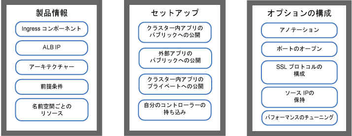
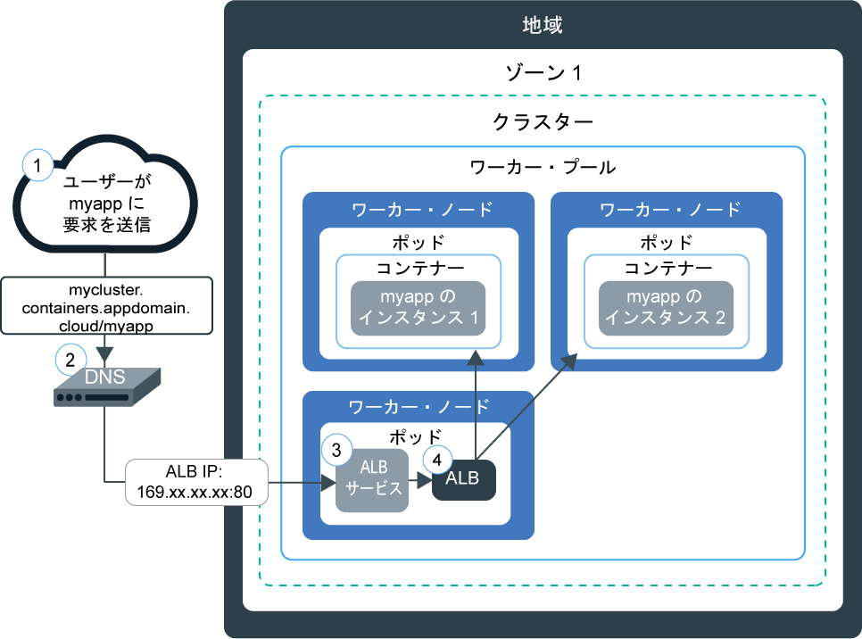
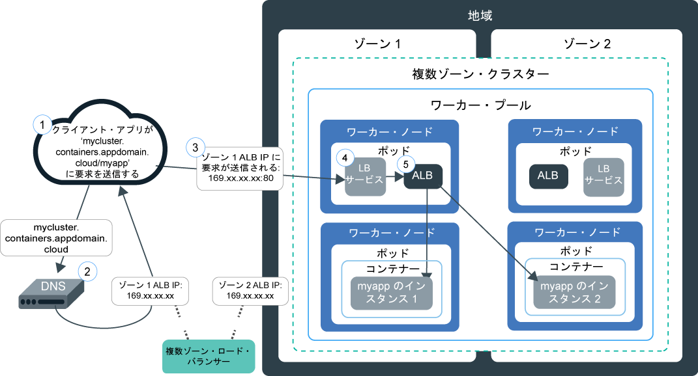
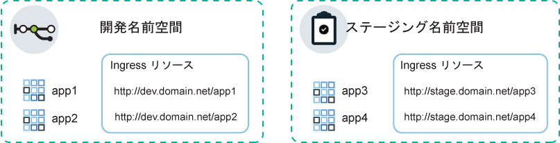
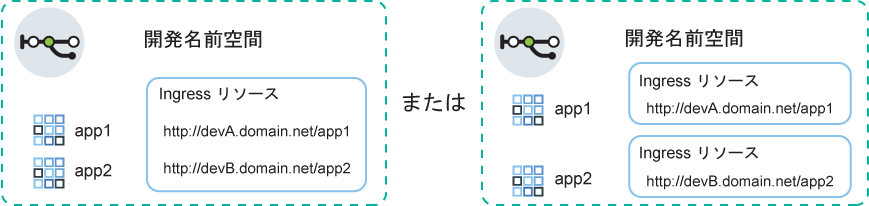

---

copyright:
  years: 2014, 2019
lastupdated: "2019-06-12"

keywords: kubernetes, iks, nginx, ingress controller

subcollection: containers

---

{:new_window: target="_blank"}
{:shortdesc: .shortdesc}
{:screen: .screen}
{:pre: .pre}
{:table: .aria-labeledby="caption"}
{:codeblock: .codeblock}
{:tip: .tip}
{:note: .note}
{:important: .important}
{:deprecated: .deprecated}
{:download: .download}
{:preview: .preview}


# Ingress アプリケーション・ロード・バランサー (ALB) を使用した HTTPS ロード・バランシング
{: #ingress}

{{site.data.keyword.containerlong}} で、IBM 提供のアプリケーション・ロード・バランサーで管理される Ingress リソースを作成して、Kubernetes クラスター内の複数のアプリを公開します。
{:shortdesc}



<map name="image-map">
    <area target="" alt="Ingress の構成要素" title="Ingress の構成要素" href="#ingress_components" coords="28,42,172,69" shape="rect">
    <area target="" alt="ALB の IP" title="ALB の IP" href="#ips" coords="27,79,171,104" shape="rect">
    <area target="" alt="アーキテクチャー" title="アーキテクチャー" href="#architecture-single" coords="31,114,171,140" shape="rect">
    <area target="" alt="前提条件" title="前提条件" href="#config_prereqs" coords="28,151,171,176" shape="rect">
    <area target="" alt="1 つの名前空間を使用する場合と複数の名前空間を使用する場合のネットワーキングの計画" title="1 つの名前空間を使用する場合と複数の名前空間を使用する場合のネットワーキングの計画" href="#multiple_namespaces" coords="31,191,172,229" shape="rect">
    <area target="" alt="クラスター内のアプリをパブリックに公開する" title="クラスター内のアプリをパブリックに公開する" href="#ingress_expose_public" coords="275,43,418,78" shape="rect">
    <area target="" alt="クラスター外のアプリをパブリックに公開する" title="クラスター外のアプリをパブリックに公開する" href="#external_endpoint" coords="275,94,419,128" shape="rect">
    <area target="" alt="プライベート・ネットワークにアプリを公開する" title="プライベート・ネットワークにアプリを公開する" href="#ingress_expose_private" coords="277,141,418,177" shape="rect">
    <area target="" alt="自分の Ingress コントローラーを持ち込む" title="自分の Ingress コントローラーを持ち込む" href="#user_managed" coords="278,192,416,228" shape="rect">
    <area target="" alt="アノテーションを使用した Ingress リソースのカスタマイズ" title="アノテーションを使用した Ingress リソースのカスタマイズ" href="#annotations" coords="523,44,670,73" shape="rect">
    <area target="" alt="Ingress ALB でポートを開く" title="Ingress ALB でポートを開く" href="#opening_ingress_ports" coords="521,83,669,105" shape="rect">
    <area target="" alt="HTTP レベルで SSL プロトコルと SSL 暗号を構成する" title="HTTP レベルで SSL プロトコルと SSL 暗号を構成する" href="#ssl_protocols_ciphers" coords="523,116,669,158" shape="rect">
    <area target="" alt="ソース IP アドレスの保持" title="ソース IP アドレスの保持" href="#preserve_source_ip" coords="522,167,671,202" shape="rect">
    <area target="" alt="ALB のパフォーマンスの調整" title="ALB のパフォーマンスの調整" href="#perf_tuning" coords="524,213,669,237" shape="rect">
</map>

## サンプル YAML
{: #sample_ingress}

素早く Ingress リソースの指定を始めるには、以下のサンプル YAML ファイルを使用してください。
{: shortdesc}

**アプリをパブリックに公開するための Ingress リソース**</br>

以下の作業は完了しましたか?
- アプリのデプロイ
- アプリ・サービスの作成
- ドメイン名と TLS シークレットの選択

以下のデプロイメント YAML を使用して Ingress リソースを作成できます。

```
apiVersion: extensions/v1beta1
kind: Ingress
metadata:
  name: myingressresource
spec:
  tls:
  - hosts:
    - <domain>
    secretName: <tls_secret_name>
  rules:
  - host: <domain>
    http:
      paths:
      - path: /<app1_path>
        backend:
          serviceName: <app1_service>
          servicePort: 80
      - path: /<app2_path>
        backend:
          serviceName: <app2_service>
          servicePort: 80
```
{: codeblock}

</br>

**アプリをプライベートに公開するための Ingress リソース**</br>

以下の作業は完了しましたか?
- プライベート ALB の有効化
- アプリのデプロイ
- アプリ・サービスの作成
- カスタム・ドメイン名と TLS シークレットの登録

以下のデプロイメント YAML を使用して Ingress リソースを作成できます。

```
apiVersion: extensions/v1beta1
kind: Ingress
metadata:
  name: myingressresource
  annotations:
    ingress.bluemix.net/ALB-ID: "<private_ALB_ID_1>;<private_ALB_ID_2>"
spec:
  tls:
  - hosts:
    - <domain>
    secretName: <tls_secret_name>
  rules:
  - host: <domain>
    http:
      paths:
      - path: /<app1_path>
        backend:
          serviceName: <app1_service>
          servicePort: 80
      - path: /<app2_path>
        backend:
          serviceName: <app2_service>
          servicePort: 80
```
{: codeblock}

<br />


## Ingress とは
{: #planning}

Ingress は、パブリック要求またはプライベート要求をアプリに転送して、クラスター内のネットワーク・トラフィック・ワークロードを負荷分散させる Kubernetes サービスです。 Ingress を利用すると、固有のパブリック経路またはプライベート経路を使用して複数のアプリ・サービスをパブリック・ネットワークまたはプライベート・ネットワークに公開できます。
{:shortdesc}

### Ingress に含まれるもの
{: #ingress_components}

Ingress は、以下の 3 つのコンポーネントで構成されています。
<dl>
<dt>Ingress リソース</dt>
<dd>Ingress を使用してアプリを公開するには、アプリ用に Kubernetes サービスを作成し、Ingress リソースを定義してそのサービスを Ingress に登録する必要があります。 Ingress リソースは、アプリに対する着信要求を転送する方法についてのルールを定義する Kubernetes リソースです。 また、Ingress リソースによってアプリ・サービスへのパスも指定します。このパスがパブリック経路に付加されて、アプリの固有 URL が形成されます。例えば、`mycluster.us-south.containers.appdomain.cloud/myapp1` のようになります。<p class="note">2018 年 5 月 24 日に、新しいクラスターの Ingress サブドメイン形式が変更されました。 新しいサブドメイン形式に含まれる地域名またはゾーン名は、クラスターが作成されたゾーンに基づいて生成されます。 一貫したアプリのドメイン名にパイプラインが依存している場合は、IBM 提供の Ingress サブドメインの代わりに独自のカスタム・ドメインを使用できます。<ul><li>2018 年 5 月 24 日以降に作成されたすべてのクラスターには、新しい形式 <code>&lt;cluster_name&gt;.&lt;region_or_zone&gt;.containers.appdomain.cloud</code> のサブドメインが割り当てられます。</li><li>2018 年 5 月 24 日より前に作成された単一ゾーン・クラスターは、古い形式 <code>&lt;cluster_name&gt;.&lt;region&gt;.containers.mybluemix.net</code> で割り当てられたサブドメインを引き続き使用します。</li><li>初めて[ゾーンをクラスターに追加](/docs/containers?topic=containers-add_workers#add_zone)して、2018 年 5 月 24 日より前に作成された単一ゾーン・クラスターを複数ゾーンに変更した場合も、古い形式 <code>&lt;cluster_name&gt;.&lt;region&gt;.containers.mybluemix.net</code> で割り当てられたサブドメインが使用されますが、新しい形式 <code>&lt;cluster_name&gt;.&lt;region_or_zone&gt;.containers.appdomain.cloud</code> のサブドメインも割り当てられます。 どちらのサブドメインも使用できます。</li></ul></p>**複数ゾーン・クラスター**: Ingress リソースはグローバルであるため、複数ゾーン・クラスターでは名前空間ごとに 1 つだけ必要になります。</dd>
<dt>アプリケーション・ロード・バランサー (ALB)</dt>
<dd>アプリケーション・ロード・バランサー (ALB) は、着信 HTTP、HTTPS、または TCP サービス要求を listen する外部ロード・バランサーです。 そして、ALB は Ingress リソースで定義されたルールに従って、要求を適切なアプリ・ポッドに転送します。 標準クラスターを作成すると、{{site.data.keyword.containerlong_notm}} がそのクラスター用に可用性の高い ALB を自動で作成し、固有のパブリック経路を割り当てます。 パブリック経路は、クラスター作成時にお客様の IBM Cloud インフラストラクチャー (SoftLayer) アカウントにプロビジョンされたポータブル・パブリック IP アドレスにリンクされます。 デフォルトのプライベート ALB も自動的に作成されますが、自動的に有効になるわけではありません。<br></br>**複数ゾーン・クラスター**: ゾーンをクラスターに追加すると、ポータブル・パブリック・サブネットが追加され、新しいパブリック ALB が自動的に作成されて、そのゾーンのサブネットで有効にされます。 クラスター内のデフォルトのすべてのパブリック ALB は 1 つのパブリック経路を共有しますが、異なる IP アドレスを持っています。 各ゾーンにデフォルトのプライベート ALB も自動的に作成されますが、自動的に有効になるわけではありません。</dd>
<dt>複数ゾーン・ロード・バランサー (MZLB)</dt>
<dd><p>**複数ゾーン・クラスター**: 複数ゾーン・クラスターの作成、または[単一ゾーン・クラスターへのゾーンの追加](/docs/containers?topic=containers-add_workers#add_zone)を行うと、必ず、Cloudflare 複数ゾーン・ロード・バランサー (MZLB) が自動的に作成され、地域ごとに 1 つの MZLB が存在するようにデプロイされます。 MZLB は、ALB の IP アドレスを同じサブドメインの背後に配置し、これらの IP アドレスが使用可能かどうかを判別するためにこれらのアドレスに対してヘルス・チェックを有効にします。 例えば、米国東部地域の 3 つのゾーンにワーカー・ノードがある場合、サブドメイン `yourcluster.us-east.containers.appdomain.cloud` には 3 つの ALB IP アドレスがあります。 MZLB は、地域の各ゾーンのパブリック ALB IP をヘルス・チェックし、そのヘルス・チェックに基づいて DNS 参照の結果を最新の状態に保ちます。 例えば、ALB の IP アドレスが `1.1.1.1`、`2.2.2.2`、`3.3.3.3` である場合、Ingress サブドメインの DNS 参照の通常の動作では、3 つの IP がすべて返され、クライアントはそのうちの 1 つにランダムにアクセスします。 IP アドレスが `3.3.3.3` の ALB がゾーンの障害などの理由で使用不可になると、そのゾーンのヘルス・チェックが失敗し、MZLB は障害のある IP をサブドメインから削除し、DNS 参照では正常な `1.1.1.1` および `2.2.2.2` の ALB IP のみが返されます。 サブドメインの存続時間 (TTL) は 30 秒であるため、30 秒後に新しいクライアント・アプリは使用可能で正常な ALB IP の 1 つにのみアクセスできます。</p><p>まれに、一部の DNS リゾルバーまたはクライアント・アプリが、30 秒の TTL の後に、正常でない ALB IP を使用し続けることがあります。 これらのクライアント・アプリは、クライアント・アプリが `3.3.3.3` IP を破棄して `1.1.1.1` または `2.2.2.2` への接続を試みるまで、ロード時間が長くなる可能性があります。 クライアント・ブラウザーまたはクライアント・アプリの設定によっては、遅延が数秒からフル TCP タイムアウトの範囲になることがあります。</p>
<p>MZLB は、IBM 提供の Ingress サブドメインのみを使用するパブリック ALB に対してロード・バランシングを行います。 プライベート ALB のみを使用する場合、ALB のヘルスを手動で検査し、DNS 参照の結果を更新する必要があります。 カスタム・ドメインを使用するパブリック ALB を使用する場合は、DNS エントリーに CNAME を作成して、カスタム・ドメインからクラスターの IBM 提供の Ingress サブドメインに要求を転送することで、MZLB ロード・バランシングにパブリック ALB を含めることができます。</p>
<p class="note">Calico preDNAT ネットワーク・ポリシーを使用して Ingress サービスへのすべての着信トラフィックをブロックする場合は、ALB のヘルス・チェックに使用される <a href="https://www.cloudflare.com/ips/">Cloudflare の IPv4 IP</a> をホワイトリストに登録する必要があります。 Calico preDNAT ポリシーを作成してこれらの IP をホワイトリストに登録する手順については、<a href="/docs/containers?topic=containers-policy_tutorial#lesson3">Calico ネットワーク・ポリシー・チュートリアル</a>のレッスン 3 を参照してください。</p></dd>
</dl>

### IP が Ingress ALB に割り当てられる仕組み
{: #ips}

標準クラスターを作成すると、{{site.data.keyword.containerlong_notm}} は、ポータブル・パブリック・サブネットとポータブル・プライベート・サブネットを自動的にプロビジョンします。 デフォルトでは、クラスターは以下のアドレスを自動的に使用します。
* デフォルトのパブリック Ingress ALB のポータブル・パブリック・サブネット範囲のポータブル・パブリック IP アドレス 1 つ。
* デフォルトのプライベート Ingress ALB のポータブル・プライベート・サブネット範囲のポータブル・プライベート IP アドレス 1 つ。
{: shortdesc}

複数ゾーン・クラスターでは、各ゾーンにデフォルトのパブリック ALB とデフォルトのプライベート ALB が自動的に作成されます。 デフォルトのパブリック ALB の IP アドレスはすべて、クラスター用に IBM から提供された同じサブドメインの背後にあります。

ポータブル・パブリック IP アドレスとポータブル・プライベート IP アドレスは静的浮動 IP であり、ワーカー・ノードが削除されても変わりません。 ワーカー・ノードが削除されると、IP を常にモニターしている `Keepalived` デーモンが、そのワーカーに存在していた ALB ポッドのスケジュールを、そのゾーンの別のワーカー・ノードに自動的に変更します。 スケジュールが変更された ALB ポッドは、同じ静的 IP アドレスをそのまま保持します。 クラスターの存在期間中は、各ゾーンの ALB の IP アドレスは変わりません。 クラスターからゾーンを削除すると、そのゾーンの ALB の IP アドレスは削除されます。

ALB に割り当てられている IP を確認するには、以下のコマンドを実行します。
```
ibmcloud ks albs --cluster <cluster_name_or_id>
```
{: pre}

ゾーンで障害が発生した場合の ALB の IP の動作について詳しくは、[複数ゾーン・ロード・バランサー・コンポーネント](#ingress_components)の定義を参照してください。


### 単一ゾーン・クラスターで Ingress を使用して要求をアプリに届ける方法
{: #architecture-single}


次の図は、Ingress がインターネットから単一ゾーン・クラスター内のアプリへの通信をどのように誘導するかを示しています。



1. ユーザーがアプリの URL にアクセスしてアプリに要求を送信します。 この URL は、Ingress リソース・パスが付加された公開アプリのパブリック URL です (例: `mycluster.us-south.containers.appdomain.cloud/myapp`)。

2. DNS システム・サービスが、URL のサブドメインを、クラスター内の ALB を公開しているロード・バランサーのポータブル・パブリック IP アドレスに解決します。

3. 解決された IP アドレスに基づいて、クライアントが、ALB を公開しているロード・バランサー・サービスに要求を送信します。

4. ロード・バランサー・サービスが、要求を ALB にルーティングします。

5. ALB は、クラスター内の `myapp` パスのルーティング・ルールが存在するかどうかを検査します。 一致するルールが見つかった場合、要求は、Ingress リソースで定義したルールに従って、アプリがデプロイされているポッドに転送されます。 パッケージのソース IP アドレスは、アプリ・ポッドが実行されているワーカー・ノードのパブリック IP アドレスに変更されます。 複数のアプリ・インスタンスがクラスターにデプロイされている場合、ALB は、アプリ・ポッド間で要求のロード・バランシングを行います。

### 複数ゾーン・クラスターで Ingress を使用して要求をアプリに届ける方法
{: #architecture-multi}

次の図は、Ingress がインターネットから複数ゾーン・クラスター内のアプリへの通信をどのように誘導するかを示しています。



1. ユーザーがアプリの URL にアクセスしてアプリに要求を送信します。 この URL は、Ingress リソース・パスが付加された公開アプリのパブリック URL です (例: `mycluster.us-south.containers.appdomain.cloud/myapp`)。

2. グローバル・ロード・バランサーとして動作する DNS システム・サービスが、URL のサブドメインを、MZLB から正常なものとして報告された使用可能な IP アドレスに解決します。 MZLB は、クラスター内の各ゾーンでパブリック ALB を公開しているロード・バランサー・サービスのポータブル・パブリック IP アドレスを継続的に確認します。 IP アドレスはラウンドロビン・サイクルで解決されます。これにより、さまざまなゾーンの正常な ALB の間で、要求が等しくロード・バランシングされます。

3. クライアントが、ALB を公開しているロード・バランサー・サービスの IP アドレスに要求を送信します。

4. ロード・バランサー・サービスが、要求を ALB にルーティングします。

5. ALB は、クラスター内の `myapp` パスのルーティング・ルールが存在するかどうかを検査します。 一致するルールが見つかった場合、要求は、Ingress リソースで定義したルールに従って、アプリがデプロイされているポッドに転送されます。 パッケージのソース IP アドレスは、アプリ・ポッドが実行されているワーカー・ノードのパブリック IP アドレスに変更されます。 複数のアプリ・インスタンスがクラスターにデプロイされている場合、ALB はすべてのゾーンのアプリ・ポッド間で要求のロード・バランシングを行います。

<br />


## 前提条件
{: #config_prereqs}

Ingress の使用を開始する前に、以下の前提条件を確認してください。
{:shortdesc}

**すべての Ingress 構成の前提条件:**
- Ingress は標準クラスターでのみ使用可能です。高可用性を確保して定期的に更新を適用するために、ゾーンごとにワーカー・ノードが 2 つ以上必要です。 1 つのゾーンにワーカーが 1 つしか存在しない場合は、ALB が自動更新を受け取れません。 自動更新が ALB ポッドにロールアウトされると、そのポッドは再ロードされます。 しかし、高可用性のために、ALB には各ワーカー・ノードに 1 つしかポッドをスケジュールしないようにするアンチアフィニティー・ルールが設定されます。 1 つのワーカーには ALB ポッドが 1 つしか存在しないので、トラフィックが中断されないようにするために、そのポッドは再始動されません。 ALB ポッドが最新バージョンに更新されるのは、古いポッドを手動で削除することによって、新しい更新後のポッドがスケジュール可能になった場合のみです。
- Ingress をセットアップするには、以下の [{{site.data.keyword.Bluemix_notm}} IAM 役割](/docs/containers?topic=containers-users#platform)が必要です。
    - クラスターに対する**管理者**のプラットフォーム役割
    - すべての名前空間に対する**管理者**のサービス役割

**複数ゾーン・クラスターで Ingress を使用するための前提条件**:
 - ネットワーク・トラフィックを[エッジ・ワーカー・ノード](/docs/containers?topic=containers-edge)に制限する場合、Ingress ポッドの高可用性を確保するために、少なくとも 2 つのエッジ・ワーカー・ノードを各ゾーンで有効にする必要があります。 クラスター内のすべてのゾーンにまたがり、ゾーンごとにワーカー・ノードを 2 つ以上持つ[エッジ・ワーカー・ノード・プールを作成します](/docs/containers?topic=containers-add_workers#add_pool)。
 - 1 つのクラスターに複数の VLAN がある場合、同じ VLAN 上に複数のサブネットがある場合、または複数ゾーン・クラスターがある場合は、IBM Cloud インフラストラクチャー (SoftLayer) アカウントに対して[仮想ルーター機能 (VRF)](/docs/infrastructure/direct-link?topic=direct-link-overview-of-virtual-routing-and-forwarding-vrf-on-ibm-cloud#overview-of-virtual-routing-and-forwarding-vrf-on-ibm-cloud) を有効にして、ワーカー・ノードがプライベート・ネットワーク上で相互に通信できるようにする必要があります。 VRF を有効にするには、[IBM Cloud インフラストラクチャー (SoftLayer) のアカウント担当者に連絡してください](/docs/infrastructure/direct-link?topic=direct-link-overview-of-virtual-routing-and-forwarding-vrf-on-ibm-cloud#how-you-can-initiate-the-conversion)。 VRF の有効化が不可能または不要な場合は、[VLAN スパンニング](/docs/infrastructure/vlans?topic=vlans-vlan-spanning#vlan-spanning)を有効にしてください。 この操作を実行するには、**「ネットワーク」>「ネットワーク VLAN スパンニングの管理」**で設定する[インフラストラクチャー権限](/docs/containers?topic=containers-users#infra_access)が必要です。ない場合は、アカウント所有者に対応を依頼してください。 VLAN スパンニングが既に有効になっているかどうかを確認するには、`ibmcloud ks vlan-spanning-get<region>` [コマンド](/docs/containers?topic=containers-cli-plugin-kubernetes-service-cli#cs_vlan_spanning_get)を使用します。
 - ゾーンで障害が発生した場合、そのゾーンの Ingress ALB への要求で断続的に障害が発生する可能性があります。

<br />


## 1 つの名前空間を使用する場合と複数の名前空間を使用する場合のネットワーキングの計画
{: #multiple_namespaces}

公開するアプリを入れる名前空間ごとに 1 つの Ingress リソースが必要です。
{:shortdesc}

### 1 つの名前空間にすべてのアプリを入れる場合
{: #one-ns}

クラスター内のすべてのアプリを同じ名前空間に入れる場合は、そこで公開するアプリのルーティング・ルールを定義するために 1 つの Ingress リソースが必要になります。 例えば、開発用の名前空間にあるサービスで `app1` と `app2` を公開する場合は、その名前空間で 1 つの Ingress リソースを作成できます。 そのリソースで、`domain.net` をホストとして指定し、各アプリが `domain.net` で listen するパスを登録します。
{: shortdesc}


### 複数の名前空間にアプリを入れる場合
{: #multi-ns}

クラスター内のアプリを別々の名前空間に入れる場合は、そこで公開するアプリのルールを定義するために、名前空間ごとに 1 つのリソースを作成する必要があります。
{: shortdesc}

ただし、1 つのホスト名を定義できるのは 1 つのリソースだけです。 複数のリソースで同じホスト名を定義することはできません。 複数の Ingress リソースを同じホスト名で登録する場合は、ワイルドカード・ドメインを使用する必要があります。 ワイルドカード・ドメイン (`*.domain.net` など) を登録すると、複数のサブドメインがすべて同じホストに解決されます。 そうすれば、各名前空間で Ingress リソースを作成し、各 Ingress リソースで別々のサブドメインを指定できます。

例えば、以下のシナリオがあるとします。
* テスト用の同じアプリに `app1` と `app3` という 2 つのバージョンがあります。
* それらのアプリを同じクラスター内の 2 つの別々の名前空間にデプロイします (`app1` を開発用名前空間に、`app3` をステージング用名前空間にデプロイします)。

同じクラスター ALB を使用してそれらのアプリへのトラフィックを管理するには、以下のサービスとリソースを作成します。
* `app1` を公開する開発用名前空間の Kubernetes サービス。
* ホストを `dev.domain.net` として指定する、開発用名前空間内の Ingress リソース。
* `app3` を公開するステージング用名前空間の Kubernetes サービス。
* ホストを `stage.domain.net` として指定する、ステージング用名前空間内の Ingress リソース。
</br>



これで、両方の URL が同じドメインに解決され、同じ ALB のサービスを受けるようになります。 しかし、ステージング用名前空間のリソースは `stage` サブドメインに登録されるので、Ingress ALB は、`stage.domain.net/app3` URL からの要求を `app3` だけに正しくルーティングします。

{: #wildcard_tls}
デフォルトでは、クラスターに対し、IBM 提供の Ingress サブドメイン・ワイルドカード `*.<cluster_name>.<region>.containers.appdomain.cloud` が登録されます。 IBM 提供の TLS 証明書はワイルドカード証明書ですので、ワイルドカード・サブドメインに使用できます。 カスタム・ドメインを使用する場合は、カスタム・ドメインを `*.custom_domain.net` などのワイルドカード・ドメインとして登録する必要があります。 TLS を使用するには、ワイルドカード証明書を取得する必要があります。
{: note}

### 1 つの名前空間の中で複数のドメインを使用する場合
{: #multi-domains}

それぞれの名前空間では、1 つのドメインを使用して、その名前空間内のすべてのアプリにアクセスできます。 1 つの名前空間の中でアプリのために複数のドメインを使用する場合は、ワイルドカード・ドメインを使用します。 ワイルドカード・ドメイン (`*.mycluster.us-south.containers.appdomain.cloud` など) を登録すると、すべてのサブドメインが同じホストに解決されます。 そうすれば、1 つのリソースを使用し、そのリソースの中で複数のサブドメイン・ホストを指定することができます。 あるいは別の方法として、その名前空間で複数の Ingress リソースを作成し、各 Ingress リソースで別々のサブドメインを指定することも可能です。
{: shortdesc}



デフォルトでは、クラスターに対し、IBM 提供の Ingress サブドメイン・ワイルドカード `*.<cluster_name>.<region>.containers.appdomain.cloud` が登録されます。 IBM 提供の TLS 証明書はワイルドカード証明書ですので、ワイルドカード・サブドメインに使用できます。 カスタム・ドメインを使用する場合は、カスタム・ドメインを `*.custom_domain.net` などのワイルドカード・ドメインとして登録する必要があります。 TLS を使用するには、ワイルドカード証明書を取得する必要があります。
{: note}

<br />


## クラスター内のアプリをパブリックに公開する
{: #ingress_expose_public}

パブリック Ingress ALB を使用して、クラスター内のアプリをパブリックに公開します。
{:shortdesc}

開始前に、以下のことを行います。

* Ingress の[前提条件](#config_prereqs)を確認します。
* [アカウントにログインします。 該当する場合は、適切なリソース・グループをターゲットにします。 クラスターのコンテキストを設定します。](/docs/containers?topic=containers-cs_cli_install#cs_cli_configure)

### ステップ 1: アプリをデプロイしてアプリ・サービスを作成する
{: #public_inside_1}

まず、アプリをデプロイし、それらを公開するための Kubernetes サービスを作成します。
{: shortdesc}

1.  [アプリをクラスターにデプロイします](/docs/containers?topic=containers-app#app_cli)。 構成ファイルの metadata セクションで、デプロイメントにラベルを追加しておく必要があります (例えば、`app: code`)。 このラベルは、アプリが実行されるすべてのポッドを識別して、それらのポットが Ingress ロード・バランシングに含められるようにするために必要です。

2.   公開するアプリごとに Kubernetes サービスを作成します。 アプリをクラスター ALB の Ingress ロード・バランシングに含めるには、Kubernetes サービスを介してアプリを公開する必要があります。
      1.  任意のエディターを開き、`myappservice.yaml` などの名前のサービス構成ファイルを作成します。
      2.  ALB で公開するアプリのサービスを定義します。

          ```
          apiVersion: v1
          kind: Service
          metadata:
            name: myappservice
          spec:
            selector:
              <selector_key>: <selector_value>
            ports:
             - protocol: TCP
         port: 8080
          ```
          {: codeblock}

          <table>
          <thead>
          <th colspan=2> ALB サービス YAML ファイルの構成要素について</th>
          </thead>
          <tbody>
          <tr>
          <td><code>selector</code></td>
          <td>アプリが実行されるポッドをターゲットにするために使用する、ラベル・キー (<em>&lt;selector_key&gt;</em>) と値 (<em>&lt;selector_value&gt;</em>) のペアを入力します。 ポッドをターゲットにして、それらをサービスのロード・バランシングに組み込む場合は、<em>&lt;selector_key&gt;</em> と <em>&lt;selector_value&gt;</em> を、デプロイメント YAML の <code>spec.template.metadata.labels</code> セクションにあるキー/値のペアと同じになるようにしてください。</td>
           </tr>
           <tr>
           <td><code>port</code></td>
           <td>サービスが listen するポート。</td>
           </tr>
           </tbody></table>
      3.  変更を保存します。
      4.  クラスター内にサービスを作成します。 クラスター内の複数の名前空間にアプリをデプロイする場合は、公開するアプリと同じ名前空間にサービスをデプロイするようにしてください。

          ```
          kubectl apply -f myappservice.yaml [-n <namespace>]
          ```
          {: pre}
      5.  公開するアプリごとに、上記のステップを繰り返します。


### ステップ 2: アプリ・ドメインを選択する
{: #public_inside_2}

パブリック ALB を構成する場合は、アプリにアクセスするためのドメインを選択します。
{: shortdesc}

IBM 提供のドメイン (`mycluster-12345.us-south.containers.appdomain.cloud/myapp` など) を使用して、インターネットからアプリにアクセスできます。 代わりにカスタム・ドメインを使用するには、カスタム・ドメインを IBM 提供のドメインにマップする CNAME レコードをセットアップするか、または ALB のパブリック IP アドレスを使用して DNS プロバイダーに A レコードをセットアップします。

**IBM 提供の Ingress ドメインを使用する場合:**

IBM 提供のドメインを取得します。 `<cluster_name_or_ID>` を、アプリがデプロイされているクラスターの名前に置き換えます。
```
ibmcloud ks cluster-get --cluster <cluster_name_or_ID> | grep Ingress
```
{: pre}

出力例:
```
Ingress Subdomain:      mycluster-12345.us-south.containers.appdomain.cloud
    Ingress Secret:         <tls_secret>
```
{: screen}

**カスタム・ドメインを使用する場合:**
1.    カスタム・ドメインを作成します。 カスタム・ドメインを登録する時には、Domain Name Service (DNS) プロバイダーまたは [{{site.data.keyword.Bluemix_notm}} DNS](/docs/infrastructure/dns?topic=dns-getting-started) を使用してください。
      * Ingress で公開するアプリが 1 つのクラスター内の別々の名前空間にある場合は、カスタム・ドメインをワイルドカード・ドメイン (`*.custom_domain.net` など) として登録します。

2.  着信ネットワーク・トラフィックを IBM 提供の ALB にルーティングするようにドメインを構成します。 以下の選択肢があります。
    -   IBM 提供ドメインを正規名レコード (CNAME) として指定することで、カスタム・ドメインの別名を定義します。 IBM 提供の Ingress ドメインを確認するには、`ibmcloud ks cluster-get --cluster <cluster_name>` を実行し、**「Ingress サブドメイン (Ingress subdomain)」**フィールドを見つけます。 IBM では IBM サブドメインに対する自動ヘルス・チェックを提供しており、障害のある IP がすべて DNS 応答から削除されるため、CNAME の使用をお勧めします。
    -   カスタム・ドメインを IBM 提供の ALB のポータブル・パブリック IP アドレスにマップします。これは、IP アドレスをレコードとして追加して行います。 ALB のポータブル・パブリック IP アドレスを見つけるには、`ibmcloud ks alb-get --albID<public_alb_ID>` を実行します。

### ステップ 3: TLS 終端を選択する
{: #public_inside_3}

アプリ・ドメインを選択した後に、TLS 終端を使用するかどうかを選択します。
{: shortdesc}

ALB は、HTTP ネットワーク・トラフィックをクラスター内のアプリに振り分けてロード・バランシングを行います。 着信 HTTPS 接続のロード・バランシングも行う場合は ALB でその機能を構成できます。つまり、ネットワーク・トラフィックを復号し、復号した要求をクラスター内で公開されているアプリに転送するように構成します。

* IBM 提供の Ingress サブドメインを使用する場合は、IBM 提供の TLS 証明書を使用できます。 IBM 提供の TLS 証明書は、LetsEncrypt によって署名され、IBM によって完全に管理されます。 証明書の有効期間は 90 日で、有効期限が切れる 37 日前に自動的に更新されます。 ワイルドカードの TLS 証明書については、[この注記](#wildcard_tls)を参照してください。
* カスタム・ドメインを使用する場合は、独自の TLS 証明書を使用して TLS 終端を管理できます。 ALB はまず、アプリが入っている名前空間にシークレットがあるかどうかをチェックし、次に `default`、最後に `ibm-cert-store` をチェックします。 1 つの名前空間にのみアプリがある場合は、その同じ名前空間に、証明書に対する TLS シークレットをインポートまたは作成できます。 複数の名前空間にアプリがある場合は、どの名前空間でも ALB が証明書にアクセスして使用できるように、`default` 名前空間の証明書に対して TLS シークレットをインポートまたは作成します。 名前空間ごとに定義する Ingress リソースに、デフォルトの名前空間にあるシークレットの名前を指定してください。 ワイルドカードの TLS 証明書については、[この注記](#wildcard_tls)を参照してください。 **注**: 事前共有鍵 (TLS-PSK) を含む TLS 証明書はサポートされていません。

**IBM 提供の Ingress ドメインを使用する場合:**

クラスター用に IBM 提供の TLS シークレットを取得します。
```
ibmcloud ks cluster-get --cluster <cluster_name_or_ID> | grep Ingress
```
{: pre}

出力例:
```
Ingress Subdomain:      mycluster-12345.us-south.containers.appdomain.cloud
    Ingress Secret:         <tls_secret>
```
{: screen}
</br>

**カスタム・ドメインを使用する場合:**

使用する TLS 証明書が {{site.data.keyword.cloudcerts_long_notm}} に保管されている場合は、それに関連付けられたシークレットを、以下のコマンドを実行してクラスター内にインポートできます。

```
ibmcloud ks alb-cert-deploy --secret-name <secret_name> --cluster <cluster_name_or_ID> --cert-crn <certificate_crn>
```
{: pre}

IBM 提供の Ingress シークレットと同じ名前のシークレットは作成しないでください。 IBM 提供の Ingress シークレットの名前を確認するには、`ibmcloud ks cluster-get --cluster <cluster_name_or_ID> | grep Ingress` を実行します。
{: note}

このコマンドを使用して証明書をインポートすると、`ibm-cert-store` という名前空間に証明書シークレットが作成されます。 それから、このシークレットへの参照が `default` 名前空間に作成されます。これには、どの名前空間内の、どの Ingress リソースでもアクセスできます。 ALB は、要求を処理するとき、この参照に従って `ibm-cert-store` 名前空間から証明書シークレットを選出して使用します。

</br>

TLS 証明書の準備ができていない場合は、以下の手順に従ってください。
1. 証明書プロバイダーから認証局 (CA) の証明書と鍵を生成します。 独自のドメインがある場合は、ご使用のドメインの正式な TLS 証明書を購入してください。 証明書ごとに異なる [CN ](https://support.dnsimple.com/articles/what-is-common-name/) を使用してください。
2. 証明書と鍵を base-64 に変換します。
   1. 証明書と鍵を base-64 にエンコードし、base-64 エンコード値を新しいファイルに保存します。
      ```
      openssl base64 -in tls.key -out tls.key.base64
      ```
      {: pre}

   2. 証明書と鍵の base-64 エンコード値を表示します。
      ```
      cat tls.key.base64
      ```
      {: pre}

3. 証明書と鍵を使用して、シークレット YAML ファイルを作成します。
     ```
     apiVersion: v1
     kind: Secret
     metadata:
       name: ssl-my-test
     type: Opaque
     data:
       tls.crt: <client_certificate>
       tls.key: <client_key>
     ```
     {: codeblock}

4. 証明書を Kubernetes シークレットとして作成します。
     ```
     kubectl create -f ssl-my-test
     ```
     {: pre}
     IBM 提供の Ingress シークレットと同じ名前のシークレットは作成しないでください。 IBM 提供の Ingress シークレットの名前を確認するには、`ibmcloud ks cluster-get --cluster <cluster_name_or_ID> | grep Ingress` を実行します。
     {: note}


### ステップ 4: Ingress リソースを作成する
{: #public_inside_4}

Ingress リソースは、ALB がトラフィックをアプリ・サービスにルーティングするために使用するルーティング・ルールを定義します。
{: shortdesc}

クラスター内の複数の名前空間でアプリを公開する場合は、名前空間ごとに 1 つの Ingress リソースが必要になります。 ただし、各名前空間で別々のホストを使用する必要があります。 ワイルドカード・ドメインを登録し、各リソースで別々のサブドメインを指定しなければなりません。 詳しくは、[1 つの名前空間を使用する場合と複数の名前空間を使用する場合のネットワーキングの計画](#multiple_namespaces)を参照してください。
{: note}

1. 任意のエディターを開き、`myingressresource.yaml` などの名前の Ingress 構成ファイルを作成します。

2. IBM 提供のドメインまたはカスタム・ドメインを使用して着信ネットワーク・トラフィックを作成済みサービスにルーティングする Ingress リソースを構成ファイル内に定義します。

    TLS を使用しない YAML の例:
    ```
    apiVersion: extensions/v1beta1
    kind: Ingress
    metadata:
      name: myingressresource
    spec:
      rules:
      - host: <domain>
        http:
          paths:
          - path: /<app1_path>
            backend:
              serviceName: <app1_service>
              servicePort: 80
          - path: /<app2_path>
            backend:
              serviceName: <app2_service>
              servicePort: 80
    ```
    {: codeblock}

    TLS を使用する YAML の例:
    ```
    apiVersion: extensions/v1beta1
    kind: Ingress
    metadata:
      name: myingressresource
    spec:
      tls:
      - hosts:
        - <domain>
        secretName: <tls_secret_name>
      rules:
      - host: <domain>
        http:
          paths:
          - path: /<app1_path>
            backend:
              serviceName: <app1_service>
              servicePort: 80
          - path: /<app2_path>
            backend:
              serviceName: <app2_service>
              servicePort: 80
    ```
    {: codeblock}

    <table>
    <thead>
    <th colspan=2> YAML ファイルの構成要素について</th>
    </thead>
    <tbody>
    <tr>
    <td><code>tls.hosts</code></td>
    <td>TLS を使用する場合は、<em>&lt;domain&gt;</em> を IBM 提供の Ingress サブドメインかカスタム・ドメインに置き換えます。

    </br></br>
    <strong>注:</strong><ul><li>1 つのクラスターの別々の名前空間にあるサービスによってアプリを公開する場合は、ドメインの先頭にワイルドカード・サブドメインを追加します (`subdomain1.custom_domain.net` や `subdomain1.mycluster.us-south.containers.appdomain.cloud` など)。 クラスター内に作成するリソースごとに固有のサブドメインを使用してください。</li><li>Ingress 作成時の失敗を回避するため、ホストに &ast; を使用したり、ホスト・プロパティーを空のままにしたりしないでください。</li></ul></td>
    </tr>
    <tr>
    <td><code>tls.secretName</code></td>
    <td><ul><li>IBM 提供の Ingress ドメインを使用する場合は、<em>&lt;tls_secret_name&gt;</em> を IBM 提供の Ingress シークレットの名前に置き換えます。</li><li>カスタム・ドメインを使用する場合は、<em>&lt;tls_secret_name&gt;</em> を、カスタム TLS 証明書と鍵を保持するために作成しておいたシークレットに置き換えます。 {{site.data.keyword.cloudcerts_short}} から証明書をインポートする場合、<code>ibmcloud ks alb-cert-get --cluster <cluster_name_or_ID> --cert-crn <certificate_crn></code> を実行して、TLS 証明書に関連付けられたシークレットを確認できます。</li><ul><td>
    </tr>
    <tr>
    <td><code>host</code></td>
    <td><em>&lt;domain&gt;</em> を IBM 提供の Ingress サブドメインかカスタム・ドメインに置き換えます。

    </br></br>
    <strong>注:</strong><ul><li>1 つのクラスターの別々の名前空間にあるサービスによってアプリを公開する場合は、ドメインの先頭にワイルドカード・サブドメインを追加します (`subdomain1.custom_domain.net` や `subdomain1.mycluster.us-south.containers.appdomain.cloud` など)。 クラスター内に作成するリソースごとに固有のサブドメインを使用してください。</li><li>Ingress 作成時の失敗を回避するため、ホストに &ast; を使用したり、ホスト・プロパティーを空のままにしたりしないでください。</li></ul></td>
    </tr>
    <tr>
    <td><code>path</code></td>
    <td><em>&lt;app_path&gt;</em> をスラッシュに置き換えるか、アプリが listen するパスに置き換えます。 IBM 提供のドメインまたはカスタム・ドメインにパスが追加され、アプリへの固有の経路が作成されます。 この経路を Web ブラウザーに入力すると、ネットワーク・トラフィックが ALB にルーティングされます。 ALB は、関連付けられたサービスを検索し、ネットワーク・トラフィックをそのサービスに送信します。 そして、サービスが、アプリを実行しているポッドにトラフィックを転送します。
    </br></br>
    多くのアプリは、特定のパスで listen するのではなく、ルート・パスと特定のポートを使用します。 この場合、ルート・パスを <code>/</code> として定義します。アプリ用の個別のパスは指定しないでください。 例: <ul><li><code>http://domain/</code> の場合、<code>/</code> をパスとして入力します。</li><li><code>http://domain/app1_path</code> の場合、<code>/app1_path</code> をパスとして入力します。</li></ul>
    </br>
    <strong>ヒント:</strong> アプリが listen するパスとは異なるパスを listen するように Ingress を構成する場合は、[再書き込みアノテーション](/docs/containers?topic=containers-ingress_annotation#rewrite-path)を使用できます。</td>
    </tr>
    <tr>
    <td><code>serviceName</code></td>
    <td><em>&lt;app1_service&gt;</em> や <em>&lt;app2_service&gt;</em> などを、アプリを公開するために作成しておいたサービスの名前に置き換えます。 クラスターの別々の名前空間にあるサービスによってアプリを公開する場合は、同じ名前空間にあるアプリ・サービスだけを組み込んでください。 公開するアプリを入れる名前空間ごとに 1 つの Ingress リソースを作成する必要があります。</td>
    </tr>
    <tr>
    <td><code>servicePort</code></td>
    <td>サービスが listen するポート。 アプリ用に Kubernetes サービスを作成したときに定義したものと同じポートを使用します。</td>
    </tr>
    </tbody></table>

3.  クラスターの Ingress リソースを作成します。 リソースで指定したアプリ・サービスと同じ名前空間にリソースがデプロイされていることを確認します。

    ```
    kubectl apply -f myingressresource.yaml -n <namespace>
    ```
    {: pre}
4.   Ingress リソースが正常に作成されたことを確認します。

      ```
      kubectl describe ingress myingressresource
      ```
      {: pre}

      1. イベント内のメッセージにリソース構成のエラーが示された場合は、リソース・ファイル内の値を変更して、リソースのファイルを再適用してください。


Ingress リソースがアプリ・サービスと同じ名前空間に作成されます。 その名前空間内のアプリがクラスターの Ingress ALB に登録されます。

### ステップ 5: インターネットからアプリにアクセスする
{: #public_inside_5}

Web ブラウザーに、アクセスするアプリ・サービスの URL を入力します。
{: shortdesc}

```
https://<domain>/<app1_path>
```
{: codeblock}

複数のアプリを公開した場合は、URL に追加するパスを変更して、それぞれのアプリにアクセスしてください。

```
https://<domain>/<app2_path>
```
{: codeblock}

ワイルドカード・ドメインを使用して複数の名前空間のアプリを公開した場合は、それぞれのサブドメインを使用して各アプリにアクセスしてください。

```
http://<subdomain1>.<domain>/<app1_path>
```
{: codeblock}

```
http://<subdomain2>.<domain>/<app1_path>
```
{: codeblock}


Ingress を介したアプリへの接続に問題が発生していますか? [Ingress のデバッグ](/docs/containers?topic=containers-cs_troubleshoot_debug_ingress)をお試しください。
{: tip}

<br />


## クラスター外のアプリをパブリックに公開する
{: #external_endpoint}

クラスター外にあるアプリをパブリック Ingress ALB のロード・バランシングに組み込んでパブリックに公開します。 IBM 提供のドメインまたはカスタム・ドメインに着信したパブリック要求が自動的にその外部アプリに転送されます。
{: shortdesc}

開始前に、以下のことを行います。

* Ingress の[前提条件](#config_prereqs)を確認します。
* クラスター・ロード・バランシングに含めようとしている外部アプリに、パブリック IP アドレスを使用してアクセスできることを確認します。
* [アカウントにログインします。 該当する場合は、適切なリソース・グループをターゲットにします。 クラスターのコンテキストを設定します。](/docs/containers?topic=containers-cs_cli_install#cs_cli_configure)

クラスター外のアプリをパブリックに公開するには、以下のようにします。

1.  作成する外部エンドポイントに着信要求を転送する Kubernetes サービスをクラスターに作成します。
    1.  任意のエディターを開き、`myexternalservice.yaml` などの名前のサービス構成ファイルを作成します。
    2.  ALB で公開するアプリのサービスを定義します。

        ```
        apiVersion: v1
        kind: Service
        metadata:
          name: myexternalservice
        spec:
          ports:
           - protocol: TCP
         port: 8080
        ```
        {: codeblock}

        <table>
        <caption>ALB サービス・ファイルの構成要素について</caption>
        <thead>
        <th colspan=2> YAML ファイルの構成要素について</th>
        </thead>
        <tbody>
        <tr>
        <td><code>metadata.name</code></td>
        <td><em><code>&lt;myexternalservice&gt;</code></em> をサービスの名前に置き換えます。<p>Kubernetes リソースを処理する際の[個人情報の保護](/docs/containers?topic=containers-security#pi)の詳細を確認してください。</p></td>
        </tr>
        <tr>
        <td><code>port</code></td>
        <td>サービスが listen するポート。</td>
        </tr></tbody></table>

    3.  変更を保存します。
    4.  クラスターの Kubernetes サービスを作成します。

        ```
        kubectl apply -f myexternalservice.yaml
        ```
        {: pre}
2.  クラスター・ロード・バランシングに含める外部のアプリの場所を定義する、Kubernetes エンドポイントを構成します。
    1.  任意のエディターを開き、`myexternalendpoint.yaml` などの名前のエンドポイント構成ファイルを作成します。
    2.  外部エンドポイントを定義します。 外部アプリにアクセスするために使用可能な、すべてのパブリック IP アドレスとポートを含めます。

        ```
        kind: Endpoints
        apiVersion: v1
        metadata:
          name: myexternalendpoint
        subsets:
          - addresses:
              - ip: <external_IP1>
              - ip: <external_IP2>
            ports:
              - port: <external_port>
        ```
        {: codeblock}

        <table>
        <thead>
        <th colspan=2> YAML ファイルの構成要素について</th>
        </thead>
        <tbody>
        <tr>
        <td><code>name</code></td>
        <td><em><code>&lt;myexternalendpoint&gt;</code></em> を、先ほど作成した Kubernetes サービスの名前に置き換えます。</td>
        </tr>
        <tr>
        <td><code>ip</code></td>
        <td><em>&lt;external_IP&gt;</em> を、外部アプリに接続するためのパブリック IP アドレスに置き換えます。</td>
         </tr>
         <td><code>port</code></td>
         <td><em>&lt;external_port&gt;</em> を、外部アプリが listen するポートに置き換えます。</td>
         </tbody></table>

    3.  変更を保存します。
    4.  クラスターの Kubernetes エンドポイントを作成します。

        ```
        kubectl apply -f myexternalendpoint.yaml
        ```
        {: pre}

3. 『クラスター内のアプリをパブリックに公開する』の手順の『[ステップ 2: アプリ・ドメインを選択する](#public_inside_2)』に進みます。

<br />


## プライベート・ネットワークにアプリを公開する
{: #ingress_expose_private}

プライベート Ingress ALB を使用して、アプリをプライベート・ネットワークに公開します。
{:shortdesc}

プライベート ALB を使用するには、まずプライベート ALB を有効にしなければなりません。 プライベート VLAN だけのクラスターには IBM 提供の Ingress サブドメインが割り当てられないので、クラスターのセットアップ時に Ingress シークレットが作成されません。 プライベート・ネットワークにアプリを公開するには、ALB をカスタム・サブドメインに登録する必要があります。その後、独自の TLS 証明書をインポートすることも可能です。

開始前に、以下のことを行います。
* Ingress の[前提条件](#config_prereqs)を確認します。
* ワーカー・ノードを[パブリック VLAN とプライベート VLAN](/docs/containers?topic=containers-cs_network_planning#private_both_vlans)、または[プライベート VLAN のみ](/docs/containers?topic=containers-cs_network_planning#plan_private_vlan)に接続した状況でアプリへのプライベート・アクセスを計画するためのオプションを確認します。
    * ワーカー・ノードがプライベート VLAN にのみ接続されている場合は、[プライベート・ネットワーク上で使用可能な DNS サービス ](https://kubernetes.io/docs/tasks/administer-cluster/dns-custom-nameservers/) を構成する必要があります。

### ステップ 1: アプリをデプロイしてアプリ・サービスを作成する
{: #private_1}

まず、アプリをデプロイし、それらを公開するための Kubernetes サービスを作成します。
{: shortdesc}

1.  [アプリをクラスターにデプロイします](/docs/containers?topic=containers-app#app_cli)。 構成ファイルの metadata セクションで、デプロイメントにラベルを追加しておく必要があります (例えば、`app: code`)。 このラベルは、アプリが実行されるすべてのポッドを識別して、それらのポットが Ingress ロード・バランシングに含められるようにするために必要です。

2.   公開するアプリごとに Kubernetes サービスを作成します。 アプリをクラスター ALB の Ingress ロード・バランシングに含めるには、Kubernetes サービスを介してアプリを公開する必要があります。
      1.  任意のエディターを開き、`myappservice.yaml` などの名前のサービス構成ファイルを作成します。
      2.  ALB で公開するアプリのサービスを定義します。

          ```
          apiVersion: v1
          kind: Service
          metadata:
            name: myappservice
          spec:
            selector:
              <selector_key>: <selector_value>
            ports:
             - protocol: TCP
         port: 8080
          ```
          {: codeblock}

          <table>
          <thead>
          <th colspan=2> ALB サービス YAML ファイルの構成要素について</th>
          </thead>
          <tbody>
          <tr>
          <td><code>selector</code></td>
          <td>アプリが実行されるポッドをターゲットにするために使用する、ラベル・キー (<em>&lt;selector_key&gt;</em>) と値 (<em>&lt;selector_value&gt;</em>) のペアを入力します。 ポッドをターゲットにして、それらをサービスのロード・バランシングに組み込む場合は、<em>&lt;selector_key&gt;</em> と <em>&lt;selector_value&gt;</em> を、デプロイメント YAML の <code>spec.template.metadata.labels</code> セクションにあるキー/値のペアと同じになるようにしてください。</td>
           </tr>
           <tr>
           <td><code>port</code></td>
           <td>サービスが listen するポート。</td>
           </tr>
           </tbody></table>
      3.  変更を保存します。
      4.  クラスター内にサービスを作成します。 クラスター内の複数の名前空間にアプリをデプロイする場合は、公開するアプリと同じ名前空間にサービスをデプロイするようにしてください。

          ```
          kubectl apply -f myappservice.yaml [-n <namespace>]
          ```
          {: pre}
      5.  公開するアプリごとに、上記のステップを繰り返します。


### ステップ 2: デフォルトのプライベート ALB を有効にする
{: #private_ingress}

標準クラスターを作成した場合は、ワーカー・ノードが存在する各ゾーンに IBM 提供のプライベート・アプリケーション・ロード・バランサー (ALB) が作成され、ポータブル・プライベート IP アドレスとプライベート経路を割り当てられます。 ただし、各ゾーンのデフォルトのプライベート ALB は自動的には有効になりません。 デフォルトのプライベート ALB でプライベート・ネットワーク・トラフィックをアプリに振り分けてロード・バランシングを行うには、まず IBM 提供のポータブル・プライベート IP アドレスを使用するか、独自のポータブル・プライベート IP アドレスを使用して、プライベート ALB を有効にする必要があります。
{:shortdesc}

クラスターを作成したときに `--no-subnet` フラグを使用した場合、プライベート ALB を有効にするには、その前にポータブル・プライベート・サブネットまたはユーザー管理サブネットを追加する必要があります。 詳しくは、[クラスターのその他のサブネットの要求](/docs/containers?topic=containers-subnets#request)を参照してください。
{: note}

**IBM 提供の事前割り当てポータブル・プライベート IP アドレスを使用してデフォルトのプライベート ALB を有効にするには、以下のようにします。**

1. 有効にするデフォルトのプライベート ALB の ID を取得します。 <em>&lt;cluster_name&gt;</em> を、公開するアプリがデプロイされているクラスターの名前に置き換えます。

    ```
    ibmcloud ks albs --cluster <cluster_name>
    ```
    {: pre}

    プライベート ALB の**「Status」**フィールドは「_disabled_」になっています。
    ```
    ALB ID                                            Enabled   Status     Type      ALB IP          Zone    Build                          ALB VLAN ID
    private-crdf253b6025d64944ab99ed63bb4567b6-alb1   false     disabled   private   -               dal10   ingress:411/ingress-auth:315   2234947
    public-crdf253b6025d64944ab99ed63bb4567b6-alb1    true      enabled    public    169.xx.xxx.xxx  dal10   ingress:411/ingress-auth:315   2234945
    ```
    {: screen}
    複数ゾーン・クラスターでは、ALB ID の接尾部の番号は、ALB が追加された順序を示しています。
    * 例えば、ALB `private-cr6d779503319d419aa3b4ab171d12c3b8-alb1` の接尾部 `-alb1` は、それが最初に作成されたデフォルトのプライベート ALB であることを示しています。 これは、クラスターを作成したゾーンに存在します。 上記の例では、クラスターは `dal10` に作成されました。
    * ALB `private-crb2f60e9735254ac8b20b9c1e38b649a5-alb2` の接尾部 `-alb2` は、それが 2 番目に作成されたデフォルトのプライベート ALB であることを示しています。 これは、クラスターに追加した 2 番目のゾーンに存在します。 上記の例では、2 番目のゾーンは `dal12` です。

2. プライベート ALB を有効にします。 <em>&lt;private_ALB_ID&gt;</em> を、前のステップの出力にあるプライベート ALB の ID に置き換えます。

   ```
   ibmcloud ks alb-configure --albID <private_ALB_ID> --enable
   ```
   {: pre}

3. **複数ゾーン・クラスター**: 高可用性を実現するために、各ゾーンでプライベート ALB に対して上記のステップを繰り返します。

<br>
**独自のポータブル・プライベート IP アドレスを使用してプライベート ALB を有効にするには、以下のようにします。**

1. ご使用のクラスターのプライベート VLAN 上でトラフィックをルーティングするように、選択した IP アドレスのユーザー管理サブネットを構成します。

   ```
   ibmcloud ks cluster-user-subnet-add --cluster <cluster_name> --subnet-cidr <subnet_CIDR> --private-vlan <private_VLAN>
   ```
   {: pre}

   <table>
   <thead>
   <th colspan=2> コマンドの構成要素について</th>
   </thead>
   <tbody>
   <tr>
   <td><code>&lt;cluster_name&gt;</code></td>
   <td>公開するアプリのデプロイ先のクラスターの名前または ID。</td>
   </tr>
   <tr>
   <td><code>&lt;subnet_CIDR&gt;</code></td>
   <td>ユーザー管理サブネットの CIDR。</td>
   </tr>
   <tr>
   <td><code>&lt;private_VLAN_ID&gt;</code></td>
   <td>使用可能なプライベート VLAN の ID。 使用可能なプライベート VLAN の ID は、`ibmcloud ks vlans` を実行することによって見つけることができます。</td>
   </tr>
   </tbody></table>

2. クラスター内で使用可能な ALB をリスト表示して、プライベート ALB の ID を取得します。

    ```
    ibmcloud ks albs --cluster <cluster_name>
    ```
    {: pre}

    プライベート ALB の**「Status」**フィールドは_「disabled」_になっています。
    ```
    ALB ID                                            Enabled   Status     Type      ALB IP          Zone    Build                          ALB VLAN ID
    private-crdf253b6025d64944ab99ed63bb4567b6-alb1   false     disabled   private   -               dal10   ingress:411/ingress-auth:315   2234947
    public-crdf253b6025d64944ab99ed63bb4567b6-alb1    true      enabled    public    169.xx.xxx.xxx  dal10   ingress:411/ingress-auth:315   2234945
    ```
    {: screen}

3. プライベート ALB を有効にします。 <em>&lt;private_ALB_ID&gt;</em> を、前のステップの出力にあるプライベート ALB の ID に置き換えます。<em>&lt;user_IP&gt;</em> を、使用するユーザー管理サブネットからの IP アドレスに置き換えます。

   ```
   ibmcloud ks alb-configure --albID <private_ALB_ID> --enable --user-ip <user_IP>
   ```
   {: pre}

4. **複数ゾーン・クラスター**: 高可用性を実現するために、各ゾーンでプライベート ALB に対して上記のステップを繰り返します。

### ステップ 3: カスタム・ドメインをマップする
{: #private_3}

プライベート VLAN だけのクラスターには IBM 提供の Ingress サブドメインが割り当てられません。 プライベート ALB を構成する場合は、カスタム・ドメインを使用してアプリを公開してください。
{: shortdesc}

**プライベート VLAN だけのクラスター:**

1. ワーカー・ノードがプライベート VLAN だけに接続されている場合は、[プライベート・ネットワークで使用できる独自の DNS サービス ](https://kubernetes.io/docs/tasks/administer-cluster/dns-custom-nameservers/) を構成する必要があります。
2. DNS プロバイダー経由でカスタム・ドメインを作成します。 1 つのクラスター内の複数の名前空間にあるアプリを Ingress で公開する場合は、カスタム・ドメインをワイルドカード・ドメイン (*.custom_domain.net など) として登録します。
3. プライベート DNS サービスを使用して、ALB のポータブル・プライベート IP アドレスを A レコードとして追加して、カスタム・ドメインを IP アドレスにマップします。 ALB のポータブル・プライベート IP アドレスを見つけるには、ALB ごとに `ibmcloud ks alb-get --albID <private_alb_ID>` を実行します。

**プライベートとパブリックの VLAN を使用するクラスター:**

1.    カスタム・ドメインを作成します。 カスタム・ドメインを登録する時には、Domain Name Service (DNS) プロバイダーまたは [{{site.data.keyword.Bluemix_notm}} DNS](/docs/infrastructure/dns?topic=dns-getting-started) を使用してください。
      * Ingress で公開するアプリが 1 つのクラスター内の別々の名前空間にある場合は、カスタム・ドメインをワイルドカード・ドメイン (`*.custom_domain.net` など) として登録します。

2.  ALB のポータブル・プライベート IP アドレスを A レコードとして追加して、カスタム・ドメインを IP アドレスにマップします。 ALB のポータブル・プライベート IP アドレスを見つけるには、ALB ごとに `ibmcloud ks alb-get --albID <private_alb_ID>` を実行します。

### ステップ 4: TLS 終端を選択する
{: #private_4}

カスタム・ドメインをマップした後に、TLS 終端を使用するかどうかを選択します。
{: shortdesc}

ALB は、HTTP ネットワーク・トラフィックをクラスター内のアプリに振り分けてロード・バランシングを行います。 着信 HTTPS 接続のロード・バランシングも行う場合は ALB でその機能を構成できます。つまり、ネットワーク・トラフィックを復号し、復号した要求をクラスター内で公開されているアプリに転送するように構成します。

プライベート VLAN だけのクラスターには IBM 提供の Ingress ドメインが割り当てられないので、クラスターのセットアップ時に Ingress シークレットが作成されません。 独自の TLS 証明書を使用して TLS 終端を管理できます。  ALB はまず、アプリが入っている名前空間にシークレットがあるかどうかをチェックし、次に `default`、最後に `ibm-cert-store` をチェックします。 1 つの名前空間にのみアプリがある場合は、その同じ名前空間に、証明書に対する TLS シークレットをインポートまたは作成できます。 複数の名前空間にアプリがある場合は、どの名前空間でも ALB が証明書にアクセスして使用できるように、`default` 名前空間の証明書に対して TLS シークレットをインポートまたは作成します。 名前空間ごとに定義する Ingress リソースに、デフォルトの名前空間にあるシークレットの名前を指定してください。 ワイルドカードの TLS 証明書については、[この注記](#wildcard_tls)を参照してください。 **注**: 事前共有鍵 (TLS-PSK) を含む TLS 証明書はサポートされていません。

使用する TLS 証明書が {{site.data.keyword.cloudcerts_long_notm}} に保管されている場合は、それに関連付けられたシークレットを、以下のコマンドを実行してクラスター内にインポートできます。

```
ibmcloud ks alb-cert-deploy --secret-name <secret_name> --cluster <cluster_name_or_ID> --cert-crn <certificate_crn>
```
{: pre}

このコマンドを使用して証明書をインポートすると、`ibm-cert-store` という名前空間に証明書シークレットが作成されます。 それから、このシークレットへの参照が `default` 名前空間に作成されます。これには、どの名前空間内の、どの Ingress リソースでもアクセスできます。 ALB は、要求を処理するとき、この参照に従って `ibm-cert-store` 名前空間から証明書シークレットを選出して使用します。

### ステップ 5: Ingress リソースを作成する
{: #private_5}

Ingress リソースは、ALB がトラフィックをアプリ・サービスにルーティングするために使用するルーティング・ルールを定義します。
{: shortdesc}

クラスター内の複数の名前空間でアプリを公開する場合は、名前空間ごとに 1 つの Ingress リソースが必要になります。 ただし、各名前空間で別々のホストを使用する必要があります。 ワイルドカード・ドメインを登録し、各リソースで別々のサブドメインを指定しなければなりません。 詳しくは、[1 つの名前空間を使用する場合と複数の名前空間を使用する場合のネットワーキングの計画](#multiple_namespaces)を参照してください。
{: note}

1. 任意のエディターを開き、`myingressresource.yaml` などの名前の Ingress 構成ファイルを作成します。

2.  カスタム・ドメインを使用して着信ネットワーク・トラフィックを作成済みのサービスにルーティングするように、Ingress リソースを構成ファイル内に定義します。

    TLS を使用しない YAML の例:
    ```
    apiVersion: extensions/v1beta1
    kind: Ingress
    metadata:
      name: myingressresource
      annotations:
        ingress.bluemix.net/ALB-ID: "<private_ALB_ID_1>;<private_ALB_ID_2>"
    spec:
      rules:
      - host: <domain>
        http:
          paths:
          - path: /<app1_path>
            backend:
              serviceName: <app1_service>
              servicePort: 80
          - path: /<app2_path>
            backend:
              serviceName: <app2_service>
              servicePort: 80
    ```
    {: codeblock}

    TLS を使用する YAML の例:
    ```
    apiVersion: extensions/v1beta1
    kind: Ingress
    metadata:
      name: myingressresource
      annotations:
        ingress.bluemix.net/ALB-ID: "<private_ALB_ID_1>;<private_ALB_ID_2>"
    spec:
      tls:
      - hosts:
        - <domain>
        secretName: <tls_secret_name>
      rules:
      - host: <domain>
        http:
          paths:
          - path: /<app1_path>
            backend:
              serviceName: <app1_service>
              servicePort: 80
          - path: /<app2_path>
            backend:
              serviceName: <app2_service>
              servicePort: 80
    ```
    {: codeblock}

    <table>
    <thead>
    <th colspan=2> YAML ファイルの構成要素について</th>
    </thead>
    <tbody>
    <tr>
    <td><code>ingress.bluemix.net/ALB-ID</code></td>
    <td><em>&lt;private_ALB_ID&gt;</em> を、プライベート ALB の ID に置き換えます。 複数ゾーン・クラスターを使用していて、複数のプライベート ALB を有効にしている場合は、各 ALB の ID を指定してください。 ALB ID を見つけるには、<code>ibmcloud ks albs --cluster <my_cluster></code> を実行します。 この Ingress アノテーションについて詳しくは、[プライベート・アプリケーションのロード・バランサーのルーティング](/docs/containers?topic=containers-ingress_annotation#alb-id)を参照してください。</td>
    </tr>
    <tr>
    <td><code>tls.hosts</code></td>
    <td>TLS を使用する場合は、<em>&lt;domain&gt;</em> をカスタム・ドメインに置き換えます。</br></br><strong>注:</strong><ul><li>1 つのクラスターの別々の名前空間にあるサービスによってアプリを公開する場合は、ドメインの先頭にワイルドカード・サブドメインを追加します (`subdomain1.custom_domain.net` など)。 クラスター内に作成するリソースごとに固有のサブドメインを使用してください。</li><li>Ingress 作成時の失敗を回避するため、ホストに &ast; を使用したり、ホスト・プロパティーを空のままにしたりしないでください。</li></ul></td>
    </tr>
    <tr>
    <td><code>tls.secretName</code></td>
    <td><em>&lt;tls_secret_name&gt;</em> を、先ほど作成した、カスタム TLS 証明書と鍵を保持するシークレットの名前に置き換えます。 {{site.data.keyword.cloudcerts_short}} から証明書をインポートする場合、<code>ibmcloud ks alb-cert-get --cluster <cluster_name_or_ID> --cert-crn <certificate_crn></code> を実行して、TLS 証明書に関連付けられたシークレットを確認できます。
    </tr>
    <tr>
    <td><code>host</code></td>
    <td><em>&lt;domain&gt;</em> をカスタム・ドメインに置き換えます。
    </br></br>
    <strong>注:</strong><ul><li>1 つのクラスターの別々の名前空間にあるサービスによってアプリを公開する場合は、ドメインの先頭にワイルドカード・サブドメインを追加します (`subdomain1.custom_domain.net` など)。 クラスター内に作成するリソースごとに固有のサブドメインを使用してください。</li><li>Ingress 作成時の失敗を回避するため、ホストに &ast; を使用したり、ホスト・プロパティーを空のままにしたりしないでください。</li></ul></td>
    </td>
    </tr>
    <tr>
    <td><code>path</code></td>
    <td><em>&lt;app_path&gt;</em> をスラッシュに置き換えるか、アプリが listen するパスに置き換えます。 カスタム・ドメインにパスが追加され、アプリへの固有の経路が作成されます。 この経路を Web ブラウザーに入力すると、ネットワーク・トラフィックが ALB にルーティングされます。 ALB は、関連付けられたサービスを検索し、ネットワーク・トラフィックをそのサービスに送信します。 そして、サービスが、アプリを実行しているポッドにトラフィックを転送します。
    </br></br>
    多くのアプリは、特定のパスで listen するのではなく、ルート・パスと特定のポートを使用します。 この場合、ルート・パスを <code>/</code> として定義します。アプリ用の個別のパスは指定しないでください。 例: <ul><li><code>http://domain/</code> の場合、<code>/</code> をパスとして入力します。</li><li><code>http://domain/app1_path</code> の場合、<code>/app1_path</code> をパスとして入力します。</li></ul>
    </br>
    <strong>ヒント:</strong> アプリが listen するパスとは異なるパスを listen するように Ingress を構成する場合は、[再書き込みアノテーション](/docs/containers?topic=containers-ingress_annotation#rewrite-path)を使用できます。</td>
    </tr>
    <tr>
    <td><code>serviceName</code></td>
    <td><em>&lt;app1_service&gt;</em> や <em>&lt;app2_service&gt;</em> などを、アプリを公開するために作成しておいたサービスの名前に置き換えます。 クラスターの別々の名前空間にあるサービスによってアプリを公開する場合は、同じ名前空間にあるアプリ・サービスだけを組み込んでください。 公開するアプリを入れる名前空間ごとに 1 つの Ingress リソースを作成する必要があります。</td>
    </tr>
    <tr>
    <td><code>servicePort</code></td>
    <td>サービスが listen するポート。 アプリ用に Kubernetes サービスを作成したときに定義したものと同じポートを使用します。</td>
    </tr>
    </tbody></table>

3.  クラスターの Ingress リソースを作成します。 リソースで指定したアプリ・サービスと同じ名前空間にリソースがデプロイされていることを確認します。

    ```
    kubectl apply -f myingressresource.yaml -n <namespace>
    ```
    {: pre}
4.   Ingress リソースが正常に作成されたことを確認します。

      ```
      kubectl describe ingress myingressresource
      ```
      {: pre}

      1. イベント内のメッセージにリソース構成のエラーが示された場合は、リソース・ファイル内の値を変更して、リソースのファイルを再適用してください。


Ingress リソースがアプリ・サービスと同じ名前空間に作成されます。 その名前空間内のアプリがクラスターの Ingress ALB に登録されます。

### ステップ 6: プライベート・ネットワークからアプリにアクセスする
{: #private_6}

1. アプリにアクセスする前に、DNS サービスにアクセスできることを確認してください。
  * パブリック VLAN とプライベート VLAN: デフォルトの外部 DNS プロバイダーを使用するには、[パブリック・アクセス用のエッジ・ノードを構成](/docs/containers?topic=containers-edge#edge)し、[仮想ルーター・アプライアンスを構成 ](https://www.ibm.com/blogs/bluemix/2017/07/kubernetes-and-bluemix-container-based-workloads-part4/) する必要があります。
  * プライベート VLAN のみ: [プライベート・ネットワークで使用可能な DNS サービス ](https://kubernetes.io/docs/tasks/administer-cluster/dns-custom-nameservers/) を構成する必要があります。

2. プライベート・ネットワーク・ファイアウォール内で、Web ブラウザーにアプリ・サービスの URL を入力します。

```
https://<domain>/<app1_path>
```
{: codeblock}

複数のアプリを公開した場合は、URL に追加するパスを変更して、それぞれのアプリにアクセスしてください。

```
https://<domain>/<app2_path>
```
{: codeblock}

ワイルドカード・ドメインを使用して複数の名前空間のアプリを公開した場合は、それぞれのサブドメインを使用して各アプリにアクセスしてください。

```
http://<subdomain1>.<domain>/<app1_path>
```
{: codeblock}

```
http://<subdomain2>.<domain>/<app1_path>
```
{: codeblock}


プライベート ALB と TLS を使用してクラスター全体でマイクロサービス間通信を保護する方法を学ぶ包括的なチュートリアルがあります。[このブログの投稿 ](https://medium.com/ibm-cloud/secure-microservice-to-microservice-communication-across-kubernetes-clusters-using-a-private-ecbe2a8d4fe2) を参照してください。
{: tip}

<br />


## アノテーションを使用した Ingress リソースのカスタマイズ
{: #annotations}

Ingress アプリケーション・ロード・バランサー (ALB) に機能を追加するには、Ingress リソースにメタデータとして IBM 固有のアノテーションを追加します。
{: shortdesc}

まずは、最もよく使用されるアノテーションをいくつか紹介します。
* [redirect-to-https](/docs/containers?topic=containers-ingress_annotation#redirect-to-https): 非セキュア HTTP クライアント要求を HTTPS に変換します。
* [rewrite-path](/docs/containers?topic=containers-ingress_annotation#rewrite-path): 着信ネットワーク・トラフィックを、バックエンド・アプリが listen する別のパスにルーティングします。
* [ssl-services](/docs/containers?topic=containers-ingress_annotation#ssl-services): HTTPS を必要とするアップストリーム・アプリへのトラフィックを、TLS を使用して暗号化します。
* [appid-auth](/docs/containers?topic=containers-ingress_annotation#appid-auth): {{site.data.keyword.appid_full_notm}} を使用して、アプリケーションの認証を行います。
* [client-max-body-size](/docs/containers?topic=containers-ingress_annotation#client-max-body-size): クライアントが要求の一部として送信できる本体の最大サイズを設定します。

`ingress.bluemix.net/<annotation>` の形式のアノテーションだけがサポートされています。 サポートされるすべてのアノテーションのリストについては、[アノテーションを使用した Ingress のカスタマイズ](/docs/containers?topic=containers-ingress_annotation)を参照してください。 `ingress.kubernetes.io/<annotation>`、`kubernetes.io/<annotation>`、`nginx.ingress.kubernetes.io/<annotation>` の形式のアノテーションはサポートされていません。
{: note}

<br />


## Ingress ALB でポートを開く
{: #opening_ingress_ports}

デフォルトでは、Ingress ALB で公開されるのはポート 80 とポート 443 のみです。 他のポートを公開するには、`ibm-cloud-provider-ingress-cm` 構成マップ・リソースを編集します。
{:shortdesc}

1. `ibm-cloud-provider-ingress-cm` 構成マップ・リソースに対応する構成ファイルを編集します。

    ```
    kubectl edit cm ibm-cloud-provider-ingress-cm -n kube-system
    ```
    {: pre}

2. <code>data</code> セクションを追加し、パブリック・ポート `80` および `443` と、公開する他のポートをセミコロン (;) で区切って指定します。

    デフォルトでは、ポート 80 と 443 が開きます。 80 と 443 を開いたままにしておく場合は、指定する他のポートに加えて、それらのポートも `public-ports` フィールドに含める必要があります。 指定しないポートは閉じられます。 プライベート ALB を有効にした場合は、開いたままにしておくポートも `private-ports` フィールドで指定する必要があります。
    {: important}

    ```
    apiVersion: v1
    data:
      public-ports: "80;443;<port3>"
      private-ports: "80;443;<port4>"
    kind: ConfigMap
    metadata:
      name: ibm-cloud-provider-ingress-cm
      namespace: kube-system
    ```
    {: codeblock}

    ポート `80`、`443`、`9443` を開いたままにしておく例:
    ```
    apiVersion: v1
    data:
      public-ports: "80;443;9443"
    kind: ConfigMap
    metadata:
      name: ibm-cloud-provider-ingress-cm
      namespace: kube-system
    ```
    {: screen}

3. 構成ファイルを保存します。

4. 構成マップの変更が適用されたことを確認します。
  ```
  kubectl get cm ibm-cloud-provider-ingress-cm -n kube-system -o yaml
  ```
  {: pre}

5. オプション:
  * [`tcp-ports`](/docs/containers?topic=containers-ingress_annotation#tcp-ports) アノテーションで開いた標準以外の TCP ポートでアプリにアクセスします。
  * HTTP (ポート 80) と HTTPS (ポート 443) のネットワーク・トラフィックのデフォルトのポートを、[`custom-port`](/docs/containers?topic=containers-ingress_annotation#custom-port) アノテーションで開いたポートに変更します。

構成マップ・リソースについて詳しくは、[Kubernetes の資料](https://kubernetes.io/docs/tasks/configure-pod-container/configure-pod-configmap/)を参照してください。

<br />


## ソース IP アドレスの保持
{: #preserve_source_ip}

デフォルトでは、クライアント要求のソース IP アドレスは保持されません。 アプリへのクライアント要求がクラスターに送信されると、その要求は、ALB を公開しているロード・バランサー・サービス・ポッドに転送されます。 ロード・バランサー・サービス・ポッドと同じワーカー・ノードにアプリ・ポッドが存在しない場合、ロード・バランサーは異なるワーカー・ノード上のアプリ・ポッドに要求を転送します。 パッケージのソース IP アドレスは、アプリ・ポッドが実行されているワーカー・ノードのパブリック IP アドレスに変更されます。
{: shortdesc}

クライアント要求の元のソース IP アドレスを保持するには、[ソース IP の保持を有効にします ](https://kubernetes.io/docs/tutorials/services/source-ip/#source-ip-for-services-with-typeloadbalancer)。 クライアントの IP を保持すると、例えば、アプリ・サーバーがセキュリティーやアクセス制御ポリシーを適用する必要がある場合などに役に立ちます。

[ALB を無効にした](/docs/containers?topic=containers-cli-plugin-kubernetes-service-cli#cs_alb_configure)場合、ALB を公開するロード・バランサー・サービスに対して行ったソース IP の変更はすべて失われます。 ALB を再度有効にする場合、ソース IP を再度有効にする必要があります。
{: note}

ソース IP の保持を有効にするには、Ingress ALB を公開するロード・バランサー・サービスを編集します。

1. 1 つの ALB またはクラスター内のすべての ALB のソース IP の保持を有効にします。
    * 1 つの ALB のソース IP の保持をセットアップするには、次の手順を実行します。
        1. ソース IP を有効にする ALB の ID を取得します。 ALB サービスは、パブリック ALB の場合は `public-cr18e61e63c6e94b658596ca93d087eed9-alb1`、プライベート ALB の場合は `private-cr18e61e63c6e94b658596ca93d087eed9-alb1` のような形式になります。
            ```
            kubectl get svc -n kube-system | grep alb
            ```
            {: pre}

        2. ALB を公開するロード・バランサー・サービスの YAML を開きます。
            ```
            kubectl edit svc <ALB_ID> -n kube-system
            ```
            {: pre}

        3. **`spec`** の下で、**`externalTrafficPolicy`** の値を「`Cluster`」から「`Local`」に変更します。

        4. 構成ファイルを保存して閉じます。 出力は、以下のようになります。

            ```
            service "public-cr18e61e63c6e94b658596ca93d087eed9-alb1" edited
            ```
            {: screen}
    * クラスター内のすべてのパブリック ALB のソース IP 保持をセットアップするには、次のコマンドを実行します。
        ```
        kubectl get svc -n kube-system | grep alb | awk '{print $1}' | grep "^public" | while read alb; do kubectl patch svc $alb -n kube-system -p '{"spec":{"externalTrafficPolicy":"Local"}}'; done
        ```
        {: pre}

        出力例:
        ```
        "public-cr18e61e63c6e94b658596ca93d087eed9-alb1", "public-cr17e61e63c6e94b658596ca92d087eed9-alb2" patched
        ```
        {: screen}

    * クラスター内のすべてのプライベート ALB のソース IP 保持をセットアップするには、次のコマンドを実行します。
        ```
        kubectl get svc -n kube-system | grep alb | awk '{print $1}' | grep "^private" | while read alb; do kubectl patch svc $alb -n kube-system -p '{"spec":{"externalTrafficPolicy":"Local"}}'; done
        ```
        {: pre}

        出力例:
        ```
        "private-cr18e61e63c6e94b658596ca93d087eed9-alb1", "private-cr17e61e63c6e94b658596ca92d087eed9-alb2" patched
        ```
        {: screen}

2. ソース IP が保持されていることを ALB ポッド・ログで確認します。
    1. 変更した ALB のポッドの ID を取得します。
        ```
        kubectl get pods -n kube-system | grep alb
        ```
        {: pre}

    2. その ALB ポッドのログを開きます。 `client` フィールドの IP アドレスが、ロード・バランサー・サービスの IP アドレスではなく、クライアント要求の IP アドレスであることを確認します。
        ```
        kubectl logs <ALB_pod_ID> nginx-ingress -n kube-system
        ```
        {: pre}

3. これで、バックエンド・アプリに送信された要求のヘッダーを見れば、`x-forwarded-for` ヘッダーでクライアント IP アドレスがわかるようになります。

4. ソース IP を保持しないようにする場合は、サービスに対して行った変更を戻します。
    * パブリック ALB のソース IP 保持を戻すには、次を実行します。
        ```
        kubectl get svc -n kube-system | grep alb | awk '{print $1}' | grep "^public" | while read alb; do kubectl patch svc $alb -n kube-system -p '{"spec":{"externalTrafficPolicy":"Cluster"}}'; done
        ```
        {: pre}
    * プライベート ALB のソース IP 保持を戻すには、次を実行します。
        ```
        kubectl get svc -n kube-system | grep alb | awk '{print $1}' | grep "^private" | while read alb; do kubectl patch svc $alb -n kube-system -p '{"spec":{"externalTrafficPolicy":"Cluster"}}'; done
        ```
        {: pre}

<br />


## HTTP レベルで SSL プロトコルと SSL 暗号を構成する
{: #ssl_protocols_ciphers}

`ibm-cloud-provider-ingress-cm` 構成マップを編集して、グローバル HTTP レベルで SSL プロトコルと暗号を有効にします。
{:shortdesc}

PCI Security Standards Council の基準に準拠するために、Ingress サービスでは、2019 年 1 月 23 日の Ingress ALB ポッドのバージョン更新によって TLS 1.0 と 1.1 がデフォルトで無効になります。 この更新は、自動 ALB 更新をオプトアウトしていないすべての {{site.data.keyword.containerlong_notm}} クラスターに自動的にロールアウトされます。 アプリに接続するクライアントが TLS 1.2 に対応していれば、何の対処も必要ありません。 TLS 1.0 または 1.1 のサポートを必要とする既存のクライアントをまだ使用する場合は、必要な TLS バージョンを手動で有効にしなければなりません。 このセクションで、TLS 1.1 または 1.0 のプロトコルを使用するためにデフォルトの設定をオーバーライドする手順を説明します。 アプリへのアクセスにクライアントで使用している TLS バージョンを確認する方法について詳しくは、こちらの [{{site.data.keyword.Bluemix_notm}} のブログ投稿](https://www.ibm.com/blogs/bluemix/2018/11/ibm-cloud-kubernetes-service-alb-update-tls-1-0-and-1-1-disabled-by-default/)を参照してください。
{: important}

すべてのホストで有効なプロトコルを指定する場合、TLSv1.1 および TLSv1.2 パラメーター (1.1.13、1.0.12) は、OpenSSL 1.0.1 以上が使用されている場合にのみ使用できます。 TLSv1.3 パラメーター (1.13.0) は、TLSv1.3 対応版の OpenSSL 1.1.1 が使用されている場合にのみ使用できます。
{: note}

構成マップを編集して SSL プロトコルおよび暗号を有効にするには、以下のようにします。

1. `ibm-cloud-provider-ingress-cm` 構成マップ・リソースに対応する構成ファイルを編集します。

    ```
    kubectl edit cm ibm-cloud-provider-ingress-cm -n kube-system
    ```
    {: pre}

2. SSL プロトコルおよび暗号を追加します。 [OpenSSL library cipher list format ](https://www.openssl.org/docs/man1.0.2/apps/ciphers.html) に従って暗号の形式を設定します。

   ```
   apiVersion: v1
 data:
   ssl-protocols: "TLSv1 TLSv1.1 TLSv1.2"
   ssl-ciphers: "HIGH:!aNULL:!MD5"
 kind: ConfigMap
 metadata:
   name: ibm-cloud-provider-ingress-cm
   namespace: kube-system
   ```
   {: codeblock}

3. 構成ファイルを保存します。

4. 構成マップの変更が適用されたことを確認します。

   ```
   kubectl get cm ibm-cloud-provider-ingress-cm -n kube-system -o yaml
   ```
   {: pre}

<br />


## ALB のパフォーマンスの調整
{: #perf_tuning}

Ingress ALB のパフォーマンスを最適化するために、必要に応じてデフォルト設定を変更できます。
{: shortdesc}


### ALB のスケーリング
{: #scale_albs}

標準クラスターを作成した場合は、ワーカー・ノードが存在する各ゾーンに、1 つのパブリック ALB と 1 つのプライベート ALB が作成されます。各 ALB では、1 秒あたり 32,768 個の接続を処理できます。ただし、1 秒あたり 32,768 個を超える接続を処理する必要がある場合は、追加の ALB を作成して、ALB をスケールアップできます。
{: shortdesc}

例えば、`dal10` にワーカー・ノードが存在する場合、デフォルトのパブリック ALB は `dal10` に存在します。このデフォルトのパブリック ALB は、そのゾーン内の 2 つのワーカー・ノード上に、2 つのポッドとしてデプロイされます。ただし、1 秒あたりにより多くの接続を処理するには、`dal10` 内の ALB の数を増加する必要があります。2 番目のパブリック ALB は、`dal10` 内に作成できます。この ALB も、`dal10` 内の 2 つのワーカー・ノード上に 2 つのポッドとしてデプロイされます。クラスター内のすべてのパブリック ALB は、IBM によって割り当てられた同じ Ingress サブドメインを共有するため、新しい ALB の IP アドレスは、自動的に Ingress サブドメインに追加されます。Ingress リソース・ファイルを変更する必要はありません。

ALB をより多くのゾーン間でスケールアップすることもできます。複数ゾーン・クラスターを作成した場合は、ワーカー・ノードが存在する各ゾーンに、デフォルトのパブリック ALB が作成されます。ただし、デフォルトのパブリック ALB は、最大で 3 つのゾーンにのみ作成されます。例えば、後で元の 3 つのゾーンのいずれかを削除し、別のゾーンにワーカーを追加した場合、その新しいゾーンにはデフォルトのパブリック ALB は作成されません。その新しいゾーンでは、ALB を手動で作成して接続を処理できます。
{: tip}

1. ワーカー・ノードが存在する各ゾーンで、ALB を作成します。
  ```
  ibmcloud ks alb-create --cluster <cluster_name_or_ID> --type <public_or_private> --zone <zone> --vlan <VLAN_ID> [--user-ip <IP_address>]
  ```
  {: pre}

  <table>
  <caption>このコマンドの構成要素について</caption>
  <thead>
  <th colspan=2> このコマンドの構成要素について</th>
  </thead>
  <tbody>
  <tr>
  <td><code>--cluster &lt;cluster_name_or_ID&gt;</code></td>
  <td>クラスターの名前または ID。</td>
  </tr>
  <tr>
  <td><code>--type &lt;public_or_private&gt;</code></td>
  <td>ALB のタイプ: <code>public</code> または <code>private</code>。</td>
  </tr>
  <tr>
  <td><code>--zone &lt;zone&gt;</code></td>
  <td>ALB を作成するゾーン。</td>
  </tr>
  <tr>
  <td><code>--vlan &lt;VLAN_ID&gt;</code></td>
  <td>この VLAN は、ALB のパブリックまたはプライベートの <code>type</code> と一致する必要があり、作成する ALB と同じ <code>zone</code> 内に存在する必要があります。ゾーンに使用可能な VLAN を確認するには、<code>ibmcloud ks worker-get --cluster &lt;cluster_name_or_ID&gt; --worker &lt;worker_id&gt;</code> を実行し、パブリック VLAN またはプライベート VLAN の ID をメモします。</td>
  </tr>
  <tr>
  <td><code>--user-ip &lt;IP_address&gt;</code></td>
  <td>オプション: ALB に割り当てる IP アドレス。この IP は、指定した <code>vlan</code> 上にあり、作成する ALB と同じ <code>zone</code> 内にある必要もあります。詳しくは、[使用可能なポータブル・パブリック IP アドレスの表示](/docs/containers?topic=containers-subnets#managing_ips)を参照してください。</td>
  </tr>
  </tbody>
  </table>

2. 各ゾーン内に作成した ALB の**状況**が `enabled` であり、**ALB IP** が割り当てられていることを確認します。
    ```
    ibmcloud ks albs --cluster <cluster_name_or_ID>
    ```
    {: pre}

    ID が `public-crdf253b6025d64944ab99ed63bb4567b6-alb3` と `public-crdf253b6025d64944ab99ed63bb4567b6-alb4` の新しいパブリック ALB が `dal10` および `dal12` 内に作成される、クラスターの出力例:
    ```
    ALB ID                                            Enabled   Status     Type      ALB IP          Zone    Build                          ALB VLAN ID
    private-crdf253b6025d64944ab99ed63bb4567b6-alb1   false     disabled   private   -               dal12   ingress:411/ingress-auth:315   2294021
    private-crdf253b6025d64944ab99ed63bb4567b6-alb2   false     disabled   private   -               dal10   ingress:411/ingress-auth:315   2234947
    public-crdf253b6025d64944ab99ed63bb4567b6-alb1    true      enabled    public    169.48.228.78   dal12   ingress:411/ingress-auth:315   2294019
    public-crdf253b6025d64944ab99ed63bb4567b6-alb2    true      enabled    public    169.46.17.6     dal10   ingress:411/ingress-auth:315   2234945
    public-crdf253b6025d64944ab99ed63bb4567b6-alb3    true      enabled    public    169.49.28.09    dal12   ingress:411/ingress-auth:315   2294019
    public-crdf253b6025d64944ab99ed63bb4567b6-alb4    true      enabled    public    169.50.35.62    dal10   ingress:411/ingress-auth:315   2234945
    ```
    {: screen}

3. パブリック ALB の場合のオプション: 新しい ALB の IP を使用して、新しい ALB が、クラスターの IBM 提供の Ingress サブドメインの下にリストされていることを確認します。このサブドメインは、`ibmcloud ks cluster-get --cluster <cluster_name_or_ID>` を実行して見つけることができます。
  ```
  nslookup <Ingress_subdomain>
  ```
  {: pre}

  出力例:
  ```
  Non-authoritative answer:
  Name:    mycluster.us-south.containers.appdomain.cloud
  Addresses:  169.48.228.78
            169.46.17.6
            169.49.28.09
            169.50.35.62
  ```
  {: screen}

4. 後で ALB のスケールダウンを決定した場合は、ALB を無効にすることができます。例えば、ワーカー・ノード上で使用するコンピュート・リソースを削減するために、ALB を無効にすることが必要になる場合があります。ALB は無効化され、クラスター内でトラフィックをルーティングしなくなります。`ibmcloud ks alb-configure --albID <ALB_ID> --enable` を実行することで、いつでも ALB を再度有効にすることができます。
    ```
    ibmcloud ks alb-configure --albID <ALB_ID> --disable
    ```
    {: pre}


### ログ・バッファリングとフラッシュ・タイムアウトの有効化
{: #access-log}

デフォルトでは、Ingress ALB は要求の到着時に各要求をログに記録します。 頻繁に使用される環境がある場合は、要求が到着するたびに各要求をログに記録していると、ディスク入出力の使用率が大幅に増加します。 連続的なディスク入出力を回避するには、`ibm-cloud-provider-ingress-cm` Ingress 構成マップを編集して、ALB のログ・バッファリングとフラッシュ・タイムアウトを有効にします。 バッファリングが有効になっている場合、ALB は、ログ・エントリーごとに個別の書き込み操作を実行する代わりに、一連のエントリーをバッファーに入れて、1 回の操作でまとめてファイルに書き込みます。
{: shortdesc}

1. `ibm-cloud-provider-ingress-cm` 構成マップ・リソースに対応する構成ファイルを作成して編集します。

    ```
    kubectl edit cm ibm-cloud-provider-ingress-cm -n kube-system
    ```
    {: pre}

2. 構成マップを編集します。
    1. `access-log-buffering` フィールドを追加して `"true"` に設定することで、ログ・バッファリングを有効にします。

    2. ALB がバッファーの内容をログに書き込むときのしきい値を設定します。
        * 時間間隔: `flush-interval` フィールドを追加して、ALB がログに書き込む頻度を設定します。 例えば、デフォルト値の `5m` を使用すると、ALB は 5 分ごとにログにバッファーの内容を書き込みます。
        * バッファー・サイズ: `buffer-size` フィールドを追加して、ALB がバッファーの内容をログに書き込む前にバッファーに保持できるログ・メモリーの量を設定します。 例えば、デフォルト値の `100KB` を使用すると、ALB はバッファーのログの内容が 100KB に達するたびにバッファーの内容をログに書き込みます。
        * 時間間隔またはバッファー・サイズ: `flush-interval` と `buffer-size` の両方が設定されている場合、ALB は、最初に満たされたしきい値パラメーターに基づいて、ログにバッファーの内容を書き込みます。

    ```
    apiVersion: v1
    kind: ConfigMap
    data:
      access-log-buffering: "true"
      flush-interval: "5m"
      buffer-size: "100KB"
    metadata:
      name: ibm-cloud-provider-ingress-cm
      ...
    ```
   {: codeblock}

3. 構成ファイルを保存します。

4. ALB がアクセス・ログの変更によって構成されたことを確認します。

   ```
   kubectl logs -n kube-system <ALB_ID> -c nginx-ingress
   ```
   {: pre}

### キープアライブ接続の数または期間の変更
{: #keepalive_time}

キープアライブ接続によって、接続を開いたり閉じたりするのに必要な CPU とネットワークの使用量を減らせれば、パフォーマンスに大きな影響を及ぼせます。 ALB のパフォーマンスを最適化するには、ALB とクライアントのキープアライブ接続の最大数と、キープアライブ接続を持続できる時間を変更します。
{: shortdesc}

1. `ibm-cloud-provider-ingress-cm` 構成マップ・リソースに対応する構成ファイルを編集します。

    ```
    kubectl edit cm ibm-cloud-provider-ingress-cm -n kube-system
    ```
    {: pre}

2. `keep-alive-requests` および `keep-alive` の値を変更します。
    * `keep-alive-requests`: Ingress ALB に対して接続を開いておくことができるキープアライブ・クライアント接続の数。 デフォルトは `4096`です。
    * `keep-alive`: キープアライブ・クライアント接続を Ingress ALB に対して開いておくタイムアウト (秒)。 デフォルトは `8s` です。
   ```
   apiVersion: v1
   data:
     keep-alive-requests: "4096"
     keep-alive: "8s"
   kind: ConfigMap
   metadata:
     name: ibm-cloud-provider-ingress-cm
     namespace: kube-system
   ```
   {: codeblock}

3. 構成ファイルを保存します。

4. 構成マップの変更が適用されたことを確認します。

   ```
   kubectl get cm ibm-cloud-provider-ingress-cm -n kube-system -o yaml
   ```
   {: pre}


### 保留中の接続のバックログの変更
{: #backlog}

サーバー・キューで待機できる保留中の接続数に関するデフォルトのバックログ設定を減らすことができます。
{: shortdesc}

`ibm-cloud-provider-ingress-cm` Ingress 構成マップの `backlog` フィールドで、サーバー・キューで待機できる保留中の接続の最大数を設定します。 デフォルトでは、`backlog` は `32768` に設定されます。 Ingress 構成マップを編集して、デフォルト設定をオーバーライドできます。

1. `ibm-cloud-provider-ingress-cm` 構成マップ・リソースに対応する構成ファイルを編集します。

    ```
    kubectl edit cm ibm-cloud-provider-ingress-cm -n kube-system
    ```
    {: pre}

2. `backlog` の値を `32768` より小さい値に変更します。 値は 32768 以下である必要があります。

   ```
   apiVersion: v1
   data:
     backlog: "32768"
   kind: ConfigMap
   metadata:
     name: ibm-cloud-provider-ingress-cm
     namespace: kube-system
   ```
   {: codeblock}

3. 構成ファイルを保存します。

4. 構成マップの変更が適用されたことを確認します。

   ```
   kubectl get cm ibm-cloud-provider-ingress-cm -n kube-system -o yaml
   ```
   {: pre}


### カーネルのパフォーマンスの調整
{: #ingress_kernel}

Ingress ALB のパフォーマンスを最適化するには、[ワーカー・ノードで Linux カーネルの `sysctl` パラメーターを変更する](/docs/containers?topic=containers-kernel)こともできます。 ワーカー・ノードには、最適化されたカーネルの調整が自動的にプロビジョンされるため、特定のパフォーマンス最適化要件がある場合にのみこの設定を変更します。
{: shortdesc}

<br />


## VLAN 間での ALB の移動
{: #migrate-alb-vlan}

[ワーカー・ノードの VLAN 接続を変更する](/docs/containers?topic=containers-cs_network_cluster#change-vlans)場合、ワーカー・ノードは新しい VLAN に接続され、新しいパブリック IP アドレスまたはプライベート IP アドレスを割り当てられます。ただし、ALB には、古い VLAN に属するサブネットから安定したポータブル・パブリック IP アドレスまたはポータブル・プライベート IP アドレスが割り当てられているため、ALB を新しい VLAN に自動的にマイグレーションすることはできません。ワーカー・ノードおよび ALB が異なる VLAN に接続されている場合、ALB は、アプリ・ポッドへの着信ネットワーク・トラフィックをワーカー・ノードに転送することはできません。ALB を異なる VLAN に移動するには、新しい VLAN 上で ALB を作成し、古い VLAN 上で ALB を無効にする必要があります。
{: shortdesc}

クラスター内のすべてのパブリック ALB は、IBM によって割り当てられた同じ Ingress サブドメインを共有することに注意してください。新しい ALB を作成する場合、Ingress リソース・ファイルを変更する必要はありません。

1. 各ゾーンで、ワーカー・ノード接続の変更先である新しいパブリック VLAN またはプライベート VLAN を取得します。
  1. ゾーン内のワーカーの詳細をリストします。
    ```
    ibmcloud ks worker-get --cluster <cluster_name_or_ID> --worker <worker_id>
    ```
    {: pre}

  2. 出力で、パブリック VLAN またはプライベート VLAN の **ID** をメモします。
    * パブリック ALB を作成するには、パブリック VLAN ID をメモします。
    * プライベート ALB を作成するには、プライベート VLAN ID をメモします。

  3. 各ゾーン内の新しいパブリック VLAN または新しいプライベート VLAN の ID を取得するには、各ゾーン内のワーカーについて、ステップ **a** とステップ **b** を繰り返します。

2. 各ゾーンで、新しい VLAN 上に ALB を作成します。
  ```
  ibmcloud ks alb-create --cluster <cluster_name_or_ID> --type <public_or_private> --zone <zone> --vlan <VLAN_ID> [--user-ip <IP_address>]
  ```
  {: pre}

  <table>
  <caption>このコマンドの構成要素について</caption>
  <thead>
  <th colspan=2> このコマンドの構成要素について</th>
  </thead>
  <tbody>
  <tr>
  <td><code>--cluster &lt;cluster_name_or_ID&gt;</code></td>
  <td>クラスターの名前または ID。</td>
  </tr>
  <tr>
  <td><code>--type &lt;public_or_private&gt;</code></td>
  <td>ALB のタイプ: <code>public</code> または <code>private</code>。</td>
  </tr>
  <tr>
  <td><code>--zone &lt;zone&gt;</code></td>
  <td>ALB を作成するゾーン。</td>
  </tr>
  <tr>
  <td><code>--vlan &lt;VLAN_ID&gt;</code></td>
  <td>この VLAN は、パブリック ALB またはプライベート ALB の <code>type</code> と一致する必要があり、作成する ALB と同じ <code>zone</code> 内に存在する必要があります。</td>
  </tr>
  <tr>
  <td><code>--user-ip &lt;IP_address&gt;</code></td>
  <td>オプション: ALB に割り当てる IP アドレス。この IP は、指定した <code>vlan</code> 上にあり、作成する ALB と同じ <code>zone</code> 内にある必要もあります。詳しくは、[使用可能なポータブル・パブリック IP アドレスの表示](/docs/containers?topic=containers-subnets#managing_ips)を参照してください。</td>
  </tr>
  </tbody>
  </table>

3. 各ゾーン内の新しい VLAN 上に作成した ALB の**状況**が `enabled` であり、**ALB IP** アドレスが割り当てられていることを確認します。
    ```
    ibmcloud ks albs --cluster <cluster_name_or_ID>
    ```
    {: pre}

    新しいパブリック ALB が `dal12` の VLAN `2294030` 上および `dal10` の VLAN `2234940` 上に作成される、クラスターの出力例:
    ```
    ALB ID                                            Enabled   Status     Type      ALB IP          Zone    Build                          ALB VLAN ID
    private-crdf253b6025d64944ab99ed63bb4567b6-alb1   false     disabled   private   -               dal12   ingress:411/ingress-auth:315   2294021
    private-crdf253b6025d64944ab99ed63bb4567b6-alb2   false     disabled   private   -               dal10   ingress:411/ingress-auth:315   2234947
    public-crdf253b6025d64944ab99ed63bb4567b6-alb1    true      enabled    public    169.48.228.78   dal12   ingress:411/ingress-auth:315   2294019
    public-crdf253b6025d64944ab99ed63bb4567b6-alb2    true      enabled    public    169.46.17.6     dal10   ingress:411/ingress-auth:315   2234945
    public-crdf253b6025d64944ab99ed63bb4567b6-alb3    true      enabled    public    169.49.28.09    dal12   ingress:411/ingress-auth:315   2294030
    public-crdf253b6025d64944ab99ed63bb4567b6-alb4    true      enabled    public    169.50.35.62    dal10   ingress:411/ingress-auth:315   2234940
    ```
    {: screen}

4. 古い VLAN に接続されている各 ALB を無効にします。
  ```
  ibmcloud ks alb-configure --albID <old_ALB_ID> --disable
  ```
  {: pre}

5. 古い VLAN に接続されている各 ALB の**状況**が `disabled` であることを確認します。新しい VLAN に接続されている ALB のみが、着信ネットワーク・トラフィックを受信し、アプリ・ポッドと通信します。
    ```
    ibmcloud ks albs --cluster <cluster_name_or_ID>
    ```
    {: pre}

    `dal12` の VLAN `2294019` および `dal10` の VLAN `2234945` 上でデフォルトのパブリック ALB が無効にされる、クラスターの出力例:
    ```
    ALB ID                                            Enabled   Status     Type      ALB IP          Zone    Build
    private-crdf253b6025d64944ab99ed63bb4567b6-alb1   false     disabled   private   -               dal12   ingress:411/ingress-auth:315   2294021
    private-crdf253b6025d64944ab99ed63bb4567b6-alb2   false     disabled   private   -               dal10   ingress:411/ingress-auth:315   2234947
    public-crdf253b6025d64944ab99ed63bb4567b6-alb1    false     disabled   public    169.48.228.78   dal12   ingress:411/ingress-auth:315   2294019
    public-crdf253b6025d64944ab99ed63bb4567b6-alb2    false     disabled   public    169.46.17.6     dal10   ingress:411/ingress-auth:315   2234945
    public-crdf253b6025d64944ab99ed63bb4567b6-alb3    true      enabled    public    169.49.28.09    dal12   ingress:411/ingress-auth:315   2294030
    public-crdf253b6025d64944ab99ed63bb4567b6-alb4    true      enabled    public    169.50.35.62    dal10   ingress:411/ingress-auth:315   2234940
    ```
    {: screen}

7. パブリック ALB の場合のオプション: 新しい ALB の IP が、クラスターの IBM 提供の Ingress サブドメインの下にリストされていることを確認します。このサブドメインは、`ibmcloud ks cluster-get --cluster <cluster_name_or_ID>` を実行して見つけることができます。
  ```
  nslookup <Ingress_subdomain>
  ```
  {: pre}

  出力例:
  ```
  Non-authoritative answer:
  Name:    mycluster.us-south.containers.appdomain.cloud
  Addresses:  169.49.28.09
            169.50.35.62
  ```
  {: screen}

<br />


## 自分の Ingress コントローラーを持ち込む
{: #user_managed}

独自の Ingress コントローラーを持ち込み、{{site.data.keyword.Bluemix_notm}} で実行して、IBM 提供のホスト名および TLS 証明書を利用します。
{: shortdesc}

IBM 提供の Ingress アプリケーション・ロード・バランサー (ALB) は、[カスタム {{site.data.keyword.Bluemix_notm}} アノテーション](/docs/containers?topic=containers-ingress_annotation)を使用して構成可能な NGINX コントローラーに基づいています。アプリでの必要に応じて、独自のカスタム Ingress コントローラーを構成することが必要になる場合があります。IBM 提供の Ingress ALB を使用するのではなく、独自の Ingress コントローラーを持ち込む場合は、コントローラー・イメージの提供、コントローラーの保守、コントローラーの更新、および Ingress コントローラーを脆弱性のない状態に保持するためのあらゆるセキュリティー関連の更新を自分で行う必要があります。**注**: 独自の Ingress コントローラーの持ち込みは、アプリへのパブリック外部アクセスを可能にするためにのみサポートされ、プライベート外部アクセスを可能にするためにはサポートされていません。

独自の Ingress コントローラーを持ち込むには、以下の 2 つのオプションがあります。
* [ネットワーク・ロード・バランサー (NLB) を作成して、カスタム Ingress コントローラー・デプロイメントを公開してから、NLB IP アドレスのホスト名を作成します](#user_managed_nlb)。{{site.data.keyword.Bluemix_notm}} によりホスト名が提供され、ユーザーの代わりにホスト名のワイルドカード SSL 証明書の生成および保守が行われます。IBM 提供の NLB DNS ホスト名について詳しくは、[NLB ホスト名の登録](/docs/containers?topic=containers-loadbalancer#loadbalancer_hostname)を参照してください。
* [IBM 提供の ALB デプロイメントを無効にし、IBM 提供の Ingress サブドメイン用の ALB および DNS 登録を公開したロード・バランサー・サービスを使用します](#user_managed_alb)。このオプションを使用すると、クラスターに既に割り当てられている Ingress サブドメインおよび TLS 証明書を利用できます。

### NLB とホスト名を作成して Ingress コントローラーを公開する
{: #user_managed_nlb}

ネットワーク・ロード・バランサー (NLB) を作成して、カスタム Ingress コントローラー・デプロイメントを公開してから、NLB IP アドレスのホスト名を作成します。
{: shortdesc}

1. Ingress コントローラーの構成ファイルを準備します。 例えば、[クラウド汎用 NGINX コミュニティー Ingress コントローラー ](https://github.com/kubernetes/ingress-nginx/tree/master/deploy/cloud-generic) を使用できます。コミュニティー・コントローラーを使用する場合は、以下の手順に従って、`kustomization.yaml` ファイルを編集します。
  1. `namespace: ingress-nginx` を `namespace: kube-system` に置き換えます。
  2. `commonLabels` セクションで、`app.kubernetes.io/name: ingress-nginx` ラベルと `app.kubernetes.io/part-of: ingress-nginx` ラベルを 1 つの `app: ingress-nginx` ラベルに置き換えます。

2. 独自の Ingress コントローラーをデプロイします。 例えば、クラウド汎用 NGINX コミュニティー Ingress コントローラーを使用するには、以下のコマンドを実行します。
    ```
    kubectl apply --kustomize . -n kube-system
    ```
    {: pre}

3. ロード・バランサーを定義して、カスタム Ingress デプロイメントを公開します。
    ```
    apiVersion: v1
    kind: Service
    metadata:
      name: my-lb-svc
    spec:
      type: LoadBalancer
      selector:
        app: ingress-nginx
      ports:
       - protocol: TCP
           port: 8080
        externalTrafficPolicy: Local
    ```
    {: codeblock}

4. クラスター内にサービスを作成します。
    ```
    kubectl apply -f my-lb-svc.yaml
    ```
    {: pre}

5. ロード・バランサーの **EXTERNAL-IP** アドレスを取得します。
    ```
    kubectl get svc my-lb-svc -n kube-system
    ```
    {: pre}

    次の出力例では、**EXTERNAL-IP** は `168.1.1.1` です。
    ```
    NAME         TYPE           CLUSTER-IP       EXTERNAL-IP      PORT(S)            AGE
    my-lb-svc    LoadBalancer   172.21.xxx.xxx   168.1.1.1        80:30104/TCP       2m
    ```
    {: screen}

6. DNS ホスト名を作成することで、ロード・バランサー IP アドレスを登録します。
    ```
    ibmcloud ks nlb-dns-create --cluster <cluster_name_or_id> --ip <LB_IP>
    ```
    {: pre}

7. ホスト名が作成されたことを確認します。
  ```
  ibmcloud ks nlb-dnss --cluster <cluster_name_or_id>
  ```
  {: pre}

  出力例:
  ```
  Hostname                                                                                IP(s)              Health Monitor   SSL Cert Status           SSL Cert Secret Name
  mycluster-a1b2cdef345678g9hi012j3kl4567890-0001.us-south.containers.appdomain.cloud     ["168.1.1.1"]      None             created                   <certificate>
  ```
  {: screen}

8. オプション: [ヘルス・モニターを作成して、ホスト名に対するヘルス・チェックを有効にします](/docs/containers?topic=containers-loadbalancer#loadbalancer_hostname_monitor)。

9. 構成マップなど、カスタム Ingress コントローラーに必要なその他のリソースをデプロイします。

10. アプリ用の Ingress リソースを作成します。Kubernetes の資料を使用して、[Ingress リソース・ファイル ](https://kubernetes.io/docs/concepts/services-networking/ingress/) を作成し、[アノテーション ](https://kubernetes.github.io/ingress-nginx/user-guide/nginx-configuration/annotations/) を使用できます。
  <p class="tip">引き続き、1 つのクラスター内で IBM 提供の ALB をカスタム Ingress コントローラーと同時に使用する場合は、ALB およびカスタム・コントローラーに個別の Ingress リソースを作成できます。[IBM ALB にのみ適用するために作成する Ingress リソース](/docs/containers?topic=containers-ingress#ingress_expose_public)で、アノテーション <code>kubernetes.io/ingress.class: "iks-nginx"</code> を追加します。</p>

11. ステップ 7 で見つけたロード・バランサー・ホスト名、および Ingress リソース・ファイルで指定したアプリが listen するパスを使用して、アプリにアクセスします。
  ```
  https://<load_blanacer_host_name>/<app_path>
  ```
  {: codeblock}

### 既存のロード・バランサーおよび Ingress サブドメインを使用して Ingress コントローラーを公開する
{: #user_managed_alb}

IBM 提供の ALB デプロイメントを無効にし、IBM 提供の Ingress サブドメイン用の ALB および DNS 登録を公開したロード・バランサー・サービスを使用します。
{: shortdesc}

1. デフォルトのパブリック ALB の ID を取得します。 パブリック ALB は、`public-cr18e61e63c6e94b658596ca93d087eed9-alb1` のような形式になります。
    ```
    kubectl get svc -n kube-system | grep alb
    ```
    {: pre}

2. デフォルトのパブリック ALB を無効にします。 `--disable-deployment` フラグは、IBM 提供の ALB デプロイメントを無効にしますが、IBM 提供の Ingress サブドメインの DNS 登録も、Ingress コントローラーを公開するために使用されるロード・バランサー・サービスも削除しません。
    ```
    ibmcloud ks alb-configure --albID <ALB_ID> --disable-deployment
    ```
    {: pre}

3. Ingress コントローラーの構成ファイルを準備します。 例えば、[クラウド汎用 NGINX コミュニティー Ingress コントローラー ](https://github.com/kubernetes/ingress-nginx/tree/master/deploy/cloud-generic) を使用できます。コミュニティー・コントローラーを使用する場合は、以下の手順に従って、`kustomization.yaml` ファイルを編集します。
  1. `namespace: ingress-nginx` を `namespace: kube-system` に置き換えます。
  2. `commonLabels` セクションで、`app.kubernetes.io/name: ingress-nginx` ラベルと `app.kubernetes.io/part-of: ingress-nginx` ラベルを 1 つの `app: ingress-nginx` ラベルに置き換えます。
  3. `SERVICE_NAME` 変数で、`name: ingress-nginx` を `name: <ALB_ID>` に置き換えます。例えば、ステップ 1 からの ALB ID は、`name: public-cr18e61e63c6e94b658596ca93d087eed9-alb1` のようになります。

4. 独自の Ingress コントローラーをデプロイします。 例えば、クラウド汎用 NGINX コミュニティー Ingress コントローラーを使用するには、以下のコマンドを実行します。**重要**: コントローラーを公開するロード・バランサー・サービスと IBM 提供の Ingress サブドメインを引き続き使用するには、コントローラーを `kube-system` 名前空間にデプロイする必要があります。
    ```
    kubectl apply --kustomize . -n kube-system
    ```
    {: pre}

5. カスタム Ingress デプロイメントのラベルを取得します。
    ```
    kubectl get deploy <ingress-controller-name> -n kube-system --show-labels
    ```
    {: pre}

    次の出力例では、ラベル値は `ingress-nginx` です。
    ```
    NAME                       DESIRED   CURRENT   UP-TO-DATE   AVAILABLE   AGE       LABELS
    nginx-ingress-controller   1         1         1            1           1m        app=ingress-nginx
    ```
    {: screen}

6. ステップ 1 で取得した ALB ID を使用して、IBM ALB を公開するロード・バランサー・サービスを開きます。
    ```
    kubectl edit svc <ALB_ID> -n kube-system
    ```
    {: pre}

7. カスタム Ingress デプロイメントを指すようにロード・バランサー・サービスを更新します。 `spec/selector` の下で、`app` ラベルから ALB ID を削除し、ステップ 5 で取得した独自の Ingress コントローラーのラベルを追加します。
    ```
    apiVersion: v1
    kind: Service
    metadata:
      ...
    spec:
      clusterIP: 172.21.xxx.xxx
      externalTrafficPolicy: Cluster
      loadBalancerIP: 169.xx.xxx.xxx
      ports:
      - name: http
        nodePort: 31070
        port: 80
        protocol: TCP
        targetPort: 80
      - name: https
        nodePort: 31854
        port: 443
        protocol: TCP
        targetPort: 443
      selector:
        app: <custom_controller_label>
      ...
    ```
    {: codeblock}
    1. オプション: デフォルトでは、ロード・バランサー・サービスは、ポート 80 と 443 のトラフィックを許可します。 カスタム Ingress コントローラーで異なるポートのセットを使用する必要がある場合は、それらのポートを `ports` セクションに追加します。

8. 構成ファイルを保存して閉じます。 出力は、以下のようになります。
    ```
    service "public-cr18e61e63c6e94b658596ca93d087eed9-alb1" edited
    ```
    {: screen}

9. ALB `Selector` がユーザーのコントローラーを指していることを確認します。
    ```
    kubectl describe svc <ALB_ID> -n kube-system
    ```
    {: pre}

    出力例:
    ```
    Name:                     public-cre58bff97659a4f41bc927362d5a8ee7a-alb1
    Namespace:                kube-system
    Labels:                   app=public-cre58bff97659a4f41bc927362d5a8ee7a-alb1
    Annotations:              service.kubernetes.io/ibm-ingress-controller-public=169.xx.xxx.xxx
                              service.kubernetes.io/ibm-load-balancer-cloud-provider-zone=wdc07
    Selector:                 app=ingress-nginx
    Type:                     LoadBalancer
    IP:                       172.21.xxx.xxx
    IP:                       169.xx.xxx.xxx
    LoadBalancer Ingress:     169.xx.xxx.xxx
    Port:                     port-443  443/TCP
    TargetPort:               443/TCP
    NodePort:                 port-443  30087/TCP
    Endpoints:                172.30.xxx.xxx:443
    Port:                     port-80  80/TCP
    TargetPort:               80/TCP
    NodePort:                 port-80  31865/TCP
    Endpoints:                172.30.xxx.xxx:80
    Session Affinity:         None
    External Traffic Policy:  Cluster
    Events:                   <none>
    ```
    {: screen}

10. 構成マップなど、カスタム Ingress コントローラーに必要なその他のリソースをデプロイします。

11. 複数ゾーン・クラスターがある場合は、ALB ごとにこれらの手順を繰り返します。

12. 複数ゾーン・クラスターが存在する場合は、ヘルス・チェックを構成する必要があります。Cloudflare DNS ヘルス・チェック・エンドポイント `albhealth.<clustername>.<region>.containers.appdomain.com` では、応答内に本体 `healthy` を含む `200` 応答が予期されます。`200` および `healthy` を返すようにヘルス・チェックがセットアップされていない場合は、ヘルス・チェックにより DNS プールからすべての ALB IP アドレスが削除されます。既存のヘルス・チェック・リソースを編集することも、独自に作成することもできます。
  * 既存のヘルス・チェック・リソースを編集するには、以下のようにします。
      1. `alb-health` リソースを開きます。
        ```
        kubectl edit ingress alb-health --namespace kube-system
        ```
        {: pre}
      2. `metadata.annotations` セクションで、`ingress.bluemix.net/server-snippets` アノテーション名をコントローラーでサポートされるアノテーションに変更します。例えば、`nginx.ingress.kubernetes.io/server-snippet` アノテーションを使用できます。サーバー・スニペットのコンテンツを変更しないでください。
      3. ファイルを保存して閉じます。変更内容は、自動的に適用されます。
  * 独自のヘルス・チェック・リソースを作成するには、次のスニペットが Cloudflare に返されるようにします。
    ```
    { return 200 'healthy'; add_header Content-Type text/plain; }
    ```
    {: codeblock}

13. [クラスター内部にあるアプリをパブリックに公開する](#ingress_expose_public)の手順に従って、アプリの Ingress リソースを作成します。

これで、カスタム Ingress コントローラーでアプリが公開されるようになりました。 IBM 提供の ALB デプロイメントを復元するには、ALB を再度有効にします。 ALB が再デプロイされ、ロード・バランサー・サービスがその ALB を指すように自動的に再構成されます。

```
ibmcloud ks alb-configure --albID <alb ID> --enable
```
{: pre}
