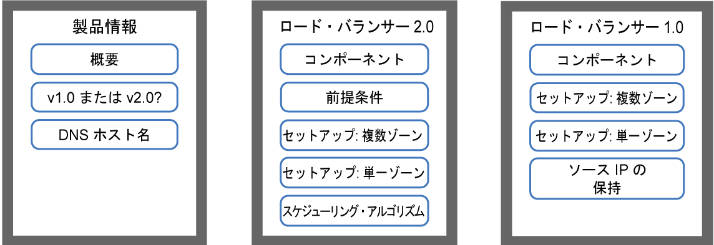
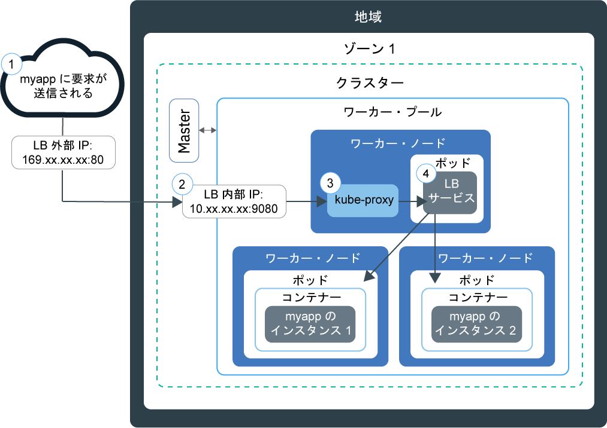
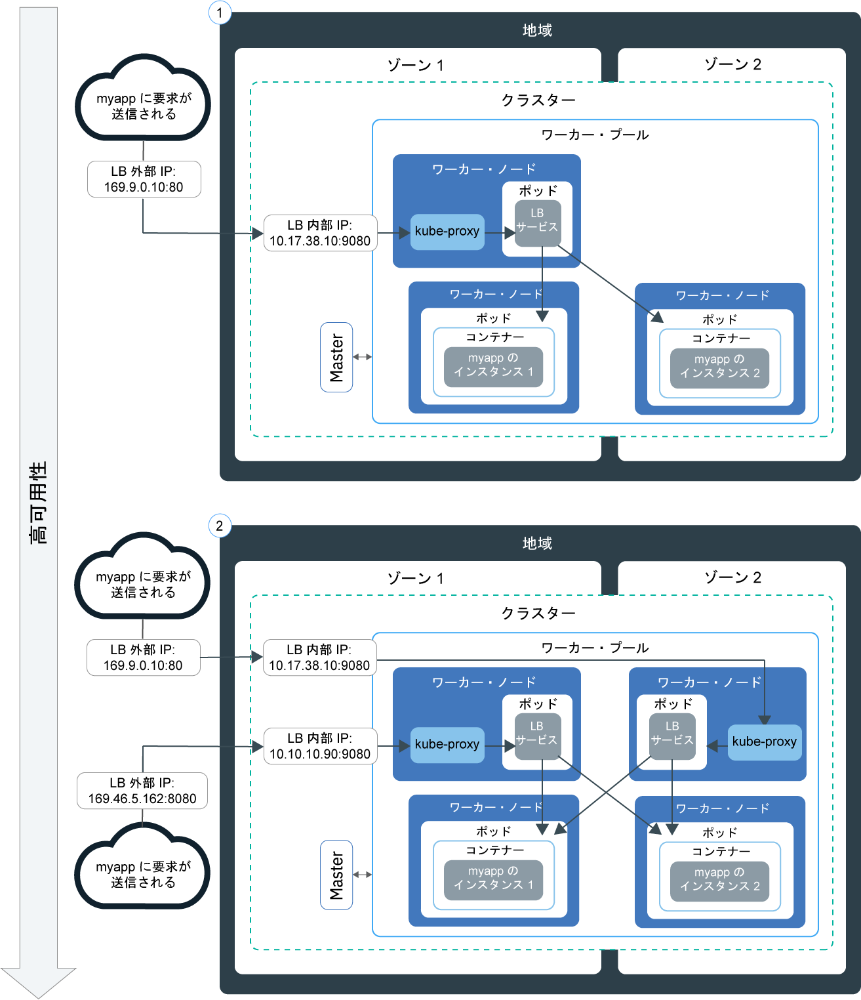
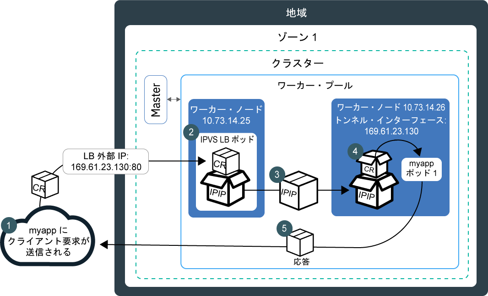
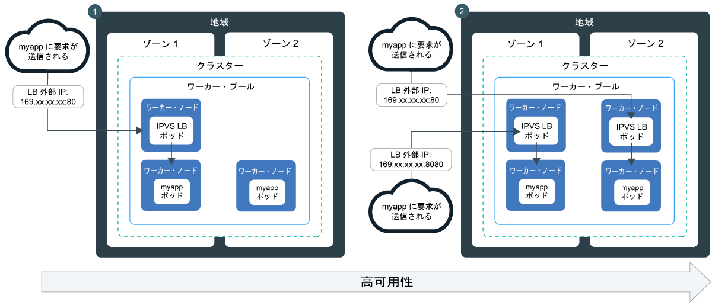

---

copyright:
  years: 2014, 2019
lastupdated: "2019-06-05"

keywords: kubernetes, iks, lb2.0, nlb, health check

subcollection: containers

---

{:new_window: target="_blank"}
{:shortdesc: .shortdesc}
{:screen: .screen}
{:pre: .pre}
{:table: .aria-labeledby="caption"}
{:codeblock: .codeblock}
{:tip: .tip}
{:note: .note}
{:important: .important}
{:deprecated: .deprecated}
{:download: .download}
{:preview: .preview}


# ネットワーク・ロード・バランサー (NLB) を使用した基本ロード・バランシングと DSR ロード・バランシング
{: #loadbalancer}

ポートを公開し、レイヤー 4 のネットワーク・ロード・バランサー (NLB) のポータブル IP アドレスを使用してコンテナー化アプリにアクセスします。
{:shortdesc}

開始するには、次のオプションのいずれかを選択します。


<map name="image-map">
    <area target="" alt="概要" title="概要" href="#lb_overview" coords="35,44,175,72" shape="rect">
    <area target="" alt="バージョン 1.0 と 2.0 のロード・バランサーの比較" title="バージョン 1.0 と 2.0 のロード・バランサーの比較" href="#comparison" coords="34,83,173,108" shape="rect">
    <area target="" alt="ロード・バランサーのホスト名の登録" title="ロード・バランサーのホスト名の登録" href="#loadbalancer_hostname" coords="33,119,174,146" shape="rect">
    <area target="" alt="v2.0: コンポーネントとアーキテクチャー (ベータ版)" title="v2.0: コンポーネントとアーキテクチャー (ベータ版)" href="#planning_ipvs" coords="273,45,420,72" shape="rect">
    <area target="" alt="v2.0: 前提条件" title="v2.0: 前提条件" href="#ipvs_provision" coords="277,85,417,108" shape="rect">
    <area target="" alt="v2.0: 複数ゾーン・クラスターでのロード・バランサー 2.0 のセットアップ" title="v2.0: 複数ゾーン・クラスターでのロード・バランサー 2.0 のセットアップ" href="#ipvs_multi_zone_config" coords="276,122,417,147" shape="rect">
    <area target="" alt="v2.0: 単一ゾーン・クラスターでのロード・バランサー 2.0 のセットアップ" title="v2.0: 単一ゾーン・クラスターでのロード・バランサー 2.0 のセットアップ" href="#ipvs_single_zone_config" coords="277,156,419,184" shape="rect">
    <area target="" alt="v2.0: スケジューリング・アルゴリズム" title="v2.0: スケジューリング・アルゴリズム" href="#scheduling" coords="276,196,419,220" shape="rect">
    <area target="" alt="v1.0: コンポーネントとアーキテクチャー" title="v1.0: コンポーネントとアーキテクチャー" href="#v1_planning" coords="519,47,668,74" shape="rect">
    <area target="" alt="v1.0: 複数ゾーン・クラスターでのロード・バランサー 1.0 のセットアップ" title="v1.0: 複数ゾーン・クラスターでのロード・バランサー 1.0 のセットアップ" href="#multi_zone_config" coords="520,85,667,110" shape="rect">
    <area target="" alt="v1.0: 単一ゾーン・クラスターでのロード・バランサー 1.0 のセットアップ" title="v1.0: 単一ゾーン・クラスターでのロード・バランサー 1.0 のセットアップ" href="#lb_config" coords="520,122,667,146" shape="rect">
    <area target="" alt="v1.0: ソース IP 保持の有効化" title="v1.0: ソース IP 保持の有効化" href="#node_affinity_tolerations" coords="519,157,667,194" shape="rect">
</map>
</br>

素早く開始するには、以下のコマンドを実行して、ロード・バランサー 1.0 を作成します。
```
kubectl expose deploy my-app --port=80 --target-port=8080 --type=LoadBalancer --name my-lb-svc
```
{: pre}

## 概要
{: #lb_overview}

標準クラスターを作成すると、{{site.data.keyword.containerlong}} は、ポータブル・パブリック・サブネットとポータブル・プライベート・サブネットを自動的にプロビジョンします。
{: shortdesc}

* ポータブル・パブリック・サブネットでは、5 つの IP アドレスを使用できます。 ポータブル・パブリック IP アドレスの 1 つは、デフォルトの[パブリック Ingress ALB](/docs/containers?topic=containers-ingress) に使用されます。 残りの 4 つのポータブル・パブリック IP アドレスは、パブリック・ネットワーク・ロード・バランサー・サービス (NLB) を作成して単一アプリをインターネットに公開するために使用できます。
* ポータブル・プライベート・サブネットでは、5 つの IP アドレスを使用できます。 ポータブル・プライベート IP アドレスの 1 つは、デフォルトの[プライベート Ingress ALB](/docs/containers?topic=containers-ingress#private_ingress) に使用されます。 残りの 4 つのポータブル・プライベート IP アドレスは、プライベート・ロード・バランサー・サービス (NLB) を作成して単一アプリをプライベート・ネットワークに公開するために使用できます。

ポータブル・パブリック IP アドレスとポータブル・プライベート IP アドレスは静的浮動 IP であり、ワーカー・ノードが削除されても変わりません。 NLB IP アドレスがオンになっているワーカー・ノードが削除されると、IP を常にモニターしている Keepalived デーモンが、IP を自動的に別のワーカー・ノードに移動します。 任意のポートを NLB に割り当てることができます。 NLB は、アプリに対する着信要求のための外部エントリー・ポイントとして機能します。 インターネットから NLB にアクセスするには、NLB のパブリック IP アドレスと割り当てられたポートを、`<IP_address>:<port>` という形式で使用します。 また、ホスト名とともに NLB IP アドレスと登録して NLB の DNS エントリーを作成することもできます。

NLB サービスを使用してアプリを公開した場合、自動的にそのアプリはサービスの NodePort 経由でも使用できるようになります。 [NodePort](/docs/containers?topic=containers-nodeport) には、クラスター内のすべてのワーカー・ノードのすべてのパブリック IP アドレスおよびプライベート IP アドレスでアクセスできます。 NLB を使用しつつ、NodePort へのトラフィックをブロックするには、[ロード・バランサー・サービスまたはノード・ポート・サービスへのインバウンド・トラフィックの制御](/docs/containers?topic=containers-network_policies#block_ingress)を参照してください。

<br />


## バージョン 1.0 と 2.0 の NLB での基本ロード・バランシングと DSR ロード・バランシングの比較
{: #comparison}

NLB の作成時に、基本ロード・バランシングを実行するバージョン 1.0 NLB、または直接サーバー・リターン (DSR) ロード・バランシングを実行するバージョン 2.0 NLB を選択できます。 バージョン 2.0 の NLB はベータ版であるということに注意してください。
{: shortdesc}

**バージョン 1.0 と 2.0 の NLB の類似点は何ですか?**

バージョン 1.0 と 2.0 の NLB はどちらもレイヤー 4 のロード・バランサーであり、Linux カーネル・スペースでのみ動作します。 どちらのバージョンもクラスター内で実行され、ワーカー・ノードのリソースを使用します。 したがって、NLB の対応能力は常にお客様のクラスターにのみ使用されます。 また、どちらのバージョンの NLB も接続を終了しません。 代わりに、アプリ・ポッドに接続を転送します。

**バージョン 1.0 と 2.0 の NLB の相違点は何ですか?**

クライアントがアプリに要求を送信すると、NLB は、アプリ・ポッドが存在するワーカー・ノードの IP アドレスに要求パケットをルーティングします。 バージョン 1.0 の NLB は、ネットワーク・アドレス変換 (NAT) を使用して、要求パケットのソース IP アドレスを、ロード・バランサー・ポッドが存在するワーカー・ノードの IP に書き換えます。 ワーカー・ノードは、アプリの応答パケットを返すときに、その NLB が存在するワーカー・ノードの IP を使用します。 そして、NLB がクライアントに応答パケットを送信します。 IP アドレスの書き換えを回避するには、[ソース IP 保持を有効にします](#node_affinity_tolerations)。 ただし、ソース IP 保持を利用するには、要求を別のワーカーに転送しなくてもよいように、ロード・バランサー・ポッドとアプリ・ポッドを同じワーカー上で実行する必要があります。 ノードのアフィニティーと耐障害性をアプリ・ポッドに追加する必要があります。 バージョン 1.0 NLB を使用した基本ロード・バランシングについて詳しくは、[v1.0: 基本ロード・バランシングのコンポーネントとアーキテクチャー](#v1_planning)を参照してください。

バージョン 1.0 の NLB とは異なり、バージョン 2.0 の NLB は、他のワーカー上のアプリ・ポッドに要求を転送する際に NAT を使用しません。 NLB 2.0 は、クライアント要求をルーティングするときに、IP over IP (IPIP) を使用して、元の要求パケットを別の新しいパケットに入れてカプセル化します。 このカプセル化された IPIP パケットには、ロード・バランサー・ポッドが存在するワーカー・ノードのソース IP が含まれているので、元の要求パケットはクライアント IP をそのソース IP アドレスとして保持できます。 そして、ワーカー・ノードは、直接サーバー・リターン (DSR) を使用して、アプリの応答パケットをクライアント IP に送信します。 応答パケットは NLB をスキップしてクライアントに直接送信されるので、NLB が処理する必要のあるトラフィックの量が減少します。 バージョン 2.0 NLB を使用した DSR ロード・バランシングについて詳しくは、[v2.0: DSR ロード・バランシングのコンポーネントとアーキテクチャー](#planning_ipvs)を参照してください。

<br />


## v1.0: 基本ロード・バランシングのコンポーネントとアーキテクチャー
{: #v1_planning}

TCP/UDP ネットワーク・ロード・バランサー (NLB) 1.0 は、Linux カーネルの機能である Iptables を使用して、アプリのポッド間で要求の負荷分散を行います。
{: shortdesc}

### 単一ゾーン・クラスター内のトラフィック・フロー
{: #v1_single}

次の図は、NLB 1.0 がインターネットから単一ゾーン・クラスター内のアプリに通信を転送する方法を示しています。
{: shortdesc}



1. アプリに対する要求では、NLB のパブリック IP アドレスとワーカー・ノードに割り当てられたポートを使用します。

2. 要求が、NLB サービスの内部のクラスター IP アドレスとポートに自動的に転送されます。 内部クラスター IP アドレスはクラスター内でのみアクセス可能です。

3. `kube-proxy` が、要求をアプリの NLB サービスにルーティングします。

4. 要求は、アプリ・ポッドのプライベート IP アドレスに転送されます。 要求パッケージのソース IP アドレスが、アプリ・ポッドが実行されているワーカー・ノードのパブリック IP アドレスに変更されます。 複数のアプリ・インスタンスがクラスターにデプロイされている場合、NLB は、アプリ・ポッド間で要求をルーティングします。

### 複数ゾーン・クラスター内のトラフィック・フロー
{: #v1_multi}

次の図は、ネットワーク・ロード・バランサー (NLB) 1.0 がインターネットから複数ゾーン・クラスターのアプリに通信を転送する方法を示しています。
{: shortdesc}



デフォルトでは、各 NLB 1.0 が 1 ゾーンにのみセットアップされます。 高可用性を確保するには、アプリ・インスタンスが存在するすべてのゾーンに NLB 1.0 をデプロイする必要があります。 ラウンドロビン・サイクルでさまざまなゾーンの NLB が要求を処理します。 また、各 NLB は、デプロイ先のゾーンのアプリ・インスタンスへの要求と、他のゾーンのアプリ・インスタンスへの要求を転送します。

<br />


## v1.0: 複数ゾーン・クラスターでの NLB 1.0 のセットアップ
{: #multi_zone_config}

**始める前に**:
* パブリック・ネットワーク・ロード・バランサー (NLB) を複数のゾーンに作成するためには、ゾーンごとに 1 つ以上のパブリック VLAN にポータブル・サブネットを用意する必要があります。 プライベート NLB を複数のゾーンに作成するためには、ゾーンごとに 1 つ以上のプライベート VLAN にポータブル・サブネットを用意する必要があります。 [クラスター用のサブネットの構成](/docs/containers?topic=containers-subnets)に記載されているステップに従うことにより、サブネットを追加できます。
* ネットワーク・トラフィックをエッジ・ワーカー・ノードに制限する場合は、NLB が均等にデプロイされるように、各ゾーンで 2 つ以上の[エッジ・ワーカー・ノード](/docs/containers?topic=containers-edge#edge)を有効にしてください。
* IBM Cloud インフラストラクチャー (SoftLayer) アカウントに対して [VLAN スパンニング](/docs/infrastructure/vlans?topic=vlans-vlan-spanning#vlan-spanning)を有効にして、ワーカー・ノードがプライベート・ネットワーク上で相互に通信できるようにします。 この操作を実行するには、**「ネットワーク」>「ネットワーク VLAN スパンニングの管理」**で設定する[インフラストラクチャー権限](/docs/containers?topic=containers-users#infra_access)が必要です。ない場合は、アカウント所有者に対応を依頼してください。 VLAN スパンニングが既に有効になっているかどうかを確認するには、`ibmcloud ks vlan-spanning-get<region>` [コマンド](/docs/containers?topic=containers-cli-plugin-kubernetes-service-cli#cs_vlan_spanning_get)を使用します。
* `default` 名前空間に対する[**ライター**または**管理者**の {{site.data.keyword.Bluemix_notm}} IAM サービス役割](/docs/containers?topic=containers-users#platform)があることを確認してください。


複数ゾーン・クラスターで NLB 1.0 サービスをセットアップするには、次の手順を実行します。
1.  [アプリをクラスターにデプロイします](/docs/containers?topic=containers-app#app_cli)。 構成ファイルの metadata セクションで、デプロイメントにラベルを追加しておく必要があります。 このラベルは、アプリが実行されるすべてのポッドを識別してロード・バランシングに含めるために必要です。

2.  パブリック・インターネットまたはプライベート・ネットワークに公開するアプリのロード・バランサー・サービスを作成します。
  1. `myloadbalancer.yaml` などの名前のサービス構成ファイルを作成します。
  2. 公開するアプリのロード・バランサー・サービスを定義します。 ゾーン、VLAN、および IP アドレスを指定できます。

      ```
      apiVersion: v1
      kind: Service
      metadata:
        name: myloadbalancer
        annotations:
          service.kubernetes.io/ibm-load-balancer-cloud-provider-ip-type: <public_or_private>
          service.kubernetes.io/ibm-load-balancer-cloud-provider-zone: "<zone>"
          service.kubernetes.io/ibm-load-balancer-cloud-provider-vlan: "<vlan_id>"
      spec:
        type: LoadBalancer
        selector:
          <selector_key>: <selector_value>
        ports:
         - protocol: TCP
             port: 8080
          loadBalancerIP: <IP_address>
      ```
      {: codeblock}

      <table>
      <caption>YAML ファイルの構成要素について</caption>
      <thead>
      <th colspan=2> YAML ファイルの構成要素について</th>
      </thead>
      <tbody>
      <tr>
        <td><code>service.kubernetes.io/ibm-load-balancer-cloud-provider-ip-type:</code>
        <td><code>private</code> または <code>public</code> のロード・バランサーを指定するアノテーション。</td>
      </tr>
      <tr>
        <td><code>service.kubernetes.io/ibm-load-balancer-cloud-provider-zone:</code>
        <td>ロード・バランサー・サービスのデプロイ先のゾーンを指定するアノテーション。 ゾーンを表示するには、<code>ibmcloud ks zones</code> を実行します。</td>
      </tr>
      <tr>
        <td>`service.kubernetes.io/ibm-load-balancer-cloud-provider-vlan:`
        <td>ロード・バランサー・サービスのデプロイ先の VLAN を指定するアノテーション。 VLAN を表示するには、<code>ibmcloud ks vlans --zone <zone></code> を実行します。</td>
      </tr>
      <tr>
        <td><code>selector</code></td>
        <td>アプリ・デプロイメント YAML の <code>spec.template.metadata.labels</code> セクションで使用したラベル・キー (<em>&lt;selector_key&gt;</em>) と値 (<em>&lt;selector_value&gt;</em>)。</td>
      </tr>
      <tr>
        <td><code>port</code></td>
        <td>サービスが listen するポート。</td>
      </tr>
      <tr>
        <td><code>loadBalancerIP</code></td>
        <td>オプション: プライベート・ロード・バランサーを作成するには、またはパブリック・ロード・バランサー用に特定のポータブル IP アドレスを使用するには、使用する IP アドレスを指定します。 IP アドレスは、アノテーションで指定する VLAN とゾーンになければなりません。 IP アドレスを指定しない場合、以下のようになります。<ul><li>クラスターがパブリック VLAN 上にある場合、ポータブル・パブリック IP アドレスが使用されます。 ほとんどのクラスターはパブリック VLAN 上にあります。</li><li>クラスターがプライベート VLAN 上にのみ存在する場合は、ポータブル・プライベート IP アドレスが使用されます。</li></ul></td>
      </tr>
      </tbody></table>

      プライベート VLAN `2234945` 上の指定した IP アドレスを使用するプライベート NLB 1.0 サービスを `dal12` に作成するための構成ファイルの例:

      ```
      apiVersion: v1
      kind: Service
      metadata:
        name: myloadbalancer
        annotations:
          service.kubernetes.io/ibm-load-balancer-cloud-provider-ip-type: private
          service.kubernetes.io/ibm-load-balancer-cloud-provider-zone: "dal12"
          service.kubernetes.io/ibm-load-balancer-cloud-provider-vlan: "2234945"
      spec:
        type: LoadBalancer
        selector:
          app: nginx
        ports:
         - protocol: TCP
           port: 8080
        loadBalancerIP: 172.21.xxx.xxx
      ```
      {: codeblock}

  3. オプション: 制限範囲の IP アドレスでのみ NLB サービスを使用できるようにするには、`spec.loadBalancerSourceRanges` フィールドで IP を指定します。 `loadBalancerSourceRanges` は、ワーカー・ノード上の Iptables ルールを介してクラスター内の `kube-proxy` によって実装されます。 詳しくは、[Kubernetes の資料 ](https://kubernetes.io/docs/tasks/access-application-cluster/configure-cloud-provider-firewall/) を参照してください。

  4. クラスター内にサービスを作成します。

      ```
      kubectl apply -f myloadbalancer.yaml
      ```
      {: pre}

3. NLB サービスが正常に作成されたことを確認します。 サービスが作成され、アプリが利用可能になるまでに数分かかることがあります。

    ```
    kubectl describe service myloadbalancer
    ```
    {: pre}

    CLI 出力例:

    ```
    Name:                   myloadbalancer
    Namespace:              default
    Labels:                 <none>
    Selector:               app=liberty
    Type:                   LoadBalancer
    Zone:                   dal10
    IP:                     172.21.xxx.xxx
    LoadBalancer Ingress:   169.xx.xxx.xxx
    Port:                   <unset> 8080/TCP
    NodePort:               <unset> 32040/TCP
    Endpoints:              172.30.xxx.xxx:8080
    Session Affinity:       None
    Events:
      FirstSeen	LastSeen	Count	From			SubObjectPath	Type	 Reason			          Message
      ---------	--------	-----	----			-------------	----	 ------			          -------
      10s		    10s		    1	    {service-controller }	  Normal CreatingLoadBalancer	Creating load balancer
      10s		    10s		    1	    {service-controller }		Normal CreatedLoadBalancer	Created load balancer
    ```
    {: screen}

    **LoadBalancer Ingress** IP アドレスは、NLB サービスに割り当てられたポータブル・パブリック IP アドレスです。

4.  パブリック NLB を作成した場合、インターネットからアプリにアクセスします。
    1.  任意の Web ブラウザーを開きます。
    2.  NLB のポータブル・パブリック IP アドレスとポートを入力します。

        ```
        http://169.xx.xxx.xxx:8080
        ```
        {: codeblock}    

5. ステップ 2 から 4 を繰り返して、各ゾーンにバージョン 1.0 の NLB を追加します。    

6. [NLB 1.0 のソース IP 保持を有効にする](#node_affinity_tolerations)場合は必ず、[アプリ・ポッドにエッジ・ノード・アフィニティーを追加](#lb_edge_nodes)して、エッジ・ワーカー・ノードにアプリ・ポッドをスケジュールするようにしてください。 着信要求を受信するには、アプリ・ポッドをエッジ・ノードにスケジュールする必要があります。

7. オプション: ロード・バランサー・サービスは、サービスの NodePort を介してアプリを使用できるようにします。 [NodePort](/docs/containers?topic=containers-nodeport) には、クラスター内のすべてのノードのすべてのパブリック IP アドレスおよびプライベート IP アドレスでアクセスできます。 NLB サービスを使用しつつ、NodePort へのトラフィックをブロックするには、[ロード・バランサー・サービスまたはノード・ポート・サービスへのインバウンド・トラフィックの制御](/docs/containers?topic=containers-network_policies#block_ingress)を参照してください。

次に、[NLB ホスト名を登録](#loadbalancer_hostname)できます。

<br />


## v1.0: 単一ゾーン・クラスターでの NLB 1.0 のセットアップ
{: #lb_config}

**始める前に**:
* ネットワーク・ロード・バランサー (NLB) サービスに割り当てることのできるポータブル・パブリック IP アドレスまたはポータブル・プライベート IP アドレスが必要です。 詳しくは、[クラスター用のサブネットの構成](/docs/containers?topic=containers-subnets)を参照してください。
* `default` 名前空間に対する[**ライター**または**管理者**の {{site.data.keyword.Bluemix_notm}} IAM サービス役割](/docs/containers?topic=containers-users#platform)があることを確認してください。

単一ゾーン・クラスターで NLB 1.0 サービスを作成するには、以下のようにします。

1.  [アプリをクラスターにデプロイします](/docs/containers?topic=containers-app#app_cli)。 構成ファイルの metadata セクションで、デプロイメントにラベルを追加しておく必要があります。 このラベルは、アプリが実行されるすべてのポッドをロード・バランシングに含めるためにそれらのポッドを識別する上で必要です。
2.  パブリック・インターネットまたはプライベート・ネットワークに公開するアプリのロード・バランサー・サービスを作成します。
    1.  `myloadbalancer.yaml` などの名前のサービス構成ファイルを作成します。

    2.  公開するアプリのロード・バランサー・サービスを定義します。
        ```
        apiVersion: v1
        kind: Service
        metadata:
          name: myloadbalancer
          annotations:
            service.kubernetes.io/ibm-load-balancer-cloud-provider-ip-type: <public_or_private>
            service.kubernetes.io/ibm-load-balancer-cloud-provider-vlan: "<vlan_id>"
        spec:
          type: LoadBalancer
          selector:
            <selector_key>: <selector_value>
          ports:
           - protocol: TCP
           port: 8080
        loadBalancerIP: <IP_address>
        externalTrafficPolicy: Local
        ```
        {: codeblock}

        <table>
        <caption>YAML ファイルの構成要素について</caption>
        <thead>
        <th colspan=2> YAML ファイルの構成要素について</th>
        </thead>
        <tbody>
        <tr>
          <td>`service.kubernetes.io/ibm-load-balancer-cloud-provider-ip-type:`
          <td><code>private</code> または <code>public</code> のロード・バランサーを指定するアノテーション。</td>
        </tr>
        <tr>
          <td>`service.kubernetes.io/ibm-load-balancer-cloud-provider-vlan:`
          <td>ロード・バランサー・サービスのデプロイ先の VLAN を指定するアノテーション。 VLAN を表示するには、<code>ibmcloud ks vlans --zone <zone></code> を実行します。</td>
        </tr>
        <tr>
          <td><code>selector</code></td>
          <td>アプリ・デプロイメント YAML の <code>spec.template.metadata.labels</code> セクションで使用したラベル・キー (<em>&lt;selector_key&gt;</em>) と値 (<em>&lt;selector_value&gt;</em>)。</td>
        </tr>
        <tr>
          <td><code>port</code></td>
          <td>サービスが listen するポート。</td>
        </tr>
        <tr>
          <td><code>loadBalancerIP</code></td>
          <td>オプション: プライベート・ロード・バランサーを作成するには、またはパブリック・ロード・バランサー用に特定のポータブル IP アドレスを使用するには、使用する IP アドレスを指定します。 IP アドレスは、アノテーションで指定する VLAN 上になければなりません。 IP アドレスを指定しない場合、以下のようになります。<ul><li>クラスターがパブリック VLAN 上にある場合、ポータブル・パブリック IP アドレスが使用されます。 ほとんどのクラスターはパブリック VLAN 上にあります。</li><li>クラスターがプライベート VLAN 上にのみ存在する場合は、ポータブル・プライベート IP アドレスが使用されます。</li></ul></td>
        </tr>
        </tbody></table>

        プライベート VLAN `2234945` 上の指定した IP アドレスを使用するプライベート NLB 1.0 サービスを作成するための構成ファイルの例:

        ```
        apiVersion: v1
        kind: Service
        metadata:
          name: myloadbalancer
          annotations:
            service.kubernetes.io/ibm-load-balancer-cloud-provider-ip-type: private
            service.kubernetes.io/ibm-load-balancer-cloud-provider-vlan: "2234945"
        spec:
          type: LoadBalancer
          selector:
            app: nginx
          ports:
           - protocol: TCP
           port: 8080
        loadBalancerIP: 172.21.xxx.xxx
        ```
        {: codeblock}

    3. オプション: 制限範囲の IP アドレスでのみ NLB サービスを使用できるようにするには、`spec.loadBalancerSourceRanges` フィールドで IP を指定します。 `loadBalancerSourceRanges` は、ワーカー・ノード上の Iptables ルールを介してクラスター内の `kube-proxy` によって実装されます。 詳しくは、[Kubernetes の資料 ](https://kubernetes.io/docs/tasks/access-application-cluster/configure-cloud-provider-firewall/) を参照してください。

    4.  クラスター内にサービスを作成します。

        ```
        kubectl apply -f myloadbalancer.yaml
        ```
        {: pre}

3.  NLB サービスが正常に作成されたことを確認します。 サービスが作成され、アプリが利用可能になるまでに数分かかることがあります。

    ```
    kubectl describe service myloadbalancer
    ```
    {: pre}

    CLI 出力例:

    ```
    Name:                   myloadbalancer
    Namespace:              default
    Labels:                 <none>
    Selector:               app=liberty
    Type:                   LoadBalancer
    Location:               dal10
    IP:                     172.21.xxx.xxx
    LoadBalancer Ingress:   169.xx.xxx.xxx
    Port:                   <unset> 8080/TCP
    NodePort:               <unset> 32040/TCP
    Endpoints:              172.30.xxx.xxx:8080
    Session Affinity:       None
    Events:
      FirstSeen	LastSeen	Count	From			SubObjectPath	Type	 Reason			          Message
      ---------	--------	-----	----			-------------	----	 ------			          -------
      10s		    10s		    1	    {service-controller }	  Normal CreatingLoadBalancer	Creating load balancer
      10s		    10s		    1	    {service-controller }		Normal CreatedLoadBalancer	Created load balancer
    ```
    {: screen}

    **LoadBalancer Ingress** IP アドレスは、NLB サービスに割り当てられたポータブル・パブリック IP アドレスです。

4.  パブリック NLB を作成した場合、インターネットからアプリにアクセスします。
    1.  任意の Web ブラウザーを開きます。
    2.  NLB のポータブル・パブリック IP アドレスとポートを入力します。

        ```
        http://169.xx.xxx.xxx:8080
        ```
        {: codeblock}

5. [NLB 1.0 のソース IP 保持を有効にする](#node_affinity_tolerations)場合は必ず、[アプリ・ポッドにエッジ・ノード・アフィニティーを追加](#lb_edge_nodes)して、エッジ・ワーカー・ノードにアプリ・ポッドをスケジュールするようにしてください。 着信要求を受信するには、アプリ・ポッドをエッジ・ノードにスケジュールする必要があります。

6. オプション: ロード・バランサー・サービスは、サービスの NodePort を介してアプリを使用できるようにします。 [NodePort](/docs/containers?topic=containers-nodeport) には、クラスター内のすべてのノードのすべてのパブリック IP アドレスおよびプライベート IP アドレスでアクセスできます。 NLB サービスを使用しつつ、NodePort へのトラフィックをブロックするには、[ロード・バランサー・サービスまたはノード・ポート・サービスへのインバウンド・トラフィックの制御](/docs/containers?topic=containers-network_policies#block_ingress)を参照してください。

次に、[NLB ホスト名を登録](#loadbalancer_hostname)できます。

<br />


## v1.0: ソース IP 保持の有効化
{: #node_affinity_tolerations}

この機能は、バージョン 1.0 のネットワーク・ロード・バランサー (NLB) にのみあります。 バージョン 2.0 の NLB では、クライアント要求のソース IP アドレスはデフォルトで保持されます。
{: note}

アプリへのクライアント要求がクラスターに送信されると、ロード・バランサー・サービス・ポッドがその要求を受け取ります。 ロード・バランサー・サービス・ポッドと同じワーカー・ノードにアプリ・ポッドが存在しない場合、NLB は異なるワーカー・ノード上のアプリ・ポッドに要求を転送します。 パッケージのソース IP アドレスは、ロード・バランサー・サービス・ポッドが実行されているワーカー・ノードのパブリック IP アドレスに変更されます。
{: shortdesc}

クライアント要求の元のソース IP アドレスを保持するには、ロード・バランサー・サービスの[ソース IP を有効化 ](https://kubernetes.io/docs/tasks/access-application-cluster/create-external-load-balancer/#preserving-the-client-source-ip) します。 TCP の接続先はアプリ・ポッドになるので、アプリはイニシエーターの実際のソース IP アドレスを認識できます。 クライアントの IP を保持すると、例えば、アプリ・サーバーがセキュリティーやアクセス制御ポリシーを適用する必要がある場合などに役に立ちます。

ソース IP を有効にした場合は、ロード・バランサー・サービス・ポッドは、同じワーカー・ノードにデプロイされているアプリ・ポッドにのみ要求を転送しなければなりません。 通常、ロード・バランサー・サービス・ポッドも、アプリ・ポッドをデプロイしたワーカー・ノードにデプロイされます。 しかし、次のように、ロード・バランサー・ポッドとアプリ・ポッドが同じワーカー・ノードにスケジュールされない状況もあります。

* エッジ・ノードにテイントがあるため、これらのエッジ・ノードにデプロイできるのはロード・バランサー・サービス・ポッドのみです。 このようなノードにはアプリ・ポッドをデプロイできません。
* 複数のパブリック VLAN またはプライベート VLAN にクラスターが接続されている場合、1 つの VLAN のみに接続されているワーカー・ノードにアプリ・ポッドはデプロイされます。 NLB の IP アドレスがワーカー・ノードとは別の VLAN に接続されているという理由で、このようなワーカー・ノードにはロード・バランサー・サービス・ポッドはデプロイされない可能性があります。

ロード・バランサー・サービス・ポッドもデプロイできる特定のワーカー・ノードに強制的にアプリをデプロイするには、アフィニティー・ルールと耐障害性をアプリのデプロイメントに追加する必要があります。

### エッジ・ノードのアフィニティー・ルールと耐障害性を追加する
{: #lb_edge_nodes}

[ワーカー・ノードにエッジ・ノードのラベルを付け](/docs/containers?topic=containers-edge#edge_nodes)、さらに[エッジ・ノードにテイントを適用する](/docs/containers?topic=containers-edge#edge_workloads)場合、ロード・バランサー・サービス・ポッドはそれらのエッジ・ノードにのみデプロイされ、アプリ・ポッドはエッジ・ノードにデプロイできません。 NLB サービスでソース IP が有効になっている場合、エッジ・ノード上のロード・バランサー・ポッドは、着信要求を他のワーカー・ノード上のアプリ・ポッドに転送できません。
{:shortdesc}

アプリ・ポッドをエッジ・ノードに強制的にデプロイするには、エッジ・ノードの[アフィニティー・ルール ](https://kubernetes.io/docs/concepts/configuration/assign-pod-node/#node-affinity-beta-feature) と[耐障害性 ](https://kubernetes.io/docs/concepts/configuration/taint-and-toleration/#concepts) をアプリのデプロイメントに追加します。

エッジ・ノード・アフィニティーとエッジ・ノード耐障害性を追加したデプロイメント YAML のサンプル

```
apiVersion: apps/v1
kind: Deployment
metadata:
  name: with-node-affinity
spec:
  selector:
    matchLabels:
      <label_name>: <label_value>
  template:
    spec:
      affinity:
        nodeAffinity:
          requiredDuringSchedulingIgnoredDuringExecution:
            nodeSelectorTerms:
            - matchExpressions:
              - key: dedicated
                operator: In
                values:
                - edge
      tolerations:
        - key: dedicated
          value: edge
...
```
{: codeblock}

**affinity** と **tolerations** の両方のセクションで、`key` として `dedicated` が、`value` として `edge` が指定されています。

### 複数のパブリック VLAN またはプライベート VLAN にアフィニティー・ルールを追加する
{: #edge_nodes_multiple_vlans}

複数のパブリック VLAN またはプライベート VLAN にクラスターが接続されている場合は、1 つの VLAN のみに接続されているワーカー・ノードにアプリ・ポッドはデプロイされる可能性があります。 NLB の IP アドレスが、そのようなワーカー・ノードとは別の VLAN に接続されていると、ロード・バランサー・サービス・ポッドはそのようなワーカー・ノードにデプロイされません。
{:shortdesc}

ソース IP を有効にした場合は、アフィニティー・ルールをアプリのデプロイメントに追加して、NLB の IP アドレスと同じ VLAN にあるワーカー・ノードにアプリ・ポッドをスケジュールしてください。

開始前に、以下のことを行います。 [アカウントにログインします。 該当する場合は、適切なリソース・グループをターゲットにします。 クラスターのコンテキストを設定します。](/docs/containers?topic=containers-cs_cli_install#cs_cli_configure)

1. NLB サービスのパブリック IP アドレスを取得します。 **LoadBalancer Ingress** フィールドの IP アドレスを確認してください。
    ```
    kubectl describe service <loadbalancer_service_name>
    ```
    {: pre}

2. NLB サービスが接続する VLAN ID を取得します。

    1. クラスターのポータブル・パブリック VLAN をリストします。
        ```
        ibmcloud ks cluster-get --cluster <cluster_name_or_ID> --showResources
        ```
        {: pre}

        出力例:
        ```
        ...

        Subnet VLANs
        VLAN ID   Subnet CIDR       Public   User-managed
        2234947   10.xxx.xx.xxx/29  false    false
        2234945   169.36.5.xxx/29   true     false
        ```
        {: screen}

    2. **Subnet VLANs** の下にある出力で、先ほど取得した NLB の IP アドレスと一致するサブネット CIDR を見つけ、その VLAN ID をメモします。

        例えば、NLB サービスの IP アドレスが `169.36.5.xxx` の場合、前のステップの出力例で一致するサブネットは `169.36.5.xxx/29` です。 そのサブネットが接続する VLAN ID は、`2234945` です。

3. アプリのデプロイメントに、前の手順でメモした VLAN ID に対する[アフィニティー・ルールを追加 ](https://kubernetes.io/docs/concepts/configuration/assign-pod-node/#node-affinity-beta-feature) します。

    例えば、複数の VLAN がある場合に、`2234945` のパブリック VLAN にあるワーカー・ノードにのみアプリ・ポッドをデプロイするには、以下のようにします。

    ```
    apiVersion: apps/v1
    kind: Deployment
    metadata:
      name: with-node-affinity
    spec:
      selector:
        matchLabels:
          <label_name>: <label_value>
      template:
        spec:
          affinity:
            nodeAffinity:
              requiredDuringSchedulingIgnoredDuringExecution:
                nodeSelectorTerms:
                - matchExpressions:
                  - key: publicVLAN
                    operator: In
                    values:
                    - "2234945"
    ...
    ```
    {: codeblock}

    サンプル YAML では、**affinity** セクションの `key` は `publicVLAN`、`value` は `"2234945"` です。

4. 更新したデプロイメント構成ファイルを適用します。
    ```
    kubectl apply -f with-node-affinity.yaml
    ```
    {: pre}

5. アプリ・ポッドが、指定した VLAN に接続されたワーカー・ノードにデプロイされたことを確認します。

    1. クラスター内のポッドをリストします。 `<selector>` を、アプリに使用したラベルに置き換えます。
        ```
        kubectl get pods -o wide app=<selector>
        ```
        {: pre}

        出力例:
        ```
        NAME                   READY     STATUS              RESTARTS   AGE       IP               NODE
        cf-py-d7b7d94db-vp8pq  1/1       Running             0          15d       172.30.xxx.xxx   10.176.48.78
        ```
        {: screen}

    2. 出力で、アプリのポッドを確認します。 ポッドがあるワーカー・ノードの **NODE** ID をメモします。

        前のステップの出力例では、アプリ・ポッド `cf-py-d7b7d94db-vp8pq` がワーカー・ノード `10.176.48.78` にあります。

    3. ワーカー・ノードの詳細情報をリストします。

        ```
        kubectl describe node <worker_node_ID>
        ```
        {: pre}

        出力例:

        ```
        Name:                   10.xxx.xx.xxx
        Role:
        Labels:                 arch=amd64
                                beta.kubernetes.io/arch=amd64
                                beta.kubernetes.io/os=linux
                                failure-domain.beta.kubernetes.io/region=us-south
                                failure-domain.beta.kubernetes.io/zone=dal10
                                ibm-cloud.kubernetes.io/encrypted-docker-data=true
                                kubernetes.io/hostname=10.xxx.xx.xxx
                                privateVLAN=2234945
                                publicVLAN=2234967
        ...
        ```
        {: screen}

    4. 出力の **Labels** セクションのパブリック VLAN またはプライベート VLAN が、前の手順で指定した VLAN であることを確認します。

<br />


## v2.0: コンポーネントとアーキテクチャー (ベータ版)
{: #planning_ipvs}

ネットワーク・ロード・バランサー (NLB) 2.0 の機能はベータ版です。 NLB 2.0 を使用するには、[クラスターのマスター・ノードとワーカー・ノードを更新](/docs/containers?topic=containers-update)して Kubernetes バージョン 1.12 以降にする必要があります。
{: note}

NLB 2.0 はレイヤー 4 のロード・バランサーであり、Linux カーネルの IP Virtual Server (IPVS) を使用します。 NLB 2.0 は TCP と UDP をサポートし、複数のワーカー・ノードの前で実行され、IP over IP (IPIP) トンネリングを使用して、単一の NLB IP アドレスに到着するトラフィックをそれらのワーカー・ノードに分散させます。

{{site.data.keyword.containerlong_notm}} で使用できるロード・バランシング・デプロイメント・パターンについて詳細が必要ですか? この[ブログ投稿 ](https://www.ibm.com/blogs/bluemix/2018/10/ibm-cloud-kubernetes-service-deployment-patterns-for-maximizing-throughput-and-availability/) を確認してください。
{: tip}

### 単一ゾーン・クラスター内のトラフィック・フロー
{: #ipvs_single}

次の図は、NLB 2.0 がインターネットから単一ゾーン・クラスターのアプリに通信を転送する方法を示しています。
{: shortdesc}



1. アプリへのクライアント要求には、NLB のパブリック IP アドレスと、ワーカー・ノードに割り当てられたポートが使用されます。 この例では、NLB の仮想 IP アドレスは 169.61.23.130 であり、この仮想 IP アドレスは現在、ワーカー 10.73.14.25 上にあります。

2. NLB が、クライアント要求パケット (図中の「CR」ラベルが付いたもの) を IPIP パケット (「IPIP」ラベルのもの) の中にカプセル化します。 クライアント要求パケットは、そのソース IP アドレスとしてクライアント IP を保持します。 IPIP カプセル化パケットは、そのソース IP アドレスとしてワーカーの 10.73.14.25 IP を使用します。

3. NLB が、アプリ・ポッドがあるワーカー (10.73.14.26) に IPIP パケットをルーティングします。 複数のアプリ・インスタンスがクラスターにデプロイされている場合、NLB はアプリ・ポッドがデプロイされているワーカー間で要求をルーティングします。

4. ワーカー 10.73.14.26 が、IPIP カプセル化パケットをアンパックしてから、クライアント要求パケットをアンパックします。 そのワーカー・ノード上のアプリ・ポッドにクライアント要求パケットが転送されます。

5. 次に、ワーカー 10.73.14.26 は、元の要求パケットのソース IP アドレス (クライアント IP) を使用して、アプリ・ポッドの応答パケットをクライアントに直接返します。

### 複数ゾーン・クラスター内のトラフィック・フロー
{: #ipvs_multi}

複数ゾーン・クラスター内のトラフィック・フローも、[単一ゾーン・クラスター内のトラフィック](#ipvs_single)と同じパスをたどります。 複数ゾーン・クラスターでは、NLB は自身のゾーン内のアプリ・インスタンスと他のゾーン内のアプリ・インスタンスに要求をルーティングします。 次の図は、各ゾーンに存在するバージョン 2.0 の NLB が、インターネットから複数ゾーン・クラスターのアプリにトラフィックを転送する方法を示しています。
{: shortdesc}



デフォルトでは、バージョン 2.0 の各 NLB は、1 つのゾーンにのみセットアップされます。 アプリ・インスタンスが存在するすべてのゾーンにバージョン 2.0 NLB をデプロイすることによって、可用性を高めることができます。

<br />


## v2.0: 前提条件
{: #ipvs_provision}

既存のバージョン 1.0 の NLB を 2.0 に更新することはできません。 新規 NLB 2.0 を作成する必要があります。 クラスター内でバージョン 1.0 と 2.0 の NLB を同時に実行できます。
{: shortdesc}

NLB 2.0 を作成する前に、前提条件として次の手順を実行する必要があります。

1. [クラスターのマスター・ノードとワーカー・ノードを更新](/docs/containers?topic=containers-update)して Kubernetes バージョン 1.12 以降にします。

2. NLB 2.0 で複数ゾーン内のアプリ・ポッドに要求を転送できるようにするには、サポート・ケースを開いて VLAN の容量集約を要求します。 この構成設定によって、ネットワークの中断や障害が発生することはありません。
    1. [{{site.data.keyword.Bluemix_notm}} コンソール](https://cloud.ibm.com/) にログインします。
    2. メニュー・バーの**「サポート」**をクリックし、**「Case の管理」**タブをクリックして、**「新規 Case の作成 (Create new case)」**をクリックします。
    3. Case フィールドに、以下の情報を入力します。
       * サポートのタイプとして**「テクニカル (Technical)」**を選択します。
       * カテゴリーとして**「VLAN スパンニング」**を選択します。
       * 件名は **Public VLAN Network Question** と入力します。
    4. 「Please set up the network to allow capacity aggregation on the public VLANs associated with my account. The reference ticket for this request is: https://control.softlayer.com/support/tickets/63859145」という情報を説明に追加します。 特定の VLAN (1 つのクラスターのみに対するパブリック VLAN など) について容量集約を許可する場合は、説明でこれらの VLAN ID を指定できます。
    5. **「送信」**をクリックします。

3. IBM Cloud インフラストラクチャー (SoftLayer) アカウントの[仮想ルーター機能 (VRF)](/docs/infrastructure/direct-link?topic=direct-link-overview-of-virtual-routing-and-forwarding-vrf-on-ibm-cloud#overview-of-virtual-routing-and-forwarding-vrf-on-ibm-cloud) を有効にする必要があります。 VRF を有効にするには、[IBM Cloud インフラストラクチャー (SoftLayer) のアカウント担当者に連絡してください](/docs/infrastructure/direct-link?topic=direct-link-overview-of-virtual-routing-and-forwarding-vrf-on-ibm-cloud#how-you-can-initiate-the-conversion)。 VRF の有効化が不可能または不要な場合は、[VLAN スパンニング](/docs/infrastructure/vlans?topic=vlans-vlan-spanning#vlan-spanning)を有効にしてください。 VRF または VLAN スパンニングが有効になると、NLB 2.0 は、アカウント内のさまざまなサブネットにパケットをルーティングできるようになります。

4. [Calico pre-DNAT ネットワーク・ポリシー](/docs/containers?topic=containers-network_policies#block_ingress)を使用して NLB 2.0 の IP アドレスへのトラフィックを管理する場合は、ポリシーの `spec` セクションに `applyOnForward: true` フィールドと `doNotTrack: true` フィールドを追加し、`preDNAT: true` を削除する必要があります。 `applyOnForward: true` は、トラフィックがカプセル化されて転送されるときに Calico ポリシーが適用されるようにします。 `doNotTrack: true` は、ワーカー・ノードが DSR を使用して、接続を追跡する必要なしに応答パケットをクライアントに直接返せるようにします。 例えば、Calico ポリシーを使用して特定の IP アドレスから NLB IP アドレスへのトラフィックのみをホワイトリストに登録する場合、ポリシーは以下のようになります。
    ```
    apiVersion: projectcalico.org/v3
    kind: GlobalNetworkPolicy
    metadata:
      name: whitelist
    spec:
      applyOnForward: true
      doNotTrack: true
      ingress:
      - action: Allow
        destination:
          nets:
          - <loadbalancer_IP>/32
          ports:
          - 80
        protocol: TCP
        source:
          nets:
          - <client_address>/32
      selector: ibm.role=='worker_public'
      order: 500
      types:
      - Ingress
    ```
    {: screen}

次は、[複数ゾーン・クラスターでの NLB 2.0 のセットアップ](#ipvs_multi_zone_config)または[単一ゾーン・クラスターでの NLB 2.0 のセットアップ](#ipvs_single_zone_config)の手順に従ってください。

<br />


## v2.0: 複数ゾーン・クラスターでの NLB 2.0 のセットアップ
{: #ipvs_multi_zone_config}

**始める前に**:

* **重要**: [NLB 2.0 の前提条件](#ipvs_provision)を満たしてください。
* パブリック NLB を複数のゾーンに作成するためには、ゾーンごとに 1 つ以上のパブリック VLAN にポータブル・サブネットを用意する必要があります。 プライベート NLB を複数のゾーンに作成するためには、ゾーンごとに 1 つ以上のプライベート VLAN にポータブル・サブネットを用意する必要があります。 [クラスター用のサブネットの構成](/docs/containers?topic=containers-subnets)に記載されているステップに従うことにより、サブネットを追加できます。
* ネットワーク・トラフィックをエッジ・ワーカー・ノードに制限する場合は、NLB が均等にデプロイされるように、各ゾーンで 2 つ以上の[エッジ・ワーカー・ノード](/docs/containers?topic=containers-edge#edge)を有効にしてください。
* `default` 名前空間に対する[**ライター**または**管理者**の {{site.data.keyword.Bluemix_notm}} IAM サービス役割](/docs/containers?topic=containers-users#platform)があることを確認してください。


複数ゾーン・クラスターで NLB 2.0 をセットアップするには、次の手順を実行します。
1.  [アプリをクラスターにデプロイします](/docs/containers?topic=containers-app#app_cli)。 構成ファイルの metadata セクションで、デプロイメントにラベルを追加しておく必要があります。 このラベルは、アプリが実行されるすべてのポッドを識別してロード・バランシングに含めるために必要です。

2.  パブリック・インターネットまたはプライベート・ネットワークに公開するアプリのロード・バランサー・サービスを作成します。
  1. `myloadbalancer.yaml` などの名前のサービス構成ファイルを作成します。
  2. 公開するアプリのロード・バランサー・サービスを定義します。 ゾーン、VLAN、および IP アドレスを指定できます。

      ```
      apiVersion: v1
      kind: Service
      metadata:
        name: myloadbalancer
        annotations:
          service.kubernetes.io/ibm-load-balancer-cloud-provider-ip-type: <public_or_private>
          service.kubernetes.io/ibm-load-balancer-cloud-provider-zone: "<zone>"
          service.kubernetes.io/ibm-load-balancer-cloud-provider-vlan: "<vlan_id>"
          service.kubernetes.io/ibm-load-balancer-cloud-provider-enable-features: "ipvs"
          service.kubernetes.io/ibm-load-balancer-cloud-provider-scheduler: "<algorithm>"
      spec:
        type: LoadBalancer
        selector:
          <selector_key>: <selector_value>
        ports:
         - protocol: TCP
           port: 8080
        loadBalancerIP: <IP_address>
        externalTrafficPolicy: Local
      ```
      {: codeblock}

      <table>
      <caption>YAML ファイルの構成要素について</caption>
      <thead>
      <th colspan=2> YAML ファイルの構成要素について</th>
      </thead>
      <tbody>
      <tr>
        <td><code>service.kubernetes.io/ibm-load-balancer-cloud-provider-ip-type:</code>
        <td><code>private</code> または <code>public</code> のロード・バランサーを指定するアノテーション。</td>
      </tr>
      <tr>
        <td><code>service.kubernetes.io/ibm-load-balancer-cloud-provider-zone:</code>
        <td>ロード・バランサー・サービスのデプロイ先のゾーンを指定するアノテーション。 ゾーンを表示するには、<code>ibmcloud ks zones</code> を実行します。</td>
      </tr>
      <tr>
        <td>`service.kubernetes.io/ibm-load-balancer-cloud-provider-vlan:`
        <td>ロード・バランサー・サービスのデプロイ先の VLAN を指定するアノテーション。 VLAN を表示するには、<code>ibmcloud ks vlans --zone <zone></code> を実行します。</td>
      </tr>
      <tr>
        <td><code>service.kubernetes.io/ibm-load-balancer-cloud-provider-enable-features: "ipvs"</code>
        <td>バージョン 2.0 のロード・バランサーを指定するアノテーション。</td>
      </tr>
      <tr>
        <td><code>service.kubernetes.io/ibm-load-balancer-cloud-provider-scheduler:</code>
        <td>オプション: スケジューリング・アルゴリズムを指定するアノテーション。 指定可能な値は、<code>"rr"</code> (ラウンドロビン (デフォルト)) または <code>"sh"</code> (ソース・ハッシュ) です。 詳しくは、[2.0: スケジューリング・アルゴリズム](#scheduling)を参照してください。</td>
      </tr>
      <tr>
        <td><code>selector</code></td>
        <td>アプリ・デプロイメント YAML の <code>spec.template.metadata.labels</code> セクションで使用したラベル・キー (<em>&lt;selector_key&gt;</em>) と値 (<em>&lt;selector_value&gt;</em>)。</td>
      </tr>
      <tr>
        <td><code>port</code></td>
        <td>サービスが listen するポート。</td>
      </tr>
      <tr>
        <td><code>loadBalancerIP</code></td>
        <td>オプション: プライベート NLB を作成するには、またはパブリック NLB 用に特定のポータブル IP アドレスを使用するには、使用する IP アドレスを指定します。 IP アドレスは、アノテーションで指定するゾーンと VLAN になければなりません。 IP アドレスを指定しない場合、以下のようになります。<ul><li>クラスターがパブリック VLAN 上にある場合、ポータブル・パブリック IP アドレスが使用されます。 ほとんどのクラスターはパブリック VLAN 上にあります。</li><li>クラスターがプライベート VLAN 上にのみ存在する場合は、ポータブル・プライベート IP アドレスが使用されます。</li></ul></td>
      </tr>
      <tr>
        <td><code>externalTrafficPolicy: Local</code></td>
        <td><code>Local</code> に設定します。</td>
      </tr>
      </tbody></table>

      ラウンドロビン・スケジューリング・アルゴリズムを使用する NLB 2.0 サービスを `dal12` に作成するための構成ファイルの例:

      ```
      apiVersion: v1
      kind: Service
      metadata:
        name: myloadbalancer
        annotations:
          service.kubernetes.io/ibm-load-balancer-cloud-provider-zone: "dal12"
          service.kubernetes.io/ibm-load-balancer-cloud-provider-enable-features: "ipvs"
          service.kubernetes.io/ibm-load-balancer-cloud-provider-scheduler: "rr"
      spec:
        type: LoadBalancer
        selector:
          app: nginx
        ports:
         - protocol: TCP
           port: 8080
        externalTrafficPolicy: Local
      ```
      {: codeblock}

  3. オプション: 制限範囲の IP アドレスでのみ NLB サービスを使用できるようにするには、`spec.loadBalancerSourceRanges` フィールドで IP を指定します。  `loadBalancerSourceRanges` は、ワーカー・ノード上の Iptables ルールを介してクラスター内の `kube-proxy` によって実装されます。 詳しくは、[Kubernetes の資料 ](https://kubernetes.io/docs/tasks/access-application-cluster/configure-cloud-provider-firewall/) を参照してください。

  4. クラスター内にサービスを作成します。

      ```
      kubectl apply -f myloadbalancer.yaml
      ```
      {: pre}

3. NLB サービスが正常に作成されたことを確認します。 NLB サービスが適切に作成され、アプリが利用可能になるまでに数分かかることがあります。

    ```
    kubectl describe service myloadbalancer
    ```
    {: pre}

    CLI 出力例:

    ```
    Name:                   myloadbalancer
    Namespace:              default
    Labels:                 <none>
    Selector:               app=liberty
    Type:                   LoadBalancer
    Zone:                   dal10
    IP:                     172.21.xxx.xxx
    LoadBalancer Ingress:   169.xx.xxx.xxx
    Port:                   <unset> 8080/TCP
    NodePort:               <unset> 32040/TCP
    Endpoints:              172.30.xxx.xxx:8080
    Session Affinity:       None
    Events:
      FirstSeen	LastSeen	Count	From			SubObjectPath	Type	 Reason			          Message
      ---------	--------	-----	----			-------------	----	 ------			          -------
      10s		    10s		    1	    {service-controller }	  Normal CreatingLoadBalancer	Creating load balancer
      10s		    10s		    1	    {service-controller }		Normal CreatedLoadBalancer	Created load balancer
    ```
    {: screen}

    **LoadBalancer Ingress** IP アドレスは、NLB サービスに割り当てられたポータブル・パブリック IP アドレスです。

4.  パブリック NLB を作成した場合、インターネットからアプリにアクセスします。
    1.  任意の Web ブラウザーを開きます。
    2.  NLB のポータブル・パブリック IP アドレスとポートを入力します。

        ```
        http://169.xx.xxx.xxx:8080
        ```
        {: codeblock}

5. 高可用性を確保するために、ステップ 2 から 4 を繰り返して、アプリ・インスタンスが存在する各ゾーンに NLB 2.0 を追加します。

6. オプション: NLB サービスは、サービスの NodePort を介してアプリを使用できるようにします。 [NodePort](/docs/containers?topic=containers-nodeport) には、クラスター内のすべてのノードのすべてのパブリック IP アドレスおよびプライベート IP アドレスでアクセスできます。 NLB サービスを使用しつつ、NodePort へのトラフィックをブロックするには、[ロード・バランサー・サービスまたはノード・ポート・サービスへのインバウンド・トラフィックの制御](/docs/containers?topic=containers-network_policies#block_ingress)を参照してください。

次に、[NLB ホスト名を登録](#loadbalancer_hostname)できます。

<br />


## v2.0: 単一ゾーン・クラスターでの NLB 2.0 のセットアップ
{: #ipvs_single_zone_config}

**始める前に**:

* **重要**: [NLB 2.0 の前提条件](#ipvs_provision)を満たしてください。
* NLB サービスに割り当てることのできるポータブル・パブリック IP アドレスまたはポータブル・プライベート IP アドレスが必要です。 詳しくは、[クラスター用のサブネットの構成](/docs/containers?topic=containers-subnets)を参照してください。
* `default` 名前空間に対する[**ライター**または**管理者**の {{site.data.keyword.Bluemix_notm}} IAM サービス役割](/docs/containers?topic=containers-users#platform)があることを確認してください。

単一ゾーン・クラスターで NLB 2.0 サービスを作成するには、以下のようにします。

1.  [アプリをクラスターにデプロイします](/docs/containers?topic=containers-app#app_cli)。 構成ファイルの metadata セクションで、デプロイメントにラベルを追加しておく必要があります。 このラベルは、アプリが実行されるすべてのポッドをロード・バランシングに含めるためにそれらのポッドを識別する上で必要です。
2.  パブリック・インターネットまたはプライベート・ネットワークに公開するアプリのロード・バランサー・サービスを作成します。
    1.  `myloadbalancer.yaml` などの名前のサービス構成ファイルを作成します。

    2.  公開するアプリのロード・バランサー 2.0 サービスを定義します。
        ```
        apiVersion: v1
        kind: Service
        metadata:
          name: myloadbalancer
          annotations:
            service.kubernetes.io/ibm-load-balancer-cloud-provider-ip-type: <public_or_private>
            service.kubernetes.io/ibm-load-balancer-cloud-provider-vlan: "<vlan_id>"
            service.kubernetes.io/ibm-load-balancer-cloud-provider-enable-features: "ipvs"
            service.kubernetes.io/ibm-load-balancer-cloud-provider-scheduler: "<algorithm>"
        spec:
          type: LoadBalancer
          selector:
            <selector_key>: <selector_value>
          ports:
           - protocol: TCP
           port: 8080
        loadBalancerIP: <IP_address>
        externalTrafficPolicy: Local
        ```
        {: codeblock}

        <table>
        <caption>YAML ファイルの構成要素について</caption>
        <thead>
        <th colspan=2> YAML ファイルの構成要素について</th>
        </thead>
        <tbody>
        <tr>
          <td>`service.kubernetes.io/ibm-load-balancer-cloud-provider-ip-type:`
          <td><code>private</code> または <code>public</code> のロード・バランサーを指定するアノテーション。</td>
        </tr>
        <tr>
          <td>`service.kubernetes.io/ibm-load-balancer-cloud-provider-vlan:`
          <td>オプション: ロード・バランサー・サービスのデプロイ先の VLAN を指定するアノテーション。 VLAN を表示するには、<code>ibmcloud ks vlans --zone <zone></code> を実行します。</td>
        </tr>
        <tr>
          <td><code>service.kubernetes.io/ibm-load-balancer-cloud-provider-enable-features: "ipvs"</code>
          <td>ロード・バランサー 2.0 を指定するアノテーション。</td>
        </tr>
        <tr>
          <td><code>service.kubernetes.io/ibm-load-balancer-cloud-provider-scheduler:</code>
          <td>オプション: スケジューリング・アルゴリズムを指定するアノテーション。 指定可能な値は、<code>"rr"</code> (ラウンドロビン (デフォルト)) または <code>"sh"</code> (ソース・ハッシュ) です。 詳しくは、[2.0: スケジューリング・アルゴリズム](#scheduling)を参照してください。</td>
        </tr>
        <tr>
          <td><code>selector</code></td>
          <td>アプリ・デプロイメント YAML の <code>spec.template.metadata.labels</code> セクションで使用したラベル・キー (<em>&lt;selector_key&gt;</em>) と値 (<em>&lt;selector_value&gt;</em>)。</td>
        </tr>
        <tr>
          <td><code>port</code></td>
          <td>サービスが listen するポート。</td>
        </tr>
        <tr>
          <td><code>loadBalancerIP</code></td>
          <td>オプション: プライベート NLB を作成するには、またはパブリック NLB 用に特定のポータブル IP アドレスを使用するには、使用する IP アドレスを指定します。 IP アドレスは、アノテーションで指定する VLAN 上になければなりません。 IP アドレスを指定しない場合、以下のようになります。<ul><li>クラスターがパブリック VLAN 上にある場合、ポータブル・パブリック IP アドレスが使用されます。 ほとんどのクラスターはパブリック VLAN 上にあります。</li><li>クラスターがプライベート VLAN 上にのみ存在する場合は、ポータブル・プライベート IP アドレスが使用されます。</li></ul></td>
        </tr>
        <tr>
          <td><code>externalTrafficPolicy: Local</code></td>
          <td><code>Local</code> に設定します。</td>
        </tr>
        </tbody></table>

    3.  オプション: 制限範囲の IP アドレスでのみ NLB サービスを使用できるようにするには、`spec.loadBalancerSourceRanges` フィールドで IP を指定します。 `loadBalancerSourceRanges` は、ワーカー・ノード上の Iptables ルールを介してクラスター内の `kube-proxy` によって実装されます。 詳しくは、[Kubernetes の資料 ](https://kubernetes.io/docs/tasks/access-application-cluster/configure-cloud-provider-firewall/) を参照してください。

    4.  クラスター内にサービスを作成します。

        ```
        kubectl apply -f myloadbalancer.yaml
        ```
        {: pre}

3.  NLB サービスが正常に作成されたことを確認します。 サービスが作成され、アプリが利用可能になるまでに数分かかることがあります。

    ```
    kubectl describe service myloadbalancer
    ```
    {: pre}

    CLI 出力例:

    ```
    Name:                   myloadbalancer
    Namespace:              default
    Labels:                 <none>
    Selector:               app=liberty
    Type:                   LoadBalancer
    Location:               dal10
    IP:                     172.21.xxx.xxx
    LoadBalancer Ingress:   169.xx.xxx.xxx
    Port:                   <unset> 8080/TCP
    NodePort:               <unset> 32040/TCP
    Endpoints:              172.30.xxx.xxx:8080
    Session Affinity:       None
    Events:
      FirstSeen	LastSeen	Count	From			SubObjectPath	Type	 Reason			          Message
      ---------	--------	-----	----			-------------	----	 ------			          -------
      10s		    10s		    1	    {service-controller }	  Normal CreatingLoadBalancer	Creating load balancer
      10s		    10s		    1	    {service-controller }		Normal CreatedLoadBalancer	Created load balancer
    ```
    {: screen}

    **LoadBalancer Ingress** IP アドレスは、NLB サービスに割り当てられたポータブル・パブリック IP アドレスです。

4.  パブリック NLB を作成した場合、インターネットからアプリにアクセスします。
    1.  任意の Web ブラウザーを開きます。
    2.  NLB のポータブル・パブリック IP アドレスとポートを入力します。

        ```
        http://169.xx.xxx.xxx:8080
        ```
        {: codeblock}

5. オプション: NLB サービスは、サービスの NodePort を介してアプリを使用できるようにします。 [NodePort](/docs/containers?topic=containers-nodeport) には、クラスター内のすべてのノードのすべてのパブリック IP アドレスおよびプライベート IP アドレスでアクセスできます。 NLB サービスを使用しつつ、NodePort へのトラフィックをブロックするには、[ロード・バランサー・サービスまたはノード・ポート・サービスへのインバウンド・トラフィックの制御](/docs/containers?topic=containers-network_policies#block_ingress)を参照してください。

次に、[NLB ホスト名を登録](#loadbalancer_hostname)できます。

<br />


## v2.0: スケジューリング・アルゴリズム
{: #scheduling}

NLB 2.0 がネットワーク接続をアプリ・ポッドにどのように割り当てるかは、スケジューリング・アルゴリズムによって決まります。 クライアント要求がクラスターに到着すると、NLB は、スケジューリング・アルゴリズムに基づいて要求パケットをワーカー・ノードにルーティングします。 スケジューリング・アルゴリズムを使用するには、NLB サービス構成ファイルのスケジューラー・アノテーションで、その Keepalived 短縮名を指定します (`service.kubernetes.io/ibm-load-balancer-cloud-provider-scheduler: "rr"`)。 以下のリストで、{{site.data.keyword.containerlong_notm}} でサポートされるスケジューリング・アルゴリズムを確認してください。 スケジューリング・アルゴリズムを指定しない場合は、デフォルトでラウンドロビン・アルゴリズムが使用されます。 詳しくは、[Keepalived の資料 ](http://www.Keepalived.org/doc/scheduling_algorithms.html) を参照してください。
{: shortdesc}

### サポートされるスケジューリング・アルゴリズム
{: #scheduling_supported}

<dl>
<dt>ラウンドロビン (<code>rr</code>)</dt>
<dd>NLB は、アプリ・ポッドのリスト順に接続をワーカー・ノードにルーティングし、各アプリ・ポッドを均等に扱います。 ラウンドロビンは、バージョン 2.0 の NLB のデフォルトのスケジューリング・アルゴリズムです。</dd>
<dt>ソース・ハッシュ (<code>sh</code>)</dt>
<dd>NLB は、クライアント要求パケットのソース IP アドレスに基づいてハッシュ・キーを生成します。 次に NLB は、静的に割り当てられたハッシュ・テーブルでそのハッシュ・キーを検索し、該当範囲のハッシュを処理するアプリ・ポッドに要求をルーティングします。 このアルゴリズムにより、特定のクライアントからの要求は常に同じアプリ・ポッドに送信されるようになります。</br>**注**: Kubernetes では Iptable 規則が使用されるので、ワーカー上のランダム・ポッドに要求が送信されます。 このスケジューリング・アルゴリズムを使用するには、ワーカー・ノード 1 つにつきアプリ・ポッドが 1 つのみデプロイされるようにする必要があります。 例えば、各ポッドのラベルが <code>run =&lt;app_name&gt;</code> であれば、アプリ・デプロイメントの <code>spec</code> セクションに以下のアンチアフィニティー・ルールを追加します。</br>
<pre class="codeblock">
<code>
    spec:
      affinity:
        podAntiAffinity:
          preferredDuringSchedulingIgnoredDuringExecution:
          - weight: 100
            podAffinityTerm:
              labelSelector:
                matchExpressions:
                - key: run
                  operator: In
                  values:
                  - <APP_NAME>
              topologyKey: kubernetes.io/hostname</code></pre>

[IBM Cloud デプロイメント・パターンに関するこのブログ ](https://www.ibm.com/blogs/bluemix/2018/10/ibm-cloud-kubernetes-service-deployment-patterns-4-multi-zone-cluster-app-exposed-via-loadbalancer-aggregating-whole-region-capacity/) に完全な例があります。</dd>
</dl>

### サポートされないスケジューリング・アルゴリズム
{: #scheduling_unsupported}

<dl>
<dt>宛先ハッシュ (<code>dh</code>)</dt>
<dd>パケットの宛先 (NLB の IP アドレスとポート) を使用して、着信要求を処理するワーカー・ノードが決定されます。 ただし、{{site.data.keyword.containerlong_notm}} 内の NLB の IP アドレスとポートは変わりません。 NLB が存在するワーカー・ノードから要求が出ていかず、1 つのワーカー上のアプリ・ポッドのみがすべての着信要求を処理することになります。</dd>
<dt>動的接続カウント・アルゴリズム</dt>
<dd>以下のアルゴリズムは、クライアントと NLB の間の動的な接続数に基づくものです。 しかし、直接サービス・リターン (DSR) では NLB 2.0 のポッドがパケットのリターン・パスに含まれないため、NLB は確立された接続を追跡しません。<ul>
<li>最少接続 (<code>lc</code>)</li>
<li>局所的な最少接続 (<code>lblc</code>)</li>
<li>複製付きの局所的な最少接続 (<code>lblcr</code>)</li>
<li>キューなし (<code>nq</code>)</li>
<li>最短予期遅延 (<code>seq</code>)</li></ul></dd>
<dt>加重型ポッド・アルゴリズム</dt>
<dd>以下のアルゴリズムは、重みづけされたアプリ・ポッドに基づくものです。 しかし、{{site.data.keyword.containerlong_notm}} のロード・バランシングでは、すべてのアプリ・ポッドに等しい重みが割り当てられます。<ul>
<li>加重型最少接続 (<code>wlc</code>)</li>
<li>加重型ラウンドロビン (<code>wrr</code>)</li></ul></dd></dl>

<br />


## NLB ホスト名の登録
{: #loadbalancer_hostname}

ネットワーク・ロード・バランサー (NLB) をセットアップした後、ホスト名を作成して、NLB IP の DNS エントリーを作成できます。 また、TCP/HTTP(S) モニターをセットアップして、各ホスト名の背後にある NLB IP アドレスのヘルス・チェックを行うこともできます。
{: shortdesc}

<dl>
<dt>ホスト名</dt>
<dd>単一または複数ゾーンのクラスターでパブリック NLB を作成すると、NLB IP アドレスのホスト名を作成して、インターネットにアプリを公開できます。 また、{{site.data.keyword.Bluemix_notm}} によって、ホスト名のワイルドカード SSL 証明書の生成と保守が行われます。
<p>複数ゾーンのクラスターで、ホスト名を作成し、各ゾーンでそのホスト名の DNS エントリーに NLB IP アドレスを追加できます。 例えば、米国南部の 3 つのゾーンでアプリの NLB をデプロイした場合は、3 つの NLB IP アドレスに対してホスト名 `mycluster-a1b2cdef345678g9hi012j3kl4567890-0001.us-south.containers.appdomain.cloud` を作成できます。 ユーザーがアプリのホスト名にアクセスすると、クライアントがこれらの IP のいずれかにランダムにアクセスし、要求が NLB に送信されます。</p>
現在、プライベート NLB のホスト名を作成することはできません。</dd>
<dt>ヘルス・チェック・モニター</dt>
<dd>単一のホスト名の背後にある NLB IP アドレスに対するヘルス・チェックを有効にして、IP アドレスが使用可能かどうかを判別します。 ホスト名のモニターを有効にすると、モニターによって各 NLB IP がヘルス・チェックされ、そのヘルス・チェックに基づいて DNS 参照の結果が最新の状態に保たれます。 例えば、NLB IP アドレスが `1.1.1.1`、`2.2.2.2`、`3.3.3.3` である場合、ホスト名の DNS 参照の通常の動作では、3 つの IP がすべて返され、クライアントはそのうちの 1 つにランダムにアクセスします。 IP アドレスが `3.3.3.3` の NLB がゾーンの障害などの理由で使用不可になると、その IP のヘルス・チェックが失敗し、モニターは障害のある IP をホスト名から削除し、DNS 参照では正常な `1.1.1.1` および `2.2.2.2` の IP のみが返されます。</dd>
</dl>

クラスター内の NLB IP に登録されているすべてのホスト名を表示するには、以下のコマンドを実行します。
```
ibmcloud ks nlb-dnss --cluster <cluster_name_or_id>
```
{: pre}

</br>

### DNS ホスト名への NLB IP の登録
{: #loadbalancer_hostname_dns}

ネットワーク・ロード・バランサー (NLB) IP アドレスのホスト名を作成して、アプリをパブリック・インターネットに公開します。
{: shortdesc}

開始前に、以下のことを行います。
* 以下の考慮事項および制限事項を確認します。
  * パブリック・バージョン 1.0 および 2.0 の NLB のホスト名を作成できます。
  * 現在、プライベート NLB のホスト名を作成することはできません。
  * 最大 128 台のホスト名を登録できます。 この制限は、[サポート・ケース](/docs/get-support?topic=get-support-getting-customer-support)を開いて、要求によって解除できます。
* [単一ゾーン・クラスターでアプリの NLB を作成する](#lb_config)か、[複数ゾーン・クラスターの各ゾーンで NLB を作成します](#multi_zone_config)。

1 つ以上の NLB IP アドレスのホスト名を作成するには、以下のようにします。

1. NLB の **EXTERNAL-IP** アドレスを取得します。 アプリを公開する複数ゾーン・クラスターの各ゾーンに NLB がある場合は、各 NLB の IP を取得します。
  ```
  kubectl get svc
  ```
  {: pre}

  以下の出力例では、NLB **EXTERNAL-IP** は `168.2.4.5` および `88.2.4.5` です。
  ```
  NAME             TYPE           CLUSTER-IP       EXTERNAL-IP       PORT(S)                AGE
  lb-myapp-dal10   LoadBalancer   172.21.xxx.xxx   168.2.4.5         1883:30303/TCP         6d
  lb-myapp-dal12   LoadBalancer   172.21.xxx.xxx   88.2.4.5          1883:31303/TCP         6d
  ```
  {: screen}

2. DNS ホスト名を作成することによって、この IP を登録します。 最初にホスト名を作成するときには、1 つの IP アドレスのみを使用できます。
  ```
  ibmcloud ks nlb-dns-create --cluster <cluster_name_or_id> --ip <NLB_IP>
  ```
  {: pre}

3. ホスト名が作成されたことを確認します。
  ```
  ibmcloud ks nlb-dnss --cluster <cluster_name_or_id>
  ```
  {: pre}

  出力例:
  ```
  Hostname                                                                                IP(s)              Health Monitor   SSL Cert Status           SSL Cert Secret Name
  mycluster-a1b2cdef345678g9hi012j3kl4567890-0001.us-south.containers.appdomain.cloud     ["168.2.4.5"]      None             created                   <certificate>
  ```
  {: screen}

4. アプリを公開する複数ゾーン・クラスターの各ゾーンに NLB がある場合は、他の NLB の IP をホスト名に追加します。 追加する各 IP アドレスに対して以下のコマンドを実行する必要があります。
  ```
  ibmcloud ks nlb-dns-add --cluster <cluster_name_or_id> --ip <IP_address> --nlb-host <host_name>
  ```
  {: pre}

5. オプション: `host` または `ns lookup` を実行して、ホスト名に IP が登録されていることを確認します。
  コマンド例:
  ```
  host mycluster-a1b2cdef345678g9hi012j3kl4567890-0001.us-south.containers.appdomain.cloud
  ```
  {: pre}

  出力例:
  ```
  mycluster-a1b2cdef345678g9hi012j3kl4567890-0001.us-south.containers.appdomain.cloud has address 88.2.4.5  
  mycluster-a1b2cdef345678g9hi012j3kl4567890-0001.us-south.containers.appdomain.cloud has address 168.2.4.5
  ```
  {: screen}

6. Web ブラウザーに、作成したホスト名によってアプリにアクセスする URL を入力します。

次に、[ヘルス・モニターを作成して、ホスト名に対するヘルス・チェックを有効にできます](#loadbalancer_hostname_monitor)。

</br>

### ホスト名のフォーマットについて
{: #loadbalancer_hostname_format}

Host names for NLB のホスト名は、フォーマット `<cluster_name>-<globally_unique_account_HASH>-0001.<region>.containers.appdomain.cloud` に従います。
{: shortdesc}

例えば、NLB に作成したホスト名が `mycluster-a1b2cdef345678g9hi012j3kl4567890-0001.us-south.containers.appdomain.cloud` のようになります。 以下の表で、ホスト名の各構成要素について説明します。

<table>
<thead>
<th colspan=2> LB ホスト名のフォーマットについて</th>
</thead>
<tbody>
<tr>
<td><code>&lt;cluster_name&gt;</code></td>
<td>クラスターの名前。
<ul><li>クラスター名が 26 文字以下である場合は、クラスター名全体が含まれ、変更されません (<code>myclustername</code>)。</li>
<li>クラスター名が 26 文字以上であり、その地域で一意である場合は、クラスター名の最初の 24 文字のみが使用されます (<code>myveryverylongclusternam</code>)。</li>
<li>クラスター名が 26 文字以上であり、その地域に同じ名前の既存のクラスターがある場合は、クラスター名の最初の 17 文字のみが使用され、ダッシュとランダムな 6 文字が追加されます (<code>myveryverylongclu-ABC123</code>)。</li></ul>
</td>
</tr>
<tr>
<td><code>&lt;globally_unique_account_HASH&gt;</code></td>
<td>{{site.data.keyword.Bluemix_notm}} アカウントにグローバルに一意のハッシュが作成されます。 アカウントのクラスター内で NLB に作成したすべてのホスト名は、このグローバルに一意のハッシュを使用します。</td>
</tr>
<tr>
<td><code>0001</code></td>
<td>
最初と 2 番目の文字 <code>00</code> はパブリック・ホスト名を示します。 3 番目と 4 番目の文字 <code>01</code> や別の数値は、作成した各ホスト名のカウンターとして機能します。</td>
</tr>
<tr>
<td><code>&lt;region&gt;</code></td>
<td>クラスターが作成された地域。</td>
</tr>
<tr>
<td><code>containers.appdomain.cloud</code></td>
<td>{{site.data.keyword.containerlong_notm}} のホスト名のサブドメイン。</td>
</tr>
</tbody>
</table>

</br>

### ヘルス・モニターを作成して、ホスト名に対するヘルス・チェックを有効にする
{: #loadbalancer_hostname_monitor}

単一のホスト名の背後にある NLB IP アドレスに対するヘルス・チェックを有効にして、IP アドレスが使用可能かどうかを判別します。
{: shortdesc}

開始する前に、[DNS ホスト名に NLB IP を登録します](#loadbalancer_hostname_dns)。

1. ホスト名を取得します。 出力では、ホストのモニターの **Status** が `Unconfigured` になっています。
  ```
  ibmcloud ks nlb-dns-monitor-ls --cluster <cluster_name_or_id>
  ```
  {: pre}

  出力例:
  ```
  Hostname                                                                                   Status         Type    Port   Path
  mycluster-a1b2cdef345678g9hi012j3kl4567890-0001.us-south.containers.appdomain.cloud        Unconfigured   N/A     0      N/A
  ```
  {: screen}

2. ホスト名のヘルス・チェック・モニターを作成します。 構成パラメーターを含めない場合は、そのデフォルト値が使用されます。
  ```
  ibmcloud ks nlb-dns-monitor-configure --cluster <cluster_name_or_id> --nlb-host <host_name> --enable --desc <description> --type <type> --method <method> --path <path> --timeout <timeout> --retries <retries> --interval <interval> --port <port> --expected-body <expected-body> --expected-codes <expected-codes> --follows-redirects <true> --allows-insecure <true>
  ```
  {: pre}

  <table>
  <caption>このコマンドの構成要素について</caption>
  <thead>
  <th colspan=2> このコマンドの構成要素について</th>
  </thead>
  <tbody>
  <tr>
  <td><code>--cluster &lt;cluster_name_or_ID&gt;</code></td>
  <td>必須: ホスト名が登録されているクラスターの名前または ID。</td>
  </tr>
  <tr>
  <td><code>--nlb-host &lt;host_name&gt;</code></td>
  <td>必須: ヘルス・チェック・モニターを有効にするホスト名。</td>
  </tr>
  <tr>
  <td><code>--enable</code></td>
  <td>必須: ホスト名のヘルス・チェック・モニターを有効にします。</td>
  </tr>
  <tr>
  <td><code>--description &lt;description&gt;</code></td>
  <td>ヘルス・モニターの説明。</td>
  </tr>
  <tr>
  <td><code>--type &lt;type&gt;</code></td>
  <td>ヘルス・チェックに使用するプロトコル: <code>HTTP</code>、<code>HTTPS</code>、または <code>TCP</code>。 デフォルト: <code>HTTP</code></td>
  </tr>
  <tr>
  <td><code>--method &lt;method&gt;</code></td>
  <td>ヘルス・チェックに使用するメソッド。 <code>type</code> <code>HTTP</code> および <code>HTTPS</code> のデフォルト: <code>GET</code>。 <code>type</code> <code>TCP</code> のデフォルト: <code>connection_established</code></td>
  </tr>
  <tr>
  <td><code>--path &lt;path&gt;</code></td>
  <td><code>type</code> が <code>HTTPS</code> の場合: ヘルス・チェック対象のエンドポイント・パス。 デフォルト: <code>/</code></td>
  </tr>
  <tr>
  <td><code>--timeout &lt;timeout&gt;</code></td>
  <td>IP が正常でないと見なされるまでのタイムアウト (秒)。 デフォルト: <code>5</code></td>
  </tr>
  <tr>
  <td><code>--retries &lt;retries&gt;</code></td>
  <td>タイムアウトが発生したときに、IP が正常でないと見なされるまでに再試行する回数。 再試行は即時に実行されます。 デフォルト: <code>2</code></td>
  </tr>
  <tr>
  <td><code>--interval &lt;interval&gt;</code></td>
  <td>各ヘルス・チェックの間隔 (秒)。 間隔を短くすると、フェイルオーバーの時間が改善される場合がありますが、IP の負荷が増える場合があります。 デフォルト: <code>60</code></td>
  </tr>
  <tr>
  <td><code>--port &lt;port&gt;</code></td>
  <td>ヘルス・チェックのために接続するポート番号。 <code>type</code> が <code>TCP</code> の場合、このパラメーターは必須です。 <code>type</code> が <code>HTTP</code> または <code>HTTPS</code> の場合、80 (HTTP の場合) または 443 (HTTPS の場合) 以外のポートを使用する場合にのみポートを定義します。 TCP のデフォルト: <code>0</code>。HTTP のデフォルト: <code>80</code>。 HTTPS のデフォルト: <code>443</code>。</td>
  </tr>
  <tr>
  <td><code>--expected-body &lt;expected-body&gt;</code></td>
  <td><code>type</code> が <code>HTTP</code> または <code>HTTPS</code> の場合: 応答本体でヘルス・チェックが検索する大/小文字を区別しないサブストリング。 このストリングが検出されない場合、IP が正常でないと見なされます。</td>
  </tr>
  <tr>
  <td><code>--expected-codes &lt;expected-codes&gt;</code></td>
  <td><code>type</code> が <code>HTTP</code> または <code>HTTPS</code> の場合: 応答内でヘルス・チェックが検索する HTTP コード。 HTTP コードが検出されない場合、IP が正常でないと見なされます。 デフォルト: <code>2xx</code></td>
  </tr>
  <tr>
  <td><code>--allows-insecure &lt;true&gt;</code></td>
  <td><code>type</code> が <code>HTTP</code> または <code>HTTPS</code> の場合: 証明書を検証しない場合は <code>true</code> に設定します。</td>
  </tr>
  <tr>
  <td><code>--follows-redirects &lt;true&gt;</code></td>
  <td><code>type</code> が <code>HTTP</code> または <code>HTTPS</code> の場合: IP によって返されたリダイレクトに従う場合は <code>true</code> に設定します。</td>
  </tr>
  </tbody>
  </table>

  コマンド例:
  ```
  ibmcloud ks nlb-dns-monitor-configure --cluster mycluster --nlb-host mycluster-a1b2cdef345678g9hi012j3kl4567890-0001.us-south.containers.appdomain.cloud --enable --desc "Login page monitor" --type HTTPS --method GET --path / --timeout 5 --retries 2 --interval 60 --expected-body "healthy" --expected-codes 2xx --follows-redirects true
  ```
  {: pre}

3. ヘルス・チェック・モニターが正しい設定を使用して構成されていることを確認します。
  ```
  ibmcloud ks nlb-dns-monitor-get --cluster <cluster_name_or_id> --nlb-host <host_name>
  ```
  {: pre}

  出力例:
  ```
  <placeholder - still want to test this one>
  ```
  {: screen}

4. ご使用のホスト名の NLB IP のヘルス・チェックの状況を表示します。
  ```
  ibmcloud ks nlb-dns-monitor-status --cluster <cluster_name_or_id> --nlb-host <host_name>
  ```
  {: pre}

  出力例:
  ```
  Hostname                                                                                IP          Health Monitor   H.Monitor Status
  mycluster-a1b2cdef345678g9hi012j3kl4567890-0001.us-south.containers.appdomain.cloud     168.2.4.5   Enabled          Healthy
  mycluster-a1b2cdef345678g9hi012j3kl4567890-0001.us-south.containers.appdomain.cloud     88.2.4.5    Enabled          Healthy
  ```
  {: screen}

</br>

### ホスト名の IP およびモニターの更新と削除
{: #loadbalancer_hostname_delete}

生成したホスト名の NLB IP アドレスを追加および削除できます。 また、必要に応じてホスト名のヘルス・チェック・モニターを無効および有効にすることができます。
{: shortdesc}

**NLB IP**

後でクラスターの他のゾーン内にさらに NLB を追加して同じアプリを公開する場合は、既存のホスト名に NLB IP を追加できます。 追加する各 IP アドレスに対して以下のコマンドを実行する必要があります。
```
ibmcloud ks nlb-dns-add --cluster <cluster_name_or_id> --ip <IP_address> --nlb-host <host_name>
```
{: pre}

ホスト名に登録する必要がなくなった NLB の IP アドレスを削除することもできます。 削除する各 IP アドレスに対して以下のコマンドを実行する必要があります。 ホスト名からすべての IP を削除してもホスト名は引き続き存在しますが、そのホスト名に関連付けられている IP はなくなります。
```
ibmcloud ks nlb-dns-rm --cluster <cluster_name_or_id> --ip <ip1,ip2> --nlb-host <host_name>
```
{: pre}

</br>

**ヘルス・チェック・モニター**

ヘルス・モニターの構成を変更する必要がある場合は、特定の設定を変更できます。 変更する設定のフラグのみを含めます。
```
ibmcloud ks nlb-dns-monitor-configure --cluster <cluster_name_or_id> --nlb-host <host_name> --desc <description> --type <type> --method <method> --path <path> --timeout <timeout> --retries <retries> --interval <interval> --port <port> --expected-body <expected-body> --expected-codes <expected-codes> --follows-redirects <true> --allows-insecure <true>
```
{: pre}

ホスト名のヘルス・チェック・モニターは、以下のコマンドを実行していつでも無効にできます。
```
ibmcloud ks nlb-dns-monitor-disable --cluster <cluster_name_or_id> --nlb-host <host_name>
```
{: pre}

ホスト名のモニターを再度有効にするには、以下のコマンドを実行します。
```
ibmcloud ks nlb-dns-monitor-enable --cluster <cluster_name_or_id> --nlb-host <host_name>
```
{: pre}
