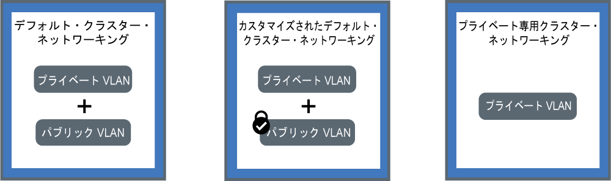

---

copyright:
  years: 2014, 2018
lastupdated: "2018-12-05"

---

{:new_window: target="_blank"}
{:shortdesc: .shortdesc}
{:screen: .screen}
{:pre: .pre}
{:table: .aria-labeledby="caption"}
{:codeblock: .codeblock}
{:tip: .tip}
{:note: .note}
{:important: .important}
{:deprecated: .deprecated}
{:download: .download}

# クラスター内ネットワークおよびプライベート・ネットワークの計画
{: #planning}

{{site.data.keyword.containerlong}} クラスターのネットワーク・セットアップを計画します。
{: shortdesc}

## クラスター内ネットワークについて
{: #in-cluster}

ワーカー・ノードにデプロイされるすべてのポッドには、172.30.0.0/16 の範囲でプライベート IP アドレスが割り当てられ、ワーカー・ノード間でのみ転送されます。 競合を避けるために、ご使用のワーカー・ノードと通信するノードにはこの IP 範囲を使用しないでください。 ワーカー・ノードとポッドは、プライベート IP アドレスを使用してプライベート・ネットワーク上で安全に通信できます。 しかし、ポッドが異常終了した場合やワーカー・ノードを再作成する必要がある場合は、新しいプライベート IP アドレスが割り当てられます。

デフォルトでは、高可用性が必要とされるアプリの変化するプライベート IP アドレスを追跡することは困難です。 代わりに、組み込みの Kubernetes サービス・ディスカバリー機能を使用して、アプリをプライベート・ネットワーク上のクラスター IP サービスとして公開することができます。 Kubernetes サービスは、一連のポッドをグループ化し、これらのポッドへのネットワーク接続を提供します。 この接続では、各ポッドの実際のプライベート IP アドレスを公開することなく、クラスター内の他のサービスへの接続を提供します。 サービスには、クラスター内部でのみアクセス可能なクラスター内 IP アドレスが割り当てられます。
* 古いクラスター: dal13 ゾーンで 2018 年 2 月より前に作成されたクラスター、またはその他のゾーンで 2017 年 10 月より前に作成されたクラスターでは、10.10.10.0/24 の範囲で 254 個の IP の中からサービスに IP が割り当てられます。 254 個のサービス数の上限に達し、さらに多くのサービスが必要な場合は、新規クラスターを作成する必要があります。
* 新しいクラスター: dal13 ゾーンで 2018 年 2 月より後に作成されたクラスター、またはその他のゾーンで 2017 年 10 月より後に作成されたクラスターでは、172.21.0.0/16 の範囲で 65,000 個の IP の中からサービスに IP が割り当てられます。

競合を避けるために、ご使用のワーカー・ノードと通信するノードにはこの IP 範囲を使用しないでください。 サービスのために DNS 参照エントリーも作成され、クラスターの `kube-dns` コンポーネントに保管されます。 DNS エントリーには、サービスの名前、サービスが作成された名前空間、割り当てられたクラスター内 IP アドレスへのリンクが含まれています。

クラスター・サービスの背後にあるポッドにアクセスする場合、アプリでは、サービスのクラスター内 IP アドレスを使用するか、サービスの名前を使用して要求を送信します。 サービスの名前を使用した場合は、名前が `kube-dns` コンポーネント内で検索され、サービスのクラスター内 IP アドレスに転送されます。 要求がサービスに到達すると、ポッドのクラスター内 IP アドレスやデプロイ先のワーカー・ノードに関係なく、要求がサービスによってポッドに均等に転送されます。

 

## VLAN 接続およびネットワーク・インターフェースについて
{: #interfaces}

{{site.data.keyword.containerlong_notm}} には、ワーカー・ノードのために高品質のネットワーク・パフォーマンスとネットワークの分離を実現する IBM Cloud インフラストラクチャー (SoftLayer) VLAN が用意されています。 VLAN では、ワーカー・ノードとポッドをまとめたグループが同じ物理ワイヤーに接続されているかのように構成されます。 VLAN は各 {{site.data.keyword.Bluemix_notm}} アカウントに専用のものであり、複数の IBM カスタマーの間で共有されることはありません。

デフォルトでは、すべてのクラスターはプライベート VLAN に接続されます。 各ワーカー・ノードに割り当てられるプライベート IP アドレスは、プライベート VLAN によって決定されます。 ワーカーにはプライベート・ネットワーク・インターフェースがあり、プライベート・ネットワークを介してアクセス可能です。 パブリック VLAN にも接続されるクラスターを作成した場合、クラスターにはパブリック・ネットワーク・インターフェースもあります。 パブリック VLAN により、ワーカー・ノードは自動的かつ安全にマスターに接続できます。 クラスターのデフォルトの VLAN について詳しくは、[クラスター用のデフォルトの VLAN、サブネット、および IP](cs_subnets.html#default_vlans_subnets) を参照してください。

クラスター・ネットワークのセットアップは、クラスターのネットワーク・インターフェースによって定義できます。

* **デフォルトのクラスター・ネットワーク**: プライベートとパブリックのネットワーク・インターフェースの両方を持つクラスター
* **カスタマイズされたデフォルトのクラスター・ネットワーク**: プライベートとパブリックのネットワーク・インターフェースの両方を持つクラスター、および着信パブリック・トラフィックをブロックする Calico ネットワーク・ポリシー
* **プライベート専用クラスター・ネットワーク**: プライベート・ネットワーク・インターフェースのみを持つクラスター

以下のいずれかのセットアップをクリックして、クラスターのネットワークを計画します。

<map name="home_map" id="home_map">
<area href="#both_vlans" alt="デフォルトのクラスター・ネットワークの計画" title="デフォルトのクラスター・ネットワークの計画" shape="rect" coords="-7, -8, 149, 211" />
<area href="#both_vlans_private" alt="カスタマイズされたデフォルトのクラスター・ネットワークの計画" title="カスタマイズされたデフォルトのクラスター・ネットワークの計画" shape="rect" coords="196, -1, 362, 210" />
<area href="#private_vlan" alt="プライベート専用クラスター・ネットワーキングの計画" title="プライベート専用クラスター・ネットワーキングの計画" shape="rect" coords="409, -10, 572, 218" />
</map>

 

## デフォルトのクラスター・ネットワークの計画
{: #both_vlans}

デフォルトでは、{{site.data.keyword.containerlong_notm}} は、パブリック VLAN およびプライベート VLAN にアクセスできるクラスターをセットアップします。
{:shortdesc}

**このセットアップでクラスターが取得するもの**
* ワーカー・ノードにパブリック・ネットワーク・インターフェースを与える、各ワーカー・ノードのパブリック IP アドレス
* ワーカー・ノードにプライベート・ネットワーク・インターフェースを付与する、各ワーカー・ノードのプライベート IP アドレス
* すべてのワーカー・ノードとマスターの間の自動的で安全な OpenVPN 接続

**このセットアップを使用する理由**

* 単一ゾーンのクラスター内にあるアプリが、パブリック・インターネットにアクセス可能である必要がある。
* 複数ゾーン・クラスター内のパブリック・インターネットにアクセス可能である必要があるアプリがあります。 複数ゾーン・クラスターを作成するために、[VLAN スパンニング](cs_subnets.html#subnet-routing)を有効にする必要があるので、クラスターは、同じ IBM Cloud アカウント内のプライベート VLAN に接続されている他のシステムと通信が可能になります。 プライベート・ネットワーク上の複数ゾーン・クラスターを分離するには、[Calico ネットワーク・ポリシー](cs_network_policy.html#isolate_workers)を使用することができます。

**クラスターへのパブリック・アクセスおよびプライベート・アクセスを管理するためのオプション**
 以下のセクションでは、パブリック VLAN およびプライベート VLAN に接続されているクラスターのネットワークをセットアップするために使用できる {{site.data.keyword.containerlong_notm}} の機能について説明します。

### ネットワーク・サービスを使用してアプリを公開する
{: #both_vlans_services}

ワーカー・ノードのパブリック・ネットワーク・インターフェースは、クラスターの作成時にすべてのワーカー・ノードに構成される[事前定義済み Calico ネットワーク・ポリシー設定](cs_network_policy.html#default_policy)によって保護されます。 デフォルトでは、すべてのワーカー・ノードに対して、すべてのアウトバウンド・ネットワーク・トラフィックが許可されます。 数個のポートを除いて、インバウンド・ネットワーク・トラフィックがブロックされます。 これらのポートは、IBM がネットワーク・トラフィックをモニターし、Kubernetes マスターのセキュリティー更新を自動的にインストールできるように開かれています。

アプリをパブリックまたはプライベートのネットワークに公開する場合は、パブリックまたはプライベートの NodePort、LoadBalancer、または Ingress サービスを作成できます。 各サービスについて詳しくは、[NodePort、LoadBalancer、または Ingress サービスの選択](cs_network_planning.html#external)を参照してください。

### オプション: ネットワーク・ワークロードをエッジ・ワーカー・ノードに分離する
{: #both_vlans_edge}

エッジ・ワーカー・ノードを使用すると、外部的にアクセスされるワーカー・ノードの数を減らし、ネットワークのワークロードを分離することができるので、クラスターのセキュリティーが改善されます。 指定したワーカー・ノードにのみ Ingress とロード・バランサー・ポッドがデプロイされるようにするには、[ワーカー・ノードにエッジ・ノードのラベルを付けます](cs_edge.html#edge_nodes)。 他のワークロードをエッジ・ノードで実行しないようにするには、[エッジ・ノードにテイントを適用します](cs_edge.html#edge_workloads)。

### オプション: strongSwan VPN を使用してオンプレミス・ネットワークまたは IBM Cloud Private に接続する
{: #both_vlans_vpn}

ワーカー・ノードとアプリをオンプレミス・ネットワークに安全に接続するために、[strongSwan IPSec VPN サービス ](https://www.strongswan.org/about.html) をセットアップできます。 strongSwan IPSec VPN サービスは、業界標準の Internet Protocol Security (IPSec) プロトコル・スイートに基づき、インターネット上にセキュアなエンドツーエンドの通信チャネルを確立します。
* クラスターとオンプレミス・ネットワークの間にセキュアな接続をセットアップするためには、クラスター内のポッドに直接、[strongSwan IPSec VPN サービスを構成してデプロイします](cs_vpn.html#vpn-setup)。
* クラスターと IBM Cloud Private インスタンスの間にセキュア接続をセットアップするには、[strongSwan VPN でのパブリック・クラウドとプライベート・クラウドの接続](cs_hybrid.html#hybrid_vpn)を参照してください。

 

## カスタマイズされたデフォルトのクラスター・ネットワークの計画
{: #both_vlans_private}

デフォルトでは、{{site.data.keyword.containerlong_notm}} は、パブリック VLAN およびプライベート VLAN にアクセスできるクラスターをセットアップします。 ただし、ネットワーク・ポリシーを使用してデフォルトのネットワークのセットアップをカスタマイズし、パブリック・アクセスをブロックすることができます。
{:shortdesc}

**このセットアップでクラスターが取得するもの**
* ワーカー・ノードにパブリック・ネットワーク・インターフェースを与える、各ワーカー・ノードのパブリック IP アドレス
* ワーカー・ノードにプライベート・ネットワーク・インターフェースを付与する、各ワーカー・ノードのプライベート IP アドレス
* すべてのワーカー・ノードとマスターの間の自動的で安全な OpenVPN 接続

**このセットアップを使用する理由**

* 単一ゾーン・クラスター内にアプリがあります。 このアプリを、クラスター内、または同じプライベート VLAN に接続されている他のクラスター内のポッドに対してのみ公開する必要があります。
* 複数ゾーン・クラスター内にアプリがあります。 このアプリを、クラスター内、またはクラスターと同じプライベート VLAN に接続されている他のクラスター内のポッドに対してのみ公開する必要があります。 しかし、複数ゾーン・クラスターのために [VLAN スパンニング](cs_subnets.html#subnet-routing)を有効にする必要があるので、同じ IBM Cloud アカウントに属するプライベート VLAN に接続されている他のシステムがクラスターにアクセスできます。 複数ゾーン・クラスターをその他のシステムから隔離することもできます。

**クラスターへのパブリック・アクセスおよびプライベート・アクセスを管理するためのオプション** 以下のセクションでは、プライベート専用のネットワークをセットアップし、パブリック VLAN およびプライベート VLAN に接続されているクラスターのパブリック・ネットワークをロックダウンするために使用できる {{site.data.keyword.containerlong_notm}} の機能について説明します。

### プライベート・ネットワーク・サービスでアプリを公開し、Calico ネットワーク・ポリシーでクラスターをパブリック・アクセスから保護する
{: #both_vlans_private_services}

ワーカー・ノードのパブリック・ネットワーク・インターフェースは、クラスターの作成時にすべてのワーカー・ノードに構成される[事前定義済み Calico ネットワーク・ポリシー設定](cs_network_policy.html#default_policy)によって保護されます。 デフォルトでは、すべてのワーカー・ノードに対して、すべてのアウトバウンド・ネットワーク・トラフィックが許可されます。 数個のポートを除いて、インバウンド・ネットワーク・トラフィックがブロックされます。 これらのポートは、IBM がネットワーク・トラフィックをモニターし、Kubernetes マスターのセキュリティー更新を自動的にインストールできるように開かれています。

アプリをプライベート・ネットワークのみで公開する場合は、プライベート NodePort、LoadBalancer、または Ingress サービスを作成できます。 プライベート外部ネットワークの計画について詳しくは、[パブリックおよびプライベート VLAN を使用するセットアップのためのプライベート外部ネットワーキングの計画](cs_network_planning.html#private_both_vlans)を参照してください。

ただし、デフォルトの Calico ネットワーク・ポリシーでは、インターネットからこれらのサービスへのインバウンド・パブリック・ネットワーク・トラフィックも許可されます。 サービスへのすべてのパブリック・トラフィックをブロックする Calico ポリシーを作成できます。 例えば、NodePort サービスは、ワーカー・ノードのプライベート IP アドレスとパブリック IP アドレスの両方に対して、ワーカー・ノード上のポートを開きます。 ポータブル・プライベート IP アドレスを持つロード・バランサー・サービスでは、すべてのワーカー・ノードでパブリック NodePort を開きます。 [Calico preDNAT ネットワーク・ポリシー](cs_network_policy.html#block_ingress)を作成してパブリック NodePort をブロックする必要があります。

例えば、プライベート・ロード・バランサー・サービスを作成したとします。 また、ロード・バランサーによって開かれたパブリック NodePort へのパブリック・トラフィックの到達をブロックする Calico preDNAT ポリシーを作成しました。 このプライベート・ロード・バランサーには、以下がアクセスできます。
* [同じクラスター内のポッド](#in-cluster)
* 同じプライベート VLAN に接続されているクラスター内のポッド
* [VLAN スパンニングが有効になっている](cs_subnets.html#subnet-routing)場合、同じ IBM Cloud アカウント内のいずれかのプライベート VLAN に接続されているすべてのシステム
* IBM Cloud アカウントに含まれていないが、会社のファイアウォールの背後にある場合は、ロード・バランサー IP があるサブネットへの VPN 接続を介するすべてのシステム
* 異なる IBM Cloud アカウントに含まれている場合は、ロード・バランサー IP があるサブネットへの VPN 接続を介するすべてのシステム

### プライベート・ネットワーク上のクラスターを分離する
{: #isolate}

複数ゾーン・クラスター、単一ゾーン・クラスター用の複数の VLAN、または同じ VLAN 上に複数のサブネットがある場合は、[VLAN スパンニングを有効](/docs/infrastructure/vlans/vlan-spanning.html#vlan-spanning)にして、ワーカー・ノードがプライベート・ネットワーク上で相互に通信できるようにする必要があります。 ただし、VLAN スパンニングが有効になっている場合、同じ IBM Cloud アカウント内のいずれかのプライベート VLAN に接続されているすべてのシステムはワーカーにアクセスできます。 [Calico ネットワーク・ポリシー](cs_network_policy.html#isolate_workers)を使用して、プライベート・ネットワーク上の他のシステムから複数ゾーン・クラスターを分離できます。 このポリシーでは、プライベート・ファイアウォールで開いたプライベート IP 範囲およびポートの着信および発信も許可されます。

### オプション: ネットワーク・ワークロードをエッジ・ワーカー・ノードに分離する
{: #both_vlans_private_edge}

エッジ・ワーカー・ノードを使用すると、外部的にアクセスされるワーカー・ノードの数を減らし、ネットワークのワークロードを分離することができるので、クラスターのセキュリティーが改善されます。 指定したワーカー・ノードにのみ Ingress とロード・バランサー・ポッドがデプロイされるようにするには、[ワーカー・ノードにエッジ・ノードのラベルを付けます](cs_edge.html#edge_nodes)。 他のワークロードをエッジ・ノードで実行しないようにするには、[エッジ・ノードにテイントを適用します](cs_edge.html#edge_workloads)。

次に、[Calico preDNAT ネットワーク・ポリシー](cs_network_policy.html#block_ingress)を使用して、エッジ・ワーカー・ノードを実行しているクラスター上のパブリック NodePort へのトラフィックをブロックします。 ノード・ポートをブロックすることにより、エッジ・ワーカー・ノードだけが着信トラフィックを扱うワーカー・ノードとなります。

### オプション: strongSwan VPN を使用してオンプレミス・ネットワークまたは IBM Cloud Private に接続する
{: #both_vlans_private_vpn}

ワーカー・ノードとアプリをオンプレミス・ネットワークに安全に接続するために、[strongSwan IPSec VPN サービス ](https://www.strongswan.org/about.html) をセットアップできます。 strongSwan IPSec VPN サービスは、業界標準の Internet Protocol Security (IPSec) プロトコル・スイートに基づき、インターネット上にセキュアなエンドツーエンドの通信チャネルを確立します。
* クラスターとオンプレミス・ネットワークの間にセキュアな接続をセットアップするためには、クラスター内のポッドに直接、[strongSwan IPSec VPN サービスを構成してデプロイします](cs_vpn.html#vpn-setup)。
* クラスターと IBM Cloud Private インスタンスの間にセキュア接続をセットアップするには、[strongSwan VPN でのパブリック・クラウドとプライベート・クラウドの接続](cs_hybrid.html#hybrid_vpn)を参照してください。

 

## プライベート専用クラスター・ネットワーキングの計画
{: #private_vlan}

CLI で `--private-only` フラグを含めることによって、[プライベート VLAN のみのクラスターを作成](cs_clusters.html#clusters_cli)することもできます。 ワーカー・ノードがプライベート VLAN にのみ接続されている場合、ワーカー・ノードは自動的にはマスターに接続することができません。 ワーカー・ノードをマスターに接続するには、ゲートウェイ・アプライアンスを使用する必要があります。 また、ゲートウェイ・アプライアンスをファイアウォールとして使用して、不要なアクセスからクラスターを保護することもできます。
{:shortdesc}

**このセットアップでクラスターが取得するもの**
* ワーカー・ノードにプライベート・ネットワーク・インターフェースを付与する、各ワーカー・ノードのプライベート IP アドレス

**このセットアップでクラスターが取得しないもの**
* ワーカー・ノードにパブリック・ネットワーク・インターフェースを与える、各ワーカー・ノードのパブリック IP アドレス。 このクラスターは公開されません。
* すべてのワーカー・ノードとマスターの間の自動接続。 この接続を提供するには、[ゲートウェイ・アプライアンスを構成](#private_vlan_gateway)します。

**このセットアップを使用する理由**
 特定のセキュリティー要件があるか、または専用ネットワーク・セキュリティーを提供するためにカスタム・ネットワーク・ポリシーおよびルーティング・ルールを作成する必要があります。 ゲートウェイ・アプライアンスを使用すると別途コストが発生することに注意してください。 詳しくは、[資料](/docs/infrastructure/fortigate-10g/explore-firewalls.html)を参照してください。

**クラスターへのパブリック・アクセスおよびプライベート・アクセスを管理するためのオプション**
 以下のセクションでは、プライベート VLAN のみに接続されているクラスターのネットワークをセットアップするために使用できる {{site.data.keyword.containerlong_notm}} の機能について説明します。

### ゲートウェイ・アプライアンスの構成
{: #private_vlan_gateway}

ワーカー・ノードにプライベート VLAN のみをセットアップする場合は、ワーカー・ノードとマスターの間のネットワーク接続のための代替ソリューションを構成する必要があります。 カスタム・ネットワーク・ポリシーをファイアウォールにセットアップして、標準クラスターのための専用ネットワーク・セキュリティーを設定し、ネットワーク侵入を検出して対処することができます。 例えば、ファイアウォールとして機能し、不要なトラフィックをブロックする[仮想ルーター・アプライアンス](/docs/infrastructure/virtual-router-appliance/about.html)または [Fortigate Security Appliance](/docs/infrastructure/fortigate-10g/about.html) をセットアップできます。 ファイアウォールをセットアップする場合は、マスター・ノードとワーカー・ノードが通信できるように、地域ごとに[必要なポートと IP アドレスを開く](cs_firewall.html#firewall_outbound)必要もあります。

既存のルーター・アプライアンスがある場合にクラスターを追加すると、クラスター用に注文した新しいポータブル・サブネットは、ルーター・アプライアンス上に構成されません。 ネットワーク・サービスを使用するには、[VLAN スパンニングを有効にして](cs_subnets.html#vra-routing)、同じ VLAN 上のサブネット間の転送を可能にする必要があります。
{: important}

### プライベート・ネットワーク・サービスを使用してアプリを公開する
{: #private_vlan_services}

アプリをプライベート・ネットワークのみからアクセスできるようにするには、プライベートの NodePort、LoadBalancer、または Ingress サービスを使用します。 ワーカー・ノードはパブリック VLAN に接続されていないため、パブリック・トラフィックはこれらのサービスに転送されません。 また、これらのサービスへのインバウンド・トラフィックを許可するには、[必要なポートおよび IP アドレスを開く](cs_firewall.html#firewall_inbound)必要もあります。

各サービスについて詳しくは、[NodePort、LoadBalancer、または Ingress サービスの選択](cs_network_planning.html#external)を参照してください。

### オプション: ゲートウェイ・アプライアンスを使用してオンプレミス・データベースに接続する
{: #private_vlan_vpn}

ワーカー・ノードとアプリケーションをオンプレミス・ネットワークに安全に接続するには、VPN ゲートウェイをセットアップする必要があります。 以前にセットアップした VRA または FSA を使用して、IPSec VPN エンドポイントを構成することもできます。 VRA を構成するには、[Vyatta を使用した VRA 接続のセットアップ](cs_vpn.html#vyatta)を参照してください。
