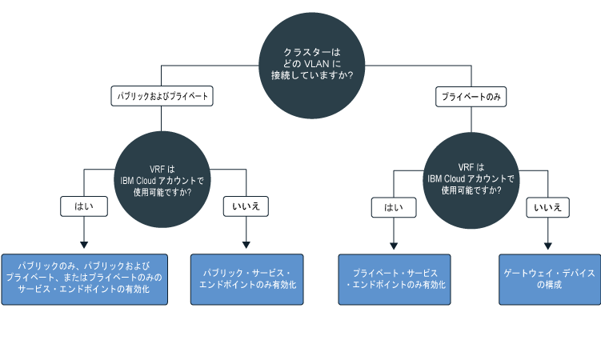

---

copyright:
  years: 2014, 2019
lastupdated: "2019-04-15"

---

{:new_window: target="_blank"}
{:shortdesc: .shortdesc}
{:screen: .screen}
{:pre: .pre}
{:table: .aria-labeledby="caption"}
{:codeblock: .codeblock}
{:tip: .tip}
{:note: .note}
{:important: .important}
{:deprecated: .deprecated}
{:download: .download}

# クラスター・ネットワークの計画
{: #cs_network_ov}

{{site.data.keyword.containerlong}} クラスターのネットワーク・セットアップを計画します。
{: shortdesc}

このページには、クラスターのネットワーク構成をセットアップするときに役立つ情報を記載します。 アプリ用のネットワークのセットアップ方法については、 [クラスターの内部ネットワークおよび外部ネットワークを使用してアプリを公開するための計画](/docs/containers?topic=containers-cs_network_planning)を参照してください。
{: tip}

## {{site.data.keyword.containerlong_notm}} ネットワークの基本について
{: #cs_network_ov_basics}

クラスター・ネットワークのセットアップを開始する前に、{{site.data.keyword.containerlong_notm}} クラスター内のネットワークの基本的な概念を理解することが大切です。
{: shortdesc}

### 相互通信する必要があるクラスター・コンポーネントは何か?
{: #cs_network_ov_basics_components}

クラスターを作成するときには、特定のクラスター・コンポーネントがお互いに通信できるように、ネットワークのセットアップを選択する必要があります。
{: shortdesc}

* ワーカー・ノード間の相互通信およびワーカー・ノード対 Kubernetes マスターの通信を行うために、すべてのワーカー・ノードを 1 つの VLAN に接続する必要があります。 VLAN を選択するには、[ワーカー間通信の計画](#cs_network_ov_worker)を参照してください。
* ワーカー間の相互通信およびワーカー対 Kubernetes マスターの通信を行うために、複数のプライベート VLAN をまたぐ通信を許可する必要があります。 仮想ルーター機能 (VRF) または VLAN スパンニングを有効にするには、[ネットワーク・セグメンテーションを確保するための VLAN およびサブネットの構成方法](#cs_network_ov_basics_segmentation)を参照してください。
* 各ワーカーはパブリック・ネットワークでもプライベート・ネットワークでも安全に Kubernetes マスターと通信できます。 ワーカー対マスターの通信チャネルを選択するには、[マスター対ワーカーの通信の計画](#cs_network_ov_master)を参照してください。

### {{site.data.keyword.containerlong_notm}} のネットワークの仕組み
{: #cs_network_ov_basics_vlans}

{{site.data.keyword.containerlong_notm}} は VLAN、サブネット、IP アドレスを使用してクラスター・コンポーネントのネットワーク接続を実現しています。
{: shortdesc}

**VLAN とは何ですか? {{site.data.keyword.containerlong_notm}} で提供されるのはどのようなタイプの VLAN ですか?** 

クラスターを作成すると、クラスターの各ワーカー・ノードが 1 つの VLAN に自動的に接続されます。 VLAN では、ワーカー・ノードとポッドをまとめた 1 つのグループを、それらのワーカー・ノードとポッドが同じ物理ワイヤーに接続されているかのように構成し、それらのワーカーとポッド間の接続に 1 つのチャネルを提供します。
{: shortdesc}

<dl>
<dt>フリー・クラスター用の VLAN</dt>
<dd>フリー・クラスターでは、クラスターのワーカー・ノードは、IBM 所有のパブリック VLAN とプライベート VLAN にデフォルトで接続されます。 IBM が VLAN、サブネット、および IP アドレスを制御するので、ユーザーは複数ゾーン・クラスターを作成することも、クラスターにサブネットを追加することもできません。また、アプリを公開するには NodePort サービスだけを使用できます。</dd>
<dt>標準クラスター用の VLAN</dt>
<dd>標準クラスターでは、あるゾーンで初めてクラスターを作成したときに、そのゾーン内のパブリック VLAN とプライベート VLAN が IBM Cloud インフラストラクチャー (SoftLayer) アカウントで自動的にプロビジョンされます。 それ以降、そのゾーンにクラスターを作成するたびに、そのゾーンで使用したい VLAN のペアを指定する必要があります。 VLAN は複数のクラスターで共有できるので、お客様用に作成された同一のパブリック VLAN とプライベート VLAN を何度も使用することができます。 
 ワーカー・ノードをパブリック VLAN とパブリック VLAN の両方に接続することも、プライベート VLAN だけに接続することもできます。 ワーカー・ノードをプライベート VLAN にのみ接続する場合は、既存のプライベート VLAN の ID を使用することもできますし、[プライベート VLAN を作成し](/docs/cli/reference/ibmcloud?topic=cloud-cli-manage-classic-vlans#sl_vlan_create)、クラスター作成時にその ID を使用することもできます。</dd></dl>

ご使用のアカウントの各ゾーンにプロビジョン済みの VLAN を確認するには、`ibmcloud ks vlans --zone <zone>` を実行します。 あるクラスターがプロビジョンされている VLAN を確認するには、`ibmcloud ks cluster-get --cluster <cluster_name_or_ID> --showResources` を実行して **Subnet VLANs** セクションを探します。

IBM Cloud インフラストラクチャー (SoftLayer) は、ゾーンに最初のクラスターを作成する際に自動的にプロビジョンされる VLAN を管理します。 VLAN からすべてのワーカー・ノードを削除した場合などのように、VLAN を未使用の状態にすると、IBM Cloud インフラストラクチャー (SoftLayer) は VLAN を再利用します。 その後、新規 VLAN が必要な場合は、[{{site.data.keyword.Bluemix_notm}} サポートにお問い合わせください](/docs/infrastructure/vlans?topic=vlans-ordering-premium-vlans#ordering-premium-vlans)。

**VLAN の選択はクラスターにどのように影響しますか?** 

どの VLAN 接続を選択するかによって、クラスター内で Kubernetes マスター・ノードとワーカー・ノードが相互通信する方法が決まります。 詳しくは、[ワーカー・ノードと Kubernetes マスターの通信の計画](/docs/containers?topic=containers-cs_network_ov#cs_network_ov_master)を参照してください。

どの VLAN 接続を選択するかによって、アプリのネットワーク接続も決まります。 詳しくは、[クラスターの内部ネットワークおよび外部ネットワークを使用してアプリを公開するための計画](/docs/containers?topic=containers-cs_network_planning)を参照してください。

### サブネットとは? {{site.data.keyword.containerlong_notm}} で提供されるサブネットのタイプは?
{: #cs_network_ov_basics_subnets}

ワーカー・ノードとポッドに加えて、サブネットも VLAN に自動的にプロビジョンされます。 サブネットは、クラスター・コンポーネントに IP アドレスを割り当てることによって、クラスター・コンポーネントにネットワーク接続を提供します。
{: shortdesc}

次の各サブネットが、デフォルトのパブリック VLAN とプライベート VLAN に自動的にプロビジョンされます。

**パブリック VLAN サブネット**
* 1 次パブリック・サブネットでは、クラスター作成時にワーカー・ノードに割り当てられるパブリック IP アドレスを決定します。 同じ VLAN に参加している複数のクラスターでは、1 つの 1 次パブリック・サブネットを共有することができます。
* ポータブル・パブリック・サブネットは 1 つのクラスターだけにバインドされ、そのクラスターに 8 つのパブリック IP アドレスを提供します。 IBM Cloud インフラストラクチャー (SoftLayer) の機能のために 3 つの IP が予約されています。 1 つの IP がデフォルトのパブリック Ingress ALB によって使用され、4 つの IP をパブリック・ネットワーク・ロード・バランサー (NLB) サービスを作成するために使用できます。 ポータブル・パブリック IP は固定された永続的な IP アドレスであり、このアドレスを使用して、インターネットを介して NLB にアクセスできます。 NLB に 4 つを超える IP が必要な場合は、[ポータブル IP アドレスの追加](/docs/containers?topic=containers-subnets#adding_ips)を参照してください。

**プライベート VLAN サブネット**
* 1 次プライベート・サブネットでは、クラスター作成時にワーカー・ノードに割り当てられるプライベート IP アドレスを決定します。 同じ VLAN に参加している複数のクラスターでは、1 つの 1 次プライベート・サブネットを共有することができます。
* ポータブル・プライベート・サブネットは 1 つのクラスターだけにバインドされ、そのクラスターに 8 つのプライベート IP アドレスを提供します。 IBM Cloud インフラストラクチャー (SoftLayer) の機能のために 3 つの IP が予約されています。 1 つの IP がデフォルトのプライベート Ingress ALB によって使用され、4 つの IP をプライベート・ネットワーク・ロード・バランサー (NLB) サービスを作成するために使用できます。 ポータブル・プライベート IP は固定された永続的な IP アドレスであり、このアドレスを使用して、プライベート・ネットワークを介して NLB にアクセスできます。 プライベート NLB に 4 つを超える IP が必要な場合は、[ポータブル IP アドレスの追加](/docs/containers?topic=containers-subnets#adding_ips)を参照してください。

ご使用のアカウントでプロビジョンされたすべてのサブネットを確認するには、`ibmcloud ks subnets` を実行します。 あるクラスターにバインドされているパブリックとプライベートのポータブル・サブネットを確認するには、`ibmcloud ks cluster-get --cluster <cluster_name_or_ID> --showResources` を実行して **Subnet VLANs** セクションを探します。

{{site.data.keyword.containerlong_notm}} では、VLAN のサブネット数の上限は 40 です。 この制限に達したら、まず [その VLAN 内にあるサブネットを再利用して新規クラスターを作成](/docs/containers?topic=containers-subnets#subnets_custom)できるかどうかを確認します。 新規 VLAN が必要な場合、[{{site.data.keyword.Bluemix_notm}} サポートに連絡して](/docs/infrastructure/vlans?topic=vlans-ordering-premium-vlans#ordering-premium-vlans)注文してください。 その後、その新規 VLAN を使用する[クラスターを作成します](/docs/containers?topic=containers-cs_cli_reference#cs_cluster_create)。
{: note}

### ネットワーク・セグメンテーションを確保するための VLAN およびサブネットの構成方法
{: #cs_network_ov_basics_segmentation}

ネットワーク・セグメンテーションとは、1 つのネットワークを複数のサブネットワークに分割する方式を表すものです。 あるサブネットワーク内で実行されるアプリは、別のサブネットワーク内のアプリを認識することも、アクセスすることもできません。 ネットワーク・セグメンテーションのオプションおよび VLAN との関係について詳しくは、[クラスターのセキュリティーに関するこちらのトピック](/docs/containers?topic=containers-security#network_segmentation)を参照してください。
{: shortdesc}

ただし、状況によっては、クラスターのコンポーネントに、複数のプライベート VLAN をまたぐ通信を許可しなければならない場合があります。 例えば、複数ゾーン・クラスターを作成する場合や、1 つのクラスターに複数の VLAN が存在する場合、同じ VLAN 上に複数のサブネットが存在する場合は、同じ VLAN 上にあってもサブネットが異なるワーカー・ノード、または異なる VLAN 上にあるワーカー・ノードは、そのままでは相互通信することができません。 ユーザーが IBM Cloud インフラストラクチャー (SoftLayer) アカウントで仮想ルーター機能 (VRF) または VLAN スパンニングを有効にする必要があります。

**仮想ルーター機能 (VRF) および VLAN スパンニングとは何ですか?** 

<dl>
<dt>[仮想ルーター機能 (VRF)](/docs/infrastructure/direct-link?topic=direct-link-overview-of-virtual-routing-and-forwarding-vrf-on-ibm-cloud#overview-of-virtual-routing-and-forwarding-vrf-on-ibm-cloud)</dt>
<dd>VRF を使用すると、インフラストラクチャー・アカウント内のすべての VLAN およびサブネットが相互通信できるようになります。 また、プライベート・サービス・エンドポイントを介してワーカーとマスターを通信させる場合も VRF が必要です。 VRF を有効にするには、[IBM Cloud インフラストラクチャー (SoftLayer) のアカウント担当者に連絡してください](/docs/infrastructure/direct-link?topic=direct-link-overview-of-virtual-routing-and-forwarding-vrf-on-ibm-cloud#how-you-can-initiate-the-conversion)。 VRF を有効にする場合は、アカウントの VLAN スパンニングは不要になることに注意してください。トラフィックを管理するゲートウェイ・アプライアンスを構成していない限り、すべての VLAN が通信できるようになるからです。</dd>
<dt>[VLAN スパンニング](/docs/infrastructure/vlans?topic=vlans-vlan-spanning#vlan-spanning)</dt>
<dd>VRF の有効化が不可能または不要な場合は、VLAN スパンニングを有効にしてください。 この操作を実行するには、**「ネットワーク」>「ネットワーク VLAN スパンニングの管理」**で設定する[インフラストラクチャー権限](/docs/containers?topic=containers-users#infra_access)が必要です。ない場合は、アカウント所有者に対応を依頼してください。 VLAN スパンニングが既に有効になっているかどうかを確認するには、`ibmcloud ks vlan-spanning-get` [コマンド](/docs/containers?topic=containers-cs_cli_reference#cs_vlan_spanning_get)を使用します。 VRF の代わりに VLAN スパンニングを有効にすることを選択した場合は、プライベート・サービス・エンドポイントを有効にできないことに注意してください。</dd>
</dl>

**VRF または VLAN スパンニングがネットワーク・セグメンテーションに与える影響** 

VRF または VLAN スパンニングを有効にすると、同じ {{site.data.keyword.Bluemix_notm}} アカウントのプライベート VLAN に接続されているすべてのシステムが、ワーカーと通信できるようになります。 [Calico プライベート・ネットワーク・ポリシー](/docs/containers?topic=containers-network_policies#isolate_workers)を適用すれば、クラスターをプライベート・ネットワーク上の他のシステムから切り離せます。 また、{{site.data.keyword.containerlong_notm}} は、すべての [IBM Cloud インフラストラクチャー (SoftLayer) ファイアウォール・オファリング ](https://www.ibm.com/cloud-computing/bluemix/network-security) と一緒に使用可能です。 [仮想ルーター・アプライアンス](/docs/infrastructure/virtual-router-appliance?topic=virtual-router-appliance-about-the-vra)などのファイアウォールにカスタム・ネットワーク・ポリシーをセットアップして、標準クラスターのために専用のネットワーク・セキュリティーを装備し、ネットワーク侵入を検出して対処することができます。

 

## ワーカー間通信の計画
{: #cs_network_ov_worker}

ネットワーク・インターフェースを獲得するために、すべてのワーカー・ノードは VLAN に接続する必要があります。 そのネットワーク・インターフェースにより、各ワーカー・ノードは他のワーカー・ノードと情報を送受信できます。
{: shortdesc}

### ワーカー・ノードの VLAN 接続のための選択肢
{: #cs_network_ov_worker_options}

クラスターを作成するときに、ワーカー・ノードをパブリック VLAN とプライベート VLAN の両方に接続するか、プライベート VLAN のみに接続するかを選択できます。
{: shortdesc}

**クラスターをパブリック VLAN とプライベート VLAN の両方に接続する一般的な理由** 

ほとんどの場合、ネットワークの柔軟性は、パブリック VLAN とプライベート VLAN の両方に接続するクラスターを作成することで得られます。 以下に例を示します。
* アプリをパブリック・インターネットから利用できるようにしなければならない。
* アプリを同じクラスター内のポッド、または同じプライベート VLAN に接続された他のクラスター内のポッドだけに公開したい。 アプリをパブリック・インターフェースから保護するには、複数の方法があります。例えば、Calico ネットワーク・ポリシーを使用したり、外部ネットワークのワークロードをエッジ・ワーカー・ノードに分離したりします。

次の図は、パブリック VLAN およびプライベート VLAN に接続されているワーカー・ノードのネットワーク接続を示しています。

<figure>
 
 <figcaption>パブリック VLAN およびプライベート VLAN に接続されているワーカー・ノードのネットワーク接続</figcaption>
</figure>

複数ゾーン・クラスターを作成する場合、1 つのクラスターに複数の VLAN が存在する場合、または、同じ VLAN 上に複数のサブネットがある場合は、同じ VLAN 上にあってもサブネットが異なるワーカー・ノード、または異なる VLAN 上にあるワーカー・ノードは、そのままでは相互通信することができません。 ユーザーが IBM Cloud インフラストラクチャー (SoftLayer) アカウントで [VRF または VLAN スパンニング](#cs_network_ov_basics_segmentation)を有効にする必要があります。 [マスター対ワーカーの通信用にプライベート・サービス・エンドポイント](#cs_network_ov_master_private)を有効にするために、VRF を選択してください。 VRF の有効化が不可能または不要な場合は、VLAN スパンニングを有効にしてください。

**クラスターをプライベート VLAN だけに接続する一般的な理由** 

固有のセキュリティー要件がある場合や、専用のネットワーク・セキュリティーを装備するためにカスタムのネットワーク・ポリシーやルーティング・ルールを作成する必要がある場合は、プライベート VLAN 専用のクラスターを作成します。
{: shortdesc}

次の図は、プライベート VLAN だけに接続しているワーカー・ノードのネットワーク接続を示しています。

<figure>
 
 <figcaption>プライベート・ネットワーク・セットアップのワーカー・ノードのネットワーク接続</figcaption>
</figure>

複数ゾーン・クラスターを作成する場合、1 つのクラスターに複数の VLAN が存在する場合、または、同じ VLAN 上に複数のサブネットがある場合は、同じ VLAN 上にあってもサブネットが異なるワーカー・ノード、または異なる VLAN 上にあるワーカー・ノードは、そのままでは相互通信することができません。 ユーザーが IBM Cloud インフラストラクチャー (SoftLayer) アカウントで [VRF または VLAN スパンニング](#cs_network_ov_basics_segmentation)を有効にする必要があります。 [マスター対ワーカーの通信用にプライベート・サービス・エンドポイント](#cs_network_ov_master_private)を有効にするために、VRF を選択してください。 VRF を有効にできない、またはしたくない場合は、VLAN スパンニングを有効にし、マスターとワーカーが通信できるようにゲートウェイ・デバイスも構成する必要があります。

### VLAN 接続の選択は終わりました。 セットアップするには、どうすればよいですか?
{: #cs_network_ov_worker_setup}

[パブリック VLAN およびプライベート VLAN を使用したクラスター・ネットワーキングのセットアップ
](/docs/containers?topic=containers-cs_network_cluster#both_vlans)または [プライベート VLAN のみを使用するクラスター・ネットワーキングのセットアップ](/docs/containers?topic=containers-cs_network_cluster#setup_private_vlan)の手順に従ってください。
{: shortdesc}

### 後で VLAN の決定を変更することはできますか? ワーカー・ノードの IP アドレスは変更されますか?
{: #cs_network_ov_worker_change}

クラスターのワーカー・プールを変更することで、VLAN セットアップを変更できます。 詳しくは、[ワーカー・ノードの VLAN 接続を変更する](/docs/containers?topic=containers-cs_network_cluster#change-vlans)を参照してください。
{: shortdesc}

ワーカー・ノードには、クラスターで使用されるパブリック VLAN またはプライベート VLAN の IP アドレスが割り当てられます。ワーカー・ノードがプロビジョンされた後は、IP アドレスは変化しません。例えば、ワーカー・ノードの IP アドレスは `reload`、`reboot`、および `update` の各操作をまたいで持続します。また、ほとんどの `kubectl` コマンドでは、ワーカー・ノードの ID にワーカー・ノードのプライベート IP アドレスが使用されます。 ワーカー・プールで使用されている VLAN を変更すると、そのプールでプロビジョンされた新しいワーカー・ノードはその IP アドレスに新しい VLAN を使用します。 既存のワーカー・ノードの IP アドレスは変更されませんが、古い VLAN を使用するワーカー・ノードを削除することもできます。

 

## マスター対ワーカーの通信の計画
{: #cs_network_ov_master}

クラスターを作成するときに、クラスター構成をオーケストレーションするためのワーカー・ノードと Kubernetes マスターの通信方法を選択する必要があります。
{: shortdesc}

Kubernetes マスターがワーカー・ノードを管理できるように、通信チャネルをセットアップする必要があります。 この通信のセットアップは、どのように VLAN 接続をセットアップしたかによって異なります。 ワーカー・ノードと Kubernetes マスターの通信を可能にする方法には、パブリック・サービス・エンドポイントのみを有効にする方法、パブリックとプライベートのサービス・エンドポイントを有効にする方法、プライベート・サービス・エンドポイントのみを有効にする方法があります。 どのようにサービス・エンドポイントを使用するかを決定するには、以下のデシジョン・ツリーに従ってください。

<map name="dt-image-map" id="dt-image-map">
  <area alt="パブリック、パブリックとプライベート、またはプライベートのサービス・エンドポイントを使用したデフォルトのネットワーキング" title="パブリック、パブリックとプライベート、またはプライベートのサービス・エンドポイントを使用したデフォルトのネットワーキング" href="#cs_network_ov_master_both" coords="0,296,195,354" shape="rect" />
  <area alt="パブリック・サービス・エンドポイントのみを使用したデフォルトのネットワーキング" title="パブリック・サービス・エンドポイントのみを使用したデフォルトのネットワーキング" href="#cs_network_ov_master_public" coords="220,295,353,352" shape="rect" />
  <area alt="プライベート・サービス・エンドポイントのみを使用したプライベート・ネットワーキング" title="プライベート・サービス・エンドポイントのみを使用したプライベート・ネットワーキング" href="#cs_network_ov_master_private" coords="393,294,524,356" shape="rect" />
  <area alt="ゲートウェイ・アプライアンスを使用したプライベート・ネットワーキング" title="ゲートウェイ・アプライアンスを使用したプライベート・ネットワーキング" href="#cs_network_ov_master_gateway" coords="579,294,697,354" shape="rect" />
</map>

それぞれのセットアップについて詳しくは、以下の各セクションを参照してください。

### パブリック・サービス・エンドポイントのみ
{: #cs_network_ov_master_public}

ワーカー・ノードにプライベート VLAN とパブリック VLAN をセットアップした場合、ワーカー・ノードは、パブリック・サービス・エンドポイントを介してパブリック・ネットワーク経由でマスターに自動的に接続できます。 {{site.data.keyword.Bluemix_notm}} アカウントの VRF は不要です。
{: shortdesc}

次の図は、パブリック・サービス・エンドポイントを介したワーカー・ノードと Kubernetes マスターの通信を示しています。

<figure>
 
 <figcaption>パブリック・サービス・エンドポイントを介したワーカー・ノードと Kubernetes マスターの通信</figcaption>
</figure>

**ワーカー・ノードとマスターの通信** 
通信は、パブリック・サービス・エンドポイントを介してパブリック・ネットワーク経由で安全に確立されます。 ワーカーは TLS 証明書を使用してマスターに安全にアクセスし、マスターは OpenVPN 接続を使用してワーカーにアクセスします。

**マスターへのアクセス** 
許可されたクラスター・ユーザーは、パブリック・サービス・エンドポイントを介してパブリックからマスターにアクセスできます。 クラスター・ユーザーはインターネット経由で Kubernetes マスターに安全にアクセスし、例えば `kubectl` コマンドを実行したりできます。

クラスター作成時または作成後にパブリック・サービス・エンドポイントをセットアップするには、[パブリック・サービス・エンドポイントのセットアップ](/docs/containers?topic=containers-cs_network_cluster#set-up-public-se)の手順に従ってください。

### プライベート・サービス・エンドポイントのみ
{: #cs_network_ov_master_private}

プライベートでのみ利用可能なマスターにするには、Kubernetes バージョン 1.11 以降を実行するクラスターでプライベート・サービス・エンドポイントを有効にします。 {{site.data.keyword.Bluemix_notm}} アカウントの VRF が必要です。 クラスターがプライベート VLAN のみに接続されている場合、プライベート・サービス・エンドポイントがあれば、ゲートウェイ・デバイスがなくてもマスターに安全に接続できます。
{: shortdesc}

次の図に、プライベート・サービス・エンドポイントを介したワーカー・ノードと Kubernetes マスターの通信を示しています。

<figure>
 
 <figcaption>プライベート・サービス・エンドポイントを介したワーカー・ノードと Kubernetes マスターの通信</figcaption>
</figure>

**ワーカー・ノードとマスターの通信** 
通信は、プライベート・サービス・エンドポイントを介してプライベート・ネットワーク経由で確立されます。

**マスターへのアクセス** 
クラスター・ユーザーがマスターにアクセスするには、{{site.data.keyword.Bluemix_notm}} プライベート・ネットワークの中で作業しているか、VPN 接続経由でプライベート・ネットワークに接続している必要があります。

クラスター作成時または作成後にプライベート・サービス・エンドポイントをセットアップするには、[プライベート・サービス・エンドポイントのセットアップ
](/docs/containers?topic=containers-cs_network_cluster#set-up-private-se)の手順に従ってください。

### パブリック・サービス・エンドポイントとプライベート・サービス・エンドポイント
{: #cs_network_ov_master_both}

パブリックからでもプライベートからでもクラスター・ユーザーが利用できるマスターにするには、Kubernetes バージョン 1.11 以降を実行するクラスターで、パブリックとプライベートの両方のサービス・エンドポイントを有効にします。 {{site.data.keyword.Bluemix_notm}} アカウントの VRF が必要です。
{: shortdesc}

**ワーカー・ノードとマスターの通信** 
通信は、プライベート・サービス・エンドポイントを介するプライベート・ネットワークと、パブリック・サービス・エンドポイントを介するパブリック・ネットワークの両方を経由して確立されます。ワーカーからマスターへのトラフィックをパブリック・エンドポイントとプライベート・エンドポイントに半分ずつルーティングすると、マスターからワーカーへの通信が、パブリック・ネットワークまたはプライベート・ネットワークの可能性のある障害から保護されます。

**マスターへのアクセス** 
許可されたクラスター・ユーザーは、{{site.data.keyword.Bluemix_notm}} プライベート・ネットワークの中で作業している場合、または VPN 接続経由でプライベート・ネットワークに接続している場合に、プライベート・サービス・エンドポイントを介して、プライベートにマスターにアクセスできます。そうでない場合、許可されたクラスター・ユーザーは、パブリック・サービス・エンドポイントを介してパブリックからマスターにアクセスできます。

クラスター作成時にパブリックとプライベートの両方のサービス・エンドポイントをセットアップするには、[プライベート・サービス・エンドポイントのセットアップ](/docs/containers?topic=containers-cs_network_cluster#set-up-private-se)の手順に従ってください。 クラスター作成後に、 [パブリック](/docs/containers?topic=containers-cs_network_cluster#set-up-public-se)・サービス・エンドポイントまたは [プライベート](/docs/containers?topic=containers-cs_network_cluster#set-up-private-se)・サービス・エンドポイントを個別に有効にできます。

### ゲートウェイ・アプライアンスを使用したプライベート・ネットワーク
{: #cs_network_ov_master_gateway}

ワーカー・ノードにプライベート VLAN のみをセットアップし、{{site.data.keyword.Bluemix_notm}} アカウントの VRF を有効にしない場合は、別の方法でワーカー・ノードとマスターのネットワーク接続を構成する必要があります。 カスタム・ネットワーク・ポリシーをファイアウォールにセットアップして、標準クラスターのための専用ネットワーク・セキュリティーを設定し、ネットワーク侵入を検出して対処することができます。 例えば、ファイアウォールとして機能し、不要なトラフィックをブロックする[仮想ルーター・アプライアンス](/docs/infrastructure/virtual-router-appliance?topic=virtual-router-appliance-about-the-vra)または [Fortigate Security Appliance](/docs/services/vmwaresolutions/services?topic=vmware-solutions-fsa_considerations) をセットアップできます。 ファイアウォールをセットアップする場合は、マスター・ノードとワーカー・ノードが通信できるように、地域ごとに[必要なポートと IP アドレスを開く](/docs/containers?topic=containers-firewall#firewall_outbound)必要もあります。
{: shortdesc}

既存のルーター・アプライアンスがある場合にクラスターを追加すると、クラスター用に注文した新しいポータブル・サブネットは、ルーター・アプライアンス上に構成されません。 ネットワーク・サービスを使用するには、[VLAN スパンニングを有効にして](/docs/containers?topic=containers-subnets#vra-routing)、同じ VLAN 上のサブネット間の転送を可能にする必要があります。
{: important}

## オンプレミスのネットワークまたは {{site.data.keyword.icpfull_notm}} 通信に対するクラスターの計画
{: #cs_network_ov_vpn}

クラスターに strongSwan VPN 接続サービスをセットアップして、ワーカー・ノードとアプリをオンプレミスのネットワークや {{site.data.keyword.icpfull_notm}} に安全に接続できます。
{: shortdesc}

### パブリックおよびプライベートの VLAN を使用するセットアップのための VPN 接続の設定
{: #cs_network_ov_vpn_public}

<figure>
 
 <figcaption>デフォルトのネットワーク・セットアップにおけるクラスターとオンプレミスのネットワークまたは {{site.data.keyword.icpfull_notm}} との間の VPN 通信</figcaption>
</figure>

ワーカー・ノードとアプリをオンプレミス・ネットワークに安全に接続するには、 [strongSwan IPSec VPN サービス ](https://www.strongswan.org/about.html) をクラスターに直接セットアップします。 strongSwan IPSec VPN サービスは、業界標準の Internet Protocol Security (IPSec) プロトコル・スイートに基づき、インターネット上にセキュアなエンドツーエンドの通信チャネルを確立します。
* クラスターとオンプレミス・ネットワークの間にセキュアな接続をセットアップするためには、クラスター内のポッドに直接、[strongSwan IPSec VPN サービスを構成してデプロイします](/docs/containers?topic=containers-vpn#vpn-setup)。
* クラスターと {{site.data.keyword.icpfull_notm}} インスタンスの間にセキュア接続をセットアップするには、[strongSwan VPN でのパブリック・クラウドとプライベート・クラウドの接続](/docs/containers?topic=containers-hybrid_iks_icp#hybrid_vpn)を参照してください。

### プライベート VLAN のみを使用するセットアップのための VPN 接続の設定
{: #cs_network_ov_vpn_private}

クラスターがプライベート VLAN のみに接続されている場合、VRA (Vyatta) または FSA ゲートウェイ・デバイスに IPSec VPN エンドポイントをセットアップする必要があります。 次に、クラスターに [strongSwan IPSec VPN サービスを構成してデプロイし](/docs/containers?topic=containers-vpn#vpn-setup)、ゲートウェイの VPN エンドポイントを使用できます。 strongSwan を使用しない場合は、[VRA を使用して、直接、VPN 接続をセットアップ](/docs/containers?topic=containers-vpn#vyatta)できます。
{: shortdesc}

<figure>
 
 <figcaption>プライベート・ネットワーク・セットアップでのゲートウェイ・デバイスを介したクラスターとオンプレミスのネットワークまたは {{site.data.keyword.icpfull_notm}} との間の VPN 通信</figcaption>
</figure>

