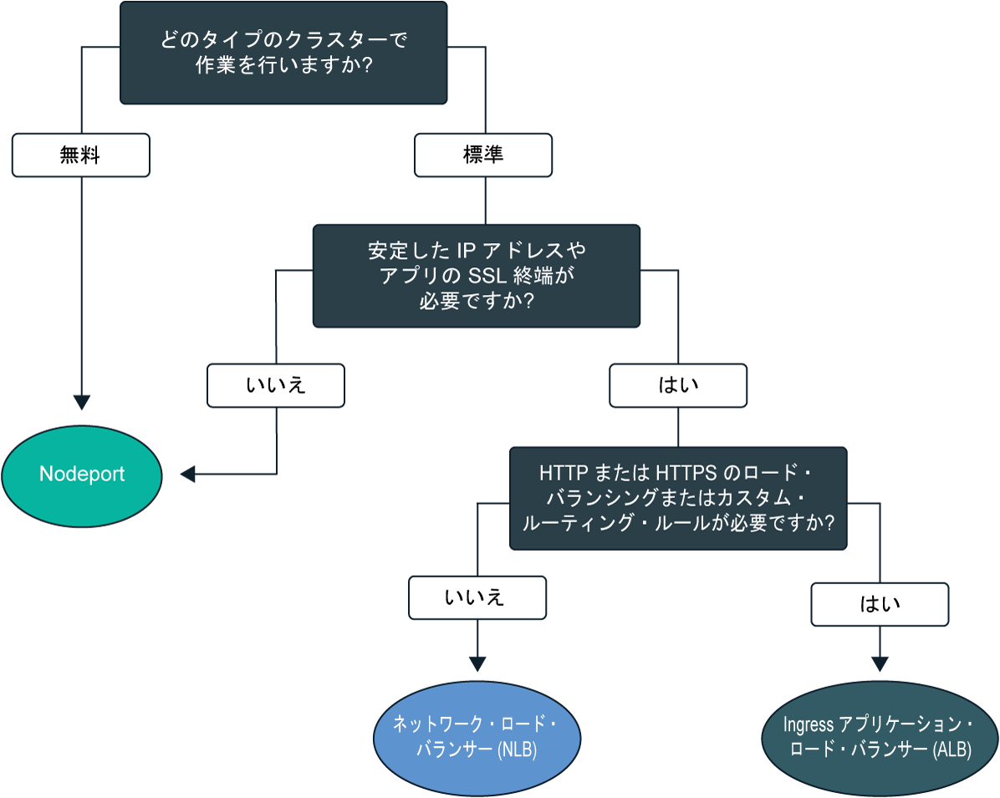
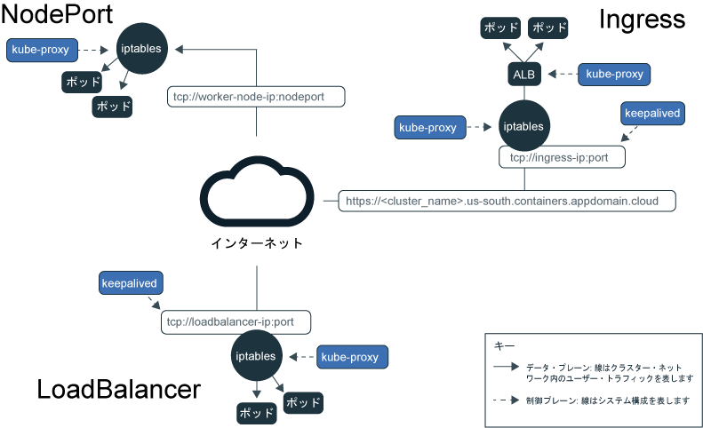
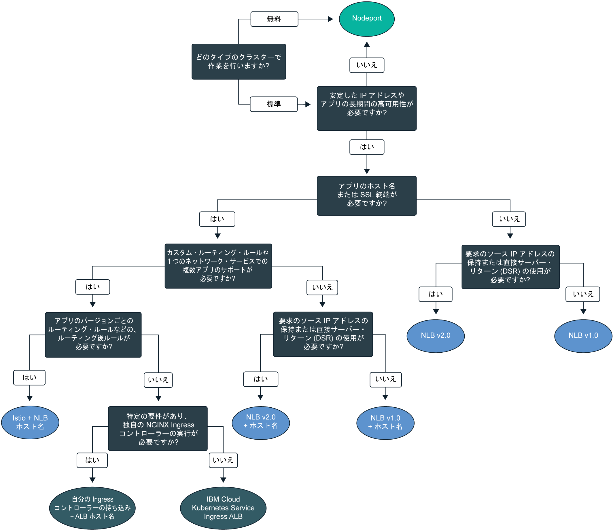

---

copyright:
  years: 2014, 2019
lastupdated: "2019-06-05"

keywords: kubernetes, iks

subcollection: containers

---

{:new_window: target="_blank"}
{:shortdesc: .shortdesc}
{:screen: .screen}
{:pre: .pre}
{:table: .aria-labeledby="caption"}
{:codeblock: .codeblock}
{:tip: .tip}
{:note: .note}
{:important: .important}
{:deprecated: .deprecated}
{:download: .download}
{:preview: .preview}

# アプリのクラスターの内部ネットワークおよび外部ネットワークの計画
{: #cs_network_planning}

{{site.data.keyword.containerlong}} では、アプリをパブリックまたはプライベートに公開して、クラスターの内部ネットワークと外部ネットワークを管理できます。
{: shortdesc}

アプリ・ネットワークを素早く開始するには、以下のデシジョン・ツリーに従ってオプションをクリックし、そのセットアップ資料を参照します。

<map name="networking_map" id="networking_map">
<area target="" href="/docs/containers?topic=containers-nodeport" alt="NodePort サービス" coords="52,254,78,260,93,270,101,285,92,302,72,314,49,318,19,309,0,281,18,263" shape="poly">
<area target="" href="/docs/containers?topic=containers-loadbalancer" alt="ネットワーク・ロード・バランサー (NLB) サービス" coords="288,405,324,414,348,434,350,455,327,471,295,477,246,471,222,446,237,417" shape="poly">
<area target="" href="/docs/containers?topic=containers-ingress" alt="Ingress アプリケーション・ロード・バランサー (ALB) サービス" coords="532,405,568,410,593,427,600,448,582,468,554,477,508,476,467,463,454,441,474,419" shape="poly">
</map>

## Kubernetes サービス・ディスカバリーによるアプリのロード・バランシングについて
{: #in-cluster}

Kubernetes サービス・ディスカバリーでは、ネットワーク・サービスおよびローカル Kubernetes プロキシーを使用して、アプリにネットワーク接続を提供します。
{: shortdesc}

**サービス** 
ワーカー・ノードにデプロイされるすべてのポッドには、172.30.0.0/16 の範囲でプライベート IP IP アドレスが割り当てられ、ワーカー・ノード間でのみルーティングされます。 競合を避けるために、ご使用のワーカー・ノードと通信するノードにはこの IP 範囲を使用しないでください。 ワーカー・ノードとポッドは、プライベート IP アドレスを使用してプライベート・ネットワーク上で安全に通信できます。 しかし、ポッドが異常終了した場合やワーカー・ノードを再作成する必要がある場合は、新しいプライベート IP アドレスが割り当てられます。

高可用性が必要とされるアプリの、変化するプライベート IP アドレスの追跡を試みる代わりに、組み込みの Kubernetes サービス・ディスカバリー機能を使用して、アプリをサービスとして公開できます。 Kubernetes サービスは、一連のポッドをグループ化し、これらのポッドへのネットワーク接続を提供します。 このサービスでは、ラベルを介してトラフィックをルーティングするターゲット・ポッドを選択します。

サービスは、各ポッドの実際のプライベート IP アドレスを公開することなく、アプリ・ポッドとクラスター内の他のサービスの間の接続を提供します。 サービスには、クラスター内部でのみアクセス可能なクラスター内 IP アドレス `clusterIP` が割り当てられます。 この IP アドレスは、その存続期間中はサービスに関連付けられ、そのサービスが存在する間は変化しません。
* 新しいクラスター: dal13 ゾーンで 2018 年 2 月より後に作成されたクラスター、またはその他のゾーンで 2017 年 10 月より後に作成されたクラスターでは、172.21.0.0/16 の範囲で 65,000 個の IP の中からサービスに IP が割り当てられます。
* 古いクラスター: dal13 ゾーンで 2018 年 2 月より前に作成されたクラスター、またはその他のゾーンで 2017 年 10 月より前に作成されたクラスターでは、10.10.10.0/24 の範囲で 254 個の IP の中からサービスに IP が割り当てられます。 254 個のサービス数の上限に達し、さらに多くのサービスが必要な場合は、新規クラスターを作成する必要があります。

競合を避けるために、ご使用のワーカー・ノードと通信するノードにはこの IP 範囲を使用しないでください。 サービスのために DNS 参照エントリーも作成され、クラスターの `kube-dns` コンポーネントに保管されます。 DNS エントリーには、サービスの名前、サービスが作成された名前空間、割り当てられたクラスター内 IP アドレスへのリンクが含まれています。

**`kube-proxy`** 
すべての TCP および UDP ネットワーク・トラフィックの基本ロード・バランシングをサービスに提供するために、`kube-system` 名前空間の各ワーカー・ノードでローカル Kubernetes ネットワーク・プロキシー `kube-proxy` がデーモンとして実行されます。 `kube-proxy` は Linux カーネルの機能である Iptables ルールを使用して、ポッドのクラスター内 IP アドレスやデプロイ先のワーカー・ノードに関係なく、要求をサービスのポッドに均等に転送します。

例えば、クラスター内部のアプリは、サービスのクラスター内 IP アドレスを使用するか、サービスの名前を使用して要求を送信して、クラスター・サービスのポッドにアクセスできます。 サービスの名前を使用した場合は、`kube-proxy` がクラスター DNS プロバイダー内で名前を検索し、要求をサービスのクラスター内 IP アドレスにルーティングします。

内部クラスター IP アドレスと外部 IP アドレスの両方を提供するサービスを使用している場合、クラスター外のクライアントはサービスの外部パブリック IP アドレスまたはプライベート IP アドレスに要求を送信できます。 `kube-proxy` は、サービスのクラスター内 IP アドレスに要求を転送し、サービスのアプリ・ポッド間でロード・バランシングを行います。

以下のイメージは、Kubernetes が `kube-proxy` および {{site.data.keyword.containerlong_notm}} の NodePort、LoadBalancer、または Ingress のいずれかのサービスを介してパブリック・ネットワーク・トラフィックを転送する仕組みを示しています。

<figure>
 
 <figcaption>Kubernetes が {{site.data.keyword.containerlong_notm}} の NodePort サービス、LoadBalancer サービス、および Ingress サービスを介してパブリック・ネットワーク・トラフィックを転送する仕組み</figcaption>
</figure>

 

## Kubernetes サービス・タイプについて
{: #external}

Kubernetes では、ネットワーク・サービスの 4 つの基本タイプ `ClusterIP`、`NodePort`、`LoadBalancer`、および `Ingress` がサポートされます。 `ClusterIP` サービスはアプリを内部アクセス可能にして、クラスター内のポッド間でのみ通信できるようにします。 `NodePort` サービス、`LoadBalancer` サービス、および `Ingress` サービスは、アプリをパブリック・インターネットやプライベート・ネットワークから外部アクセスできるようにします。
{: shortdesc}

<dl>
<dt>[ClusterIP](https://kubernetes.io/docs/concepts/services-networking/service/#defining-a-service)</dt>
<dd>アプリをプライベート・ネットワーク上のクラスター IP サービスとしてのみ公開できます。 `clusterIP` サービスは、クラスター内部の他のポッドおよびサービスのみアクセス可能なクラスター内 IP アドレスを提供します。 アプリに外部 IP アドレスは作成されません。 クラスター・サービスのポッドにアクセスする場合、クラスター内の他のアプリは、サービスのクラスター内 IP アドレスを使用するか、サービスの名前を使用して要求を送信できます。 要求がサービスに到達すると、ポッドのクラスター内 IP アドレスやデプロイ先のワーカー・ノードに関係なく、要求がサービスによってポッドに均等に転送されます。 サービスの YAML 構成ファイルで `type` を指定しない場合は、デフォルトで `ClusterIP` タイプが作成されます。</dd>

<dt>[NodePort](/docs/containers?topic=containers-nodeport)</dt>
<dd>NodePort サービスを作成してアプリを公開する場合は、30000 から 32767 の範囲の NodePort と内部クラスター IP アドレスがサービスに割り当てられます。 クラスターの外部からサービスにアクセスするには、ワーカー・ノードのパブリックまたはプライベート IP アドレスおよび NodePort を使用します。その形式は、<code>&lt;IP_address&gt;:&lt;nodeport&gt;</code> です。 ただし、ワーカー・ノードのパブリックおよびプライベート IP アドレスは永続的ではありません。 ワーカー・ノードが削除されたり再作成されたりすると、新しいパブリック IP アドレスと新しいプライベート IP アドレスがワーカー・ノードに割り当てられます。 NodePorts は、パブリック・アクセスまたはプライベート・アクセスをテストする場合や、短時間だけアクセスを提供する場合に理想的です。</dd>

<dt>[LoadBalancer (NLB)](/docs/containers?topic=containers-loadbalancer)</dt>
<dd>どの標準クラスターにも 4 つのポータブル・パブリック IP アドレスと 4 つのポータブル・プライベート IP アドレスがプロビジョンされます。そのアドレスを使用して、アプリ用のレイヤー 4 の TCP/UDP ネットワーク・ロード・バランサー (NLB) を作成できます。 アプリで必要なすべてのポートを公開することによって NLB をカスタマイズすることも可能です。 NLB に割り当てられるポータブル・パブリック IP アドレスおよびプライベート IP アドレスは永続的なアドレスであり、クラスターでワーカー・ノードが再作成されても変更されません。 アプリにホスト名を作成し、そのホスト名で DNS エントリーにパブリック NLB の IP アドレスを登録できます。 また、各ホスト名の NLB IP に対するヘルス・チェック・モニターも有効にできます。</dd>

<dt>[Ingress (ALB)](/docs/containers?topic=containers-ingress)</dt>
<dd>1 つのレイヤー 7 の HTTP、HTTPS、または TCP Ingress アプリケーション・ロード・バランサー (ALB) を作成して、クラスター内の複数のアプリを公開します。 ALB は、保護された固有のパブリック・エントリー・ポイントまたはプライベート・エントリー・エンドポイント、Ingress サブドメインを使用して、着信要求をアプリにルーティングします。 1 つのルートを使用してクラスター内の複数のアプリをサービスとして公開できます。 Ingress は、以下の 3 つのコンポーネントで構成されています。<ul>
  <li>Ingress リソースでは、アプリに対する着信要求のルーティングとロード・バランシングの方法に関するルールを定義します。</li>
  <li>ALB は、着信 HTTP、HTTPS、または TCP サービス要求を listen します。 これは、Ingress リソースで定義したルールに基づいて、アプリのポッド間で要求を転送します。</li>
  <li>複数ゾーン・ロード・バランサー (MZLB) は、アプリへのすべての着信要求を処理し、さまざまなゾーンに存在する ALB の間で要求のロード・バランシングを行います。 また、各ゾーンの ALB IP アドレスに対するヘルス・チェックも可能にします。</li></ul></dd>
</dl>

 
以下の表は、各ネットワーク・サービス・タイプの機能を比較しています。

|特性|ClusterIP|NodePort|LoadBalancer (NLB)|Ingress (ALB)|
|---------------|---------|--------|------------|-------|
|フリー・クラスター||| | |
|標準クラスター|||||
|外部アクセス可能| ||||
|安定した外部 IP| | |||
|外部ホスト名| | |||
|SSL 終端| | |||
|HTTP(S) ロード・バランシング| | | ||
|カスタム・ルーティング・ルール| | | ||
|1 つのサービスに対する複数のアプリ| | | ||
{: caption="Kubernetes ネットワーク・サービス・タイプの特性" caption-side="top"}

これらのネットワーク・サービスの 1 つ以上に基づいてロード・バランシングのデプロイメント・パターンを選択するには、[パブリック外部ロード・バランシングのデプロイメント・パターンの選択](#pattern_public)または[プライベート外部ロード・バランシングのデプロイメント・パターンの選択](#private_access)を参照してください。

 

## パブリック外部ロード・バランシングの計画
{: #public_access}

クラスター内のアプリをインターネットでパブリックに公開します。
{: shortdesc}

{{site.data.keyword.containerlong_notm}} で Kubernetes クラスターを作成した場合、そのクラスターはパブリック VLAN に接続できます。 パブリック VLAN により、各ワーカー・ノードに割り当てられるパブリック IP アドレスが決まり、ワーカー・ノードにパブリック・ネットワーク・インターフェースが提供されます。 パブリック IP アドレスおよびオプションでパブリック URL を使用してアプリを提供すると、パブリック・ネットワーク・サービスがそのパブリック・ネットワーク・インターフェースに接続します。 アプリがパブリックに公開されると、アプリに対してセットアップしたパブリック・サービスの IP アドレスまたは URL を持つユーザーはアプリに要求を送信できます。 このため、公開するアプリの数は、できるだけ少なくします。 外部 Web クライアントまたはユーザーからのトラフィックを受け入れる準備ができている場合にのみ、アプリをパブリックに公開します。

ワーカー・ノードのパブリック・ネットワーク・インターフェースは、クラスターの作成時にすべてのワーカー・ノードに構成される[事前定義済み Calico ネットワーク・ポリシー設定](/docs/containers?topic=containers-network_policies#default_policy)によって保護されます。 デフォルトでは、すべてのワーカー・ノードに対して、すべてのアウトバウンド・ネットワーク・トラフィックが許可されます。 数個のポートを除いて、インバウンド・ネットワーク・トラフィックがブロックされます。 それらのポートが開かれているのは、IBM がネットワーク・トラフィックをモニターし、Kubernetes マスターのセキュリティー更新を自動的にインストールできるようにするため、また、NodePort、LoadBalancer、および Ingress サービスへの接続を確立できるようにするためです。 ポリシーの変更方法を含め、これらのポリシーの詳細については、[ネットワーク・ポリシー](/docs/containers?topic=containers-network_policies#network_policies)を参照してください。

アプリをインターネットでパブリックに使用可能にするには、アプリのロード・バランシングのデプロイメント・パターンを選択して、パブリック NodePort、LoadBalancer、または Ingress サービスを作成します。

### パブリック外部ロード・バランシングのデプロイメント・パターンの選択
{: #pattern_public}

ネットワーク・サービスを使用してアプリを公開するときには、デプロイメント・パターンに関して複数の選択肢があります。 素早く開始するには、デシジョン・ツリーに従ってデプロイメント・パターンを選択します。 各デプロイメント・パターン、そのパターンを使用する理由、およびセットアップ方法について詳しくは、デシジョン・ツリーの下の表を参照してください。 デプロイメント・パターンで使用されるネットワーク・サービスの基本情報は、[Kubernetes サービス・タイプについて](#external)を参照してください。
{: shortdesc}

<figure>
  
  <figcaption>このデシジョン・ツリーを使用して、アプリに最適なネットワーキング・デプロイメント・パターンを選択します。 各デプロイメント・パターンについて詳しくは、以下の表を参照してください。</figcaption>
</figure>

<table summary="この表は、左から右に、パブリック・ネットワークのデプロイメント・パターンの名前、特性、ユース・ケース、およびデプロイメント・ステップを示しています。">
<caption>IBM Cloud Kubernetes Service でのパブリック・ネットワークのデプロイメント・パターンの特性</caption>
<col width="10%">
<col width="25%">
<col width="25%">
<thead>
<th>名前</th>
<th>ロード・バランシングの方法</th>
<th>ユース・ケース</th>
<th>実装</th>
</thead>
<tbody>
<tr>
<td>NodePort</td>
<td>ワーカーのパブリック IP アドレスでアプリを公開するワーカー・ノードのポート</td>
<td>1 つのアプリへのパブリック・アクセスをテストしたり、短時間のみのアクセスを提供したりします。</td>
<td>[パブリック NodePort サービスを作成します](/docs/containers?topic=containers-nodeport#nodeport_config)。</td>
</tr><tr>
<td>NLB v1.0 (+ ホスト名)</td>
<td>IP アドレスまたはホスト名を使用してアプリを公開する基本ロード・バランシング</td>
<td>SSL 終端をサポートする IP アドレスまたはホスト名を使用して 1 つのアプリをパブリックに素早く公開します。</td>
<td><ol><li>[単一ゾーン](/docs/containers?topic=containers-loadbalancer#lb_config)・クラスターまたは[複数ゾーン](/docs/containers?topic=containers-loadbalancer#multi_zone_config)・クラスターでパブリック・ネットワーク・ロード・バランサー (NLB) 1.0 を作成します。</li><li>オプションでホスト名およびヘルス・チェックを[登録](/docs/containers?topic=containers-loadbalancer#loadbalancer_hostname)します。</li></ol></td>
</tr><tr>
<td>NLB v2.0 (+ ホスト名)</td>
<td>IP アドレスまたはホスト名を使用してアプリを公開する DSR ロード・バランシング</td>
<td>SSL 終端をサポートする IP アドレスまたはホスト名を使用して、ハイレベルのトラフィックを受信する可能性があるアプリをパブリックに公開します。</td>
<td><ol><li>すべての[前提条件](/docs/containers?topic=containers-loadbalancer#ipvs_provision)を満たします。</li><li>[単一ゾーン](/docs/containers?topic=containers-loadbalancer#ipvs_single_zone_config)・クラスターまたは[複数ゾーン](/docs/containers?topic=containers-loadbalancer#ipvs_multi_zone_config)・クラスターでパブリック NLB 2.0 を作成します。</li><li>オプションでホスト名およびヘルス・チェックを[登録](/docs/containers?topic=containers-loadbalancer#loadbalancer_hostname)します。</li></ol></td>
</tr><tr>
<td>Istio + NLB
ホスト名</td>
<td>ホスト名を使用してアプリを公開し、Istio ルーティング・ルールを使用する基本ロード・バランシング</td>
<td>あるアプリ・マイクロサービスの複数の異なるバージョンに関するルールなどの、Istio ルーティング後ルールを実装し、パブリック・ホスト名を使用して Istio 管理のアプリを公開します。</li></ol></td>
<td><ol><li>[管理対象 Istio アドオン](/docs/containers?topic=containers-istio#istio_install)をインストールします。</li><li>[Istio サービス・メッシュ](/docs/containers?topic=containers-istio#istio_sidecar)にアプリを含めます。</li><li>デフォルトの Istio ロード・バランサーを[ホスト名](/docs/containers?topic=containers-istio#istio_expose_link)に登録します。</li></ol></td>
</tr><tr>
<td>Ingress ALB</td>
<td>ホスト名を使用してアプリを公開し、カスタム・ルーティング・ルールを使用する HTTPS ロード・バランシング</td>
<td>複数のアプリのカスタム・ルーティング・ルールおよび SSL 終端を実装します。</td>
<td><ol><li>パブリック ALB の [Ingress サービス](/docs/containers?topic=containers-ingress#ingress_expose_public)を作成します。</li><li>[アノテーション](/docs/containers?topic=containers-ingress_annotation)を使用して、ALB ルーティング・ルールをカスタマイズします。</li></ol></td>
</tr><tr>
<td>自分の Ingress コントローラーの持ち込み + ALB ホスト名</td>
<td>IBM 提供の ALB ホスト名を使用してアプリを公開し、カスタム・ルーティング・ルールを使用するカスタム Ingress コントローラーを使用する HTTPS ロード・バランシング</td>
<td>カスタム・ルーティング・ルールや、複数のアプリをカスタム調整するための他の特定の要件を実装します。</td>
<td>[独自 Ingress コントローラーをデプロイし、IBM 提供の ALB ホスト名を活用します](/docs/containers?topic=containers-ingress#user_managed)。</td>
</tr>
</tbody>
</table>

{{site.data.keyword.containerlong_notm}} で使用できるロード・バランシング・デプロイメント・パターンについてさらに詳細が必要ですか? この[ブログ投稿 ](https://www.ibm.com/blogs/bluemix/2018/10/ibm-cloud-kubernetes-service-deployment-patterns-for-maximizing-throughput-and-availability/) を確認してください。
{: tip}

 

## プライベート外部ロード・バランシングの計画
{: #private_access}

クラスター内のアプリを、プライベート・ネットワークにのみ、プライベートに公開します。
{: shortdesc}

{{site.data.keyword.containerlong_notm}} の Kubernetes クラスター内でアプリをデプロイする場合、クラスターと同じプライベート・ネットワークのユーザーおよびサービスのみがアプリにアクセスできるようにすることもできます。 プライベート・ロード・バランシングは、アプリを一般的に公開することなく、クラスター外からの要求で使用できるようにする場合に理想的です。 プライベート・ロード・バランシングを使用して、アプリのアクセス、要求ルーティング、およびその他の構成をテストしてから、後でパブリック・ネットワーク・サービスを使用してアプリをパブリックに公開することもできます。

例えば、アプリのプライベート NLB を作成したとします。 このプライベート NLB には、以下がアクセスできます。
* 同じクラスター内のポッド。
* 同じ {{site.data.keyword.Bluemix_notm}} アカウント内のクラスター内のポッド。
* [VRF または VLAN スパンニング](/docs/containers?topic=containers-subnets#basics_segmentation)が有効になっている場合、同じ {{site.data.keyword.Bluemix_notm}} アカウント内のいずれかのプライベート VLAN に接続されているすべてのシステム。
* {{site.data.keyword.Bluemix_notm}} アカウントに含まれていないが、会社のファイアウォールの背後にある場合は、NLB IP があるサブネットへの VPN 接続を介するすべてのシステム
* 異なる {{site.data.keyword.Bluemix_notm}} アカウントに含まれている場合は、NLB IP があるサブネットへの VPN 接続を介するすべてのシステム。

アプリをプライベート・ネットワークでのみ使用可能にするには、クラスターの VLAN セットアップに基づいてロード・バランシングのデプロイメント・パターンを選択します。
* [パブリックおよびプライベートの VLAN セットアップ](#private_both_vlans)
* [プライベート VLAN のみのセットアップ](#plan_private_vlan)

### パブリックおよびプライベートの VLAN セットアップでのプライベート・ロード・バランシングのセットアップ
{: #private_both_vlans}

ワーカー・ノードがパブリック VLAN とプライベート VLAN の両方に接続されている場合は、プライベートの NodePort、LoadBalancer、または Ingress サービスを作成して、プライベート・ネットワークからのみ、アプリにアクセスできるようにできます。 次に、サービスへのパブリック・トラフィックをブロックする Calico ポリシーを作成できます。
{: shortdesc}

ワーカー・ノードのパブリック・ネットワーク・インターフェースは、クラスターの作成時にすべてのワーカー・ノードに構成される[事前定義済み Calico ネットワーク・ポリシー設定](/docs/containers?topic=containers-network_policies#default_policy)によって保護されます。 デフォルトでは、すべてのワーカー・ノードに対して、すべてのアウトバウンド・ネットワーク・トラフィックが許可されます。 数個のポートを除いて、インバウンド・ネットワーク・トラフィックがブロックされます。 それらのポートが開かれているのは、IBM がネットワーク・トラフィックをモニターし、Kubernetes マスターのセキュリティー更新を自動的にインストールできるようにするため、また、NodePort、LoadBalancer、および Ingress サービスへの接続を確立できるようにするためです。

デフォルトの Calico ネットワーク・ポリシーはこれらのサービスへのインバウンドのパブリック・トラフィックを許可するので、代わりに各サービスへのすべてのパブリック・トラフィックをブロックする Calico ポリシーを作成すると良いでしょう。 例えば、NodePort サービスは、ワーカー・ノードのプライベート IP アドレスとパブリック IP アドレスの両方に対して、ワーカー・ノード上のポートを開きます。 ポータブル・プライベート IP アドレスを持つ NLB サービスでは、すべてのワーカー・ノードでパブリック NodePort を開きます。 [Calico preDNAT ネットワーク・ポリシー](/docs/containers?topic=containers-network_policies#block_ingress)を作成してパブリック NodePort をブロックする必要があります。

以下のプライベート・ネットワーキングのロード・バランシングのデプロイメント・パターンを確認してください。

|名前|ロード・バランシングの方法|ユース・ケース|実装|
|----|---------------------|--------|--------------|
|NodePort|ワーカーのプライベート IP アドレスでアプリを公開するワーカー・ノードのポート|1 つのアプリへのプライベート・アクセスをテストしたり、短時間のみのアクセスを提供したりします。|<ol><li>[NodePort サービスを作成します](/docs/containers?topic=containers-nodeport)。</li><li>NodePort サービスは、ワーカー・ノードのプライベート IP アドレスとパブリック IP アドレスの両方に対して、ワーカー・ノード上のポートを開きます。 [Calico preDNAT ネットワーク・ポリシー](/docs/containers?topic=containers-network_policies#block_ingress)を使用してパブリック NodePort へのトラフィックをブロックする必要があります。</li></ol>|
|NLB v1.0|プライベート IP アドレスを使用してアプリを公開する基本ロード・バランシング|プライベート IP アドレスを使用して 1 つのアプリをプライベート・ネットワークに素早く公開します。|<ol><li>[プライベート NLB サービスを作成します](/docs/containers?topic=containers-loadbalancer)。</li><li>ポータブル・プライベート IP アドレスを使用する NLB では、すべてのワーカー・ノードでパブリック・ノード・ポートも開いています。 パブリック NodePort へのトラフィックをブロックする [Calico preDNAT ネットワーク・ポリシー](/docs/containers?topic=containers-network_policies#block_ingress)を作成します。</li></ol>|
|NLB v2.0|プライベート IP アドレスを使用してアプリを公開する DSR ロード・バランシング|IP アドレスを使用して、ハイレベルのトラフィックを受信する可能性があるアプリをプライベート・ネットワークに公開します。|<ol><li>[プライベート NLB サービスを作成します](/docs/containers?topic=containers-loadbalancer)。</li><li>ポータブル・プライベート IP アドレスを使用する NLB では、すべてのワーカー・ノードでパブリック・ノード・ポートも開いています。 パブリック NodePort へのトラフィックをブロックする [Calico preDNAT ネットワーク・ポリシー](/docs/containers?topic=containers-network_policies#block_ingress)を作成します。</li></ol>|
|Ingress ALB|ホスト名を使用してアプリを公開し、カスタム・ルーティング・ルールを使用する HTTPS ロード・バランシング|複数のアプリのカスタム・ルーティング・ルールおよび SSL 終端を実装します。|<ol><li>[パブリック ALB を無効にします。](/docs/containers?topic=containers-cli-plugin-kubernetes-service-cli#cs_alb_configure)</li><li>[プライベート ALB を有効にし、Ingress リソースを作成します](/docs/containers?topic=containers-ingress#ingress_expose_private)。</li><li>[アノテーション](/docs/containers?topic=containers-ingress_annotation)を使用して、ALB ルーティング・ルールをカスタマイズします。</li></ol>|
{: caption="パブリックおよびプライベートの VLAN セットアップのネットワーク・デプロイメント・パターンの特性" caption-side="top"}

 

### プライベート VLAN のみを使用するセットアップのためのプライベート・ロード・バランシングのセットアップ
{: #plan_private_vlan}

ワーカー・ノードがプライベート VLAN のみに接続されている場合は、プライベートの NodePort、LoadBalancer、または Ingress サービスを作成して、プライベート・ネットワークからのみ、アプリに外部からアクセスできるようにできます。
{: shortdesc}

クラスターをプライベート VLAN にのみ接続し、プライベート・サービス・エンドポイントのみを使用してマスターとワーカー・ノードを通信可能にしている場合は、アプリをプライベート・ネットワークに自動的に公開することはできません。 ファイアウォールとして機能する [VRA (Vyatta)](/docs/infrastructure/virtual-router-appliance?topic=virtual-router-appliance-about-the-vra) や [FSA](/docs/services/vmwaresolutions/services?topic=vmware-solutions-fsa_considerations) のようなゲートウェイ・サービスをセットアップし、トラフィックをブロックまたは許可する必要があります。 ワーカー・ノードはパブリック VLAN に接続されていないため、パブリック・トラフィックは NodePort、LoadBalancer、または Ingress サービスにルーティングされません。 ただし、これらのサービスへのインバウンド・トラフィックを許可するために、ゲートウェイ・デバイス・ファイアウォールで必要なポートおよび IP アドレスを開く必要があります。

以下のプライベート・ネットワーキングのロード・バランシングのデプロイメント・パターンを確認してください。

|名前|ロード・バランシングの方法|ユース・ケース|実装|
|----|---------------------|--------|--------------|
|NodePort|ワーカーのプライベート IP アドレスでアプリを公開するワーカー・ノードのポート|1 つのアプリへのプライベート・アクセスをテストしたり、短時間のみのアクセスを提供したりします。|<ol><li>[NodePort サービスを作成します](/docs/containers?topic=containers-nodeport)。</li><li>プライベート・ファイアウォールで、すべてのワーカー・ノードのプライベート IP アドレスにサービスをデプロイしたときに構成したポートを開き、トラフィックを許可します。 ポートを見つけるには、`kubectl get svc` を実行します。 ポートの範囲は 20000 から 32000 までです。</li></ol>|
|NLB v1.0|プライベート IP アドレスを使用してアプリを公開する基本ロード・バランシング|プライベート IP アドレスを使用して 1 つのアプリをプライベート・ネットワークに素早く公開します。|<ol><li>[プライベート NLB サービスを作成します](/docs/containers?topic=containers-loadbalancer)。</li><li>プライベート・ファイアウォールで、NLB のプライベート IP アドレスにサービスをデプロイしたときに構成したポートを開きます。</li></ol>|
|NLB v2.0|プライベート IP アドレスを使用してアプリを公開する DSR ロード・バランシング|IP アドレスを使用して、ハイレベルのトラフィックを受信する可能性があるアプリをプライベート・ネットワークに公開します。|<ol><li>[プライベート NLB サービスを作成します](/docs/containers?topic=containers-loadbalancer)。</li><li>プライベート・ファイアウォールで、NLB のプライベート IP アドレスにサービスをデプロイしたときに構成したポートを開きます。</li></ol>|
|Ingress ALB|ホスト名を使用してアプリを公開し、カスタム・ルーティング・ルールを使用する HTTPS ロード・バランシング|複数のアプリのカスタム・ルーティング・ルールおよび SSL 終端を実装します。|<ol><li>[プライベート・ネットワークで使用可能な DNS サービス ](https://kubernetes.io/docs/tasks/administer-cluster/dns-custom-nameservers/) を構成します。</li><li>[プライベート ALB を有効にし、Ingress リソースを作成します](/docs/containers?topic=containers-ingress#private_ingress)。</li><li>プライベート・ファイアウォールで、HTTP 用のポート 80 または HTTPS 用のポート 443 を、プライベート ALB の IP アドレスに対して開きます。</li><li>[アノテーション](/docs/containers?topic=containers-ingress_annotation)を使用して、ALB ルーティング・ルールをカスタマイズします。</li></ol>|
{: caption="プライベート VLAN のみを使用するセットアップのネットワーク・デプロイメント・パターンの特性" caption-side="top"}
