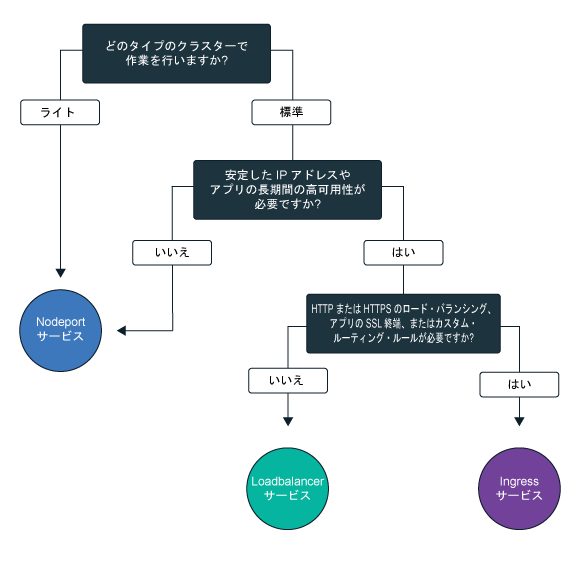

---

copyright:
  years: 2014, 2019
lastupdated: "2019-03-21"

keywords: kubernetes, iks

subcollection: containers

---

{:new_window: target="_blank"}
{:shortdesc: .shortdesc}
{:screen: .screen}
{:pre: .pre}
{:table: .aria-labeledby="caption"}
{:codeblock: .codeblock}
{:tip: .tip}
{:note: .note}
{:important: .important}
{:deprecated: .deprecated}
{:download: .download}

# クラスターの内部ネットワークおよび外部ネットワークを使用してアプリを公開するための計画
{: #cs_network_planning}

{{site.data.keyword.containerlong}} では、アプリをパブリックまたはプライベートに公開して、クラスターの内部ネットワークと外部ネットワークを管理できます。
{: shortdesc}

このページには、アプリのクラスター内部ネットワークおよび外部ネットワークを計画するときに役立つ情報を記載します。クラスターにネットワークをセットアップする方法について詳しくは、[クラスター・ネットワークのセットアップ](/docs/containers?topic=containers-cs_network_cluster)を参照してください。
{: tip}

## Kubernetes サービスを使用してクラスター内部のトラフィックにアプリを公開する
{: #in-cluster}

Kubernetes のディスカバリー・サービスを作成することでポッド間のクラスター内部通信が可能になります。
{: shortdesc}

<figure>
 
 <figcaption>Kubernetes サービスを使用してクラスター内部にアプリを公開する</figcaption>
</figure>

ワーカー・ノードにデプロイされるすべてのポッドには、172.30.0.0/16 の範囲でプライベート IP アドレスが割り当てられ、ワーカー・ノード間でのみ転送されます。 競合を避けるために、ご使用のワーカー・ノードと通信するノードにはこの IP 範囲を使用しないでください。 ワーカー・ノードとポッドは、プライベート IP アドレスを使用してプライベート・ネットワーク上で安全に通信できます。 しかし、ポッドが異常終了した場合やワーカー・ノードを再作成する必要がある場合は、新しいプライベート IP アドレスが割り当てられます。

デフォルトでは、高可用性が必要とされるアプリの変化するプライベート IP アドレスを追跡することは困難です。 代わりに、組み込みの Kubernetes サービス・ディスカバリー機能を使用して、アプリをプライベート・ネットワーク上のクラスター IP サービスとして公開することができます。 Kubernetes サービスは、一連のポッドをグループ化し、これらのポッドへのネットワーク接続を提供します。 この接続では、各ポッドの実際のプライベート IP アドレスを公開することなく、クラスター内の他のサービスへの接続を提供します。 サービスには、クラスター内部でのみアクセス可能なクラスター内 IP アドレスが割り当てられます。
* 古いクラスター: dal13 ゾーンで 2018 年 2 月より前に作成されたクラスター、またはその他のゾーンで 2017 年 10 月より前に作成されたクラスターでは、10.10.10.0/24 の範囲で 254 個の IP の中からサービスに IP が割り当てられます。 254 個のサービス数の上限に達し、さらに多くのサービスが必要な場合は、新規クラスターを作成する必要があります。
* 新しいクラスター: dal13 ゾーンで 2018 年 2 月より後に作成されたクラスター、またはその他のゾーンで 2017 年 10 月より後に作成されたクラスターでは、172.21.0.0/16 の範囲で 65,000 個の IP の中からサービスに IP が割り当てられます。

競合を避けるために、ご使用のワーカー・ノードと通信するノードにはこの IP 範囲を使用しないでください。 サービスのために DNS 参照エントリーも作成され、クラスターの `kube-dns` コンポーネントに保管されます。 DNS エントリーには、サービスの名前、サービスが作成された名前空間、割り当てられたクラスター内 IP アドレスへのリンクが含まれています。

クラスター・サービスの背後にあるポッドにアクセスする場合、アプリでは、サービスのクラスター内 IP アドレスを使用するか、サービスの名前を使用して要求を送信します。 サービスの名前を使用した場合は、名前が `kube-dns` コンポーネント内で検索され、サービスのクラスター内 IP アドレスに転送されます。 要求がサービスに到達すると、ポッドのクラスター内 IP アドレスやデプロイ先のワーカー・ノードに関係なく、要求がサービスによってポッドに均等に転送されます。

 

## NodePort、LoadBalancer、または Ingress サービスのいずれかを使用してクラスター外のトラフィックにアプリを公開する
{: #external}

パブリック・インターネットまたはプライベート・ネットワークを使用して外部からアプリにアクセスできるようにするために、{{site.data.keyword.containerlong_notm}} は 3 つのネットワーク・サービスをサポートしています。
{:shortdesc}

**[NodePort サービス](/docs/containers?topic=containers-nodeport)** (フリー・クラスターと標準クラスター)
* すべてのワーカー・ノードのポートを公開し、ワーカー・ノードのパブリック IP アドレスまたはプライベート IP アドレスを使用して、クラスター内のサービスにアクセスを行います。
* Iptables は、アプリのポッド間で要求のロード・バランスを取る Linux カーネル・フィーチャーで、パフォーマンスの高いネットワーク・ルーティングを実現し、ネットワーク・アクセス制御を行います。
* ワーカー・ノードのパブリックおよびプライベート IP アドレスは永続的ではありません。 ワーカー・ノードが削除されたり再作成されたりすると、新しいパブリック IP アドレスと新しいプライベート IP アドレスがワーカー・ノードに割り当てられます。
* NodePort サービスは、パブリック・アクセスまたはプライベート・アクセスのテスト用として優れています。 これはパブリック・アクセスまたはプライベート・アクセスを短時間だけ必要とする場合にも使用できます。

**[LoadBalancer サービス](/docs/containers?topic=containers-loadbalancer)** (標準クラスターのみ)
* どの標準クラスターにも 4 つのポータブル・パブリック IP アドレスと 4 つのポータブル・プライベート IP アドレスがプロビジョンされます。そのアドレスを使用して、アプリ用の外部 TCP/UDP ロード・バランサーを作成できます。 アプリで必要なすべてのポートを公開することによってロード・バランサーをカスタマイズすることも可能です。
* Iptables は、アプリのポッド間で要求のロード・バランスを取る Linux カーネル・フィーチャーで、パフォーマンスの高いネットワーク・ルーティングを実現し、ネットワーク・アクセス制御を行います。
* ロード・バランサーに割り当てられるポータブル・パブリック IP アドレスおよびプライベート IP アドレスは永続的なアドレスであり、クラスターでワーカー・ノードが再作成されても変更されません。
* アプリにホスト名を作成し、そのホスト名で DNS エントリーにパブリック・ロード・バランサーの IP アドレスを登録できます。また、各ホスト名のロード・バランサー IP に対するヘルス・チェック・モニターも有効にできます。

**[Ingress](/docs/containers?topic=containers-ingress)** (標準クラスターのみ)
* 1 つの外部 HTTP、HTTPS、または TCP アプリケーション・ロード・バランサー (ALB) を作成して、クラスター内の複数のアプリを公開します。 ALB は、保護された固有のパブリック・エントリー・ポイントまたはプライベート・エントリー・エンドポイント、Ingress サブドメインを使用して、着信要求をアプリにルーティングします。
* 1 つのルートを使用してクラスター内の複数のアプリをサービスとして公開できます。
* Ingress は、以下の 3 つのコンポーネントで構成されています。
  * Ingress リソースでは、アプリに対する着信要求のルーティングとロード・バランシングの方法に関するルールを定義します。
  * ALB は、着信 HTTP、HTTPS、または TCP サービス要求を listen します。 これは、Ingress リソースで定義したルールに基づいて、アプリのポッド間で要求を転送します。
  * 複数ゾーン・ロード・バランサー (MZLB) は、アプリへのすべての着信要求を処理し、さまざまなゾーンに存在する ALB の間で要求のロード・バランシングを行います。 また、各ゾーンの ALB IP アドレスに対するヘルス・チェックも可能にします。
* カスタム・ルーティング・ルールを使用して独自の ALB を実装する場合や、アプリに SSL 終端が必要な場合には、Ingress を使用します。

アプリにとって最適なネットワーク・サービスを選ぶために、このデシジョン・ツリーをたどって、いずれかのオプションをクリックしてください。

<map name="networking_map" id="networking_map">
<area href="/docs/containers?topic=containers-nodeport" alt="Nodeport サービス" shape="circle" coords="52, 283, 45"/>
<area href="/docs/containers?topic=containers-loadbalancer" alt="LoadBalancer サービス" shape="circle" coords="247, 419, 44"/>
<area href="/docs/containers?topic=containers-ingress" alt="Ingress サービス" shape="circle" coords="445, 420, 45"/>
</map>

{{site.data.keyword.containerlong_notm}} で使用できるロード・バランシング・デプロイメント・パターンについて詳細が必要ですか? この[ブログ投稿 ](https://www.ibm.com/blogs/bluemix/2018/10/ibm-cloud-kubernetes-service-deployment-patterns-for-maximizing-throughput-and-availability/) を確認してください。
{: tip}

 

## パブリックおよびプライベート VLAN を使用するセットアップのためのパブリック外部ネットワーキングの計画
{: #public_access}

{{site.data.keyword.containerlong_notm}} で Kubernetes クラスターを作成した場合、そのクラスターはパブリック VLAN に接続できます。 パブリック VLAN により、各ワーカー・ノードに割り当てられるパブリック IP アドレスが決まり、ワーカー・ノードにパブリック・ネットワーク・インターフェースが提供されます。
{:shortdesc}

<figure>
 
 <figcaption>デフォルトのネットワーク・セットアップでのパブリック・ネットワークへのアプリの公開</figcaption>
</figure>

ワーカー・ノードのパブリック・ネットワーク・インターフェースは、クラスターの作成時にすべてのワーカー・ノードに構成される[事前定義済み Calico ネットワーク・ポリシー設定](/docs/containers?topic=containers-network_policies#default_policy)によって保護されます。

デフォルトでは、すべてのワーカー・ノードに対して、すべてのアウトバウンド・ネットワーク・トラフィックが許可されます。 数個のポートを除いて、インバウンド・ネットワーク・トラフィックがブロックされます。 それらのポートが開かれているのは、IBM がネットワーク・トラフィックをモニターし、Kubernetes マスターのセキュリティー更新を自動的にインストールできるようにするため、また、NodePort、LoadBalancer、および Ingress サービスへの接続を確立できるようにするためです。ポリシーの変更方法を含め、これらのポリシーの詳細については、[ネットワーク・ポリシー](/docs/containers?topic=containers-network_policies#network_policies)を参照してください。

アプリをインターネットで公開するには、NodePort、LoadBalancer、または Ingress サービスを作成します。 各サービスを比較するには、[NodePort、LoadBalancer、または Ingress サービスの選択](#external)を参照してください。

次の図は、Kubernetes が {{site.data.keyword.containerlong_notm}} でパブリック・ネットワーク・トラフィックを転送する方法を示しています。

 

## パブリックおよびプライベート VLAN を使用するセットアップのためのプライベート外部ネットワーキングの計画
{: #private_both_vlans}

ワーカー・ノードがパブリック VLAN とプライベート VLAN の両方に接続されている場合は、プライベートの NodePort、LoadBalancer、または Ingress サービスを作成して、プライベート・ネットワークからのみ、アプリにアクセスできるようにできます。 次に、サービスへのパブリック・トラフィックをブロックする Calico ポリシーを作成できます。
{: shortdesc}

ワーカー・ノードのパブリック・ネットワーク・インターフェースは、クラスターの作成時にすべてのワーカー・ノードに構成される[事前定義済み Calico ネットワーク・ポリシー設定](/docs/containers?topic=containers-network_policies#default_policy)によって保護されます。 デフォルトでは、すべてのワーカー・ノードに対して、すべてのアウトバウンド・ネットワーク・トラフィックが許可されます。 数個のポートを除いて、インバウンド・ネットワーク・トラフィックがブロックされます。 それらのポートが開かれているのは、IBM がネットワーク・トラフィックをモニターし、Kubernetes マスターのセキュリティー更新を自動的にインストールできるようにするため、また、NodePort、LoadBalancer、および Ingress サービスへの接続を確立できるようにするためです。

アプリをプライベート・ネットワークのみで公開する場合は、プライベート NodePort、LoadBalancer、または Ingress サービスを作成できます。

**NodePort**
* [NodePort サービスを作成します](/docs/containers?topic=containers-nodeport)。 NodePort サービスは、パブリック IP アドレスに加えて、ワーカー・ノードのプライベート IP アドレスを介して利用可能です。
* NodePort サービスは、ワーカー・ノードのプライベート IP アドレスとパブリック IP アドレスの両方に対して、ワーカー・ノード上のポートを開きます。 [Calico preDNAT ネットワーク・ポリシー](/docs/containers?topic=containers-network_policies#block_ingress) を使用してパブリック NodePort をブロックする必要があります。

**LoadBalancer**
* [プライベート LoadBalancer サービスを作成します](/docs/containers?topic=containers-loadbalancer)。
* ポータブル・プライベート IP アドレスを使用するロード・バランサー・サービスでは、すべてのワーカー・ノードでパブリック・ノード・ポートも開いています。 [Calico preDNAT ネットワーク・ポリシー](/docs/containers?topic=containers-network_policies#block_ingress) を使用して、そのパブリック・ノード・ポートをブロックする必要があります。

**Ingress**
* クラスターを作成すると、Ingress アプリケーション・ロード・バランサー (ALB) がパブリック用とプライベート用に 1 つずつ自動的に作成されます。 デフォルトでは、パブリック ALB が有効に、プライベート ALB が無効になっているため、[パブリック ALB を無効](/docs/containers?topic=containers-cs_cli_reference#cs_alb_configure)にし、[プライベート ALB を有効](/docs/containers?topic=containers-ingress#private_ingress)にする必要があります。
* それから、[プライベート Ingress サービスを作成します](/docs/containers?topic=containers-ingress#ingress_expose_private)。

デフォルトの Calico ネットワーク・ポリシーはこれらのサービスへのインバウンドのパブリック・トラフィックを許可するので、代わりに各サービスへのすべてのパブリック・トラフィックをブロックする Calico ポリシーを作成すると良いでしょう。例えば、NodePort サービスは、ワーカー・ノードのプライベート IP アドレスとパブリック IP アドレスの両方に対して、ワーカー・ノード上のポートを開きます。 ポータブル・プライベート IP アドレスを持つロード・バランサー・サービスでは、すべてのワーカー・ノードでパブリック NodePort を開きます。 [Calico preDNAT ネットワーク・ポリシー](/docs/containers?topic=containers-network_policies#block_ingress)を作成してパブリック NodePort をブロックする必要があります。

例えば、プライベート・ロード・バランサー・サービスを作成したとします。 また、ロード・バランサーによって開かれたパブリック NodePort へのパブリック・トラフィックの到達をブロックする Calico preDNAT ポリシーを作成しました。 このプライベート・ロード・バランサーには、以下がアクセスできます。
* 同じクラスター内のポッド
* 同じ {{site.data.keyword.Bluemix_notm}} アカウント内のクラスター内のポッド
* [VLAN スパンニングが有効になっている](/docs/containers?topic=containers-subnets#subnet-routing)場合、同じ {{site.data.keyword.Bluemix_notm}} アカウント内のいずれかのプライベート VLAN に接続されているすべてのシステム
* {{site.data.keyword.Bluemix_notm}} アカウントに含まれていないが、会社のファイアウォールの背後にある場合は、ロード・バランサー IP があるサブネットへの VPN 接続を介するすべてのシステム
* 異なる {{site.data.keyword.Bluemix_notm}} アカウントに含まれている場合は、ロード・バランサー IP があるサブネットへの VPN 接続を介するすべてのシステム

 

## プライベート VLAN 専用セットアップのプライベート外部ネットワーキングの計画
{: #plan_private_vlan}

ワーカー・ノードをプライベート VLAN にのみ接続し、マスターとワーカー・ノードを[ゲートウェイ・デバイス](/docs/containers?topic=containers-cs_network_ov#cs_network_ov_master_gateway)経由で通信可能にした場合は、プライベートの NodePort サービス、LoadBalancer サービス、または Ingress サービスを作成して、プライベート・ネットワークにのみアプリを公開できます。
{: shortdesc}

<figure>
 
 <figcaption>プライベート・ネットワーク・セットアップでのプライベート・ネットワークへのアプリの公開</figcaption>
</figure>

ワーカー・ノードはパブリック VLAN に接続されていないため、パブリック・トラフィックはこれらのサービスに転送されません。 これらのサービスへのインバウンド・トラフィックを許可するために、ゲートウェイ・デバイス・ファイアウォールで、[必要なポートおよび IP アドレスを開く](/docs/containers?topic=containers-firewall#firewall_inbound)必要もあります。

**NodePort**:
* [プライベート NodePort サービスを作成します](/docs/containers?topic=containers-nodeport)。 このサービスは、ワーカー・ノードのプライベート IP アドレスを介して利用可能です。
* プライベート・ファイアウォールで、すべてのワーカー・ノードのプライベート IP アドレスにサービスをデプロイしたときに構成したポートを開き、トラフィックを許可します。 ポートを見つけるには、`kubectl get svc` を実行します。 ポートの範囲は 20000 から 32000 までです。

**LoadBalancer**
* [プライベート LoadBalancer サービスを作成します](/docs/containers?topic=containers-loadbalancer)。 クラスターがプライベート VLAN 上にしかない場合、使用可能な 4 つのポータブル・プライベート IP アドレスのいずれかが使用されます。
* プライベート・ファイアウォールで、ロード・バランサー・サービスのプライベート IP アドレスにサービスをデプロイしたときに構成したポートを開きます。

**Ingress**:
* [プライベート・ネットワークで使用可能な DNS サービス ](https://kubernetes.io/docs/tasks/administer-cluster/dns-custom-nameservers/) を構成する必要があります。
* クラスターを作成すると、プライベート Ingress アプリケーション・ロード・バランサー (ALB) が自動的に作成されますが、デフォルトでは有効にされていません。 [プライベート ALB を有効にする](/docs/containers?topic=containers-ingress#private_ingress)必要があります。
* それから、[プライベート Ingress サービスを作成します](/docs/containers?topic=containers-ingress#ingress_expose_private)。
* プライベート・ファイアウォールで、HTTP 用のポート 80 または HTTPS 用のポート 443 を、プライベート ALB の IP アドレスに対して開きます。

クラスターをプライベート VLAN にのみ接続し、プライベート・サービス・エンドポイントのみを使用してマスターとワーカー・ノードを通信可能にしている場合は、アプリをプライベート・ネットワークに公開することはできません。ファイアウォールとして機能する [VRA](/docs/infrastructure/virtual-router-appliance?topic=virtual-router-appliance-about-the-vra) や [FSA](/docs/services/vmwaresolutions/services?topic=vmware-solutions-fsa_considerations) のようなゲートウェイ・サービスをセットアップし、不要なトラフィックをブロックする必要があります。ゲートウェイ・デバイスをセットアップしない場合は、パブリック VLAN とプライベート VLAN に接続する [ワーカー・プールを作成](/docs/containers?topic=containers-clusters#add_pool)する方法があります。そして、それらのワーカー・ノードにエッジ・ノードのラベルを付け、Calico ポリシーを使用して、不要なすべてのパブリック・トラフィックをブロックできます。詳しくは、[ネットワーク・ワークロードをエッジ・ワーカー・ノードに分離する](/docs/containers?topic=containers-cs_network_planning#both_vlans_private_edge)を参照してください。
{: note}

 

## オプション: ネットワーク・ワークロードをエッジ・ワーカー・ノードに分離する
{: #both_vlans_private_edge}

エッジ・ワーカー・ノードを使用すると、外部的にアクセスされるワーカー・ノードの数を減らし、ネットワークのワークロードを分離することができるので、クラスターのセキュリティーが改善されます。 指定したワーカー・ノードにのみ Ingress とロード・バランサー・ポッドがデプロイされるようにするには、[ワーカー・ノードにエッジ・ノードのラベルを付けます](/docs/containers?topic=containers-edge#edge_nodes)。 他のワークロードをエッジ・ノードで実行しないようにするには、[エッジ・ノードにテイントを適用します](/docs/containers?topic=containers-edge#edge_workloads)。
{: shortdesc}

クラスターをパブリック VLAN に接続しているけれども、エッジ・ワーカー・ノード上のパブリック NodePorts へのトラフィックをブロックしたい場合は、 [Calico preDNAT ネットワーク・ポリシー](/docs/containers?topic=containers-network_policies#block_ingress)も使用できます。ノード・ポートをブロックすることにより、エッジ・ワーカー・ノードだけが着信トラフィックを扱うワーカー・ノードとなります。

## オプション: プライベート・ネットワーク上のクラスターを分離する
{: #isolate}

複数ゾーン・クラスター、単一ゾーン・クラスター用の複数 VLAN、または同じ VLAN 上に複数のサブネットがある場合、[VLAN スパンニングを有効](/docs/infrastructure/vlans?topic=vlans-vlan-spanning#vlan-spanning)にするか、または [VRF](/docs/infrastructure/direct-link?topic=direct-link-overview-of-virtual-routing-and-forwarding-vrf-on-ibm-cloud#customer-vrf-overview) を有効にして、プライベート・ネットワークによるワーカー・ノードの相互通信を可能にする必要があります。ただし、VLAN スパンニングまたは VRF が有効になっている場合、同じ IBM Cloud アカウント内のいずれかのプライベート VLAN に接続されているすべてのシステムはワーカーにアクセスできます。 [Calico ネットワーク・ポリシー](/docs/containers?topic=containers-network_policies#isolate_workers)を使用して、プライベート・ネットワーク上の他のシステムから複数ゾーン・クラスターを分離できます。 このポリシーでは、プライベート・ファイアウォールで開いたプライベート IP 範囲およびポートの着信および発信も許可されます。
{: shortdesc}
