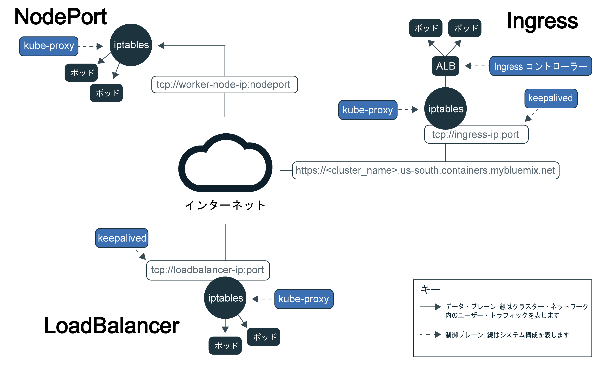
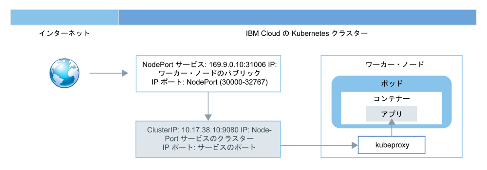
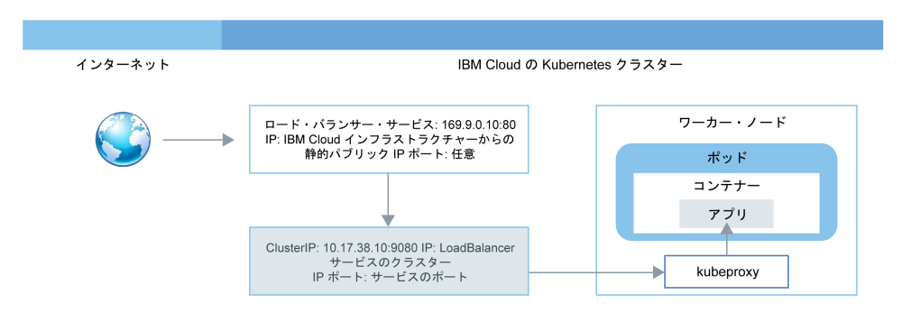

---

copyright:
  years: 2014, 2018
lastupdated: "2018-02-06"

---

{:new_window: target="_blank"}
{:shortdesc: .shortdesc}
{:screen: .screen}
{:pre: .pre}
{:table: .aria-labeledby="caption"}
{:codeblock: .codeblock}
{:tip: .tip}
{:download: .download}

# 外部ネットワーキングの計画
{: #planning}

クラスターを作成するときには、すべてのクラスターをパブリック VLAN に接続する必要があります。 ワーカー・ノードに割り当てられるパブリック IP アドレスは、クラスター作成時にパブリック VLAN によって決定されます。
{:shortdesc}

フリー・クラスターと標準クラスターの両方とも、ワーカー・ノードのパブリック・ネットワーク・インターフェースは Calico ネットワーク・ポリシーによって保護されます。 デフォルトでは、これらのポリシーは大部分のインバウンド・トラフィックをブロックします。 ただし、Kubernetes が機能するために必要なインバウンド・トラフィックは、NodePort、Loadbalancer、Ingress の各サービスへの接続と同様に、許可されます。 これらのポリシーの詳細情報 (ポリシーの変更方法など) については、[ネットワーク・ポリシー](cs_network_policy.html#network_policies)を参照してください。

|クラスター・タイプ|クラスターのパブリック VLAN の管理者|
|------------|------------------------------------------|
|{{site.data.keyword.Bluemix_notm}} 内のフリー・クラスター|{{site.data.keyword.IBM_notm}}|
|{{site.data.keyword.Bluemix_notm}} 内の標準クラスター|IBM Cloud インフラストラクチャー (SoftLayer) アカウントを使用するお客様|
{: caption="VLAN 管理の責任" caption-side="top"}

ワーカー・ノードとポッドの間のクラスター内ネットワーク通信について詳しくは、[クラスター内ネットワーキング](cs_secure.html#in_cluster_network)を参照してください。Kubernetes クラスター内で実行するアプリをセキュアにオンプレミス・ネットワークに接続する、またはクラスター外のアプリに接続する方法について詳しくは、[VPN 接続のセットアップ](cs_vpn.html)を参照してください。

## アプリへのパブリック・アクセスを許可する方法
{: #public_access}

アプリをインターネットでだれでも利用できるようにするには、アプリをクラスターにデプロイする前に、構成ファイルを更新する必要があります。
{:shortdesc}

*{{site.data.keyword.containershort_notm}} での Kubernetes データ・プレーン*

この図は、{{site.data.keyword.containershort_notm}} で Kubernetes がユーザー・ネットワーク・トラフィックを伝送する方法を示しています。 フリー・クラスターを作成したか標準クラスターを作成したかに応じて、インターネットからアプリにアクセスできるようにする方法は複数あります。

<dl>
<dt><a href="#nodeport" target="_blank">NodePort サービス</a> (フリー・クラスターと標準クラスター)</dt>
<dd>
 <ul>
  <li>すべてのワーカー・ノードのパブリック・ポートを公開し、ワーカー・ノードのパブリック IP アドレスを使用して、クラスター内のサービスにパブリック・アクセスを行います。</li>
  <li>Iptables は、アプリのポッド間で要求のロード・バランスを取る Linux カーネル・フィーチャーで、パフォーマンスの高いネットワーク・ルーティングを実現し、ネットワーク・アクセス制御を行います。</li>
  <li>ワーカー・ノードのパブリック IP アドレスは永続的なアドレスではありません。 ワーカー・ノードが削除されたり再作成されたりすると、新しいパブリック IP アドレスがワーカー・ノードに割り当てられます。</li>
  <li>NodePort サービスは、パブリック・アクセスのテスト用として優れています。 これはパブリック・アクセスを短時間だけ必要とする場合にも使用できます。</li>
 </ul>
</dd>
<dt><a href="#loadbalancer" target="_blank">LoadBalancer サービス</a> (標準クラスターのみ)</dt>
<dd>
 <ul>
  <li>どの標準クラスターにも 4 つのポータブル・パブリック IP アドレスと 4 つのポータブル・プライベート IP アドレスがプロビジョンされます。そのアドレスを使用して、アプリ用の外部 TCP/ UDP ロード・バランサーを作成できます。</li>
  <li>Iptables は、アプリのポッド間で要求のロード・バランスを取る Linux カーネル・フィーチャーで、パフォーマンスの高いネットワーク・ルーティングを実現し、ネットワーク・アクセス制御を行います。</li>
  <li>ロード・バランサーに割り当てられるポータブル・パブリック IP アドレスは永続的なアドレスであり、クラスター内のワーカー・ノードが再作成されても変更されません。</li>
  <li>アプリで必要なすべてのポートを公開することによってロード・バランサーをカスタマイズすることも可能です。</li></ul>
</dd>
<dt><a href="#ingress" target="_blank">Ingress</a> (標準クラスターのみ)</dt>
<dd>
 <ul>
  <li>HTTP または HTTPS のいずれかで使用できる外部ロード・バランサーを 1 つ作成することによって、クラスターに複数のアプリを公開できます。このロード・バランサーを使用して、保護された固有のパブリック・エントリー・ポイントから着信要求を各アプリにルーティングします。</li>
  <li>1 つのパブリック・ルートを使用してクラスター内の複数のアプリをサービスとして公開できます。</li>
  <li>Ingress は、Ingress リソースおよびアプリケーション・ロード・バランサーという 2 つの主要なコンポーネントで構成されています。
   <ul>
    <li>Ingress リソースでは、アプリに対する着信要求のルーティングとロード・バランシングの方法に関するルールを定義します。</li>
    <li>アプリケーション・ロード・バランサーは、着信する HTTP または HTTPS のサービス要求を listen し、Ingress リソースごとに定義されたルールに基づいて、アプリのポッドに要求を転送します。</li>
   </ul>
  <li>カスタム・ルーティング・ルールを使用して独自のアプリケーション・ロード・バランサーを実装する場合、およびアプリに SSL 終端が必要な場合は、Ingress を使用してください。</li>
 </ul>
</dd></dl>

アプリケーションに最適なネットワーキング・オプションを選択するために、以下のデシジョン・ツリーに従うことができます。

<map name="networking_map" id="networking_map">
<area href="/docs/containers/cs_nodeport.html#config" alt="Nodeport サービス" shape="circle" coords="52, 283, 45"/>
<area href="/docs/containers/cs_loadbalancer.html#config" alt="Loadbalancer サービス" shape="circle" coords="247, 419, 44"/>
<area href="/docs/containers/cs_ingress.html#config" alt="Ingress サービス" shape="circle" coords="445, 420, 45"/>
</map>

 

## NodePort サービスを使用してアプリをインターネットに公開する
{: #nodeport}

ワーカー・ノードのパブリック・ポートを公開し、ワーカー・ノードのパブリック IP アドレスを使用して、クラスター内のサービスにインターネットからパブリック・アクセスを行います。
{:shortdesc}

NodePort タイプの Kubernetes サービスを作成してアプリを公開する場合は、30000 から 32767 の範囲の NodePort と内部クラスター IP アドレスがサービスに割り当てられます。 NodePort サービスは、アプリに対する着信要求のための外部エントリー・ポイントとして機能します。 割り当てられた NodePort は、クラスター内の各ワーカー・ノードの kubeproxy 設定でパブリックに公開されます。 どのワーカー・ノードも、割り当てられた NodePort で、サービスに対する着信要求の listen を開始します。 インターネットからサービスにアクセスするには、クラスター作成時に割り当てられたワーカー・ノードのパブリック IP アドレスと NodePort を使用します。その形式は、`<ip_address>:<nodeport>` です。 NodePort サービスは、パブリック IP アドレスに加えて、ワーカー・ノードのプライベート IP アドレスを介して利用可能です。

次の図は、NodePort サービスが構成されているときに、インターネットからアプリへの通信がどのように誘導されるかを示しています。

図に示すように、要求は、NodePort サービスに到達すると、サービスの内部クラスター IP に自動的に転送され、さらに `kube-proxy` コンポーネントから、アプリがデプロイされたポッドのプライベート IP アドレスに転送されます。 クラスター IP はクラスター内でのみアクセス可能です。 複数の異なるポッドでアプリの複数のレプリカが実行されている場合、`kube-proxy` コンポーネントはすべてのレプリカ間で着信要求のロード・バランシングを行います。

**注:** ワーカー・ノードのパブリック IP アドレスは永続的なアドレスではありません。 ワーカー・ノードが削除されたり再作成されたりすると、新しいパブリック IP アドレスがワーカー・ノードに割り当てられます。 NodePort サービスは、アプリのパブリック・アクセスをテストする場合や、パブリック・アクセスが短期間だけ必要な場合に使用できます。 安定的なパブリック IP アドレスによってサービスの可用性を高める必要がある場合は、[LoadBalancer サービス](#loadbalancer)または [Ingress](#ingress) を使用してアプリを公開してください。

{{site.data.keyword.containershort_notm}} で NodePort タイプのサービスを作成する方法について詳しくは、[NodePort タイプのサービスを使用してアプリへのパブリック・アクセスを構成する方法](cs_nodeport.html#config)を参照してください。

 

## LoadBalancer サービスを使用してアプリをインターネットに公開する
{: #loadbalancer}

ポートを公開し、ロード・バランサーのパブリック IP アドレスまたはプライベート IP アドレスを使用してアプリにアクセスします。
{:shortdesc}

標準クラスターを作成する時、{{site.data.keyword.containershort_notm}} は自動的に 5 つのポータブル・パブリック IP アドレスと 5 つのポータブル・プライベート IP アドレスを要求し、クラスター作成時にそれらをお客様の IBM Cloud インフラストラクチャー (SoftLayer) アカウントにプロビジョンします。 ポータブル IP アドレスのうちの 2 つ (パブリック 1 つとプライベート 1 つ) は、[Ingress アプリケーション・ロード・バランサー](#ingress)用として使用されます。 4 つのポータブル・パブリック IP アドレスと 4 つのポータブル・プライベート IP アドレスは、LoadBalancer サービスを作成してアプリを公開するために使用できます。

パブリック VLAN のクラスター内に Kubernetes LoadBalancer サービスを作成する時、外部ロード・バランサーが 1 つ作成されます。 使用可能な 4 つのパブリック IP アドレスのうちの 1 つが、ロード・バランサーに割り当てられます。 使用可能なポータブル・パブリック IP アドレスがなければ、LoadBalancer サービスの作成は失敗します。 LoadBalancer サービスは、アプリに対する着信要求のための外部エントリー・ポイントとして機能します。 NodePort サービスの場合と異なり、任意のポートをロード・バランサーに割り当て可能で、特定のポート範囲に縛られません。 LoadBalancer サービスに割り当てられるポータブル・パブリック IP アドレスは永続的なものであり、ワーカー・ノードが削除されたり再作成されたりしても変更されません。 したがって、LoadBalancer サービスの可用性は NodePort サービスより高くなります。 インターネットから LoadBalancer サービスにアクセスするには、ロード・バランサーのパブリック IP アドレスと割り当てられたポートを、`<ip_address>:<port>` という形式で使用します。

次の図は、LoadBalancer がインターネットからアプリへの通信をどのように誘導するかを示しています。

図に示すように、要求が LoadBalancer サービスに到達すると、その要求は、サービス作成時に LoadBalancer サービスに割り当てられた内部クラスター IP アドレスに自動的に転送されます。 クラスター IP アドレスはクラスター内でのみアクセス可能です。 着信要求はクラスター IP アドレスからさらにワーカー・ノードの `kube-proxy` コンポーネントに転送されます。 続いて要求は、アプリがデプロイされたポッドのプライベート IP アドレスに転送されます。 複数の異なるポッドでアプリの複数のレプリカが実行されている場合、`kube-proxy` コンポーネントはすべてのレプリカ間で着信要求のロード・バランシングを行います。

LoadBalancer サービスを使用する場合、あらゆるワーカー・ノードの各 IP アドレスでノード・ポートを使用することもできます。 LoadBalancer サービスを使用しているときにノード・ポートへのアクセスをブロックするには、[着信トラフィックのブロック](cs_network_policy.html#block_ingress)を参照してください。

LoadBalancer サービスを作成するときには、IP アドレスに関して以下のオプションがあります。

- クラスターがパブリック VLAN 上にある場合、ポータブル・パブリック IP アドレスが使用されます。
- クラスターがプライベート VLAN 上でのみ使用可能な場合は、ポータブル・プライベート IP アドレスが使用されます。
- 構成ファイルに次のアノテーションを追加することにより、LoadBalancer サービス用にポータブル・パブリック IP アドレスまたはポータブル・プライベート IP アドレスを要求できます: `service.kubernetes.io/ibm-load-balancer-cloud-provider-ip-type: <public_or_private>`.

{{site.data.keyword.containershort_notm}} で LoadBalancer サービスを作成する方法について詳しくは、[ロード・バランサー・タイプのサービスを使用してアプリへのパブリック・アクセスを構成する方法](cs_loadbalancer.html#config)を参照してください。

 

## Ingress を使用してインターネットにアプリを公開する
{: #ingress}

Ingress ではクラスターの複数のサービスを公開し、単一のパブリック・エントリー・ポイントを使用してそれらのサービスを使用可能にできます。
{:shortdesc}

公開するアプリごとにロード・バランサー・サービスを作成する方法とは異なり、Ingress では固有のパブリック経路が提供されるので、クラスター内外のアプリに対するパブリック要求を、それらのアプリの固有のパスに基づいて転送できます。 Ingress には主なコンポーネントが 2 つあります。 Ingress リソースは、アプリの着信要求のルーティング方法に関するルールを定義します。 Ingress リソースはすべて Ingress アプリケーション・ロード・バランサーに登録する必要があります。Ingress コントローラーは、着信する HTTP または HTTPS のいずれかのサービス要求を listen し、Ingress リソースごとに定義されたルールに基づいて要求を転送します。

標準クラスターを作成すると、{{site.data.keyword.containershort_notm}} がそのクラスター用に可用性の高いアプリケーション・ロード・バランサーを自動で作成し、固有のパブリック経路を `<cluster_name>.<region>.containers.mybluemix.net` という形式で割り当てます。 パブリック経路は、クラスター作成時にお客様の IBM Cloud インフラストラクチャー (SoftLayer) アカウントにプロビジョンされたポータブル・パブリック IP アドレスにリンクされます。 プライベート・アプリケーション・ロード・バランサーも自動的に作成されますが、自動的に有効になるわけではありません。

次の図は、Ingress がインターネットからアプリへの通信をどのように誘導するかを示しています。

Ingress 経由でアプリを公開するには、アプリ用に Kubernetes サービスを作成し、Ingress リソースを定義することによってこのサービスをアプリケーション・ロード・バランサーに登録する必要があります。 Ingress リソースには、公開アプリの固有 URL (`mycluster.us-south.containers.mybluemix.net/myapp` など) を形成するためにパブリック経路に付加するパスを指定します。図に示すように、この経路を Web ブラウザーに入力すると、要求がアプリケーション・ロード・バランサーのリンク先ポータブル・パブリック IP アドレスに送信されます。 アプリケーション・ロード・バランサーは、`mycluster` クラスター内の `myapp` パスのルーティング・ルールが存在するかどうかを検査します。 一致するルールが見つかれば、アプリがデプロイされているポッドに、個々のパスを含んだ要求が転送されます。このとき、元の Ingress リソース・オブジェクトで定義されたルールが考慮されます。 アプリが着信要求を処理するためには、Ingress リソースで定義した個々のパスでアプリが listen するようにしておく必要があります。

次のようなシナリオで、アプリの着信ネットワーク・トラフィックを管理するようアプリケーション・ロード・バランサーを構成できます。

-   IBM 提供ドメインを使用 (TLS 終端なし)
-   TLS 終端ありで IBM 提供ドメインを使用する
-   TLS 終端ありでカスタム・ドメインを使用する
-   クラスターの外部のアプリにアクセスするために、TLS 終端ありで IBM 提供ドメインまたはカスタム・ドメインを使用する
-   TLS 終端なしでプライベート・アプリケーション・ロード・バランサーとカスタム・ドメインを使用する
-   TLS 終端ありでプライベート・アプリケーション・ロード・バランサーとカスタマー・ドメインを使用する
-   アノテーションを使用してアプリケーション・ロード・バランサーに機能を追加する

{{site.data.keyword.containershort_notm}} での Ingress の使用方法について詳しくは、[Ingress を使用してアプリへのパブリック・アクセスを構成する方法](cs_ingress.html#ingress)を参照してください。

 

