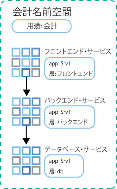
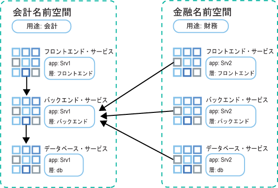

---

copyright:
  years: 2014, 2019
lastupdated: "2019-06-11"

keywords: kubernetes, iks

subcollection: containers

---

{:new_window: target="_blank"}
{:shortdesc: .shortdesc}
{:screen: .screen}
{:pre: .pre}
{:table: .aria-labeledby="caption"}
{:codeblock: .codeblock}
{:tip: .tip}
{:note: .note}
{:important: .important}
{:deprecated: .deprecated}
{:download: .download}
{:preview: .preview}


# ネットワーク・ポリシーによるトラフィックの制御
{: #network_policies}

Kubernetes クラスターはそれぞれ、Calico と呼ばれるネットワーク・プラグインを使用してセットアップされます。 {{site.data.keyword.containerlong}} の各ワーカー・ノードのパブリック・ネットワーク・インターフェースを保護するために、デフォルトのネットワーク・ポリシーがセットアップされます。
{: shortdesc}

固有のセキュリティー要件がある場合、または VLAN スパンニングを有効にした複数ゾーン・クラスターがある場合は、Calico および Kubernetes を使用してクラスターのネットワーク・ポリシーを作成できます。 Kubernetes ネットワーク・ポリシーを使用して、クラスター内のポッドとの間で許可またはブロックするネットワーク・トラフィックを指定できます。 ネットワーク・ロード・バランサー (NLB) サービスへのインバウンド (ingress) トラフィックのブロックなど、より高度なネットワーク・ポリシーを設定するには、Calico ネットワーク・ポリシーを使用します。

<ul>
  <li>
  [Kubernetes ネットワーク・ポリシー ](https://kubernetes.io/docs/concepts/services-networking/network-policies/): これらのポリシーは、ポッドが他のポッドおよび外部エンドポイントと通信する方法を指定します。 Kubernetes バージョン 1.8 以降では、着信ネットワーク・トラフィックと発信ネットワーク・トラフィックの両方を、プロトコル、ポート、およびソースまたは宛先 IP アドレスに基づいて許可またはブロックできます。 トラフィックは、ポッドおよび名前空間ラベルに基づいてフィルタリングすることもできます。 Kubernetes ネットワーク・ポリシーは、`kubectl` コマンドまたは Kubernetes API を使用して適用されます。 これらのポリシーは、適用されると自動的に Calico ネットワーク・ポリシーに変換され、Calico によってこれらのポリシーが実施されます。
  </li>
  <li>
  [Calico ネットワーク・ポリシー ](https://docs.projectcalico.org/v3.3/getting-started/bare-metal/policy/): これらのポリシーは Kubernetes ネットワーク・ポリシーのスーパーセットであり、`calicoctl` コマンドを使用して適用されます。 Calico ポリシーは、以下の機能を追加します。
    <ul>
    <li>Kubernetes ポッドのソースまたは宛先 IP アドレスや CIDR に関係なく、特定のネットワーク・インターフェース上のネットワーク・トラフィックを許可またはブロックします。</li>
    <li>複数の名前空間にまたがるポッドのネットワーク・トラフィックを許可またはブロックします。</li>
    <li>[Kubernetes LoadBalancer または NodePort サービスへのインバウンド (ingress) トラフィックをブロックします](#block_ingress)。</li>
    </ul>
  </li>
  </ul>

Calico は、Kubernetes ワーカー・ノードで Linux Iptables 規則をセットアップすることにより、Calico ポリシーに自動的に変換される Kubernetes ネットワーク・ポリシーを含め、これらのポリシーを実施します。 iptables 規則はワーカー・ノードのファイアウォールとして機能し、ネットワーク・トラフィックがターゲット・リソースに転送されるために満たさなければならない特性を定義します。

ネットワーク・ロード・バランサー (NLB) サービスおよび Ingress アプリケーション・ロード・バランサー (ALB) サービスを使用するには、Calico および Kubernetes ポリシーを使用して、クラスターの発信/着信ネットワーク・トラフィックを管理します。 IBM Cloud インフラストラクチャー (SoftLayer) の[セキュリティー・グループ](/docs/infrastructure/security-groups?topic=security-groups-about-ibm-security-groups#about-ibm-security-groups)は使用しないでください。 IBM Cloud インフラストラクチャー (SoftLayer) のセキュリティー・グループは、単一仮想サーバーのネットワーク・インターフェースに適用され、ハイパーバイザー・レベルでトラフィックをフィルタリングします。 しかし、セキュリティー・グループは、{{site.data.keyword.containerlong_notm}} が ALB および NLB の IP アドレスの管理に使用する VRRP プロトコルをサポートしていません。 IP を管理する VRRP プロトコルが存在しない場合、ALB サービスおよび NLB サービスは正しく機能しません。
{: tip}

<br />


## デフォルトの Calico および Kubernetes ネットワーク・ポリシー
{: #default_policy}

パブリック VLAN を持つクラスターが作成されると、各ワーカー・ノードとそのパブリック・ネットワーク・インターフェースに対して、`ibm.role: worker_public` ラベルを持つ `HostEndpoint` リソースが自動的に作成されます。 ワーカー・ノードのパブリック・ネットワーク・インターフェースを保護するために、デフォルトの Calico ポリシーが `ibm.role: worker_public` ラベルを持つすべてのホスト・エンドポイントに適用されます。
{:shortdesc}

これらのデフォルトの Calico ホスト・ポリシーは、すべてのアウトバウンド・ネットワーク・トラフィックを許可し、Kubernetes NodePort、LoadBalancer、Ingress サービスなどの特定のクラスター・コンポーネントへのインバウンド・トラフィックを許可します。 デフォルト・ポリシーで指定されていない、インターネットからワーカー・ノードへのその他のインバウンド・ネットワーク・トラフィックはすべてブロックされます。 デフォルト・ポリシーはポッド間トラフィックに影響しません。

クラスターに自動的に適用される、以下のデフォルトの Calico ホスト・ポリシーを確認します。

ポリシーを完全に理解していない限り、ホスト・エンドポイントに適用されるポリシーは削除しないでください。 ポリシーによって許可されているトラフィックが不要であることを確認してください。
{: important}

 <table summary="表の 1 行目は両方の列にまたがっています。残りの行は左から右に読みます。1 列目はサーバーのゾーン、2 列目は対応する IP アドレスです。">
 <caption>各クラスターのデフォルト Calico ホスト・ポリシー</caption>
  <thead>
  <th colspan=2> 各クラスターのデフォルト Calico ホスト・ポリシー</th>
  </thead>
  <tbody>
    <tr>
      <td><code>allow-all-outbound</code></td>
      <td>すべてのアウトバウンド・トラフィックを許可します。</td>
    </tr>
    <tr>
      <td><code>allow-bigfix-port</code></td>
      <td>必要なワーカー・ノードの更新を許可するために、BigFix アプリへの着信トラフィックをポート 52311 で許可します。</td>
    </tr>
    <tr>
      <td><code>allow-icmp</code></td>
      <td>すべての着信 ICMP パケット (ping) を許可します。</td>
     </tr>
    <tr>
      <td><code>allow-node-port-dnat</code></td>
      <td>ネットワーク・ロード・バランサー (NLB)、Ingress アプリケーション・ロード・バランサー (ALB)、NodePort の各サービスが公開しているポッドへの、これらのサービスの着信トラフィックを許可します。 <strong>注</strong>: Kubernetes は宛先ネットワーク・アドレス変換 (DNAT) を使用してサービス要求を正しいポッドに転送するため、公開ポートを指定する必要はありません。 ホストのエンドポイント・ポリシーが Iptables で適用される前に、その転送が実行されます。</td>
   </tr>
   <tr>
      <td><code>allow-sys-mgmt</code></td>
      <td>ワーカー・ノードを管理するために使用される特定の IBM Cloud インフラストラクチャー (SoftLayer) システムの着信接続を許可します。</td>
   </tr>
   <tr>
    <td><code>allow-vrrp</code></td>
    <td>ワーカー・ノード間の仮想 IP アドレスのモニターと移動に使用される VRRP パケットを許可します。</td>
   </tr>
  </tbody>
</table>

Kubernetes ダッシュボードへのアクセスを制限するデフォルトの Kubernetes ポリシーも作成されます。 Kubernetes ポリシーはホスト・エンドポイントには適用されませんが、代わりに `kube-dashboard` ポッドに適用されます。 このポリシーは、プライベート VLAN にのみ接続されたクラスターと、パブリック VLAN およびプライベート VLAN に接続されたクラスターに適用されます。

<table>
<caption>各クラスターのデフォルトの Kubernetes ポリシー</caption>
<thead>
<th colspan=2> 各クラスターのデフォルトの Kubernetes ポリシー</th>
</thead>
<tbody>
 <tr>
  <td><code>kubernetes-dashboard</code></td>
  <td><code>kube-system</code> 名前空間で提供されます。すべてのポッドに対し、Kubernetes ダッシュボードへのアクセスをブロックします。 このポリシーは、ダッシュボードへの {{site.data.keyword.Bluemix_notm}} コンソールからのアクセス、または <code>kubectl proxy</code> を使用したアクセスには影響しません。 ダッシュボードへのアクセスを必要とするポッドの場合は、<code>kubernetes-dashboard-policy: allow</code> ラベルを持つ名前空間にそのポッドをデプロイします。</td>
 </tr>
</tbody>
</table>

<br />


## Calico CLI のインストールおよび構成
{: #cli_install}

Calico ポリシーを表示、管理、および追加するには、Calico CLI をインストールして構成します。
{:shortdesc}

1. [アカウントにログインします。 該当する場合は、適切なリソース・グループをターゲットにします。 クラスターのコンテキストを設定します。](/docs/containers?topic=containers-cs_cli_install#cs_cli_configure) `ibmcloud ks cluster-config` コマンドに `--admin` オプションと `--network` オプションを指定します。 `--admin` は、インフラストラクチャー・ポートフォリオにアクセスし、ワーカー・ノードで Calico コマンドを実行するためのキーをダウンロードします。 `--network` は、すべての Calico コマンドを実行するための Calico 構成ファイルをダウンロードします。

  ```
  ibmcloud ks cluster-config --cluster <cluster_name_or_ID> --admin --network
  ```
  {: pre}

3. OS X と Linux のユーザーは、以下の手順を実行してください。
    1. `/etc/calico` ディレクトリーを作成します。
        ```
        sudo mkdir /etc/calico
        ```
        {: pre}

    2. 以前にダウンロードした Calico 構成ファイルを、このディレクトリーに移動します。
        ```
        sudo mv /Users/<user>/.bluemix/plugins/container-service/clusters/<cluster_name>-admin/calicoctl.cfg /etc/calico
        ```
        {: pre}

4. [Calico CLI ](https://github.com/projectcalico/calicoctl/releases) をダウンロードします。

    OS X を使用している場合は、`-darwin-amd64` バージョンをダウンロードします。 Windows を使用している場合、Calico CLI を {{site.data.keyword.Bluemix_notm}} CLI と同じディレクトリーにインストールします。 このようにセットアップすると、後でコマンドを実行するとき、ファイル・パスの変更を行う手間がいくらか少なくなります。 ファイルを必ず `calicoctl.exe` として保存してください。
    {: tip}

5. OS X と Linux のユーザーは、以下の手順を実行してください。
    1. 実行可能ファイルを _/usr/local/bin_ ディレクトリーに移動します。
        - Linux:

          ```
          mv filepath/calicoctl /usr/local/bin/calicoctl
          ```
          {: pre}

        - OS X:

          ```
          mv filepath/calicoctl-darwin-amd64 /usr/local/bin/calicoctl
          ```
          {: pre}

    2. ファイルを実行可能ファイルにします。

        ```
        chmod +x /usr/local/bin/calicoctl
        ```
        {: pre}

6. 企業ネットワーク・ポリシーがプロキシーまたはファイアウォールを使用して、ローカル・システムからパブリック・エンドポイントへのアクセスを禁止している場合は、[Calico コマンドに対して TCP アクセスを許可](/docs/containers?topic=containers-firewall#firewall)します。

7. Calico 構成が正常に動作していることを確認します。

    - Linux および OS X:

      ```
      calicoctl get nodes
      ```
      {: pre}

    - Windows: `--config` フラグを使用して、ステップ 1 で取得したネットワーク構成ファイルを指します。`calicoctl` コマンドを実行するたびに、このフラグを含めます。

      ```
      calicoctl get nodes --config=filepath/calicoctl.cfg
      ```
      {: pre}

      出力:

      ```
      NAME
          kube-dal10-crc21191ee3997497ca90c8173bbdaf560-w1.cloud.ibm
          kube-dal10-crc21191ee3997497ca90c8173bbdaf560-w2.cloud.ibm
          kube-dal10-crc21191ee3997497ca90c8173bbdaf560-w3.cloud.ibm
      ```
      {: screen}

<br />


## ネットワーク・ポリシーの表示
{: #view_policies}

クラスターに適用される、デフォルト・ネットワーク・ポリシーおよび追加されたすべてのネットワーク・ポリシーの詳細を表示します。
{:shortdesc}

開始前に、以下のことを行います。
1. [Calico CLI をインストールして構成します。](#cli_install)
2. [アカウントにログインします。 該当する場合は、適切なリソース・グループをターゲットにします。 クラスターのコンテキストを設定します。](/docs/containers?topic=containers-cs_cli_install#cs_cli_configure) `ibmcloud ks cluster-config` コマンドに `--admin` オプションと `--network` オプションを指定します。 `--admin` は、インフラストラクチャー・ポートフォリオにアクセスし、ワーカー・ノードで Calico コマンドを実行するためのキーをダウンロードします。 `--network` は、すべての Calico コマンドを実行するための Calico 構成ファイルをダウンロードします。

  ```
  ibmcloud ks cluster-config --cluster <cluster_name_or_ID> --admin --network
  ```
  {: pre}

**クラスターのネットワーク・ポリシーの表示**:

Linux および Mac ユーザーは、`calicoctl` コマンドに `--config=filepath/calicoctl.cfg` フラグを含める必要はありません。
{: tip}

1. Calico ホスト・エンドポイントを表示します。

    ```
    calicoctl get hostendpoint -o yaml --config=filepath/calicoctl.cfg
    ```
    {: pre}

2. そのクラスター用に作成されたすべての Calico および Kubernetes ネットワーク・ポリシーを表示します。 このリストにはどのポッドやホストにもまだ適用されていない可能性のあるポリシーも含まれています。 ネットワーク・ポリシーを適用するには、Calico ネットワーク・ポリシーで定義されたセレクターと一致する Kubernetes リソースを見つける必要があります。

    [ネットワーク・ポリシー ](https://docs.projectcalico.org/v3.3/reference/calicoctl/resources/networkpolicy) は特定の名前空間にスコープ設定されます。
    ```
    calicoctl get NetworkPolicy --all-namespaces -o wide --config=filepath/calicoctl.cfg
    ```
    {:pre}

    [グローバル・ネットワーク・ポリシー ](https://docs.projectcalico.org/v3.3/reference/calicoctl/resources/globalnetworkpolicy) は特定の名前空間にスコープ設定されません。
    ```
    calicoctl get GlobalNetworkPolicy -o wide --config=filepath/calicoctl.cfg
    ```
    {: pre}

3. ネットワーク・ポリシーの詳細を表示します。

    ```
    calicoctl get NetworkPolicy -o yaml <policy_name> --namespace <policy_namespace> --config=filepath/calicoctl.cfg
    ```
    {: pre}

4. クラスターのすべてのグローバル・ネットワーク・ポリシーの詳細を表示します。

    ```
    calicoctl get GlobalNetworkPolicy -o yaml --config=filepath/calicoctl.cfg
    ```
    {: pre}

<br />


## ネットワーク・ポリシーの追加
{: #adding_network_policies}

ほとんどの場合、デフォルト・ポリシーは変更する必要がありません。 拡張シナリオのみ、変更が必要な場合があります。 変更が必要であるとわかった場合は、独自のネットワーク・ポリシーを作成できます。
{:shortdesc}

Kubernetes ネットワーク・ポリシーを作成するには、[Kubernetes ネットワーク・ポリシーの資料 ](https://kubernetes.io/docs/concepts/services-networking/network-policies/) を参照してください。

Calico ポリシーを作成するには、以下の手順を実行します。

1. [Calico CLI をインストールして構成します。](#cli_install)
2. [アカウントにログインします。 該当する場合は、適切なリソース・グループをターゲットにします。 クラスターのコンテキストを設定します。](/docs/containers?topic=containers-cs_cli_install#cs_cli_configure) `ibmcloud ks cluster-config` コマンドに `--admin` オプションと `--network` オプションを指定します。 `--admin` は、インフラストラクチャー・ポートフォリオにアクセスし、ワーカー・ノードで Calico コマンドを実行するためのキーをダウンロードします。 `--network` は、すべての Calico コマンドを実行するための Calico 構成ファイルをダウンロードします。

  ```
  ibmcloud ks cluster-config --cluster <cluster_name_or_ID> --admin --network
  ```
  {: pre}

3. Calico v3 ポリシー構文を使用して構成スクリプト (`.yaml`) を作成して、Calico [ネットワーク・ポリシー ](https://docs.projectcalico.org/v3.3/reference/calicoctl/resources/networkpolicy) または[グローバル・ネットワーク・ポリシー ](https://docs.projectcalico.org/v3.3/reference/calicoctl/resources/globalnetworkpolicy) を定義します。 これらの構成ファイルにはどのポッド、名前空間、またはホストにこれらのポリシーを適用するかを説明するセレクターが含まれます。 独自のポリシーを作成するときには、こちらの[サンプル Calico ポリシー ](http://docs.projectcalico.org/v3.3/getting-started/kubernetes/tutorials/advanced-policy) を参考にしてください。

4. ポリシーをクラスターに適用します。
    - Linux および OS X:

      ```
      calicoctl apply -f policy.yaml
      ```
      {: pre}

    - Windows:

      ```
      calicoctl apply -f filepath/policy.yaml --config=filepath/calicoctl.cfg
      ```
      {: pre}

<br />


## NLB サービスまたは NodePort サービスへのインバウンド・トラフィックの制御
{: #block_ingress}

[デフォルト](#default_policy)で、Kubernetes の NodePort サービスと LoadBalancer サービスは、パブリックとプライベートのすべてのクラスター・インターフェースでアプリを利用可能にするために設計されています。 ただし、Calico ポリシーを使用し、トラフィックのソースまたは宛先に基づいてサービスへの着信トラフィックをブロックすることができます。
{:shortdesc}

デフォルトの Kubernetes ポリシーと Calico ポリシーでは、保護する Kubernetes の NodePort サービスと LoadBalancer サービスに対して生成された DNAT Iptables 規則があるために、それらのサービスに対してポリシーを適用するのは困難です。 しかし、Kubernetes がポッドにトラフィックを転送するために通常の DNAT を使用する前に、pre-DNAT ポリシーは Iptables 規則を生成して適用するため、指定されたトラフィックがアプリに到達することを防止します。

Calico pre-DNAT ネットワーク・ポリシーのいくつかの一般的な使用方法:

  - プライベート・ネットワーク・ロード・バランサー・サービス (NLB) のパブリック・ノード・ポートへのトラフィックをブロックします。NLB サービスにより、NLB の IP アドレスとポート上でアプリが利用可能になり、サービスのノード・ポート上でアプリが利用可能になります。 ノード・ポートは、クラスター内のすべてのノードのすべての IP アドレス (パブリックとプライベート) でアクセス可能です。
  - [エッジ・ワーカー・ノード](/docs/containers?topic=containers-edge#edge)を実行しているクラスター上のパブリック・ノード・ポートへのトラフィックをブロックします。ノード・ポートをブロックすることにより、エッジ・ワーカー・ノードだけが着信トラフィックを扱うワーカー・ノードとなります。
  - 特定のソース IP アドレスまたは CIDR からのトラフィックをブロックします (ブラックリスティング)
  - 特定のソース IP アドレスまたは CIDR からのトラフィックのみ許可し (ホワイトリスティング)、他のトラフィックをすべてブロックします

ソース IP アドレスをホワイトリストまたはブラックリストに登録する方法については、[Calico ネットワーク・ポリシーを使用してトラフィックをブロックするチュートリアル](/docs/containers?topic=containers-policy_tutorial#policy_tutorial)をお試しください。 クラスターのトラフィックを制御する Calico ネットワーク・ポリシーの例については、、[Stars Policy Demo ](https://docs.projectcalico.org/v3.3/getting-started/kubernetes/tutorials/stars-policy/) と [Advanced Network Policy ](https://docs.projectcalico.org/v3.3/getting-started/kubernetes/tutorials/advanced-policy) を参照してください。
{: tip}

開始前に、以下のことを行います。
1. [Calico CLI をインストールして構成します。](#cli_install)
2. [アカウントにログインします。 該当する場合は、適切なリソース・グループをターゲットにします。 クラスターのコンテキストを設定します。](/docs/containers?topic=containers-cs_cli_install#cs_cli_configure) `ibmcloud ks cluster-config` コマンドに `--admin` オプションと `--network` オプションを指定します。 `--admin` は、インフラストラクチャー・ポートフォリオにアクセスし、ワーカー・ノードで Calico コマンドを実行するためのキーをダウンロードします。 `--network` は、すべての Calico コマンドを実行するための Calico 構成ファイルをダウンロードします。

  ```
  ibmcloud ks cluster-config --cluster <cluster_name_or_ID> --admin --network
  ```
  {: pre}

pre-DNAT ポリシーを作成するには、以下のようにします。

1. Kubernetes サービスへの ingress (インバウンド・トラフィック) アクセス用の Calico pre-DNAT ネットワーク・ポリシーを定義します。
    * [Calico v3 ポリシー構文 ](https://docs.projectcalico.org/v3.3/reference/calicoctl/resources/networkpolicy) を使用します。
    * [NLB 2.0](/docs/containers?topic=containers-loadbalancer#planning_ipvs) へのトラフィックを管理する場合は、ポリシーの `spec` セクションに `applyOnForward: true` フィールドと `doNotTrack: true` フィールドを含める必要があります。

        すべてのノード・ポートをブロックするリソースの例:

        ```
        apiVersion: projectcalico.org/v3
    kind: GlobalNetworkPolicy
    metadata:
      name: deny-nodeports
    spec:
      applyOnForward: true
      preDNAT: true
      ingress:
          - action: Deny
            destination:
              ports:
              - 30000:32767
            protocol: TCP
            source: {}
          - action: Deny
            destination:
              ports:
              - 30000:32767
        protocol: UDP
        source: {}
      selector: ibm.role=='worker_public'
      order: 1100
      types:
          - Ingress
        ```
        {: codeblock}

        指定したソース CIDR から NLB 2.0 へのトラフィックのみをホワイトリストに登録するリソースの例:

        ```
        apiVersion: projectcalico.org/v3
    kind: GlobalNetworkPolicy
    metadata:
      name: whitelist
    spec:
      applyOnForward: true
      doNotTrack: true
      ingress:
          - action: Allow
        destination:
          nets:
              - <loadbalancer_IP>/32
          ports:
              - 80
        protocol: TCP
        source:
          nets:
              - <client_address>/32
      selector: ibm.role=='worker_public'
      order: 500
      types:
          - Ingress
        ```
        {: codeblock}

        指定したソース CIDR から NLB 1.0 へのトラフィックのみをホワイトリストに登録するリソースの例:

        ```
        apiVersion: projectcalico.org/v3
    kind: GlobalNetworkPolicy
    metadata:
      name: whitelist
    spec:
      applyOnForward: true
      preDNAT: true
      ingress:
          - action: Allow
        destination:
          nets:
              - <loadbalancer_IP>/32
          ports:
              - 80
        protocol: TCP
        source:
          nets:
              - <client_address>/32
      selector: ibm.role=='worker_public'
      order: 500
      types:
          - Ingress
        ```
        {: codeblock}

2. Calico preDNAT ネットワーク・ポリシーを適用します。 ポリシーの変更内容がクラスター全体に適用されるまでには
約 1 分かかります。

  - Linux および OS X:

    ```
    calicoctl apply -f deny-nodeports.yaml
    ```
    {: pre}

  - Windows:

    ```
    calicoctl apply -f filepath/deny-nodeports.yaml --config=filepath/calicoctl.cfg
    ```
    {: pre}

3. オプション: 複数ゾーン・クラスターでは、複数ゾーン・ロード・バランサー (MZLB) ヘルス・チェックにより、クラスターの各ゾーンの Ingress アプリケーション・ロード・バランサー (ALB) が検査され、そのヘルス・チェックに基づいて DNS 参照の結果が最新の状態に保たれます。 preDNAT ポリシーを使用して Ingress サービスへのすべての着信トラフィックをブロックする場合は、ALB のヘルス・チェックに使用される [Cloudflare の IPv4 IP ](https://www.cloudflare.com/ips/) をホワイトリストに登録する必要があります。 Calico preDNAT ポリシーを作成してこれらの IP をホワイトリストに登録する手順については、[Calico ネットワーク・ポリシー・チュートリアル](/docs/containers?topic=containers-policy_tutorial#lesson3)のレッスン 3 を参照してください。

## プライベート・ネットワーク上のクラスターの分離
{: #isolate_workers}

複数ゾーン・クラスター、単一ゾーン・クラスター用の複数の VLAN、または同じ VLAN 上に複数のサブネットがある場合は、VRF または VLAN スパンニングを有効にして、ワーカー・ノードがプライベート・ネットワーク上で相互に通信できるようにする必要があります。 ただし、VRF または VLAN スパンニングを有効にすると、同じ {{site.data.keyword.Bluemix_notm}} アカウントのいずれかのプライベート VLAN に接続されているすべてのシステムが、ワーカーと通信できるようになります。
{: shortdesc}

[Calico プライベート・ネットワーク・ポリシー ](https://github.com/IBM-Cloud/kube-samples/tree/master/calico-policies/private-network-isolation) を適用することにより、プライベート・ネットワーク上の他のシステムからクラスターを分離できます。 この一連の Calico ポリシーおよびホスト・エンドポイントにより、アカウントのプライベート・ネットワーク内の他のリソースからクラスターのプライベート・ネットワーク・トラフィックが分離されます。

このポリシーは、クラスターのワーカー・ノードのプライベート・インターフェース (eth0) およびポッド・ネットワークを対象としています。

**ワーカー・ノード**

* プライベート・インターフェース egress が許可されるのは、DNS アクセスではポッド IP、このクラスター内のワーカー、UPD/TCP ポート 53 に対してのみで、NFS ファイル・サーバーとの通信ではポート 2049 に対してのみで、ブロック・ストレージへの通信ではポート 443 と 3260 に対してのみです。
* プライベート・インターフェース ingress は、クラスター内のワーカーから DNS、kubelet、ICMP、および VRRP にのみ許可されます。

**ポッド**

* ポッドへのすべての ingress は、クラスター内のワーカーから許可されます。
* ポッドからの egress は、クラスター内のパブリック IP、DNS、kubelet、および他のポッドのみに制限されます。

開始前に、以下のことを行います。
1. [Calico CLI をインストールして構成します。](#cli_install)
2. [アカウントにログインします。 該当する場合は、適切なリソース・グループをターゲットにします。 クラスターのコンテキストを設定します。](/docs/containers?topic=containers-cs_cli_install#cs_cli_configure) `ibmcloud ks cluster-config` コマンドに `--admin` オプションと `--network` オプションを指定します。 `--admin` は、インフラストラクチャー・ポートフォリオにアクセスし、ワーカー・ノードで Calico コマンドを実行するためのキーをダウンロードします。 `--network` は、すべての Calico コマンドを実行するための Calico 構成ファイルをダウンロードします。

  ```
  ibmcloud ks cluster-config --cluster <cluster_name_or_ID> --admin --network
  ```
  {: pre}

Calico ポリシーを使用して、プライベート・ネットワーク上のクラスターを分離するには、以下のようにします。

1. `IBM-Cloud/kube-samples` リポジトリーを複製します。
    ```
    git clone https://github.com/IBM-Cloud/kube-samples.git
    ```
    {: pre}

2. クラスター・バージョンと互換性がある Calico バージョンのプライベート・ポリシー・ディレクトリーにナビゲートします。
   ```
   cd <filepath>/IBM-Cloud/kube-samples/calico-policies/private-network-isolation/calico-v3
   ```
   {: pre}

3. プライベート・ホスト・エンドポイントのポリシーをセットアップします。
    1. `generic-privatehostendpoint.yaml` ポリシーを開きます。
    2. `<worker_name>` を、ワーカー・ノードの名前に置き換えます。 **重要**: Calico ポリシーでは別の名前構造に従わなければならないワーカー・ノードがあります。 以下のコマンドで戻される形式のワーカー・ノード名を使用する必要があります。
      ```
      calicoctl get nodes --config==filepath/calicoctl.cfg
      ```
      {: pre}
    3. `<worker-node-private-ip>` をワーカー・ノードのプライベート IP アドレスに置き換えます。 ワーカー・ノードのプライベート IP を確認するには、`ibmcloud ks workers --cluster <my_cluster>` を実行します。
    4. この一連の手順を、クラスター内のワーカー・ノードごとに新しいセクションを追加して繰り返します。 **注**: ワーカー・ノードをクラスターに追加するたびに、新しいエントリーを使用してホスト・エンドポイント・ファイルを更新する必要があります。

4. すべてのポリシーをクラスターに適用します。
    - Linux および OS X:

      ```
      calicoctl apply -f allow-all-workers-private.yaml
      calicoctl apply -f allow-ibm-ports-private.yaml
      calicoctl apply -f allow-egress-pods.yaml
      calicoctl apply -f allow-icmp-private.yaml
      calicoctl apply -f allow-vrrp-private.yaml
      calicoctl apply -f generic-privatehostendpoint.yaml
      ```
      {: pre}

    - Windows:

      ```
      calicoctl apply -f allow-all-workers-private.yaml --config=filepath/calicoctl.cfg
      calicoctl apply -f allow-ibm-ports-private.yaml --config=filepath/calicoctl.cfg
      calicoctl apply -f allow-egress-pods.yaml --config=filepath/calicoctl.cfg
      calicoctl apply -f allow-icmp-private.yaml --config=filepath/calicoctl.cfg
      calicoctl apply -f allow-vrrp-private.yaml --config=filepath/calicoctl.cfg
      calicoctl apply -f generic-privatehostendpoint.yaml --config=filepath/calicoctl.cfg
      ```
      {: pre}

## ポッド間のトラフィックの制御
{: #isolate_services}

Kubernetes ポリシーは、内部ネットワーク・トラフィックからポッドを保護します。 シンプルな Kubernetes ネットワーク・ポリシーを作成して、1 つの名前空間または複数の名前空間でアプリのマイクロサービスを互いから分離することができます。
{: shortdesc}

Kubernetes ネットワーク・ポリシーがポッド間のトラフィックを制御する方法、およびその他のポリシーの例について詳しくは、[Kubernetes の資料 ](https://kubernetes.io/docs/concepts/services-networking/network-policies/) を参照してください。
{: tip}

### 1 つの名前空間でのアプリ・サービスの分離
{: #services_one_ns}

以下のシナリオでは、1 つの名前空間でアプリのマイクロサービス間のトラフィックを管理する方法を説明します。

Accounts チームは、1 つの名前空間に複数のアプリ・サービスをデプロイしますが、パブリック・ネットワークによるマイクロサービス間の通信を、必要なものだけに制限するために分離を必要としています。 アプリ `Srv1` については、チームにはフロントエンド・サービス、バックエンド・サービス、データベース・サービスがあります。 それぞれのサービスに `app: Srv1` というラベルと `tier: frontend`、`tier: backend`、`tier: db` というラベルを付けています。



Accounts チームは、フロントエンドからバックエンド、およびバックエンドからデータベースへのトラフィックを許可する必要があります。 そこで、ネットワーク・ポリシーでラベルを使用し、マイクロサービス間でどのトラフィック・フローを許可するかを指定することにしました。

まずは、フロントエンドからバックエンドへのトラフィックを許可する Kubernetes ネットワーク・ポリシーを作成します。

```
kind: NetworkPolicy
apiVersion: networking.k8s.io/v1
metadata:
  name: backend-allow
spec:
  podSelector:
    matchLabels:
      app: Srv1
      tier: backend
  ingress:
  - from:
    - podSelector:
        matchLabels:
          app: Srv1
          Tier: frontend
```
{: codeblock}

`spec.podSelector.matchLabels` セクションに、Srv1 バックエンド・サービスのラベルをリストしているので、このポリシーはそれらのポッド_に_のみ適用されます。 `spec.ingress.from.podSelector.matchLabels` セクションに、Srv1 フロントエンド・サービスのラベルをリストしているので、それらのポッド_から_入ってくるもののみが許可されます。

次に、バックエンドからデータベースへのトラフィックを許可する同じような Kubernetes ネットワーク・ポリシーを作成します。

```
kind: NetworkPolicy
apiVersion: networking.k8s.io/v1
metadata:
  name: db-allow
spec:
  podSelector:
    matchLabels:
      app: Srv1
      tier: db
  ingress:
  - from:
    - podSelector:
        matchLabels:
          app: Srv1
          Tier: backend
  ```
  {: codeblock}

`spec.podSelector.matchLabels` セクションに、Srv1 データベース・サービスのラベルをリストしているので、このポリシーはそれらのポッド_に_のみ適用されます。 `spec.ingress.from.podSelector.matchLabels` セクションに、Srv1 バックエンド・サービスのラベルをリストしているので、それらのポッド_から_入ってくるもののみが許可されます。

これで、フロントエンドからバックエンドと、バックエンドからデータベースにトラフィックが流れるようになりました。 データベースはバックエンドに、バックエンドはフロントエンドに応答できますが、逆のトラフィック接続を確立することはできません。

### 複数の名前空間でのアプリ・サービスの分離
{: #services_across_ns}

以下のシナリオでは、複数の名前空間でアプリのマイクロサービス間のトラフィックを管理する方法を説明します。

別々のサブチームが所有するサービス間で通信を行う必要がありますが、それらのサービスは同じクラスターの別々の名前空間にデプロイされます。 Accounts チームは、アプリ Srv1 のフロントエンド・サービス、バックエンド・サービス、データベース・サービスを accounts 名前空間にデプロイします。 Finance チームは、アプリ Srv2 のフロントエンド・サービス、バックエンド・サービス、データベース・サービスを finance 名前空間にデプロイします。 両方のチームは、それぞれのサービスに `app: Srv1` または `app: Srv2` というラベルと `tier: frontend`、`tier: backend`、`tier: db` というラベルを付けます。 また、名前空間に `usage: accounts` または `usage: finance` というラベルを付けます。



Finance チームの Srv2 は、Accounts チームの Srv1 のバックエンドの情報を必要とします。 そのため、Accounts チームは、ラベルを使用して、finance 名前空間から accounts 名前空間の Srv1 バックエンドへのすべてのトラフィックを許可する Kubernetes ネットワーク・ポリシーを作成します。 また、ポート 3111 を指定して、そのポートを使用するアクセスのみを分離します。

```
kind: NetworkPolicy
apiVersion: networking.k8s.io/v1
metadata:
  Namespace: accounts
  name: accounts-allow
spec:
  podSelector:
    matchLabels:
      app: Srv1
      Tier: backend
  ingress:
  - from:
    - NamespaceSelector:
        matchLabels:
          usage: finance
      ports:
        port: 3111
```
{: codeblock}

`spec.podSelector.matchLabels` セクションに、Srv1 バックエンド・サービスのラベルをリストしているので、このポリシーはそれらのポッド_に_のみ適用されます。 `spec.ingress.from.NamespaceSelector.matchLabels` セクションに、finance 名前空間のラベルをリストしているので、この名前空間のサービス_から_入ってくるもののみが許可されます。

これで、finance マイクロサービスから accounts の Srv1 バックエンドにトラフィックが流れるようになりました。 accounts の Srv1 バックエンドは、finance マイクロサービスに応答できますが、逆のトラフィック接続を確立することはできません。

この例では、finance 名前空間のすべてのマイクロサービスからのトラフィックがすべて許可されます。 `podSelector` と `namespaceSelector` を組み合わせることはできないため、別の名前空間の特定のアプリ・ポッドからのトラフィックを許可することはできません。

<br />


## 拒否されたトラフィックのロギング
{: #log_denied}

クラスター内の特定のポッドに対する拒否されたトラフィック要求をログに記録するには、Calico ログ・ネットワーク・ポリシーを作成します。
{: shortdesc}

トラフィックをアプリ・ポッドに制限するネットワーク・ポリシーをセットアップしている場合、このポリシーで許可されないトラフィック要求は拒否され、除去されます。 一部のシナリオでは、拒否されたトラフィック要求の詳細情報が必要になる場合があります。 例えば、ネットワーク・ポリシーの 1 つによって一部の異常なトラフィックが継続的に拒否されることに気付く場合があります。 潜在的なセキュリティー脅威をモニターするには、指定されたアプリ・ポッドで試行されたアクションがポリシーで拒否されるたびに記録するようにロギングをセットアップします。

このセクションでは、Kubernetes ネットワーク・ポリシーによって拒否されたトラフィックをログに記録する方法を説明します。 Calico ネットワーク・ポリシーによって拒否されたトラフィックをログに記録するには、[Calico ネットワーク・ポリシー・チュートリアルのレッスン 5](/docs/containers?topic=containers-policy_tutorial#lesson5) を参照してください。
{: tip}

開始前に、以下のことを行います。
1. [Calico CLI をインストールして構成します。](#cli_install)
2. [クラスターを Kubernetes CLI のターゲットとして設定](/docs/containers?topic=containers-cs_cli_install#cs_cli_configure)します。 `ibmcloud ks cluster-config` コマンドで `--admin` オプションを指定します。これは、証明書および許可ファイルのダウンロードに使用されます。 このダウンロードには、インフラストラクチャー・ポートフォリオにアクセスし、ワーカー・ノードで Calico コマンドを実行するためのキーも含まれています。
    ```
    ibmcloud ks cluster-config --cluster <cluster_name> --admin
    ```
    {: pre}

拒否されたトラフィックをログに記録するには、以下のようにします。

1. 着信トラフィックをブロックまたは制限する Kubernetes ネットワーク・ポリシーを作成するか、または既存のものを使用します。
  1. Kubernetes ネットワーク・ポリシーを作成します。 例えば、ポッド間のトラフィックを制御するには、NGINX アプリへのアクセスを制限する `access-nginx` という名前の以下のサンプル Kubernetes ポリシーを使用します。 「run=nginx」というラベルが付いたポッドへの着信トラフィックは、「run=access」ラベルを持つポッドからのみ許可されます。 「run=nginx」アプリ・ポッドへの他の着信トラフィックはすべてブロックされます。
    ```
    kind: NetworkPolicy
    apiVersion: networking.k8s.io/v1
    metadata:
      name: access-nginx
    spec:
      podSelector:
        matchLabels:
          run: nginx
      ingress:
        - from:
          - podSelector:
              matchLabels:
                run: access
    ```
    {: codeblock}

  2. ポリシーを適用します。
    ```
    kubectl apply -f <policy_name>.yaml
    ```
    {: pre}

  3. Kubernetes ポリシーは自動的に Calico NetworkPolicy に変換されるため、Calico はそれを Iptables 規則として適用できます。 自動的に作成された Calico ポリシーの構文を確認し、`spec.selector` フィールドの値をコピーします。
    ```
    calicoctl get policy -o yaml <policy_name> --config=<filepath>/calicoctl.cfg
    ```
    {: pre}

    例えば、Kubernetes ポリシーが適用され、Calico NetworkPolicy に変換された後の `access-nginx` ポリシーには、以下の Calico v3 構文が含まれます。 `spec.selector` フィールドの値は、`projectcalico.org/orchestrator == 'k8s' & & run == 'nginx'` です。
    ```
    apiVersion: projectcalico.org/v3
    kind: NetworkPolicy
    metadata:
      name: access-nginx
    spec:
      ingress:
      - action: Allow
        destination: {}
        source:
          selector: projectcalico.org/orchestrator == 'k8s' && run == 'access'
      order: 1000
      selector: projectcalico.org/orchestrator == 'k8s' && run == 'nginx'
      types:
      - Ingress
    ```
    {: screen}

2. 前のステップで作成したポリシーによって拒否されたトラフィックをすべてログに記録するには、`log-denied-packets` という名前の Calico NetworkPolicy を作成します。 例えば、以下のログ・ポリシーでは、ステップ 1 で説明したサンプル Kubernetes ポリシー `access-nginx` と同じポッド・セレクターを使用し、これにより、このポリシーが Calico Iptables 規則チェーンに追加されます。 `3000` などの大きい順序番号を使用すると、この規則を確実に Iptables 規則チェーンの最後に追加することができます。 `access-nginx` ポリシー規則に一致する `run=access` ラベルが付いたポッドからの要求パケットは、`run=nginx` ラベルが付いたポッドに受け入れられます。 ただし、他のソースからのパケットが下位の `access-nginx` ポリシー規則と照合しようとすると、これらのパケットは拒否されます。 これらのパケットは、次に、上位の `log-denied-packets` ポリシー規則と照合しようとします。 `log-denied-packets` は、これに到達したすべてのパケットをログに記録します。したがって、`run=nginx` ラベルが付いたポッドによって拒否されたパケットだけがログに記録されます。 パケットの試行がログに記録された後、パケットは除去されます。
  ```
  apiVersion: projectcalico.org/v3
  kind: NetworkPolicy
  metadata:
    name: log-denied-packets
  spec:
    types:
    - Ingress
    ingress:
    - action: Log
      destination: {}
      source: {}
    selector: projectcalico.org/orchestrator == 'k8s' && run == 'nginx'
    order: 3000
  ```
  {: codeblock}

  <table>
  <caption>ログ・ポリシー YAML の構成要素について</caption>
  <thead>
  <th colspan=2> ログ・ポリシー YAML の構成要素について</th>
  </thead>
  <tbody>
  <tr>
   <td><code>types</code></td>
   <td>この <code>Ingress</code> ポリシーは、すべての着信トラフィック要求に適用されます。 値 <code>Ingress</code> は、すべての着信トラフィックの一般用語であり、IBM Ingress ALB のみからのトラフィックを示しているわけではありません。</td>
  </tr>
   <tr>
    <td><code>ingress</code></td>
    <td><ul><li><code>action</code>: <code>Log</code> アクションは、このポリシーに一致するすべての要求のログ・エントリーを、ワーカー・ノードの `/var/log/syslog/` パスに書き込みます。</li><li><code>destination</code>: <code>selector</code> により特定のラベルを持つすべてのポッドにこのポリシーが適用されるため、宛先は指定されません。</li><li><code>source</code>: このポリシーは任意のソースからの要求に適用されます。</li></ul></td>
   </tr>
   <tr>
    <td><code>selector</code></td>
    <td>&lt;selector&gt; は、ステップ 1 のポリシーで使用した `spec.selector` フィールド内の同じセレクターに置き換えます。例えば、セレクター <code>selector: projectcalico.org/orchestrator == 'k8s' && run == 'nginx'</code> を使用することで、このポリシーの規則が、ステップ 1 の <code>access-nginx</code> サンプル Kubernetes ネットワーク・ポリシー規則と同じ Iptables チェーンに追加されます。このポリシーは、同じセレクター・ラベルを使用するポッドへの着信ネットワーク・トラフィックにのみ適用されます。</td>
   </tr>
   <tr>
    <td><code>order</code></td>
    <td>Calico ポリシーには、着信要求パケットに適用されるタイミングを決定する順序があります。 <code>1000</code> などの下位のポリシーが最初に適用されます。 上位ポリシーは、下位ポリシーの後に適用されます。 例えば、<code>3000</code> などの上位のポリシーは、すべての下位ポリシーが適用された後に効率的に適用されます。</br></br>着信要求パケットには Iptables 規則チェーンが適用され、最初に下位ポリシーの規則との照合が試行されます。 パケットが任意の規則に一致した場合、そのパケットは受け入れられます。 ただし、パケットがどの規則にも一致しない場合、そのパケットは、最上位の Iptables 規則チェーン内の最後のルールに到達します。 これが確実にチェーン内の最後のポリシーになるように、ステップ 1 で作成したポリシーよりも大幅に高い順序 (<code>3000</code> など) を使用します。</td>
   </tr>
  </tbody>
  </table>

3. ポリシーを適用します。
  ```
  calicoctl apply -f log-denied-packets.yaml --config=<filepath>/calicoctl.cfg
  ```
  {: pre}

4. ステップ 1 で作成したポリシーによって許可されない要求を送信して、ログ・エントリーを生成します。例えば、許可されていないポッドまたは IP アドレスからネットワーク・ポリシーによって保護されているポッドを ping します。

5. `/var/log/syslog` パスに作成されたログ・エントリーを確認します。 ログ・エントリーの DST (宛先) または SRC (送信元) の IP アドレスが、プロキシー、ネットワーク・アドレス変換 (NAT)、およびその他のネットワーキング・プロセスのため、予測と異なる場合があります。 ログ・エントリーは、以下のようになります。
  ```
  Sep 5 14:34:40 <worker_hostname> kernel: [158271.044316] calico-packet: IN=eth1 OUT= MAC=08:00:27:d5:4e:57:0a:00:27:00:00:00:08:00 SRC=192.XXX.XX.X DST=192.XXX.XX.XX LEN=60 TOS=0x00 PREC=0x00 TTL=64 ID=52866 DF PROTO=TCP SPT=42962 DPT=22 WINDOW=29200 RES=0x00 SYN URGP=0
  ```
  {: screen}

6. オプション: `/var/log/syslog` から外部の syslog サーバーに[ログを転送します](/docs/containers?topic=containers-health#configuring)。
