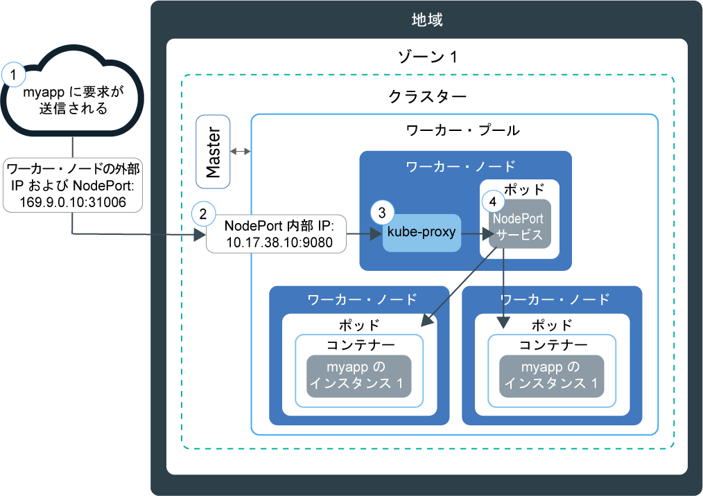

---

copyright:
  years: 2014, 2019
lastupdated: "2019-05-31"

keywords: kubernetes, iks

subcollection: containers

---

{:new_window: target="_blank"}
{:shortdesc: .shortdesc}
{:screen: .screen}
{:pre: .pre}
{:table: .aria-labeledby="caption"}
{:codeblock: .codeblock}
{:tip: .tip}
{:note: .note}
{:important: .important}
{:deprecated: .deprecated}
{:download: .download}
{:preview: .preview}


# NodePort を使用したアプリへのアクセスのテスト
{: #nodeport}

Kubernetes クラスター内の任意のワーカー・ノードのパブリック IP アドレスを使用し、NodePort を公開することにより、コンテナー化アプリにインターネットからアクセスできるようにします。 このオプションは、{{site.data.keyword.containerlong}} でのテストや短期間のパブリック・アクセスのために使用します。
{:shortdesc}

## NodePort を使用してネットワーク・トラフィックを管理する
{: #nodeport_planning}

ワーカー・ノードのパブリック・ポートを公開し、ワーカー・ノードのパブリック IP アドレスを使用して、クラスター内のサービスにインターネットからパブリック・アクセスを行います。
{:shortdesc}

NodePort タイプの Kubernetes サービスを作成してアプリを公開する場合は、30000 から 32767 の範囲の NodePort と内部クラスター IP アドレスがサービスに割り当てられます。 NodePort サービスは、アプリに対する着信要求のための外部エントリー・ポイントとして機能します。 割り当てられた NodePort は、クラスター内の各ワーカー・ノードの `kubeproxy` 設定でパブリックに公開されます。 どのワーカー・ノードも、割り当てられた NodePort で、サービスに対する着信要求の listen を開始します。 インターネットからサービスにアクセスするには、クラスター作成時に割り当てられたワーカー・ノードのパブリック IP アドレスと NodePort を使用します。その形式は、`<IP_address>:<nodeport>` です。 プライベート・ネットワーク上のサービスにアクセスする場合は、パブリック IP アドレスではなく、任意のワーカー・ノードのプライベート IP アドレスを使用します。

次の図は、NodePort サービスが構成されているときに、インターネットからアプリへの通信がどのように誘導されるかを示しています。



1. ワーカー・ノードのパブリック IP アドレスとワーカー・ノード上の NodePort を使用して、要求がアプリに送信されます。

2. 要求が、NodePort サービスの内部クラスター IP アドレスとポートに自動的に転送されます。 内部クラスター IP アドレスはクラスター内でのみアクセス可能です。

3. `kube-proxy` が、要求をアプリの Kubernetes NodePort サービスにルーティングします。

4. 要求が、アプリがデプロイされたポッドのプライベート IP アドレスに転送されます。 複数のアプリ・インスタンスがクラスターにデプロイされている場合、NodePort サービスは、アプリ・ポッド間で要求をルーティングします。

ワーカー・ノードのパブリック IP アドレスは永続的なアドレスではありません。 ワーカー・ノードが削除されたり再作成されたりすると、新しいパブリック IP アドレスがワーカー・ノードに割り当てられます。 NodePort サービスは、アプリのパブリック・アクセスをテストする場合や、パブリック・アクセスが短期間だけ必要な場合に使用できます。 安定的なパブリック IP アドレスによってサービスの可用性を高める必要がある場合は、[ネットワーク・ロード・バランサー (NLB) サービス](/docs/containers?topic=containers-loadbalancer)または [Ingress](/docs/containers?topic=containers-ingress) を使用してアプリを公開してください。
{: note}

<br />


## NodePort サービスを使用してアプリへのアクセスを有効にする
{: #nodeport_config}

フリー・クラスターでも標準クラスターでも、アプリは Kubernetes NodePort サービスとして公開できます。
{:shortdesc}

まだアプリの準備ができていない場合は、[Guestbook ](https://github.com/kubernetes/examples/blob/master/guestbook/all-in-one/guestbook-all-in-one.yaml) という名前の Kubernetes サンプル・アプリを使用できます。

1.  アプリの構成ファイルで、[service ](https://kubernetes.io/docs/concepts/services-networking/service/) セクションを定義します。

    Guestbook サンプルで、フロントエンド・サービス・セクションは構成ファイル内に存在しています。 Guestbook アプリを外部で使用できるようにするには、NodePort タイプと、30000 から 32767 の範囲の NodePort をフロントエンド・サービス・セクションに追加します。
    {: tip}

    例:

    ```
    apiVersion: v1
    kind: Service
    metadata:
      name: <my-nodeport-service>
      labels:
        <my-label-key>: <my-label-value>
    spec:
      selector:
        <my-selector-key>: <my-selector-value>
      type: NodePort
      ports:
       - port: <8081>
         # nodePort: <31514>

    ```
    {: codeblock}

    <table>
    <caption>NodePort サービス・コンポーネントについて</caption>
    <thead>
    <th colspan=2> NodePort の service セクションの構成要素について</th>
    </thead>
    <tbody>
    <tr>
    <td><code>metadata.name</code></td>
    <td><code><em>&lt;my-nodeport-service&gt;</em></code> を NodePort サービスの名前に置き換えます。<p>Kubernetes リソースを処理する際の[個人情報の保護](/docs/containers?topic=containers-security#pi)の詳細を確認してください。</p></td>
    </tr>
    <tr>
    <td><code>metadata.labels</code></td>
    <td><code><em>&lt;my-label-key&gt;</em></code> および <code><em>&lt;my-label-value&gt;</em></code> を、サービスに使用するラベルに置き換えます。</td>
    </tr>
    <tr>
      <td><code>spec.selector</code></td>
      <td><code><em>&lt;my-selector-key&gt;</em></code> および <code><em>&lt;my-selector-value&gt;</em></code> を、デプロイメント YAML の <code>spec.template.metadata.labels</code> セクションで使用したキー/値のペアに置き換えます。 サービスをデプロイメントに関連付けるには、セレクターがデプロイメント・ラベルと一致する必要があります。
      </tr>
    <tr>
    <td><code>ports.port</code></td>
    <td><code><em>&lt;8081&gt;</em></code> を、サービスが listen するポートに置き換えます。 </td>
     </tr>
     <tr>
     <td><code>ports.nodePort</code></td>
     <td>オプション: <code><em>&lt;31514&gt;</em></code> を、30000 から 32767 の範囲の NodePort に置き換えます。 別のサービスで既に使用されている NodePort は指定しないでください。 NodePort を割り当てなければ、ランダムに割り当てられます。<br><br>NodePort を指定して、どの NodePort が既に使用されているかを確認するには、以下のコマンドを実行します。 <pre class="pre"><code>kubectl get svc</code></pre><p>使用中の NodePorts は、**Ports** フィールドの下に表示されます。</p></td>
     </tr>
     </tbody></table>

2.  更新された構成ファイルを保存します。

3.  インターネットに公開するアプリごとに、上記のステップを繰り返して NodePort サービスを作成します。

**次の作業:**

アプリをデプロイする時に、いずれかのワーカー・ノードのパブリック IP アドレスと NodePort を使用して、ブラウザーでそのアプリにアクセスするためのパブリック URL を作成できます。 ワーカー・ノードをプライベート VLAN にのみ接続した場合は、プライベート NodePort サービスが作成されているので、ワーカー・ノードのプライベート IP アドレスを使用してアクセスできます。

1.  クラスター内のワーカー・ノードのパブリック IP アドレスを取得します。 プライベート・ネットワーク上のワーカー・ノードにアクセスする場合は、代わりにプライベート IP アドレスを取得してください。

    ```
    ibmcloud ks workers --cluster <cluster_name>
    ```
    {: pre}

    出力:

    ```
    ID                                                Public IP   Private IP    Size     State    Status
    prod-dal10-pa215dcf5bbc0844a990fa6b0fcdbff286-w1  192.0.2.23  10.100.10.10  u3c.2x4  normal   Ready
    prod-dal10-pa215dcf5bbc0844a990fa6b0fcdbff286-w2  192.0.2.27  10.100.10.15  u3c.2x4  normal   Ready
    ```
    {: screen}

2.  ランダムな NodePort が割り当てられた場合は、その値を確認します。

    ```
    kubectl describe service <service_name>
    ```
    {: pre}

    出力:

    ```
    Name:                   <service_name>
    Namespace:              default
    Labels:                 run=<deployment_name>
    Selector:               run=<deployment_name>
    Type:                   NodePort
    IP:                     10.10.10.8
    Port:                   <unset> 8080/TCP
    NodePort:               <unset> 30872/TCP
    Endpoints:              172.30.171.87:8080
    Session Affinity:       None
    No events.
    ```
    {: screen}

    この例では、NodePort は `30872` です。

    **Endpoints** セクションに `<none>` と表示される場合は、NodePort サービスの `spec.selector` セクションで使用している `<selectorkey>` および `<selectorvalue>` を確認してください。 これが、デプロイメント YAML の `spec.template.metadata.labels` セクションで使用した_キーと値_ のペアと同じであることを確認してください。
    {: note}

3.  ワーカー・ノードの IP アドレスの 1 つと NodePort を使用して URL を作成します。 例: `http://192.0.2.23:30872`
