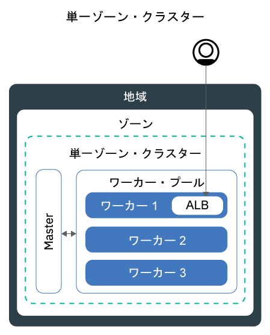
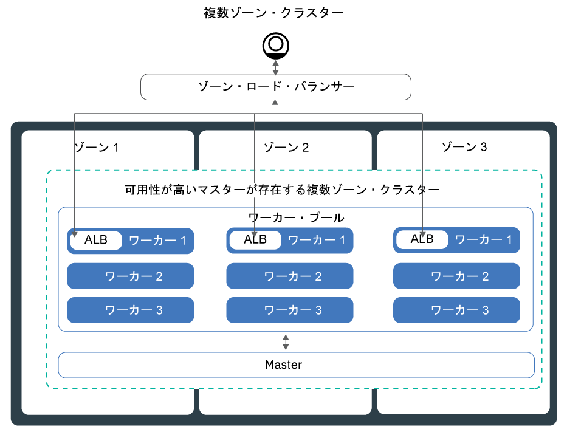
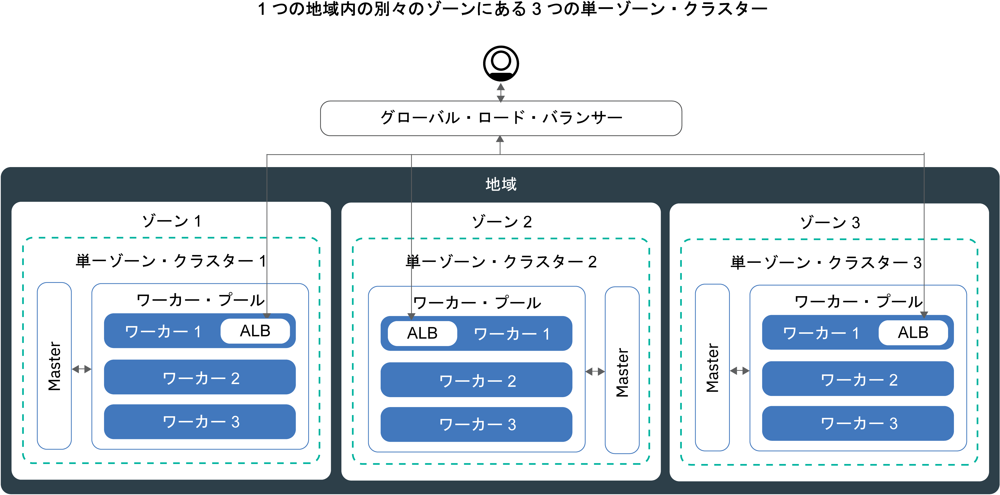

---

copyright:
  years: 2014, 2019
lastupdated: "2019-06-11"

keywords: kubernetes, iks, multi az, multi-az, szr, mzr

subcollection: containers

---

{:new_window: target="_blank"}
{:shortdesc: .shortdesc}
{:screen: .screen}
{:pre: .pre}
{:table: .aria-labeledby="caption"}
{:codeblock: .codeblock}
{:tip: .tip}
{:note: .note}
{:important: .important}
{:deprecated: .deprecated}
{:download: .download}
{:preview: .preview}


# 高可用性のためのクラスターの計画
{: #ha_clusters}

{{site.data.keyword.containerlong}} を使用して、アプリの可用性と容量を最大化できるように標準クラスターを設計します。
{: shortdesc}

アプリを複数のワーカー・ノード、ゾーン、クラスターに分散させると、ユーザーがダウン時間を経験する可能性が低くなります。 ロード・バランシングや負荷の分離などの組み込み機能により、ホスト、ネットワーク、アプリで想定される障害に対する回復力を強化できます。 クラスターのセットアップ方法を以下にまとめます。下に行くほど可用性が高くなります。


1. 1 つのワーカー・プール内に複数のワーカー・ノードがある[単一ゾーン・クラスター ](#single_zone)。
2. ワーカー・ノードが 1 つの地域内の複数のゾーン間に分散させる[複数ゾーン・クラスター](#multizone)。
3. **パブリック VLAN およびプライベート VLAN にのみ接続されているクラスター**: ゾーンまたは地域間でセットアップされ、グローバル・ロード・バランサーを介して接続される[複数クラスター](#multiple_clusters)。

## 単一ゾーン・クラスター
{: #single_zone}

アプリの可用性を向上させ、クラスター内で 1 つのワーカー・ノードが使用できない場合にフェイルオーバーできるようにするには、単一ゾーン・クラスターに追加のワーカー・ノードを付加します。
{: shortdesc}



デフォルトでは、単一ゾーン・クラスターには、`default` という名前のワーカー・プールがセットアップされます。 このワーカー・プールに、クラスターの作成時に定義した同じ構成 (マシン・タイプなど) のワーカー・ノードがグループ化されています。 [既存のワーカー・プールのサイズを変更](/docs/containers?topic=containers-add_workers#resize_pool)するか、[新しいワーカー・プールを追加](/docs/containers?topic=containers-add_workers#add_pool)して、クラスターにワーカー・ノードを追加できます。

ワーカー・ノードをさらに追加すると、複数のワーカー・ノード間でアプリ・インスタンスを分散できます。 1 つのワーカー・ノードがダウンしても、使用可能なワーカー・ノード上のアプリ・インスタンスは実行を継続します。 Kubernetes が、使用不可のワーカー・ノード内のポッドのスケジュールを自動的に変更して、アプリのパフォーマンスと容量を確保します。 ポッドがワーカー・ノード間に均等に分散されるようにするには、[ポッド・アフィニティー](https://kubernetes.io/docs/concepts/configuration/assign-pod-node/#inter-pod-affinity-and-anti-affinity-beta-feature)を実装します。

**単一ゾーン・クラスターを複数ゾーン・クラスターに変換できますか?**</br>
はい。クラスターが[サポートされている複数ゾーンの大都市ロケーション](/docs/containers?topic=containers-regions-and-zones#zones)のいずれかにある場合は可能です。 [スタンドアロン・ワーカー・ノードからワーカー・プールへの更新](/docs/containers?topic=containers-update#standalone_to_workerpool)を参照してください。


**複数ゾーン・クラスターを使用しなければなりませんか?**</br>
いいえ。好きなだけ単一ゾーン・クラスターを作成できます。 実際に、管理をシンプルにしたい場合や、クラスターを特定の[単一ゾーンの都市](/docs/containers?topic=containers-regions-and-zones#zones)に置く必要があるという場合は、単一ゾーン・クラスターを使用するほうが良いでしょう。

**単一ゾーンで高可用性マスターを作成できますか?**</br>
はい。 単一ゾーンのマスターは高可用性です。マスター更新時などの停止を防ぐために、Kubernetes API サーバー、etcd、スケジューラー、およびコントローラー・マネージャー用に別々の物理ホスト上にレプリカが配置されます。 ゾーン障害から保護するには、以下のようにしてください。
* [複数ゾーン対応ゾーンにクラスターを作成します](#multizone)。マスターがゾーン間に分散されます。
* [パブリック VLAN およびプライベート VLAN に接続されている複数クラスターを作成](#multiple_clusters)して、これらのクラスターをグローバル・ロード・バランサーを使用して接続します。

## 複数ゾーン・クラスター
{: #multizone}

{{site.data.keyword.containerlong_notm}} では、複数ゾーン・クラスターを作成できます。 ワーカー・プールを使用してアプリを複数のワーカー・ノードとゾーンに分散させると、ユーザーがダウン時間を経験する可能性が低くなります。 ロード・バランシングなどの組み込み機能により、ホスト、ネットワーク、またはアプリで想定されるゾーンの障害に対する回復力が強化されます。 あるゾーンのリソースがダウンしても、他のゾーンでクラスター・ワークロードは動作し続けます。
{: shortdesc}

**ワーカー・プールとは何ですか?**</br>
ワーカー・プールとは、マシン・タイプ、CPU、メモリーなど、フレーバーが同じワーカー・ノードの集合のことです。 クラスターを作成すると、デフォルトのワーカー・プールが自動的に作成されます。 複数のゾーンにまたがるプールにワーカー・ノードを分散させたり、ワーカー・ノードをプールに追加したり、ワーカー・ノードを更新したりするために、新しい `ibmcloud ks worker-pool` コマンドを使用できます。

**スタンドアロン・ワーカー・ノードはまだ使用できますか?**</br>
スタンドアロン・ワーカー・ノードで構成された従来のクラスター・セットアップは、サポートされますが、非推奨です。 スタンドアロン・ワーカー・ノードを使用するのではなく、[ワーカー・プールをクラスターに追加](/docs/containers?topic=containers-planning_worker_nodes#add_pool)し、[ワーカー・プールを使用](/docs/containers?topic=containers-update#standalone_to_workerpool)してワーカー・ノードを編成してください。

**単一ゾーン・クラスターを複数ゾーン・クラスターに変換できますか?**</br>
はい。クラスターが[サポートされている複数ゾーンの大都市ロケーション](/docs/containers?topic=containers-regions-and-zones#zones)のいずれかにある場合は可能です。 [スタンドアロン・ワーカー・ノードからワーカー・プールへの更新](/docs/containers?topic=containers-update#standalone_to_workerpool)を参照してください。


### 複数ゾーン・クラスターのセットアップの詳細
{: #mz_setup}



ゾーンをクラスターに追加して、ワーカー・プール内のワーカー・ノードを 1つの地域内の複数のゾーンに複製できます。 複数ゾーン・クラスターは、可用性と障害復旧を保証するために、ワーカー・ノード間やゾーン間に均等にポッドをスケジュールするように設計されています。 ワーカー・ノードがゾーン間に均等に分散されていない場合や、いずれかのゾーンの容量が十分でない場合は、Kubernetes スケジューラーが、要求されたポッドを一部スケジュールできないことがあります。 その結果、十分な容量が使用可能になるまで、ポッドが**保留中**の状態になる可能性があります。 Kubernetes スケジューラーがベスト・エフォート分散でゾーン間にポッドを分散させるように、デフォルトの動作を変更する場合は、`preferredDuringSchedulingIgnoredDuringExecution` [ポッド・アフィニティー・ポリシー ](https://kubernetes.io/docs/concepts/configuration/assign-pod-node/#inter-pod-affinity-and-anti-affinity-beta-feature)を使用します。

**3 つのゾーン内にワーカー・ノードが必要なのはなぜですか?** </br>
ワークロードを 3 つのゾーン間に分散させると、1 つまたは 2 つのゾーンが使用できなくなってもアプリの高可用性が確保されるうえに、クラスターのセットアップのコスト効率も向上します。 なぜでしょうか? 以下に例を示します。

アプリのワークロードを処理するのに、コアを 6 つ搭載したワーカー・ノードが 1 台必要であるとします。 クラスターの可用性を高めるには、次の方法があります。

- **もう 1 つのゾーンにリソースを複製する:** この方法では、ワーカー・ノードが 2 つになります。各ゾーンにそれぞれ 6 コアあるため、合計で 12 コアになります。 </br>
- **3 つのゾーン間にリソースを分散させる:**  この方法では、各ゾーンに 3 コアがデプロイされるので、合計容量は 9 コアになります。 ワークロードを処理するには、同時に 2 つのゾーンが稼働している必要があります。 1 つのゾーンが使用不可になった場合は、別の 2 つのゾーンでワークロードを処理できます。 2 つのゾーンが使用不可になった場合は、残りの 3 コアが稼働してワークロードを処理します。 ゾーンあたり 3 コアをデプロイするということは、マシンが小規模になるので、コストが削減されることになります。</br>

**Kubernetes マスターはどのようにセットアップされますか?** </br>
[複数ゾーンの大都市ロケーション](/docs/containers?topic=containers-regions-and-zones#zones)にクラスターを作成すると、可用性の高い Kubernetes マスターが自動的にデプロイされ、3 つのレプリカがその都市のゾーン間に分散されます。 例えば、`dal10`、`dal12`、または `dal13` ゾーンにクラスターが存在する場合は、複数ゾーン大都市であるダラスの各ゾーンに Kubernetes マスターのレプリカが分散されます。

**Kubernetes マスターが使用不可の場合にどのような状況になりますか?** </br>
[Kubernetes マスター](/docs/containers?topic=containers-ibm-cloud-kubernetes-service-technology#architecture)は、クラスターを稼働状態に保つための主要なコンポーネントです。 マスターは、クラスターの真実の単一点 (Single Point of Truth) として機能する etcd データベースに、クラスター・リソースとその構成を保管します。 Kubernetes API サーバーは、ワーカー・ノードからマスターへのすべてのクラスター管理要求、またはクラスター・リソースと対話する場合のメインエントリー・ポイントです。<br><br>マスターに障害が発生した場合、ワークロードは引き続きワーカー・ノードで実行されますが、`kubectl` コマンドを使用してクラスター・リソースを操作したり、マスターの Kubernetes API サーバーがバックアップされるまでクラスターの正常性を表示したりすることはできません。 マスターの障害時にポッドがダウンすると、ワーカー・ノードが再び Kubernetes API サーバーに到達できるまで、ポッドをスケジュール変更することはできません。<br><br>マスターの障害時にも、`ibmcloud ks` コマンドを {{site.data.keyword.containerlong_notm}} API に対して実行して、ワーカー・ノードや VLAN などのインフラストラクチャー・リソースを操作することができます。 クラスターに対してワーカー・ノードを追加または削除して現在のクラスター構成を変更する場合、マスターがバックアップされるまで変更は行われません。

マスターの障害時はワーカー・ノードを再始動またはリブートしないでください。 このアクションにより、ワーカー・ノードからポッドが削除されます。 Kubernetes API サーバーが使用不可のため、ポッドをクラスター内の他のワーカー・ノードにスケジュール変更することはできません。
{: important}


Kubernetes マスターの障害からクラスターを保護する場合や、複数ゾーン・クラスターを使用できない地域の場合は、[パブリック VLAN およびプライベート VLAN に接続されている複数クラスターをセットアップし、これらのクラスターをグローバル・ロード・バランサーを使用して接続します](#multiple_clusters)。

**複数のゾーンにまたがるワーカーとマスター間の通信を可能にするために何かする必要がありますか?**</br>
はい。 1 つのクラスターに複数の VLAN がある場合、同じ VLAN 上に複数のサブネットがある場合、または複数ゾーン・クラスターがある場合は、IBM Cloud インフラストラクチャー (SoftLayer) アカウントに対して[仮想ルーター機能 (VRF)](/docs/infrastructure/direct-link?topic=direct-link-overview-of-virtual-routing-and-forwarding-vrf-on-ibm-cloud#overview-of-virtual-routing-and-forwarding-vrf-on-ibm-cloud) を有効にして、ワーカー・ノードがプライベート・ネットワーク上で相互に通信できるようにする必要があります。 VRF を有効にするには、[IBM Cloud インフラストラクチャー (SoftLayer) のアカウント担当者に連絡してください](/docs/infrastructure/direct-link?topic=direct-link-overview-of-virtual-routing-and-forwarding-vrf-on-ibm-cloud#how-you-can-initiate-the-conversion)。 VRF の有効化が不可能または不要な場合は、[VLAN スパンニング](/docs/infrastructure/vlans?topic=vlans-vlan-spanning#vlan-spanning)を有効にしてください。 この操作を実行するには、**「ネットワーク」>「ネットワーク VLAN スパンニングの管理」**で設定する[インフラストラクチャー権限](/docs/containers?topic=containers-users#infra_access)が必要です。ない場合は、アカウント所有者に対応を依頼してください。 VLAN スパンニングが既に有効になっているかどうかを確認するには、`ibmcloud ks vlan-spanning-get<region>` [コマンド](/docs/containers?topic=containers-cli-plugin-kubernetes-service-cli#cs_vlan_spanning_get)を使用します。

**公共のインターネットからユーザーがアプリにアクセスするにはどうしたらよいですか?**</br>
Ingress アプリケーション・ロード・バランサー (ALB) またはロード・バランサー・サービスを使用して、アプリケーションを公開できます。

- **Ingress アプリケーション・ロード・バランサー (ALB):** デフォルトでは、パブリック ALB がクラスター内の各ゾーンに自動的に作成されて有効になります。 地域ごとに 1 つの MZLB が存在するように、クラスター用の Cloudflare 複数ゾーン・ロード・バランサー (MZLB) も自動的に作成され、デプロイされます。 MZLB は、ALB の IP アドレスを同じホスト名の背後に配置し、これらの IP アドレスが使用可能かどうかを判別するためにこれらのアドレスに対してヘルス・チェックを有効にします。 例えば、米国東部地域の 3 つのゾーンにワーカー・ノードがある場合、ホスト名 `yourcluster.us-east.containers.appdomain.cloud` には 3 つの ALB IP アドレスがあります。 MZLB は、地域の各ゾーンのパブリック ALB IP をヘルス・チェックし、そのヘルス・チェックに基づいて DNS 参照の結果を最新の状態に保ちます。 詳しくは、[Ingress のコンポーネントとアーキテクチャー](/docs/containers?topic=containers-ingress#planning)を参照してください。

- **ロード・バランサー・サービス:** ロード・バランサー・サービスは、1 つのゾーンにのみセットアップされます。 アプリに対する着信要求は、この 1 つのゾーンから他のゾーンのすべてのアプリ・インスタンスに転送されます。 このゾーンが使用不可になると、インターネットからアプリにアクセスできなくなる可能性があります。 他のゾーンに追加のロード・バランサー・サービスをセットアップすることで、単一ゾーンの障害に対応できます。 詳しくは、可用性の高い[ロード・バランサー・サービス](/docs/containers?topic=containers-loadbalancer#multi_zone_config)を参照してください。

**複数ゾーン・クラスターの永続ストレージはセットアップできますか?**</br>
可用性の高い永続ストレージの場合は、[{{site.data.keyword.cloudant_short_notm}}](/docs/services/Cloudant?topic=cloudant-getting-started#getting-started) や [{{site.data.keyword.cos_full_notm}}](/docs/services/cloud-object-storage?topic=cloud-object-storage-about) などのクラウド・サービスを使用します。 [SDS マシン](/docs/containers?topic=containers-planning_worker_nodes#sds)を使用する [Portworx](/docs/containers?topic=containers-portworx#portworx) などのソフトウェア定義ストレージ (SDS) ソリューションを試すこともできます。 詳しくは、[複数ゾーン・クラスターの永続ストレージ・オプションの比較](/docs/containers?topic=containers-storage_planning#persistent_storage_overview)を参照してください。

NFS ファイルおよびブロック・ストレージは、ゾーン間で共有できません。 永続ボリュームは、実際のストレージ・デバイスが存在するゾーンでのみ使用できます。 使用を継続するクラスター内に既存の NFS ファイルまたはブロック・ストレージがある場合は、地域とゾーンのラベルを既存の永続ボリュームに適用する必要があります。 これらのラベルにより、kube-scheduler は永続ボリュームを使用するアプリのスケジュール先を決定できます。 `<mycluster>` をクラスター名に置き換えて、以下のコマンドを実行します。

```
bash <(curl -Ls https://raw.githubusercontent.com/IBM-Cloud/kube-samples/master/file-pv-labels/apply_pv_labels.sh) <mycluster>
```
{: pre}

**複数ゾーン・クラスターを作成しました。 まだゾーンが 1 つだけなのはなぜですか? どのようにしてクラスターにゾーンを追加するのですか?**</br>
[CLI で複数ゾーン・クラスターを作成](/docs/containers?topic=containers-clusters#clusters_ui)すると、クラスターは作成されますが、ゾーンをワーカー・プールに追加しないと処理は完了しません。 複数のゾーンに広げるには、クラスターが[複数ゾーンの大都市ロケーション](/docs/containers?topic=containers-regions-and-zones#zones)に存在する必要があります。 クラスターにゾーンを追加してワーカー・ノードをゾーン間に分散させるには、[ゾーンをクラスターに追加する](/docs/containers?topic=containers-add_workers#add_zone)手順を参照してください。

### 現在のクラスターの管理方法はどのように変わりますか?
{: #mz_new_ways}

ワーカー・プールを導入すると、新しい一連の API とコマンドを使用してクラスターを管理できます。 これらの新しいコマンドは、[CLI 資料のページ](/docs/containers?topic=containers-cli-plugin-kubernetes-service-cli)を参照するか、`ibmcloud ks help` を実行して端末に表示できます。
{: shortdesc}

以下の表は、いくつかの一般的なクラスター管理操作の古い方式と新しい方式を比較しています。
<table summary="この表は、複数ゾーン・コマンドを実行する新しい方法の説明を示しています。行は左から右に読みます。1 列目は説明、2 列目は古い方法、3 列目は新しい複数ゾーンの方法です。">
<caption>新しい複数ゾーン・ワーカー・プール・コマンド方式。</caption>
  <thead>
  <th>説明</th>
  <th>古いスタンドアロン・ワーカー・ノード</th>
  <th>新しい複数ゾーン・ワーカー・プール</th>
  </thead>
  <tbody>
    <tr>
    <td>ワーカー・ノードをクラスターに追加します。</td>
    <td><p class="deprecated">スタンドアロン・ワーカー・ノードを追加するための <code>ibmcloud ks worker-add</code>。</p></td>
    <td><ul><li>既存のプールと異なるマシン・タイプを追加するには、<code>ibmcloud ks worker-pool-create</code> [コマンド](/docs/containers?topic=containers-cli-plugin-kubernetes-service-cli#cs_worker_pool_create)で新しいワーカー・プールを作成します。</li>
    <li>ワーカー・ノードを既存のプールに追加するには、<code>ibmcloud ks worker-pool-resize</code> [コマンド](/docs/containers?topic=containers-cli-plugin-kubernetes-service-cli#cs_worker_pool_resize)で、プール内のゾーンあたりのノード数をサイズ変更します。</li></ul></td>
    </tr>
    <tr>
    <td>ワーカー・ノードをクラスターから削除します。</td>
    <td>まだ <code>ibmcloud ks worker-rm</code> を使用して、クラスターから問題のあるワーカー・ノードを削除できます。</td>
    <td><ul><li>ワーカー・プールがアンバランスになっている場合 (ワーカー・ノードの削除後など)、<code>ibmcloud ks worker-pool-rebalance</code> [コマンド](/docs/containers?topic=containers-cli-plugin-kubernetes-service-cli#cs_rebalance)でバランスを再調整します。</li>
    <li>プール内のワーカー・ノードの数を減らすには、<code>ibmcloud ks worker-pool-resize</code> [コマンド](/docs/containers?topic=containers-cli-plugin-kubernetes-service-cli#cs_worker_pool_resize)で、ゾーンあたりの数をサイズ変更します (最小値は `1`)。</li></ul></td>
    </tr>
    <tr>
    <td>ワーカー・ノードに新しい VLAN を使用します。</td>
    <td><p class="deprecated"><code>ibmcloud ks worker-add</code> で新しいプライベート VLAN またはパブリック VLAN を使用する新しいワーカー・ノードを追加します。</p></td>
    <td><code>ibmcloud ks zone-network-set</code> [コマンド](/docs/containers?topic=containers-cli-plugin-kubernetes-service-cli#cs_zone_network_set)で、これまで使用していたものとは別のパブリック VLAN またはプライベート VLAN を使用するように、ワーカー・プールを設定します。</td>
    </tr>
  </tbody>
  </table>

## グローバル・ロード・バランサーを使用して接続した複数のパブリック・クラスター
{: #multiple_clusters}

Kubernetes マスターの障害からアプリを保護したい場合や、複数ゾーン・クラスターを使用できない地域の場合は、1 つの地域のさまざまなゾーンに複数のクラスターを作成し、グローバル・ロード・バランサーを使用してそれらを接続できます。
{: shortdesc}

グローバル・ロード・バランサーを使用して複数クラスターを接続するには、クラスターをパブリック VLAN およびプライベート VLAN に接続する必要があります。
{: note}



複数のクラスター間でワークロードのバランスを取るには、グローバル・ロード・バランサーをセットアップし、アプリケーション・ロード・バランサー (ALB) またはロード・バランサー・サービスのパブリック IP アドレスをドメインに追加する必要があります。 これらの IP アドレスを追加すると、クラスター間で着信トラフィックを転送できます。 グローバル・ロード・バランサーが、使用不可になったクラスターを検出できるように、すべての IP アドレスに ping ベースのヘルス・チェックを追加することを検討してください。 このチェックをセットアップすると、ドメインに追加した IP アドレスが DNS プロバイダーによって定期的に ping されます。 いずれかの IP アドレスが使用不可になった場合、その IP アドレスにはトラフィックが送信されなくなります。 ただし、Kubernetes は、使用不可になったクラスターのポッドを、使用可能なクラスターのワーカー・ノード上で自動的に再始動しません。 使用可能なクラスターで Kubernetes がポッドを自動的に再始動するようにしたい場合は、[複数ゾーン・クラスター](#multizone)のセットアップを検討してください。

**3 つのゾーンに 3 つのクラスターが必要なのはなぜですか?** </br>
[複数ゾーン・クラスターで 3 つのゾーン](#multizone)を使用する場合と同様に、ゾーン間で 3 つのクラスターをセットアップすると、アプリの可用性を向上させることができます。 また、ワークロードを処理するために購入するマシンが小規模なものになるので、コストを削減できます。

**地域間で複数のクラスターをセットアップするとどうなりますか?** </br>
複数のクラスターは、1 つの地理位置情報に属する複数の地域 (米国南部と米国東部など) にセットアップすることも、複数の地理位置情報の地域 (米国南部と中欧など) にセットアップすることもできます。 どちらのセットアップもアプリの可用性のレベルは同じですが、データ共有とデータ複製については複雑さが増します。 ほとんどの場合は、同じ地理位置情報の地域内で十分です。 しかし、ユーザーが世界中にいる場合は、ユーザーがいる場所にクラスターをセットアップして、ユーザーがアプリに要求を送信したときの待ち時間が長くならないようにするほうが良いこともあります。

**複数のクラスターに対してグローバル・ロード・バランサーをセットアップするには、以下のようにします。**

1. 複数のゾーンまたは地域で[クラスターを作成](/docs/containers?topic=containers-clusters#clusters)します。
2. 1 つのクラスターに複数の VLAN がある場合、同じ VLAN 上に複数のサブネットがある場合、または複数ゾーン・クラスターがある場合は、IBM Cloud インフラストラクチャー (SoftLayer) アカウントに対して[仮想ルーター機能 (VRF)](/docs/infrastructure/direct-link?topic=direct-link-overview-of-virtual-routing-and-forwarding-vrf-on-ibm-cloud#overview-of-virtual-routing-and-forwarding-vrf-on-ibm-cloud) を有効にして、ワーカー・ノードがプライベート・ネットワーク上で相互に通信できるようにする必要があります。 VRF を有効にするには、[IBM Cloud インフラストラクチャー (SoftLayer) のアカウント担当者に連絡してください](/docs/infrastructure/direct-link?topic=direct-link-overview-of-virtual-routing-and-forwarding-vrf-on-ibm-cloud#how-you-can-initiate-the-conversion)。 VRF の有効化が不可能または不要な場合は、[VLAN スパンニング](/docs/infrastructure/vlans?topic=vlans-vlan-spanning#vlan-spanning)を有効にしてください。 この操作を実行するには、**「ネットワーク」>「ネットワーク VLAN スパンニングの管理」**で設定する[インフラストラクチャー権限](/docs/containers?topic=containers-users#infra_access)が必要です。ない場合は、アカウント所有者に対応を依頼してください。 VLAN スパンニングが既に有効になっているかどうかを確認するには、`ibmcloud ks vlan-spanning-get<region>` [コマンド](/docs/containers?topic=containers-cli-plugin-kubernetes-service-cli#cs_vlan_spanning_get)を使用します。
3. 各クラスターで、[アプリケーション・ロード・バランサー (ALB)](/docs/containers?topic=containers-ingress#ingress_expose_public) または[ロード・バランサー・サービス](/docs/containers?topic=containers-loadbalancer)を使用して、アプリを公開します。
4. クラスターごとに、ALB またはロード・バランサー・サービスのパブリック IP アドレスをリストします。
   - クラスター内のすべてのパブリック対応 ALB の IP アドレスをリストするには、以下のようにします。
     ```
     ibmcloud ks albs --cluster <cluster_name_or_id>
     ```
     {: pre}

   - ロード・バランサー・サービスの IP アドレスをリストするには、以下のようにします。
     ```
     kubectl describe service <myservice>
     ```
     {: pre}

     **Load Balancer Ingress** IP アドレスが、ロード・バランサー・サービスに割り当てられたポータブル・パブリック IP アドレスです。

4.  {{site.data.keyword.Bluemix_notm}} Internet Services (CIS) を使用してグローバル・ロード・バランサーをセットアップするか、独自のグローバル・ロード・バランサーをセットアップします。

    **CIS グローバル・ロード・バランサーを使用するには、以下のようにします**。
    1.  [{{site.data.keyword.Bluemix_notm}} Internet Services (CIS) の概説](/docs/infrastructure/cis?topic=cis-getting-started#getting-started)のステップ 1 から 5 に従って、サービスをセットアップします。 この手順で、サービス・インスタンスをプロビジョニングし、アプリ・ドメインを追加し、ネーム・サーバーを構成し、DNS レコードを作成します。 集めた ALB またはロード・バランサーの IP アドレスごとに DNS レコードを作成します。 これらの DNS レコードにより、アプリ・ドメインをクラスターの ALB またはロード・バランサーのすべてにマップし、アプリ・ドメインへの要求がラウンドロビン・サイクルでクラスターに転送されるようになります。
    2. ALB またはロード・バランサーの[ヘルス・チェックを追加](/docs/infrastructure/cis?topic=cis-set-up-and-configure-your-load-balancers#add-a-health-check)します。 すべてのクラスター内の ALB またはロード・バランサーに同じヘルス・チェックを使用することも、特定のクラスターで使用する特定のヘルス・チェックを作成することもできます。
    3. 各クラスターの ALB またはロード・バランサーの IP を追加して、クラスターごとに[起点プールを追加](/docs/infrastructure/cis?topic=cis-set-up-and-configure-your-load-balancers#add-a-pool)します。 例えば、3 つのクラスターがあり、各クラスターに 2 つの ALB がある場合、それぞれ 2 つの ALB IP アドレスを含む起点プールを 3 つ作成します。 作成した起点プールごとにヘルス・チェックを追加します。
    4. [グローバル・ロード・バランサーを追加](/docs/infrastructure/cis?topic=cis-set-up-and-configure-your-load-balancers#set-up-and-configure-your-load-balancers)します。

    **独自のグローバル・ロード・バランサーを使用するには、以下のようにします**。
    1. すべてのパブリック対応の ALB やロード・バランサー・サービスの IP アドレスをドメインに追加して、着信トラフィックを ALB またはロード・バランサー・サービスに転送するようにドメインを構成します。
    2. DNS プロバイダーが正常でない IP アドレスを検出できるように、IP アドレスごとに ping ベースのヘルス・チェックを有効にします。 正常でない IP アドレスが検出されると、トラフィックはその IP アドレスに転送されなくなります。
