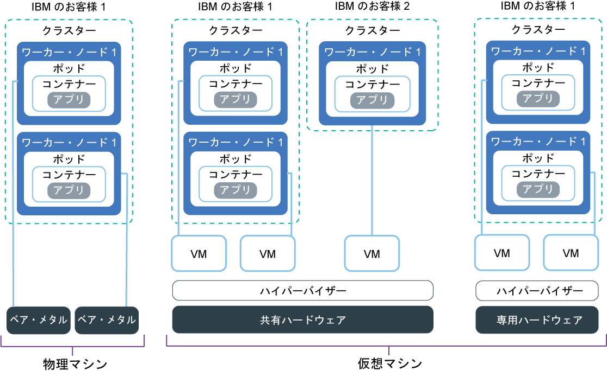

---

copyright:
  years: 2014, 2019
lastupdated: "2019-06-11"

keywords: kubernetes, iks, multi az, multi-az, szr, mzr

subcollection: containers

---

{:new_window: target="_blank"}
{:shortdesc: .shortdesc}
{:screen: .screen}
{:pre: .pre}
{:table: .aria-labeledby="caption"}
{:codeblock: .codeblock}
{:tip: .tip}
{:note: .note}
{:important: .important}
{:deprecated: .deprecated}
{:download: .download}
{:preview: .preview}

# ワーカー・ノードのセットアップの計画
{: #planning_worker_nodes}

Kubernetes クラスターは、ワーカー・ノード・プールでグループ化されたワーカー・ノードで構成され、Kubernetes マスターによって一元的にモニターされて管理されます。 クラスター管理者は、ワーカー・ノードのクラスターをどのようにセットアップするかを決定して、クラスター内のアプリをデプロイして実行するためのすべてのリソースをクラスター・ユーザーのために用意します。
{:shortdesc}

標準クラスターを作成すると、自動的に同じメモリー、CPU、およびディスク・スペースの仕様 (フレーバー) のワーカー・ノードが IBM Cloud インフラストラクチャー (SoftLayer) で注文され、クラスター内のデフォルトのワーカー・ノード・プールに追加されます。 すべてのワーカー・ノードには、固有のワーカー・ノード ID とドメイン名が割り当てられます。それらをクラスターの作成後に変更してはいけません。 仮想サーバーと物理 (ベア・メタル) サーバーのどちらにするかを選択できます。 選択したハードウェア分離レベルに応じて、仮想ワーカー・ノードを共有ノードまたは専用ノードとしてセットアップできます。 別のフレーバーをクラスターに追加するには、[別のワーカー・プールを作成](/docs/containers?topic=containers-cli-plugin-kubernetes-service-cli#cs_worker_pool_create)します。

Kubernetes では、1 つのクラスター内に作成できるワーカー・ノードの最大数に制限があります。 詳しくは、[ワーカー・ノードとポッドの割り当て量 ](https://kubernetes.io/docs/setup/cluster-large/) を参照してください。

常に十分な数のワーカー・ノードを配備してワークロードをカバーできるようにするには、 [クラスター自動スケーリング機能](/docs/containers?topic=containers-ca#ca)を試してみてください。
{: tip}

 

## ワーカー・ノードに使用可能なハードウェア
{: #shared_dedicated_node}

{{site.data.keyword.Bluemix_notm}} で標準クラスターを作成する場合、ワーカー・プールを、物理マシン (ベア・メタル) のワーカー・ノードによる構成にするか、または物理ハードウェア上で実行される仮想マシンのワーカー・ノードによる構成にするかを選択します。 また、ワーカー・ノードのフレーバー、つまり、メモリー、CPU、ディスク・ストレージなどのその他のマシン仕様の組み合わせを選択します。
{:shortdesc}

ワーカー・ノードに複数のフレーバーを使用する場合、フレーバーごとにワーカー・プールを作成する必要があります。 既存のワーカー・ノードのサイズを変更して、CPU やメモリーなどのリソースを変えることはできません。 フリー・クラスターを作成した場合、ワーカー・ノードは IBM Cloud インフラストラクチャー (SoftLayer) アカウントに仮想の共有ノードとして自動的にプロビジョンされます。 標準クラスターでは、ワークロードに最適なマシンのタイプを選択できます。 計画する際は、CPU とメモリーの合計容量に対する[ワーカー・ノードのリソース予約](#resource_limit_node)を考慮してください。

必要なワーカー・プールのタイプを決定するには、以下のオプションのいずれかを選択します。
* [仮想マシン](#vm)
* [物理マシン (ベア・メタル)](#bm)
* [ソフトウェア定義ストレージ (SDS) マシン](#sds)

## 仮想マシン
{: #vm}

VM を使用すると、ベア・メタルと比較して、柔軟性が高く、プロビジョニング時間が短く、自動スケーラビリティー機能が多く、コスト対費用効果が上がります。 テスト環境と開発環境、ステージング環境と実稼働環境、マイクロサービス、ビジネス・アプリなど、ほとんどの汎用ユース・ケースに VM を使用できます。 ただし、パフォーマンスの面でトレードオフがあります。 RAM、データ、または GPU を集中的に使用するワークロードにハイパフォーマンス・コンピューティングが必要な場合は、[ベア・メタル](#bm)を使用してください。
{: shortdesc}

**共有ハードウェアまたは専用ハードウェアのどちらを使用しますか?** 
標準の仮想クラスターを作成する場合は、基礎ハードウェアを {{site.data.keyword.IBM_notm}} の複数のお客様で共有する (マルチテナンシー) か、自分専用にする (単一テナンシー) かを選択する必要があります。

* **マルチテナントの共有ハードウェア・セットアップの場合**: CPU やメモリーなどの物理リソースは、同じ物理ハードウェアにデプロイされたすべての仮想マシン間で共有されます。 各仮想マシンが独立して実行できるようにするため、仮想マシン・モニター (ハイパーバイザーとも呼ばれる) が物理リソースを個別のエンティティーにセグメント化し、それらを専用リソースとして仮想マシンに割り振ります (ハイパーバイザー分離)。
* **単一テナントの専用ハードウェア・セットアップの場合**: すべての物理リソースがユーザー専用になります。 同じ物理ホスト上に複数のワーカー・ノードを仮想マシンとしてデプロイできます。 マルチテナント・セットアップと同様、各ワーカー・ノードには、使用可能な物理リソースがハイパーバイザーによって割り振られます。

共有ノードは通常、専用ノードよりも安価です。基盤となるハードウェアのコストを複数のお客様が共同で分担するからです。 ただし、共有ノードにするか専用ノードにするかを決定する際は、社内の法務部門に相談して、アプリ環境で必要になるインフラストラクチャーの分離とコンプライアンスのレベルを検討することをお勧めします。

一部のフレーバーは、特定のタイプのテナント・セットアップとしてのみ提供されています。 例えば、`m3c` VM は `shared` テナンシー・セットアップとしてのみ提供されています。
{: note}

**VM の一般的な特徴は何ですか?** 
仮想マシンでは、信頼性を確保するために、ストレージ・エリア・ネットワーク (SAN) ではなくローカル・ディスクが使用されます。 信頼性が高いと、ローカル・ディスクへのバイトのシリアライズ時のスループットが向上し、ネットワーク障害が原因のファイル・システムのパフォーマンス低下が軽減されます。 すべての VM には、ネットワーキング速度 1000 Mbps、OS ファイル・システム用の 1 次ローカル・ディスク・ストレージ 25 GB、コンテナー・ランタイムや `kubelet` などのデータ用の 2 次ローカル・ディスク・ストレージ 100 GB があります。 ワーカー・ノード上のローカル・ストレージは短期処理専用で、ワーカー・ノードを更新したり再ロードしたりすると、1 次ディスクと 2 次ディスクはワイプされます。 永続ストレージのソリューションについては、[可用性の高い永続ストレージの計画](/docs/containers?topic=containers-storage_planning#storage_planning)を参照してください。

**古いマシン・タイプがある場合どうなりますか?** 
クラスターに非推奨の `x1c` や古い Ubuntu 16 `x2c` といったワーカー・ノード・フレーバーがある場合、[Ubuntu 18 `x3c` ワーカー・ノードを含むようにクラスターを更新](/docs/containers?topic=containers-update#machine_type)できます。

**どのような仮想マシン・フレーバーが使用可能ですか?** 
ワーカー・ノード・フレーバーはゾーンによって異なります。 以下の表に、古い `x2c` Ubuntu 16 ワーカー・ノード・フレーバーではなく、`x3c` Ubuntu 18 ワーカー・ノード・フレーバーなどの最新バージョンのフレーバーを示します。 ご使用のゾーンで使用可能なマシン・タイプを確認するには、`ibmcloud ks machine-types <zone>` を実行してください。 使用可能な[ベア・メタル](#bm)や [SDS](#sds) のマシン・タイプを確認することもできます。

{: #vm-table}
<table>
<caption>{{site.data.keyword.containerlong_notm}} で使用可能な仮想マシン・タイプ。</caption>
<thead>
<th>名前とユース・ケース</th>
<th>コア数/メモリー</th>
<th>1 次/2 次ディスク</th>
<th>ネットワーク速度</th>
</thead>
<tbody>
<tr>
<td><strong>仮想、u3c.2x4</strong>: この最小サイズの VM は、迅速なテストや PoC (概念検証) などの軽いワークロードに使用します。</td>
<td>2 / 4 GB</td>
<td>25 GB / 100 GB</td>
<td>1000 Mbps</td>
</tr>
<tr>
<td><strong>仮想、b3c.4x16</strong>: このバランス型 VM は、テストや開発などの軽いワークロードに使用します。</td>
<td>4 / 16 GB</td>
<td>25 GB / 100 GB</td>
<td>1000 Mbps</td>
</tr>
<tr>
<td><strong>仮想、b3c.16x64</strong>: このバランス型 VM は、中規模のワークロードに使用します。</td></td>
<td>16 / 64 GB</td>
<td>25 GB / 100 GB</td>
<td>1000 Mbps</td>
</tr>
<tr>
<td><strong>仮想、b3c.32x128</strong>: このバランス型 VM は、データベースや、同時ユーザー数の多い動的 Web サイトなど、中規模から大規模のワークロードに使用します。</td>
<td>32 / 128 GB</td>
<td>25 GB / 100 GB</td>
<td>1000 Mbps</td>
</tr>
<tr>
<td><strong>仮想、c3c.16x16</strong>: このフレーバーは、軽いワークロードの際にワーカー・ノードのコンピュート・リソースを均等なバランスにする場合に使用します。</td>
<td>16 / 16 GB</td>
<td>25 GB / 100 GB</td>
<td>1000 Mbps</td>
</tr><tr>
<td><strong>仮想、c3c.16x32</strong>: このフレーバーは、小規模から中規模のワークロードの際にワーカー・ノードの CPU とメモリーのリソースを 1:2 の比率にする場合に使用します。</td>
<td>16 / 32 GB</td>
<td>25 GB / 100 GB</td>
<td>1000 Mbps</td>
</tr><tr>
<td><strong>仮想、c3c.32x32</strong>: このフレーバーは、中規模のワークロードの際にワーカー・ノードのコンピュート・リソースを均等なバランスにする場合に使用します。</td>
<td>32 / 32 GB</td>
<td>25 GB / 100 GB</td>
<td>1000 Mbps</td>
</tr><tr>
<td><strong>仮想、c3c.32x64</strong>: このフレーバーは、中規模のワークロードの際にワーカー・ノードの CPU とメモリー・リソースを 1:2 の比率にする場合に使用します。</td>
<td>32 / 64 GB</td>
<td>25 GB / 100 GB</td>
<td>1000 Mbps</td>
</tr>
<tr>
<td><strong>仮想、m3c.8x64</strong>: このフレーバーは、{{site.data.keyword.Db2_on_Cloud_short}} などのデータベースのように、メモリーを多く必要とする中規模から小規模のワークロードのために、1:8 の比率の CPU リソースとメモリー・リソースが必要な場合に使用します。 ダラスでのみ、`--hardware shared` テナンシーとして提供されています。</td>
<td>8 / 64 GB</td>
<td>25 GB / 100 GB</td>
<td>1000 Mbps</td>
</tr><tr>
<td><strong>仮想、m3c.16x128</strong>: このフレーバーは、{{site.data.keyword.Db2_on_Cloud_short}} などのデータベースのように、メモリーを多く必要とする中規模のワークロードのために、1:8 の比率の CPU リソースとメモリー・リソースが必要な場合に使用します。 ダラスでのみ、`--hardware shared` テナンシーとして提供されています。</td>
<td>16 / 128 GB</td>
<td>25 GB / 100 GB</td>
<td>1000 Mbps</td>
</tr><tr>
<td><strong>仮想、m3c.30x240</strong>: このフレーバーは、{{site.data.keyword.Db2_on_Cloud_short}} などのデータベースのように、メモリーを多く必要とする中規模から大規模のワークロードのために、1:8 の比率の CPU リソースとメモリー・リソースが必要な場合に使用します。 ダラスでのみ、`--hardware shared` テナンシーとして提供されています。</td>
<td>30 / 240 GB</td>
<td>25 GB / 100 GB</td>
<td>1000 Mbps</td>
</tr>
<tr>
<td><strong>仮想、z1.2x4</strong>: このフレーバーは、IBM Z System のハイパー保護コンテナー上にワーカー・ノードを作成する場合に使用します。</td>
<td>2 / 4 GB</td>
<td>25 GB / 100 GB</td>
<td>1000 Mbps</td>
</tr>
</tbody>
</table>

## 物理マシン (ベア・メタル)
{: #bm}

ワーカー・ノードを単一テナントの物理サーバー (ベア・メタルとも呼ばれる) としてプロビジョンできます。
{: shortdesc}

**ベア・メタルと VM にはどのような違いがありますか?** 
ベア・メタルを使用すると、メモリーや CPU など、マシン上の物理リソースに直接アクセスできます。 このセットアップには、ホスト上で稼働する仮想マシンに物理リソースを割り振る仮想マシン・ハイパーバイザーは含まれません。 むしろ、ベア・メタル・マシンのすべてのリソースがこのワーカーの専用であるため、リソースを共有したりパフォーマンスを低下させたりする「ノイジー・ネイバー」について心配する必要がありません。 物理マシン・タイプは、ローカル・ストレージが仮想マシン・タイプより大きく、一部のタイプはデータの可用性を向上させるための RAID を備えています。 ワーカー・ノード上のローカル・ストレージは短期処理専用で、ワーカー・ノードを更新したり再ロードしたりすると、1 次ディスクと 2 次ディスクはワイプされます。 永続ストレージのソリューションについては、[可用性の高い永続ストレージの計画](/docs/containers?topic=containers-storage_planning#storage_planning)を参照してください。

**より良い仕様でパフォーマンスが向上すること以外に、VM ではできないことをベア・メタルで実行できますか?** 
はい。 ベア・メタルでは、ワーカー・ノードが改ざんされていないことを検証するためのトラステッド・コンピュートを有効にするオプションがあります。 クラスターの作成時にトラストを有効にしなかった場合に、後で有効にするには、`ibmcloud ks feature-enable` [コマンド](/docs/containers?topic=containers-cli-plugin-kubernetes-service-cli#cs_cluster_feature_enable)を使用します。 トラストを有効にした後に無効にすることはできません。 トラストなしで新規クラスターを作成できます。 ノードの始動プロセス中のトラストの動作について詳しくは、[トラステッド・コンピューティングを使用する {{site.data.keyword.containerlong_notm}}](/docs/containers?topic=containers-security#trusted_compute) を参照してください。 トラステッド・コンピューティングは、特定のベア・メタル・マシン・タイプでのみ使用できます。 `ibmcloud ks machine-types <zone>` [コマンド](/docs/containers?topic=containers-cli-plugin-kubernetes-service-cli#cs_machine_types)を実行し、**Trustable** フィールドを参照して、トラストをサポートしているマシンを確認できます。 例えば、`mgXc` GPU フレーバーではトラステッド・コンピューティングはサポートされません。

トラステッド・コンピュートに加えて、{{site.data.keyword.datashield_full}} (ベータ版) も使用できます。 {{site.data.keyword.datashield_short}} は、インテル® Software Guard Extensions (SGX) および Fortanix® テクノロジーと統合されているため、使用中の {{site.data.keyword.Bluemix_notm}} コンテナーのワークロードのコードとデータを保護できます。 アプリのコードとデータは、CPU で保護されたエンクレーブで実行されます。エンクレーブは、ワーカー・ノード上の信頼できるメモリー領域であり、ここでアプリの重要な側面を保護することで、コードとデータの機密を保ち、改ざんを防止できます。 社内の方針、政府規制、業界のコンプライアンス要件のためにデータの機密性を確保する必要がある場合は、このソリューションを使用すればクラウドへの移行の役に立つはずです。 ユース・ケースの例には、金融機関や医療機関、オンプレミスのクラウド・ソリューションを必要とする政策を行っている国などがあります。

**ベア・メタルは素晴らしいです。 今すぐ注文しない理由はありますか?** 
ベア・メタル・サーバーは仮想サーバーよりも費用がかかりますが、多くのリソースとホスト制御を必要とする高性能アプリに最適です。

ベア・メタル・サーバーは月単位で請求されます。 月末前にベア・メタル・サーバーを解約しても、その月の終わりまでの金額が請求されます。 お客様がベアメタル・サーバーを注文またはキャンセルした後に、IBM Cloud インフラストラクチャー (SoftLayer) アカウントの処理が手動で実行されます。 そのため、完了するまでに 1 営業日以上かかる場合があります。
{: important}

**注文できるベア・メタル・フレーバーにはどのようなものがありますか?** 
ワーカー・ノード・フレーバーはゾーンによって異なります。 以下の表に、古い `x2c` Ubuntu 16 ワーカー・ノード・フレーバーではなく、`x3c` Ubuntu 18 ワーカー・ノード・フレーバーなどの最新バージョンのフレーバーを示します。 ご使用のゾーンで使用可能なマシン・タイプを確認するには、`ibmcloud ks machine-types <zone>` を実行してください。 使用可能な [VM](#vm) や [SDS](#sds) のマシン・タイプを確認することもできます。

ベア・メタル・マシンは、RAM 集中型、データ集中型、または GPU 集中型のワークロードなど、さまざまなユース・ケース用に最適化されています。

該当のワークロードに対応する適切なストレージ構成を持つマシン・タイプを選択してください。 一部のフレーバーは、以下のようなディスクとストレージ構成の混合になっています。 例えば、一部のフレーバーにはロー SSD 2 次ディスクを持つ SATA 1 次ディスクがあるなどです。

* **SATA**: OS ファイル・システムを保管するワーカー・ノードの 1 次ディスクによく使用される磁気スピン・ディスク・ストレージ・デバイス。
* **SSD**: ハイパフォーマンス・データ向けのソリッド・ステート・ドライブ・ストレージ・デバイス。
* **ロー**: ストレージ・デバイスはフォーマットされていないため、全容量が使用可能です。
* **RAID**: ストレージ・デバイスでは、データは、RAID レベルに応じて異なる冗長性とパフォーマンスのために分散されています。 このため、使用可能なディスク容量はさまざまです。

{: #bm-table}
<table>
<caption>{{site.data.keyword.containerlong_notm}} で使用可能なベア・メタル・マシン・タイプ。</caption>
<thead>
<th>名前とユース・ケース</th>
<th>コア数/メモリー</th>
<th>1 次/2 次ディスク</th>
<th>ネットワーク速度</th>
</thead>
<tbody>
<tr>
<td><strong>RAM 集中型ベア・メタル、mr3c.28x512</strong>: ワーカー・ノードで使用できる RAM を最大化します。</td>
<td>28 / 512 GB</td>
<td>2 TB SATA / 960 GB SSD</td>
<td>10000 Mbps</td>
</tr>
<tr>
<td><strong>GPU ベア・メタル、mg3c.16x128</strong>: このタイプは、ハイパフォーマンス・コンピューティング、機械学習、3D アプリケーションなど、数理計算主体のワークロードの場合に選択します。 このフレーバーは Tesla K80 物理カードを 1 つ備えています。カード当たり 2 つのグラフィックス処理装置 (GPU) が搭載されており、合計 2 つの GPU を備えています。</td>
<td>16 / 128 GB</td>
<td>2 TB SATA / 960 GB SSD</td>
<td>10000 Mbps</td>
</tr>
<tr>
<td><strong>GPU ベアメタル、mg3c.28x256</strong>: このタイプは、ハイパフォーマンス・コンピューティング、機械学習、3D アプリケーションなど、数理計算主体のワークロードの場合に選択します。 このフレーバーは Tesla K80 物理カードを 2 つ備えています。カード当たり 2 つの GPU が搭載されており、合計 4 つの GPU を備えています。</td>
<td>28 / 256 GB</td>
<td>2 TB SATA / 960 GB SSD</td>
<td>10000 Mbps</td>
</tr>
<tr>
<td><strong>データ集中型ベアメタル、md3c.16x64.4x4tb</strong>: このタイプは、分散ファイル・システム、大規模データベース、ビッグデータ分析などのワークロードの場合に、大容量ローカル・ディスク・ストレージ用に使用します (データの可用性を向上させるための RAID を含む)。</td>
<td>16 / 64 GB</td>
<td>2x2 TB RAID1 / 4x4 TB SATA RAID10</td>
<td>10000 Mbps</td>
</tr>
<tr>
<td><strong>データ集中型ベアメタル、md3c.28x512.4x4tb</strong>: このタイプは、分散ファイル・システム、大規模データベース、ビッグデータ分析などのワークロードの場合に、大容量ローカル・ディスク・ストレージ用に使用します (データの可用性を向上させるための RAID を含む)。</td>
<td>28 / 512 GB</td>
<td>2x2 TB RAID1 / 4x4 TB SATA RAID10</td>
<td>10000 Mbps</td>
</tr>
<tr>
<td><strong>バランス型ベア・メタル、mb3c.4x32</strong>: 仮想マシンが提供するより多くのコンピュート・リソースを必要とするバランス型ワークロードに使用します。 このフレーバーは、インテル® Software Guard Extensions (SGX) でも有効にできるため、<a href="/docs/services/data-shield?topic=data-shield-getting-started#getting-started" target="_blank">{{site.data.keyword.datashield_short}} (ベータ版) </a> を使用してデータ・メモリーを暗号化することができます。</td>
<td>4 / 32 GB</td>
<td>2 TB SATA / 2 TB SATA</td>
<td>10000 Mbps</td>
</tr>
<tr>
<td><strong>バランス型ベア・メタル、mb3c.16x64</strong>: 仮想マシンが提供するより多くのコンピュート・リソースを必要とするバランス型ワークロードに使用します。</td>
<td>16 / 64 GB</td>
<td>2 TB SATA / 960 GB SSD</td>
<td>10000 Mbps</td>
</tr>
<tr>
</tbody>
</table>

## ソフトウェア定義ストレージ (SDS) マシン
{: #sds}

ソフトウェア定義ストレージ (SDS) フレーバーは、物理ローカル・ストレージ用の追加のロー・ディスクがプロビジョンされた物理マシンです。 これらのロー・ディスクは、1 次ローカル・ディスクや 2 次ローカル・ディスクとは異なり、ワーカー・ノードの更新時や再ロード時にワイプされません。 データはコンピュート・ノードと同じ場所に配置されるため、SDS マシンはハイパフォーマンス・ワークロードに適しています。
{: shortdesc}

**SDS フレーバーはどのような場合に使用しますか?** 
通常、以下の場合に SDS マシンを使用します。
*  クラスターに SDS アドオン ([Portworx](/docs/containers?topic=containers-portworx#portworx) など) を使用する場合は、SDS マシンを使用します。
*  アプリが、ローカル・ストレージを必要とする [StatefulSet ](https://kubernetes.io/docs/concepts/workloads/controllers/statefulset/) である場合、SDS マシンを使用して、[Kubernetes ローカル永続ボリューム (ベータ) ](https://kubernetes.io/blog/2018/04/13/local-persistent-volumes-beta/) をプロビジョンできます。
*  カスタム・アプリのためにローカルに追加のロー・ストレージが必要な場合もあります。

その他のストレージのソリューションについては、[可用性の高い永続ストレージの計画](/docs/containers?topic=containers-storage_planning#storage_planning)を参照してください。

**どのような SDS フレーバーを注文できますか?** 
ワーカー・ノード・フレーバーはゾーンによって異なります。 以下の表に、古い `x2c` Ubuntu 16 ワーカー・ノード・フレーバーではなく、`x3c` Ubuntu 18 ワーカー・ノード・フレーバーなどの最新バージョンのフレーバーを示します。 ご使用のゾーンで使用可能なマシン・タイプを確認するには、`ibmcloud ks machine-types <zone>` を実行してください。 使用可能な[ベア・メタル](#bm)や [VM](#vm) のマシン・タイプを確認することもできます。

該当のワークロードに対応する適切なストレージ構成を持つマシン・タイプを選択してください。 一部のフレーバーは、以下のようなディスクとストレージ構成の混合になっています。 例えば、一部のフレーバーにはロー SSD 2 次ディスクを持つ SATA 1 次ディスクがあるなどです。

* **SATA**: OS ファイル・システムを保管するワーカー・ノードの 1 次ディスクによく使用される磁気スピン・ディスク・ストレージ・デバイス。
* **SSD**: ハイパフォーマンス・データ向けのソリッド・ステート・ドライブ・ストレージ・デバイス。
* **ロー**: ストレージ・デバイスはフォーマットされていないため、全容量が使用可能です。
* **RAID**: ストレージ・デバイスでは、データは、RAID レベルに応じて異なる冗長性とパフォーマンスのために分散されています。 このため、使用可能なディスク容量はさまざまです。

{: #sds-table}
<table>
<caption>{{site.data.keyword.containerlong_notm}} で使用可能な SDS マシン・タイプ。</caption>
<thead>
<th>名前とユース・ケース</th>
<th>コア数/メモリー</th>
<th>1 次/2 次ディスク</th>
<th>追加のロー・ディスク</th>
<th>ネットワーク速度</th>
</thead>
<tbody>
<tr>
<td><strong>SDS 付きベア・メタル、ms3c.4x32.1.9tb.ssd</strong>: パフォーマンスのために追加のローカル・ストレージが必要な場合、ソフトウェア定義ストレージ (SDS) がサポートされて、大量のディスクを使用するこのフレーバーを使用します。</td>
<td>4 / 32 GB</td>
<td>2 TB SATA / 960 GB SSD</td>
<td>1.9 TB ロー SSD (デバイス・パス: `/dev/sdc`)</td>
<td>10000 Mbps</td>
</tr>
<tr>
<td><strong>SDS 付きベア・メタル、ms3c.16x64.1.9tb.ssd</strong>: パフォーマンスのために追加のローカル・ストレージが必要な場合、ソフトウェア定義ストレージ (SDS) がサポートされて、大量のディスクを使用するこのフレーバーを使用します。</td>
<td>16 / 64 GB</td>
<td>2 TB SATA / 960 GB SSD</td>
<td>1.9 TB ロー SSD (デバイス・パス: `/dev/sdc`)</td>
<td>10000 Mbps</td>
</tr>
<tr>
<td><strong>SDS 付きベア・メタル、ms3c.28x256.3.8tb.ssd</strong>: パフォーマンスのために追加のローカル・ストレージが必要な場合、ソフトウェア定義ストレージ (SDS) がサポートされて、大量のディスクを使用するこのフレーバーを使用します。</td>
<td>28 / 256 GB</td>
<td>2 TB SATA / 1.9 TB SSD</td>
<td>3.8 TB ロー SSD (デバイス・パス: `/dev/sdc`)</td>
<td>10000 Mbps</td>
</tr>
<tr>
<td><strong>SDS 付きベア・メタル、ms3c.28x512.4x3.8tb.ssd</strong>: パフォーマンスのために追加のローカル・ストレージが必要な場合、ソフトウェア定義ストレージ (SDS) がサポートされて、大量のディスクを使用するこのフレーバーを使用します。</td>
<td>28 / 512 GB</td>
<td>2 TB SATA / 1.9 TB SSD</td>
<td>4 ディスク、3.8 TB ロー SSD (デバイス・パス: `/dev/sdc`、`/dev/sdd`、`/dev/sde`、`/dev/sdf`)</td>
<td>10000 Mbps</td>
</tr>
</tbody>
</table>

## ワーカー・ノードのリソース予約
{: #resource_limit_node}

{{site.data.keyword.containerlong_notm}} では、各ワーカー・ノードで使用できるコンピュート・リソースを制限するコンピュート・リソース予約が設定されています。 予約されたメモリーおよび CPU リソースは、ワーカー・ノード上のポッドには使用できないので、各ワーカー・ノードの割り振り可能リソースが減少します。 最初にポッドをデプロイするときに、ワーカー・ノードに十分な割り振り可能リソースがなければ、そのデプロイは失敗します。 さらに、ポッドがワーカー・ノードのリソース制限を超えると、ポッドは強制除去されます。 Kubernetes では、この制限を[ハード・エビクションしきい値](https://kubernetes.io/docs/tasks/administer-cluster/out-of-resource/#hard-eviction-thresholds) と呼びます。
{:shortdesc}

使用可能な CPU またはメモリーがワーカー・ノード予約分よりも少なくなると、Kubernetes はポッドの強制除去を開始して、十分なコンピュート・リソースを取り戻します。 別のワーカー・ノードが使用可能であれば、ポッドはそのワーカー・ノードにスケジュール変更されます。 ポッドの強制除去が頻繁に行われる場合は、クラスターにワーカー・ノードを追加するか、ポッドの[リソース制限 ](https://kubernetes.io/docs/concepts/configuration/manage-compute-resources-container/#resource-requests-and-limits-of-pod-and-container) を設定してください。

ワーカー・ノードで予約されるリソースは、ワーカー・ノードに装備された CPU とメモリーの量によって異なります。 {{site.data.keyword.containerlong_notm}} では、以下の表に示すようにメモリー層と CPU 層が定義されています。 ワーカー・ノードに複数の層のコンピュート・リソースが装備されている場合は、一定の割合の CPU リソースとメモリー・リソースが層ごとに予約されます。

ワーカー・ノードで現在使用されているコンピュート・リソースの量を確認するには、[`kubectl top node ` ](https://kubernetes.io/docs/reference/kubectl/overview/#top) を実行します。
{: tip}

<table summary="この表は、ワーカー・ノードのメモリー予約を層別に示しています。">
<caption>ワーカー・ノードの層別メモリー予約。</caption>
<thead>
<tr>
  <th>メモリー層</th>
  <th>予約される割合または量</th>
  <th>`b3c.4x16` ワーカー・ノード (16 GB) の例</th>
  <th>`mg1c.28x256` ワーカー・ノード (256 GB) の例</th>
</tr>
</thead>
<tbody>
<tr>
  <td>最初の 4 GB (0 GB から 4 GB)</td>
  <td>メモリーの 25%</td>
  <td>1 GB</td>
  <td>1 GB</td>
</tr>
<tr>
  <td>次の 4 GB (5 GB から 8 GB)</td>
  <td>メモリーの 20%</td>
  <td>0.8 GB</td>
  <td>0.8 GB</td>
</tr>
<tr>
  <td>次の 8 GB (9 GB から 16 GB)</td>
  <td>メモリーの 10%</td>
  <td>0.8 GB</td>
  <td>0.8 GB</td>
</tr>
<tr>
  <td>次の 112 GB (17 GB から 128 GB)</td>
  <td>メモリーの 6%</td>
  <td>該当なし</td>
  <td>6.72 GB</td>
</tr>
<tr>
  <td>残りの GB (129 GB 以上)</td>
  <td>メモリーの 2%</td>
  <td>該当なし</td>
  <td>2.54 GB</td>
</tr>
<tr>
  <td>[`kubelet` 強制除去 ](https://kubernetes.io/docs/tasks/administer-cluster/out-of-resource/) 用の追加予約</td>
  <td>100 MB</td>
  <td>100 MB (一定)</td>
  <td>100 MB (一定)</td>
</tr>
<tr>
  <td>**合計予約量**</td>
  <td>**(さまざま)**</td>
  <td>**合計 16 GB のうち 2.7 GB**</td>
  <td>**合計 256 GB のうち 11.96 GB**</td>
</tr>
</tbody>
</table>

<table summary="この表は、ワーカー・ノードの CPU 予約を層別に示しています。">
<caption>ワーカー・ノードの層別 CPU 予約。</caption>
<thead>
<tr>
  <th>CPU 層</th>
  <th>予約される割合</th>
  <th>`b3c.4x16` ワーカー・ノード (4 コア) の例</th>
  <th>`mg1c.28x256` ワーカー・ノード (28 コア) の例</th>
</tr>
</thead>
<tbody>
<tr>
  <td>最初のコア (コア 1)</td>
  <td>コアの 6%</td>
  <td>0.06 コア</td>
  <td>0.06 コア</td>
</tr>
<tr>
  <td>次の 2 コア (コア 2 から 3)</td>
  <td>コアの 1%</td>
  <td>0.02 コア</td>
  <td>0.02 コア</td>
</tr>
<tr>
  <td>次の 2 コア (コア 4 から 5)</td>
  <td>コアの 0.5%</td>
  <td>0.005 コア</td>
  <td>0.01 コア</td>
</tr>
<tr>
  <td>残りのコア (コア 6 以上)</td>
  <td>コアの 0.25%</td>
  <td>該当なし</td>
  <td>0.0575 コア</td>
</tr>
<tr>
  <td>**合計予約量**</td>
  <td>**(さまざま)**</td>
  <td>**合計 4 コアのうち 0.085 コア**</td>
  <td>**合計 28 コアのうち 0.1475 コア**</td>
</tr>
</tbody>
</table>
