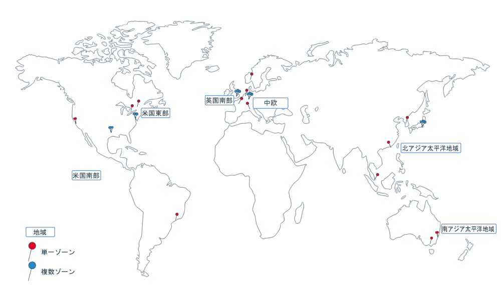

---

copyright:
  years: 2014, 2018
lastupdated: "2018-10-10"

---

{:new_window: target="_blank"}
{:shortdesc: .shortdesc}
{:screen: .screen}
{:pre: .pre}
{:table: .aria-labeledby="caption"}
{:codeblock: .codeblock}
{:tip: .tip}
{:download: .download}

# 地域とゾーン

地域は、アプリ、サービス、およびその他の {{site.data.keyword.Bluemix}} リソースをデプロイできる特定の地理的な場所です。 [{{site.data.keyword.Bluemix_notm}} 地域](#bluemix_regions)は [{{site.data.keyword.containerlong}} 地域](#container_regions)とは異なります。 地域は 1 つ以上のゾーンで構成されます。
ゾーンは物理データ・センターであり、サービスとアプリケーションをホストするためのコンピュート・リソース、ネットワーク・リソース、ストレージ・リソース、関連冷却機器および電源機器をホストしています。 単一障害点を共有しないようにゾーンは互いに独立しています。
{:shortdesc}

{{site.data.keyword.Bluemix_notm}} は、世界中でホストされています。 {{site.data.keyword.Bluemix_notm}} 内のサービスは、グローバルに使用できるものもありますし、特定の地域内で使用できるものもあります。 {{site.data.keyword.containerlong_notm}} で Kubernetes クラスターを作成すると、そのリソースは、クラスターをデプロイした地域に残ります。

**注**: サポートされるすべての {{site.data.keyword.containerlong_notm}} 地域で標準クラスターを作成できます。 フリー・クラスターは、選択地域でのみ使用可能です。



_{{site.data.keyword.containerlong_notm}} 地域とゾーン_

サポートされる {{site.data.keyword.containerlong_notm}} 地域は次のとおりです。
* 北アジア太平洋地域 (標準クラスターのみ)
* 南アジア太平洋地域
* 中欧
* 英国南部
* 米国東部 (標準クラスターのみ)
* 米国南部

<br />


## {{site.data.keyword.Bluemix_notm}} の地域
{: #bluemix_regions}

{{site.data.keyword.Bluemix_notm}} 地域を使用して、{{site.data.keyword.Bluemix_notm}} サービス間のリソースを編成できます。 例えば、同じ地域の {{site.data.keyword.registryshort_notm}} に保管されるプライベート Docker イメージを使用して、Kubernetes クラスターを作成することができます。
{:shortdesc}

現在どの {{site.data.keyword.Bluemix_notm}} 地域にいるのかを確認するには、`ibmcloud info` を実行し、**Region** フィールドを確認します。

{{site.data.keyword.Bluemix_notm}} 地域には、ログイン時に API エンドポイントを指定することによってアクセスできます。 地域を指定しない場合、最も近い地域に自動的にログインします。

例えば、以下のコマンドを使用して {{site.data.keyword.Bluemix_notm}} 地域の API エンドポイントにログインできます。

  * 米国南部
      ```
      ibmcloud login -a api.ng.bluemix.net
      ```
      {: pre}

  * 米国東部
      ```
      ibmcloud login -a api.us-east.bluemix.net
      ```
      {: pre}

  * シドニーと東京
      ```
      ibmcloud login -a api.au-syd.bluemix.net
      ```
      {: pre}

  * ドイツ
      ```
      ibmcloud login -a api.eu-de.bluemix.net
      ```
      {: pre}

  * 英国
      ```
      ibmcloud login -a api.eu-gb.bluemix.net
      ```
      {: pre}

<br />


## {{site.data.keyword.containerlong_notm}} の地域
{: #container_regions}

{{site.data.keyword.containerlong_notm}} 地域を使用して、ログインしている {{site.data.keyword.Bluemix_notm}} 地域以外の地域で、Kubernetes クラスターの作成とアクセスを行うことができます。 {{site.data.keyword.containerlong_notm}} 地域のエンドポイントとは、{{site.data.keyword.Bluemix_notm}} 全体ではなく、{{site.data.keyword.containerlong_notm}} のみを指します。
{:shortdesc}

**注**: サポートされるすべての {{site.data.keyword.containerlong_notm}} 地域で標準クラスターを作成できます。 フリー・クラスターは、選択地域でのみ使用可能です。

サポートされる {{site.data.keyword.containerlong_notm}} 地域は次のとおりです。
  * 北アジア太平洋地域 (標準クラスターのみ)
  * 南アジア太平洋地域
  * 中欧
  * 英国南部
  * 米国東部 (標準クラスターのみ)
  * 米国南部

1 つのグローバルなエンドポイント `https://containers.bluemix.net/v1` を使用して、{{site.data.keyword.containerlong_notm}} にアクセスできます。
* 現在自分が属する {{site.data.keyword.containerlong_notm}} 地域を確認するには、`ibmcloud ks region` を実行します。
* 使用可能な地域とそのエンドポイントのリストを取得するには、`ibmcloud ks regions` を実行します。

グローバル・エンドポイントと共に API を使用するには、すべての要求で、`X-Region` ヘッダーによって地域名を渡します。
{: tip}

### 別の{{site.data.keyword.containerlong_notm}}地域へのログイン
{: #container_login_endpoints}

{{site.data.keyword.containerlong_notm}} CLI を使用して、地域を変更できます。
{:shortdesc}

以下の理由で、別の {{site.data.keyword.containerlong_notm}} 地域にログインしたい場合があります。
  * ある地域で作成した {{site.data.keyword.Bluemix_notm}} サービスまたはプライベート Docker イメージを、別の地域の {{site.data.keyword.containerlong_notm}} で使用したい。
  * ログインしているデフォルトの {{site.data.keyword.Bluemix_notm}} 地域とは別の地域のクラスターにアクセスしたい。

地域をすぐに切り替えるには、[`ibmcloud ks region-set`](cs_cli_reference.html#cs_region-set) を実行します。

### {{site.data.keyword.containerlong_notm}} の API コマンドの使用
{: #containers_api}

{{site.data.keyword.containerlong_notm}} API と対話するには、コマンド・タイプを入力し、グローバルなエンドポイントに `/v1/command` を追加します。
{:shortdesc}

`GET /clusters` API の例を示します。
  ```
  GET https://containers.bluemix.net/v1/clusters
  ```
  {: codeblock}

</br>

グローバル・エンドポイントと共に API を使用するには、すべての要求で、`X-Region` ヘッダーによって地域名を渡します。 使用可能な地域をリストするには、`ibmcloud ks regions` を実行します。
{: tip}

API コマンドの資料を参照するには、[https://containers.bluemix.net/swagger-api/](https://containers.bluemix.net/swagger-api/) を表示してください。

## {{site.data.keyword.containerlong_notm}} のゾーン
{: #zones}

ゾーンとは、各 {{site.data.keyword.Bluemix_notm}} 地域で使用できる物理データ・センターのことです。 地域は、ゾーンを編成するための概念的なツールであり、さまざまな国のゾーン (データ・センター) を含めることができます。 以下の表に、地域別に使用可能なゾーンを示します。
{:shortdesc}

* **複数ゾーンの大都市**: 複数ゾーンの大都市に作成されたクラスター内のワーカー・ノードは、複数のゾーンに分散されます。
* **単一ゾーンの都市**: 単一ゾーンの都市に作成されたクラスター内のワーカー・ノードは、1 つのゾーンにとどまります。 ワーカー・ノードを複数のゾーンに分散させることはできません。

<table summary="この表は、利用可能なゾーンを地域別に示しています。行は左から右に読みます。1 列目は地域、2 列目は複数ゾーンの大都市、3 列目は単一ゾーンの都市です。">
<caption>利用可能な単一ゾーンと複数ゾーン (地域別)。</caption>
  <thead>
  <th>地域</th>
  <th>複数ゾーンの大都市</th>
  <th>単一ゾーンの都市</th>
  </thead>
  <tbody>
    <tr>
      <td>北アジア太平洋地域</td>
      <td>東京: tok02、tok04、tok05</td>
      <td><p>中華人民共和国香港特別行政区: hkg02</p>
      <p>ソウル: seo01</p>
      <p>シンガポール: sng01</p></td>
    </tr>
    <tr>
      <td>南アジア太平洋地域</td>
      <td>なし</td>
      <td><p>シドニー: syd01、syd04</p>
      <p>メルボルン: mel01</p></td>
    </tr>
    <tr>
      <td>中欧</td>
      <td>フランクフルト: fra02、fra04、fra05</td>
      <td><p>アムステルダム: ams03</p>
      <td><p>ミラノ: mil01</p>
      <p>オスロ: osl01</p>
      <p>パリ: par01</p>
      </td>
    </tr>
    <tr>
      <td>英国南部</td>
      <td>ロンドン: lon02、lon04、lon06</td>
      <td></td>
    </tr>
    <tr>
      <td>米国東部</td>
      <td>ワシントン特別区: wdc04、wdc06、wdc07</td>
      <td><p>モントリオール: mon01</p>
      <p>トロント: tor01</p></td>
    </tr>
    <tr>
      <td>米国南部</td>
      <td>ダラス: dal10、dal12、dal13</td>
      <td><p>サンノゼ: sjc03、sjc04</p>
      <p>サンパウロ: sao01</p></td>
    </tr>
  </tbody>
</table>

### 単一ゾーンのクラスター
{: #single_zone}

単一ゾーンのクラスターでは、クラスターのリソースは、クラスターがデプロイされたゾーンにとどまります。 以下の図は、米国東部の地域の例における単一ゾーン・クラスターのコンポーネントの関係を表しています。


_単一ゾーンのクラスターのリソースが存在する場所について_

1.  クラスターのリソース (マスター・ノードやワーカー・ノードなど) は、クラスターをデプロイした同じゾーンにあります。 ローカル・コンテナーのオーケストレーション・アクション (`kubectl` コマンドなど) を実行すると、同じゾーン内のマスター・ノードとワーカー・ノードの間で情報が交換されます。

2.  他のクラスター・リソース (ストレージ、ネットワーキング、コンピュート、ポッドで実行されているアプリなど) をセットアップした場合、リソースとそのデータは、クラスターをデプロイしたゾーンに残ります。

3.  クラスターの管理操作 (`ibmcloud ks` コマンドの使用など) を開始すると、クラスターに関する基本情報 (名前、ID、ユーザー、コマンドなど) が地域のエンドポイントを介して転送されます。

### 複数ゾーン・クラスター
{: #multizone}

複数ゾーン・クラスターでは、マスター・ノードは複数ゾーン対応のゾーンにデプロイされ、クラスターのリソースは複数のゾーンに分散されます。

1.  ワーカー・ノードは、クラスターの可用性を向上させるために、1 つの地域内の複数のゾーンに分散されます。 マスターは、クラスターをデプロイしたのと同じ複数ゾーン対応のゾーンにとどまります。 ローカル・コンテナーのオーケストレーション操作 (`kubectl` コマンドなど) を開始すると、地域エンドポイントを介してマスター・ノードとワーカー・ノードの間で情報が交換されます。

2.  ストレージ、ネットワーキング、コンピュート、ポッドで実行されるアプリなど、他のクラスター・リソースは、さまざまな方法で複数ゾーン・クラスターにデプロイできます。 詳しくは、以下のトピックを参照してください。
    * 複数ゾーン・クラスターで [ファイル・ストレージ](cs_storage_file.html#add_file)と[ブロック・ストレージ](cs_storage_block.html#add_block)をセットアップする
    * [複数ゾーン・クラスターで LoadBalancer サービスを使用してアプリへのパブリック・アクセスまたはプライベート・アクセスを有効にする](cs_loadbalancer.html#multi_zone_config)
    * [Ingress を使用してネットワーク・トラフィックを管理する](cs_ingress.html#planning)
    * [アプリの可用性の向上](cs_app.html#increase_availability)

3.  クラスターの管理操作 ([`ibmcloud ks` コマンド](cs_cli_reference.html#cs_cli_reference)の使用など) を開始すると、クラスターに関する基本情報 (名前、ID、ユーザー、コマンドなど) が地域のエンドポイントを介して転送されます。
