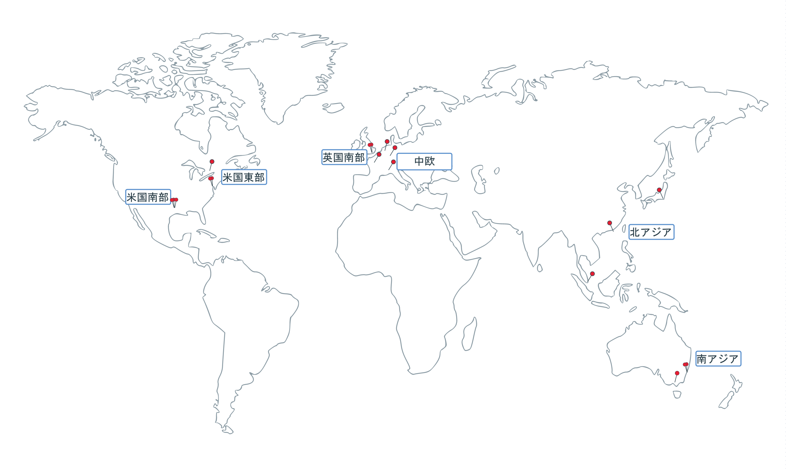

---

copyright:
  years: 2014, 2018
lastupdated: "2018-01-24"

---

{:new_window: target="_blank"}
{:shortdesc: .shortdesc}
{:screen: .screen}
{:pre: .pre}
{:table: .aria-labeledby="caption"}
{:codeblock: .codeblock}
{:tip: .tip}
{:download: .download}

# 地域とロケーション
{{site.data.keyword.Bluemix}} は、世界中でホストされています。 地域とは、エンドポイントによってアクセスされる地理的領域のことです。 ロケーションとは、地域内のデータ・センターのことです。 {{site.data.keyword.Bluemix_notm}} 内のサービスは、グローバルに使用できるものもありますし、特定の地域内で使用できるものもあります。
{:shortdesc}

[{{site.data.keyword.Bluemix_notm}} 地域](#bluemix_regions)は [{{site.data.keyword.containershort_notm}} 地域](#container_regions)とは異なります。



図 1. {{site.data.keyword.containershort_notm}} 地域とデータ・センター

サポートされる {{site.data.keyword.containershort_notm}} 地域は次のとおりです。
  * 北アジア太平洋地域
  * 南アジア太平洋地域
  * 中欧
  * 英国南部
  * 米国東部
  * 米国南部


## {{site.data.keyword.Bluemix_notm}} 地域の API エンドポイント
{: #bluemix_regions}

{{site.data.keyword.Bluemix_notm}} 地域を使用して、{{site.data.keyword.Bluemix_notm}} サービス間のリソースを編成できます。 例えば、同じ地域の {{site.data.keyword.registryshort_notm}} に保管されるプライベート Docker イメージを使用して、Kubernetes クラスターを作成することができます。
{:shortdesc}

現在どの {{site.data.keyword.Bluemix_notm}} 地域にいるのかを確認するには、`bx info` を実行し、**Region** フィールドを確認します。

{{site.data.keyword.Bluemix_notm}} 地域には、ログイン時に API エンドポイントを指定することによってアクセスできます。 地域を指定しない場合、最も近い地域に自動的にログインします。

{{site.data.keyword.Bluemix_notm}} 地域の API エンドポイントを指定したログイン・コマンドの例を以下に示します。

  * 米国南部と米国東部
      ```
      bx login -a api.ng.bluemix.net
      ```
      {: pre}

  * シドニーと北アジア太平洋地域
      ```
      bx login -a api.au-syd.bluemix.net
      ```
      {: pre}

  * ドイツ
      ```
      bx login -a api.eu-de.bluemix.net
      ```
      {: pre}

  * 英国
      ```
      bx login -a api.eu-gb.bluemix.net
      ```
      {: pre}


<br />


## {{site.data.keyword.containershort_notm}} 地域の API エンドポイントとロケーション
{: #container_regions}

{{site.data.keyword.containershort_notm}} 地域を使用して、ログインしている {{site.data.keyword.Bluemix_notm}} 地域以外の地域で、Kubernetes クラスターの作成とアクセスを行うことができます。 {{site.data.keyword.containershort_notm}} 地域のエンドポイントとは、{{site.data.keyword.Bluemix_notm}} 全体ではなく、{{site.data.keyword.containershort_notm}} のみを指します。
{:shortdesc}

1 つのグローバルなエンドポイント `https://containers.bluemix.net/` を使用して、{{site.data.keyword.containershort_notm}} にアクセスできます。
* 現在自分が属する {{site.data.keyword.containershort_notm}} 地域を確認するには、`bx cs region` を実行します。
* 使用可能な地域とそのエンドポイントのリストを取得するには、`bx cs regions` を実行します。

グローバル・エンドポイントと共に API を使用するには、すべての要求で、`X-Region` ヘッダーによって地域名を渡します。
{: tip}

### 別のコンテナー・サービス地域へのログイン
{: #container_login_endpoints}

以下の理由で、別の {{site.data.keyword.containershort_notm}} 地域にログインしたい場合があります。
  * ある地域で作成した {{site.data.keyword.Bluemix_notm}} サービスまたはプライベート Docker イメージを、別の地域の {{site.data.keyword.containershort_notm}} で使用したい。
  * ログインしているデフォルトの {{site.data.keyword.Bluemix_notm}} 地域とは別の地域のクラスターにアクセスしたい。

</br>

地域をすぐに切り替えるには、`bx cs region-set` を実行します。

### コンテナー・サービスを使用できるロケーション
{: #locations}

ロケーションとは、地域内で使用できるデータ・センターのことです。

  | 地域 | ロケーション | 市区町村 |
  |--------|----------|------|
  | 北アジア太平洋地域 | hkg02、seo01、sng01、tok02 | 香港、ソウル、シンガポール、東京 |
  | 南アジア太平洋地域     | mel01、syd01、syd04        | メルボルン、シドニー |
  | 中欧     | ams03、fra02、mil01、par01        | アムステルダム、フランクフルト、ミラノ、パリ |
  | 英国南部      | lon02、lon04         | London (ロンドン) |
  | 米国東部      | mon01、tor01、wdc06、wdc07        | モントリオール、トロント、ワシントン DC |
  | 米国南部     | dal10、dal12、dal13、sao01       | ダラス、サンパウロ |

**注**: ミラノ (mil01) はフリー・クラスター専用です。

### コンテナー・サービスの API コマンドの使用
{: #container_api}

{{site.data.keyword.containershort_notm}} API と対話するには、コマンド・タイプを入力し、グローバルなエンドポイントに `/v1/command` を追加します。

`GET /clusters` API の例を示します。
  ```
  GET https://containers.bluemix.net/v1/clusters
  ```
  {: codeblock}

</br>

グローバル・エンドポイントと共に API を使用するには、すべての要求で、`X-Region` ヘッダーによって地域名を渡します。 使用可能な地域をリストするには、`bx cs regions` を実行します。
{: tip}

API コマンドの資料を参照するには、[https://containers.bluemix.net/swagger-api/](https://containers.bluemix.net/swagger-api/) を表示してください。
