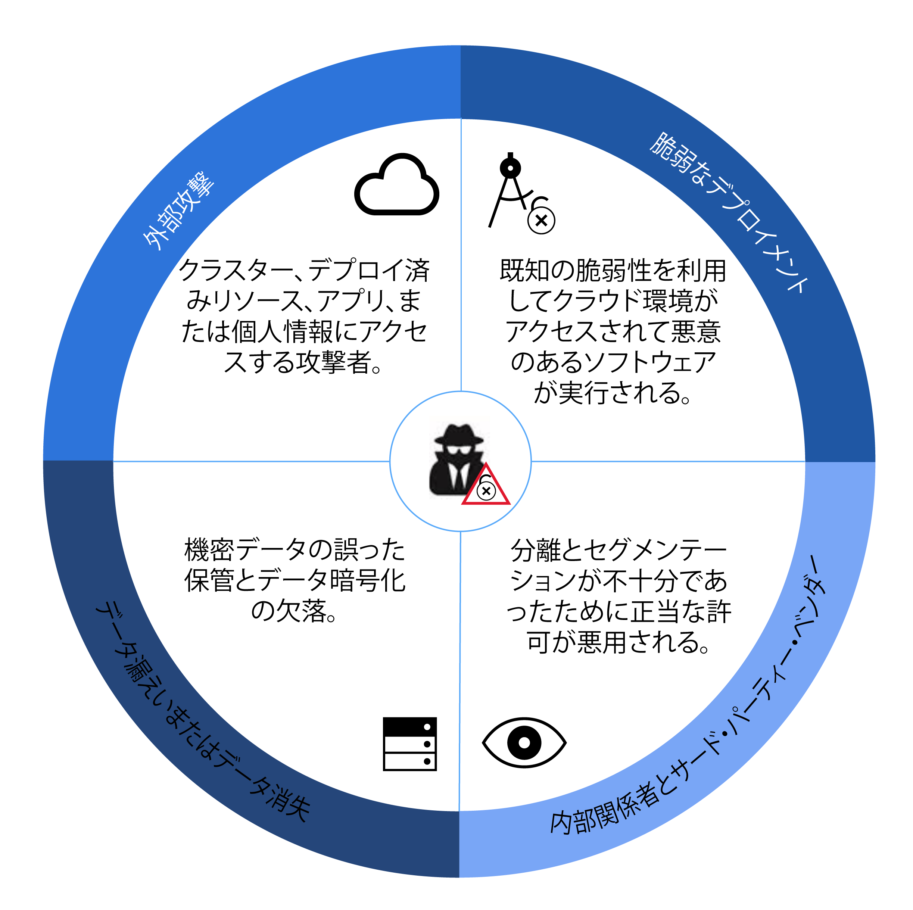
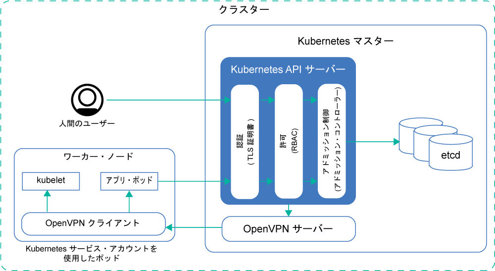
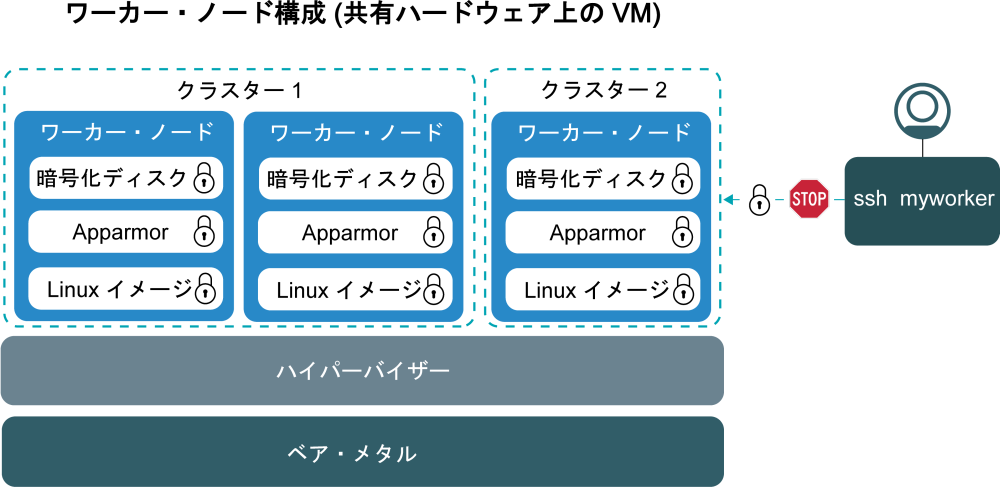
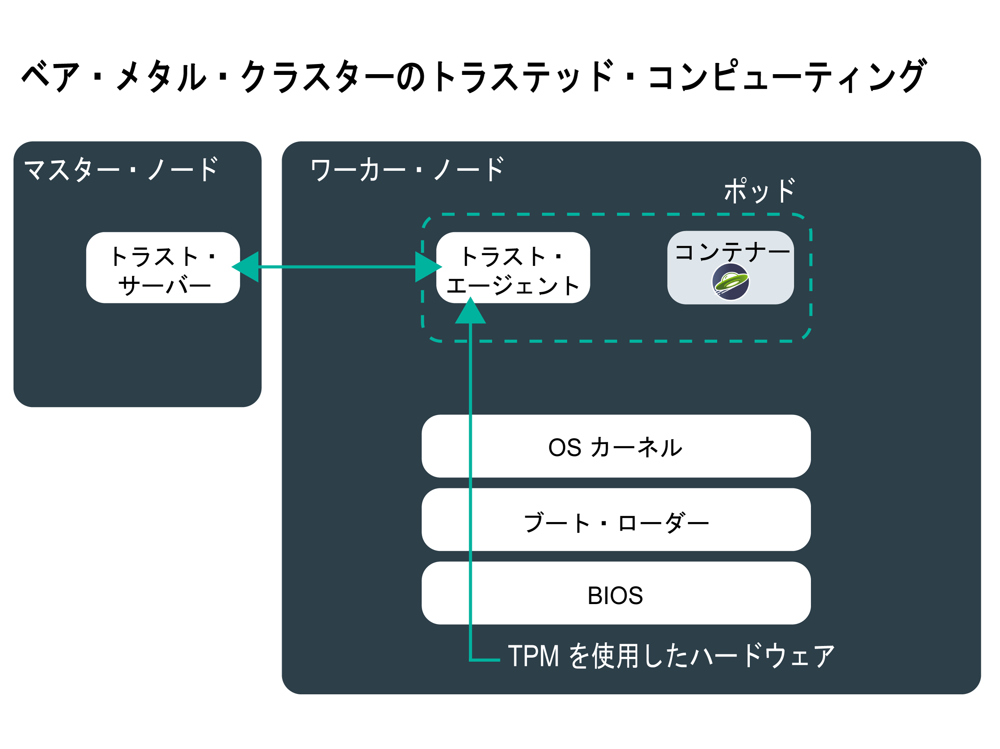
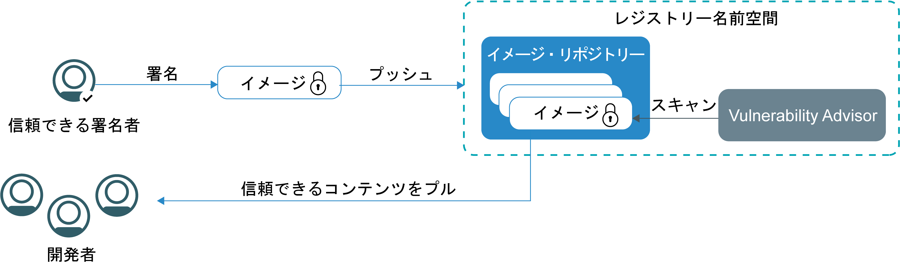
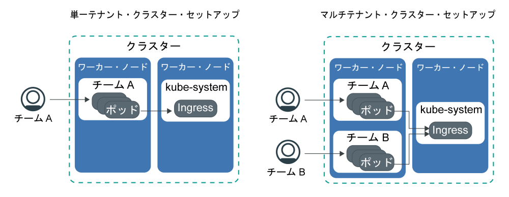

---

copyright:
  years: 2014, 2019
lastupdated: "2019-06-05"

keywords: kubernetes, iks

subcollection: containers

---

{:new_window: target="_blank"}
{:shortdesc: .shortdesc}
{:screen: .screen}
{:pre: .pre}
{:table: .aria-labeledby="caption"}
{:codeblock: .codeblock}
{:tip: .tip}
{:note: .note}
{:important: .important}
{:deprecated: .deprecated}
{:download: .download}
{:preview: .preview}

# {{site.data.keyword.containerlong_notm}}のセキュリティー
{: #security}

{{site.data.keyword.containerlong}} の標準装備のセキュリティー・フィーチャーをリスク分析とセキュリティー保護に使用できます。 これらのフィーチャーは、Kubernetes クラスター・インフラストラクチャーとネットワーク通信を保護し、コンピュート・リソースを分離し、インフラストラクチャー・コンポーネントとコンテナー・デプロイメントにおけるセキュリティー・コンプライアンスを確保するためのものです。
{: shortdesc}

## クラスターのセキュリティー脅威の概要
{: #threats}

クラスターをセキュリティー侵害から保護するためには、想定されるクラスターのセキュリティー脅威と、脆弱性の露出を減らすためにできる対策について理解しておく必要があります。
{: shortdesc}

企業のワークロードがパブリック・クラウドに移行され続けているために、ここ数年の間、クラウドのセキュリティーと、システム、インフラストラクチャー、データを攻撃から保護することが非常に重要になりました。 クラスターを構成する複数のコンポーネントのそれぞれが、悪意のある攻撃を受けるリスクに環境をさらす可能性を持っています。 これらのセキュリティーの脅威からクラスターを保護するには、すべてのクラスター・コンポーネント内で、{{site.data.keyword.containerlong_notm}} および Kubernetes の最新のセキュリティー機能や更新プログラムを適用する必要があります。

これらのコンポーネントには以下のものがあります。
- [Kubernetes API サーバーと etcd データ・ストア](#apiserver)
- [ワーカー・ノード](#workernodes)
- [ネットワーク](#network)
- [永続ストレージ](#storage)
- [モニタリングとロギング](#monitoring_logging)
- [コンテナー・イメージとレジストリー](#images_registry)
- [コンテナーの分離とセキュリティー](#container)
- [個人情報](#pi)

 

## Kubernetes API サーバーと etcd
{: #apiserver}

Kubernetes API サーバーと etcd は、Kubernetes マスターで実行される最も脆弱なコンポーネントです。 無許可のユーザーやシステムが Kubernetes API サーバーにアクセスできた場合、そのユーザーやシステムは、クラスターの設定変更、操作、あるいは乗っ取りによって、クラスターを悪意のある攻撃を受けるリスクにさらす可能性があります。
{: shortdesc}

Kubernetes API サーバーと etcd データ・ストアを保護するには、個人のユーザーと Kubernetes サービス・アカウントの両方に対して、Kubernetes API サーバーへのアクセスを保護し、制限する必要があります。

**Kubernetes API サーバーへのアクセスはどのように許可されますか?**  
デフォルトでは、Kubernetes は、API サーバーへのアクセス権限が付与されるためには、その前にすべての要求が次の複数のステージを通過する必要があります。

<ol><li><strong>認証:</strong> 登録済みのユーザーまたはサービス・アカウントの ID を検証します。</li><li><strong>許可:</strong> 認証済みのユーザーとサービス・アカウントが、必要と定められたクラスター・コンポーネントのみを利用および操作できるように、その権限を制限します。</li><li><strong>アドミッション・コントロール:</strong> Kubernetes API サーバーで要求を処理する前に、要求を検証または変更します。 Kubernetes の多くの機能は、正しく機能するためにアドミッション・コントローラーを必要とします。</li></ol>

**{{site.data.keyword.containerlong_notm}} はどのような方法で Kubernetes API サーバーと etcd データ・ストアを保護していますか?**  
次の図は、認証、許可、アドミッション・コントロール、Kubernetes マスターとワーカー・ノードの間のセキュア接続に対応するクラスターのデフォルトのセキュリティー設定を示しています。

<table>
<caption>Kubernetes API サーバーと etcd セキュリティー</caption>
  <thead>
  <th>セキュリティー機能</th>
  <th>説明</th>
  </thead>
  <tbody>
    <tr>
      <td>完全に管理される専用 Kubernetes マスター</td>
      <td>
{{site.data.keyword.containerlong_notm}} に含まれる Kubernetes クラスターはすべて、IBM が所有する IBM Cloud インフラストラクチャー (SoftLayer) アカウントで、IBM が管理する専用 Kubernetes マスターにより制御されます。 Kubernetes マスターは、他の IBM のお客様とは共用されない、以下の専用コンポーネントを使用してセットアップされます。

        <ul><li><strong>etcd データ・ストア:</strong> `サービス`、`デプロイメント`、`ポッド`などのクラスターのすべての Kubernetes リソースを保管します。 Kubernetes `ConfigMaps` および `Secrets` は、ポッドで実行されるアプリで使用できるように、キー値ペアとして保管されるアプリ・データです。 etcd のデータは Kubernetes マスターのローカル・ディスクに保管され、{{site.data.keyword.cos_full_notm}} にバックアップされます。 {{site.data.keyword.cos_full_notm}} に転送中のデータも保存されたデータも暗号化されています。 クラスターの [{{site.data.keyword.keymanagementservicelong_notm}} 暗号化を有効にする](/docs/containers?topic=containers-encryption#encryption)と、Kubernetes マスターのローカル・ディスク上の etcd データの暗号化を有効にできます。 以前のバージョンの Kubernetes を実行するクラスターでは、etcd データは IBM 管理の暗号化ディスクに保管され、毎日バックアップされます。 etcd データがポッドに送信されるときには、データの保護と保全性を確保するために、データが TLS で暗号化されます。</li>
          <li><strong>kube-apiserver:</strong> ワーカー・ノードから Kubernetes マスターへのすべてのクラスター管理要求のメインエントリー・ポイントとなります。 kube-apiserver は要求を検証して処理し、etcd データ・ストアに対する読み取り/書き込みを行うことができます。</li>
          <li><strong>kube-scheduler:</strong> ポッドをどこにデプロイするかを決定します。このとき、キャパシティーとパフォーマンスのニーズ、ハードウェアとソフトウェアのポリシー制約、アンチアフィニティー仕様、およびワークロード要件が考慮されます。 要件に合致するワーカー・ノードが見つからなければ、ポッドはクラスターにデプロイされません。</li>
          <li><strong>kube-controller-manager:</strong> レプリカ・セットをモニターし、対応するポッドを作成して、指定された状態を実現するためのコンポーネントです。</li>
          <li><strong>OpenVPN:</strong> {{site.data.keyword.containerlong_notm}} 固有のコンポーネントであり、Kubernetes マスターからワーカー・ノードへのすべての通信のためのセキュア・ネットワーク接続を提供します。 Kubernetes マスターとワーカー・ノードの間の通信はユーザーによって開始され、<code>kubectl</code> コマンド (<code>logs</code>、<code>attach</code>、<code>exec</code>、<code>top</code> など) を含んでいます。</li></ul></td>
    </tr>
    <tr>
    <td>IBM サイト信頼性エンジニア (SRE) による継続的なモニタリング</td>
    <td>Kubernetes マスター (すべてのマスター・コンポーネント、コンピュート・リソース、ネットワーキング・リソース、ストレージ・リソースを含む) は、IBM サイト信頼性エンジニア (SRE) によって継続的にモニターされます。 SRE は、最新のセキュリティー規格を適用し、悪意のあるアクティビティーを検出して対処し、{{site.data.keyword.containerlong_notm}} の信頼性と可用性を確保するための作業を行います。 </td>
    </tr>
    <tr>
      <td>TLS によるセキュア通信</td>
      <td>{{site.data.keyword.containerlong_notm}} を使用するユーザーは、資格情報を使用してサービスから認証を受ける必要があります。 認証を受けると、{{site.data.keyword.containerlong_notm}} が、Kubernetes API サーバーおよび etcd データ・ストアとの間の通信を暗号化する TLS 証明書を生成して、ワーカー・ノードと Kubernetes マスターの間のセキュアなエンドツーエンド通信を確立します。 これらの証明書は、クラスター間で共有されたり、Kubernetes マスター・コンポーネント間で共有されたりすることはありません。 </td>
    </tr>
    <tr>
      <td>ワーカー・ノードへの OpenVPN 接続</td>
      <td>Kubernetes は、<code>https</code> プロトコルを使用して Kubernetes マスターとワーカー・ノードの間の通信を保護しますが、デフォルトでは、ワーカー・ノードで認証は行われません。 この通信を保護するために、{{site.data.keyword.containerlong_notm}} は、クラスターの作成時に、Kubernetes マスターとワーカー・ノードの間の OpenVPN 接続を自動的にセットアップします。</td>
    </tr>
    <tr>
      <td>きめの細かいアクセス制御</td>
      <td>アカウント管理者は、{{site.data.keyword.Bluemix_notm}} の IAM (ID およびアクセス管理) を使用して [{{site.data.keyword.containerlong_notm}} の他のユーザーにアクセス権限を付与](/docs/containers?topic=containers-users#users)できます。 {{site.data.keyword.Bluemix_notm}} IAM は、{{site.data.keyword.Bluemix_notm}} プラットフォーム、{{site.data.keyword.containerlong_notm}}、およびアカウント内のすべてのリソースでセキュアな認証を提供します。 リソースにアクセスできるユーザーを制限し、正当なアクセス権を悪用したユーザーから被る損害を制限するためには、適切なユーザー役割と権限をセットアップすることが重要です。   ユーザーが実行できる一連の操作を決定する、以下の事前定義ユーザー役割の中から選択することができます。 <ul><li><strong>プラットフォーム役割:</strong> ユーザーが {{site.data.keyword.containerlong_notm}} で実行できるクラスターとワーカー・ノード関連の操作を決定します。</li><li><strong>インフラストラクチャー役割:</strong> ワーカー・ノード、VLAN、サブネットなどのインフラストラクチャー・リソースをオーダー、更新、または削除する権限を決定します。</li><li><strong>Kubernetes RBAC 役割:</strong> クラスターへのアクセスを許可されている場合に、ユーザーが実行できる `kubectl` コマンドを決定します。 RBAC 役割は、クラスターのデフォルトの名前空間に対して自動的にセットアップされます。 同じ RBAC 役割を他の名前空間で使用するためには、デフォルトの名前空間から RBAC 役割をコピーしてください。  </li></ul>   事前定義のユーザー役割を使用する代わりに、[インフラストラクチャー権限をカスタマイズ](/docs/containers?topic=containers-users#infra_access)したり、[独自の RBAC 役割をセットアップ](/docs/containers?topic=containers-users#rbac)したりして、よりきめの細かいアクセス制御を追加することもできます。 </td>
    </tr>
    <tr>
      <td>アドミッション・コントローラー</td>
      <td>アドミッション・コントローラーは、Kubernetes と {{site.data.keyword.containerlong_notm}} の特定の機能のために実装されています。 アドミッション・コントローラーにより、クラスター内で特定の操作を許可するかどうかを決定するポリシーを、クラスター内にセットアップできます。 ポリシーには、RBAC を使用してユーザーに割り当てた汎用権限に含まれている操作であっても、ユーザーがその操作を実行できなくなる条件を指定できます。 したがって、アドミッション・コントローラーは、Kubernetes API サーバーで API 要求が処理される前に適用されるセキュリティー層をクラスターに追加できます。    クラスターを作成すると、{{site.data.keyword.containerlong_notm}} は自動的に以下の [Kubernetes アドミッション・コントローラー ](https://kubernetes.io/docs/admin/admission-controllers/) を Kubernetes マスターにインストールします。これは、ユーザーが変更することはできません。 <ul>
      <li>`DefaultTolerationSeconds`</li>
      <li>`DefaultStorageClass`</li>
      <li>`GenericAdmissionWebhook`</li>
      <li>`Initializers` (Kubernetes 1.13 以前)</li>
      <li>`LimitRanger`</li>
      <li>`MutatingAdmissionWebhook`</li>
      <li>`NamespaceLifecycle`</li>
      <li>`NodeRestriction` (Kubernetes 1.14 以降)</li>
      <li>`PersistentVolumeLabel`</li>
      <li>[`PodSecurityPolicy`](/docs/containers?topic=containers-psp#ibm_psp)</li>
      <li>[`Priority`](/docs/containers?topic=containers-pod_priority#pod_priority) (Kubernetes 1.11 以降)</li>
      <li>`ResourceQuota`</li>
      <li>`ServiceAccount`</li>
      <li>`StorageObjectInUseProtection`</li>
      <li>`TaintNodesByCondition` (Kubernetes 1.12 以降)</li>
      <li>`ValidatingAdmissionWebhook`</li></ul> 
      [独自のアドミッション・コントローラーをクラスターにインストール ](https://kubernetes.io/docs/reference/access-authn-authz/extensible-admission-controllers/#admission-webhooks) したり、{{site.data.keyword.containerlong_notm}} に用意されているオプションのアドミッション・コントローラーから選択したりすることもできます。 <ul><li><strong>[Container Image Security Enforcer](/docs/services/Registry?topic=registry-security_enforce#security_enforce):</strong> このアドミッション・コントローラーを使用すると、Vulnerability Advisor ポリシーをクラスター内で適用して、脆弱なイメージからのデプロイメントをブロックできます。</li></ul> 
手動でインストールしたアドミッション・コントローラーが不要になった場合は、必ず、完全に削除してください。 アドミッション・コントローラーを完全に削除しておかないと、クラスターに対して実行する必要がある操作がすべてブロックされる可能性があります。
</td>
    </tr>
  </tbody>
</table>

**Kubernetes API サーバーを保護するために他に何ができますか?** 

クラスターをプライベート VLAN とパブリック VLAN に接続すると、{{site.data.keyword.containerlong_notm}} はパブリック・サービス・エンドポイントを通してクラスター・マスターとワーカー・ノードの間のセキュア OpenVPN 接続を自動的にセットアップします。 {{site.data.keyword.Bluemix_notm}} アカウント内で VRF が有効になっている場合は、代わりにプライベート・サービス・エンドポイントを通して、クラスター・マスターとワーカー・ノードのプライベート・ネットワーク経由の通信を許可できます。

サービス・エンドポイントにより、ワーカー・ノードとクラスター・ユーザーがクラスター・マスターにアクセスできる方法が決まります。
* パブリック・サービス・エンドポイントのみ: パブリック・ネットワーク経由のクラスター・マスターとワーカー・ノードの間のセキュア OpenVPN 接続が確立されます。 マスターはクラスター・ユーザーにパブリックにアクセスできます。
* パブリック・サービス・エンドポイントとプライベート・サービス・エンドポイント: 通信は、プライベート・サービス・エンドポイントを介するプライベート・ネットワークと、パブリック・サービス・エンドポイントを介するパブリック・ネットワークの両方を経由して確立されます。 ワーカーからマスターへのトラフィックをパブリック・エンドポイントとプライベート・エンドポイントに半分ずつルーティングすると、マスターからワーカーへの通信が、パブリック・ネットワークまたはプライベート・ネットワークの可能性のある障害から保護されます。 許可されたクラスター・ユーザーは、{{site.data.keyword.Bluemix_notm}} プライベート・ネットワークの中で作業している場合、または VPN 接続経由でプライベート・ネットワークに接続している場合に、プライベート・サービス・エンドポイントを介して、プライベートにマスターにアクセスできます。 そうでない場合、許可されたクラスター・ユーザーは、パブリック・サービス・エンドポイントを介してパブリックからマスターにアクセスできます。
* プライベート・サービス・エンドポイントのみ: プライベート・ネットワーク経由のマスターとワーカー・ノードの間の通信が確立されます。 クラスター・ユーザーがマスターにアクセスするには、{{site.data.keyword.Bluemix_notm}} プライベート・ネットワークの中で作業しているか、VPN 接続経由でプライベート・ネットワークに接続している必要があります。

サービス・エンドポイントについて詳しくは、[ワーカーとマスターおよびユーザーとマスターの間の通信](/docs/containers?topic=containers-plan_clusters#workeruser-master)を参照してください。

 

## ワーカー・ノード
{: #workernodes}

ワーカー・ノードには、アプリを構成するデプロイメントとサービスが保持されます。 パブリック・クラウドでワークロードをホストする場合は、不正なユーザーやソフトウェアにアクセス、変更、監視されないようにアプリを保護する必要があります。
{: shortdesc}

**ワーカー・ノードの所有者は誰ですか? ワーカー・ノードの保護はユーザーの責任ですか?**  
ワーカー・ノードの所有権は、作成するクラスターのタイプによって異なります。 フリー・クラスター内のワーカー・ノードは、IBM の所有する IBM Cloud インフラストラクチャー (SoftLayer) アカウントにプロビジョンされます。 ワーカー・ノードにアプリをデプロイすることはできますが、ワーカー・ノードで設定を変更したり、追加のソフトウェアをインストールしたりすることはできません。 フリー・クラスターは容量も {{site.data.keyword.containerlong_notm}} 機能も制限されているので、実動ワークロードの実行に使用しないでください。 実動ワークロードには標準クラスターを使用することを検討してください。

標準クラスター内のワーカー・ノードは、ユーザーの {{site.data.keyword.Bluemix_notm}} パブリック・アカウントまたは専用アカウントに関連付けられているIBM Cloud インフラストラクチャー (SoftLayer) アカウントにプロビジョンされます。 ワーカー・ノードはユーザー・アカウントに専用のものです。このためユーザーは、ワーカー・ノードの OS および {{site.data.keyword.containerlong_notm}} コンポーネントに最新のセキュリティー更新とパッチが適用されるように、ワーカー・ノードに対するタイムリーな更新を要求する責任があります。

`ibmcloud ks worker-update` [コマンド](/docs/containers?topic=containers-cli-plugin-kubernetes-service-cli#cs_worker_update)を定期的 (毎月など) に使用して、更新とセキュリティー・パッチをオペレーティング・システムに導入し、Kubernetes バージョンを更新してください。 更新プログラムが利用可能になると、{{site.data.keyword.Bluemix_notm}} コンソールまたは CLI (`ibmcloud ks clusters` コマンドや `ibmcloud ks workers --cluster <cluster_name>` コマンドなど) でマスターやワーカー・ノードの情報を表示したときに通知されます。 最新のセキュリティー・パッチが含まれる完全なワーカー・ノードのイメージとして、ワーカー・ノードの更新が IBM により提供されています。 更新を適用するには、ワーカー・ノードのイメージを再作成し、新しいイメージを使ってワーカー・ノードを再ロードする必要があります。 ワーカー・ノードの再ロード時に、root ユーザーの鍵は自動的に交替されます。
{: important}

**ワーカー・ノードのセットアップはどのようなものですか?** 
以下の図は、悪意のある攻撃からワーカー・ノードを保護するために、すべてのワーカー・ノードにセットアップされているコンポーネントを示しています。

この図には、ワーカー・ノードとの間のセキュアなエンドツーエンド通信を保証するコンポーネントは含まれていません。 詳しくは、[ネットワーク・セキュリティー](#network)を参照してください。
{: note}

<table>
<caption>ワーカー・ノード・セキュリティーのセットアップ</caption>
  <thead>
  <th>セキュリティー機能</th>
  <th>説明</th>
  </thead>
  <tbody>
    <tr><td>CIS 準拠の Linux イメージ</td><td>すべてのワーカー・ノードには、Center of Internet Security (CIS) が公開しているベンチマークを実装した Ubuntu オペレーティング・システムがセットアップされています。 Ubuntu オペレーティング・システムは、ユーザーもマシンの所有者も変更できません。 現在の Ubuntu バージョンを確認するには、<code>kubectl get nodes -o wide</code> を実行します。 IBM は、社内と社外のセキュリティー顧問チームと協力して、セキュリティー・コンプライアンスにおける潜在的な脆弱性と取り組んでいます。 オペレーティング・システムのセキュリティー更新およびパッチは、{{site.data.keyword.containerlong_notm}} で提供されるので、ユーザーがインストールを実行してワーカー・ノードをセキュアに保つ必要があります。
{{site.data.keyword.containerlong_notm}} では、ワーカー・ノードに Ubuntu Linux カーネルを使用します。 {{site.data.keyword.containerlong_notm}} ではすべての種類の Linux ディストリビューションに基づいてコンテナーを実行できます。 Ubuntu Linux カーネルで実行するコンテナー・イメージがサポートされているかどうかは、コンテナー・イメージ・ベンダーに確認します。
</td></tr>
    <tr>
    <td>サイト信頼性エンジニア (SRE) による継続的なモニタリング </td>
    <td>ワーカー・ノードにインストールされた Linux イメージは、脆弱性およびセキュリティー・コンプライアンスの問題を検出するために、IBM サイト信頼性エンジニア (SRE) によって継続的にモニターされます。 SRE は、脆弱性に対処するため、ワーカー・ノードのためのセキュリティー・パッチとフィックスパックを作成します。 ワーカー・ノードとその上で実行されるアプリのセキュアな環境を確保するため、そうしたパッチが用意されたら必ず適用してください。</td>
    </tr>
    <tr>
  <td>コンピュートの分離</td>
  <td>ワーカー・ノードは特定のクラスターの専用であり、他のクラスターのワークロードをホストすることはありません。 標準クラスターを作成するときには、ワーカー・ノードを[物理マシン (ベア・メタル) としてプロビジョンするか、共有または専用の物理ハードウェア上で実行される仮想マシンとしてプロビジョンするか](/docs/containers?topic=containers-planning_worker_nodes#planning_worker_nodes)を選択できます。 フリー・クラスターのワーカー・ノードは、IBM が所有する IBM Cloud インフラストラクチャー (SoftLayer) アカウント内の仮想共有ノードとして自動的にプロビジョンされます。</td>
</tr>
<tr>
<td>ベア・メタルをデプロイするオプション</td>
<td>ワーカー・ノードを (仮想サーバー・インスタンスではなく) ベア・メタル物理サーバーにプロビジョンすることを選択した場合は、メモリーや CPU などのコンピュート・ホストを、より細かく制御できます。 このセットアップには、ホスト上で稼働する仮想マシンに物理リソースを割り振る仮想マシン・ハイパーバイザーは含まれません。 むしろ、ベア・メタル・マシンのすべてのリソースがこのワーカーの専用であるため、リソースを共有したりパフォーマンスを低下させたりする「ノイジー・ネイバー」について心配する必要がありません。 ベア・メタル・サーバーはお客様専用であり、そのすべてのリソースをクラスターに使用できます。</td>
</tr>
<tr>
  <td id="trusted_compute">トラステッド・コンピューティングのオプション</td>
    <td>トラステッド・コンピューティングをサポートするベア・メタルにクラスターをデプロイした場合は、[トラストを有効にする](/docs/containers?topic=containers-cli-plugin-kubernetes-service-cli#cs_cluster_feature_enable)ことができます。 トラステッド・コンピューティングをサポートするクラスター内の各ベア・メタル・ワーカー・ノード (クラスターに将来追加するノードも含む) の Trusted Platform Module (TPM) チップが有効になります。 したがって、トラストを有効にした後に、クラスターのトラストを無効にすることはできません。 トラスト・サーバーがマスター・ノードにデプロイされ、トラスト・エージェントがワーカー・ノードにポッドとしてデプロイされます。 ワーカー・ノードが始動すると、トラスト・エージェント・ポッドがプロセスの各ステージをモニターします。
ハードウェアはトラストのルートに位置し、TPM を使用して測定値を送信します。 TPM は、このプロセス全体で測定データの伝送を保護するために使用する暗号鍵を生成します。 トラスト・エージェントは、始動プロセスの中で (TPM ハードウェアと対話する BIOS ファームウェアから、ブート・ローダーや OS カーネルまでを含む) 各コンポーネントの測定値をトラスト・サーバーに渡します。 その後、トラスト・エージェントはそれらの測定値をトラスト・サーバーで予想された値と比較して、始動が有効なものであったかどうかを確認します。 トラステッド・コンピューティングのプロセスでは、アプリケーションなどのワーカー・ノード内の他のポッドはモニターされません。

例えば、不正なユーザーがシステムにアクセスし、データを収集するためのロジックを追加して OS カーネルを変更した場合、トラスト・エージェントは、その変更を検出し、そのノードを信頼できないものとしてマークします。トラステッド・コンピューティングを使用すると、ワーカー・ノードが改ざんされていないことを検証できます。

    
トラステッド・コンピューティングは、選ばれたベア・メタル・マシン・タイプでのみ使用できます。 例えば、`mgXc` GPU フレーバーではトラステッド・コンピューティングはサポートされません。

    

</td>
  </tr>
    <tr>
  <td id="encrypted_disk">暗号化されたディスク</td>
    <td>デフォルトでは、すべてのワーカー・ノードは、2 つのローカル SSD、AES 256 ビット暗号化データ・パーティションでプロビジョンされます。 最初のパーティションには、ワーカー・ノードのブートに使用され、暗号化されていないカーネル・イメージが含まれています。 2 番目のパーティションは、コンテナー・ファイル・システムを保持し、LUKS 暗号キーを使用してアンロックされます。 各 Kubernetes クラスター内の各ワーカー・ノードには、独自の固有の LUKS 暗号キーがあり、{{site.data.keyword.containerlong_notm}} によって管理されます。 クラスターを作成する際やワーカー・ノードを既存のクラスターに追加する際に、この鍵は安全にプルされてから、暗号化ディスクのアンロック後に破棄されます。 
暗号化はディスク入出力のパフォーマンスに影響します。 高性能のディスク入出力が必要なワークロードの場合、暗号化を有効/無効にした両方のクラスターをテストし、暗号化をオフにするかどうかの決定に役立ててください。
</td>
      </tr>
    <tr>
      <td>エキスパート AppArmor ポリシー</td>
      <td>すべてのワーカー・ノードには、ブートストラッピング時にワーカー・ノードにロードされる [AppArmor ](https://wiki.ubuntu.com/AppArmor) プロファイルによって適用されるセキュリティー・ポリシーおよびアクセス・ポリシーがセットアップされています。 AppArmor プロファイルは、ユーザーもマシンの所有者も変更できません。 </td>
    </tr>
    <tr>
      <td>SSH の無効化</td>
      <td>デフォルトでは、クラスターを悪意のある攻撃から保護するために、ワーカー・ノード上の SSH アクセスは無効になっています。 SSH アクセスが無効な場合、クラスターへのアクセスは Kubernetes API サーバーを経由するように強制されます。 Kubernetes API サーバーでは、すべての要求が、クラスター内で実行される前に、認証、許可、およびアドミッション制御モジュールで設定されたポリシーに照らして検査される必要があります。     標準クラスターを使用していて、ワーカー・ノードに追加機能をインストールしたい場合、すべてのワーカー・ノードで実行するアクションについては、{{site.data.keyword.containerlong_notm}} で提供されているアドオンを使用するか [Kubernetes デーモン・セット ](https://kubernetes.io/docs/concepts/workloads/controllers/daemonset/) を使用するかを選択できます。 1 回限りのアクションを実行する必要がある場合は、[Kubernetes ジョブ ](https://kubernetes.io/docs/concepts/workloads/controllers/jobs-run-to-completion/) を使用します。</td>
    </tr>
  </tbody>
  </table>

 

## ネットワーク
{: #network}
会社のネットワークを保護する従来の方法は、ファイアウォールをセットアップして、アプリに対する不要なネットワーク・トラフィックをブロックすることでした。 この方法は今でも有効ですが、悪意のある攻撃の多くは、割り当てられた権限を悪用した内部関係者や許可ユーザーによるものであることが調査で示されています。
{: shortdesc}

ネットワークを保護し、ネットワークへのアクセスを許可されたユーザーから被る可能性がある損害の範囲を制限するために、ワークロードを可能な限り分離し、公開するアプリとワーカー・ノードの数を制限する必要があります。

**デフォルトではどのようなネットワーク・トラフィックがクラスターに許可されますか?** 
すべてのコンテナーが、[事前定義の Calico ネットワーク・ポリシー設定](/docs/containers?topic=containers-network_policies#default_policy)で保護されます。この設定は、クラスターの作成時にすべてのワーカー・ノードに構成されます。 デフォルトでは、すべてのワーカー・ノードに対して、すべてのアウトバウンド・ネットワーク・トラフィックが許可されます。 インバウンド・ネットワーク・トラフィックはブロックされます。ただし、例外として、IBM がネットワーク・トラフィックをモニターするためのポートや、IBM が Kubernetes マスターのセキュリティー更新を自動的にインストールするためのポートがいくつか開かれています。 Kubernetes マスターからワーカー・ノードの kubelet へのアクセスは、OpenVPN トンネルによって保護されます。 詳しくは、[{{site.data.keyword.containerlong_notm}} アーキテクチャー](/docs/containers?topic=containers-ibm-cloud-kubernetes-service-technology)を参照してください。

インターネットからの着信ネットワーク・トラフィックを許可する場合は、[NodePort サービス、ネットワーク・ロード・バランサー (NLB)、または Ingress アプリケーション・ロード・バランサー (ALB)](/docs/containers?topic=containers-cs_network_planning#external) を使用してアプリを公開する必要があります。  

{: #network_segmentation}
**ネットワーク・セグメンテーションとは何ですか? どうすればクラスターにセットアップできますか?**  
ネットワーク・セグメンテーションとは、1 つのネットワークを複数のサブネットワークに分割する方式を表すものです。 組織内の特定のグループからアクセスできるように、アプリと関連データをグループ化できます。 あるサブネットワーク内で実行されるアプリは、別のサブネットワーク内のアプリを認識することも、アクセスすることもできません。 ネットワーク・セグメンテーションは、内部関係者やサード・パーティー製ソフトウェアに提供されているアクセスも制限するので、さまざまな悪意のあるアクティビティーを制限できます。   

{{site.data.keyword.containerlong_notm}} には、ワーカー・ノードのために高品質のネットワーク・パフォーマンスとネットワークの分離を実現する IBM Cloud インフラストラクチャー (SoftLayer) VLAN が用意されています。 VLAN では、ワーカー・ノードとポッドをまとめたグループが同じ物理ワイヤーに接続されているかのように構成されます。 VLAN は各 {{site.data.keyword.Bluemix_notm}} アカウントに専用のものであり、複数の IBM カスタマーの間で共有されることはありません。 1 つのクラスターに複数の VLAN がある場合、同じ VLAN 上に複数のサブネットがある場合、または複数ゾーン・クラスターがある場合は、IBM Cloud インフラストラクチャー (SoftLayer) アカウントに対して[仮想ルーター機能 (VRF)](/docs/infrastructure/direct-link?topic=direct-link-overview-of-virtual-routing-and-forwarding-vrf-on-ibm-cloud#overview-of-virtual-routing-and-forwarding-vrf-on-ibm-cloud) を有効にして、ワーカー・ノードがプライベート・ネットワーク上で相互に通信できるようにする必要があります。 VRF を有効にするには、[IBM Cloud インフラストラクチャー (SoftLayer) のアカウント担当者に連絡してください](/docs/infrastructure/direct-link?topic=direct-link-overview-of-virtual-routing-and-forwarding-vrf-on-ibm-cloud#how-you-can-initiate-the-conversion)。 VRF の有効化が不可能または不要な場合は、[VLAN スパンニング](/docs/infrastructure/vlans?topic=vlans-vlan-spanning#vlan-spanning)を有効にしてください。 この操作を実行するには、**「ネットワーク」>「ネットワーク VLAN スパンニングの管理」**で設定する[インフラストラクチャー権限](/docs/containers?topic=containers-users#infra_access)が必要です。ない場合は、アカウント所有者に対応を依頼してください。 VLAN スパンニングが既に有効になっているかどうかを確認するには、`ibmcloud ks vlan-spanning-get<region>` [コマンド](/docs/containers?topic=containers-cli-plugin-kubernetes-service-cli#cs_vlan_spanning_get)を使用します。

自分のアカウントに対して VRF または VLAN スパンニングを有効にすると、クラスターに関するネットワーク・セグメンテーションが削除されます。

自分のアカウントに対して VRF または VLAN スパンニングを有効にした状況でネットワーク・セグメンテーションを実現するために取れる方法を、以下の表で確認してください。

|セキュリティー機能|説明|
|-------|----------------------------------|
|Calico を使用してカスタム・ネットワーク・ポリシーをセットアップする|組み込みの Calico インターフェースを使用して、ワーカー・ノード用に[カスタムの Calico ネットワーク・ポリシーをセットアップ](/docs/containers?topic=containers-network_policies#network_policies)できます。 例えば、特定のネットワーク・インターフェース上で、特定のポッドまたはサービスのネットワーク・トラフィックを許可またはブロックすることができます。 カスタムのネットワーク・ポリシーをセットアップするには、[<code>calicoctl</code> CLI をインストールする](/docs/containers?topic=containers-network_policies#cli_install)必要があります。|
|IBM Cloud インフラストラクチャー (SoftLayer) ネットワーク・ファイアウォールのサポート|{{site.data.keyword.containerlong_notm}} は、すべての [ IBM Cloud インフラストラクチャー (SoftLayer) ファイアウォール・オファリング ](https://www.ibm.com/cloud-computing/bluemix/network-security) に対応しています。 {{site.data.keyword.Bluemix_notm}} Public では、カスタム・ネットワーク・ポリシーをファイアウォールにセットアップして、標準クラスターのための専用ネットワーク・セキュリティーを設定し、ネットワーク侵入を検出して対処することができます。 例えば、ファイアウォールとして機能し、不要なトラフィックをブロックするように [Virtual Router Appliance](/docs/infrastructure/virtual-router-appliance?topic=virtual-router-appliance-about-the-vra) をセットアップできます。 ファイアウォールをセットアップする場合は、マスター・ノードとワーカー・ノードが通信できるように、地域ごとに[必要なポートと IP アドレスを開く](/docs/containers?topic=containers-firewall#firewall)必要もあります。|
{: caption="ネットワーク・セグメンテーションのオプション" caption-side="top"}

**外部攻撃の対象領域を減らすために他に何ができますか?** 
公開するアプリやワーカー・ノードの数が多いほど、外部からの悪意のある攻撃を防止するために必要なステップの数も多くなります。 以下の表で、アプリとワーカー・ノードをプライベートにするために取れる方法を確認してください。

|セキュリティー機能|説明|
|-------|----------------------------------|
|公開するアプリの数を制限する|デフォルトでは、クラスター内で実行されるアプリとサービスには、公共のインターネットからはアクセスできません。 アプリを公開するか、それとも、プライベート・ネットワークでしかアプリとサービスにアクセスできないようにするかを選択できます。 アプリとサービスをプライベートのままにする場合は、組み込みのセキュリティー機能を利用してワーカー・ノードとポッドの間のセキュアな通信を確保できます。 サービスとアプリを公共のインターネットに公開する場合は、[NLB と Ingress ALB のサポート](/docs/containers?topic=containers-cs_network_planning#external)を活用してサービスを安全に公開することができます。 必要なサービスのみが公開されていることを確認し、公開されているアプリのリストを定期的に調べて、それらがまだ有効であることを確認してください。 |
|ワーカー・ノードをプライベートのままにする|クラスターを作成すると、すべてのクラスターはプライベート VLAN に自動的に接続されます。 ワーカー・ノードに割り当てられるプライベート IP アドレスは、プライベート VLAN によって決定されます。 ワーカー・ノードをプライベートのままにするには、ワーカー・ノードをプライベート VLAN だけに接続します。 フリー・クラスターのプライベート VLAN は IBM が管理し、標準クラスターのプライベート VLAN は IBM Cloud インフラストラクチャー (SoftLayer) アカウントのユーザーが管理します。   <strong>注意:</strong>  Kubernetes マスターと通信するため、および {{site.data.keyword.containerlong_notm}} を正しく機能させるためには、[特定の URL および IP アドレス](/docs/containers?topic=containers-firewall#firewall_outbound)へのパブリック接続を構成する必要があることに注意してください。 このパブリック接続をセットアップするために、[仮想ルーター・アプライアンス](/docs/infrastructure/virtual-router-appliance?topic=virtual-router-appliance-about-the-vra)などのファイアウォールをワーカー・ノードの前面に構成して、それらの URL および IP アドレスへのネットワーク・トラフィックを有効にすることができます。|
|公共のインターネットとエッジ・ノードの接続を制限する|デフォルトでは、すべてのワーカー・ノードが、アプリ・ポッドおよび関連するロード・バランサーまたは Ingress ポッドを受け入れるように構成されています。 ワーカー・ノードに[エッジ・ノード](/docs/containers?topic=containers-edge#edge)のラベルを付けて、ロード・バランサーと Ingress ポッドがそれらのワーカー・ノードにだけデプロイされるようにすることができます。 さらに、[ワーカー・ノードにテイントを適用](/docs/containers?topic=containers-edge#edge_workloads)して、アプリ・ポッドがエッジ・ノードにスケジュールされることを防止できます。 エッジ・ノードを使用することで、クラスター内の少数のワーカー・ノード上にネットワーク・ワークロードを分離し、クラスター内の他のワーカー・ノードはプライベートのままにすることができます。|
{: caption="プライベート・サービスとワーカー・ノードのオプション" caption-side="top"}

**クラスターをオンプレミス・データ・センターに接続する場合はどうすればよいですか?** 
ワーカー・ノードとアプリをオンプレミス・データ・センターに接続するには、[strongSwan サービス、仮想ルーター・アプライアンス、または Fortigate Security Appliance を使用して VPN IPsec エンドポイントを](/docs/containers?topic=containers-vpn#vpn)構成します。

### LoadBalancer サービスと Ingress サービス
{: #network_lb_ingress}

ネットワーク・ロード・バランサー (NLB) および Ingress アプリケーション・ロード・バランサー (ALB) ネットワーク・サービスを使用して、アプリをパブリック・インターネットまたは外部プライベート・ネットワークに接続できます。 バックエンド・アプリのセキュリティー要件を満たすため、またはクラスター内を移動するトラフィックを暗号化するために使用できる、NLB と ALB の次のオプション設定を確認してください。
{: shortdesc}

**セキュリティー・グループを使用してクラスターのネットワーク・トラフィックを管理できますか?**  
NLB サービスおよび Ingress ALB サービスを使用する場合は、[Calico および Kubernetes ポリシー](/docs/containers?topic=containers-network_policies)を使用して、クラスターの発信/着信ネットワーク・トラフィックを管理してください。 IBM Cloud インフラストラクチャー (SoftLayer) の[セキュリティー・グループ](/docs/infrastructure/security-groups?topic=security-groups-about-ibm-security-groups#about-ibm-security-groups)は使用しないでください。 IBM Cloud インフラストラクチャー (SoftLayer) のセキュリティー・グループは、単一仮想サーバーのネットワーク・インターフェースに適用され、ハイパーバイザー・レベルでトラフィックをフィルタリングします。 しかし、セキュリティー・グループは、{{site.data.keyword.containerlong_notm}} が NLB の IP アドレスの管理に使用する VRRP プロトコルをサポートしていません。 NLB の IP を管理する VRRP プロトコルが存在しない場合、NLB サービスおよび Ingress ALB サービスは正しく機能しません。 NLB サービスや Ingress ALB サービスを使用せずに、ワーカー・ノードをパブリックから完全に分離する場合は、セキュリティー・グループを使用できます。

**クラスター内のソース IP はどのような方法で保護できますか?**  
バージョン 2.0 の NLB では、クライアント要求のソース IP アドレスはデフォルトで保持されます。 ただし、バージョン 1.0 の NLB およびすべての Ingress ALB では、クライアント要求のソース IP アドレスが保持されません。 アプリへのクライアント要求がクラスターに送信されると、その要求は、NLB 1.0 または ALB のポッドに転送されます。 ロード・バランサー・サービス・ポッドと同じワーカー・ノードにアプリ・ポッドが存在しない場合、NLB または ALB は異なるワーカー・ノード上のアプリ・ポッドに要求を転送します。 パッケージのソース IP アドレスは、アプリ・ポッドが実行されているワーカー・ノードのパブリック IP アドレスに変更されます。

クライアントの IP を保持すると、例えば、アプリ・サーバーがセキュリティーやアクセス制御ポリシーを適用する必要がある場合などに役に立ちます。 クライアント要求の元のソース IP アドレスを保持するには、[バージョン 1.0 の NLB](/docs/containers?topic=containers-loadbalancer#node_affinity_tolerations) または [Ingress ALB](/docs/containers?topic=containers-ingress#preserve_source_ip) のソース IP 保持を有効化します。

**TLS を使用してトラフィックを暗号化する方法を教えてください。**  
Ingress サービスは、トラフィック・フロー内の次の 2 つのポイントで TLS 終端処理を実行します。
* [到着時にパッケージを復号する](/docs/containers?topic=containers-ingress#public_inside_2): デフォルトでは、Ingress ALB は、クラスター内のアプリへの HTTP ネットワーク・トラフィックのロード・バランシングを行います。 着信 HTTPS 接続のロード・バランシングも行う場合は ALB でその機能を構成できます。つまり、ネットワーク・トラフィックを復号し、復号した要求をクラスター内で公開されているアプリに転送するように構成します。 IBM 提供の Ingress サブドメインを使用する場合は、IBM 提供の TLS 証明書を使用できます。 カスタム・ドメインを使用する場合は、独自の TLS 証明書を使用して TLS 終端を管理できます。
* [アップストリーム・アプリに転送される前にパッケージを再暗号化する](/docs/containers?topic=containers-ingress_annotation#ssl-services): ALB は、トラフィックをアプリに転送する前に HTTPS 要求を復号します。 HTTPS を必要とするアプリがあり、それらのアップストリームのアプリに転送する前にトラフィックを暗号化する必要がある場合は、`ssl-services` アノテーションを使用できます。 アップストリーム・アプリが TLS を処理できる場合は、片方向認証または双方向認証の TLS シークレットに含まれる証明書をオプションで提供できます。

サービス間通信を保護するには、[Istio の双方向 TLS 認証 ](https://istio.io/docs/concepts/security/mutual-tls/) を使用できます。 Istio は Kubernetes などのクラウド・オーケストレーション・プラットフォームでマイクロサービス・ネットワーク (サービス・メッシュともいう) の接続、保護、管理、モニターを行うための方法を開発者に提供するオープン・ソース・サービスです。

 

## 永続ストレージ
{: #storage}

永続ストレージをプロビジョニングしてクラスターのデータを保管する場合は、ファイル共有またはブロック・ストレージに保管されるときに、データは自動的に暗号化されます。追加費用はかかりません。 この暗号化には、スナップショットと複製されたストレージが含まれます。
{: shortdesc}

特定のストレージ・タイプのデータの暗号化方法について詳しくは、以下のリンクを参照してください。
- [NFS ファイル・ストレージ](/docs/infrastructure/FileStorage?topic=FileStorage-encryption#encryption)
- [ブロック・ストレージ](/docs/infrastructure/BlockStorage?topic=BlockStorage-encryption#block-storage-encryption-at-rest)  

[{{site.data.keyword.cloudant}} NoSQL DB](/docs/services/Cloudant?topic=cloudant-getting-started#getting-started) などの {{site.data.keyword.Bluemix_notm}} データベース・サービスを使用して、データをクラスター外の管理対象データベースに保存することもできます。 クラウド・データベース・サービスを使用して保管されたデータには、すべてのクラスター、ゾーン、地域からアクセスできます。 IBM Cloudant NoSQL DB のセキュリティー関連情報については、[サービス資料](/docs/services/Cloudant/offerings?topic=cloudant-security#security)を参照してください。

 

## モニタリングとロギング
{: #monitoring_logging}

クラスター内で悪意のある攻撃を検出するために重要なことは、クラスター内で発生するメトリックとすべてのイベントを適切にモニターしてロギングすることです。 モニタリングとロギングにより、クラスターの容量とアプリによるリソースの利用状況も理解できるため、それに応じてアプリのダウン時間の発生を防ぐ計画を立てることができます。
{: shortdesc}

**IBM は個々の利用者のクラスターをモニターしますか?** 
IBM は、プロセス・レベルのサービス妨害 (DOS) 攻撃を抑制して対処するために、すべての Kubernetes マスターを継続的にモニターしています。 {{site.data.keyword.containerlong_notm}} は、Kubernetes マスターがデプロイされたすべてのノードにおいて、Kubernetes および OS 固有のセキュリティー修正で検出された脆弱性を自動的にスキャンします。 脆弱性が見つかった場合、{{site.data.keyword.containerlong_notm}} はユーザーに代わって自動的に修正を適用し、脆弱性を解決して、マスター・ノードが確実に保護されるようにします。  

**どのような情報がログに記録されますか?** 
標準クラスターの場合は、さまざまなソースのあらゆるクラスター関連イベントについて、{{site.data.keyword.loganalysislong_notm}} や別の外部サーバーへの[ログ転送をセットアップ](/docs/containers?topic=containers-health#logging)し、ログのフィルタリングおよび分析を行うことができます。 それらのソースには、次のログが含まれます。

- **コンテナー**: STDOUT または STDERR に書き込まれるログ。
- **アプリ**: アプリ内の特定のパスに書き込まれるログ。
- **ワーカー**: /var/log/syslog および /var/log/auth.log に送られる Ubuntu オペレーティング・システムのログ。
- **Kubernetes API サーバー**: Kubernetes API サーバーに送られるすべてのクラスター関連操作が、監査のためにログに記録されます。これには、時刻、ユーザー、および対象リソースが含まれます。 詳しくは、[Kubernetes 監査ログ ](https://kubernetes.io/docs/tasks/debug-application-cluster/audit/) を参照してください。
- **Kubernetes システム・コンポーネント**: `kubelet`、`kube-proxy`、および `kube-system` 名前空間で実行されるその他のコンポーネントからのログ。
- **Ingress**: クラスターへのネットワーク・トラフィックを管理する Ingress アプリケーション・ロード・バランサー (ALB) のログ。

ログに記録するクラスターのイベントと、ログを転送する場所を選択できます。 悪意のあるアクティビティーを検出し、クラスターの正常性を確認するには、継続的にログを分析する必要があります。

**クラスターの正常性とパフォーマンスはどのような方法でモニターできますか?** 
クラスターのコンポーネントとコンピュート・リソース (CPU やメモリーの使用量など) をモニターすることで、クラスターの容量とパフォーマンスを確認できます。 {{site.data.keyword.containerlong_notm}} は、標準クラスターのメトリックを自動的に {{site.data.keyword.monitoringlong}} に送信するので、[それらを Grafana で表示して分析](/docs/containers?topic=containers-health#view_metrics)できます。

{{site.data.keyword.containerlong_notm}} 詳細ページや Kubernetes ダッシュボードなどの組み込みツールを使用することも、Prometheus、Sysdig、LogDNA、Weave Scope、その他の[サード・パーティー統合をセットアップする](/docs/containers?topic=containers-supported_integrations#health_services)こともできます。

ホスト・ベースの侵入検知システム (HIDS) とセキュリティー・イベント・ログ・モニタリング (SELM) をセットアップするには、[Twistlock ](https://www.twistlock.com/) や [Sysdig Falco プロジェクト ](https://sysdig.com/opensource/falco/) などの、クラスターやコンテナー化アプリをモニターして侵入や誤用を検出するように設計されているサード・パーティー・ツールをインストールします。 Sysdig Falco は別個のツールなので、クラスターで IBM 提供の [Sysdig アドオン](/docs/services/Monitoring-with-Sysdig/tutorials?topic=Sysdig-kubernetes_cluster#kubernetes_cluster)をインストールすることを選択しても組み込まれません。  

**クラスターで発生したイベントはどのような方法で監査できますか?** 
[{{site.data.keyword.containerlong_notm}} クラスター内に {{site.data.keyword.cloudaccesstraillong}} をセットアップすることができます](/docs/containers?topic=containers-at_events#at_events)。 詳しくは、[{{site.data.keyword.cloudaccesstrailshort}} の資料](/docs/services/cloud-activity-tracker?topic=cloud-activity-tracker-activity_tracker_ov#activity_tracker_ov)を参照してください。

**クラスター内のトラストを有効にする方法にはどのようなものがありますか?**  
セキュリティー機能が豊富な環境でコンテナー化アプリをデプロイできるように、{{site.data.keyword.containerlong_notm}} はクラスター・コンポーネント向けの機能をデフォルトで数多く提供します。 クラスターの信頼レベルを高めて、より確実に、意図したことだけがクラスターで行われるようにします。 以下の図に示すように、さまざまな方法でクラスターに信頼を実装できます。

1.  **トラステッド・コンピューティングを使用した {{site.data.keyword.containerlong_notm}}**: ベア・メタル・ワーカー・ノードでは、トラストを有効にすることができます。 トラスト・エージェントがハードウェアの始動処理をモニターして変更を報告するので、ベア・メタル・ワーカー・ノードが改ざんされていないことを検証できます。 トラステッド・コンピューティングを使用すると、検証されたベア・メタル・ホストにコンテナーをデプロイして、信頼できるハードウェア上でワークロードを実行できます。 GPU などの一部のベアメタル・マシンでは、トラステッド・コンピューティングがサポートされないことに注意してください。 [トラステッド・コンピューティングの仕組みについて詳しくは、こちらをご覧ください](#trusted_compute)。

2.  **イメージのコンテンツの信頼**: {{site.data.keyword.registryshort_notm}} でコンテンツの信頼を有効にして、イメージの完全性を確保します。 信頼できるコンテンツを使用する場合は、信頼できるイメージとしてイメージに署名できるユーザーを制御できます。 信頼できる署名者がイメージをレジストリーにプッシュすると、ユーザーはその署名付きのコンテンツをプルして、イメージのソースを確認できます。 詳しくは、[Signing images for trusted content](/docs/services/Registry?topic=registry-registry_trustedcontent#registry_trustedcontent) を参照してください。

3.  **Container Image Security Enforcement (ベータ)**: コンテナー・イメージを検証してからデプロイできるように、アドミッション・コントローラーとカスタム・ポリシーを作成します。 Container Image Security Enforcement を使用すると、イメージのデプロイ元を制御できるうえに、イメージが [Vulnerability Advisor](/docs/services/va?topic=va-va_index) ポリシーまたは[コンテンツの信頼](/docs/services/Registry?topic=registry-registry_trustedcontent#registry_trustedcontent)要件を満たしていることを確認できます。 設定したポリシーをデプロイメントが満たしていなければ、Security Enforcement によって、クラスターの変更が防止されます。 詳しくは、[Enforcing container image security (beta)](/docs/services/Registry?topic=registry-security_enforce#security_enforce) を参照してください。

4.  **コンテナー脆弱性スキャナー**: デフォルトでは Vulnerability Advisor が、{{site.data.keyword.registryshort_notm}} に保管されているイメージをスキャンします。 クラスター内で実行されているライブ・コンテナーの状況を確認するには、コンテナー・スキャナーをインストールします。 詳しくは、[コンテナー・スキャナーのインストール](/docs/services/va?topic=va-va_index#va_install_container_scanner)を参照してください。

5.  **Security Advisor (プレビュー) によるネットワーク分析**: {{site.data.keyword.Bluemix_notm}} Security Advisor を使用すると、Vulnerability Advisor や {{site.data.keyword.cloudcerts_short}} などの {{site.data.keyword.Bluemix_notm}} サービスから得られるセキュリティー分析データを集約できます。 クラスターで Security Advisor を有効にすると、不審な着信および発信ネットワーク・トラフィックに関するレポートを参照できます。 詳しくは、[Network Analytics](/docs/services/security-advisor?topic=security-advisor-setup-network#setup-network) を参照してください。 インストールするには、[Setting up monitoring of suspicious clients and server IP addresses for a Kubernetes cluster](/docs/services/security-advisor?topic=security-advisor-setup-network#setup-network) を参照してください。

6.  **{{site.data.keyword.cloudcerts_long_notm}} **: [TLS ありでカスタム・ドメインを使用してアプリを公開する](/docs/containers?topic=containers-ingress#ingress_expose_public)場合は、TLS 証明書を {{site.data.keyword.cloudcerts_short}} に保管できます。 既に期限切れか、まもなく期限切れになる証明書も {{site.data.keyword.security-advisor_short}} ダッシュボードに報告されます。 詳しくは、[{{site.data.keyword.cloudcerts_short}} 概説](/docs/services/certificate-manager?topic=certificate-manager-getting-started#getting-started)を参照してください。

 

## イメージとレジストリー
{: #images_registry}

すべてのデプロイメントは、アプリを実行するコンテナーの起動方法についての命令が入ったイメージをベースとします。 これらの命令には、コンテナー内のオペレーティング・システムや、インストールする追加のソフトウェアが含まれています。 アプリを保護するには、イメージを保護し、イメージの整合性を確保する検査を実施する必要があります。
{: shortdesc}

**パブリック・レジストリーまたはプライベート・レジストリーのどちらを使用してイメージを保管すべきでしょうか?**  
Docker Hub などのパブリック・レジストリーは、Docker イメージおよび Kubernetes の入門として最初のコンテナー化アプリをクラスター内に作成する時に使用できます。 ただし、エンタープライズ・アプリケーションの場合は、クラスターを悪意のあるイメージから保護するために、知らないレジストリーや信頼できないレジストリーの使用は避けてください。 {{site.data.keyword.registryshort_notm}} で提供されているようなプライベート・レジストリーにイメージを保管し、レジストリーへのアクセスとプッシュ可能なイメージ・コンテンツを制御してください。

**イメージの脆弱性検査はなぜ大切ですか?**  
悪意のある攻撃のほとんどがソフトウェアの既知の脆弱性や脆弱なシステム構成を利用したものであることが調査で示されています。 イメージからコンテナーをデプロイすると、そのコンテナーは、イメージに記述されている OS と追加バイナリーを使用して起動します。 仮想マシンや物理マシンを保護する場合と同様に、不正なユーザーによるアクセスからアプリを保護するために、コンテナー内で使用する OS とバイナリーの既知の脆弱性を除去する必要があります。  

アプリを保護するために、以下の範囲に対応することを検討してください。

1. **ビルド・プロセスの自動化と許可の制限**:  
ソース・コードからコンテナー・イメージをビルドするプロセスを自動化して、ソース・コードの変化型や欠陥が除かれるようにします。 このビルド・プロセスを CI/CD パイプラインに統合すると、指定したセキュリティー検査に合格した場合に限りイメージがスキャンされてビルドされるようにすることができます。 開発者が機密性の高いイメージにホット・フィックスを適用しないようにするには、ビルド・プロセスへのアクセス権がある組織内の人の数を制限します。

2. **イメージを実稼働環境にデプロイする前にスキャンする:**  
必ず、コンテナーをデプロイする前に、すべてのイメージをスキャンしてください。 例えば、{{site.data.keyword.registryshort_notm}} を使用する場合には、すべてのイメージは、名前空間にプッシュする際に脆弱性が自動的にスキャンされます。 脆弱性が検出された場合は、脆弱性を除去することを検討するか、そのイメージのデプロイメントをブロックします。 脆弱性のモニターと除去を担当している組織内の人物またはチームを見つけます。 組織の構造に応じて、この人はセキュリティー、操作、またはデプロイメントのチームの一員である可能性があります。 [Container Image Security Enforcement](/docs/services/Registry?topic=registry-security_enforce#security_enforce) などのアドミッション・コントローラーを使用して、脆弱性チェックに合格していないイメージからのデプロイメントをブロックし、[コンテント・トラスト](/docs/services/Registry?topic=registry-registry_trustedcontent#registry_trustedcontent)を有効にして、イメージをコンテナー・レジストリーにプッシュできるようになる前に、信頼できる署名者がそのイメージを承認する必要があるようにします。

3. **実行中のコンテナーを定期的にスキャンする:**  
脆弱性検査に合格したイメージからコンテナーをデプロイした場合でも、時間が経つと、コンテナー内で実行されるオペレーティング・システムやバイナリーが脆弱になる場合があります。 アプリを保護するには、脆弱性を検出して対処できるように、実行中のコンテナーを定期的にスキャンする必要があります。 アプリによっては、セキュリティーをさらに強化するために、脆弱性が検出された場合に脆弱なコンテナーを停止するプロセスを確立することもできます。

**イメージとデプロイメント・プロセスの保護に {{site.data.keyword.registryshort_notm}} はどのように役立ちますか?**  

<table>
<caption>イメージとデプロイメントのセキュリティー</caption>
  <thead>
    <th>セキュリティー機能</th>
    <th>説明</th>
  </thead>
  <tbody>
    <tr>
      <td>{{site.data.keyword.registryshort_notm}} の保護された Docker プライベート・イメージ・リポジトリー</td>
      <td>IBM によってホストおよび管理されている、マルチテナントで可用性が高く、スケーラブルなプライベート・イメージ・レジストリー内に独自の Docker [イメージ・リポジトリー](/docs/services/Registry?topic=registry-getting-started#getting-started)をセットアップします。 このレジストリーを使用することで、Docker イメージを作成して安全に保管し、クラスター・ユーザー間で共有することができます。   コンテナー・イメージを使用する際の[個人情報の保護](/docs/containers?topic=containers-security#pi)の詳細を確認してください。</td>
    </tr>
    <tr>
      <td>信頼できるコンテンツのイメージのみをプッシュする</td>
      <td>イメージ・リポジトリーで[コンテンツの信頼性](/docs/services/Registry?topic=registry-registry_trustedcontent#registry_trustedcontent)を有効にして、イメージの完全性を確保します。 信頼できるコンテンツを使用する場合は、信頼できるイメージとしてイメージに署名して特定のレジストリー名前空間にプッシュできる人を制限できます。 信頼できる署名者がイメージをレジストリー名前空間にプッシュすると、ユーザーはその署名付きのコンテンツをプルして、イメージの提供者と完全性を確認できます。</td>
    </tr>
    <tr>
      <td>脆弱性の自動スキャン</td>
      <td>{{site.data.keyword.registryshort_notm}}を使用する際、[Vulnerability Advisor](/docs/services/va?topic=va-va_index#va_registry_cli) に標準装備のセキュリティー・スキャンを利用できます。 レジストリー名前空間にプッシュされるどのイメージも、CentOS、Debian、Red Hat、および Ubuntu の既知の問題のデータベースに基づいて、脆弱性が自動的にスキャンされます。 脆弱性が検出されると、それらを解決してイメージの保全性とセキュリティーを確保する方法を Vulnerability Advisor が提示します。</td>
    </tr>
    <tr>
      <td>脆弱なイメージや信頼されないユーザーからのデプロイメントのブロック</td>
      <td>コンテナー・イメージを検証してからデプロイできるように、アドミッション・コントローラーとカスタム・ポリシーを作成します。 [Container Image Security Enforcement](/docs/services/Registry?topic=registry-security_enforce#security_enforce) を使用すると、イメージのデプロイ元を制御できるうえに、イメージが Vulnerability Advisor ポリシーまたはコンテンツの信頼要件を満たしていることを確認できます。 設定したポリシーをデプロイメントが満たしていない場合、アドミッション・コントローラーはクラスターへのデプロイメントをブロックします。</td>
    </tr>
    <tr>
      <td>コンテナーのライブ・スキャン</td>
      <td>実行中のコンテナーの脆弱性を検出するには、[ibmcloud-container-scanner](/docs/services/va?topic=va-va_index#va_install_container_scanner) をインストールします。 イメージの場合と同様に、すべてのクラスター名前空間でコンテナーをモニターして脆弱性を検出するように、コンテナー・スキャナーをセットアップできます。 脆弱性が検出されたら、ソース・イメージを更新し、コンテナーを再デプロイしてください。</td>
    </tr>
  </tbody>
  </table>

 

## コンテナーの分離とセキュリティー
{: #container}

**Kubernetes 名前空間とは何ですか? なぜ使用する必要があるのですか?**  
Kubernetes 名前空間は、クラスターを仮想的に分割して、デプロイメントの分離や、ワークロードをクラスターに移行したいユーザー・グループの分離を可能にするための手段です。 名前空間を使用することで、ワーカー・ノード間でリソースを編成できます。また、複数ゾーン・クラスターの場合にはゾーン間で編成できます。  

すべてのクラスターには、次の名前空間がセットアップされています。
- **default:** 特定の名前空間を定義していない場合にすべてがデプロイされる名前空間。 Viewer、Editor、または Operator プラットフォーム役割を割り当てられたユーザーは、default 名前空間にアクセスできますが、`kube-system`、`ibm-system`、`ibm-cloud-cert` の名前空間にはアクセスできません。
- **kube-system および ibm-system:** この名前空間は、クラスターを管理するために Kubernetes および {{site.data.keyword.containerlong_notm}} に必要なデプロイメントおよびサービスを保持します。 クラスター管理者はこの名前空間を使用して、複数の名前空間にまたがって Kubernetes リソースを使用可能にすることができます。
- **ibm-cloud-cert:** この名前空間は、{{site.data.keyword.cloudcerts_long_notm}} に関連するリソースに使用されます。
- **kube-public:** この名前空間には、クラスターで認証を受けなくても、すべてのユーザーがアクセスできます。 クラスターをセキュリティー侵害の危険にさらす可能性があるため、この名前空間にリソースをデプロイする場合は慎重に行ってください。

クラスター管理者は、必要に応じて、クラスター内に追加の名前空間をセットアップし、カスタマイズすることができます。

クラスター内に存在するすべての名前空間について、名前空間へのアクセスを制限し、デプロイできる対象を制御するための適切な [RBAC ポリシー](/docs/containers?topic=containers-users#rbac)をセットアップし、適切な [ リソース割り当て量 ](https://kubernetes.io/docs/concepts/policy/resource-quotas/) と[制限範囲 ](https://kubernetes.io/docs/tasks/administer-cluster/memory-default-namespace/) を設定してください。
{: important}

**単一テナントまたはマルチテナントのどちらのクラスターをセットアップすべきでしょうか?**  
単一テナント・クラスターでは、クラスターでワークロードを実行する必要があるユーザー・グループごとに、クラスターを 1 つ作成します。 通常、そのチームが、クラスターを管理し、正しく構成して保護します。 マルチテナント・クラスターは、複数の名前空間を使用してテナントとそのワークロードを分離します。

単一テナント・クラスターとマルチテナント・クラスターでは、ワークロードの分離レベルは同じで、コストもほぼ同じです。 どちらが適しているかは、クラスター内でワークロードを実行する必要があるチームの数、各チームのサービス要件、サービスのサイズによって異なります。

複雑なサービスを実行するチームが多く、チームごとにクラスターのライフサイクルを制御する必要がある場合には、単一テナント・クラスターが適しているでしょう。 クラスターの更新時期や、クラスターにデプロイできるリソースを自由に決められます。 クラスターを管理するには、デプロイメントに応じたクラスターの容量とセキュリティーを確保するために、Kubernetes とインフラストラクチャーに関する詳細な知識が必要であることに注意してください。  

マルチテナント・クラスターには、別々の名前空間で同じサービス名を使用できるという利点があります。これは、名前空間を使用して実稼働環境、ステージング環境、開発環境を分離する場合に便利です。 マルチテナント・クラスターの場合、クラスターの操作や管理に必要な人の数は少なくて済みますが、多くの場合、以下の範囲の複雑さが増すことになります。

- **アクセス:** 複数の名前空間をセットアップする場合は、名前空間ごとに適切な RBAC ポリシーを構成して、確実にリソースを分離する必要があります。 RBAC ポリシーは複雑であるため、Kubernetes に関する詳細な知識が必要です。
- **リソース制限の計算:** サービスをクラスターにデプロイしてアプリを実行するために必要なリソースがすべてのチームに与えられるように、すべての名前空間に[リソース割り当て量](https://kubernetes.io/docs/concepts/policy/resource-quotas/) をセットアップする必要があります。 リソース割り当て量により、デプロイ可能な Kubernetes リソースの数、それらのリソースで消費できる CPU とメモリーの量など、名前空間のデプロイメント制約が決まります。 割り当て量を設定すると、ユーザーは、そのデプロイメントにリソース要求と制限を含める必要があります。
- **共有クラスター・リソース:** 1 つのクラスターで複数のテナントを実行する場合は、Ingress アプリケーション・ロード・バランサー (ALB) や使用可能なポータブル IP アドレスなどの一部のクラスター・リソースが、複数のテナント間で共有されます。 小規模なサービスは、クラスター内の大規模なサービスと競合する場合、共有リソースを使用できないことがあります。
- **更新:** 同時に実行できる Kubernetes API のバージョンは 1 つだけです。 1 つのクラスター内で実行されるすべてのアプリは、そのアプリを所有しているチームにかかわらず、現行の Kubernetes API バージョンに準拠していなければなりません。 クラスターを更新する場合は、すべてのチームが新しい Kubernetes API バージョンに切り替える準備ができていること、また、新しい Kubernetes API バージョンで動作するようにアプリが更新されていることを確認する必要があります。 つまり、個々のチームが、実行する Kubernetes API のバージョンを制御することはほぼできないということです。
- **クラスター・セットアップの変更:** クラスターのセットアップを変更したり、ワークロードを新しいワーカー・ノードにスケジュール変更したりする場合は、その変更をテナント間にロールアウトする必要があります。 このロールアウトには、単一テナント・クラスターの場合よりも多くの調整とテストが必要です。
- **コミュニケーション・プロセス:** 複数のテナントを管理する場合は、クラスターに問題があるときやサービス用に追加のリソースが必要になったときに問い合わせる場所がテナントにわかるように、コミュニケーション・プロセスをセットアップすることを検討してください。 このコミュニケーション・プロセスには、クラスターのセットアップのあらゆる変更や更新予定をテナントに知らせることも含まれます。

**コンテナーを保護するために他に何ができますか?**

|セキュリティー機能|説明|
|-------|----------------------------------|
|特権コンテナーの数を制限する|コンテナーは、他のプロセスから分離された独立した Linux プロセスとしてコンピュート・ホスト上で実行されます。 他の Linux プロセス、ホスト・ファイル・システム、ホスト・デバイスを保護するために、コンテナーの中で root 権限を持つユーザーでも、コンテナーの外では権限が制限されます。 一部のアプリは、ホスト・ファイル・システムへのアクセス権限や高い権限がないと、正しく機能しません。 コンテナーを特権モードで実行すると、コンピュート・ホストで実行されるプロセスと同じアクセス権限を、そのコンテナーに許可できます。
特権コンテナーが乗っ取られると、クラスターおよび基礎コンピュート・ホストに甚大な損害がもたらされる可能性があることに注意してください。 特権モードで実行するコンテナーの数を制限し、高い権限がなくても実行できるようにアプリの構成を変更することを検討してください。 特権コンテナーをクラスター内で実行できないようにするには、カスタムの[ポッド・セキュリティー・ポリシー](/docs/containers?topic=containers-psp#customize_psp)をセットアップすることを検討してください。
|
|コンテナー用の CPU とメモリーの制限を設定する|どのコンテナーも、正常に起動して実行し続けるためには、特定の量の CPU とメモリーが必要です。 コンテナーで使用できる CPU とメモリーの量を制限するために、コンテナーに対して [Kubernetes リソース要求およびリソース制限 ](https://kubernetes.io/docs/concepts/configuration/manage-compute-resources-container/) を定義できます。 CPU とメモリーの制限を設定しない場合、コンテナーがビジーになると、使用可能なすべてのリソースが使用されます。 このようなリソースの高消費により、ワーカー・ノード上の他のコンテナーに、リソースが不足して正常に起動または実行できないという影響が生じる可能性があります。また、これはワーカー・ノードをサービス妨害攻撃のリスクにさらします。|
|OS セキュリティー設定をポッドに適用する|[<code>securityContext</code> セクション ](https://kubernetes.io/docs/tasks/configure-pod-container/security-context/) をポッド・デプロイメントに追加して、ポッドまたはポッド内の特定のコンテナーに Linux 固有のセキュリティー設定を適用することができます。 セキュリティー設定には、エントリー・ポイント・スクリプトなどのスクリプトをコンテナー内で実行するユーザー ID とグループ ID、またはボリューム・マウント・パスを所有するユーザー ID とグループ IP に対する制御が含まれます。   <strong>ヒント:</strong> <code>securityContext</code> を使用して <code>runAsUser</code> ユーザー ID または <code>fsGroup</code> グループ ID を設定する場合は、[永続ストレージを作成](/docs/containers?topic=containers-block_storage#add_block)するときにブロック・ストレージを使用することを検討してください。 NFS ストレージは <code>fsGroup</code> をサポートしません。<code>runAsUser</code> は、ポッド・レベルではなくコンテナー・レベルで設定する必要があります。 |
|ポリシー駆動の認証を実施する|サービスや API へのアクセスを制御できる Ingress アノテーションをデプロイメントに追加できます。 {{site.data.keyword.appid_short_notm}} と宣言セキュリティーを使用して、ユーザー認証とトークンの検証を確認できます。 |
{: caption="その他のセキュリティー保護" caption-side="top"}

 

## 個人情報の保管
{: #pi}

Kubernetes リソースおよびコンテナー・イメージ内の個人情報のセキュリティーを確保する責任を持ちます。 個人情報には、自分の名前、住所、電話番号、E メール・アドレス、および自分自身や顧客、その他の人を特定したり、連絡を取ったり、居場所を見つけたりすることができるその他の情報が含まれます。
{: shortdesc}

<dl>
  <dt>Kubernetes シークレットを使用した個人情報の保管</dt>
  <dd>個人情報を保持するように設計された Kubernetes リソースにのみ個人情報を保管します。 例えば、Kubernetes 名前空間、デプロイメント、サービス、または構成マップの名前に自分の名前を使用しないでください。 適切な保護と暗号化を行うには、代わりに <a href="/docs/containers?topic=containers-encryption#secrets">Kubernetes シークレット</a>に個人情報を保管してください。</dd>

  <dt>Kubernetes `imagePullSecret` を使用したイメージ・レジストリー資格情報の保管</dt>
  <dd>個人情報をコンテナー・イメージまたはレジストリー名前空間に保管しないでください。 適切な保護と暗号化を行うには、代わりに、レジストリー資格情報は <a href="/docs/containers?topic=containers-images#other">Kubernetes `imagePullSecrets`</a> に保管し、その他の個人情報は <a href="/docs/containers?topic=containers-encryption#secrets">Kubernetes シークレット</a>に保管してください。 個人情報がイメージの前のレイヤーに保管されている場合、イメージを削除するだけではこの個人情報を削除できない場合があることに注意してください。</dd>
  </dl>

シークレットのために暗号化をセットアップするには、[{{site.data.keyword.keymanagementserviceshort}} を使用した Kubernetes シークレットの暗号化](/docs/containers?topic=containers-encryption#keyprotect)を参照してください。

SGX 対応のベアメタル・ワーカー・ノードでは、[{{site.data.keyword.datashield_short}} (ベータ版) サービス](/docs/services/data-shield?topic=data-shield-getting-started#getting-started)を使用して、使用中のデータを暗号化できます。 保存されたデータや流れているデータに対して暗号化が機能する方法と同様に、{{site.data.keyword.datashield_short}} と統合された Fortanix Runtime Encryption によって、鍵、データ、アプリが外的脅威や内的脅威から保護されます。 この種の脅威には、悪質な内部関係者、クラウド・プロバイダー、OS レベルのハッキング、ネットワーク侵入者が含まれる場合があります。

## Kubernetes のセキュリティー情報
{: #security_bulletins}

Kubernetes で脆弱性が検出されると、Kubernetes は CVE をセキュリティー情報にリリースして、ユーザーに通知し、脆弱性に対処するためにユーザーが取る必要のある処置について説明します。 {{site.data.keyword.containerlong_notm}} ユーザーや {{site.data.keyword.Bluemix_notm}} プラットフォームに影響のある Kubernetes のセキュリティー情報は、[{{site.data.keyword.Bluemix_notm}} のセキュリティー情報](https://cloud.ibm.com/status?component=containers-kubernetes&selected=security)で公開されています。

一部の CVE では、{{site.data.keyword.containerlong_notm}} 内の定期的な[クラスター更新プロセス](/docs/containers?topic=containers-update#update)の一部としてインストールできる、Kubernetes バージョンの最新パッチ更新が必要になります。 悪意のある攻撃からクラスターを保護するには、適時にセキュリティー・パッチを適用するようにしてください。 セキュリティー・パッチの内容に関する情報については、[バージョンの変更ログ](/docs/containers?topic=containers-changelog#changelog)を参照してください。
